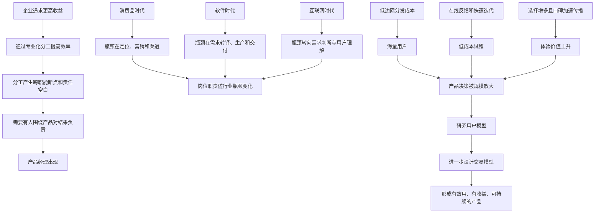

## 1. 本章要回答的问题

“产品经理”在不同公司里可能指完全不同的工作。有人负责需求，有人负责项目，有人负责运营增长，还有人承担接近业务负责人的职责。如果只按日常任务定义产品经理，很容易得到互相矛盾的答案。

本章因此没有直接列岗位职责，而是先回答几个更根本的问题：

1. 企业为什么需要产品经理这个岗位？
2. 为什么消费品、软件和互联网企业中的产品经理差异很大？
3. 为什么互联网时代显著抬高了产品经理的地位？
4. 产品经理到底通过什么活动创造价值？
5. 为什么“理解用户”只是合格线，“设计交易”才是进阶方向？

本章最重要的分析方法是：**不从职位名称推断职责，而从企业分工、行业约束和价值创造瓶颈推断职责。**

## 2. 一句话结论

产品经理不是一组固定技能的名称，而是企业为了提高分工效率、围绕产品协调资源并对结果负责而产生的角色；在互联网时代，信息分发成本、用户规模、迭代速度和体验价值发生结构性变化，使得“发现正确需求、理解用户行为、权衡多方利益”成为这一角色最重要的价值来源。

## 3. 本章论证地图

---

## 4. 产品经理为何会出现

### 4.1 根本原因：优化企业分工

作者给出的起点是：一个职业能够诞生并长期存在，必然是因为它改善了企业分工，并最终提高了企业收益。

这背后的推理如下：

1. 企业规模扩大后，会把研发、生产、营销、销售、渠道等工作拆给不同团队。
2. 专业化分工提升了单个环节的效率，却也让每个团队只对自己的局部目标负责。
3. 一个产品要成功，必须穿过多个职能环节；任何一个环节把它放在低优先级，都可能成为整体瓶颈。
4. 如果没有一个角色持续从产品整体出发配置优先级、协调资源、承担结果，局部最优就可能导致整体失败。
5. 因此，企业需要一个围绕特定产品或品牌负责的人，产品经理岗位由此产生。

这里隐含了一个重要判断：**产品经理的价值不在于完成某种标准动作，而在于修补专业化分工造成的责任空白，并找到当前系统中最影响产品结果的瓶颈。**

### 4.2 宝洁案例：从职能低优先级到品牌负责人

产品经理职位最早起源于宝洁。卡玫尔香皂与宝洁原有的象牙皂相似，但销售表现不佳。问题并不一定出在产品质量上，而是卡玫尔由原有职能团队兼管：

- 对各职能部门而言，成熟的象牙皂更能影响自己的绩效。
- 处于试验阶段的卡玫尔自然被放到较低优先级。
- 产品要依次经过多个部门，只要其中一个环节投入不足，整体都会受阻。
- 当所有部门都把它当作次要任务时，没有任何人真正对它的市场结果负责。

麦克·艾尔洛埃提出“一个人负责一个品牌”，让这个人的最高优先级与品牌成败一致。这个制度改变解决的不是某个香皂功能，而是**责任、目标和资源优先级不一致**的问题。

由此形成的早期产品经理，本质上是品牌产品经理。因为当时香皂等快消品在生产技术和质量上难以形成巨大差异，竞争的关键更偏向品牌定位、营销和渠道，所以产品经理主要在这些环节创造价值。

### 4.3 这一案例说明了什么

宝洁案例不能被简单理解成“每个产品都必须配一个产品经理”。更准确的结论是：

- 当产品跨越多个专业职能时，需要明确整体结果的责任主体。
- 岗位权责应与要解决的瓶颈相匹配。
- 产品经理的具体职责由产业结构决定，不由职位名称决定。
- 允许不同品牌在公司内部竞争，也是一种用市场反馈改善资源配置的机制。

---

## 5. 产品经理角色的历史演化

### 5.1 三个时代的对比

| 时代 | 主要产品形态 | 关键约束或稀缺资源 | 产品经理主要工作 | 主要价值来源 |
|---|---|---|---|---|
| 消费品时代 | 标准化实体商品 | 产品易同质化，市场触达和品牌认知更稀缺 | 定位、营销、渠道、品牌经营 | 让产品被认识、被选择、被购买 |
| 软件时代 | 以企业软件为主 | 合格工程师和按时交付能力稀缺 | 明确客户需求、转化成功能、推进研发和交付 | 管理生产，满足付费客户的明确要求 |
| 互联网时代 | 在线信息、软件和服务 | 用户注意力、正确需求判断、复杂关系权衡更关键 | 研究用户、定义产品、快速迭代、设计体验和交易机制 | 判断正确方向并持续创造用户价值 |

这张表背后的规律是：**在不同技术和市场条件下，最稀缺、最能改善结果的环节不同，产品经理的重心也随之迁移。**

### 5.2 软件时代：从品牌经营转向生产管理

20 世纪 90 年代个人电脑普及，企业软件快速发展。多数软件公司面向企业客户，需求通常由付费客户明确提出。产品经理的典型工作流程是：

1. 与销售一起拜访客户。
2. 收集客户明确提出的需求。
3. 把需求转化为软件功能和研发任务。
4. 协调工程师，保证按时上线和交付。

在供给不足、选择有限的市场中，客户更关注功能可用和按时交付，企业未必有动力追求极致体验。于是项目推进和生产管理比深度用户洞察更容易创造直接收益。

随着软件公司规模扩大，相关职责进一步分化：

| 角色 | 主要职责 |
|---|---|
| 产品市场经理 | 面向市场研究用户与需求 |
| 产品经理 | 把需求转化为产品功能和解决方案 |
| 项目经理 | 协调资源并保证项目按时交付 |

这种分化再次说明，所谓“产品经理应该做什么”没有脱离组织和行业的统一答案。

### 5.3 互联网时代：岗位边界扩张与认知混乱

互联网早期，优秀人才和高薪岗位仍更偏向工程师。后来，一批企业创始人强调自己的产品经理角色，“产品经理”逐渐与创造产品、定义方向和改变世界联系起来。

移动互联网爆发后，大量 App 需要被快速生产。市场缺少成熟人才，于是只要能掌握基础产品知识和原型工具，新人也可以进入产品岗位。这造成两个同时存在的现象：

- 公众把乔布斯、马化腾等承担企业级决策的人视为产品经理代表。
- 组织也把大量只承担局部执行任务的新人称为产品经理。

两类人的决策范围、资源权力、风险责任完全不同，却共享同一个职位名称，因此行业对产品经理的职责和能力产生了长期混淆。

移动互联网进入成熟期后，新产品和新增岗位减少，工具和通用经验逐渐同质化。工作多年以后，竞争更依赖天赋、性格、综合判断力、实践机会与机遇，而不只是会不会画原型、写文档。

---

## 6. 为什么互联网产品经理不一样

作者把互联网时代的结构性变化归纳为三个方面。这三者不是表面趋势，而是会改变企业收益函数和岗位价值的底层条件。

## 6.1 特性一：信息复制分发的边际成本极低，用户规模巨大

### 概念

边际成本是每多生产或服务一个单位所增加的成本。传统商品每增加一份供给，通常都要增加原料、制造、运输和库存；在线信息产品增加一个用户时，复制和分发一份信息的成本可以非常低。

### 推理链

1. 互联网把信息转化为可通过网络即时传输的字节。
2. 复制、更新和分发信息不再依赖手工抄写、印刷、光盘或线下经销体系。
3. 产品多服务一个用户的边际成本大幅下降。
4. 很多信息产品还可以免费使用，进一步降低用户进入门槛。
5. 只要产品具有足够用户价值，就可能在短时间获得千万乃至上亿用户。
6. 用户更容易搜索、比较和传播产品信息，竞争加剧并产生头部集中。
7. 大规模产品逐渐具有平台或生态属性，决策需要考虑多类用户及长期平衡。

### 对产品经理的影响

- 一个很小的产品决策会被巨大用户规模放大。
- 改善一点体验可能产生巨大总收益，错误也可能造成巨大总损失。
- 产品经理不能只优化单个页面，还要理解生态、外部性和多方利益。
- 头部集中意味着“方向是否正确”的价值高于局部执行效率。

### 需要注意的边界

低边际成本不等于零成本。服务器、带宽、内容版权、风控、客服、合规和组织协作仍会产生大量成本。这个结论更准确的用法是：数字产品的复制分发成本相对传统商品显著降低，因而更容易形成规模效应。

## 6.2 特性二：快速迭代、数据和 A/B 测试

### 为什么快速迭代降低了岗位门槛

传统产品从需求判断到制造、分销，再到获得用户反馈，可能需要数月或数年。试错成本高，所以企业更依赖有多年经验的人预判结果。

在线产品则形成了更短的闭环：

$$
提出假设 \rightarrow 发布改动 \rightarrow 收集行为数据 \rightarrow 验证假设 \rightarrow 再次迭代
$$

当一次试验的成本和时间下降，企业就不必要求产品经理在发布前做到极高的预测准确率。多年行业经验和技术背景不再是所有岗位的必要前提，年轻人也可以通过连续实践快速学习。

### A/B 测试的作用

A/B 测试让两个版本尽量只保留一个关键变量的差异，再比较不同用户组的行为结果。它把一部分产品决策从意见争论转化为可观测的实验问题。

其价值包括：

- 降低验证产品假设的成本。
- 使用真实行为而非口头态度作为证据。
- 支持大规模、连续的小步迭代。
- 让部分产品工作科学化和标准化。

“千人千面”则进一步利用用户历史行为和标签，为不同用户分发不同内容，并根据反馈持续优化模型。淘宝相较线下零售可以获得更丰富、更及时的行为数据，因此迭代效率更高。

### 作者的警告：门槛降低不等于上限降低

A/B 测试容易衡量，也就容易被快速普及甚至过度使用。只会执行测试，也可能在局部岗位上取得合格绩效，但它不能代替以下能力：

- 提出值得验证的问题。
- 识别实验无法覆盖的长期影响。
- 理解指标背后的用户动机。
- 处理不能随机试验的伦理、民生和生态问题。
- 在多目标冲突中做出价值权衡。

因此，快速迭代降低的是产品经理的入行门槛，而海量用户和复杂生态反而抬高了能力上限。越接近高阶决策，越需要心理学、经济学、管理学和实践判断，而不能把决策外包给实验工具。

> 笔记辨析：原书 OCR 将 PMF 展开为 `product marketing fit`，通行概念通常是 `product-market fit`，即“产品与市场匹配”。

## 6.3 特性三：体验设计的价值增大

### 为什么体验在互联网时代更值钱

互联网同时增强了用户的信息获取能力、表达能力和切换能力：

1. 用户可以更容易比较多个产品。
2. 软件和在线服务通常持续运行，用户与产品高频交互。
3. 用户评价可以通过社交媒体快速传播。
4. 产品切换成本在不少场景中降低，用户选择权增加。
5. 一个体验改进可以作用于千万或上亿用户，总价值被规模放大。
6. 好体验带来的口碑与坏案例带来的负面影响都会加速扩散。

作者将需求与体验共同发挥作用称为“双击效应”：产品首先要满足真实需求，同时还要以足够好的体验让用户愿意选择并持续使用。

### 体验不是产品的全部

本章特别反对把产品经理简化为“体验设计者”。体验的作用之一是降低用户交易成本，例如减少操作、认知、等待和不确定性，但一个产品还必须回答：

- 是否满足了值得满足的需求？
- 企业能否从中获得收益？
- 多方参与者是否愿意持续交易？
- 体验提升的成本是否低于它创造的增量价值？

所以“体验越好越正确”并不成立。体验只是效用与成本组合的一部分，仍要放进完整交易中权衡。

---

## 7. 产品经理的四大工作职能

作者将产品定义为由人加工、有用户并且可以被交易的商品或服务。一个产品通常要经过需求、生产、销售三个环节；产品经理还要横向协调参与这些环节的人，因此形成四类职能。

## 7.1 需求：定义产品

核心问题是：**产品到底满足谁在什么情境下的什么需求？**

需求来自用户，不能仅靠企业内部凭空想象。相关工作包括用户调研与洞察、需求分析、试错型判断和新业务决策。

不同层次的决策价值不同：

- 用户调研帮助获取事实和样本。
- 需求分析帮助解释事实并形成假设。
- 试错型判断决定先验证什么、放弃什么。
- 新业务决策决定企业进入哪个市场，通常需要公司最高决策者承担。

对多数职业产品经理而言，试错型判断尤其重要，因为资源永远有限，真正困难的不是列出需求，而是持续判断“做哪个、不做哪个、先做哪个、后做哪个”。

## 7.2 生产：把定义变成可交付产品

需求明确后，需要把它转化为实体商品、软件或服务。文档、原型、交互、策略、功能演进以及复杂业务和组织方案，都是提高设计与生产效率的手段，不是产品工作的最终目的。

生产方法随产品形态变化：

- 实体商品可能依赖材料、配方、工艺和供应链。
- App 可能依赖原型、交互和工程实现。
- 成熟平台更多依赖策略优化、规则设计和复杂系统演进。
- 服务产品还要把组织行为和线下履约纳入设计。

衡量生产工作的关键不是文档是否完整，而是产品是否以合理成本、速度和质量实现了被定义的价值。

## 7.3 销售：让用户真正使用产品

销售的本质是与用户完成交易。用户不一定支付金钱，只要产品通过市场、运营、活动或增长等方式被用户采用，就发生了广义的销售行为。

对应工作可能包括市场宣传、运营活动、增长、渠道和售后。组织可以把这些工作交给专职岗位，也可以让增长产品经理承担。职能边界可以变化，但“产品只有被用户选择和使用，价值交换才真正发生”这一点不变。

## 7.4 协调：让分工系统形成合力

产品经理通常没有完整控制所有资源的权力，却需要推动研发、设计、运营、市场和其他部门共同完成目标。协调可以从日常沟通推进，延伸到复杂的跨部门组织设计。

协调之所以重要，正是因为产品经理岗位本来就源于分工后的整体责任问题。但协调也不是无目的地“催进度”，而是让不同局部目标重新服务于产品整体结果。

## 7.5 四类职能如何取舍

| 职能 | 要回答的问题 | 常见失败 |
|---|---|---|
| 需求 | 什么值得做，为什么 | 把内部想法当用户需求；只排需求，不做取舍 |
| 生产 | 怎样高效、正确地实现 | 把写文档和画原型误当成最终价值 |
| 销售 | 怎样让用户选择和使用 | 认为上线即完成；忽略触达和采用成本 |
| 协调 | 怎样让多职能共同达成结果 | 只推进流程，不校验方向；对结果无人负责 |

产品经理不必在四类工作上平均用力。应该先判断当前产品的核心瓶颈，再把精力投入边际收益最高的环节。

在互联网时代，销售和协调表现普通未必立即致命，但需求方向错误可能让优秀的工程、运营和营销投入全部失效。因此，理解用户和判断需求通常具有更高杠杆。不过这不是说销售与协调永远不重要，而是强调**不同阶段的瓶颈决定不同职能的边际价值**。

---

## 8. 产品工作是强实践性的社会科学

## 8.1 为什么不是可以套公式的自然科学

作者先把知识体系粗略分成四类：

| 类别 | 研究对象与特点 | 示例 |
|---|---|---|
| 自然科学 | 研究自然物质及规律，可证伪，可重复验证 | 物理、化学、天文 |
| 形式科学 | 研究人构造的抽象规则，不依赖经验 | 数学、逻辑、概率 |
| 人文科学 | 研究人的主观与精神世界，不能简单判定对错 | 哲学、文学、艺术 |
| 社会科学 | 研究社会中的人及群体，能使用实证方法，但对象会变化且难以完全重复 | 经济学、社会学、社会心理学 |

产品工作更接近社会科学，因为产品面对的是会学习、会博弈、会受环境影响的人。用户选择不仅受产品功能影响，还受偏好、认知、制度、资源、他人行为和具体情境影响。

同一个产品实验难以在完全相同的社会环境中重复。产品上线后还会反过来改变用户认知和市场结构，所以结论通常只在一定条件下具有统计意义。

### 方法论后果

1. 产品经验可以归纳，但不能不加条件地演绎到所有新问题。
2. 案例复用时必须检查关键变量和约束条件是否相同。
3. 任何框架都不能替代真实世界中的验证。
4. 产品与用户会互相影响，模型必须根据新反馈持续修正。
5. 对单个用户的绝对预测不现实，更合理的目标是提高群体预测的统计准确率。

这也解释了为什么照搬“大厂最佳实践”经常失败：被复制的是表面方案，而原方案成立的用户、竞争、制度和组织条件可能并不存在。

## 8.2 为什么要学习心理学和经济学

作者认为产品经理最值得借用的成熟学科主要是心理学和经济学：

- 心理学帮助理解微观个体为什么产生某种判断和行为。
- 经济学帮助理解个体在约束下追求利益后形成的群体行为和宏观结果。

产品经理学习经济学，至少应掌握四组基本概念：

| 概念 | 产品问题中的含义 |
|---|---|
| 效用 | 产品满足了什么需求，满足到什么程度 |
| 成本 | 用户和企业付出了什么，包括直接成本、交易成本、机会成本 |
| 边际 | 多增加一单位投入、功能或交易时，新增收益与新增成本如何变化 |
| 供需定律 | 其他条件不变时，价格变化如何影响需求量与供给量 |

这些概念的作用不是给出自动答案，而是迫使产品经理把模糊判断转化为可讨论的问题：谁获得了什么效用，谁承担了什么成本，新增投入还值不值，价格和规则会如何改变参与者行为。

---

## 9. 用户模型：产品经理的合格线

## 9.1 定义与检验标准

用户模型是产品用户和潜在用户的偏好及行为反应模型。

它不等于一张静态用户画像，也不只是年龄、城市和职业等人口统计标签。模型必须能解释并预测：在某个宏观背景和微观情境中，用户受到产品刺激后可能如何行动。

作者提出了非常实用的检验标准：**如果产品经理能够较准确地预判产品迭代后的用户行为变化，说明他开始掌握了该领域的用户模型。**

这使“理解用户”从自我评价变成了可被结果校验的能力。产品经理说自己有同理心并不够，预测是否经得住上线后的真实行为才是证据。

## 9.2 用户行为的五个基础属性

构建用户模型时，需要以这些属性为前提：

| 属性 | 含义 | 对产品工作的要求 |
|---|---|---|
| 异质性 | 用户的偏好、认知和资源各不相同 | 不用单一平均用户代替所有人，要识别分群和分布 |
| 情境性 | 同一用户在不同场景中会做出不同选择 | 描述需求时必须包含时间、地点、任务、风险等情境 |
| 可塑性 | 用户认知和偏好会被信息、制度与产品改变 | 不能把历史行为当作永恒偏好，也要考虑产品的塑造作用 |
| 自利性 | 用户倾向于追求个人总效用最大化 | 机制不能长期依赖用户无偿牺牲自身利益 |
| 有限理性 | 用户想做有利选择，但信息和认知能力有限 | 降低理解、判断和操作成本，并预防误导与操纵 |

## 9.3 研究对象：现实世界中的意识与行为

意识无法被直接准确测量，产品经理通常只能观察行为。行为可以粗略理解为意识与外部刺激共同作用的结果：

$$
用户行为 = f(个体偏好与认知, 外部刺激, 宏观背景, 微观情境, 可用资源)
$$

早期经济模型常为了分析方便而假设人是理性的。实际产品工作则不能只看外部刺激，还要反推行为背后的动机和认知，再预测不同产品方案可能引起的行为变化。

## 9.4 两层情境：宏观背景与微观场景

### 宏观背景

宏观背景是相对独立于当前产品的外部条件，如文化、制度、经济水平、教育与社会习惯。不同国家和地区的用户行为可能因此显著不同。

书中的例子是巴西用户常在聚会后共同打车，并习惯 AA 制，因此打车产品可能更需要途经点和订单分摊功能。若只把其他国家的产品方案原样复制过去，就会遗漏当地高频需求。

### 微观场景

微观场景是直接影响用户当下选择的具体环境。同一个上班族在时间充裕时，可能综合比较价格、舒适度和确定性；快迟到且后果严重时，时间确定性的权重会大幅上升。

因此，“某用户偏好便宜”不是稳定、完整的结论。更准确的描述是：在给定情境和约束下，该用户如何排列价格、时间、风险、舒适等效用的优先级。

## 9.5 建立用户模型的实践步骤（笔记归纳）

以下步骤是根据本章观点整理出的工作模板，并非原书中的固定流程：

1. **定义行为问题**：明确想解释或预测的具体行为，不泛泛讨论“用户喜欢什么”。
2. **描述微观情境**：记录触发事件、时间压力、任务目标、可选方案和失败后果。
3. **识别用户差异**：区分偏好、认知、资源和历史经验不同的用户群。
4. **观察真实行为**：结合访谈、日志、订单、实验和失败案例，不只收集口头态度。
5. **提出机制假设**：解释用户为何行动，识别效用、成本、风险与认知偏误。
6. **预测方案影响**：在上线前写出可被证伪的行为变化预测。
7. **用结果校验**：比较预测与实际结果，定位模型遗漏的变量。
8. **持续修正模型**：用户与环境都会变化，模型不是一次性文档。

---

## 10. 交易模型：产品经理的进阶方向

## 10.1 定义

交易模型是以交易为基本单位研究产品，并建立可持续交易的互惠机制。

用户模型关注某类用户在特定情境下会怎样行动；交易模型则进一步加入企业、供给者、合作方等多类参与者，研究各方如何判断价值、承担成本、响应规则，以及利益如何创造和分配。

## 10.2 为什么所有产品都可以被视为交易

交易不只发生在用户付钱时。搜索、社交、阅读等免费产品中，用户仍然付出了时间、注意力、隐私、学习和认知成本，并获得信息、关系、娱乐或效率等效用。

因此，用户与产品的每次交互都可以从交易角度分析：

$$
用户价值 = 用户获得的效用 - 用户付出的全部成本
$$

这里的“全部成本”不仅包括价格，还可能包括等待、操作、理解、风险、不确定性和放弃其他选择的机会成本。

企业同样要比较收益与成本：

$$
企业净收益 = 交易带来的收益 - 生产、履约和维持交易的成本
$$

产品是企业与用户交换价值的媒介。用户真正关心的不是功能清单本身，而是自己最终得到什么、付出什么。

## 10.3 产品是一组受约束的效用组合

增加一个产品属性或修改一个功能，就是在调整用户获得的效用组合。这个调整通常同时意味着取舍：

- 某类用户获得更多效用，另一类用户可能受损。
- 某个高频场景被优先满足，低频场景可能变复杂。
- 更好的体验可能增加研发、履约或服务成本。
- 更低的用户价格可能削弱供给意愿或企业可持续性。

所以功能不是越多越好，体验也不是无限叠加。产品经理实际上一直在选择服务哪类用户、优先哪种情境，以及由谁承担新增成本。

## 10.4 好产品的三个条件

作者提出，一个好产品至少要同时满足：

1. **对用户有效用**：用户确实从产品中获得价值。
2. **对企业有收益**：企业有动力并有能力持续提供产品。
3. **可持续**：产业链和交易各方的价值创造与利益分配能够长期平衡，并保有竞争力。

三者缺一不可：

- 只有用户效用、没有企业收益，产品难以长期供给。
- 只有企业收益、持续损害用户，用户会退出或监管会介入。
- 企业和消费者暂时受益，但供给者或其他关键参与方长期受损，生态仍会失衡。

交易模型的目标因此不是让某一方在一次交易中获得最大利益，而是设计各方愿意反复参与的互惠结构。

## 10.5 用户模型与交易模型的区别

| 维度 | 用户模型 | 交易模型 |
|---|---|---|
| 研究焦点 | 用户偏好与行为反应 | 多方价值创造、交换和分配机制 |
| 基本问题 | 用户会怎么做，为什么 | 怎样的规则能让各方持续参与 |
| 常见变量 | 情境、认知、偏好、资源、刺激 | 效用、成本、价格、激励、约束、竞争 |
| 能力标志 | 能较准确预测产品变化后的用户行为 | 能设计有效用、有收益且可持续的机制 |
| 职业阶段 | 产品经理的合格线 | 产品经理的进阶方向 |

用户模型是交易模型的基础。如果连单边用户行为都无法理解，就很难预测多方在新规则下如何互相影响。但只理解用户也不够，因为真实产品往往还受到企业成本、供给激励、合作关系和竞争结构约束。

---

## 11. 本章完整推理链

可以把全章压缩成下面的因果链：

1. 企业需要分工来提高生产效率。
2. 分工带来局部目标和整体结果之间的断裂。
3. 产品经理作为整体责任角色出现，但其职责取决于当时最关键的业务瓶颈。
4. 消费品时代的瓶颈偏向定位、营销与渠道，软件时代偏向生产和交付。
5. 互联网显著降低信息复制、分发和产品迭代成本，并扩大产品可服务的用户规模。
6. 用户选择、反馈和传播能力增强，需求判断和体验改进的价值被规模放大。
7. 因此，互联网产品经理的核心价值越来越偏向发现需求、理解用户和判断方向。
8. 由于用户具有异质性、情境性、可塑性、自利性和有限理性，产品工作不能只套固定规则，而必须依赖社会科学式的观察、假设和实证。
9. 掌握用户模型可以帮助预测产品改变后的用户行为，这是合格产品经理的重要标志。
10. 产品最终是企业与用户交换价值的媒介，且真实产品常涉及多方参与者。
11. 高阶产品经理还要设计交易模型，权衡各方效用与成本，使产品对用户有效用、对企业有收益并且长期可持续。

---

## 12. 可直接使用的工作方法

## 12.1 判断岗位真实价值

不要只看职位名称和任务列表，可以依次问：

1. 这个业务当前最稀缺的资源是什么？
2. 哪个环节是限制整体结果的主要瓶颈？
3. 产品经理拥有多大决策范围和资源影响力？
4. 他对需求、生产、销售、协调中的哪些结果负责？
5. 组织希望他改善局部交付效率，还是承担整体业务取舍？

## 12.2 评审一个需求

1. 目标用户是谁，具体情境是什么？
2. 观察到的是用户真实行为，还是用户表达或内部猜测？
3. 用户想获得哪些效用，又要承担哪些成本？
4. 该方案会优先满足哪类用户，又会牺牲谁？
5. 企业和其他参与方分别增加了什么收益与成本？
6. 当前最关键的约束条件是什么？
7. 有什么低成本方法可以验证核心假设？
8. 短期指标改善是否可能损害长期行为或生态？
9. 如果方案成功，是否能长期维持？

## 12.3 使用 A/B 测试前的检查

1. 问题能否被单一或少数变量表达？
2. 分组是否会互相干扰？
3. 指标能否代表真实用户价值，而不只是容易测量？
4. 实验周期是否足以观察学习效应与长期影响？
5. 是否涉及安全、公平、伦理或民生，以至于不适合直接试验？
6. 即使实验显著，是否理解结果背后的行为机制？

---

## 13. 容易误读的观点

### 误读一：产品经理就是需求分析师

需求是四类职能之一，而且需求判断很重要，但产品经理最终仍要面对生产、销售和协调，确保价值被实现并发生交换。

### 误读二：互联网产品经理最重要的是把体验做到极致

体验能降低交易成本并影响用户选择，但它受到企业成本、用户需求和生态可持续性的共同约束。脱离交易结果追求体验，可能只是昂贵的局部优化。

### 误读三：有数据就不需要主观判断

数据只能回答被记录和被定义的问题。选择什么指标、提出什么假设、如何解释相关性、是否接受长期副作用，仍需要产品经理判断。

### 误读四：快速迭代意味着可以少思考

快速迭代降低单次试错成本，却不自动保证试验方向正确。用户越多，局部改变的外部影响越大，高阶判断反而更重要。

### 误读五：用户模型等于固定用户画像

静态画像描述“用户是谁”，用户模型则试图解释和预测“特定用户在特定情境和刺激下会怎样行动”。后者必须接受真实结果检验。

### 误读六：为用户创造价值就应该满足用户所有要求

用户欲望没有天然上限，而企业资源有限。产品决策必须选择创造哪些效用、服务哪些情境，并保证企业和其他参与者愿意持续供给。

---

## 14. 本章结论

1. 产品经理是企业分工演化的产物，根本价值是提高围绕产品创造和交换价值的整体效率。
2. 岗位职责没有跨行业、跨组织的固定答案，应从关键约束和价值瓶颈出发理解。
3. 互联网通过低边际分发成本、海量用户、快速反馈和更强口碑传播，降低了产品经理的入门门槛，也抬高了高阶决策的价值与风险。
4. 产品经理有需求、生产、销售、协调四类职能，应该优先改善当前边际价值最高的环节。
5. 产品工作属于强实践性的社会科学。结论受情境约束，必须在真实反馈中验证和更新。
6. 心理学帮助理解个体行为，经济学帮助理解约束下的群体结果和多方权衡。
7. 用户模型研究用户偏好及行为反应，能否准确预判行为变化是重要检验标准。
8. 交易模型研究多方如何持续交换价值，其目标是让产品对用户有效用、对企业有收益，并在利益创造与分配上可持续。

## 15. 思考题

1. 你所在业务当前真正的瓶颈在需求、生产、销售还是协调？证据是什么？
2. 团队现在最常看的指标，衡量的是用户价值、企业收益，还是仅仅因为容易获得？
3. 最近一次错误的用户判断，遗漏的是用户异质性、情境变化，还是有限理性？
4. 当前产品中有哪些“零价格交易”？用户实际支付了哪些非金钱成本？
5. 最近新增的一个功能，为哪类用户增加了什么效用，又让谁承担了成本？
6. 如果把用户规模扩大一百倍，当前产品决策会出现哪些生态或公平问题？
7. 团队做过的 A/B 测试中，有没有局部指标提升但长期价值可疑的案例？

## 16. 复习卡片

**Q：产品经理这一职业产生的根本原因是什么？**  
A：优化企业分工，弥补多职能协作中的整体责任空白，最终提高企业收益。

**Q：为什么不同年代的产品经理职责不同？**  
A：各时代的技术、市场与稀缺资源不同，决定产品结果的关键瓶颈不同。

**Q：互联网时代的三个关键特性是什么？**  
A：信息复制分发边际成本低且用户规模大；能够快速迭代并利用数据和 A/B 测试；体验设计的商业价值增大。

**Q：产品经理的四大职能是什么？**  
A：需求、生产、销售、协调。

**Q：为什么产品工作是强实践性的社会科学？**  
A：研究对象是具有异质性、情境性和博弈性的人，结论难以完全重复验证，只能在具体约束下通过实践持续校正。

**Q：掌握用户模型的标志是什么？**  
A：能够较准确地预判产品迭代后的用户行为变化。

**Q：用户模型与交易模型是什么关系？**  
A：用户模型是理解单边用户行为的基础；交易模型进一步研究多方价值创造、成本承担和利益分配，以形成可持续机制。

**Q：好产品的三个必要条件是什么？**  
A：对用户有效用、对企业有收益、整体可持续。
