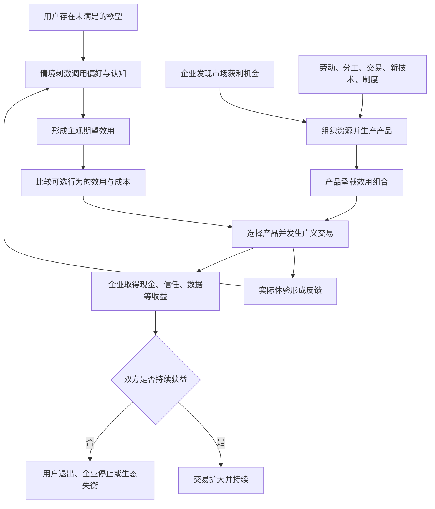

## 1. 本章要回答的问题

产品经理每天都在用户、产品和企业之间工作，但这三个概念经常被割裂：谈用户时只谈需求和体验，谈产品时只谈功能，谈企业时只谈收入和利润。结果是用户价值与商业价值被误认为天平两端互相争夺的东西。

本章试图建立一套统一解释：

1. 企业、用户和产品究竟是什么关系？
2. 用户是谁，用户为何会选择某个产品？
3. 用户价值是客观属性，还是主观判断？
4. 产品的本质是功能集合，还是价值交换的媒介？
5. 企业为什么存在，又凭什么持续存在？
6. 企业通过哪些方式创造价值？
7. 怎样从用户和企业两侧判断一次价值交换能否发生并持续？

本章的核心视角是：**把产品看作企业与用户之间的一场广义交易。** 用户用金钱、时间、注意力、数据和风险等成本交换效用；企业用生产成本和交易成本交换收入、信任、数据、品牌与未来机会。产品经理的任务，是设计双方都愿意持续参与的价值交换。

## 2. 一句话结论

企业通过产品有选择地创造并提供用户所感知的效用，用户在特定情境中比较效用、直接成本、交易成本和机会成本后决定是否采用；只有当用户净效用为正、企业净收益为正，且利益结构长期可持续时，产品所承载的价值交换才会不断发生。

## 3. 本章论证地图

---

## 4. 企业、用户和产品的统一关系

### 4.1 用户价值与商业价值并非天然对立

本章给出的统一框架是：

> 企业以产品为媒介，与用户进行价值交换，从而创造商业价值。

表面上，用户拿到的是 App、商品或服务；本质上，用户想获得的是这些载体背后的效用，例如便利、娱乐、信息、身份、确定性或风险降低。企业也不只是“卖出一个东西”，而是用自己创造的效用换取金钱、时间、注意力、信任或未来交易机会。

用户价值和商业价值因此不是两个互不相关的目标。商业价值通常要以持续创造用户价值为前提；但企业也不可能满足用户全部欲望，因为资源有限，任何效用都存在生产和交付成本。企业真正需要做的是：

1. 在约束条件下选择服务哪些用户和情境。
2. 选择创造哪些用户效用。
3. 设计用户愿意接受的支付方式和成本结构。
4. 让企业从交换中获得足够收益。
5. 使交换能够长期重复，而不是一次性透支用户。

这就是书中所说的“创造有利可图的用户价值”。

### 4.2 QQ 音乐案例：无限欲望与有限供给

如果不考虑约束，音乐用户可能同时希望：所有歌曲免费、没有广告、音质最高、曲库覆盖全球，并且随时随地可用。

但企业需要购买版权、研发和维护软件、租用服务器并支付员工薪酬。如果腾讯无条件满足所有欲望又完全不收费，产品将无法长期经营。即使认为免费音乐可以在腾讯其他业务中变现，也必须明确究竟由哪个业务、通过什么机制产生收益；把“其他业务”纳入后，仍然是在更大的交易模型中进行取舍。

QQ 音乐的实际选择是把不同效用组合提供给不同用户：

- 免费用户获得普通音质和部分内容，同时承担广告等成本。
- 付费会员支付金钱，换取无广告、无损音质或更多版权内容。
- 企业根据目标用户偏好选择版权投入，而不是购买一切内容。

这段论证说明：产品不是把所有好处无限叠加，而是在预算、版权、技术和盈利约束下设计多个效用组合，并让不同偏好的用户自我选择。

### 4.3 三者关系中的产品经理

产品经理位于价值交换的设计和协调位置。他不能只代表用户向企业索取更多资源，也不能只代表企业压低用户所得，而需要回答：

- 什么效用对目标用户真正重要？
- 用户愿意为此承担哪些成本？
- 企业用什么方式提供效用最有效率？
- 企业从哪里获得收益？
- 这套交换对用户、企业和其他参与方是否能长期维持？

---

## 5. 如何理解用户

## 5.1 用户不是自然人，而是需求的集合

从产品视角看，把用户简单等同于注册账户或自然人会产生误导。一个自然人在不同情境中有许多需求，可以分别成为许多产品的用户；同一个产品也可能满足他的多种需求。

书中的专车例子很直观：某人一个月有 100 次专车需求，如果 100 次都使用滴滴专车，可以说滴滴获得了他全部这类需求；如果只使用 50 次，滴滴实际上只获得了这组需求的一半。

这意味着“拥有一个用户”不是非黑即白的状态，更准确的分析单位是：

$$
用户 = 特定个体 \times 特定情境 \times 特定需求
$$

微信也说明了同样的问题。通信、支付、公众号、小程序和朋友圈满足不同需求。即使删除大部分功能后自然人数没有立刻下降，产品承载的需求总量和商业价值也会显著下降。

因此，注册用户数不能自动代表真正的用户规模。产品经理更应该关注：需求发生时，用户是否选择该产品，以及该产品占据了多少需求份额。

### 四种观察人的维度

| 维度 | 关注内容 |
|---|---|
| 生物的人 | 本能、身体限制、感官与生理需求 |
| 社会的人 | 关系、身份、文化、规范与群体影响 |
| 认知的人 | 知识、信念、记忆、偏误和判断能力 |
| 情境的人 | 当下任务、环境、资源、风险和可选方案 |

## 5.2 用户的五个属性

本章再次强调第一章提到的五个基础属性，并赋予它们更直接的产品含义：

| 属性 | 核心含义 | 方法论后果 |
|---|---|---|
| 异质性 | 不同用户的偏好、认知和资源不同 | 用户不是单一点，而是分布；不能只为“平均用户”设计 |
| 情境性 | 同一人在不同情境中会有不同行为 | 需求必须连同场景、约束和选择集合一起描述 |
| 可塑性 | 偏好和认知会被经验与信息改变 | 产品既响应用户，也会塑造用户；历史数据不代表永恒偏好 |
| 自利性 | 用户倾向于追求个人总效用最大化 | 机制不能长期依赖用户牺牲自己来维持 |
| 有限理性 | 用户的信息、计算能力与自控力有限 | 需要降低认知成本，同时警惕利用弱点造成的短期增长 |

## 5.3 系统 1 与系统 2：有限理性的认知基础

书中借用卡尼曼的双系统理论解释用户为何并不总按理性模型行动：

- **系统 1** 是快速、自动、低耗能的本能和习惯系统，容易受经验、刻板印象和认知偏误支配。
- **系统 2** 是缓慢、受意识控制、消耗认知资源的逻辑推理系统，通常需要主动启动。

人脑首先是为生存和繁衍演化出来的，不是为了持续进行严格推理。食物、危险、性和资源等刺激容易自动吸引注意力，因为这些反应曾具有生存优势。到了现代社会，这套快速机制仍在运行，却不一定适合复杂的金融、职业、健康和公共决策。

作者的结论不是“系统 1 都是错的”。在低风险、重复且经验成熟的事务中，系统 1 能以较低成本获得足够好的结果；在影响重大、环境陌生或反馈延迟的决策中，应有意识地启动系统 2。

对产品工作的启示有两面：

1. 交互设计应尊重用户认知资源有限，减少不必要的思考和选择成本。
2. 企业不能把利用认知偏误等同于创造长期用户价值，否则短期转化可能换来长期不信任、监管和声誉成本。

## 5.4 用户行为是怎样产生的

本章提出了一个动态行为模型：情境刺激会调用用户已有的偏好和认知，形成主观期望效用，推动用户选择；实际结果又沉淀为经验，修正未来的偏好与认知。

可以把这套机制简化为：

$$
行为_t = f(情境_t, 偏好_t, 认知_t, 选择集合_t, 期望效用_t)
$$

$$
(偏好, 认知)_{t+1} = g((偏好, 认知)_t, 实际体验_t)
$$

其中，感知、解读、选择集合、模拟推演、价值判断并不总是完整发生。系统 1 可能跳过若干步骤，直接依据本能、习惯或直觉做出选择；整个过程也会受到认知偏误影响。

### “望梅止渴”的论证作用

“口渴”和“谈到梅子”构成情境刺激，但只有已经知道梅子酸的人，才会产生吃梅子可能解渴的期望。若从未接触过梅子，同样刺激不会形成相同反应；若后来吃到苦涩的梅子，实际体验又会改变原有认知，影响下一次行为。

这个例子证明：产品刺激不会直接、机械地导致行为。刺激必须经过用户已有认知和偏好的解释，而行为结果又会反过来改变解释系统。

## 5.5 如何促成用户行为

作者给出两个基本方向：

1. **选择合适的用户**：优先找到偏好和认知已经与产品匹配的人群，此时不需要复杂说服就能促成行为。
2. **设计合适的情境**：当用户的偏好或认知尚不匹配时，通过信息呈现、选项组织、体验和反馈等设计，改变用户感知的期望效用。

第一种通常成本更低，也更符合“先寻找产品与市场匹配”的思路。第二种并非天然错误，但要区分帮助用户理解真实价值和操纵用户认知，两者的长期结果不同。

用户模型只能从具体个体和具体情境积累。每次使用、反馈、流失和投诉都是样本。样本足够后，才能逐渐形成用户分布模型；再用产品迭代验证假设，并持续修正模型。

---

## 6. 如何理解用户价值

## 6.1 价值由主观效用决定

书中从经济学的价值理论转变展开论证：早期客观价值论更强调劳动和成本，边际革命以后，经济学逐渐接受价值取决于主体对效用的判断。

效用是欲望被满足的程度。书中引用的表达为：

$$
幸福 = 效用 - 欲望
$$

它说明幸福感既可以通过增加效用提高，也可能因降低欲望而提高。但产品经理通常更关心：在用户欲望和约束既定时，产品能提供多少被用户感知到的效用。

### 欲望的无限性与约束性

用户的欲望种类和满足程度可以不断扩张，但行为永远受约束：供给、收入、时间、身体、注意力、制度和环境都是限制。因此产品决策不是抽象地满足更多欲望，而是在约束条件下配置资源，使目标用户获得更高的总效用。

## 6.2 主观价值不等于产品物理属性

用户价值由用户感知决定，而不由企业自认为投入了多少成本决定。

- 喜欢苹果还是橘子，取决于个体偏好。
- 连续吃橘子后，第十一个橘子的边际效用会低于第一个。
- 明星代言通过光晕效应改变粉丝对产品的主观评价。
- 名人故居、京剧表演和独特摆盘，可以在菜品本身相近时增加餐厅的感知效用。

这些案例共同支持一个结论：功能、材料和服务是效用的载体，但用户只会依据自己感知到的效用判断价值。企业投入很大，不代表用户价值必然很大；反过来，信息、品牌和情境也可能在较少改变物理属性时显著改变感知价值。

这并不等于企业可以只做包装。感知效用若被实际体验持续证伪，反馈会修正用户认知，最终损害复购和口碑。

## 6.3 用户价值的三个特性

| 特性 | 含义 | 例子或后果 |
|---|---|---|
| 认知依存 | 用户知道什么、相信什么，会影响偏好和价值判断 | 品牌认知、健康知识、消费观念会改变选择 |
| 情境依存 | 同一偏好在不同约束下会表现为不同选择 | 沙漠里只有一个馒头时，即使爱吃也会节省 |
| 经验反馈演化 | 实际体验会修正认知与偏好 | 首次体验失败后，下一次期望和选择会改变 |

因此，用户价值不是静态常数，而是随用户、时间、环境和经验变化的分布。

## 6.4 相对价格如何改变用户行为

用户追求价值最大化时，不只看某个要素的绝对价格，还会比较它相对于其他要素的价格。相对价格变化会改变最优选择，进而改变资源配置。

书中的例子包括：

- 算法工程师薪资下降，企业会倾向于增加算法投入、减少其他替代岗位。
- 美国汽车相对便宜、司机相对昂贵，中国则有不同成本结构，因此两国出行供给形态不同。
- 网费下降甚至包月后，视频和游戏消费增加。
- 移动互联网让排队时可以处理其他事情，降低了排队的机会成本，也改变了用户对排队的容忍度。

技术之所以能产生巨大影响，常常不是因为它孤立地增加了某个功能，而是因为它改变了时间、信息、算力、沟通或生产要素的相对价格，使过去不划算的行为变得划算。

### 海底捞排队案例

海底捞没有简单通过大幅涨价消除排队，而是维持较高翻台率，再把利润投入员工激励与服务。移动互联网又降低了顾客排队的机会成本，使这套选择更容易被接受。

这个案例不是证明“排队一定优于涨价”，而是说明最优方案取决于用户等待成本、价格敏感度、空台风险、翻台率、员工激励和服务体验等变量的组合。情境变化后，原来的最优解也可能变化。

## 6.5 用户价值公式

书中给出产品领域的经典表达：

$$
用户价值 = 新体验 - 旧体验 - 替换成本
$$

三种直接提升方式是：提高新体验；降低旧体验的吸引力，或寻找旧体验本来就较差的场景；降低从旧方案切换到新方案的成本。

替换成本可能包括学习、迁移数据、改变习惯、关系链损失、购买设备、承担失败风险等。一个绝对体验优秀的新产品，如果只比旧产品好一点，而替换成本很高，用户仍可能不采用。

> 笔记辨析：公式适合比较新旧方案的采用价值，不应被理解为精确可计算的物理量。三个部分都包含用户的主观判断，并会随情境变化。

---

## 7. 如何理解产品

## 7.1 产品是价值交换的媒介

产品是经过人加工、可以与用户交易的物品或服务。它的本质是一种解决方案，因此公司内部团队向其他团队提供的工具、数据、流程或服务，也可以按产品思路分析。

卖产品，本质上是在出售一组约束条件下的效用组合。分析产品不能停留在页面、功能和版本，而要追问：

- 它创造了什么使用价值？
- 价值由谁感知和获得？
- 各参与方付出了什么？
- 企业的利益从哪里来，又流向哪里？
- 新功能改变了哪一部分效用、成本和分配关系？

## 7.2 好产品的三个属性

1. **有效用**：用户确实获得使用价值。
2. **有利润**：企业能够直接或间接获利。
3. **可持续**：用户利益与商业利益在长期内形成可维持的统一。

“可持续”不能只靠逻辑声明，而要靠长期实践验证。短期补贴可以让交易增加，却不能单独证明产品成立；短期高利润也可能来自透支用户信任或供给者利益。

## 7.3 产品中的支付不只包括金钱

用户可能支付金钱、时间、体力、注意力、认知资源、隐私、个人数据、风险、态度表达和未来承诺。一旦把这些非货币支付纳入，搜索、社交、内容和公共服务等“免费产品”也可以用交易框架分析。

## 7.4 打破旧平衡，建立新产业链

成功产品往往不是在原有结构上增加一个功能，而是通过创造用户价值，改变旧有利益平衡，形成对自己有利且能持续的新产业链。

这里的“对己方有利”必须与好产品的三个属性共同理解。若新结构只把利益转移给企业，却不创造新增使用价值或无法让关键参与者持续获益，它只是一种短期掠夺，不是可持续创新。

---

## 8. 如何理解企业

本章将企业的本质概括为两点：

1. 发现市场获利机会。
2. 以高于市场的生产效率实现机会。

前者解决“做什么”，后者解决“为什么应该由这家企业来做”。只有机会没有执行效率，价值无法兑现；只有高效率却生产了没人需要的东西，同样没有意义。

## 8.1 发现市场获利机会的三种途径

### 洞察

洞察利用信息不对称发现机会，例如发现更便宜的生产要素、更早知道用户需要什么、掌握新技术或新渠道，以及预判政策和约束变化。当企业知道而竞争者尚不知道时，就可能获得暂时的超额收益。

### 试错

信息永远不完备，即使主观上非常确信，判断也可能失败。产品边界需要由成功和失败共同界定；如果所有尝试都成功，反而说明还没有真正触碰边界。

试错不是盲目行动，而是用可承受成本换取新信息。它既验证机会，也积累行业知识，增加未来产生洞察的概率。

### 偶然性

未来结果取决于大量个体、群体和环境变化，不可能被任何人完整预知。腾讯早期曾想出售而未成功，阿里巴巴和百度最初业务也并非后来最有价值的核心业务。这些案例说明，成功不能被全部归功于先见之明。

洞察、试错和偶然性通常纠缠在一起：试错积累知识，知识促成洞察，偶然事件又可能触发连锁反应。成熟的产品判断既要主动寻找规律，也要敬畏不可消除的不确定性。

发现大型市场机会可能是产品经理为企业创造的最大价值，但发现只是长链条的起点。研发、组织、资本、市场和时机都会影响最终结果，因此成功后也很难严格证明最初发现由谁提出、贡献了多少。

大型机会常来自三类变化：市场环境与制度变化、关键新技术、组织建设能力。前两者带来窗口，后者决定企业能否抓住并兑现窗口。

## 8.2 企业为什么存在：生产效率高于市场

市场交易存在搜寻、议价、签约、监督和保障等交易成本。企业通过科层制和权威在内部配置资源，以较少的市场交易完成复杂协作。

企业能够持续的必要条件是：

$$
企业内部组织生产成本 < 市场提供同等产出的总成本
$$

这里的权威不只指最高管理者，也包括各岗位凭借专业知识做出高于市场平均水平的决策。企业家、产品经理、工程师、采购、法务和运营等，都在各自领域使用分散的知识提高组织效率。

### 显性知识与默会知识

| 知识类型 | 特点 | 企业中的例子 |
|---|---|---|
| 显性知识 | 能用文字、符号和流程表达并传播 | 文档、规范、数据、操作手册 |
| 默会知识 | 来自经验，难以完整说清和转移 | 用户直觉、协作默契、复杂故障判断 |

企业创新的常见过程，是把个体默会知识部分转化为显性知识，再沉淀为共同知识、惯例和制度。共同知识越多，协作和决策效率通常越高。

但默会知识不可能全部被文档化。员工离职会带走个人专有知识，新员工加入还会降低团队对彼此工作方式的共同了解，因此关键人才流失可能直接损害企业竞争力。

### 企业边界为什么不能无限扩大

企业用内部权威节约市场交易成本，却会产生层级信息损耗、协调摩擦和机会主义等组织成本。随着组织扩大，内部成本上升。企业边界大致扩张到：

$$
新增内部组织成本 = 使用外部市场的交易成本
$$

超过这个边界，把活动继续纳入企业反而不如采购、外包或合作有效率。

## 8.3 组织效率的四个条件

组织是一群具有共同目标、共同理念、共同知识，并遵循一定运行机制的人。

| 条件 | 作用 |
|---|---|
| 共同目标 | 让成员知道组织最终要到哪里 |
| 共同理念 | 形成面对冲突时相对一致的取舍偏好 |
| 共同知识 | 降低沟通和协作成本，提高判断质量 |
| 运行机制 | 通过激励与约束把个人行为导向组织目标 |

使命、愿景和价值观并不只是宣传文案。使命提供终极目标，愿景描述阶段性中长期目标，价值观提供重复决策中的取舍原则。它们的功能是降低组织内部反复争议和监督的成本。

企业隐含目标通常包括盈利，但如果显性目标只有赚钱，很难持续吸引员工和社会支持。一个长期欺骗用户的企业，也很难在内部形成高信任、高效率文化。

糟糕的目标、理念和机制会长期逆向筛选人才：认同长期价值的人离开，更适应短期逐利的人留下；人才质量和稳定性下降后，共同知识积累变差，最终进一步降低效率。

### 组织文化由什么决定

书中引用《组织行为学》的三个来源：创始人的人格特性、高级管理者的真实行为、员工社会化。只让人力资源部门负责价值观宣导，最多覆盖第三点。招聘、晋升、奖励、惩罚和离职中的真实选择，才会持续塑造组织文化。

## 8.4 发展与生存是企业的两条腿

| 维度 | 发展 | 生存 |
|---|---|---|
| 核心任务 | 创造更多用户价值和增长空间 | 消除可能致命的关键短板 |
| 判断方式 | 常可重点看做成了什么 | 往往取决于哪一个关键问题没处理好 |
| 风险偏好 | 允许较多探索和失败 | 对安全、现金、制度等短板容忍度低 |

业务跨上新台阶后，原先可以容忍的缺陷可能变成生存威胁，因此发展之后要补齐新规模下的短板。

常见生存要点包括环境选择；品牌、规模效应、网络效应和准入门槛等替代成本；以及组织、激励、技术、成本、变现和资源配置效率。

## 8.5 企业做产品的四类产出

| 产出 | 内容 |
|---|---|
| 财务绩效 | 当前收入、利润、现金流和估值影响 |
| 认知 | 行业 know-how、技术知识、用户理解和对自身能力的认识 |
| 团队 | 经真实项目磨合、与平台匹配的协作能力 |
| 无形资产 | 用户与产业链各方的信任、品牌和未来交易成本优势 |

只看财务绩效时，自己做产品和投资外部公司似乎可以比较回报；但亲自做产品还能积累认知、团队和无形资产。即使某个产品财务上失败，后三类资产仍可能增长。

这里的边界是：失败并不自动产生知识。只有进行有效复盘、保留团队和沉淀经验，失败成本才可能转化为组织资产。

## 8.6 大型互联网企业的公共角色

当互联网平台深入通信、交易、交通、教育、媒体和金融等领域，并影响数亿用户时，它们已在一定程度上承担公共职能。此时继续只按传统“经济人”逻辑追求企业自身利益最大化，会遭遇社会、政府和用户力量的反制。

作者强调，这不只是伦理呼吁，也是市场博弈结果：企业力量和外部性增大后，原有平衡必然被打破，监管、透明度和社会责任会成为新的约束。企业需要像社会公器一样证明自己不会滥用能力，才能获得持续经营的许可和信任。

互联网产品三五年内就可能完成传统产品需要数十年的社会渗透，而法律、伦理和公共研究来不及同步演进。因此，产品经理和管理者常在规则尚未成熟时承担事实上的伦理设计责任。

## 8.7 詹森生产函数：企业产出的约束层次

书中给出的詹森生产函数为：

$$
Q = F_r(L, K, M, C; T)
$$

| 符号 | 含义 |
|---|---|
| $Q$ | 企业产量或产出 |
| $r$ | 外部规则，如政治、法律、社会和地理环境 |
| $T$ | 技术，即把投入转为产出的系统知识 |
| $L$ | 劳动力投入 |
| $K$ | 资本投入 |
| $M$ | 原材料投入，互联网企业中也可理解为供给 |
| $C$ | 内部规则，如产权、组织、激励、文化和关系 |

模型呈现三层产出边界：

1. **外部规则边界**：制度、产权保护、行业准入和税率等先决定企业可能做到什么。
2. **技术边界**：在给定外部规则下，生产技术决定投入能转化为多少产出。
3. **内部效率边界**：外部规则和技术相近时，企业通过内部规则决定自己能多接近前两层上限。

外部规则或新技术发生代际变化时，会打开新的产出边界，形成企业冒险和创业的窗口。这也解释了为什么一批大企业常在相近年代集中崛起：它们共享了时代机会，而非只依赖个体能力。

### 模型边界

这个函数形成于 20 世纪 70 年代，没有充分纳入互联网的低边际成本、网络效应、双边平台、知识工作者和新沟通方式；它也更关注生产，没有直接解释“发现什么值得生产”。在当代产品中，价值发现有时比生产效率更重要。

不过，它仍提供了一个有效检查框架：分析产品时，不只看团队执行，还要看外部规则、技术代际、投入要素和内部制度分别构成了什么约束。

---

## 9. 企业如何创造价值

## 9.1 先分清正在讨论哪一种价值

“价值”有多种含义，讨论时必须根据上下文明确口径：

| 维度一 | 维度二 |
|---|---|
| 客观价值 | 主观价值 |
| 短期价值 | 长期价值 |
| 局部价值 | 整体价值 |
| 感知价值 | 预期价值 |
| 绝对价值 | 相对价值 |
| 存量价值 | 增量价值 |
| 企业价值 | 用户价值 |
| 使用价值 | 交换价值 |

许多产品争论并非事实冲突，而是参与者使用了不同价值口径。例如一方谈短期转化，另一方谈长期信任；一方谈用户使用价值，另一方谈企业交换价值。

## 9.2 使用价值与交换价值

- **使用价值**是产品提供的各种效用，用户价值主要指使用价值。
- **交换价值**是一种使用价值与另一种使用价值进行交换的比例或关系，市场价格是其表现之一。

没有使用价值的东西不能成为可持续产品；有使用价值却不一定有足够交换价值。产品的交换价值受到三项条件影响：有效用、效用被潜在交换者认知、具有稀缺性。

营销之所以可能创造价值，是因为它能让潜在使用价值被更多合适用户认知，使产品找到交换对象；但如果产品没有真实效用，营销只能短期制造预期，实际体验最终会修正认知。

用户购买或使用产品，是为了取得使用价值；企业生产产品，是为了取得交换价值。两者通过交易统一：

> 企业创造具有交换价值的使用价值，用产品承载，再与用户交换企业所需的金钱、时间、数据、承诺或信任。

## 9.3 创造价值的五条路径

### 路径一：劳动

劳动把资源转化为更符合人需要的形式，可以是体力、脑力或心力。但劳动只有面向需求并成功形成效用时才创造使用价值。烧焦的饭、重复挖填道路等劳动消耗了资源，却没有因此自动创造价值。

所以价值首先由需求驱动，而不是由投入劳动量保证。劳动可能创造使用价值，但交换价值还要通过交易实现。

### 路径二：分工

分工通过四种机制创造价值：熟能生巧，提高单位时间产出；减少工序切换成本；积累和创造专业知识；聚集同类工作形成规模效益，激励新技术和新工具出现。

产品经理这一职业能否持续，也取决于其专业分工所产生的知识和效率是否高于组织成本。

### 路径三：交易

交易让资源从效用较低的一方流向效用较高的一方。即使物品本身没有变化，只要双方对它的主观效用不同，自愿交换就能让双方预期状态都改善。下一章将进一步展开交易如何创造价值。

### 路径四：新技术

广义技术是能带来经济效益的生产知识。工业革命后人均产出的跃升说明，新技术可以突破原有生产边界，用更少投入产生更多效用。

但技术本身不自动创造大规模用户价值。它必须被应用到产品，产品还必须被用户购买或使用，价值才能实现：

$$
技术知识 \rightarrow 产品化 \rightarrow 被用户认知 \rightarrow 发生交易 \rightarrow 价值实现
$$

只展示先进技术，却不能形成用户愿意采用的产品，仍无法产生大规模价值。

### 路径五：制度

制度通过界定产权、保护收益、设计激励和降低不确定性，影响人们是否愿意长期投资、创新与协作。书中借用诺斯的制度变迁理论说明：英国对财产权和人身权的保障提高了商业冒险与技术创新的预期回报，为工业革命的长期积累提供了条件。

制度不是技术进步之外的附属变量。它决定创造者能否保有创新收益，因而影响知识和技术是否持续积累。对企业内部而言，产权、激励、分配和文化等内部制度同样决定长期产出。

五条路径并非互斥：制度提供激励和保障，分工积累专业知识，新技术提高生产效率，劳动将资源转成产品，交易最终实现并重新配置价值。任何一条断裂，都可能让潜在价值无法落地。

---

## 10. 产品即交易：怎样让价值交换发生

## 10.1 交易是广义的有意识行为

本章把人的有意识行为都看作一种广义交易：人因为不满意当前状态，预期某个行为能使自己进入更好的状态，于是愿意付出代价采取行动。

吃饭、休息、阅读、游戏、交流、出行和帮助他人都可以按这个框架分析。代价不只包括货币，还包括时间、体力、心力、风险和放弃其他选择的机会成本。

$$
有意识行为 = 用预期代价购买预期收益
$$

这里强调“预期”，因为行为发生前，用户只能依据主观判断选择。实际结果可能低于预期，并在之后改变其认知。

## 10.2 交易中的价值为什么是主观的

同一产品往往提供多个效用，不同用户因欲望、信念、禀赋、资源、偏好和情境不同，会形成不同效用组合与价值判断。

企业的判断同样具有主观性。企业虽是集体，最终仍由一个人或一群人根据有限信息做决策。组织长期形成的取舍偏好，就是常说的企业“基因”的一部分。

产品设计因此不是发现唯一客观正确答案，而是在不完备信息下提高对双方主观价值的判断质量，并用实践修正判断。

## 10.3 判断主观价值的九个视角

作者列出九种分析视角，并预告在决策章节展开：

1. 对自我认知的认知。
2. 对给定目标的批判性思考。
3. 参照系。
4. 成本。
5. 不确定性决策。
6. 概率，即风险决策。
7. 非货币价值，即跨效用决策。
8. 外部性。
9. 时间性，即跨期决策。

它们共同提醒产品经理：用户的价值判断会受到参照点、风险、时间跨度、他人损益和不同效用不可直接换算等因素影响，不能只用单一货币指标概括。

## 10.4 用户侧的交易条件

用户愿意选择产品的基本条件是：

$$
用户净效用 = 产品效用 - 直接成本 - 交易成本 - 机会成本 > 0
$$

- **直接成本**包括金钱、时间、隐私数据、体力和态度表达等直接支付。
- **交易成本**包括搜寻、比较、议价、学习使用、监督和权益保障等为了促成交易而付出的代价。
- **机会成本**是采用该产品后放弃的其他方案中价值最高者。

由于用户会在多个方案间比较，净效用大于零只是必要条件；要被真正选择，产品通常还要比可用替代方案更有吸引力。

产品可以通过扩大效用或降低成本改善用户侧条件。年终账单告诉用户累计节省了多少钱和时间，是在增强价值感知；简化流程则是在降低使用和交易成本。

## 10.5 企业侧的交易条件

企业愿意长期提供产品的基本条件是：

$$
企业净收益 = 广义收益 - 生产成本 - 交易成本 > 0
$$

广义收益不只包括当前现金收入，还包括能增加未来交易概率的信任、品牌、社会声望、政府关系、数据和战略位置。

企业交易成本是所有为了让交换发生而额外付出的成本，例如获客宣传、渠道、谈判、支付、合同、风控、保障，以及培养用户新习惯的补贴。

### 再看 QQ 音乐

QQ 音乐的企业收益可能包括会员、单曲和广告收入，内容布局对腾讯整体估值的影响，以及与其他平台连通的数据和战略价值。

成本则包括：

- 生产成本：版权、服务器、研发和员工薪酬。
- 交易成本：品牌宣传、用户获取、付费教育、优惠补贴和支付保障等。

“购买数字音乐”不会天然发生，企业必须投入资源让用户认知产品、形成习惯并信任交易。忽略这些成本，容易高估商业模式的盈利能力。

## 10.6 双边条件与可持续性

一次产品交易要长期成立，至少满足：

$$
\begin{cases}
用户感知效用 > 用户直接成本 + 用户交易成本 + 用户机会成本 \\
企业广义收益 > 企业生产成本 + 企业交易成本
\end{cases}
$$

在多边平台中，还要为供给者、合作方和社会外部影响增加相应条件。任何关键一方长期净收益为负，都会通过退出、涨价、质量下降、抵制或监管使模型失衡。

因此，企业的一切产品行为应围绕“让有价值的交换更多、更高效、更持续地发生”，而不只是让某个短期指标上升。

---

## 11. 本章完整推理链

1. 用户存在无限欲望，但收入、时间、供给和环境都有约束。
2. 用户在情境刺激下，根据偏好与认知形成主观期望效用，并选择预期价值更高的行为。
3. 实际体验会形成反馈，持续改变认知、偏好和下一次选择。
4. 因此，用户价值不是产品的客观属性，而是认知依存、情境依存且随经验演化的主观效用。
5. 产品不是功能集合本身，而是企业向用户交付一组受约束效用的媒介。
6. 企业不能满足用户全部欲望，只能选择创造哪些有利可图的用户价值。
7. 企业首先要通过洞察、试错和偶然机会发现市场获利空间，再依靠高于市场的组织效率实现它。
8. 企业通过权威、专业知识和共同知识节约市场交易成本，但企业扩张也会增加内部组织成本。
9. 劳动、分工、交易、新技术和制度共同创造价值；价值最终要通过产品被采用和交易来实现。
10. 用户采用产品的前提，是主观效用超过直接成本、交易成本与机会成本。
11. 企业提供产品的前提，是广义收益超过生产成本与交易成本。
12. 只有双方乃至所有关键参与者都能持续获得正向价值，产品才同时具有用户价值、商业价值和可持续性。

---

## 12. 可直接使用的工作方法

## 12.1 从“自然人”改为“需求份额”分析用户

1. 用户在什么情境下产生哪类需求？
2. 这类需求一个周期内发生多少次？
3. 当前产品满足了其中多少次、多少价值量？
4. 未选择本产品时，用户使用了什么替代方案？
5. 不同情境下的需求份额有何差异？

这比只看注册人数或月活更接近产品实际占据的用户价值。

## 12.2 建立用户行为假设

1. 明确触发行为的情境刺激。
2. 描述用户已有的认知、偏好和资源约束。
3. 列出用户感知到的选择集合，而不是企业认为存在的全部选择。
4. 推测用户如何模拟结果和判断效用。
5. 写出可验证的行为预测。
6. 观察实际体验如何修正用户后续行为。

## 12.3 分析产品效用组合

| 问题 | 要识别的内容 |
|---|---|
| 谁获得效用 | 用户分群、供给者、企业、合作方 |
| 获得什么 | 功能、效率、情绪、身份、确定性等 |
| 谁承担成本 | 用户、企业、其他参与者或社会 |
| 承担什么 | 金钱、时间、风险、数据、认知、机会成本 |
| 有何约束 | 技术、制度、供给、预算、组织能力 |
| 是否持续 | 复购、留存、利润、供给质量、信任和外部性 |

## 12.4 评估企业是否应该做一个产品

1. 市场机会来自洞察、低成本试错，还是暂时偶然？
2. 用户使用价值是什么，是否被用户认知？
3. 为什么由本企业做会比市场或竞争者更有效率？
4. 企业缺少的是技术、资本、供给、内部机制还是共同知识？
5. 除财务绩效外，能否积累认知、团队和无形资产？
6. 外部规则和技术边界可能怎样变化？
7. 该业务属于发展性探索，还是关系生存的关键环节？

## 12.5 双边交易检查表

### 用户侧

- 用户获得哪些效用，感知到了多少？
- 直接支付了什么？
- 搜寻、学习、迁移、等待和保障成本是多少？
- 放弃的最佳替代方案是什么？
- 首次交易后的实际体验会强化还是削弱下一次交易？

### 企业侧

- 当前与未来收益分别是什么？
- 完整生产成本是什么？
- 获客、教育、谈判、履约和保障成本是什么？
- 交易规模扩大后，边际成本和组织成本如何变化？
- 有没有关键参与者的利益被排除在模型之外？

---

## 13. 容易误读的观点

### 误读一：用户就是注册账户或自然人

自然人只是载体。产品真正竞争的是具体情境下的需求份额，同一个人可以同时是许多产品的用户。

### 误读二：主观价值意味着产品质量不重要

主观价值包含用户对真实体验的认知。包装和营销能改变预期，但长期实际体验会通过反馈修正认知。没有真实效用的高预期难以持续。

### 误读三：用户自利，所以只会追求金钱利益

总效用包括情感、关系、身份、道德满足和长期承诺等非货币价值。帮助他人也可能给行动者带来心理效用。

### 误读四：产品即交易，就是所有产品都要收费

广义交易包含非货币支付。用户使用免费产品时仍可能支付时间、注意力、数据、风险和机会成本。

### 误读五：企业依靠权威，所以不需要讨论和异议

企业用权威完成最终资源配置，但高质量权威依赖专业知识和充分信息。鼓励异议可以提高决策质量，只是企业不能让每个决策都停留在无结果的投票中。

### 误读六：失败也能积累资产，所以试错越多越好

只有可承受、能产生信息、得到复盘并沉淀为共同知识的失败才有价值。无假设、无反馈的重复失败只是浪费。

### 误读七：用户效用为正，产品就会被选择

用户还会比较机会成本。产品不仅要比“不使用”好，通常还要比用户可感知的最佳替代方案更好，并覆盖替换成本。

### 误读八：创造用户价值自然会带来利润

有效用不等于有交换价值。用户可能不知道产品、供给不稀缺、竞争价格低于企业成本，或者企业交易成本过高。商业模式仍需单独设计和验证。

---

## 14. 本章结论

1. 企业、用户和产品应放进同一价值交换框架理解，产品是交换媒介而非最终价值本身。
2. 用户不是自然人或账户，而是个体在特定情境下的需求集合；产品竞争的是需求份额。
3. 用户行为由情境、偏好、认知、选择集合和期望效用共同产生，实际体验又会反向修正未来行为。
4. 用户价值是主观效用，具有认知依存、情境依存和经验反馈演化三个特性。
5. 相对价格变化会改变个人与企业的最优选择，技术的重要作用之一就是系统性改变要素相对价格。
6. 产品是一组约束条件下的效用组合，好产品需要有效用、有利润并且可持续。
7. 企业通过发现市场获利机会和以高于市场的效率组织生产而存在；权威、专业知识和共同知识是效率来源。
8. 组织的共同目标、共同理念、共同知识和运行机制共同决定效率，发展与生存则要求不同的管理逻辑。
9. 企业做产品不仅获得财务绩效，还可能积累认知、团队和无形资产。
10. 劳动、分工、交易、新技术和制度共同创造价值，但价值需要通过产品采用与交易实现。
11. 用户侧要满足效用高于直接成本、交易成本和机会成本；企业侧要满足广义收益高于生产成本和交易成本。
12. 产品经理的核心不是单边最大化用户或企业利益，而是让多方价值交换更多、更高效且更可持续地发生。

## 15. 思考题

1. 当前产品统计的是账户规模，还是它在具体需求中的份额？
2. 最近一次用户行为变化，主要来自偏好变化、认知变化，还是情境与相对价格变化？
3. 产品向用户提供的效用组合中，哪些是真实体验，哪些只是预期或感知？
4. 用户采用产品时，最大的直接成本、交易成本和机会成本分别是什么？
5. 企业当前的竞争优势来自外部规则、技术代际、生产要素，还是内部机制？
6. 最近一个失败项目有没有沉淀认知、团队或无形资产？如何证明？
7. 团队追求的发展目标是否暴露了新的生存短板？
8. 产品规模扩大后，企业是否承担了新的公共责任和外部性？
9. 当前商业模式中，是否有某个关键参与方长期净收益为负？
10. 如果用户预期效用很高却仍不采用，是否低估了替换成本或机会成本？

## 16. 复习卡片

**Q：企业、用户与产品的基本关系是什么？**  
A：企业以产品为媒介，有选择地创造用户价值并与用户交换，从而获得商业价值。

**Q：为什么用户不是自然人？**  
A：产品满足的是自然人在特定情境下的一类需求；同一人可以是许多产品的用户，产品真正获得的是需求份额。

**Q：用户行为如何形成？**  
A：情境刺激调用偏好和认知，经过感知、解读、形成选择集合、模拟推演和价值判断，产生期望效用与行为；实际体验再反馈并修正偏好和认知。

**Q：用户价值的三个特性是什么？**  
A：认知依存、情境依存、经验反馈演化。

**Q：用户价值公式是什么？**  
A：$用户价值 = 新体验 - 旧体验 - 替换成本$。

**Q：企业的两个本质是什么？**  
A：发现市场获利机会，以及用高于市场的生产效率实现机会。

**Q：发现市场获利机会的三种途径是什么？**  
A：洞察、试错和偶然性，三者通常互相作用。

**Q：企业为什么不能无限扩大？**  
A：企业节约外部市场交易成本，但规模扩大也会增加内部组织成本；边界止于新增组织成本接近外部交易成本之处。

**Q：企业做产品有哪四类产出？**  
A：财务绩效、认知、团队和无形资产。

**Q：创造价值的五条路径是什么？**  
A：劳动、分工、交易、新技术和制度。

**Q：使用价值和交换价值有什么区别？**  
A：使用价值是产品给用户的效用；交换价值是它与其他价值交换的比例或关系，需要通过交易实现。

**Q：用户愿意交易的基本条件是什么？**  
A：产品效用超过用户的直接成本、交易成本与机会成本，并优于可感知的替代方案。

**Q：企业愿意交易的基本条件是什么？**  
A：产品带来的现金、信任、品牌、数据等广义收益超过生产成本和交易成本。

**Q：“产品即交易”为什么不等于“产品必须收费”？**  
A：交易是广义价值交换，用户还可以支付时间、注意力、数据、风险、态度和机会成本。
