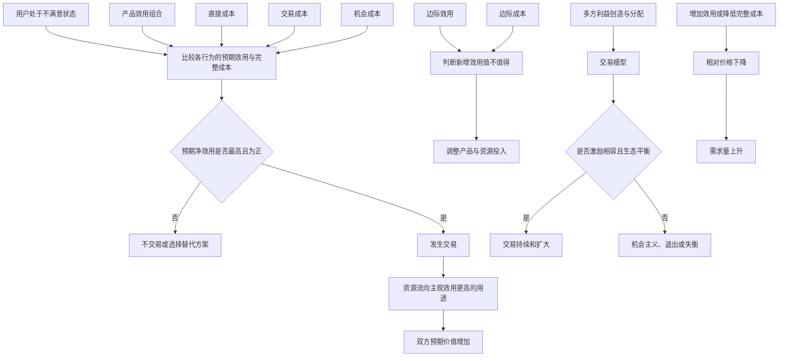

## 1. 本章要回答的问题

第二章提出“产品即交易”，但如果只把它当成一句口号，仍然无法指导具体决策。第三章开始把价值交换拆成可分析的变量：用户获得哪些效用、付出哪些成本，新增一单位投入的收益如何变化，价格与供需怎样互相影响，以及产品怎样通过降低交易成本促成原本不会发生的交换。

本章集中回答以下问题：

1. 为什么自愿交换能够创造价值，而不是简单的等价互换？
2. 单次交易与交易模型有什么区别？
3. 如何设计让个体自利行为与整体目标一致的机制？
4. 用户获得的效用有哪些类型，应该满足到什么程度？
5. 边际效用、边际成本和边际利润如何影响产品取舍？
6. 机会成本与交易成本分别是什么？
7. 交易成本从哪里产生，又可以怎样降低？
8. 为什么标准化、线上化、评价系统和品牌能创造巨大价值？
9. 供需定律成立需要什么前提？
10. 如何用“相对价格”寻找边际用户和增长机会？

本章的分析框架可以概括为：**以交易为基本单位，把产品拆成效用组合与完整成本，再用边际和供需分析变化，用交易模型保证多方可持续。**

## 2. 一句话结论

交易之所以发生，是因为参与者对同一资源的主观估值不同，并都预期所得效用高于直接成本、交易成本和机会成本；产品经理应通过增加有效用、降低完整成本和设计激励相容的利益分配机制，降低产品相对价格，促成更多可持续的边际交易。

## 3. 本章论证地图

---

## 4. 什么是交易

## 4.1 产品语境中的广义交易

本书所说的交易比传统买卖更广。只要用户主动采取某个行为，用一种代价换取预期收益，就可以把它视为用户与世界的一次交易。

对于资讯产品，用户可能没有付钱，却用时间、注意力、隐私和认知资源换取信息、娱乐或情绪价值。对于工具产品，用户用学习和操作成本换取效率。对于社交产品，用户用内容、关系数据和表达风险换取归属、联系和身份效用。

因此，交易的两个核心问题是：

1. 用户预期得到什么？
2. 用户需要付出什么，以及放弃什么？

在没有强迫和欺诈的前提下，一个拥有选择权且能够理性判断的人，通常只会在以下条件成立时行动：

$$
预期收益 > 直接代价 + 交易成本
$$

并且：

$$
该选择的预期净收益 > 最佳替代选择的预期净收益
$$

第二个条件把机会成本纳入了判断。现实用户是有限理性的，可能受习惯、本能、错误信息和认知偏误影响，因此“预期受益”不保证事后真的受益。

## 4.2 为什么世界上不存在主观意义上的等价交换

市场价格可以相等，但参与者获得的主观价值通常不相等。

### 方便面案例

顾客用 10 元购买一盒方便面，是因为在当时的饥饿、时间和替代选择下，方便面对他的主观效用高于保留 10 元或购买其他物品。店主愿意出售，是因为 10 元带来的效用高于继续持有方便面，并且售价高于进货、经营和促成交易的成本。

因此，10 元只是双方同意的交换比例，不意味着方便面对顾客和店主的主观价值都恰好等于 10 元。

### 房产案例

房产交易的不只是砖、水泥和空间，还包括区位、学区、户籍、便利性、安全感、身份和未来价格预期。买方认为房产的居住或投资效用高于支付代价；卖方认为现金及其其他用途高于继续持有。

长期价格变化后，某一方可能发现自己的判断错误，但交易发生的时点上，双方都主观预期自己会改善处境。信息、偏好、资源和风险判断的差异，正是交易能够发生的原因。

## 4.3 交换为什么能创造价值

交换不一定增加物质总量，却能提高资源配置后的总效用。

书中的极端例子是：樵夫拥有小提琴，音乐家拥有斧子。交换前，两件物品都在效用较低的人手里；交换后，樵夫用斧子劳动，音乐家用小提琴演奏。物品没有增加，但它们产生效用和继续创造价值的能力显著提高。

交易创造价值的逻辑是：

1. 不同人对同一资源的偏好、能力和情境不同。
2. 因此，同一资源在不同人手里的主观效用不同。
3. 自愿交换让资源流向估值更高或利用能力更强的一方。
4. 双方预期净效用都提高，社会资源配置也可能改善。

需要注意，“自愿交换必然使双方受益”说的是**交易时的主观预期**。若存在欺诈、强迫、严重信息不对称、外部性或判断错误，事后福利未必增加，第三方也可能受损。

## 4.4 对产品经理的含义

产品设计不能以“上线”为终点，而应以能否促成用户行为为终点。产品经理需要从交易倒推：

- 用户为何认为所得大于所失？
- 哪些成本阻碍了潜在用户？
- 用户放弃的最佳替代方案是什么？
- 企业是否也能从每次交换中获得净收益？
- 交换会不会因重复发生而破坏信任或生态？

发现市场机会，本质上是在发现一组尚未实现的交换：企业能够以低于用户主观价值的成本提供某种效用，并从用户愿意付出的代价中获利。

---

## 5. 什么是交易模型

## 5.1 从单边行为到多边机制

本书对两个概念作了区分：

- **交易**从用户单边视角描述一次主动行为，即“我付出什么、得到什么”。
- **交易模型**从产品设计者视角描述一套可持续机制，即各参与方如何创造利益、分配利益并响应规则。

交易模型在某种意义上接近商业模式，但它不局限于货币收入。一次搜索、阅读、通信或短视频消费，同样涉及平台、用户、内容供给者、广告主等多方之间的价值创造和分配。

交易模型的两个核心命题是：

1. **利从何来**：新增价值通过什么方式被创造？
2. **利往何去**：价值如何在参与者之间分配，各方为何愿意持续参与？

好的交易模型不仅能促成一次行为，还能让企业、用户、供给者及其他关键方在重复博弈中保持正向收益。

## 5.2 损失厌恶：得到与失去并不对称

书中引用马克杯实验：一组学生获得马克杯，另一组获得等值现金。拥有杯子后，卖方对杯子的估值普遍高于未拥有者愿意支付的价格。因为“一个杯子”和“我已经拥有的杯子”不是同一个心理产品，放弃所有物会被感知为损失。

损失厌恶是指同等数量的损失带来的负效用，通常大于同等收益带来的正效用。原书引用“约为 2.5 倍”的经验性比例，并据此说明用户放弃已有状态时，新增价值需要明显大于表面替换成本。

对产品工作的含义包括：

- 迁移产品时，关系链、历史数据和习惯都是被用户感知的损失。
- 免费试用结束后的付费选择，与从未获得该功能时的付费选择不同。
- 删除已有功能比不新增同等功能更容易引起强烈反应。
- 补偿用户损失时，等额补偿未必能恢复主观效用。

> 笔记辨析：损失厌恶的强度不是普遍固定常数，会随交易对象、情境、经验和实验方法变化。产品决策应把“损失比收益更敏感”作为待验证假设，而不是机械套用 2.5 倍。

## 5.3 选择增加福利，但也会增加成本

更多选择通常意味着用户至少可以保留原选择，因此潜在福利不会减少。但选择并非越多越好：比较、理解和后悔都会产生交易成本，过多选择可能让用户推迟或放弃决策。

产品经理需要平衡：

$$
增加选择带来的效用 > 增加选择带来的搜寻、比较与决策成本
$$

有效做法不是一味减少或增加选项，而是通过默认项、推荐、分组、筛选和渐进披露，保留选择福利并降低决策负担。

## 5.4 激励相容：让个体自利导向整体目标

赫维茨的机制设计理论提出“激励相容”：参与者追求个人利益最大化时，其最优行为恰好也有利于系统整体目标。

简单来说，机制应让“把事情做好”比“把事情做坏”更有利可图。若平台希望司机提高服务质量，规则就应让高质量服务带来更稳定订单、收入或声誉，而不能让刷单、挑单或降低质量更赚钱。

设计激励相容机制时要问：

1. 每类参与者真正追求什么？
2. 规则下最有利于他的行为是什么？
3. 这个行为是否符合平台整体目标？
4. 是否存在钻规则空子却收益更高的策略？
5. 监督和惩罚成本是否高到使机制无法执行？

交易模型的高级能力，不是要求参与者变得无私，而是承认自利和有限理性，在此基础上设计可执行的协作规则。

---

## 6. 产品经理为什么要关注交易

企业通过产品与用户交换价值，因而一切行为最终都应服务于让有价值的交换更多、更高效、更持续地发生。书中提出五个方向：

1. 持续发现和追加可交换、可能有利可图的用户价值。
2. 创造并以更高效率创造这些用户价值。
3. 持续降低生产成本和各种交易成本。
4. 按各因素对用户交换行为的影响及 ROI 配置资源。
5. 维护企业生存和可持续发展能力。

## 6.1 “有利可图”不是只做直接收费功能

一个效用可能自身不赚钱，但有以下价值：

- 与核心效用难以分割。
- 当前价值尚未被充分认知。
- 能间接增加其他交易。
- 承担引流、跑量、清货或建立信任的作用。

因此，企业应从产品组合和长期整体收益判断，而不是要求每项功能单独盈利。但“战略价值”也不能成为逃避验证的万能解释，仍要明确它通过什么因果链影响未来收益。

## 6.2 可持续意味着考虑重复博弈

企业与用户不是只交易一次。某次涨价可能提高当期收入，却让用户逐渐认识到产品不再划算，最终流失；某项运营策略可能短期数据漂亮，却在 12 个月后损害留存、信任或供给质量。

书中借亚马逊说明长期弹性：降价、免费配送和 Prime 会员短期耗费成本，但可能通过更高用户回报、规模经济和使用习惯形成长期良性循环。由于长期影响难以精确测量，决策依赖业务认知和价值观。

医疗广告等案例则展示了反面路径：高毛利广告主能贡献短期收入，但若用户反复遭受欺骗，平台信任下降，所有产品未来的交易成本都会提高。

西贝“不好吃不要钱”很难用短期退款金额评估。其制度同时规定服务员绩效不与退菜数绑定，避免员工为了个人绩效阻碍退款。这既体现“相信顾客”的长期价值观，也体现激励相容：外部承诺必须有匹配的内部制度才能真正执行。

## 6.3 企业壁垒常是效率与时间差

市场中的成功方案会被模仿。除强制度准入等少数情况外，静态壁垒很少永久存在。企业更现实的优势是：

- 比别人更早发现效用。
- 比别人更快将效用产品化。
- 以更低成本生产和交付。
- 更快学习并进入下一轮创新。

因此，“创造了什么”与“以多高效率持续创造”同样重要。

## 6.4 按影响交易的 ROI 排序

影响用户行为的关键变量因行业和阶段而异：

| 产品类型 | 常见高权重因素 |
|---|---|
| 电商、外卖 | 价格、供给和履约，通常比及格线以上的交互细节更重要 |
| 视频、内容 | 内容供给常比价格和局部交互更重要 |
| 搜索、工具 | 使用体验、结果质量和先发优势权重较高 |
| 网约车 | 供给、价格、安全与政策常比 App 交互更重要 |

“体验重要”并不等于每个业务都应优先追求极致交互。产品经理要识别真正影响交换行为的变量，把资源投入边际 ROI 最高处。

---

## 7. 效用

## 7.1 什么是效用

效用是欲望被满足的程度，是特定个体在特定情境中的主观评价，不是产品客观属性的简单总和。

伯努利用效用解释圣彼得堡悖论，挑战“人总按期望金额最大化决策”的假设。相关思想包含两点：

1. **边际效用递减**：财富增加通常带来正效用，但每增加一单位财富带来的额外满足可能逐渐下降。
2. **期望效用最大化**：面对风险和不确定性，人追求的是主观期望效用，而不一定是期望金额最大。

书中用幸福方程说明效用与欲望的关系：

$$
幸福 = \frac{效用}{欲望}
$$

原书 OCR 在不同位置对该公式有识别差异，这里按常见的萨缪尔森幸福方程记录为比值。它表达的不是精确测量公式，而是：欲望不变时，提高效用会增加满足感；效用不变时，欲望越大，主观满足感越低。

欲望具有种类与程度上的无限性。生理、安全、社会、尊重和自我实现等需求不断出现，但资源永远有限，这构成了选择、成本和交易的基础。

## 7.2 效用的多样性

产品效用不限于金钱，可以包括：

| 类型 | 例子 |
|---|---|
| 货币 | 收入、节省、未来购买能力 |
| 时间 | 更快完成任务、获得闲暇 |
| 身体 | 食物、健康、舒适、美丽、安全、自由 |
| 心理 | 归属、尊重、权力、名誉、爱情、好奇和审美 |
| 信念 | 遵守原则、维护身份认同、避免价值冲突 |
| 情绪 | 快乐、安心、兴奋、怀旧、缓解无聊 |
| 认知 | 正确认识世界、保持正面自我形象、减少认知失调 |

货币之所以有效用，是因为它可以交换大量其他效用。时间的价值则取决于它能换取什么，因个体的收入能力、剩余寿命和当前情境而不同。

## 7.3 认知失调揭示的两类效用

书中把认知效用分为两个取向：

- **自尊取向**：维持“我是正确的、我是好人”的正面自我形象。
- **社会认知取向**：正确认识世界，以便做出适应环境的判断。

两者可能冲突。当事实表明自己一直在做错事时，承认错误有助于正确认知，却会损害自尊。很多人会通过选择性解释、归责外部或扭曲事实缓解失调。

产品经理需要理解：用户拒绝新事实不一定是信息不足，也可能是在维护身份和自我形象。单纯增加证据可能无效，甚至引起更强防御。

## 7.4 一顿饭中的多重效用

用户吃饭不只购买能量，还可能购买：

- 更安全的食材。
- 更好的味道和视觉。
- 距离近带来的舒适和省时。
- 品牌、菜系或明星代言带来的归属。
- 服务和会员身份带来的尊重。
- 外卖带来的自由、舒适和时间节省。

同一物理商品可以承载完全不同的效用组合。只要新增效用的用户支付意愿高于企业提供成本，就可能形成新交易。

## 7.5 效用、需求与用户数量

效用视角进一步支持“用户是需求集合”：同一自然人在不同情境下，会为了不同高优先级效用选择不同产品。

平时追求低价的用户可能选择拼多多；第二天急需电钻时，配送速度成为底线，他会选择京东。用户没有突然变成另一个人，只是情境改变了效用权重。

同样，今日头条在资讯之外增加视频、社区、汽车和教育服务后，即使日活人数不变，满足的需求种类和发生的交易已经增加。只按自然人数统计，会低估产品创造的用户价值。

脸书可能同时满足信息分享、便利休闲、打发时间、人际联系、控制和自我推广等动机。卖橘子也可以卖低价、安全、甜度、产地、新鲜、便利、包装、爱心和反季节稀缺性。企业真正出售的是效用或效用组合，而不只是物理对象。

## 7.6 效用具有个体性与情境性

一个平时节俭的人，在妻子临产等紧急情境中，也可能愿意支付高额加价立即打车。效用取决于禀赋、资源、偏好、认知、边际状态和情境，不能仅凭收入标签推断。

正因为个体估值不同，市场才有交易空间。如果所有人对某资产的未来价值和风险判断完全一致，买卖双方就难以同时出现。

书中还引用“对压力有害的信念影响健康结果”的研究，意在说明主观认知可能参与塑造实际效用和结果。对这类相关性研究应保持谨慎，但其产品启示成立：用户相信什么会影响预期、行为和体验，认知不能被排除在效用分析之外。

---

## 8. 产品效用与用户欲望并不对等

用户通常希望效用越多越好、代价越少越好，但企业不可能无限投入。本章按满足程度把需求分成四类，帮助判断效用应该做到什么水平。

## 8.1 底线需求：不能低于

底线需求是“一票否决”型效用。网约车司机不能有严重犯罪记录、冷饮不能高于可接受温度，都是门槛。一旦不满足，其他效用可能失去意义。

对于大规模服务产品，成熟阶段的“极致体验”常不是把平均体验无限提高，而是减少严重坏案例。因为一次安全、隐私或履约事故可能突破底线，并通过社交传播形成巨大负外部性。

管理方法：明确底线指标、监控尾部风险、建立兜底和恢复机制，而不只看平均值。

## 8.2 够用就好：不必持续提高

有些效用达到阈值后，继续提高的边际效用很低。技术指标提升五倍，不代表用户感知也提升五倍。

管理方法：找到用户可感知阈值，在边际回报显著下降处停止，把资源转向更缺失的效用。

## 8.3 越多越好：用户愿意继续支付

某些效用增加时，用户仍有较高支付意愿。企业可以持续投入，直到边际收入与边际成本相等，或其他用途的机会收益更高。

管理方法：验证需求曲线与支付意愿，不能只依据口头表达“越多越好”。

## 8.4 惊喜需求：超越预期或参照系

惊喜是用户原本没有明确要求，却能产生增量效用的设计。例如生日时餐厅赠送长寿面并祝福。低成本、高感知的惊喜可能具有很高 ROI。

但惊喜会被重复体验吸收为新预期。一旦成为标准配置，它就从惊喜变成底线或普通效用，继续制造惊喜需要新的变化。

## 8.5 四类需求的资源配置原则

| 类型 | 推荐策略 |
|---|---|
| 底线需求 | 优先保证，重点减少坏案例和尾部风险 |
| 够用就好 | 达到感知阈值后停止过度投入 |
| 越多越好 | 投入到边际收入接近边际成本或机会成本更高为止 |
| 惊喜 | 选择惠而不费、感知强且不破坏长期预期的设计 |

不同用户和情境对四类需求的划分并不相同。安全可能是某人的底线，价格可能是另一人的底线；速度在普通情境中“够用即可”，在紧急情境中却“越多越好”。因此分类必须针对具体用户分布和场景验证。

## 8.6 产品是一组约束条件下的效用组合

技术指标和功能不是用户价值本身。分析产品时，应先把它拆成用户能感知的效用，再预测属性变化如何影响效用和行为。

例如打车可拆成：

- 从 A 点到 B 点的位移。
- 遮风避雨与温度舒适。
- 节省时间和体力。
- 价格与可负担性。
- 被尊重和服务体验。
- 隐私、交通、支付、财物和人身安全。

同一个改动可能提高某项效用、降低另一项效用并增加企业成本。产品经理应比较完整组合，而不是单独庆祝某个指标提升。

---

## 9. 边际

“边际”指额外增加一单位带来的变化。产品决策不是只问某事总体有没有价值，而是问：**在当前状态下再多投入一点，新增收益和新增成本分别是多少？**

## 9.1 边际效用与边际效用递减

边际效用是每多消费一单位物品或服务所增加的满足程度：

$$
边际效用 = \frac{总效用变化量}{消费量变化量}
$$

连续吃苹果时，第一个可能缓解饥饿并带来愉悦，第六个可能只增加腻烦甚至负效用。获得第一个 1000 万元与已有巨额财富后再增加 1000 万元，主观满足也通常不同。

边际效用递减的产品含义是：

- 不要把过去有效的投入线性外推。
- 平均效用高不代表下一单位投入仍划算。
- 同一效用做得很高时，应比较补足其他效用的收益。
- 会员分层、用量套餐和差异化定价，本质上可以利用不同用户的边际效用差异。

边际效用递减不是每个场景都严格成立。网络效应、学习效应、收藏完整性等可能在某些区间产生边际效用递增，仍需依据具体机制判断。

## 9.2 边际成本

边际成本是每多生产或服务一单位所增加的成本：

$$
边际成本 = \frac{总成本变化量}{产量变化量}
$$

制造业在早期常因规模效应而边际成本下降：固定设备、研发和管理成本被更多产量分摊。但规模超过某个临界点后，原材料涨价、组织复杂度、招聘培训、渠道拓展和获客难度都可能使边际成本上升。

互联网获客也遵循类似逻辑。最容易转化、交易成本最低的用户通常先被获取；越往后，潜在用户越难触达或说服，边际获客成本越高。

因此，“规模越大，成本越低”只在特定区间成立。产品经理应寻找成本曲线的拐点，而不是假设规模效应无限延续。

## 9.3 边际利润

边际利润是在给定约束下，多一笔交易带来的额外利润：

$$
边际利润 = 边际收入 - 边际成本
$$

### 网约车

每新增一单，平台需要把成交额的大部分支付给司机，因此边际成本占比高。订单增长会增加收入，也同步增加较大履约成本。

### 共享单车

单车投放后折旧、资金等成本相对固定。闲置车辆多被骑一次，新增运维成本较小，因此在容量范围内边际利润较高。

### 餐厅

房租、员工、设备和部分水电是固定成本。若 280 位顾客才能盈亏平衡，从 300 人增加到 340 人，新增顾客带来的收入扣除食材等较低边际成本后，大部分转成利润。因此客流只下降一小部分，也可能让净利润大幅下降。

这些案例说明，收入规模相似的行业可能有完全不同的利润结构。产品策略必须先分清固定成本、可变成本和边际成本，才能判断补贴、促销、闲时利用和扩张是否合理。

---

## 10. 成本

成本可以从多个角度分类：机会成本、交易成本、边际成本、固定成本、可变成本、沉没成本、平均成本和会计成本等。本章重点讨论机会成本与交易成本。

## 10.1 机会成本

资源在同一时点通常只能用于一种用途。选择用途 A 时，被放弃的其他用途中的最高收益，就是用途 A 的机会成本：

$$
机会成本(A) = \max(所有被放弃方案的预期净收益)
$$

机会成本不是所有替代方案收益之和，也不一定出现在财务报表中。

### 职业司机与顺风车司机

职业司机开网约车时，放弃的是其他职业可能获得的收入，因此对订单收入要求较高。顺风车司机本来就要从上海去杭州，只要接送绕路很少，新增订单的机会成本接近于零，可以接受更低价格。

相同订单、相同支付，对不同供给者的利润不同，原因不只在直接成本，还在机会成本。平台若忽略供给异质性，会设计出错误的统一激励。

## 10.2 什么是交易成本

交易成本是交易双方在达成和执行交换前后，为了促成这笔交易而产生的成本。不同经济学家定义范围有所差异：

- 科斯强调获取信息、谈判、订约和监督等费用，并用它解释企业与市场边界。
- 阿罗把交易费用概括为经济系统的运行费用。
- 巴泽尔强调权利转让、获取和保护的成本。
- 诺斯等强调度量价值、保护权利与监督契约的成本。
- 威廉姆森区分事前约定权责的成本和事后执行、调整的成本。

在本书的产品框架中，可以用一个直观定义：

> 交易成本是用户付出但企业没有收到的成本，以及企业付出但用户没有收到的成本。

例如用户花在搜索、比较、学习、等待、担忧和维权上的时间，并没有成为企业收益；企业花在获客、谈判、反欺诈、监督和赔偿上的资源，也没有直接转化为用户获得的核心效用。

### 用户侧与企业侧

$$
用户净收益 = 用户效用 - 直接支付 - 用户交易成本 - 机会成本
$$

$$
企业净收益 = 企业所得 - 生产成本 - 企业交易成本 - 机会成本
$$

如果双方可以在没有搜寻、度量、议价、签约、执行、监督和保障成本的情况下即时交换，才是零交易成本。但这种状态像物理学中的无摩擦模型，只是分析基准，现实中不存在。

### 求职案例

学生求职的交易成本包括搜索职位、收集评价、制作简历、通信、交通、住宿、面试、议价和毁约风险。企业支付总额与员工到手工资之间，也可能存在招聘、税费、保障和管理等成本。

这说明标价或工资不能代表交易双方的完整成本。大量不可货币化、未被充分认知的成本会阻碍交易。

## 10.3 为什么产品经理要关注交易成本

只有用户价值而没有低成本交换，潜在价值仍无法实现。降低交易成本会产生两类效果：

1. **替代效应**：原有线下或低效交易转向成本更低的方式。
2. **新增效应**：原本收益不足以覆盖交易成本的交换开始变得有利可图。

假设资源从甲用途转到乙用途可新增 10 元价值：当交易成本为 10 元时，交易没有净收益；降到 5 元后，不仅这笔交易产生 5 元净收益，所有新增价值介于 5 元到 10 元的类似交易也都可能被激活。市场规模因此扩大。

移动互联网让用户在家中完成搜索、比较、支付和配送，相比线下购物大幅减少时间和行动成本。它不仅替代部分实体交易，也让低频、小额、远距离的商品交易成为可能。

## 10.4 交易成本理论的源流与机会主义

康芒斯把交易视为包含冲突、依存和秩序的经济活动基本单位，并强调所有权转移。科斯由此发展出交易成本概念，威廉姆森进一步形成交易成本经济学。

威廉姆森强调机会主义：参与者在有利时可能隐瞒、误导、违约或损人利己。由于双方无法无条件信任对方，就要独立搜集信息、订立条款、监督执行和设置保障，交易成本随之上升。

这不是说所有人都会欺诈，而是机制设计不能假设所有参与者永远善意。在高价值、低频、难验证的交易中，即使只有少数机会主义者，也可能迫使所有人承担更高保障成本。

---

## 11. 交易成本的来源与分类

## 11.1 威廉姆森提出的六项来源

| 来源 | 含义 | 造成的成本 |
|---|---|---|
| 有限理性 | 人的认知、信息和计算能力有限 | 无法写出覆盖所有情况的契约 |
| 机会主义 | 参与者可能隐瞒、欺骗或钻规则空子 | 搜证、监督、惩罚和保障成本增加 |
| 不确定性与复杂性 | 未来状态难以预见，变量众多 | 议价、修订和风险承担成本增加 |
| 少数交易 | 交易对象少、资产专用性高 | 对手议价权增大，市场容易失灵 |
| 信息不对称 | 各方掌握的信息数量和质量不同 | 逆向选择、道德风险和验证成本增加 |
| 交易气氛 | 缺乏信任、双方对立 | 形式化程序和防备成本增加 |

## 11.2 从产品角度概括为四个信息问题

1. **信息不对称**：一方掌握另一方没有的信息。
2. **信息不确定**：相关信息要在行动发生后才能揭示。
3. **信息不完全**：交易开始时，至少一方不知道部分相关信息。
4. **信息有成本**：发现、收集、传输、鉴别、处理和吸收信息都要付出资源。

信息科技产品之所以能产生巨大价值，是因为它们系统性降低了这些成本。搜索、推荐、评价、认证、追踪、在线支付和电子契约，本质上都在改善信息与信任结构。

当质量难以度量、信息差异大时，契约更不完全，参与者行为更难预测，市场结构和产品规则就必须承担更多治理任务。很多平台产品其实是在设计一个利益交换市场。

## 11.3 交易成本的三大制度类型

- **市场型交易成本**：买卖双方在市场交换中的成本。
- **管理型交易成本**：组织内部命令、沟通、监督和协调的成本。
- **政治型交易成本**：公共决策、制度运行和权利协调的成本。

产品经理主要处理市场型交易成本，但平台治理、跨部门协作和公共规则也会涉及后两类。

## 11.4 市场型交易成本的六个环节

| 阶段 | 交易成本 |
|---|---|
| 找到对象 | 搜寻商品与交易对象的成本 |
| 判断价值 | 度量商品和交易对象属性的成本 |
| 比较价格 | 寻价、比价和议价成本 |
| 作出承诺 | 决策和订立契约成本 |
| 完成交换 | 履约、交付和实施成本 |
| 维护权利 | 监督、违约处理、意外处置和保障成本 |

这个分类可以直接映射用户旅程。每个转化漏斗断点背后，都可能是某类交易成本超过了用户预期收益。

---

## 12. 产品质量的三种可度量类型

按用户在什么阶段能判断质量，可以把产品分为：

## 12.1 搜寻品

购买前就能较低成本确认关键质量，例如正规渠道中的同款新 iPhone。用户主要比较价格、配送和保障。

## 12.2 体验品

只有使用后才知道质量，例如一箱橙子、一次餐饮或服务。试用、退款、评价和品牌可以降低首次体验风险。

## 12.3 信任品

使用后仍难验证真实质量，例如部分保健品、美容项目、专业诊疗，以及极低概率安全事件的防护。用户只能依赖专家、认证、品牌、制度和心智认知。

网约车极端安全风险属于信任品效用。即使企业把客观事故率降低很多，单个用户也无法靠有限乘车次数验证。若用户信任仍远低于客观安全水平，只改善后台技术而不改善可理解的安全信息、承诺和保障，行为可能不变。

### 产品设计目标：提高可度量性

若能把体验品或信任品的一部分属性标准化、透明化，使其更接近搜寻品，用户的度量、决策和保障成本会显著下降。标准、认证、检测报告、可追溯数据和可信评价都承担这个作用。

---

## 13. 降低交易成本的典型案例

## 13.1 搜索与推荐：降低搜寻成本

搜索引擎让用户主动表达目标并快速定位信息；个性化推荐则在用户难以准确描述目标时，利用行为数据筛选可能喜欢的内容。音乐推荐、信息流和网红带货都在不同程度上减少寻找、筛选和度量成本。

但推荐也可能增加信息茧房、误导和隐私成本。是否真正降低总交易成本，要把新产生的风险与治理成本一并计算。

## 13.2 自助餐：用少量浪费换取更低制度成本

自助餐一次收费、自由取用，可能让顾客吃到最后一口边际效用接近零，造成食物浪费。但它减少了逐项点餐、计量、报价、记账和监督等成本。

只要：

$$
节约的交易成本 > 新增食物浪费与管理成本
$$

自助餐制度就可能比逐项交易更有效率。制度设计追求的是总成本更低，而不是消灭每一种局部浪费。

## 13.3 用户评价：降低度量与保障成本

淘宝店铺评价、大众点评、豆瓣和携程把分散的体验信息聚合起来，帮助后来者判断质量，减少亲自试错。可信评价还能约束卖方机会主义，提高违约的声誉成本。

评价系统也会面对刷评、幸存者偏差和极端意见放大，因此平台还要投入反作弊、排序和解释机制。好的评价产品不是“有评论”即可，而是让信息更可信、更相关、更容易度量。

## 13.4 标准化咖啡豆与谷物

埃塞俄比亚商品交易所通过专业品尝与分级，把差异复杂的咖啡豆转成可比较等级。芝加哥谷物分级则让谷物从一袋袋异质混合物变成按等级和数量交易的抽象商品，并促进期货市场形成。

标准化的价值在于：

- 降低质量度量成本。
- 减少逐笔谈判和验货。
- 扩大可匹配交易对象。
- 支持远程和未来交付。
- 让原本净收益为负的边际交易转正。

标准化也会损失个性信息。若被省略的差异恰恰是用户高价值效用，过度标准化可能降低总价值。

## 13.5 滴滴专车认证：牺牲部分供给换取确定性

滴滴曾面对认证与未认证司机混合供给。选择全认证意味着短期放弃部分供给，却把供给尽量转为标准品，降低用户的度量、不确定性、决策和保障成本。

这个案例说明，供给数量不是唯一目标。较少但可验证、可预期的供给，可能比更多异质且不透明的供给促成更多长期交易。

## 13.6 智能手机降低排队机会成本

排队的主要代价是时间，但时间成本取决于本来可以做什么。智能手机让用户在排队时阅读、通信、娱乐甚至工作。如果不排队时也会做相同事情，等待的机会成本就显著降低。

滴滴排队、海底捞和热门茶饮等模式因此获得新的可行空间。技术没有缩短物理等待，却改变了等待时间的效用组合和相对价格。

## 13.7 链家真房源：企业承担成本以降低用户总成本

虚假房源以低价吸引流量，却让用户在线筛选后发现房源不存在，再承担多轮沟通、看房和重新搜索成本。链家和贝壳通过楼盘字典、线下核验和“假一赔百”等机制提高真实性。

链家为此新增了治理、核验、定责和赔偿成本，但降低了用户的搜寻、度量、决策和保障成本。只要新增企业成本小于新交易带来的收益，这种转移就是有利可图的。

初期用户可能只看到链家标价更高，不理解“真房源”节约的隐性成本，因此流量下降。随着体验累积，真实性转成口碑；口碑又进一步降低企业获客成本和用户信任成本。这展示了交易成本改善的长期反馈环。

## 13.8 线上化：提高可核查性

传统餐饮大量使用现金采购、发薪和收款，投资者难以核实收入，监督和权利保障成本很高。移动支付和业务线上化让交易可记录、可追溯、可审计，降低投资者验证成本，促进融资和资本交易。

点餐、采购和用户数据线上化还让管理者更低成本地判断菜品和客群，从而改善决策。线上化的价值不是“有数据”本身，而是降低信息收集、核验、传输和决策成本。

## 13.9 工资、买断还是抽成：合约由交易成本决定

如果忽略交易成本，工资制、固定买断和抽成在理想条件下可以形成相同分配结果；现实中，不同合约会产生不同监督、议价和激励成本。

### 工资制

网约车订单在时空上分散，固定工资可能使司机多劳不多得。平台需要监督怠工、挑区域和降低效率等行为，成本很高。

### 买断制

司机一次付费后不再抽成，会产生：

- 订单不及预期时的议价与不满。
- 未买断司机怀疑平台偏袒。
- 平台调整价格和促销时的沟通成本。
- 高能力司机更愿买断形成逆向选择。

### 抽成制

抽成会随实际订单变化，天然共享部分数量风险，并让平台与司机在增加成交上相对一致。它并不完美，但在特定网约车生态中可能比工资和买断具有更低总交易成本。

结论不是“抽成永远最好”。城市、供给类型和商业模式变化后，各合约的成本也会变化，必须具体比较。

---

## 14. 供需定律

## 14.1 基本表达

在其他条件不变时：

- 价格上升，需求量下降；价格下降，需求量上升。
- 价格上升，供给量增加；价格下降，供给量减少。
- 竞争市场中的价格趋向供给量与需求量相等的均衡水平。

对出行市场而言，降低乘客价格通常会增加需求，提高司机补贴通常会增加在线供给。

## 14.2 最重要的前提：其他条件不变

现实中的其他条件一直在变化。价格之外，用户还受信息触达、距离、健康认知、品牌、供给、质量和情境影响。

一家螺蛳粉店即使价格极低，也不会吸引所有用户：有人不知道活动，有人距离太远，有人厌恶味道，有人担心健康。价格下降只意味着在其他条件相同的比较中需求量倾向上升，不等于所有人都会购买，也不保证观测到的总销量一定上升。

产品实验应用供需定律时，需要检查：

1. 商品或效用组合是否发生了变化？
2. 用户是否知道价格变化？
3. 供给、履约和质量是否同时变化？
4. 竞争者和替代品价格是否变化？
5. 用户结构与宏观情境是否变化？

只比较降价前后总销量而忽略这些变量，不能直接证明价格因果。

---

## 15. 相对价格与“人间第一定律”

## 15.1 公式

书中给出的产品分析工具是：

$$
相对价格 = \frac{直接成本 + 交易成本}{效用组合}
$$

并将其概括为：

> 其他条件不变时，相对价格降低，需求量上升。

这个模型对传统价格概念作了两处扩展：

1. 把用户支付的代价拆成直接成本和交易成本，而不只看货币标价。
2. 把商品明确为用户感知的效用组合，而不假设产品内容永远不变。

## 15.2 三种降低相对价格的方式

1. **增加效用组合**：价格不变时，增加用户真正感知的效用。
2. **降低直接成本**：降价、补贴、减少时间或体力支付。
3. **降低交易成本**：减少搜寻、比较、学习、等待、不确定性和保障成本。

这三种路径都可能增加需求，不必把增长等同于降货币价格。

## 15.3 相对价格与用户价值公式的关系

用户价值公式从新旧方案比较采用意愿：

$$
用户价值 = 新体验 - 旧体验 - 替换成本
$$

相对价格公式从单个方案内部比较所得与所付：

$$
相对价格 = \frac{完整成本}{效用组合}
$$

二者可以互补：前者提醒产品经理不要忽略旧方案与迁移成本；后者帮助拆解当前产品可通过哪些效用和成本变量改善竞争力。

## 15.4 边际交易与边际用户

革命性技术可能一次创造巨大效用，使相对价格大幅下降并带来快速增长。产品成熟后，增长更常来自逐项降低阻断潜在用户的具体成本。

当产品已有 1000 万用户时，其余潜在用户没有转化，可能分别被不同门槛阻断：

- 不知道产品，搜寻成本高。
- 不理解价值，认知和度量成本高。
- 不信任质量，风险和保障成本高。
- 迁移数据困难，替换成本高。
- 支付或履约不便，实施成本高。
- 某个底线效用不满足。

降低其中一种成本，只会转化被该成本卡住的那部分用户。这些新增成交就是边际交易，这些人就是边际用户。

## 15.5 公式的适用边界

相对价格是思考工具，不是可以把异质效用直接相加后精确计算的物理公式：

- 效用是主观的，跨用户不可简单比较。
- 不同效用之间未必有稳定换算率。
- 用户只能依据自己感知到的成本和效用决策。
- 网络效应、社会影响和供给约束会让需求变化反过来改变效用和成本。
- 增加需求不必然增加企业利润，还要计算边际成本与生态影响。

正确用法是用它系统寻找变量和假设，再通过真实行为验证，而不是给每个变量随意打分后宣称算出了答案。

---

## 16. 本章完整推理链

1. 用户采取行动，是因为预期行动后的状态优于当前状态和其他可选状态。
2. 用户与企业对同一资源的主观估值不同，因此自愿交换能让双方都预期受益。
3. 交易不一定增加物质，却能让资源流向效用更高的用途，从而创造价值。
4. 单次交易只解释一方为什么行动；交易模型还要解释多方怎样创造和分配利益，以及机制能否持续。
5. 损失厌恶、选择成本和机会主义说明，真实行为不会只按标价和客观功能决定。
6. 激励相容机制让参与者追求个人利益时，也推动系统整体目标。
7. 产品承载的是货币、时间、身体、心理、信念、情绪和认知等多种效用。
8. 不同用户和情境的效用权重不同，因此产品应被视为受约束的效用组合。
9. 底线、够用、越多越好和惊喜四类需求具有不同的最优投入策略。
10. 边际分析关心再增加一单位的效用、成本和利润，避免根据总量或平均值做错误外推。
11. 机会成本是被放弃的最佳替代收益，解释了同一交易对不同参与者为何价值不同。
12. 交易成本来自信息、有限理性、不确定性、机会主义和信任问题，会阻止潜在价值转化为实际交易。
13. 搜索、推荐、标准化、评价、认证、线上化、品牌和制度设计都能通过降低交易成本创造价值。
14. 供需定律说明其他条件不变时，价格下降会增加需求，但现实分析必须检查其他变量。
15. 相对价格把货币价格扩展为直接成本、交易成本与效用组合的关系。
16. 产品可以通过增加效用、降低直接成本或降低交易成本来降低相对价格，逐步转化边际用户。
17. 需求增加后仍要比较边际收入、边际成本和多方长期利益，才能形成可持续交易模型。

---

## 17. 可直接使用的工作方法

## 17.1 绘制一笔交易的完整账本

| 参与方 | 获得的效用或收益 | 直接成本 | 交易成本 | 机会成本 |
|---|---|---|---|---|
| 用户 | 功能、时间、情绪、安全等 | 金钱、时间、数据等 | 搜寻、学习、风险、保障等 | 最佳替代方案净收益 |
| 企业 | 收入、数据、品牌、信任等 | 研发、供给、履约等 | 获客、监督、治理、售后等 | 资源用于其他项目的收益 |
| 供给者 | 收入、订单、灵活性等 | 劳动、资产、时间等 | 接单、等待、议价、申诉等 | 其他平台或工作的收益 |
| 社会或第三方 | 正外部性 | 承担的资源 | 拥堵、污染、风险等 | 其他资源配置收益 |

如果关键成本没有进入任何一方的账本，通常意味着外部性被遗漏了。

## 17.2 拆解效用组合

1. 列出用户实际购买的效用，不从功能名称开始。
2. 标记每项效用属于底线、够用、越多越好还是惊喜。
3. 分析不同用户群和情境下分类是否变化。
4. 找出目前最限制交易的效用短板。
5. 预测属性改动如何改变效用，而不是只记录技术指标变化。
6. 比较新增效用的边际收入、边际成本和机会成本。

## 17.3 寻找交易成本

沿用户旅程依次询问：

1. 用户怎样知道有这个产品？
2. 怎样判断它是否适合自己？
3. 怎样比较质量、价格和替代品？
4. 怎样建立信任并决定交易？
5. 怎样学习、支付、迁移和完成使用？
6. 出现违约、事故或质量问题时怎样保障权利？

每一步记录时间、金钱、体力、认知、风险和情绪成本，再按影响交易量与降低成本的投入做 ROI 排序。

## 17.4 分析边际增长

1. 现有用户已被哪些效用吸引？
2. 未转化用户分别被什么成本或底线阻断？
3. 降低某项成本能覆盖多大用户分布？
4. 新增用户的边际获客和服务成本是多少？
5. 需求增加是否会导致供给不足、体验下降或治理成本上升？
6. 边际利润为正是否能在长期保持？

## 17.5 评审激励机制

1. 参与者有哪些可选行为，包括钻空子的行为？
2. 每种行为给他的短期和长期收益是什么？
3. 最赚钱的个人策略是否也是平台希望的行为？
4. 信息是否可度量，平台能否识别真实贡献？
5. 监督和惩罚是否可执行，成本是否过高？
6. 规则是否造成逆向选择，把好参与者筛走、坏参与者留下？
7. 机制扩大后是否会改变参与者策略？

## 17.6 选择合约形式

比较工资、买断、抽成、订阅、按次付费等方案时，不只比较名义分成，还要计算：

- 数量和质量的监督成本。
- 风险由谁承担。
- 信息不对称与逆向选择。
- 价格调整与重新议价成本。
- 参与者是否有持续提高效率的激励。
- 违约、退出和争议处理成本。

---

## 18. 容易误读的观点

### 误读一：自愿交易必然让所有人事后获益

自愿交易说明双方在当时根据有限信息预期获益。欺诈、错误判断、外部性和未来变化都可能让事后结果不同。

### 误读二：没有等价交换，所以定价可以任意

主观价值不同不代表没有竞争约束。用户会比较替代方案，企业也受成本、供需、声誉和长期弹性约束。

### 误读三：增加选项一定改善产品

选择可能增加福利，也会增加搜寻和决策成本。需要比较新增选择效用与新增交易成本。

### 误读四：效用是主观的，所以无法研究

效用不能像长度一样直接测量，但可以通过选择、支付意愿、留存、实验和访谈推断，并在具体情境中形成概率模型。

### 误读五：用户欲望无限，所以功能应该越多越好

企业资源有限，不同效用互相冲突，功能还会增加认知和维护成本。应按需求类型和边际回报配置资源。

### 误读六：边际效用永远递减

它是常见趋势，不是所有区间的机械定律。网络效应、学习和完整性可能造成阶段性递增。

### 误读七：互联网产品的边际成本接近零

数字复制成本可能很低，但获客、内容、算力、客服、风控、供给和组织成本可能递增。必须明确讨论哪一种边际成本。

### 误读八：降低交易成本就是让企业少花钱

企业可能主动增加核验和保障成本，以更大幅度降低用户成本并促成更多交易。链家真房源就是成本转移后总收益增加的例子。

### 误读九：线上化天然提高效率

线上化只有在提高可度量性、可追踪性、协作或决策质量时才创造价值；低质量数据和复杂流程也会增加新的交易成本。

### 误读十：价格降低，实际销量一定上升

需求定律要求其他条件不变。信息触达、效用组合、供给、竞争和用户结构同时变化时，总销量可能呈现其他结果。

### 误读十一：相对价格公式可以直接算出精确答案

效用和许多隐性成本是主观的。公式用于完整列变量和提出假设，不是伪精确评分工具。

### 误读十二：促成更多交易就是越多越好

若新增交易的边际成本高于收入，或损害供给、信任、安全与社会福利，交易量增加反而不可持续。

---

## 19. 本章结论

1. 产品语境中的交易是用户以预期代价交换预期收益的广义主动行为，不局限于货币买卖。
2. 市场价格相等不代表双方主观价值相等；正因为估值不同，自愿交换才能同时提高双方预期效用。
3. 交易模型研究多方利益从哪里创造、怎样分配，以及交换能否在重复博弈中持续。
4. 损失厌恶、选择成本与有限理性会影响交易，产品不能只按客观功能和标价分析。
5. 激励相容要求个体追求自身利益时，最优行为同时符合系统整体目标。
6. 企业应持续发现可交换的用户价值、提高生产效率、降低完整成本，并按影响交易的 ROI 配置资源。
7. 效用是欲望满足程度，包含货币、时间、身体、心理、信念、情绪与认知等多种类型。
8. 产品是一组受约束的效用组合，应分别处理底线、够用、越多越好和惊喜四类需求。
9. 边际分析比较新增一单位的效用、成本和利润，是决定继续投入还是停止的关键。
10. 机会成本是放弃的最佳替代收益，同一交易对不同参与者可能具有完全不同的利润。
11. 交易成本是为促成交换而付出、却没有成为对方所得的成本，现实中不可能为零。
12. 降低交易成本既会替代旧交易，也会激活原本无法成立的新交易，从而扩大市场。
13. 信息不对称、不确定、不完全且有成本，是交易成本的重要来源；标准化、评价、认证、品牌和线上化能改善这些问题。
14. 合约和商业模式的优劣取决于完整交易成本，而不只是表面分成比例。
15. 供需定律必须在其他条件不变的前提下使用，现实分析要识别同时变化的变量。
16. 相对价格由完整成本与效用组合共同决定；增加效用、降低直接成本和降低交易成本都能推动需求。
17. 成熟产品的增长往往来自识别并消除阻断不同边际用户的具体交易成本。
18. 交易量不是最终目标，边际利润、多方利益和长期可持续性才决定交易模型是否成立。

## 20. 思考题

1. 当前产品的一次核心行为中，用户究竟用什么交换什么？
2. 用户主观预期获益，但实际体验是否真的获益？二者差距来自哪里？
3. 产品的关键效用分别属于底线、够用、越多越好还是惊喜？不同用户是否一致？
4. 最近一次功能投入的边际效用和边际成本分别是多少？
5. 当前最容易获取的用户是否已接近饱和？下一批用户被什么成本阻断？
6. 哪项用户成本由企业主动承担后，能降低更大的总交易成本？
7. 产品属于搜寻品、体验品还是信任品？能否提高关键质量的可度量性？
8. 评价、认证和品牌机制真的降低了信任成本，还是产生了新的作弊成本？
9. 当前激励规则下，参与者最赚钱的行为与平台目标一致吗？
10. 某项短期营收策略会怎样改变用户长期价格弹性和信任？
11. 现行合约采用工资、买断、抽成或订阅的原因是什么？换一种形式会新增什么成本？
12. 最近一次降价后销量变化，是否真的满足“其他条件不变”？
13. 除了降货币价格，还有什么办法可以降低产品相对价格？
14. 新增交易的边际利润是否为正，是否给第三方带来未计入的负外部性？

## 21. 复习卡片

**Q：产品语境中的交易是什么？**  
A：用户用预期代价换取预期收益的一次主动行为，不限于货币买卖。

**Q：为什么交换能创造价值？**  
A：不同参与者对同一资源的主观效用不同，自愿交换让资源流向估值更高或更能发挥作用的一方，使双方预期净效用增加。

**Q：交易和交易模型有什么区别？**  
A：交易描述单方的一次行为；交易模型设计多方利益创造、分配和可持续参与机制。

**Q：交易模型的两个核心命题是什么？**  
A：利从何来，以及利往何去。

**Q：什么是激励相容？**  
A：参与者追求个人利益的最优行为，恰好也有利于系统整体目标。

**Q：效用是什么？**  
A：特定个体在特定情境下，欲望被满足的主观程度。

**Q：产品效用需求有哪四类？**  
A：底线需求、够用就好、越多越好和惊喜。

**Q：边际效用是什么？**  
A：每多消费或提供一单位产品所增加的额外满足程度。

**Q：边际利润是什么？**  
A：多一笔交易带来的边际收入减去边际成本。

**Q：机会成本是什么？**  
A：把资源用于当前选择时，放弃的其他方案中最高的预期净收益。

**Q：交易成本的直观定义是什么？**  
A：用户付出但企业未收到，以及企业付出但用户未收到的、为促成交换产生的成本。

**Q：市场型交易成本有哪些环节？**  
A：搜寻、度量、寻价、决策与订约、实施、监督与保障。

**Q：搜寻品、体验品和信任品如何区分？**  
A：分别是在购买前、使用后，以及使用后仍难验证关键质量的产品。

**Q：降低交易成本为什么会扩大市场？**  
A：它既让旧交易转向更低成本方式，也让原本收益不足以覆盖成本的潜在交易开始成立。

**Q：供需定律最重要的前提是什么？**  
A：其他条件不变。

**Q：相对价格公式是什么？**  
A：$相对价格 = (直接成本 + 交易成本) / 效用组合$。

**Q：怎样降低产品相对价格？**  
A：增加用户感知的效用组合，降低直接成本，或降低搜寻、决策、履约和保障等交易成本。
