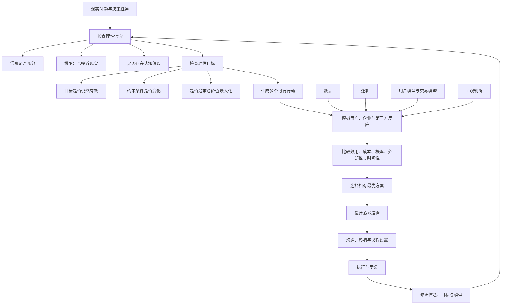

## 1. 本章要回答的问题

产品经理的日常工作由连续的选择组成：要不要做、先做什么、服务谁、牺牲谁、怎样分配资源，以及如何让决定真正落地。前三章提供了用户模型、交易模型、效用和成本等分析工具，本章则回答如何用这些工具形成决策。

本章集中讨论以下问题：

1. 为什么人的决策天然不完全理性？
2. 理性决策为什么要先检查信念和目标，再寻找行动方案？
3. 产品决策为什么本质上是多方价值的权衡，而不只是设计或创意？
4. 怎样用用户价值公式寻找高价值的新用户、新场景和新要素？
5. 数据、逻辑和主观判断分别适合什么问题，又有哪些局限？
6. 哪些认知偏误最容易破坏产品判断？
7. 为什么分析组织决策必须回到具体决策者和决策流程？
8. 一个正确判断怎样通过影响力和议程设置变成实际结果？
9. 面对公平、效率、安全、责任和多方利益冲突时，如何在约束条件下寻找相对最优解？

本章的核心分析方法是：**先校验认知，再批判目标，最后比较行动；把每个方案放进完整系统，计算不同参与者在不同时间尺度下的效用、成本、概率和外部性。**

## 2. 一句话结论

高质量产品决策不是找到脱离情境的唯一正确答案，而是在承认信息有限、环境不确定和价值多元的前提下，建立尽量符合真实世界的信念，选择约束条件下价值最大化的目标，比较多个可行方案的预期效用，并用与组织和参与者激励相容的方式推动相对最优解落地。

## 3. 本章论证地图

---

## 4. 理性决策

## 4.1 决策是什么

决策是在多个备选行动中做出选择，包括选择做什么、不做什么，以及以什么方式做。人做决策是为了达到某个目标，而对行动的选择建立在一组信念之上：决策者相信哪种行为更可能实现目标。

因此，决策至少包含三层：

1. **信念层**：我认为现实是什么样，各变量怎样相互作用？
2. **目标层**：在当前约束下，我真正想实现什么？
3. **行动层**：哪些方案可行，哪一个最可能实现目标？

很多产品讨论只发生在第三层，例如争论按钮放哪里、功能如何实现，却没有确认对用户和市场的基本判断是否真实，也没有检查目标本身是否值得追求。

## 4.2 人类的决策为什么天然不完全理性

理性决策需要获取信息、加工信息、判断价值并预判未来，但每一个环节都受到限制。

### 信息获取能力有限

- 搜寻信息需要时间、金钱和注意力，追求绝对完备信息的成本可能趋近无穷。
- 人会选择性关注和解释信息，更容易看到符合已有信念的证据。
- 信息过多会增加筛选和理解成本，未必比信息不足更有利于决策。
- 第三方会有意或无意地加工信息，传播内容可能已偏离事实。

### 信息处理能力有限

- 人的计算和工作记忆容量有限，无法同时处理所有变量。
- 记忆不是原样存储，会被当前情绪和信念重新解释。
- 大脑依赖本能和经验捷径提高效率，但捷径会产生系统性偏误。

### 个体价值判断存在差异

禀赋、资源、偏好、情境、欲望、情绪和信念不同，会使不同人对同一结果赋予不同效用。决策者也容易把自己的价值判断投射给用户或合作方。

### 环境存在不确定性

产品处于由大量能动个体组成的系统中。参与者会根据规则改变自己的行为，技术、制度和竞争环境也会变化。即使当前信息准确，未来仍不能被完全预测。

所以，理性不意味着掌握全部信息、准确预测一切，而是：**承认局限，用合理成本减少关键误差，并让决策能够根据反馈修正。**

## 4.3 理性决策的三个要素

作者按重要性从高到低给出三项要素：

1. 理性的信念。
2. 理性的目标。
3. 理性的行动。

### 理性的信念

理性的信念是尽可能与真实世界一致的信念，也可理解为“对自我认知的认知”。决策者需要反思：

- 做决定所需的完备信息是什么？
- 自己目前掌握多少，可信度有多高？
- 还能用什么方法获取关键缺失信息？
- 获取信息的成本是否低于它可能改善决策的价值？
- 自己最可能受到哪些认知偏误影响？

人类最大的理性，不是确信自己正确，而是理解自身认知能力的边界。

### 理性的目标

理性目标是在约束条件下追求总价值或总效用最大化。设定后仍要持续检查：

- 这个目标为何成立？
- 它是不是上级任务被机械转述后的表面指标？
- 有没有更接近最终价值的目标？
- 从目标确定到现在，哪些关键变量已经改变？
- 短期目标是否损害更重要的长期目标？

### 理性的行动

理性行动是在信念与目标给定后，从可行方案中寻找预期最优解。它包括生成备选方案、模拟结果、评估概率、比较完整价值和设计落地路径。

### 为什么顺序不能颠倒

现实中的产品经理常直接进入“怎样做得更好”，但如果信念错误或目标不理性，执行效率越高，偏离真实价值可能越远。

可以把决策质量概括为：

$$
决策质量 \approx 信念准确度 \times 目标合理度 \times 行动有效度
$$

这不是精确数学公式，而是强调乘法关系：任何一项接近零，其他项再高也难以产生好结果。

## 4.4 决策即选择，选择必然意味着放弃

决策不是证明一个方案“有价值”，而是在多个可行方案中选择价值最高者。几乎所有方案都有优点，真正困难的是比较：

- 哪些价值更重要？
- 谁获得价值，谁承担成本？
- 当前收益与长期收益如何取舍？
- 高概率小收益与低概率大风险如何比较？
- 局部最优是否损害系统整体？

产品经理在决策前要先拓宽备选集合。优秀团队需要异见收集机制，用批判性讨论弥补单个决策者思考广度不足。若只讨论最早提出的方案，团队可能在错误选择集合里精细优化。

## 4.5 产品经理的核心工作是权衡

“用户至上”不能自动得出决策，因为：

- 不同用户群的利益可能冲突。
- 同一用户的多个需求可能冲突。
- 用户与企业的利益可能冲突。
- 平台还涉及供给者、合作方、监管者和受外部性影响的第三方。
- 不同时间尺度下，同一人的短期与长期利益可能冲突。

产品经理不是只做页面设计或创意表达，而是在完整系统内改变规则和资源配置。广义设计本身就是系统权衡。

狭义的审美和创意可以在小众市场或特定阶段创造价值，但大型平台不能仅以创作者自我表达为中心。平台需要引入经济学和机制设计思维，追求多方系统效率。

有些现象级产品在巨大技术或渠道红利中成功后，会把结果归因于审美、直觉或某种单一方法。由于历史无法重演，这类事后解释很难证伪。借鉴成功案例时，必须区分真正的控制变量与时代红利。

---

## 5. 决策目标：价值最大化

本章继续使用用户价值公式：

$$
用户价值 = 新体验 - 旧体验 - 替换成本
$$

它不是可直接计算的物理公式，而是三个决策方向：提高新体验、选择旧体验较差的用户和场景、降低替换成本。

## 5.1 让新体验最大化

创新的本质，是把新要素有效应用于生产方式或生活方式，从而创造新价值。新要素不限于技术，还包括：

| 新要素 | 例子 |
|---|---|
| 新技术 | 计算机、互联网、智能手机、移动支付 |
| 新人群 | 下沉市场、新年龄层、新职业群体 |
| 新渠道 | 公众号、小程序、短视频平台 |
| 新方法 | A/B 测试、产品驱动、数据中台 |
| 新工具 | 协同软件、智能终端、知识库、搜索工具 |

新要素会互相叠加。流水线降低汽车生产成本，使汽车进入更大规模家庭；汽车普及又成为新要素，让郊区低租金的大型零售模式成为可能。创新也可以来自旧要素的新组合，而非必须首创某项技术。

产品经理的作用，是识别新要素对效用和成本的改变，并加速其产品化、普及与下一轮组合。

## 5.2 让旧体验最小化

产品经理无法改变用户已经经历的历史，但可以选择旧体验较差的用户、场景与参照系。

### “完美新用户”

一种全新品类出现时，从未用过同类产品的用户，其同类旧体验接近零。与从竞品迁移的用户相比，他们感受到的新旧体验差更大，可能形成更强认同、口碑和忠诚。

假设搜索引擎 A 获得两类新用户：

- 第一类使用过搜索引擎 B，只是转用 A。
- 第二类此前从未使用搜索引擎，A 是其第一次体验。

两类用户在新增用户报表中相同，但长期价值可能不同。第二类用户更容易把 A 建立为品类参照系，后来接触 B 时会用 A 衡量 B。A 的体验一旦变成他们的旧体验，竞品必须提供足够大的体验增量才能覆盖替换成本。

这带来一个市场策略：新产品验证用户价值后，不必等待功能完美，应尽快提高市场渗透率，把尽可能多的完美新用户转成自己的存量用户。

### 成长市场中的先发优势

如果新技术或成本变化将创造一个需求量足够大的成长市场，企业原有业务优势未必是首要条件。先进入并建立用户旧体验，本身可能成为最重要的优势。

### 局部垄断

当特定情境中用户没有替代选择时，旧体验可以视为零。例如某个封闭场所只出售一种饮料，用户面对的选择不再是品牌 A 与品牌 B，而是喝这种饮料或完全不喝。

局部垄断能提高采用率，却不等于合理或可持续。它可能损害用户福利，引发反感、竞争替代或监管。分析它是为了识别选择集合如何改变价值，而不是鼓励制造不当垄断。

## 5.3 让替换成本最小化

常见替换成本包括：

### 认知成本

- 理解新品类是什么。
- 认识品牌及其可信度。
- 判断口碑、质量和适用性。

### 获取成本

- 找到入口和渠道。
- 下载、安装、注册和授权。
- 购买设备或满足准入条件。

### 使用成本

- 学习交互和规则。
- 迁移数据、关系链和工作流。
- 改变长期习惯。
- 承担试错与失败风险。

沿袭用户熟悉的交互可以降低学习成本；个性化产品随使用时间积累数据后体验越来越好，则会提高用户流失成本，也即提高竞品的替换成本。

捆绑安装能降低获取成本，但若产品新体验低于市场水平，低替换成本只能带来安装，不能保证留存。

## 5.4 将公式应用于所有参与者

用户价值公式不仅适用于消费者，也可把价值链中的每个角色当作“用户”分析：

- 客户与终端用户。
- 员工与管理者。
- 供应商和合作伙伴。
- 股东与投资者。
- 政府和监管者。
- 替代品与被替代品相关方。
- 受到外部性影响的第三方。

每一方都有自己的新体验、旧体验和替换成本。方案若只对消费者成立，却让供给者或合作方长期净收益为负，仍无法形成可持续交易模型。

---

## 6. 用户价值判断的九个权衡视角

## 6.1 对自我认知的认知

检查信息完备度、模型可信度和自身偏误。重点不是泛泛说“信息不足”，而是识别哪项未知信息最可能改变选择，以及获取它是否值得。

概率思维与克服我方偏误，是降低决策错误率的基础习惯。

## 6.2 对给定目标的批判性思考

目标可能只是历史条件下形成的指标，约束变化后已不再合理。产品经理要追问目标背后的最终价值，并允许重新定义问题。

例如“提升点击率”可能只是手段，真正目标可能是提高有效交易；如果点击增长来自误导，目标指标改善反而损害最终价值。

## 6.3 参照系

用户不会在真空中评价产品，而是相对某个参照点判断满意、公平和损益。产品经理要识别：

- 用户把什么当作旧体验？
- 不同群体的参照系是否不同？
- 当前信息呈现怎样改变参照点？
- 公平感来自绝对结果，还是与他人比较？

同样结果在不同参照系下可能被评价为收益或损失。

## 6.4 成本

收益必须与完整成本一起讨论：

- 直接成本。
- 交易成本。
- 机会成本。
- 新行为引入的风险成本。

只讲收益或只讲成本，都无法形成高质量决策。

## 6.5 不确定性决策

有些未来状态无法列出稳定概率，因为结果取决于尚未发生的技术、制度和群体行为。面对不确定性，应保留敬畏，控制不可逆投入，设计试错、回滚和持续观察机制。

## 6.6 概率与风险决策

当结果及概率可以合理估计时，可以比较预期效用：

$$
预期效用 = (收益 - 各类成本) \times 发生概率
$$

复杂决策通常有多个结果，应写成：

$$
方案预期效用 = \sum_{i=1}^{n} P_i \times U_i
$$

其中 $P_i$ 是第 $i$ 种结果概率，$U_i$ 是该结果的综合效用。低概率但不可承受的损失还需要单独设置底线，而不能只被平均值掩盖。

## 6.7 非货币价值

找工作不能只比较工资、奖金和期权，还要考虑成长、团队、领导、晋升、声誉、学习、城市、通勤、协作、加班、出差、制度、行业、稳定性和价值观。

产品决策同样涉及安全、公平、尊严、信任和社会责任等跨效用比较。它们无法稳定折算成货币，最终需要决策者作主观价值判断。

## 6.8 外部性

用户行为和企业决策会影响未直接参与交易的第三方。平台增加交易量可能同时增加拥堵、污染、欺诈或劳动风险。若不把外部影响纳入，局部正收益可能对应整体负价值。

## 6.9 时间性

同一策略在三个月和三年的尺度下可能得出相反结论。短期涨价能增加收入，长期可能损害信任；沉迷内容给用户即时愉悦，长期可能造成后悔和健康损失。

时间尺度不是纯技术参数，也包含价值选择：产品经理要明确自己为哪个时期的哪一个“用户”优化，并承担相应后果。

---

## 7. 常见决策方法及其边界

## 7.1 数据决策

数据是产品团队做正确决策和形成共识的低成本工具。A/B 测试让团队不只在上线前推理，还能在上线后比较真实行为结果。对于变量清晰、反馈快、可随机分组的题型，它近似于“看到部分答案后再选择”。

### 适合数据决策的问题

- 在线产品改动成本低。
- 能控制主要变量并稳定分流。
- 样本量和实验周期足够。
- 指标能较好代表目标价值。
- 实验外部性和不可逆风险较低。

### 不适合或较难的问题

- 线下履约环节重要，实验组相互干扰。
- 硬件一年才迭代一次，试错成本过高。
- 开放性战略问题没有明确候选答案。
- 安全、伦理和公共影响不允许直接试验。
- 长期影响超出实验周期。
- 蓝海早期更重要的是速度和方向，基础数据不足。

### 数据不会自动得出结论

数据的采集、指标定义、分组、解释和因果判断都依赖主观模型。开市客净利润与会员费相近，不足以证明其成功只来自会员制；收入结构背后还有商品、供应链、定价、周转和用户选择等变量。

### 卢卡斯批判对产品的启示

卢卡斯批判指出，用历史汇总数据预测政策效果时，如果忽略微观主体会对新政策调整行为，结论就不可靠。

产品规则也会改变用户策略：

- 补贴会吸引新用户，也会诱发套利。
- 排名规则会改变供给者生产内容的方式。
- 绩效指标会让员工优化指标而非真实目标。
- 定价变化会改变用户认知、习惯和长期弹性。

历史相关性不保证规则改变后仍成立。更可靠的方法，是结合用户模型和交易模型，解释微观参与者为什么会对新规则产生何种反应，再用数据验证。

## 7.2 逻辑决策

逻辑决策通过前提和推理得出结论，适合数据不足但因果关系能够被合理建模的问题。

理性并不总比习惯高效。大量日常行为由习惯驱动，只有在风险较高、环境变化或经验不可靠时，启动逻辑分析才更划算。

### 逻辑沟通的限制

一个人只能在自己的偏好和认知结构内理解事实。若对方缺少相关概念，补齐认知结构的成本可能远高于展示一份数据。

书中的例子是：一方认为某些业务过去都失败，证明市场判断有误；另一方却把失败全部归因于“产品经理没有好好做”。后者采用单一归因，前者采用产品经理、合作团队和环境共同作用的多维归因。如果双方没有共享归因框架，再多列事实也难以达成共识。

所以逻辑说服需要：

1. 找到双方共享的前提。
2. 理解对方已有的认知结构。
3. 把必要的新概念拆成对方可接受的增量。
4. 区分对事实、因果和价值判断的分歧。

## 7.3 主观判断决策

主观判断用于数据不足、环境高度不确定、问题开放且无法完整逻辑推导的决策。它不是随意拍脑袋，而是依靠关键变量、用户模型和交易模型，在脑中构建临时世界并进行假设性推演。

基本过程是：

1. 提取特定情境中的关键约束。
2. 建立参与者的偏好和行为模型。
3. 模拟不同方案引发的连锁反应。
4. 对结果做价值和概率判断。
5. 比较多个模拟结果并选择相对最优解。

人的运算能力有限，无法同时模拟全部变量。准确识别关键变量，以及长期积累用户模型和交易模型，是主观判断质量的来源。

### 可证伪的想法库

作者建议形成一种思考习惯：

1. 产生想法后立即记录。
2. 用过往经验主动寻找反例。
3. 暂时无法证伪时，把它作为假设保存，而不是当成真理。
4. 新信息出现时重新匹配和检验。
5. 根据证据修正、合并或放弃假设。

这能把零散直觉转成长期演化的认知模型。

## 7.4 三种方法不是替代关系

| 方法 | 优势 | 主要风险 | 合适用法 |
|---|---|---|---|
| 数据 | 低成本验证、减少争议、观察真实行为 | 指标替代目标、历史规律失效、忽略长期和机制 | 用实验验证清晰假设 |
| 逻辑 | 解释因果、迁移知识、在数据不足时推演 | 错误前提导致严密但错误的结论 | 明确前提和因果链 |
| 主观判断 | 处理新问题、不确定性和跨效用权衡 | 个人偏误、过度自信、难以说服与复盘 | 借用户模型和交易模型模拟 |

成熟决策通常是组合：主观判断提出方向，逻辑建立可检验推理，数据验证关键假设，反馈再修正模型。

---

## 8. 常见决策误区：认知偏误

认知偏误是大脑在某些情境下产生的系统性判断偏差。心理捷径本来用于节约决策成本，不一定总是有害；但在不适合的情境中，它会稳定地把判断推离目标。

产品经理既要防止自己受偏误支配，也要理解用户行为为何受偏误影响。偏误知识不应被当作操纵用户的技巧清单，而应首先用于改善决策和保护长期价值。

## 8.1 归因偏误

人们评价自己时，常把成功归于能力、失败归于环境；评价他人时则容易把失败归于人格、成功归于外部条件。

### 三维归因框架

| 维度 | 问题 |
|---|---|
| 特殊性 | 同一个人在不同情境中是否表现不同？ |
| 一致性 | 其他人在相同情境中是否也这样表现？ |
| 一贯性 | 同一个人在不同时间是否持续这样表现？ |

同时检查个体、关联方和情境，可以减少单一归因。

### 常见形式

- **自利偏误**：成功归自己，失败归环境。
- **正负面效应**：对喜欢的人善意归因，对不喜欢的人恶意归因。
- **群体归因偏误**：把个体特质推广到整个群体。
- **终极归因偏误**：把问题归于整个群体而非具体个体。
- **基本归因偏误**：解释他人行为时高估人格、低估情境。

## 8.2 参照、框架与损失偏误

- **锚定效应**：估值过度依赖最先接触的数字或熟悉参照。
- **峰终定律**：记忆主要受体验峰值和结尾影响，而非全程平均。
- **框架效应**：同一结果以“死亡三分之一”或“存活三分之二”表达，会引发不同选择。
- **禀赋效应**：拥有某物后，对其估值提高，更不愿放弃。
- **心理账户**：相同金钱因被放入不同心理类别而有不同价值。
- **损失厌恶**：同量损失的负效用通常大于同量收益的正效用。

这些偏误说明用户价值依赖参照系和呈现方式。产品经理既要避免用框架掩盖真实代价，也要理解功能删除、价格变化和迁移为什么会引发非对称反应。

## 8.3 样本与观察偏误

- **幸存者偏差**：只研究成功者，忽略失败和沉默样本。
- **选择性注意**：只看到符合期望的信息。
- **选择性观察偏误**：样本在被观察前已被筛选，例如问卷只覆盖愿意回答的人。
- **观察者偏见**：研究者动机影响观察和解释。
- **观察者期望效应**：研究者无意中使结果靠近期望。
- **受试者期望效应**：参与者因预期改变报告或行为。

用户调研不能把“接受采访的人”直接当作全部用户。流失者、拒绝者、失败订单和未表达者往往更接近产品问题。

## 8.4 刻板印象与光环

- **刻板印象**：用群体标签代替对具体个体的判断。
- **光环效应**：因一个突出优点而高估无关品质。
- **外群体同质性偏见**：认为其他群体成员都相似，而自己群体更多样。
- **首因效应**：第一印象对后续判断产生过强影响。

这些偏误会让用户画像从概率描述滑向对个体的机械推断。用户分群应服务于理解分布，不能取代对具体情境的判断。

## 8.5 自我中心与信念维护

- **自我美化偏误**：回忆中的自己比实际更好。
- **支持选择偏误**：做出选择后高估其正确性。
- **错误共识效应**：高估他人与自己想法的一致程度。
- **投射偏误**：假设未来的自己或他人拥有当前自己的偏好。
- **素朴实在论**：相信自己的观察就是无偏见事实。
- **控制错觉**：高估自己对随机或复杂结果的影响。
- **达克效应**：能力不足者因缺少判断能力而高估自身水平。
- **逆火效应**：反对证据不足以摧毁旧信念时，旧信念反而强化。
- **证实偏见**：主动寻找支持己方假设的信息，忽略反例。
- **舒适区效应**：高估熟悉方案，低估陌生方案。

产品复盘尤其容易受到支持选择、结果偏误和控制错觉影响。决策者应在结果出现前记录假设、概率和理由，避免事后重写记忆。

## 8.6 概率与可得性偏误

- **可得性偏误**：容易想到的事件被高估发生概率。
- **频率错觉**：最近开始关注某事后，感觉它突然到处出现。
- **后见之明偏误**：结果发生后，误以为自己早已预见。
- **可获性层叠**：一件事被反复公开讨论后，人们更相信它正确。
- **基本比率忽视**：只看个案信息，忽略总体发生率。
- **赌徒谬误**：把独立随机事件误认为会自动“均衡回来”。
- **逆赌徒谬误**：看到低概率事件后，反推它一定已尝试很多次。
- **货币错觉**：关注名义金额，忽略实际购买力。
- **一致性偏误**：把他人过去态度记得与现在更一致。
- **巴纳姆效应**：把模糊、普遍描述误认为高度适合自己。

安全和舆情决策容易被极端个案的可得性支配。低频高损事件不能忽略，但应同时看基本比率、损失上限、可预防性和公众感知。

## 8.7 团体与决策偏误

- **结果偏误**：按结果评价决策，不看当时的信息和过程。
- **道德评价偏误**：按结果而非行为时的情境评价道德。
- **资讯偏误**：即使新信息不会改变选择，也不断搜集。
- **共有资讯偏误**：团队反复讨论人人都知道的信息，忽略少数人掌握的关键事实。
- **集体错觉**：成员为保持一致而压制异议。
- **从众效应**：因多数人相信或行动而跟随。
- **沉没成本谬误**：因过去投入无法回收，继续投入低价值方案。
- **塞麦尔维斯反射**：本能拒绝违背旧常识的新证据。
- **麦纳马拉谬误**：只相信可量化指标，忽略难以量化的重要价值。

团队应在会前收集独立判断、主动邀请反对意见、区分决策过程与结果，并明确什么新信息会改变决定，减少无效的信息搜寻。

---

## 9. 方法论上的个人主义

方法论上的个人主义强调：组织本身不会像一个自然人那样产生认知并做出选择，真正决策的是组织中的具体个人或少数人。

“公司认为”“市场希望”“用户觉得”都可能掩盖了真实机制。要解释或影响组织行为，需要找到：

1. 谁拥有正式或非正式决策权？
2. 决策要经过什么流程？
3. 每个决策者的真实目标、偏好和约束是什么？
4. 他们掌握哪些信息，缺少哪些信息？
5. 个人信念、经历和当前情境如何影响判断？
6. 激励和责任如何改变其选择？

这不等于否认组织文化和制度。组织现象仍然由个体在共同规则下的互动形成；分析的起点应是个体行为，再解释它们如何聚合为组织结果。

同理，世界上不存在一个同质的“用户群体”。存在的是无数具有异质性、情境性、可塑性、自利性和有限理性的个体行为。产品经理要从具体样本出发，抽象出概率性的用户模型，而不能让“用户都是自私的”之类宏观假设替代细节判断。

---

## 10. 能落地的决策才有业务价值

一个无法执行的优秀判断，可以促进个人成长，但对业务的直接价值可能为零。决策质量和推动能力都是结果的关键变量。

协作型产品经理可以用更强的协调与推动能力，弥补部分决策能力差距。在某些组织情境中，提高落地概率的边际收益，甚至高于继续优化方案本身。

## 10.1 九种影响方法

| 方法 | 核心机制 | 常见适用对象 |
|---|---|---|
| 合法性 | 依靠职权或组织规则 | 同事、下属 |
| 理性说服 | 用逻辑、事实和证据证明合理性 | 老板、同事、下属 |
| 鼓舞式诉求 | 连接价值观、希望和情感 | 下属 |
| 商议 | 让他人参与实施决策以增加支持 | 同事、下属 |
| 交换 | 提供利益换取配合 | 同事、下属 |
| 个人式诉求 | 借助友谊或忠诚 | 同事 |
| 逢迎 | 请求前给予赞扬或友善 | 同事、下属 |
| 施压 | 使用警告、威胁或反复要求 | 下属 |
| 联盟 | 寻求第三方支持共同影响目标对象 | 同事 |

影响力主要来自为他人创造价值或造成损失的能力。提高推动能力的根本，不是学习话术，而是理解各方诉求，找到共同利益，并让对方理解方案能创造什么价值、失败会造成什么损失。

使用逢迎、施压和联盟等方法会产生信任与关系成本，应谨慎评估长期影响。仅靠操纵推动错误目标，会更快放大错误。

## 10.2 小处认同与大处坚持

有限理性和立场偏误使人更容易接受“自己人”的意见。在无关原则的小决策上保留合作方参与感，可以积累认同，为关键分歧留出影响空间。

但这应是基于真实尊重和成本取舍，而不是系统性欺骗。若对方发现表面赞同只是操纵，长期信任成本会远高于短期推动收益。

## 10.3 议程设置

产品经理可能无法直接决定管理者怎么想，却可以影响管理者优先思考什么。专家部门的非正式权力往往来自选择和组织信息、定义问题以及安排讨论顺序。

大众传播中的议程设置包含三层：

1. 媒体决定哪些问题被突出。
2. 公众据此改变对问题重要性的认知。
3. 公众议程进一步影响政策制定者的关注顺序。

组织内也类似。产品经理可以通过数据看板、案例、会议议题和问题定义，使某些事实进入决策层注意范围。

议程设置不能保证结论正确，只是放大影响力的工具。只有在目标已经经过理性检验、确有重要信息被忽略时才应谨慎使用。滥用议程设置会伤害信任，使组织注意力被个人立场操纵。

---

## 11. 权衡决策案例

六个出行案例的价值不在于复制滴滴的最终方案，而在于观察决策者如何识别参与方、约束变化、完整成本、底线风险和长期生态。

## 11.1 动态调价与排队：公平、效率与确定性

### 问题背景

高峰出行在特定时间和地域严重供不应求。拥堵使司机不愿进入需求热区，乘客却集中出现。

### 动态调价逻辑

价格上升可以抑制需求并吸引供给，让支付意愿更高的用户优先成交。从市场效率看，它能把稀缺运力分配给主观效用最高的人。

但平台规模扩大后，极端涨价超出公众感性和公平参照系。平台限制涨价倍数后，价格又不足以吸引足够司机，于是出现用户接受加价仍打不到车的结果，投诉反而增加。

### 重新定义需求

“更快打到车”可以拆成三层：

1. 用户知道预计何时能打到车。
2. 这个时间预期足够准确。
3. 实际等待还能进一步缩短。

第三层依赖长期运力和政策，短期产品可以先改善前两层。

### 排队模式

排队通过先进先出提供明确预期和有序兑现。在国内文化和公共交通属性下，排队比“价高者优先”更符合大众公平参照系。

中关村 MVP 从供需最紧张的企业下班场景切入，验证用户愿意接受稍长但确定、公平的等待，并提高整体需求满足量。

### 排队并非终点

急诊与逛街的出行效用不同，绝对先来后到可能牺牲高价值紧急需求。平台难以准确识别紧急程度，只能让用户表达；如果表达零成本，所有人都会声称紧急。

金钱作为表达成本会产生利益分配和“有钱人优先”的道德争议。因此方案尝试用有限次数、不可累积的会员应急权，以及积分兑换等非货币成本表达紧急程度。

### 方法论结论

- 效率机制必须放在本地文化与公共责任中判断。
- 先拆解需求，确定当前能解决哪一层。
- 公平与效率不是固定答案，会随平台能力和业务阶段变化。
- 用户自报信息必须有合理成本，否则信号会失真。
- 新机制应从约束最清楚的场景做 MVP，再扩大覆盖。

## 11.2 醉酒乘客：安全、服务与无法消除的剩余风险

### 风险结构

- 醉酒女性单独乘车时防范能力下降，性骚扰风险提高。
- 醉酒男性尤其多人乘车时，更容易与司机冲突，造成骚扰或危险驾驶。
- 严重醉酒者到达后难以唤醒，司机等待会损失收入机会。
- 呕吐污染车辆会引发清洁费标准、证据和作弊争议。

### 失败方案：司机报备后无责取消

该规则看似保护司机，却造成司乘见面后拒载冲突成倍增加，也给司机用“乘客醉酒”故意拒载留下空间。减少一种风险的规则，创造了更大的机会主义与线下冲突成本。

### 失败方案：原地等待并计费

等待补偿司机机会成本，但乘客酒醒后可能不认可高额费用，引发更严重纠纷。即使多数结果改善，少数尾部结果无法接受，方案仍不适合推行。

### 渐进方案

平台通过媒体、专家、政府、公众评议和实验逐步形成“引导醉酒乘客主动报备”的方案，但承认它仍不完美。复杂风险问题往往没有一次性终局，只能持续降低风险。

### 犯罪三角与权利三角

犯罪三角包含潜在犯罪者、合适受害者和合适场景。阻断任意一角都能降低犯罪发生概率。

权利保护则依赖三方努力：权利人保护自己的努力、他人企图分享权利的努力、第三方提供保护的努力。因为保护有成本，现实不存在绝对权利。

### 方法论结论

- 安全方案要分析风险链条，而不是只处罚结果。
- 评估方案时重点看尾部严重损失，不能只看平均改善。
- 规则会诱发机会主义行为，要预判参与者如何钻空子。
- 平台承担保护责任，但用户教育和自我保护仍是系统的一部分。
- 无法度量和证明的清洁费等问题，需要标准、证据和保障机制共同演进。

## 11.3 拼车价值分配：约束变化后机制也要变化

### 三方诉求

- 乘客希望更便宜。
- 司机希望提高收入并获得公平补偿。
- 平台希望提高单位运力效率，同时覆盖未拼成风险。

拼车创造的净价值可概括为：

$$
拼车净价值 = 拼成时的共乘收益 - 未拼成时的乘客折扣风险
$$

只看拼成订单的高利润率，会忽略未拼成仍向乘客让利的净亏损。

### 供大于求：价值向乘客倾斜

缺少乘客时，降低乘客价格能刺激需求。司机虽然单价下降，但若拼成率和计费时长占比上升，在线时薪仍可能提高。

平台提供司机自愿开关，并在拼成时增加奖励，试图形成：

$$
更低乘客价格 \rightarrow 更多需求 \rightarrow 更高拼成率
$$

$$
更高拼成率 \rightarrow 更高计费时长占比 \rightarrow 司机在线时薪提高
$$

### 供小于求：价值向司机倾斜

当司机稀缺、计费时长已很高时，拼车提高时长占比的价值下降，司机的机会成本变成接普通快车单的收入。

因此机制改为：

- 未拼成时，司机提供了快车服务，按快车基础价格计价。
- 拼成时，司机承担额外接送与心理成本，并创造共乘价值，应按共乘里程获得额外收益。
- 乘客使用两口价，承担部分未拼成风险。

相比只按“拼成几单”奖励，按共乘里程计价更接近实际创造价值的质量。

### 感知价值约束

数据表明司机收入提高，不代表司机主观认可。司机可能感知到额外心力、不公平或复杂性。真实用户价值取决于被感知的效用，沟通和可理解性也是机制约束。

### 方法论结论

- 价值分配不能脱离供需状态。
- 机会成本变化后，旧激励会失效。
- 既要分配收益，也要明确谁承担未成功的风险。
- 分配应尽量与实际创造的增量价值相关。
- 客观收入改善还要经过参与者的主观认知，才能改变行为。

## 11.4 遗失物品：权责、标准化与边际递减

### 先确定责任基调

乘客下车前检查物品的成本，通常低于司机反复提醒并检查车厢的成本，因此乘客应承担主要过失责任。

汉德公式用预防成本与预期损失比较责任：

$$
若\ B < P \times L，未采取预防的一方更应承担责任
$$

其中 $B$ 是避免事故的成本，$P$ 是事故概率，$L$ 是预计损失。

### 返还方式的交易成本

可能方式包括司机开车送回、快递、约定地点存放、乘客自行取回。快递费用标准明确，最容易形成共识；时间地点协商则成本很高。

对紧急开车送回，可以把返还标准化为类似乘车订单的服务和定价，减少反复议价。

### 多方成本

司机已有新乘客时，停留返还物品会让后续乘客承担时间费和等待成本。司机准备休息时，强制送回又会侵犯司机选择并提高机会成本。服务策略不能只看失主与司机，还要纳入后续乘客和平台客服。

### 线上化不是所有问题的答案

强制多少天内送回会衍生起点过远、范围匹配和司机无空闲等复杂规则。有些低频、异质问题由人工客服处理，可能比建设复杂系统成本更低。

但不能把没有权责和流程的问题直接甩给客服。客服是策略执行者，不是随时创造规则的全能决策者。

### 执法权边界与边际递减

若司机或后续乘客否认拿走物品，又没有证据，民营平台没有强制执法权。找回率从 38% 提升至约 68% 后，继续提高越来越困难；每找回一件平均需要多次电话，呈明显边际收益递减。

### 方法论结论

- 先依据最低社会成本确定责任，再设计服务补救。
- 标准化高频返还方式，降低沟通与定价成本。
- 把所有受影响参与者纳入成本账本。
- 比较自动化与人工处理的边际成本。
- 接受组织权力、证据与技术带来的能力边界。
- 成熟阶段要重点评估继续提高成功率是否值得。

## 11.5 中途修改目的地：用户权利与供给生态

### 功能会塑造权利预期

早期没有线上修改功能时，乘客只能与司机沟通。提供功能后，乘客容易把修改视为不受限制的应有权利，司机则可能因订单价值下降而冲突或中途取消。

产品功能不只是中性工具，它会定义默认规则和用户预期。

### 双方真实成本

乘客需求临时变化时，结束订单重新叫车体验很差。司机则已经付出接驾成本，修改后可能收入降低、驶入冷区并失去下一单机会，还要承担冲突心力成本。

“司机原本无条件接单，所以应无条件接受修改”的推理忽略了接单前与履约中的沉没投入、信息和机会成本差异。

### 不能机械对标出租车或套价值观

出租车有更强雇佣约束，网约车司机退出沉没成本较低，平台对其控制力不同。简单采用“乘客高于司机高于平台”，长期会压缩司机生存空间。

### 供需决定权衡

各地运力供需不同。司机稀缺地区若过度牺牲司机体验，会增加流失和获客成本，最终转嫁给乘客，表现为更高价格或更难打车。

问题应被改写为：乘客修改目的地受限造成的体验损失，与司机流失后价格上涨、需求满足率下降造成的损失，哪一个对整体生态更大？

### 方法论结论

- 功能上线会形成权利和规则预期，必须同时定义边界。
- 不同组织关系意味着不同约束力，不能直接复制行业规则。
- 价值观提供方向，但不能替代具体成本与供需分析。
- 双边平台应比较短期单侧体验与长期供给生态。
- 地域差异可能要求分情境策略，而非全国统一答案。

## 11.6 司乘纠纷判责：从跷跷板到弹簧

### 判责困境

司机和乘客都到达复杂上车点，也都主动联系，却因交通与方言无法找到对方。司机取消后，双方都认为自己无责。若平台把“乘客无责”等同于“司机有责”，或反过来，就必须在证据不足时伤害一方。

### 跷跷板价值观

传统二元判责只有：

- 司机有责、乘客无责。
- 司机无责、乘客有责。

补偿一方必须惩罚另一方，像跷跷板一样。复杂现实中，双方可能都尽力履约，也可能双方都有部分责任，强行二选一会制造新的不公平。

### 弹簧价值观

第一步是把双方判责分离：乘客无责不代表司机有责。由此增加“判责不清、双方无责或双方有责”的状态。

第二步是引入平台作为风险承担者。在判责不清时，平台先补偿受损方，再通过改进系统降低未来成本。平台像弹簧一样提供缓冲，不必把损失强行转嫁给任意一方。

### 平台垫付

乘客延迟支付会让司机焦虑。平台先把车费支付给司机，再向乘客追款，并承担资金成本和部分坏账风险。

即使未垫付比例很低，数亿订单规模仍会让大量司机碰到问题。若坏账未能在发单前识别，平台让司机承担后果并不公平。于是方案进一步倾向：只要司机履约无问题，即使订单后来被识别为作弊，也由平台先垫付，再优化风控。

### 上游问题上游解决

平台承担判责不清的成本后，成本被显性化。例如司机开错路可能源于导航提醒不及时。与其长期在客服端判责和补偿，不如推动导航等上游解决根因。

“平台承担”不是让平台永远买单，而是先保护无责参与者，再让成本归集到能够消除根因的环节。

### 方法论结论

- 不要假设一方无责必然意味着另一方有责。
- 用第三方缓冲把零和判责转成有弹性的风险分配。
- 平台最适合承担自身系统不完善导致的剩余风险。
- 让成本显性化，才能形成推动上游优化的激励。
- 用户公平感以大众参照系形成，仅有内部逻辑正确还不够。
- 长期应从补偿问题转向消除产生纠纷的上游原因。

---

## 12. 六个案例的共同决策结构

| 案例 | 核心冲突 | 关键约束 | 决策突破口 |
|---|---|---|---|
| 调价与排队 | 效率、公平、确定性 | 文化、公共属性、运力不足 | 拆解需求层次，用排队建立预期，再为紧急需求设计有成本信号 |
| 醉酒乘客 | 安全、拒载、服务与证据 | 尾部风险、机会主义、无法绝对保护 | 阻断风险链，渐进试验，接受剩余风险 |
| 拼车分配 | 乘客价格、司机收入、平台风险 | 供需状态和机会成本变化 | 随供需调整分配，让收益与实际创造价值相关 |
| 遗失物品 | 责任、返还成本、找回率 | 多方时间成本、证据与执法权 | 先判权责，标准化高频流程，比较人工与系统边际成本 |
| 修改目的地 | 乘客灵活性与司机收益 | 地区供需和平台约束力 | 把单侧体验改写为长期供给生态权衡 |
| 纠纷判责 | 二元归责与证据不足 | 海量场景、系统缺陷、规模效应 | 判责分离，引入平台承担，再上游解决根因 |

共同步骤是：

1. 从表面功能回到真正要解决的需求。
2. 列出所有参与方及其效用、成本和机会成本。
3. 找到不可突破的安全、制度和能力边界。
4. 识别供需、文化、组织关系和业务阶段等关键约束。
5. 预测规则会怎样改变各方行为和机会主义空间。
6. 比较短期、长期、平均结果和尾部风险。
7. 在约束下选相对最优方案，并设计 MVP 或渐进机制。
8. 让执行成本显性化，用反馈推动上游改进。

---

## 13. 本章完整推理链

1. 决策是在多个可行行动中做选择，背后依赖对现实的信念和对价值的目标。
2. 人的信息获取、处理和价值判断能力有限，环境又持续变化，因此决策天然可能偏离理性。
3. 理性决策应依次检查信念、目标和行动；前两层错误时，优化行动只会放大偏差。
4. 决策就是取舍，产品经理需要比较用户、企业、供给者和第三方在不同时间尺度下的完整价值。
5. 用户价值公式提供三条方向：增加新体验、寻找旧体验较差的用户和场景、降低替换成本。
6. 完美新用户和成长市场说明，建立品类参照系与先发旧体验可能形成长期优势。
7. 主观价值判断还要同时检查认知、目标、参照系、成本、不确定性、概率、非货币价值、外部性和时间性。
8. 数据适合验证清晰且可实验的问题，但历史数据会因参与者对规则作出反应而失效。
9. 逻辑能解释因果，却要求共享前提和认知结构；否则说服成本很高。
10. 主观判断适合新问题和不确定环境，质量来自关键变量、用户模型、交易模型及长期可证伪的假设积累。
11. 认知偏误会系统性影响观察、归因、概率、价值和团队讨论，必须用流程主动抑制。
12. 组织决策最终由具体个人完成，理解或影响结果要追踪真实决策者、激励和流程。
13. 正确判断只有通过沟通、影响与执行落地后，才会产生业务价值。
14. 议程设置可以影响组织注意力，却不能保证结论正确，必须受理性目标和长期信任约束。
15. 真实产品问题没有脱离情境的统一最优解，公平、效率、安全和生态平衡会随约束变化重新排序。
16. 好的决策机制允许判责不清、剩余风险和渐进修正，而不强迫复杂现实进入错误的二元框架。
17. 执行和补偿成本应被记录并反馈到上游，使组织从事后处理转向根因治理。

---

## 14. 可直接使用的工作方法

## 14.1 三层理性检查表

### 信念

- 我们知道的事实分别来自什么证据？
- 哪项未知信息最可能改变决定？
- 用户和交易模型的关键假设是什么？
- 哪些观点只是历史经验或权威意见？
- 我们最容易犯什么偏误？

### 目标

- 表面指标背后的最终价值是什么？
- 目标服务哪些人，牺牲哪些人？
- 目标的时间尺度是什么？
- 约束变化后，目标是否仍合理？
- 是否存在不可突破的安全、法律或伦理底线？

### 行动

- 至少有哪些三个可行方案？
- 不行动是不是一个有效备选？
- 每个方案的预期效用、完整成本和风险是什么？
- 哪些步骤可逆，哪些不可逆？
- 怎样用最低成本验证关键假设？
- 谁负责执行，谁有权阻止？

## 14.2 决策备忘录模板

1. **问题定义**：真正需要改变的用户或业务结果。
2. **当前约束**：供需、制度、技术、组织、时间与资源。
3. **关键事实**：证据、来源、置信度和缺失信息。
4. **参与者模型**：各方目标、效用、成本、机会成本和可能策略。
5. **备选方案**：包括维持现状。
6. **模拟结果**：短期、长期、平均、尾部与外部性。
7. **预期效用**：结果价值与发生概率。
8. **认知偏误检查**：反例、基本比率、沉没成本和反对意见。
9. **选择与理由**：为什么是约束下的相对最优。
10. **落地机制**：决策者、影响路径、激励、责任和资源。
11. **验证计划**：指标、观察周期、停止条件和回滚方案。
12. **复盘记录**：区分决策过程质量与最终运气。

## 14.3 预期效用比较表

| 方案 | 可能结果 | 概率 | 收益 | 直接/交易/机会成本 | 外部性 | 时间尺度 | 预期效用 |
|---|---|---:|---:|---:|---:|---|---:|
| A | 结果 1 |  |  |  |  |  |  |
| A | 结果 2 |  |  |  |  |  |  |
| B | 结果 1 |  |  |  |  |  |  |

不能合理量化的项目仍应明确写出，不要因为难以量化就从决策中删除。

## 14.4 认知偏误防护流程

1. 在讨论前让成员独立写下判断与概率，减少从众和锚定。
2. 明确指定反方，主动寻找能够推翻方案的证据。
3. 同时查看成功、失败、流失和未响应样本。
4. 使用基本比率，再讨论具体案例为何不同。
5. 区分事实、因果假设和价值判断。
6. 记录决策时的信息和理由，避免后见之明与结果偏误。
7. 设定什么新信息会改变决定，防止无限搜集资讯。
8. 不把沉没成本纳入未来增量选择。

## 14.5 多方权衡表

| 参与方 | 当前体验 | 新方案体验 | 替换成本 | 收益 | 风险与成本 | 可退出方式 |
|---|---|---|---|---|---|---|
| 消费者 |  |  |  |  |  |  |
| 供给者 |  |  |  |  |  |  |
| 平台 |  |  |  |  |  |  |
| 合作方 |  |  |  |  |  |  |
| 第三方/社会 |  |  |  |  |  |  |

## 14.6 决策落地地图

1. 找到正式决策者、影响者、执行者和可能阻止者。
2. 分别理解其目标、激励、信息和认知结构。
3. 选择合法性、理性说服、商议、交换或联盟等合适方法。
4. 把方案价值翻译成对方能理解且关心的效用。
5. 让参与执行的人加入实施设计，减少落地阻力。
6. 检查个人激励是否与方案目标一致。
7. 用议程设置突出关键事实，但同时保留反对意见和边界。

## 14.7 平台纠纷决策模板

1. 各方在事前可以付出什么合理预防成本？
2. 实际损失由谁的行为和系统缺陷造成？
3. 证据能否支持明确判责？
4. 是否存在双方无责、双方有责或判责不清？
5. 谁最有能力以最低成本承担和分散剩余风险？
6. 补偿是否会诱发新的机会主义？
7. 当前客服或赔偿成本来自哪个上游问题？
8. 如何让成本回流并形成上游改进激励？

---

## 15. 容易误读的观点

### 误读一：理性决策就是收集全部信息

信息有成本，绝对完备通常不可实现。理性要求识别最有价值的信息，并在获取成本与决策改善之间权衡。

### 误读二：目标由老板给定，产品经理只需寻找方案

任务可能基于过时信念或局部指标。产品经理应理解目标背后的价值，并在关键约束变化时推动重新定义。

### 误读三：用户至上能解决所有冲突

用户并不同质，同一用户也有互相冲突的短期和长期需求。平台还要兼顾企业、供给者和第三方，最终仍需权衡。

### 误读四：创新必须是首创技术

新用户、新渠道、新方法、新工具，以及旧要素的新组合，都可能创造新体验。产品价值来自有效应用与普及。

### 误读五：抢占完美新用户意味着不必做好产品

早期渗透能建立参照系，但产品仍需提供正向用户价值。低质量产品只会把首次体验变成负面旧体验和口碑。

### 误读六：提高用户流失成本总是好策略

靠体验积累形成的自然切换成本与恶意锁定不同。过度限制数据迁移和退出可能损害信任并引发监管。

### 误读七：有数据就不需要主观判断

指标、实验、因果解释和长期价值都包含主观模型。数据能降低不确定性，不能自动选择目标和价值观。

### 误读八：逻辑正确就一定能说服别人

逻辑依赖共享前提和认知结构。对方不接受前提时，结论再严密也不会被理解。

### 误读九：主观判断就是凭经验拍脑袋

高质量主观判断需要关键变量、用户模型、交易模型、概率评估和长期可证伪的假设积累。

### 误读十：了解认知偏误后就不会再犯

偏误往往自动发生，知道名称不足以消除。需要独立判断、反方机制、决策记录和样本检查等流程防护。

### 误读十一：方法论个人主义否认组织文化

它只是要求从具体个体的认知、激励和互动解释组织现象。组织规则仍会系统性塑造个体行为。

### 误读十二：只要结果好，决策就是正确的

好过程可能因坏运气得到坏结果，坏过程也可能侥幸成功。复盘必须分别评价当时信息下的决策质量和最终结果。

### 误读十三：能推动落地比判断正确更重要

推动力只能让选择更快成为现实。推动错误目标会放大损失，信念、目标、行动和落地缺一不可。

### 误读十四：议程设置是操纵管理者的技巧

议程设置只能改变注意力，不能提升结论真实性。滥用会破坏信任，只适合让被忽略的重要事实进入理性讨论。

### 误读十五：公平与效率存在固定答案

文化、业务阶段、供需、公共属性和风险都会改变权重。排队与调价在不同情境下可能分别更优。

### 误读十六：平台承担判责不清就是无限兜底

平台先承担是为了保护无责参与者、分散系统风险并显性化成本；长期目标仍是识别上游根因并减少发生。

---

## 16. 本章结论

1. 决策是基于信念、围绕目标、从多个行动中进行选择的过程。
2. 人的信息获取、处理、记忆和价值判断能力有限，环境又不确定，因此完全理性不可实现。
3. 理性决策的三要素按重要性依次是理性的信念、理性的目标和理性的行动。
4. 产品经理的核心是权衡，不是脱离系统的创意或局部体验优化。
5. 用户价值公式可指导决策：增加新体验、选择旧体验较差的场景和用户、降低替换成本。
6. 新技术、新人群、新渠道、新方法、新工具及旧要素新组合都可能成为创新来源。
7. 完美新用户的价值在于旧体验接近零，并可能把先进入的产品建立为品类参照系。
8. 价值判断应检查认知、目标、参照系、成本、不确定性、概率、非货币价值、外部性和时间性。
9. 数据决策适合可实验问题，但数据需要模型解释，规则变化还会改变微观参与者行为。
10. 逻辑决策依赖共享前提和认知结构，主观判断则依赖关键变量、用户模型和交易模型。
11. 数据、逻辑和主观判断是互补工具，不是互相替代的流派。
12. 认知偏误会影响样本、归因、概率、参照、信念和团队讨论，需要流程性防护。
13. 组织决策最终由具体个人完成，分析或影响结果要找到真实决策者、激励与流程。
14. 不能落地的正确判断对业务价值有限，推动能力应建立在为参与者创造价值和共同利益上。
15. 议程设置可以影响组织注意力，但必须受正确目标、透明讨论和长期信任约束。
16. 公平、效率、安全、权利和生态利益没有脱离约束条件的统一最优解。
17. 规则不仅分配当下利益，也会改变参与者未来行为，必须预判机会主义和长期反馈。
18. 复杂纠纷不应强行二元判责，可以引入平台承担剩余风险，再推动上游解决根因。
19. 产品决策应同时看平均结果、尾部风险和边际收益递减，接受能力与证据边界。
20. 高质量决策是一个循环：形成信念、选择目标、比较行动、推动执行、观察反馈并持续修正模型。

## 17. 思考题

1. 最近一次产品争论发生在信念、目标还是行动层？团队是否在不同层面各说各话？
2. 当前目标是最终价值，还是历史形成的代理指标？
3. 哪一项未知信息最可能改变当前选择？获取它值得付出多少成本？
4. 团队有没有至少三个真正不同的备选方案，包括维持现状？
5. 当前方案为哪些参与者创造价值，又让谁承担了成本和外部性？
6. 这项策略在三个月和三年的尺度下结论是否一致？
7. 有没有低概率但不可承受的尾部风险被平均指标掩盖？
8. 当前产品的新要素是什么，它改变了哪项效用或相对价格？
9. 哪类潜在用户的旧体验最差，最接近“完美新用户”？
10. 用户替换产品时，最大的认知、获取和使用成本分别是什么？
11. 当前数据规律在规则改变后还会成立吗？用户会怎样调整策略？
12. 团队最可能受到幸存者偏差、证实偏见、沉没成本还是结果偏误影响？
13. 谁是真正决策者？他的目标、信息和个人激励是什么？
14. 当前方案难落地是价值不足、认知不一致，还是参与者激励不相容？
15. 是否有关键事实没有进入组织议程？怎样透明地让它被讨论？
16. 当前规则把一个本可由平台或上游承担的成本转嫁给了谁？
17. 对判责不清的问题，能否把双方责任分离并引入风险承担者？
18. 客服和补偿成本最高的场景，根因位于哪个上游产品或制度？

## 18. 复习卡片

**Q：决策是什么？**  
A：基于对现实的信念，为实现目标而从多个可行行动中做出选择，包括选择不行动。

**Q：人为什么不能做到完全理性？**  
A：信息获取和处理有成本，人的计算、记忆和认知有限，价值判断存在个体差异，环境也具有不确定性。

**Q：理性决策的三个要素是什么？**  
A：按重要性依次是理性的信念、理性的目标和理性的行动。

**Q：什么是理性的信念？**  
A：尽可能与真实世界一致，并且理解自身认知能力、信息和模型的局限。

**Q：什么是理性的目标？**  
A：在现实约束条件下追求总价值或总效用最大化，并随关键变量变化持续检查目标。

**Q：产品经理工作的核心为什么是权衡？**  
A：不同用户、企业、供给者和第三方的利益会冲突，同一人的短期与长期需求也会冲突，不存在单一口号自动给出答案。

**Q：用户价值公式如何指导决策？**  
A：通过增加新体验、选择旧体验较差的用户和场景，以及降低认知、获取和使用等替换成本来增加采用价值。

**Q：什么是“完美新用户”？**  
A：此前没有使用过同类产品、同类旧体验接近零的用户，他们感知的新旧体验差通常更大。

**Q：用户价值判断的九个视角是什么？**  
A：自我认知、目标批判、参照系、成本、不确定性、概率、非货币价值、外部性和时间性。

**Q：数据决策的主要边界是什么？**  
A：指标和解释依赖主观模型，历史规律可能因规则改变和参与者反应而失效，长期、线下和高风险问题也难以直接实验。

**Q：卢卡斯批判对产品有什么启示？**  
A：不能只用历史汇总数据预测新规则效果，因为微观用户和供给者会根据规则调整行为。

**Q：逻辑说服为什么会失败？**  
A：逻辑依赖共享前提与认知结构；对方不接受或不具备相关概念时，事实和推理无法进入其判断框架。

**Q：主观判断决策怎样提高质量？**  
A：提取关键约束，使用用户模型和交易模型模拟多方反应，评估价值与概率，并持续记录和证伪假设。

**Q：为什么不能按结果评价决策？**  
A：结果同时受决策质量和运气影响，应根据当时可得信息与过程判断决策是否合理。

**Q：方法论上的个人主义是什么？**  
A：组织现象应从具体个人的认知、目标、激励和互动解释，因为真正做决定的是人而非抽象组织。

**Q：为什么说能落地的决策才有业务价值？**  
A：判断只有改变行动和现实结果后才创造业务价值，因此还需要影响、协作、激励和执行能力。

**Q：议程设置是什么？**  
A：通过选择和突出议题影响他人优先关注什么，而不一定直接决定其具体结论。

**Q：动态调价与排队案例的核心权衡是什么？**  
A：价格分配稀缺资源的效率，与排队提供的公平感、确定性和公共责任之间的权衡。

**Q：拼车机制为什么要随供需变化？**  
A：供需变化会改变乘客和司机的机会成本，原有利益分配不再能维持参与激励。

**Q：遗失物品案例说明什么？**  
A：应先按最低预防成本确定权责，再标准化高频返还流程，并在执法权、证据和边际成本边界内提供服务。

**Q：“跷跷板”与“弹簧”判责有什么区别？**  
A：跷跷板假设一方无责就必有另一方有责；弹簧把双方判责分离，并由平台在判责不清时承担和缓冲剩余风险。

**Q：“上游问题上游解决”是什么意思？**  
A：把客服、补偿和纠纷成本追溯到产生问题的系统环节，由最能消除根因的上游产品或制度负责改善。