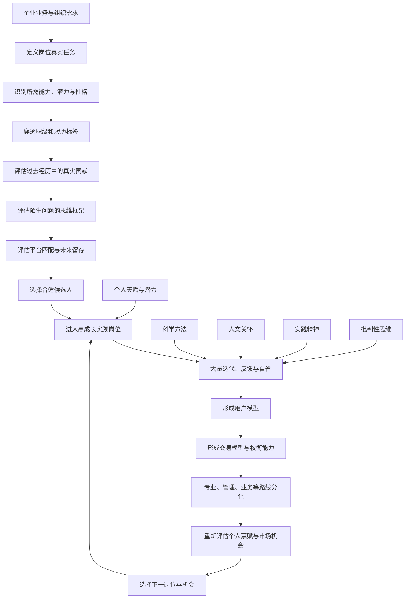

## 1. 本章要回答的问题

前四章讨论了产品经理如何理解用户、设计交易和做出决策。本章把同一套方法用于产品经理自身：企业怎样选择、培养和使用产品经理，个人又怎样选择岗位、积累能力并规划长期职业路径。

本章集中回答以下问题：

1. 为什么不存在适用于所有企业的产品经理选拔标准？
2. 为什么职级、名企、学历、工龄和产品规模不能直接代表真实能力？
3. 产品经理为什么是高度非标准化的职业？
4. 洞察、同理心、逻辑、产品心和自省分别意味着什么？
5. 企业如何判断候选人的真实能力、潜力、岗位适配和留存概率？
6. 产品经理的价值为什么与经验、平台匹配和智慧共同相关？
7. 培养产品经理为什么主要依赖潜力与高质量实践机会，而不是课堂培训？
8. 用户模型、交易模型、科学方法、人文关怀、实践精神与批判性思维如何衡量成长？
9. 产品经理前五年应该怎样积累，五年后有哪些分化路线？
10. 怎样判断一个团队、业务和岗位是否有利于成长？
11. 找工作时如何比较业务、导师、平台、薪酬、风险和长期目标？

本章的核心方法是：**把选人、育人和职业选择都视为约束条件下的双边交易，不寻找抽象意义上的“最好”，而寻找个人禀赋、岗位要求、组织环境和市场机会之间的动态匹配。**

## 2. 一句话结论

优秀产品经理无法仅靠标准课程量产，其成长主要取决于达到基本门槛的潜力、持续自省与学习，以及高成长产品提供的大量真实决策和反馈；企业应穿透履历标签评估候选人的真实能力、潜力、平台匹配与未来留存，个人则应按职业阶段选择最能积累用户模型、交易模型、批判性思维和复杂权衡能力的实践机会。

## 3. 本章论证地图

---

## 4. 选拔的起点：没有通用的“最好产品经理”

现实中的产品经理可能负责需求、生产、销售和协调中的不同部分。行业、企业、产品阶段和组织认知不同，岗位分工也不同；而制度一旦形成，还会因惯例、共同知识和利益结构自我强化。

因此：

> 好产品经理的“好”，首先是与特定企业、业务阶段和岗位任务相适应。

本章重点讨论的是市场需求导向、以权衡决策见长的产品经理，但不能把这套标准机械用于所有岗位。例如，企业软件、增长、商业化、平台治理和项目交付岗位，最关键的能力组合可能不同。

产品经理依赖洞察和思维，知识考试只能覆盖其中一部分。脱离真实用户、组织和市场反馈的学习，无法单独证明一个人能做出高质量产品决策。

---

## 5. 产品经理选拔的常见误区

## 5.1 职级不是能力的可靠代理

作者在大量面试中发现，高职级与专业能力经常不匹配。产品经理职级可能同时受到以下因素影响：

| 类型 | 影响因素 |
|---|---|
| 能力 | 专业能力、业务能力、管理能力 |
| 素质 | 品性、潜力、价值观 |
| 岗位 | 业务规模、团队规模、业务边缘程度 |
| 绩效 | 战功、增长、短期数字、长期贡献 |
| 资历 | 领域经验、工龄、履历背景 |
| 博弈 | 稀缺性、谈判、跳槽升级、挽留、高薪倒推职级 |
| 评审 | 临场表现、评委水平、随机性、作弊、领导强推 |

职级是企业在特定制度下对复杂价值的压缩表达，不是跨公司通用的能力单位。面试不能把它当成结论，只能当作需要解释的背景信息。

## 5.2 晋升标准服务于企业目标

晋升通常在绩效、能力和潜力之间分配权重，不存在脱离企业目标的绝对标准：

- 强调短期绩效，能提高近期战斗力。
- 强调潜力，有利于长期人才储备。
- 强调专业能力，可能提高产品质量和技术含量。
- 强调协作与价值观，有利于组织规模化运行。

合理标准还要考虑业务阶段、人才现状、未来战略、企业历史惯性、外部人才稀缺性和市场接受度。

任何指标都会改变行为。若晋升过度看团队规模，就会激励无效招人；看业务规模，就可能诱发忽略 ROI 的增长；看短期收入，就可能透支品牌和长期用户价值。制度设计必须预判参与者如何响应指标。

## 5.3 高阶岗位更看重品性、潜力与系统影响

高阶产品经理处于组织中枢，需要协调多个团队，决定资源优先级，并影响大量用户和员工的利益分配。职级越高，个人品性、自省、价值观和识人用人的影响面越大，不能只看专业技巧。

低阶岗位的局部技能缺陷可能造成一项功能失败；高阶岗位的认知和品性缺陷可能通过制度与团队被成倍放大。

## 5.4 标签是低成本代理，不是事实

常见简化标签包括：

- 工作年限。
- 名企或知名产品经历。
- 原公司职级。
- 管理人数。
- 毕业学校。
- 技术背景。

在极速扩张或低关键度岗位中，使用标签可以牺牲部分准确性换招聘效率。但关键岗位必须穿透标签，分析候选人在当时资源、团队和市场条件下究竟做了什么、为什么这样做，以及他的判断带来了什么增量价值。

## 5.5 “名校一定加分”为什么不是普遍规则

书中用新人稳定性说明匹配思维：若两位候选人能力相近，拥有高流通性标签的人两年后外部机会可能更多，企业面临更高流失风险。员工在当前岗位获得的净价值，不只是工资，而是当前综合收益减去外部最佳机会：

$$
员工留任净价值 = 当前岗位综合效用 - 外部最佳机会效用 - 转换后的净成本差
$$

这不是说名校本身是缺点，而是说任何标签的价值都取决于岗位、企业成长空间和未来机会成本。高速增长业务、短期项目或真正高潜人才，可能得出完全不同的结论。

> 笔记辨析：把候选人的外部机会视为“不招聘”的理由，可能造成组织只选择不易流动者，损失人才密度。更稳健的做法是同时评估企业能否持续创造匹配的成长价值，而不是单边规避优秀人才的议价能力。

## 5.6 空降高阶产品经理为什么成功率低

高阶产品经理既要纵向理解业务和用户，又要横向获得合作团队认可。空降后会同时失去：

- 领域用户与市场知识。
- 企业内部共同知识。
- 与研发、运营等团队的协作默契。
- 对组织决策风格和隐性规则的理解。
- 原团队对其判断和理念的信任。

空降高阶人员还可能引发原团队离开，进一步增加组织成本。

较适合空降的情境包括：

1. 复制一个已经验证的产品。
2. 从零开始做新产品，大家共同建立新规则。
3. 原产品遭遇重大失败，需要灾后重建。
4. 巨大新要素改变行业，原有经验和平台匹配同时贬值。

---

## 6. 产品经理为什么高度非标准化

职业标准化可以分为几个层次：

| 层次 | 特点 | 选人与评价方式 |
|---|---|---|
| 流程标准化 | 按规定动作工作 | 只需验证能否稳定执行流程 |
| 输出标准化 | 结果能用统一指标衡量 | 可赛马并按量化结果筛选 |
| 技能标准化 | 输出难统一，但技能能认证 | 可通过系统训练、考试和证书培养 |
| 高度非标准化 | 任务、技能、结果和环境都变化 | 需结合实践、情境和潜力判断 |

产品经理难以做到输出标准化：产品成功同时受产品经理、合作团队与企业、环境机遇影响。也难做到技能标准化：关键能力是在不确定环境中权衡、决策、验证和迭代，不能仅靠知识课程获得。

因此评价产品经理应使用三维归因：

1. 产品经理本人的判断与行动。
2. 合作团队和企业资源。
3. 市场、技术、制度与时代机遇。

一个成功产品不自动证明产品经理优秀，一个失败产品也不自动证明产品经理无能。需要还原决策过程和增量贡献。

---

## 7. 按潜力简化分类：A、B、C

作者提出 ABC 分类作为选拔潜力的简化工具，而不是当前能力或人格的客观等级。

## 7.1 A 类：深度思考或超常同理心

### 深度思考

深度思考是持续追问现象背后的本质，在相同信息与时间下，更快或更深地识别共性、差异、因果与关键变量。它能提高对尚未结束的市场变化的预判质量。

事后解释产品成败相对容易；行业仍在演化时，较早识别真实需求、约束和方向，才更能体现洞察。

### 超常同理心

同理心是站在他人视角思考，并较准确地察觉其感受、偏好和成本。用户动机不能像物理量一样被直接测量，因此同理心能帮助产品经理形成更可靠的行为假设。

同理心存在先天差异，也可通过亲身体验、用户样本和刻意练习提高。

## 7.2 B 类：逻辑清晰且有产品心

产品心是对产品工作本身有稳定兴趣，愿意理解用户、改善产品并承担结果，而不是主要被薪酬、声望、权力或短期绩效驱动。

逻辑清晰、有产品心且没有明显短板的人，通过科学方法和优质实践可以成为合格甚至优秀的产品经理。企业最终看的是产出，不是天赋标签；B 类人完全可能在机遇和训练下产生 A 类产出。

书中引用团队 MBTI 分布作为观察，但也明确并非只有某几种人格适合产品工作。

> 笔记辨析：MBTI 的测量稳定性和预测效度有限，不应作为招聘筛选工具。它最多用于触发自我讨论，不能替代行为证据、结构化面试和实践表现。

## 7.3 C 类：存在明显的不适配风险

原书列出的风险包括逻辑混乱、同理心明显不足、功利心过重、自我认知过高、缺少好奇和思考、只爱点子而不重视验证，以及不愿投入大量时间积累样本。

这些问题的共同点是会阻断产品工作的反馈循环：

- 看不清因果，无法形成可靠判断。
- 不理解他人，无法建立用户模型。
- 只追逐外部收益，容易透支长期价值。
- 不承认错误，无法根据反馈更新。
- 只想不做，认知无法被实践检验。

> 笔记辨析：原书把不爱加班、期望规律生活视为不适合产品经理，这带有特定互联网高速增长时期的工作文化色彩。真正必要的是能否获得足量、高质量的实践与反思，不应把长工时本身当作能力、热爱或产出的证明。可持续工作方式也属于长期效用与成本的权衡。

## 7.4 分类法的边界

- 人是连续分布，不会天然落入三个盒子。
- 分类只描述潜力假设，不代表当前能力或未来结果。
- 面试对天赋、性格和长期潜力的判断误差很大。
- 科学方法、实践质量、导师和时代机会可能改变产出。
- 企业最终需要的是岗位适配与实际贡献，而不是标签纯度。

---

## 8. 产品经理分级与负责人更换

## 8.1 为什么精细分级困难

产品经理职级要同时处理：

- 绩效受环境和团队显著影响。
- 专业、业务和管理能力难以统一换算。
- 长期产品贡献不能及时测量。
- 潜力不确定，实践机会也不均等。
- 非标准化能力难以用相邻 20%～30% 的级差精确区分。

低阶分级可以主要用于筛选、学习反馈和心理激励；高阶分级则更应关注关键负责人、骨干和高潜人才，而不是追求对所有人的伪精确排序。

## 8.2 经验早期增长快，后期边际递减

新人前几年会快速掌握产品生产、迭代、组织机制和领域知识。五年左右，基础经验逐渐稳定，继续做完全相同的工作，新增经验的边际收益下降。之后差距更多来自专业判断、管理、潜力、性格与新挑战。

这不是“五年必然成熟”的机械规律。产品迭代密度、问题复杂性和反思质量不同，五年经历可能对应完全不同的有效经验。

## 8.3 产品团队是少数关键人的游戏

产品产出主要依赖决策质量，而非简单人头规模。团队领导者和少数骨干通常决定方向、标准和人才密度。因此培养倾斜更适合通过有挑战的任务和实践机会实现，而非破坏公平的特殊晋升。

## 8.4 更换产品负责人的权衡

成熟业务负责人拥有大量领域经验、平台匹配和合作关系。更换他的损失相对确定，继任者收益却不确定，因此“无过换将”成本高。

判断前应先做三维归因：问题主要来自负责人、合作团队，还是环境？若负责人确是关键瓶颈，可选方案也不止换人：

- 调整其职责或分割业务。
- 转去负责新产品。
- 通过利益、反馈和团队建设促成改变。
- 引入互补人才。
- 在有高把握继任者时更换。

较需要换人的情境包括巨大新机遇、严重失败后的重建，以及负责人的短板已成为业务核心瓶颈。

### 未雨绸缪的两种方法

1. 尽早关注下属团队质量，要求负责人持续招聘和培养人才。
2. 在条件允许时建立第二产品负责人或相对独立产品，形成比较、竞争和继任选择。

这既降低单点依赖，也让组织更早发现负责人的能力边界。

---

## 9. 如何培养产品经理

作者把培养的主要条件概括为：

1. 找到有潜力的人。
2. 放到有成长性的产品岗位。
3. 在真实问题上持续指导权衡、识人用人和认知校准。

前两项决定大部分结果。没有基本潜力，成长速度和上限受限；没有高质量实践，潜力也无法兑现。

## 9.1 实践机会为什么如此重要

产品能力来自对真实约束的反复接触：用户体验、偏好差异、制度、技术、收入、成本、时间、组织和多方利益都会冲突。只有在真实迭代中应用、挑战和验证，才能理解各约束的属性、弹性与边界。

小规模、低复杂度实践能培养的能力有限。大规模、高成长产品提供更密集的反馈、更复杂的权衡和更高影响，因此是稀缺的学习资源。

成功产品是培养好产品经理的重要条件，但成功产品经理不一定是产品成功的决定性原因。新技术红利、企业资源与时代机遇也可能推动平庸决策取得好结果。

## 9.2 产品教学更接近师徒制

产品教学要围绕双方共同掌握信息的同一个问题：

- 一起分析真实需求和方案。
- 一起观察上线反馈。
- 比较事前判断与事后行为。
- 一起面试、评价和使用同一个候选人。
- 持续校准双方对用户、业务和人才的模型。

抽象课程可以教知识和工具，却无法替代这种共同标的、连续反馈的学习。导师影响范围天然有限，通常只能深入影响身边少数人，再由他们继续传递。

## 9.3 理性选择不能保证正确结果

个人选择只基于过去和当前信息，未来还取决于其他人的行为及不可预知变化。理性只能提高决策质量，不能消灭偶然性。

可以把“通过理性推理做出正确选择”限定为：多年以后没有发现明显更优选择，且当时推理已经抓住所有关键变量。即使如此，也只能事后判断。

适合理性选择需要三个条件：

1. 问题本身适合理性分析，而非高度不可预测。
2. 决策者较充分掌握关键变量。
3. 思考时间成本不会让机会在分析中消失。

---

## 10. 产品经理对企业的价值

产品经理岗位价值受到企业分工、组织偏好、产品复杂性、个人专业与推动能力，以及体验对用户行为的影响权重等因素影响。

作者给出一个简化公式：

$$
产品经理价值 = 经验等级 \times 平台匹配度 \times 智慧等级
$$

它不是可精确计量的公式，而是提醒企业不能只看通用能力。

## 10.1 经验等级

经验包括领域用户、市场、政策、竞争、供给和上下游知识。早期随实践快速增长，长期做同类问题后边际收益递减。更换领域会使大量专用经验贬值。

## 10.2 平台匹配度

平台匹配包括：

- 对组织隐性规则和文化的理解。
- 与合作团队的共同知识和信任。
- 推动决策所需的人际网络。
- 对企业资源与能力边界的了解。
- 与团队理念和决策方式的兼容。

换公司后，这部分价值需要重新积累，是高阶空降困难的重要原因。

## 10.3 智慧等级

智慧等级指在同等条件下更快、更深地识别关键变量、因果和规律。高智慧等级提高经验的迁移能力：即使更换领域，也能更快建立模型，并把旧领域经验与新问题结合。

智慧等级不高但领域经验丰富的人，仍能在相同领域创造很高价值；若岗位只需要复制成熟模式，这种匹配也完全合理。

## 10.4 公式的管理含义

- 高阶人才价值具有强岗位依赖，市场价格不能直接平移。
- 招聘复制型任务时可优先看经验。
- 招聘新领域负责人时应更看学习和洞察。
- 内部培养能保留平台匹配，常比外部空降更有效。
- 灾后重建或技术代际变化会让所有人的平台匹配重新归零。

---

## 11. 如何面试产品经理

## 11.1 深挖一件熟悉的事

围绕候选人真实做过的产品、功能或活动连续追问：

1. 为什么开始做？问题是怎样被发现的？
2. 当时考虑了哪些用户、约束和未来变化？
3. 遇到了什么问题，如何解决？
4. 哪些事实与原认知不同？
5. 形成了什么不同于市场常识的洞察？
6. 后续怎样迭代和验证？
7. 现在的认知与当时有何变化？
8. 回到当初，会怎样重新选择？

重点不是产品绝对规模，而是候选人在给定条件下的认知增量。

可以用比值思维：

$$
潜力信号 \approx \frac{洞察、学习与决策增量}{时间、资源、任务复杂度与环境支持}
$$

同等产出下，经验更少、资源更差却能形成较深认知的人，可能具有更高学习速度。但不能因此浪漫化资源匮乏，也要核实真实贡献。

## 11.2 给出一件陌生的事

选择面试官熟悉、候选人不熟悉的问题，观察他如何：

- 澄清目标与边界。
- 获取缺失信息。
- 识别用户和参与方。
- 发散备选方案。
- 找关键约束与变量。
- 权衡效用、成本、风险和概率。
- 收敛并说明验证方法。

这比考察现成行业知识更能显示候选人的思维框架和迁移能力。

## 11.3 简历是一项产品

简历体现候选人怎样理解招聘方需求、选择信息和表达自我。产品经理投递不同岗位时，应针对岗位重组重点；完全没有针对性，可能意味着同理心、投入程度或求职兴趣不足。

“标签最大化”提醒面试官：人倾向用最有利的范围描述自己。例如模糊写“排名前三”，可能意味着实际处于该标签中较弱位置。标签不能直接定罪，但可与后续事实对照，判断总结能力和夸大程度。

## 11.4 高潜和高阶人才还要看两年后的交易

高阶人才离职替换成本高，因此要预判：

- 两年内岗位、薪酬和职级还有多少成长空间？
- 产品能否提供足够复杂和有价值的挑战？
- 候选人的能力成长与期望是否匹配？
- 两年后他的外部机会成本会怎样变化？
- 企业是否有能力继续创造留任净价值？

招聘不是只判断“现在能不能做”，而是判断未来一段时间双方是否仍愿意持续交换。

## 11.5 管理能力与专业能力

管理能力主要看：

1. 内部识人、用人和激励，以及外部协调的人际能力。
2. 对人和事进行权衡与分配优先级的决策能力。

不应同时要求专业、管理和技术全部顶尖。每增加一个非必要约束，都会缩小候选范围、增加招聘时间，并错失其他维度优秀的人。

专业能力可从四个角度考察：

- 批判性思维。
- 同理心。
- 对既有领域用户模型的掌握。
- 产品基础技能熟练度。

## 11.6 潜力的三个重要信号

### 自省

自省是发现并承认自己的短处，然后选择改善方式：

- 学习，补到合格或优秀。
- 合作，寻找互补伙伴。
- 雇用，让更合适的人承担。
- 回避，不进入自身劣势决定成败的方向。

职级越高，自己每项能力都强越不现实，准确识别短板和组织互补资源反而越重要。自省使人具备持续进化能力。

### 学习意愿与能力

愿意从实践、阅读和反馈中改变认知，决定成长速度。只想不练，或积累经历却不反思，都不能形成有效经验。

### 高成就动机

稳定追求更高标准和更大价值，会影响一个人是否主动承担挑战、持续投入和突破舒适区。

这些长期属性很难在短面试中准确判断，入职后的任务与反馈仍需继续验证。

## 11.7 当前好与未来好

招聘成熟对口人才，可以降低眼前培训成本，但候选范围小、价格高；招聘高潜新人，初期培养成本高，却可能形成更好的平台匹配、共同知识和长期价值。

人才组合应同时考虑：

- 当前交付能力。
- 未来骨干储备。
- 不同经历与思维的多样性。
- 业务两三年后的岗位容量。
- 晋升空间与留存风险。

同质化高潜人才过多，也会产生边际收益递减和晋升拥堵。

---

## 12. 产品经理成长的关键标准

## 12.1 视角一：用户模型与交易模型

### 用户模型

掌握用户模型需要积累大量具体样本：亲身体验、用户反馈、坏案例、行为数据、事前预测和上线验证。检验标准是能否较准确预测产品变化后的用户行为。

其他岗位直接转任高阶产品经理常遇到困难，因为缺少从一线重建用户样本的过程。职级越高，越难放下管理任务补齐基础。创业者若亲自深入一线，则可能完成这项积累。

### 交易模型

掌握交易模型要求理解领域交易成本、多方价值判断、利益分配和长期博弈。目标是设计可持续互惠机制，创造有利可图的用户价值。

真正重视用户，就要让企业有能力持续供给；真正希望企业赚钱，也要为足够多用户创造愿意付费的价值。用户价值与商业价值在交易模型中统一。

## 12.2 视角二：科学方法、人文关怀与实践精神

### 科学方法

包括逻辑、概率、控制实验、理性决策和经济学方法。它们帮助产品经理：

- 区分事实、相关与因果。
- 在不确定性中使用概率而非绝对判断。
- 用实验验证关键变量。
- 在稀缺约束下比较效用与成本。

### 人文关怀

包括用户样本、同理心、心理学、进化论和博弈论等。产品面对异质、情境化并会互相影响的人，不能只靠抽象平均值。

### 实践精神

关键词是事实、数据、观察、实践、权衡、反馈、迭代和自省。产品经理不仅提出想法，还要考虑可行性、推动落地、承担结果，并根据反馈修正。

产品工作与纯分析、咨询或策划的重要区别，是它从一开始就必须面向真实结果。

## 12.3 视角三：批判性思维

批判性思维是有目的、自我校准、开放且基于证据的判断。核心态度是：**大胆质疑，谨慎断言。**

关键能力包括：

- 区分事实与观点、理性断言与情感断言。
- 检查信息来源、目的、前提和隐喻。
- 识别证据不足、逻辑错误和论证漏洞。
- 处理矛盾、不充分和模糊的信息。
- 基于数据形成不过度延伸的结论。
- 提出替代方案并考虑所有利益相关方。
- 清晰组织和表达复杂论证。
- 对分歧保持开放并持续自我校准。

作者把思维成长粗分为三个阶段：

1. **无知的确定性**：不知道复杂性，却盲目确信唯一答案。
2. **有知的混乱性**：看到各方都有道理，却无法比较优劣。
3. **批判性思维**：在承认复杂性的同时，依靠证据、逻辑和价值权衡形成暂时结论。

产品经理的成熟不是从“有答案”变成“没有答案”，而是从武断答案走向有条件、可证伪、可修正的判断。

---

## 13. 产品经理前五年的成长

前五年大致是从新手到熟手的阶段，最重要的是建立足量实践样本和基础思维框架。

## 13.1 大量迭代，并把经历转成经验

产品学习由阅读、思考和实践共同构成，最短板决定上限：

$$
有效经验 \approx 阅读 \times 思考 \times 实践反馈
$$

只有经历，没有事前预测、事后复盘和规律抽象，不等于经验。职业早期应优先选择有大量真实迭代的岗位，而不是只追求著名成熟产品的光环。

成熟大产品若分工极细、形态稳定且缺少创新，新人可能只成为高质量执行者，样本和决策成长反而有限。

## 13.2 加入有产品心的小团队

公司品牌和最高管理者离新人较远，直接汇报者和日常协作同伴才决定实际学习环境。好的小团队会：

- 围绕真实问题认真讨论。
- 允许异见和自我否定。
- 跟踪上线反馈。
- 重视用户与长期价值。
- 让新人参与完整决策，而不只执行碎片任务。

产品文化应以身边真实行为判断，而不是企业宣传。

## 13.3 六类值得补齐的实践

### 从 0 到 1

经历从想法到产品、从无用户和资源到建立初步交易的过程，可补齐问题发现、发散收敛和初始市场验证。但重复做相似的 0 到 1，边际收益会下降，价值更取决于产品后续成长。

### 做深做透

在大型成熟产品中深入一个细分用户或场景，理解复杂机制、长尾问题和边际优化。长期只做宽泛工作的人需要补充这种深度。

### 做宽做杂

在中小团队接触功能、交互、数据、增长、客服、销售支持和项目协作，建立全局观。大公司中长期单点分工的人可主动扩展边界。

### 大用户量

大规模产品有两个学习价值：

- 微小改动能产生大量反馈，显著提高验证灵敏度。
- 用户异质性、情境性、平台外部性和生态问题更充分暴露。

小产品增长可能依赖资源、运营和热点；规模足够大后，长期增长更依赖真实用户价值。

### 商业闭环

产品经理要理解用户价值与企业可持续经营。互联网向线下服务和传统产业渗透后，供给、履约和运输有真实边际成本，只谈免费体验已经不够。

商业闭环不等于短期变现，而是让用户、企业和关键参与方长期愿意交易。

### 团队建设

产品经理最终需要借团队扩大产出，但职业前三年通常更应积累一线实践。过早管理会占用建立用户模型和专业基础的稀缺窗口。

初学管理的关键是选人和授权。下属某项工作的绝对产出不如你，不代表应由你亲自做；要比较的是双方按比较优势分工后的总产出。

## 13.4 产品经理是否必须懂技术

懂技术通常有益，但它只是众多可能能力之一。产品经理也可能需要理解设计、交互、运营、供应链、数据、营销、战略和管理，不可能全部精通。

每增加一项硬性要求，都会缩小候选范围、增加招聘成本，并放弃其他维度优秀的人。应比较：

$$
新增能力要求的岗位收益 \quad 与 \quad 缩小人才池的机会成本
$$

一般而言，理解用户和善于权衡更接近产品经理的核心，其他能力取决于具体业务、团队互补和岗位阶段。

---

## 14. 五年后的职业分化

五年后，基础产品经验的差异缩小，高阶岗位数量有限，成熟产品又有很高迁移成本，竞争开始转向稀缺能力、领域积累和组织价值。

## 14.1 专业路线：权衡决策与交易模型

专业天赋和判断能力突出的人，可以继续争取高成长、高复杂度岗位。专业能力要从单纯用户体验升级到交易模型：既创造用户价值，又设计可持续盈利和多方平衡。

只会做体验或只会变现都有局部价值，但上限受限。能让企业在不透支用户的前提下提高长期收益，才是更稀缺的能力。

## 14.2 管理路线：识人用人和分优先级

管理不仅是计划、组织、领导和协调，更重要的是：

- 找到优秀人才放在关键岗位。
- 帮助人才成长并形成互补团队。
- 把资源投入价值最高的问题。
- 让优秀下属承担真实决策。

个人延长工时只能有限提高产出，一个正确的项目取舍却可能带来数量级差异。分优先级是产品管理者的核心杠杆。

专业天赋高的人可更晚转管理，继续发挥稀缺判断优势；专业天赋一般的人可更早通过识人用人放大优秀下属的产出。

## 14.3 业务路线：积累领域与平台知识

在同一长期发展业务中持续积累，可以形成：

- 深厚领域知识。
- 用户、政策和产业链理解。
- 企业内部共同知识和人际信任。
- 更低的组织交易成本。

风险是业务一旦停滞或衰退，领域经验和平台匹配的保护会消失，外部市场价值可能显著下降。因此业务路线要优先判断赛道能否长期发展。

ToB 工具和企业服务通常岗位容量更大、需求稳定、经验迁移性较强，可成为求稳方向。ToC 可能产生巨大赢家，但竞争淘汰率高，不能只看幸存者。

## 14.4 新产品或创业：高风险与高收益

早期业务方向未明，收益更依赖冒险、试错和偶然性。普通产品经理机会成本较低，参与高风险项目可能更划算；极优秀人才若已有高价值稳健机会，投入纯早期试错的机会成本反而更高。

业务找到方向进入高增长，或后期复杂权衡增多时，优秀产品经理的决策优势更能兑现。

这只是一般风险收益分析。若个人对方向有独特洞察，或该事业承载其信念和非货币效用，选择可能不同。

## 14.5 出海

国内市场成熟、竞争激烈且交易成本上升，海外部分市场仍有空白。中国互联网竞争中形成的经营和产品能力可能具有比较优势，但不能把国内方案直接复制到不同文化、制度、供给和支付环境。出海仍需重建本地用户模型和交易模型。

## 14.6 路线不是互斥终身选择

专业、管理、业务、创业和出海可以在不同阶段组合。选择应根据：

- 个人天赋、偏好和风险承受力。
- 当前能力短板。
- 可获得的实践机会。
- 家庭、健康和财务约束。
- 市场供需与时代新要素。
- 短、中、长期目标。

---

## 15. 产品经理的成长环境

## 15.1 常见不利因素

原书列出的不利环境包括：

- 只看短期利益。
- 个人崇拜和行政干预。
- 内部争斗严重、价值观恶劣。
- 老板或直接上级缺乏深度思考。
- 论资排辈、合作者缺少批判性思维。
- 迭代周期长、用户量少、分工过细。
- 业务成熟稳定，工作内容缺少变化。
- 行业垄断和高利润，缺少竞争反馈。
- 产品结果主要由技术、设计、营销、供给或渠道决定，使产品判断缺少练习空间。

没有完美环境。产品经理要识别最关键约束，评估自己能否适应或影响，而不是试图找到没有缺点的公司。

## 15.2 有利环境的五项因素

### 逻辑

团队能区分事实、观点、相关和因果；既有确定性推理能力，也能在信息不全时做有条件的判断；允许质疑权威和自我否定。

### 同理心

团队愿意亲自体验产品，从多个地区、价格层和用户角色理解行为，预判产品变化对利益链各方的影响。

### 经验

经验是广义阅读、真实经历和规律思考的结合。工龄只是经历；只有比较共性与差异、形成可验证认知，才成为经验。

### 异见

真正的平等不是所有人补充领导观点，而是成员能够提出否定性意见。发散阶段需要多角度异见，收敛后则形成执行共识。

异见质量也依赖人才密度。没有事实和思考能力的无限讨论，只会增加组织成本。

### 数据

数据像医生的诊断仪器，能显著提高观察和验证效率，但不等于诊断本身。团队既要有数据能力，也不能只选择可 A/B 测试或高层关注的项目。

方向明确的高速迭代适合数据驱动；寻找未知方向时，数据更适合作为部分证据，而非唯一决策者。

---

## 16. 阅读、思考与实践

原书推荐的学习方向围绕三类能力展开。

## 16.1 基础与反复阅读

- 《社会心理学》：科学方法、人文关怀、实验与人性常识。
- 《第一本经济学》：用通俗方式建立经济学基础。
- 《学会提问》：训练批判性思维和论证判断。

## 16.2 思维与决策

- 《认知心理学及其启示》：理解认知和思维机制。
- 《思考，快与慢》：理解判断偏误和双系统。
- 《超越智商》：训练理性思维。
- 《思维与决策》：系统学习决策研究。

## 16.3 经济学、制度与交易

- 微观经济学基础教材。
- 行为经济学。
- 新制度经济学与交易费用。
- 奥地利学派关于信息、行动与市场过程的讨论。
- 博弈论及其社会应用。

## 16.4 心理、组织与沟通

- 进化心理学与发展心理学。
- 消费者行为学。
- 组织行为学。
- 人际沟通。

书单不是统一课程表。是否投入时间阅读一本书，应比较个人已有知识、当前短板、应用机会和边际收益。

### 难书的阅读方法

1. 先看高质量书评，建立概念地图。
2. 搜索难懂概念，比较多种解释。
3. 同主题换一本入门书，从不同角度接近。
4. 摘录关键内容，同时写下自己的反例和应用。
5. 把概念用于实际问题，通过反馈检验是否真正理解。

阅读若不进入思考和实践，只增加熟悉感，不等于能力增长。

---

## 17. 产品经理如何找工作

## 17.1 职业路径只能由自己选择

最优职业选择是个人禀赋与偏好同市场机会匹配，使双方总效用最大化。别人可能更了解市场，却不能比本人更了解其风险偏好、家庭约束、信念和长期目标。

新人前三四年更应优先打基础：找产品文化良好的小团队，多做、多想。之后再针对短板补充复杂性、用户模型、商业闭环、深度或广度。

## 17.2 价值不等于市场价格

产品经理对企业的价值来自经验、平台匹配和智慧；市场价格还取决于：

1. **有效用**：是否能为目标企业创造价值。
2. **被认知**：企业是否理解和相信这项价值。
3. **稀缺性**：市场上有多少可替代人才。

提高价格的路径相应是：增强能力、让价值被可信地识别、发展市场急需但供给不足的稀缺能力。

## 17.3 产品岗位价值公式

作者给出一个简化判断：

$$
产品岗位价值 = 事情的价值 \times 团队成功率 \times 成功后的个人回报
$$

优先判断“事”：产品是否为用户创造真实价值，业务是否具有成长空间。其次判断团队人才质量和产品心，最后看成功后个人能获得的能力、声誉、收入和机会。

公式还应补充失败情境：即使产品失败，能否积累可迁移认知、团队关系和有效经验？以及失败成本是否可承受？

## 17.4 天赋高者为什么可以多换业务

长期只做同一业务，专用经验继续增长，但边际收益会下降。跨领域能检验哪些规律可迁移、哪些依赖情境，帮助经验上升为更一般的理论。

不过换业务也会损失平台匹配和领域深度。只有当新增认知价值高于转换成本时才值得，不应把频繁跳槽等同于学习。

## 17.5 薪酬谈判

长期收入是个人创造价值能力在市场上的租金，短期价格还受供需、认知和谈判影响。职业早期可优先选择高质量实践，不必对每次小额差异过度优化。

若谈薪，尽量一次明确双方预期；反复争取会增加交易成本。企业若长期只在员工每次施压后才调整，可能反映内部定价与激励机制低效。

个人高薪不等于好岗位。产品经理产出依赖团队，如果周围人才薪酬缺乏竞争力、长期流失，个人也缺少生产资源。应同时看内部长期公平和整体人才市场竞争力。

## 17.6 业务、平台和导师怎么排序

不存在普遍公式。对优秀新人，在候选业务差异不极端时，原书给出的参考顺序是：

$$
直接导师 > 业务 > 平台品牌
$$

原因是新人对大平台结果影响很小，日常学习主要来自直接负责人和共同解决问题的团队。若业务成长速度差距巨大，则业务机会可能超过导师差异；高速增长团队也会吸引和筛选更强人才。

## 17.7 选择人才质量正向上升的组织

产品经理依赖其他团队，而且自身产出难度量，因此对组织逆向淘汰尤其敏感。

影响组织长期人才选择方向的变量包括：

- 垄断程度与外部竞争压力。
- 各职业产出的可度量性。
- 产权、激励和约束设计。
- 领导者的能力与品性。

前几项短期难改，直接领导常是个人更可判断的变量。

按规划周期，可采用不同重点：

- 一两年看增长和最密集的战场。
- 三五年看行业和个人能否创造最大用户价值。
- 十年以上看领导者的能力、性格与价值观。

## 17.8 “产品经理改造传统行业”的边界

互联网本身一直在重塑媒体、零售、交通、餐饮、教育、支付和旅游。掌握几个互联网工具，并不意味着新人能轻易战胜长期竞争中幸存的产业经营者。

传统行业领先者拥有深厚领域知识、供应链、渠道、制度和用户关系。新产品必须创造足够大的增量价值，才能覆盖用户和组织的替换成本；内部推动还会面临既有利益与流程阻力。

更可行的路径通常是通过新企业、新平台或产业持续数字化逐步改变，而非仅把互联网职位和工具移植进原组织。

## 17.9 目标和代价

一个人声称重视什么，不如观察他愿意为它放弃什么。企业说重视用户体验，却不接受任何收入下降，说明体验的真实权重有限；个人说有产品情怀，也应说明愿意承担哪些直接成本、交易成本和机会成本。

长远目标可以降低日常决策成本。目标未必永远正确或一定达成，但明确目标使大量取舍拥有共同参照。

每次找工作前应回答：

1. 我的短期、一年目标是什么？
2. 我的中期、三到五年目标是什么？
3. 我的长期、十年目标是什么？
4. 为每个目标愿意支付什么代价？
5. 哪些代价只能由我承担，不能要求企业或同事替我支付？
6. 这个岗位与企业是否恰好拥有共同利益？

---

## 18. 本章完整推理链

1. 产品经理岗位因企业、业务和阶段而异，不存在跨组织统一的最佳标准。
2. 职级、履历和产品结果同时受能力、岗位、绩效、资历、博弈与评审影响，不能直接代表真实专业能力。
3. 产品经理的流程、输出和技能都难标准化，选拔必须结合具体经历、三维归因和岗位情境。
4. 简化标签适合低成本粗筛，关键岗位则必须穿透标签分析真实贡献和判断过程。
5. A、B、C 分类只是假设潜力的粗略工具，企业最终需要的是实际产出与岗位适配。
6. 高阶产品经理价值还依赖品性、自省、平台匹配与组织影响，空降会损失大量共同知识。
7. 培养好产品经理的主要条件是基本潜力和高成长实践岗位，课堂知识只能提供辅助工具。
8. 产品教学需要围绕共同的真实问题、连续迭代和反馈，更接近小规模师徒制。
9. 产品经理对企业的价值同时取决于领域经验、平台匹配和洞察迁移能力。
10. 面试应深挖一件熟悉的事以判断认知增量，再用陌生问题观察思维框架。
11. 自省是重要潜力，因为承认短板后才能通过学习、合作、雇用或回避持续进化。
12. 成长可以从用户模型和交易模型，或科学方法、人文关怀、实践精神与批判性思维来衡量。
13. 前五年应优先积累大量真实迭代，加入有产品心的小团队，并补齐从零到一、深度、广度、规模、商业和团队经验。
14. 五年后基础经验边际收益下降，职业可向专业、管理、业务、新产品创业或出海等方向分化。
15. 成长环境的关键不是公司口号，而是身边团队是否重视逻辑、同理心、有效经验、异见和数据。
16. 阅读只有与思考和实践形成反馈，才会转化为产品能力。
17. 职业选择要匹配个人禀赋与市场机会；价值、被认知程度和稀缺性共同决定市场价格。
18. 岗位价值取决于事情本身、团队成功概率和成功后的回报，也要计算失败成本与可迁移积累。
19. 新人通常更应看直接导师和实际业务，而不是只看平台标签。
20. 长期职业质量取决于组织人才选择方向、领导者和个人是否拥有明确目标，并愿意承担与目标匹配的代价。

---

## 19. 可直接使用的工作方法

## 19.1 岗位定义卡

招聘前先填写：

1. 这个岗位真正负责需求、生产、销售、协调中的哪些部分？
2. 当前最关键的业务瓶颈是什么？
3. 岗位需要复制成熟模式，还是探索未知方向？
4. 最重要的三项能力是什么？哪些能力可由团队互补？
5. 候选人入职一年后用什么行为和结果判断成功？
6. 该岗位能给候选人什么成长、资源和长期回报？
7. 哪些外部机会可能导致候选人离开？

## 19.2 履历穿透表

| 表面标签 | 需要追问的事实 |
|---|---|
| 知名产品 | 候选人负责哪部分，决策权和增量贡献是什么 |
| 高职级 | 职级由绩效、管理、稀缺性还是挽留形成 |
| 大团队 | 团队为何扩大，人均产出与人才质量怎样 |
| 高增长 | 增长来自产品、运营投入还是行业红利 |
| 名校/名企 | 标签与岗位能力有何因果关系 |
| 多年经验 | 经历了多少高质量迭代，形成哪些可验证认知 |

## 19.3 结构化面试评分

建议对所有候选人使用相同主问题，并按行为证据记录：

| 维度 | 观察点 | 证据 |
|---|---|---|
| 批判性思维 | 能否质疑目标、识别前提、主动证伪 |  |
| 同理心 | 能否准确描述多方效用与成本 |  |
| 用户模型 | 能否预测具体情境下的行为 |  |
| 交易模型 | 能否分析利益创造、分配与持续性 |  |
| 实践精神 | 是否有假设、验证、反馈和迭代 |  |
| 自省 | 是否承认错误并说明认知如何变化 |  |
| 学习速度 | 相同时间与资源下的认知增量 |  |
| 平台匹配 | 与任务、团队和文化是否兼容 |  |

结构化评分用于减少偏误，不代表能力能被精确量化。评分必须附具体证据，避免面试官只凭总体感觉。

## 19.4 两年留存与成长检查

- 业务能否持续提供更复杂的问题？
- 候选人的薪酬和职级是否有合理空间？
- 他希望积累的能力能否在岗位获得？
- 外部市场机会会怎样变化？
- 团队是否有互补人才和好导师？
- 企业能否让其价值被认识并公平回报？
- 若离职，双方的替换成本分别是多少？

## 19.5 个人成长季度复盘

1. 本季度做了多少次可验证的行为预测？准确率怎样？
2. 新增了哪些用户样本和坏案例？
3. 对交易成本和多方利益有什么新认知？
4. 哪个决策被现实证伪？为什么？
5. 阅读、思考、实践中哪一项是短板？
6. 当前工作重复度是否导致边际成长下降？
7. 下一季度应补深度、广度、规模、商业还是团队能力？
8. 有什么短板需要学习、合作、雇用或回避？

## 19.6 成长机会评估表

| 维度 | 问题 |
|---|---|
| 迭代密度 | 是否能频繁提出假设并获得真实反馈 |
| 问题复杂度 | 是否涉及多用户、多方利益和不确定性 |
| 决策空间 | 自己是执行任务，还是参与定义问题与取舍 |
| 用户规模 | 是否有足量、异质的行为样本 |
| 商业闭环 | 能否接触收入、成本、供给与长期可持续性 |
| 团队文化 | 是否允许异见、自省和基于事实讨论 |
| 导师质量 | 是否能围绕同一问题持续讨论与校准 |
| 失败成本 | 试错是否可承受、可复盘、可迁移 |

## 19.7 职业路线选择表

| 路线 | 适合条件 | 主要收益 | 主要风险 |
|---|---|---|---|
| 专业 | 洞察和权衡能力突出 | 建立稀缺交易模型能力 | 高质量岗位少 |
| 管理 | 擅长识人、用人和优先级 | 放大团队产出 | 过早管理损失专业积累 |
| 业务 | 找到长期发展的领域 | 经验与平台匹配持续积累 | 业务衰退后价值难迁移 |
| 新产品/创业 | 风险承受力高、机会成本较低或有独特洞察 | 高成长带来超额收益与历练 | 失败率高、幸存者偏差 |
| ToB | 偏好稳定、可迁移的业务积累 | 岗位容量与需求较稳 | 可能远离大规模消费用户模型 |
| 出海 | 有成熟能力且愿重建本地模型 | 新市场和比较优势 | 文化、制度和供给差异 |

## 19.8 求职决策备忘录

1. 我的短、中、长期目标分别是什么？
2. 当前最需要补的能力是什么？
3. 这件事本身为用户创造什么价值？
4. 团队成功概率和人才质量怎样？
5. 直接导师能否提供真实问题上的反馈？
6. 成功与失败时，我分别能获得什么？
7. 薪酬之外的效用和成本是什么？
8. 放弃的最佳机会是什么？
9. 我愿意为目标付出什么，不愿付出什么？
10. 企业是否与我的目标存在足够共同利益？

---

## 20. 容易误读的观点

### 误读一：不存在统一标准，所以选拔只能凭感觉

岗位非标准化不等于无法结构化。应先定义任务，再用一致问题、行为证据、三维归因和入职后表现持续验证。

### 误读二：职级和名企经历完全没有价值

它们是有信息量但噪声较大的代理变量。可用于粗筛和提出假设，不能代替对真实贡献的调查。

### 误读三：潜力比当前能力重要，所以只招聪明新人

潜力能否兑现取决于实践、导师、动机和岗位空间。团队还需要当前交付、经验互补与合理人才结构。

### 误读四：A 类一定优于 B 类

分类只是潜力假设。B 类在科学方法和优质实践下可以产生更高产出，企业购买的是实际价值而非标签。

### 误读五：产品经理必须牺牲生活并长期加班

足量实践和专注投入重要，但工时不等于有效反馈。长期健康、家庭与认知状态也是成本，可持续产出比表面时长更重要。

### 误读六：产品经理不能通过学习培养

产品经理不能只靠课堂量产，但逻辑、概率、经济学、心理学和批判性思维可以学习。知识需要与实践结合。

### 误读七：成功产品必然培养出优秀产品经理

成功提供稀缺实践机会，却也可能主要来自时代红利和企业资源。是否成长取决于参与深度、反思和反馈。

### 误读八：经验五年后就没有价值

重复经验的边际收益下降，但领域深度、复杂权衡、平台共同知识和管理能力仍能持续积累。

### 误读九：高阶人才不适合空降

空降成本较高，并非不能成功。复制、新产品、重建和技术代际变化等情境会提高成功率，良好入职设计也能降低成本。

### 误读十：专业天赋一般就应该尽早做管理

管理不是专业路线的退路，也需要识人、决策和责任能力。是否转管理应看比较优势、兴趣和组织机会。

### 误读十一：ToB 稳定，ToC 才能成就优秀产品经理

两者提供不同问题和风险结构。ToB 也有复杂用户、交易和组织问题，ToC 的大规模机会则伴随高淘汰率。

### 误读十二：天赋高就应该频繁换业务

跨领域有助于抽象共性，但会付出领域和平台匹配成本。应在当前成长边际下降且新机会价值更高时切换。

### 误读十三：选好导师比业务和平台永远重要

这是新人且业务差异不极端时的参考。爆发性业务、重大新技术或特殊平台资源可能改变排序。

### 误读十四：情怀没有价值

信念和意义本身可以产生巨大非货币效用。关键是明确由谁承担代价，并寻找愿意共同交换的企业和伙伴。

### 误读十五：产品岗位价值公式可以直接打分计算

事情价值、成功率和回报都包含主观判断与不确定性。公式用于强迫完整思考，不提供伪精确答案。

---

## 21. 本章结论

1. 产品经理是高度非标准化职业，最优选拔标准取决于企业、业务阶段和岗位任务。
2. 职级、名企、工龄、学历和产品规模只是代理变量，必须还原候选人的真实贡献与决策过程。
3. 晋升制度是激励机制，应服务于企业短、中、长期目标，并预防参与者围绕指标采取机会主义行为。
4. 高阶产品经理是组织中枢，品性、自省、潜力、识人用人和平台匹配的重要性上升。
5. 空降会损失领域经验、共同知识和团队信任，在复制、新产品、重建和新技术窗口中更容易成功。
6. ABC 分类只能粗略描述潜力风险，不代表当前能力、人格等级或确定的未来结果。
7. 深度思考和同理心是稀缺优势，逻辑清晰、产品心、科学方法和优质实践也能形成高水平产出。
8. 培养产品经理的主要条件是有潜力的人和有成长性的实践岗位，导师通过真实问题上的持续反馈提高效率。
9. 产品经理价值同时依赖经验等级、平台匹配度和智慧等级，因而具有强岗位情境性。
10. 面试应结合熟悉项目深挖、陌生问题推演、行为证据和未来两年双方价值判断。
11. 自省是关键潜力，承认短板后才能通过学习、合作、雇用或回避持续进化。
12. 成长可用用户模型与交易模型，或科学方法、人文关怀、实践精神和批判性思维衡量。
13. 前五年应优先选择大量迭代和有产品心的小团队，把阅读、思考与实践结合成有效经验。
14. 从零到一、做深、做宽、大规模、商业闭环和团队建设构成互补的实践维度。
15. 五年后可根据比较优势走专业、管理、业务、新产品创业、ToB 或出海路线。
16. 有利成长环境重视逻辑、同理心、经验、真实异见和数据，但不会把数据当作唯一答案。
17. 阅读不能替代实践，书单和学习投入应根据个人短板和边际收益选择。
18. 产品经理市场价格由效用、被认知和稀缺性共同决定，不等同于对某家企业的实际价值。
19. 求职应比较事情价值、团队成功率、个人回报、失败成本与机会成本，而非只看平台和薪酬。
20. 对新人而言，直接导师往往比平台标签更重要；长期则要选择人才质量正向发展的组织和领导者。
21. 职业目标的真实性体现在愿意支付的代价上，个人不能要求企业或他人为自己的目标无偿买单。
22. 选拔与成长都是持续交易和动态匹配，需要用实际产出、反馈和环境变化不断修正。

## 22. 思考题

1. 当前团队对“好产品经理”的定义，是否真正来自业务任务，还是照搬行业标签？
2. 现有职级制度主要奖励绩效、能力还是潜力？它诱发了什么非预期行为？
3. 评价某位产品经理时，是否区分了个人、团队和环境三类贡献？
4. 团队使用哪些学历、名企和工龄标签做简化判断？关键岗位是否穿透验证？
5. 一个高阶外部候选人入职后会损失哪些平台匹配，怎样降低？
6. 候选人过去经历的“分子”和“分母”分别是什么？
7. 面试问题能否观察候选人如何更新认知，而不只是展示成功故事？
8. 团队是否把长工时误当成产品心和能力？
9. 当前培养对象的主要瓶颈是潜力、实践机会、导师还是反馈机制？
10. 自己能否较准确预测产品变化后的用户行为？最近一次偏差来自什么？
11. 自己是否能画出所在领域的多边交易模型和利益分配？
12. 阅读、思考和实践中，当前最短的板是什么？
13. 过去一年积累的是重复经历，还是形成了可证伪的新经验？
14. 自己还缺从零到一、做深、做宽、大用户量、商业闭环还是团队建设经验？
15. 当前是否过早进入管理，或因逃避管理而限制产出？
16. 工作五年后，自己的稀缺性来自专业、管理、业务还是平台匹配？
17. 当前团队是否真正容纳否定性意见？
18. 这个岗位的事情价值、成功率和成功后回报分别如何？
19. 直接导师、业务和平台中，当前哪项差异最大、最影响成长？
20. 所在组织的人才质量长期在正向选择还是逆向淘汰？证据是什么？
21. 自己的一年、三到五年、十年目标分别是什么？
22. 为这些目标愿意承担哪些直接成本、交易成本和机会成本？

## 23. 复习卡片

**Q：为什么不存在通用的最佳产品经理标准？**  
A：不同行业、企业、产品阶段和组织分工需要不同能力组合，好的核心是与特定岗位相适应。

**Q：为什么职级不能直接代表能力？**  
A：职级还受业务规模、团队规模、绩效、资历、稀缺性、谈判和评审制度等因素影响。

**Q：产品经理为什么是非标准化职业？**  
A：其任务、技能和输出都难统一，产品结果还同时受到个人、合作团队与企业、环境机遇影响。

**Q：三维归因包括什么？**  
A：产品经理本人、合作团队与企业、市场和时代环境。

**Q：A 类潜力的主要特征是什么？**  
A：深度思考能力或超常同理心，能更快更深地理解因果、需求和他人感受。

**Q：B 类产品经理的基本条件是什么？**  
A：逻辑清晰、有产品心且没有明显妨碍反馈和成长的缺陷。

**Q：ABC 分类最重要的边界是什么？**  
A：它只是潜力的粗略假设，不是当前能力或未来产出的确定分类。

**Q：培养产品经理最重要的两个条件是什么？**  
A：有潜力的人，以及能提供高质量反馈和复杂挑战的成长性产品岗位。

**Q：为什么产品教学接近师徒制？**  
A：有效学习需要双方围绕同一真实问题，持续观察迭代结果并校准认知。

**Q：产品经理价值的简化公式是什么？**  
A：$产品经理价值 = 经验等级 \times 平台匹配度 \times 智慧等级$。

**Q：为什么高阶产品经理空降困难？**  
A：更换领域和公司会损失专用经验、共同知识、协作信任与平台匹配。

**Q：面试产品经理的两类核心问题是什么？**  
A：深挖一件候选人熟悉的真实经历，以及让他分析一个面试官熟悉、候选人陌生的问题。

**Q：产品经理专业能力可从哪四方面考察？**  
A：批判性思维、同理心、用户模型和产品技能熟练度。

**Q：潜力的三个重要信号是什么？**  
A：自省、学习意愿与能力、高成就动机。

**Q：为什么自省是重要潜力？**  
A：只有发现并承认短板，才能通过学习、合作、雇用或回避持续改善。

**Q：成长的两组主要标准是什么？**  
A：用户模型与交易模型；科学方法、人文关怀与实践精神，批判性思维贯穿其中。

**Q：前五年最重要的两件事是什么？**  
A：从大量迭代中验证和思考，以及加入一个有产品心、能围绕真实问题讨论的小团队。

**Q：六类互补实践是什么？**  
A：从零到一、做深做透、做宽做杂、大用户量、商业闭环和团队建设。

**Q：产品经理一定要懂技术吗？**  
A：不一定，应比较技术要求带来的岗位收益与缩小人才池的机会成本，并结合团队互补。

**Q：五年后的主要发展路线有哪些？**  
A：专业、管理、业务、新产品或创业、ToB、出海等，可按阶段组合。

**Q：有利成长环境的五个因素是什么？**  
A：逻辑、同理心、有效经验、真实异见和数据能力。

**Q：产品经理的市场价格由什么决定？**  
A：对企业是否有效用、价值是否被认知，以及能力是否稀缺。

**Q：产品岗位价值的简化公式是什么？**  
A：$产品岗位价值 = 事情的价值 \times 团队成功率 \times 成功后的个人回报$。

**Q：优秀新人选择导师、业务、平台的参考顺序是什么？**  
A：在业务差异不极端时，通常是直接导师、业务、平台；具体选择仍取决于约束条件。

**Q：如何按时间尺度选择组织？**  
A：短期看增长战场，中期看行业，长期看领导者的能力、性格与价值观。

**Q：目标的真实价值怎样判断？**  
A：看决策者愿意为它放弃什么、支付什么代价，而不只看口头重视和赞美。