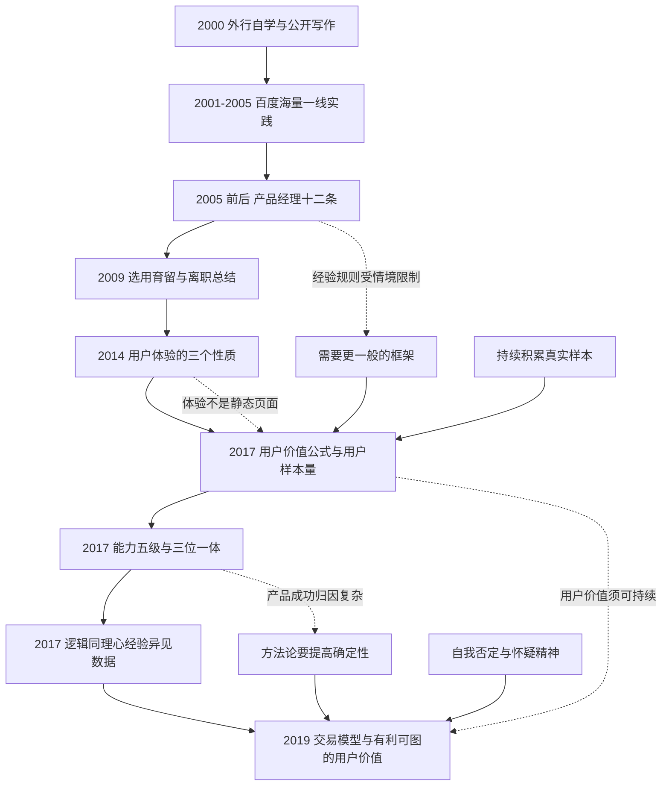

## 1. 本章要回答的问题

正文五章呈现的是一套已经整理好的方法论。附录换了一个视角：它按时间顺序收录了 2000 年到 2019 年的求职信、早期文章、十二条、内部讲座、体验分析、演讲实录和对话记录，展示这套方法论是怎样一步步形成、被推翻和被重建的。

附录集中回答以下问题：

1. 一个没有行业背景的外行，怎样通过自学、写作和实践进入并领先一个领域？
2. “俞军产品经理十二条”解决了什么问题，又在什么条件下失效？
3. 早期的经验规则如何被后期的用户价值公式、交易模型和权衡框架取代或重新解释？
4. 用户体验为什么不能用静态页面对比来评价？
5. 用户价值、用户样本量和怀疑精神为什么被视为方法论的三个层次？
6. 产品经理的能力可以怎样分级，每一级对应什么实践？
7. 逻辑、同理心、经验、异见、数据为什么被概括为科学的产品方法？
8. 从“一切为了用户”到“创造有利可图的用户价值”，中间发生了什么认知转折？
9. 我们应该怎样阅读一套仍在迭代中的方法论？
10. 事实与道理有什么区别，为什么“听过很多道理”仍然无法解决问题？
11. 一个人的目标和愿意支付的代价，怎样长期塑造其职业结果？

本章最重要的读法是：**不要把附录当作观点合集，而要当作一份可对照的迭代记录，观察每个结论提出时的约束条件，以及它后来为什么被修正。**

## 2. 一句话结论

产品方法论不是一次性发现的真理，而是在长期实践中被反复证伪和重建的模型；俞军的认知路径显示，早期有效的经验规则会随着用户、技术、竞争和商业条件变化而失效，只有持续积累真实样本、承认自身局限并主动自我否定，才能让方法论从局部技巧升级为可迁移的框架。

## 3. 本章论证地图

---

## 4. 认知迭代的时间线

| 时间 | 材料 | 认知阶段 | 关键产出 |
|---|---|---|---|
| 2000.9—2002.7 | 求职信与搜索研究文章 | 外行自学期 | 以公开写作积累领域认知与声誉 |
| 2001—2005 | 百度一线产品实践 | 海量样本期 | 用大量迭代建立用户模型 |
| 2005 前后 | 产品经理十二条 | 经验规则期 | 把实践固化为可传播的原则 |
| 2009.6 | 离职讲座与感谢信 | 组织与人才期 | 选人、用人、育人、留人的方法 |
| 2014.10 | 用户体验分析 | 体验再定义期 | 体验是过程，因人而异、因时而变 |
| 2017.1 | 知乎演讲 | 框架重建期 | 用户价值、用户样本量、怀疑精神 |
| 2017.6 | 深度对话 | 体系化期 | 三位一体、ABC 分类、能力五级 |
| 2017.12 | 湖畔大学讲座 | 方法提炼期 | 逻辑、同理心、经验、异见、数据 |
| 2019.6 | 离职与本书成稿 | 交易模型期 | 创造有利可图的用户价值 |

这条线索本身就是一个结论：**方法论的价值不在于某一版本正确，而在于它能被持续证伪和升级。**

---

## 5. 起点：外行如何进入一个领域

## 5.1 求职信与自学文章

2000 年前后，作者以网名在搜索论坛持续发表评论、技巧、评测和行业动态，内容涵盖搜索准则、分词问题、界面设计、各国市场和引擎对比。这些文章不是入职后的总结，而是入行前的自学产物。

从中可以还原一条可复用的路径：

1. **选择一个自己真正感兴趣且正在变化的领域。**
2. **高频使用并观察对象本身**，而不是只阅读二手评论。
3. **把观察写成公开、可被反驳的文字**，接受同行检验。
4. **持续输出形成密度**，让作品本身成为能力证明。
5. **用作品替代履历**，降低雇主判断自己的成本。

从交易视角看，这是一次典型的降低交易成本：招聘方难以度量一个无相关背景者的能力，而长期公开写作把“难以验证的潜力”转换成了“可被检验的作品”。

## 5.2 这一阶段的边界

作者本人后来也强调，早期成功很大程度上依赖时代机遇：搜索引擎处于爆发前夜，市场对认真研究者近乎空白。今天同样的努力未必产生同样的位置，但方法仍然有效：**用可验证的作品来解决自身可信度问题。**

---

## 6. 产品经理十二条：经验规则期

## 6.1 十二条的内容

十二条在 2005 年前后成型，是百度早期实践的集体沉淀：

| 序号 | 原则 | 针对的问题 |
|---|---|---|
| 1 | 产品经理首先是用户 | 脱离真实使用做判断 |
| 2 | 站在用户角度看待问题 | 以内部视角替代用户视角 |
| 3 | 用户体验是一个完整的过程 | 只优化单点界面 |
| 4 | 追求效果，不做没用的东西 | 以产出数量代替真实效果 |
| 5 | 发现需求，而不是创造需求 | 凭想象制造伪需求 |
| 6 | 决定不做什么往往比决定做什么更重要 | 资源分散、功能堆砌 |
| 7 | 用户是很难被教育的，要迎合用户 | 指望用户改变习惯 |
| 8 | 关注最大多数用户，在关键点上超越对手，快速上线并持续改进 | 追求完美版本、错过窗口 |
| 9 | 给用户稳定的体验预期 | 频繁改动破坏习惯 |
| 10 | 不确定怎么做时，先看别人怎么做 | 无依据的原创冒险 |
| 11 | 把用户当作傻瓜，替用户预先想好 | 让用户承担思考成本 |
| 12 | 不要给用户不想要的东西 | 无用功能对用户是伤害 |

> 原书 OCR 中序号有重复与缺失，此处按通行版本整理为十二条，内容以原文为准。

## 6.2 十二条为什么有效

这些原则的共同前提是：

- 产品是**免费的信息类产品**，用户几乎不支付货币。
- 用户规模巨大且高度分散，**大众化、低认知成本**是关键。
- 竞争对手同质化，**体验和效率**是主要变量。
- 迭代成本低，**快速上线并持续改进**优于一次性规划。
- 企业尚处高速渗透期，**用户增长本身就是商业价值**。

在这些约束下，十二条把复杂判断压缩为可执行的默认动作，极大降低了团队沟通和决策成本。

## 6.3 十二条在什么条件下失效

正文五章其实对多条原则做了重新解释，这正是认知迭代最值得关注的部分：

| 十二条原则 | 后期框架中的修正 |
|---|---|
| 迎合用户，不教育用户 | 用户具有可塑性，产品与用户互相改变；但要区分帮助理解与操纵认知 |
| 关注最大多数用户 | 用户是需求集合，需按情境细分；多数用户与高价值需求未必重合 |
| 把用户当作傻瓜 | 用户是有限理性而非愚蠢，应降低认知成本，而不是低估其判断 |
| 决定不做什么更重要 | 升级为约束条件下的权衡取舍与优先级决策 |
| 用户体验是完整过程 | 进一步升级为效用组合与完整交易成本 |
| 发现需求而非创造需求 | 需求仍需发现，但价值实现依赖新要素、机制设计与利益分配 |
| 追求效果 | 效果要区分短期指标与长期可持续收益 |
| 先看别人怎么做 | 参考需检验对方成立的约束条件是否同样存在 |

最重要的整体变化是：**十二条几乎只考虑用户单边体验，而后期框架必须同时处理企业收益、供给者利益、外部性和长期可持续性。**

十二条产生于货币价格为零的信息产品；当作者进入出行这类涉及真实供给、履约成本和多方博弈的领域后，单边用户视角不再足以支撑决策。

## 6.4 这一转折的方法论启示

- 经验规则是**特定约束下的压缩结论**，不是普遍真理。
- 规则越具体、越好执行，通常适用范围越窄。
- 迁移规则前必须还原它成立的前提。
- 方法论升级的标志，是从“该怎么做”变成“在什么条件下该怎么做”。

---

## 7. 选用育留：把人才当作产品与交易

2009 年的离职讲座把产品思维用于组织建设，与正文第五章形成呼应。

## 7.1 选人：以文取人与潜力优先

- **所有人在同一起跑线**：不特别看重相关经验，重视是否真正投入和学习。
- **以文取人**：通过产品分析文章判断候选人对用户的感觉与分析逻辑；判断力来自阅读大量样本后形成的参照系。
- **喜欢与投入**：把开车与赛车对比——同样时间投入，是否钻研会带来完全不同的成长速度。
- **往前看几年**：用有经验者短期轻松，用有潜力者长期收益更高。
- **价值观认同与宁缺毋滥**：不合适的人会持续消耗组织效率。

## 7.2 用人与育人：授权、试错、自我否定

- **充分授权与目标管理**：脑力工作依赖能动性，目标应经协商达成一致。
- **把试错机会留给成员**：如果领导的意见被证明错误，团队成员就失去了从错误中学习的机会。
- **越靠近细节的人越有发言权**：助理可能比经理更懂具体问题，应避免单线汇报和只向上分享。
- **持续自我否定**：结论应通过发现更多不足获得，而不是推销观点。
- **以用户需求为导向**：有需求、有优势、有利益三者兼具才做。
- **发现者而非创造者**：需求来自真实世界。

## 7.3 留人：薪酬之外的三个条件

1. 公司愿景是否值得投入。
2. 工作空间是否提供发展与上升机会。
3. 个人待遇是否合理。

作者以自身为例：并不喜欢在北京生活，却为“做出中国最好的搜索引擎”这一愿景留下八年。这与第五章“目标和代价”形成闭环——**愿景能否留人，取决于它是否值得对方支付代价。**

## 7.4 感谢信中的价值判断

离职感谢信把搜索引擎与造纸术、印刷术并列，理由是它们都大幅降低了人类获取知识的成本，并可能影响社会平等与进步。

这一判断解释了作者早期的动机结构：产品价值被放在社会成本变化的尺度上衡量，而不只是公司收入。它也说明，个人长期目标会决定其愿意在什么问题上持续投入。

---

## 8. 用户体验的三个性质

2014 年的这篇分析，是从“十二条式经验”走向“可分析框架”的关键一步。作者给出的定义是：

> 用户体验是让用户付出最小成本满足需求。

这个定义已经包含了后来的成本框架：体验的本质是降低用户为满足需求所付出的总代价。

## 8.1 体验是一个完整过程

### 摩根士丹利评测案例

2004 年，一家投行团队用十几个关键词在多个搜索引擎检索，把结果页打印出来投票，结论是雅虎最好；但这些人日常仍使用谷歌。

原因在于评测方法本身有缺陷：

| 被评测的部分 | 被忽略的真实成本 |
|---|---|
| 打印出的结果页 | 首页体积与加载时间差异 |
| 静态相关性对比 | 搜索框是否自动定位、需不需要额外操作 |
| 一眼可见的全貌 | 屏幕内第一屏能看到几条结果 |
| 单次查询 | 翻页、换词、相关搜索、切换垂直搜索 |
| 单一场景 | 结果页长度、底部是否再放搜索框 |

雅虎当时后台使用谷歌结果并对热门词做了人工优化，因此静态相关性不劣于谷歌；但用户实际使用是一个包含输入、等待、浏览、翻页和二次查询的完整过程。把过程成本计入后，结论反转。

这正是十二条中“用户体验是一个完整的过程”的实证展开，也是后来“交易成本”概念的雏形。

### 方法论结论

- 评测必须还原真实使用路径，而不是抽取静态切片。
- 抽样方法本身会引入系统性偏差。
- 口头评价与真实行为不一致时，应以行为为准。

## 8.2 体验因人而异

2006 年的调查数据显示，被认为领先的搜索引擎用户获得率反而不高，而大力推广的产品虽然获得率高，流失率同样高，用户基数并未增长。

关键在于：

$$
用户基数变化 = 用户获得率 - 用户流失率
$$

营销能够解决“来”的问题，却不能解决“留”的问题。书中列举了大量互相矛盾的偏好：

- 有人因英文资料检索强而依赖谷歌，也有人因英文结果过多而转向百度。
- 有人因反感竞价排名而离开，也有人因导航站便利而长期使用。
- 有人偏好高级语法，也有人偏好口语化长句和问答内容。
- 有人重视品牌形象，也有人重视图片浏览等具体功能细节。

因此“用户体验更好”不是单一标量。**产品可以在不同维度对不同人群形成优势，扬长避短同样是有效策略。**

## 8.3 体验因时而变

中国网民数从数百万增长到数亿，网页数从数百万增长到千亿量级。上游内容和下游用户同时变化，搜索引擎作为中间环节，其体验标准必然随之改变：

1. 早期用户少、网页少，主流需求是**找网站**，门户式目录已足够。
2. 用户与内容爆发后，主流需求变成**网页搜索**，仍以网站搜索为默认的产品体验在逐日下降。
3. 使用频率提高后，进入综合门户再搜索的成本被放大，**独立搜索入口**的相对体验持续上升。
4. 用户从单向获取转为参与创造，贴吧、知道等产品顺应了互联网定义本身的变化。
5. 产品改善又会反过来培养用户新的搜索习惯，形成互相塑造。

“温水煮青蛙”是这一节最重要的警示：**当外部条件渐变时，静止不动的产品体验其实每天都在下降。**

---

## 9. 三个层次：用户价值、用户样本量、怀疑精神

2017 年初的演讲，是方法论从经验条目转向框架的标志。作者当时把体系压缩为三条，并明确表示仍在迭代。

## 9.1 用户价值

$$
用户价值 = 新体验 - 旧体验 - 替换成本
$$

同时提出需求的三个属性：**用户价值、愿付价格、企业成本**。商业价值可粗略表示为：

$$
商业价值 = 愿付价格 - 企业成本
$$

一个好需求应使两个式子同时为正。这已经非常接近第三章的双边交易条件，只是尚未展开为完整的交易模型。

### 公式的三个用途

1. **可判断**：立项前即可粗估新体验、旧体验和替换成本。
2. **可引导思考**：要寻找旧体验接近于零的用户，即新要素带来的空白市场。
3. **可指导行动**：大多数团队日常做的其实是降低替换成本——缩小安装包、提高速度、简化操作，本质上都是“降价”。

### 完美新用户

同样是新增一百万用户，从竞品迁移而来的用户与第一次使用该品类的用户，感知到的价值差异巨大。后者的旧体验接近于零，更容易形成认同、口碑和长期留存，并把该产品建立为品类参照系。

这一判断在第四章被进一步展开为市场渗透策略。

## 9.2 用户样本量

核心原则是：每一次使用的单位用户价值都不同，要尽可能积累不同用户单次使用的样本，在头脑中形成需求分布模型，直到做决策时能判断“这样想的用户大约有多少”。

积累方法并不神秘：自己使用产品，大量阅读、观察、记录和归类用户反馈、评价与行为数据，关键在于持续和用心。

由此引出那句容易被误解的表述：

> 用户不是人，是某种需求的集合。

其逻辑是：

1. 每个人都有许多需求，以人为样本单位粒度过大。
2. 应以“某人在某情境下的某次需求”为最小样本。
3. 熟悉某人在一个产品上的行为，不代表理解他在另一产品上的行为。
4. 未被满足的需求一旦被整理成群体，就是新机会。

作者对“这会不会让产品经理更不尊重用户”的回应是：这只是分析工具，会因此轻视用户的人本身就不适合这个职业。

> 笔记辨析：把用户抽象为需求集合有利于分析，但抽象层级越高，越容易忽略人的完整处境。第二章和第四章补上了这个缺口——用户具有情境性、可塑性和有限理性，产品还需承担外部性与伦理责任。

## 9.3 怀疑精神

第三层与前两层不在同一维度，更像是对思维习惯的要求：持续自我论证与自我反思。

作者把它落到两个可评估的量上：

- **确定性**：对某个判断有多大把握。样本积累越充分，确定性越高，也越清楚自己缺少什么信息。
- **可行性**：这件事当下能做到什么程度。它会随时机、对手和行业变迁上下浮动。

书中记录了一句概括：**用户的反馈，一字不落；用户的建议，一概不听。** 反馈是真实行为样本，建议则缺少可行性判断和专业训练。

> 笔记辨析：这句话作为立场表达有力，但在实践中不宜绝对化。用户建议同样可能揭示未被察觉的问题，只是不能直接当作方案采纳。

---

## 10. 体系化：三位一体、容错度与能力五级

2017 年年中的对话把零散判断整合成体系，其中许多内容后来成为正文第一章和第五章的骨架。

## 10.1 真正的产品经理是三位一体的

1. **主人翁意识**：把产品当作自己的事业。
2. **决策权**：没有决策权就不是真正的产品经理。
3. **专业产品能力**。

三者缺一，加上合适的组织土壤，才可能形成实际意义上的产品负责人。这也解释了为什么许多公司里“产品经理”只是执行角色。

## 10.2 容错度决定成长与风险

不同业务对失败的容忍程度不同：

| 高容错业务 | 低容错业务 |
|---|---|
| 有优势资源、核心产品的协同业务 | 早期创业公司 |
| 竞争压力较小、老板关注的业务 | 资金、团队、竞争都不给第二次机会的战场 |
| 用户替代成本高的产品 | 一次判断失误即可能出局 |

天赋一般者可通过高容错业务获得更长的成长宽容度，代价是成长更慢；尚未达到熟练水平就进入低容错业务，则可能既没有成长也没有结果。

## 10.3 能力五级

作者把产品经理对企业创造价值的能力分为五级：

| 级别 | 关键词 | 能力要求 | 对应实践 |
|---|---|---|---|
| 一 | 可行性 | 对一个需求给出高可行性方案 | 基础技能与领域知识积累 |
| 二 | 创造 | 为一个需求找到最优解 | 持续洞察用户与环境变化 |
| 三 | 权衡 | 跳出单个需求做全局取舍 | 独立负责有复杂性的产品或方向 |
| 四 | 变迁 | 跳出当下预判变化 | 完整经历一个产品由小到大的演化 |
| 五 | 方法论 | 输出成体系的可迁移方法 | 跨业务比较异同，提高确定性 |

第五级的意义值得单独说明：产品成功由个人能力、企业资源和时代机遇共同决定，外界难以区分权重。**能够总结出方法论，等于提高了“换一个产品也能做成”的确定性，而企业愿意为更高的确定性付费。**

这条推理也解释了本书存在的意义。

## 10.4 关于产品的重新定义

> 做产品，是用“创造新价值”为工具，打破旧利益平衡，建立对己方有利的新利益链和新平衡的过程。

由此得出：**产品设计的本质是利益分配。** 不创造新价值的利益重分配是零和博弈，推动难度极大；引入新要素创造增量，才能让新平衡更容易建立。

新要素被明确列举为：新技术、新方法、新工具、新渠道、新场景、新认知、新内容、新平台、新人群、新材料、新能源、新政策、新组织、新通信、新媒体、新包装。

对创新的三种常见误解也被指出：过分追求变化而混淆手段与目的、不重视价值衡量、唯新技术论。

## 10.5 中美市场差异

作者用多个例子说明，同一产品在不同市场创造的价值可能完全不同：

- 推特与微博的差距主要来自市场与用户需求差异，而非单纯产品能力。
- 电商在传统商业欠发达的市场中创造的增量远大于成熟市场。
- 职业社交产品需要大量标准化可流动的中产人才作为前提。
- 网约车延伸到配送，在低效快递市场中价值更高，在高效低价市场中则难以成立。

结论是：**用户价值必须放在具体市场的旧体验和替换成本中衡量，产品可以复制，需求不能复制。**

## 10.6 事实与道理

“听过很多道理，依然过不好这一生”的原因是：每个道理都有边界与前提，未经还原就套用必然失效。

作者给出的训练方法是：

1. 遇到有意思的道理，用自己积累的事实逐一匹配。
2. 记录哪些能被验证、哪些不能。
3. 在反复校正中，明确该道理适用的边界。

由此得出一个重要判断：**道理相对容易获得，事实和实践反而稀缺。** 对成熟产品经理而言，只有案例分析有价值，空讲道理无益。

---

## 11. 科学的产品方法：五个词

2017 年年底的讲座把可操作的方法概括为五个词，正文第五章的成长环境部分沿用了这一框架。

| 方法 | 依赖对象 | 作用 |
|---|---|---|
| 逻辑 | 个人 | 区分事实、保证推理过程严谨 |
| 同理心 | 个人（可训练） | 站在他方立场判断效用与反应 |
| 经验 | 个人积累 | 阅读、经历、思考三位一体 |
| 异见 | 公司文化 | 用否定性意见提高决策质量 |
| 数据 | 公司能力 | 兜底验证，但只能反映过去 |

前三者是在头脑中快速打磨想法的过程，后两者是长周期、低频打磨产品的过程。

## 11.1 结论可以错，逻辑不能错

如果推理过程本身有问题，事情失败时将无法定位原因，也就无法迭代。

书中的雨天外卖例子说明了小逻辑与大逻辑的区别：从单笔订单看，雨天配送成本上升、不加价不划算；从长期看，坚持配送可能带来该用户后续多次复购。层级不同，结论可能相反，但只要各方都讲逻辑，分歧就可被讨论。

## 11.2 逻辑的四个组成

作者进一步把逻辑拆为四项：

1. **理科逻辑**：识别事实与基本因果链。
2. **深度思考**：追问事物本质，对经历过和未经历过的事都能形成更透彻判断。
3. **视野**：见多识广、思维开放、思维发散。
4. **批判精神**：既能否定他人，也能否定自己。

拆分的理由是：产品经理面对的不是学校中的标准题目，而是现实世界的问题。

## 11.3 现实世界的四个特点

| 特点 | 含义 |
|---|---|
| 复杂变量 | 世界由人组成，个体到群体再到系统层层复杂 |
| 永恒变化 | 一项技术或事件可能改变整个认知基础 |
| 信息不完整 | 可获得的信息只是一小部分，且可能被污染 |
| 认知有限 | 即使给定全部信息，人的理解仍随时间和经历变化 |

因此产品经理只能在信息不充分时判断和预测，甚至无法确认当前问题是否值得解决。

## 11.4 军事指挥家的类比

作者认为与产品经理最接近的职业是军事指挥家：可以在学校学习知识与技能，但世界上没有两场可复制的战争——地形不同、对手不同，己方决策还会引发对手的应对。

这个类比支撑了正文第一章的核心判断：**产品工作是强实践性的社会科学，经验只可归纳，不可直接演绎。**

## 11.5 选人的四个必选项与附加项

必选项：逻辑、同理心、产品心、产品经理基础。

其中“产品经理基础”指用户思维和完整实践套路：如何细分用户、替代品与被替代品是什么、不满意的环节在哪里、能否改动、如何一代代升级产品，以及如何与研发和技术协作。

附加项包括：经验复用性与期望值匹配、思维框架、细节敏感、愿意妥协、沟通能力。附加项不是必需，但决定一个人更适合什么类型的产品岗位。

关于“妥协”的说明尤其值得注意：**观点正确却不愿妥协的人，往往难以被放到更高位置**，因为长期协作成本过高。

## 11.6 开创型、增长型与协作型

| 类型 | 能力要求 | 适用阶段 |
|---|---|---|
| 开创型 | 深度思考加创造力，人数很少 | 产品形态未稳定、需要寻找变量时 |
| 增长型 | 理科逻辑过关即可，可通过套路培养 | 产品走上正轨、进入高速增长时 |
| 协作型 | 领导力、推动力、沟通执行力 | 团队与业务复杂化之后 |

由此引出一个组织难题：增长型和协作型更容易出成绩并获得晋升，于是团队逐渐由这两类人主导。当新要素出现、需要开创型人才时，掌握评价权的人往往难以自我否定，仍倾向于认可与自己同类的人。

另一个问题是：从未经历一线用户从零到规模化过程的高阶空降者，即便思维框架良好、信息充分，仍可能出问题；但同样的人自己创业却可能成功，因为创业迫使其回到一线研究用户。

## 11.7 如何评价一家公司的产品能力

作者给出的判断标准是人才的进与出：

1. 手握多个机会的优秀产品经理，有多少比例优先选择这家公司。
2. 从这个团队离开的人，是否是市场上最受欢迎的那一部分。

这是一个巧妙的度量设计：产品能力本身难以直接测量，但可以用市场对其人才的持续定价来间接反映。

---

## 12. 认知迭代的整体轨迹

## 12.1 前后期观点对比

| 主题 | 早期表述 | 后期表述 |
|---|---|---|
| 出发点 | 一切为了用户 | 创造有利可图的用户价值 |
| 用户 | 最大多数用户 | 特定情境下的需求集合 |
| 体验 | 体验越好越正确 | 体验是效用与成本组合的一部分 |
| 需求 | 发现需求，不创造需求 | 发现需求，并用新要素与机制实现价值 |
| 商业 | 商业与用户价值分离 | 用户价值与商业价值是一体两面 |
| 判断依据 | 经验规则与直觉 | 用户模型、交易模型与理性决策 |
| 冲突处理 | 以用户为先 | 多方权衡、利益分配与可持续 |
| 方法论形态 | 十二条具体原则 | 可解释、可证伪、有边界的框架 |

## 12.2 驱动迭代的三个力量

1. **领域变化**：从零价格的信息产品，进入有真实供给和履约成本的出行服务。
2. **规模变化**：从单边用户产品，进入涉及司机、乘客、平台、监管和社会的多边生态。
3. **认知变化**：接受“人是自私的、有限理性的”这一前提后，从追求单边最优转向机制设计。

作者在自序中的表述可以视为整个迭代的枢纽：曾经一心想着“一切为了用户”，后来发现冲突与取舍无处不在，直到接受每个人都自利，才能平等坦然地处理冲突、激励与约束。

## 12.3 迭代过程本身的规律

- 早期依赖**规则**，中期依赖**公式与模型**，后期依赖**框架与边界条件**。
- 每一次升级都由**旧方法在新情境中失效**触发。
- 新框架并不废弃旧经验，而是把它降级为**特定条件下的推论**。
- 方法论越成熟，**表述越谨慎**，附带的适用条件越多。

---

## 13. 本章完整推理链

1. 附录按时间排列材料，使方法论的形成过程可被对照和检验。
2. 外行进入领域的可行路径是持续使用、观察、公开写作与实践，把潜力转化为可验证的作品。
3. 早期十二条把大量实践压缩为可执行规则，显著降低了团队决策与沟通成本。
4. 十二条成立的前提是零价格信息产品、大众化需求、低迭代成本和高速渗透期。
5. 当业务进入有真实成本与多方利益的领域，单边用户视角不再足以支撑决策。
6. 用户体验被重新定义为让用户以最小成本满足需求，因而必须按完整过程评价。
7. 评测方法本身会引入偏差，静态切片对比可能得出与真实行为相反的结论。
8. 体验因人而异，用户获得率必须减去流失率才有意义，扬长避短是有效策略。
9. 体验因时而变，上下游条件渐变时，静止的产品其实每天都在退步。
10. 用户价值公式提供了可估算、可引导思考、可指导行动的框架。
11. 需求同时具有用户价值、愿付价格和企业成本三个属性，好需求要求两个差值都为正。
12. 判断力来自海量单次用户样本，因此“用户是需求的集合”成为分析单位。
13. 怀疑精神要求持续自我否定，并把判断落到确定性与可行性两个可评估量上。
14. 真正的产品经理需要主人翁意识、决策权和专业能力三者兼具。
15. 能力可分为可行性、创造、权衡、变迁和方法论五级，各级对应不同实践机会。
16. 输出方法论能提高“换一个产品也能做成”的确定性，因而具有独立价值。
17. 产品的本质是用创造新价值打破旧利益平衡，产品设计的本质是利益分配。
18. 同一产品在不同市场的价值差异巨大，产品可复制而需求不可复制。
19. 科学的产品方法可概括为逻辑、同理心、经验、异见、数据五个词。
20. 现实世界具有复杂变量、永恒变化、信息不完整和认知有限四个特点，因此产品工作接近军事指挥而非解题。
21. 道理易得而事实稀缺，任何道理都必须用自己积累的事实反复校验边界。
22. 方法论的最终形态不是固定答案，而是持续被证伪与重建的认知框架。

---

## 14. 可直接使用的工作方法

## 14.1 检验一条产品原则是否适用

1. 这条原则最初解决的是什么问题？
2. 它成立时的用户、技术、竞争和商业条件是什么？
3. 我当前的情境中，哪些条件已经改变？
4. 它是否只考虑了单边利益，忽略了供给者或第三方？
5. 它的时间尺度是短期还是长期？
6. 若照此执行，最可能在什么情况下出错？
7. 我能否用低成本方式先验证它在本情境中的有效性？

## 14.2 用完整过程评价体验

沿真实使用路径逐段记录成本：

| 环节 | 用户付出 | 可优化点 |
|---|---|---|
| 认知与到达 | 是否知道、如何进入 |  |
| 首次理解 | 学习与判断成本 |  |
| 核心操作 | 步骤、等待、失误率 |  |
| 结果获取 | 一屏可得信息、二次尝试成本 |  |
| 异常处理 | 失败、退出、申诉成本 |  |
| 长期使用 | 习惯、迁移、信任变化 |  |

避免只对比静态界面截图或单次成功路径。

## 14.3 获得率与流失率同看

$$
用户基数变化 = 获得率 - 流失率
$$

复盘增长时应分别追问：

1. 新用户为什么来？来自哪些渠道与旧体验？
2. 流失用户为什么走？是承诺未兑现还是竞品更优？
3. 回流用户又为什么回来？
4. 推广费用停止后，净增长是否仍为正？

## 14.4 识别体验是否正在“因时而变”

- 上游供给（内容、商品、服务）在过去两年增长了多少？
- 下游用户结构和使用频率变化了多少？
- 主流需求是否已从一种形态转向另一种？
- 竞争者是否已按新形态重构默认体验？
- 我们的默认体验最后一次重大调整是什么时候？

## 14.5 用户样本积累模板

| 字段 | 内容 |
|---|---|
| 时间与情境 | 何时、何地、什么任务、什么约束 |
| 用户特征 | 偏好、认知、资源 |
| 触发原因 | 为什么此刻使用 |
| 备选方案 | 还考虑过什么 |
| 实际行为 | 做了什么、放弃了什么 |
| 感知效用与成本 | 得到什么、付出什么 |
| 事后反馈 | 是否复用、是否推荐 |
| 我的预测与偏差 | 事前判断与实际差距 |

坚持记录并定期归类，才能形成需求分布模型。

## 14.6 能力五级自评

1. 我能否稳定给出可行方案？
2. 我能否为一个需求找到最优解，而不只是可行解？
3. 我是否独立承担过跨需求的资源取舍？
4. 我是否完整经历过一个产品由小到大的变化？
5. 我能否把经验总结成可迁移、可被他人检验的方法？
6. 当前级别的瓶颈是能力、实践机会还是决策权？

## 14.7 用事实校验道理

1. 遇到一个新观点，先写下它的适用前提。
2. 从自己经历中找三个支持案例和三个反例。
3. 若无法找到反例，说明样本不足或思考不充分。
4. 明确它在什么条件下会失效。
5. 记录为待验证假设，而不是直接采纳。
6. 在后续实践中持续更新其边界。

---

## 15. 容易误读的观点

### 误读一：十二条已经过时，没有价值

十二条在其适用条件内仍然有效，且极大降低了执行成本。正确态度是补上前提条件，而不是简单否定或照搬。

### 误读二：附录只是资料汇编

附录的核心价值是展示同一个人在不同阶段的判断变化。忽略时间线阅读，就会把互相矛盾的表述当作并列结论。

### 误读三：用户不是人，所以可以不尊重用户

这是一个分析粒度工具，用于避免用笼统人群掩盖具体需求。它并不否认用户是完整的人，也不豁免产品的伦理责任。

### 误读四：用户建议一概不听

原意是建议不能直接当作方案，因为提出者未必了解可行性与全局约束。但建议往往包含真实痛点信号，应被当作线索而非指令。

### 误读五：找到新要素就能成功

新要素只提供旧体验接近于零的窗口。能否成功仍取决于需求真实性、替换成本、企业成本和竞争响应。

### 误读六：能力五级必须逐级攀爬

作者明确指出过了基础级之后成长不是线性的，五级也未必依次经历，可以针对多级要求同时修炼。

### 误读七：产品设计是利益分配，所以就是零和博弈

正因为零和分配难以推动，才需要用新要素创造增量。创造新价值是让新平衡得以建立的前提。

### 误读八：数据是这个时代最强大的引擎，所以应当数据驱动一切

原文同时指出数据只能反映过去、不是所有事都适合实验，以及过度依赖会导致产品经理挑选项目而非解决重要问题。

### 误读九：优秀产品经理的成功可以直接复制

产品成功由个人、企业与时代机遇共同决定。方法论提高的是成功概率与确定性，而不是保证结果。

### 误读十：方法论最终会收敛为一套标准答案

作者反复强调观点仍在迭代，并请读者独立思考和在实践中验证。把任何一版当作终点，都违背了这套方法论本身的逻辑。

---

## 16. 本章结论

1. 附录以时间顺序记录了一套产品方法论从经验规则走向系统框架的完整过程。
2. 外行进入领域的可行路径，是持续实践加公开可验证的输出，把潜力转换为可被检验的证据。
3. 十二条是特定约束下高效的经验压缩，其前提是零价格信息产品、大众需求与高速渗透期。
4. 业务进入多方、有成本的真实交易后，单边用户视角必然失效，方法论随之升级。
5. 用户体验的本质是让用户以最小成本满足需求，必须按完整使用过程评价。
6. 体验因人而异，用户获得率必须与流失率同时考察；扬长避短是合理竞争策略。
7. 体验因时而变，上下游条件渐变时静止的产品体验其实持续下降。
8. 用户价值公式提供了可估算和可行动的分析框架，需求还需同时满足愿付价格高于企业成本。
9. 旧体验接近零的完美新用户是价值最高的用户，这解释了新要素窗口期的重要性。
10. 判断力来自海量单次用户样本，用户应被理解为特定情境下的需求集合。
11. 怀疑精神落地为对确定性与可行性的持续评估和自我否定习惯。
12. 真正的产品经理需要同时具备主人翁意识、决策权与专业能力，并处于合适的组织土壤。
13. 能力可分为可行性、创造、权衡、变迁与方法论五级，成长依赖对应质量的实践机会。
14. 输出方法论能提高换一个产品仍能做成的确定性，这是本书写作的直接理由。
15. 产品的本质是用创造新价值打破旧利益平衡，产品设计的本质是利益分配。
16. 产品可以复制，需求不能复制；同一产品在不同市场创造的价值可能天差地别。
17. 科学的产品方法可概括为逻辑、同理心、经验、异见、数据，前三者依赖个人，后两者依赖组织。
18. 现实世界具有复杂变量、永恒变化、信息不完整与认知有限四个特点，产品工作因此接近军事指挥。
19. 道理易得而事实稀缺，任何道理都要用自己积累的事实校验其边界。
20. 组织评价机制会自我复制，增长型与协作型主导的团队可能难以识别开创型人才。
21. 一家公司的产品能力可用优秀人才的进出情况间接度量。
22. 方法论的价值不在于某个版本正确，而在于它能被证伪、被修正并持续逼近现实。

## 17. 思考题

1. 我现在遵循的哪些产品原则，其实是别人在完全不同约束下总结的？
2. 团队评价体验时，用的是完整使用过程，还是静态界面对比？
3. 我们最近一次增长复盘，是否把流失率与获得率放在一起看？
4. 我们产品的上下游条件在过去两年发生了什么变化？默认体验是否仍然匹配？
5. 我能列出最近一个月积累的十个真实用户样本吗？
6. 面对下一个决策，我对确定性和可行性各能打几分？依据是什么？
7. 我目前处于能力五级中的哪一级？瓶颈是能力、机会还是决策权？
8. 我是否拥有真正的决策权？如果没有，我实际承担的是什么角色？
9. 我所在业务属于高容错还是低容错？它与我当前的成长阶段匹配吗？
10. 我们最近一次“创新”，创造了新价值，还是只做了利益的重新分配？
11. 团队的晋升机制是否在无意中排斥开创型人才？
12. 我最近一次自我否定发生在什么时候？改变了什么判断？
13. 我记住的哪些“道理”，从未用自己的事实检验过边界？
14. 如果三年后回看，我今天最可能被推翻的判断是哪一个？
15. 我的长期目标是什么？愿意为它支付哪些代价，又不愿支付什么？

## 18. 复习卡片

**Q：附录的核心价值是什么？** 
A：以时间顺序展示方法论如何被提出、失效、修正和重建，说明产品认知是可迭代且有边界的。

**Q：早期十二条成立的前提是什么？** 
A：零价格的信息类产品、大众化需求、低迭代成本以及市场高速渗透期。

**Q：十二条最主要的局限是什么？** 
A：几乎只考虑用户单边体验，未纳入企业收益、供给者利益、外部性和长期可持续性。

**Q：用户体验的定义是什么？** 
A：让用户付出最小成本满足需求。

**Q：用户体验的三个性质是什么？** 
A：是一个完整过程、因人而异、因时而变。

**Q：摩根士丹利评测案例说明了什么？** 
A：静态结果页对比忽略了加载、操作、浏览和二次查询等过程成本，会得出与真实行为相反的结论。

**Q：用户基数变化如何计算？** 
A：$用户基数变化 = 用户获得率 - 用户流失率$，只看获得率没有意义。

**Q：方法论的三个层次是什么？** 
A：用户价值、用户样本量、怀疑精神。

**Q：需求的三个属性是什么？** 
A：用户价值、愿付价格、企业成本。

**Q：为什么说“用户不是人，是需求的集合”？** 
A：这是缩小样本粒度的分析工具，用于按情境和需求分类积累样本，而不是否认用户是完整的人。

**Q：怀疑精神落到哪两个可评估的量上？** 
A：确定性与可行性。

**Q：真正的产品经理三位一体指什么？** 
A：主人翁意识、决策权和专业产品能力。

**Q：产品经理能力五级分别是什么？** 
A：可行性、创造、权衡、变迁、方法论。

**Q：为什么输出方法论有独立价值？** 
A：它提高了换一个产品仍能做成的确定性，而企业愿意为更高确定性付费。

**Q：做产品的本质是什么？** 
A：用创造新价值为工具，打破旧利益平衡并建立新平衡；产品设计的本质是利益分配。

**Q：科学的产品方法可概括为哪五个词？** 
A：逻辑、同理心、经验、异见、数据。

**Q：逻辑包含哪四部分？** 
A：理科逻辑、深度思考、视野、批判精神。

**Q：现实世界的四个特点是什么？** 
A：复杂变量、永恒变化、信息不完整、认知能力有限。

**Q：为什么把产品经理类比为军事指挥家？** 
A：两者都不能复制既往情境，必须在信息不充分和对手会应变的条件下持续决策。

**Q：开创型、增长型、协作型分别适合什么阶段？** 
A：产品形态未稳定时需要开创型，进入高速增长时依赖增长型，业务与团队复杂化后依赖协作型。

**Q：如何间接评价一家公司的产品能力？** 
A：看优秀人才是否优先选择加入，以及离开的人是否是市场上最受欢迎的那部分。

**Q：事实与道理的区别是什么？** 
A：道理有边界和前提，必须用自己积累的事实反复匹配校验；道理易得，事实和实践稀缺。
