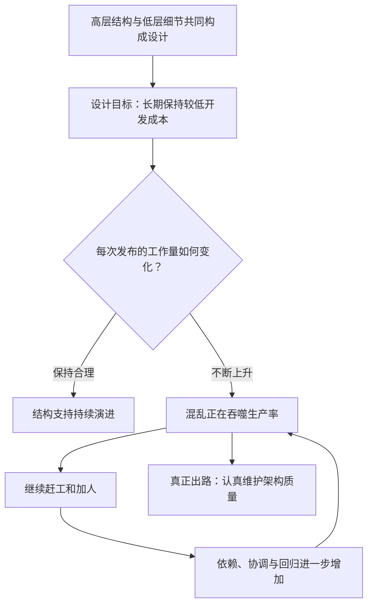
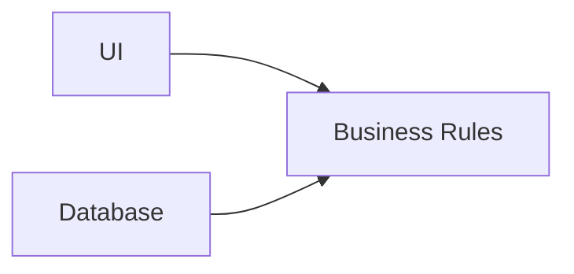
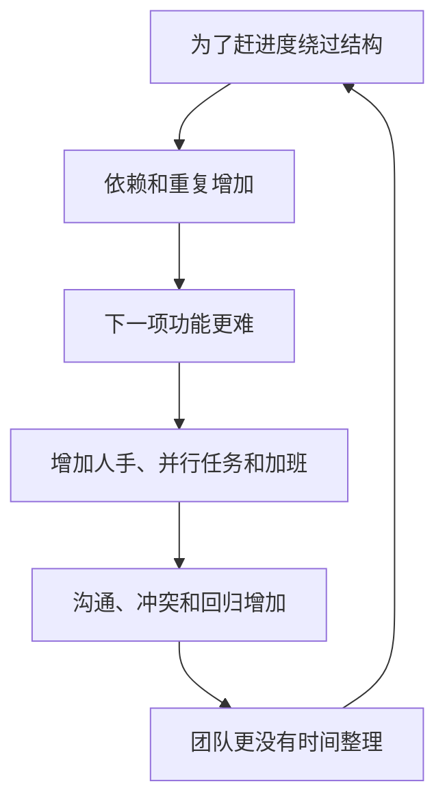

> 原书：Robert C. Martin, *Clean Architecture: A Craftsman's Guide to Software Structure and Design* 
> 本章：Chapter 1, What Is Design and Architecture? 
> 原文参考：Clean Architecture.md

## 本章导读
> **原书图示**：Chapter 1 章首页
第一章要解决两个基础问题：

1. Design 与 Architecture 到底有什么区别？
2. 什么样的设计才算好设计？

作者给出的回答非常直接：

- Design 与 Architecture 没有清晰分界，它们共同组成系统从高层政策到低层细节的全部设计；
- 好架构的衡量标准，是系统在整个生命周期中能否一直以较低的人力成本满足需求；
- 如果每个新版本都需要更多人、更多加班和更多协调，结构就在持续恶化；
- 为了抢速度而制造混乱，不仅会拖慢长期开发，往往从短期就开始产生额外成本；
- 面对混乱系统，单纯推倒重写通常不会解决导致混乱的工程习惯。

本章没有给出某种具体架构样式。它先建立全书的评价标准：后续介绍的编程范式、SOLID、组件原则和依赖规则，都要回答同一个问题：**它们能否帮助团队持续降低不必要的修改成本？**

## 1. What Is Design and Architecture?

### 1.1 为什么这两个词总是让人困惑

行业中通常这样使用两个词：

| 术语 | 常见理解 |
| --- | --- |
| Architecture | 系统级、高层、长期、由架构师决定 |
| Design | 类和函数级、低层、局部、由开发者实现 |

这种区分在日常交流中有一定便利。例如，人们说「系统架构」时，通常在讨论服务、组件和部署；说「类设计」时，通常在讨论接口和对象协作。

但作者认为，把二者当成彼此分离的工作是危险的。原因是：高层意图只能依靠低层代码实现，而低层的一条错误依赖就可能破坏整个高层结构。

例如，一张架构图声称业务规则与数据库分离，但如果业务类直接使用 ORM 注解、数据库 Row 或 SQL API，那么数据库已经进入业务核心。图上画出的边界并没有真正存在。

### 1.2 作者的主张：没有本质区别

作者开门见山地说：Design 与 Architecture 没有区别。

这并不是否认高层与低层的相对差异，而是否认二者之间存在一条可以清楚划定的界线。

软件中的设计决策形成一条连续链：

- 系统向用户提供什么能力；
- 哪些业务规则最核心；
- 系统划分成哪些组件；
- 组件如何部署和通信；
- 模块公开哪些接口；
- 类之间如何协作；
- 数据结构属于哪一侧；
- 函数如何组织控制流；
- 源文件引用了哪些名字。

这些决策影响范围不同，但都决定系统以后如何变化。

### 1.3 住宅类比

作者以自己新家的建筑图纸为例。

图纸中当然包含我们通常认为属于架构的内容：

- 房屋的整体形状；
- 外观和立面；
- 房间与空间布局。

但同一套图纸中也包含大量低层细节：

- 每个插座、灯和开关的位置；
- 哪个开关控制哪盏灯；
- 暖炉、热水器和排水泵的位置与规格；
- 墙体、屋顶和地基的施工方式。

这些细节不是高层架构完成之后才随便补上的。它们共同决定房屋是否安全、可用，并且能否实现高层布局的意图。

软件也是如此：高层业务结构与低层代码细节是一张连续织物，不能只要其中一半。

### 1.4 为什么只看高层框图会失败

假设团队画出如下结构：

图意是 UI 和 Database 都依赖 Business Rules，业务核心不知道外部细节。

但实际代码可能是：

- 业务函数接收 `HttpRequest`；
- Entity 继承 ORM 基类；
- Use Case 返回数据库 Row；
- 业务状态直接控制页面按钮；
- 单元测试必须启动 Web Server 和数据库。

这时，实际依赖方向与架构图相反。架构不是图上写了什么，而是源码允许什么。

因此，程序员每天做出的低层选择，本身就是架构工作的一部分。

### 1.5 高层与低层仍然有用

作者说二者没有分界，不代表「高层」「低层」两个词没有意义。它们仍可描述相对位置：

- 系统边界通常比一个函数的循环结构更高层；
- 企业业务政策通常比数据库查询更高层；
- 用例通常比 HTTP 路由更高层。

需要避免的是错误推论：

> 低层细节不属于架构，因此不需要服从架构约束。

更准确的说法是：高层决策影响范围通常更广，低层决策负责把它们变成事实；两者共同决定系统形状。

### 1.6 这个观点对团队分工有什么影响

如果把架构仅看作少数架构师的工作，容易形成以下分工：

1. 架构师画图；
2. 开发者在图下自由实现；
3. 图纸长期不随代码更新；
4. 实际依赖逐渐偏离架构；
5. 最终只有文档中的系统仍然整洁。

更健康的做法是：

- 架构师解释边界和依赖背后的原因；
- 开发者在代码评审中共同保护这些约束；
- 自动化检查重要的跨层依赖；
- 当实际需求证明边界不合理时，及时调整设计与文档；
- 不把架构当成一次性交付物。

## 2. The Goal?

### 2.1 软件架构的目标

作者给出本章最重要的一句话：

> **软件架构的目标，是尽量减少构建和维护所需系统的人力。**

这句话把架构从审美问题变成经济问题。

好架构不是：

- 使用了最多设计模式；
- 采用了最新框架；
- 拥有最多服务或层；
- 图画得最对称；
- 代码行数最少。

好架构应让团队在整个系统生命期内，以合理成本不断满足客户需要。

### 2.2 必须在满足要求的前提下谈成本

「减少人力」不能被理解为不顾质量地压缩团队。

架构仍必须支持：

- 所需业务功能；
- 可靠性与数据正确性；
- 安全与合规；
- 性能与可用性；
- 部署、运维和审计需要。

删除测试、跳过安全设计或把复杂性转嫁给运维，可能让开发阶段看起来更省人，却只是把成本和风险移到了别处。

### 2.3 衡量的是整个生命周期

第一版很快完成，不足以证明设计良好。真正的检验发生在后续版本：

- 新增一个业务规则要改多少地方？
- 更换数据库是否影响业务代码？
- 修改 UI 是否需要重测核心计算？
- 增加一种输入渠道是否要复制用例逻辑？
- 一个小功能是否需要多个团队同步发布？

如果相似规模的变化越来越困难，说明系统正在积累由结构产生的额外成本。

### 2.4 为什么以人力作为最终尺度

软件开发中的大多数成本最终都会转化为人的工作：

- 分析和理解；
- 编写与评审；
- 测试与排错；
- 协调与等待；
- 部署与恢复；
- 培训与知识传递。

即使云资源、许可证和硬件也有成本，本章聚焦的是设计质量如何影响人的工作量。

这并不意味着开发者越少越好。清晰边界可以让更大的团队并行工作；混乱边界则可能让更多人相互阻塞。重点是每个人的努力有多少真正转化成客户价值。

### 2.5 可操作的好坏判据

作者给出的判据很简单：

- 若满足客户需求所需的工作量较低，并在系统生命期内保持较低，设计就是好的；
- 若每个新版本都需要更多工作，设计就是坏的。

实际使用时要加一层判断：工作量增加究竟来自哪里？

**合理增长：**

- 需求范围确实扩大；
- 安全和合规要求提高；
- 系统处理规模显著增加；
- 业务规则本身变得更复杂。

**结构性增长：**

- 小改动需要触碰大量无关模块；
- 测试必须运行整个系统；
- 一个变化要求多个团队协调；
- 相同规则在多个渠道重复实现；
- 每次发布都要修复新的连锁回归。

架构主要要减少第二类增长。

### 2.6 适用边界

这个目标主要适用于有真实生命期、会持续演进的软件。

以下代码不一定需要同样强度的设计：

- 当天用完即丢弃的调查脚本；
- 为验证技术可行性编写的原型；
- 一次性数据修复工具；
- 规模很小且变化可能性极低的程序。

但原型如果即将进入生产，就不能继续以「反正只是原型」为由叠加功能。系统预期寿命变化时，设计投入也应随之调整。

## 3. Case Study

### 3.1 作者为什么使用企业案例

抽象地说「坏架构会增加成本」很容易被当成常识，也很容易在进度压力下被忽略。作者因此展示一家匿名公司的真实数据，让读者看到架构问题如何转化为：

- 团队膨胀；
- 生产率下降；
- 单位产出成本增加；
- 工资支出失控；
- 企业经营风险。

案例不能证明架构是唯一原因，但几个趋势同时出现时，足以说明系统存在严重的结构性摩擦。

### 3.2 Figure 1.1：工程团队持续增长
> **原书图示**：Figure 1.1 与 Figure 1.2：工程人员和代码产出
Figure 1.1 展示工程人员数量快速增长。单独看这张图，似乎说明公司发展良好：业务成功，因此不断扩充团队。

增加人员本身并不是问题。关键要继续观察：增加的人是否带来了相应的交付能力。

### 3.3 Figure 1.2：代码产出接近停滞

同一页的 Figure 1.2 使用简单代码行数观察同期产出。虽然每个版本都有更多开发者参与，新增代码量却逐渐接近一条平缓曲线。

这说明投入和产出已经脱钩：

- 更多人加入；
- 每个人也在努力工作；
- 系统却没有产生相称的新增能力。

作者用「接近渐近线」形容这种趋势，意思是人数继续增长，产出却越来越接近一个无法明显突破的上限。

### 3.4 Figure 1.3：每行代码成本增长 40 倍
> **原书图示**：Figure 1.3：单位代码成本
Figure 1.3 把工资投入与代码产出放在一起，展示每行代码的成本变化。到第 8 个版本时，生成一行代码的成本大约是第 1 个版本的 40 倍。

这个数字不应被解读为「应该要求开发者多写代码」。它真正表达的是：完成可见进展所需的投入急剧增加。

如果这种趋势继续，即使公司当前盈利，开发成本也会逐步吞噬商业模式。

### 3.5 代码行数指标的局限

代码行数不是理想的生产率指标：

- 删除重复代码可能提高质量，却减少行数；
- 自动生成代码会虚增行数；
- 不同语言的表达密度不同；
- 一行关键业务规则可能比大量样板代码更有价值；
- 不同版本的需求难度可能不同。

所以，不能仅凭这些图得出「开发者效率下降」或「架构必然是唯一原因」。

更全面的调查应结合：

- 需求交付周期；
- 一项变化涉及的模块数量；
- 构建和测试时间；
- 缺陷率与变更失败率；
- 故障恢复时间；
- 跨团队等待和交接；
- 重复实现与特殊分支；
- 客户实际获得的业务能力。

作者的重点是识别趋势，而不是建立精确的生产率算法。

### 3.6 The Signature of a Mess

作者把前述曲线称为「混乱的特征」。这种混乱通常来自三个条件同时存在：

1. 系统在持续赶工中被拼装起来；
2. 公司主要依靠增加程序员推动产出；
3. 很少有人认真维护代码整洁度和设计结构。

这会形成恶性循环：

### 3.7 Figure 1.4：开发者生产率逐版下降
> **原书图示**：Figure 1.4 与 Figure 1.5：生产率和月度工资
Figure 1.4 从开发者视角展示同一问题。最初生产率接近百分之百，随后每个版本都继续下降，到第 4 个版本时已经明显朝接近零的方向发展。

这并不是因为开发者减少了努力。作者明确强调：每个人依然在努力、加班并展现奉献精神。

问题在于，他们的努力逐渐从实现功能转向管理混乱：

- 为一个小功能寻找可修改位置；
- 绕过现有特殊分支；
- 修复被意外影响的旧行为；
- 在多个模块间同步同一规则；
- 把混乱从一个位置搬到另一个位置。

### 3.8 忙碌与生产率为什么可以同时背离

团队可以非常忙，但客户获得的新增价值很少。

例如，一个开发者为增加一种折扣可能需要：

1. 修改页面脚本；
2. 修改 Controller；
3. 修改后台 Service；
4. 修改数据库存储过程；
5. 修改报表；
6. 与三个渠道团队确认兼容性；
7. 运行完整回归测试。

只有「增加折扣」是需求本身要求的，其余大量工作可能来自同一规则散落多处。

因此，繁忙程度不能直接代表软件生产率。架构要做的是减少这类非必要工作。

### 3.9 Figure 1.5：管理者看到的工资曲线

Figure 1.5 展示每月开发工资支出。第 1 个版本只需要每月几十万美元；到第 8 个版本，每月工资已经达到 2,000 万美元，而且仍在增长。

把这条曲线与 Figure 1.2 对比，问题更加明显：

- 初期几十万美元换来大量功能；
- 后期 2,000 万美元几乎换不来新增代码。

任何管理者看到这种投入产出关系，都会要求立即行动。

但如果行动只是责骂开发者、要求加班或继续扩招，就没有处理根因。

### 3.10 管理者应该追问什么

比「为什么你们这么慢」更有效的问题是：

- 普通需求为何需要触碰这么多代码？
- 哪些步骤是业务真正需要的，哪些是结构造成的？
- 哪些模块因为共同变化而应该放在一起？
- 哪些技术细节正在向业务核心传播？
- 哪些测试必须依赖昂贵环境，为什么？
- 增加人员后，哪些工作真的能够独立并行？

这些问题把讨论从个人努力转向系统约束。

### 3.11 What Went Wrong?

作者用《龟兔赛跑》解释开发团队的过度自信。

兔子的问题不是没有速度，而是确信自己随时可以追回差距，因此不认真对待比赛。现代开发者通常不会睡觉，相反，他们非常忙。但他们可能让另一部分意识「睡着」：明知整洁代码和良好设计重要，却相信现在可以暂时忽略。

常见说法是：

> **先把产品推向市场，以后再清理。**

作者认为这是一个谎言，因为市场压力不会在产品上线后消失。

### 3.12 为什么以后通常不会出现

产品上线后，团队会面对：

- 竞争对手追赶；
- 客户反馈；
- 新销售承诺；
- 生产故障；
- 兼容与迁移要求；
- 越来越多的新功能。

开发模式不会从「快速制造混乱」自动切换成「从容清理」。相反，新需求会继续叠加在旧混乱上，生产率进一步下降。

所以，不能把结构质量完全推迟到未来。它必须成为每次交付的一部分。

### 3.13 更大的谎言：混乱短期更快

很多团队接受一种看似合理的交换：

- 混乱代码短期快；
- 整洁代码长期快；
- 因此当前先选择短期速度。

作者认为这个前提本身就是错的。混乱代码从当前任务就可能增加：

- 命名和逻辑歧义；
- 调试时间；
- 重复实现；
- 验收前返工；
- 对既有功能的破坏。

所谓短期速度经常只是把测试和修复延迟到稍后，而不是消除工作。

### 3.14 Jason Gorman 的 TDD 六日实验
> **原书图示**：Figure 1.6：使用与不使用 TDD 的完成时间
作者引用 Jason Gorman 的实验：

- 连续六天完成同一个「整数转罗马数字」小程序；
- 每次以预先定义的验收测试全部通过为完成标准；
- 第 1、3、5 天使用 TDD；
- 其余三天不使用 TDD；
- 每次完成时间略少于 30 分钟。

图中有两个明显现象：

1. 后几天整体更快，说明存在学习效应；
2. TDD 日大约比非 TDD 日快百分之十，最慢的 TDD 日也快于最快的非 TDD 日。

### 3.15 这个实验能说明什么

它至少给出了一个有力反例：

> 保持测试纪律并不必然降低短期速度。

TDD 可能通过以下方式减少当次任务的浪费：

- 更早发现错误；
- 促使开发者小步推进；
- 减少长时间偏离目标；
- 提供快速反馈；
- 让重构更安全。

这与作者的主张一致：整洁和纪律不只是长期投资，也可能改善当前开发过程。

### 3.16 这个实验不能说明什么

这个实验有明显限制：

- 只有一位参与者；
- 只有一个小任务；
- 只重复六次；
- 日期与方法交替；
- 学习效应明显；
- 没有观察长期维护。

因此，不能据此宣称：

- 所有人使用 TDD 都会准确提速百分之十；
- TDD 适合所有任务；
- 一个小实验已经证明完整的软件工程方法。

合理结论是：它反驳了「纪律一定让短期开发变慢」这一绝对说法。

### 3.17 The Only Way to Go Fast, Is to Go Well

作者用一句话总结：

> **想走得快，唯一的办法是把事情做好。**

这里的「做好」不是过度设计，也不是追求一次性完美，而是：

- 保持代码可理解；
- 保持反馈快速；
- 持续清除本次修改产生的混乱；
- 不复制关键规则；
- 不让临时依赖穿过重要边界；
- 不把明显问题全部推给未来。

可持续速度来自较低的日常摩擦，而不是偶尔的英雄式冲刺。

### 3.18 为什么推倒重写通常不是答案

面对旧系统，开发者很容易认为：只要从头重做，这一次一定能设计得更好。

作者指出，这常常还是兔子的过度自信。如果导致旧系统混乱的习惯没有改变，例如：

- 为进度不断绕过边界；
- 不写测试；
- 复制逻辑；
- 把清理永远推后；
- 让框架决定业务结构；

新系统最终会走向同样的混乱。

此外，重写期间还要：

- 维护旧系统；
- 追赶持续变化的需求；
- 重新发现隐含业务规则；
- 承担新旧双轨成本；
- 处理最终切换风险。

### 3.19 什么时候重写可能合理

作者警告重写，不代表永远禁止重写。以下条件较强时，重写或大规模替换可能合理：

- 旧平台已无法在受支持环境运行；
- 核心业务行为已有可靠自动化测试；
- 新旧系统可以按功能逐步切换；
- 团队清楚旧系统为何失败，并改变工程方法；
- 迁移收益明显超过双轨维护和切换风险。

更稳妥的默认路径通常是增量治理：先保护行为，再逐步建立边界和替换局部模块。

## 4. Conclusion

### 4.1 作者的最终结论

本章结论不是要求管理者立刻批准一次大规模重写，也不是要求开发者无限增加架构工作。

作者要求开发组织：

1. 认识自己的过度自信；
2. 不再相信混乱能带来可持续速度；
3. 对软件架构质量承担责任；
4. 学习哪些结构属性能够保持生产率；
5. 在日常开发中持续保护这些属性。

### 4.2 本章为全书建立的评价标准

后续每一项架构原则都应接受以下问题检验：

- 它是否让变化更局部？
- 它是否减少无关协调和回归？
- 它是否把易变细节与重要业务规则分开？
- 它是否让核心规则更容易测试？
- 它是否帮助开发成本在系统生命期内保持合理？

如果一种「最佳实践」不能改善这些结果，只增加概念和文件数量，就不应仅凭名称采用。

### 4.3 从认识问题到采取行动

面对已经出现生产率下降的系统，可以从小处开始：

1. 选择一个近期经常变化的业务能力；
2. 记录一次修改实际触及的文件、团队和测试范围；
3. 找出与该业务无关却被迫参与的依赖；
4. 用测试保护当前行为；
5. 把一项易变技术或重复规则隔离到明确边界；
6. 在下一次类似需求中比较修改范围是否缩小。

这种方式比抽象地宣布「全面重构」更容易验证，也更容易获得业务支持。

## 作者的分析方法

### 1. 先统一术语，再给出目标

作者先消除 Design 与 Architecture 的人为分割，避免团队把低层实现排除在架构责任之外；随后用长期人力成本给设计质量一个统一目标。

### 2. 用真实案例把技术问题转成经营问题

人数、工资、产出和生产率曲线说明：架构恶化最终会影响公司的成本、利润和交付能力，而不只是影响代码阅读体验。

### 3. 分别展示开发者和管理者视角

开发者看到的是努力无法产生结果；管理者看到的是工资不断增长却几乎没有产出。两个视角描述的是同一个结构性问题。

### 4. 用寓言揭示心理原因

龟兔赛跑解释了过度自信：团队不是不知道整洁重要，而是高估了自己以后切换模式、集中清理的能力。

### 5. 用小实验反驳绝对信念

TDD 六日实验不能建立普遍定律，但足以反驳「纪律一定拖慢短期速度」这种未经验证的信念。

### 6. 最后回到责任

作者没有把问题归咎于工具、管理者或开发者中的单一一方，而是要求开发组织认真学习并维护架构质量。

## 易混淆概念与常见误解

### 1. Architecture 只关心高层，Design 只关心低层

高低层是相对概念，但没有一条把架构与设计彻底分开的线。低层依赖可以直接破坏高层意图。

### 2. 好架构等于开发者越少越好

目标是减少不必要的人力消耗，而不是不顾功能、质量和风险压缩团队。良好边界反而能支持更多人独立并行。

### 3. 代码行数可以直接衡量生产率

代码行数只是案例中的粗糙代理指标，必须结合交付时间、质量、影响范围和业务价值理解。

### 4. 忙碌说明需求本来就复杂

忙碌也可能来自等待、协调、重复、回归和混乱。应区分需求固有工作与结构额外制造的工作。

### 5. 混乱代码短期快、长期慢

作者认为混乱从短期就可能更慢。至少不能在没有证据时，把牺牲结构当作必然的速度优势。

### 6. TDD 实验证明所有项目都能提速百分之十

实验样本太小，只能作为反例和启发，不能推广成普遍定律。

### 7. 最好的办法是推倒重写

若工程习惯不变，新系统会重演旧问题。重写还会遗漏隐含规则并产生双轨维护风险。

### 8. 认真维护架构等于过度设计

过度设计是为想象中的未来建立复杂结构；维护架构是控制已经存在的职责、依赖和变化传播。二者不同。

## 实践检查清单

### 观察趋势

- 相似规模的需求是否越来越慢？
- 每项改动涉及的文件、模块和团队是否增加？
- 构建、测试和部署时间是否增长？
- 新增人员是否带来相称的交付能力？
- 缺陷和变更失败是否越来越多？

### 识别混乱

- 同一业务规则是否在多处复制？
- UI、数据库或框架类型是否进入业务核心？
- 是否存在大家都不敢改的模块？
- 是否依赖少数人掌握全局隐含知识？
- 团队是否反复使用「以后再清理」解释新混乱？

### 保护当前交付

- 本次功能是否有快速测试反馈？
- 改动范围是否主要由需求决定？
- 是否可以顺手改善被触及的边界？
- 新增抽象是否隔离真实变化，而非猜测未来？
- 是否避免把一次性特殊分支扩散到核心？

### 与业务沟通

- 能否用交付周期、回归风险和影响范围说明问题？
- 能否提出小步方案，而不是只要求全面重构？
- 能否说明本次投入将改善哪些已知需求？
- 是否在完成后记录实际效果？

## 本章总结

1. Design 与 Architecture 没有本质分界，而是从最高层政策到最低层细节的连续设计整体。
2. 住宅的房间布局和插座、墙体、地基共同构成建筑设计；软件的高层结构和具体代码同样不可分割。
3. 架构图只有被源码依赖真实实现时才有意义。
4. 软件架构的目标，是在满足所需功能和质量的前提下，尽量降低构建与维护系统的人力。
5. 架构质量要看整个生命周期，而不是只看首个版本开发速度。
6. 工作量增长可能来自需求变复杂，也可能来自结构制造的额外摩擦，二者必须区分。
7. 企业案例中，团队人数持续增加，代码产出却接近停滞。
8. 到第 8 个版本时，每行代码成本约为第 1 个版本的 40 倍，说明投入与产出严重脱钩。
9. 代码行数不能直接代表价值，但与工资、交付时间和质量趋势结合时，可以暴露系统性问题。
10. 混乱系统中，开发者依然非常努力，只是努力被协调、回归和绕过依赖所消耗。
11. 管理者看到的是每月工资达到约 2,000 万美元，而新增产出几乎停滞。
12. 单纯加人、加班或责怪开发者不能解决由结构造成的瓶颈。
13. 「先弄乱，以后再清理」依赖一个不现实假设：产品上线后市场压力会减轻。
14. 混乱并不一定换来短期速度，它可能从当前任务就增加调试和返工。
15. Jason Gorman 的六日实验表明，使用 TDD 的几天并未更慢，反而约快百分之十。
16. 该实验只是反例，不能证明所有团队和任务都会获得固定提速。
17. 「想走得快，唯一的办法是把事情做好」强调持续保持低摩擦，而不是追求一次性完美。
18. 推倒重写若不改变导致混乱的习惯，新系统很可能重复旧系统的命运。
19. 更稳妥的治理方式通常是先用测试保护行为，再增量建立边界和替换局部模块。
20. 全书后续原则都应以同一标准评估：能否让系统在长期变化中保持合理的人力成本和生产率。
