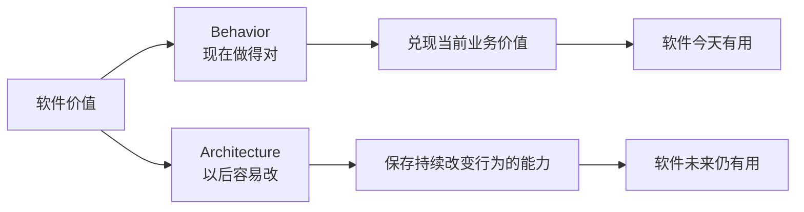
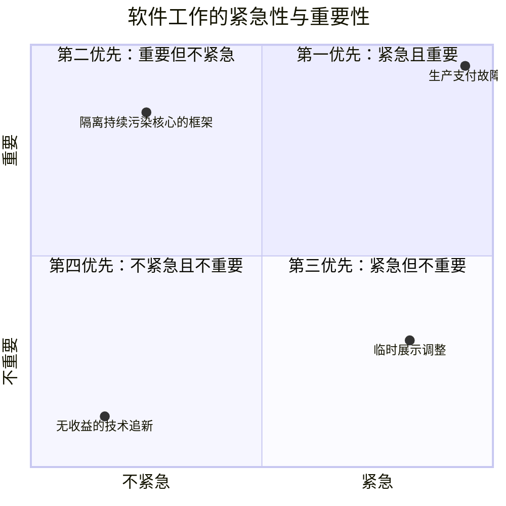

> 原书：Robert C. Martin, *Clean Architecture: A Craftsman's Guide to Software Structure and Design* 
> 本章：Chapter 2, A Tale of Two Values 
> 原文参考：Clean Architecture.md

## 本章导读
> **原书图示**：Chapter 2 章首页
软件为利益相关者提供两种不同的价值：

1. **Behavior（行为价值）**：机器现在是否按照要求工作；
2. **Architecture（结构价值）**：机器的行为以后是否容易改变。

作者认为，开发者对两种价值都负有责任。现实中，团队往往只关注当前功能和缺陷，因为它们可见、紧急、容易进入排期；结构价值不容易直接演示，也很少有明确截止日期，于是持续被挤压。

本章最重要的结论不是「架构永远压倒功能」，而是：

> **行为让软件今天有用，结构让软件在需求改变后仍然有用。**

读本章时，需要重点理解三个容易混淆的区别：

- 当前行为正确，不代表系统长期有价值；
- 修改困难不一定来自需求范围，也可能来自需求与现有结构的形状不匹配；
- 紧急不等于重要，架构工作通常重要却不紧急。

## 1. A Tale of Two Values

### 1.1 为什么要区分两种价值

软件项目中的大部分讨论都围绕行为展开：

- 这个功能什么时候上线？
- 这个按钮为什么不可用？
- 这个接口是否返回正确数据？
- 这个缺陷什么时候修复？
- 客户提出的流程能否实现？

这些问题当然重要，因为不能正确运行的软件无法创造现实价值。

但开发团队还必须回答另一组问题：

- 下一次修改是否仍然容易？
- 更换 UI、数据库或框架会影响哪些代码？
- 一项局部需求为什么需要多个团队参与？
- 核心业务规则能否脱离外部环境独立测试？
- 系统是否正在变得越来越难以理解和发布？

第一组问题关注行为，第二组问题关注结构。

### 1.2 两种价值不是两个独立模块

行为与结构不是分别存放在两个目录中的东西。同一段代码同时影响两种价值。

例如，订单服务新增满减功能：

- 金额计算正确，提供行为价值；
- 规则集中、可测试且不依赖页面，提供结构价值；
- 金额算对了，但同一规则复制到五个渠道，行为暂时正确，结构却在恶化；
- 接口设计很漂亮，但金额计算错误，结构再好也无法交付价值。

所以，团队不能在二者之间永久二选一，而应在实现当前行为时保护未来修改能力。

### 1.3 为什么开发者对二者都负责

业务人员最了解市场、客户和经营目标，能够判断功能是否有价值。但他们通常无法直接判断：

- 某个框架类型是否污染核心；
- 某条依赖是否会扩大未来变更范围；
- 某个共享模块是否正在变成修改瓶颈；
- 一项技术捷径会产生多少回归风险。

这些判断需要软件专业知识，因此不能完全交给业务方决定。

开发者不仅是需求执行者，也是软件资产的利益相关者。保护结构价值，是开发职责的一部分。

## 2. Behavior

### 2.1 什么是行为价值

行为价值是让机器按照利益相关者的要求行动，从而赚钱、省钱、提高效率或控制风险。

典型过程是：

1. 开发者帮助利益相关者形成需求或功能规格；
2. 编写代码，让机器满足这些要求；
3. 用测试、验收和监控确认结果；
4. 当实际行为偏离要求时，定位并修复缺陷。

例如贷款系统需要：

- 接收申请资料；
- 验证必要信息；
- 查询信用记录；
- 按政策决定是否进入估算；
- 返回清晰结果。

系统遗漏步骤、判断错误或返回错误金额，都属于行为问题。

### 2.2 需求、规格、实现与缺陷

要讨论行为正确，首先需要知道「正确」由什么定义。

- **需求**说明业务想达到什么结果；
- **规格**把结果转成更明确的输入、输出和规则；
- **实现**让机器执行这些规则；
- **缺陷**是实际行为与所需行为之间的偏差。

如果需求本身含糊，程序即使通过演示也不一定真的正确。边界输入、并发、失败、权限和异常路径都可能未被说明。

因此，行为价值不仅来自编码，也来自开发者帮助澄清需求和验证真实结果。

### 2.3 为什么行为价值最容易获得注意

行为具有几个天然优势：

- 可以直接演示；
- 有明确客户和截止日期；
- 故障会立即造成损失；
- 可以用验收结果判断完成与否；
- 容易进入业务排期和绩效统计。

当线上付款失败时，所有人都能感受到紧急性；当一个依赖方向正在逐渐扩大未来成本时，很少有人会立刻收到报警。

这使团队自然偏向行为，而不是因为行为是唯一价值。

### 2.4 只实现需求并修复缺陷为什么不够

许多开发者认为自己的全部职责是：

- 根据需求写代码；
- 机器不符合需求时修复 Bug。

作者认为这是严重误解，因为需求不会静止。

今天的正确行为建立在今天的需求上。明天可能发生：

- 客户改变流程；
- 法规增加限制；
- 新渠道接入；
- 定价政策变化；
- 数据来源替换；
- 系统规模扩大。

如果系统已经难以修改，当前正确行为无法继续适应这些变化，行为价值也会逐渐消失。

### 2.5 行为价值的适用边界

行为正确并不等于某个演示路径能运行。还应考虑：

- 输入边界；
- 权限与安全；
- 失败恢复；
- 并发冲突；
- 数据一致性；
- 性能与容量；
- 可观测性和审计。

但这些质量要求也不能被用作无节制增加设计复杂度的借口。要求应来自真实风险，而不是想象中的所有未来场景。

## 3. Architecture

### 3.1 Software 中的 Soft

作者从单词 software 入手：ware 表示产品，soft 表示柔软、可塑。

软件被发明出来，就是为了比硬件更容易改变机器行为。如果机器行为很难改变，那它在效果上就越来越像硬件。

所以，软件的第二种价值不是「内部看起来整洁」，而是：

> **当利益相关者改变主意时，系统可以较容易地跟着改变。**

### 3.2 容易改变具体指什么

容易改变并不意味着任何需求都只需几分钟。真实业务变化有自己的复杂度。

它意味着：

- 修改范围与需求本身大致相称；
- 不需要同时处理大量无关模块；
- 外部技术变化不会迫使核心规则变化；
- 测试范围可以控制；
- 团队能理解被修改区域；
- 改动不会引发不可预测的连锁回归。

作者用 Scope 与 Shape 两个概念解释修改成本为何失控。

### 3.3 Scope：变化本身的范围

Scope 指需求真正涉及多少业务规则、数据和交互。

例如：

| 变化 | 大致范围 |
| --- | --- |
| 修改一条页面文案 | 小 |
| 新增一种折扣政策 | 较小 |
| 调整贷款审批步骤 | 中等 |
| 引入多币种结算 | 较大 |
| 重构整个供应链流程 | 很大 |

范围越大，工作量越大是合理的。架构不能消除业务固有复杂度。

### 3.4 Shape：变化在现有系统中的形状

Shape 是作者特意使用的比喻。它描述一项需求在现有结构中必须穿过哪些模块、层、团队和部署边界。

利益相关者看到的是一块范围相近的新拼图；开发者面对的却是越来越复杂的旧拼图板。每一块新拼图都更难塞入，因为系统现有形状与需求不匹配。

开发者常有一种感受：

> **被迫把方木塞进圆孔。**

### 3.5 同一范围，不同形状

以「订单满 1,000 元减 150 元」为例。

**系统 A：规则集中。**

- 折扣规则位于一个明确策略中；
- 结算用例调用该策略；
- UI 只展示结果；
- 数据库只保存必要数据；
- 规则有独立测试。

新增满减主要修改折扣策略和相应测试。

**系统 B：规则散落。**

- Web 页面先算一次；
- 移动端各算一次；
- Controller 再判断一次；
- 数据库存储过程也有折扣；
- 报表复制了一份旧规则；
- 客服后台有特殊分支。

两边的业务范围相同，但系统 B 的变更形状横跨多个技术层和团队，所以成本高得多。

### 3.6 为什么成本会逐年上升

如果架构不断偏爱旧需求的形状，新需求就会越来越难适配：

1. 第一个功能直接写入现有流程；
2. 第二个功能增加一个条件分支；
3. 第三个功能复制旧代码后修改；
4. 不同渠道逐渐形成不同规则；
5. 每项变化都要兼顾所有历史例外；
6. 测试范围和协调人数持续扩大。

利益相关者提出的需求范围可能没有明显增加，开发者却感到每块新拼图都更难放入。

这就是第一年通常比第二年便宜，第二年又比第三年便宜的原因之一。

### 3.7 Shape Agnostic：尽量不偏爱某一种变化形状

作者认为，架构应在实际可行范围内保持 Shape Agnostic，也就是不要让系统只适合一种预先假定的变化方式。

常见手段包括：

- 把业务规则与 UI 分开；
- 把业务规则与数据库分开；
- 把不同变化原因的代码分开；
- 让外部工具通过稳定边界接入；
- 避免在多个渠道复制同一政策；
- 保持核心规则可以独立测试。

这样，未来变化无论来自页面、数据库、流程还是业务政策，都更可能停留在相应区域。

### 3.8 Shape Agnostic 不等于设计所有扩展点

不能把作者的主张理解为：为任何可能的未来需求预先建立接口、配置和插件。

过度设计会产生新的困难：

- 太多间接层；
- 无人使用的抽象；
- 难以理解的通用框架；
- 当前简单需求被迫适应复杂机制；
- 对未来形状的错误猜测变成新的束缚。

更可靠的原则是：

1. 围绕当前已知业务能力划分边界；
2. 隔离已经观察到的变化源；
3. 保持测试和重构能力；
4. 在真实变化出现后调整结构。

架构不是准确预测未来，而是让预测错误时仍有调整余地。

## 4. The Greater Value

### 4.1 作者提出的问题

行为和结构，哪一种价值更大？

如果询问管理者，他们往往会回答：系统先要能工作。开发者也经常接受这个判断，因为功能是当前交付的直接目标。

作者认为，这个排序忽略了软件会持续变化，于是用两个极端情况进行思想实验。

### 4.2 极端一：工作完美，却无法改变

假设有一个程序：

- 当前功能完全正确；
- 但实际上难以修改。

只要需求发生变化，程序就不再完全符合要求，而团队又无法以可接受成本调整它。系统会逐渐失去用途。

现实中几乎不存在物理上绝对不能修改的代码。作者所说的是**实际上不可修改**：

- 修改成本超过变化带来的收益；
- 风险大到组织不敢批准；
- 所需时间错过市场窗口；
- 没有人能够可靠理解其行为；
- 修改一个配置会破坏其他大量配置。

代码仍然存在，却在经济和经营意义上被锁死。

### 4.3 极端二：当前不能工作，却容易改变

另一个程序当前行为不正确，但结构清楚、修改容易。

在需求明确、技术可行并且组织提供时间和资源的前提下，团队可以：

- 修复当前行为；
- 继续响应后续需求；
- 让程序长期保持有用。

作者由此认为，结构保存了持续恢复和创造行为价值的能力，因此更加根本。

### 4.4 这个思想实验不代表什么

它不代表：

- 不能运行的软件比正确软件好；
- 团队可以无限期只做结构；
- 架构师可以用未来灵活性拒绝当前需求；
- 只要代码容易改，功能和质量就不重要。

当前行为仍然是软件兑现价值的必要条件。

作者真正要说的是：

> **不能为了今天的功能，持续透支明天继续交付功能的能力。**

### 4.5 管理者立场中的矛盾

管理者可能说：当前功能比未来灵活性更重要。

但当他们几个月后提出一项变化，开发团队给出无法承担的成本时，他们通常又会愤怒地问：为什么系统会变得这么难改？

这个矛盾来自决策时间不同：

- 牺牲结构时，未来成本看不见；
- 真正需要变化时，成本突然变得具体。

开发团队的职责，就是在成本尚未爆发时把它带入当前讨论。

## 5. Eisenhower's Matrix

### 5.1 为什么引入重要与紧急
> **原书图示**：Figure 2.1：Eisenhower Matrix
作者引用美国总统 Dwight D. Eisenhower 在 1954 年演讲中表达的观点：问题可分为紧急和重要两类，紧急的往往不重要，重要的往往不紧急。

这不是绝对规律，但非常适合解释软件团队的优先级困境。

### 5.2 四个象限与原书优先顺序

原书给出的优先顺序是：

1. 紧急且重要；
2. 不紧急但重要；
3. 紧急但不重要；
4. 不紧急且不重要。

这个顺序强调：重要性高于单纯紧急性。

### 5.3 行为与结构如何落入矩阵

行为需求往往具有紧迫感：

- 客户正在等待；
- 合同有截止日期；
- 线上故障已经发生；
- 销售承诺即将到期。

但行为不总是特别重要。例如，一项临时展示调整可能必须明天完成，却不会影响核心业务。

结构通常很重要，因为它影响未来所有修改。但结构很少在某个上午突然产生截止时间，所以不容易显得紧急。

作者因此说：

- 行为可能位于第一或第三优先；
- 架构通常位于第一或第二优先。

### 5.4 最常见的错误

管理者和开发者经常把第三优先的工作伪装成第一优先：

> 因为它很急，所以它一定很重要。

结果是大量紧急但影响有限的功能，持续挤压重要但不紧急的结构工作。

长期后果包括：

- 构建和测试越来越慢；
- 业务规则不断复制；
- 发布风险提高；
- 小需求成本失控；
- 架构问题最终以生产事故形式变得真正紧急。

### 5.5 架构为什么会突然变得紧急

架构问题通常经历三个阶段：

1. **早期：** 改动稍微不方便，但仍能靠努力完成；
2. **中期：** 每项功能都需要更多协调、回归和加班；
3. **后期：** 关键变化无法按期完成，或者一改就发生严重故障。

前两个阶段，架构重要但不紧急；到了第三阶段，它才表现为紧急事故。

等到这时再处理，成本和风险通常已经很高。

### 5.6 不要机械使用矩阵

作者的分类是判断工具，不是固定标签。

- 一次数据泄漏既紧急又重要；
- 支付金额错误既紧急又重要；
- 为流行而重写稳定模块可能既不紧急也不重要；
- 某个架构调整若没有真实变化需求，也未必重要；
- 一个看似小的法规功能可能非常重要。

优先级应依据业务影响、风险和未来成本，而不是工作名称。

### 5.7 可操作的判断问题

面对一个候选任务，可以依次问：

1. 不做它，近期会造成什么具体损失？
2. 不做它，后续哪些已知变化会变得更贵？
3. 它解决根因，还是只绕过一次症状？
4. 它影响多少客户、收入、风险或团队？
5. 是否能将结构改善与当前功能一起完成？
6. 有没有更小、更安全的增量方案？

这些问题比单纯争论「功能还是架构」更有效。

## 6. Fight for the Architecture

### 6.1 为什么需要争取

业务需求有客户、收入、合同和日期替它发声。架构通常没有直接代表者。

如果开发团队也只看当前功能，结构价值就没有任何人在决策中维护。

因此作者使用 Fight，随后又说 Struggle 可能更合适：开发、管理、市场、销售和运营都要为自己认为对公司重要的事情争取。

### 6.2 开发者也是利益相关者

开发者并不是被动接收任务的执行者。他们对以下结果有直接责任：

- 软件是否可持续修改；
- 技术风险是否得到说明；
- 结构是否允许业务继续发展；
- 当前捷径是否会产生不可承受的后果。

开发者被聘用，不只是因为会把需求翻译成代码，也因为能够判断代码结构的长期影响。

### 6.3 架构师的特殊责任

架构师比普通开发者更专注系统结构。他们的工作不是自己实现所有功能，而是创造一种结构，使功能能够：

- 容易开发；
- 容易修改；
- 容易扩展；
- 容易测试；
- 由多个团队安全协作。

如果架构永远排在最后，系统开发成本会持续上升，部分功能或配置最终会变得实际上无法修改。

### 6.4 Fight 不等于凭职位否决

作者鼓励的是平等讨论，而不是架构师拥有绝对权力。

无效沟通通常是：

- 「这不够优雅」；
- 「这违反最佳实践」；
- 「我是架构师，所以必须这样做」；
- 「先暂停所有功能，重构三个月」。

有效沟通应把技术问题翻译成可讨论的结果：

- 当前做法会让哪几项已排期需求重复修改？
- 哪些模块和团队会被迫参与？
- 预计增加哪些测试和发布风险？
- 用多大投入可以把影响限制在局部？
- 是否可以随当前功能小步完成？

### 6.5 一个具体协商例子

假设业务要求两周内接入第二家支付渠道。

开发团队发现，当前结算核心直接依赖第一家支付 SDK。

**只追求当前行为的方案：**

- 在结算核心增加渠道判断；
- 直接调用第二家 SDK；
- 两周内可能上线；
- 以后每增加渠道都继续修改核心。

**同时保护结构的方案：**

- 先把现有 SDK 调用移到支付端口后；
- 两家渠道分别实现端口；
- 结算核心只表达支付业务语义；
- 增加少量端口契约测试。

开发团队应说明：第二种方案增加多少当前工作，又会降低哪些已知后续成本。业务方则提供时机和收益信息。双方共同选择，而不是一方用口号压过另一方。

### 6.6 争取架构不等于停止交付

维护结构最可持续的方式，是嵌入日常功能开发：

1. 先保护当前行为；
2. 找出本次需求触及的变化边界；
3. 做足以隔离当前风险的调整；
4. 完成功能；
5. 用测试验证行为与边界；
6. 在后续真实变化中继续演进。

这比把所有问题积累到一个遥远的「架构阶段」更可靠。

### 6.7 争取的边界

不是所有技术偏好都值得 Fight。

以下理由通常不充分：

- 某技术更流行；
- 某写法更符合个人审美；
- 理论上未来可能更换所有东西；
- 新架构看起来更现代；
- 多一层显得更专业。

架构投入应关联：

- 已知变化；
- 真实风险；
- 长期业务能力；
- 测试与发布成本；
- 团队协作瓶颈。

### 6.8 本章最终警告

如果架构总排在最后，系统会越来越贵，直到某些部分在实践中无法改变。

作者把这视为开发团队没有充分履行职责的结果。这个判断很严厉，但其目的不是责备某个人，而是强调：结构价值不会自动得到保护，必须有人持续维护。

## 作者的分析方法

### 1. 先指出常见但不完整的职业观

作者从「实现需求并修 Bug 就是全部工作」开始，让读者意识到开发职责还包括保护软件长期可变更性。

### 2. 从 Software 这个词建立直觉

Soft 不是抽象术语，而是软件相对于硬件最核心的优势：行为容易改变。

### 3. 用拼图和方木解释 Scope 与 Shape

作者没有建立复杂指标，而是使用非常直观的比喻：利益相关者不断给出范围相近的拼图，开发者却要把它们塞进越来越不匹配的系统形状。

### 4. 用极端情况比较两种价值

两个极端情况不是严格证明，而是思想实验。它突出说明：如果软件丧失改变能力，当前行为也不能持续产生价值。

### 5. 用紧急与重要解释组织行为

架构不是没人认同，而是因为不紧急而总被推后。Eisenhower 矩阵说明了这种优先级偏差。

### 6. 最后落实到专业责任

既然业务人员难以独立评价架构，开发团队就不能把全部优先级判断交出去，而要以平等利益相关者身份参与决策。

## 易混淆概念与常见误解

### 1. 行为价值就是功能数量

行为价值看的是机器是否正确满足真实要求，也包括安全、可靠性、数据正确性和失败处理，不只是功能清单长度。

### 2. 架构价值就是代码看起来漂亮

架构价值体现在修改、测试、替换和协作成本上。美观命名有帮助，但不是最终目标。

### 3. 结构价值更大，所以可以不交付

错误。结构保存未来行为能力，当前行为仍是软件兑现价值的必要条件。

### 4. 软件应对任何未来变化都容易修改

不现实。架构只能在实际可行范围内减少对特定形状的偏爱，并围绕已知变化建立边界。

### 5. 抽象越多，软件越柔软

过多抽象会让系统更难理解。只有隔离真实变化的抽象才有价值。

### 6. 紧急功能一定重要

紧急只表示需要快速响应，不代表长期影响大。应单独评估重要性。

### 7. 所有架构工作天然重要

架构工作也可能只是技术追新或个人偏好。必须说明它保护了什么业务能力或降低了什么风险。

### 8. Fight for the Architecture 就是拒绝业务需求

作者要求开发者平等参与权衡，不是凌驾于其他利益相关者之上。

### 9. 技术债可以以后集中偿还

坏结构会从下一项需求开始持续增加成本。集中偿还还可能演变为高风险重写，因此更适合随日常修改增量治理。

## 实践方法：同时维护两种价值

### 1. 需求分析阶段

- 明确当前需要的行为及其边界条件；
- 识别哪些业务政策可能独立变化；
- 区分业务规则与 UI、数据库、协议细节；
- 询问近期是否已有相似变化排期。

### 2. 实现阶段

- 先建立快速测试保护行为；
- 把规则放在与其变化原因一致的位置；
- 不把外部框架类型传入核心；
- 避免复制业务规则到多个渠道；
- 只建立本次变化真正需要的边界。

### 3. 排期阶段

- 同时说明功能工作与必要结构工作；
- 用影响范围、回归风险和后续需求解释收益；
- 优先选择可以随功能交付的小步调整；
- 不把个人偏好包装成架构必需。

### 4. 复盘阶段

- 本次需求实际修改了多少模块？
- 哪些工作是需求本身需要的？
- 哪些工作来自旧结构？
- 新边界是否真的缩小了测试和发布范围？
- 下一项类似需求是否更容易？

## 本章总结

1. 每个软件系统都提供行为与结构两种价值，开发者必须同时维护二者。
2. 行为价值让机器按照要求工作，为利益相关者赚钱、省钱或控制风险。
3. 实现需求和修复 Bug 只是开发职责的一部分，不是全部。
4. Software 的 Soft 表示机器行为应当容易改变，这是软件区别于硬件的重要价值。
5. 修改困难应主要与需求 Scope 相称，而不应被现有系统的 Shape 主导。
6. Scope 是需求固有范围，Shape 是需求必须穿过的模块、层、团队和技术边界。
7. 同一满减需求在规则集中时很局部，在逻辑散落时可能横跨整个系统。
8. 架构越偏爱旧需求形状，后续相似范围的变化越难塞入系统。
9. Shape Agnostic 是尽量避免不必要的结构偏好，不是预先设计所有未来扩展点。
10. 当前行为完美但实际上无法改变的系统，会在需求变化后逐渐失去用途。
11. 当前有问题但容易改变的系统，在条件允许时可以修复并持续演进。
12. 结构价值更根本，不代表可以不交付正确行为，而是不能用今天功能永久透支明天能力。
13. Eisenhower 矩阵区分重要与紧急，原书把重要性放在单纯紧急性之前。
14. 行为通常紧急但不一定重要；架构通常重要但不紧急。
15. 常见错误是把紧急但不重要的功能提升为紧急且重要，长期挤压结构工作。
16. 架构问题早期不紧急，恶化到无法交付或频繁故障时才突然变成紧急事故。
17. 业务人员难以独立判断架构价值，因此开发团队必须主动把长期成本带入决策。
18. 开发者和架构师都是利益相关者，有责任保护软件资产的持续可变更性。
19. Fight for the Architecture 是平等协商，不是凭技术职位否决业务。
20. 有效争取应使用业务影响、风险、修改范围和增量方案，而不是诉诸代码美感。
21. 架构工作最好嵌入日常功能交付，而不是等待一次遥遥无期的全面重构。
22. 并非所有架构想法都重要；只有保护真实业务能力、降低已知风险的投入才值得争取。
23. 如果架构永远排在最后，开发成本会持续增加，直到部分系统在实践中无法改变。
24. 本章最终要求团队建立双重责任：让软件现在正确工作，也让它以后仍然容易改变。
