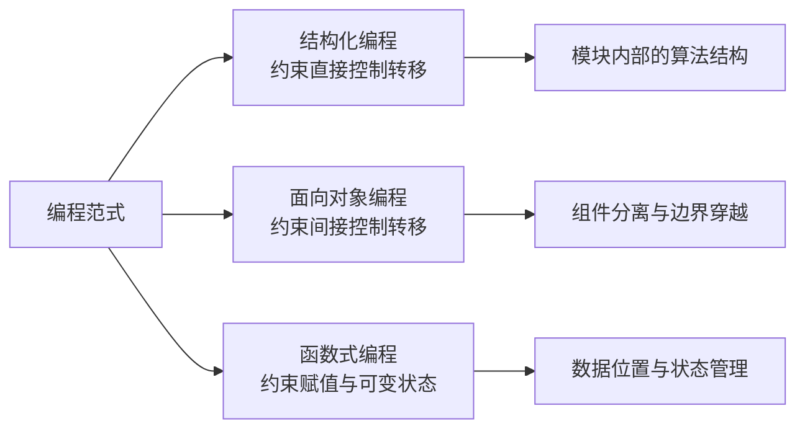
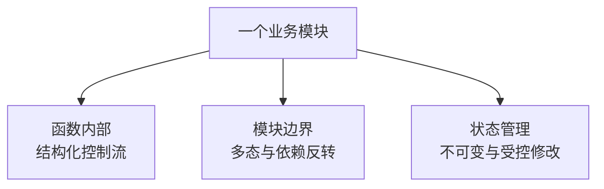
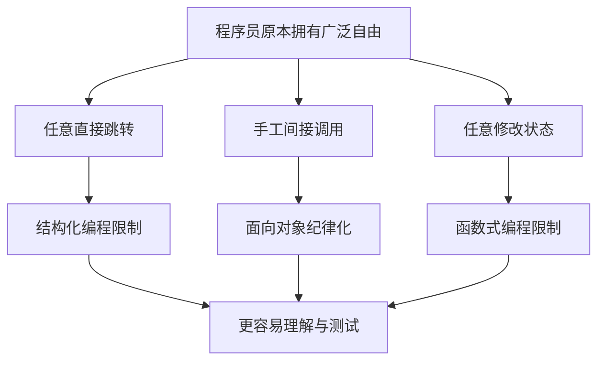

> 原书：Robert C. Martin, *Clean Architecture: A Craftsman's Guide to Software Structure and Design* 
> 本章：Chapter 3, Paradigm Overview 
> 原文参考：Clean Architecture.md

## 本章导读
> **原书图示**：Chapter 3 章首页
第三章是 Part II「Starting with the Bricks: Programming Paradigms」的概览章。

作者把程序代码比作建筑的砖块：软件架构最终必须由具体代码实现，所以在讨论组件和边界之前，需要先理解几十年来程序员对代码本身学到了什么。

本章介绍三种编程范式：

1. **Structured Programming（结构化编程）**：约束直接控制转移；
2. **Object-Oriented Programming（面向对象编程）**：约束间接控制转移；
3. **Functional Programming（函数式编程）**：约束赋值和可变状态。

作者最重要的观察是：

> **三种范式都不是为程序员增加能力，而是在拿走危险的自由。**

这一观点与很多教程不同。教程常把范式解释成一组新语法或新技巧；作者却把范式看成纪律：它们告诉开发者哪些做法不应再随意使用。

本章只是总览。后续 Chapter 4、5、6 会分别展开三种范式，因此这里应掌握它们的历史位置、核心约束和架构意义，而不必提前进入复杂证明或实现细节。

## 1. Part II 背景：从语言革命到范式革命

### 1.1 为什么架构要从代码讲起

架构最终不是一张图，而是源码中真实存在的职责和依赖。

即使架构师设计了清晰边界，如果代码可以随意跳转、任意调用具体实现、到处修改共享数据，边界仍会被破坏。

因此，软件架构的基础并不只在服务和组件层，还在程序员如何组织：

- 控制流；
- 函数与模块；
- 间接调用；
- 数据与状态；
- 依赖方向。

三种范式分别为这些基础问题建立纪律。

### 1.2 从 Turing 时代开始，程序已有熟悉结构

作者回顾早期编程历史：

- 1938 年，Alan Turing 为计算和程序理论奠定基础；
- 到 1945 年，他已经在真实计算机上编写程序；
- 当时的程序虽使用二进制，却已有循环、分支、赋值、子程序和栈等结构。

这说明现代程序的基本材料很早就已经出现。后来发生的重大变化，主要是让这些材料更容易表达、更安全地组合。

### 1.3 语言革命

编程语言的发展不断提高表达层级：

- 20 世纪 40 年代后期出现汇编器，程序员不必再手工翻译二进制；
- 1951 年，Grace Hopper 发明 A0，并创造 compiler 这个术语；
- 1953 年出现 Fortran；
- 随后出现 COBOL、PL/1、SNOBOL、C、Pascal、C++、Java 等大量语言。

语言革命主要解决：

- 如何更方便地表达程序；
- 如何让编译器承担机械工作；
- 如何提供更好的抽象、类型与工具支持。

新语言不断出现，但新语言不一定代表新范式。一种语言可以支持多种范式，多种语言也可以实现同一种范式。

### 1.4 范式革命

作者认为，可能比语言革命更重要的是范式革命。

**编程范式**是一种组织程序的基本方式。它告诉开发者：

- 哪些结构可以使用；
- 哪些结构应受限制；
- 在什么场景使用某类结构；
- 如何降低程序推理难度。

范式与语言相对独立。例如：

- C 可以写结构化程序，也能用函数指针实现多态；
- C++ 可以同时使用结构化、面向对象和函数式风格；
- Java 虽以面向对象闻名，也使用结构化控制流和函数式接口；
- 函数式语言也需要组织模块和控制外部副作用。

### 1.5 作者为什么只列三种范式

作者把结构化、面向对象和函数式编程视为三种基础范式，因为它们分别约束三类最根本的程序行为：

| 范式 | 主要约束对象 |
| --- | --- |
| 结构化编程 | 直接控制转移 |
| 面向对象编程 | 间接控制转移 |
| 函数式编程 | 赋值与可变状态 |

本章后面会说明：作者认为已经没有多少同等基础的自由可以继续拿走，因此未来不太可能再出现第四种同类型的「负面范式」。这是作者基于历史和程序结构作出的判断，不是已经证明的自然定律。

## 2. Paradigm Overview

### 2.1 范式不是语法清单

初学者容易把范式理解成语法特征：

- 有类就是面向对象；
- 有 Lambda 就是函数式；
- 不写 `goto` 就是结构化。

这些判断过于表面。

范式真正关心的是程序员如何控制复杂性：

- 是否可以任意改变执行位置；
- 是否可以让调用者绑定具体实现；
- 是否可以在任意位置修改共享状态。

语法只是语言帮助程序员执行纪律的方式。

### 2.2 范式与语言为什么相对独立

一种语言可能鼓励某种范式，但不能完全决定程序结构。

例如，C++ 提供类、继承和虚函数，但开发者仍然可以：

- 把所有逻辑塞进巨大函数；
- 让所有类直接依赖具体实现；
- 使用大量全局可变状态；
- 用继承制造紧耦合。

反过来，即使 C 没有 class 关键字，也可以通过：

- `struct` 保存状态；
- 函数操作该状态；
- 函数指针实现运行时替换；
- 不透明指针隐藏实现。

所以，掌握范式不是记住语言特性，而是理解它约束了什么问题。

### 2.3 三种范式可以同时使用

三种范式不是相互排斥的阵营。

一个现代业务系统通常同时需要：

- 用结构化编程组织每个函数内部的算法；
- 用多态让高层政策不依赖低层细节；
- 用不可变数据或受控状态减少并发和一致性问题。

不能用面向对象替代结构化算法，也不能用函数式编程自动解决所有组件依赖问题。它们关注不同维度。

## 3. Structured Programming

### 3.1 历史位置

结构化编程是最先被广泛采用的范式，但不是最早被发明的范式。

作者把它与 Edsger Wybe Dijkstra 在 1968 年的工作联系起来。Dijkstra 指出，不受约束的跳转会破坏程序结构。

当时很多程序依赖任意 `goto`：代码可以从一个位置跳到另一个位置，执行路径难以从文本结构中看出来。程序规模增大后，人脑很难追踪所有可能路径。

### 3.2 什么是直接控制转移

直接控制转移是程序主动决定下一步执行位置。

典型形式包括：

- 顺序执行下一条语句；
- 条件分支；
- 循环；
- 早返回；
- 跳转。

不受限制的 `goto` 可以跳到几乎任意标签，打破代码块的入口和出口，使局部代码难以独立理解。

### 3.3 结构化编程施加的纪律

作者将结构化编程概括为：

> **结构化编程对直接控制转移施加纪律。**
>
> *Structured programming imposes discipline on direct transfer of control.*

它用熟悉的结构替代任意跳转：

- 顺序；
- `if/then/else` 选择；
- `do/while/until` 迭代。

这些结构具有清晰的入口、出口和嵌套关系。开发者可以逐层理解程序，而不必在整个文件中追踪任意跳转。

### 3.4 为什么限制会改善程序

限制任意跳转带来几个直接收益：

1. **局部可读**：一个代码块的控制边界更加清晰；
2. **可以分解**：大问题能拆成较小函数；
3. **可以组合**：小函数按顺序、分支和循环组成更大行为；
4. **容易测试**：每个小单元可独立准备输入和观察输出；
5. **便于推理**：控制流与源码结构大致一致。

结构化编程没有让计算机获得新能力，反而禁止了一些自由。但正因为自由减少，程序更容易被人理解。

### 3.5 现代语言中的位置

大多数现代语言已经默认限制不受约束的跳转。开发者即使没有主动选择，也通常在写结构化程序。

`break`、`continue`、异常和早返回有时被类比为 `goto`，但它们通常具有明确范围和受控目标，不等于早期语言中的任意跳转。

使用这些结构仍需节制：过深嵌套、异常滥用或到处早返回也可能降低可读性，但问题与完全任意的控制转移不同。

### 3.6 与架构的关系

结构化编程为模块内部的算法提供基础。架构把系统拆成组件和模块后，每个模块仍需要由可理解、可测试的函数构成。

如果模块内部控制流混乱，即使组件图很漂亮，代码仍然难以验证和维护。

Chapter 4 会进一步解释结构化编程为何支持功能分解和可证伪测试，本章只需记住它约束的是**直接控制流**。

## 4. Object-Oriented Programming

### 4.1 历史位置

面向对象编程在 1966 年由 Ole Johan Dahl 与 Kristen Nygaard 的工作推动，比结构化编程的广泛发现还早两年。

他们在 ALGOL 中观察到：如果把函数调用的栈帧移到堆上，函数返回后，其中的局部变量仍可以继续存在。

由此可以直观理解类和对象的来源：

- 函数逐渐变成构造过程；
- 局部变量变成对象实例变量；
- 嵌套函数变成操作这些数据的方法；
- 堆上的状态拥有比单次函数调用更长的生命周期。

这是一种历史解释，不是说现代对象只能用这种方式实现。

### 4.2 什么是间接控制转移

直接调用时，调用者明确写出具体目标：

- 订单服务调用某个确定的支付 SDK；
- 报表模块调用某个确定的数据库类。

间接调用时，调用者通过一个稳定约定发出调用，真正执行哪个实现由运行时决定：

- 支付用例调用 `PaymentGateway`；
- 具体实现可能是银行 A、银行 B 或测试替身；
- 调用者不需要知道具体对象类型。

这种运行时替换能力通常称为多态。

### 4.3 面向对象编程施加的纪律

作者把面向对象编程概括为：

> **面向对象编程对间接控制转移施加纪律。**
>
> *Object-oriented programming imposes discipline on indirect transfer of control.*

函数指针早在面向对象语言出现前就能实现间接调用，但手工管理具有风险：

- 指针可能为空；
- 签名可能不匹配；
- 初始化时机容易出错；
- 调用关系难以被工具理解；
- 大规模使用时难以维护。

面向对象语言通过接口、虚函数、类型检查和对象生命周期管理，使间接调用成为更安全、更常规的机制。

### 4.4 为什么作者把重点放在多态

很多教材用三件事介绍面向对象：

- 封装；
- 继承；
- 多态。

作者在本书中的架构重点是多态，因为多态可以改变源码依赖方向。

高层业务需要调用低层数据库时，最直接的代码会让高层依赖数据库。引入高层拥有的接口后：

- 高层只依赖接口；
- 低层数据库实现接口；
- 运行时调用仍然到达数据库；
- 源码依赖却指向高层接口。

这正是后续架构边界和依赖反转的基础。

### 4.5 封装、继承和多态不要混为一谈

**封装**帮助隐藏数据和实现细节，但不是面向对象语言独有。C 模块和不透明指针也能实现封装。

**继承**可以复用结构或表达类型关系，但容易制造紧耦合。组合通常是更安全的选择。

**多态**允许高层依赖稳定抽象，低层实现可被替换，是作者认为最具有架构意义的能力。

三者有关联，却不是同一概念。

### 4.6 面向对象不是模拟现实世界

把代码对象命名为现实事物有时有帮助，但面向对象的架构价值并不来自「一切都是对象」。

过度模拟现实可能产生：

- 庞大继承树；
- 行为分散；
- 对象之间过度互相知道；
- 难以控制的可变状态。

作者关心的是：能否利用多态控制依赖，而不是对象名称是否像现实世界。

### 4.7 与架构的关系

架构边界经常遇到一个矛盾：运行时控制必须向外层细节流动，源码依赖却应该向内层政策流动。

多态使这两个方向可以分离，因此用于：

- 数据库 Gateway；
- Presenter Output Port；
- 外部服务接口；
- 设备 Driver；
- 可替换算法策略；
- 测试替身。

Chapter 5 会详细分析封装、继承和多态，并说明 OO 如何让架构师控制源码依赖。

## 5. Functional Programming

### 5.1 历史位置

函数式编程是三种范式中最早被发明、却较晚被广泛采用的一种。

其思想源于 Alonzo Church 在 1936 年提出的 Lambda Calculus。当时 Church 与 Turing 都在研究计算的数学基础。John McCarthy 于 1958 年发明 LISP，使相关思想进入实际编程语言。

本章不要求理解 Lambda Calculus 的数学推导。作者关注的是它带来的一个核心观念：**不可变性**。

### 5.2 什么是不可变性

不可变性指一个值建立后不再被原地修改。

命令式程序常这样思考：

- 有一个变量；
- 在不同时间给它赋不同值；
- 程序状态随赋值变化。

函数式风格更倾向于：

- 旧值保持不变；
- 计算产生一个新值；
- 状态变化被表达成从旧状态到新状态的转换。

这并不意味着现实系统没有状态，而是限制状态可以在哪里、由谁、以什么方式修改。

### 5.3 函数式编程施加的纪律

作者将函数式编程概括为：

> **函数式编程对赋值施加纪律。**
>
> *Functional programming imposes discipline upon assignment.*

严格函数式语言可能没有通常意义上的赋值；多数实际语言允许修改变量，但会通过语言和设计习惯限制可变性。

常见实践包括：

- 优先使用不可变值；
- 让函数返回新结果，而不是修改共享输入；
- 把副作用集中在边界；
- 缩小可变状态的生命周期；
- 明确谁拥有修改权。

### 5.4 为什么赋值会增加推理难度

如果数据可以在多个位置被修改，理解当前值必须知道：

- 谁曾经写过它；
- 写入顺序是什么；
- 是否存在并发修改；
- 读取时处于哪个时间点；
- 修改是否保持业务不变量。

共享可变状态特别容易造成：

- 竞态条件；
- 更新丢失；
- 难以重现的测试失败；
- 缓存与数据库不一致；
- 隐蔽的调用顺序依赖。

减少赋值与共享修改，可以显著缩小需要同时考虑的情况。

### 5.5 函数式编程不等于完全没有状态

真实系统需要记录订单、余额、库存和用户会话，因此不可能假装状态不存在。

函数式纪律更实际的含义是：

- 把业务计算尽量写成输入到输出的明确转换；
- 把数据库、文件、网络等副作用留在边界；
- 让状态变化经过少数受控入口；
- 在并发区域优先传递不可变消息；
- 需要修改时，明确事务与所有权。

### 5.6 与架构的关系

数据管理是架构的核心问题之一。系统越大，共享状态越多，修改冲突和一致性问题越难控制。

函数式编程帮助架构师思考：

- 哪些组件可以保持无状态；
- 哪些数据必须可变；
- 可变部分应隔离在哪里；
- 哪些事件或状态转换需要记录；
- 如何减少跨组件共享修改。

Chapter 6 会进一步讨论不可变性、并发与事件溯源。本章只需记住它约束的是**赋值和可变状态**。

## 6. Food for Thought

### 6.1 三种范式的共同模式

作者刻意把三种范式写成相同句式：

- 结构化编程约束直接控制转移；
- 面向对象编程约束间接控制转移；
- 函数式编程约束赋值。

共同点不是提供新能力，而是对原本自由的操作加上纪律。

### 6.2 为什么拿走能力不会让程序无法表达

被限制的不是计算能力本身，而是危险、难以推理的表达方式。

- 不用任意 `goto`，仍可用顺序、选择和循环表达算法；
- 不手工散布函数指针，仍可通过受类型约束的多态间接调用；
- 不任意修改共享状态，仍可通过返回新值或受控事务表达变化。

范式让某些写法变得困难或不可用，从而引导程序进入更可控的结构。

### 6.3 负面纪律为什么有效

大型程序的困难往往不是缺少表达能力，而是可能性太多。

当任何代码都能：

- 跳到任何位置；
- 调用任何具体实现；
- 修改任何共享数据；

开发者就必须同时考虑大量组合。

限制自由后，程序的可能形状减少，局部推理、测试和协作都会更容易。

这与交通规则类似：禁止车辆任意行驶没有降低道路的运输价值，反而让大量参与者能够安全协作。

### 6.4 三种范式拿走了什么

作者用简化说法概括：

- 结构化编程拿走 `goto`；
- 面向对象编程拿走直接操纵函数指针的自由；
- 函数式编程拿走赋值。

这不是逐字的语言禁令。

- 某些结构化语言仍保留受限 `goto`；
- 面向对象程序内部仍可能使用函数指针；
- 实用函数式语言常允许受控可变状态。

作者表达的是每种范式对一类危险能力施加了系统性纪律。

### 6.5 为什么作者认为不会再有第四种

三种范式在 1958 到 1968 年间相继出现，几十年后没有再出现同样基础、以拿走能力为特征的新范式。

作者认为，直接控制、间接控制和赋值已经覆盖了程序最根本的几个自由，因此可能没有新的东西可继续拿走。

这个观点应当作为有启发性的历史判断，而不是绝对证明。后来仍然出现了：

- 并发模型；
- Actor；
- 逻辑编程；
- 数据流编程；
- 响应式编程；
- 所有权类型系统。

这些思想是否构成独立基础范式，取决于分类标准。作者的重点不是封闭术语，而是强调三种纪律的基础地位。

### 6.6 纪律不等于必须由语言禁止

纪律可以由多种方式建立：

- 语言语法；
- 类型系统；
- 编译器检查；
- 编码约定；
- 模块边界；
- 代码评审；
- 静态分析；
- 测试。

即使语言允许某种做法，团队仍可决定不在关键区域使用。例如 C++ 允许全局可变变量，但架构可以禁止核心模块使用它们。

## 7. Conclusion

### 7.1 三种范式与架构有什么关系

作者问：这段范式历史与软件架构有什么关系？答案是：关系非常密切。

架构最终必须依靠这些基础纪律实现：

- 模块内部需要可理解的算法；
- 模块之间需要可控制的依赖；
- 系统数据需要明确的所有权与修改规则。

### 7.2 与架构三大关注点的对应

| 架构关注点 | 主要范式支持 | 作用 |
| --- | --- | --- |
| Function | 结构化编程 | 组织模块内部算法与功能分解 |
| Separation of Components | 面向对象编程 | 用多态跨越边界并反转源码依赖 |
| Data Management | 函数式编程 | 限制赋值，隔离可变状态和副作用 |

作者在原书结尾把三者排列得非常整齐，这正是本章的架构意义。

### 7.3 对应关系不是互斥分工

表格表示主要贡献，不代表一一排他。

- 结构化控制也影响组件可测试性；
- 面向对象中的对象会管理状态；
- 函数式分解也能组织算法；
- 数据所有权会影响组件边界；
- 多态本身仍要靠结构化函数实现。

真实系统通常同时使用三种纪律。

### 7.4 从代码纪律到架构纪律

三种范式给后续章节提供了一个共同视角：

> **好的软件结构常常来自主动限制，而不是增加任意能力。**

后续架构规则也采用相同方式：

- 不是所有模块都能互相依赖；
- 不是所有数据都能跨边界传递；
- 不是所有组件都能随意部署；
- 高层政策不能知道低层细节；
- 可变状态不能无边界共享。

架构就是把这种纪律从函数和语言结构提升到模块、组件与系统层面。

## 作者的分析方法

### 1. 先区分语言与范式

语言不断增加表达工具，范式却通过限制基本操作来控制复杂性。这个区分避免把学习新语法误认为理解新设计思想。

### 2. 用历史说明发现顺序与采用顺序不同

函数式思想最早出现，却最晚被广泛采用；面向对象比结构化更早被发现，却较晚进入主流。技术价值不会自动决定普及时间，还受硬件、语言和行业需求影响。

### 3. 为三种范式建立统一句式

作者使用「对某种操作施加纪律」的统一表达，让读者看到它们的共同本质，而不是只记三个互不相干的定义。

### 4. 最后映射到架构问题

本章不是为历史而历史。结论明确把三种范式连接到 Function、Component Separation 和 Data Management，为后续架构章节铺路。

## 易混淆概念与常见误解

### 1. 编程范式等于编程语言

错误。语言可以支持多种范式，范式描述的是组织程序和限制操作的方式。

### 2. 新范式让程序能够完成以前做不到的计算

作者的观点相反：基础范式主要拿走危险自由，使相同计算能力更容易被人控制。

### 3. 结构化编程只是不用 `goto`

不用任意跳转是表面特征，更深层价值是获得清晰控制结构、功能分解和可测试单元。

### 4. 面向对象的核心是把现实事物建成类

本书的架构重点是多态对间接控制转移和源码依赖的控制，而不是现实世界建模本身。

### 5. 多态只能通过类继承实现

函数指针、接口表、泛型和消息分派也能提供不同形式的替换能力。面向对象语言让动态多态更安全、常规。

### 6. 函数式编程完全不能有状态

真实系统必然有状态。函数式纪律强调减少和隔离可变状态，使变化显式、受控。

### 7. 不可变数据一定性能差

不可变可能增加复制，也可能带来结构共享、缓存和并发优势。性能应测量，不能用直觉否定状态纪律。

### 8. 三种范式彼此竞争

现代系统通常同时使用三者，它们分别处理算法、依赖和数据管理问题。

### 9. 世界上严格只有三种范式

这是作者对基础负面范式的判断，不是不可质疑的数学结论。理解其分类标准比争论术语数量更重要。

### 10. 纪律会限制开发效率

无约束自由通常把复杂性转嫁给理解、调试和测试。适当纪律减少可能性，反而提高团队协作效率。

## 实践检查清单

### 检查直接控制流

- 函数是否有清晰入口与出口？
- 是否存在难以追踪的跳转和异常路径？
- 大函数能否按职责分解？
- 分支和循环是否容易独立测试？

### 检查间接控制流

- 高层模块是否直接依赖具体技术实现？
- 运行时需要替换的实现是否有稳定接口？
- 接口是否由需要保护的高层一侧拥有？
- 是否滥用继承，而组合或端口更合适？

### 检查赋值与状态

- 哪些状态必须可变？
- 谁拥有修改权？
- 是否存在跨线程或跨组件共享修改？
- 业务计算能否写成输入到输出的明确转换？
- 副作用是否集中在可识别的边界？

### 检查范式使用方式

- 是否因为语言支持某特性就机械使用？
- 某项限制是否解决了真实复杂性？
- 是否把范式当成阵营，而没有组合使用？
- 是否能说明这项纪律如何改善理解、测试或依赖？

## 本章总结

1. 软件架构最终由代码实现，因此讨论架构要从编程范式这些基础砖块开始。
2. Turing 时代的程序已经包含循环、分支、赋值、子程序和栈等现代程序的基本材料。
3. 语言革命提高表达层级，范式革命则限制程序结构以控制复杂性。
4. 编程范式相对独立于语言，一种语言可以支持多种范式。
5. 现代系统通常同时使用结构化、面向对象和函数式编程，而不是三选一。
6. 结构化编程由 Dijkstra 在 1968 年推动广泛采用，主要反对不受限制的直接跳转。
7. 结构化编程对直接控制转移施加纪律，用顺序、选择和迭代组织算法。
8. 受控控制流使程序更容易局部理解、功能分解和测试。
9. 现代语言通常已经限制任意 `goto`，因此开发者往往默认使用结构化编程。
10. 面向对象编程与 Dahl 和 Nygaard 1966 年的工作相关，其历史直觉来自让函数状态拥有更长生命周期。
11. 面向对象编程对间接控制转移施加纪律，把手工函数指针变成受类型约束的多态机制。
12. 本书重视 OO 的多态能力，因为它可以把运行时控制流与源码依赖方向分开。
13. 封装、继承和多态相关但不同；其中多态对架构边界最关键。
14. 面向对象的架构价值不在于机械模拟现实世界，而在于控制依赖和替换实现。
15. 函数式编程思想源于 Church 1936 年的 Lambda Calculus，并影响了 1958 年出现的 LISP。
16. 函数式编程对赋值施加纪律，以不可变性减少任意状态修改。
17. 不可变性不是否认状态，而是让状态转换、修改位置和所有权更加明确。
18. 限制共享可变状态可以减少竞态、调用顺序依赖和一致性问题。
19. 三种范式都主要拿走能力：任意跳转、手工间接控制和任意赋值。
20. 拿走危险表达方式不会降低基本计算能力，却能减少程序可能形状，使人更容易推理。
21. 作者认为三种基础负面范式可能已经覆盖可被拿走的核心自由，但这是一种历史判断，不是绝对定律。
22. 纪律不一定由语言强制，也可以由类型、模块、评审、静态分析和测试建立。
23. 结构化编程主要支持架构中的 Function，即模块内部算法和功能分解。
24. 面向对象编程主要支持 Separation of Components，即通过多态跨边界并反转依赖。
25. 函数式编程主要支持 Data Management，即限制状态修改和副作用位置。
26. 三种范式的对应关系不是排他的，它们在真实系统中相互配合。
27. 本章的核心启示是：软件质量常来自主动限制自由，而不是不断增加能力。
28. 后续架构原则会把同一种限制思想，从函数和语言结构提升到模块、组件与系统边界。
