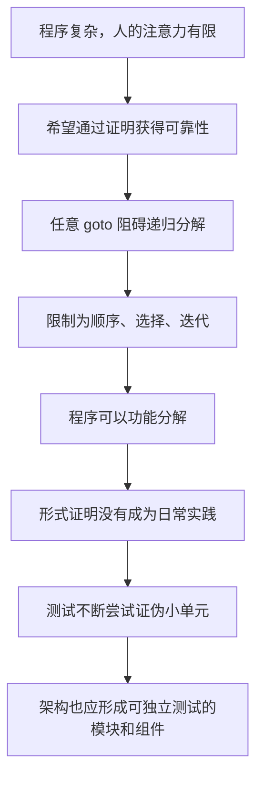
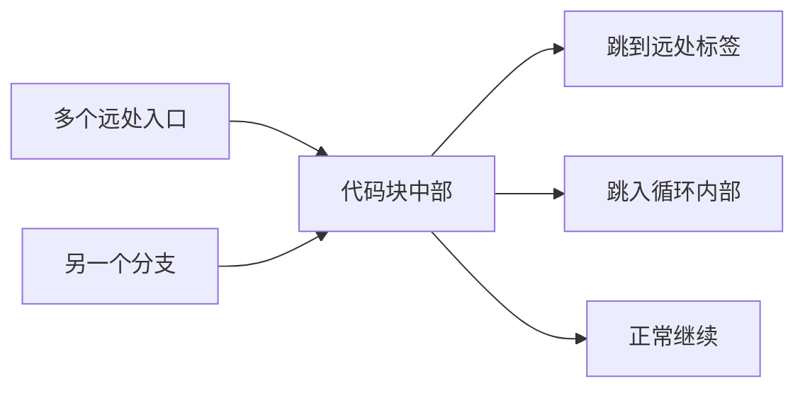
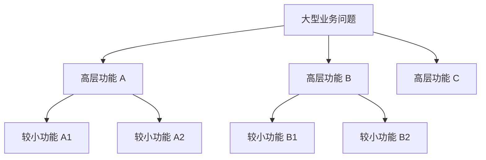

> 原书：Robert C. Martin, *Clean Architecture: A Craftsman's Guide to Software Structure and Design* 
> 本章：Chapter 4, Structured Programming 
> 原文参考：Clean Architecture.md

## 本章导读
> **原书图示**：Chapter 4 章首页
Chapter 3 把结构化编程概括为：

> **结构化编程对直接控制转移施加纪律。**

Chapter 4 解释这句话从何而来，以及它为什么与软件架构有关。

作者沿着一条很有历史感的主线展开：

1. Dijkstra 希望把编程发展成能够证明正确性的学科；
2. 他发现不受限制的 `goto` 会阻碍程序递归分解；
3. 顺序、选择和迭代既足以表达所有程序，又适合逐层分析；
4. 结构化编程由此诞生，并推动功能分解；
5. 对所有程序进行形式证明的愿景没有成为主流实践；
6. 测试转而成为软件开发中不断尝试证伪程序的主要手段；
7. 可测试、可证伪的单元也成为架构划分模块和组件的重要标准。

本章的重点不是要求开发者为每个函数写数学证明，而是理解：**限制控制流，使程序能够被分解、理解和测试。**

## 1. Structured Programming：历史背景与问题起点

### 1.1 Dijkstra 所处的时代

Edsger Wybe Dijkstra 于 1930 年出生在荷兰鹿特丹。他经历了第二次世界大战期间鹿特丹轰炸和德国占领。1948 年高中毕业时，他在数学、物理、化学和生物方面都取得了最高成绩。

1952 年 3 月，21 岁的 Dijkstra 进入阿姆斯特丹数学中心工作，成为荷兰第一位程序员。

当时的计算环境与今天完全不同：

- 计算机使用真空管，体积巨大；
- 机器脆弱、缓慢且不可靠；
- 程序使用二进制或粗糙的汇编语言编写；
- 输入依赖纸带或穿孔卡片；
- 一次编辑、编译、测试循环可能需要几小时甚至几天。

正是在这样原始的环境中，Dijkstra 开始思考如何为编程建立严格纪律。

### 1.2 为什么 Dijkstra 选择编程

1955 年，Dijkstra 已有三年程序员经验，同时仍是学生。他认为编程的智力挑战甚至超过理论物理，于是决定把编程作为长期职业。

1957 年结婚时，荷兰的婚姻手续要求填写职业。政府工作人员不接受「程序员」这个职业，因为当时几乎没人听说过它。Dijkstra 最后只能填写「理论物理学家」。

这个细节说明：编程不仅年轻，而且尚未被社会承认为成熟专业。

### 1.3 对编程缺少学科基础的担忧

Dijkstra 曾向上司 Adriaan van Wijngaarden 表达担忧：编程还没有形成明确的纪律或科学，他担心这个职业不会得到认真对待。

Van Wijngaarden 回答说，Dijkstra 或许正是能够发现这些纪律、把软件推进为一门科学的人之一。

这个背景很重要。Dijkstra 后来反对任意 `goto`，并非只是在争论代码风格，而是在寻找一套可以让编程成为严肃工程活动的基础方法。

### 1.4 Dijkstra 识别出的根本问题

Dijkstra 很早就认识到：

- 编程很难；
- 人类并不擅长同时管理大量细节；
- 复杂程序包含的状态和路径远超人的短期记忆；
- 忽略一个小细节，就可能让看似正常的程序在意外条件下失败。

问题的核心不是程序员缺乏努力，而是**程序复杂度超过未经辅助的人脑能力**。

因此，需要通过结构和纪律，把大问题拆成可以逐步理解的小问题。

## 2. Proof

### 2.1 Dijkstra 为什么想到数学证明

数学能够从少量公理出发，建立定理、推论和引理组成的层次。复杂结论依靠已经证明的较小结论逐步建立。

Dijkstra 希望程序也能采用类似方式：

1. 使用已经证明可靠的基本结构；
2. 把复杂程序拆成较小单元；
3. 证明每个小单元满足要求；
4. 再证明这些单元组合后仍然正确。

他的愿景是一套类似欧几里得几何的程序正确性体系。

### 2.2 为什么程序证明很困难

一段程序是否正确，不只取决于某次运行结果，还取决于：

- 所有允许输入；
- 所有可能状态；
- 每条控制路径；
- 循环是否终止；
- 异常和边界条件；
- 程序所依赖的前提是否成立。

程序越复杂，可能路径越多。若控制流可以任意跳转，证明者甚至难以确定一个代码片段从哪里进入、到哪里离开。

Dijkstra 因此先研究：什么样的控制结构允许程序被反复拆成较小、可分析的单元？

### 2.3 任意 `goto` 为什么阻碍分解

不受限制的 `goto` 可以让控制流：

- 从代码块中间跳入；
- 从一个分支跳到另一个分支内部；
- 越过初始化或清理逻辑；
- 在相距很远的标签之间往返；
- 形成源码缩进无法表达的执行路径。

一个代码块如果存在多个不规则入口和出口，就很难把它当成独立单元分析。理解它必须同时阅读所有可能跳入和跳出的地方。

这会破坏分而治之：无法先理解局部，再组合成整体。

### 2.4 并非所有跳转都有同样问题

Dijkstra 发现，有些 `goto` 使用方式不会破坏递归分解。这些「良性跳转」对应我们熟悉的结构：

- 条件选择；
- 循环迭代；
- 顺序执行。

它们具有可识别的结构边界：

- 一个选择有明确条件和若干分支；
- 一个循环有明确条件、循环体和退出点；
- 一个顺序由前一步的输出进入下一步。

因此，问题并不是 CPU 发生了跳转，而是源码是否允许**不受约束的控制转移**。

### 2.5 Böhm–Jacopini 的重要发现

在 Dijkstra 研究这些问题前两年，Corrado Böhm 和 Giuseppe Jacopini 已经证明：任何可计算程序都可以用三种基本结构表达：

1. **Sequence（顺序）**；
2. **Selection（选择）**；
3. **Iteration（迭代）**。

这项发现的重要之处不是鼓励所有程序只写三个巨大代码块，而是说明：取消任意 `goto` 不会损失基本表达能力。

程序员失去的是一种危险写法，不是解决问题的能力。

### 2.6 三种结构为什么适合逐层分析

**顺序结构**

可以依次检查每个步骤：前一步是否产生下一步所需条件，最后是否得到期望结果。

**选择结构**

可以分别检查每个分支：条件成立时是否正确，条件不成立时是否也正确，所有可能路径是否覆盖。

**迭代结构**

需要检查：

- 循环开始前哪些条件成立；
- 每轮是否保持必要条件；
- 每轮是否接近结束；
- 循环退出后是否得到期望结果。

原书用枚举和归纳描述这些证明方法。日常开发不一定写出形式证明，但这些问题仍然是设计循环与测试边界时的重要思路。

### 2.7 「足够表达」与「容易分析」恰好重合

结构化编程诞生的关键，不只是三种结构更整洁，而是两件事同时成立：

- 它们足以构造所有程序；
- 它们允许程序递归拆分和逐层分析。

如果某种限制让程序易于证明，却无法表达现实算法，就不实用；如果表达能力很强，却无法被人理解，也不适合大型软件。

顺序、选择和迭代在两者之间取得了关键平衡。

### 2.8 定理的现实边界

Böhm–Jacopini 的结论不能被误读为：

- 只要不用 `goto`，代码就一定清晰；
- 所有程序都应该写成一个函数；
- 结构化改写一定更高效；
- 深层嵌套比任何跳转都好；
- 三种结构自动保证程序正确。

结构化控制流只是建立了可分解和可分析的基础。命名、职责、数据结构、模块边界和测试仍然决定代码质量。

## 3. A Harmful Proclamation

### 3.1 1968 年的公开争论

1968 年 3 月，Dijkstra 在 CACM 发表一封致编辑的信，标题是 *Go To Statement Considered Harmful*。

这封信主张用受控结构替代不受限制的 `goto`，在编程界引发激烈争论。当时没有互联网，人们通过学术期刊和编辑来信争辩，有些支持，有些非常负面。

争论持续了大约十年。

### 3.2 为什么争议如此强烈

`goto` 当时是程序员最熟悉、最基础的工具之一。批评它不仅挑战编码习惯，也挑战很多人的专业经验。

此外，当时语言、编译器和机器资源有限，一些程序员担心：

- 结构化控制会降低效率；
- 现有代码无法轻易重写；
- 某些底层算法需要跳转；
- 理论方法不适合实际工程。

因此，这场争论不仅是技术判断，也涉及工具条件、习惯和职业身份。

### 3.3 Dijkstra 如何最终获胜

作者认为 Dijkstra 最终赢得了争论。证据不是所有程序员口头认同，而是语言设计发生了改变：

- 不受限制的 `goto` 逐渐退居边缘；
- 许多现代语言根本不提供它；
- 即使保留 `goto`，目标通常也限制在当前函数范围；
- 条件、循环、函数和结构化异常成为默认工具。

今天的大多数开发者都是结构化程序员，即使他们从未主动选择这个标签。

### 3.4 `break`、早返回和异常是不是 `goto`

这些结构都会改变顺序控制流，但通常受到明确约束。

- `break` 退出当前循环或选择结构；
- `continue` 进入下一轮循环；
- 早返回退出当前函数；
- 异常沿规定的调用栈传播；
- 命名跳转通常局限在特定语法范围。

它们不像早期 Fortran 或 COBOL 中的任意跳转，可以无视代码块边界跳往远处。

当然，受控结构也能被滥用。一个函数有大量早返回、异常被当成普通分支、循环嵌套过深，仍会难以理解。关键是控制转移是否保持清楚边界。

### 3.5 `goto` 是否在任何场景都绝对错误

本章表达的是架构纪律，而不是道德禁令。

在某些低层代码中，局部、受限的 `goto` 可能用于：

- C 语言中集中资源清理；
- 生成代码；
- 状态机实现；
- 极少数经过测量的性能热点。

判断重点是：

- 跳转是否保持在小范围；
- 是否减少而不是增加重复；
- 是否有多个任意入口；
- 是否让测试和推理变得困难；
- 是否有更清楚的结构可替代。

## 4. Functional Decomposition

### 4.1 从结构化控制到功能分解

如果模块只使用可嵌套的顺序、选择和迭代，就可以递归分解：

- 大问题拆成若干高层功能；
- 每个高层功能再拆成较小功能；
- 小功能继续分解，直到容易理解和测试。

### 4.2 功能分解解决什么问题

大型问题无法一次放进人的脑中。功能分解让开发者一次只关注一个层次：

- 在高层理解系统主要步骤；
- 在低层理解每一步如何实现；
- 通过清晰接口连接不同层次；
- 独立测试小功能；
- 把修改限制在相应功能中。

### 4.3 自顶向下的分析与设计

20 世纪 70 年代后期到 80 年代，结构化分析和结构化设计广泛流行。Ed Yourdon、Larry Constantine、Tom DeMarco 和 Meilir Page-Jones 等人推广了这些方法。

团队通常从大型问题陈述开始，逐层识别：

- 输入和输出；
- 主要业务功能；
- 数据流；
- 子功能；
- 最终可实现的小函数。

这种方法让大型系统第一次拥有较系统的分解纪律。

### 4.4 功能分解不是函数越小越好

机械切割会产生另一种复杂性：

- 函数只有一行却没有独立意义；
- 阅读者必须频繁跳转；
- 参数在多层之间原样传递；
- 业务概念被技术步骤切碎；
- 修改一个行为仍要改很多小函数。

好的分解应围绕明确职责和可命名概念，而不是追求函数数量。

可以询问：

- 这个函数能否用一句话说明职责？
- 它是否处于同一抽象层级？
- 拆出后是否更容易测试或复用？
- 参数和返回值是否清楚？
- 阅读主流程是否更容易？

### 4.5 功能分解的边界

纯粹自顶向下分解也有局限：

- 可能让多个流程共享和修改同一批数据；
- 可能围绕处理步骤，而不是稳定业务概念组织；
- 可能产生庞大的过程式模块；
- 很难独自解决跨组件依赖方向；
- 不自动解决并发和可变状态问题。

后续面向对象、函数式编程和组件原则会补充这些不足。结构化编程是算法与模块基础，但不是完整架构方案。

## 5. No Formal Proofs

### 5.1 Dijkstra 的愿景为什么没有成为日常实践

Dijkstra 希望建立一套由公理、定理、推论和引理构成的程序正确性体系。但这种体系没有在普通软件开发中形成，开发者也没有普遍采用逐函数形式证明。

主要现实原因包括：

- 证明过程费时且专业门槛高；
- 规格本身可能含糊或变化；
- 真实系统依赖数据库、网络、时间和并发；
- 证明模型与实际运行环境可能不一致；
- 业务更关心快速反馈和持续变化；
- 工具与语言长期没有提供足够便利的支持。

### 5.2 形式证明没有普及，不等于没有价值

在以下领域，形式方法仍然非常重要：

- 安全关键系统；
- 航空航天；
- 密码协议；
- 芯片与编译器验证；
- 分布式协议；
- 高价值金融基础设施。

现代类型系统、静态分析、模型检查和证明助手，也在不同程度上继承了 Dijkstra 的目标。

原书说「证明没有到来」，主要指它们没有成为普通应用开发中验证每个函数的主流方式，而不是形式方法已经死亡。

### 5.3 证明实现不等于证明需求正确

即使能证明程序完全符合规格，也仍可能存在问题：

- 规格误解了业务；
- 漏掉重要异常场景；
- 假设与真实环境不符；
- 用户需要的并不是规格描述的结果。

形式证明回答「实现是否符合模型」，不能自动回答「模型是否代表正确需求」。

这也是测试、验收、监控和用户反馈仍然必要的原因。

## 6. Science to the Rescue

### 6.1 作者为何转向科学方法

既然完整数学证明没有成为日常实践，作者转向另一种可靠知识获取方式：科学方法。

作者用一个简化对比说明：

- 数学通过证明建立可证明命题；
- 经验科学不断设计实验，尝试推翻理论；
- 一个理论经受大量反驳尝试后，被认为在当前范围内足够可靠。

### 6.2 可证伪而非已被证明

科学理论必须是可证伪的（falsifiable）：它必须允许某种观察把它判错。如果无论发生什么都能解释，就无法通过实验检验。

经典物理定律经过大量实验验证，人们每天依赖它们，但未来新的证据仍可能揭示其适用边界。

作者借此说明：软件测试也不是证明程序永远正确，而是主动寻找能够让程序失败的情况。

### 6.3 软件如何像科学

开发者先提出一个可观察主张：

- 给定合法订单，系统应计算正确总额；
- 库存不足时，不应创建订单；
- 数据库失败时，不应报告成功；
- 未授权用户不能读取敏感数据。

测试构造条件，尝试让这些主张失败。

- 测试失败，说明程序存在问题；
- 测试通过，只说明在这些条件下没有发现问题；
- 增加边界、异常和组合测试，可以提高信心；
- 永远不能仅凭有限测试排除所有未知缺陷。

### 6.4 作者对科学的描述需要怎样理解

作者为了突出可证伪性，简化了数学、科学与软件验证的哲学差异。

现实中：

- 数学证明依赖公理和形式系统；
- 科学还涉及模型、测量、预测和证据累积；
- 软件既有可形式化部分，也有经验运行部分；
- 测试、类型、静态分析、代码评审和形式方法可以互补。

因此，不必把本章理解为「软件不是数学，所以证明无用」。重点是：日常软件可靠性主要通过不断尝试暴露错误来建立。

### 6.5 为什么程序结构决定能否有效证伪

测试必须能够：

- 准备输入；
- 控制依赖；
- 观察输出和副作用；
- 重复执行；
- 清楚定位失败原因。

如果代码控制流任意跳转、依赖隐藏、状态到处共享，即使写很多测试，也很难知道测试覆盖了什么、失败来自哪里。

结构化程序把行为拆成边界清晰的小单元，使证伪尝试更有针对性。

## 7. Tests

### 7.1 Dijkstra 的经典判断

Dijkstra 曾说：

> **Testing shows the presence, not the absence, of bugs.** 
> **测试能显示缺陷存在，却不能证明缺陷不存在。**

一个失败测试可以明确证明：程序至少在这个条件下不正确。

一万个通过测试却不能证明：不存在第一万个零一个尚未想到的失败条件。

### 7.2 测试通过意味着什么

测试通过的合理含义是：

- 已知关键场景符合要求；
- 曾经出现的问题没有复发；
- 边界和异常场景经过检查；
- 在当前风险与覆盖范围内，程序足够可信。

它不意味着：

- 程序绝对没有 Bug；
- 覆盖率高就证明正确；
- 测试环境完全代表生产；
- 没写测试的需求自动成立。

### 7.3 如何让程序单元容易测试

一个容易证伪的单元通常具有：

- 清楚输入和输出；
- 明确职责；
- 有限控制路径；
- 可替换外部依赖；
- 较少隐藏状态；
- 可重复执行；
- 失败结果容易观察。

结构化控制流为这些性质打下基础，但还需要良好接口、依赖管理和状态隔离。

### 7.4 测试应主动寻找反例

测试不应只确认演示路径，而应尝试推翻程序主张：

- 最小值与最大值；
- 空输入；
- 非法输入；
- 重复操作；
- 依赖失败；
- 并发冲突；
- 顺序变化；
- 历史缺陷。

测试设计越接近「寻找反例」，越符合本章所说的科学方法。

### 7.5 覆盖率的正确用途

覆盖率可以发现哪些代码从未执行，是很有用的盲区指标。

但执行过某行不代表：

- 断言检查了正确结果；
- 所有分支组合都被覆盖；
- 测试数据足够有挑战性；
- 需求本身没有遗漏。

覆盖率适合帮助寻找缺口，不适合作为正确性的证明。

### 7.6 测试与其他验证手段互补

可靠软件通常结合：

- 类型系统；
- 编译器警告；
- 静态分析；
- 单元测试；
- 属性和模糊测试；
- 集成测试；
- 代码评审；
- 运行监控；
- 在高风险区域使用形式方法。

本章强调测试的可证伪作用，并不排斥其他手段。

## 8. Conclusion

### 8.1 结构化编程今天的真正价值

结构化编程最持久的价值，不是让代码看起来整齐，而是让程序能够被分解成容易提出明确主张、容易尝试证伪的单元。

这解释了为什么现代语言通常不支持完全不受限制的 `goto`。

### 8.2 从函数上升到架构

同一原则可以从函数扩展到系统层面：

| 层级 | 可证伪单元 |
| --- | --- |
| 函数 | 给定输入时是否产生正确输出 |
| 类或模块 | 是否保持职责和状态不变量 |
| 组件 | 是否通过公开接口提供约定行为 |
| 服务 | 是否满足协议、失败和一致性要求 |
| 系统 | 是否完成关键用户旅程 |

架构师应划分容易隔离、替换和测试的模块、组件与服务。

### 8.3 为什么功能分解仍然重要

功能分解帮助团队：

- 从业务目标识别高层步骤；
- 把步骤拆成清晰职责；
- 为每个职责建立测试；
- 限制修改影响范围；
- 逐层理解复杂系统。

它不是完整架构方法，却仍是模块设计和算法组织的基础实践。

### 8.4 本章对后续内容的铺垫

作者最后指出，架构师为了建立可测试的组件，会在更高层使用类似结构化编程的限制纪律。

后续章节会看到：

- 用多态限制依赖方向；
- 用不可变性限制状态修改；
- 用 SOLID 限制类与模块职责；
- 用组件原则限制发布和依赖；
- 用架构边界限制高层政策对细节的认知。

共同思想始终是：**减少任意自由，使系统更容易理解、验证和演进。**

## 作者的分析方法

### 1. 从程序员个人经历进入学科问题

Dijkstra 的职业故事说明，当时编程甚至还不是被普遍承认的职业。他追求证明，是为了给编程建立可重复的专业纪律。

### 2. 从证明需求反推控制结构

作者不是因为 `goto` 看起来难看而反对它，而是从「程序必须能够逐层分析」出发，发现任意跳转阻碍递归分解。

### 3. 把历史胜负交给语言演化

Dijkstra 是否获胜，不只看争论，而看现代语言普遍选择受控控制结构，任意 `goto` 退居边缘。

### 4. 承认原始愿景没有实现

作者没有把历史包装成完美成功故事。形式证明没有成为普通开发实践，但结构化编程仍通过功能分解和测试留下巨大价值。

### 5. 用科学方法重新解释测试

测试不是证明正确，而是寻找错误。这个视角让测试从「确认代码能跑」变成主动设计反例。

### 6. 将函数级纪律提升到架构级纪律

可证伪性不只适用于小函数。模块、组件和服务也应有清晰边界，使它们能够被隔离测试和替换。

## 易混淆概念与常见误解

### 1. 结构化编程就是完全禁止 `goto`

核心是限制不受约束的控制转移。局部、受限跳转可能有合理用途，但必须保持可理解边界。

### 2. 只用顺序、选择和迭代，程序就会清晰

三种结构保证表达能力和可分解基础，不保证命名、职责、数据和模块设计自动良好。

### 3. Böhm–Jacopini 定理要求所有代码只有一个函数

它说明基本控制结构足以表达程序，不禁止函数、模块和更高层抽象。

### 4. 功能分解就是函数越小越好

分解应围绕有意义职责。过碎函数会增加跳转和参数传递，反而降低理解能力。

### 5. 形式证明没有普及，所以毫无价值

形式方法在高风险领域仍很重要，类型系统和静态分析也继承了部分思想。它只是没有成为所有普通函数的默认开发方式。

### 6. 测试通过证明程序正确

测试只能说明没有在已执行场景中发现错误，不能排除未知输入和遗漏需求。

### 7. 覆盖率百分之百等于没有 Bug

覆盖率说明代码被执行，不说明结果被正确断言，更不说明所有有意义组合都被测试。

### 8. 软件开发完全不是数学活动

软件包含可形式化部分，也依赖经验验证。测试、证明、类型和运行证据可以共同提高可信度。

### 9. 异常与早返回和任意 `goto` 完全相同

它们改变控制流，但目标和传播范围通常受语言结构约束。滥用仍有问题，却不等同于任意跳转。

### 10. 结构化编程已经过时

现代开发者很少谈这个标签，是因为它已经成为语言与编码习惯的默认基础，而不是因为它失去价值。

## 实践检查清单

### 检查控制流

- 函数是否有清楚入口、退出和主要路径？
- 是否存在跨越大范围的隐蔽跳转？
- 分支和循环是否过深？
- 异常是否被用于正常业务分支？
- 能否从源码结构看出执行结构？

### 检查功能分解

- 高层函数是否表达业务步骤？
- 每个子函数是否有单一、可命名职责？
- 拆分是否减少理解负担，而非只增加跳转？
- 不同抽象层级是否混在一个函数中？
- 修改一个职责是否需要改大量无关函数？

### 检查可测试性

- 单元是否有明确输入和可观察输出？
- 外部依赖是否可以替换？
- 是否存在隐藏全局状态？
- 测试是否覆盖边界、失败和历史缺陷？
- 测试是否主动寻找反例，而非只走成功路径？

### 检查架构级可证伪性

- 核心模块能否脱离 UI 和数据库测试？
- 组件是否有清楚公开契约？
- 服务失败是否容易模拟和观察？
- 一个测试失败时能否快速定位责任边界？
- 是否需要启动整个系统才能验证一条业务规则？

## 本章总结

1. Dijkstra 在编程尚未成为公认职业的年代，试图为它建立科学纪律。
2. 早期计算机缓慢、不可靠，编辑与测试循环可能持续数小时或数天。
3. Dijkstra 认识到，程序细节远超人脑未经辅助时能够可靠管理的范围。
4. 他希望像数学一样，通过公理、定理和小型证明逐层建立程序正确性。
5. 不受限制的 `goto` 会产生任意入口和出口，阻碍程序递归分解。
6. 良性跳转对应顺序、选择和迭代这些有清楚边界的控制结构。
7. Böhm 和 Jacopini 证明三种基本结构足以表达所有程序，因此限制 `goto` 不损失基本表达能力。
8. 顺序可逐步检查，选择可分别检查各分支，迭代需检查初始、保持、进展与退出条件。
9. 三种结构既足够表达程序又便于分析，这一结合催生了结构化编程。
10. 1968 年 Dijkstra 发表 *Go To Statement Considered Harmful*，引发持续约十年的争论。
11. 现代语言普遍限制或取消任意 `goto`，说明结构化编程最终成为主流默认方式。
12. `break`、早返回和异常是受控控制转移，不等于早期语言中的任意跳转，但仍可能被滥用。
13. 局部、受限 `goto` 在资源清理或底层状态机等少数场景可能合理，重点是是否破坏局部理解。
14. 结构化编程使大型问题能够自顶向下分解成较小功能。
15. Yourdon、Constantine、DeMarco 和 Page-Jones 等人在 70 至 80 年代推广结构化分析与设计。
16. 功能分解不是函数越小越好，而是围绕明确职责降低理解和测试难度。
17. 纯功能分解无法独自解决共享数据、组件依赖和并发问题，需要其他范式与架构原则补充。
18. Dijkstra 设想的欧几里得式程序证明体系没有成为普通软件开发的主流。
19. 形式方法并未消失，在安全关键、协议、芯片和高价值基础设施中仍有重要作用。
20. 证明实现符合规格，不代表规格本身正确或完整。
21. 作者转向科学方法解释软件可靠性：不断设计实验，尝试推翻程序行为主张。
22. 测试能显示缺陷存在，却不能证明缺陷不存在。
23. 测试通过表示程序在已检查范围内足够可信，不代表绝对正确。
24. 清晰输入输出、有限路径、可替换依赖和较少隐藏状态，使程序单元更容易证伪。
25. 测试应主动寻找边界、失败、顺序和并发反例，而非只确认成功演示。
26. 覆盖率是寻找测试盲区的工具，不是正确性证明。
27. 类型、静态分析、测试、评审、监控与形式方法可以互补。
28. 结构化编程今天最重要的价值，是建立可分解、可理解、可测试的程序单元。
29. 可证伪思想从函数延伸到模块、组件、服务和系统架构。
30. 后续架构原则延续同一方法：主动限制自由，以获得更容易验证和演进的软件结构。
