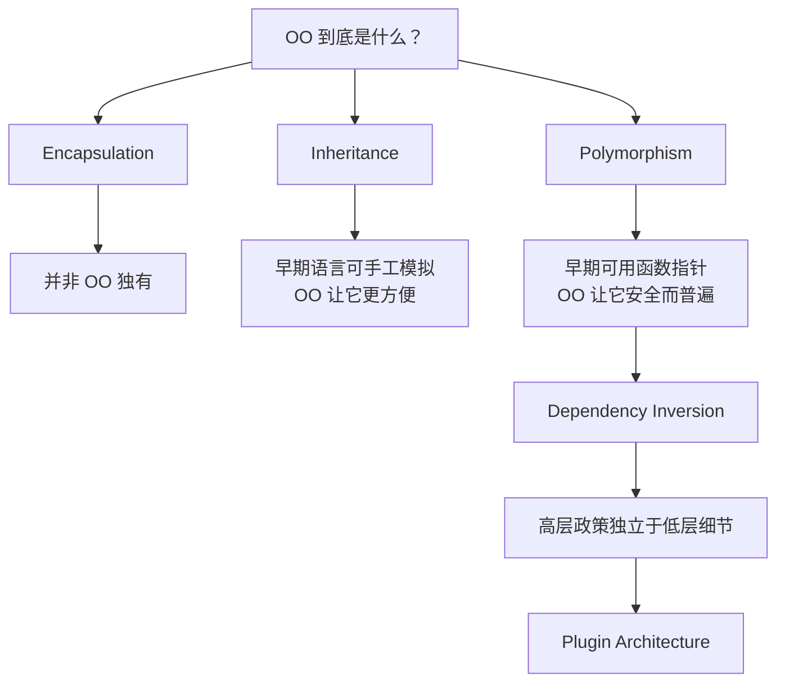
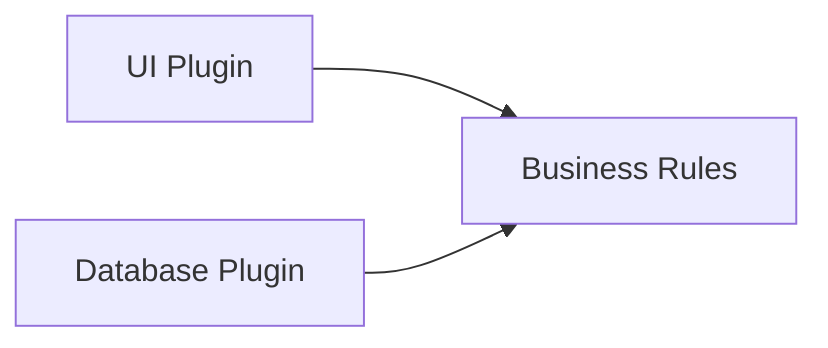
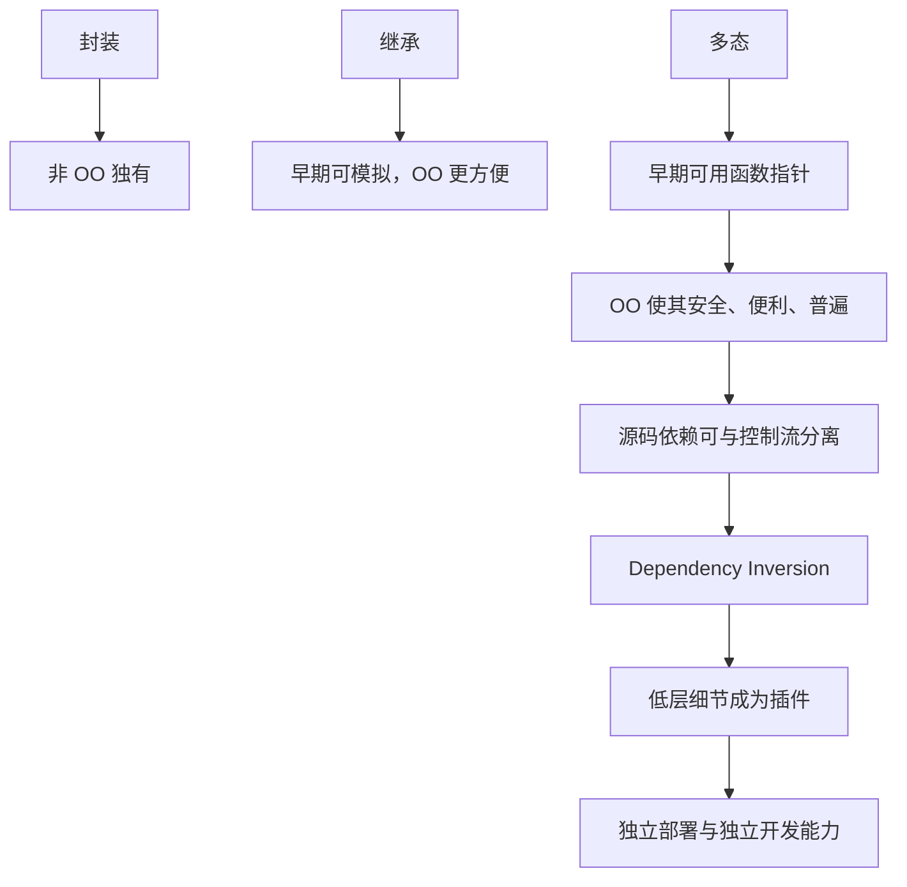

> 原书：Robert C. Martin, *Clean Architecture: A Craftsman's Guide to Software Structure and Design*<br>
> 本章：Chapter 5, Object-Oriented Programming<br>
> 原文参考：Clean Architecture.md

## 本章导读
> **原书图示**：Chapter 5 章首页
软件架构经常以面向对象设计原则为基础。但在讨论这些原则之前，作者先问：

> **Object-Oriented Programming 到底是什么？**

常见回答有三类：

1. 把数据与函数组合在一起；
2. 模拟现实世界；
3. 封装、继承和多态的组合。

作者认为前两个回答过于含糊，于是逐项检查第三个回答。结论颇为反常：

- 封装并非 OO 首创，某些 OO 语言的信息隐藏甚至弱于传统 C 模块；
- 继承也能在早期语言中手工模拟，OO 主要让它更方便；
- 多态同样早已能用函数指针实现，但 OO 让它安全、便利到足以广泛使用；
- 对架构师而言，OO 最重要的价值是：**通过多态控制源码依赖的方向。**



本章真正要掌握的不是「OO 有三个特征」，而是以下逻辑链：

> **安全的多态 → 可反转源码依赖 → 低层细节成为高层政策的插件 → 组件可独立部署与开发。**

## 1. Object-Oriented Programming：问题从哪里来

### 1.1 为什么必须先定义 OO

本书后续会使用 SOLID、依赖反转、边界接口和插件架构。如果对 OO 的理解只是「有类和对象」，就无法解释这些原则为什么有效。

作者需要的定义必须回答：

- OO 为程序员增加了什么实际能力？
- 这种能力是否在 OO 语言之前已经存在？
- 它为什么对架构师特别重要？
- 它如何改变系统的依赖结构？

### 1.2 「数据与函数的组合」为什么不充分

一种常见定义是：OO 把数据和函数组合到对象里。

作者用一个简单对比反驳：调用对象方法与把对象传给普通函数，在基本计算意义上没有本质区别。

- `object.function()`；
- `function(object)`。

程序员在 OO 出现前很久，就已经把数据结构传给函数处理。因此，这个定义只能描述一种语法形式，不能说明 OO 独特的架构价值。

### 1.3 「模拟现实世界」为什么含糊

另一种说法是：OO 是模拟现实世界的方法。

这个回答听起来直观，却留下很多问题：

- 什么叫模拟现实？
- 为什么代码越像现实就越好？
- 一个数据库连接、线程池或编译器优化阶段对应什么现实对象？
- 现实关系是否适合直接变成继承关系？
- 模拟现实如何帮助控制源码依赖？

现实世界概念可以帮助命名和领域建模，但不足以定义 OO，也不能直接解释其架构能力。

### 1.4 三个候选概念

于是作者转向三个经典词：

- Encapsulation（封装）；
- Inheritance（继承）；
- Polymorphism（多态）。

本章逐项追问：

1. 它是否由 OO 发明？
2. OO 是否显著改善了它？
3. 它对架构有什么作用？

## 2. Encapsulation?

### 2.1 封装要解决什么问题

封装试图在一组内聚的数据和函数周围画一条边界：

- 边界内部知道数据的具体表示；
- 边界外部只能使用公开操作；
- 内部实现可以改变，而外部使用方式保持稳定；
- 外部不能随意破坏内部不变量。

在典型 OO 类中，这表现为：

- 私有数据成员；
- 公开成员函数；
- 访问控制关键字。

但作者马上指出：这个思想远早于 OO。

### 2.2 C 语言中的完美信息隐藏

传统 C 可以通过头文件前置声明结构体，只公开操作函数：

```c
/* point.h */
struct Point;

struct Point* make_point(double x, double y);
double distance(const struct Point* a, const struct Point* b);
void destroy_point(struct Point* point);
```

使用者知道 `Point` 这个类型存在，却不知道它有哪些字段。完整定义只出现在实现文件：

```c
/* point.c */
struct Point {
    double x;
    double y;
};
```

客户端只能通过公开函数创建和操作 `Point`。它无法访问字段，也无法依赖字段顺序或布局。

这是一种很强的信息隐藏，而且来自非 OO 语言。

### 2.3 C++ 类为什么暴露了更多表示信息

C++ 编译器需要知道对象大小，因此类成员通常必须写在头文件里：

```cpp
class Point {
public:
    Point(double x, double y);
    double distance(const Point& other) const;

private:
    double x_;
    double y_;
};
```

客户端不能直接访问私有字段，但它可以从头文件看到：

- 字段存在；
- 字段类型；
- 字段数量；
- 对象大致布局。

若字段改变，包含该头文件的客户端往往需要重新编译。访问被禁止了，表示信息却没有完全隐藏。

### 2.4 Access Control 与 Information Hiding 的区别

这两个概念常被混用。

**Access Control（访问控制）**回答：外部代码能否直接读写某个成员？

**Information Hiding（信息隐藏）**回答：外部代码是否需要知道内部表示存在，内部变化是否会影响外部？

C++ 的 `private` 提供访问控制，却不一定实现完整信息隐藏。传统 C 不透明类型反而可以让客户端完全看不到结构体字段。

### 2.5 Java、C# 与动态语言

Java 和 C# 不使用 C/C++ 那种头文件与实现文件分离方式。类声明和实现通常位于同一语言单元中。

Smalltalk、Python、JavaScript、Lua、Ruby 等语言对访问控制的强制程度也不相同，有些更多依赖命名约定和开发者纪律。

作者据此认为：不能把强封装当作 OO 的独有定义，因为：

- 非 OO 语言早已能实现很强封装；
- 不同 OO 语言对封装的保证差异很大；
- OO 有时甚至暴露了更多表示信息。

### 2.6 如何在现代 C++ 中恢复信息隐藏

C++ 可以使用 PImpl 等方式，把私有实现放到单独类型中，头文件只保留不透明指针。这样能够减少客户端对对象布局的了解，并降低重编译影响。

但这也有代价：

- 增加一次间接访问；
- 需要管理动态内存或所有权；
- 代码和构建结构更复杂；
- 小型值对象可能没有必要这样做。

封装应根据变化风险选择强度，而不是机械使用技巧。

### 2.7 作者为什么不给 OO 的封装计分

作者的结论并不是「封装没用」，而是：

> **封装不是 OO 独有，也不足以定义 OO。**

OO 语言通常让类和访问控制很方便，但没有创造信息隐藏这个思想。

### 2.8 封装对架构仍然重要

尽管不是 OO 独有，封装仍然是架构基础：

- 模块隐藏数据库实现；
- Entity 保护业务不变量；
- 组件只公开稳定接口；
- 外部不能绕过 Use Case 修改内部状态；
- 实现变化被限制在边界内。

需要避免的是把「成员设为 private」误认为已经完成架构隔离。

## 3. Inheritance?

### 3.1 继承要解决什么问题

继承允许一个类型沿用另一类型的结构和行为，并在其基础上增加或修改内容。

它通常用于：

- 表达可替换的类型关系；
- 共享接口；
- 复用部分实现；
- 建立运行时多态。

作者追问：继承是否由 OO 发明？答案仍然是否定的，只是 OO 让它方便得多。

### 3.2 C 如何手工模拟单继承

原书以 `Point` 和 `NamedPoint` 为例。

若 `Point` 的字段依次是坐标值，而 `NamedPoint` 的前几个字段保持完全相同顺序，再在后面添加名称，那么 `NamedPoint` 的内存开头看起来就像一个 `Point`。

早期 C 程序可以把 `NamedPoint` 指针强制转换为 `Point` 指针，再交给处理 `Point` 的函数。

这种技巧依赖严格人工约定：

- 公共前缀字段必须顺序一致；
- 类型布局必须符合预期；
- 转换必须正确；
- 开发者不能破坏约定。

### 3.3 这种模拟为什么脆弱

手工伪装数据结构存在明显风险：

- 编译器不能完整验证类型关系；
- 强制转换可能掩盖错误；
- 调整字段顺序会破坏兼容；
- 多重继承更难模拟；
- 析构和资源管理没有自动保证；
- 工具难以理解真实关系。

它证明继承思想并非 OO 独有，却不代表手工实现与语言级继承同样安全。

### 3.4 OO 语言真正改善了什么

OO 语言通常提供：

- 明确的基类与派生类关系；
- 自动的向上类型转换；
- 编译期类型检查；
- 方法覆盖规则；
- 虚函数分派；
- 语言或运行时对对象布局的支持。

所以，作者给 OO 的继承「半分」：它没有发明从一个结构扩展另一个结构的能力，但显著提高了便利性。

### 3.5 继承不等于代码复用

把继承主要当作复用工具，容易形成脆弱层次：

- 子类依赖父类内部实现；
- 父类的小改动影响所有子类；
- 子类被迫继承不需要的行为；
- 类型关系只是「想复用几行代码」，并不满足真正可替换性；
- 多层继承难以理解和测试。

组合通常更灵活：对象通过持有协作者复用行为，而不是把自己绑定到基类实现。

### 3.6 什么时候继承比较合适

使用继承前可以检查：

- 子类是否真的是基类约定的一种实现？
- 调用者能否在不知道具体子类时正确使用它？
- 子类是否能遵守基类全部行为契约？
- 关系是否长期稳定？
- 是否主要为了多态边界，而不是省几行代码？
- 组合是否更清楚？

Chapter 9 的 Liskov Substitution Principle 会进一步讨论可替换性。

### 3.7 继承对架构的地位

继承本身不是架构目标。架构需要的是稳定抽象与可替换实现，继承只是实现这一目标的方式之一。

在某些语言中，接口实现与类继承是分开的；在另一些语言中，可以通过函数、trait、协议或组合实现同样边界。

因此，不能把复杂继承树当作 OO 架构成熟的标志。

## 4. Polymorphism?

### 4.1 多态是什么

多态允许调用者通过统一约定调用不同实现。

调用者只知道：

- 可以执行什么操作；
- 参数与返回结果是什么；
- 行为应满足什么契约。

它不需要知道：

- 当前具体对象类型；
- 操作由哪个设备、数据库或服务完成；
- 具体实现位于哪个模块。

### 4.2 OO 出现前已经有多态

作者使用一个经典 C 复制程序：程序不断从标准输入读取字符，再写入标准输出。

原书使用标准名称 `STDIN` 与 `STDOUT`。程序只面向这两个统一入口，而不是面向某个具体设备。

程序并不知道标准输入来自：

- 键盘；
- 文件；
- 磁带；
- 手写识别设备。

也不知道标准输出去向：

- 屏幕；
- 打印机；
- 文件；
- 语音合成器。

同一个读取和写入调用可以表现出不同设备行为，这就是多态。

### 4.3 UNIX 设备接口

原书以 UNIX 风格设备驱动说明其机制。每个驱动遵守一组标准操作，例如：

- open；
- close；
- read；
- write；
- seek。

`FILE` 一类结构可以保存这些操作的函数指针。标准输入指向控制台时，读取操作间接调用控制台驱动；指向文件时，则调用文件驱动。

多态的底层基础，就是通过函数地址完成间接调用。

### 4.4 C++ 虚函数与函数表

C++ 的虚函数通常可用虚函数表（vtable）来理解：

- 类的虚函数在表中有对应入口；
- 对象记录或关联自己的函数表；
- 派生对象把入口指向自己的实现；
- 调用虚函数时，通过表找到真正函数。

具体编译器实现可能不同，但这个模型足以解释动态分派与早期 C 函数指针表的关系。

### 4.5 手工函数指针为什么危险

函数指针能够实现多态，却依赖许多人工约定：

- 创建对象时必须初始化全部指针；
- 每次调用必须通过正确指针；
- 签名和调用约定必须一致；
- 生命周期必须有效；
- 新增操作时所有表都要同步更新。

任何开发者忘记约定，都可能产生难以追踪的运行时错误。

### 4.6 OO 真正带来的改进

OO 语言没有发明多态，却让它：

- 更安全；
- 更方便；
- 有类型检查；
- 可由编译器管理分派表；
- 可被 IDE 和重构工具理解；
- 能在普通业务代码中广泛使用。

作者据此重申 Chapter 3 的定义：

> **Object-oriented programming imposes discipline on indirect transfer of control.**<br>
> **面向对象编程对间接控制转移施加纪律。**

这正是 OO 获得完整架构价值的地方。

## 5. The Power of Polymorphism

### 5.1 设备独立性

假设复制程序原先从穿孔卡（punched cards）读取、向穿孔卡输出。后来客户改用磁带（magnetic tape）。

如果程序直接依赖穿孔卡驱动，就必须修改大量业务代码。若程序只依赖统一 I/O 接口，新驱动只需实现接口，复制程序不必改变。

原书进一步设想：从手写识别设备读取，再输出到语音合成器。复制逻辑仍然无需修改。

### 5.2 为什么甚至不必重新编译复制程序

复制程序的源码只知道稳定 I/O 约定，不包含具体驱动名字。

只要新设备实现相同操作：

- 复制程序源码不变；
- 不需要重新编译复制程序；
- 只需提供并装载新驱动；
- 设备成为复制程序的插件。

这比「运行时可以替换对象」更进一步：源码和构建依赖也被隔离。

### 5.3 插件架构的历史动机
> **原书图示**：Figure 5.1：控制流与源码依赖
20 世纪 50 至 70 年代，穿孔卡曾是常见输入输出介质，后来磁带等设备逐渐取代它。设备变化迫使大量设备相关程序重写，代价非常高。

操作系统由此普遍采用设备插件架构，让程序依赖统一接口，让设备驱动依赖接口约定。

### 5.4 OO 把插件能力带入普通程序

操作系统很早就使用插件，因为设备独立性价值巨大。但普通应用很少普遍使用同样方式，原因之一是手工函数指针危险且麻烦。

OO 让多态变得简单，于是任何易变细节都可以成为插件：

- 数据库；
- UI；
- 支付渠道；
- 消息系统；
- 文件格式；
- 第三方服务；
- 测试替身。

### 5.5 插件不等于动态安装文件

这里的插件首先是一种依赖关系：

- 高层定义需要的能力；
- 低层实现该能力；
- 高层源码不知道低层实现；
- 替换低层不修改高层。

它可以静态链接在同一可执行文件中，也可以是 DLL、进程或远程服务。物理部署方式不是定义插件关系的关键。

## 6. Dependency Inversion

### 6.1 控制流与源码依赖原本为何一致

没有安全、方便的多态时，调用者必须直接提及被调用模块：

- C 使用 `#include`；
- Java 使用 `import`；
- C# 使用 `using`。

高层函数调用中层函数，中层调用低层函数时，源码依赖通常跟随控制流一路向低层。


这意味着高层业务规则依赖低层技术细节。数据库、设备或 UI 变化，都可能迫使高层重新编译和修改。

### 6.2 插入接口后发生什么
> **原书图示**：Figure 5.2：Dependency Inversion
假设高层模块需要调用低层模块。高层一侧定义一个接口，表达自己需要的操作：

```cpp
class PaymentGateway {
public:
    virtual ~PaymentGateway() = default;
    virtual PaymentResult charge(const PaymentRequest& request) = 0;
};
```

高层用例依赖 `PaymentGateway`。低层支付 SDK Adapter 实现它。

运行时控制仍然从高层流向低层实现，但源码关系变成：


低层实现反过来依赖高层定义的接口，这就是 Dependency Inversion。

### 6.3 接口为什么应由高层拥有

如果接口位于低层模块中，高层虽然依赖「抽象」，却仍然依赖低层模块。低层包名、类型和发布单元一变，高层仍会受影响。

真正的依赖反转要求：

- 接口表达高层需要，而不是低层技术 API；
- 接口与高层政策位于同一侧；
- 低层 Adapter 实现这个接口；
- 组装代码选择具体实现。

所以，关键不只是「依赖接口」，而是**接口由谁定义和拥有**。

### 6.4 任意源码依赖都能反转是什么意思

作者认为，安全而方便的多态使架构师可以反转系统中的任何源码依赖。

这不是说所有依赖都应该反转，而是说架构师不再被控制流方向强迫：

- 高层调用低层，不必让高层源码依赖低层；
- 输出流向 UI，不必让业务规则依赖 UI；
- 数据保存到数据库，不必让业务规则依赖数据库；
- 调用外部服务，不必让核心导入服务 SDK。

是否反转，应由政策层级、变化原因和组件边界决定。

### 6.5 业务规则、UI 与数据库
> **原书图示**：Figure 5.3：UI 和 Database 依赖 Business Rules
传统直觉常画成：


业务规则知道 UI 和数据库，于是两种技术都能影响核心。

依赖反转后：



业务规则定义所需端口，UI 和数据库在外层实现或调用这些端口。因此：

- 业务源码不提 UI 名字；
- 业务源码不提数据库名字；
- UI 可从 Web 换成 Console；
- 数据库可从 SQL 换成其他存储；
- 核心业务测试不需要启动外部设施。

### 6.6 多态不是依赖注入容器

依赖注入容器可以帮助创建对象，但不是依赖反转本身。

即使使用大型 DI Framework，如果业务接口定义在基础设施模块、业务方法接收框架对象，依赖方向仍然错误。

反过来，不使用任何容器，只在 `main` 中手工构造对象，也可以实现正确的依赖反转。

## 7. Independent Deployability and Developability

### 7.1 从源码依赖到组件边界

如果 Business Rules 不依赖 UI 和 Database，可以把三者放进独立组件：

- Business Rules 组件；
- UI 组件；
- Database 组件。

组件形式可以是：

- 静态库；
- DLL 或共享库；
- jar；
- Gem；
- 模块化单体中的独立包；
- 单独进程或服务。

源码依赖方向应与组件依赖方向一致：外层组件依赖核心组件。

### 7.2 Independent Deployability

作者推导：如果一个组件源码变化，只需重新部署该组件，就获得独立部署能力。

例如：

- 更换 UI 不重新部署业务规则；
- 调整数据库 Adapter 不重新发布核心政策；
- 修复核心业务时不修改 UI 源码。

但现实中是否真能独立部署，还取决于：

- 二进制兼容；
- API 契约；
- 数据库 Schema；
- 版本管理；
- 部署平台；
- 运行时配置。

依赖方向是重要基础，不是唯一条件。

### 7.3 Independent Developability

组件能独立开发，意味着不同团队可以围绕稳定边界推进工作：

- UI 团队依赖业务接口；
- 数据团队实现 Gateway；
- 业务团队维护核心政策；
- 测试团队使用替身验证契约。

减少共同修改和全局协调后，团队规模更容易扩展。

同样，源码解耦也不自动保证团队独立。共享发布计划、模糊所有权和频繁变化接口仍会造成协作瓶颈。

### 7.4 插件架构的代价

插件边界会增加：

- 接口；
- Adapter；
- 组装代码；
- 数据转换；
- 契约测试；
- 版本管理。

不是每个函数调用都值得建立插件。

通常在以下情况更有价值：

- 一侧是易变技术细节；
- 一侧是重要高层政策；
- 有多个实现；
- 需要测试替身；
- 团队或部署需要独立；
- 技术替换风险真实存在。

## 8. Conclusion

### 8.1 作者给架构师的 OO 定义

关于 OO 可以有许多定义。作者从软件架构角度给出的答案是：

> **OO 是通过多态，获得对系统中每一条源码依赖方向的控制能力。**

原书把这种能力称为对源码依赖方向的 `absolute control`。这里的 absolute 强调架构师不再被控制流方向强迫，而不是说系统从此没有任何约束和代价。

它让架构师能够建立插件架构：

- 高层政策独立于低层细节；
- 低层细节退到插件模块；
- 控制流与源码依赖可以指向不同方向；
- 组件可以获得更强的独立部署与独立开发能力。

### 8.2 「绝对控制」应如何理解

作者使用了很强的表述。它不意味着：

- 架构师可以消除所有依赖；
- 运行时调用不再存在；
- 引入接口后修改完全免费；
- 所有组件自动独立部署；
- OO 能解决数据一致性和业务复杂度。

它意味着：架构师不再被调用方向强迫，可以在需要的位置通过多态安排源码依赖方向。

### 8.3 本章完整论证链



### 8.4 这一定义的适用边界

作者的定义服务于本书的架构主题，并不排斥其他 OO 视角：

- 领域建模；
- 消息传递；
- 对象身份；
- 封装状态；
- 行为组合。

但当讨论 Clean Architecture 时，最需要记住的是多态与源码依赖控制。

## 作者的分析方法

### 1. 先排除含糊定义

作者先指出「数据加函数」和「模拟现实世界」不能解释 OO 的独特能力，再逐项检验三个经典特征。

### 2. 用 OO 之前的 C 代码作历史对照

不透明结构、数据布局伪装和函数指针说明：封装、继承、多态的基本机制早已存在。这样可以区分「发明能力」与「让能力安全普及」。

### 3. 把多态从语言特性提升为架构工具

UNIX 设备独立性说明，多态可以让程序不依赖具体设备。作者再把同一思想推广到 UI、数据库和所有低层细节。

### 4. 分离控制流与源码依赖

这是全章关键转折：运行时谁调用谁，不再决定编译时谁依赖谁。接口使两个方向可以相反。

### 5. 从代码关系推到组织能力

源码依赖反转后，作者继续推导组件独立部署与团队独立开发，把语言特性连接到架构和组织结果。

## 易混淆概念与常见误解

### 1. OO 就是数据与函数放在一起

这种组织方式早于 OO，无法解释其独特架构价值。

### 2. OO 的目标是精确模拟现实世界

领域概念有助于建模，但机械模拟现实可能产生脆弱继承树。作者关注的是依赖控制。

### 3. `private` 等于完整信息隐藏

`private` 阻止访问，却可能仍在头文件中暴露字段类型和布局。访问控制与信息隐藏不同。

### 4. 封装由 OO 发明

C 的不透明类型早已能实现很强封装。OO 让类封装方便，却并非唯一方式。

### 5. 继承是最好的代码复用方式

继承会绑定基类实现。若只是复用行为，组合通常更灵活。

### 6. 有继承树就是 OO 设计

复杂继承不代表架构良好。真正问题是类型是否可替换、依赖方向是否正确。

### 7. 多态只能用类继承实现

函数指针、接口表、协议和其他动态分派机制都可实现多态。OO 语言主要提高安全性与便利性。

### 8. 依赖接口就自动依赖倒置

若接口由低层模块拥有，高层仍依赖低层。接口必须表达并属于高层需求。

### 9. Dependency Inversion 等于 Dependency Injection

依赖反转是源码方向原则；依赖注入是传入协作者的组装技术；DI 容器只是可选工具。

### 10. 插件必须是运行时安装的 DLL

插件首先是依赖关系，可存在于同一进程、同一可执行文件甚至同一仓库中。

### 11. 使用多态后所有东西都应可替换

每个接口都有成本。只应隔离真实易变细节、团队边界和测试需要。

### 12. 源码解耦自动带来独立部署

还需稳定契约、兼容策略、数据迁移和部署支持。源码方向是必要基础之一。

## 实践检查清单

### 检查封装

- 外部是否只看到稳定操作，而非内部数据布局？
- `private` 字段变化是否导致大量客户端重编译？
- 外部能否绕过操作直接破坏不变量？
- 是否需要 PImpl 或模块边界加强隐藏？

### 检查继承

- 子类能否完全遵守基类契约？
- 继承是否只为复用几行实现？
- 基类变化是否造成大量子类修改？
- 组合是否更清楚、更灵活？

### 检查多态边界

- 高层是否直接提及数据库、UI、SDK 或设备类？
- 接口是否由高层一侧拥有？
- 低层 Adapter 是否实现高层端口？
- 测试能否替换外部实现？
- 新增插件是否无需修改高层政策？

### 检查组件与团队

- 源码依赖是否与期望组件依赖一致？
- UI 或数据库变化是否迫使核心重新发布？
- 不同团队能否基于稳定契约独立工作？
- 接口变化是否有版本和兼容策略？
- 插件收益是否足以抵消 Adapter 与测试成本？

## 本章总结

1. 「数据与函数的组合」和「模拟现实世界」都不足以定义 OO 的独特架构价值。
2. 作者逐项考察封装、继承与多态，寻找 OO 真正带来的能力。
3. 封装在 OO 出现前已经存在，C 的不透明结构甚至能实现很强信息隐藏。
4. C++ 的私有成员通常写在头文件中，客户端不能访问，却知道表示信息存在。
5. Access Control 阻止直接访问，Information Hiding 还要避免外部依赖内部表示。
6. Java、C# 和动态语言提供不同程度封装，因此强封装不能作为 OO 唯一定义。
7. PImpl 可加强 C++ 信息隐藏，但会增加间接访问和实现复杂度。
8. 继承思想也可在 C 中通过公共内存前缀和强制转换手工模拟。
9. 手工继承依赖布局约定，类型不安全，多重继承尤其困难。
10. OO 语言没有凭空发明继承，但提供明确关系、自动上转型和类型检查，使它更方便。
11. 继承不应只为代码复用；子类型必须遵守基类契约，组合常常更灵活。
12. 多态在 OO 之前已通过函数指针存在，UNIX 标准 I/O 和设备驱动就是经典例子。
13. 设备驱动实现统一的 open、close、read、write、seek 操作，程序无需知道具体设备。
14. C++ 虚函数可用虚函数表理解，本质仍是受管理的间接调用。
15. 手工函数指针依赖初始化、签名和调用约定，容易产生难以定位的运行时错误。
16. OO 的关键贡献是让多态安全、便利并可在普通程序中广泛使用。
17. 作者因此定义 OO 为对间接控制转移施加纪律。
18. 多态让新设备成为复制程序插件，复制程序无需修改，甚至无需重新编译。
19. 穿孔卡到磁带的历史变化推动操作系统采用设备独立的插件架构。
20. OO 让插件架构从操作系统设备扩展到数据库、UI、支付和普通业务系统。
21. 没有多态时，源码依赖通常跟随运行时控制流一路指向低层。
22. 在高层定义接口、由低层实现，可以让控制流向外而源码依赖向内。
23. Dependency Inversion 的关键不是使用接口，而是接口由高层政策拥有。
24. 安全多态让架构师不再被调用方向强迫，可以控制任意源码依赖的方向。
25. UI 和 Database 可以成为 Business Rules 的插件，业务源码不提及具体技术。
26. Dependency Inversion 与 Dependency Injection 不同，DI 容器不是实现正确架构的必要条件。
27. 正确源码依赖可以支持 Business Rules、UI、Database 形成独立组件。
28. 组件隔离为独立部署提供基础，但仍需要契约、版本和数据迁移支持。
29. 组件边界也能帮助不同团队独立开发，但不能替代清晰所有权和协作机制。
30. 插件架构有接口、Adapter、转换和测试成本，不应为每个调用机械建立边界。
31. 对架构师而言，OO 的核心是通过多态获得对源码依赖方向的控制能力。
32. 这种能力让高层政策保持独立，让低层细节退居可替换插件，从而支撑 Clean Architecture。
