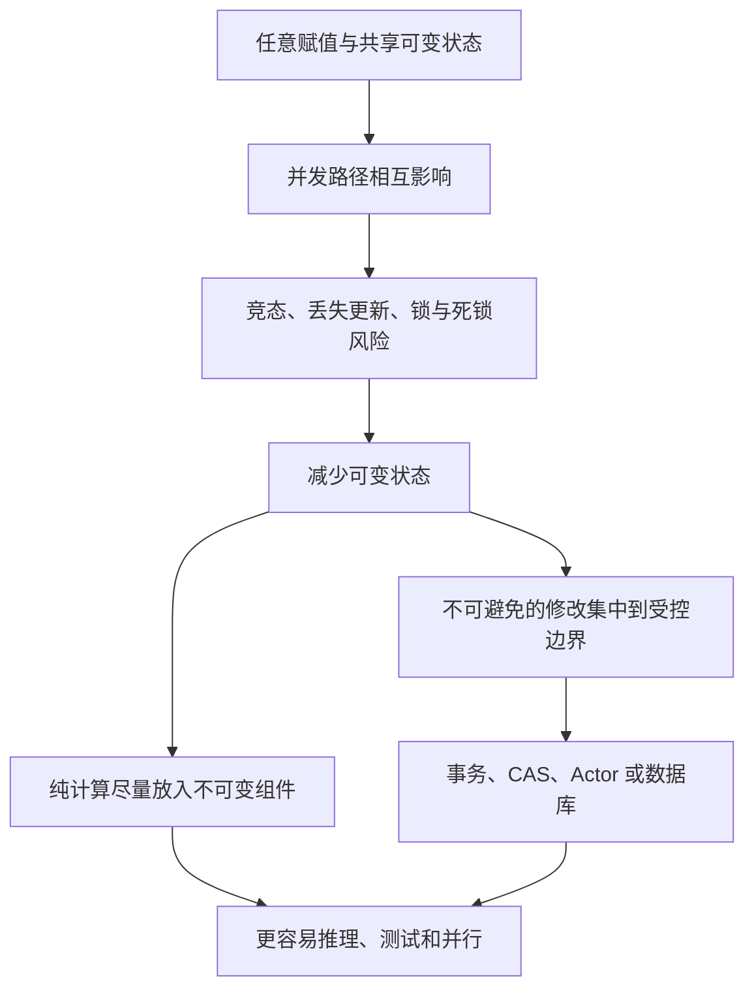
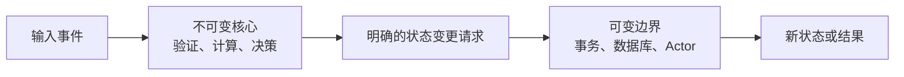
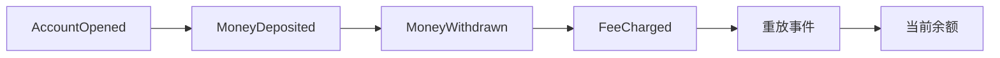

> 原书：Robert C. Martin, *Clean Architecture: A Craftsman's Guide to Software Structure and Design*<br>
> 本章：Chapter 6, Functional Programming<br>
> 原文参考：Clean Architecture.md

## 本章导读
> **原书图示**：Chapter 6 章首页
Chapter 3 把函数式编程概括为：

> **函数式编程对赋值施加纪律。**

Chapter 6 解释为什么限制赋值会成为架构问题。

作者的主线很清楚：

1. 用 Java 与 Clojure 打印平方数，观察可变循环变量是否存在；
2. 指出共享可变状态是大量并发问题的根源；
3. 承认在有限存储和算力下，完全不可变并不总是现实；
4. 提出把系统分为可变与不可变组件，把修改限制在小区域；
5. 介绍事务内存和 Atom，用严格机制保护必要修改；
6. 用 Event Sourcing 说明可以记录事件，而不是不断覆盖状态；
7. 回到三种范式共同的主题：它们通过拿走危险自由来提高可控性。



本章不是一份 Clojure 教程，也不是要求所有系统使用 Event Sourcing。它希望架构师形成一种习惯：

> **先问哪些状态真的必须修改，再把修改权限制在尽可能小、尽可能明确的区域。**

## 1. Functional Programming：历史与核心纪律

### 1.1 函数式思想早于电子计算机

函数式编程的概念在很多方面早于实际编程。

它的重要理论来源是 Alonzo Church 在 20 世纪 30 年代提出的 Lambda Calculus。Church 与 Alan Turing 当时都在研究什么是可计算的，以及计算可以怎样被形式化描述。

本章不要求读者学习 Lambda Calculus。作者只从中提取一个对架构很重要的观念：变量绑定后不再被随意改变。

### 1.2 函数式编程关注什么

函数式风格倾向于把程序看成一系列数据转换：

- 输入值进入函数；
- 函数产生新值；
- 旧值保持不变；
- 多个小转换组合成更大行为；
- 对数据库、文件、网络的副作用被明确隔离。

重点不是语法上是否出现函数，而是如何对待状态和赋值。

### 1.3 「变量不再变化」应如何理解

作者使用一句很醒目的话：

> **Variables in functional languages do not vary.**<br>
> **函数式语言中的变量并不改变。**

这里更准确的理解是：名字一旦绑定到一个值，就不再指向另一个值。需要变化时，程序产生新的值或新的状态版本，而不是原地覆盖旧值。

现实语言的纯度不同：

- 有些语言严格限制赋值；
- 有些语言允许在局部或特殊类型中修改；
- 多范式语言通常依靠 `const`、不可变集合和编码约定；
- 数据库和外部世界仍然存在状态。

函数式纪律不是假装状态不存在，而是让状态变化更显式、更集中。

### 1.4 纯函数为什么容易理解

纯函数具有两个直观特点：

1. 相同输入得到相同输出；
2. 计算过程不偷偷修改外部状态。

因此，理解纯函数通常只需要看：

- 输入是什么；
- 转换规则是什么；
- 输出是什么。

不需要同时追踪全局变量、数据库连接、调用顺序或其他线程的写入。

纯函数不等于函数式编程的全部，但它体现了不可变性带来的推理优势。

## 2. Squares of Integers

### 2.1 Java 命令式版本

作者用一个很小的问题解释差异：打印从 0 开始的前 25 个整数的平方。

Java 版本使用循环变量：

```java
for (int i = 0; i < 25; i++) {
    System.out.println(i * i);
}
```

这里的 `i` 是可变变量：

- 初始值为 0；
- 每轮循环后增加；
- 循环条件反复读取它；
- 计算结果取决于它当前处于哪个状态。

这段代码简单、安全，也完全合理。作者并不是说所有局部循环变量都有问题，而是用它展示命令式程序依靠状态变化推动执行。

### 2.2 Clojure 函数式版本

Clojure 版本把多个函数组合起来：

```clojure
(println
  (take 25
    (map (fn [x] (* x x))
      (range))))
```

从内向外阅读：

1. `range` 产生从 0 开始的整数序列；
2. `map` 把平方函数应用到每个整数，产生平方序列；
3. `take` 只取前 25 个结果；
4. `println` 打印结果。

变量 `x` 每次绑定一个输入值，却没有在同一次计算中被重新赋值。

### 2.3 两段程序真正的差异

两段程序都能打印相同结果，差异不在计算能力，而在表达方式。

| Java 循环 | Clojure 组合 |
| --- | --- |
| 用 `i` 的变化控制过程 | 描述序列如何转换 |
| 逐步说明怎样做 | 声明需要哪些结果 |
| 一个变量反复赋值 | 每个值建立后不再改变 |
| 循环与输出写在一起 | `range`、`map`、`take`、打印逐层组合 |

这个例子很小，不能说明 Clojure 在所有场景都更易读。它只是突出本章主题：函数式风格可以在没有可变循环变量的情况下表达相同计算。

### 2.4 惰性求值（Lazy Evaluation）为何不会让无限序列耗尽内存

`range` 在概念上可以产生无穷整数序列，`map` 也可以产生无穷平方序列。但程序只需要前 25 个元素。

Clojure 使用惰性求值：

- 元素在真正被访问前不会计算；
- `take 25` 只要求前 25 个结果；
- 后面的无限元素从未创建。

惰性序列将「可以继续产生」与「现在全部放进内存」区分开。

### 2.5 惰性求值的现实边界

惰性求值也会带来新的注意点：

- 计算错误可能推迟到消费数据时才出现；
- 长链条调试可能更困难；
- 若无意中保留序列头部，可能占用大量内存；
- 带副作用的惰性计算容易产生时序困惑；
- 性能需要结合实际消费方式测量。

因此，函数式工具也需要理解其执行模型，不能只看表达是否简洁。

### 2.6 声明式不自动等于纯函数式

使用 `map`、Lambda 或链式 API，不代表程序已经函数式。

如果映射函数内部：

- 修改全局变量；
- 写数据库；
- 依赖当前时间；
- 修改传入对象；

整体仍然包含副作用和可变状态。

真正重要的是状态和副作用如何被控制，而不是是否使用函数式语法。

## 3. Immutability and Architecture
> **原书图示**：Figure 6.1 所在页：可变状态与事务内存
### 3.1 为什么架构师必须关心变量是否可变

局部变量是否加一，看起来像代码细节；当状态被线程、进程或服务共享时，它就变成架构问题。

架构师需要考虑：

- 哪些组件拥有状态；
- 谁可以修改状态；
- 多个执行单元如何协调；
- 失败时如何恢复；
- 数据如何保持一致；
- 系统扩展到多个处理器后是否仍然正确。

### 3.2 共享可变状态如何产生竞态

假设两个线程同时修改同一库存：

1. 两者都读取库存为 10；
2. 线程 A 减去 3，准备写入 7；
3. 线程 B 减去 4，准备写入 6；
4. 两者先后写入；
5. 最终库存可能是 7 或 6，而正确结果应是 3。

问题不在减法，而在多个执行者读取并覆盖同一可变值，操作没有被当成一个整体保护。

这种错误称为丢失更新，是并发更新问题的典型形式。

### 3.3 不可变性消除了哪些问题

如果值建立后不再被修改：

- 两个线程可以安全读取同一值；
- 不会发生一个线程正在读、另一个线程原地覆盖；
- 无需为了保护读取而加锁；
- 历史值不会突然变化；
- 测试可以重复使用相同输入。

因此，不可变性可以消除大量由共享写入产生的问题。

### 3.4 作者关于并发的强论断

作者说，竞态条件、死锁和并发更新问题都源于可变变量；没有变量更新，就不会有这些问题，没有可变锁也不会有死锁。

这句话应按本章语境理解：**共享可变状态是并发程序中最主要、最危险的问题来源。**

若把 race condition 理解得更广，系统仍可能因事件先后顺序、消息到达顺序、超时或外部资源竞争产生结果差异，即使消息本身不可变。不可变性也不会自动解决：

- 网络分区；
- 重复消息；
- 丢失消息；
- 分布式一致性；
- 资源耗尽；
- 活锁和饥饿。

所以，作者的论断提供重要方向，但不能被理解为「使用不可变数据后并发自动正确」。

### 3.5 死锁（Deadlock）为何与状态和资源有关

死锁通常发生在多个执行者持有资源并等待对方资源时。锁本身有状态：

- 空闲；
- 被某线程持有；
- 有等待者。

若纯计算不需要共享修改，就不需要用锁保护这些数据，也就消除了一类死锁来源。

但系统仍可能因数据库锁、文件、连接池或外部事务发生死锁。减少可变内存状态只是降低风险的一部分。

### 3.6 完全不可变为什么需要资源

如果永远不覆盖旧数据，每次变化都产生新版本，就需要保存更多数据；如果当前状态要从完整历史重新计算，也需要更多处理能力。

作者说，在无限存储和无限处理速度下，完全不可变当然可行；现实资源有限，因此需要折中。

现代硬件让不可变设计比过去更实用，但仍要考虑：

- 数据规模；
- 分配与回收；
- 缓存局部性；
- 延迟目标；
- 保留期限；
- 重放成本。

### 3.7 持久化数据结构的折中

不可变集合不一定每次复制全部数据。持久化数据结构可以让新旧版本共享没有变化的部分，只复制受影响路径。

这能降低存储与复制成本，但也增加实现复杂性。使用成熟语言库通常比自行发明更安全。

## 4. Segregation of Mutability

### 4.1 为什么要分隔可变与不可变组件

既然现实系统无法完全消除状态，一个常见折中是分隔：

- **Immutable Components**：尽量使用纯函数和不可变数据；
- **Mutable Components**：集中执行必须发生的状态修改。



这个结构也常被称为 Functional Core, Imperative Shell：核心负责决定做什么，外壳负责真正执行副作用。

### 4.2 隔离带来的推理收益

若大部分代码位于不可变区域：

- 业务计算可用普通输入输出测试；
- 多线程可并行读取同一数据；
- 副作用发生位置清楚；
- 失败时更容易判断是否已经修改状态；
- 可变区域更小，锁和事务更容易审查。

目标不是让所有代码看起来函数式，而是尽量缩小需要同时考虑时间、并发和失败的区域。

### 4.3 Mutable Shell 应承担什么

可变边界通常负责：

- 数据库事务；
- 文件写入；
- 网络发送；
- 更新缓存；
- 发布消息；
- 修改 Actor 私有状态；
- 与操作系统和设备交互。

它应保持简单，把复杂业务判断留给可测试核心。

### 4.4 事务内存的直觉

作者把 Transactional Memory 类比为数据库事务：像数据库保护磁盘记录一样，事务内存保护内存变量的并发更新。

目标是让一组修改表现为：

- 要么完整成功；
- 要么发现冲突并重试；
- 其他线程不会看到中间状态。

不同语言和运行时提供的机制并不相同，不能把所有并发原语都笼统视为事务内存。

### 4.5 Clojure Atom 与 `swap!`

原书给出一个简单计数器：

```clojure
(def counter (atom 0))
(swap! counter inc)
```

`counter` 是一个 Atom，允许在受控条件下改变值。`swap!` 接收：

- 要修改的 Atom；
- 根据旧值计算新值的函数。

调用者不是先读值再随意写回，而是把「如何从旧值产生新值」交给受控机制。

### 4.6 Compare-and-Swap 的工作方式

原书用 Compare-and-Swap 解释 `swap!` 的基本策略：

1. 读取当前值；
2. 用更新函数计算候选新值；
3. 写入前检查当前值是否仍等于刚才读取的旧值；
4. 若相同，提交新值；
5. 若不同，说明其他线程已修改，重新读取并重算。

这样可以避免简单的读、改、写覆盖其他线程结果。

### 4.7 更新函数为什么必须适合重试

更新函数可能执行多次，因此它最好没有外部副作用。

如果函数每次计算时都：

- 发送邮件；
- 扣款；
- 写文件；
- 发布消息；

一次冲突重试可能重复执行这些动作。

所以，应把纯状态计算放进重试函数，把不可重复副作用放到提交成功后的受控步骤。

### 4.8 Atom 的限制

单个 Atom 适合保护一个独立值，却不能自动保证多个相关变量的一致性。

例如转账同时涉及：

- 账户 A 减少余额；
- 账户 B 增加余额；
- 两步必须整体成功或失败。

分别使用两个独立 Atom 可能让观察者看到中间状态。此时需要：

- 软件事务内存；
- 数据库事务；
- 单一 Actor 串行处理；
- 锁顺序纪律；
- 把相关状态合并为一个原子单元。

### 4.9 架构师应如何选择机制

选择并发机制时，应先问：

- 状态是否必须共享？
- 能否改为消息传递？
- 能否把状态归一个组件或 Actor 独占？
- 多个字段是否必须原子更新？
- 冲突频率如何？
- 更新函数能否安全重试？
- 失败恢复和审计有什么要求？

技术应服务状态模型，而不是先选一种并发库再让业务适应它。

### 4.10 把尽可能多的处理推向不可变区域

作者给架构师的建议很明确：

> **尽可能把处理放进不可变组件，并尽可能减少必须允许修改的组件中的代码。**

这是一条方向性原则，不是要求达到百分之百纯函数。

## 5. Event Sourcing

### 5.1 从保存状态到保存事实

传统系统通常保存当前状态。例如银行账户表直接保存当前余额，每次存款或取款都覆盖余额。

Event Sourcing 换一种思路：

- 不把当前状态当作唯一事实；
- 保存导致状态变化的一系列事件；
- 需要状态时，按顺序重放事件；
- 当前状态是历史事件计算出的结果。



### 5.2 银行账户例子

覆盖余额时，我们只看到现在是多少，很难单凭当前值解释：

- 余额如何形成；
- 哪次操作造成错误；
- 某个时间点余额是多少；
- 是否发生重复扣款。

保存交易事件后，可以通过重放：

- 计算当前余额；
- 恢复历史时点；
- 审计全部变化；
- 修正投影逻辑后重新生成结果。

### 5.3 Event 与 Command 不同

**Command（命令）**表示希望系统做什么，例如「取款 100 元」。它可能被拒绝。

**Event（事件）**表示已经发生什么，例如「已取款 100 元」。它是历史事实。

若把未验证命令直接写成事件，事件流可能记录不合法状态。通常流程是：

1. 接收命令；
2. 根据当前状态验证；
3. 产生合法事件；
4. 持久化事件；
5. 更新读取模型或触发后续动作。

### 5.4 为什么事件通常不可修改

历史事实被追加后不应原地覆盖。发现错误时，通常追加一个纠正或补偿事件。

这样可以保留：

- 审计轨迹；
- 变化顺序；
- 错误修正过程；
- 不同版本的状态投影。

但不可修改不是绝对规则。隐私法规、错误敏感数据和保留政策可能要求删除或加密处理，需要在设计时专门解决。

### 5.5 为什么不能每次从头重放

事件数量会持续增长。若每次查询都从系统诞生时重放全部事件，延迟最终会不可接受。

作者提出简单捷径：定期保存状态，例如每天午夜建立一次快照（snapshot）。查询时只需：

1. 读取最近快照；
2. 重放快照之后的事件；
3. 得到当前状态。

快照是性能优化，不应取代事件作为事实来源。快照损坏时，应能从更早快照或完整事件恢复。

### 5.6 原书所说的 CR 而非 CRUD

传统数据库操作常概括为 Create、Read、Update、Delete。

追加式事件存储主要进行：

- Create：追加事件；
- Read：读取事件。

已有事件通常不 Update，也不 Delete，因此作者称其为 CR 而非 CRUD。

这个说法突出不覆盖历史，但现实事件系统仍需要：

- 元数据更新；
- 快照维护；
- 保留与归档；
- 隐私删除策略；
- 索引与投影重建。

不能把一句简化口号当成完整存储设计。

### 5.7 Event Sourcing 如何减少并发更新问题

多个线程不再争夺同一余额字段进行覆盖，而是追加新事件。这样避免了一类丢失更新。

但并发问题并未全部消失：

- 两个命令可能基于同一旧版本同时通过验证；
- 事件顺序可能影响结果；
- 消息可能重复；
- 投影可能暂时落后；
- 多聚合事务仍然困难。

常见做法包括版本检查、乐观并发控制、幂等处理和单聚合串行化。

### 5.8 Source Code Control 类比

作者提醒：源代码版本控制系统正是类似思路。

它保存：

- 一系列提交；
- 每次变化内容；
- 历史顺序；
- 标签和快照式版本；
- 从历史恢复当前文件的能力。

我们通常不会只保留源代码当前状态而删除全部提交历史，因为历史对追踪、回滚和协作很有价值。

### 5.9 Event Sourcing 的收益

适合场景中，它可以提供：

- 完整审计历史；
- 任意时间点状态重建；
- 根据新逻辑重建读取模型；
- 对业务变化过程的清晰记录；
- 追加写入；
- 多种投影服务不同查询。

### 5.10 Event Sourcing 的代价

它也会显著增加复杂度：

- 事件 Schema 必须长期兼容；
- 重放可能很慢；
- 快照和投影需要维护；
- 调试最终一致性更困难；
- 外部副作用不能简单重放；
- 删除敏感数据困难；
- 团队需要改变数据思维；
- 简单 CRUD 场景可能得不偿失。

因此，不应因为「不可变更纯粹」就为所有系统采用 Event Sourcing。

### 5.11 什么时候更适合使用

Event Sourcing 更适合：

- 审计历史非常重要；
- 业务本身以事件和状态迁移表达；
- 需要重建历史状态；
- 需要多个不同读取模型；
- 状态变化比任意编辑更符合业务；
- 团队能够承担事件版本和运维复杂度。

简单后台管理、低风险主数据或普通内容编辑，传统状态存储通常更直接。

## 6. Conclusion

### 6.1 三种范式再次汇合

作者在结尾重新总结：

- Structured Programming 对直接控制转移施加纪律；
- Object-Oriented Programming 对间接控制转移施加纪律；
- Functional Programming 对变量赋值施加纪律。

三种范式都拿走了某种自由，没有增加计算机的基本计算能力。

### 6.2 半个世纪学到的是「不要做什么」

作者用略带挑衅的方式说：过去半个世纪，软件行业最重要的发现是哪些事情不应该随意做。

- 不要任意跳转；
- 不要手工散布危险间接调用；
- 不要任意修改共享状态。

限制让程序更容易被人理解和控制。

### 6.3 软件本质没有快速变化

硬件速度、容量和工具不断变化，语言也不断更新，但程序基本材料仍然是：

- 顺序；
- 选择；
- 迭代；
- 间接调用。

状态与数据仍需被管理。新的框架不能替代这些基本纪律。

### 6.4 本章对架构的最终启示

函数式编程对架构师最大的提醒是：

- 可变状态的位置必须是设计决定；
- 修改权需要明确所有者；
- 纯计算应尽量与副作用分离；
- 并发问题首先从共享写入开始审查；
- 事件历史有时比覆盖当前值更可靠；
- 不可变性有资源和复杂度成本，需要务实折中。

## 作者的分析方法

### 1. 从最小例子展示核心差异

平方数程序没有复杂业务干扰，读者能直接看到 Java 使用可变循环变量，Clojure 通过序列转换完成同一任务。

### 2. 从变量提升到架构并发问题

作者没有停留在语法，而是把可变性连接到竞态、死锁和并发更新，说明变量赋值可以扩大为系统级风险。

### 3. 主动承认无限资源假设不现实

完全不可变需要存储和处理能力，因此作者转向折中：分隔可变与不可变组件，而不是要求绝对纯度。

### 4. 用 Atom 展示受控修改

Atom 并未消灭修改，而是把修改放入严格协议。这个例子说明函数式纪律不等于没有变化。

### 5. 用银行账户引出 Event Sourcing

账户余额把「覆盖状态」与「保存交易历史」的差异表现得非常直观，再通过快照解决重放成本。

### 6. 用版本控制降低陌生感

源代码管理本身就是保存变化历史并重建状态的系统，说明事件式思想并不只是理论幻想。

## 易混淆概念与常见误解

### 1. 函数式编程就是使用 `map` 和 Lambda

函数式语法不保证没有副作用。核心是如何限制赋值、共享状态和外部修改。

### 2. 不可变意味着每次复制全部数据

成熟持久化数据结构可以共享未变化部分，不必完整复制。

### 3. 局部循环变量有害

局部、封闭且不共享的循环变量通常很安全。作者关注的是可变性对推理和并发的影响，不是禁止所有循环。

### 4. 使用不可变对象后不会再有并发问题

它消除大量共享写入问题，但消息顺序、网络、重复事件、资源竞争等仍需设计。

### 5. 函数式系统完全没有状态

状态仍然存在，只是变化通过新值、事件、事务或受控边界表达。

### 6. Atom 能解决所有多变量事务

单 Atom 只能保护一个独立状态单元。多个相关变量需要更强的一致性机制。

### 7. CAS 更新函数可以随意产生副作用

CAS 可能重试，函数中的邮件、扣款或消息可能重复执行。重试函数应尽量纯粹。

### 8. Event Sourcing 就是保存日志

事件必须表达领域中已经发生的事实，并能可靠重建状态；普通技术日志通常不具备稳定业务语义和完整性保证。

### 9. Event 与 Command 是一回事

Command 是请求，可能失败；Event 是已经接受并发生的事实。

### 10. Event Sourcing 自动没有并发问题

追加事件避免覆盖冲突，但仍需版本检查、顺序、幂等和多聚合一致性设计。

### 11. Event Store 永远不能删除任何数据

审计需求与隐私法规可能冲突，需要加密、匿名化、密钥销毁或受控删除策略。

### 12. 函数式编程一定比命令式性能差

不可变可能增加分配，也可能减少锁、改善并行和缓存。必须依据真实工作负载测量。

## 实践检查清单

### 识别可变状态

- 哪些数据会改变？
- 谁拥有修改权？
- 哪些线程或服务可以同时访问？
- 修改是否必须原子完成？
- 是否存在不必要的共享？

### 扩大不可变区域

- 业务计算能否写成输入到输出的转换？
- 读取数据后，能否在内存中纯计算？
- 是否可以传递不可变消息而非共享对象？
- 副作用能否移到用例边界？
- 可变对象生命周期能否缩短？

### 保护可变边界

- 一个组件或 Actor 能否独占状态？
- 是否需要数据库事务或乐观锁？
- CAS 更新函数是否可安全重试？
- 多个相关值是否需要同一事务？
- 失败后能否判断哪些副作用已经发生？

### 评估 Event Sourcing

- 业务是否真的需要完整历史？
- 事件是否有稳定领域语义？
- 如何处理事件版本演进？
- 如何建立和恢复快照、投影？
- 如何处理重复、顺序和并发？
- 如何满足隐私删除与保留政策？
- 收益是否超过运维和认知成本？

## 本章总结

1. 函数式编程思想源于 Alonzo Church 在 20 世纪 30 年代提出的 Lambda Calculus。
2. 本章关心的核心不是数学理论，而是不可变性和对赋值的纪律。
3. Java 平方数例子使用不断变化的循环变量，Clojure 例子使用 `range`、`map`、`take` 组合序列转换。
4. Clojure 中的名字绑定后不再重新赋值，这就是作者所谓「变量不再变化」。
5. `range` 的概念无限序列通过惰性求值按需产生，实际只计算 `take` 需要的前 25 项。
6. 惰性求值也可能推迟错误、保留内存或让副作用时序难以理解，需要掌握执行模型。
7. 使用 `map` 或 Lambda 不自动等于纯函数式，关键仍是状态和副作用。
8. 可变性从局部代码问题上升为架构问题，是因为状态会在线程、进程和服务间共享。
9. 共享读改写可能造成丢失更新、竞态和不一致。
10. 不可变值可以被多个执行者安全读取，减少锁与并发推理负担。
11. 作者把并发问题强烈归因于可变状态；合理理解是它能消除主要一类问题，而非所有分布式和时序故障。
12. 完全不可变需要更多存储和处理能力，现实系统必须折中。
13. 持久化数据结构通过共享未变化部分降低不可变更新成本。
14. 常见架构折中是分隔 Immutable Components 与 Mutable Components。
15. Functional Core 负责验证、计算和决策，Imperative Shell 负责数据库、网络和其他副作用。
16. 架构师应尽可能扩大不可变区域，缩小必须处理并发和失败的可变区域。
17. Transactional Memory 把内存更新当作事务处理，冲突时提交或重试。
18. Clojure Atom 通过 `swap!` 接收旧值到新值的转换函数，集中管理修改。
19. Compare-and-Swap 在提交前检查旧值是否仍然有效，冲突时重新计算。
20. CAS 更新函数可能被多次执行，因此不应包含不可重复的外部副作用。
21. 单个 Atom 不能自动保证多个相关变量的一致性，转账等场景需要更强事务边界。
22. Event Sourcing 保存导致变化的事件，而不是只覆盖当前状态。
23. Command 表示请求做某事，Event 表示已经发生且被接受的事实。
24. 事件重放可以恢复当前状态、历史状态和新的读取模型。
25. 快照减少从头重放成本，但只是优化，事件仍是主要事实来源。
26. 原书用 CR 而非 CRUD 强调事件存储主要追加和读取，不原地更新历史。
27. 追加事件避免一类覆盖冲突，却仍需处理版本、顺序、重复和多聚合一致性。
28. 源代码版本控制是保存变化历史并重建状态的熟悉类比。
29. Event Sourcing 适合强审计和历史重建场景，但事件演进、投影、隐私与运维成本很高。
30. 三种范式都通过限制危险自由提高可控性：直接控制、间接控制和变量赋值。
31. 硬件和工具不断变化，顺序、选择、迭代、间接调用和状态管理仍是软件的基本问题。
32. 本章最终要求架构师把可变性的范围、位置和所有权当作明确架构决策。
