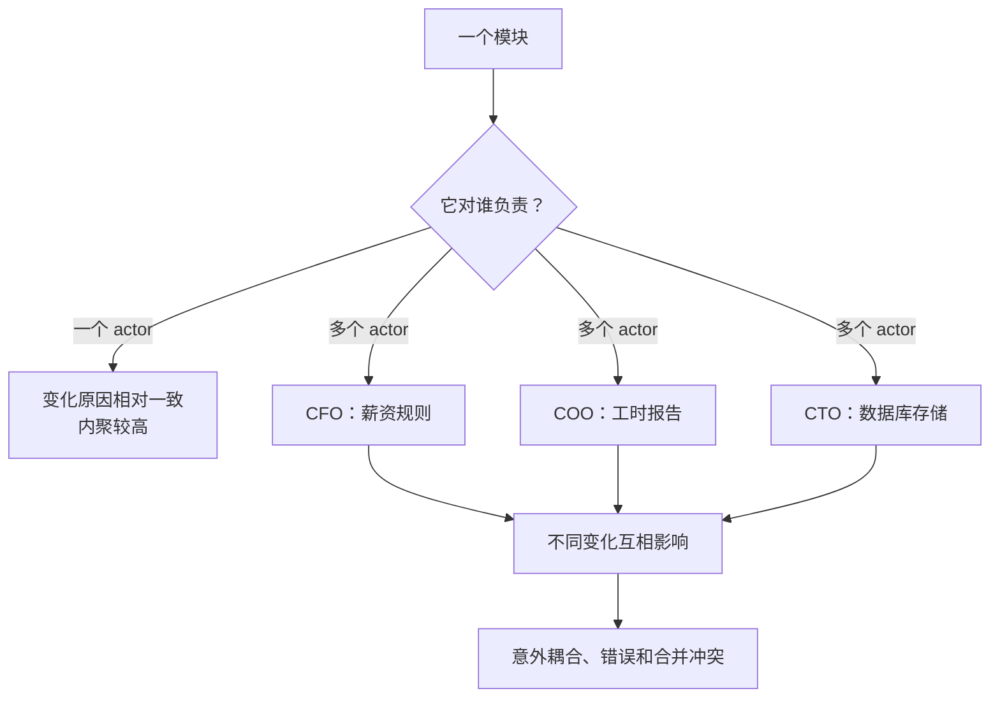
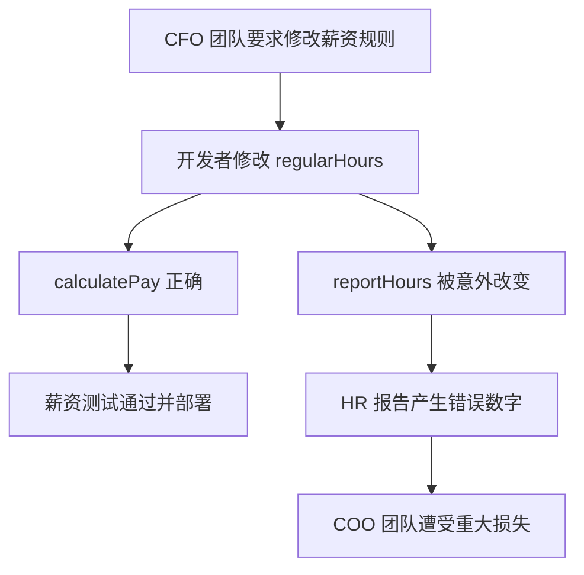
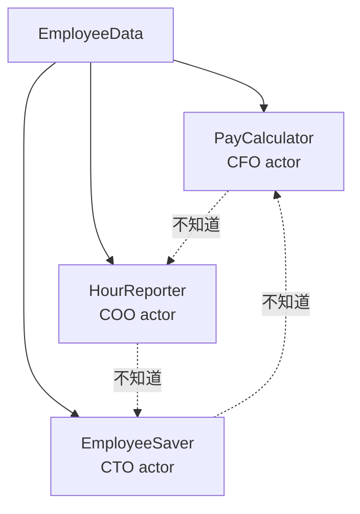
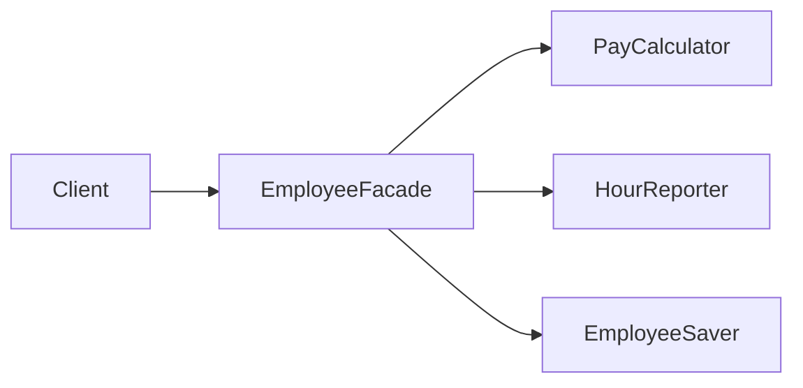
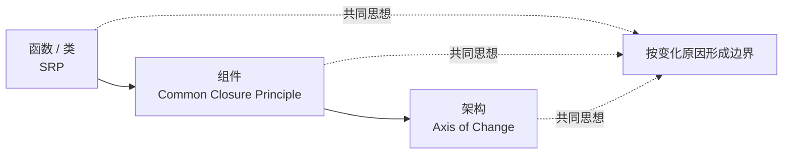

> 原书：Robert C. Martin, *Clean Architecture: A Craftsman's Guide to Software Structure and Design* 
> 本章：Chapter 7, SRP: The Single Responsibility Principle 
> 原文参考：Clean Architecture.md

## 本章导读
> **原书图示**：Chapter 7 章首页
Single Responsibility Principle（SRP，单一职责原则）可能是 SOLID 中最容易被误解的一条原则，主要原因就是它的名字。

很多人听到 Single Responsibility，会立即理解成：

> **一个类只做一件事。**

作者明确指出，这不是 SRP。

「一个函数只做一件事」确实是有价值的低层重构原则，但 SRP 讨论的是另一件事：**一个模块应该只对一个 actor 负责。**

actor 不是某个单独用户，也不一定是系统中的用户角色。它是一个或一组以相同方式要求系统变化的人。

本章通过 `Employee` 类解释违反 SRP 的两个典型症状：

1. **Accidental Duplication（意外重复或偶然共享）**：看似相同的逻辑服务不同 actor，却被错误地合并；
2. **Merges（合并冲突）**：不同团队因不同原因频繁修改同一个文件。

解决思路不是让每个类只剩一个方法，而是让同一 actor 所需的一组函数形成内聚作用域，并让不同 actor 的变化彼此隔离。

## 1. Part III 背景：SOLID 要解决什么问题

### 1.1 好砖块不自动构成好建筑

Part II 讨论了结构化、面向对象和函数式编程，它们帮助程序员写出较好的代码砖块。

但作者提醒：

- 砖块质量差，建筑架构再好也没有用；
- 即使每块砖都很好，仍然可以把整栋建筑砌成混乱结构。

SOLID 原则位于两者之间，帮助开发者把函数和数据组织成合适的类、模块与中层结构。

### 1.2 「类」不只指 OO class

作者使用 class 这个词，并不表示 SOLID 只适用于面向对象语言。

这里的 class 可以宽泛理解为：

> **一组彼此耦合、共同工作的函数与数据。**

不同语言可能把它称为：

- 类；
- 模块；
- 包；
- 命名空间；
- 结构体及其函数；
- 闭包；
- 服务对象。

只要代码形成一个需要共同理解和修改的单元，SOLID 就可能适用。

### 1.3 SOLID 的三个目标

原书认为，中层软件结构应当：

1. **Tolerate change**：能够承受变化；
2. **Be easy to understand**：容易理解；
3. **Be the basis of reusable components**：成为可在多个系统使用的组件基础。

SOLID 不是追求类图形式漂亮，而是帮助模块在变化中保持清楚和稳定。

### 1.4 为什么称为中层原则

SOLID 主要作用于模块内部和模块之间：

- 高于单条语句和局部算法；
- 低于整个系统的部署与服务架构；
- 决定类、函数和数据怎样形成组件基础。

即使中层结构设计良好，系统级依赖仍可能混乱。因此，作者讲完 SOLID 后还会继续讲组件原则和高层架构边界。

### 1.5 SOLID 的历史背景

作者从 20 世纪 80 年代后期开始，在 USENET 上与其他开发者讨论并整理设计原则。

这些原则经历过：

- 删除；
- 合并；
- 新增；
- 改名；
- 调整顺序。

到 21 世纪初，五条原则逐渐稳定。大约在 2004 年，Michael Feathers 提醒作者：重新排列后，首字母正好组成 SOLID，于是这个名称诞生。

这段历史说明，SOLID 不是一次设计出来的封闭理论，而是长期工程经验逐渐整理出的原则集合。

### 1.6 五条原则在本书中的位置

| 原则 | 本书关注点 |
| --- | --- |
| SRP | 模块应只对一个 actor 负责 |
| OCP | 通过增加代码扩展行为，而不是反复修改已有核心 |
| LSP | 可替换实现必须遵守共同契约 |
| ISP | 不应依赖自己不使用的内容 |
| DIP | 高层政策不依赖低层细节，细节反过来依赖政策 |

本书不会重复所有面向对象设计教材内容，而是重点讨论这些原则的架构含义。

## 2. SRP 的名字问题与正确定义

### 2.1 SRP 不是「一个模块只做一件事」

作者说，SRP 可能是最不容易被正确理解的 SOLID 原则，因为 Single Responsibility 这个名称太容易让人联想到功能数量。

确实存在一条低层原则：

> 一个函数应当只做一件事。

它帮助我们把大函数拆成小函数，使每个函数保持同一抽象层级。但它不是 SOLID 中的 SRP。

一个符合 SRP 的类完全可以有许多公开和私有方法，只要这些方法共同服务同一个 actor。

### 2.2 历史表述：只有一个变化原因

SRP 最经典的表述是：

> **A module should have one, and only one, reason to change.** 
> **一个模块应该只有一个变化原因。**

这句话比「只做一件事」准确，但仍然可能被误解。

几乎任何模块都可能因很多技术原因变化：

- 修复 Bug；
- 性能优化；
- 命名改善；
- 升级语言；
- 调整日志。

作者所说的 reason，不是任意修改原因，而是**由谁的业务要求引发变化**。

### 2.3 从 user/stakeholder 到 actor

作者首先尝试把原则改写为：

> 一个模块应只对一个 user 或 stakeholder 负责。

但一个变化可能由多个人共同要求。例如，会计部门的多个员工可能都要求以同一种方式修改薪资计算。他们不是一个人，却代表同一个变化来源。

因此，作者使用 actor：

> **A module should be responsible to one, and only one, actor.** 
> **一个模块应该只对一个 actor 负责。**

### 2.4 actor 到底是什么

actor 是一组对系统变化具有共同诉求的人或组织角色。

例如：

- 会计部门受 CFO 领导，关心薪资计算；
- 人力资源部门受 COO 领导，关心工时统计；
- DBA 团队受 CTO 领导，关心数据存储与 Schema。

actor 不等于：

- 登录系统的用户名；
- UML Actor 图标；
- 某个单独终端用户；
- 代码中的 Actor 并发模型；
- 每一位提出意见的人。

判断关键是：**这些人是否会以相同原因、相同方向要求模块改变。**

### 2.5 module 是什么

最简单情况下，module 就是一个源文件。

若语言或环境不以文件组织代码，它也可以是一组内聚的函数与数据结构。

模块的具体物理形式不是重点。重点是它构成一个：

- 被共同理解的单元；
- 被共同修改的单元；
- 被共同测试的单元；
- 通常被共同发布的单元。

### 2.6 Cohesion 与 SRP

作者说，Cohesion（内聚）是把对同一个 actor 负责的代码绑在一起的力量。

高内聚不只是「这些函数处理同一种数据」，还意味着：

- 它们因同一类业务变化而变化；
- 它们由同一 actor 的规则驱动；
- 它们属于同一职责边界；
- 修改时通常需要一起理解。

因此，SRP 给内聚提供了一个非常实用的判断标准：按变化来源组织代码。

### 2.7 与 Conway's Law 的关系

SOLID 概览把 SRP 称为 Conway's Law 的主动推论。

Conway's Law 指出：系统结构会反映设计它的组织沟通结构。不同部门关心不同政策，若把这些政策塞进同一模块，组织边界与代码边界就会持续冲突。

SRP 的主动做法是：提前让模块边界与 actor 的变化边界相协调，减少不同组织力量在同一代码单元中碰撞。

## 3. Symptom 1: Accidental Duplication

### 3.1 Employee 类的三个方法
> **原书图示**：Figure 7.1：Employee 类
原书使用薪资系统中的 `Employee` 类。它有三个方法：

- `calculatePay()`：计算薪资；
- `reportHours()`：生成工时报告；
- `save()`：保存员工数据。

表面看，这些方法都围绕 Employee 数据，放在一个类里似乎很自然。

但它们分别服务三个不同 actor：

| 方法 | 需求来源 | 组织负责人 |
| --- | --- | --- |
| `calculatePay()` | 会计部门 | CFO |
| `reportHours()` | 人力资源部门 | COO |
| `save()` | DBA 团队 | CTO |

因此，按数据主题组织后，一个类同时背负三个变化方向。

### 3.2 共享 `regularHours()` 的诱惑
> **原书图示**：Figure 7.2：共享 regularHours 算法
假设薪资计算和工时报告都需要计算普通工时。开发者为了遵守 DRY，把共同算法提取成 `regularHours()`，并由两个方法共享。

这看起来是一次合理重构：

- 消除了重复；
- 算法只有一份；
- 修改看起来更集中。

问题在于，两处相似逻辑属于不同 actor，并不一定表达同一业务政策。

### 3.3 事故如何发生

会计部门决定调整普通工时的薪资计算方式，但 HR 仍希望报告沿用旧规则。

负责修改的开发者：

1. 看到 `calculatePay()` 使用 `regularHours()`；
2. 按 CFO 团队要求修改共享函数；
3. 为薪资场景认真测试；
4. CFO 团队验证结果正确；
5. 系统上线。

开发者没有注意到 `reportHours()` 也调用这个函数。HR 报告于是产生错误数据，最终给 COO 团队造成数百万美元预算损失。

### 3.4 为什么称为 Accidental Duplication

这里最反直觉的地方是：看起来重复的代码，不一定代表同一知识。

两个普通工时算法今天恰好相同，但：

- 薪资规则由 CFO 决定；
- 工时报告规则由 COO 决定；
- 两者可能在未来独立变化。

若把它们合并，共享关系只是偶然。它们不是同一业务知识的真正重复，而是**暂时长得一样的两条政策**。

盲目消除这种重复，会制造错误耦合。

### 3.5 DRY 应该消除什么重复

DRY 要避免的是同一知识在多个地方表达。

**真正重复：**

- 同一个税率政策在多个函数复制；
- 同一个协议字段解析在多处实现；
- 同一个业务不变量由多个模块各自判断。

**偶然重复：**

- 两个 actor 当前碰巧使用同一算法；
- 两个页面当前碰巧显示相同字段；
- 两种业务政策当前碰巧有相同常量。

判断时应问：未来谁会要求它变化？若变化来源不同，就应谨慎共享。

### 3.6 问题根源不是函数名字

把 `regularHours()` 改名、加注释或增加参数，不能根治问题。根源是 CFO 和 COO 两个 actor 的政策被放在同一模块，并共享同一实现。

SRP 的解决方向是：分开不同 actor 所依赖的代码。

## 4. Symptom 2: Merges

### 4.1 原书场景
> **原书图示**：Figure 7.3 前的合并冲突场景
假设同一时间发生两项变化：

- CTO 领导的 DBA 团队要调整 Employee 表 Schema；
- COO 领导的 HR 团队要修改工时报告格式。

两个开发者从不同需求出发，同时修改 `Employee` 类。即使改的是不同方法，也可能发生：

- 同一文件冲突；
- import 或字段区域冲突；
- 测试和构建相互影响；
- 一方重构让另一方补丁失效。

### 4.2 为什么 Merge 有风险

现代版本控制工具可以自动合并很多文本改动，却无法理解全部业务语义。

即使没有文本冲突，也可能发生语义冲突：

- 两边分别改动都通过测试；
- 合并后组合行为错误；
- 一方依赖的旧字段被另一方删除；
- 测试覆盖了各自场景，却遗漏交互。

在原书例子里，冲突直接让 CTO 与 COO 团队承担风险，甚至可能意外影响 CFO 的薪资逻辑。

### 4.3 合并冲突是组织边界信号

偶尔冲突很正常。持续出现以下模式时，应检查模块职责：

- 不同团队频繁修改同一文件；
- 修改原因彼此无关；
- 每次合并都需要多方确认；
- 文件所有权无法明确；
- 小改动经常触发全模块回归。

这可能说明多个 actor 的代码被塞进同一变更单元。

### 4.4 单纯拆文件仍可能不够

把三个方法机械移动到不同文件，如果它们仍然：

- 共享大量可变状态；
- 互相直接调用；
- 必须一起部署；
- 通过公共工具函数耦合；
- 由同一个巨大 Facade 承载业务判断；

变化仍可能互相传播。

SRP 需要的是职责与依赖分离，而不仅是目录变多。

## 5. Solutions

### 5.1 方案一：数据与函数分离
> **原书图示**：Figure 7.3：三个类彼此不知道
最直接方案是把 Employee 数据与三个 actor 的行为分开：

- `EmployeeData`：简单数据结构；
- `PayCalculator`：只包含薪资计算相关代码；
- `HourReporter`：只包含工时报告相关代码；
- `EmployeeSaver`：只包含持久化相关代码。

三个行为类都可以读取所需 Employee 数据，但彼此不知道对方。

### 5.2 方案一的优点

- CFO 的政策变化主要落在 `PayCalculator`；
- COO 的报告变化主要落在 `HourReporter`；
- CTO 的存储变化主要落在 `EmployeeSaver`；
- 三个类可以独立测试；
- 不同团队减少修改同一文件；
- 偶然相同的算法可以按各自政策演进。

### 5.3 共享 EmployeeData 的注意点

共享数据结构仍然是一种耦合。字段变化可能影响三个类。

可以通过以下方式控制：

- 让数据保持简单、稳定；
- 使用不可变数据；
- 各职责只读取必要字段；
- 在边界处建立专用输入模型；
- 不把数据库 Row 直接当作共享业务数据；
- 避免任何类任意修改所有字段。

作者的图强调职责分离，并不意味着一个公共数据袋自动解决所有问题。

### 5.4 方案一的代价

调用者现在需要创建和跟踪多个对象：

- 计算薪资时找 `PayCalculator`；
- 生成报告时找 `HourReporter`；
- 保存数据时找 `EmployeeSaver`。

若客户端只想面对一个入口，这会增加使用复杂度。于是作者提出 Facade。

### 5.5 方案二：Facade Pattern

Facade 提供一个统一入口，内部只负责：

- 创建或持有三个职责对象；
- 把调用委托给正确对象；
- 隐藏对象组合细节。

Facade 应尽量薄。若它开始包含薪资判断、报告格式和数据库逻辑，就会重新成为违反 SRP 的大类。

### 5.6 方案三：保留最重要业务方法

有些开发者希望最重要的业务规则靠近数据。

例如，可以保留 `Employee.calculatePay()`，让 `Employee` 代表核心薪资业务，同时把报告和存储委托给：

- `HourReporter`；
- `EmployeeSaver`。

此时 `Employee` 既保存最重要业务行为，也充当较次要功能的 Facade。

选择哪种方案，取决于领域中哪个职责最核心、对象应表达什么业务概念。

### 5.7 三种方案如何选择

| 方案 | 适合情况 | 主要代价 |
| --- | --- | --- |
| 数据与三个行为类分离 | 三个职责地位接近、变化独立 | 客户端要管理多个对象 |
| 独立 Facade | 客户端需要统一入口 | 多一个委托层 |
| 核心类保留主要行为 | 有明确主业务职责 | 核心类必须保持克制 |

没有唯一类图。SRP 提供变化边界，具体对象组织仍需结合领域语义。

### 5.8 为什么不会变成每类只有一个方法

作者专门回应这个疑问。

计算薪资通常需要很多私有方法：

- 处理普通工时；
- 加班；
- 税费；
- 奖金；
- 舍入；
- 合同差异。

生成报告和保存数据也各自包含一组方法。

SRP 要求的是每个类中的方法家族共同服务一个 actor，而不是只允许一个函数。

### 5.9 Scope 的意义

每个职责类形成一个作用域。作用域外部不需要知道：

- 私有辅助函数；
- 中间数据；
- 算法步骤；
- 内部异常处理。

外部只看到该 actor 所需的稳定操作。这种作用域既提高内聚，也阻止不同 actor 依赖内部细节。

## 6. Conclusion

### 6.1 SRP 在函数和类层面

在本章层级，SRP 帮助开发者：

- 识别模块服务的 actor；
- 分开不同变化原因；
- 避免偶然共享；
- 减少跨团队合并；
- 建立内聚方法家族。

### 6.2 在组件层面：Common Closure Principle

当同一思想提升到组件层，它变成 Common Closure Principle（CCP）：

> 因相同原因、在相同时间变化的类，应放入同一组件。

这样一次业务变化尽量只需要发布一个组件，而不会散落到多个发布单元。

### 6.3 在架构层面：Axis of Change

在更高架构层，SRP 表现为 Axis of Change（变化轴）。

不同变化轴需要架构边界，例如：

- 业务政策与 UI；
- 业务政策与数据库；
- 核心应用与第三方服务；
- 计费与审计；
- 实时交易与报表分析。

边界的目的，是阻止一个 actor 的变化影响另一个 actor 所依赖的代码。

### 6.4 本章完整判断方式

面对一个模块，不要先问它做了几件事，而应问：

1. 哪些 actor 会要求它变化？
2. 这些变化是否彼此独立？
3. 不同团队是否因不同原因频繁修改它？
4. 共享逻辑是否真的是同一业务知识？
5. 能否把不同 actor 的代码放进独立作用域？
6. 是否需要一个薄 Facade 简化客户端？

### 6.5 SRP 的现实边界

SRP 不是可以机械证明的规则。actor 和变化原因需要领域判断。

过度拆分可能造成：

- 类和文件爆炸；
- 大量转发；
- 行为被切得过碎；
- 简单流程难以追踪；
- 数据在多个小类之间反复搬运。

边界应建立在真实变化证据上，例如需求历史、团队职责、合并记录和发布模式。

## 作者的分析方法

### 1. 先纠正名称造成的误读

作者没有直接给类图，而是先区分低层的「函数只做一件事」与 SRP 的「模块只对一个 actor 负责」。

### 2. 从变化来源定义职责

职责不是功能名称，而是对某个 actor 的责任。这个定义把代码结构与组织需求连接起来。

### 3. 用事故展示偶然共享的危险

`regularHours()` 表面消除了重复，却把 CFO 与 COO 的独立政策绑在一起。真实损失比抽象原则更容易说明问题。

### 4. 用 Merge 展示协作成本

SRP 不只影响运行正确性，也影响版本控制、团队协作和发布风险。

### 5. 给出多个解决方案而非唯一模板

作者展示数据分离、独立 Facade 和核心类 Facade 三种形式，说明原则决定边界，不决定唯一类图。

### 6. 将同一原则提升到三个层级

SRP、CCP 和 Axis of Change 是同一思想在类、组件和架构层面的表现，为后续章节建立连接。

## 易混淆概念与常见误解

### 1. SRP 就是一个类只做一件事

错误。这是函数级重构原则。SRP 关注模块是否只对一个 actor 负责。

### 2. SRP 要求一个类只有一个方法

错误。同一 actor 的职责通常需要一整组公开和私有方法。

### 3. Responsibility 就是一个功能

职责在本章中指对变化来源承担责任。一个功能可能服务多个 actor，也可能一个 actor 需要多个功能。

### 4. Actor 就是一个用户

actor 可以是一组具有共同变化诉求的人，例如整个会计部门。

### 5. Actor 就是系统角色或并发 Actor

不是。它指引发某类变化的利益相关者群体，与权限角色和 Actor Model 是不同概念。

### 6. 消除所有重复总是正确

若相似代码服务不同 actor，它们可能只是偶然相同。强行共享会制造变化耦合。

### 7. 只要拆成不同文件就满足 SRP

如果文件仍共享可变状态、互相调用和共同变化，职责并未真正分开。

### 8. Facade 可以放一些业务逻辑

Facade 一旦混合不同 actor 的判断，就会重建原来的问题。它应主要负责委托和组合。

### 9. SRP 只适用于 OO 类

任何由函数与数据形成的模块都能按 actor 检查，包括 C 模块、函数包和服务。

### 10. SRP 会必然导致类爆炸

合理边界会增加一些类，但每个类可拥有完整方法家族。若大量类只做无意义转发，应重新检查拆分依据。

### 11. 技术团队天然就是 actor

DBA 在原书中是 actor，因为它代表独立存储变化。但不能只按组织图机械拆分；团队结构和业务变化模式都要考虑。

### 12. SRP 是不可违反的定理

它是设计原则，需要权衡。稳定、小型、寿命短的模块可能不值得复杂拆分。

## 实践检查清单

### 识别 actor

- 谁提出这类变化？
- 谁验证结果是否正确？
- 谁承担错误后果？
- 哪些人会以同样方式要求修改？
- 哪些变化来自完全不同部门或政策？

### 检查模块

- 一个文件是否被不同团队频繁修改？
- 方法是否分别服务不同 actor？
- 共享辅助函数是否只是偶然相同？
- 一个 actor 的修改是否会影响另一个 actor 的测试？
- 模块能否用一句「它对谁负责」解释？

### 检查分离方案

- 能否把不同 actor 的方法家族放入独立类？
- 共享数据是否稳定、简单且受控？
- 是否需要 Facade 统一客户端入口？
- Facade 是否保持薄？
- 最重要的业务行为应留在哪个领域对象？

### 使用工程证据

- 查看过去需求和提交记录；
- 统计不同团队修改同一文件的频率；
- 回顾语义合并冲突；
- 找出因共享逻辑造成的历史回归；
- 观察组件是否因不同原因一起发布。

## 本章总结

1. SRP 是 SOLID 中最容易因名称而被误解的原则之一。
2. 「一个函数只做一件事」是低层重构原则，但不是本章的 SRP。
3. SRP 的经典说法是：一个模块应该只有一个变化原因。
4. 变化原因最终来自用户和利益相关者，因此作者把原则改写为只对一个 actor 负责。
5. actor 是一个或一组以相同方式要求系统变化的人，不是单个用户、权限角色或并发 Actor。
6. module 可以是源文件，也可以是内聚的函数与数据集合。
7. Cohesion 是把对同一个 actor 负责的代码绑定在一起的力量。
8. SRP 与 Conway's Law 相关，代码边界应尽量顺应组织中的真实变化边界。
9. Employee 类的 `calculatePay()` 服务 CFO 领导的会计部门。
10. `reportHours()` 服务 COO 领导的人力资源部门。
11. `save()` 服务 CTO 领导的 DBA 团队。
12. 三个方法处理同一 Employee 数据，却因三个不同 actor 而变化，因此不应放在同一职责模块。
13. `regularHours()` 看似消除重复，实际把薪资政策和工时报告政策错误耦合。
14. CFO 要求修改共享算法后，薪资计算正确，却让 HR 报告错误并造成重大损失。
15. 两段代码现在相同不代表同一知识；若变化来源不同，可能是偶然重复。
16. DRY 应消除同一知识的重复，而不是合并所有长得相似的代码。
17. 不同 actor 同时修改 Employee 类会产生文本或语义 Merge 冲突。
18. 现代工具能处理文本合并，却不能保证合并后的业务语义正确。
19. 不同团队因不同原因频繁修改同一文件，是 SRP 违规的重要信号。
20. 第一种方案把数据放入 `EmployeeData`，将薪资、报告和存储分别放入三个互不相知的类。
21. 共享数据本身仍是耦合，应保持简单、稳定并限制修改权。
22. 多个职责对象增加客户端管理成本，可以用薄 Facade 提供统一入口。
23. Facade 应负责创建和委托，不应重新混入多个 actor 的业务判断。
24. 若某项业务最核心，可以把主要方法留在原领域类，并让它代理较次要职责。
25. SRP 不会要求每类只有一个函数，每个职责通常包含完整的私有方法家族。
26. 每个职责类形成作用域，外部不需要知道其私有算法和中间数据。
27. 在组件层，同一思想成为 Common Closure Principle。
28. 在架构层，同一思想成为 Axis of Change，并推动架构边界形成。
29. SRP 应结合真实需求历史、团队边界、合并冲突和发布模式判断，不能机械拆类。
30. 本章最终要点不是「类有几项功能」，而是「多少独立 actor 能迫使这个模块改变」。
