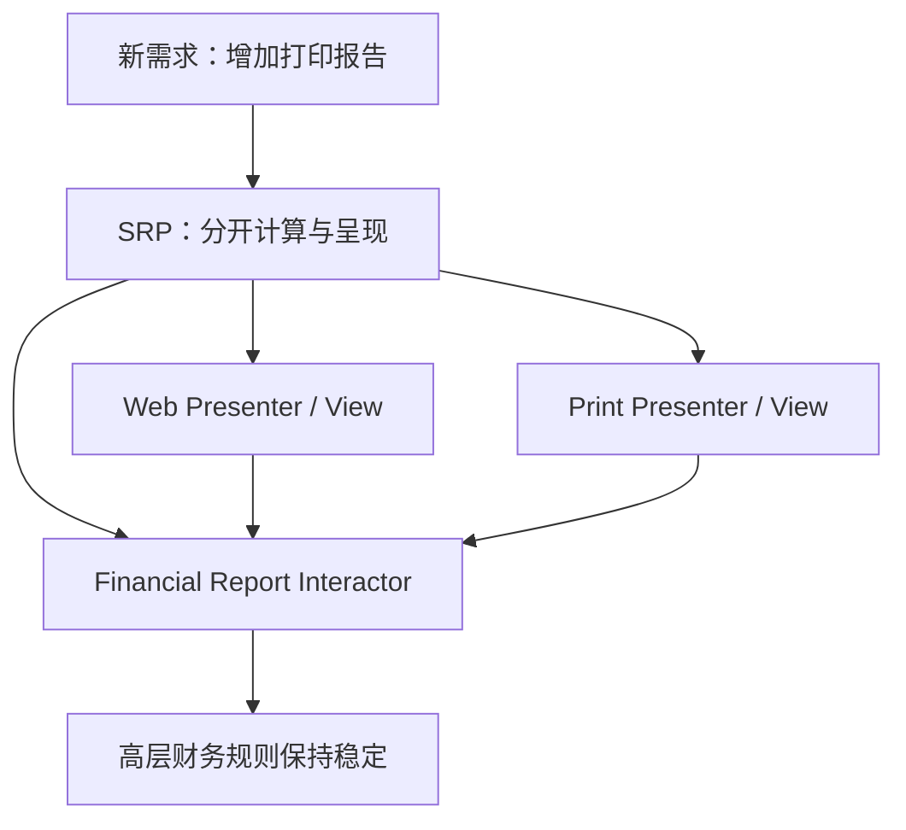
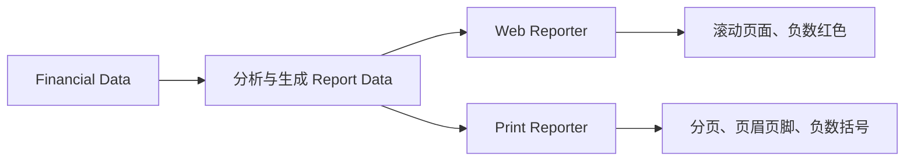
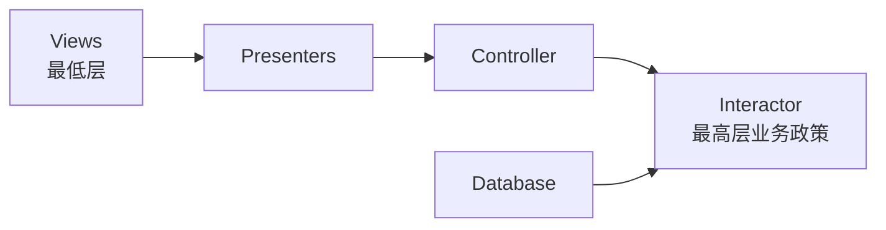
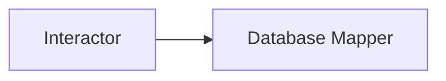
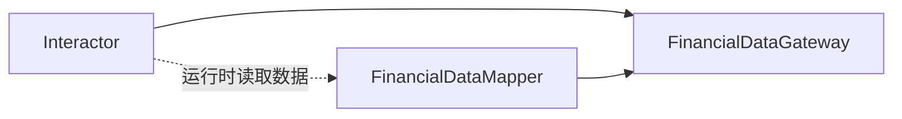
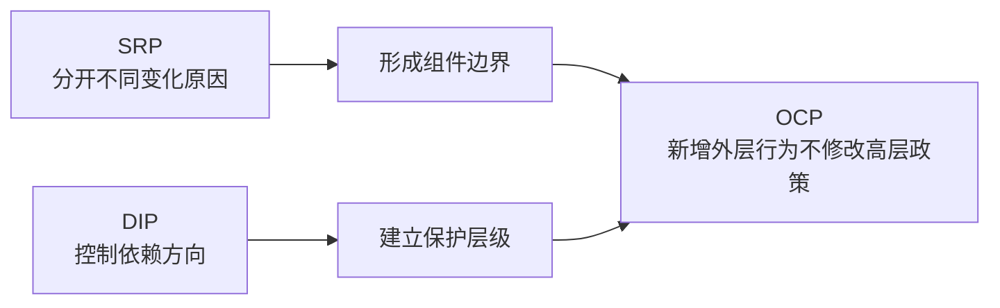

> 原书：Robert C. Martin, *Clean Architecture: A Craftsman's Guide to Software Structure and Design* 
> 本章：Chapter 8, OCP: The Open-Closed Principle 
> 原文参考：Clean Architecture.md

## 本章导读
> **原书图示**：Chapter 8 章首页
Open-Closed Principle（OCP，开闭原则）由 Bertrand Meyer 于 1988 年提出：

> **A software artifact should be open for extension but closed for modification.** 
> **软件实体应当对扩展开放，对修改关闭。**

这句话很容易被误解成「已有代码绝对不能修改」。作者真正强调的是：

> **系统增加某类新行为时，应尽量通过增加代码完成，而不是反复改动已经稳定、重要的核心代码。**

本章把 OCP 从类设计提升到组件和架构层面。作者用财务摘要系统说明：同一份业务数据原本显示在 Web 页面上，现在需要增加黑白打印报告。好的架构应该让团队增加打印相关代码，而不必修改财务计算核心。

实现这种效果需要两个步骤：

1. 使用 SRP，把因不同原因变化的计算、Web 呈现和打印呈现分开；
2. 使用 DIP，让依赖方向指向更高层、更需要保护的组件。

本章最重要的不是记住「扩展」和「修改」两个词，而是理解：**依赖箭头指向谁，谁就更能免受另一侧变化影响。**

## 1. OCP 的定义与来源

### 1.1 Bertrand Meyer 的原始表述

Bertrand Meyer 在 1988 年出版的 *Object-Oriented Software Construction* 中提出 OCP。

它要求软件实体同时具有两种性质：

- **Open for extension**：能够增加新行为；
- **Closed for modification**：增加这些行为时，不必修改已有稳定实体。

软件实体可以是：

- 函数；
- 类；
- 模块；
- 组件；
- 服务；
- 整个系统中的一层。

本书重点讨论组件和架构层面的 OCP。

### 1.2 Open 不等于预留所有未来功能

对扩展开放，不是提前猜出所有未来需求并建立大量接口。

它意味着：当某个变化轴已经明确时，系统允许通过新增实现、组件或 Adapter 支持变化。

例如：

- 新增一种报表格式；
- 新增一种支付渠道；
- 新增一种存储实现；
- 新增一种通知方式；
- 新增一个 UI。

这些扩展不应反复修改核心业务政策。

### 1.3 Closed 不等于代码永远不改

任何代码都可能因为以下原因修改：

- 业务政策本身变化；
- 缺陷修复；
- 安全问题；
- 性能要求改变；
- 对问题理解加深；
- 原有边界被证明错误。

Closed 是**相对于某类变化**而言的。

财务 Interactor 可以对「新增输出格式」关闭，但对「财务计算规则变化」仍然开放修改。不存在对所有未来变化同时关闭的模块。

### 1.4 为什么 OCP 是架构的根本理由

软件架构的目标之一，是让系统容易改变。如果一个小扩展迫使团队大规模改动系统，架构就没有发挥作用。

典型失败包括：

- 新增报表格式要修改核心计算；
- 新增数据库要修改业务规则；
- 新增支付渠道要修改订单核心；
- 新增 UI 要复制整个用例；
- 新增通知方式要在各业务模块加入条件分支。

OCP 让架构师思考：哪些行为应当通过插件扩展，哪些核心政策应保持稳定。

### 1.5 从类级 OCP 到架构级 OCP

类级 OCP 常表现为：

- 定义稳定接口；
- 增加新的实现类；
- 原调用者不变。

架构级 OCP 则进一步要求：

- 按变化原因拆分组件；
- 组件依赖保持单向；
- 低层细节依赖高层政策；
- 新增外层功能不冲击内层核心；
- 形成有优先级的保护层次。

类接口只是手段，组件保护才是本章重点。

## 2. A Thought Experiment

### 2.1 初始系统：Web 财务摘要
> **原书图示**：Figure 8.1 所在页：Web 与 Print 数据流
假设系统在 Web 页面上展示财务摘要：

- 页面可以滚动；
- 数据按 Web 布局显示；
- 负数显示为红色；
- 用户通过浏览器阅读。

这个系统至少包含两类行为：

1. 分析财务数据并得到应报告内容；
2. 把内容转换成 Web 适合的呈现形式。

若两类行为混在一起，核心计算会知道颜色、滚动和 HTML 等细节。

### 2.2 新需求：黑白打印报告

利益相关者要求把同一信息打印到黑白打印机（black-and-white printer）：

- 正确分页（pagination）；
- 每页有页眉和页脚；
- 有清楚列标题；
- 负数使用括号，而不是红色；
- 页面不能依赖滚动。

显然需要写新代码。作者真正关心的是：

> **需要修改多少旧代码？**

好的架构会把旧代码修改量降到最低，理想情况是核心旧代码完全不改。

### 2.3 第一步：用 SRP 分开职责

生成报告包含两种不同职责：

- 计算应该报告的数据；
- 把数据呈现为特定媒介所需形式。

它们的变化原因不同：

- 财务规则由业务政策驱动；
- Web 格式由页面与交互需求驱动；
- Print 格式由纸张、分页和打印规范驱动。

因此应分别放入：

- Financial Report Interactor；
- Web Presenter / View；
- Print Presenter / View。

### 2.4 SRP 只完成了第一半

把代码拆成不同类，并不自动隔离变化。

若 Interactor 直接调用具体 `WebPresenter` 和 `PrintPresenter`，它仍然依赖外层呈现。新增格式时，核心可能仍需 import 新类并修改条件分支。

所以还需要第二步：安排正确的源码依赖方向。

### 2.5 第二步：用 DIP 组织依赖

Interactor 不应知道具体 Presenter。它应调用自己一侧定义的输出接口，由 Web 和 Print Presenter 分别实现。

同理，Interactor 需要财务数据时，不应依赖具体数据库 Mapper，而应依赖高层定义的 Gateway。

这样运行时仍会调用外层实现，源码依赖却指向高层接口。

### 2.6 Figure 8.2 的四组组件
> **原书图示**：Figure 8.2：类与组件划分
原书 Figure 8.2 把类分入几个组件：

- 左上：Controller；
- 右上：Interactor；
- 右下：Database；
- 左下：Presenters 与 Views。

图中标记：

- `<I>` 表示 Interface；
- `<DS>` 表示 Data Structure；
- 空心箭头表示使用关系；
- 实心箭头表示实现或继承关系；
- 双线表示组件边界。

复杂的类图不是为了炫耀模式，而是为了让每条跨组件依赖指向正确方向。

### 2.7 图中的箭头表示源码依赖

若箭头从 A 指向 B，表示 A 的源码提到了 B 的名字，而 B 不知道 A。

例如：

- `FinancialDataMapper` 实现 `FinancialDataGateway`；
- Mapper 的源码知道 Gateway；
- Gateway 的源码不知道 Mapper；
- 因此 Database 细节依赖 Interactor 一侧的抽象。

这与运行时数据从数据库流向 Interactor 并不矛盾。数据流与源码依赖是两回事。

### 2.8 组件边界为何只允许单向跨越

Figure 8.2 中，每条组件双线都只被一个方向的源码依赖穿过。

这避免：

- 组件循环依赖；
- 一侧变化双向传播；
- 两个组件必须共同编译；
- 接口所有权变得含糊；
- 团队无法独立工作。

### 2.9 Figure 8.3：组件关系图
> **原书图示**：Figure 8.3：单向组件关系
类图简化为组件图后，可以直接看到保护关系。

作者反复强调一条规则：

> **If component A should be protected from changes in component B, then component B should depend on component A.** 
> **如果组件 A 应免受组件 B 的变化影响，那么应让 B 依赖 A。**

直觉上，依赖者知道被依赖者，因此被依赖者通常不知道依赖者。B 发生内部变化时，只要仍遵守 A 定义的契约，A 无需变化。

### 2.10 具体保护关系

原书希望实现：

- Controller 免受 Presenter 变化影响；
- Presenter 免受 View 变化影响；
- Interactor 免受 Database、Controller、Presenter 和 View 的变化影响。

这是一张保护层次图，不一定表示完整运行时调用顺序。

### 2.11 Interactor 为什么最受保护

Interactor 包含应用的核心业务规则，是系统的中心关注点。

其他组件处理外围问题：

- Controller 解释输入；
- Presenter 准备输出；
- View 绘制界面；
- Database 保存数据。

外部技术和展示方式变化频繁，不应迫使核心业务规则变化。因此，所有这些组件都依赖 Interactor 侧的接口，而不是反过来。

### 2.12 保护层级是相对的

虽然 Controller 相对 Interactor 属于外围，但它相对 Presenter 和 View 又更高层。

- Interactor 是最高层，最需要保护；
- Controller 低于 Interactor，却高于 Presenter/View；
- Presenter 低于 Controller，却高于 View；
- View 最接近具体显示，保护级别最低。

这形成基于 Level 的层级，而不是简单的核心/非核心二分。

### 2.13 架构级 OCP 的完整含义

架构师先按变化的方式、原因和时间分开功能，再把它们排列成依赖层次。

- 越高层、越重要、越稳定的政策，越不应依赖外层；
- 越低层、越具体、越容易变化的细节，越应该依赖高层接口；
- 新增低层实现时，高层政策保持不变。

这就是 OCP 在架构层面的工作方式。

### 2.14 OCP 不要求整个系统零修改

增加 Print 输出时，仍然需要：

- 新建 Print Presenter；
- 新建 Print View；
- 增加组装或注册代码；
- 增加相应测试；
- 可能增加部署配置。

OCP 保护的是稳定核心，不是让任何需求都无需修改任何文件。

Composition Root 或启动配置通常需要知道新插件并完成组装。只要核心业务政策不因外层格式扩展而改变，原则就发挥了作用。

## 3. Directional Control

### 3.1 为什么 Figure 8.2 看起来复杂

作者预料读者可能会被 Figure 8.2 的接口和类数量吓到。

其中很多结构并不是业务功能本身，而是为了控制组件之间的依赖方向。

这说明抽象和接口有成本。只有当保护价值足够高时，才值得引入。

### 3.2 `FinancialDataGateway` 的作用

没有 Gateway 时，Financial Report Generator 可能直接依赖数据库 Mapper：

数据库变化会进入 Interactor 的依赖闭包。

在 Interactor 一侧定义 `FinancialDataGateway` 后：

运行时仍然通过 Mapper 读取数据库，源码依赖却从 Mapper 指向 Gateway。

### 3.3 Presenter 接口的作用

`FinancialReportPresenter` 接口采用同样方法：

- Interactor 调用高层一侧的 Presenter 接口；
- Web Presenter 与 Print Presenter 分别实现接口；
- Interactor 不知道具体输出媒介；
- 新增输出格式不会修改 Interactor。

View 接口则把 Presenter 与具体 View 分开，使 Web 或 Print 的绘制细节不影响格式化政策。

### 3.4 接口所有权决定方向

如果 Gateway 接口定义在 Database 组件里，Interactor 仍然需要依赖 Database 组件。

正确方式是：

- 需要保护的一侧定义自己所需的能力；
- 外围实现该能力；
- 依赖箭头指向需要保护的一侧。

所以，不是「使用接口」自动带来 OCP，而是接口位置和依赖方向共同产生保护。

### 3.5 Directional Control 的代价

方向性接口会增加：

- 类型数量；
- 数据转换；
- 组装代码；
- 契约测试；
- 导航跳转；
- 初学者理解成本。

对于稳定、简单、寿命短且没有独立变化的代码，直接调用可能更清楚。

架构师需要判断：被保护政策的重要性和预计变化，是否值得这些成本。

## 4. Information Hiding

### 4.1 `FinancialReportRequester` 的不同目的

并非 Figure 8.2 中所有接口都用于依赖反转。

`FinancialReportRequester` 主要用于保护 Controller，避免它知道 Interactor 的内部结构。

若 Controller 直接依赖 Interactor 内部类和 Financial Entities，它就会被这些内部变化影响。

### 4.2 什么是 Transitive Dependency

假设：

- Controller 直接依赖 Interactor；
- Interactor 又公开或依赖 Financial Entities；
- Controller 因此也需要知道这些 Entity 类型。

Controller 虽然不直接使用某些内部细节，却通过依赖链被它们影响，这就是 Transitive Dependency（传递依赖）。

接口可以只暴露 Controller 真正需要的请求操作和数据，隐藏 Interactor 内部组织。

### 4.3 为什么传递依赖有害

传递依赖会导致：

- 内层重构迫使外层重编译；
- Controller 知道不需要的 Entity；
- 测试准备更多无关对象；
- 模块边界逐渐失去意义；
- 变化影响范围扩大。

一个软件实体不应依赖自己没有直接使用的内容。后续 Interface Segregation Principle（ISP）和 Common Reuse Principle（CRP）会以不同层级继续讨论这一思想。

### 4.4 双向保护

第一优先是保护 Interactor 不受 Controller 变化影响，因为 Interactor 更高层。

但这不意味着 Controller 应看到 Interactor 的全部内部细节。通过窄接口，还可以：

- 让 Controller 只依赖请求契约；
- 让 Interactor 隐藏 Entity 和内部协作；
- 缩小 Controller 的知识范围；
- 让双方各自重构更容易。

这不是建立双向源码依赖，而是在单向依赖中减少暴露信息。

### 4.5 Information Hiding 与 OCP

信息隐藏使组件对内部重构关闭外部影响：

- 公开稳定、最小契约；
- 隐藏内部类与数据结构；
- 外部只依赖直接需要的内容；
- 内部变化不越过边界。

因此，OCP 不只需要多态扩展点，也需要控制模块公开多少信息。

## 5. Conclusion

### 5.1 作者的总结

OCP 是系统架构的重要驱动力。其目标是：

> **让系统容易扩展，同时尽量降低变化对已有代码的冲击。**

实现方式是：

1. 按变化原因分割系统；
2. 把功能放入不同组件；
3. 组织单向依赖；
4. 让低层组件依赖高层政策；
5. 用接口反转不合适的控制流依赖；
6. 用信息隐藏缩小传递依赖。

### 5.2 OCP 与 SRP、DIP 的关系

- SRP 回答哪些代码应该分开；
- DIP 回答分开后依赖箭头如何安排；
- OCP 是最终获得的扩展性质。

### 5.3 OCP 不是接口数量竞赛

增加接口和类并不自动提高可扩展性。无根据的抽象可能让每次修改更慢。

可以考虑建立扩展边界的信号包括：

- 已经存在多个实现；
- 某类变化反复发生；
- 核心政策需要隔离外部技术；
- 不同团队独立开发；
- 需要测试替身；
- 修改影响已经明显扩大。

### 5.4 保护不是平均分配

不是每个组件都值得同等保护。

架构师应优先保护：

- 最核心的业务政策；
- 最难恢复的知识；
- 被许多外部组件依赖的稳定契约；
- 变化频率较低但业务影响重大的规则。

View 和具体 Framework 通常更容易替换，因此可以处于保护层次外围。

### 5.5 一个实用判断

面对一项新需求，可以问：

1. 这是新行为，还是原有核心政策本身改变？
2. 哪些旧组件理论上不应知道这项扩展？
3. 当前为何必须修改它们？
4. 是否因为职责混合？
5. 是否因为依赖方向错误？
6. 是否因为接口泄漏了太多内部信息？
7. 建立边界的收益是否超过复杂度成本？

## 作者的分析方法

### 1. 从一句原则转向具体变化

作者没有停留在「开放」「关闭」的抽象定义，而是问新增打印报告到底要修改多少旧代码。

### 2. 使用同一数据、不同媒介突出变化轴

Web 与 Print 使用同一财务数据，却有完全不同的呈现规则，清楚展示计算与呈现为什么应分开。

### 3. 先用 SRP 分，再用 DIP 连

SRP 负责发现职责边界，DIP 负责安排依赖方向。两者缺一不可。

### 4. 从类图抽象出组件保护层次

Figure 8.2 先展示具体接口和类，Figure 8.3 再简化为组件关系，让读者看到复杂类图背后的目标只是保护层级。

### 5. 区分两类接口目的

`FinancialDataGateway` 用于反转依赖，`FinancialReportRequester` 主要用于隐藏信息。不是所有接口都服务同一个模式。

### 6. 以业务重要性决定保护优先级

Interactor 包含中心业务政策，因此享有最高保护；View 最具体，因此处于外围。

## 易混淆概念与常见误解

### 1. Closed for modification 意味着旧代码永远不能改

错误。模块只是对某类扩展关闭；业务政策本身变化或发现缺陷时仍需修改。

### 2. Open for extension 意味着预测所有未来

错误。应围绕真实、重要的变化轴建立扩展点，而不是提前设计无限插件。

### 3. 新需求应做到零文件修改

不现实。新增实现、组装、测试和配置都需要代码。目标是保护稳定核心。

### 4. 只要使用继承和接口就符合 OCP

接口若放错位置、职责仍混合或高层直接依赖低层，OCP 仍不成立。

### 5. OCP 只适用于类

本章重点正是把 OCP 应用于组件和整个架构的依赖层次。

### 6. 所有组件应同等保护

保护优先级取决于政策层级和业务重要性。高层 Interactor 比具体 View 更值得保护。

### 7. 数据流方向就是源码依赖方向

数据库数据可以流入 Interactor，Interactor 的源码却只依赖自己定义的 Gateway，具体 Mapper 反向依赖 Gateway。

### 8. 接口只用于多态

接口还可以隐藏内部信息，避免调用者获得不需要的传递依赖。

### 9. Controller 依赖 Interactor 就应该看到其所有 Entity

错误。Controller 只需要请求契约，窄接口应隐藏 Interactor 内部协作和 Entity。

### 10. 类图复杂说明架构过度设计

复杂度可能是必要保护成本，也可能确实过度。需要依据变化频率、核心价值和团队边界判断。

### 11. Composition Root 发生修改就违反 OCP

新增插件通常需要在系统组装处注册。组装点本来就负责具体选择，不属于被保护的业务核心。

### 12. OCP 的目标是完全消灭修改

真正目标是控制修改影响，让新增外围能力不迫使高层政策跟着变化。

## 实践检查清单

### 识别扩展场景

- 哪类新行为反复出现？
- 新增行为是否与核心政策属于不同变化原因？
- 当前扩展需要修改哪些稳定组件？
- 哪些修改只是为了注册或组装？

### 检查职责分离

- 业务计算是否混入 Web、Print 或 Database 格式？
- 同一 Presenter 是否承担多种媒介？
- 数据分析与展示是否可以独立测试？
- 不同团队是否因不同原因修改同一模块？

### 检查依赖方向

- 箭头是否指向需要保护的组件？
- 高层接口是否由高层一侧拥有？
- Database Mapper 是否反向实现 Gateway？
- Presenter 是否实现 Interactor 定义的输出端口？
- 是否存在跨组件双向依赖？

### 检查信息隐藏

- 调用者是否依赖不直接使用的 Entity？
- 公开接口是否泄漏内部数据结构？
- 内部重构是否迫使外围组件修改？
- 接口能否缩小传递依赖，而非只增加转发？

### 评估抽象成本

- 是否已有多个实现或真实变化证据？
- 被保护政策是否足够重要？
- 接口、Adapter、数据转换和测试成本如何？
- 直接实现是否在当前寿命和风险下更合适？

## 本章总结

1. OCP 由 Bertrand Meyer 于 1988 年提出，要求软件实体对扩展开放、对修改关闭。
2. Open 表示可以增加新行为，Closed 表示增加这类行为时尽量不改稳定核心。
3. Closed 总是相对于某个变化轴，不代表代码永远不可修改。
4. OCP 是研究架构的根本原因之一，因为架构应降低扩展带来的旧代码冲击。
5. 本章把 OCP 从类级设计提升到组件与架构层面。
6. 财务摘要原本显示在可滚动 Web 页面上，负数用红色表示。
7. 新需求要求黑白打印、分页、页眉页脚、列标题，并用括号表示负数。
8. 新呈现需要新代码，但理想上不应修改财务计算核心。
9. SRP 首先把财务计算与 Web、Print 呈现分开。
10. 仅拆分类还不够，仍需用 DIP 安排源码依赖方向。
11. Figure 8.2 将系统分成 Controller、Interactor、Database、Presenters 和 Views 等组件。
12. 图中箭头表示源码提及关系，不等于运行时数据流。
13. `FinancialDataMapper` 依赖 `FinancialDataGateway`，Gateway 不知道具体 Mapper。
14. 每条组件边界只允许源码依赖单向穿过，以避免变化双向传播。
15. 若 A 应免受 B 变化影响，应让 B 依赖 A。
16. Controller 应免受 Presenter 变化影响，Presenter 应免受 View 变化影响。
17. Interactor 包含最高层业务政策，因此应免受其他所有外围组件变化影响。
18. 保护层次是相对的：Controller 对 Interactor 是外围，对 Presenter 和 View 又更高层。
19. OCP 在架构层面要求按变化方式分割功能，再按政策层级组织单向依赖。
20. 新增 Print 输出仍需新类、组装、测试和配置，OCP 不要求整个系统零修改。
21. `FinancialDataGateway` 用于反转 Interactor 与 Database 的源码依赖。
22. Presenter 和 View 接口采用类似机制，让具体输出依赖高层契约。
23. 接口所有权决定依赖方向，接口必须位于需要保护的一侧。
24. Directional Control 会增加接口、Adapter、转换和理解成本，应由真实保护需求驱动。
25. `FinancialReportRequester` 主要用于 Information Hiding，而不是反转数据库依赖。
26. 窄请求接口避免 Controller 传递依赖 Financial Entities 和 Interactor 内部结构。
27. 软件实体不应依赖自己不直接使用的内容，这一思想会在 ISP 和 CRP 中再次出现。
28. 信息隐藏可以在保护 Interactor 的同时，减少 Controller 对 Interactor 内部变化的敏感度。
29. SRP 回答哪些功能应分开，DIP 回答依赖如何排列，OCP 是最终获得的扩展性质。
30. OCP 不是接口数量竞赛，也不是预测所有未来，而是保护重要政策免受已知外围变化影响。
31. 保护应有层级，最核心、最稳定、最有业务价值的政策获得最高优先级。
32. 本章最终目标是让系统易于扩展，同时把变化影响限制在真正需要改变的组件中。
