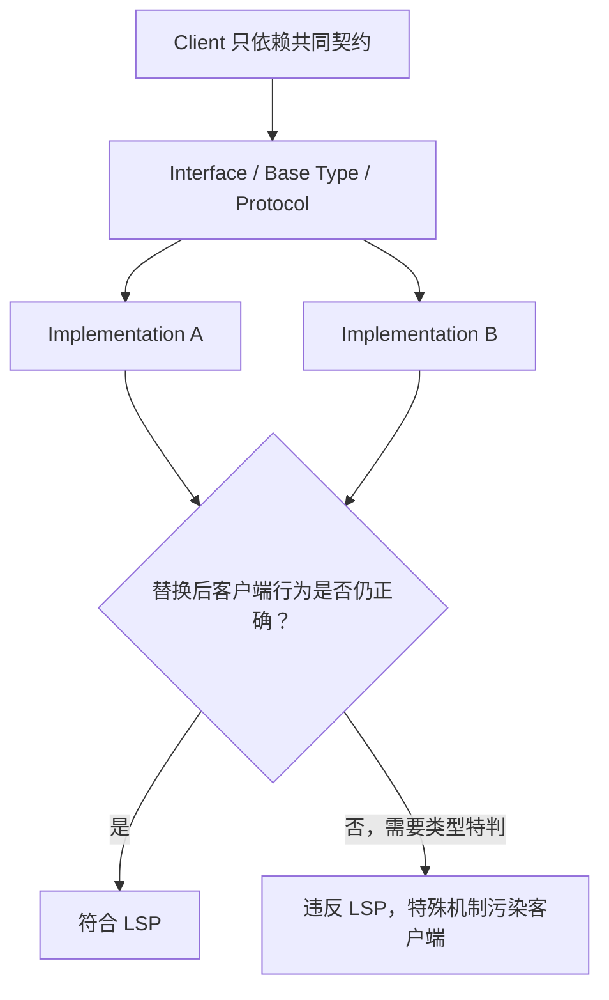
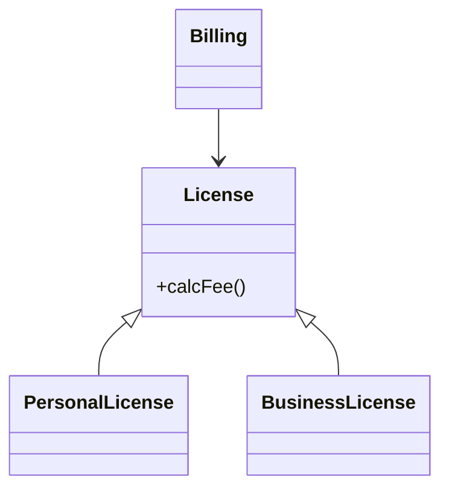
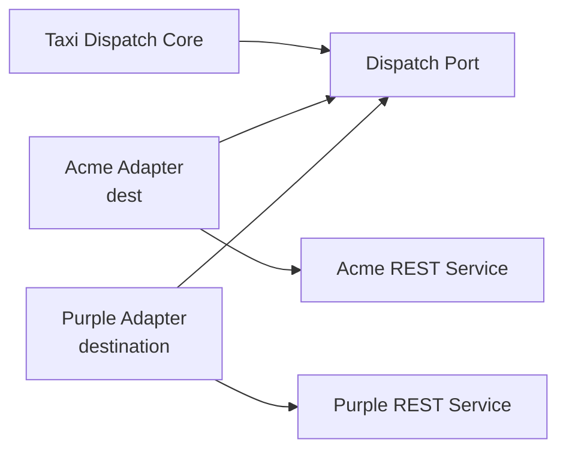
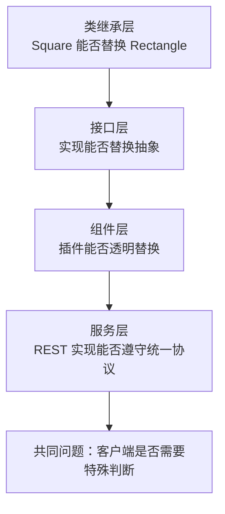

> 原书：Robert C. Martin, *Clean Architecture: A Craftsman's Guide to Software Structure and Design*<br>
> 本章：Chapter 9, LSP: The Liskov Substitution Principle<br>
> 原文参考：Clean Architecture.md

## 本章导读
> **原书图示**：Chapter 9 章首页
Liskov Substitution Principle（LSP，里氏替换原则）源自 Barbara Liskov 在 1988 年对 subtype 的定义。

用通俗的话说：

> **如果某段程序只依赖类型 T 的公开约定，那么把 T 的对象换成它的子类型 S 后，程序原有的正确行为不应被破坏。**

LSP 关注的不是继承语法，而是**行为契约能否替换**。

- 方法名相同，不代表行为相容；
- 子类继承父类，不代表客户端可以安全替换；
- 两个 REST 服务返回相同字段，不代表它们遵守相同语义；
- 客户端如果必须识别具体实现并写特殊分支，就说明替换性已经失败。



本章先用 License 展示正确继承，再用 Square/Rectangle 展示经典反例，最后把原则提升到架构层，用出租车派遣 REST 接口说明：一个小小的协议不一致，可能迫使整个系统增加复杂适配机制。

## 1. Liskov 1988 年的替换定义

### 1.1 历史背景

Barbara Liskov 在 1988 年的论文 *Data Abstraction and Hierarchy* 中，以 substitution property（替换性质）定义 subtype。

她关注的问题不是「子类是否继承了代码」，而是：

- 客户端原本按 T 的约定编写；
- S 声称是 T 的子类型；
- 用 S 替换 T 后；
- 客户端可观察行为是否保持正确。

若保持，S 才是 T 的合法子类型。

### 1.2 什么叫行为保持不变

「不变」不是要求两个实现返回完全相同的数字或执行完全相同步骤。

它要求客户端依赖的承诺不被破坏。例如：

- 输入仍然被接受；
- 返回结果仍符合约定；
- 业务不变量仍然成立；
- 错误与异常不会变得更苛刻或更意外；
- 必要副作用仍然发生；
- 不会增加客户端无法接受的新副作用。

不同许可证可以计算出不同费用，只要 Billing 程序仍能按 License 契约使用它们。

### 1.3 Syntax 与 Semantics

**Syntax（语法兼容）**包括：

- 方法名；
- 参数数量和类型；
- 返回类型；
- REST 路径和字段名。

**Semantics（语义兼容）**包括：

- 方法真正承诺什么；
- 参数在业务上的含义；
- 返回值满足什么条件；
- 哪些状态变化合法；
- 失败如何表达。

LSP 关注语义。编译器通常只能检查一部分语法，无法自动保证全部业务契约。

### 1.4 契约式理解

可以用三个问题检查子类型契约：

1. **输入要求是否更严格？**<br>
   基类接受的合法输入，子类型不应突然拒绝。
2. **输出承诺是否更弱？**<br>
   基类保证的结果，子类型不应减少。
3. **状态约束是否被破坏？**<br>
   基类允许的操作序列，在子类型上不应产生违背客户端预期的状态。

此外，还要考虑异常、副作用、性能和时序是否属于客户端依赖的契约。

### 1.5 为什么需要 LSP

OCP 希望系统通过增加新实现进行扩展，而不修改客户端。但如果新实现不能真正替换旧实现，客户端只能增加：

- 类型判断；
- 特殊分支；
- 额外配置；
- 例外路径；
- 补偿逻辑。

于是 OCP 被破坏。LSP 是插件架构能够成立的行为基础。

## 2. Guiding the Use of Inheritance

### 2.1 License 正例
> **原书图示**：Figure 9.1 与 Figure 9.2：License 及 Square/Rectangle
原书首先给出符合 LSP 的继承关系：

- 基类 `License` 提供 `calcFee()`；
- `PersonalLicense` 使用个人许可证计费算法；
- `BusinessLicense` 使用商业许可证计费算法；
- Billing 应用只依赖 `License`。



### 2.2 为什么符合 LSP

Billing 关心的是：给定一个许可证，能够计算应收费用。

它不关心：

- 当前是个人还是企业许可证；
- 具体算法是什么；
- 数据存在哪里；
- 内部如何组合费率。

两种实现虽然计算结果不同，却都满足 `License.calcFee()` 对 Billing 的约定。替换实现不需要修改 Billing。

### 2.3 判断继承是否合理

使用继承前，应从客户端角度询问：

- 客户端为什么依赖基类？
- 它依赖哪些行为承诺？
- 子类是否完整保留这些承诺？
- 客户端是否需要知道具体子类？
- 新子类加入后，客户端是否需要新增分支？

若最后两个问题回答为「需要」，继承层次很可能不符合 LSP。

### 2.4 继承只是实现方式之一

LSP 并不要求必须使用类继承。

可替换关系也可以来自：

- Java/C# Interface；
- C++ 抽象接口；
- Go Interface；
- Ruby 的 Duck Typing；
- 函数参数与回调；
- REST 或消息协议；
- 插件约定。

原则关心的是客户端看到的契约，而不是语言语法。

## 3. The Square/Rectangle Problem

### 3.1 经典反例

从数学分类看，正方形是一种特殊矩形。因此，很多人自然地让 `Square` 继承 `Rectangle`。

但程序中的 `Rectangle` 可能允许宽和高独立修改，而 `Square` 必须始终保持两者相等。这两个行为契约发生冲突。

### 3.2 客户端的合理预期

原书给出如下客户端代码：

```text
Rectangle r = ...;
r.setW(5);
r.setH(2);
assert(r.area() == 10);
```

客户端只知道 `r` 是 Rectangle，因此合理相信：

- 设置宽不会改变高；
- 设置高不会改变宽；
- 最终宽为 5、高为 2；
- 面积为 10。

### 3.3 如果实际对象是 Square

Square 必须保持宽高相等，通常只能选择一种实现：

- `setW(5)` 同时把宽高都改成 5；
- `setH(2)` 又同时把宽高都改成 2。

最终面积变成 4，断言失败。

也可以选择让 `setH` 不改宽，但对象将不再是正方形。无论怎样，Square 都无法同时满足：

- Rectangle 的宽高独立修改契约；
- Square 的宽高相等不变量。

### 3.4 为什么数学关系不等于程序子类型

数学中的集合关系只描述对象具有什么性质。

程序类型还包含：

- 可执行操作；
- 修改方式；
- 状态历史；
- 错误行为；
- 客户端预期。

若 Rectangle 是不可变值，只在构造时指定宽高，并且共同接口只暴露 `area()`，Square 作为 Shape 的一种实现可能完全合理。

问题不在「正方形是不是矩形」，而在公开接口承诺了哪些可变行为。

### 3.5 类型判断为什么是失败信号

为了防御问题，客户端可能写：

```text
if r is Square:
    use special logic
else:
    use rectangle logic
```

这让客户端依赖具体类型。每新增特殊子类，都要继续修改客户端。

- 多态失去意义；
- OCP 被破坏；
- 业务逻辑散落特殊判断；
- 插件不能真正替换。

类型判断并非永远错误，但若只是为了弥补共同接口的契约不一致，就是明显的 LSP 违规症状。

### 3.6 更合适的设计方式

可根据真实需求选择：

**方案一：不要让 Square 继承可变 Rectangle。**

把它们作为独立类型，都实现只读 `Shape` 接口。

**方案二：使用不可变值对象。**

构造后宽高不再修改，避免 setter 契约冲突。

**方案三：重新设计 Rectangle API。**

若业务不需要独立 setter，就不要公开这种承诺。

**方案四：使用组合。**

Square 内部可以使用尺寸值，但不宣称能够替换拥有独立宽高修改语义的 Rectangle。

设计应服从客户端所需行为，而不是强迫代码复制数学分类。

## 4. LSP and Architecture

### 4.1 从继承规则扩展到架构原则

OO 早期，人们主要把 LSP 用于判断继承关系。

随着系统架构发展，原则扩展到所有接口与实现关系。只要存在：

- 一个客户端；
- 一个稳定接口；
- 多个实现；
- 客户端依赖实现可替换；

LSP 就适用。

### 4.2 Interface 可以有哪些形式

原书列举：

- Java 风格 Interface，由多个类实现；
- 多个 Ruby 类拥有相同方法签名；
- 多个服务响应相同 REST Interface。

还可以包括：

- 数据库 Gateway；
- 消息格式；
- 文件协议；
- 支付渠道 Adapter；
- 云存储 API；
- 命令行工具约定。

LSP 已不只是类设计问题，而是所有可替换边界的行为要求。

### 4.3 架构层的替换单位

在架构层，被替换的可能是：

- 一个对象；
- 一个库；
- 一个进程；
- 一个微服务；
- 一家第三方供应商；
- 一个部署区域。

单位越大，违反契约产生的补偿机制通常越昂贵。

### 4.4 LSP 与插件架构

插件架构假设：

- 高层只依赖端口；
- 低层实现端口；
- 实现可以替换；
- 高层无需知道差异。

DIP 提供依赖方向，LSP 保证实现真的遵守端口行为。缺少 LSP，接口虽然存在，高层仍会被各种实现特例污染。

### 4.5 契约不仅是文档

可靠契约可以通过多种方式维护：

- 清楚 API 文档；
- 类型系统；
- 契约测试；
- 共享测试套件；
- Consumer-Driven Contract；
- Schema 验证；
- 版本与兼容策略；
- 运行监控。

编译通过只代表签名兼容，不代表业务语义兼容。

## 5. Example LSP Violation

### 5.1 出租车聚合系统

假设我们开发一个聚合多家出租车公司的系统：

1. 用户在网站上寻找合适出租车；
2. 系统比较不同公司和司机；
3. 用户选择一辆车；
4. 聚合系统通过 REST Service 派车。

司机记录中保存各公司的 Dispatch URI。系统选择司机后，取出 URI 并按统一协议发送 PUT 请求。

### 5.2 正常服务的统一契约

司机 Bob 的 URI 可能是：

```text
purplecab.com/driver/Bob
```

系统追加派车参数：

```text
/pickupAddress/24 Maple St.
/pickupTime/153
/destination/ORD
```

所有出租车服务都必须以相同方式理解：

- `pickupAddress`；
- `pickupTime`；
- `destination`。

只要遵守同一 REST Interface，聚合系统无需知道出租车公司差异。

### 5.3 违规：Acme 使用 `dest`

Acme 的程序员没有严格遵守规格，把 `destination` 缩写为 `dest`。

它看起来只是一个字段名差异，却破坏了替换性：统一请求对其他公司有效，对 Acme 无效。

Acme 不能作为同一 Dispatch Service 契约的透明替换实现。

### 5.4 最简单的特殊分支

开发者可能在构造请求的模块中加入：

```text
if dispatch URI starts with acme.com:
    use dest
else:
    use destination
```

这样暂时能工作，却让聚合系统知道：

- Acme 是特殊公司；
- 它有特殊字段；
- URI 决定请求格式。

每个新例外都会继续修改核心派遣逻辑，OCP 被破坏。

### 5.5 把公司名写进代码的风险

直接检查 `acme.com` 还会产生额外问题：

- 品牌或域名变化；
- 公司收购与系统合并；
- 测试环境域名不同；
- 子域名与大小写处理；
- 恶意域名伪装；
- URL 字符串前缀判断造成安全漏洞。

原书假设 Acme 收购 Purple Taxi，却保留两个品牌和网站，同时统一后台系统。此时 Purple URI 也可能需要 Acme 格式，代码还要增加另一条特殊判断。

这说明具体公司名不是可靠的行为契约标识。

### 5.6 架构师被迫增加配置机制

为隔离差异，架构师可能建立 Dispatch Command Creation 模块，并由配置数据库按 URI 选择格式：

```text
Acme.com  -> /pickupAddress/.../pickupTime/.../dest/...
默认      -> /pickupAddress/.../pickupTime/.../destination/...
```

这样可以把特殊情况从核心流程移到配置和 Adapter，但系统需要额外维护：

- URI 解析；
- 格式模板；
- 配置读取；
- 默认规则；
- 安全校验；
- 测试矩阵；
- 错误诊断。

### 5.7 配置驱动是隔离，不是胜利

配置和 Adapter 是现实中必要的防腐层，可以保护核心不受无法控制的第三方接口污染。

但它们仍然是成本。若所有服务一开始就遵守相同契约，这套复杂机制根本不需要存在。

本章结论不是「用配置解决 LSP」，而是：**LSP 违规会迫使架构增加原本不需要的机制。**

### 5.8 外部供应商无法被强制时怎么办

现实中，团队常常无法要求第三方统一接口。可以：

- 为每家供应商建立独立 Adapter；
- 在 Adapter 中把外部格式转换为内部端口；
- 使用明确供应商 ID，而不是猜测 URI；
- 为所有 Adapter 运行同一契约测试；
- 监控供应商的协议偏差；
- 把特殊重试和错误映射留在边界。

高层系统应看到统一的内部 Dispatch Contract，外部差异止步 Adapter。



### 5.9 如何安全识别服务格式

如果确实使用 URI 关联配置，应：

- 用标准 URL Parser 提取规范化 Host；
- 不使用简单 `startsWith`；
- 验证协议、端口和证书；
- 将供应商身份与域名映射放入受控配置；
- 为品牌收购和迁移建立明确版本；
- 对未知配置采用安全失败，而不是默认发送。

这属于安全和适配细节，但正是一个小契约违规扩散出的现实复杂度。

## 6. Conclusion

### 6.1 作者的结论

LSP 应从继承层扩展到架构层。

一个看似微小的替换性违规，可能迫使系统增加：

- 特殊分支；
- 公司识别；
- 配置数据库；
- 格式模板；
- Adapter；
- 更多测试与监控；
- 额外安全机制。

因此，接口的所有实现必须遵守客户端依赖的行为契约。

### 6.2 从子类到服务



无论替换单位是什么，只要客户端必须知道具体实现，LSP 就可能已经被破坏。

### 6.3 LSP 与其他原则的关系

- **OCP** 依赖 LSP：新实现必须可替换，扩展才能不修改客户端；
- **DIP** 依赖 LSP：低层实现必须遵守高层端口；
- **ISP** 帮助建立较小契约，减少实现无法完整遵守的风险；
- **契约测试**帮助在实现和服务层持续验证替换性。

### 6.4 LSP 不要求实现完全相同

合法实现可以：

- 使用不同算法；
- 返回不同但符合约定的业务结果；
- 访问不同存储；
- 使用不同性能策略；
- 记录不同内部日志。

只要不破坏客户端依赖的契约，就仍然可替换。

### 6.5 修复 LSP 违规的顺序

发现特殊分支后，可以依次判断：

1. 共同接口是否承诺了错误行为？
2. 某实现是否只是 Bug，应直接修复？
3. 两种实现是否其实不是同一抽象？
4. 能否拆成更小、更诚实的接口？
5. 外部差异是否应由 Adapter 归一化？
6. 是否需要版本化契约？
7. 特殊情况是否值得继续支持？

不要一看到违规就增加更多类型判断。

## 作者的分析方法

### 1. 从抽象定义进入两个类例子

Barbara Liskov 的原始定义较抽象。作者先用 License 正例说明替换成功，再用 Square/Rectangle 展示失败。

### 2. 从客户端行为判断类型关系

作者不从数学分类或继承语法出发，而是观察 User 的断言是否仍然成立。

### 3. 把类型概念扩大到接口与服务

Java Interface、Ruby Duck Typing 和 REST Service 虽实现机制不同，都存在客户端与替换实现，因此都受 LSP 约束。

### 4. 用架构污染展示违规代价

出租车例子把一个字段缩写问题逐步扩大为公司特判、配置数据库和安全风险，使替换性与架构成本直接关联。

### 5. 区分补偿机制与原则成功

配置驱动能够隔离外部差异，但它是对违规的补偿成本，不代表接口设计本身良好。

## 易混淆概念与常见误解

### 1. LSP 就是子类不能重写父类方法

错误。子类当然可以重写，只要重写后的行为仍满足客户端依赖的契约。

### 2. 只要方法签名相同就符合 LSP

签名只保证语法兼容。参数语义、结果、异常、副作用和状态约束也必须兼容。

### 3. 数学上是子集，程序中就一定是子类型

Square/Rectangle 说明，程序类型还包含可变操作和行为历史，数学分类不能直接决定继承。

### 4. 增加 `if` 判断具体类型就解决问题

它可能暂时修复行为，却证明客户端不能透明替换实现，并会随着实现增加而扩散。

### 5. LSP 只适用于类继承

接口、Duck Typing、插件、服务和协议同样需要替换性。

### 6. 所有实现必须返回相同结果

不同许可证可计算不同费用。LSP 要求遵守共同承诺，不要求内部和结果完全一致。

### 7. 子类型可以要求更严格输入

若基类客户端会传入某些合法输入，而子类型拒绝，它就无法替换基类。

### 8. 子类型抛出任何新异常都没关系

若客户端没有准备处理新的失败语义，替换后行为会被破坏。异常也是契约的一部分。

### 9. 配置驱动方案代表良好 LSP

配置只是隔离第三方差异的现实手段。若所有实现遵守统一契约，就不需要这些补偿机制。

### 10. Adapter 隐藏差异后，外部服务就符合 LSP

内部端口的 Adapter 可以彼此符合 LSP；外部服务本身仍然不一致。需要清楚边界在哪一层成立。

### 11. LSP 要求完全相同性能

性能只有在客户端契约明确依赖时才属于替换条件。但突然从毫秒变成小时，往往会破坏现实可替换性。

### 12. 遵守 LSP 可以自动消除所有特殊业务

真正不同的业务规则不应被伪装成同一抽象。LSP 鼓励诚实建模，而不是抹平合法差异。

## 实践检查清单

### 检查共同契约

- 客户端真正依赖哪些行为？
- 合法输入范围是什么？
- 输出保证是什么？
- 有哪些状态不变量？
- 异常、副作用、时序和性能是否属于契约？

### 检查实现

- 某实现是否拒绝其他实现接受的输入？
- 是否返回客户端不能处理的结果？
- 是否增加意外异常或副作用？
- 是否改变合法操作顺序？
- 是否需要客户端知道具体类型？

### 检查代码症状

- 是否有 `instanceof`、类型码或供应商名分支？
- 是否按 URI、域名或类名选择特殊逻辑？
- 是否每新增实现都修改核心客户端？
- 是否有某实现无法通过共享测试套件？
- 是否存在越来越大的兼容配置表？

### 检查架构边界

- 插件是否都遵守高层端口？
- REST 服务是否共享同一字段语义和错误模型？
- 外部不一致是否止步 Adapter？
- 是否为每个实现运行契约测试？
- 接口是否过大，迫使实现假装支持能力？

### 选择修复方式

- 修复不合规实现；
- 缩小或重定义共同接口；
- 取消错误继承关系；
- 使用组合或独立类型；
- 在外部边界增加防腐 Adapter；
- 对真实协议差异进行版本化。

## 本章总结

1. LSP 源自 Barbara Liskov 1988 年对 subtype 的替换性质定义。
2. 若客户端按 T 的契约编写，用 S 替换 T 后正确行为不应被破坏，S 才是合法子类型。
3. 行为相容不要求实现返回完全相同结果，而要求客户端依赖的承诺保持成立。
4. 方法签名只提供语法兼容，LSP 更关心输入、输出、状态、异常和副作用的语义。
5. 子类型不应要求更严格输入，也不应削弱基类型对结果的承诺。
6. LSP 是 OCP 和插件架构能够成立的行为基础。
7. `PersonalLicense` 与 `BusinessLicense` 都能替换 `License`，因为 Billing 不依赖具体类型。
8. 使用继承前，应从客户端契约判断替换性，而不是只看代码复用。
9. LSP 不局限于类继承，也适用于 Interface、Duck Typing、回调和服务协议。
10. Square/Rectangle 问题源于 Rectangle 允许宽高独立修改，而 Square 必须保持宽高相等。
11. 客户端设置宽为 5、高为 2，并合理期待面积为 10；Square 无法保持这个行为契约。
12. 数学上正方形属于矩形，不代表可变程序类型中 Square 能替换 Rectangle。
13. 客户端若必须判断对象是否为 Square，说明类型不可透明替换。
14. 可使用独立类型、只读 Shape 接口、不可变值对象或组合避免错误继承。
15. LSP 后来从继承指导原则扩展为适用于接口与实现的架构原则。
16. Java Interface、Ruby 方法约定和 REST Service 都可能形成需要 LSP 的替换边界。
17. 架构层的替换单位可以是对象、组件、进程、服务或第三方供应商。
18. DIP 提供依赖方向，LSP 保证低层实现真正遵守高层端口。
19. 出租车聚合系统要求所有公司统一使用 `pickupAddress`、`pickupTime` 和 `destination`。
20. Acme 把 `destination` 缩写为 `dest`，因此不能透明替换其他派车服务。
21. 在核心代码中按 `acme.com` 增加特殊分支，会让公司细节污染架构并带来安全风险。
22. 品牌收购、域名变化和后台合并会让基于字符串的特殊判断继续扩散。
23. 架构师可能被迫增加按 URI 选择格式的配置与命令创建机制。
24. 配置和 Adapter 能隔离第三方差异，却是 LSP 违规带来的额外成本，不是原则本身的胜利。
25. 无法控制外部供应商时，应在防腐 Adapter 中归一化格式，让内部端口保持一致。
26. URI 识别应使用标准解析和明确供应商身份，不应依赖不安全的字符串前缀。
27. 一个简单替换性违规可以污染架构，引入分支、配置、测试、监控和安全机制。
28. 发现违规后应先检查共同抽象是否诚实，再决定修复实现、拆分接口或增加 Adapter。
29. 契约测试、Schema 验证和版本策略可以持续保护架构级替换性。
30. 本章最终判断很简单：若客户端必须知道它正在使用哪个实现，这些实现就可能没有真正满足 LSP。
