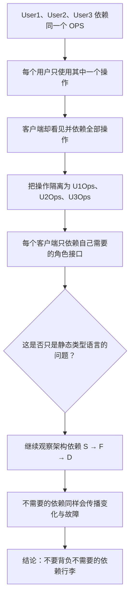
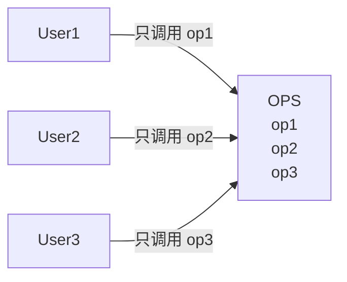
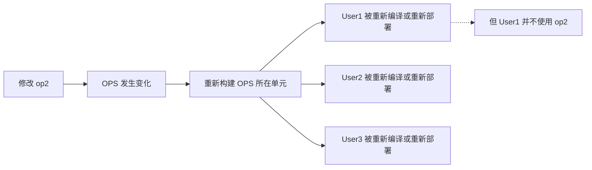
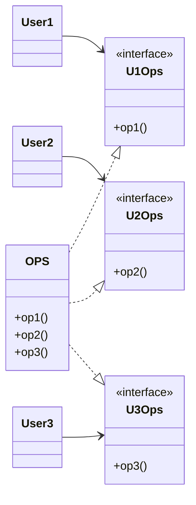
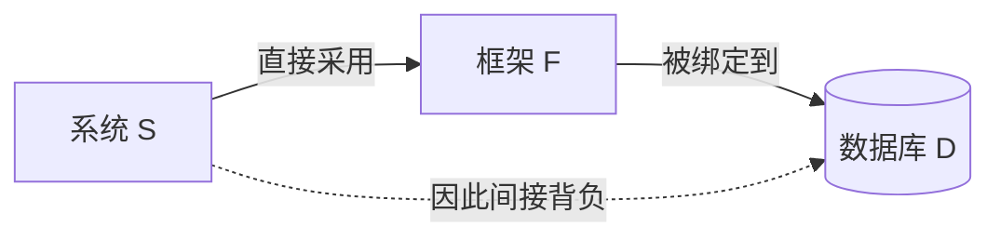

> 原书：Robert C. Martin, *Clean Architecture: A Craftsman's Guide to Software Structure and Design* 
> 本章：Chapter 10, ISP: The Interface Segregation Principle 
> 原文参考：Clean Architecture.md

## 本章导读

接口隔离原则（Interface Segregation Principle，ISP）常被概括为：

> **不应强迫客户端依赖它不使用的方法。**

这句话容易让人把 ISP 理解成一条接口书写技巧，例如“每个接口只能放一个方法”或“接口越小越好”。但本章真正关心的不是方法数量，而是**依赖是否与使用者的真实需要相匹配**。

一个客户端只需要某个模块的一小部分能力，却被迫依赖整个模块，会出现三类问题：

- 无关变化也可能影响它；
- 无关组件也可能进入它的构建与部署链；
- 无关功能的故障也可能沿依赖链传播到它。

因此，ISP 可以先从代码层理解，再提升到架构层：

本章很短，论证却有清晰的三层递进：

1. 从 `OPS` 类解释接口为什么要按客户端需要隔离；
2. 比较静态类型语言和动态类型语言中的表现差异；
3. 用系统 `S`、框架 `F`、数据库 `D` 说明 ISP 为什么也是架构原则。

阅读时应抓住一个核心问题：

> **当某个依赖发生变化或故障时，当前客户端是否会因为自己根本不用的部分而受到影响？**

如果答案是“会”，这个依赖边界就值得重新审视。

## 1. 从 OPS 案例理解 ISP

### 1.1 原书场景
> **原书图示**：Figure 10.1：多个用户共同依赖 OPS
原书首先给出一个简单场景：

- `OPS` 提供 `op1`、`op2`、`op3` 三个操作；
- `User1` 只调用 `op1`；
- `User2` 只调用 `op2`；
- `User3` 只调用 `op3`。

从运行行为看，三个用户各取所需，似乎没有问题。

从源代码依赖看，情况不同。若 `OPS` 是 Java 之类静态类型语言中的一个类，`User1` 为了调用 `op1`，必须依赖 `OPS` 的声明。这个声明同时包含 `op2` 和 `op3`，于是 `User1` 无意间也被它们所在的类型边界影响。

### 1.2 “使用”与“依赖”不是一回事

理解 ISP 的第一步，是区分两个经常混在一起的概念。

**使用某个操作**，指客户端在业务流程中实际调用它。

**依赖某个声明或模块**，指客户端需要知道、引用、编译、链接、加载或部署它，才能完成自己的工作。

在原书案例中：

| 客户端 | 实际使用 | 通过 `OPS` 看见的能力 |
| --- | --- | --- |
| `User1` | `op1` | `op1`、`op2`、`op3` |
| `User2` | `op2` | `op1`、`op2`、`op3` |
| `User3` | `op3` | `op1`、`op2`、`op3` |

问题不在于 `User1` 会误调用 `op2`，而在于它的依赖边界比实际需要更宽。

可以把这种情况想成一张门禁卡：一个员工只需要进入一间办公室，公司却只能给他一张打开整栋楼所有房间的卡。即使他从不进入其他房间，权限变更、审计和安全风险仍然会把那些房间与他联系起来。

### 1.3 无意依赖如何产生影响

假设维护者只修改了 `op2`，而 `User1` 从来不调用它。

如果三个操作仍属于同一个源码、构建或发布单元，影响可能这样传播：

原书强调的就是这种不必要的重编译和重部署：`User1` 所关心的行为没有变化，它却仍被卷入变化。

具体影响取决于语言、编译器、构建工具和部署方式。某些实现细节变化未必真的让所有客户端重新编译。但这不改变本章的判断标准：**当多个不相关能力被绑在同一依赖边界中时，它们更容易共享变化影响面。**

### 1.4 真正的问题是边界过宽

`OPS` 本身拥有三个操作并不是错误。一个实现对象完全可以同时完成多项工作。

问题在于：

- `User1` 面向的是整个 `OPS`，而不是自己需要的角色；
- `User2` 和 `User3` 也面向同一个宽边界；
- 客户端需求虽然不同，依赖形状却完全相同。

这会把本来可以独立变化的客户端绑定在一起。

因此，ISP 不是要求“一个类只能有一个方法”，也不是要求“一个实现只能承担一种能力”。它要求的是：

> **客户端看到的接口，应尽量只包含该客户端完成工作所需的能力。**

### 1.5 “客户端”不一定是最终用户

这里的 Client 不是网页访客或购买软件的人，而是**使用某个接口的代码一方**。

它可以是：

- 一个类；
- 一个用例服务；
- 一个组件；
- 一个命令行程序；
- 一个微服务；
- 一个插件；
- 一个通过 API 调用服务的外部系统。

同一个实现面对不同客户端时，可能需要提供不同的接口视图。这正是接口隔离发生的地方。

### 1.6 常见症状

在真实项目中，以下现象经常暗示接口过宽：

- 客户端只调用接口中的一两个方法；
- 测试替身必须实现大量空方法；
- 实现类对某些方法抛出“不支持”异常；
- 修改一个边缘功能会触发大量无关模块重新构建；
- 一个 DTO 为不同客户端塞入许多互不相关字段；
- 权限系统只能把整组能力一起授予；
- 一个服务升级时，许多不使用新功能的消费者也必须同步升级；
- 引入一个简单功能，却被迫安装一整套大型 SDK。

这些只是线索，不是自动定罪。还要继续检查客户端是否真的具有不同的使用模式和变化节奏。

## 2. 用角色接口隔离操作

### 2.1 原书的解决方案
> **原书图示**：Figure 10.2：隔离后的操作
原书把三个操作分别放入三个接口：

- `U1Ops` 只向 `User1` 提供 `op1`；
- `U2Ops` 只向 `User2` 提供 `op2`；
- `U3Ops` 只向 `User3` 提供 `op3`；
- `OPS` 同时实现这三个接口。

隔离后，`User1` 的源代码只需要知道 `U1Ops` 和 `op1`。`OPS` 中与 `op2`、`op3` 有关的变化，不再必然改变 `User1` 所依赖的接口。

### 2.2 隔离的是视图，不一定是实现

图中仍然只有一个 `OPS` 实现。ISP 并没有要求把它强行拆成三个类或三个进程。

变化发生在客户端看到的边界：

| 观察角度 | 隔离前 | 隔离后 |
| --- | --- | --- |
| `User1` 看见什么 | 整个 `OPS` | `U1Ops` |
| `User2` 看见什么 | 整个 `OPS` | `U2Ops` |
| `User3` 看见什么 | 整个 `OPS` | `U3Ops` |
| 实现需要几份 | 一份也可以 | 一份也可以 |
| 主要收益 | 无关能力相互牵连 | 客户端依赖与需要更匹配 |

同一个对象可以通过不同接口被不同客户端使用。接口隔离减少的是暴露面和依赖面，不是制造重复实现。

### 2.3 接口应围绕客户端角色形成

`U1Ops`、`U2Ops`、`U3Ops` 是原书用于讲解的占位名称。真实项目中，更好的名字通常来自客户端承担的业务角色，例如：

- `OrderReader`；
- `OrderApprover`；
- `RefundIssuer`；
- `ReportExporter`。

这种接口常被称为 Role Interface（角色接口）：它描述“某个协作者为了完成这个角色需要什么”，而不是罗列“实现对象一共会什么”。

设计时可以反过来问：

1. 当前客户端在完成什么用例？
2. 它需要调用哪些操作？
3. 这些操作是否经常一起变化？
4. 其他客户端是否具有不同的使用组合？
5. 能否用一个有业务含义的角色名称概括这组操作？

接口由消费方的需要塑形，通常比由实现类的全部能力反推一个大接口更稳定。

### 2.4 不要机械地“一方法一接口”

ISP 并不规定接口最多只能有一个方法。

假设 `User1` 完成一个业务流程时总是需要 `op1` 和 `op3`，而且二者由同一个团队、同一原因一起变化。那么一个同时包含这两个操作的角色接口可能最自然。

判断接口粒度时，应观察使用模式：

| 情况 | 更合适的选择 |
| --- | --- |
| 多个客户端总是共同使用全部操作 | 保持一个接口即可 |
| 客户端使用的操作集合明显不同 | 按角色拆分接口 |
| 某些操作一起使用、一起变化 | 放在同一角色接口中 |
| 只有实现内部觉得目录更整齐 | 不足以成为拆分理由 |
| 每个方法都被机械拆成独立接口 | 很可能过度设计 |

接口的目标不是尽可能小，而是**足够内聚，且对目标客户端没有明显多余内容**。

### 2.5 客户端专用不等于只能有一个客户端

“按客户端划分”不是说每个调用类都必须拥有一个独占接口。

如果多个客户端扮演同一种角色、使用同一组能力，它们可以共享一个接口。例如，后台任务和管理页面都只需要读取订单，就可以共同依赖 `OrderReader`。

更准确的说法是：

> **按客户端角色和使用模式划分接口，而不是按客户端实例数量划分。**

### 2.6 接口放在哪里

在 Clean Architecture 的语境中，接口通常应靠近需要它的一方，尤其当它承担依赖反转边界时。

原因是：

- 客户端最清楚自己需要什么；
- 实现不应把全部能力强加给客户端；
- 实现细节变化时，客户端的角色接口可以保持稳定；
- 外层实现可以依赖并实现内层定义的抽象。

这与第 8 章 OCP 的方向性控制相呼应：抽象不仅隐藏实现，还决定变化应该朝哪个方向传播。

不过，接口的物理位置仍要服从项目的模块规则。关键不是某个固定目录，而是谁拥有契约、谁因谁而变化。

### 2.7 接口隔离的成本

拆分接口会带来实际成本：

- 类型和文件数量增加；
- 导航时多经过一层抽象；
- 公共接口需要独立版本管理；
- 客户端需求尚不稳定时，接口可能频繁调整；
- 过细拆分会让对象装配和测试变得琐碎。

因此，不要在没有真实客户端差异时预先制造大量接口。更稳妥的做法是：先观察使用者，再在依赖边界明显过宽时拆分。

### 2.8 如何判断拆分是否值得

可以综合考虑以下问题：

- 不同客户端是否只使用明显不同的操作子集？
- 这些客户端是否独立构建、发布或部署？
- 接口中不同部分是否由不同原因、不同团队改变？
- 无关变化是否已经造成构建、测试或发布成本？
- 是否需要为权限、安全或测试建立更窄的能力边界？
- 新接口带来的维护成本是否低于耦合成本？

若客户端始终一起发布、共同使用全部能力，而且接口很稳定，拆分的收益可能很小。

## 3. ISP and Language：语言如何改变问题的表现

### 3.1 作者为什么讨论语言

原书在给出 `U1Ops` 等接口后，主动提出一个疑问：前面的论证明显依赖语言类型。

如果不讨论这一点，读者很容易把 ISP 当成 Java 编译机制的局部补丁。作者因此先比较静态类型语言和动态类型语言，再把问题提升到架构层。

### 3.2 静态类型语言中的源码依赖

在 Java 一类静态类型语言中，程序员需要创建类型声明，客户端必须导入、引用或包含这些声明。编译器据此检查：

- 方法是否存在；
- 参数和返回类型是否匹配；
- 访问权限是否合法；
- 实现是否满足接口约定。

这些声明形成明确的源码依赖。若客户端引用一个宽接口，它的编译边界也会接触到更多声明。

C++ 的头文件包含、Java 的类和接口引用、C# 的程序集引用，具体机制并不完全相同，但都能看到同一个现象：类型边界越宽，潜在编译影响面通常越大。

接口隔离让编译器只看见客户端真正需要的契约，也让构建系统更有机会缩小受影响范围。

### 3.3 动态类型语言中的运行时约定

原书以 Ruby 和 Python 为例。动态类型语言通常不要求客户端在源码中声明参数必须是某个具体接口类型。客户端调用 `op1` 时，运行时再判断传入对象是否支持该操作。

因此，`User1` 可以只表达“我要调用 `op1`”，而不必引用一个同时声明 `op2`、`op3` 的静态类型。这减少了由类型声明造成的源码依赖，也避免了一部分强制重编译和重部署。

作者据此认为，动态类型语言能够建立更灵活、耦合更松的系统。这句话应结合本节上下文理解：它重点讨论的是**由静态声明引起的源码耦合**。

### 3.4 动态类型不会消除所有依赖

动态语言没有某种静态声明，不等于客户端完全没有契约。

`User1` 仍然依赖以下事实：

- 运行时对象提供 `op1`；
- `op1` 接受约定的输入；
- 返回值和副作用符合预期；
- 提供该对象的模块能够被加载；
- 相关软件包和运行环境能够正确部署。

如果 `op1` 被删除或改变语义，问题只是从编译阶段移到了运行阶段。

动态语言也可能引入大型软件包、绑定特定数据库、共享故障进程。这些架构依赖不会因为缺少静态接口声明而消失。

### 3.5 静态与动态的差别应如何掌握

| 观察维度 | 静态类型语言 | 动态类型语言 |
| --- | --- | --- |
| 契约主要何时检查 | 编译期 | 运行期 |
| 是否通常需要显式类型声明 | 是 | 不一定 |
| 宽声明是否容易扩大源码依赖 | 是 | 这类影响较弱 |
| 是否仍有行为契约 | 有 | 有 |
| 是否仍可能携带传递依赖 | 会 | 会 |
| 是否仍需要 ISP 的架构思想 | 需要 | 需要 |

不必把本节读成静态类型与动态类型的优劣争论。更有用的结论是：

- 语言机制决定依赖在代码层如何显现；
- 构建和部署方式决定变化如何传播；
- 模块边界决定客户端背负多少内容；
- 无论使用哪种语言，都应让依赖与实际需要相称。

### 3.6 现代类型工具不会改变原则

今天的语言边界比“纯静态”和“纯动态”更丰富：

- 动态语言可以使用类型注解和静态检查器；
- 静态语言可以使用结构化类型或类型推断；
- 模块系统可以控制哪些声明对外可见；
- 独立编译和增量构建可以减少重编译成本。

这些工具会改变 ISP 的实现方式，却不会改变它提出的问题：客户端是否依赖了超出自己需要的能力和模块。

## 4. ISP and Architecture：从接口扩大到系统

### 4.1 根本动机

原书接着“退一步”观察 ISP，得到更深层的结论：

> **依赖包含了超出自身需要内容的模块，通常是有害的。**

在源码层，多余内容可能导致无关的重编译和重部署；在架构层，多余内容还可能引入传递依赖、版本约束、运维成本和故障传播。

这也是为什么 ISP 不能只被理解成接口关键字的使用规范。

### 4.2 S、F、D 案例
> **原书图示**：Figure 10.3：一个有问题的架构
原书给出三个角色：

- `S`：架构师正在开发的系统；
- `F`：系统希望采用的框架；
- `D`：框架作者绑定的某个特定数据库。

依赖关系如下：

系统 `S` 主动选择的是 `F`，但因为 `F` 与 `D` 绑定，`S` 也被迫接受 `D`。

这就是传递依赖：你没有直接选择某个组件，却因为依赖链中的上游选择而受到它影响。

### 4.3 什么是架构中的“多余行李”

假设 `F` 只使用 `D` 的少量能力，`S` 更不关心 `D` 的其他特性。那些未使用特性仍可能随着数据库整体进入依赖链。

“行李”可能包括：

| 类型 | 可能带来的影响 |
| --- | --- |
| 未使用的数据库特性 | 升级、配置和兼容成本 |
| 额外驱动与库 | 构建体积、版本冲突 |
| 特定部署方式 | 平台和运维约束 |
| 安全漏洞 | 即使功能未主动使用，也可能需要修补 |
| 许可证条件 | 分发和合规风险 |
| 后台进程与资源占用 | 启动、内存和监控成本 |
| 共享故障点 | 下游异常可能沿链路传播 |

并非每个未使用功能都会立刻造成事故。ISP 提醒的是：一旦它们与所需功能处在同一变化、发布或故障边界内，你就可能为不需要的东西承担成本。

### 4.4 第一类后果：变化与重部署传播

原书首先指出：`D` 中某个 `F` 不使用的特性发生变化，也可能迫使整个 `D` 升级。随后：

1. `F` 需要适配或重新部署；
2. `S` 又因为依赖 `F` 而重新部署；
3. `S` 的业务能力没有变化，却承担了完整发布风险。

传播路径是：

这与 `op2` 变化牵连 `User1` 是同一种结构，只是依赖单位从方法和类变成了框架与数据库。

### 4.5 第二类后果：故障传播

原书随后给出更严重的情况：`D` 中某个无关特性的故障，可能导致 `F` 故障，继而导致 `S` 故障。

这不是说所有数据库功能都会互相拖垮，而是说当它们共享以下资源时，隔离不足会扩大故障范围：

- 同一个进程；
- 同一组连接池；
- 同一个存储实例；
- 同一份配置；
- 同一条启动路径；
- 同一发布单元。

例如，`F` 只需要普通查询，但 `D` 的某个管理扩展导致数据库实例无法启动。对 `S` 来说，该扩展毫无业务价值，却仍然通过共享故障边界影响核心功能。

这揭示了一个重要区别：

- 窄接口可以减少源码和契约暴露；
- 独立部署可以减少变化传播；
- 进程、实例、超时、熔断和降级才用于限制运行时故障传播。

ISP 帮助架构师发现“多余行李”，但不同类型的耦合需要不同隔离手段。

### 4.6 架构级 ISP 不等于包装一个接口

面对 `F → D`，为 `F` 包一层窄接口可能让系统代码更干净，却不一定真正移除 `D`：

- `D` 仍可能必须安装；
- `F` 仍可能在启动时加载它；
- 版本约束仍可能存在；
- 安全修补仍然不能忽略；
- 故障仍可能通过同一进程传播。

因此，要先确认想隔离的是哪一种影响：

| 想解决的问题 | 常见手段 |
| --- | --- |
| 客户端看见太多方法 | 角色接口 |
| 业务代码直接依赖第三方 API | Adapter 或防腐层 |
| 构建被大量头文件或模块牵连 | 模块拆分、独立编译、稳定接口 |
| 发布必须同步进行 | 独立版本与部署单元 |
| 运行时故障相互传播 | 进程或实例隔离、超时、熔断、降级 |
| 第三方绑定无法接受 | 替换框架、贡献解耦改造或自行维护分支 |

“接口隔离”在架构上是一种目标，不是只有一种实现技术。

### 4.7 选型时就检查依赖行李

许多架构负担不是编码时产生的，而是在选择框架、SDK 或平台时被带入系统。

选型前应检查：

- 它是否绑定某个数据库、消息队列或云厂商？
- 最小安装是否仍要加载大量不用的模块？
- 传递依赖由谁维护，升级频率如何？
- 能否替换底层实现，还是只有名义上的抽象？
- 未使用模块出现安全漏洞时是否仍需升级？
- 核心功能与可选功能是否共享故障边界？
- 能否独立测试、发布、回滚和降级？
- 许可证与运行平台是否符合系统约束？

一个功能强大的框架未必是坏选择。关键在于系统是否愿意承担它携带的全部约束。

### 4.8 不要把所有传递依赖都视为错误

架构不可能没有传递依赖。复用框架的价值，本来就来自接受别人已经完成的能力。

更合理的判断是：

- 这些附带能力是否与核心需求相符？
- 依赖是否稳定且维护良好？
- 变化是否会越过不必要的边界？
- 故障是否被限制在可接受范围？
- 替换成本是否符合系统生命周期？

ISP 反对的是**不加判断地依赖不需要的内容**，不是反对一切复用或大型组件。

## 5. Conclusion：不要背负不需要的行李

### 5.1 原书结论

本章最后一句可以作为 ISP 的架构级记忆点：

> **依赖某个携带了你不需要的行李的东西，可能带来意料之外的麻烦。**

“行李”并不只是多占一点磁盘空间。它代表客户端没有主动需要，却不得不共同承担的：

- 变化；
- 构建；
- 部署；
- 版本；
- 故障；
- 安全；
- 合规；
- 运维。

ISP 的目标是让依赖关系更诚实：需要什么，就依赖什么；不需要什么，就尽量不要让它进入自己的变化和故障边界。

### 5.2 与 CRP 的联系

原书说明，第 13 章讨论 Common Reuse Principle（共同复用原则，CRP）时会进一步展开这个思想。

CRP 可以通俗地理解为：

> **不要强迫一个组件的使用者依赖它不需要复用的类。**

二者的关系是：

| 原则 | 主要粒度 | 关注的问题 |
| --- | --- | --- |
| ISP | 方法与接口 | 客户端是否被迫依赖不用的方法 |
| CRP | 类与组件 | 组件使用者是否被迫依赖不用的类 |

在 `OPS` 案例中，多余行李是接口里的方法；在组件设计中，多余行李可能是整个类、第三方库或发布单元。

共同思想始终是：**一起复用的东西才适合放在同一个复用边界中。**

### 5.3 与其他 SOLID 原则的关系

ISP 与其他原则互相配合，但解决的问题不同：

| 原则 | 核心问题 |
| --- | --- |
| SRP | 这个模块会因哪些角色或原因而变化？ |
| OCP | 新需求能否通过扩展完成，而少改稳定代码？ |
| LSP | 实现能否遵守共同契约并被安全替换？ |
| ISP | 客户端是否被迫依赖自己不用的内容？ |
| DIP | 源码依赖是否指向高层策略所拥有的抽象？ |

一个接口可能符合 ISP，却违反 LSP：接口很窄，但某个实现不遵守行为契约。

一个接口也可能符合 DIP，却违反 ISP：客户端依赖的是抽象，但这个抽象包含大量无关方法。

因此，“已经用了接口”并不能自动证明设计良好。

### 5.4 本章的完整思路

可以用以下顺序复述作者的论证：

1. `User1`、`User2`、`User3` 各自只使用 `OPS` 的一个操作；
2. 在静态类型语言中，它们仍可能依赖整个 `OPS` 声明；
3. 无关操作的变化因此可能引发不必要的重编译和重部署；
4. 将操作隔离到 `U1Ops`、`U2Ops`、`U3Ops` 后，客户端只依赖所需角色；
5. 动态类型语言没有同样的显式声明依赖，问题表现不同；
6. 但“依赖超出所需内容的模块有害”并不受语言限制；
7. `S → F → D` 表明架构中的多余依赖会传播变化，甚至传播故障；
8. 所以 ISP 最终是在控制依赖边界，而不只是控制接口方法数量。

## 6. 把 ISP 用到实际设计中

### 6.1 第一步：列出客户端与操作

不要从“这个类有哪些方法”开始拆接口，先列出“谁在使用哪些能力”。

以原书案例为例：

| 客户端角色 | `op1` | `op2` | `op3` |
| --- | --- | --- | --- |
| `User1` | 使用 | 不使用 | 不使用 |
| `User2` | 不使用 | 使用 | 不使用 |
| `User3` | 不使用 | 不使用 | 使用 |

这张表显示出三个完全不同的使用模式，因此拆成三个角色接口很自然。

如果所有行都完全相同，说明所有客户端都使用同一组操作，拆分价值通常不大。

### 6.2 第二步：确认真实边界

接着确认客户端之间是否真的需要隔离：

- 是否由不同团队维护？
- 是否独立编译和测试？
- 是否独立发布或部署？
- 是否有不同权限？
- 是否有不同稳定性要求？
- 是否会在不同时间发生变化？

仅仅看到调用方法不同还不够。若所有代码都很小、始终一起变化和发布，增加接口可能只是形式负担。

### 6.3 第三步：定义角色接口

为每种稳定的使用模式定义一个可解释的角色：

- 名称表达业务能力，不照搬实现类名称；
- 只放入完成该角色所需的操作；
- 保持行为契约清楚；
- 不预先加入“以后也许会用”的方法；
- 不让实现内部结构决定客户端接口。

接口应让读者一眼看出客户端被授权做什么。

### 6.4 第四步：让实现适配多个角色

实现可以同时提供多个角色接口。这样既复用实现，又不把全部能力暴露给每个客户端。

要检查依赖方向：

- 客户端依赖角色接口；
- 实现依赖并实现角色接口；
- 客户端不需要知道具体实现的全部能力；
- 组合根或工厂负责把实现交给客户端。

这一步与依赖反转经常一起出现。

### 6.5 第五步：验证变化是否被限制

接口拆分后，不要只看类图是否漂亮，还要用真实变化验证：

- 修改 `op2` 是否还会影响 `User1` 的编译？
- `U2Ops` 升级时，`User1` 是否需要同步发布？
- 测试 `User1` 时，替身是否只需提供 `op1`？
- 权限配置是否能只授予 `op1`？
- 实现替换时，各角色契约是否仍成立？

只有影响面确实缩小，隔离才产生了价值。

### 6.6 第六步：继续检查运行时边界

源码接口变窄后，还要追踪架构依赖：

- 实现是否仍加载整套第三方 SDK？
- 可选模块故障是否会阻止核心模块启动？
- 共享连接池是否让无关功能互相拖累？
- 第三方升级是否仍迫使所有服务一起发布？
- 安全漏洞是否来自从未使用却必须安装的模块？

不要把“代码看起来解耦”误当成“构建、部署和故障都已解耦”。

### 6.7 示例：订单仓储接口

假设一个宽接口同时提供：

- 查询订单；
- 保存订单；
- 删除订单；
- 批量导出；
- 重建索引；
- 清理历史数据。

不同客户端的需要可能是：

| 客户端 | 真正需要的能力 |
| --- | --- |
| 订单详情页 | 查询 |
| 下单用例 | 查询、保存 |
| 合规导出任务 | 查询、批量导出 |
| 运维工具 | 重建索引、清理历史数据 |

若所有客户端都依赖同一个“全能仓储接口”，详情页测试可能被迫处理删除、导出和运维操作。更合理的做法是围绕读取、下单、合规和运维角色建立接口。

但也不要只按方法名称机械分组。下单用例需要查询和保存共同完成业务，应给它一个完整、内聚的角色契约。

### 6.8 示例：第三方云 SDK

一个服务只需要对象存储上传功能，却直接依赖某云厂商的全量 SDK。该 SDK 还带来数据库、消息、监控和管理模块。

可以分层处理：

1. 在业务代码前定义仅包含上传能力的端口；
2. 用 Adapter 把该端口映射到厂商 SDK；
3. 检查能否只安装对象存储子模块；
4. 把厂商配置限制在外层；
5. 评估 SDK 升级、安全公告和故障对服务的真实影响。

第一步解决业务源码的依赖表面，后几步才继续减少构建、部署和运维行李。

### 6.9 示例：什么时候不必拆

某个内部批处理程序只有一个客户端，该客户端确实依次使用接口中的全部五个操作。程序与实现始终一起构建和发布，接口也很稳定。

此时把五个操作拆成五个接口不会隔离任何真实变化，反而增加装配和导航成本。保留一个内聚接口更简单。

ISP 不是追求接口数量，而是避免强迫依赖。

## 7. 易混淆概念与常见误解

### 7.1 “ISP 就是接口要小”

不准确。接口可以有很多方法，只要目标客户端确实需要它们。ISP 关注需要与依赖是否匹配，而不是规定方法上限。

### 7.2 “每个方法都应该有一个接口”

错误。机械拆分会产生大量没有业务含义的接口。应按客户端角色和稳定的使用组合划分。

### 7.3 “实现类也必须拆成很多类”

错误。一个实现可以同时实现多个窄接口。接口隔离首先隔离的是客户端视图。

### 7.4 “只要依赖抽象就符合 ISP”

错误。一个抽象接口也可能非常宽。DIP 关心依赖方向，ISP 关心客户端依赖多少内容。

### 7.5 “动态类型语言不需要 ISP”

错误。它们减少了某类显式源码声明依赖，但仍有运行时契约、软件包依赖、部署依赖和故障传播。

### 7.6 “ISP 只优化编译速度”

错误。重编译只是原书最先展示的现象。架构层还涉及重部署、版本约束、安全风险和故障传播。

### 7.7 “接口必须由实现方统一定义”

不一定。若实现方按全部能力定义接口，客户端往往会被迫看见太多内容。角色接口通常更应反映消费方需要。

### 7.8 “客户端不同，就必须各建一个接口”

错误。多个客户端使用同一组能力时，可以共享同一个角色接口。划分依据是使用模式，不是对象数量。

### 7.9 “加入 Adapter 就消除了所有行李”

错误。Adapter 可以隔离第三方 API 形状，却未必移除安装、版本、许可证、资源和故障依赖。

### 7.10 “任何传递依赖都违反 ISP”

错误。复用必然带来依赖。应评估附带内容是否可接受、变化和故障是否被控制，而不是追求零依赖。

### 7.11 “未使用代码不会执行，所以没有风险”

不一定。未主动调用的模块仍可能在启动时加载、共享资源、触发安全修补或限制版本选择。

### 7.12 “拆得越早越安全”

不一定。客户端需求尚未形成时，过早抽象容易猜错角色。先观察真实使用模式，再建立稳定边界通常更可靠。

### 7.13 “ISP 与 SRP 是同一原则”

二者相关但不同。SRP 从变化来源判断模块对谁负责；ISP 从消费方判断客户端被迫依赖什么。一个模块可以只有一个变化来源，却仍向不同客户端暴露过多方法。

### 7.14 “接口隔离后就不需要 LSP”

错误。窄接口仍需要正确实现。若 `OPS` 的 `op1` 不遵守 `U1Ops` 的行为契约，`User1` 仍会出错。

## 8. 实践检查与掌握练习

### 8.1 代码级检查清单

- 客户端实际调用接口中的哪些方法？
- 是否有大量方法从未被某些客户端使用？
- 测试替身是否被迫实现无关操作？
- 实现是否对部分方法返回“不支持”？
- 不同客户端是否存在稳定、清晰的角色？
- 接口名称描述业务角色，还是复制实现名称？
- 无关方法变化是否扩大编译、测试或发布范围？
- 拆分后是否真的缩小了影响面？

### 8.2 架构级检查清单

- 当前依赖直接带来了哪些传递依赖？
- 哪些能力是系统真正使用的？
- 哪些模块只是被框架强制带入？
- 无关模块升级时，系统是否必须重新部署？
- 无关模块故障时，核心功能是否会一起失败？
- 核心与可选能力是否共享进程、实例或资源池？
- 是否能按需安装、独立升级和独立回滚？
- 安全、许可证与平台约束是否已计入选型？
- Adapter 只隔离了 API，还是也隔离了部署和故障？

### 8.3 场景判断一：宽接口但没有多余方法

某个接口有十个方法，三个客户端都稳定地使用全部十个方法。

**判断：** 不能只因方法多就认定违反 ISP。若这些操作共同构成一个内聚角色，一个接口可能正合适。

### 8.4 场景判断二：动态语言中的大型 SDK

Python 服务只调用某 SDK 的一个上传函数，但部署时必须安装整套 SDK，并加载大量插件。

**判断：** 它可能没有原书所说的静态声明问题，却仍背负架构级行李。应检查是否有轻量子包，并用端口隔离业务代码与厂商 API。

### 8.5 场景判断三：接口已拆，故障仍传播

系统通过一个很窄的存储接口使用框架，框架内部仍与数据库运行在同一进程。数据库扩展故障后，系统整体退出。

**判断：** 源码接口已经隔离，运行时故障域却没有隔离。需要进程、实例或降级机制，而不是继续拆方法。

### 8.6 场景判断四：两个客户端使用不同方法

两个小型客户端使用同一接口的不同方法，但它们由同一团队维护、始终一起发布，接口几年没有变化。

**判断：** 存在拆分可能，但收益未必大。应比较真实变化成本与新增抽象成本，不必为了形式立即拆分。

### 8.7 场景判断五：实现抛出“不支持”

某个实现只支持接口中的三个方法，对其余七个方法都抛出“不支持”。

**判断：** 这是强烈信号。共同接口很可能描述了多个角色，应拆出实现真正支持且客户端真正需要的契约，同时再用 LSP 检查替换性。

### 8.8 快速复述练习

能够回答以下问题，基本就掌握了本章：

1. `User1` 为什么会受到 `op2` 变化影响？
2. `U1Ops` 如何缩小这种影响？
3. 为什么 ISP 不是“一方法一接口”？
4. 静态与动态类型语言中的差异是什么？
5. 动态语言为什么仍然需要架构级 ISP？
6. `S → F → D` 中，`S` 背负了什么？
7. 变化传播与故障传播分别要怎样隔离？
8. ISP 与 CRP 有什么共同思想？

### 8.9 一分钟记忆卡

- **原则：** 客户端不应依赖自己不使用的内容。
- **起点：** `User1/User2/User3` 各自只使用 `OPS` 的一个操作。
- **做法：** 提供 `U1Ops/U2Ops/U3Ops` 等角色接口。
- **粒度：** 由客户端使用模式决定，不由方法数量决定。
- **语言：** 静态类型使源码依赖更显式，动态类型不会消除运行时和架构依赖。
- **架构：** `S` 依赖 `F`，`F` 绑定 `D`，于是 `S` 背负 `D` 的变化与故障风险。
- **结论：** 不要让不需要的行李进入自己的变化、部署和故障边界。
- **后续：** 第 13 章 CRP 会把同一思想应用到组件复用。

## 本章总结

1. ISP 的常见表述是：不应强迫客户端依赖它不使用的方法。
2. ISP 关心依赖是否与客户端需要匹配，不是单纯追求更少的方法。
3. 原书的 `OPS` 提供 `op1`、`op2`、`op3`，三个 User 各自只使用一个操作。
4. 在静态类型语言中，客户端为了使用一个方法，可能仍需依赖包含全部方法的类型声明。
5. 因此，无关操作的变化可能引发客户端不必要的重编译和重部署。
6. 真正的问题不是 `OPS` 会做很多事，而是每个客户端都被迫面向它的全部能力。
7. 原书用 `U1Ops`、`U2Ops`、`U3Ops` 为三个客户端提供不同接口视图。
8. `OPS` 可以同时实现三个接口，不需要复制三份实现。
9. 接口隔离的是客户端看到和依赖的表面，不一定要求拆分实现类。
10. 接口应围绕客户端角色和稳定使用模式形成。
11. 多个客户端使用同一组能力时，可以共享一个角色接口。
12. ISP 不要求一方法一接口；目标是足够内聚且没有明显多余内容。
13. 拆分接口也有类型、导航、装配和版本维护成本，应基于真实影响决定。
14. 静态类型语言通过显式声明形成源码依赖，因此代码层的 ISP 更容易观察。
15. 动态类型语言通常在运行时检查对象是否支持所需操作，减少了这类声明依赖。
16. 动态语言仍有行为契约、软件包、部署和故障依赖，因此并不免疫 ISP 问题。
17. 语言机制改变问题的表现形式，不改变“避免依赖多余内容”的根本动机。
18. 架构案例中，系统 `S` 采用框架 `F`，而 `F` 被绑定到数据库 `D`。
19. `S` 因此间接背负 `D`，即使它并不需要 `D` 的大部分能力。
20. `D` 的无关变化可能迫使 `F` 与 `S` 重新验证、升级或部署。
21. `D` 的无关故障也可能通过共享资源和运行边界传播到 `F` 与 `S`。
22. 窄接口、独立部署和故障域隔离解决的是不同层次的问题。
23. Adapter 能隔离第三方 API，但未必移除安装、版本、许可证和运行时风险。
24. 选型时应把传递依赖、升级、故障、安全和平台约束都视为依赖行李。
25. ISP 不反对复用和传递依赖，而是要求理解并控制附带成本。
26. 与 DIP 相比，ISP 关注客户端依赖多少；DIP 关注源码依赖指向哪里。
27. 与 LSP 相比，ISP 关注接口表面；LSP 关注实现是否遵守行为契约。
28. CRP 把同一思想提升到组件层：不要强迫使用者依赖不需要复用的类。
29. 识别 ISP 问题时，应先列出客户端与操作，再确认变化、发布和故障边界。
30. 本章最终的记忆点是：只依赖完成工作真正需要的内容，不要背负无关行李。
