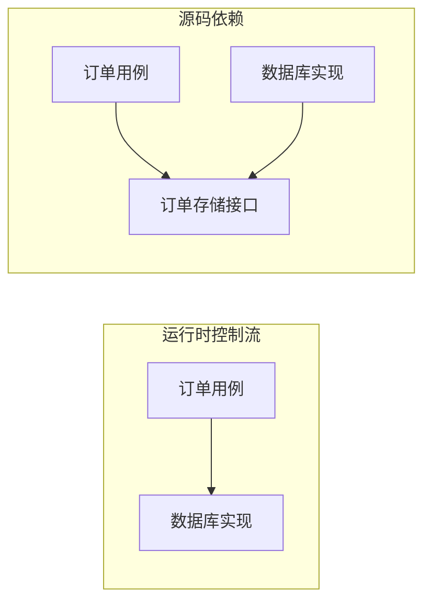
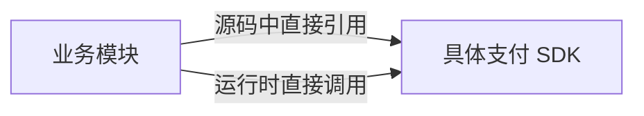
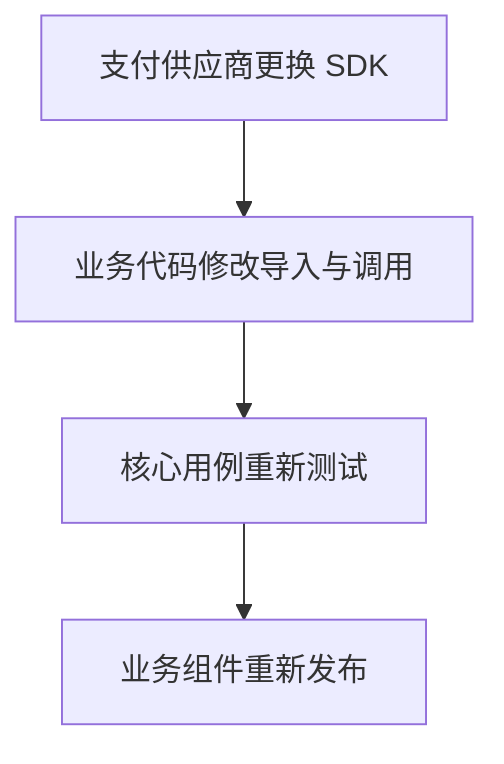
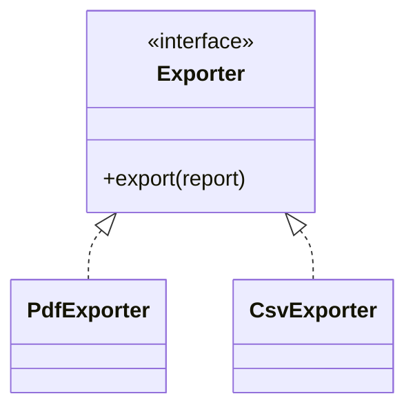
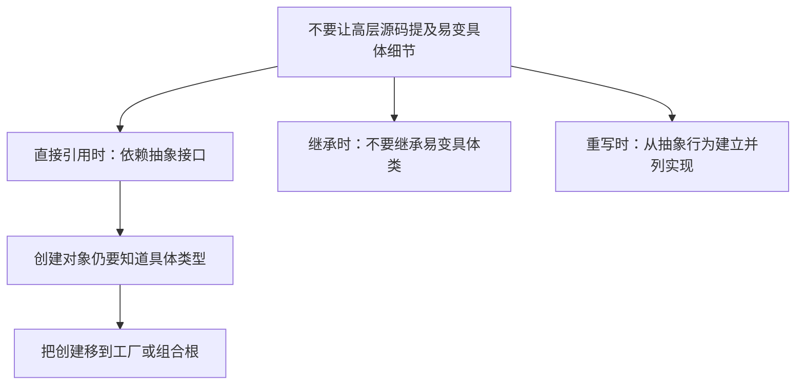
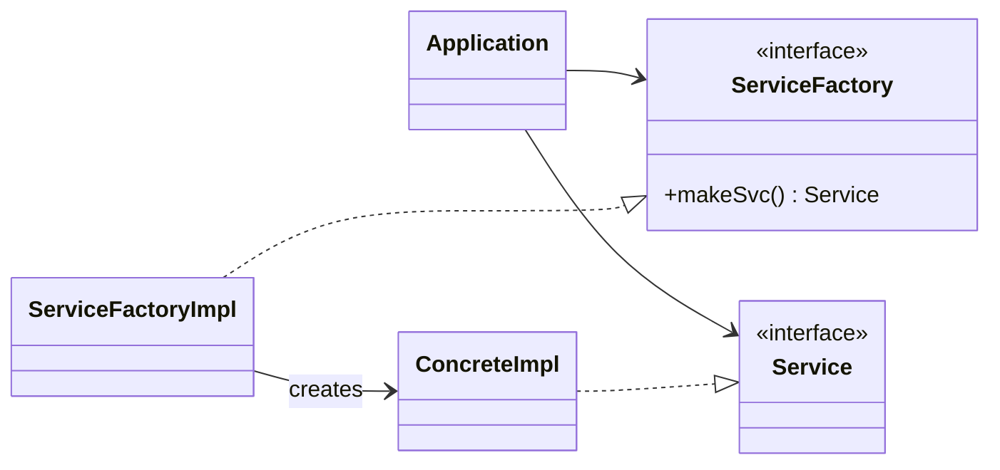
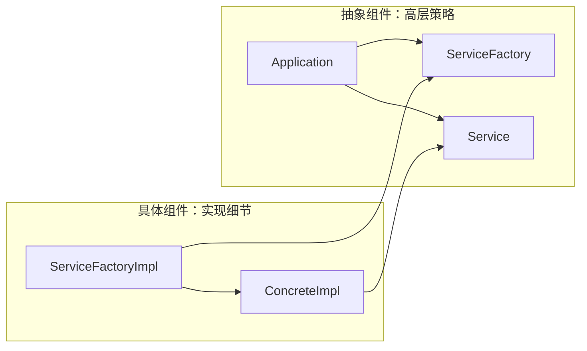
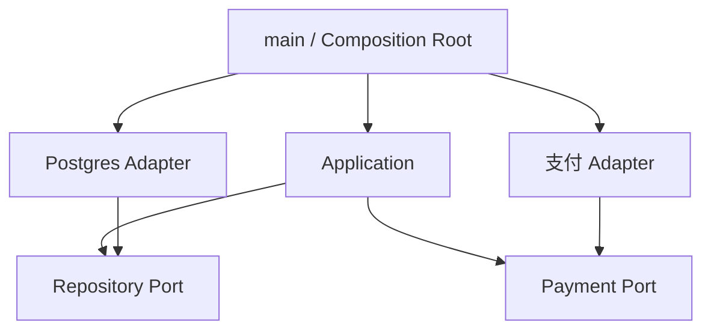
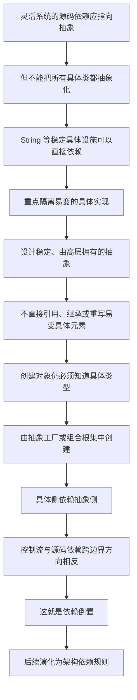

> 原书：Robert C. Martin, *Clean Architecture: A Craftsman's Guide to Software Structure and Design* 
> 本章：Chapter 11, DIP: The Dependency Inversion Principle 
> 原文参考：Clean Architecture.md

## 本章导读
> **原书图示**：Chapter 11 章首页
依赖倒置原则（Dependency Inversion Principle，DIP）是 SOLID 的最后一条原则，也是后续架构章节最重要的基础之一。

原书对 DIP 的表述是：

> **最灵活的系统，其源码依赖只指向抽象，而不指向具体实现。**

这句话首先要解决一个常见误会：DIP 讨论的不是“程序运行时谁调用谁”，而是“源代码中谁知道谁”。

例如，订单用例在运行时必然要调用数据库代码，但订单用例的源代码不一定要导入某个具体数据库驱动。它可以只依赖自己需要的存储接口，由外层代码把数据库实现接进来。

这时，高层业务仍然控制低层细节完成工作，但低层细节的源代码反过来依赖高层定义的抽象。**被倒置的是源码依赖相对于控制流的方向。**

本章按照以下顺序展开：

1. 先给出“依赖抽象，不依赖具体”的原则；
2. 立即用 Java 的 `String` 说明它不能被机械地绝对化；
3. 把真正要防范的对象限定为“易变的具体实现”；
4. 解释为什么稳定抽象适合作为依赖目标；
5. 给出四条具体编码实践；
6. 用抽象工厂处理创建对象时不可避免的具体依赖；
7. 把这些依赖集中到 `main` 等具体组件；
8. 预告后文贯穿 Clean Architecture 的依赖规则。

理解本章时，可以始终追问两个问题：

- 这个模块依赖的是稳定策略，还是易变细节？
- 当细节变化时，高层业务源代码是否也必须跟着变化？

DIP 的目标不是让系统里没有具体实现，而是让具体实现成为可替换、可隔离的细节。

## 1. DIP 的基本含义

### 1.1 什么是源码依赖

源码依赖是从源代码可以观察到的“知道关系”。常见形式包括：

- 导入一个模块；
- 包含一个头文件；
- 引用一个类型名称；
- 调用某个模块中直接实现的函数；
- 继承一个类；
- 实现一个接口；
- 在构造函数中直接创建具体对象；
- 在字段或参数中使用某个类型。

当模块 A 的编译、类型检查或加载需要知道模块 B 的声明时，就可以说 A 的源代码依赖 B。

运行时控制流则回答另一个问题：程序执行时，消息和调用实际从哪里流向哪里。

二者经常方向相同。例如：

在这种结构中，业务模块既调用支付 SDK，又在源码中知道它。SDK 的类名、参数、异常和升级变化容易进入业务模块。

DIP 希望把两种方向分开：业务仍在运行时使用支付能力，但其源码只依赖业务所需的支付抽象。

### 1.2 为什么高层业务不应知道低层细节

高层业务规则表达系统为什么存在，例如：

- 什么订单可以结算；
- 退款需要满足哪些条件；
- 哪些用户可以批准贷款；
- 库存不足时如何处理。

低层细节表达系统如何与外界协作，例如：

- 使用哪种数据库；
- 调用哪家支付服务；
- 通过哪个消息队列发送事件；
- 使用哪个 Web 框架接收请求。

如果高层模块直接依赖这些具体细节，那么细节变化会穿过边界，迫使业务规则一起修改、重新测试和重新部署。

反过来，如果高层模块定义自己需要的稳定接口，供应商变化通常只影响接口外侧的 Adapter。

### 1.3 静态类型语言中的含义

原书说，在 Java 这样的静态类型语言中，`use`、`import`、`include` 等声明应尽量指向：

- 接口；
- 抽象类；
- 其他抽象声明。

例如，一个业务用例不直接导入 `StripePaymentClient`，而依赖 `PaymentGateway`。具体 Adapter 实现该接口，并负责把领域语言翻译成 Stripe SDK 的调用。

编译器仍然能够检查类型，区别只是高层模块知道的是稳定契约，而不是易变供应商。

C++、Java、C# 等语言的编译机制并不相同，但共同点是：只要源码直接出现某个易变具体类型，它就建立了一条变化可能传播的路径。

### 1.4 动态类型语言中的含义

DIP 同样适用于 Ruby、Python 等动态类型语言，只是“抽象模块”和“具体模块”不一定由 `interface` 关键字区分。

原书给出一个实用判断：如果客户端直接导入并调用某个模块中已经实现的函数，那么它就在依赖具体模块。

动态语言可以通过以下方式表达抽象边界：

- 鸭子类型约定；
- Protocol 或抽象基类；
- 回调函数；
- 构造函数传入的协作者；
- 在测试中由替身遵守的行为契约。

关键仍然不是有没有接口语法，而是高层源码是否绑定到某个易变实现。

### 1.5 DIP 不是绝对禁令

原书紧接着指出：把“绝不依赖具体”当成绝对规则并不现实。

Java 的 `String` 是具体类，但没有必要为字符串定义一个 `StringInterface`。同理，项目通常可以直接使用：

- 语言的数字和字符串类型；
- 标准集合；
- 成熟的标准库算法；
- 稳定的平台基础设施；
- 团队能够长期信任的基础值对象。

如果每个具体类外都套一层接口，系统会充满没有隔离价值的转发层。阅读、调试、对象装配和维护都会更困难。

因此，DIP 不能只按“抽象或具体”机械执行，还必须考虑依赖是否易变。

### 1.6 真正应避开的是易变的具体实现

原书把需要重点隔离的对象称为 volatile concrete elements，也就是易变的具体元素。

它们通常包括：

- 团队正在积极开发的实现；
- 需求仍频繁调整的业务外围模块；
- 尚未稳定的第三方 SDK；
- 可能被替换的数据库或消息系统；
- 经常升级且存在破坏性变更的框架；
- 不同部署环境需要不同实现的设施；
- 为测试需要替换的外部资源。

“易变”不仅指提交次数多，也包括变化不受本模块控制、升级代价高或失败风险大。

可以用下表帮助判断：

| 依赖 | 通常是否值得抽象 | 原因 |
| --- | --- | --- |
| Java `String` | 通常不值得 | 具体但高度稳定 |
| 标准容器 | 通常不值得 | 平台基础能力，契约成熟 |
| 项目内正在开发的支付实现 | 值得 | 业务和供应商都可能变化 |
| 第三方数据库驱动 | 跨越业务边界时值得 | 技术类型不应进入核心规则 |
| 只有一行且稳定的纯函数 | 通常不值得 | 抽象成本可能高于变化风险 |
| 当前只有一个实现的外部时钟 | 可能值得 | 测试需要替换时间来源 |

### 1.7 “稳定”是相对于系统而言的

稳定不是某个类永久不变，而是它对当前系统来说足够可靠，变化频率和破坏程度在可接受范围内。

同一个技术在不同项目中可能得到不同判断：

- 一个长期锁定平台版本的内部工具，可以直接依赖平台 API；
- 一个需要跨平台运行的产品，可能要隔离同一 API；
- 一个一次性迁移脚本，可以直接使用数据库驱动；
- 一个计划维护十年的核心业务系统，更需要保护业务规则免受驱动变化。

所以 DIP 不是类型名称扫描器，而是一条架构判断原则。

### 1.8 一个直观例子：支付用例

假设结算用例直接创建某支付公司的客户端，并处理该 SDK 的请求对象、状态码和异常。

这种设计带来几个后果：

- 供应商类型进入业务代码；
- 更换供应商时要修改结算用例；
- 核心测试需要加载或模拟复杂 SDK；
- 支付协议细节可能污染领域语言；
- SDK 升级会扩大回归测试范围。

应用 DIP 后，高层用例只提出自己需要的能力，例如“收取一笔给定订单的款项”。抽象接口属于应用侧，具体 Adapter 负责：

- 创建供应商请求；
- 转换金额与币种；
- 映射错误；
- 记录供应商标识；
- 把结果转换回应用模型。

业务控制流仍会进入支付供应商，但源码依赖不再从核心业务指向供应商。

## 2. Stable Abstractions：为什么依赖稳定抽象

### 2.1 接口通常比实现更稳定

原书给出一个很朴素的观察：

- 接口一旦变化，实现它的类通常都要跟着变化；
- 具体实现发生变化，却不一定要求接口变化。

例如，数据库 Adapter 可以在不改变 `OrderRepository` 的前提下：

- 优化 SQL；
- 增加缓存；
- 修复连接泄漏；
- 调整重试策略；
- 更换 ORM；
- 改变日志记录方式。

只要“保存订单”和“按编号读取订单”的业务契约不变，高层客户端就不需要知道这些调整。

这就是接口适合作为变化缓冲层的原因。

### 2.2 抽象不会自动稳定

接口写出来，并不意味着它天然稳定。

以下接口仍然可能频繁变化：

- 把 SQL 查询对象暴露给业务层；
- 返回某个 Web 框架的响应类型；
- 参数直接使用供应商 SDK 类型；
- 把实现类的每个公开方法原样复制到接口；
- 在需求尚不清楚时提前猜出的“万能接口”。

这些接口虽然语法上抽象，语义上仍然被具体技术牵引。

好的抽象要经过设计，通常具有以下特点：

- 表达客户端意图，而不是实现步骤；
- 使用领域或应用层拥有的数据类型；
- 只包含客户端真正需要的能力；
- 不泄露低层框架对象；
- 允许实现内部独立演进；
- 行为契约能够被多个实现一致遵守。

### 2.3 抽象应来自高层需求

一个常见错误是先看具体实现，再为它的每个方法补一个接口。这样得到的往往只是“带接口的具体实现”，依赖方向在图上改变了，设计思想却没有改变。

更好的顺序是：

1. 从高层用例出发；
2. 明确用例需要外界提供什么能力；
3. 用业务语言定义最小而完整的契约；
4. 再让具体技术适配该契约。

例如，业务用例需要的是“发布订单已创建事件”，而不是“调用 Kafka Producer 的某个发送重载”。前者是应用端口，后者是实现机制。

这也是“抽象由高层策略拥有”的含义。

### 2.4 稳定抽象不是公共大接口

为了避免频繁改接口，有人会把所有可能的能力都提前放进一个大接口，认为以后只需实现、不必再改声明。

这会制造新的问题：

- 客户端被迫依赖不用的方法；
- 实现被迫支持不适合自己的能力；
- 测试替身变得笨重；
- 接口含义越来越模糊。

第 10 章 ISP 已经说明，稳定性不能靠无限扩大接口获得。稳定抽象既要避免泄露细节，也要围绕客户端角色保持内聚。

### 2.5 四条具体编码实践

原书把“依赖稳定抽象”落实为四条实践：

1. 不要引用易变的具体类；
2. 不要从易变的具体类派生；
3. 不要重写具体函数；
4. 永远不要提及任何具体且易变的东西的名字。

第四条是原则的概括，前三条分别说明直接引用、继承和重写如何建立具体依赖。

下面逐条理解。

### 2.6 不要引用易变的具体类

高层代码应引用抽象接口，让具体类出现在边界外侧。

例如：

| 高层直接依赖 | 更合适的依赖 |
| --- | --- |
| `PostgresOrderRepository` | `OrderRepository` |
| `StripePaymentClient` | `PaymentGateway` |
| `SmtpMailer` | `NotificationSender` |
| `SystemClock` | 测试敏感场景中的 `Clock` |

这条规则适用于静态语言和动态语言。差别只在于抽象可能由显式接口、Protocol、鸭子类型或函数参数表达。

需要注意，抽象不是为了给具体类换个名字。它应表达高层模块真正需要的能力。

### 2.7 对象创建为何成为难点

只要高层代码直接创建 `PostgresOrderRepository`，源文件就必须知道这个具体类。于是，即使字段类型写成 `OrderRepository`，创建语句仍然建立了具体依赖。

这产生一个看似矛盾的问题：

- 使用时希望只知道抽象；
- 创建时却必须知道具体类型。

原书后面的 Factories 一节专门解决这个问题。核心思路不是消灭创建，而是把创建移动到系统边缘。

### 2.8 不要从易变的具体类派生

继承是非常强的源码关系。派生类不仅调用基类的某个方法，还要接受基类的：

- 公开和受保护成员；
- 生命周期规则；
- 可重写点；
- 状态假设；
- 构造顺序；
- 一部分传递依赖；
- 在某些语言中的内存布局与二进制约束。

若基类是团队正在频繁修改的具体实现，派生类很容易受到波及。

例如，为复用少量文件日志逻辑而继承 `FileLogger`，会让子类绑定到文件系统假设。以后即使子类改成写数据库，它仍然要理解并维护这条继承关系。

更稳妥的方案通常是：

- 抽取稳定的 `Logger` 抽象；
- 让 `FileLogger` 与 `DatabaseLogger` 成为并列实现；
- 若只是复用算法，优先考虑组合一个独立协作者。

DIP 不是禁止继承，而是提醒我们谨慎继承易变具体类。

### 2.9 不要重写具体函数

原书指出，具体函数通常带着自己的源码依赖。子类重写它，并不会自动消除这些依赖，因为子类仍然依赖包含该具体函数的基类。

设想一个具体基类的导出方法内部直接依赖 PDF 库。某个子类虽然重写该方法改为导出 CSV，但它仍继承这个具体基类及其设计假设。

更清晰的结构是：

- 把导出行为定义成抽象契约；
- PDF 和 CSV 各自实现该契约；
- 二者成为兄弟实现，而不是“CSV 是 PDF 导出的子类”。

这样，每个实现只携带自己真正需要的技术依赖。

### 2.10 不要提及具体且易变的名字

第四条是 DIP 的简洁重述，也是一种实用检查方式。

在高层业务模块中，可以搜索：

- 数据库实现类名；
- 云厂商 SDK 名称；
- Web 框架类型；
- 消息队列客户端；
- 文件系统实现；
- 具体工厂类。

搜索结果并不一定都是错误，但每一处都值得问：

- 高层规则真的必须知道它吗？
- 能否由应用侧契约表达需要？
- 具体名称能否移动到组合根或 Adapter？
- 这个具体依赖是否足够稳定，可以合理容忍？

原则的价值在于引导判断，而不是把名称检查变成僵硬禁令。

### 2.11 四条实践之间的关系

它们共同服务于一个目标：让易变细节依赖稳定策略，而不是让稳定策略依赖易变细节。

### 2.12 与前面 SOLID 原则的关系

DIP 并不是孤立规则：

| 原则 | 对稳定抽象的帮助 |
| --- | --- |
| SRP | 避免抽象被多个不相关角色反复修改 |
| OCP | 新实现可以扩展，而少改高层策略 |
| LSP | 具体实现能够遵守抽象契约并安全替换 |
| ISP | 客户端只依赖自己需要的接口内容 |
| DIP | 源码依赖从具体细节转向这些稳定抽象 |

如果接口过宽，DIP 会把高层代码依赖到一个不稳定抽象；如果实现违反 LSP，倒置后的结构仍然无法正确工作。SOLID 五条原则需要共同成立。

## 3. Factories：对象究竟由谁创建

### 3.1 创建对象不可避免地知道具体类型

几乎所有语言在创建具体对象时，都需要在某处提到它的名称或构造方式。

所以 DIP 不可能让整个系统完全不知道具体类。它真正解决的是：

> **哪些模块可以知道具体类，哪些模块不应该知道。**

高层业务规则不负责选择数据库驱动、构造 SDK 客户端或读取技术配置。系统最外层的装配代码负责这些决定，然后把已经构造好的对象交给业务模块。

### 3.2 原书的抽象工厂结构
> **原书图示**：Figure 11.1：使用抽象工厂管理具体依赖
原书图 11.1 包含以下角色：

- `Application`：高层应用；
- `Service`：应用使用的服务接口；
- `ConcreteImpl`：服务的具体实现；
- `ServiceFactory`：应用调用的工厂接口；
- `ServiceFactoryImpl`：创建具体实现的工厂实现；
- `makeSvc`：工厂接口上的创建方法。

工作过程如下：

1. `Application` 需要一个 `Service`；
2. 它只知道 `ServiceFactory` 接口；
3. `Application` 调用 `makeSvc`；
4. 运行时真正收到调用的是 `ServiceFactoryImpl`；
5. `ServiceFactoryImpl` 创建 `ConcreteImpl`；
6. 工厂把对象作为 `Service` 返回；
7. `Application` 通过 `Service` 使用它。

`Application` 的源代码不需要出现 `ConcreteImpl` 的名称。

### 3.3 图中的曲线是一条架构边界

原书 Figure 11.1 用曲线把系统分成两侧：

**抽象侧：**

- `Application`；
- `Service`；
- `ServiceFactory`；
- 高层业务规则。

**具体侧：**

- `ConcreteImpl`；
- `ServiceFactoryImpl`；
- 实现细节和对象创建。

所有跨越边界的源码依赖都朝向抽象侧：

- `ConcreteImpl` 依赖 `Service`；
- `ServiceFactoryImpl` 依赖 `ServiceFactory`；
- 具体侧知道高层定义的契约；
- 抽象侧不知道具体实现名称。

这条曲线会在后续章节逐渐演化成完整的架构边界。

### 3.4 控制流为什么与源码依赖反向

运行时，控制流由 `Application` 发起，进入 `ServiceFactoryImpl` 和 `ConcreteImpl`。从业务视角看，高层仍在调用低层。

但源码依赖的方向不同：具体类实现高层接口，所以具体侧依赖抽象侧。

| 观察对象 | 方向 |
| --- | --- |
| 运行时控制流 | `Application` 调用具体工厂和具体服务 |
| 跨边界源码依赖 | 具体工厂与具体服务依赖抽象接口 |

“倒置”不是把程序改成数据库调用业务，也不是改变业务执行顺序。它倒置的是源码依赖，让实现细节服从高层策略定义的契约。

### 3.5 为什么需要工厂接口

在原书场景中，`Application` 不只是启动时接收一个固定服务，它还需要通过某种机制创建服务。若直接调用具体构造函数，就会重新依赖 `ConcreteImpl`。

`ServiceFactory` 把“我需要创建一个服务”表达成抽象能力，`ServiceFactoryImpl` 才负责选择具体类型。

这种结构适合：

- 运行期间需要多次创建对象；
- 创建逻辑本身需要隐藏；
- 不同配置需要产生不同实现；
- 需要创建一组相互匹配的对象；
- 对象生命周期由具体侧管理。

### 3.6 并非每次都需要抽象工厂

若一个服务只在应用启动时创建一次，最简单的方式往往是：

1. `main` 创建具体实现；
2. `main` 把它作为抽象接口传给应用；
3. 应用保存并使用这个依赖。

此时不一定需要额外的 `ServiceFactory` 和 `ServiceFactoryImpl`。构造函数注入已经足够把具体名称留在系统边缘。

原书使用抽象工厂，是为了清楚展示“应用需要创建易变对象时，如何仍然只依赖抽象”。不要把示意图变成每个类都必须套用的模板。

### 3.7 工厂、依赖注入与 DI 容器

这些概念经常混在一起：

| 概念 | 它回答的问题 |
| --- | --- |
| DIP | 源码依赖应该指向谁？ |
| 工厂 | 对象由谁、在何时创建？ |
| 依赖注入 | 已创建的依赖如何交给使用者？ |
| DI 容器 | 如何自动注册、创建并组装大量对象？ |
| 组合根 | 具体对象图集中在哪个位置组装？ |

依赖注入是实现 DIP 的常用技术，但二者不是同义词。

- 把一个具体 SDK 对象注入业务类，虽然用了注入，业务仍直接依赖具体类型；
- 不使用容器，只在 `main` 手工创建 Adapter 并作为接口传入，也完全可以遵守 DIP；
- DI 容器若把注册配置散布到业务模块，反而可能隐藏具体依赖和生命周期。

### 3.8 工厂接口应由谁拥有

若 `Application` 需要“创建一个 Service”这项能力，`ServiceFactory` 应按照 `Application` 的需要定义。

具体侧负责实现它，但不应反过来把具体构造参数和技术类型泄漏进工厂接口。

例如，如果工厂接口要求传入某数据库连接对象，那么抽象侧仍然知道数据库技术。更合适的做法通常是：

- 技术配置留在具体侧；
- 工厂接口只表达高层需要；
- 具体工厂自己取得或持有创建实现所需的资源。

### 3.9 工厂隐藏创建，不隐藏行为契约

工厂只能让 `Application` 不知道 `ConcreteImpl` 的构造细节。它不能保证 `ConcreteImpl` 正确实现 `Service`。

仍然需要：

- 清晰的接口契约；
- LSP 所要求的可替换行为；
- 契约测试；
- 正确的错误映射；
- 合理的生命周期管理。

DIP 管理源码依赖方向，不会自动解决所有设计问题。

## 4. Concrete Components：具体依赖放在哪里

### 4.1 DIP 违规无法完全消除

Figure 11.1 的具体组件中，`ServiceFactoryImpl` 必须提到 `ConcreteImpl`。按最严格的表述看，这里仍然存在从一个具体类到另一个具体类的依赖。

原书明确承认：

> **DIP 违规不可能完全消除，但可以收拢到少数具体组件中，并与系统其余部分隔离。**

这是本章很务实的一点。系统总要：

- 选择具体数据库；
- 创建 Web 服务器；
- 读取配置；
- 初始化日志；
- 建立网络连接；
- 构造 Adapter；
- 启动应用。

目标不是假装这些细节不存在，而是让知道它们的代码处在明确、狭小的区域。

### 4.2 `main` 是典型的具体组件

原书指出，大多数系统至少有一个具体组件，通常称为 `main`，因为它包含应用启动时由操作系统调用的 `main` 函数。

`main` 的职责通常包括：

- 读取启动配置；
- 选择具体实现；
- 创建数据库、消息、网络等基础设施；
- 创建具体工厂；
- 把实现作为抽象接口交给应用；
- 启动最外层运行循环或服务器。

它知道具体细节，但不承载业务规则。

### 4.3 为什么把依赖集中在 `main` 有价值

`main` 通常位于依赖图最外层：其他模块不会导入它，也不会调用它的业务能力。

因此：

- 更换具体实现主要修改 `main` 或其装配模块；
- 核心业务不需要知道对象如何创建；
- 测试可以绕过生产装配，直接注入替身；
- 技术配置不会进入应用接口；
- 具体依赖容易被搜索、审查和替换。

图上 `main` 知道具体 Adapter，但业务模块只知道 Port。

### 4.4 Composition Root：现代项目中的常见称呼

今天常把集中组装对象图的位置称为 Composition Root（组合根）。它不一定只有一个源文件，也不一定真的叫 `main`，但应保持集中和靠外。

常见位置包括：

- 命令行程序的启动模块；
- Web 应用的启动配置；
- 桌面程序的应用初始化器；
- 移动应用的根组件；
- 服务的依赖注册模块；
- 插件宿主的加载入口。

“根”的含义是对象图从这里开始组装，而不是所有业务模块随时都能从它取对象。

### 4.5 `main` 不应变成业务中心

因为 `main` 可以知道所有实现，有时它会逐渐吸收：

- 条件业务分支；
- 权限判断；
- 数据校验；
- 工作流编排；
- 领域规则。

这会让业务逻辑与启动细节重新纠缠。

一个健康的组合根主要做声明式装配：选择实现、连接对象、设置生命周期并启动应用。真正的决策仍应进入高层用例。

### 4.6 原书中的全局工厂

原书示例让 `main` 创建 `ServiceFactoryImpl`，再把它放入一个类型为 `ServiceFactory` 的全局变量，供 `Application` 使用。

这个安排用于解释依赖方向，但不表示全局变量是唯一或最佳传递方式。

现代项目通常优先考虑：

- 构造函数注入；
- 显式参数传递；
- 生命周期受控的工厂对象；
- 必要时使用 DI 容器。

全局可变状态会隐藏依赖、增加测试难度，还可能产生初始化顺序和并发问题。应保留原书结构的核心：`Application` 只依赖 `ServiceFactory`，具体工厂由外层提供。

### 4.7 多个具体组件也可以合理

大型系统不一定只有一个 `main` 文件知道具体类型。它可能有多个独立入口或插件：

- Web 入口；
- 后台任务入口；
- 数据迁移工具；
- 测试装配；
- 每个插件自己的启动模块。

重点不是把所有具体名称强塞进同一个巨大文件，而是让每个具体组件：

- 位置明确；
- 范围有限；
- 不包含高层业务规则；
- 不被核心模块反向依赖；
- 只负责其边界内的装配与适配。

### 4.8 配置不应穿透抽象边界

系统经常通过配置选择实现，例如开发环境用内存仓储，生产环境用数据库仓储。

配置解析属于具体侧。高层业务最好不要出现：

- 数据库供应商名称；
- 云区域；
- SDK 重试选项；
- 消息队列主题配置；
- 框架生命周期对象。

组合根读取这些值并选择 Adapter，再把业务所需接口交给应用。

### 4.9 测试是依赖倒置的直接受益者

当业务模块依赖稳定接口时，测试可以提供：

- 内存实现；
- 记录调用的 Spy；
- 返回指定结果的 Stub；
- 模拟超时或失败的 Fake；
- 可控制时间的 Clock。

但“方便 Mock”不是 DIP 的全部目的。更重要的是，核心业务与外部技术拥有了清晰边界。测试便利是这个边界带来的结果之一。

### 4.10 插件架构是 DIP 的扩大版

如果核心应用定义插件接口，具体插件实现它，那么：

- 核心源码不依赖任何插件；
- 插件源码依赖核心契约；
- 运行时由核心调用插件；
- 装配代码发现并加载插件。

这与 Figure 11.1 是同一种结构，只是具体实现从类扩大成可独立部署的组件。

后续章节会反复使用这种依赖方向来划分架构边界。

## 5. Conclusion：从 DIP 走向依赖规则

### 5.1 原书结论

原书在结尾预告，DIP 会在后续高层架构原则中一次又一次出现，并成为架构图中最明显的组织原则。

Figure 11.1 中的曲线将逐渐成为：

- 组件边界；
- 服务边界；
- 用例与基础设施之间的边界；
- Clean Architecture 同心圆之间的边界。

所有源码依赖跨越边界时，都应指向更抽象、更高层的实体。后文会把它正式称为 Dependency Rule（依赖规则）。

### 5.2 本章完整论证链

### 5.3 DIP 真正保护的是什么

DIP 保护的是高层策略的独立性。

当数据库、框架、UI、供应商和通信方式变化时，核心业务不应被迫理解这些变化。它只应依赖自己定义的能力契约。

这会带来：

- 业务规则更容易阅读；
- 低层实现更容易替换；
- 测试不必依赖真实外部资源；
- 技术升级影响面更小；
- 架构边界更清晰；
- 团队可以更独立地工作。

这些收益只有在抽象稳定且真正属于高层时才会出现。

### 5.4 DIP 不会消除耦合

应用仍然依赖 `Service` 的行为契约，具体实现也必须满足它。DIP 改变的是耦合方向和依赖对象，不是让模块之间完全没有关系。

系统仍需管理：

- 接口版本；
- 行为语义；
- 错误模型；
- 性能要求；
- 事务边界；
- 生命周期；
- 运行时故障。

一个错误的抽象会把问题从具体类转移到错误接口，并不会自动改善设计。

### 5.5 抽象的成本必须有回报

每增加一层抽象，都会增加：

- 类型和文件；
- 跳转与调试路径；
- 对象装配；
- 接口维护；
- 间接调用；
- 团队学习成本。

值得倒置的依赖通常至少满足一项：

- 具体实现易变；
- 高层业务需要长期稳定；
- 已有多个实现；
- 测试需要替代外部资源；
- 依赖跨越重要架构边界；
- 技术选择可能变化；
- 需要独立开发或部署。

如果依赖简单、稳定、局部，而且没有替换需求，直接依赖可能更清楚。

## 6. 在项目中应用 DIP

### 6.1 第一步：找到高层策略

先问“系统在做什么业务决策”，不要先问“项目里有哪些类”。

高层策略可能是：

- 创建订单；
- 审批报销；
- 计算信用额度；
- 安排课程；
- 生成结算单。

这些代码应尽量使用业务语言，不应被数据库、HTTP 或框架术语主导。

### 6.2 第二步：标出易变具体依赖

检查高层模块的导入、字段、参数、继承和对象创建，找出：

- 项目内正在变化的具体类；
- 第三方 SDK；
- 数据库或 ORM 类型；
- 文件系统和网络客户端；
- 时间、随机数等测试敏感资源；
- 框架请求与响应对象。

不是看到具体类型就立即抽象，而是评估它是否可能把无关变化带入高层。

### 6.3 第三步：从用例需要定义 Port

Port 是架构边界上的抽象接口。它描述高层模块希望外界完成的工作。

定义时要问：

- 用例需要什么结果？
- 哪些输入属于领域语言？
- 哪些失败需要高层处理？
- 哪些技术细节不应越过边界？
- 接口是否只服务于明确客户端角色？

例如，贷款审批需要“取得客户信用记录”，而不是“执行某条 SQL 并返回 ORM Entity”。

### 6.4 第四步：在外层实现 Adapter

Adapter 负责把 Port 翻译成具体技术：

- 领域对象与数据库记录之间转换；
- 应用请求与供应商 SDK 对象之间转换；
- 外部异常映射为应用错误；
- 管理连接、重试和序列化；
- 隐藏框架生命周期。

Adapter 依赖高层 Port，也依赖低层技术。它正是容纳具体细节的位置。

### 6.5 第五步：在组合根完成装配

组合根：

1. 读取技术配置；
2. 创建具体资源；
3. 创建 Adapter；
4. 把 Adapter 作为 Port 传给用例；
5. 启动入口层。

高层用例不自己查找依赖，也不读取“应该使用哪个数据库”之类的配置。

### 6.6 第六步：用变化场景验证

不要只看是否出现了接口，应用真实变化来验证边界：

- 从 PostgreSQL 换成其他存储时，哪些文件必须修改？
- 支付 SDK 升级时，核心结算用例是否需要重新理解供应商类型？
- 测试退款失败时，是否必须启动外部服务？
- 增加第二种通知渠道时，旧用例是否保持不变？
- Web 框架升级时，业务规则是否受到牵连？

如果变化仍大量穿过边界，接口可能泄露了实现细节，或者装配位置不够集中。

### 6.7 示例：通知发送

一个注册用例完成后需要通知用户。

直接依赖 `SmtpClient` 会让注册用例知道邮件服务器、消息格式和 SMTP 异常。若后来增加短信或站内信，业务代码可能出现渠道分支。

使用 DIP 时：

- 注册用例依赖 `WelcomeNotifier`；
- 邮件 Adapter 实现该接口；
- 组合根选择当前实现；
- Adapter 处理模板、SMTP 和错误映射。

接口名称表达“发送欢迎通知”的业务意图，比通用的 `MessageSender.send` 更稳定，也更不容易泄露机制。

### 6.8 示例：仓储接口的位置

如果基础设施层先定义一个通用 `DatabaseRepository`，再让业务层依赖它，虽然使用了接口，抽象仍由低层技术塑造。

更符合 DIP 的结构是：

- 订单用例在应用侧定义 `OrderRepository`；
- 接口只提供订单用例需要的操作；
- 数据库 Adapter 实现它；
- 数据库记录类型不越过接口。

依赖方向由数据库实现指向应用契约。

### 6.9 示例：时间为什么可能需要抽象

系统时钟通常稳定，但“当前时间”会让测试结果依赖运行时刻。

对于过期判断、计费周期、预约窗口等核心规则，可以让用例依赖 `Clock`：

- 生产实现读取系统时间；
- 测试实现返回固定时间；
- 业务规则无需修改全局时钟。

这里抽象的理由不是系统时钟 API 经常变化，而是高层规则需要可控协作者。DIP 的判断还要考虑测试和确定性。

### 6.10 示例：不值得抽象的值对象

一个应用内部的 `Money` 值对象已经稳定，只有明确的金额与币种行为，也不存在外部资源或替换实现。

为它再定义 `MoneyInterface` 通常没有价值。业务可以直接依赖这个具体而稳定的领域类型。

这与原书的 `String` 例子相同：DIP 不要求为所有具体类型创造接口。

### 6.11 发现错误抽象时怎么办

接口频繁变化可能说明：

- 客户端角色尚未分清；
- 接口暴露了实现细节；
- 多个用例被塞进同一抽象；
- 领域概念还没有稳定；
- 抽象提取得太早。

此时不要继续增加参数和兼容层。应回到客户端需求，重新定义边界，必要时拆分接口或暂时保留局部具体实现，等待更多事实。

## 7. 易混淆概念与常见误解

### 7.1 “DIP 就是不要使用 `new`”

错误。对象总要被创建。关键是把易变具体对象的创建集中在工厂、`main` 或组合根，而不是散落在高层业务中。

### 7.2 “所有具体类都必须有接口”

错误。原书用 `String` 明确否定了这种机械理解。稳定具体设施可以直接依赖。

### 7.3 “只要有接口，就满足 DIP”

错误。接口可能由低层实现反推而来，也可能泄露数据库、框架和 SDK 类型。真正的抽象应由高层需要塑造。

### 7.4 “DIP 就是依赖注入”

错误。DIP 是依赖方向原则；依赖注入是把对象交给使用者的技术。注入具体易变类型仍然可能违反 DIP。

### 7.5 “用了 DI 容器就自动满足 DIP”

错误。容器只帮助创建和组装对象。注册内容、接口所有权和业务源码依赖仍需人工设计。

### 7.6 “‘倒置’的是运行时调用方向”

错误。高层业务在运行时仍会调用低层实现。倒置的是跨边界源码依赖，让具体实现依赖高层抽象。

### 7.7 “抽象天然比实现稳定”

错误。接口若泄露实现细节或承担太多角色，也会频繁变化。稳定抽象是设计结果，不是接口关键字自动提供的属性。

### 7.8 “继承具体类后重写方法，就不依赖原实现了”

错误。子类仍然依赖具体基类及其设计假设。应考虑抽取抽象行为，让多个具体类成为并列实现。

### 7.9 “DIP 违规必须完全清零”

错误。创建具体对象必然需要知道具体类型。原书要求把这些依赖集中在少数具体组件，而不是假装它们不存在。

### 7.10 “`main` 中出现具体类名就是坏设计”

错误。`main` 或组合根正是集中具体选择与对象装配的合适位置，只要它不承载业务规则。

### 7.11 “抽象工厂是唯一实现方式”

错误。启动时一次性创建的对象可以直接由组合根构造并注入；函数参数、插件、泛型和 DI 容器也可能适用。

### 7.12 “有两个实现时才允许抽象”

不必绝对化。外部资源、测试可控性和重要架构边界即使只有一个生产实现，也可能值得抽象。

### 7.13 “DIP 只是为了方便单元测试”

错误。测试便利只是结果之一。DIP 的核心目标是保护高层策略，控制变化跨越架构边界的方向。

### 7.14 “高层模块就是 UI，低层模块就是数据库”

错误。高低描述的是策略层次，不是屏幕上的位置。业务规则通常比 UI 和数据库都更高层；UI 与数据库都是它的外部细节。

### 7.15 “接口应该放在实现所在的包中”

不一定。若接口表达客户端需要，它通常应由客户端一侧拥有。物理目录要服从模块边界和依赖方向。

### 7.16 “DIP 会让系统完全不耦合”

错误。客户端仍依赖抽象契约，实现也依赖该契约。DIP让耦合指向更稳定、更重要的策略。

## 8. 实践检查与掌握练习

### 8.1 检查高层源码

- 是否直接导入正在变化的具体实现？
- 是否在用例内部创建数据库、SDK 或网络客户端？
- 参数和返回值是否泄露低层框架类型？
- 是否继承了易变的具体基类？
- 是否通过重写具体函数继承了无关依赖？
- 技术配置是否进入业务规则？

### 8.2 检查抽象质量

- 接口是否表达客户端意图？
- 接口是否由高层模块拥有？
- 是否只包含目标客户端需要的能力？
- 数据类型是否属于领域或应用层？
- 更换实现时接口能否保持不变？
- 多个实现能否遵守同一行为契约？
- 接口是否比实现更少变化？

### 8.3 检查对象创建

- 易变对象在哪里创建？
- 具体类名是否集中在工厂或组合根？
- `main` 是否只负责装配和启动？
- 是否为了简单对象引入了不必要的抽象工厂？
- 生命周期、资源释放和错误处理由谁负责？
- 测试能否绕过生产装配并提供替身？

### 8.4 检查架构边界

- 边界哪一侧是高层策略，哪一侧是实现细节？
- 跨边界源码依赖是否指向高层抽象？
- 运行时控制流是否可通过多态跨越边界？
- 外层技术能否在不修改核心规则的情况下替换？
- 配置和供应商名称是否留在具体侧？
- 具体组件是否少而明确？

### 8.5 场景判断一：直接使用字符串

业务类直接使用语言标准字符串类型。

**判断：** 通常没有问题。字符串是稳定具体设施，为它增加接口不会带来合理隔离价值。

### 8.6 场景判断二：注入具体数据库类

用例通过构造函数接收 `PostgresOrderRepository`。

**判断：** 使用了依赖注入，但仍直接依赖易变具体类。参数应考虑改为应用侧拥有的 `OrderRepository`。

### 8.7 场景判断三：接口返回 ORM 实体

业务仓储接口返回某 ORM 框架的 Entity。

**判断：** 语法上依赖抽象，契约却泄露低层技术。ORM 升级仍会影响业务，应在 Adapter 中转换为应用或领域模型。

### 8.8 场景判断四：`main` 创建所有 Adapter

启动模块读取配置，创建数据库和消息 Adapter，再作为接口传给用例。

**判断：** 这是合理的具体组件，只要业务规则没有进入启动代码，其他模块也不反向依赖它。

### 8.9 场景判断五：为稳定工具函数增加接口

一个局部模块调用成熟标准库中的排序函数，团队为遵守 DIP 又定义了排序接口和工厂。

**判断：** 多半是过度抽象。依赖稳定、局部且没有替换需求，直接使用更清晰。

### 8.10 场景判断六：只有一个支付实现

系统目前只接一家支付供应商，但支付是关键外部边界，供应商可能变化，核心测试也不能访问真实服务。

**判断：** 即使只有一个生产实现，定义应用侧支付 Port 仍然合理。

### 8.11 快速复述练习

能够回答以下问题，基本就掌握了本章：

1. DIP 讨论的依赖是哪一种依赖？
2. 为什么不能把“只依赖抽象”当成绝对规则？
3. `String` 例子说明了什么？
4. 什么是易变的具体实现？
5. 接口为什么通常比实现稳定？
6. 为什么抽象也可能不稳定？
7. 原书的四条编码实践是什么？
8. 为什么对象创建需要特殊处理？
9. Figure 11.1 中五个角色如何协作？
10. 为什么控制流与源码依赖方向相反？
11. DIP 违规为什么无法完全消除？
12. `main` 或组合根承担什么职责？
13. DIP 与依赖注入有何区别？
14. 本章如何通向后面的依赖规则？

### 8.12 一分钟记忆卡

- **原则：** 高层源码依赖稳定抽象，不依赖易变具体实现。
- **边界：** 稳定具体设施可以直接依赖，`String` 是原书反例。
- **抽象：** 应由客户端和高层策略的需要塑造。
- **实践：** 不直接引用、继承或重写易变具体元素。
- **创建：** 具体对象由工厂、`main` 或组合根创建。
- **方向：** 控制流从高层进入低层，源码依赖由低层指向高层抽象。
- **集中：** 具体依赖无法清零，但应留在少数具体组件。
- **后续：** Figure 11.1 的曲线会成为架构边界，DIP 会发展为依赖规则。

## 本章总结

1. DIP 的基本表述是：最灵活的系统，其源码依赖指向抽象而非具体实现。
2. 源码依赖回答“代码知道谁”，运行时控制流回答“执行时调用谁”。
3. DIP 倒置的是源码依赖相对于控制流的方向，不是业务调用顺序。
4. 高层模块表达业务策略，低层模块提供数据库、框架和外部服务等实现细节。
5. 高层直接依赖低层具体类时，技术变化容易迫使业务代码一起修改。
6. 在静态类型语言中，接口和抽象类可以明确表达依赖目标。
7. 在动态类型语言中，抽象也可以由鸭子类型、Protocol、回调和注入表达。
8. DIP 不能被理解成“绝不依赖任何具体类”。
9. 原书用 Java `String` 说明稳定具体设施无需强行包装成抽象。
10. 真正需要重点避开的，是团队正在积极开发或可能变化的具体实现。
11. 稳定性要结合系统寿命、平台约束、变化成本和测试需要判断。
12. 接口通常比实现稳定，因为很多实现变化不需要改变公开契约。
13. 抽象不会天然稳定；泄露 SQL、框架或供应商类型的接口仍会被细节牵动。
14. 好的抽象表达高层意图，并由客户端需要塑造。
15. 第一条实践是不要直接引用易变的具体类，而应引用稳定接口。
16. 第二条实践是不要从易变具体类派生，因为继承是强而刚性的源码关系。
17. 第三条实践是不要重写具体函数，因为子类仍继承具体基类及其依赖。
18. 第四条实践是不要在高层源码中提及具体且易变元素的名字。
19. 创建对象是特殊问题，因为某处必须知道具体类型。
20. Figure 11.1 中，`Application` 依赖 `Service` 和 `ServiceFactory`。
21. `ServiceFactoryImpl` 实现 `ServiceFactory`，创建 `ConcreteImpl` 并将其作为 `Service` 返回。
22. 图中的曲线把高层抽象组件与低层具体组件分开。
23. 所有跨越曲线的源码依赖都朝向抽象侧。
24. 运行时控制流仍从 `Application` 进入具体工厂和具体服务，因此与源码依赖方向相反。
25. 简单的一次性对象可以由组合根直接创建并注入，不必总使用抽象工厂。
26. DIP 是原则，依赖注入是技术，DI 容器是组装工具，三者不能混为一谈。
27. DIP 违规不可能完全清零，但可以集中在少数具体组件中。
28. `main` 或组合根负责选择实现、创建对象、连接依赖和启动系统，不应承载业务规则。
29. 应用 DIP 后，要用实现替换、框架升级和测试场景验证影响是否真正被限制。
30. Figure 11.1 的曲线会在后续章节成为架构边界，跨边界依赖方向会发展为依赖规则。
