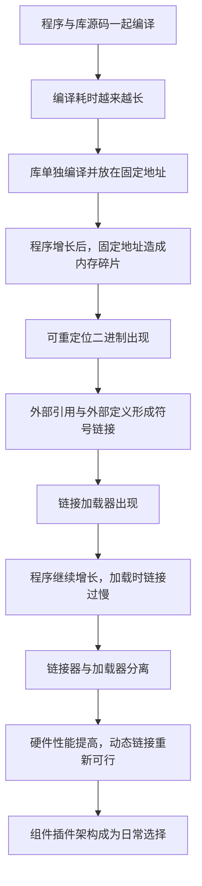
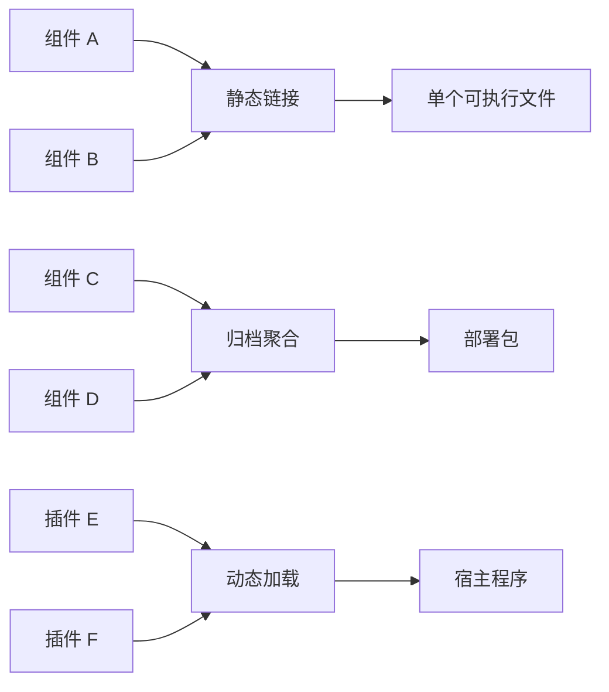
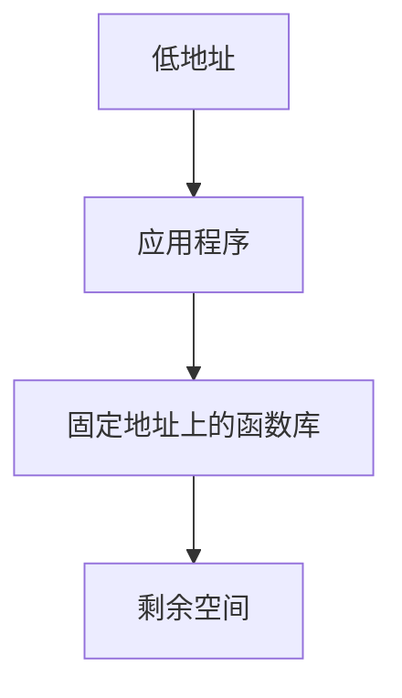
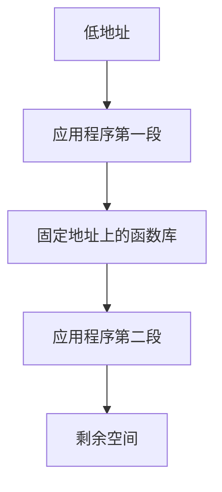
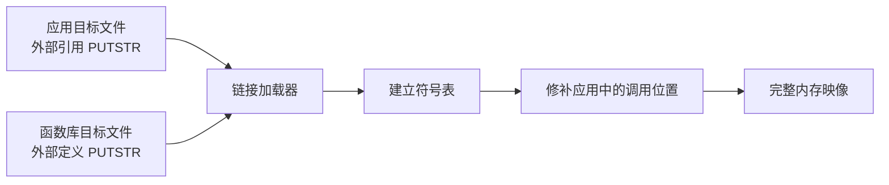
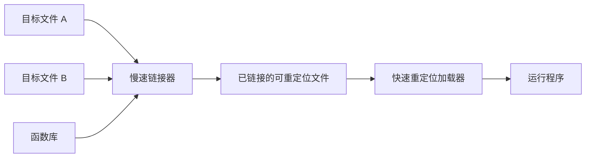
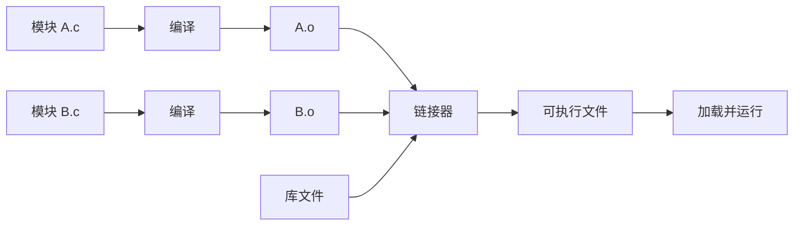
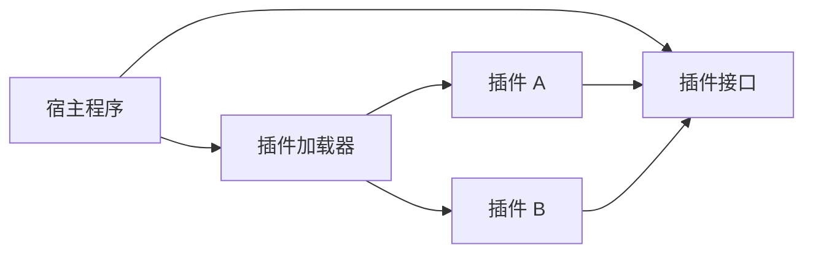

> 原书：Robert C. Martin, *Clean Architecture: A Craftsman's Guide to Software Structure and Design*<br>
> 本章：Chapter 12, Components<br>
> 原文参考：Clean Architecture.md

## 本章导读
> **原书图示**：Chapter 12 章首页
第 12 章是 Part IV“组件原则”的开篇。

作者先用一个建筑类比说明层次变化：

- SOLID 原则讨论如何把代码组织成类与模块，像是把砖块砌成墙和房间；
- 组件原则讨论如何把这些类与模块组织成可部署单元，像是把房间组成建筑。

本章没有马上讲“哪些类应放在一起”或“组件之间怎样依赖”。这两个问题会留给第 13、14 章。本章先回答更基础的问题：

> **软件组件是什么？今天这种组件形态又是怎样形成的？**

原书给出的核心定义非常明确：

> **组件是部署单元，是能够作为系统一部分被部署的最小实体。**

Java 中的 `.jar`、Ruby 中的 `.gem`、.NET 中的 `.dll`，都是作者所说的组件形态。组件可以静态链接进一个程序，也可以被打进归档，还可以在运行时作为插件加载。

随后，作者用一段约五十年的工具史解释：把编译好的文件独立组合起来，今天看似平常，早期却极其困难。



这段历史真正要表达的是：

- 组件不是抽象概念凭空发明出来的；
- 它依赖编译器、链接器、加载器和硬件共同提供的能力；
- 可重定位和符号解析消除了模块之间对固定内存位置的全局约定；
- 动态链接让实现能够在更晚的时间被选择和组合；
- 工具提供了组件化的可能，架构师仍要决定正确的组件边界。

阅读本章时，可以带着三个问题：

1. 为什么作者用“部署”而不是“代码目录”定义组件？
2. 固定地址为什么会阻碍独立开发和复用？
3. 链接技术如何让插件架构从艰巨工程变成默认能力？

## 1. 组件是部署单元

### 1.1 从类和模块提升到组件

前面的 SOLID 原则主要作用于源码结构：

- 哪些职责放在同一个类中；
- 哪些行为由接口隔离；
- 源码依赖应朝哪个方向；
- 具体实现怎样服从高层策略。

但大型系统不能只靠一张类图管理。代码最终要被：

- 编译；
- 打包；
- 版本化；
- 发布；
- 安装；
- 加载；
- 更新；
- 回滚。

一旦进入这些活动，架构师面对的单位不再只是类，而是包含许多类和模块的组件。

### 1.2 原书定义：最小部署实体

作者把组件定义为部署的粒度，也就是能够作为系统一部分被部署的最小实体。

这个定义包含两个关键词。

**部署：**

组件要能形成可交付给运行环境的实体，而不只是编辑器中的目录或命名空间。

**最小：**

在当前架构和发布机制下，这个实体不能再被拆开独立部署。若其中一半始终不能脱离另一半发布，那么两者在这个语境中仍属于同一个部署单元。

### 1.3 不同语言中的组件形态

原书列举了几种当时常见的形态：

| 语言或平台 | 典型组件 |
| --- | --- |
| Java | `.jar` 文件 |
| Ruby | `.gem` 文件 |
| .NET | `.dll` 文件 |
| 编译型语言 | 一组二进制文件形成的库或程序 |
| 解释型语言 | 一组可作为整体交付的源文件 |

今天还可以看到：

| 生态 | 常见交付形态 |
| --- | --- |
| C/C++ | 静态库、共享库、可执行文件 |
| Python | 包目录、wheel |
| JavaScript | npm 包、构建后的 bundle |
| Rust | crate 的发布包与编译产物 |
| 容器化服务 | 镜像中的应用及其运行依赖 |

这些例子外观不同，判断标准相同：它们是否形成一个有明确边界的交付与部署单元。

### 1.4 组件不等于目录

源码目录主要用于组织文件，组件则属于构建和部署架构。

| 概念 | 主要回答的问题 |
| --- | --- |
| 类 | 一个对象承担什么行为？ |
| 命名空间 | 名称怎样避免冲突？ |
| 源码模块 | 源文件怎样组织与导入？ |
| 包 | 代码怎样分发和声明依赖？ |
| 组件 | 哪一组代码作为部署单元交付？ |
| 进程 | 哪些代码在同一运行时地址空间执行？ |
| 服务 | 哪个运行单元通过远程协议提供能力？ |

一个目录可能包含多个组件，也可能只是某个组件的一小部分。一个进程也可以同时加载多个组件。

在某些生态中，“包”和“组件”恰好重合；在另一些项目中，包只是源码组织方式。不要只凭文件夹名称判断架构边界。

### 1.5 组件可以怎样组合

原书列出三种常见方式。

**链接成单个可执行程序：**

多个组件在构建期组合，最终用户只看到一个可执行文件。

**聚合进一个归档：**

多个组件被打进更大的交付物，例如多个 `.jar` 被放入一个 `.war`。

**作为动态插件独立加载：**

组件保持独立文件形态，由宿主程序在启动时或运行时加载。



组件的身份不由最后采用静态还是动态链接决定。作者关心的是：设计良好的组件应保持清楚的部署边界。

### 1.6 独立可部署与独立可开发

原书强调，设计良好的组件应保留独立部署的能力，因此也能被独立开发。

这并不要求每个组件现在都必须单独运行或单独上线。它强调一种能力：

- 组件有明确输入、输出和依赖；
- 内部实现可以独立变化；
- 构建产物可以单独生成和版本化；
- 替换组件时不必重写整个系统；
- 团队可以围绕边界并行工作。

独立部署为独立开发创造条件，但不会自动保证团队独立。如果组件之间存在循环依赖、共享数据库隐式契约或频繁同步修改，开发仍会相互牵制。第 13、14 章会继续处理这些问题。

### 1.7 “保留能力”比“强制拆开”更重要

一个模块化单体可以把多个组件链接进同一个进程、一起发布。只要边界清楚，它们仍可能保留将来独立版本化或替换的能力。

反过来，两个服务虽然部署在不同进程，如果：

- 必须同步发布；
- 共享内部数据库表；
- 协议频繁同时修改；
- 一个服务不能独立测试；

那么它们在架构意义上未必真正独立。

所以“部署成几个进程”不是组件质量的唯一标准。

### 1.8 为什么部署边界重要

组件边界决定许多现实成本：

- 一次修改要重建什么；
- 哪些代码共享版本号；
- 哪些内容必须一起测试；
- 哪些团队需要协调发布；
- 出现问题时能回滚什么；
- 哪些依赖会进入生产环境；
- 哪些能力可以作为插件替换。

第 12 章只定义组件并解释它的历史来源。至于应该把哪些类放进同一个部署边界，需要下一章的组件内聚原则回答。

## 2. A Brief History of Components：组件简史

### 2.1 为什么要讲这段历史

今天，开发者可以通过包管理器下载库，让构建工具解析依赖，再由操作系统加载程序。许多关键步骤已经不可见。

作者回顾早期计算机，是为了让我们看见组件成立所需的基础能力：

- 库能够单独编译；
- 二进制不必绑定固定地址；
- 调用者可以通过符号找到被调用者；
- 链接工作不必每次运行都重新完成；
- 运行时可以快速组合多个二进制单元。

缺少这些能力时，所谓“独立组件”会被地址、源码和加载过程牢牢绑在一起。

### 2.2 早期程序员必须安排内存

在早期计算机上，程序员需要亲自决定程序加载到内存的哪个位置。

程序开头常有一条 origin 语句，告诉汇编器后续代码从某个地址开始。程序中的跳转、数据访问和子程序调用会据此生成地址。

这意味着程序的正确运行依赖一个前提：

> **实际加载地址必须与编译时假定的地址一致。**

如果把二进制整体移到别的位置，内部地址仍指向旧位置，程序就会访问错误的指令或数据。这类程序被称为不可重定位。

### 2.3 PDP-8 示例要看懂什么

原书展示了一段 PDP-8 汇编。它包含：

- 一个调用 `GETSTR` 的小测试程序；
- 一个从键盘读取字符串的 `GETSTR` 子程序；
- 一条指定起始地址的 `*200` 指令。

下面只保留理解本章所需的关键行：

```text
        *200
START,  CLA
        TAD BUFR
        JMS GETSTR
        JMS PUTSTR
        JMP START

GETSTR, 0
        DCA PTR
        ...
```

不需要掌握 PDP-8 指令集。对本章而言，重点只有两件事：

1. `*200` 预先指定程序的加载起点；
2. 程序和子程序中的地址都建立在这个位置假设之上。

### 2.4 `*200` 与八进制背景

PDP-8 是 12 位计算机，八进制很适合表达它的机器字和地址。原书中的 `200`、`2000`、`1777` 等地址都按八进制理解。

某些 Markdown 转换版本会把进制标记显示成普通结尾数字。例如原文看似写成 `2008`，实际想表达的是“八进制的 200”，不是十进制两千零八。

`*200` 告诉汇编器：假设这段程序从八进制地址 200 开始生成代码。今天开发者通常不再亲自做这个决定，因为编译器、链接器、加载器、虚拟内存和操作系统已经接管了它。

### 2.5 早期如何复用函数库

当时的库通常以源码保存，而不是以可链接二进制发布。

要使用一个库函数，程序员会把库源码接到应用源码后面，再把它们作为一个整体编译。

作者在脚注中回忆，他的第一位雇主把几十叠子程序库穿孔卡放在架子上。开发新程序时，程序员会拿来需要的那叠卡片，接到自己的程序卡片后面。


这是一种真实的“复制源码依赖”：每个应用都携带并重新编译自己使用的库源码。

### 2.6 为什么源码复用越来越慢

早期设备很慢，内存容量也很小。编译器往往需要多次扫描源码，却无法把全部内容一次放进内存，只能反复从慢速设备读取。

随着函数库增长，每次构建都要重新付出读取和编译库源码的成本。大型程序的编译可能持续数小时。

问题不在函数库不能复用，而在复用方式没有形成独立编译边界：

- 每个应用都复制库源码；
- 每次修改应用都可能重编整个库；
- 库越丰富，所有使用者的构建越慢；
- 库没有稳定的二进制交付单元。

### 2.7 第一次改进：库单独编译

为了缩短编译时间，程序员开始把函数库与应用分开编译。

大致过程是：

1. 函数库预先编译成二进制；
2. 把库加载到一个约定好的固定地址；
3. 为库准备符号表，记录函数名称与地址；
4. 应用根据这个符号表生成调用；
5. 运行时先加载库，再加载应用。

应用不必在每次构建时重新编译库，构建速度得到明显改善。

这已经出现了组件思想的雏形：库有独立源码、独立编译产物和可供其他程序使用的符号。

### 2.8 固定地址带来的新问题
> **原书图示**：Figure 12.1 与 Figure 12.2：早期内存布局
原书 Figure 12.1 中，函数库被放在一个预先约定的位置。应用只能使用库前面留下的地址空间。

当应用还小的时候，这种安排能够工作：



但应用很快增长到放不下。程序员只能把应用拆成两段，让其中一段绕过函数库，放到更高地址。Figure 12.2 展示了这种布局：



### 2.9 为什么内存布局会不断碎片化

固定地址把函数库的位置变成所有程序必须遵守的全局约定。

一旦函数库增长：

- 它可能占用原来留给应用的空间；
- 应用分段位置需要重新安排；
- 符号表和地址假设需要更新；
- 其他库也可能与新位置冲突；
- 所有相关程序都要协调。

随着应用和库继续增长，内存布局会越来越像一张被反复切割的地图。

这不是某位程序员规划得不够好，而是固定地址方案的结构性缺陷：**每个模块的大小和位置都影响其他模块，模块无法独立变化。**

### 2.10 固定地址的现代类比

今天很少手工安排进程内地址，但类似的全局约定仍然存在：

- 业务代码硬编码服务器地址；
- 多个组件直接依赖同一文件路径；
- 服务把数据库表位置当成公共接口；
- 插件必须占用预先分配的编号范围；
- 多个模块共同修改一张全局配置表。

这些设计与固定内存地址具有相似问题：局部变化需要全局协调。

本章后面的可重定位与符号链接，正是通过增加间接层解除这种位置绑定。

## 3. Relocatability：可重定位性

### 3.1 解决方案是什么

固定地址困境的解决方案是可重定位二进制。

编译器不再假设程序只能放在唯一的绝对位置，而是生成一种可以由加载器放到不同位置的二进制。加载器决定实际位置，并修正其中需要调整的地址引用。


决定加载位置的时机由编译期推迟到了加载期。

### 3.2 重定位信息做什么

目标文件中并不是每个数字都代表地址。加载器必须知道：

- 哪些位置包含需要调整的地址；
- 这些地址指向当前模块的什么位置；
- 哪些值只是普通常量，不应修改；
- 哪些调用指向其他模块，需要等待符号解析。

编译器因此在二进制中附加重定位记录。加载器把模块放到选定位置后，根据这些记录修补相应地址。

可以用一个不涉及机器细节的例子理解：

- 某条指令想访问“模块起点之后第 50 个位置”；
- 加载器把模块放到地址 2000；
- 加载器把该引用修正为实际位置 2050；
- 若模块改放到 3000，同一个引用就会被修正为 3050。

模块内部只描述相对关系，最终绝对位置交给加载器决定。

### 3.3 可重定位带来的直接好处

有了可重定位目标文件，加载器可以：

- 在可用内存中选择位置；
- 把多个模块连续排放；
- 在库大小变化后自动调整后续位置；
- 只装入当前程序需要的模块；
- 避免程序员手工维护全局地址地图。

模块不再因为固定位置而彼此卡住，独立编译的价值才真正发挥出来。

### 3.4 外部调用仍然没有解决

重定位解决了“模块自身放在哪里”，但一个模块调用另一个模块时，还有新的问题。

假设应用调用函数库中的 `PUTSTR`：

- 编译应用时，函数库最终加载位置尚未确定；
- 应用无法写入 `PUTSTR` 的最终绝对地址；
- 加载器需要知道谁提供这个函数；
- 还需要知道应用中的哪个调用位置等待填补。

于是目标文件除了机器代码和重定位记录，还需要保存符号信息。

### 3.5 外部定义（external definition）

当一个模块提供某个可供其他模块使用的函数或数据时，编译器把它记录为外部定义。

外部定义至少表达：

- 符号名称；
- 它由哪个模块提供；
- 它位于模块内部的什么位置；
- 其他模块能否看见它。

例如，函数库会声明“我定义了 `PUTSTR`”。加载器确定函数库的实际位置后，就能算出 `PUTSTR` 的最终位置。

### 3.6 外部引用（external reference）

当一个模块调用自己没有定义的函数时，编译器把该名称记录为外部引用。

外部引用至少表达：

- 当前模块需要哪个符号；
- 哪个调用或数据位置需要被修补；
- 需要怎样的地址或调用形式。

应用会声明“我需要 `PUTSTR`”，但此时不必知道它最终位于内存哪里。

### 3.7 名称把调用者与位置解耦

加载器收集所有模块的外部定义，建立符号表，再把外部引用连接到对应定义。



调用者依赖的是稳定名称，而不是预先写死的内存位置。

这层间接关系带来关键变化：

- 库可以移动；
- 应用可以移动；
- 模块可以独立编译；
- 最终位置可以更晚确定；
- 只要名称和调用约定不变，内部布局可以变化。

### 3.8 链接加载器（linking loader）诞生

同时负责以下工作的加载器，被称为 linking loader，也就是链接加载器：

1. 读取多个可重定位目标文件；
2. 为每个模块选择加载位置；
3. 收集外部定义；
4. 解析外部引用；
5. 应用重定位记录；
6. 形成可运行的内存映像；
7. 把控制权交给程序入口。

这使程序第一次能够由多个独立编译、独立加载的段组合而成。

### 3.9 常见链接错误从哪里来

今天开发者仍会遇到与这套机制直接相关的错误：

**未定义符号：**

某个目标文件声明需要一个符号，却没有任何被链接的模块提供它。

**重复定义：**

多个模块同时导出同名且不允许重复的符号，链接器无法确定应使用哪个。

**调用约定或二进制接口不兼容：**

名称能够找到，但参数布局、返回方式、对象布局或版本不一致，程序可能无法正确运行。

这些问题提醒我们：能找到名字只是第一步，组件还需要稳定兼容的契约。

### 3.10 可重定位不等于位置无关代码

两者相关，但不是同一概念。

| 技术 | 基本思路 |
| --- | --- |
| 可重定位目标文件 | 加载或链接时根据记录修正地址 |
| 位置无关代码 | 尽量使用相对寻址，使代码放在不同位置也无需改写 |

原书这一节重点讲前者。现代共享库经常配合位置无关代码、动态符号表和虚拟内存使用，但不必把后来的所有机制都塞回这段历史叙述。

### 3.11 可重定位背后的架构思想

从架构角度看，可重定位体现了两个重要思想。

**推迟决定：**

加载位置不再过早写死，而是在拥有更多运行信息时决定。

**通过间接层解除全局约定：**

符号名称和重定位元数据把模块身份与物理地址分开。

后续 Clean Architecture 会反复使用类似做法：通过稳定接口，让高层策略不必提前绑定数据库、框架或设备细节。

## 4. Linkers：链接器

### 4.1 链接加载器为什么又变慢

链接加载器在程序和库都较小时工作得很好。但到 1960 年代末和 1970 年代初，软件规模不断扩大。

当时函数库可能存放在磁带或速度很慢的磁盘上。每次启动程序，链接加载器都要：

- 扫描大量目标文件；
- 查找外部定义；
- 解析所有外部引用；
- 重定位每个模块；
- 从慢速设备读入代码。

随着库积累到几十甚至上百个，加载一个程序可能耗时一个多小时。

关键浪费是：同一组模块每次运行都要重复完成相同的符号解析工作。

### 4.2 把链接与加载分开

为了解决这个问题，链接工作被移到一个独立程序中，这个程序就是 linker，链接器。

新的工作流是：

1. 链接器读取目标文件和库；
2. 解析符号并完成大部分地址安排；
3. 输出一个已经链接好的可重定位文件；
4. 轻量加载器在每次运行时快速把它放进内存。



慢工作只在构建产物发生变化时执行，快速加载则可以重复进行。

### 4.3 构建产物由此变得重要

链接和加载分开后，已链接文件成为可以保存和重复使用的构建产物。

这带来几个重要变化：

- 构建与运行成为两个阶段；
- 程序不必每次启动都重新解析全部库；
- 发布者可以交付已经准备好的二进制；
- 使用者只需加载和运行；
- 工具可以围绕目标文件、库和可执行文件建立流水线。

现代 CI、制品仓库、包管理器和发布系统，都延续了“把昂贵工作固化成可复用产物”的思路。

### 4.4 1980 年代的 C 构建流程

进入 1980 年代，C 等高级语言广泛使用，程序规模达到数十万行并不罕见。

典型流程变成：



单个 `.c` 文件编译并不一定很慢，但完整构建要编译大量模块，再由链接器处理所有目标文件。总周转时间又逐渐回到一小时甚至更久。

### 4.5 “程序规模的墨菲定律”

作者用一句幽默的话概括这种反复出现的现象：

> **程序会增长，直到填满所有可用的编译和链接时间。**

工具一变快，开发者就会构建更大的系统、使用更多库、生成更多代码。性能改善经常被规模增长迅速消耗。

这不是严格定律，却准确描述了工程中的反馈循环：资源上限提高后，需求和复杂度也会扩张。

今天仍能看到类似现象：

- CPU 更快，但全量构建依然很久；
- 网络更快，但依赖下载量持续增加；
- 存储更便宜，但构建缓存和镜像越来越大；
- 自动化测试更强，但测试套件也持续增长。

### 4.6 摩尔定律带来的转折

1980 年代末以后，磁盘速度、内存容量和处理器性能快速提升。更多磁盘内容可以被缓存到内存，处理速度也提高了多个数量级。

到 1990 年代中期，许多项目的链接时间从很长的等待降到数秒。硬件改善终于快过了当时软件规模的增长，加载时执行部分链接工作重新变得可接受。

原书脚注也提醒：这种趋势并非永远持续。大约 2000 年之后，至少时钟频率不再按早期速度增长。今天构建加速更多依靠：

- 增量编译；
- 并行构建；
- 分布式构建；
- 内容寻址缓存；
- 更精确的依赖图；
- 模块化和减少无关重建。

历史背景应帮助理解作者的论证，而不是把旧硬件趋势当成今天仍无条件成立的预测。

### 4.7 动态链接重新变得可行

硬件足够快后，系统可以在启动或运行时快速完成符号解析，把多个共享库或 `.jar` 组合起来。

ActiveX、共享库和早期 `.jar` 文件所代表的时代，由此重新获得了加载时组合能力。

历史形成了一个看似往返的过程：

| 阶段 | 主要做法 | 原因 |
| --- | --- | --- |
| 小程序时代 | 加载时链接 | 工作量小，可以接受 |
| 软件快速增长 | 构建时预先链接 | 每次加载都链接太慢 |
| 硬件性能提升后 | 动态链接重新普及 | 加载时组合再次足够快 |

后一次并不是简单回到原点。此时已经有成熟的目标文件格式、符号表、共享库、操作系统和包分发机制。

### 4.8 插件架构如何工作

插件架构通常包含三个角色：

- 宿主程序定义扩展契约；
- 插件组件实现契约；
- 加载器发现并装入插件。



运行时，宿主调用插件实现；源码依赖上，插件通常依赖宿主定义的接口。这与第 11 章 DIP 的结构一致，只是实现单元从类扩大成了可部署组件。

原书给出两个日常例子：

- Minecraft mod 可以作为自定义 `.jar` 放入指定目录；
- ReSharper 可以作为 DLL 插入 Visual Studio。

这类能力之所以显得简单，是因为复杂的链接和加载机制已经被平台隐藏。

### 4.9 动态链接不是组件化的唯一方式

本章开头已经说明，组件也可以静态链接或聚合进单一归档。

动态插件突出展示了组件的独立性，但静态链接同样可能拥有清楚的组件边界：

- 每个库独立构建；
- 各自拥有公开契约；
- 版本和依赖受到管理；
- 最后为了分发方便链接成单一程序。

选择静态还是动态链接，要考虑部署、启动性能、安全、升级和平台约束，而不是把某一种形式当成架构成熟度排名。

### 4.10 动态链接的代价

动态加载提供灵活性，也带来新的问题：

- 组件版本不兼容；
- DLL Hell 或依赖冲突；
- 二进制接口变化；
- 插件发现和启动失败；
- 加载路径被劫持；
- 未受信任插件获得过高权限；
- 错误延迟到启动或运行阶段；
- 不同平台的装载机制不一致。

因此，插件架构还需要：

- 明确版本契约；
- 兼容性检查；
- 安全边界；
- 失败隔离；
- 可观测性；
- 回滚策略。

工具让组件可组合，不保证组合一定可靠。

## 5. Conclusion：组件插件架构成为默认能力

### 5.1 原书结论

作者在结尾把可动态链接、可在运行时插接的文件称为软件架构中的组件。

从手工安排内存、复制穿孔卡片，到把 `.jar` 或 DLL 放进插件目录，这段演进花了约五十年。

作者的对比很鲜明：

- 过去，组件插件架构是一项艰巨工程；
- 今天，它可以成为一个轻松采用的默认选项。

这不是说所有系统都必须使用插件，而是说技术基础已经让架构师可以现实地选择它。

### 5.2 本章完整论证链

1. 组件是系统中的部署单元；
2. 早期程序与库都绑定固定内存位置；
3. 库只能以源码复制并随应用重新编译；
4. 库单独编译后，固定地址又造成程序分段和内存碎片；
5. 可重定位二进制允许加载器选择实际位置；
6. 外部引用和外部定义让模块通过符号而非固定地址连接；
7. 链接加载器使独立编译的段可以组合运行；
8. 软件规模增长后，每次加载都链接变得太慢；
9. 独立链接器把慢工作移到构建阶段；
10. 硬件性能提升后，加载时动态链接重新可行；
11. 共享库、`.jar` 和插件机制让组件架构成为日常工具。

### 5.3 这段历史留下的架构思想

**推迟不可逆决定：**

固定地址在编译时决定位置；可重定位把决定推迟到加载时。越晚掌握的信息越多，选择也越灵活。

**用稳定身份代替物理位置：**

调用者引用符号名称，加载器再把名称解析到实际地址。组件可以独立移动和构建。

**把昂贵工作放在合适阶段：**

链接太慢时，把它从每次运行移到构建阶段；硬件足够快后，再把需要灵活性的部分放回加载阶段。

**工具能力会改变架构可行性：**

插件并非概念上突然出现，而是在底层工具足以承担成本后成为普遍方案。

**全局约定会阻碍独立变化：**

固定地址要求所有模块共同遵守一张内存地图。现代系统中的硬编码位置和共享内部结构也会产生类似耦合。

### 5.4 工具只能提供可能性

拥有 `.jar`、DLL、包管理器或容器，并不自动得到良好组件架构。

架构师仍要决定：

- 哪些类应一起发布；
- 哪些变化应限制在同一个组件；
- 哪些依赖不应进入组件；
- 组件版本怎样管理；
- 依赖图是否允许独立开发；
- 运行时是否需要插件机制。

第 13 章会讨论组件内聚性，第 14 章会讨论组件之间的耦合关系。

### 5.5 组件与 Clean Architecture 的联系

第 11 章通过抽象工厂展示了具体实现如何位于架构边界外侧。第 12 章进一步说明，这些实现不仅可以是类，还可以被打包成独立组件。

于是，依赖倒置可以扩大为插件结构：

- 高层组件定义稳定接口；
- 低层组件实现该接口；
- 运行时控制流进入低层组件；
- 源码依赖仍朝向高层抽象；
- 加载器或组合根在运行时连接双方。

组件技术为架构边界提供了可部署的物理形式。

## 6. 在现代项目中识别组件

### 6.1 从部署产物开始盘点

识别组件时，不要只看源码目录，先查看实际构建和发布产物：

- 生成哪些库、包和可执行文件？
- 哪些产物拥有独立版本？
- 哪些可以单独替换？
- 哪些必须一起构建和发布？
- 哪些由不同运行入口加载？
- 哪些只是打包容器，内部仍包含多个边界？

这能把架构讨论从抽象命名落到真实交付流程。

### 6.2 组件地图应包含什么

一张有用的组件地图至少记录：

| 信息 | 要回答的问题 |
| --- | --- |
| 组件名称 | 这个部署单元承担什么职责？ |
| 构建产物 | 最终生成什么文件或包？ |
| 所有者 | 谁负责修改和发布？ |
| 公开契约 | 其他组件通过什么使用它？ |
| 直接依赖 | 构建和运行需要哪些组件？ |
| 版本策略 | 怎样判断兼容性？ |
| 部署方式 | 静态、归档、动态插件还是独立服务？ |
| 失败方式 | 缺失或不兼容时系统怎样表现？ |

组件边界只有同时出现在代码、构建和发布流程中，才不只是文档上的方框。

### 6.3 模块化单体中的组件

模块化单体通常把多个逻辑组件链接或打包成一个部署物。

它可以保留良好组件边界，只要：

- 模块公开接口清楚；
- 内部实现不会被其他模块绕过；
- 构建依赖方向受控；
- 数据所有权明确；
- 测试能够以模块为单位运行；
- 将来拆分时不必重写核心契约。

是否独立进程并不是唯一判据。作者强调的是独立部署能力及其带来的独立开发潜力。

### 6.4 微服务不自动等于良好组件

微服务看起来天然独立部署，但仍可能通过以下方式紧密绑定：

- 同步锁步发布；
- 共享数据库表；
- 复制同一内部模型；
- 循环调用；
- 分布式事务；
- 未版本化协议；
- 一个服务无法脱离整套环境测试。

独立进程提供物理边界，组件原则还要检查这个边界是否与变化、发布和依赖关系一致。

### 6.5 容器镜像是不是组件

容器镜像通常是部署产物，但它更像一个交付容器，里面可能包含：

- 应用可执行文件；
- 多个共享库；
- 语言运行时；
- 配置模板；
- 启动脚本。

在服务部署层面，整个镜像可以被视为一个部署单元；在软件架构内部，其中的库仍可能是独立组件。

组件粒度取决于当前讨论的架构层次。要明确自己正在分析“服务如何部署”，还是“程序内部如何构建和替换”。

### 6.6 插件适合什么场景

插件机制通常适合：

- 第三方需要扩展宿主；
- 功能按需安装；
- 不同客户选择不同能力；
- 实现需要在不重建宿主时更新；
- 核心与可选功能拥有稳定契约；
- 扩展生命周期可以由宿主管理。

典型例子包括编辑器扩展、浏览器扩展、游戏 Mod、数据库驱动和编译器插件。

### 6.7 不必为了“组件化”强行动态加载

若系统只有固定功能集合，并且：

- 所有代码始终一起发布；
- 单文件部署更可靠；
- 启动性能重要；
- 平台不适合动态库；
- 插件安全成本过高；

静态链接或统一归档可能更合适。

组件边界仍可以存在于构建图和源码依赖中，不必强行变成运行时插件。

### 6.8 独立部署能力如何验证

可以尝试以下检查：

1. 单独构建组件；
2. 查看它是否只使用声明过的依赖；
3. 替换内部实现但保持公开契约；
4. 在兼容版本之间独立升级；
5. 不修改消费者源码完成集成；
6. 单独运行组件测试；
7. 在缺失或不兼容时得到清晰错误；
8. 能够回滚到前一个兼容版本。

如果每一步都需要改动大量其他组件，边界可能只是名义上的。

### 6.9 构建时间仍然是架构反馈

第 12 章的历史不断围绕周转时间展开。今天的构建时间仍能暴露边界问题：

- 修改一个内部类，却触发全仓库重建；
- 一个头文件变化导致大量 C++ 翻译单元重编；
- 一个包升级迫使所有服务重新打包；
- 无关测试被全部执行；
- 制品无法从缓存复用。

工具优化有帮助，但还应检查依赖是否过宽、组件是否缺乏独立构建边界。

### 6.10 一个插件式报表系统示例

假设报表宿主定义一个稳定的导出接口，不同组件分别提供 PDF、CSV 和企业自定义格式。

合理结构是：

- 宿主拥有导出插件契约；
- 每个插件独立构建和版本化；
- 加载器按配置发现插件；
- 插件不访问宿主内部类；
- 宿主验证插件版本与能力；
- 单个插件失败不会破坏全部核心流程。

这同时用到了：

- 第 11 章 DIP 的依赖方向；
- 第 12 章动态组件加载能力；
- 后续章节将讲到的组件内聚与依赖管理。

## 7. 易混淆概念与常见误解

### 7.1 “组件就是源码目录”

不准确。目录是组织手段，组件是部署单元。二者可能重合，也可能完全不同。

### 7.2 “组件一定是二进制文件”

错误。原书明确指出，解释型语言中的组件也可以由源文件聚合而成。关键是部署边界，不是文件是否包含机器码。

### 7.3 “组件必须是独立进程”

错误。多个组件可以链接进同一可执行文件，也可以作为动态库加载到同一进程。

### 7.4 “组件必须现在就独立部署”

原书强调设计良好的组件应保留独立部署能力。它们当前可以被统一打包，但边界不应完全依赖同步修改。

### 7.5 “有多个 `.jar` 就是良好组件架构”

错误。文件分开只证明构建产物分开。若依赖循环、接口不稳定或必须锁步发布，组件仍缺乏独立性。

### 7.6 “可重定位就是把文件复制到另一个目录”

错误。这里讨论的是二进制被加载到不同内存位置时，内部地址仍能正确解析。

### 7.7 “可重定位与位置无关代码完全相同”

错误。可重定位通常依靠链接器或加载器修补地址；位置无关代码尽量使用相对寻址，减少运行前改写。

### 7.8 “链接器和加载器始终是同一个程序”

错误。历史上曾有链接加载器，后来为提高启动速度把链接和加载分成两个阶段。现代动态链接又把部分工作放回加载阶段。

### 7.9 “静态链接比动态链接落后”

错误。二者服务不同约束。静态链接有单文件分发、可预测依赖和启动简单等优点；动态链接更便于插件与独立替换。

### 7.10 “动态插件天然低耦合”

错误。插件仍可能依赖宿主内部类型、共享全局状态或要求同步版本。稳定契约比动态文件形式更重要。

### 7.11 “早期使用固定地址只是工具不成熟”

这种说法忽略了当时硬件限制。内存、存储和处理能力都非常有限，设计是在现实资源下逐步演进的。

### 7.12 “PDP-8 示例需要逐条掌握汇编”

不需要。本章只要求理解 origin 语句、固定位置假设以及不可重定位造成的耦合。

### 7.13 “这一章只是历史，与现代架构无关”

错误。这段历史解释了独立构建、延迟绑定、符号契约和插件机制为何重要，也揭示了全局位置约定对独立变化的阻碍。

### 7.14 “硬件变快后不必关心构建边界”

错误。软件规模会持续吞噬性能收益。增量构建、缓存和清晰依赖图仍然重要。

### 7.15 “微服务天然比组件更高一级”

二者不是简单等级关系。微服务是运行和部署风格，组件是部署粒度概念。一个服务可以包含多个内部组件，也可能与其他服务锁步耦合。

### 7.16 “容器镜像就是系统唯一的组件边界”

不一定。镜像是服务层交付物，内部仍可能包含可独立构建和替换的库组件。分析时要说明粒度。

## 8. 实践检查与掌握练习

### 8.1 组件边界检查清单

- 系统实际生成哪些部署产物？
- 每个产物包含哪些类和模块？
- 哪些产物拥有独立版本？
- 哪些可以单独构建、测试和替换？
- 哪些必须与其他产物锁步发布？
- 公开契约在哪里定义？
- 是否有源码绕过公开契约访问内部实现？
- 组件所有者和发布责任是否明确？

### 8.2 依赖与构建检查清单

- 修改一个组件会重建哪些其他组件？
- 依赖是否都在构建清单中显式声明？
- 是否存在循环依赖？
- 是否共享未版本化的数据结构？
- 是否能复用未变化组件的构建产物？
- 全量构建与增量构建分别需要多久？
- 动态组件缺失时，错误是否清晰？
- 版本不兼容能否在加载前发现？

### 8.3 插件机制检查清单

- 插件契约由谁拥有？
- 契约是否泄露宿主内部实现？
- 插件怎样被发现和加载？
- 插件版本怎样协商？
- 插件权限是否受限？
- 插件失败是否会拖垮宿主？
- 插件是否能独立升级与回滚？
- 未受信任插件如何验证来源？

### 8.4 场景判断一：一个目录一个组件

项目把每个源码目录都称为组件，但最终只生成一个不可分割的脚本包，也没有独立版本或构建边界。

**判断：** 这些目录目前更像源码模块，不能仅凭名称认定为原书意义上的组件。

### 8.5 场景判断二：静态链接库

多个 C++ 库独立构建、拥有清晰头文件接口，最后静态链接成一个可执行文件。

**判断：** 它们仍可以是组件。动态加载不是必要条件，重点是独立构建和部署边界是否被保留。

### 8.6 场景判断三：两个独立服务共享表

两个服务分别部署，却直接读写同一组内部数据库表，任何表结构变化都要求双方同步发布。

**判断：** 物理部署分开，但独立开发和演进能力很弱。组件边界被共享数据契约穿透。

### 8.7 场景判断四：运行时插件

宿主能加载任意 DLL，但插件必须引用大量宿主内部类，宿主每次内部重构都会让全部插件失效。

**判断：** 动态加载机制存在，稳定组件契约却不存在。文件形式不能替代架构设计。

### 8.8 场景判断五：单文件程序

一个小型命令行工具没有插件需求，所有代码作为单个可执行文件发布。

**判断：** 完全合理。组件数量应服务真实开发和部署需求，不必为了形式拆成动态库。

### 8.9 场景判断六：容器中的多个插件

一个容器镜像包含宿主和十个可在启动时选择的插件。

**判断：** 在服务部署层，镜像是交付单元；在程序内部，十个插件仍是组件。两种分析粒度可以同时成立。

### 8.10 快速复述练习

能够回答以下问题，基本就掌握了本章：

1. 原书怎样定义组件？
2. 组件与源码模块、进程有什么区别？
3. 组件可以通过哪三种方式组合？
4. 为什么独立部署能力有助于独立开发？
5. 早期程序为什么绑定固定地址？
6. `*200` 在 PDP-8 示例中说明什么？
7. 为什么库以源码复用会让编译越来越慢？
8. 库单独编译后为什么仍会产生内存碎片？
9. 可重定位二进制解决了什么问题？
10. 外部引用和外部定义分别表示什么？
11. 链接加载器承担哪些工作？
12. 为什么后来要把链接器与加载器分开？
13. “程序规模的墨菲定律”表达什么现象？
14. 为什么 1990 年代动态链接重新可行？
15. 插件文件为什么只是组件架构的技术基础，而不是全部设计？
16. 第 13、14 章将接着回答什么问题？

### 8.11 一分钟记忆卡

- **定义：** 组件是部署单元，是系统中最小的可部署实体。
- **形态：** `.jar`、`.gem`、DLL、共享库、包或源文件聚合。
- **组合：** 静态链接、归档聚合或动态插件。
- **早期困境：** 程序和库绑定固定内存地址，局部增长导致全局重排。
- **突破：** 可重定位目标文件让加载位置延迟决定。
- **连接：** 外部引用与外部定义通过符号表匹配。
- **分阶段：** 链接器完成慢速准备，加载器负责快速运行。
- **转折：** 硬件性能提升让动态链接重新成为实用方案。
- **结果：** 插件架构从艰巨工程变成日常能力。
- **后续：** 第 13 章决定组件内容，第 14 章管理组件依赖。

## 本章总结

1. Part IV 把讨论层次从类和模块提升到组件。
2. 原书把组件定义为部署单元，也就是系统中最小的可部署实体。
3. Java 的 `.jar`、Ruby 的 `.gem` 和 .NET 的 `.dll` 都是典型组件形态。
4. 编译型语言的组件常是二进制聚合，解释型语言也可以用源文件聚合形成组件。
5. 组件可以静态链接、聚合进归档，或作为动态插件加载。
6. 动态链接不是判断组件的唯一标准，部署边界才是核心。
7. 设计良好的组件应保留独立部署能力，并由此支持独立开发。
8. 独立部署不等于必须独立进程，也不等于当前必须单独上线。
9. 早期程序员必须亲自安排程序的内存位置和布局。
10. PDP-8 示例中的 `*200` 是 origin 语句，指定程序假定的加载起点。
11. 早期程序不可重定位，移动二进制会让内部地址指向错误位置。
12. 当时函数库以源码和穿孔卡片形式复用，并与应用一起重新编译。
13. 慢速设备、有限内存和多趟编译使大型程序构建耗时数小时。
14. 程序员随后把函数库单独编译成二进制，并放到约定的固定地址。
15. 固定库地址限制应用可用空间，应用增长后只能分段绕过函数库。
16. 库继续增长会迫使所有程序重新安排内存，导致持续碎片化和全局协调。
17. 可重定位二进制让加载器在加载时选择模块的实际位置。
18. 重定位记录告诉加载器哪些地址引用需要按实际位置修正。
19. 多个可重定位模块可以连续加载，而不必预先为每个模块固定地址。
20. 外部定义表示模块提供的符号，外部引用表示模块需要的符号。
21. 链接加载器建立符号表，把外部引用连接到实际定义。
22. 程序和库扩大后，链接加载器每次运行都解析大量库，启动可能耗时一小时以上。
23. 链接与加载因此分开：链接器预先完成慢工作，加载器快速装入已链接产物。
24. 1980 年代大型 C 程序又使完整编译和链接周转时间持续增长。
25. 作者用“程序会增长到填满所有编译和链接时间”概括这种工程反馈。
26. 磁盘、内存和处理器性能提升后，1990 年代的链接时间显著缩短。
27. 加载时动态链接重新可行，共享库、ActiveX 和 `.jar` 推动插件架构普及。
28. Minecraft Mod 与 ReSharper 展示了组件可以通过放入指定文件来扩展宿主。
29. 组件技术提供独立组合的能力，但版本、契约、安全和依赖方向仍需架构设计。
30. 第 12 章回答组件是什么和它怎样形成；第 13、14 章将回答组件如何内聚与耦合。
