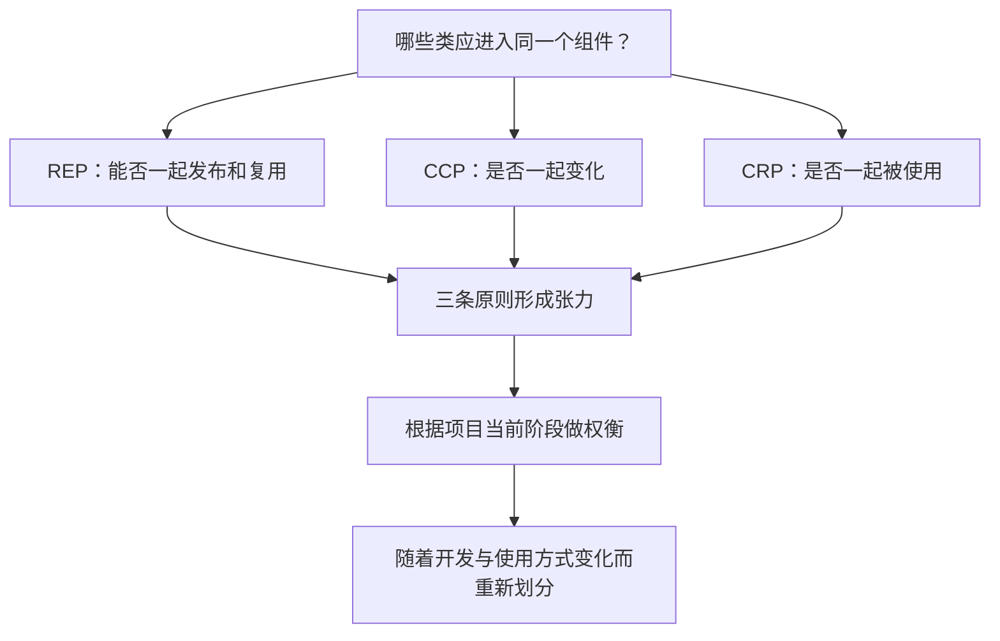
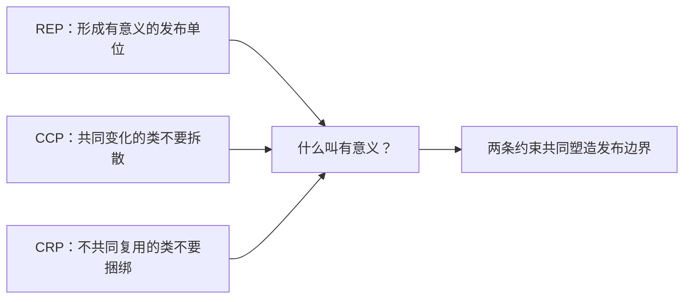
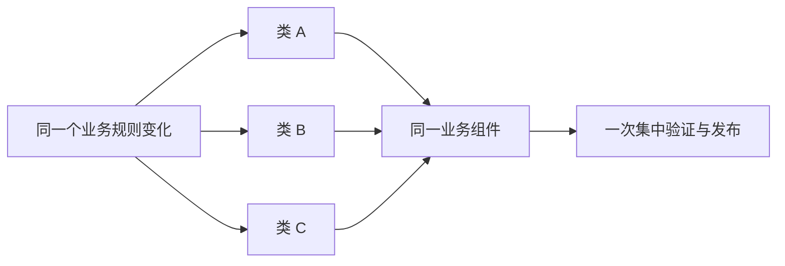
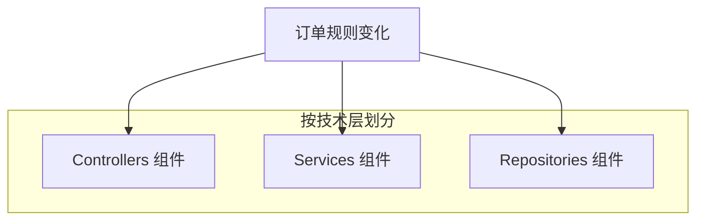
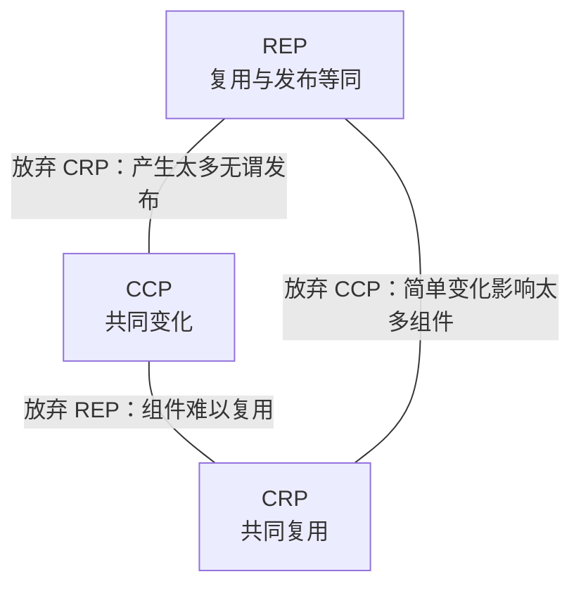

> 原书：Robert C. Martin, *Clean Architecture: A Craftsman's Guide to Software Structure and Design* 
> 本章：Chapter 13, Component Cohesion 
> 原文参考：Clean Architecture.md

## 本章导读
> **原书图示**：Chapter 13 章首页
第 12 章回答了“组件是什么”：组件是部署单元，是系统中能够作为整体交付的最小实体。

第 13 章紧接着回答更困难的问题：

> **哪些类和模块应该放进同一个组件？**

这个决定会直接影响：

- 一次需求变化要修改多少组件；
- 哪些代码必须共享版本号；
- 使用者升级时要接受多少无关变化；
- 组件能否被其他项目稳定复用；
- 团队能否独立构建、验证和发布。

作者指出，组件划分长期以来经常依赖临时判断：看到几个类关系接近，就把它们放在一起；目录太大了，再凭感觉拆开。本章给出三条更可靠的组件内聚原则：

| 缩写 | 全称 | 核心问题 |
| --- | --- | --- |
| REP | Reuse/Release Equivalence Principle | 这些类是否适合作为同一个发布与复用单位？ |
| CCP | Common Closure Principle | 这些类是否因相同原因、在相同时间变化？ |
| CRP | Common Reuse Principle | 组件使用者是否真的会一起使用这些类？ |

三条原则分别从三个角色观察组件：

- REP 从发布者和复用者的关系观察；
- CCP 从维护者面对变化的成本观察；
- CRP 从消费者被迫承担的依赖观察。

本章最重要的结论不是“找到唯一正确的组件大小”，而是：

> **REP、CCP 和 CRP 会把组件推向不同方向，合理边界是可开发性与可复用性之间的动态平衡。**

早期项目通常更关心快速修改和减少发布范围，因此偏向 CCP。项目成熟、出现更多复用者后，REP 和 CRP 的重要性会上升，组件可能需要重新拆分。

## 1. REP：复用/发布等同原则

### 1.1 原书表述

Reuse/Release Equivalence Principle 的核心句是：

> **复用的粒度就是发布的粒度。**

如果使用者要把一组代码作为依赖复用，那么这组代码就应当作为一个可识别、可版本化、可说明变化的发布单元存在。

反过来说，一堆只能通过复制源码、挑选文件或追踪某个不稳定分支来使用的代码，还没有形成可靠的复用组件。

### 1.2 为什么复用需要发布

复用不是“我能看见这段代码”，而是“我能把一个明确版本的组件纳入自己的系统，并知道自己依赖的是什么”。

一个可复用发布单元至少应回答：

- 组件叫什么？
- 当前使用哪个版本？
- 这个版本何时发布？
- 与前一版本相比改变了什么？
- 是否包含不兼容变化？
- 旧版本还会维护多久？
- 如何取得、验证和回滚这个版本？

没有发布过程，使用者难以建立稳定依赖，也无法在多个项目中复现相同构建。

### 1.3 原书的工具背景

原书提到 Maven、Leiningen 和 RVM 等工具。它们反映了软件复用逐渐由手工复制代码，转向通过模块与版本管理工具取得发布组件的时代。

今天对应的工具更加丰富：

| 生态 | 常见工具或仓库 |
| --- | --- |
| Java | Maven、Gradle、Maven Central |
| .NET | NuGet |
| JavaScript | npm、pnpm、npm Registry |
| Python | pip、uv、PyPI |
| Rust | Cargo、crates.io |
| Ruby | Bundler、RubyGems |
| C/C++ | Conan、vcpkg、制品仓库 |

REP 不要求使用某个特定工具。工具只是在落实同一个前提：复用者依赖的是一次明确发布，而不是一个不断漂移的源码集合。

### 1.4 版本号不只是兼容性标签

版本号首先帮助识别和比较发布。例如，团队可以锁定已验证版本，而不必每次构建都取得最新代码。

但作者强调，版本号还有更重要的作用：支持使用者做出知情决策。

使用者看到新版本后，可以根据变化决定：

- 立即升级；
- 等待补丁版本；
- 先完成兼容性测试；
- 暂时继续使用旧版本；
- 因破坏性变化而寻找替代方案。

因此，发布过程不应只产生一个新数字，还应产生：

- 发布说明；
- 变更日志；
- 迁移指南；
- 弃用与兼容性说明；
- 必要的安全公告；
- 可取得的历史版本。

语义化版本是一种常见做法，但不是 REP 唯一允许的版本策略。关键是使用者能否理解并控制升级。

### 1.5 组件中的类必须能一起发布

从架构角度看，REP 要求组件里的类和模块形成一个内聚群组，而不是随机集合。

判断它们能否一起发布，可以问：

- 它们是否共同完成一个可解释的能力？
- 它们共享同一版本号是否自然？
- 同一份发布说明能否合理描述它们？
- 使用者是否会把它们作为整体取得？
- 其中一个类变化时，发布整个组件是否说得通？
- 组件名称能否准确概括它们？

如果一个组件同时包含日志、日期格式、订单定价、图像压缩和数据库迁移，仅仅因为这些代码“到处都可能用”，它通常缺乏统一发布主题。

### 1.6 “一起发布”不等于“碰巧在同一仓库”

同一个 Git 仓库可以包含多个独立组件，也可以让多个组件暂时共享版本。

仓库边界与发布边界回答不同问题：

| 边界 | 主要目的 |
| --- | --- |
| 仓库 | 源码协作、权限与变更管理 |
| 组件 | 构建、版本、发布与复用 |
| 部署物 | 代码如何进入运行环境 |

Monorepo 不违反 REP，只要每个可复用组件仍有清晰的发布身份和变化说明。多个仓库也不自动符合 REP，如果它们必须锁步发布且没有独立契约。

### 1.7 发布单位也是升级决策单位

当使用者依赖一个组件时，它选择的是整个发布版本，而不是其中某个类的独立版本。

这意味着组件内部的分组会直接影响消费者：

- 某个无关类改变，也会产生整个组件的新版本；
- 安全修复可能要求升级整个组件；
- 发布说明需要覆盖组件内所有变化；
- 兼容性验证以整个组件为单位进行。

REP 因此不只约束发布流程，也反过来约束类应该怎样分组。

### 1.8 REP 为什么是一条“弱建议”

作者坦率地说，“这些类放在一起应该说得通”是一条较弱的建议，因为“说得通”很难形成精确算法。

我们很难仅凭类名证明：

- 哪个主题足够统一；
- 哪些类应该共享版本；
- 组件应大到什么程度；
- 一次发布包含多少变化才合理。

但 REP 违规通常很容易被使用者感受到：

- 包名无法说明内容；
- 每次升级都夹杂无关变化；
- 一个小功能要安装巨大组件；
- 版本说明像多个项目拼在一起；
- 使用者只能复制所需文件而不愿依赖整个组件。

REP 难以正面精确定义，却能通过这些坏味道发现问题。

### 1.9 CCP 与 CRP 如何补强 REP

作者说，REP 的弱点由后面的 CCP 和 CRP 以否定方式补足。

可以这样理解：

- REP 给出目标：组件应形成合理的发布与复用单位；
- CCP 告诉我们，不能把总是一起变化的类拆散；
- CRP 告诉我们，不能把消费者不会一起使用的类硬塞在一起。

REP 说明组件需要主题，CCP 和 CRP 帮助识别这个主题的边界。

### 1.10 REP 的实际例子

假设一个日期处理组件包含：

- 日期值对象；
- 日期解析器；
- 与解析器配套的格式描述；
- 日期范围；
- 日期比较工具。

如果这些类型构成一个共同抽象，使用者通常一起取得，发布说明也能围绕日期能力展开，那么它们共享一个组件是合理的。

若同一组件又加入：

- HTTP 重试器；
- 数据库连接池；
- 图片缩放器；

只因为维护者不想新建包，REP 就开始受到破坏。这些功能没有共同发布主题，也不应共享一个版本号。

## 2. CCP：共同封闭原则

### 2.1 原书表述

Common Closure Principle 的表述是：

> **把因相同原因、在相同时间变化的类放进同一个组件；把因不同原因、在不同时间变化的类放进不同组件。**

这里的“封闭”沿用 OCP 的含义：我们希望组件对某些变化保持稳定，让变化尽量被限制在少数边界内。

### 2.2 CCP 是组件层的 SRP

第 7 章 SRP 关注类：如果方法对不同角色负责、因不同原因变化，就不应被塞进同一个类。

CCP 把同一思路提升到组件：如果一组类总是响应同一个角色的需求、在同一次业务变化中共同修改，它们适合位于同一组件。

| 原则 | 组织对象 | 关注点 |
| --- | --- | --- |
| SRP | 方法进入哪个类 | 类因哪个角色而变化 |
| CCP | 类进入哪个组件 | 组件因哪类需求而变化 |

二者可以共同概括为：

> **把在相同时间、因相同原因变化的东西放在一起；把在不同时间、因不同原因变化的东西分开。**

### 2.3 为什么共同变化应放在一起

假设一个业务需求会同时修改四个类。

如果四个类散落在四个组件中，团队可能需要：

- 修改四个构建单元；
- 更新四组测试；
- 发布四个版本；
- 协调依赖版本；
- 验证组合兼容性；
- 回滚多项产物。

如果它们位于同一个组件中，变化更有机会被限制在一次构建、验证和发布内。

CCP 不是为了减少修改的代码行，而是减少变化跨越的组件边界。

### 2.4 可维护性通常优先于可复用性

作者指出，对大多数应用来说，可维护性比可复用性更重要。

原因很现实：应用团队每天面对的是需求变化、缺陷修复和发布压力。若一次修改散落到许多组件，组件再“可复用”也无法弥补持续协调成本。

CCP 希望让一次典型变化只触碰尽可能少的组件。这样：

- 不受影响的组件无需重新验证；
- 不依赖变更组件的部分无需重新部署；
- 变化责任更容易归属；
- 发布失败时影响范围更清楚。

这也是为什么早期项目通常应先优化可开发性，而不是过早追求公共库复用。

### 2.5 “相同原因”比“代码看起来相似”更重要

两个类使用相同技术，不代表它们因相同原因变化。

例如，订单仓储和用户仓储都使用 SQL，但：

- 订单仓储随订单业务变化；
- 用户仓储随身份和账户规则变化；
- 它们可能由不同角色、不同计划驱动。

仅因都访问数据库就放进同一个“大仓储组件”，可能让两个变化轴互相牵连。

反过来，一个订单用例、订单校验器和订单持久化映射虽然技术职责不同，却可能在同一个订单规则变化中一起修改。它们可能更适合共享业务组件。

### 2.6 技术分层与业务切片

按 Controller、Service、Repository 分成三个全局组件，看起来整齐，但一次业务变化常要同时修改三层。

按业务能力组织时，订单相关的入口、用例和持久化适配可能被聚集在一个更清晰的变化边界内。

但这不是“技术分层永远错误”。如果某一层由独立团队维护、拥有稳定接口，或者因完全不同的基础设施原因变化，它可以成为合理组件。CCP 的判据是实际变化模式，而不是固定目录模板。

### 2.7 CCP 与 OCP 的关系

OCP 希望模块对修改封闭、对扩展开放。但一个系统不可能对所有未来变化都封闭。

每增加一种扩展方向，都要付出抽象、间接层和维护成本。架构师只能优先保护最常见、最昂贵或最有可能出现的变化。

这就是战略性封闭：

- 根据已经发生的变化；
- 根据业务路线图；
- 根据团队责任；
- 根据外部系统稳定性；
- 选择值得建立边界的变化轴。

CCP 把对同类变化采取相似封闭策略的类放进同一组件。这样，当该变化发生时，影响更可能停留在一个发布单元中。

### 2.8 如何发现“共同变化”

共同变化不应只靠会议中的猜测，可以结合事实观察：

- 哪些文件经常出现在同一次提交中？
- 哪些类由同一需求或缺陷同时修改？
- 哪些代码由同一业务角色提出变化？
- 哪些测试总是一起失败或更新？
- 哪些组件必须频繁锁步发布？
- 哪些改动需要同一组评审者？

版本历史中的 co-change，也就是共同变更，是很有价值的线索。

但要排除机械噪声：

- 全仓库格式化；
- 统一改版权信息；
- 自动生成文件；
- 大规模重命名；
- 依赖版本批量更新。

这些提交同时修改许多文件，却不代表它们具有共同业务变化原因。

### 2.9 共同变化不是永恒关系

项目早期，一组类可能在需求探索中频繁一起变化。接口稳定后，它们又可能形成不同复用单元。

反过来，原本独立的组件也可能因为新业务流程而长期锁步变化。

因此，CCP 应根据实际历史定期复审，不能把第一次划分当成永久真理。

### 2.10 CCP 的实际例子

一个订阅计费功能包含：

- 计费周期计算；
- 套餐规则；
- 折扣资格；
- 账单生成；
- 对应业务测试。

如果产品每次调整订阅政策时，这些类总是共同变化，把它们放进同一计费组件通常符合 CCP。

若其中的通用货币值对象已经稳定，并被多个领域共同使用，它未必需要继续留在计费组件。此时还要结合 REP 和 CRP 判断它是否应成为其他发布单元的一部分。

## 3. CRP：共同复用原则

### 3.1 原书表述

Common Reuse Principle 的核心句是：

> **不要强迫组件的使用者依赖他们不需要的东西。**

它同时提供两类指导：

- 倾向于一起复用的类适合放在同一组件；
- 不会一起复用的类不应被捆在同一组件。

作者尤其强调第二类指导更重要。

### 3.2 类很少被完全孤立地复用

一个可复用抽象通常由多个相互协作的类组成。

原书举出容器与迭代器：

- 容器负责保存元素；
- 迭代器提供一致的遍历方式；
- 它们的类型和行为紧密配合；
- 使用容器时通常也需要相关迭代能力。

把它们放在同一组件中是自然的，因为消费者把它们作为一个整体抽象复用。

类似例子还有：

- 解析器与其语法树节点；
- HTTP 客户端与请求、响应类型；
- 序列化器与配套格式描述；
- 集合与对应比较器或游标。

重点不是类之间“有调用”，而是消费者是否把它们作为不可分割的一组能力使用。

### 3.3 组件依赖是对整个发布单元的依赖

假设组件 B 包含十个类，组件 A 只使用其中一个。

从源码调用看，A 只接触一个类；从发布关系看，A 仍然依赖整个 B：

- 依赖清单记录的是 B 的版本；
- B 中任一类变化都可能产生新版本；
- A 升级时要验证整个新版本；
- B 的传递依赖可能全部进入 A；
- B 的安全或许可证问题也可能影响 A。

编译器或打包器有时能删除未使用代码，但它通常不能消除版本、发布、依赖与治理上的组件关系。

### 3.4 组件内部的类应具有不可分割性

CRP 希望一个组件中的类对于其典型消费者来说是不可分割的：一旦依赖这个组件，消费者确实需要其中那组共同协作的类。

这不是要求每个消费者逐字调用所有类，而是要求：

- 类共同构成同一可复用抽象；
- 消费者不会只想要其中一个完全独立的子集；
- 组件发布时，整体变化对消费者具有共同意义；
- 拆出某些类不会形成更自然的复用边界。

如果消费者群体长期分成互不重叠的两组，一组只用前半部分，另一组只用后半部分，组件可能包含两个不同复用单元。

### 3.5 CRP 更擅长告诉我们什么不该放在一起

“哪些类一起复用”有时难以预测，但“不一起复用”通常更容易观察。

常见信号包括：

- 大多数组件使用者只调用一个小角落；
- 不同消费者使用完全不同的类集合；
- 安装一个功能会拖入大量无关依赖；
- 一个可选集成导致核心用户频繁升级；
- 组件名称变成 `common`、`misc` 或 `utils`；
- 发布说明长期包含互不相关的变化；
- 使用者要求拆出轻量核心包。

这些信号说明组件可能应该拆分，而不是继续把“通用代码”堆进去。

### 3.6 CRP 与 ISP 的关系

作者把 CRP 称为 ISP 的更一般版本。

| 原则 | 客户端被迫依赖什么 |
| --- | --- |
| ISP | 一个接口中自己不使用的方法 |
| CRP | 一个组件中自己不使用的类 |

二者共同表达：

> **不要依赖你不需要的东西。**

第 10 章在接口层讨论依赖表面，本章把同一思想提升到发布组件层。

### 3.7 一个大型 SDK 的例子

假设云厂商把对象存储、数据库、消息队列、机器学习和管理 API 全部放在一个 SDK 组件中。

只需要对象上传的服务也会承担：

- 整个 SDK 的安装体积；
- 所有模块的版本更新；
- 无关模块的安全公告；
- 大量传递依赖；
- 更复杂的初始化和文档。

将 SDK 拆成稳定核心与按产品划分的子组件，可以让消费者只选择真正需要的部分。这正是 CRP 的应用。

### 3.8 `core` 与 `extras` 的拆分

一种常见做法是：

- `core` 只包含绝大多数使用者共同需要的稳定抽象；
- `extras` 或单独集成包包含可选功能；
- 每个集成可以拥有自己的版本与依赖；
- 用户按需安装。

这种拆分是否合理，还要检查 REP 和 CCP：

- `core` 是否真的形成独立发布主题？
- 被拆出的类是否因不同原因变化？
- 新边界是否增加了过多同步发布？

CRP 不能单独决定全部结构。

### 3.9 可选依赖不能完全替代拆分

包管理器常支持 optional dependency、feature flag 或按需加载。它们可以减少安装体积，却不一定改变发布边界。

如果所有功能仍共享：

- 同一版本号；
- 同一发布说明；
- 同一兼容性承诺；
- 同一源码变化节奏；

那么无关功能变化仍可能迫使组件整体发布。

可选依赖是实现手段，CRP 关心的是类是否真正属于同一复用单元。

### 3.10 CRP 的实际例子

一个数据结构库包含：

- 树节点；
- 树遍历器；
- 树构建器；
- 树验证器；
- 图像颜色转换；
- CSV 导出器。

前四个类型可能共同构成树处理抽象，消费者经常一起使用。后两个功能与树处理没有不可分割关系。

即使它们都是“工具”，也不应因此共享一个组件。拆分后：

- 树组件保持清晰主题；
- 图像与 CSV 用户不必相互承担发布变化；
- 每个组件可以独立版本化；
- 发布说明更容易理解。

## 4. The Tension Diagram for Component Cohesion：内聚张力图

### 4.1 三条原则为什么互相冲突

REP 和 CCP 是包含性原则，它们倾向于把类聚到一起：

- REP 希望一个完整发布主题中的类共同发布；
- CCP 希望一起变化的类留在同一变化边界；
- 二者通常会推动组件变大。

CRP 是排他性原则：

- 不共同复用的类应被移出组件；
- 消费者不应承担无关类；
- 它通常推动组件变小。

因此，不存在简单的“组件越小越好”或“同一业务都放一起”的固定答案。

### 4.2 Figure 13.1 怎样阅读
> **原书图示**：Figure 13.1：组件内聚原则张力图
Figure 13.1 把 REP、CCP 和 CRP 放在三角形三个顶点。

原书给出一个重要读图规则：

> **每条边描述的是放弃它对面那个顶点原则的代价。**

架构师在三角形中的位置，表示当前更愿意承担哪类成本。

### 4.3 放弃 CCP：简单变化影响太多组件

若只强调 REP 和 CRP，团队可能把组件拆得很细，以便每个组件都容易发布且没有无关类。

但共同变化的类如果被分散，一次简单需求就会：

- 修改多个组件；
- 产生多个版本；
- 更新多条依赖；
- 运行多组兼容性验证；
- 协调多个发布顺序。

此时复用边界看起来精致，可开发性却很差。

### 4.4 放弃 CRP：产生太多无谓发布

若只强调 REP 和 CCP，团队会把能够一起发布、一起变化的许多类聚在大组件中。

对组件维护者而言，这减少了发布单元数量；对消费者而言，却可能意味着：

- 自己不使用的功能变化也产生新版本；
- 升级夹带无关依赖；
- 兼容性测试范围过大；
- 不同消费者的需求被绑在一起。

组件越像“所有相关代码的大集合”，CRP 的代价越明显。

### 4.5 放弃 REP：组件难以复用

若只强调 CCP 和 CRP，组件可能很好地匹配共同变化和共同使用，却没有完整发布纪律或清晰发布主题。

结果可能是：

- 使用者找不到稳定版本；
- 不知道哪些组合兼容；
- 发布说明不完整；
- 只能跟随源码分支；
- 不敢在其他项目中建立长期依赖。

这类结构在单个项目内部或许能工作，却难以成为可靠复用单位。

### 4.6 三条原则的方向对比

| 原则 | 首要受益者 | 主要优化目标 | 过度强调的风险 |
| --- | --- | --- | --- |
| REP | 组件复用者 | 可识别、可版本化的发布单位 | 仅追求发布主题而忽略变化与消费模式 |
| CCP | 组件维护者 | 让一次变化集中在少数组件 | 组件过大，消费者承担无关内容 |
| CRP | 组件消费者 | 不依赖无关类和功能 | 组件过碎，共同变化跨越太多边界 |

三条原则没有谁永远优先。优先级由项目当前最昂贵的问题决定。

### 4.7 早期项目为什么偏向 CCP

原书说，项目早期通常更重视 develop-ability，也就是可开发性，而不是复用。

早期项目具有这些特点：

- 需求变化频繁；
- 领域模型仍在形成；
- 外部使用者很少；
- 接口尚未稳定；
- 团队需要快速试错；
- 过早发布公共组件容易固化错误抽象。

此时，把共同变化的类放在一起通常比提炼大量小型可复用包更有价值。

按原书张力图的方位，项目常从右侧开始，暂时牺牲复用，换取开发效率。

### 4.8 项目成熟后为什么会移动

项目成熟后，情况会改变：

- 内部抽象逐渐稳定；
- 其他项目开始复用组件；
- 外部消费者数量增加；
- 无关发布的成本被放大；
- 兼容性和版本承诺变得重要；
- 使用模式出现清晰分群。

组件结构于是会向更重视 REP 和 CRP 的方向移动：

- 为稳定能力建立独立发布单元；
- 从大组件拆出可选部分；
- 提供版本与迁移说明；
- 限制消费者承担的无关依赖。

### 4.9 组件结构取决于开发和使用方式

原书指出，组件结构更多取决于项目怎样被开发和使用，而不只是项目“做什么”。

同一套订单业务代码可能有两种合理结构：

**内部快速迭代应用：**

- 订单相关类共同发布；
- 优先减少需求变化跨越的组件；
- 暂时不为潜在复用拆出许多包。

**对外提供的订单 SDK：**

- 核心模型、客户端、可选集成分别发布；
- 版本与兼容性文档完善；
- 消费者只安装需要的功能。

业务领域相同，开发方式和使用者不同，组件边界也会不同。

### 4.10 没有永久最优的划分

作者在结论中说，组件构成会随时间“抖动和演化”。

这不是架构失败，而是系统环境变化的结果：

- 昨天总是一起变化的类，今天可能已经稳定；
- 昨天只有一个使用者，今天可能有几十个；
- 昨天共享发布最简单，今天无关升级已成为负担；
- 昨天拆分成本太高，今天工具与团队已经成熟。

架构师要避免两种极端：

- 每次小变化都立即重组组件；
- 明知变化和复用模式已经改变，仍把旧边界当成不可修改。

## 5. Conclusion：组件内聚是动态平衡

### 5.1 原书对“内聚”的扩展

过去，人们常把内聚简单理解为“一个模块只完成一个功能”。

本章展示了更复杂的组件内聚：

- 它与发布和版本有关；
- 它与类怎样共同变化有关；
- 它与消费者怎样共同复用有关；
- 它同时服务维护者与使用者；
- 它会随项目阶段改变。

因此，组件内聚不是一个只看源码语义的静态属性。

### 5.2 可开发性与可复用性的对立

CCP 主要保护可开发性：希望一次变化集中，减少跨组件修改和发布。

REP 与 CRP 主要保护可复用性：希望组件有明确发布身份，且消费者不承担无关内容。

两类目标都合理，但会拉动组件向不同大小和边界发展。

好的组件设计不是让冲突消失，而是知道当前项目更需要保护什么，并接受相应代价。

### 5.3 本章完整思路

1. 组件划分首先要回答哪些类应共享部署边界；
2. REP 要求复用单位与发布单位一致；
3. 发布需要版本、说明和可控升级；
4. 能共享一次发布的类应形成可解释主题；
5. REP 的正面判据较弱，因此由 CCP 与 CRP 补强；
6. CCP 把因相同原因、在相同时间变化的类放在一起；
7. 这样可以减少一次需求变化跨越的组件数量；
8. CRP 把共同复用的类放在一起，并排除无关类；
9. 这样可以减少消费者被迫承担的发布与依赖；
10. REP 和 CCP 倾向扩大组件，CRP 倾向缩小组件；
11. 张力图展示放弃任一原则的代价；
12. 项目早期通常偏向 CCP，成熟后提高 REP 和 CRP 权重；
13. 组件边界应根据真实开发和使用方式持续演化。

### 5.4 与前面原则的联系

| 本章原则 | 对应的前置原则 | 关系 |
| --- | --- | --- |
| CCP | SRP | 都按变化原因聚合，并分离不同变化原因 |
| CCP | OCP | 都通过战略性边界限制常见变化 |
| CRP | ISP | 都拒绝让客户端依赖不需要的内容 |
| REP | 第 12 章组件定义 | 把部署单元变成可版本化复用单元 |

这些联系说明，组件原则并不是一套全新思想，而是把类级设计原则提升到构建、发布和复用层。

### 5.5 与下一章的关系

本章只解决组件内部的类怎样聚合。

第 14 章将转向组件之间的依赖，讨论：

- 如何避免组件依赖环；
- 依赖应指向稳定还是易变组件；
- 抽象程度应如何匹配稳定程度。

组件内部有内聚，组件之间还需要可管理的耦合结构。

## 6. 如何在项目中应用三条原则

### 6.1 第一步：盘点真实发布单位

先列出系统当前所有组件：

- 组件名称；
- 构建产物；
- 版本策略；
- 发布频率；
- 维护团队；
- 直接消费者；
- 公开契约；
- 直接与传递依赖。

如果团队无法说清哪些文件共享版本和发布流程，REP 的基础就尚未建立。

### 6.2 第二步：建立变化矩阵

收集一段有代表性的版本历史，把常见需求与被修改的类对应起来。

| 变化原因 | 经常共同修改的类 | 跨越的组件 |
| --- | --- | --- |
| 订单折扣规则 | 资格判断、价格计算、订单测试 | 当前跨三个组件 |
| 登录安全策略 | 认证用例、令牌验证、安全审计 | 当前集中一个组件 |
| 数据库驱动升级 | 数据源 Adapter、连接配置 | 基础设施组件 |

这张表帮助判断 CCP：共同变化是否被边界拆散，不同变化是否被混在一起。

### 6.3 第三步：建立消费者使用矩阵

再从消费者角度记录每个组件中的哪些能力被使用。

| 消费者 | 核心模型 | HTTP 客户端 | 数据库集成 | 测试工具 |
| --- | --- | --- | --- | --- |
| Web 服务 | 使用 | 使用 | 不使用 | 不使用 |
| 批处理任务 | 使用 | 不使用 | 使用 | 不使用 |
| 单元测试包 | 使用 | 不使用 | 不使用 | 使用 |

若不同消费者长期只使用互不重叠的列，CRP 会提示拆分候选。

### 6.4 第四步：检查发布是否说得通

对每个候选组件模拟一份发布说明：

- 这次版本的主题是什么？
- 变化是否面向同一类使用者？
- 所有类共享一个版本是否自然？
- 使用者是否能判断升级影响？
- 组件名称能否准确描述内容？

如果发布说明像多个无关项目的拼接，REP 可能被破坏。

### 6.5 第五步：明确当前优先成本

团队需要公开说明当前阶段最昂贵的问题：

- 一次需求跨越太多组件？
- 发布协调和验证太慢？
- 外部使用者被无关升级打扰？
- 组件太大，安装和安全成本过高？
- 公共 API 难以稳定？
- 组件太碎，依赖版本难以管理？

没有这个优先级，张力三角只能变成抽象口号。

### 6.6 第六步：选择最小迁移

组件重组会影响：

- 包名与导入路径；
- 构建脚本；
- 发布流水线；
- 版本历史；
- 消费者升级；
- 代码所有权；
- 文档和示例。

因此，应先解决当前最明显的边界错误：

- 拆出一个完全独立的可选集成；
- 合并两个长期锁步变化的小组件；
- 停止向 `common` 组件继续加入新类；
- 为真正复用的核心建立发布流程。

不必一次重画全部组件。

### 6.7 第七步：用结果验证

重组后观察：

- 典型需求触碰的组件是否减少？
- 无关发布是否减少？
- 消费者安装的依赖是否更准确？
- 版本说明是否更清晰？
- 发布频率是否符合组件主题？
- 团队协调是否减少？
- 新边界是否制造了循环依赖？

若只让目录更整齐，却没有改善这些结果，重组可能没有解决真实问题。

### 6.8 `common` 组件为什么危险

`common`、`shared`、`utils` 很容易成为无明确所有权的收容区。

它常同时违反三条原则：

- REP：没有统一发布主题；
- CCP：类因完全不同原因变化；
- CRP：每个消费者只使用很小一部分。

不是说这些名称永远不能出现，而是每次加入代码时都要问：

- 谁会共同复用它？
- 它会与现有类一起变化吗？
- 它应该共享现有版本吗？
- 是否已经形成独立组件主题？

### 6.9 公共 SDK 的划分示例

假设一个支付 SDK 包含：

- 支付核心模型；
- API 认证；
- HTTP 客户端；
- Spring 集成；
- Django 集成；
- 命令行调试工具；
- 测试 Fake。

早期内部开发时，把它们放在一起可能有利于快速演进。

对外发布后，消费者出现明显差异：

- Java 服务只需要核心与 Spring 集成；
- Python 服务只需要核心协议与 Django 集成；
- 生产程序不需要测试 Fake；
- 大多数用户不需要命令行工具。

此时可以形成核心、语言客户端、框架集成和测试工具等不同发布组件。这个变化正体现项目从 CCP 优先向 REP、CRP 增强的移动。

### 6.10 内部业务系统的划分示例

一个尚在探索期的业务系统按每个小概念创建独立包，结果一次订单需求要同时更新：

- 价格包；
- 折扣包；
- 订单状态包；
- 审计包；
- 通知包。

若这些能力在当前阶段总是随同一订单政策变化，过细组件会放大协调成本。先将共同变化部分聚集在订单业务组件中，可能更符合 CCP。

未来某些能力稳定并被其他项目复用后，再根据 REP 和 CRP 拆出，并不算推翻架构，而是响应新的使用方式。

## 7. 易混淆概念与常见误解

### 7.1 “内聚就是一个组件只做一件事”

过于简单。本章中的组件内聚同时考虑发布、共同变化和共同复用，是多种力量的平衡。

### 7.2 “REP 只是给包打版本号”

错误。REP 还要求清晰发布主题、变化说明和可控升级，使使用者能做知情决策。

### 7.3 “所有内部模块都必须采用语义化版本”

不一定。REP 不规定唯一版本方案。只在一个应用内部使用的模块可以随应用发布，但一旦作为独立复用单位，就需要可追踪发布身份。

### 7.4 “同一仓库中的代码必须属于同一组件”

错误。仓库是源码协作边界，一个仓库可以产生多个独立组件。

### 7.5 “CCP 就等于按业务目录分包”

不完整。按业务能力常能匹配变化原因，但最终应由真实共同变化验证，而不是只看目录名称。

### 7.6 “使用同一种技术的类应该放在一起”

不一定。两个 SQL Adapter 可能随不同业务变化；技术相似不等于变化原因相同。

### 7.7 “共同提交过的文件都应该放在一起”

错误。格式化、批量重命名和依赖升级会制造虚假共同变化。必须结合需求原因判断。

### 7.8 “CRP 只关心安装包大小”

错误。它还关心版本、验证、部署、传递依赖、安全和许可证等整个组件依赖成本。

### 7.9 “消费者只调用一个类，所以依赖很轻”

错误。消费者仍依赖整个组件发布版本，并可能承担其全部传递依赖和升级影响。

### 7.10 “把依赖标成可选就自动满足 CRP”

不一定。若功能仍共享一个发布边界和无关版本变化，组件层的捆绑仍然存在。

### 7.11 “组件越小越符合内聚原则”

错误。CRP 推动拆小，CCP 会要求共同变化的类聚合。过小组件可能让简单变化横跨许多发布单元。

### 7.12 “组件越大越容易维护”

错误。大组件可能减少跨组件修改，却会让消费者承担无关内容，并产生大量无谓发布。

### 7.13 “三条原则可以同时达到最大值”

错误。张力图的意义正是说明它们彼此冲突，架构师必须根据当前成本做取舍。

### 7.14 “组件划分一旦完成就应保持不变”

错误。作者明确指出，今天合理的划分明年可能不再合理，组件会随项目成熟度演化。

### 7.15 “早期项目应先建设可复用平台”

通常风险很高。领域和接口尚未稳定时，优先 CCP 与可开发性往往更务实，避免固化错误抽象。

### 7.16 “组件结构只由业务领域决定”

错误。原书强调，开发方式、使用者、发布方式和项目成熟度都会改变合理边界。

### 7.17 “拆分组件只是移动文件”

错误。真正拆分还涉及版本、构建、契约、依赖、发布、所有权和消费者迁移。

### 7.18 “本章原则只适用于对外开源库”

错误。内部组件同样需要控制共同变化和无关依赖。只是 REP 的发布纪律会根据复用范围采取不同强度。

## 8. 实践检查与掌握练习

### 8.1 REP 检查清单

- 组件是否有明确名称和版本身份？
- 使用者能否取得历史版本？
- 发布说明是否清楚描述变化？
- 组件中的类是否共享一个可解释主题？
- 它们出现在同一份发布说明中是否自然？
- 使用者能否决定何时升级？
- 是否存在只能复制源码才能复用的代码？
- 组件是否成为无主题的杂物集合？

### 8.2 CCP 检查清单

- 哪些类经常因同一个需求共同变化？
- 这些类是否散落在多个组件中？
- 一次典型需求要发布多少组件？
- 哪些类由不同角色、不同原因修改？
- 它们是否被错误地捆在同一组件？
- 当前边界是根据真实历史还是根据技术目录决定？
- 是否过滤了格式化等共同变更噪声？
- 组件对最常见变化是否具有战略性封闭？

### 8.3 CRP 检查清单

- 每个消费者实际使用组件中的哪些能力？
- 是否存在互不重叠的消费者群体？
- 一个小功能是否拖入大量无关依赖？
- 无关类变化是否迫使消费者考虑升级？
- 组件中的类是否共同构成不可分割抽象？
- 可选集成是否应该独立发布？
- `core` 与扩展拆分是否更自然？
- 拆分会不会让共同变化横跨太多组件？

### 8.4 张力检查清单

- 当前最昂贵的是跨组件修改，还是无关发布？
- 项目处于探索期、稳定期还是广泛复用期？
- 有多少内部和外部消费者？
- 组件接口是否已经稳定？
- 团队更需要开发速度还是复用独立性？
- 当前愿意牺牲哪条原则、承担什么后果？
- 何时重新评估这个决定？

### 8.5 场景判断一：无版本的复制式工具库

团队从一个共享目录复制需要的文件，各项目自行修改，没有版本或发布说明。

**判断：** 这些代码尚未形成符合 REP 的复用组件。使用者无法识别兼容发布，也无法可靠升级。

### 8.6 场景判断二：一次需求发布五个包

一个业务规则变化总要同时修改五个小包，它们由同一团队维护、按固定顺序发布。

**判断：** 这是 CCP 风险信号。共同变化的类可能被过度拆分，应评估合并发布边界。

### 8.7 场景判断三：巨大通用组件

一个 `common` 组件有上百个类，每个消费者只使用两三个，无关变化每周都产生新版本。

**判断：** REP 的主题不清，CRP 明显受损。应依据消费者使用组合和变化原因拆分。

### 8.8 场景判断四：容器与迭代器

一个容器类型与专用迭代器共享内部约定，消费者总是一起使用，变化也高度相关。

**判断：** 它们共同构成可复用抽象，放在同一组件符合 CRP，也可能符合 CCP 与 REP。

### 8.9 场景判断五：按技术层拆包

订单需求每次都要修改 Controller、Service 和 Repository 三个独立组件。

**判断：** 当前划分可能违反 CCP。应考察按订单能力聚合是否能减少变化跨越边界，而不是机械保留全局技术层。

### 8.10 场景判断六：成熟 SDK 拆出集成包

核心 SDK 已稳定，不同用户分别使用 AWS、Azure 或本地存储集成，但原来所有集成都在同一个组件。

**判断：** 项目成熟和使用模式分化后，增强 REP 与 CRP、拆出独立集成发布是合理演化。

### 8.11 场景判断七：每次小改都重组组件

团队只要看到两个文件在一次提交中共同变化，就移动包和修改发布结构。

**判断：** 反应过度。应观察稳定模式，并把组件迁移成本纳入判断。

### 8.12 快速复述练习

能够回答以下问题，基本就掌握了本章：

1. 本章要解决什么组件设计问题？
2. REP 的核心表述是什么？
3. 为什么复用单位必须有发布过程？
4. 版本号之外，发布还应提供什么？
5. 为什么作者说 REP 是弱建议？
6. CCP 与 SRP 有什么关系？
7. 为什么共同变化的类应进入同一组件？
8. CCP 如何放大 OCP 的战略性封闭？
9. CRP 的核心表述是什么？
10. 容器与迭代器为什么适合放在一起？
11. 为什么只使用一个类仍是依赖整个组件？
12. CRP 与 ISP 有什么关系？
13. 哪两条原则倾向让组件变大？
14. 哪条原则倾向让组件变小？
15. 张力图的每条边表示什么？
16. 放弃 CCP、CRP、REP 分别有什么代价？
17. 为什么项目早期通常优先 CCP？
18. 为什么成熟项目会提高 REP 与 CRP 的权重？
19. 组件结构为什么需要随时间演化？
20. 如何用变化矩阵和消费者矩阵验证边界？

### 8.13 一分钟记忆卡

- **问题：** 哪些类应该进入同一个组件？
- **REP：** 复用的粒度就是发布的粒度。
- **发布：** 需要版本、变更说明和可控升级。
- **CCP：** 因相同原因、在相同时间变化的类放在一起。
- **对应：** CCP 是组件层的 SRP，并延续 OCP 的战略性封闭。
- **CRP：** 不要强迫使用者依赖不需要的类。
- **对应：** CRP 是组件层的 ISP。
- **方向：** REP 与 CCP 倾向扩大组件，CRP 倾向缩小组件。
- **张力：** 放弃任一原则都会产生不同成本。
- **演化：** 早期偏可开发性，成熟后增强可复用性。

## 本章总结

1. 第 13 章回答哪些类和模块应该进入同一个组件。
2. 组件划分影响构建、版本、发布、升级、复用和团队协作。
3. 三条组件内聚原则是 REP、CCP 和 CRP。
4. REP 的表述是：复用的粒度就是发布的粒度。
5. 可复用组件必须拥有可识别、可追踪的发布版本。
6. 版本号不仅用于兼容性，也帮助使用者决定是否以及何时升级。
7. 发布过程还应提供变更日志、迁移说明和必要通知。
8. 同一组件中的类应形成可解释主题，并适合共享版本与发布文档。
9. 仓库边界不等于组件边界，Monorepo 也可以发布多个组件。
10. REP 的正面判据较弱，但无主题发布和无关升级很容易暴露违规。
11. CCP 与 CRP 从变化和使用两个方向补强 REP。
12. CCP 要求把因相同原因、在相同时间变化的类放进同一组件。
13. CCP 是组件层的 SRP，都按变化原因聚合并分离职责。
14. 共同变化的类集中后，一次需求会跨越更少组件边界。
15. 对多数应用而言，降低修改、验证和发布成本通常比提前复用更重要。
16. 技术相似不等于变化原因相同，应结合业务角色和版本历史判断。
17. CCP 延续 OCP 的战略性封闭，优先保护最常见和最昂贵的变化。
18. CRP 要求不要强迫组件使用者依赖他们不需要的东西。
19. 容器与相关迭代器是共同复用、适合放在一起的原书案例。
20. 消费者即使只调用一个类，仍依赖整个组件的版本、发布和传递依赖。
21. CRP 更多用于判断哪些类不应放在一起。
22. CRP 是 ISP 的组件版本，二者都反对依赖不需要的内容。
23. REP 和 CCP 是包含性原则，通常推动组件变大。
24. CRP 是排他性原则，通常推动组件变小。
25. 放弃 CCP 会让简单变化影响太多组件。
26. 放弃 CRP 会产生太多与消费者无关的发布和升级。
27. 放弃 REP 会使组件缺乏稳定发布身份，难以复用。
28. 项目早期通常偏向 CCP，因为可开发性比复用更迫切。
29. 项目成熟、消费者增多后，应提高 REP 与 CRP 的权重并重新审视边界。
30. 组件内聚没有永久最优答案，合理结构会随开发和使用方式持续演化。
