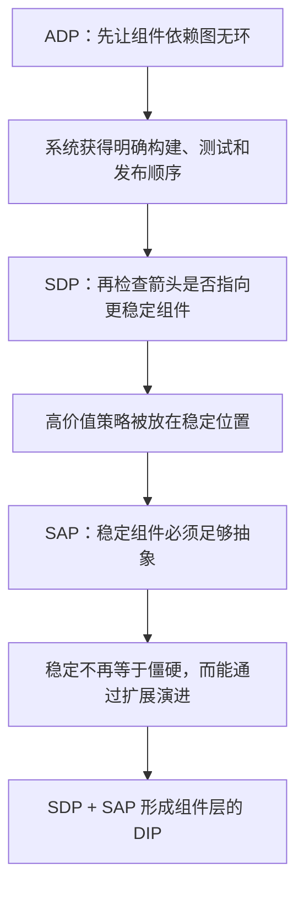
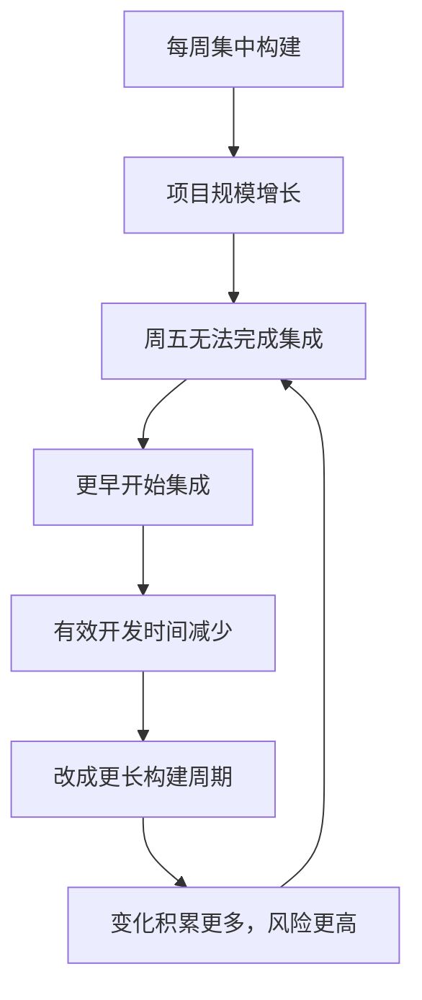
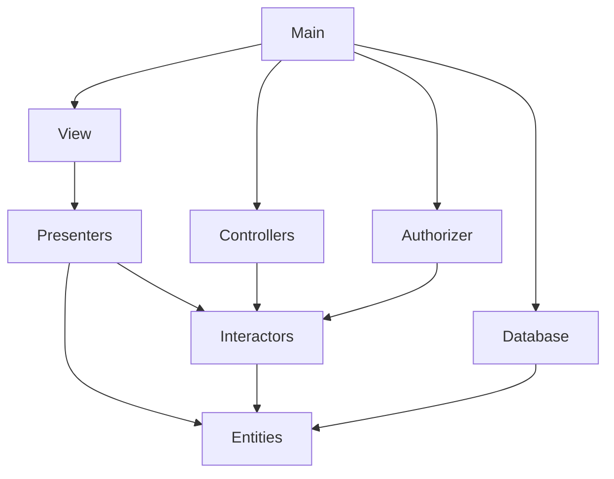
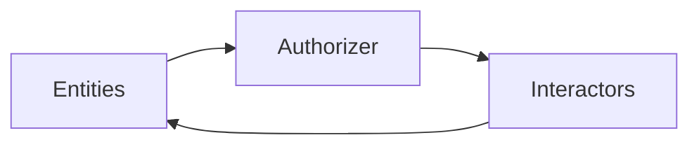
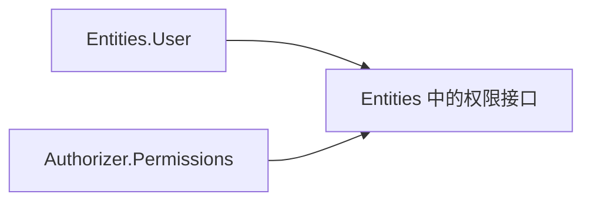
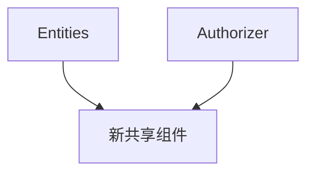
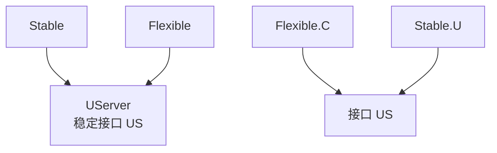

> 原书：Robert C. Martin, *Clean Architecture: A Craftsman's Guide to Software Structure and Design* 
> 本章：Chapter 14, Component Coupling 
> 原文参考：Clean Architecture.md

## 本章导读
> **原书图示**：Chapter 14 章首页
第 13 章讨论组件内部的内聚：哪些类应该共同发布、共同变化和共同复用。

第 14 章把视线转向组件之间的耦合：

> **组件之间应该怎样依赖，才能让系统可构建、可维护、可扩展？**

作者提出三条原则：

| 缩写 | 全称 | 核心表述 |
| --- | --- | --- |
| ADP | Acyclic Dependencies Principle | 组件依赖图中不允许出现环 |
| SDP | Stable Dependencies Principle | 依赖应指向更稳定的方向 |
| SAP | Stable Abstractions Principle | 组件的抽象程度应与稳定程度相匹配 |

三条原则不是互不相关的清单，而是一条连续论证：

本章还引入三类度量：

- `I`：Instability，不稳定度；
- `A`：Abstractness，抽象度；
- `D`：Distance，与主序列的距离。

旧版笔记用大量公式证明这些指标。本次改写只保留它们的计算含义和判断用途：

- `I` 观察组件在依赖图中的位置；
- `A` 观察组件中抽象类型所占比例；
- `D` 观察稳定性与抽象性是否失衡。

作者在结尾主动提醒：

> **度量不是神，只是拿设计与某个经验标准比较的工具。**

因此，理解指标背后的结构比手工计算小数更重要。

## 1. ADP：无环依赖原则

### 1.1 原书表述

Acyclic Dependencies Principle 的核心句是：

> **组件依赖图中不允许出现环。**

组件依赖可以画成有向图：

- 每个节点代表一个组件；
- 每条箭头代表源码或构建依赖；
- 箭头从使用方指向被依赖方。

若沿箭头出发最终能回到原组件，就形成依赖环。

### 1.2 “第二天早晨综合征”

作者用 morning after syndrome 描述大型团队中的常见痛苦：

1. 开发者完成一天工作，代码能够构建和运行；
2. 晚上另一个团队修改了共享依赖；
3. 第二天原本正常的代码突然无法构建；
4. 开发者被迫追赶其他组件的最新变化；
5. 多个团队不断互相修复兼容性；
6. 系统长时间无法形成稳定版本。

问题不只是“有人改坏代码”，而是团队之间没有稳定发布边界。大家直接依赖彼此正在开发的源码，任何变化都立即传给所有人。

当团队和代码规模很小时，这种干扰尚可承受。规模增大后，协调成本会迅速吞噬开发时间。

### 1.3 旧办法：Weekly Build

原书介绍了通信行业曾使用的 weekly build，也就是周构建。

典型流程是：

- 周一到周四，各团队在自己的代码副本中工作；
- 期间暂不整合其他团队变化；
- 周五集中合并并构建整个系统；
- 所有人一起解决集成问题。

它的优点是开发者可以连续几天不受其他团队干扰。

缺点是所有集成风险被积累到周五：

- 冲突一次性爆发；
- 问题来源难以定位；
- 反馈延迟数天；
- 集成工作可能拖到周末；
- 项目越大，集中整合越难完成。

### 1.4 为什么延长构建周期不能解决问题

当周五无法完成集成，团队可能提前到周四开始；再后来提前到周三。真正开发的时间越来越少，集成占用的时间越来越多。

另一种反应是改成双周构建，希望获得更长的独立开发时间。但这会积累更多变化，让集成风险更高、反馈更慢。

问题不在周期选择得不够好，而在组件没有形成可独立发布、可选择升级的边界。

### 1.5 更好的办法：使用已发布组件

作者提出的现代做法是把开发环境划分成可发布组件。

每个组件可以由一个开发者或团队负责。团队完成并验证一个版本后：

1. 为组件分配发布号；
2. 把发布产物放到其他团队可取得的位置；
3. 继续在私有开发区域修改下一版本；
4. 其他团队继续使用已经验证的发布版本；
5. 新版本出现后，消费者自行决定何时升级。

这与第 13 章 REP 直接衔接：可复用单位必须是可发布单位。

### 1.6 使用者能够控制升级时间

组件 B 发布新版本，并不要求依赖它的组件 A 立刻升级。

A 团队可以：

- 继续使用旧版本；
- 阅读变更说明；
- 选择合适时间适配；
- 先在分支中完成验证；
- 出现问题时回退。

这样，没有团队必须跟随其他团队正在开发的最新源码。集成由“大爆炸”变成许多小步升级。

但这种独立性有一个前提：组件依赖图必须无环。

### 1.7 Figure 14.1：无环组件图
> **原书图示**：Figure 14.1：典型无环组件图
Figure 14.1 展示了由 Main、View、Presenters、Interactors、Entities、Database、Controllers 和 Authorizer 等组件组成的系统。

业务功能不是这张图的重点。重点是：从任意组件沿依赖箭头前进，都不能回到起点。

这种图称为 Directed Acyclic Graph，也就是有向无环图，简称 DAG。

Mermaid 图用于呈现主要方向，精确关系以原书 Figure 14.1 为准。

### 1.8 无环图让影响分析变得清楚

假设 Presenters 发布了新版本。

要找出潜在受影响组件，只需沿依赖箭头反向查找：

- View 依赖 Presenters，因此需要决定是否升级；
- Main 又依赖 View，因此可能间接受影响；
- 不在这条反向路径上的组件无需被卷入。

相反，Main 处于依赖图最外层。其他组件不依赖 Main，因此 Main 发布不会迫使底层组件变化。

无环图让变化影响范围可以从图上推导，而不是靠全团队猜测。

### 1.9 无环图让组件可以独立测试

Presenters 团队要测试自己的组件，只需准备它直接或间接依赖的已发布版本，例如 Interactors 与 Entities。

它不需要构建：

- View；
- Main；
- 与 Presenters 无关的其他入口组件。

这减少了测试环境中的变量，也让失败更容易定位。

如果测试一个小组件却必须加载几乎整个系统，依赖图中很可能存在环或边界泄漏。

### 1.10 无环图提供明确构建顺序

DAG 一定可以按依赖顺序排列。

原书示例的构建大致从最底层开始：

1. 先构建和发布 Entities；
2. 再处理依赖 Entities 的 Database 与 Interactors；
3. 接着处理 Presenters、Controllers 等组件；
4. 最外层 Main 最后构建。

每一步需要的依赖都已经准备好，构建系统不必猜测顺序。

这种顺序也称为拓扑顺序。

### 1.11 Figure 14.2：一个环如何形成
> **原书图示**：Figure 14.2：组件依赖环
原书假设新增需求让 Entities 中的 `User` 使用 Authorizer 中的 `Permissions`。

于是出现一条新依赖：

- Entities 依赖 Authorizer；
- Authorizer 已经依赖 Interactors；
- Interactors 又依赖 Entities。

三者形成闭环。

### 1.12 环会把多个组件熔成一个大组件

环出现后，Entities、Authorizer 和 Interactors 看似仍是三个文件或三个包，实际上却必须使用彼此完全兼容的版本。

例如 Database 原本只需兼容 Entities。现在因为 Entities 位于环中，Database 还要间接考虑：

- Authorizer 的版本；
- Interactors 的版本；
- 三者之间的组合是否兼容。

这三个组件失去了独立发布能力，效果上变成一个大组件。

### 1.13 环对测试和构建的破坏

测试 Entities 时，团队发现还必须构建 Authorizer 和 Interactors；而测试其中任意一个，又绕回其他组件。

环会带来：

- 无法隔离组件测试；
- 发布必须锁步；
- 构建顺序不再存在；
- 版本组合急剧增多；
- 一个局部变化影响整个环；
- 团队重新遭遇第二天早晨综合征。

在要求先读取已编译声明的语言或构建系统中，环还会造成棘手的编译问题。

### 1.14 用强连通分量理解环

依赖图中，若一组组件彼此都能沿箭头到达，这组节点构成 Strongly Connected Component，也就是强连通分量。

一个包含多个节点的强连通分量，就是一个依赖环群。

从架构角度看，可以把整个强连通分量压缩成一个节点：这揭示了真实发布粒度。即使目录和包名分开，它们也没有真正独立。

### 1.15 打破环的方法一：应用 DIP
> **原书图示**：Figure 14.3 与 Figure 14.4：打破依赖环
第一种方法是使用第 11 章的 Dependency Inversion Principle。

在原书案例中：

1. `User` 只需要权限服务的一部分能力；
2. 在 Entities 一侧定义满足该需要的接口；
3. Authorizer 中的实现遵守这个接口；
4. 原来从 Entities 指向 Authorizer 的源码依赖被倒置；
5. 组件环被打破。

运行时，User 仍会使用权限实现；源码依赖却由具体实现指向抽象接口所在的稳定一侧。

### 1.16 打破环的方法二：提取新组件

第二种方法是创建一个新组件，把 Entities 与 Authorizer 共同依赖的类移进去。

适用条件是：

- 双方确实共享一组独立概念；
- 这些概念有自己的发布主题；
- 新组件不会只是为了消除箭头而制造空洞抽象；
- 两边都能合理依赖它。

新组件使原来的双向关系变成共同指向第三方。

### 1.17 两种破环方式怎样选择

| 情况 | 更可能适合的方式 |
| --- | --- |
| 高层只需要低层的一项行为 | 在高层侧定义接口，使用 DIP |
| 两边共享稳定领域概念 | 提取共同组件 |
| 只有数据结构被双方使用 | 检查数据是否应有明确所有者，再决定是否提取 |
| 新接口只是复制具体类全部方法 | 抽象可能错误，应重新理解客户端需要 |
| 新组件会立即与双方形成新环 | 说明边界尚未找到根因 |

目标不是让依赖图看起来漂亮，而是恢复真实的独立开发和发布能力。

### 1.18 The Jitters：组件图会抖动和生长

提取新组件意味着组件结构会随需求变化。

作者把这种现象称为 jitters：

- 新需求产生新依赖；
- 新依赖可能形成环；
- 架构师倒置依赖或提取组件；
- 图的节点与箭头发生变化；
- 系统继续增长后再次复审。

组件结构不是一次设计后永久冻结的图。它必须被持续监控，尤其要自动检测新环。

## 2. Top-Down Design：组件图不是先验功能分解

### 2.1 原书的反直觉结论

作者从前面的讨论得出结论：

> **组件结构不能从顶层一次设计出来，而会随着系统增长和变化逐步演化。**

这听起来违反直觉。人们常认为“大粒度组件图”应该先于类设计，并直接表达系统的主要功能。

但原书认为，组件依赖图的首要用途不是描述功能，而是管理构建与维护。

### 2.2 组件依赖图是什么地图

组件依赖图主要回答：

- 哪些组件必须先构建？
- 修改一个组件会影响谁？
- 哪个团队可以独立发布？
- 测试某组件需要准备哪些依赖？
- 哪些变化应被隔离？
- 哪些组件不应依赖易变细节？

它更像 buildability and maintainability map，也就是可构建性与可维护性地图。

功能视图回答“系统做什么”，组件依赖图回答“系统怎样被稳定地开发和组装”。二者有关，但不是同一张图。

### 2.3 项目刚开始时为什么信息不足

在项目初期，架构师通常还不知道：

- 哪些类会经常共同变化；
- 哪些能力会被复用；
- 哪些模块会成为稳定高层策略；
- 哪些依赖会真正形成环；
- 团队和发布边界如何演化；
- 哪些技术选择最易变。

如果在没有这些事实时确定完整组件图，往往会：

- 猜错共同封闭边界；
- 提前创造没人使用的公共组件；
- 形成不必要依赖；
- 固化错误抽象；
- 很快被真实代码推翻。

### 2.4 组件结构通常怎样演化

原书给出的演化逻辑可以整理为：

1. 类和模块开始出现；
2. SRP 与 CCP 让共同变化的代码靠拢；
3. 架构师隔离易变部分，保护稳定高价值规则；
4. 项目成熟后，CRP 开始影响可复用组件划分；
5. 新依赖形成环时，ADP 迫使图重新调整；
6. 组件图不断抖动、成长和稳定。

### 2.5 “不能自顶向下”不等于“不做前期架构”

前期仍然可以识别：

- 核心业务规则；
- 外部系统边界；
- 明显易变的框架和设备；
- 团队所有权；
- 初始构建产物；
- 不允许越过的依赖方向。

作者反对的是把尚无事实支持的组件依赖图当成永久功能分解，而不是反对架构思考。

好的初始架构应当明确方向和约束，同时允许组件边界根据共同变化、复用和构建事实调整。

### 2.6 隔离易变性是图的主要塑形力量

组件图的重要目标之一，是保护稳定、高价值组件免受易变组件影响。

例如：

- GUI 外观变化不应迫使业务规则变化；
- 新报表不应影响最高层政策；
- 数据库驱动升级不应修改领域模型；
- 第三方 SDK 变化不应进入用例代码。

这为下一条原则 SDP 铺路：依赖箭头应该朝更稳定的方向。

## 3. SDP：稳定依赖原则

### 3.1 原书表述

Stable Dependencies Principle 的核心句是：

> **依赖应指向稳定的方向。**

如果组件 A 依赖组件 B，那么 B 应当比 A 更稳定，也就是更难被轻易移动或改变。

### 3.2 为什么易变组件不能被稳定组件依赖

有些组件被有意设计成易于修改，例如：

- UI 页面；
- 报表模板；
- 可选工作流；
- 第三方 Adapter；
- 实验功能。

若一个被许多组件依赖、发布成本很高的稳定组件反过来依赖这些易变组件，易变组件就不再容易修改。

它的每次变化都要考虑稳定组件及其全部使用者。

作者指出一个反常现象：你不需要改动易变组件自身的一行设计，只要别人把一条重要依赖挂到它上面，它就会突然变得难以改变。

### 3.3 稳定不等于很少变化

作者用一枚竖立在边缘的硬币解释稳定性。

硬币若无人碰触，可以很久不动，但只需轻轻一碰就会倒。因此它并不稳定。

一张桌子可能也长期不动，但要把它推翻需要很大力量，所以它更稳定。

稳定的关键不是“最近有没有动”，而是：

> **要让它移动或改变，需要付出多少工作。**

对应到软件：

- 最近没有提交，不代表稳定；
- 经常发布，也不一定不稳定；
- 许多其他组件依赖它，会使改变成本增大；
- 依赖很少、位于系统边缘的组件通常更容易变化。

### 3.4 这里讨论的是位置稳定性

软件组件难以改变可能有许多原因：

- 代码规模大；
- 逻辑复杂；
- 测试不足；
- 团队不熟悉；
- 发布流程繁重；
- 法规要求严格。

本章的度量没有覆盖所有因素。它只观察组件在依赖图中的位置：

- 有多少外部类依赖它；
- 它又依赖多少外部类。

因此，`I` 更准确地说是 positional stability，也就是位置稳定性指标。

### 3.5 Figure 14.5：稳定组件 X
> **原书图示**：Figure 14.5 与 Figure 14.6：稳定和不稳定组件
Figure 14.5 中，三个外部组件依赖 X，而 X 不依赖任何其他组件。

作者用两个词描述 X：

**Responsible，负有责任：**

X 对三个使用者负责。改变 X 时，需要考虑它们的兼容性。

**Independent，独立：**

X 不依赖外部组件，没有其他组件的变化会沿依赖传入 X。

X 很难改变，却也很少被外界强迫改变，因此处于稳定位置。

### 3.6 Figure 14.6：不稳定组件 Y

Figure 14.6 中，没有组件依赖 Y，而 Y 依赖三个外部组件。

作者称它：

**Irresponsible，不负责任：**

没有外部使用者要求 Y 保持兼容，它可以自由变化。

**Dependent，依赖性强：**

三个外部来源的变化都可能迫使 Y 调整。

Y 非常容易移动，也容易被推动，因而处在不稳定位置。

这里的“不负责任”不是道德评价，只描述它没有需要保护的依赖者。

### 3.7 Fan-in：进入组件的依赖

`Fan-in` 统计组件外部有多少类依赖组件内部的类。

它反映组件承担多少外部责任：

- Fan-in 越高，使用者越多；
- 改变公开契约时，需要协调的外部代码越多；
- 组件在依赖图中越难移动。

原书按类之间的跨组件依赖计数，而不是简单数有几条组件箭头。

### 3.8 Fan-out：离开组件的依赖

`Fan-out` 统计组件内部有多少类依赖其他组件中的类。

它反映组件受到多少外部影响：

- Fan-out 越高，变化来源越多；
- 外部组件的改变更可能迫使它调整；
- 它在依赖图中越容易被推动。

在 C++ 中可从跨组件 `include` 关系分析，在 Java 中可从 import、限定名称和类型引用分析。现代工具通常直接读取编译图或语言语义，而不只做文本计数。

### 3.9 `I`：不稳定度怎样计算

`I` 把 Fan-out 与全部进入、离开依赖进行比较。

用语言描述计算过程：

1. 取得 Fan-in；
2. 取得 Fan-out；
3. 把二者相加；
4. 用 Fan-out 除以这个总数。

结果位于 0 到 1 之间：

| `I` 的位置 | 依赖形态 | 解释 |
| --- | --- | --- |
| 接近 0 | 进入依赖多，离开依赖少 | 位置稳定 |
| 接近 1 | 进入依赖少，离开依赖多 | 位置不稳定 |
| 位于中间 | 同时有依赖者和依赖项 | 稳定性居中 |

这不是变化概率，也不是代码质量分数。

### 3.10 Figure 14.7：计算示例
> **原书图示**：Figure 14.7：组件稳定度示例
原书对组件 `Cc` 进行计算：

- 有三个外部类依赖 `Cc` 中的类，所以 Fan-in 为 3；
- `Cc` 中的类依赖一个外部类，所以 Fan-out 为 1；
- 用 1 除以 3 与 1 的总和，得到 `I` 为 0.25。

这个结果说明 `Cc` 更靠近稳定一端，因为它承担的外部责任多于受到的外部影响。

### 3.11 两个极端怎样理解

**`I` 为 0：**

- 至少有外部类依赖该组件；
- 组件不依赖任何外部类；
- 它负有责任且保持独立；
- 处于最大位置稳定状态。

**`I` 为 1：**

- 没有外部类依赖该组件；
- 它依赖一个或多个外部类；
- 它没有兼容责任且容易受外界推动；
- 处于最大位置不稳定状态。

若一个组件既没有进入依赖也没有离开依赖，分母为零，指标无法按原方法解释。它可能是孤立组件、未接入代码或独立入口，应单独检查，而不是强行赋分。

### 3.12 SDP 如何使用 `I`

SDP 要求：沿依赖箭头前进时，组件应越来越稳定。

换句话说：

- 较不稳定组件可以依赖较稳定组件；
- 较稳定组件不应依赖较不稳定组件；
- 依赖方向上的 `I` 应逐步降低，而不是升高。

这能防止稳定、高责任组件被易变细节拖动。

### 3.13 不是所有组件都应该稳定
> **原书图示**：Figure 14.8：理想稳定依赖结构
如果所有组件都最大稳定，系统会难以改变。

理想结构需要两类组件：

- 易变组件位于依赖图外侧，可以快速修改；
- 稳定组件位于依赖图内侧，承载高价值规则和公共契约；
- 易变组件依赖稳定组件。

原书把易变组件画在上方、稳定组件画在下方。按这个约定，向上的依赖箭头通常表示 SDP 违规。

稳定不是越多越好，关键是组件的位置与设计意图匹配。

### 3.14 Figure 14.9：稳定组件依赖 Flexible
> **原书图示**：Figure 14.9 至 Figure 14.11：SDP 违规与修复
原书假设有一个名为 Flexible 的组件，团队希望它容易变化。

但另一个名为 Stable 的组件依赖 Flexible。由于 Stable 自己又被许多组件依赖，Flexible 的任何变化都必须考虑 Stable 及其依赖者。

Flexible 名义上易变，实际上被稳定组件“钉住”。这就是 SDP 违规。

### 3.15 用 DIP 修复 SDP 违规

假设 Stable 中的类 `U` 需要使用 Flexible 中的类 `C`。

修复步骤是：

1. 根据 `U` 的需要定义接口 `US`；
2. 把接口放在一个稳定抽象组件中；
3. 让 Flexible 中的 `C` 实现 `US`；
4. Stable 依赖抽象接口；
5. Flexible 也依赖该抽象；
6. Stable 不再直接依赖 Flexible。

依赖由易变具体实现转向稳定抽象，Flexible 恢复独立变化能力。

### 3.16 只包含接口的抽象组件

原书指出，在 Java、C# 等静态类型语言中，一个组件可能只包含接口和抽象声明，没有可执行代码。

这种组件不是浪费。它可以：

- 表达稳定契约；
- 让多个实现独立演进；
- 成为依赖倒置的目标；
- 打破组件环；
- 保护高层策略。

在 Ruby、Python 等动态语言中，运行时鸭子类型不一定要求独立接口声明，因此依赖图可能更简单。

现代动态语言也可以选择 Protocol、抽象基类或类型声明。语法形式会变化，核心问题仍是源码是否绑定易变具体模块。

### 3.17 `I` 指标的边界

`I` 只能说明依赖位置，不能单独判断组件好坏。

它没有直接考虑：

- 代码复杂度；
- 变化频率；
- API 兼容纪律；
- 团队规模；
- 测试质量；
- 运行时故障；
- 依赖的重要程度；
- 不同依赖的权重。

一个依赖大量稳定标准库的组件和一个依赖多个易变内部服务的组件，可能得到相似 Fan-out，实际风险却不同。

指标用于发现值得调查的箭头，不应替代架构判断。

## 4. SAP：稳定抽象原则

### 4.1 原书表述

Stable Abstractions Principle 的核心句是：

> **组件的抽象程度应与它的稳定程度相匹配。**

更稳定的组件应当更抽象，以便在不修改稳定核心的前提下扩展。

更不稳定的组件可以更具体，因为它们本来就被设计为容易修改。

### 4.2 高层策略应该放在哪里

系统中有些代码不应频繁变化，因为它们表达：

- 核心业务规则；
- 架构决策；
- 长期领域政策；
- 被许多组件共同依赖的契约。

这些代码应位于稳定组件中，让易变 UI、数据库、框架和外部系统依赖它们。

这符合 SDP：依赖指向稳定方向。

### 4.3 稳定组件为什么可能变成僵硬组件

稳定意味着很多组件依赖它，因此修改成本高。

如果稳定组件又完全具体，扩展功能只能修改现有代码。每次修改都会影响大量依赖者，架构很快变得僵硬。

这形成一个表面矛盾：

- 高层策略需要稳定；
- 系统又必须能够增加新行为；
- 稳定组件难以修改；
- 怎样在不破坏稳定性的情况下演进？

答案来自 OCP：让稳定策略通过抽象对扩展开放，而不是反复修改具体核心。

### 4.4 SAP 的双向含义

SAP 同时给出两个方向：

**稳定组件应更抽象：**

- 它被许多组件依赖；
- 公开契约应保持稳定；
- 新实现通过扩展加入；
- 使用者不必随具体变化修改。

**不稳定组件应更具体：**

- 它没有大量依赖者；
- 可以直接承载易变细节；
- 修改成本较低；
- 不需要为每一处局部实现强行制造抽象。

这避免了两个极端：稳定而具体的僵硬核心，以及没人依赖却高度抽象的空壳框架。

### 4.5 SDP 与 SAP 共同形成组件层 DIP

SDP 说：依赖应指向稳定组件。

SAP 说：稳定组件应当更加抽象。

两条结合后得到：

> **组件依赖应指向抽象方向。**

这就是 DIP 在组件层的表达。

类只有“抽象”或“具体”的明显区分，组件则可以同时包含抽象类和具体类，因此具有不同程度的抽象性与稳定性。

### 4.6 `A`：抽象度怎样计算

`A` 表示组件中抽象类型所占比例。

计算过程可以用语言描述：

1. 数出组件中的全部类；
2. 数出其中的接口与抽象类；
3. 用抽象类型数量除以全部类数量。

结果同样位于 0 到 1 之间：

| `A` 的位置 | 组件构成 |
| --- | --- |
| 接近 0 | 几乎全部是具体类 |
| 接近 1 | 几乎全部是接口和抽象类 |
| 位于中间 | 同时包含抽象契约与部分实现 |

`A` 只计数类型，不会判断抽象是否有意义。十个无人使用的接口仍会提高抽象度，却不会改善架构。

### 4.7 Figure 14.12：I/A 图
> **原书图示**：Figure 14.12：稳定度与抽象度坐标图
作者建立一张坐标图：

- 横轴是不稳定度 `I`；
- 纵轴是抽象度 `A`。

两个理想端点是：

| 位置 | 稳定性 | 抽象性 | 典型角色 |
| --- | --- | --- | --- |
| 左上角 | 最大稳定 | 最大抽象 | 高层策略接口、插件契约 |
| 右下角 | 最大不稳定 | 最大具体 | UI、Adapter、可替换实现 |

现实组件不一定恰好落在端点，因为它们可以部分抽象、部分稳定。

### 4.8 为什么不能要求所有组件都在端点

大型系统中常见：

- 一个抽象接口依赖另一个更基础的接口；
- 组件既定义扩展点，也提供默认实现；
- 某些高层规则包含少量稳定具体代码；
- 某些外层组件为了复用而保留少量抽象。

因此，组件会分布在坐标图中。我们需要识别哪些区域明显失衡，而不是要求所有点只占两个角。

### 4.9 Figure 14.13：两个排除区
> **原书图示**：Figure 14.13：痛苦区、无用区与主序列
作者在图中标出两个不理想区域：

- Zone of Pain，痛苦区；
- Zone of Uselessness，无用区。

它们分别代表两种稳定性与抽象性错配。

### 4.10 Zone of Pain：稳定但具体

痛苦区靠近“最大稳定、最小抽象”的位置。

这种组件：

- 被许多其他组件依赖；
- 本身高度具体；
- 很难修改；
- 又缺少抽象扩展点；
- 新需求只能直接改变核心代码。

它既难移动，又无法绕开修改，因此最容易制造架构痛苦。

### 4.11 数据库模式为什么常在痛苦区

原书把数据库 Schema 作为典型例子：

- 表和字段是具体结构；
- 许多应用、报表、脚本和服务直接依赖它；
- 业务仍可能要求它变化；
- 改动需要协调迁移与兼容。

因此数据库模式更新往往很痛苦。

缓解方式包括：

- 明确数据所有权；
- 通过稳定服务或仓储接口访问；
- 版本化迁移；
- 兼容性窗口；
- 避免多个组件直接共享内部表结构。

### 4.12 稳定具体组件不一定有害

原书也给出重要例外：像 String 这样的具体设施被广泛依赖，位于稳定具体区域，但它极少发生破坏性变化。

真正危险的是：

> **一个高度易变的组件同时稳定且具体。**

若具体组件几乎不再变化，它的刚性可能可以接受。

作者因此提出，易变性可以被理解为图中隐含的第三个维度。不能只看坐标，就断言所有痛苦区组件都必须重构。

### 4.13 Zone of Uselessness：抽象但无人依赖

无用区靠近“最大抽象、最大不稳定”的位置。

这种组件：

- 包含大量接口和抽象类；
- 几乎没有其他组件依赖；
- 没有实现或使用者；
- 不承担稳定契约责任。

常见来源是：

- 为假想需求预先设计的框架；
- 已删除实现留下的抽象类；
- 从未落地的插件接口；
- 重构后无人引用的协议组件。

抽象只有被具体使用者与实现需要时才有价值。

### 4.14 Main Sequence：主序列

痛苦区与无用区位于坐标图的两个对角。

作者把连接“稳定抽象”与“不稳定具体”两个理想端点的斜线称为 Main Sequence，主序列。

位于主序列附近的组件具有较匹配的特征：

- 越稳定，就越抽象；
- 越具体，就越容易变化；
- 不会稳定到无法扩展；
- 不会抽象到无人使用。

主序列不是要求每个组件完全相同，而是描述稳定性与抽象性的平衡关系。

### 4.15 主序列上的几种典型组件

| 组件 | 稳定性 | 抽象性 | 位置解释 |
| --- | --- | --- | --- |
| 插件 API | 高 | 高 | 多个插件依赖，主要提供抽象契约 |
| 领域策略组件 | 较高 | 较高 | 承担核心规则，并允许扩展 |
| 应用协调组件 | 中等 | 中等 | 同时依赖策略并提供部分接口 |
| 数据库 Adapter | 低 | 低 | 具体且位于外侧，便于替换 |
| UI 页面组件 | 低 | 低 | 易变具体实现，没有大量依赖者 |

这只是结构示意，实际位置应由真实依赖与类型构成决定。

### 4.16 `D`：与主序列的距离

`D` 用来表示组件离主序列有多远。

计算思路是：

1. 把组件的抽象度与不稳定度相加；
2. 比较这个结果与 1 的差距；
3. 只看差距大小，不看正负方向。

结果位于 0 到 1 之间：

- `D` 为 0，组件正好位于主序列；
- `D` 越大，稳定性与抽象性越失衡；
- 接近 1 时，组件靠近痛苦区或无用区。

`D` 不告诉我们组件位于哪一侧，因此还要结合 `A`、`I` 和实际用途判断。

### 4.17 Figure 14.14：在系统中寻找异常点
> **原书图示**：Figure 14.14 与 Figure 14.15：散点与时间趋势
原书把系统所有组件画成散点，大部分组件靠近主序列，少数组件明显偏离。

这些异常点值得检查：

- 是否稳定却过于具体？
- 是否抽象却没有使用者？
- 是否存在错误依赖方向？
- 是否是合理的稳定标准设施？
- 是否只是暂时过渡组件？

异常不等于错误，它只是优先调查名单。

### 4.18 Figure 14.15：观察单个组件随时间漂移

作者还建议按版本记录一个组件的 `D`。

若 Payroll 组件连续多个版本离主序列越来越远，可能说明：

- 新的进入依赖让它变稳定；
- 它仍保留大量具体实现；
- 新的外部依赖让稳定性下降；
- 旧抽象失去实现或使用者。

趋势往往比单次快照更有价值，因为它能显示架构侵蚀正在发生。

### 4.19 指标为什么不能成为考核分数

作者在结论中特别提醒：度量只是基于经验模式的比较，不是绝对真理。

把 `D` 或 `I` 设为团队 KPI 会诱发错误行为：

- 为降低 `A` 或提高 `A` 而制造空接口；
- 为减少 Fan-out 而隐藏真实依赖；
- 为避免异常点而拆出无意义组件；
- 忽略业务价值和迁移成本；
- 把统计漂亮误当成架构良好。

正确用法是：指标触发讨论，架构事实决定行动。

## 5. Conclusion：度量是线索，不是裁判

### 5.1 原书结论

本章的度量用于检查设计是否符合一种经验上较好的依赖与抽象模式：

- 图中没有依赖环；
- 依赖指向更稳定组件；
- 稳定组件有足够抽象性；
- 易变具体实现留在外围；
- 组件尽量靠近主序列。

这些模式来自实践经验，但度量标准本身仍是人为选择，必然不完整。

### 5.2 本章完整论证链

1. 团队直接追随彼此源码会产生第二天早晨综合征；
2. 周构建只是延迟集成，无法消除风险；
3. 可发布组件允许使用者自行选择升级时间；
4. 这种独立性要求组件依赖图无环；
5. DAG 提供清楚的影响范围、测试边界和构建顺序；
6. 依赖环会把多个组件熔成一个锁步发布单元；
7. 可以用 DIP 或提取新组件打破环；
8. 组件图会随需求持续抖动和演化；
9. 组件图是可构建性与可维护性地图，不是先验功能分解；
10. 依赖应从易变组件指向稳定组件；
11. Fan-in、Fan-out 和 `I` 描述组件的位置稳定性；
12. 稳定组件若过于具体，会因难改且难扩展而僵硬；
13. SAP 要求稳定组件具有相称的抽象性；
14. SDP 与 SAP 合在一起形成组件层 DIP；
15. `A`、`I` 和主序列帮助寻找失衡组件；
16. 痛苦区与无用区只是诊断区域，不是自动判决；
17. `D` 与时间趋势可用于发现架构漂移；
18. 所有指标最终都必须结合变化、使用者和业务上下文解释。

### 5.3 三条原则的关系

| 原则 | 控制对象 | 防止的问题 |
| --- | --- | --- |
| ADP | 整张依赖图 | 循环构建、锁步发布、无法隔离测试 |
| SDP | 每条依赖箭头 | 稳定组件被易变组件拖动 |
| SAP | 组件内部抽象比例 | 稳定组件因过度具体而僵硬 |

检查顺序通常也是：先消除环，再检查方向，最后检查稳定性是否有抽象支撑。

### 5.4 与前面章节的联系

- REP 为按版本使用组件提供发布基础；
- CCP 帮助把共同变化限制在组件内；
- CRP 避免消费者依赖无关组件内容；
- DIP 可以反转箭头、打破环并保护高层策略；
- OCP 让稳定组件通过扩展而非修改演进；
- ISP 帮助稳定抽象保持面向客户端的合理粒度。

第 13、14 章共同把 SOLID 从类层提升到组件层。

## 6. 在项目中应用组件耦合原则

### 6.1 第一步：从真实依赖生成组件图

不要只依赖手绘架构图，应从实际构建和源码关系生成或核对：

- 包和模块导入；
- C/C++ include 与链接关系；
- 项目文件引用；
- 构建系统依赖；
- 运行时插件声明；
- 代码生成依赖；
- 测试专用依赖。

手绘意图图与实际依赖图都需要：前者说明设计，后者揭示事实。

### 6.2 第二步：自动检测环

构建图后，应使用强连通分量或拓扑排序检测环。

发现环时记录：

- 环中有哪些组件；
- 哪条新依赖引入了环；
- 环是否只存在于测试代码；
- 这些组件是否已经锁步发布；
- 单独构建和测试是否受阻。

CI 应阻止新的生产依赖环进入主分支，除非团队明确接受并重新定义组件边界。

### 6.3 第三步：找到真正需要的能力

打破环前，不要立即创建 `shared` 包。

先问：

- 组件 A 为什么需要 B？
- A 真正需要的是行为、数据还是实现细节？
- 谁应该拥有这项契约？
- 能否在高层侧定义窄接口？
- 共享概念是否真的有独立生命周期？

若 A 只需要 B 的一项行为，DIP 通常比提取大量共享类更自然。

### 6.4 第四步：区分稳定意图与易变细节

列出每个组件的设计意图：

| 组件类型 | 希望的性质 |
| --- | --- |
| 核心领域政策 | 稳定，较抽象 |
| 应用 Port | 稳定，抽象 |
| 插件契约 | 稳定，抽象 |
| 数据库 Adapter | 易变，具体 |
| Web UI | 易变，具体 |
| 报表模板 | 易变，具体 |
| 组合根 | 易变，具体，位于最外层 |

若实际依赖方向与意图冲突，应优先检查。

### 6.5 第五步：计算 Fan-in、Fan-out 与 `I`

使用语言或构建工具统计跨组件依赖，而不是手工维护数字。

对每个组件记录：

- Fan-in；
- Fan-out；
- `I`；
- 主要依赖者；
- 主要依赖项；
- 与上一版本相比的变化。

最有价值的问题不是“这个分数好不好”，而是：

- 它是否符合组件设计意图？
- 哪条依赖让稳定性突然改变？
- 新使用者是否把实验组件变成了公共基础？

### 6.6 第六步：检查每条箭头的稳定方向

对 A 依赖 B 的每条边问：

- B 是否至少与 A 一样稳定？
- 如果 B 明天改变，A 及其依赖者要付出什么？
- 这条边是否让一个本应灵活的组件变得难改？
- 能否把需要的接口放到稳定一侧？
- 是否应由 Adapter 实现高层 Port？

SDP 违规通常比绝对指标值更直接、更可操作。

### 6.7 第七步：计算 `A` 并观察主序列

记录每个组件的：

- 总类数；
- 接口与抽象类数量；
- `A`；
- `I`；
- `D`；
- 组件用途和易变性。

优先检查：

- 高 Fan-in 且几乎全具体的易变组件；
- 高抽象却没有依赖者的组件；
- 连续多个版本远离主序列的组件；
- 与设计意图明显不符的异常点。

### 6.8 第八步：结合时间趋势复审

单次测量可能受暂时重构影响。更可靠的是按发布版本观察：

- 是否不断增加进入依赖？
- 是否持续增加具体类？
- 是否出现无人实现的接口？
- 是否开始依赖更多外部组件？
- 是否逐渐形成依赖环？

趋势能帮助团队在架构问题变成发布事故前发现它。

### 6.9 示例：报表组件依赖核心规则

合理方向是：

- 报表组件依赖稳定的业务查询接口；
- 核心业务不依赖具体报表模板；
- 新增报表只修改易变外层组件。

若核心政策反过来导入某个具体 PDF 报表类，报表格式变化就会进入核心组件，违反 SDP。

修复方式是由核心或应用侧定义所需输出 Port，让 PDF 实现位于外层。

### 6.10 示例：共享数据库 Schema

多个服务直接依赖同一具体 Schema 时：

- Schema 拥有很高 Fan-in；
- 它又可能随业务频繁变化；
- 它高度具体；
- 因而接近痛苦区。

解决方案不是简单“给表加接口”，而可能包括：

- 明确数据所有者；
- 通过服务 API 访问；
- 隔离读模型；
- 版本化事件或数据契约；
- 减少跨组件直接表依赖。

### 6.11 示例：无人使用的抽象框架

团队提前设计一套通用工作流接口和十几个扩展点，但项目只有一个具体流程，其他组件也不依赖这些接口。

它会表现为高抽象、低 Fan-in，靠近无用区。

更务实的做法是：

- 保留当前真实需要的边界；
- 删除无人实现的扩展点；
- 等第二种真实用法出现后再提炼稳定抽象。

### 6.12 在 CI 中建立哪些守卫

可以自动化的检查包括：

- 禁止新增组件依赖环；
- 限制某些层只能朝内依赖；
- 禁止核心组件导入基础设施包；
- 输出 Fan-in、Fan-out、`I`、`A`、`D` 趋势；
- 标记新出现的跨边界依赖；
- 比较实际图与允许的架构规则。

阈值应触发审查，而不是机械拒绝所有偏离主序列的组件。

## 7. 易混淆概念与常见误解

### 7.1 “无环就代表架构良好”

错误。DAG 只保证构建顺序存在。依赖仍可能指向易变细节，组件也可能稳定而具体。

### 7.2 “运行时调用环等于源码依赖环”

不一定。本章讨论组件源码与构建依赖。运行时对象可以通过回调形成交互闭环，而源码依赖仍由接口倒置保持无环。

### 7.3 “只要构建工具能处理循环依赖就没问题”

错误。工具也许能编译，但锁步发布、测试隔离和团队独立性问题仍然存在。

### 7.4 “依赖环中的组件仍能独立版本化”

形式上可以打不同版本号，实际上它们必须维持精确兼容组合，独立升级能力很弱。

### 7.5 “解决环最简单的方法就是新建 `shared` 包”

危险。共享包可能迅速成为无主题组件并形成新环。应先判断是需要 DIP，还是确有独立共享概念。

### 7.6 “组件图应该在项目第一天完整设计”

错误。原书认为它是构建与维护地图，需要随真实代码、共同变化和复用关系演化。

### 7.7 “不能自顶向下设计，所以不需要架构规划”

错误。可以先定义核心方向和边界，但要避免把缺乏事实的组件图冻结为永久结构。

### 7.8 “稳定就是很久没有提交”

错误。稳定表示不容易移动、改变成本高。竖立硬币可以很久不动，却很不稳定。

### 7.9 “Fan-in 高说明代码质量高”

错误。它只说明依赖者多、位置更稳定。一个糟糕的全局组件也可能有很高 Fan-in。

### 7.10 “Fan-out 高一定是坏事”

错误。位于系统外层的组合根或 Adapter 可以合理依赖许多稳定组件，并保持易变。

### 7.11 “`I` 为 0 是好，`I` 为 1 是坏”

错误。系统需要稳定组件和不稳定组件。关键是位置、意图与依赖方向是否匹配。

### 7.12 “`I` 可以预测组件下一次何时变化”

错误。它衡量依赖位置，不是提交频率或变化概率。

### 7.13 “只包含接口的组件没有运行代码，所以没有价值”

错误。它可以成为稳定契约、打破依赖环，并支撑插件结构。

### 7.14 “稳定组件应该全部是接口”

不必绝对化。组件可以同时包含稳定策略与抽象。SAP 要求抽象程度与稳定程度相称，而非所有稳定组件纯抽象。

### 7.15 “抽象越多越灵活”

错误。没有使用者和实现的抽象会进入无用区，增加维护负担。

### 7.16 “痛苦区里的组件都必须拆掉”

错误。高度稳定、具体但几乎不再变化的标准设施可以合理存在。易变性决定痛苦程度。

### 7.17 “主序列是严格自然定律”

错误。它是作者根据经验提出的设计模式，用来寻找值得调查的失衡点。

### 7.18 “`D` 越小，业务架构一定越好”

错误。`D` 不理解业务价值、依赖语义、团队和变化成本。

### 7.19 “可以把指标作为团队绩效考核”

错误。这样会鼓励制造空接口和隐藏依赖。指标应触发讨论，不应成为目标本身。

### 7.20 “动态语言完全不需要抽象组件”

原书强调动态类型可以减少声明依赖，但现代动态语言仍可能使用 Protocol 或抽象模块。是否需要取决于团队的类型与边界策略。

## 8. 实践检查与掌握练习

### 8.1 ADP 检查清单

- 实际组件依赖图是否为 DAG？
- CI 是否检测强连通分量？
- 哪些组件必须锁步构建或发布？
- 测试一个组件是否被迫加载整个系统？
- 是否存在无法解释的构建顺序？
- 新增依赖是否形成环？
- 环能否通过高层侧接口倒置？
- 是否真的存在值得提取的新共享组件？

### 8.2 Top-Down Design 检查清单

- 当前组件图反映功能，还是构建与维护事实？
- 哪些边界来自真实共同变化？
- 哪些复用关系已经稳定？
- 是否过早创建公共框架？
- 组件图最近一次根据依赖事实更新是什么时候？
- 架构意图图与实际依赖图是否一致？

### 8.3 SDP 检查清单

- 哪些组件希望稳定，哪些希望易变？
- Fan-in 与 Fan-out 是否符合设计意图？
- 每条依赖是否指向更稳定组件？
- 是否有稳定核心依赖具体 UI、数据库或框架？
- 某个易变组件是否被高责任组件钉住？
- `I` 的变化来自哪条新依赖？
- 指标是否只被用作位置线索？

### 8.4 SAP 检查清单

- 高 Fan-in 组件是否具有稳定抽象契约？
- 稳定具体组件是否仍频繁变化？
- 是否有抽象组件完全没有使用者？
- 新接口是否拥有真实客户端和实现？
- 易变具体实现是否位于依赖图外侧？
- `A` 与 `I` 是否大致匹配？
- 偏离主序列是否有合理原因？

### 8.5 指标使用检查清单

- 度量来自语言语义还是脆弱文本匹配？
- 是否按跨组件类依赖正确计数？
- 是否排除生成代码和测试依赖噪声？
- 是否记录版本趋势，而非只看一次快照？
- 阈值是触发审查还是自动判错？
- 是否把易变性和业务上下文纳入解释？
- 是否避免把指标变成绩效目标？

### 8.6 场景判断一：三个包形成环

A 依赖 B，B 依赖 C，C 又依赖 A。构建工具目前仍能一次编译成功。

**判断：** 仍违反 ADP。三个包在发布、测试和演进上形成一个强连通整体，应倒置依赖或重新划分组件。

### 8.7 场景判断二：运行时双向通知

核心组件定义 Observer 接口，UI 实现它；核心运行时回调 UI，UI 也调用核心用例。

**判断：** 运行时有双向交互，但源码可以都指向核心抽象，不一定形成组件依赖环。

### 8.8 场景判断三：稳定核心依赖实验组件

被十个组件依赖的核心模块直接调用一个每周重写的实验规则组件。

**判断：** 违反 SDP。实验组件会被核心及其所有使用者钉住，应由核心定义所需抽象，让实验实现反向依赖。

### 8.9 场景判断四：外层组合根 Fan-out 很高

启动组件依赖数据库 Adapter、Web 服务器、日志和应用用例，却没有其他组件依赖它。

**判断：** 这可以是合理的不稳定具体组件。它位于最外层，本来就负责装配细节。

### 8.10 场景判断五：稳定且具体的字符串组件

一个成熟基础字符串组件被广泛使用，几乎不再发生破坏性变化。

**判断：** 虽然接近痛苦区，但低易变性使风险可接受。不要仅凭坐标强行抽象化。

### 8.11 场景判断六：高抽象组件无人引用

一个接口包包含二十个扩展点，没有实现，也没有其他组件依赖。

**判断：** 接近无用区。应确认真实路线图，否则删除未使用抽象，等实际需要出现后再设计。

### 8.12 场景判断七：数据库 Schema 被多个服务共享

多个服务直接读取和修改同一组表，Schema 经常变化。

**判断：** 它稳定、具体且易变，属于高风险痛苦区。应减少直接依赖并建立数据所有权与兼容边界。

### 8.13 场景判断八：指标突然漂移

某核心组件的 `I` 在两个版本内明显升高。

**判断：** 不应直接判定失败。先找出新增 Fan-out、确认依赖语义，再判断是否出现稳定方向违规。

### 8.14 快速复述练习

能够回答以下问题，基本就掌握了本章：

1. ADP 的核心表述是什么？
2. 什么是第二天早晨综合征？
3. 周构建为什么不能随项目规模增长？
4. 可发布组件怎样让团队自行控制升级？
5. 为什么独立发布要求依赖图无环？
6. DAG 带来哪些构建、测试和影响分析优势？
7. 一个环为什么会把多个组件熔成一个大组件？
8. 打破环的两种主要方法是什么？
9. 组件结构为什么不能在项目开始时一次确定？
10. 组件依赖图主要描述功能还是可构建性？
11. SDP 的核心表述是什么？
12. 稳定为什么不等于变化频率低？
13. Fan-in 与 Fan-out 分别表示什么？
14. `I` 接近 0 和接近 1 分别意味着什么？
15. 为什么不是所有组件都应该稳定？
16. 怎样用 DIP 修复稳定组件对 Flexible 的依赖？
17. SAP 的核心表述是什么？
18. 为什么稳定组件需要抽象？
19. SDP 与 SAP 怎样形成组件层 DIP？
20. `A` 表示什么？
21. 痛苦区与无用区分别是什么？
22. 易变性为什么是痛苦区判断的重要补充？
23. 主序列表达什么平衡？
24. `D` 可以怎样用于发现异常与趋势？
25. 为什么指标不能成为自动裁判？

### 8.15 一分钟记忆卡

- **ADP：** 组件依赖图不允许有环。
- **环的代价：** 锁步发布、无法隔离测试、没有构建顺序。
- **破环：** 使用 DIP 倒置箭头，或提取真正共享的新组件。
- **演化：** 组件图是构建与维护地图，会随系统增长而变化。
- **SDP：** 依赖指向更稳定的组件。
- **稳定：** 表示不容易移动，不等于很少提交。
- **`I`：** 用 Fan-out 在全部进入与离开依赖中的比例表示位置不稳定度。
- **SAP：** 稳定程度应由相称的抽象程度支撑。
- **主序列：** 稳定组件偏抽象，具体组件偏易变。
- **原则：** 度量用于发现问题，不替代判断。

## 本章总结

1. 第 14 章讨论组件之间的耦合关系。
2. 三条原则是 ADP、SDP 和 SAP。
3. ADP 要求组件依赖图中不存在循环依赖。
4. 第二天早晨综合征源于团队直接依赖彼此不断变化的开发版本。
5. 周构建把冲突推迟到集中集成日，项目增长后会产生越来越高的集成成本。
6. 可发布组件让其他团队使用稳定版本，并自行选择何时升级。
7. 这种独立升级能力要求组件依赖图是 DAG。
8. DAG 让影响分析、独立测试和构建顺序都变得清晰。
9. 组件发布影响可以通过反向追踪依赖箭头确定。
10. 依赖环会让环中组件必须使用彼此兼容的版本，效果上熔成一个大组件。
11. 环会破坏测试隔离、发布独立性和拓扑构建顺序。
12. 可以用 DIP 在高层侧定义接口并倒置依赖，从而打破环。
13. 也可以提取双方真正共同依赖的类形成新组件。
14. 新需求会让组件图不断抖动和成长，因此必须持续监控依赖环。
15. 组件依赖图不是先验功能分解，而是可构建性与可维护性地图。
16. 组件结构会随共同变化、复用关系、易变性和依赖环逐步演化。
17. SDP 要求依赖指向更加稳定的组件。
18. 稳定表示难以移动或改变，不等于最近很少发生提交。
19. 本章重点度量组件在依赖图中的位置稳定性。
20. Fan-in 统计外部类对组件内部类的依赖，代表组件承担的责任。
21. Fan-out 统计组件内部类对外部类的依赖，代表外部影响来源。
22. `I` 用 Fan-out 在全部进入与离开依赖中的比例表示不稳定度。
23. `I` 接近 0 表示位置稳定，接近 1 表示位置不稳定。
24. SDP 要求沿依赖方向前进时，组件越来越稳定。
25. 系统既需要稳定核心，也需要易变外层，并非所有组件都应稳定。
26. 稳定组件直接依赖 Flexible 会把本应易变的组件钉住。
27. 可以用稳定接口组件倒置这条依赖，让具体 Flexible 实现依赖抽象。
28. 只包含接口的组件可以作为稳定契约，并非没有价值。
29. SAP 要求组件的抽象程度与稳定程度相匹配。
30. 稳定组件应更抽象，从而通过扩展演进；易变组件可以更具体。
31. SDP 与 SAP 结合后，组件依赖自然指向抽象，形成组件层 DIP。
32. `A` 表示接口和抽象类在组件全部类中的比例。
33. I/A 图的理想端点是稳定抽象组件与不稳定具体组件。
34. 稳定、具体且易变的组件位于痛苦区，难改也难扩展。
35. 高度抽象却无人依赖的组件位于无用区，通常是过早或遗留抽象。
36. 主序列连接稳定抽象与不稳定具体两个理想端点。
37. `D` 表示组件与主序列的偏离程度，可用于寻找异常和观察趋势。
38. 痛苦区中的低易变标准设施可能合理，异常点必须结合上下文判断。
39. 指标无法理解业务、变化频率和依赖语义，不能作为自动架构裁判。
40. 本章最终方法是：消除环、让依赖指向稳定、用抽象支撑稳定，并用度量持续观察而非代替判断。
