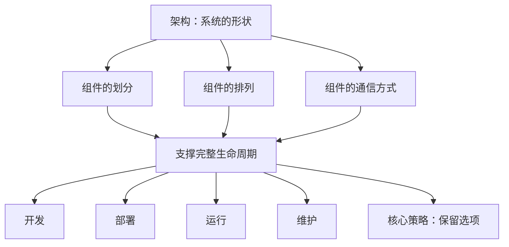
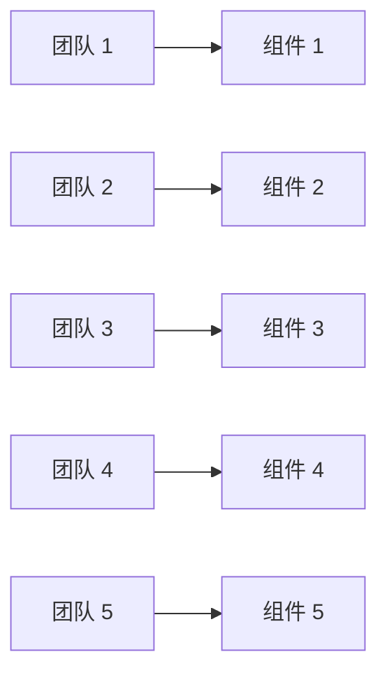
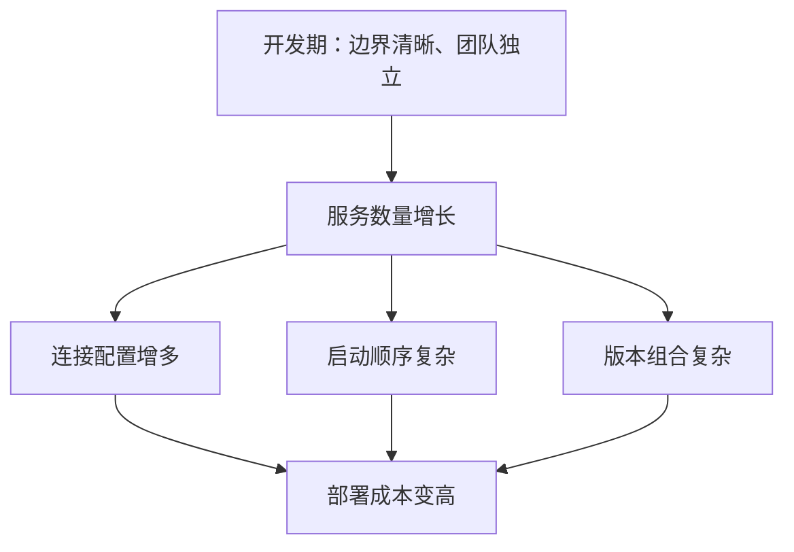
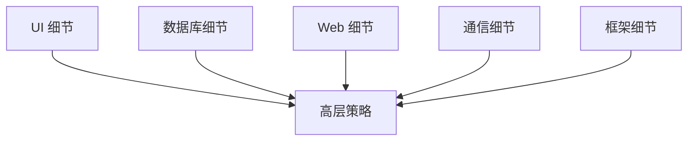
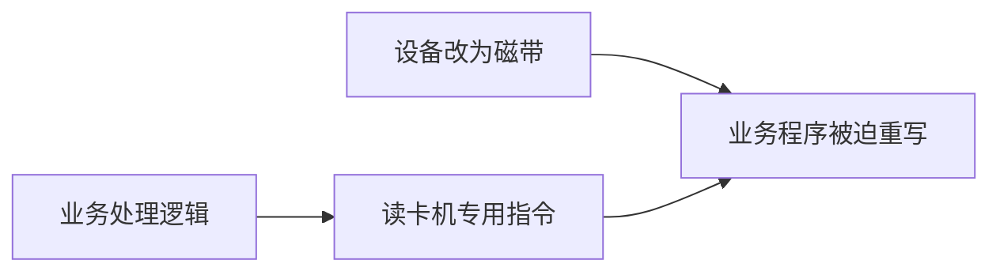
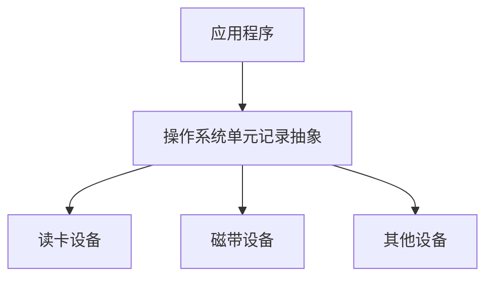
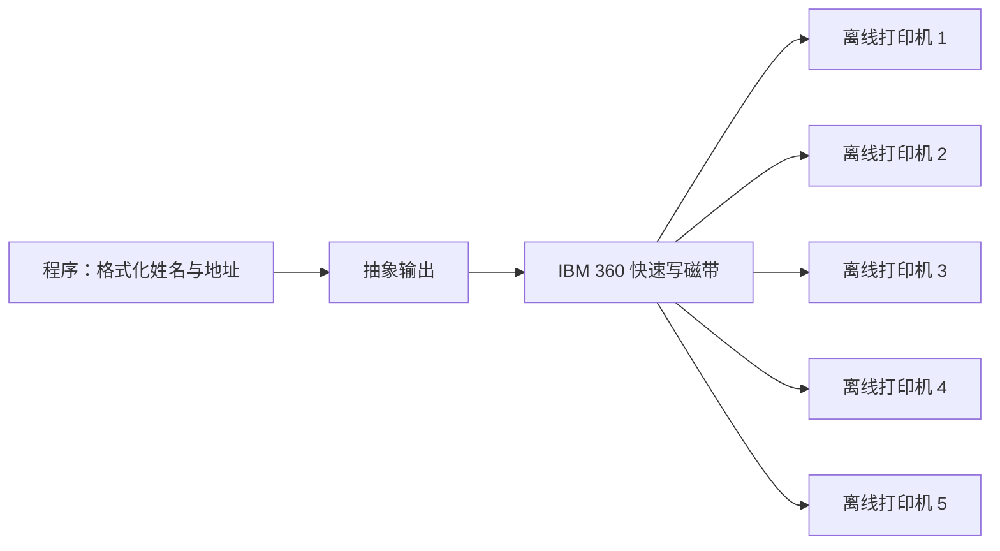
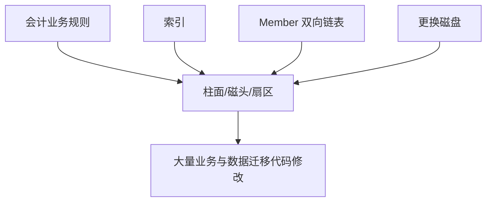
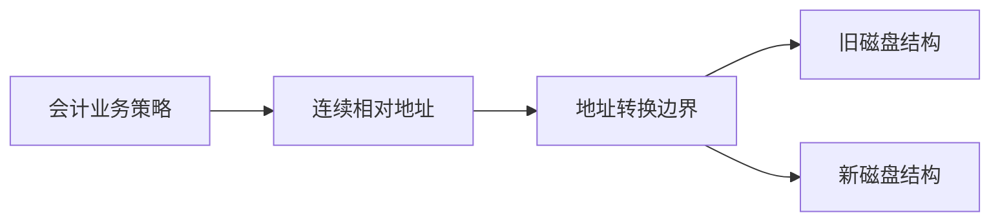

> 原书：Robert C. Martin, *Clean Architecture: A Craftsman's Guide to Software Structure and Design*<br>
> 本章：Chapter 15, What Is Architecture?<br>
> 原文参考：Clean Architecture.md

## 本章导读
> **原书图示**：Chapter 15 章首页
第 15 章是 Part V“Architecture”的开篇。

前面的章节已经讨论：

- 编程范式为程序施加什么约束；
- SOLID 如何组织类与源码依赖；
- 组件如何形成部署单元；
- 组件内部如何保持内聚；
- 组件之间如何避免环并依赖稳定抽象。

现在作者回到一个最基本的问题：

> **软件架构究竟是什么？架构师究竟在优化什么？**

本章给出的答案并不是某种框架、部署拓扑或固定目录模板。

> **软件架构是建造者赋予系统的形状。这个形状体现在组件怎样划分、怎样排列，以及怎样相互通信。**

这种形状的目的，是促进系统的完整生命周期：

- 开发；
- 部署；
- 运行；
- 维护。

它采用的核心策略是：

> **尽可能长时间地保留尽可能多的选项。**



为了说明“保留选项”不是抽象口号，作者讲了两个亲身经历的历史故事：

1. 设备无关性让打印程序不必绑定读卡机、磁带或打印机；
2. 相对寻址让会计业务不必知道磁盘的柱面、磁头和扇区。

两个故事都指向同一个架构动作：

> **把高层策略与低层细节分离，让策略不知道细节，并把细节决策推迟到真正需要的时候。**

## 1. 软件架构师与软件架构

### 1.1 “架构”为什么显得神秘

“架构”这个词容易让人联想到：

- 重大的技术决策；
- 对系统全局的掌控；
- 深厚的工程经验；
- 组织中的权力与声望。

于是，人们常把架构师想成脱离日常代码、只画高层图和制定规范的人。

作者在本章开头直接否定这种想象。

### 1.2 软件架构师首先是程序员

原书强调：

> **软件架构师是程序员，并且持续是程序员。**

架构师可能不像其他开发者那样承担同样数量的功能任务，但仍应持续参与：

- 编写生产代码；
- 阅读现有实现；
- 调试真实问题；
- 运行构建和测试；
- 处理依赖与部署；
- 参与重构；
- 感受团队日常开发流程。

架构工作不是编程工作的替代品，而是在编程经验之上增加系统级责任。

### 1.3 为什么架构师不能脱离代码

作者给出的理由很直接：如果架构师没有亲身经历自己为其他程序员制造的问题，就无法做好架构工作。

假设架构师规定：

- 所有功能都必须经过复杂代码生成；
- 一个小改动需要更新多个组件版本；
- 本地测试必须启动十几个服务；
- 业务代码必须继承某个框架基类；
- 发布必须手工配置大量连接。

若架构师从不亲自完成这些步骤，就很难准确感知它们的真实成本。


持续写代码让架构决策形成反馈闭环，也限制架构师凭空制造复杂性。

### 1.4 架构师的代码参与不等于包揽实现

架构师持续编程，不代表：

- 所有关键代码都由架构师亲自完成；
- 架构师成为所有变更的审批瓶颈；
- 团队只能执行架构师给出的细节方案；
- 架构师用个人英雄主义替代团队能力。

更合理的角色是：

- 通过真实代码验证架构边界；
- 在高风险位置参与实现；
- 帮助团队发现依赖方向问题；
- 保持对工具链和开发体验的理解；
- 让架构知识在团队中传播。

### 1.5 架构是系统的形状

原书把架构定义为建造者赋予系统的 shape，也就是形状。

这个形状主要由三件事构成：

| 方面 | 要回答的问题 |
| --- | --- |
| 组件划分 | 哪些代码属于同一个组件？ |
| 组件排列 | 哪些组件处在高层，依赖应该指向哪里？ |
| 通信方式 | 组件通过函数、接口、消息还是网络协议交互？ |

架构不是单张图，也不是一份选型清单。它真实存在于：

- 源码依赖；
- 构建规则；
- 组件边界；
- 运行时连接；
- 部署流程；
- 数据所有权；
- 团队能够和不能够独立完成的工作。

### 1.6 架构形状的目的

一个形状是否优秀，不看它是否流行，而看它能否促进系统生命周期。

好的架构应让系统：

- 容易理解；
- 容易开发；
- 容易部署；
- 容易运行；
- 容易维护。

最终目标是：

- 降低系统整个生命周期的人力与风险成本；
- 提高程序员持续交付价值的能力。

### 1.7 一个能运行的系统未必有好架构

作者提出一个反直觉判断：系统架构与系统当前能否工作，关系可能很小。

现实中存在许多系统：

- 功能正确；
- 运行多年；
- 用户能够正常使用；
- 但每次改动都极其痛苦。

它们的问题通常表现为：

- 新功能开发缓慢；
- 部署步骤脆弱；
- 缺陷难以定位；
- 修改容易引入回归；
- 技术替换代价巨大；
- 团队不敢碰某些代码。

“系统能工作”证明了行为实现正确，却不能证明系统形状能够支撑未来变化。

### 1.8 应怎样理解作者的强烈措辞

作者并不是说架构对正确行为完全不重要。

架构仍要支持：

- 用例执行；
- 数据流动；
- 性能需求；
- 安全边界；
- 可靠性目标；
- 并发与一致性约束。

他的重点是：对很多商业系统而言，即使架构糟糕，也能靠直接编码实现当前功能；真正长期暴露架构质量的，是后续开发、部署和维护成本。

在实时控制、安全关键、资源受限或超大规模系统中，架构甚至可能直接决定系统能否满足运行要求。阅读时应保留这个适用边界。

### 1.9 架构的核心策略

为了降低生命周期成本，架构要尽量延迟不必要的具体决定。

它不是追求“什么都不决定”，而是区分：

- 现在必须明确的高层策略；
- 可以在更多信息出现后再决定的实现细节。

架构师通过边界和依赖方向，让数据库、框架、协议和设备不进入核心策略，从而保留替换和实验空间。

## 2. Development：支持开发

### 2.1 难以开发的系统不会健康长寿

软件会不断接受：

- 新需求；
- 缺陷修复；
- 法规变化；
- 技术升级；
- 性能改进；
- 安全修补。

若每次开发都需要理解整个系统、协调许多团队或修改大量无关代码，系统很难保持长期健康。

因此，架构首先要适合实际开发它的团队。

### 2.2 五人小团队的情形

原书举出一个五人团队。

这样的小团队可能在开发早期有效地共同维护一个单体，即使系统尚未建立严格组件与接口。

原因包括：

- 沟通直接；
- 所有人都理解大部分代码；
- 变更可以快速协调；
- 发布通常由同一组人负责；
- 过多边界反而增加导航和装配成本。

此时，过早建立大量独立组件和正式接口，可能被团队视为阻碍。

### 2.3 小团队的便利为什么会留下隐患

许多系统最初由小团队完成，因此可以在缺乏明确架构时快速前进。

成功后，系统和团队开始增长，但原来的隐式协作方式没有同步演化：

- 共享知识只存在于少数人脑中；
- 任何模块都能直接调用任何模块；
- 构建与测试越来越慢；
- 新成员难以理解边界；
- 团队开始互相踩踏代码。

早期不需要的结构，可能在规模变化后变得必要。

### 2.4 五个七人团队的情形

作者再举出一个由五个团队组成、每个团队七人的系统。

这种规模很难继续共享一个没有边界的代码整体。团队需要：

- 定义良好的组件；
- 可靠而稳定的接口；
- 清楚的代码所有权；
- 可独立构建的发布单元；
- 可预测的依赖方向。

否则，每个团队的变化都会立即干扰其他团队。

### 2.5 团队结构会塑造组件结构

如果只考虑开发进度，系统很可能演化成五个组件，每个团队负责一个。



这种结构降低团队之间的日常协调，但不一定是系统在其他维度上的最佳形状。

### 2.6 “每团队一个组件”的代价

组织边界可能与软件边界不完全一致。

一个按团队划分的组件结构可能造成：

- 一次业务用例跨越多个团队；
- 部署需要协调多个组件；
- 数据所有权模糊；
- 运行时调用链过长；
- 维护责任被业务流程切碎。

因此，架构师需要同时考虑团队可开发性与系统长期结构，而不能只让当前组织图决定软件图。

### 2.7 架构约束应随规模演化

适合小团队的规则，不一定适合大团队；适合大团队的流程，也不应机械套在原型项目上。

可以逐步增强：

1. 先明确少数关键模块边界；
2. 当共同变化模式出现时应用 CCP；
3. 当团队开始互相干扰时建立稳定接口；
4. 当组件被复用时增加发布纪律；
5. 当依赖图增长时自动检测环；
6. 当部署成本上升时重新审视物理拆分。

好的架构不是一次性添加最大约束，而是在系统增长前提供足够结构，并持续调整。

### 2.8 开发维度的检查问题

- 新成员能否快速找到业务用例？
- 修改一个功能要跨越多少组件和团队？
- 团队是否经常修改别人拥有的内部代码？
- 本地构建是否需要整个系统？
- 接口是否稳定到足以支持并行开发？
- 组件边界是否只是复制组织结构？
- 架构约束是否与当前规模相称？

## 3. Deployment：支持部署

### 3.1 系统必须能够被有效部署

软件只有进入运行环境并被用户使用，才产生实际价值。

部署成本越高：

- 发布频率越低；
- 修复到达生产越慢；
- 手工错误越多；
- 回滚越困难；
- 团队越害怕改变。

作者因此提出目标：系统应当能够通过一个简单动作完成部署。

### 3.2 “一个动作”应怎样理解

一个动作不代表系统只能有一个文件或一个进程。

它意味着部署过程应当：

- 被自动化；
- 可重复；
- 可观察；
- 可验证；
- 可回滚；
- 不依赖临场手工协调。

背后可以有许多步骤，但使用者不应每次重新发明部署顺序。

### 3.3 部署经常在初期被忽略

开发早期，团队更关注尽快实现功能。部署可能暂时只在一台开发机上完成，于是很多问题尚未显现：

- 环境配置怎样管理；
- 依赖服务如何启动；
- 数据迁移何时运行；
- 版本不一致怎样处理；
- 失败后怎样回滚；
- 密钥和权限怎样配置。

如果架构只优化编码便利，生产部署可能成为昂贵且脆弱的仪式。

### 3.4 微服务案例

原书以微服务为反面提醒。

开发者可能发现微服务具有清晰边界和相对稳定接口，不同团队也能独立开发。

但服务数量不断增加后，部署团队会面对：

- 大量服务配置；
- 服务发现；
- 网络权限；
- 启动时序；
- 版本兼容；
- 超时和重试；
- 日志与追踪；
- 数据一致性；
- 故障排查。



开发局部最优，不等于生命周期整体最优。

### 3.5 更少的服务可能更好

若架构师早期同时考虑部署，可能选择：

- 更少的独立服务；
- 服务与进程内组件的混合结构；
- 统一管理连接与配置；
- 先用模块化单体保持边界；
- 只把确有独立部署收益的部分拆成服务。

这不是反对微服务，而是要求物理分布带来的收益足以支付运维和部署成本。

### 3.6 逻辑边界与物理边界可以分开

系统可以先建立清晰逻辑组件，而不立即把每个组件部署成远程服务。

这样可以：

- 保护源码依赖方向；
- 保留未来拆分空间；
- 避免过早承担网络复杂性；
- 用真实负载和团队需求决定服务边界。

把“组件”直接等同于“微服务”，会过早锁定通信和部署细节。

### 3.7 部署维度的检查问题

- 能否通过自动化流程完成一次部署？
- 是否需要人手工记忆启动顺序？
- 服务数量是否超过团队运维能力？
- 配置和版本是否可以一致追踪？
- 数据迁移是否安全、可回滚？
- 一个组件升级是否迫使全部组件同步发布？
- 当前物理拆分是否带来明确收益？

## 4. Operation：支持运行

### 4.1 作者的成本判断

原书认为，架构对运行的影响通常不如对开发、部署和维护那么剧烈。

很多运行问题可以通过增加：

- 服务器；
- 存储；
- 缓存；
- 网络带宽；
- 数据库副本；

获得缓解，而不必彻底改变软件结构。

作者用“硬件便宜，人力昂贵”解释为什么生命周期成本更偏向开发、部署和维护。

### 4.2 这个判断的适用边界

今天仍不能把它理解为“性能不重要”。

以下系统中，运行架构可能直接决定成败：

- 实时控制；
- 嵌入式设备；
- 大规模云服务；
- 高频交易；
- 视频和模型推理；
- 严格能源或成本约束环境；
- 高可用安全关键系统。

增加硬件也可能带来巨大云成本、协调开销和复杂故障模式。

更稳妥的理解是：不要为了少量运行效率，把系统做得极难开发和维护；同时要根据真实运行约束做权衡。

### 4.3 架构还应揭示运行

作者随后给出更重要的一点：

> **Architecture should reveal operation，架构应当揭示系统如何运行。**

开发者看到系统结构时，应能识别：

- 主要用例；
- 核心特性；
- 必要行为；
- 关键数据流；
- 系统意图。

用例应该成为架构中的一等实体和可见地标。

### 4.4 框架目录为什么无法揭示系统意图

假设一个项目顶层只有：

- `controllers`；
- `services`；
- `models`；
- `repositories`；
- `utils`。

这些名称告诉读者系统使用了怎样的技术分层，却没有告诉读者这是：

- 订单系统；
- 医疗预约系统；
- 课程平台；
- 财务结算系统。

如果架构围绕 `PlaceOrder`、`ApproveRefund`、`ScheduleAppointment` 等用例组织，运行意图会更容易被看见。

### 4.5 “揭示运行”不只是写文档

文档可以解释系统，但架构本身也应表达意图：

- 组件名称使用业务语言；
- 用例有明确入口；
- 核心规则不被框架类型淹没；
- 数据流和边界可追踪；
- 外部细节位于外围。

如果只有资深开发者阅读额外文档后才能理解系统做什么，代码形状还没有充分揭示运行。

### 4.6 运行维度的检查问题

- 从组件名称能否看出系统主要用例？
- 关键行为是否是一等模块？
- 运行时数据流是否容易追踪？
- 业务意图是否被框架目录掩盖？
- 性能与可靠性约束是否在正确边界处理？
- 系统是否只能靠大量硬件掩盖结构问题？

## 5. Maintenance：支持维护

### 5.1 维护是生命周期中最昂贵的部分

系统上线后，维护并不会结束，而是持续出现：

- 新功能；
- 缺陷修复；
- 安全更新；
- 业务规则变化；
- 数据迁移；
- 外部系统升级；
- 技术债处理。

这些活动会持续消耗大量人力，因此维护成本常常超过最初开发。

### 5.2 维护成本之一：Spelunking

作者用 spelunking，也就是洞穴探险，形容开发者在陌生代码中挖掘。

为了增加功能或修复缺陷，开发者需要找出：

- 正确修改位置在哪里；
- 哪些模块共同参与行为；
- 哪些隐式约定不能破坏；
- 哪些测试覆盖了该路径；
- 哪些依赖会受到影响；
- 怎样修改才能符合现有设计。

系统边界越模糊，探洞范围越大。

### 5.3 维护成本之二：Risk

找到修改位置后，仍然存在无意破坏其他行为的风险。

风险来源包括：

- 共享可变状态；
- 隐藏副作用；
- 循环依赖；
- 过宽接口；
- 重复业务规则；
- 缺少测试边界；
- 框架细节穿透核心；
- 一次变化跨越过多组件。

开发者越难预测影响，越需要扩大回归测试和发布保护范围。

### 5.4 架构怎样降低探洞成本

清晰组件和稳定接口能为新功能照亮路径：


开发者可以按边界判断：

- 业务规则应该进入哪里；
- 外部系统适配应该进入哪里；
- 哪些组件不应被修改；
- 哪些测试需要更新。

架构并不会自动写出功能，但会减少寻找正确路径的时间。

### 5.5 架构怎样降低修改风险

隔离组件可以让变化停留在有限范围：

- 用例变化主要影响对应策略；
- 数据库变化主要影响 Adapter；
- UI 变化不进入领域规则；
- 新实现通过稳定接口替换；
- 自动测试围绕边界建立。

修改边界越清楚，开发者越容易判断哪些行为应保持不变。

### 5.6 稳定接口并非永不改变

接口可能随着业务理解演化。所谓稳定，是：

- 变化有明确原因；
- 不被低层实现细节频繁推动；
- 兼容性影响可理解；
- 消费者能够控制升级；
- 新能力优先通过扩展加入。

为了避免改接口而制造巨大“万能接口”，同样会增加维护风险。

### 5.7 维护维度的检查问题

- 增加典型功能前需要阅读多少无关代码？
- 开发者能否迅速找到正确边界？
- 一个缺陷修复会触碰多少组件？
- 哪些区域因害怕回归而无人敢改？
- 稳定接口是否隔离了外部细节？
- 测试是否与架构边界一致？
- 修改后影响范围能否从依赖图推导？

## 6. Keeping Options Open：保留选项

### 6.1 软件的行为价值与结构价值

前文已经区分软件的两种价值：

- 行为价值：系统今天完成用户需要的功能；
- 结构价值：系统明天仍然容易改变。

软件之所以“软”，正因为它能以较低成本改变机器行为。

这种柔软性取决于：

- 组件怎样划分；
- 依赖指向哪里；
- 哪些细节被隔离；
- 哪些决定尚未锁死。

### 6.2 应保留哪些选项

原书的答案是：保留那些暂时不重要的细节选项。

这里的“不重要”不是说细节没有价值，而是说它们不决定高层业务策略。

例如，订单系统的真正价值可能是：

- 哪些订单可以提交；
- 价格怎样计算；
- 库存怎样承诺；
- 退款怎样批准。

数据库和 Web 框架让这些规则能够与外界交互，但不应决定规则本身。

### 6.3 Policy：策略

Policy 表达系统的业务规则与业务过程，是系统价值所在。

它包括：

- 领域不变量；
- 用例步骤；
- 决策规则；
- 权限政策；
- 计算规则；
- 业务状态变化。

策略应使用业务语言，并尽量独立于外部技术。

### 6.4 Details：细节

Details 使人类、其他系统和程序员能够与策略通信。

原书列出的细节包括：

- IO 设备；
- 数据库；
- Web 系统；
- 服务器；
- 框架；
- 通信协议。

今天还可以包括：

- 云厂商 SDK；
- 消息队列；
- ORM；
- 序列化格式；
- UI 工具包；
- 日志和监控实现。

这些技术可能很重要，但不应渗入高层策略的行为定义。

### 6.5 策略与细节是相对关系

同一技术在不同系统中的地位可能不同。

| 系统 | 某项能力 | 可能的角色 |
| --- | --- | --- |
| 电商平台 | 支付供应商 SDK | 细节 |
| 支付网关产品 | 支付路由协议 | 核心策略 |
| 普通业务系统 | 数据库引擎 | 细节 |
| 数据库产品 | 查询优化算法 | 核心策略 |
| 内容网站 | Web 框架 | 细节 |
| Web 框架产品 | 请求生命周期 | 核心策略 |

判断标准不是技术名称，而是它是否体现当前系统真正出售或承担的业务价值。

### 6.6 架构师的目标

架构师要创造一种系统形状：

- 承认策略是最重要的部分；
- 让细节依赖策略；
- 让策略不知道具体细节；
- 让细节可以替换；
- 让选择细节的时间尽可能推迟。



图中的箭头表示源码依赖方向，运行时控制流仍可以进入外部实现。

### 6.7 数据库不必过早决定

高层策略不应关心数据最终存入：

- 关系数据库；
- 分布式数据库；
- 层次数据库；
- 平面文件；
- 内存结构。

开发早期可以用简单内存实现验证业务规则，在真正掌握数据规模、查询模式、一致性和运维约束后再选择数据库。

这不代表数据模型可以完全忽略。业务实体、事务边界和一致性要求可能属于策略，需要尽早理解；具体存储产品和访问机制才是可推迟细节。

### 6.8 Web 服务器甚至 Web 本身不必过早决定

若高层策略不知道 HTML、AJAX 或具体 Web 框架，就可以通过不同入口交付：

- Web 页面；
- 命令行；
- 桌面程序；
- API；
- 后台任务；
- 测试驱动程序。

系统可以先验证用例，再决定主要交付渠道。

如果业务规则直接接收框架 Request 并返回框架 Response，Web 细节已经进入核心，选择就很难推迟。

### 6.9 REST、微服务和 SOA 不必过早决定

REST、微服务和 SOA 都是系统与外界或组件之间的组织方式。

高层策略应该表达：

- 需要什么输入；
- 执行什么用例；
- 产生什么结果；
- 遇到什么业务失败。

至于是通过本地调用、消息、HTTP 还是其他协议传递，可以由边界 Adapter 决定。

过早把用例设计成某种传输协议，会让协议约束反过来塑造业务模型。

### 6.10 依赖注入框架不必过早决定

DIP 要求高层依赖抽象，但不要求必须使用特定 DI 容器。

对象可以通过：

- 手工构造；
- 构造函数参数；
- 工厂；
- 组合根；
- DI 容器；

完成装配。

高层策略只需接收所需协作者，不应知道依赖由哪个框架解析。

### 6.11 推迟决策能获得更多信息

开发早期，团队往往不知道：

- 真实数据量；
- 访问模式；
- 延迟目标；
- 用户交互方式；
- 团队运维能力；
- 第三方技术限制；
- 成本与许可证约束。

随着可运行策略和真实反馈出现，这些信息会逐渐清楚。越晚做不可逆的细节选择，越有机会依据事实而不是猜测。

### 6.12 推迟决策允许做实验

如果策略与数据库无关，团队可以把同一套用例连接到不同存储实现，比较：

- 开发便利；
- 查询性能；
- 事务能力；
- 运维成本；
- 迁移难度。

同理，也可以实验不同 Web、消息或部署机制。

实验不是为了永远支持所有选择，而是为了在决策期限到来前获得更可靠信息。

### 6.13 即使公司已经选型，也要隔离选择

现实中，公司可能已经统一：

- 数据库；
- 云平台；
- Web 框架；
- 消息系统；
- 服务治理工具。

原书建议，好的架构师应“假装决定尚未做出”，仍然让高层策略与这些技术解耦。

这句话的实际含义是：

- 不让供应商类型进入业务接口；
- 不让框架生命周期控制领域对象；
- 通过 Adapter 封装技术 API；
- 把具体选择集中在组合根；
- 保留替换、升级和测试能力。

它不是无视公司标准，而是不把今天的标准变成永远无法改变的业务规则。

### 6.14 推迟决策不是拖延

| 推迟决策 | 拖延 |
| --- | --- |
| 主动建立边界 | 不做准备 |
| 明确决策期限 | 没有时间点 |
| 收集信息和实验 | 只是等待 |
| 保持多个可行选择 | 任由选择消失 |
| 到期后果断决定 | 临时仓促决定 |

架构上的推迟需要付出设计成本。只有当保留选项的价值高于边界成本时才值得。

### 6.15 哪些决策不应推迟

有些问题本身属于策略或早期约束，例如：

- 核心业务不变量；
- 安全与隐私模型；
- 法规要求；
- 数据所有权；
- 一致性边界；
- 必须满足的实时期限；
- 不可接受的失败模式。

这些决定会塑造系统根本能力，不能全部当成技术细节。

### 6.16 好架构师最大化尚未做出的决定

原书用一句话概括本节：

> **好的架构师最大化尚未做出的决定数量。**

这里追求的不是数量游戏，而是避免过早锁定无关细节。真正衡量标准是：系统是否仍能以合理成本改变那些尚未成熟的技术选择。

## 7. Device Independence：设备无关性

### 7.1 历史背景

作者把时间带回 1960 年代。当时计算机仍处于早期，许多程序员来自数学和其他工程领域，其中三分之一甚至更多是女性。

今天理所当然的操作系统抽象，当时还在探索中。程序员常直接控制具体硬件。

### 7.2 最初的设备相关程序

如果程序需要打印，开发者会直接写控制打印设备的机器指令。

作者给出一段 PDP-8 电传打字机输出子程序：

```text
PRTCHR, 0
        TSF
        JMP .-1
        TLS
        JMP I PRTCHR
```

理解本章不需要掌握 PDP-8 汇编，只需知道：

- `TSF` 检查电传打字机是否准备好；
- 若设备忙，程序跳回去继续等待；
- `TLS` 把字符发送到设备；
- 这些指令与具体电传打字机绑定。

### 7.3 起初为什么看不出错误

直接控制设备具有明显优点：

- 代码简单直接；
- 功能立即可用；
- 没有额外抽象；
- 性能和硬件行为容易掌握。

读卡机、打孔机和打印机都可以用各自专用代码操作。只要设备不变，程序完全正常。

架构问题往往不是当前功能失败，而是外部细节变化时才显现。

### 7.4 穿孔卡片带来的数据问题

大批穿孔卡片很难管理：

- 可能丢失；
- 可能损坏；
- 可能被打乱顺序；
- 可能掉落；
- 可能混入额外卡片。

磁带更安全、更快，也更容易备份，因此逐渐成为更好的输入输出介质。

### 7.5 设备绑定造成重写

虽然业务处理逻辑没有改变，原有程序却直接操作读卡机和打孔机。

从卡片迁移到磁带时，大量程序不得不重写。



问题不是磁带技术特殊，而是设备细节已经进入每个程序。

### 7.6 操作系统提供抽象设备

到 1960 年代末，操作系统开始把具体 IO 设备抽象成处理 unit records，也就是单元记录的服务。

应用程序只调用抽象记录服务。操作员再告诉操作系统，这项服务实际连接到：

- 读卡机；
- 打孔机；
- 磁带；
- 其他兼容设备。



### 7.7 同一程序不再因设备改变而修改

有了设备无关性：

- 程序描述读取或写入记录；
- 操作系统处理具体设备；
- 运行配置选择实际介质；
- 更换设备不要求修改高层程序。

作者称这是 Open-Closed Principle 的诞生，尽管当时还没有这个名字：新增设备实现扩展系统，而不修改既有业务程序。

### 7.8 设备无关性的架构含义

这个案例包含完整的策略与细节分离：

| 角色 | 内容 |
| --- | --- |
| 策略 | 怎样处理一条业务记录 |
| 抽象边界 | 单元记录读写服务 |
| 细节 | 读卡机、磁带、打印机 |
| 选择时机 | 运行配置或操作时 |

选择具体设备被推迟，程序因此保持柔软。

## 8. Junk Mail：垃圾邮件案例

### 8.1 业务场景

1960 年代末，作者在一家为客户打印广告邮件的公司工作。

客户提供磁带，其中包含顾客的：

- 姓名；
- 地址；
- 其他个性化字段。

公司编写程序，把这些字段打印到预先印好大部分文字的表格信纸上。

### 8.2 处理规模

表格信纸以巨大卷筒提供：

- 每卷重约 500 磅；
- 包含数千封信；
- 客户可能送来数百卷；
- 每一卷都要逐份打印个性化内容。

这是一项大规模输出任务。

### 8.3 最初的运行瓶颈

公司最初使用 IBM 360 的唯一一台行式打印机。

每个班次只能打印几千封信，而且打印工作会长时间占用昂贵主机。当时 IBM 360 每月租金高达数万美元，使用主机直接等待打印非常浪费。

### 8.4 把输出改为磁带

团队让操作系统把程序的输出目标从行式打印机改为磁带。

关键是：程序本身不需要修改，因为它依赖的是操作系统 IO 抽象，而不是具体打印机。

IBM 360 大约十分钟就能写满一盘磁带，足以打印数卷表格信纸。

### 8.5 离线打印架构

写好的磁带被带出机房，装入连接离线打印机的磁带机。

公司拥有五台离线打印机，它们每天 24 小时、每周 7 天持续工作，每周能够打印数十万封广告邮件。



### 8.6 为什么这个优化不需要改业务代码

程序负责的策略始终是：

- 读取顾客记录；
- 选择个性化字段；
- 把字段放在表格正确位置；
- 产生输出记录。

输出设备是细节：

- 测试时可以使用本地行式打印机；
- 大规模生产时可以写到磁带；
- 磁带再交给多台离线打印机。

设备选择甚至被推迟到每次运行时。

### 8.7 设备无关性的真正价值

这个案例带来的收益不只是一种设备可替换：

- 昂贵主机不再被慢速打印长期占用；
- 输出工作可以并行扩展到多台设备；
- 测试和生产可使用不同设备；
- 同一业务程序无需复制；
- 新输出方式可以在边界外增加。

架构形状让团队在问题出现后拥有解决选项。

### 8.8 现代对应场景

今天可以看到同样模式：

- 测试把通知写入内存，生产发送电子邮件；
- 应用输出领域事件，外层选择 Kafka 或其他消息系统；
- 报表用例产生中立模型，Adapter 选择 PDF、CSV 或打印机；
- 文件接口在本地写磁盘，在云环境写对象存储。

核心价值不是“多写一个接口”，而是让策略不依赖输出机制。

## 9. Physical Addressing：物理寻址案例

### 9.1 会计系统背景

1970 年代初，作者参与开发一个卡车司机工会的大型会计系统。

系统使用一块 25MB 磁盘，保存三类记录：

- Agents；
- Employers；
- Members。

三类记录大小不同，因此磁盘被按物理区域特殊格式化。

### 9.2 业务代码知道磁盘几何结构

系统知道磁盘具有：

- 200 个柱面；
- 10 个磁头；
- 每个磁头上有若干扇区；
- 哪些柱面保存 Agent；
- 哪些柱面保存 Employer；
- 哪些柱面保存 Member。

这些物理知识被硬编码到软件各处。

### 9.3 索引也保存物理位置

系统在另一组特殊柱面中维护索引。

Agent 索引记录包括：

- Agent ID；
- 柱面号；
- 磁头号；
- 扇区号。

Employer 与 Member 也使用类似索引。

Member 记录还组成磁盘上的双向链表，每条记录直接保存前一条和后一条记录的物理位置。

### 9.4 升级磁盘会发生什么

若更换一块具有不同磁头数、柱面数或每柱面扇区数的磁盘，原有物理地址全部失效。

团队必须：

- 编写迁移程序读取旧数据；
- 按新磁盘结构重新写入；
- 转换所有柱面、磁头和扇区位置；
- 修改散布在业务代码中的硬编码；
- 重建索引和链表地址；
- 重新验证所有相关规则。

磁盘结构本应是低层细节，却污染了所有高层业务。



### 9.5 更有经验的程序员提出相对地址

一位更有经验的程序员加入团队，看到这种设计后十分震惊。

他建议：

- 把磁盘视为一个巨大的线性扇区数组；
- 每个扇区使用连续整数作为相对地址；
- 业务代码和索引只保存相对地址；
- 由一个小型转换例程理解实际磁盘结构；
- 运行时把相对地址转换成柱面、磁头和扇区。

### 9.6 相对寻址怎样改变依赖

改造前：

- 每个业务模块知道磁盘几何；
- 物理设备变化会传遍系统。

改造后：

- 业务模块只知道连续逻辑地址；
- 一个边界模块知道物理磁盘；
- 更换磁盘主要修改转换实现；
- 高层策略保持不变。



### 9.7 为什么不需要掌握 CHS 转换公式

本章重点不是怎样计算柱面、磁头和扇区，而是谁应该知道这种计算。

即使转换算法完全正确，如果它散布在业务代码中，架构仍然脆弱。

把算法集中到细节边界后：

- 业务只使用稳定逻辑身份；
- 物理布局可以独立改变；
- 转换算法可以单独测试；
- 决策被限制在最了解设备的一处。

架构问题关注知识的归属，而不是计算本身的复杂程度。

### 9.8 相对地址也是一层间接

相对地址在业务身份与物理位置之间加入间接层。

这与很多现代设计类似：

| 稳定身份 | 可变物理细节 |
| --- | --- |
| 对象 ID | 数据库行位置 |
| 资源 URI | 实际服务器地址 |
| 逻辑队列名 | 消息代理分区 |
| 文件键 | 本地路径或对象存储位置 |
| 服务接口 | 具体进程和网络端点 |

间接层让位置可以变化，而使用者继续依赖稳定身份。

### 9.9 作者采纳建议后的结果

团队把高层策略改为不知道磁盘物理结构。

于是：

- 会计规则不再依赖设备几何；
- 磁盘升级决策与应用解耦；
- 物理地址转换集中管理；
- 系统保留了适配新设备的选项。

与设备无关性案例一样，细节被推到边界，高层策略恢复稳定。

### 9.10 现代数据库类比应谨慎理解

业务代码直接写 SQL、依赖具体表结构，与物理寻址有相似风险，但不能简单认为“任何 SQL 都是错误”。

真正要检查的是：

- 低层存储结构是否扩散进核心业务规则；
- 多个组件是否共享内部表；
- 更换存储机制时需要修改多少策略代码；
- 数据模型是否属于领域策略还是持久化细节；
- 边界是否增加了真实独立性。

有时数据库就是系统的重要约束，抽象也不能假装代价不存在。

## 10. Conclusion：分离、解耦与推迟

### 10.1 两个故事的共同结构

设备无关和相对寻址看似是很小的技术故事，却展示了架构师在大型系统中使用的同一原则。

| 案例 | 高层策略 | 低层细节 | 稳定边界 |
| --- | --- | --- | --- |
| 设备无关性 | 处理和格式化记录 | 读卡机、磁带、打印机 | 抽象 IO 服务 |
| 物理寻址 | 会计记录与业务规则 | 柱面、磁头、扇区 | 相对地址转换 |

两者都把易变物理选择限制到边界外侧。

### 10.2 原书结论

好的架构师会：

1. 仔细区分策略与细节；
2. 让策略彻底不知道具体细节；
3. 让源码依赖从细节指向策略；
4. 通过稳定边界连接双方；
5. 尽可能推迟细节决定。

可以记成三个动作：

> **分离策略与细节，解耦二者的依赖，推迟细节决策。**

### 10.3 本章完整论证链

1. 架构师仍然是程序员，需要亲身承受架构决策；
2. 架构是组件划分、排列与通信形成的系统形状；
3. 这个形状服务开发、部署、运行和维护；
4. 架构质量更多影响生命周期成本，而不只影响当前功能能否运行；
5. 小团队可能暂时不需要严格边界，大团队则需要稳定组件；
6. 按团队优化开发不一定同时优化部署和维护；
7. 部署应自动、简单且可重复，过多微服务会增加部署风险；
8. 运行问题有时可通过硬件缓解，但架构还应揭示系统用例；
9. 维护成本主要来自寻找修改路径和担心无意破坏；
10. 清晰组件与稳定接口能降低这两种成本；
11. 保持软件柔软的方法是保留细节选项；
12. 数据库、Web、协议和框架通常不应进入高层策略；
13. 推迟决策可以获得更多信息并开展实验；
14. 即使组织已选型，也应把该选择隔离在边界外；
15. 设备无关性证明应用可以不因 IO 设备改变而重写；
16. 相对寻址证明业务可以不因物理磁盘改变而重写；
17. 两个故事共同说明架构应让策略不依赖细节。

### 10.4 架构的价值怎样被观察

可以通过变化场景判断架构是否保留选项：

- 更换数据库会修改多少业务规则？
- 增加命令行入口是否需要复制用例？
- 从本地调用改为消息传递时，核心策略是否变化？
- 替换 Web 框架是否影响领域模型？
- 测试能否绕过真实设备和外部服务？
- 部署方式变化是否迫使业务重写？

选项并非必须真的被使用。它的价值在于，当环境变化时，系统仍有低成本路径。

## 11. 在现代项目中应用本章思想

### 11.1 先写出系统的策略清单

列出系统真正创造价值的业务能力，例如：

- 创建订单；
- 审批退款；
- 计算保险资格；
- 安排课程；
- 分配库存；
- 生成工资。

这些能力应当在架构中可见，并拥有不依赖外部技术的核心模型。

### 11.2 再列出外围细节

对每项能力列出当前技术：

- 数据库；
- Web 框架；
- 消息系统；
- 云 SDK；
- 第三方 API；
- 文件和设备；
- 定时器；
- 依赖注入容器。

然后检查这些具体名称是否出现在策略源码中。

### 11.3 为真正的边界定义 Port

Port 应从用例需要出发，而不是复制供应商 API。

例如，退款用例需要的可能是：

- 发起退款；
- 查询退款结果；
- 处理明确的业务失败。

它不需要知道供应商请求对象、HTTP 状态码或 SDK 客户端生命周期。

外层 Adapter 负责翻译双方模型。

### 11.4 把技术选择集中到组合根

组合根负责：

- 读取配置；
- 选择具体实现；
- 创建 Adapter；
- 连接对象图；
- 启动入口。

核心策略不应自行读取“使用哪个数据库”或“启用哪个消息代理”的配置。

### 11.5 为决策设置期限

每个被推迟的决定都应记录：

- 为什么可以推迟；
- 当前保留哪些选择；
- 需要收集什么信息；
- 最晚何时必须决定；
- 做出决定后哪些边界仍要保留。

这样可以避免把“保留选项”变成无限期悬而不决。

### 11.6 用简单实现验证策略

在真实细节尚未决定时，可以使用：

- 内存仓储；
- 本地文件；
- Fake 外部服务；
- 固定时钟；
- 命令行入口；
- 同进程消息实现。

目标是让高层策略尽早可运行和可测试，而不是等待全部基础设施选型完成。

### 11.7 在信息充分后果断关闭选项

保留选项有成本，不能无限维持所有实现。

当团队已获得足够信息，应：

- 选择合适技术；
- 删除不再需要的实验实现；
- 固化必要运行约束；
- 保留核心依赖边界；
- 记录选择理由和重新评估条件。

好的架构不是永远不决定，而是在正确时间做决定。

### 11.8 用替换演练检验边界

可以定期做小型演练：

- 用内存实现替换数据库进行核心测试；
- 用命令行入口驱动同一用例；
- 将通知从真实服务切换到记录型 Fake；
- 在不改策略的情况下替换一个 Adapter；
- 从组合根切换实现配置。

如果演练需要修改高层业务，细节可能已经穿透边界。

### 11.9 平衡边界收益与复杂度

不是每个技术调用都需要接口。

以下情况可以直接依赖：

- 稳定标准库；
- 局部纯函数；
- 没有替换价值的简单值对象；
- 不跨越重要策略边界的实现细节。

更值得隔离的是：

- 易变第三方系统；
- 数据库与设备；
- 测试需要控制的资源；
- 可能采用多种实现的能力；
- 位于高层策略与外界之间的边界。

### 11.10 用生命周期而不是技术潮流评估架构

评估一种架构风格时，应同时问：

| 维度 | 关键问题 |
| --- | --- |
| 开发 | 团队能否独立、高效地修改用例？ |
| 部署 | 能否自动、安全地交付？ |
| 运行 | 性能、可靠性和系统意图是否清楚？ |
| 维护 | 修改路径是否明确，回归风险是否受控？ |
| 选择权 | 哪些细节可以在更多信息出现后再决定？ |

“使用微服务”“使用事件驱动”或“使用某框架”都不是单独的架构成功标准。

## 12. 易混淆概念与常见误解

### 12.1 “架构师不应该写代码”

错误。原书明确要求架构师持续参与编程，否则无法感受自己给团队造成的摩擦。

### 12.2 “架构师应该写最多、最难的代码”

也不对。架构师要保持真实反馈，但不能成为团队瓶颈或垄断关键知识。

### 12.3 “好架构的唯一目标是让系统正确运行”

不完整。正确行为是必要条件，架构还要降低开发、部署和维护的生命周期成本。

### 12.4 “系统已经运行多年，所以架构一定不错”

错误。糟糕架构也能运行，问题可能隐藏在每次改动和发布的高昂成本中。

### 12.5 “小团队不需要任何架构”

错误。小团队可以暂时采用更少结构，但仍应保护核心策略和关键依赖方向，为增长留下空间。

### 12.6 “团队边界就是最佳组件边界”

不一定。它有利于并行开发，却可能不利于部署、运行和维护，需要多维度权衡。

### 12.7 “微服务天然使系统容易部署”

错误。微服务可能方便团队开发，却增加连接、配置、时序和版本管理成本。

### 12.8 “单一动作部署意味着单体”

错误。分布式系统也能通过自动化流水线实现单一操作；重点是可重复和可控制。

### 12.9 “硬件便宜，所以运行效率不重要”

错误。作者只是比较一般生命周期成本。在规模、实时或资源受限场景中，运行架构非常重要。

### 12.10 “架构揭示运行就是补充架构图”

不完整。组件、目录和源码本身应让用例与业务意图成为可见地标。

### 12.11 “维护就是修复缺陷”

错误。维护还包括新功能、技术升级、安全更新、迁移和持续演化。

### 12.12 “策略永远是纯业务，细节永远是技术”

过于绝对。策略与细节取决于系统价值所在。同一协议在普通应用中是细节，在协议产品中可能是策略。

### 12.13 “数据库是任何系统的核心”

错误。对多数业务系统，数据库是保存策略状态的机制，不应决定业务规则。

### 12.14 “推迟数据库选择意味着不设计数据模型”

错误。领域数据、所有权和一致性可能属于策略；可推迟的是具体存储产品与实现机制。

### 12.15 “推迟决策就是不负责任地拖延”

错误。有效推迟要求边界、实验、信息收集和明确决策期限。

### 12.16 “选型已经确定，隔离技术就没有价值”

错误。隔离仍能减少升级影响、改善测试，并防止供应商类型污染业务。

### 12.17 “保留选项越多越好”

不绝对。每个选项都有抽象和维护成本，只应保留价值高且尚未成熟的选择。

### 12.18 “所有外部调用都要包装一层”

错误。边界要隔离易变且重要的细节，不应制造没有收益的转发接口。

### 12.19 “设备无关性只是过时硬件故事”

错误。Repository、云存储 Port、消息接口和可替换通知服务都使用相同思想。

### 12.20 “相对寻址案例的重点是地址换算”

错误。重点是谁知道物理结构。算法集中到边界后，业务策略不再依赖设备。

## 13. 实践检查与掌握练习

### 13.1 架构师角色检查

- 架构师是否持续参与真实代码？
- 是否亲自经历构建、测试与部署？
- 架构决策是否有开发者反馈渠道？
- 架构师是否成为审批瓶颈？
- 团队是否共同理解关键边界？

### 13.2 开发检查

- 当前组件结构适合团队规模吗？
- 一次用例变化跨越多少团队？
- 接口是否支持并行开发？
- 小团队是否承担了不必要的结构负担？
- 大团队是否仍依靠口头协调共享代码？

### 13.3 部署检查

- 部署是否自动、可重复和可回滚？
- 是否需要大量手工配置？
- 服务启动顺序是否脆弱？
- 组件能否独立升级？
- 微服务数量是否与运维能力匹配？
- 是否有更简单的混合结构？

### 13.4 运行检查

- 架构是否清楚呈现主要用例？
- 从目录和组件名能否看出系统意图？
- 运行瓶颈来自真实负载还是结构问题？
- 硬件扩容是否只是暂时掩盖低效？
- 性能、可靠性和成本约束是否被明确处理？

### 13.5 维护检查

- 开发者找到修改位置需要多久？
- 哪些代码区域像黑暗洞穴？
- 一次修改会意外影响哪些功能？
- 组件接口能否限制影响范围？
- 自动测试是否围绕用例和边界组织？
- 是否存在所有人都害怕修改的稳定具体核心？

### 13.6 策略与细节检查

对每个重要模块询问：

- 它表达业务规则，还是通信机制？
- 替换它时，核心业务为什么必须改变？
- 高层源码是否出现供应商或框架名称？
- 外部异常和数据类型是否越过边界？
- 具体选择是否集中在组合根？
- 测试能否用简单实现替代它？

### 13.7 决策检查

- 项目已经锁定了哪些技术决定？
- 哪些决定本可以推迟？
- 当前仍保留哪些选项？
- 保留每个选项的实际收益是什么？
- 最晚决策时间是什么？
- 需要先完成哪些实验？
- 哪些决定属于策略，不能继续推迟？

### 13.8 场景判断一：框架类型进入用例

订单用例接收 Web 框架 Request，并直接返回框架 Response。

**判断：** Web 细节已经进入高层策略。应提取与框架无关的请求、响应模型，由入口 Adapter 转换。

### 13.9 场景判断二：公司已统一数据库

公司规定所有系统使用同一种数据库，因此团队让领域对象直接继承 ORM 基类。

**判断：** 统一选型不代表业务必须依赖 ORM。保持边界仍能降低升级、测试和未来迁移成本。

### 13.10 场景判断三：小型一次性脚本

一个只运行一次的数据迁移脚本直接使用数据库驱动。

**判断：** 生命周期短、替换价值低，增加完整抽象层可能不划算。架构成本应与系统寿命相称。

### 13.11 场景判断四：三十个微服务由五人维护

服务边界看起来清楚，但每次部署都要处理大量配置和版本组合。

**判断：** 开发或概念边界被过早物理化。应评估合并服务或改为进程内组件。

### 13.12 场景判断五：内存仓储验证业务

团队在数据库尚未选定时，用内存实现完成并测试核心用例。

**判断：** 这是主动推迟细节决策。前提是同时理解数据一致性与规模约束，并设置选型期限。

### 13.13 场景判断六：所有输出直接调用云 SDK

业务代码在多处直接调用对象存储、邮件和消息 SDK。

**判断：** 类似早期设备相关程序。供应商变化会迫使策略重写，应在重要边界定义业务所需 Port。

### 13.14 场景判断七：逻辑 ID 映射物理存储

领域对象只保存稳定 ID，基础设施负责把 ID 映射到数据库分区和记录位置。

**判断：** 与相对寻址案例相同，物理位置被限制在细节边界。

### 13.15 快速复述练习

能够回答以下问题，基本就掌握了本章：

1. 为什么架构师必须持续编程？
2. 原书怎样定义软件架构？
3. 架构形状由哪三个方面构成？
4. 架构要促进哪四个生命周期活动？
5. 为什么能运行不等于架构良好？
6. 五人团队与五个七人团队需要怎样不同的结构？
7. 为什么按团队划分组件不一定全局最优？
8. “单一动作部署”真正意味着什么？
9. 微服务为什么可能使开发容易、部署困难？
10. 作者怎样比较运行成本与人力成本？
11. “架构应揭示运行”是什么意思？
12. 维护成本中的 spelunking 与 risk 分别是什么？
13. 什么是 Policy，什么是 Details？
14. 为什么数据库和 Web 框架通常属于细节？
15. 推迟决策怎样增加信息和实验机会？
16. 决策已被公司做出时，架构师为何仍要隔离它？
17. 推迟决策与拖延有什么区别？
18. 哪些策略性决定不应被无限推迟？
19. 设备相关代码为什么在换成磁带时必须重写？
20. 操作系统的单元记录抽象怎样带来设备无关性？
21. 垃圾邮件案例怎样利用磁带和离线打印机？
22. 该案例中的策略与细节分别是什么？
23. 物理寻址怎样污染会计业务规则？
24. 相对地址怎样隔离磁盘结构？
25. 两个历史案例共同说明了什么架构原则？

### 13.16 一分钟记忆卡

- **架构师：** 仍然是程序员，必须亲身获得反馈。
- **架构：** 组件划分、排列和通信形成的系统形状。
- **目的：** 支撑开发、部署、运行和维护的完整生命周期。
- **目标：** 降低生命周期成本，提高程序员生产力。
- **策略：** 尽可能长时间保留尽可能多的细节选项。
- **开发：** 结构要与团队规模相称，但不能只复制组织边界。
- **部署：** 应自动、简单，物理拆分必须支付得起运维成本。
- **运行：** 除了满足约束，架构还应清楚揭示用例。
- **维护：** 降低探洞范围和无意破坏风险。
- **边界：** 策略不知道数据库、Web、框架、协议和设备细节。
- **案例：** 设备无关与相对寻址都通过间接层推迟物理选择。
- **结论：** 分离策略与细节，解耦依赖，推迟细节决策。

## 本章总结

1. 第 15 章正式进入软件架构本身，回答架构是什么以及架构师优化什么。
2. 软件架构师首先是程序员，并且必须持续参与真实编程工作。
3. 架构师只有亲身经历构建、测试和部署，才能感受自己给团队造成的摩擦。
4. 持续编程不代表架构师包揽关键代码或成为所有决策瓶颈。
5. 软件架构是建造者赋予系统的形状。
6. 这个形状体现在组件的划分、排列和通信方式。
7. 架构的目的，是促进系统开发、部署、运行和维护的完整生命周期。
8. 最终目标是降低生命周期成本并提高程序员生产力。
9. 系统当前能够正确运行，并不能证明它拥有良好架构。
10. 糟糕架构的主要痛苦常在持续开发、部署和维护中出现。
11. 五人小团队可能暂时高效维护边界较少的单体。
12. 五个七人团队则需要明确组件和稳定接口才能并行工作。
13. 团队边界会塑造组件，但每团队一个组件未必最适合部署、运行和维护。
14. 架构约束应随团队和系统规模逐步演化。
15. 部署应尽量通过自动、可重复、可观察和可回滚的单一动作完成。
16. 微服务可能方便独立开发，却带来连接、配置、启动时序和版本成本。
17. 逻辑组件不必立即变成独立服务，可以根据真实收益决定物理边界。
18. 作者认为很多运行问题可以通过增加硬件缓解，因此人力成本往往更值得优先保护。
19. 在实时、嵌入式和大规模云系统中，运行架构仍可能直接决定可行性与成本。
20. 好架构应当揭示运行，让用例、特性和业务行为成为可见地标。
21. 维护是系统生命周期中最昂贵的活动之一。
22. 维护的主要成本包括寻找正确修改路径的 spelunking，以及无意破坏的 risk。
23. 清晰组件和稳定接口能够照亮修改路径并限制回归影响。
24. 保持软件柔软的方法，是尽可能长时间保留有价值的细节选项。
25. Policy 表达业务规则与过程，是系统真正价值所在。
26. Details 包括 IO、数据库、Web、服务器、框架和通信协议等外部机制。
27. 策略与细节的划分取决于当前系统价值所在，不是技术名称的绝对分类。
28. 架构师应让细节依赖策略，并让策略不知道具体细节。
29. 数据库、Web 服务器、REST、微服务和 DI 框架通常不必在开发最早期锁定。
30. 推迟细节决定可以获得更多真实信息，也允许团队运行比较实验。
31. 即使公司已经统一技术栈，也应避免让供应商和框架类型污染高层策略。
32. 推迟决策是主动建立边界并收集信息，不是不设期限地拖延。
33. 核心业务不变量、安全、合规和一致性等策略问题不能被无限推迟。
34. 设备无关性案例中，早期程序直接绑定读卡机、打孔机和电传打字机指令。
35. 卡片被磁带替代时，设备相关程序不得不重写。
36. 操作系统提供抽象单元记录服务后，同一程序可以连接卡片、磁带或其他设备。
37. 作者把设备无关性视为尚未命名的 OCP 实践。
38. 垃圾邮件程序通过抽象 IO 将输出改为磁带，无需修改业务代码。
39. IBM 360 快速写磁带，再由五台离线打印机持续处理，实现大规模并行输出。
40. 该案例中的策略是格式化姓名地址，细节是具体输出设备。
41. 物理寻址案例把磁盘柱面、磁头和扇区硬编码进会计业务与索引。
42. 更换磁盘时，所有物理地址和散布的业务代码都需要调整。
43. 相对地址把磁盘视为线性扇区数组，由一个转换边界理解物理结构。
44. 业务只依赖稳定逻辑地址后，磁盘设备决定可以独立变化。
45. 两个历史故事共同展示了同一原则：分离策略与细节，彻底解耦，并尽可能推迟细节决策。
