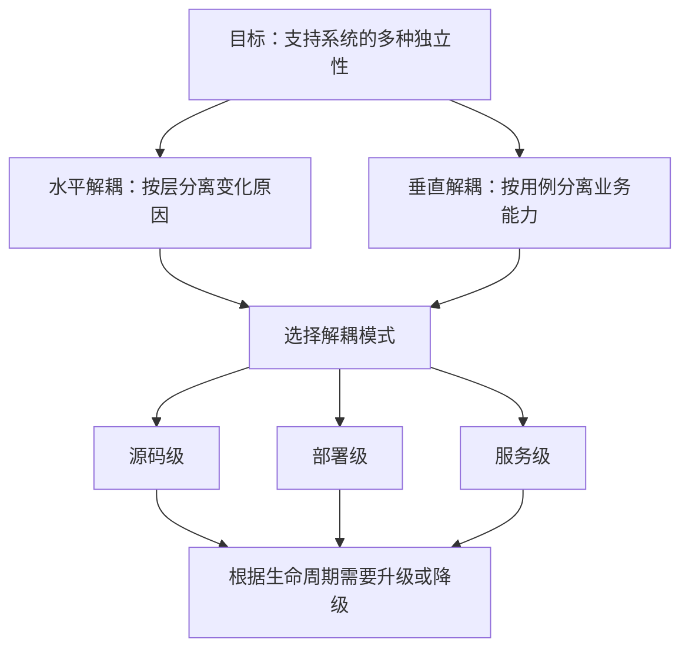
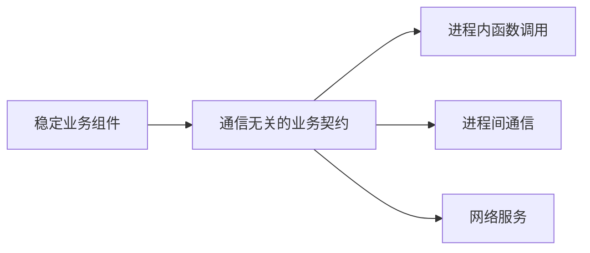
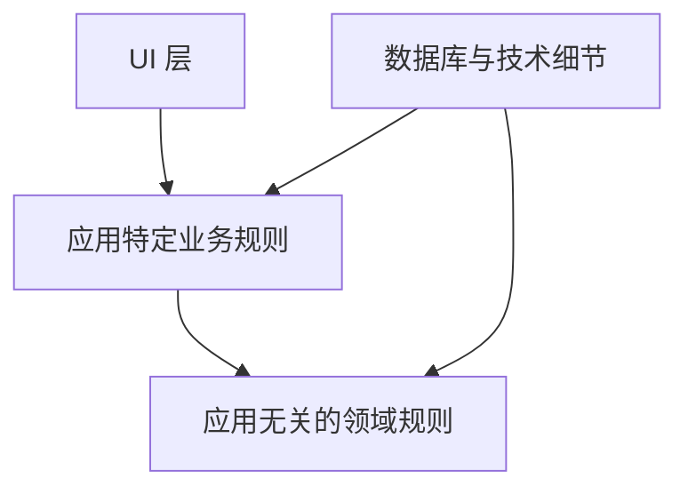
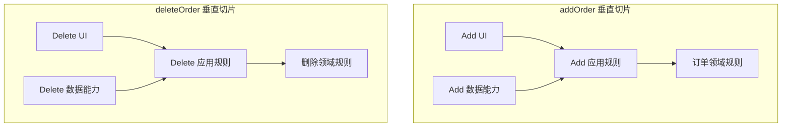
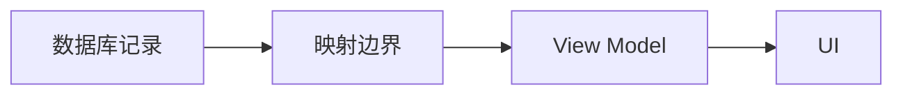

> 原书：Robert C. Martin, *Clean Architecture: A Craftsman's Guide to Software Structure and Design* 
> 本章：Chapter 16, Independence 
> 原文参考：Clean Architecture.md

## 本章导读
> **原书图示**：Chapter 16 章首页
第 15 章说明，好的架构要支持系统的完整生命周期，并尽可能长时间保留细节选项。

第 16 章进一步回答：

> **系统内部应该怎样解耦，才能同时支持用例、运行、维护、开发和部署？**

作者给出的答案不是“全部拆成微服务”，也不是“只要分层就行”。本章围绕三组相互关联的选择展开：

1. **按层解耦**：分离 UI、应用规则、领域规则和数据库等不同变化原因；
2. **按用例解耦**：让 `addOrder` 与 `deleteOrder` 等用例沿所有层保持独立；
3. **选择解耦模式**：根据真实需要，在源码级、部署级与服务级之间演化。

本章最重要的判断是：

> **解耦的逻辑边界与解耦的物理模式不是同一件事。**

一个系统可以：

- 在源码中保持清楚边界；
- 暂时作为一个单体进程运行；
- 需要时拆成独立部署单元；
- 只有在运行和组织压力足够大时，才把部分组件变成服务；
- 条件改变后，也可以从服务重新合并回进程内组件。

作者希望架构保护大多数源码，使通信和部署模式可以变化，而高层业务规则不必随之重写。

## 1. Use Cases：让系统意图可见

### 1.1 架构首先要支持用例

原书开头重申，好的架构必须支持：

- 系统用例与运行；
- 系统维护；
- 系统开发；
- 系统部署。

其中，用例是架构师的第一关注点。软件首先必须完成它存在的目的。

如果系统是购物车应用，架构应清楚支持：

- 浏览购物车；
- 添加商品；
- 修改数量；
- 移除商品；
- 计算价格；
- 提交结算。

这些用例不应隐藏在框架回调、通用 Service 或数据库脚本之中。

### 1.2 架构怎样支持行为

第 15 章指出，架构不一定决定系统当前能否实现某个行为。即使结构混乱，开发者仍可能把购物车功能写出来。

架构能为行为做的最重要事情是：

> **澄清并暴露行为，让系统意图在架构层可见。**

一个购物车系统应该“看起来像购物车系统”，而不是只看起来像某种 Web 框架项目。

### 1.3 用例应成为一等元素

用例可以表现为：

- 类；
- 函数；
- 模块；
- 组件；
- 明确的应用服务入口。

关键是它们位于系统结构的显著位置，并使用清楚描述业务意图的名称。

例如：

| 隐藏意图的名称 | 揭示意图的名称 |
| --- | --- |
| `CartService.process()` | `AddItemToCart` |
| `OrderManager.handle()` | `SubmitOrder` |
| `CommonController.execute()` | `RemoveCartItem` |
| `DataProcessor.run()` | `CalculateCartTotal` |

名称不能代替设计，但可以帮助开发者快速定位系统行为。

### 1.4 为什么顶层可见性重要

当用例是顶层地标时，开发者更容易：

- 找到需求对应代码；
- 理解一次请求经过的路径；
- 为用例编写测试；
- 判断变更影响范围；
- 发现业务能力缺失；
- 与产品和领域专家沟通。

若必须从路由、框架控制器、通用工具和数据库调用中拼出行为，维护就会变成第 15 章所说的洞穴探险。

### 1.5 Screaming Architecture 的预告

原书说明，第 21 章 “Screaming Architecture” 会进一步展开这个观点。

它的核心问题是：

> 看一眼项目结构，系统是在“高声说明”自己是购物车、医疗预约或会计系统，还是只在说明自己使用了某个框架？

第 16 章先建立基础：用例必须在架构中清晰可见。

### 1.6 用例可见不等于把所有代码放在一个文件

一个用例通常横跨多个职责：

- 接收输入；
- 验证应用请求；
- 调用领域规则；
- 读取或保存数据；
- 组织输出。

让用例可见，指这些协作者围绕明确业务能力组织，并有可追踪入口，不是把所有 UI、业务和数据库代码混在一个巨大类中。

### 1.7 用例维度的检查问题

- 顶层目录或组件能否显示系统主要能力？
- 每个用例是否有明确入口？
- 用例名称是否使用业务语言？
- 开发者是否需要从框架结构中猜测行为？
- 用例测试能否不依赖完整 UI 和数据库运行？
- 新增用例是否有清楚的落点？

## 2. Operation：支持运行要求

### 2.1 运行要求会塑造架构

本章比上一章更强调架构对运行的实质作用。

如果系统必须：

- 每秒处理 10 万个客户请求；
- 在毫秒内查询大型数据立方体；
- 满足严格响应时间；
- 在局部故障时继续服务；

架构必须允许实现对应的吞吐量、延迟和可靠性。

这些要求不能只靠命名和代码整洁解决。

### 2.2 不同系统需要不同运行结构

原书列举多种可能：

| 运行需求 | 可能的结构 |
| --- | --- |
| 大规模并行处理 | 多台服务器上的小型服务阵列 |
| 单机高并发 | 同一进程中的大量轻量线程 |
| 故障隔离 | 少量独立地址空间中的进程 |
| 简单低负载应用 | 单进程单体程序 |

没有一种结构天然优于其他结构。正确选择取决于真实运行约束。

### 2.3 运行结构也是应保留的选项

一个系统若从一开始就让业务组件依赖“必须同进程”这一事实，之后很难拆成多进程或服务。

反过来，若业务逻辑从一开始就依赖网络地址、序列化和远程框架，系统也很难退回简单进程内调用。

好的架构应：

- 隔离组件；
- 让组件通过稳定契约交互；
- 避免业务规则依赖具体通信机制；
- 在真正需要时选择线程、进程或服务。

图示表达可选实现方向，不表示远程调用与本地调用具有完全相同的语义。

### 2.4 保留选项不等于假装网络不存在

远程通信与本地调用存在根本差异：

- 网络会延迟；
- 请求会超时；
- 消息可能重复；
- 两端可能版本不同；
- 部分失败会发生；
- 数据需要序列化；
- 事务边界会改变。

因此，从进程内组件升级为服务不可能总是只改配置。

架构要保护的是业务策略与边界，而不是制造“位置透明”的幻觉。真正服务化时，仍需显式设计失败、幂等、兼容和一致性。

### 2.5 运行需求应按用例区分

不同用例的运行压力可能完全不同：

- 商品浏览需要高吞吐和缓存；
- 财务结算需要严格一致性；
- 报表生成可以异步处理；
- 管理后台请求量很低；
- 搜索需要专门索引。

若用例已经彼此隔离，高负载部分可以独立扩展，而不必把整个系统拆成相同运行模式。

### 2.6 运行维度的检查问题

- 哪些用例有明确吞吐和延迟目标？
- 哪些能力需要独立伸缩？
- 哪些能力需要故障隔离？
- 当前组件是否假设必须同进程？
- 服务协议是否泄漏进业务策略？
- 是否为了假想规模提前承担网络复杂性？
- 单体、线程、进程和服务之间是否仍有演化空间？

## 3. Development：支持独立开发

### 3.1 Conway’s Law

原书引用 Conway 定律：

> **设计系统的组织，会产生一个结构复制其沟通结构的系统。**

团队怎样交流，会影响模块怎样依赖。

例如：

- 一个团队维护全部系统，代码可能形成紧密单体；
- 多个团队各有职责，系统通常形成对应组件；
- 团队之间沟通困难，软件边界也可能僵硬；
- 一个跨团队用例可能被切成多段远程调用。

### 3.2 架构必须支持团队独立行动

当组织包含多个团队和多个关注点时，架构要减少团队互相干扰。

这要求系统被划分为：

- 良好隔离的组件；
- 稳定的公开接口；
- 清楚的依赖方向；
- 明确的代码所有权；
- 可独立测试的边界。

每个团队应能在不追赶其他团队未发布代码的情况下推进工作。

### 3.3 独立开发不是绝对自治

组件之间仍要协作，团队仍需共同决定：

- 接口语义；
- 版本兼容；
- 数据所有权；
- 安全约束；
- 跨组件用例；
- 发布节奏。

独立性是减少不必要协调，而不是消除所有沟通。

### 3.4 架构与组织需要双向调整

不能只让软件永久复制当前组织结构。

当组织变化时：

- 团队可能合并或拆分；
- 组件所有权可能转移；
- 业务能力可能重新组合；
- 原有服务边界可能不再合理。

有时应调整架构支持团队，有时应调整团队配合更合理的业务边界。

### 3.5 开发维度的检查问题

- 团队是否经常同时修改同一组件？
- 一个团队的提交是否频繁破坏另一个团队？
- 公开接口是否足够稳定？
- 本地测试是否依赖其他团队开发环境？
- 组件边界是否反映真实共同变化？
- 组织变化后，旧边界是否仍合理？

## 4. Deployment：支持立即部署

### 4.1 原书目标：Immediate Deployment

架构对部署便利性有巨大影响。

作者把目标称为 immediate deployment，也就是构建完成后能够立即部署。

这不一定意味着毫无验证，而是部署不应依赖脆弱、临时和隐藏的人工操作。

### 4.2 坏部署形态

原书列出一些典型问题：

- 数十个零散配置脚本；
- 每次部署都要手工修改属性文件；
- 人工创建目录；
- 文件必须按某种神秘位置摆放；
- 启动步骤只存在于某位工程师记忆中。

这些问题让“构建成功”与“系统可运行”之间存在危险鸿沟。

### 4.3 好部署形态

好的架构配合自动化流程，使系统：

- 产物明确；
- 配置可追踪；
- 环境可重复；
- 启动顺序可管理；
- 健康状态可检查；
- 失败可以回滚；
- 依赖版本可以验证。

部署复杂性可以存在，但应被系统化处理，而不是每次人工重新解决。

### 4.4 Master Components 的作用

原书提到负责把系统连接起来的 master components。

它们承担：

- 创建具体组件；
- 连接依赖；
- 确保组件正确启动；
- 完成集成；
- 监督运行状态；
- 协调关闭。

现代项目中，对应概念可能是：

- 组合根；
- 启动模块；
- 进程监督器；
- 容器入口；
- 编排配置。

业务规则不应承担这些部署细节。

### 4.5 独立组件怎样改善部署

若组件边界清楚：

- 变化组件可以单独重建；
- 未变化组件可以复用已有产物；
- 依赖版本可明确声明；
- 不同部署形态可重新组合组件；
- 启动模块可以集中选择实现。

但过度拆分也会增加产物和版本数量，因此仍需权衡。

### 4.6 部署维度的检查问题

- 构建完成后还需要哪些手工步骤？
- 部署知识是否进入业务代码？
- 配置是否可以版本化和验证？
- 启动、集成和监督由谁负责？
- 一个用例能否独立增加或升级？
- 组件数量是否让部署管理失控？
- 回滚路径是否清楚？

## 5. Leaving Options Open：面对未知保持可变

### 5.1 架构师面对的目标并不清楚

要同时平衡用例、运行、维护、开发和部署，听起来容易，实际很难。

项目早期通常不知道：

- 所有用例；
- 最终流量；
- 团队规模与组织方式；
- 部署环境；
- 复用需求；
- 未来法规与业务变化。

即使今天知道，这些条件也会在系统生命周期中变化。

作者把现实概括为：目标既模糊，又不恒定。

### 5.2 低成本原则仍然有价值

虽然无法预测所有目标，仍有一些相对低成本的原则可以采用：

- SRP：分离不同变化原因；
- CCP：聚集共同变化的类；
- DIP：让细节依赖高层抽象；
- ISP：让客户端只依赖所需能力；
- ADP：避免组件依赖环；
- 用例与层的明确边界。

这些原则不会替团队决定最终部署模式，却能保留更多演化空间。

### 5.3 好架构让系统以必须的方式改变

“易于改变”不是抽象地追求所有变化都很便宜。

架构应优先支持：

- 已经多次发生的变化；
- 业务路线图明确要求的变化；
- 风险和成本最高的变化；
- 外部技术最不稳定的变化；
- 团队必须独立完成的变化。

通过保留选项，系统可以在信息增加后选择合适模式。

### 5.4 选项也有成本

每保留一种选择，都可能增加：

- 接口；
- 数据转换；
- 测试；
- 文档；
- 对象装配；
- 团队理解负担。

所以本章并不要求为所有假想未来建立抽象。应优先选择成本低、收益明确的隔离原则。

### 5.5 维护如何从解耦中受益

虽然本章没有单独的 Maintenance 小节，但维护贯穿所有讨论：

- 用例可见，修改位置更清楚；
- 层分离，技术变化不污染业务；
- 用例分离，新功能不干扰旧功能；
- 模式可变，部署需求不迫使大部分源码重写；
- 真假重复得到正确处理，边界不会因错误复用而纠缠。

## 6. Decoupling Layers：按变化原因水平分层

### 6.1 架构师知道系统基本意图

即使不知道全部用例，架构师通常知道系统大致是什么：

- 购物车系统；
- 物料清单系统；
- 订单处理系统；
- 医疗预约系统。

这个基本意图足以帮助识别一些明显不同的变化原因。

### 6.2 使用 SRP 与 CCP

SRP 要求不同角色导致的变化分开。

CCP 要求因相同原因、在相同时间变化的类放在一起。

在系统层面应用它们，可以识别：

- UI 变化；
- 应用流程变化；
- 领域政策变化；
- 数据存储技术变化。

这些变化不应无边界地混在同一组件。

### 6.3 UI 与业务规则为什么应分开

UI 会因为以下原因变化：

- 视觉设计；
- 交互流程；
- 设备尺寸；
- 可访问性；
- Web 或桌面框架升级。

业务规则则因为：

- 价格政策；
- 资格条件；
- 库存规则；
- 订单状态；
- 法规要求。

二者可以在同一用例中协作，但变化来源不同，应能独立修改。

### 6.4 应用特定规则与领域规则也不同

原书进一步区分两类业务规则。

**应用特定规则：**

- 输入字段验证；
- 某个用例的步骤顺序；
- 请求与响应组织；
- 当前应用的授权流程。

**应用无关的领域规则：**

- 账户利息计算；
- 库存计数；
- 领域不变量；
- 可在多个应用中成立的政策。

它们变化速度和原因不同，因此不应全部塞进一个“业务层”。

### 6.5 数据库属于技术细节

数据库、查询语言甚至具体 Schema 通常与 UI 和业务规则有不同变化原因。

数据库可能因为：

- 产品升级；
- 性能调整；
- 分区方式；
- 运维平台；
- 数据迁移；

发生变化。

高层规则不应直接依赖这些细节。

### 6.6 水平层的基本结构

由这些变化原因，可以得到若干水平层：

箭头表达源码依赖应朝高层策略方向，具体实现可能通过接口被应用调用。

### 6.7 水平分层的价值

水平层可以让：

- UI 团队更换表现方式而少改业务；
- 应用流程调整而不破坏领域不变量；
- 领域规则脱离框架测试；
- 数据库实现独立替换；
- 依赖方向保持清楚。

它主要按技术与策略层次隔离不同变化轴。

### 6.8 水平分层的局限

只做水平分层，会把一个用例散布到多个大型目录：

- Controller 在 UI 目录；
- 用例在 Service 目录；
- 实体在 Domain 目录；
- 查询在 Repository 目录。

开发者仍要跨越整个项目寻找一个用例。

更严重的是，不同用例可能在每层中紧密耦合。因此还需要垂直解耦。

## 7. Decoupling Use Cases：按业务能力垂直切分

### 7.1 用例本身也因不同原因变化

添加订单与删除订单虽然都属于订单系统，但它们可能由不同需求驱动：

- `addOrder` 可能改变定价、库存和支付；
- `deleteOrder` 可能改变权限、审计和退款；
- 两者发布节奏不同；
- 两者运行压力不同。

因此，用例是自然的系统划分维度。

### 7.2 用例是穿过水平层的垂直薄片

每个用例都会使用水平层的一部分：

- 某种 UI 或入口；
- 应用特定规则；
- 领域规则；
- 数据访问能力。

水平层与垂直用例并不是二选一，而是同时存在的两个维度。

### 7.3 怎样保持用例垂直独立

原书建议沿整个系统高度分离用例：

- `addOrder` 的 UI 不与 `deleteOrder` UI 共享不必要状态；
- 两个用例拥有独立应用规则；
- 共同领域政策通过稳定领域模型复用；
- 数据访问只暴露各自所需能力；
- 一个用例的改动不迫使另一个用例改变。

这并不一定要求每个用例拥有独立数据库。重点是源码和行为边界，而不是机械复制基础设施。

### 7.4 新增用例为什么更安全

当用例保持垂直分离，新增一个用例通常意味着增加：

- 新入口；
- 新应用协调逻辑；
- 必要的领域扩展；
- 新数据访问能力；
- 新输出模型。

旧用例不需要修改或只需非常有限的扩展。

这体现 OCP：通过增加新切片扩展系统，而不是改动所有现有用例。

### 7.5 数据库也可以按用例暴露不同视图

不同用例可能需要：

- 不同查询；
- 不同事务；
- 不同数据投影；
- 不同性能优化。

可以为每个用例定义所需 Gateway 或 Repository Port，而不是让所有用例依赖一个巨大通用仓储。

物理上仍可共享数据库，逻辑上却拥有不同客户端契约。

### 7.6 水平层与垂直切片的矩阵

可以把系统想成一张矩阵：

| 层次 | addOrder | deleteOrder | listOrders | approveRefund |
| --- | --- | --- | --- | --- |
| UI | 添加入口 | 删除入口 | 查询入口 | 审批入口 |
| 应用规则 | 添加流程 | 删除流程 | 查询流程 | 审批流程 |
| 领域规则 | 定价与库存 | 删除资格 | 订单模型 | 退款政策 |
| 数据细节 | 写入能力 | 删除能力 | 查询投影 | 审计写入 |

横向看是变化层次，纵向看是业务能力。

好的架构同时管理两种边界，而不是只选择其中一个。

### 7.7 垂直切片不是复制所有层

每个用例不必机械创建四个文件或四个类。

简单用例可以只有少量函数，复杂用例可以包含多个协作者。划分应依据：

- 变化原因；
- 业务复杂度；
- 测试需求；
- 团队所有权；
- 运行要求。

模板化目录不能替代对边界的理解。

## 8. Decoupling Mode：逻辑分离要用哪种物理形式

### 8.1 用例解耦也帮助运行

如果高吞吐用例已经与低吞吐用例分开，就更容易：

- 单独复制高负载部分；
- 为不同用例分配资源；
- 隔离故障；
- 选择异步或同步处理；
- 为查询和写入采用不同优化。

为了用例而做的逻辑解耦，也为运行扩展提供基础。

### 8.2 物理分离需要合适模式

如果两个组件要运行在不同服务器，就不能依赖：

- 同一地址空间；
- 共享内存对象；
- 本地指针；
- 普通函数调用的失败语义。

它们需要通过网络协议和可序列化数据通信。

因此，逻辑组件能否成为服务，还取决于边界是否适合跨进程运行。

### 8.3 Service 与 Microservice 名称不是重点

许多架构师把独立运行组件称为服务或微服务，但“微”并没有可靠的代码行标准。

原书明确表示，不会宣称 SOA 是最佳架构，也不会宣称微服务是未来唯一方向。

本节真正要说明的是：

> **有时需要把某些组件一直分离到服务级，但这是选择，不是默认答案。**

### 8.4 解耦模式应保持开放

系统早期可能只需要源码边界；随后可能需要独立部署；再后来某些组件需要独立服务。

架构应尽量保护业务代码，使模式变化集中在：

- 入口与 Adapter；
- 通信实现；
- 数据传输模型；
- 组合与部署配置；
- 失败处理边界。

### 8.5 服务就绪不等于立即服务化

一个“可成为服务”的组件应具有：

- 明确职责；
- 清楚契约；
- 独立状态所有权；
- 可序列化边界；
- 不依赖进程内共享状态；
- 可识别失败语义。

但在运行压力尚未出现时，它仍可以留在同一地址空间，通过函数调用协作。

## 9. Independent Develop-ability：独立可开发性

### 9.1 层解耦减少专业团队干扰

如果业务规则不知道 UI：

- UI 团队可以调整表现层；
- 业务团队可以调整规则；
- 双方只需维护稳定接口；
- 框架升级不必进入领域代码。

水平边界支持按技术职责组织团队。

### 9.2 用例解耦减少功能团队干扰

如果 `addOrder` 与 `deleteOrder` 彼此隔离：

- 添加订单团队不必修改删除订单；
- 两个功能可以独立测试；
- 不同发布节奏更容易管理；
- 用例特有数据和 UI 不会混在一起。

垂直边界支持按业务能力组织团队。

### 9.3 架构应支持多种团队组织

原书指出，只要层和用例都得到合理解耦，系统可以支持：

- Feature Team；
- Component Team；
- Layer Team；
- 其他混合形式。

架构不应被一种临时组织形式永久锁死。

### 9.4 独立开发的现实判据

一个团队能否真正独立开发，可以看：

- 是否能单独构建目标组件；
- 是否能用已发布依赖测试；
- 是否需要等待其他团队合并未完成代码；
- 是否频繁修改其他团队内部实现；
- 接口变化是否有版本和沟通机制；
- 本地环境是否可以独立启动。

### 9.5 独立不等于重复建设

团队独立行动仍应共享：

- 稳定领域语言；
- 明确架构原则；
- 构建基础设施；
- 安全与合规约束；
- 真正共同的抽象。

关键是共享稳定知识，不是共享所有看起来相似的代码。

## 10. Independent Deployability：独立可部署性

### 10.1 良好解耦带来部署灵活性

层和用例得到隔离后，部署可以更灵活：

- 只替换某个 Adapter；
- 增加一个新用例；
- 独立升级某个组件；
- 为高负载切片增加副本；
- 为不同环境选择不同实现。

原书甚至提出，理想情况下可以在运行系统中热替换层或用例。

### 10.2 热替换不是普遍硬要求

实际能否热替换取决于：

- 平台加载机制；
- 状态迁移；
- 事务；
- 连接生命周期；
- 版本兼容；
- 安全策略。

本章用它说明解耦程度，而不是要求每个系统实现在线插件更新。

### 10.3 新增用例的理想形态

若边界做得好，新增用例可能主要是增加：

- 若干新的 `.jar` 或其他组件产物；
- 一个新服务；
- 对应入口和配置；

而其他用例保持不变。

这同时要求：

- 依赖图无环；
- 接口稳定；
- 部署流程自动化；
- 数据边界兼容。

### 10.4 独立部署的代价

更多部署单元意味着更多：

- 版本；
- 发布流水线；
- 配置；
- 监控；
- 安全修补；
- 兼容性组合。

因此，独立可部署是一种能力，不代表每个用例都必须拥有独立服务。

## 11. Duplication：不要因害怕重复破坏边界

### 11.1 架构师常见陷阱

软件工程通常反对重复代码。真正重复会导致：

- 同一规则修改多次；
- 多份实现逐渐不一致；
- 缺陷修复容易遗漏；
- 维护成本增加。

但作者提醒：看起来相同的代码不一定代表同一知识。

### 11.2 True Duplication：真正重复

真正重复具有一个关键特征：

> **其中一份变化时，其他副本也必须因同一原因发生相同变化。**

例如，同一税率计算规则被复制到三个用例中。法规改变时，三处必须一起修改。这些代码表达同一知识，应提取共同实现。

### 11.3 Accidental Duplication：偶然重复

偶然重复只是当前形状相似，但未来会：

- 因不同原因变化；
- 以不同速度演化；
- 服务不同角色；
- 最终变得明显不同。

此时过早合并，会把本应独立的变化绑定在一起。

### 11.4 相似屏幕案例

两个用例可能暂时拥有相似屏幕结构。

架构师容易提取一个共享 UI，以消除重复。但两个屏幕随后可能因不同产品需求分化：

- 字段不同；
- 权限不同；
- 交互不同；
- 验证不同；
- 发布节奏不同。

若它们共享一个复杂基类或组件，分离反而困难。

### 11.5 相似算法和查询也可能是偶然重复

垂直切分用例时，经常看到：

- 相似算法；
- 相似数据库查询；
- 相似 Schema；
- 相似映射代码。

不要只按文本相似度合并。应先问：

- 它们表达的是同一业务规则吗？
- 由同一角色提出变化吗？
- 过去是否总是共同修改？
- 未来分化的可能性如何？

### 11.6 数据库记录与 View Model

数据库记录结构可能与屏幕 View Model 完全相似。

直接把数据库记录传到 UI 看似减少映射，却让：

- Schema 变化影响屏幕；
- UI 字段影响持久化；
- 数据库类型泄漏到表现层；
- 安全字段可能被意外暴露；
- 两层无法独立演进。

原书认为，这种重复几乎肯定是偶然重复。创建独立 View Model 并复制字段，通常是值得的隔离成本。

### 11.7 DRY 应用于知识而不是外观

更准确的 DRY 理解是：不要重复同一知识或决策。

两段代码文字相同，但表达不同业务含义，可以保持独立。

两段代码文字不同，却实现同一业务规则，也可能是真正重复。

### 11.8 等待变化证据再抽象

当不确定重复类型时，可以：

1. 暂时保持两份小实现；
2. 观察后续变化原因；
3. 若总是同步修改，再提取共同抽象；
4. 若逐渐分化，保留独立边界。

少量局部重复有时比错误耦合更便宜。

## 12. Decoupling Modes (Again)：三种解耦模式

### 12.1 Source Level：源码级解耦

源码级解耦通过模块与依赖规则，使一个模块变化时，其他模块尽量不需要修改或重新编译。

特点包括：

- 组件位于同一地址空间；
- 通常通过函数或方法调用；
- 最终可能只有一个可执行文件；
- 常被称为单体结构；
- 边界主要由源码模块、包和接口维护。

原书以 Ruby Gems 作为例子之一。

### 12.2 Deployment Level：部署级解耦

部署级解耦把组件做成独立部署单元，例如：

- `.jar`；
- DLL；
- 共享库；
- Gem 文件。

一个组件源码变化时，其他组件不一定需要重新构建和部署。

这些组件可以：

- 仍在同一进程中通过函数调用；
- 位于同一机器的不同进程；
- 通过 IPC、Socket 或共享内存通信。

关键是它们具有独立发布和部署身份。

### 12.3 Service Level：服务级解耦

服务级解耦让执行单元通过网络数据通信。

每个服务可以：

- 独立构建；
- 独立部署；
- 独立运行；
- 独立升级源码和二进制；
- 通过协议维持兼容。

它提供最强物理隔离，也引入最昂贵的分布式系统问题。

### 12.4 三种模式对比

| 维度 | 源码级 | 部署级 | 服务级 |
| --- | --- | --- | --- |
| 典型边界 | 模块、包 | `.jar`、DLL、共享库 | 独立服务 |
| 地址空间 | 通常相同 | 相同或不同 | 不同 |
| 通信 | 函数调用 | 函数、IPC、Socket | 网络协议 |
| 独立部署 | 较弱或没有 | 有 | 有 |
| 运行成本 | 最低 | 中等 | 最高 |
| 故障模型 | 进程内 | 视部署而定 | 分布式部分失败 |
| 适用压力 | 代码组织 | 发布与团队 | 伸缩、隔离、独立运行 |

### 12.5 项目早期通常不知道最佳模式

早期可能缺少：

- 真实负载；
- 团队规模；
- 部署频率；
- 故障隔离要求；
- 服务所有权；
- 成本数据。

即使当前模式合适，系统成熟后也可能改变。

所以解耦模式本身应被视为可演化选项。

### 12.6 默认全部服务化的问题

一种流行做法是从第一天起全部按服务级解耦。

原书指出两个问题。

**成本高：**

- 开发网络协议；
- 处理超时和重试；
- 管理部署和监控；
- 消耗更多内存和计算；
- 调试跨服务调用。

**粒度容易过粗：**

无论服务多“微”，网络边界的成本都使它很难像源码模块一样细粒度。团队可能把本应独立变化的用例重新捆进一个服务。

### 12.7 人力成本比资源成本更关键

内存和计算资源可能相对便宜，但开发分布式边界的人力并不便宜。

不必要的服务会长期增加：

- 认知负担；
- 运维值班；
- 安全管理；
- 版本治理；
- 故障排查；
- 测试环境成本。

服务化必须有明确收益。

### 12.8 作者偏好的演化策略

原书作者更倾向于：

1. 把边界推到“需要时可以形成服务”的程度；
2. 只要没有现实压力，就让组件留在同一地址空间；
3. 起初采用源码级解耦；
4. 开发或部署问题出现后，选择部分组件升级到部署级；
5. 运行压力继续增加时，再谨慎选择部分组件服务化。

### 12.9 演化应该可逆

好的架构不仅允许单体成长为服务，也允许服务在条件变化后重新合并。

可能导致降级的原因包括：

- 流量下降；
- 团队缩小；
- 服务边界收益不足；
- 网络成本过高；
- 业务重新聚合；
- 运维复杂性超过价值。

服务不是架构演化的终点。

### 12.10 保护大多数源码

模式变化不可能完全免费，但应尽量限制在：

- 通信 Adapter；
- 序列化模型；
- 进程启动与监督；
- 部署配置；
- 数据所有权迁移。

核心用例和领域规则应尽可能保持不变。

### 12.11 不同部署可以使用不同模式

同一产品可能有：

- 小客户单机部署；
- 企业客户多进程部署；
- 云端服务化部署。

只要核心边界合适，不同部署规模可以选择不同解耦模式，而不复制整套业务规则。

### 12.12 模式变化不会总是配置开关

原书结论明确说明，解耦模式改变不一定是简单配置选项。

从进程内调用改为网络服务，可能需要处理：

- 状态迁移；
- 一致性；
- 协议版本；
- 超时和重试；
- 安全认证；
- 可观测性。

架构的目标是预见并适当促进变化，不是承诺零成本切换。

## 13. Conclusion：独立性来自可演化边界

### 13.1 原书结论

作者承认，这些权衡很棘手。

他并不是说所有解耦模式都应由一个配置开关切换，而是说：

> **系统需要的解耦模式很可能随时间改变，好的架构师应预见并适当地促进这些变化。**

### 13.2 本章完整论证链

1. 架构首先要让系统用例和意图可见；
2. 用例应成为顶层一等元素；
3. 运行需求可能要求线程、进程、服务或简单单体；
4. 具体运行结构本身应尽量保持为选项；
5. Conway 定律要求架构支持多团队独立行动；
6. 部署应在构建后能够自动、直接完成；
7. 项目早期无法准确知道全部目标，而且目标会变化；
8. SRP 与 CCP 可以按变化原因建立水平层；
9. UI、应用规则、领域规则和数据库应独立演进；
10. 每个用例又是穿过水平层的垂直切片；
11. `addOrder` 与 `deleteOrder` 应沿系统高度保持独立；
12. 双向解耦支持新增用例而少干扰旧用例；
13. 同一边界可以采用源码级、部署级或服务级模式；
14. 默认全部服务化代价高，也不一定足够细粒度；
15. 作者偏向先在源码级保持服务就绪，再按实际压力升级；
16. 条件变化后，模式也应允许降级；
17. 真重复应消除，偶然重复应保留以保护边界；
18. 数据库记录与 View Model 的相似通常属于偶然重复；
19. 好架构保护大多数业务源码，不让部署模式变化扩散到核心规则。

### 13.3 独立性的多个维度

| 独立性 | 架构手段 |
| --- | --- |
| 用例独立 | 垂直切片、清楚用例入口 |
| 层次独立 | UI、应用、领域、数据库分离 |
| 团队独立 | 稳定接口、组件所有权 |
| 构建独立 | 源码模块与无环依赖 |
| 部署独立 | 独立发布单元与自动装配 |
| 运行独立 | 进程或服务边界、资源隔离 |
| 演化独立 | 解耦模式可升级也可降级 |

### 13.4 本章与前后章节的联系

第 15 章提出保留选项，第 16 章把“通信与部署模式”变成可保留选项。

第 17 章将继续讨论怎样画边界线，让一侧的软件不知道另一侧的细节，并阻止过早决策污染核心业务。

## 14. 在现代项目中应用双向解耦

### 14.1 先列出用例

不要先从框架层目录开始。先列出系统真正执行的业务能力：

- `CreateOrder`；
- `CancelOrder`；
- `ApproveRefund`；
- `ReserveInventory`；
- `GenerateInvoice`。

每个用例记录：

- 输入；
- 输出；
- 领域规则；
- 数据需求；
- 运行目标；
- 所有团队。

### 14.2 再识别水平变化层

对每个用例区分：

- UI 与传输；
- 应用协调；
- 领域政策；
- 数据与外部系统。

建立依赖规则，确保细节指向高层策略。

### 14.3 建立用例矩阵

可以维护简单矩阵：

| 用例 | UI | 应用规则 | 领域规则 | 数据 Port | 当前模式 |
| --- | --- | --- | --- | --- | --- |
| CreateOrder | HTTP | 创建流程 | 定价、库存 | 保存订单 | 源码级 |
| CancelOrder | HTTP | 取消流程 | 取消资格 | 更新状态 | 源码级 |
| ListOrders | HTTP | 查询流程 | 可见性 | 查询投影 | 部署级 |
| GenerateInvoice | Worker | 生成流程 | 账单规则 | 账单数据 | 服务级 |

矩阵帮助同时观察水平层和垂直用例。

### 14.4 为每个用例记录运行压力

不要让整个系统共享一个模糊的“高性能”要求。

记录：

- 峰值吞吐；
- 延迟目标；
- 可用性；
- 一致性；
- 异步容忍度；
- 故障隔离；
- 数据规模。

只有确有独立运行压力的切片，才成为服务化候选。

### 14.5 从源码级开始建立边界

源码级边界成本最低，可以先实现：

- 禁止跨模块访问内部类；
- 用例拥有清楚入口；
- 数据访问通过 Port；
- UI 模型与数据库模型分离；
- 依赖图保持无环；
- 模块测试能够独立运行。

这不会阻止以后物理拆分。

### 14.6 什么时候升级到部署级

出现以下压力时，可以考虑独立组件产物：

- 不同团队需要独立发布；
- 某组件更新频率明显不同；
- 构建时间需要隔离；
- 插件或客户定制需要按需加载；
- 一部分功能需要独立回滚。

升级前检查版本与依赖治理能力是否成熟。

### 14.7 什么时候升级到服务级

服务化应有明确驱动，例如：

- 独立伸缩；
- 故障隔离；
- 独立安全域；
- 不同技术运行环境；
- 团队真正需要独立运行；
- 数据所有权已经清楚。

“未来可能变大”通常不足以支付当前分布式成本。

### 14.8 定期检查是否应该降级

服务运行一段时间后，检查：

- 是否真的独立伸缩；
- 是否真的独立发布；
- 团队是否仍独立；
- 网络和运维成本是否合理；
- 服务是否只是转发调用；
- 合并后是否更简单可靠。

架构演化包括拆分，也包括合并。

### 14.9 用共同变化判断重复

遇到相似代码时，记录后续变化：

- 总是同时修改，可能是真重复；
- 分别响应不同需求，可能是偶然重复；
- 一份变化而另一份不变，说明二者不是同一知识。

不要让静态代码相似度自动决定抽象。

### 14.10 保护边界的数据模型

为每层和用例定义合适模型：

- HTTP Request 属于入口；
- Use Case Request 属于应用；
- Entity 属于领域；
- Database Record 属于数据细节；
- View Model 属于表现。

模型看起来相似时，少量映射代码可以换取长期独立性。

## 15. 易混淆概念与常见误解

### 15.1 “架构支持用例，就是架构决定所有行为”

错误。架构最重要的作用是让用例清楚可见、容易修改和测试，不会替代业务规则本身。

### 15.2 “有 Controller、Service、Repository 就完成分层”

不一定。若业务规则依赖框架、数据库模型直接进入 UI，目录分层并没有形成真实边界。

### 15.3 “只做水平分层就足够”

错误。用例仍可能在每层内部互相纠缠，还需要按业务能力进行垂直切分。

### 15.4 “垂直切片意味着每个用例复制一套数据库”

错误。它要求逻辑能力和契约独立，不必机械复制物理基础设施。

### 15.5 “业务规则只有一个层次”

错误。应用特定流程与应用无关领域政策可能因不同原因变化，应进一步分离。

### 15.6 “Conway 定律说明组件永远应该按团队划分”

错误。它描述组织与系统结构的相互影响，不证明当前组织图就是最佳长期架构。

### 15.7 “独立开发意味着团队完全不沟通”

错误。团队仍需协商稳定契约和跨组件政策，只是减少对内部实现的同步协调。

### 15.8 “解耦就是拆成微服务”

错误。源码模块、独立部署组件和服务都是解耦模式。

### 15.9 “微服务越小，解耦越细”

不一定。网络边界成本会迫使服务聚合许多能力，源码模块通常能提供更细粒度隔离。

### 15.10 “默认服务级最能保留未来”

错误。它会提前引入昂贵分布式问题。先建立服务就绪的源码边界通常更经济。

### 15.11 “从单体到服务是架构成熟的单向道路”

错误。运行和组织条件变化后，服务可以合并回部署级或源码级组件。

### 15.12 “服务就绪意味着远程调用必须像本地调用”

错误。远程边界有延迟、超时和部分失败，真正服务化时必须显式处理。

### 15.13 “独立部署能力要求每个用例单独部署”

错误。能力应根据收益使用，过多部署单元也有治理成本。

### 15.14 “看到两段相同代码就应立即提取”

错误。先判断它们是否表达同一知识、是否因同一原因变化。

### 15.15 “相似屏幕应共享一个基类”

不一定。不同用例的屏幕很可能独立演化，过早共享会产生错误耦合。

### 15.16 “数据库记录与 View Model 相同就可以复用”

危险。相似通常是暂时的，直接复用会让持久化与 UI 无法独立改变。

### 15.17 “解耦模式变化应当完全由配置完成”

错误。架构应促进变化，但网络化仍涉及协议、失败、状态和安全设计。

### 15.18 “好架构必须预知所有未来模式”

错误。它只需采用低成本原则保护重要边界，并根据真实压力逐步演化。

## 16. 实践检查与掌握练习

### 16.1 用例可见性检查

- 项目顶层是否能看见主要用例？
- 用例名称是否表达业务意图？
- 每个用例是否有清楚入口？
- 测试是否围绕用例组织？
- 新开发者是否需要从框架代码猜测行为？

### 16.2 水平层检查

- UI 是否依赖业务接口而非数据库？
- 应用流程与领域政策是否分开？
- 数据库、Schema 和查询是否被限制在细节层？
- 依赖箭头是否指向高层策略？
- 不同变化原因是否被混在同一组件？

### 16.3 垂直用例检查

- 一个用例变化会修改哪些其他用例？
- `addOrder` 与 `deleteOrder` 是否共享不必要状态？
- 每个用例是否只依赖所需数据能力？
- 新增用例是否主要通过增加代码完成？
- 物理数据库共享是否被误当成源码耦合理由？

### 16.4 团队独立性检查

- 团队能否独立构建和测试？
- 是否依赖其他团队未发布代码？
- 组件接口是否有所有者与兼容策略？
- 团队边界与业务边界是否长期冲突？
- 组织变化后架构是否仍合理？

### 16.5 部署独立性检查

- 构建后能否立即进入自动部署？
- 组件是否拥有明确发布产物？
- 启动和监督是否集中管理？
- 新用例能否少影响现有部署？
- 独立部署单元数量是否可管理？

### 16.6 重复检查

- 相似代码是否表达同一知识？
- 一处变化是否要求所有副本同步变化？
- 两份代码是否服务不同用例或角色？
- 是否因害怕重复而穿透架构边界？
- 数据库记录是否被直接传给 UI？
- 是否有共同变化历史支持提取抽象？

### 16.7 解耦模式检查

- 当前是源码级、部署级还是服务级？
- 这个模式由什么现实压力驱动？
- 是否存在不必要服务边界？
- 哪些组件确实需要独立伸缩或故障隔离？
- 核心源码是否独立于通信机制？
- 将来是否允许升级或降级模式？

### 16.8 场景判断一：购物车目录全是框架名

项目只有 `controllers`、`services`、`entities` 和 `repositories`，找不到添加购物车用例的明确入口。

**判断：** 水平层或许存在，但系统意图没有在架构层暴露，应让用例成为可见一等元素。

### 16.9 场景判断二：高流量查询拖动全部系统

商品查询流量很大，团队因此把订单写入和后台管理也一起复制到许多服务器。

**判断：** 用例没有充分垂直隔离。应让高吞吐查询切片可以独立伸缩。

### 16.10 场景判断三：两个相似页面共享数据库记录

添加订单与删除订单页面暂时字段相似，因此共同使用数据库 Record 作为 View Model。

**判断：** 同时破坏水平与垂直边界。这种相似大概率是偶然重复，应使用独立模型和映射。

### 16.11 场景判断四：五人项目拆成二十个服务

项目没有独立伸缩和故障隔离需求，却从第一天承担网络、部署和监控成本。

**判断：** 服务级解耦过早。可保留逻辑组件并在同一地址空间运行。

### 16.12 场景判断五：单体模块边界清楚

系统作为单个可执行文件部署，但用例、层次和依赖方向清楚，测试可隔离。

**判断：** 这是合理的源码级解耦，也为未来升级到部署级或服务级保留空间。

### 16.13 场景判断六：服务不再独立伸缩

两个服务由同一团队维护、总是同步发布、流量很低，只进行大量聊天式调用。

**判断：** 服务边界收益可能已经消失，应评估合并回进程内组件。

### 16.14 场景判断七：相同税率规则复制三处

法规变化时三处实现每次都必须同步修改。

**判断：** 这是真重复，应提取共同业务规则，而不是以用例独立为由继续复制。

### 16.15 快速复述练习

能够回答以下问题，基本就掌握了本章：

1. 好架构要支持哪几类系统需求？
2. 为什么购物车系统应“看起来像购物车系统”？
3. 用例怎样成为架构中的一等元素？
4. 10 万客户每秒的要求会怎样影响架构？
5. 为什么线程、进程、服务和单体都可能正确？
6. 保留运行模式选项为什么不等于忽略网络差异？
7. Conway 定律表达什么关系？
8. 架构怎样支持团队独立行动？
9. Immediate Deployment 的目标是什么？
10. Master Components 承担什么职责？
11. 为什么项目早期难以平衡全部目标？
12. 哪些低成本原则可以帮助保留选项？
13. 水平层按什么划分？
14. UI、应用规则、领域规则和数据库为什么应分离？
15. 用例为什么是垂直薄片？
16. `addOrder` 与 `deleteOrder` 应怎样保持独立？
17. 水平与垂直解耦怎样共同作用？
18. 用例解耦怎样帮助运行伸缩？
19. 为什么有时必须把组件分离到服务级？
20. 为什么服务级不应成为默认答案？
21. 独立可开发性如何支持不同团队结构？
22. 独立可部署性有哪些收益和成本？
23. 真重复与偶然重复怎样区分？
24. 为什么数据库记录不应直接作为 View Model？
25. 三种解耦模式分别是什么？
26. 作者偏好怎样逐步演化解耦模式？
27. 为什么解耦模式还应允许反向演化？
28. 模式改变为什么不一定只是配置开关？

### 16.16 一分钟记忆卡

- **用例：** 系统意图应在架构顶层清楚可见。
- **运行：** 根据真实压力选择线程、进程、服务或单体。
- **开发：** 通过稳定组件支持团队独立行动。
- **部署：** 构建后应能够自动、立即部署。
- **水平解耦：** 分离 UI、应用规则、领域规则和数据库。
- **垂直解耦：** 让每个用例沿所有层保持独立。
- **重复：** 消除同一知识，保留会独立演化的偶然相似。
- **模式：** 源码级、部署级、服务级。
- **策略：** 先保持服务就绪，再按真实压力升级或降级。
- **结论：** 好架构让解耦模式变化时，大多数业务源码保持稳定。

## 本章总结

1. 第 16 章讨论怎样通过解耦获得用例、团队、部署与运行独立性。
2. 架构首先要支持系统用例，让系统意图在顶层可见。
3. 购物车应用的结构应能清楚看见添加、删除、结算等购物车用例。
4. 用例可以由类、函数、模块或组件表达，但必须拥有明确业务名称和显著位置。
5. 用例可见不等于把 UI、业务和数据库代码塞进同一个类。
6. 架构还必须支持吞吐、延迟、可靠性等运行要求。
7. 每秒 10 万客户或毫秒级大数据查询可能要求专门的并行与部署结构。
8. 服务阵列、轻量线程、独立进程和单进程单体都可能是正确运行模式。
9. 好架构应尽量让具体运行模式保持为可演化选项。
10. 从本地调用改为服务仍需显式处理延迟、超时、幂等和部分失败。
11. 不同用例的运行压力不同，用例隔离有助于独立伸缩。
12. Conway 定律指出系统结构会反映组织沟通结构。
13. 多团队系统需要良好隔离、可独立开发的组件和稳定接口。
14. 独立开发减少不必要协调，并不取消团队之间的契约沟通。
15. 部署目标是构建后能够立即、自动、可靠地部署。
16. 好架构不依赖大量手工脚本、属性修改和神秘目录操作。
17. Master Components 或组合根负责创建、连接、启动和监督具体组件。
18. 项目早期不知道全部用例、运行约束、团队结构和部署要求，而且它们会变化。
19. SRP、CCP、DIP、ISP 与 ADP 等低成本原则可以帮助保留选项。
20. 水平解耦按不同变化原因分离 UI、应用特定规则、领域规则和数据库。
21. 应用字段验证与账户利息、库存计数等领域规则可能位于不同层次。
22. 数据库、查询语言和 Schema 通常是独立变化的技术细节。
23. 只做水平分层会让一个用例散落在多个大型技术目录中。
24. 用例还应作为穿过所有水平层的垂直薄片进行隔离。
25. `addOrder` 与 `deleteOrder` 会因不同需求变化，应沿 UI、规则和数据能力保持独立。
26. 水平与垂直解耦共同形成一张层次与用例的架构矩阵。
27. 新用例理想上通过增加新切片扩展，而少修改旧用例。
28. 物理数据库可以共享，但每个用例应只依赖自己需要的数据契约。
29. 为用例建立的解耦也有助于不同运行负载独立伸缩。
30. 若组件必须运行在不同服务器，就需要服务级通信和明确分布式失败语义。
31. 原书没有宣称 SOA 或微服务是唯一最佳架构。
32. 有时组件需要分离到服务级，但解耦模式应作为选择而非默认答案。
33. 层和用例解耦可以同时支持 Feature Team、Layer Team 和 Component Team。
34. 良好边界也能让组件和用例具有更高独立部署能力。
35. 独立部署是一种能力，不要求每个用例都成为独立服务。
36. 真重复表示同一知识，任何一份变化时其他副本也必须同步变化。
37. 偶然重复只是当前外形相似，未来会因不同原因独立演化。
38. 相似屏幕、算法、查询和 Schema 不应未经判断就合并。
39. 数据库 Record 与 View Model 的相似通常是偶然重复，独立模型能保护层边界。
40. 源码级解耦让组件在同一地址空间通过函数调用协作。
41. 部署级解耦使用 `.jar`、DLL 或共享库等独立发布单元。
42. 服务级解耦通过网络协议让执行单元独立运行和部署。
43. 默认全部服务化会增加开发、资源和运维成本，而且边界未必足够细。
44. 作者偏向先建立服务就绪的源码边界，让组件尽可能久地留在同一地址空间。
45. 随开发、部署和运行压力增加，可以选择部分组件升级到部署级或服务级。
46. 当压力下降或边界收益消失时，也应允许服务重新合并。
47. 好架构保护大多数核心源码，使小型与大型部署可以采用不同解耦模式。
48. 模式切换不一定是简单配置，因为服务化涉及协议、状态、安全和失败处理。
49. 架构师无法预知所有未来，但可以预见解耦模式会变化，并为这种变化提供合理路径。
50. 本章最终思想是：同时按层和用例建立边界，再让源码、部署与运行模式根据真实需要可逆演化。
