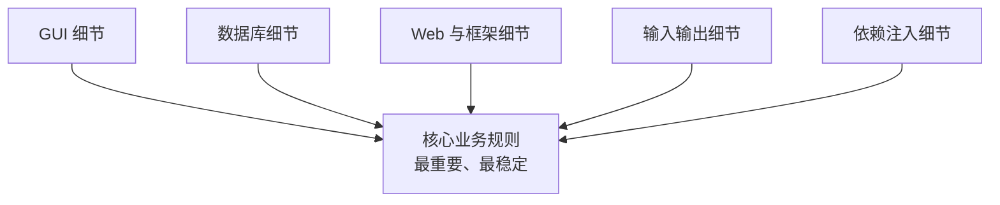
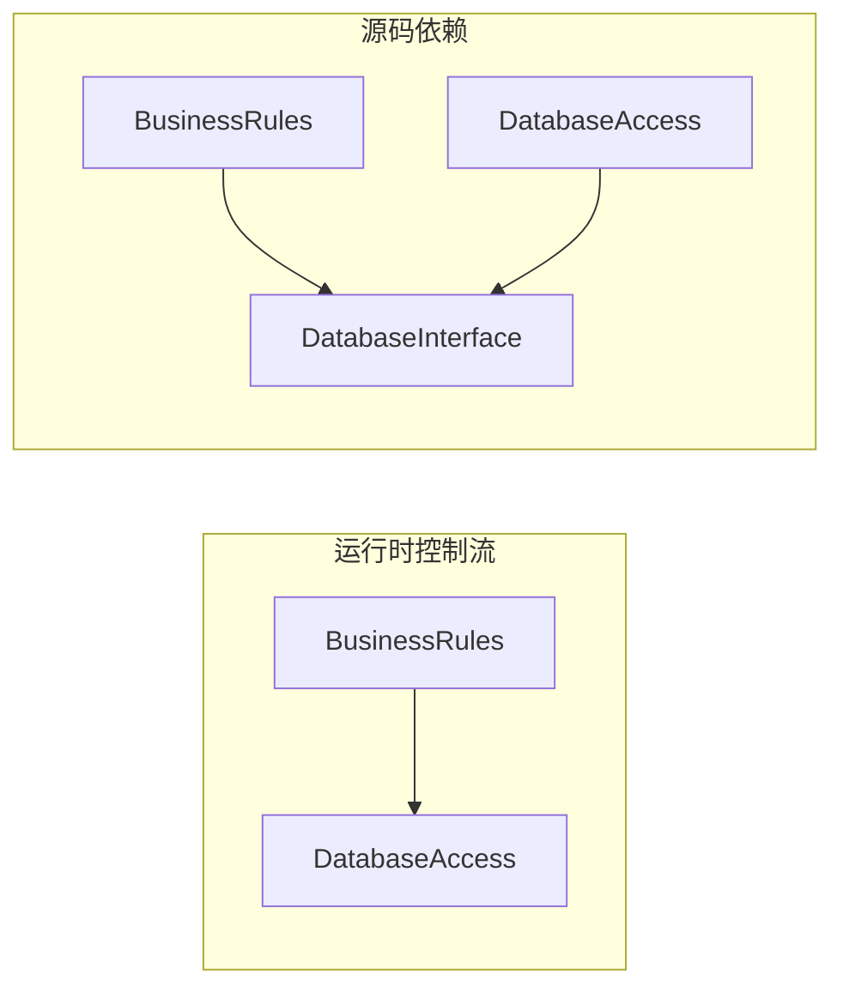
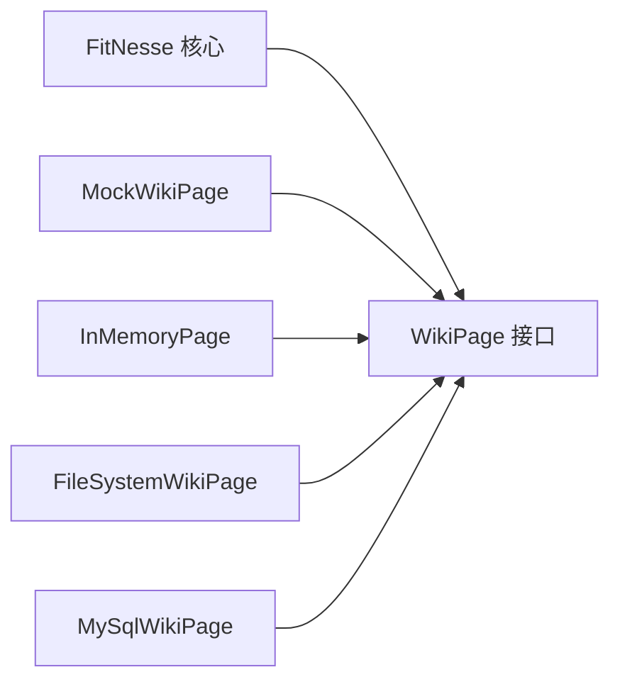
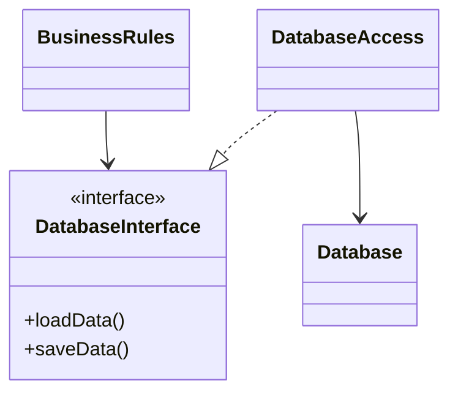
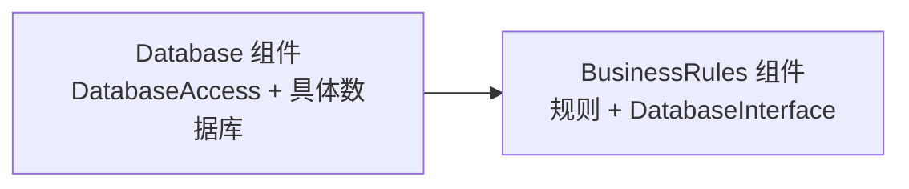
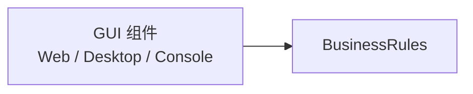
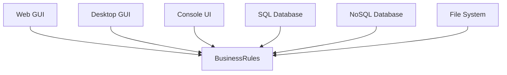
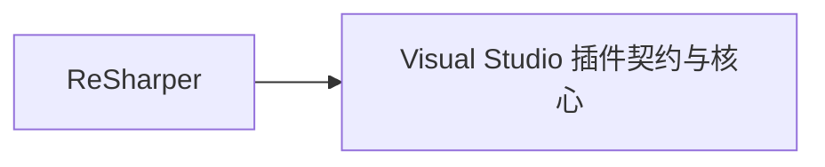

> 原书：Robert C. Martin, *Clean Architecture: A Craftsman's Guide to Software Structure and Design* 
> 本章：Chapter 17, Boundaries: Drawing Lines 
> 原文参考：Clean Architecture.md

## 本章导读
> **原书图示**：Chapter 17 章首页
第 15 章提出：好的架构要把策略与细节分离，并尽可能推迟细节决策。

第 16 章进一步说明：系统既要按层水平解耦，也要按用例垂直解耦，同时把源码级、部署级和服务级作为可演化的模式。

第 17 章开始回答一个更具体的问题：

> **架构边界究竟画在哪里，边界两侧应该怎样依赖？**

原书给出一个简洁定义：

> **软件架构是一门画线的艺术。作者把这些线称为边界。**

边界把软件元素分开，并限制一侧的软件知道另一侧的内容。

边界的价值不只是让目录整齐，而是控制知识与变化传播：

- 哪一侧可以知道另一侧；
- 哪一侧可以独立变化；
- 哪些决定能够被推迟；
- 哪些低层细节不会污染核心业务；
- 哪些团队和组件不会被无关变化拖动。

箭头表示源码依赖方向：外围细节知道核心业务，核心业务不知道外围细节。

本章用三类故事建立这条结论：

1. 公司 P 和 W 过早锁定分布式三层与 SOA 工具，付出巨大人力成本；
2. FitNesse 通过 `WikiPage` 边界推迟数据库决定，最终发现根本不需要数据库；
3. 数据库与 GUI 被当作插件，依赖箭头统一指向业务规则。

这一章最值得记住的判断是：

> **边界应画在变化轴上。因不同原因、以不同速度变化的内容，应被边界分开；依赖箭头应指向更重要、更稳定的业务策略。**

## 1. 边界是什么，为什么要画

### 1.1 边界的基本含义

边界是一条软件知识的分界线。

它不一定是：

- 一台服务器；
- 一个进程；
- 一个网络 API；
- 一个独立仓库；
- 一条组织汇报线。

边界首先可以只是源码层面的规则：

- 核心模块不导入数据库模块；
- 业务用例不接收 Web 框架对象；
- UI 不访问持久化内部类；
- 低层实现通过高层定义的接口接入。

必要时，这条源码边界才进一步成为部署组件、进程或服务边界。

### 1.2 边界限制“谁知道谁”

假设业务规则通过接口保存数据，而数据库 Adapter 实现该接口。

运行时：

- 业务规则会调用数据库 Adapter；
- 数据最终进入数据库。

源码依赖上：

- 业务规则只知道自己定义的数据访问接口；
- 数据库 Adapter 知道并实现该接口；
- 业务规则不知道 Adapter 类和数据库产品。

边界控制的是源码中的知道关系，不是禁止运行时协作。

### 1.3 有些边界应尽早画

原书指出，有些边界甚至在写代码前就值得确定。

这些早期边界通常用于隔离明显的外围细节：

- 数据库；
- GUI；
- Web 框架；
- 外部设备；
- 第三方 SDK；
- 消息系统；
- 依赖注入容器。

为什么可以较早判断？因为无论具体业务怎样发展，这些技术都不应成为业务规则本身。

例如，尚未知道订单系统全部用例时，仍然可以决定：订单规则不应依赖某个 ORM Entity。

### 1.4 有些边界应晚些画

并非所有边界都能在项目开始时看清。

以下问题通常需要事实积累：

- 哪些用例会独立伸缩；
- 哪些模块总是共同变化；
- 哪些能力会被其他项目复用；
- 哪些团队需要独立部署；
- 哪些性能瓶颈真的存在；
- 哪些概念值得成为独立服务。

过早把猜测变成昂贵物理边界，会制造本章公司 P 和 W 的问题。

### 1.5 早画线与晚做决定并不矛盾

早期可以画出“业务不依赖数据库”的边界，却不必立即选择：

- Oracle；
- MySQL；
- NoSQL；
- 文件系统；
- 内存存储。

边界正是推迟具体选择的机制。

可以早决定依赖方向，晚决定具体实现。

### 1.6 架构师要降低什么成本

原书再次强调，架构师的目标是减少构建和维护系统所需的人力。

最消耗人力的因素之一是耦合，尤其是对过早决策的耦合。

当业务规则绑定某个技术选择时：

- 技术升级会进入业务代码；
- 测试必须启动外部设施；
- 替换技术需要理解整个系统；
- 许多开发者要处理与业务无关的问题；
- 失败和部署复杂性扩散到所有用例。

边界的价值应由减少的人力和风险衡量，而不是由边界数量衡量。

### 1.7 什么是过早决策

过早决策通常具有两个特征：

1. 它与当前业务用例没有直接关系；
2. 团队尚未拥有足够信息，却让大量源码依赖它。

原书列举：

- 框架；
- 数据库；
- Web 服务器；
- 工具库；
- 依赖注入方案。

这些技术并非不重要。问题是它们是否在必要之前成为核心结构的前提。

### 1.8 好架构怎样对待这些决定

好的架构会让这些技术决定：

- 成为辅助性选择；
- 留在外围组件；
- 通过稳定接口连接；
- 可以在较晚阶段做出；
- 更换时不显著影响核心业务。

边界不是为了保证替换永远轻松，而是让替换保持实际可行。

### 1.9 边界也有成本

每条边界都会增加：

- 接口；
- 数据转换；
- 测试；
- 依赖装配；
- 导航路径；
- 团队理解负担。

因此，边界不是越多越好。

真正值得优先隔离的是：

- 易变细节与稳定策略；
- 不同变化原因；
- 高风险外部系统；
- 需要独立开发或部署的部分；
- 会污染核心业务的技术对象。

## 2. A Couple of Sad Stories：两个悲伤案例

### 2.1 为什么先讲失败故事

过早决策的危险常在项目初期不明显。

新架构可能显得：

- 先进；
- 可扩展；
- 企业级；
- 符合行业潮流；
- 为未来做好准备。

成本却会在每个小功能、测试和部署中持续出现。

公司 P 与公司 W 的故事说明：未经真实需求证明的分布式边界，会把假想未来的复杂性提前收进今天的开发成本。

### 2.2 公司 P 的背景

20 世纪 80 年代，公司 P 的创始人开发了一个简单桌面单体应用。

产品很成功，并在 90 年代成长为流行的桌面 GUI 软件。

到了 90 年代末，Web 成为主流，公司客户开始要求 Web 版本。公司于是招聘一批年轻 Java 开发者，启动产品 Web 化项目。

### 2.3 过早选择三层分布式拓扑

开发者想象未来会运行大型服务器集群，因此很早就采用丰富的三层结构：

- GUI 服务器；
- 中间层服务器；
- 数据库服务器。

原书特意给“architecture”加引号，因为三层首先是一种 topology，也就是部署拓扑，并不自动构成好架构。

真正问题是：团队在没有真实服务器集群需求时，把拓扑假设写进了整个对象模型和通信机制。

### 2.4 每个领域对象被复制三份

团队决定，每个领域对象都在三层各有一个实例：

- GUI 层一份；
- 中间层一份；
- 数据库层一份。

因为三份对象假定运行在不同机器上，方法调用不能保持普通本地调用，而要：

- 转换为消息对象；
- 序列化；
- 跨网络发送；
- 反序列化；
- 在另一层重新组装对象。

### 2.5 添加一个字段为何如此昂贵

假设只是在已有记录中增加一个字段。

团队需要同时修改：

- 三层中的领域对象；
- 层间双向传递的消息协议；
- 每种协议的发送端；
- 每种协议的接收端；
- 三个可执行程序；
- 序列化和解析逻辑；
- 兼容性与部署配置。

一个简单业务变化被部署拓扑放大成跨层协议工程。

### 2.6 运行时也承担全部代价

完成一个简单功能时，系统要经历：

- 创建多个对象；
- 序列化与反序列化；
- 消息构建与解析；
- Socket 通信；
- 超时管理；
- 重试逻辑；
- 跨层错误处理。

这些步骤只有在真正需要分布式部署时才可能产生相应价值。

### 2.7 开发环境根本没有服务器集群

开发期间，团队并没有服务器农场。

三个可执行程序只是在同一台机器上的三个进程中运行。尽管如此，系统仍然执行全部网络化通信步骤。

团队为假想的物理分布付出真实的日常成本。

### 2.8 最讽刺的结果

公司 P 最终从未卖出需要服务器农场的部署。

所有客户系统都只运行在一台服务器上。

但三层可执行程序仍然：

- 创建重复对象；
- 进行序列化；
- 构建消息；
- 通过 Socket 通信；
- 管理超时和重试。

预期中的服务器农场从未出现，提前承担的复杂性却永久留在系统中。

### 2.9 公司 P 的真正失败

失败不在于 Java、三层或分布式系统本身。

失败在于：

- 没有运行需求证明需要物理分布；
- 业务对象依赖部署拓扑；
- 本可保留的模式被过早锁定；
- 所有开发工作都被额外机制放大；
- 架构不能退回简单进程内通信。

如果逻辑层边界清楚，而通信模式保持可替换，团队可以先在同一地址空间运行，真正出现扩展需求后再分布部分组件。

### 2.10 公司 W 的背景

公司 W 是一家管理企业车队的本地公司。

它希望整理混乱的软件开发，于是聘请一位“架构师”。这位架构师迅速断定，小型业务需要完整的企业级 SOA。

他建立：

- 巨大的领域对象模型；
- 一组管理领域对象的服务；
- 服务注册表；
- 消息总线；
- BPEL 服务器；
- 大量 WSDL 契约。

### 2.11 添加联系人信息的流程

一个简单需求是给销售记录增加联系人姓名、地址和电话。

开发者必须：

1. 到 `ServiceRegistry` 查询 `ContactService` 的服务 ID；
2. 向 `ContactService` 发送 `CreateContact` 消息；
3. 填充消息中几十个必填字段；
4. 因手头只有姓名、地址、电话，只能伪造其余数据；
5. 取得新联系人 ID；
6. 把 ID 塞进销售记录；
7. 向 `SaleRecordService` 发送更新消息。

业务需求很小，服务模型却迫使开发者处理大量无关数据和协议。

### 2.12 测试为何变得困难

测试任何功能前，需要逐个启动：

- 相关领域服务；
- 消息总线；
- BPEL 服务器；
- 服务注册设施；
- 其他传递依赖。

消息还要在队列和服务之间传播，测试反馈变慢，失败定位困难。

### 2.13 修改为何扩散

增加功能可能要求：

- 修改多个 WSDL；
- 更新消息格式；
- 协调多个服务版本；
- 重新部署许多服务；
- 处理传播延迟与兼容性。

系统表面上由独立服务组成，实际变化却跨越大量边界。

### 2.14 作者对公司 W 的诊断

原书并不认为服务结构本身有错。

公司 W 的错误是：

- 过早采用并强制执行整套 SOA 工具；
- 过早把领域对象服务化；
- 没有用真实业务、团队或运行需求证明这些边界；
- 让工具决定架构形状。

最终损失的是大量人时，而不是某个抽象技术指标。

### 2.15 P 与 W 的共同模式

| 方面 | 公司 P | 公司 W |
| --- | --- | --- |
| 假想目标 | 未来服务器农场 | 企业级 SOA |
| 过早决定 | 三层分布式拓扑 | 大量领域服务与工具 |
| 日常代价 | 消息、序列化、进程通信 | 服务查找、消息总线、WSDL、重部署 |
| 实际需要 | 一台服务器 | 小型车队业务 |
| 根因 | 细节决定污染业务开发 | 工具和拓扑先于用例 |

二者都没有保留解耦模式选项。

## 3. FitNesse：通过边界推迟数据库决策

### 3.1 项目背景

2001 年，Robert C. Martin 与儿子 Micah 开始开发 FitNesse。

目标是创建一个简单 Wiki，把 Ward Cunningham 的 FIT 工具包装起来，让用户能够编写和运行验收测试。

这是一个真实产品，而不是专门演示架构原则的样例。

### 3.2 “Download and Go”约束

当时 Maven 尚未解决 `.jar` 依赖管理问题。

作者坚持一个规则：用户下载的东西不应超过一个 `.jar` 文件。

他把规则称为：

> **Download and Go，下载即可运行。**

这个部署目标影响了多个早期决定。

### 3.3 为什么自己写 Web Server

FitNesse 团队选择编写一个只满足自身需求的简易 Web Server。

即使在 2001 年，已有许多开源 Web Server 可用。这个决定乍看像重复造轮子，但具有特定背景：

- 最小 Web Server 功能并不复杂；
- 可以保持单一 `.jar`；
- 不必立即接受某个 Web 框架的依赖和生命周期；
- Web 框架决定可以继续推迟。

多年后，团队能够把 Velocity 框架接入 FitNesse，说明早期边界没有封死未来选择。

### 3.4 这不意味着总应自己写基础设施

自己编写 Web Server 在 FitNesse 的约束下成本较低、收益明确。

在其他项目中，自制服务器可能带来：

- 安全风险；
- 协议兼容问题；
- 运维成本；
- 性能与漏洞维护负担。

原书案例说明的是“用最小机制推迟昂贵框架决定”，不是“永远不要采用成熟基础设施”。

### 3.5 主动避免数据库决定

团队心中考虑过 MySQL，但没有立即采用。

他们不是假装系统永远不需要存储，而是设计一个边界，让具体存储暂时无关。

所有页面数据访问都通过 `WikiPage` 接口。

### 3.6 `WikiPage` 表达什么

`WikiPage` 提供业务真正需要的数据能力，例如：

- 查找页面；
- 读取页面；
- 保存页面；
- 访问页面关系。

它不要求业务知道：

- SQL；
- 表结构；
- 数据库连接；
- MySQL 驱动；
- 文件路径；
- 内存哈希表。

接口描述页面行为，而不是存储机制。

### 3.7 第一阶段：`MockWikiPage`

最初，团队需要开发 Wiki 文本到 HTML 的转换功能。

这些功能不需要真实数据存储，因此创建了 `MockWikiPage`，把数据访问方法保留为 Stub。

前三个月，团队主要专注：

- Wiki 文本解析；
- HTML 生成；
- 格式规则；
- 页面表现。

数据库尚未出现，却没有阻碍当前业务开发。

### 3.8 第二阶段：`InMemoryPage`

随着功能增加，简单 Stub 已不够用。团队需要能够真正创建和查找页面。

他们实现 `InMemoryPage`：

- 遵守 `WikiPage` 契约；
- 使用内存哈希表管理页面；
- 不需要外部服务器；
- 测试快速且确定。

团队用这种方式持续开发约一年，完成 FitNesse 第一个完整版本的大部分能力：

- 创建页面；
- 链接页面；
- Wiki 格式化；
- 运行 FIT 测试。

唯一缺失的是重启后的持久保存。

### 3.9 第三阶段：`FileSystemWikiPage`

真正需要持久化时，团队再次考虑 MySQL。

但短期内，将内存哈希表内容写入平面文件更简单，于是实现 `FileSystemWikiPage`。

这一次，业务功能仍不需要修改，只替换了 `WikiPage` 的实现。

### 3.10 第四阶段：数据库决定消失

又过了三个月，团队发现文件系统方案已经足够好。

于是，他们放弃 MySQL。

数据库决定不是被拖延到最后仓促完成，而是被推迟到最终不再需要。

> **团队把这个决定推迟到消失。**

### 3.11 客户一天实现 MySQL

后来，一位客户出于自身需要，希望把 Wiki 放进 MySQL。

团队向他解释 `WikiPage` 架构。客户在一天后带回了可工作的 `MySqlWikiPage` 实现。

这证明原边界没有禁止 MySQL：

- FitNesse 核心不依赖 MySQL；
- 需要 MySQL 的人仍可提供插件；
- 核心功能不必为少数需求承担数据库复杂性。

### 3.12 MySQL 插件后来怎样了

团队曾把 MySQL 选项随 FitNesse 一起提供。

但其他用户几乎没有采用，最终该选项被删除。甚至最初编写它的客户后来也不再使用。

如果团队在第一天就围绕 MySQL 建造系统，所有用户都会为一个最终无人需要的选择承担成本。

### 3.13 Figure：FitNesse 存储演进

依赖箭头由各种实现指向核心拥有的接口。

### 3.14 18 个月没有数据库意味着什么

在约 18 个月开发期间，团队无需处理：

- Schema；
- 查询；
- 数据库服务器；
- 用户名和密码；
- 连接时间；
- 数据库安装；
- 数据清理；
- 测试隔离。

测试也不会因为数据库 IO 而变慢。

边界让团队把精力集中在 FitNesse 真正的产品价值上。

### 3.15 FitNesse 案例的核心收益

边界带来的不只是“可以换数据库”，还包括：

- 可以先验证业务；
- 可以采用更简单实现；
- 可以根据事实改变方向；
- 可以为少数客户增加插件；
- 可以避免所有人承担无用依赖；
- 可以保持快速测试。

### 3.16 P/W 与 FitNesse 的对照

| 方面 | 公司 P / W | FitNesse |
| --- | --- | --- |
| 技术决定 | 很早锁定 | 主动推迟 |
| 业务对技术的依赖 | 深度绑定 | 通过高层接口隔离 |
| 开发成本 | 每个功能承担分布式机制 | 先用最简单实现 |
| 真实需求反馈 | 被假想未来覆盖 | 逐步用事实决定 |
| 可逆性 | 很低 | 高 |
| 最终结果 | 为未出现需求长期付费 | 数据库决定最终消失 |

## 4. Which Lines Do You Draw, and When Do You Draw Them?

### 4.1 在重要与不重要之间画线

原书用简洁方式回答“画哪些线”：

- GUI 对业务规则不重要，因此二者之间要有边界；
- 数据库对 GUI 不重要，因此二者之间要有边界；
- 数据库对业务规则不重要，因此二者之间要有边界。

这里的“不重要”不是商业价值或工程质量上的轻视，而是：

> **一侧的具体实现不应决定另一侧的核心行为。**

### 4.2 数据库为什么不是业务规则本身

许多开发者习惯从表、关系和查询开始设计系统，因而认为数据库就是业务模型的体现。

原书反对这种绑定：

- 数据库是业务规则间接使用的工具；
- 业务规则无需知道 Schema；
- 业务规则无需知道查询语言；
- 业务规则只需知道如何取得和保存必要数据。

数据库可以保存业务状态，但存储机制不等于业务政策。

### 4.3 边界不能假装数据约束不存在

把数据库放在边界外，不表示可以忽略：

- 一致性；
- 事务；
- 唯一性；
- 并发；
- 数据量；
- 查询性能；
- 审计与保留要求。

其中有些属于业务政策，需要在高层明确；具体 SQL、Schema 和驱动仍可留在 Adapter 中。

关键是把业务约束与存储机制区分开。

### 4.4 Figure 17.1：数据库位于接口之后
> **原书图示**：Figure 17.1 与 Figure 17.2：数据库接口与边界
Figure 17.1 包含：

- `BusinessRules`；
- `DatabaseInterface`；
- `DatabaseAccess`；
- 具体 `Database`。

关系是：

- `BusinessRules` 使用 `DatabaseInterface`；
- `DatabaseAccess` 实现 `DatabaseInterface`；
- `DatabaseAccess` 操作具体 `Database`。

这些类只是象征，真实系统通常会有许多业务规则、Gateway 接口和数据库实现。

### 4.5 Figure 17.2：边界画在哪里

边界横穿实现关系，位于 `DatabaseInterface` 下方：

- 接口属于业务规则一侧；
- 实现属于数据库细节一侧；
- 具体数据库也在细节侧。

这很重要，因为接口所有权决定依赖方向。

如果接口由数据库组件定义，业务规则仍可能被数据库模型塑造。由业务侧定义接口，契约才表达业务真正需要的数据能力。

### 4.6 `DatabaseAccess` 的两条箭头

原书提醒，`DatabaseAccess` 发出的两条依赖箭头都离开它：

- 指向 `DatabaseInterface`；
- 指向具体数据库。

因此，其他核心类不需要知道 `DatabaseAccess` 存在。

它是位于边界上的翻译器：把业务接口调用转换成数据库查询。

### 4.7 Figure 17.3：组件级依赖方向
> **原书图示**：Figure 17.3：BusinessRules 与 Database 组件
把视角拉远后，系统主要包含：

- `BusinessRules` 组件；
- `Database` 组件。

源码依赖箭头由 Database 指向 BusinessRules。

### 4.8 为什么说 Database 知道 BusinessRules

数据库组件中的翻译代码必须知道：

- 业务侧接口；
- 业务请求的数据形状；
- 如何把数据库结果转换成业务模型。

因此，Database 组件依赖 BusinessRules 定义的契约。

而 BusinessRules 不知道：

- Oracle；
- MySQL；
- Couch；
- Datomic；
- 平面文件；
- 具体查询机制。

### 4.9 “数据库离开业务规则不能存在”怎样理解

原书说，数据库对业务规则不重要，而数据库组件离开业务规则不能存在。

它指当前应用中的 Database Adapter：

- Adapter 的目的就是服务业务规则；
- 没有业务契约，翻译代码没有意义；
- 具体数据库产品当然可以独立于该应用存在。

不要把组件角色与数据库产品本身混为一谈。

### 4.10 数据库决定如何被推迟

只要 BusinessRules 依赖自己的接口，就可以先使用：

- 内存实现；
- 文件系统；
- Fake；
- 不同 SQL 数据库；
- NoSQL 数据库。

核心规则可先编写和测试，数据库选择在更多信息出现后决定。

### 4.11 什么时候画数据库边界

数据库是明显低层细节，通常值得较早隔离。

但接口内容不应在不了解用例时一次设计成万能仓储。

更好的做法是：

1. 先识别具体用例的数据需要；
2. 由业务侧定义窄 Gateway；
3. 从简单实现开始；
4. 随用例增加扩展接口；
5. 避免让查询机制泄漏到策略中。

## 5. What About Input and Output?：输入输出不是系统本体

### 5.1 GUI 为什么容易被误认为系统

用户直接看见并操作 GUI，因此常把 GUI 等同于系统。

客户也可能要求尽早看到页面，以判断开发是否有进展。

但 GUI 只是让人类与系统策略通信的一种方式。

### 5.2 “IO 无关紧要”真正是什么意思

原书提出一个强烈说法：

> **IO is irrelevant，输入输出与核心业务无关。**

它不是说 UI 体验不重要，也不是说 IO 性能不重要。

它的意思是：核心模型应该能够在没有具体界面的情况下执行自己的职责。

### 5.3 电子游戏例子

电子游戏体验被以下内容主导：

- 屏幕；
- 鼠标；
- 按钮；
- 声音；
- 动画。

但这些表现背后有一个模型：

- 游戏状态；
- 角色规则；
- 物理或战斗计算；
- 事件推进；
- 胜负条件。

即使不把画面显示在屏幕上，模型仍然可以模拟所有游戏事件。

### 5.4 模型独立有什么价值

独立模型可以：

- 在无头环境中测试；
- 运行自动对局；
- 支持不同 GUI；
- 生成回放；
- 用命令行调试；
- 在服务器执行权威计算。

UI 依赖模型，模型不依赖某种 UI。

### 5.5 Figure 17.4：GUI 与 BusinessRules 的边界
> **原书图示**：Figure 17.4：GUI 与 BusinessRules 的边界
Figure 17.4 中，GUI 组件的源码依赖指向 BusinessRules。

较不重要、较易变的表现细节依赖更重要的业务策略。

### 5.6 GUI 可以怎样替换

只要边界清楚，同一业务规则可以由：

- Web UI；
- 桌面客户端；
- 命令行；
- API；
- 自动测试；
- 后台任务；

驱动。

替换并非总是零成本，因为不同界面需要不同交互模型。但核心规则不应被整体重写。

### 5.7 输入模型与业务模型也应区分

Web Request、表单字段和命令行参数属于输入细节。

入口 Adapter 应把它们转换成用例所需请求模型。

这样：

- 框架类型不进入核心；
- 不同入口可复用同一用例；
- 输入验证与领域不变量可以分层；
- 测试无需构造框架对象。

### 5.8 输出模型也应面向用例

业务用例可以返回中立结果，由 Presenter 或 Adapter 转换成：

- HTML View Model；
- JSON；
- 桌面控件模型；
- 文本输出；
- 消息事件。

数据库记录和 GUI View Model 不应因为字段暂时相同就被视为同一模型。

## 6. Plugin Architecture：把细节当作插件

### 6.1 数据库与 GUI 形成同一个模式

前两条边界共同形成插件架构：

- 数据库插件到业务规则；
- GUI 插件到业务规则；
- 其他外围机制也可以按同样方式接入。

核心业务保持独立，外围组件提供可选或可替换实现。

### 6.2 Figure 17.5：插件连接业务核心
> **原书图示**：Figure 17.5：插件连接业务规则

所有源码依赖都指向核心业务。

### 6.3 为什么软件技术史也是插件史

原书把软件开发技术史描述为：不断寻找更方便的插件机制，以建立可扩展、可维护系统。

例如：

- 设备驱动插件到操作系统；
- 数据库 Adapter 插件到业务；
- 编辑器扩展插件到宿主；
- UI 插件到应用核心；
- Web 框架 Adapter 插件到用例。

插件结构让核心定义稳定契约，外围提供多种实现。

### 6.4 UI 可以有哪些插件形式

原书列出：

- Web；
- Client/Server；
- SOA；
- Console；
- 其他 UI 技术。

今天还可以包括移动端、语音入口和自动化客户端。

核心业务不应因界面类型改变而重新设计。

### 6.5 数据存储可以有哪些插件形式

数据库插件可以是：

- Oracle；
- MySQL；
- Couch；
- Datomic；
- 其他 SQL 数据库；
- NoSQL 数据库；
- 文件系统；
- 内存实现。

它们通过业务拥有的接口提供所需能力。

### 6.6 插件结构不保证替换轻松

原书诚实地说明，替换可能很有挑战。

例如，从 Web UI 换成 Client/Server UI 可能需要：

- 重新设计交互；
- 调整通信；
- 改变状态管理；
- 增加认证；
- 处理连接生命周期。

插件结构的目标是让变化实际可行，不是承诺零成本。

### 6.7 插件接口不能泄漏具体实现

若所谓数据库接口返回 ORM Entity，核心仍依赖数据库技术。

若 GUI 接口要求业务规则操作具体控件，核心仍依赖 UI。

插件边界应使用核心一侧拥有的模型与语言。

### 6.8 插件也需要行为契约

多个实现要符合 LSP：

- 接受的输入范围一致；
- 输出语义清楚；
- 错误能被核心理解；
- 副作用与事务约定明确；
- 性能和时序满足必要要求。

只有接口形状相同，不足以保证真正可替换。

## 7. The Plugin Argument：依赖不对称性

### 7.1 ReSharper 与 Visual Studio

原书用 ReSharper 和 Visual Studio 说明插件关系。

- Visual Studio 由 Microsoft 开发；
- ReSharper 由 JetBrains 开发；
- 两个团队位于不同公司、不同国家；
- ReSharper 作为插件接入 Visual Studio。

### 7.2 Figure 17.6：谁依赖谁
> **原书图示**：Figure 17.6：ReSharper 依赖 Visual Studio
ReSharper 源码依赖 Visual Studio 的插件 API。

Visual Studio 核心源码不依赖 ReSharper。

### 7.3 谁能伤害谁

依赖关系具有深刻不对称性：

- ReSharper 团队无法通过修改自身源码破坏 Visual Studio 的构建；
- Visual Studio 团队若破坏插件契约，却可能让 ReSharper 无法工作。

被依赖方拥有更大影响力，也承担稳定契约责任。

### 7.4 为什么希望业务规则处于被依赖一侧

在自己的系统中，我们希望：

- GUI 改版不破坏业务规则；
- 数据库 Schema 变化不破坏业务规则；
- Web 框架升级不破坏业务规则；
- DI 容器变化不破坏业务规则；
- 外部供应商变化不破坏业务规则。

因此，这些细节应依赖业务核心，而不是反过来。

### 7.5 边界是一道变化防火墙

插件架构在组件之间建立 change firewall，也就是变化防火墙。

边界不能阻止所有变化，但能阻止无关技术变化直接传播到核心。

### 7.6 防火墙不是双向免疫

如果核心业务契约改变，插件通常需要适配。

这是合理的不对称：

- 核心业务变化代表系统价值变化；
- 外围实现应服从核心需求；
- 核心不应服从某个可替换实现。

边界保护的是高价值策略，而不是让所有组件彼此完全独立。

### 7.7 边界画在变化轴上

原书给出最重要的画线依据：

> **边界画在变化轴上。**

边界两侧的软件：

- 在不同时间变化；
- 以不同速度变化；
- 因不同原因变化；
- 由不同角色驱动。

GUI 与业务规则变化不同，因此应分开。

业务规则与 DI 框架变化不同，因此应分开。

数据库与业务规则变化不同，因此应分开。

### 7.8 这仍然是 SRP（Single Responsibility Principle）

SRP 要求因不同 actor 变化的内容分离。

第 17 章只是把这一判断提升到架构边界：

- 类级 SRP 决定方法怎样分组；
- 组件级 CCP 决定类怎样分组；
- 架构边界决定组件怎样隔离。

变化原因始终是核心线索。

### 7.9 变化速度不是唯一标准

两个组件变化频率不同，是画线信号，但还要看：

- 变化是否会传播；
- 依赖方向是否错误；
- 边界成本是否合理；
- 是否存在稳定契约；
- 业务是否需要事务一致性；
- 团队是否能维护额外组件。

不要仅凭提交次数自动拆分服务。

## 8. Conclusion：怎样画一条正确边界

### 8.1 原书的三步结构

要画边界线，首先把系统划分成组件：

- 一部分组件包含核心业务规则；
- 另一部分组件是插件；
- 插件提供必要、但不直接属于核心业务的能力。

然后安排代码，使组件间源码依赖箭头只朝一个方向：

> **从低层细节指向高层业务。**

### 8.2 核心业务与插件的职责

**核心业务组件：**

- 定义系统价值；
- 拥有用例和政策；
- 定义自己需要的接口；
- 不知道具体 GUI、数据库和框架。

**插件组件：**

- 实现核心接口；
- 翻译外部协议；
- 操作具体技术；
- 可以替换或按需安装；
- 依赖核心契约。

### 8.3 与 DIP（Dependency Inversion Principle）的关系

DIP 要求源码依赖指向抽象，而不是易变具体实现。

边界上的接口由核心一侧拥有，外围实现该接口，于是依赖被倒置：

- 运行时核心调用细节；
- 源码上细节依赖核心抽象。

Figure 17.1–17.6 都是这一结构在不同层次的表现。

### 8.4 与 SAP（Stable Abstractions Principle）的关系

SAP 要求稳定组件具有相称抽象性。

核心业务被许多插件依赖，处于稳定位置，因此应提供抽象契约，让外围实现可以扩展。

低层插件则可以保持具体和易变。

### 8.5 本章完整论证链

1. 软件架构是画边界的艺术；
2. 边界限制一侧知道另一侧的内容；
3. 边界用于推迟决定并防止细节污染核心；
4. 过早依赖框架、数据库和部署拓扑会浪费大量人力；
5. 公司 P 为从未出现的服务器农场承担三层通信成本；
6. 公司 W 为不需要的企业 SOA 承担服务与工具成本；
7. FitNesse 用 `WikiPage` 接口隔离数据存储；
8. 团队从 Stub、内存到文件系统逐步演进，最终无需 MySQL；
9. 需要 MySQL 的客户仍能在一天内提供插件；
10. 数据库边界接口属于 BusinessRules；
11. Database Adapter 依赖业务接口并翻译数据库调用；
12. GUI 与数据库都应成为插入业务核心的插件；
13. ReSharper 与 Visual Studio 说明插件依赖具有不对称性；
14. 我们希望业务规则对 GUI、数据库和框架变化免疫；
15. 边界应画在不同变化原因和变化速度之间；
16. 所有跨边界源码依赖都应指向高层核心。

### 8.6 一条边界是否成功的判断

可以用变化场景验证：

- 替换数据库是否主要修改数据库插件？
- 新增 GUI 是否可以复用现有用例？
- Web 框架升级是否修改业务规则？
- 核心测试是否无需启动数据库和 Web Server？
- 低层插件是否依赖高层接口？
- 一个细节变化是否穿过边界造成无关回归？

若答案不理想，边界可能只存在于图中，没有落实到源码依赖。

## 9. 什么时候不需要完整边界

### 9.1 短生命周期程序

一次性迁移脚本、探索性原型或极小工具，可能没有足够生命周期回报边界成本。

直接依赖数据库或文件系统有时更务实。

但如果“一次性”程序逐渐长期运行，应及时重新评估。

### 9.2 稳定且局部的具体依赖

语言标准库、简单值对象和成熟基础函数通常无需额外接口。

DIP 重点隔离易变具体实现，而不是禁止一切具体依赖。

### 9.3 不存在真实变化轴

若两部分：

- 总是共同变化；
- 总是共同发布；
- 由同一团队维护；
- 没有独立复用需求；

强行画边界可能只增加转发和模型转换。

### 9.4 边界成本超过选项价值

评估边界时要比较：

- 技术变化概率；
- 修改影响范围；
- 系统预期寿命；
- 测试收益；
- 替换价值；
- 接口与转换成本。

边界应保护真实高价值策略，不应成为架构装饰。

### 9.5 先保留源码边界，不必立即物理分布

即使值得画线，也可以先采用：

- 同仓库；
- 同进程；
- 同部署物；
- 普通函数调用。

边界先控制源码依赖。只有当独立部署、伸缩或故障隔离有真实需求时，才升级物理模式。

## 10. 在现代项目中识别与绘制边界

### 10.1 第一步：列出核心业务规则

写下系统真正产生价值的：

- 用例；
- 领域政策；
- 不变量；
- 决策规则；
- 业务流程。

这些内容是边界需要保护的一侧。

### 10.2 第二步：列出外围机制

常见外围包括：

- UI；
- 数据库；
- Web 框架；
- 消息队列；
- 文件系统；
- 云 SDK；
- 外部支付和通知服务；
- DI 容器。

检查它们是否已进入核心源码。

### 10.3 第三步：记录变化轴

为每部分记录：

| 部分 | 谁要求它变化 | 常见变化 |
| --- | --- | --- |
| UI | 产品设计、用户体验 | 布局、交互、设备适配 |
| 业务规则 | 领域角色、法规 | 资格、价格、流程 |
| 数据库 | 运维、性能、平台 | Schema、查询、驱动 |
| 外部服务 | 供应商 | API、认证、错误模型 |
| 框架 | 技术团队与社区 | 生命周期、版本、插件 |

不同 actor 和变化原因提示边界位置。

### 10.4 第四步：由核心定义需要

不要从第三方 API 复制一个接口。

应从核心用例询问：

- 真正需要什么能力？
- 输入输出应使用什么业务语言？
- 哪些失败属于业务可处理范围？
- 哪些技术细节不应越界？

接口应小而完整，并由客户端需要塑造。

### 10.5 第五步：在外围实现 Adapter

Adapter 负责：

- 将业务请求转换成技术调用；
- 将外部结果转换成业务模型；
- 映射错误；
- 管理连接与资源；
- 隐藏序列化和协议；
- 实现核心定义的接口。

具体名称留在外围。

### 10.6 第六步：在组合根连接双方

组合根知道：

- 当前使用哪个数据库；
- 当前启用哪个 GUI；
- 使用哪个外部供应商；
- 如何创建 Adapter；
- 怎样把实现交给核心。

核心不负责寻找或创建具体插件。

### 10.7 第七步：用架构测试守住方向

可以自动检查：

- 核心包不得导入基础设施包；
- 领域层不得引用框架类型；
- UI 不得直接访问数据库内部类；
- Adapter 必须实现允许的 Port；
- 组件依赖图不得形成环。

边界若只靠口头约定，很容易被便利性逐步侵蚀。

### 10.8 第八步：验证决策是否真的被推迟

边界建立后检查：

- 核心能否使用内存实现运行？
- 数据库尚未启动时能否测试用例？
- 是否可以增加第二种入口？
- 技术配置是否全部留在外围？
- 更换细节时是否主要修改插件？

如果不能，接口可能泄漏了具体技术。

### 10.9 示例：支付网关边界

订单结算核心需要：

- 按订单收款；
- 获得明确结果；
- 处理可恢复或不可恢复失败。

核心不应知道：

- 某供应商 SDK 类；
- HTTP Endpoint；
- 供应商状态码；
- 认证 Token 格式。

由核心定义 `PaymentGateway`，供应商 Adapter 实现它。组合根选择当前供应商。

### 10.10 示例：报表输出边界

报表用例产生中立报表模型。

外围插件可以输出：

- PDF；
- CSV；
- HTML；
- 打印机；
- 对象存储文件。

核心不应直接操作 PDF 库或打印设备。

### 10.11 示例：框架边界

Web 框架负责：

- 路由；
- 解析请求；
- 认证上下文；
- 返回 HTTP 响应。

入口 Adapter 把框架请求转换成用例请求，再把用例响应转换回 HTTP。

业务规则不继承框架 Controller，也不返回框架 Response。

## 11. 易混淆概念与常见误解

### 11.1 “三层就是架构”

不准确。三层描述拓扑或组织方式。若业务对象被通信机制深度绑定，它仍可能是糟糕架构。

### 11.2 “作者反对三层、SOA 和服务”

错误。作者反对没有真实需求支持的过早采用，以及工具决定业务结构。

### 11.3 “边界越多，架构越好”

错误。每条边界都有接口、转换和维护成本，应画在重要变化轴上。

### 11.4 “所有边界都应在项目开始前画完”

错误。明显的策略/细节边界可早画，团队、复用和服务边界通常需要随事实演化。

### 11.5 “早画数据库边界意味着早选数据库”

恰好相反。边界使业务不依赖数据库，从而允许晚选数据库。

### 11.6 “数据库就是业务规则的化身”

错误。数据库保存状态并执行查询，但业务政策不应依赖具体 Schema 与查询语言。

### 11.7 “业务不依赖数据库，所以可以忽略事务和一致性”

错误。业务一致性可能属于核心策略，只是实现它的具体数据库机制应留在边界外。

### 11.8 “GUI 就是系统”

错误。GUI 是用户与核心模型交互的插件。模型应能在没有具体 GUI 时执行和测试。

### 11.9 “IO 不重要，所以 UI 质量无所谓”

错误。UI 对用户体验非常重要，只是它不应决定核心业务规则。

### 11.10 “边界方向可以双向方便调用”

危险。双向源码依赖会让变化越过防火墙，并可能形成组件环。

### 11.11 “Database 依赖 BusinessRules 说反了”

没有。应用中的 Database Adapter 依赖业务定义的接口和模型；具体数据库产品本身当然独立存在。

### 11.12 “插件架构保证任何实现都能轻松替换”

错误。不同实现可能有不同交互、性能和故障语义。插件结构只让替换更可行。

### 11.13 “有接口就形成了边界”

不一定。若接口由低层定义、泄漏技术类型，核心仍被细节控制。

### 11.14 “接口必须放在单独公共组件”

不一定。接口通常靠近拥有契约的高层客户端。物理位置要服务依赖方向。

### 11.15 “推迟决策就是先写 Stub，永远不做持久化”

错误。FitNesse 在需要时依次采用内存与文件实现，并根据证据关闭数据库选项。

### 11.16 “FitNesse 证明平面文件总比数据库好”

错误。它只证明该项目当时需求不需要 MySQL，而边界允许团队依据事实选择。

### 11.17 “自己写 Web Server 总比采用框架好”

错误。FitNesse 的单一 `.jar` 约束与简单需求使该选择合理，不能机械推广。

### 11.18 “变化频率不同就必须拆成服务”

错误。先建立源码边界即可，服务化还需要独立部署、伸缩或故障隔离收益。

### 11.19 “边界能消除所有耦合”

错误。核心仍依赖抽象契约，插件也必须遵守行为、性能和错误约定。

### 11.20 “插件只能由第三方编写”

错误。插件描述依赖结构，同一个团队内部的数据库和 GUI 组件也可以是插件。

## 12. 实践检查与掌握练习

### 12.1 过早决策检查

- 当前锁定了哪些数据库、框架和部署拓扑？
- 哪些选择由真实用例要求？
- 哪些只为假想规模准备？
- 每个业务功能要承担多少技术机制？
- 若需求永远不出现，团队会长期支付什么？

### 12.2 边界存在性检查

- 核心业务规则是否有独立组件？
- 数据库是否位于接口之后？
- GUI 是否能替换而少改核心？
- 外部服务是否通过 Adapter 接入？
- 框架对象是否被限制在外围？
- 核心测试是否无需真实 IO？

### 12.3 边界方向检查

- 接口由哪一侧拥有？
- 低层实现是否依赖高层接口？
- 核心源码是否出现具体 Adapter 名称？
- 是否存在双向组件依赖？
- 组合根是否是少数知道具体实现的位置？

### 12.4 变化轴检查

- GUI 与业务分别由谁要求变化？
- 数据库与领域规则是否同步变化？
- 哪些模块以不同速度演进？
- 哪些变化已经反复跨越组件？
- 新边界能否阻止无关变化传播？
- 边界成本是否低于传播成本？

### 12.5 插件性检查

- 能否增加第二种数据库实现？
- 能否增加命令行或测试入口？
- 插件是否只依赖核心公开契约？
- 核心是否知道插件存在？
- 插件错误是否被映射为核心可理解语义？
- 替换虽不轻松，是否至少实际可行？

### 12.6 决策推迟检查

- 当前是否可以用简单内存实现推进业务？
- 决策期限与所需信息是否明确？
- 团队是否正在运行真实实验？
- 某个选项是否已经失去价值，应当关闭？
- 是否为无人需要的技术长期维护复杂性？

### 12.7 场景判断一：单机应用通过网络分三层

所有组件运行在同一服务器，却为未来集群进行大量序列化和 Socket 通信，且没有扩展压力。

**判断：** 与公司 P 类似，物理模式被过早锁定。应保留逻辑边界，并评估回到进程内通信。

### 12.8 场景判断二：小业务采用完整 SOA 套件

增加联系人要启动多项服务并填充大量无关字段。

**判断：** 工具和领域对象服务化压过了用例，应重新按业务能力和真实运行需要划分边界。

### 12.9 场景判断三：核心用内存实现开发一年

业务用例和测试完整运行，持久化接口清楚，真实数据库决策仍有明确期限。

**判断：** 这可以是主动推迟，而不是偷懒。FitNesse 证明简单实现能够提供有效反馈。

### 12.10 场景判断四：仓储接口返回 ORM Entity

业务规则依赖抽象接口，但返回值是某 ORM 的实体类型。

**判断：** 边界泄漏。核心仍依赖数据库技术，应在 Adapter 中转换成业务模型。

### 12.11 场景判断五：电子游戏模型只能从 GUI 事件运行

游戏规则直接读取控件状态，没有无头测试入口。

**判断：** IO 与模型未分离。应让 GUI 转换输入并调用独立游戏模型。

### 12.12 场景判断六：同一核心支持 Web 与 CLI

两个入口都转换成相同用例请求，业务规则不导入任何 UI 框架。

**判断：** GUI 已形成插件边界，依赖方向正确。

### 12.13 场景判断七：稳定核心导入具体支付 SDK

订单规则直接处理供应商异常与请求类型。

**判断：** 具体插件反向污染核心。应由订单侧定义支付 Port，让供应商 Adapter 依赖它。

### 12.14 场景判断八：为所有类创建接口

团队希望“有边界”，于是为每个具体类添加同形接口，即使没有变化轴或替换价值。

**判断：** 这是形式化抽象，不是有价值的边界。应从不同变化原因和核心保护需求出发。

### 12.15 快速复述练习

能够回答以下问题，基本就掌握了本章：

1. 为什么说软件架构是画线的艺术？
2. 边界主要限制什么关系？
3. 哪些边界适合较早画，哪些应随事实演化？
4. 什么样的技术决定属于过早决定？
5. 公司 P 过早锁定了什么？
6. 一个字段为何在 P 中引发大量协议工作？
7. P 最终真的需要服务器农场吗？
8. 公司 W 的 SOA 怎样妨碍简单业务需求？
9. 作者是否反对所有服务架构？
10. FitNesse 的 Download and Go 是什么约束？
11. 为什么 FitNesse 自己编写简易 Web Server？
12. `WikiPage` 接口隔离了什么？
13. `MockWikiPage`、`InMemoryPage` 与 `FileSystemWikiPage` 如何演进？
14. 为什么说数据库决定被推迟到消失？
15. 客户怎样增加 `MySqlWikiPage`？
16. 18 个月没有数据库给团队带来什么？
17. 为什么数据库对业务规则“不重要”？
18. Figure 17.1 的四个角色怎样依赖？
19. 边界为何位于 `DatabaseInterface` 下方？
20. 为什么 Database 组件依赖 BusinessRules？
21. “IO 无关紧要”真正指什么？
22. 电子游戏模型为什么不需要 GUI 也能运行？
23. GUI 与数据库怎样成为业务核心插件？
24. 插件结构是否保证替换零成本？
25. ReSharper 与 Visual Studio 的依赖为何不对称？
26. 边界如何成为变化防火墙？
27. 为什么边界应画在变化轴上？
28. 本章怎样应用 SRP、DIP 和 SAP？

### 12.16 一分钟记忆卡

- **定义：** 软件架构是画边界线的艺术。
- **目的：** 推迟决定，阻止低层细节污染核心业务。
- **风险：** 对框架、数据库和部署拓扑的过早耦合会放大人力成本。
- **失败：** P 为不存在的服务器农场付费，W 为不需要的 SOA 付费。
- **成功：** FitNesse 用 `WikiPage` 推迟并最终消除 MySQL 决定。
- **数据库：** BusinessRules 拥有接口，Database Adapter 实现接口。
- **GUI：** UI 是驱动业务模型的插件，不是系统本体。
- **插件：** 外围细节依赖核心，核心不知道具体外围。
- **方向：** 源码依赖从低层细节指向高层抽象。
- **位置：** 边界画在不同变化原因和变化速度之间。

## 本章总结

1. 第 17 章把软件架构描述为画边界线的艺术。
2. 边界分隔软件元素，并限制一侧知道另一侧的内容。
3. 边界首先控制源码依赖，不一定立即成为进程或服务边界。
4. 明显的策略与细节边界可以较早建立，团队和服务边界通常要随事实演化。
5. 早画依赖方向与晚做具体技术决定并不矛盾。
6. 架构师的目标是减少构建和维护系统所需的人力。
7. 对框架、数据库、Web Server、工具库和 DI 的过早耦合会消耗人力。
8. 好架构把这些技术变成外围、辅助和可推迟的选择。
9. 公司 P 从桌面产品转向 Web 时，过早采用假想服务器农场的分布式三层拓扑。
10. P 为每个领域对象建立 GUI、中间层和数据库层三个实例。
11. 一个简单字段需要修改多层对象、消息、发送端、接收端和可执行程序。
12. 三个进程开发时只运行在同一机器，却仍承担序列化、Socket、超时和重试成本。
13. P 最终所有客户都只使用一台服务器，服务器农场从未出现。
14. P 的失败不是三层本身，而是没有需求证明就把部署拓扑写入业务结构。
15. 公司 W 为小型车队业务过早采用完整企业 SOA、服务注册、消息总线和 BPEL。
16. 添加联系人需要查询 `ContactService`、伪造无关字段并更新 `SaleRecordService`。
17. W 的测试必须启动许多服务和基础设施，功能变化还会扩散到 WSDL 与部署。
18. 作者不反对服务，而是反对工具和拓扑先于真实用例。
19. FitNesse 由 Robert C. Martin 与 Micah 于 2001 年开始开发，用 Wiki 包装 FIT。
20. Download and Go 要求用户只需下载一个 `.jar` 即可运行。
21. 团队编写简易 Web Server，以低成本推迟 Web 框架决定。
22. FitNesse 通过 `WikiPage` 接口让核心不知道具体数据存储。
23. `MockWikiPage` 支持前三个月专注 Wiki 文本到 HTML 的功能。
24. `InMemoryPage` 用哈希表支持约一年的完整功能开发和快速测试。
25. `FileSystemWikiPage` 在需要持久化时以平面文件提供简单实现。
26. 文件系统足够满足需求，因此团队最终放弃 MySQL。
27. 一位客户仍能在一天内通过 `MySqlWikiPage` 把系统接入 MySQL。
28. MySQL 选项后来无人需要，说明早期绑定数据库会让所有用户承担无用成本。
29. 约 18 个月没有数据库，使团队避开 Schema、查询、服务器、密码和连接问题。
30. 边界的价值包括推迟选择、尝试简单方案、改变方向和保持快速测试。
31. GUI 与业务规则、数据库与 GUI、数据库与业务规则之间都应考虑边界。
32. “数据库不重要”表示具体存储不应决定业务行为，不表示数据一致性无关紧要。
33. `BusinessRules` 使用自己拥有的 `DatabaseInterface`。
34. `DatabaseAccess` 实现该接口，并负责把业务调用翻译成具体数据库查询。
35. 边界画在实现关系上，接口位于 BusinessRules 一侧，具体实现在 Database 一侧。
36. 组件级源码依赖由 Database 指向 BusinessRules，而不是反过来。
37. BusinessRules 因此可以配合 SQL、NoSQL、文件或内存等不同存储实现。
38. IO 与 GUI 对用户很重要，却不应成为核心业务模型的依赖。
39. 电子游戏模型即使没有屏幕，也应能够推进状态和执行规则。
40. GUI 依赖 BusinessRules，因此 Web、Desktop、Console 等入口可以成为插件。
41. 数据库与 GUI 的边界共同形成以业务规则为核心的插件架构。
42. 插件结构让替换实际可行，但不保证不同 UI 或数据库之间零成本切换。
43. ReSharper 源码依赖 Visual Studio，Visual Studio 核心不依赖 ReSharper。
44. 这种不对称关系说明被依赖的核心对插件变化具有免疫力。
45. 我们希望 GUI、数据库和框架变化不能直接破坏核心业务规则。
46. 边界形成变化防火墙，但核心契约变化仍可能要求插件适配。
47. 边界应画在不同时间、不同速度、不同原因变化的软件之间。
48. 这一判断是 SRP 在架构层的延伸。
49. DIP 让跨边界依赖从具体细节指向高层抽象。
50. SAP 让稳定核心通过抽象保持可扩展。
51. 边界不是越多越好，短生命周期或稳定局部依赖可能不值得完整隔离。
52. 可以先建立源码边界，在真实需求出现后再升级为部署或服务边界。
53. 现代项目应从核心规则与变化轴出发，由核心定义 Port，在外围实现 Adapter。
54. 组合根负责选择并连接具体插件，核心不应自行查找实现。
55. 本章最终方法是：在变化轴上画线，让低层插件依赖高层核心，并以此推迟不必要的技术决定。
