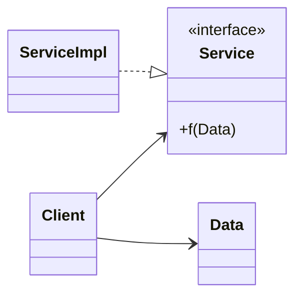
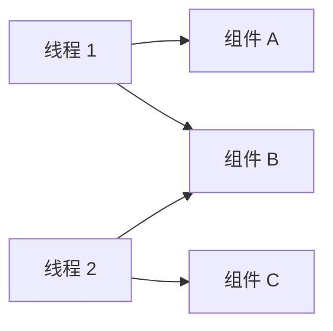
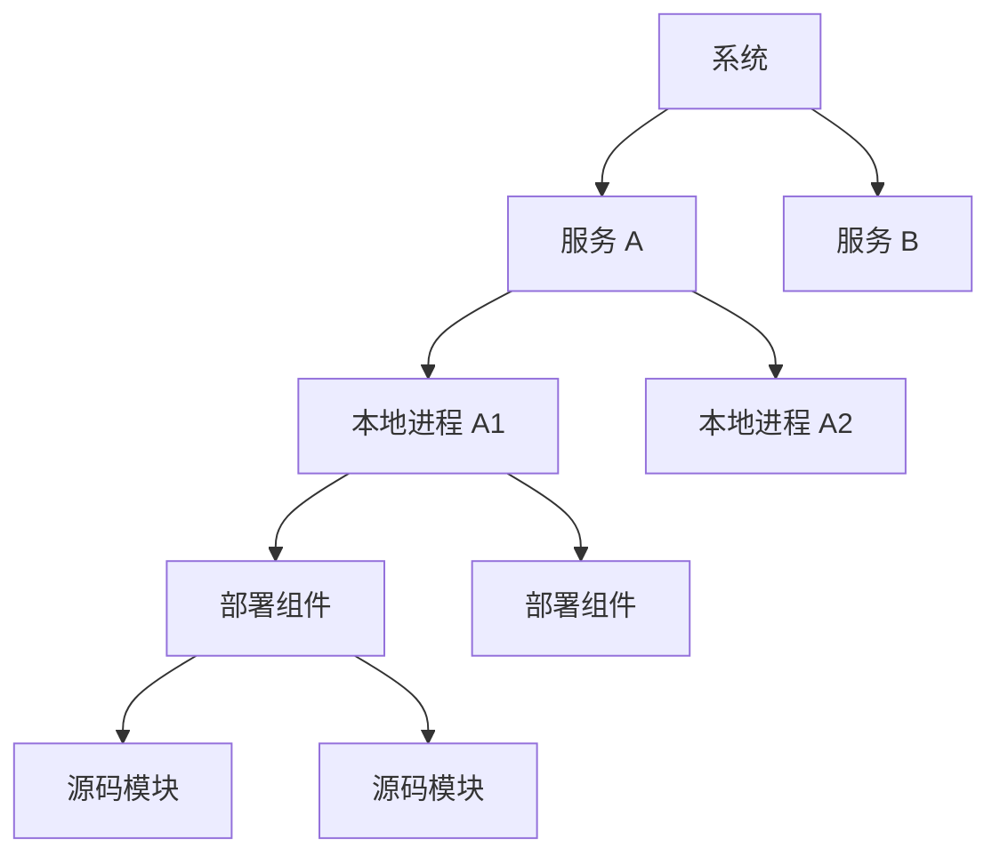

> 原书：Robert C. Martin, *Clean Architecture: A Craftsman's Guide to Software Structure and Design* 
> 本章：Chapter 18, Boundary Anatomy 
> 原文参考：Clean Architecture.md

## 本章导读
> **原书图示**：Chapter 18 章首页
第 17 章说明，软件架构是画边界的艺术：

- 核心业务规则位于边界的重要一侧；
- GUI、数据库、框架等细节作为插件位于外围；
- 源码依赖统一指向高层业务；
- 边界阻止低层变化污染核心。

第 18 章继续追问：

> **一条架构边界在真实系统中究竟长什么样？跨越不同边界要付出什么成本？**

原书按边界的物理强度依次讨论：

1. 单体内部的源码边界；
2. 动态链接的部署组件边界；
3. 本地进程边界；
4. 网络服务边界。

中间还专门澄清：线程不是架构边界。

边界越向右：

- 物理隔离通常越强；
- 独立部署和故障隔离能力越强；
- 通信机制越复杂；
- 延迟和资源成本越高；
- 数据契约越需要克制和稳定。

但所有形态共享同一条架构规则：

> **跨边界源码依赖必须指向更高层、更重要的策略。**

运行时控制流可以从高层进入低层实现，源码依赖却要通过接口倒置回来。

本章不提供“服务一定比单体好”的等级排序。作者的结论是，大多数真实系统会混合多种边界：服务内部仍可能包含本地进程，本地进程内部又包含动态组件和源码模块。

## 1. 系统架构由组件与边界共同定义

### 1.1 章首定义

原书指出，一个系统的架构由两类东西定义：

- 软件组件；
- 分隔这些组件的边界。

只列出组件还不够。还要知道：

- 组件之间是否能直接看见内部实现；
- 哪一侧定义契约；
- 源码依赖朝哪个方向；
- 组件怎样通信；
- 组件怎样构建和部署；
- 一侧变化会不会迫使另一侧变化。

边界决定这些关系。

### 1.2 边界有逻辑形态，也有物理形态

**逻辑边界**可以由以下手段形成：

- 模块；
- 包；
- 接口；
- 访问控制；
- 依赖规则；
- 架构测试。

**物理边界**可以进一步表现为：

- 独立动态库；
- 独立部署包；
- 独立进程；
- 独立服务；
- 独立机器或网络位置。

同一条逻辑边界可以先存在于源码中，之后再根据需要升级物理强度。

### 1.3 边界强度不是架构质量排名

服务边界比源码边界更强制，但不代表服务一定更优秀。

强边界带来：

- 更明确的隔离；
- 更独立的部署；
- 更清楚的故障域；
- 更高的通信和运维成本。

弱一些的源码边界带来：

- 低成本函数调用；
- 简单部署；
- 更细粒度模块划分；
- 依赖纪律更依靠工具和团队遵守。

应选择足以解决当前问题的最经济边界。

### 1.4 高层与低层按策略距离区分

这里的高层和低层不是：

- UI 在上，数据库在下；
- 调用者在上，被调用者在下；
- 部署图画得更高就是高层。

高层表示：

- 更接近系统核心政策；
- 更少依赖具体机制；
- 更有长期业务价值；
- 更值得被保护。

低层表示：

- 更接近 IO、设备与技术实现；
- 更容易替换；
- 更可能随框架和平台变化。

依赖箭头应朝高层策略方向。

### 1.5 边界的目标仍是控制变化

边界不是为了增加架构名词，而是建立变化防火墙。

当一个组件改变时，我们希望：

- 不相关组件无需修改；
- 不相关组件无需重新编译；
- 不相关组件无需重新部署；
- 核心业务不被外围技术推动；
- 影响范围可以从依赖图中推导。

物理边界不同，防火墙强度和成本也不同。

## 2. Boundary Crossing：跨越边界

### 2.1 运行时穿越其实很简单

原书说，运行时的边界穿越本质上只是：

- 边界一侧的函数调用另一侧的函数；
- 同时传递一些数据。

即使最终使用：

- 虚函数；
- 动态库；
- IPC；
- 消息队列；
- HTTP；
- RPC；

从业务视角看，仍是在请求另一侧执行某项能力，并交换数据。

### 2.2 真正困难的是源码依赖

调用能够工作，不代表边界方向正确。

架构师要管理的是：

- 哪个源模块导入哪个模块；
- 哪个组件拥有接口；
- 数据结构由哪一侧定义；
- 具体实现名称出现在哪里；
- 一侧变化会触发谁重新构建和发布。

如果高层业务直接依赖低层实现，即使运行时调用很快，边界也没有保护核心。

### 2.3 为什么特别关注源码依赖

源模块变化可能迫使依赖它的模块：

- 修改代码；
- 重新类型检查；
- 重新编译；
- 重新链接；
- 重新验证；
- 重新部署。

边界要阻止无关变化沿源码依赖扩散。

### 2.4 边界穿越需要契约

跨越边界至少需要约定：

- 可调用的操作；
- 输入数据；
- 输出数据；
- 错误语义；
- 状态与副作用；
- 时序与性能要求；
- 兼容性规则。

同进程函数调用可能由语言类型系统表达这些约定；网络服务则需要更显式的协议和版本管理。

### 2.5 数据结构也属于边界设计

跨边界传递的数据不能随意由低层细节定义。

如果业务规则通过接口读取数据，但参数和返回值都是 ORM、GUI 或供应商 SDK 类型，那么低层知识仍然穿透边界。

通常应让更高层一侧拥有：

- 接口；
- Request / Response 模型；
- 业务可理解的错误；
- 必要数据结构。

低层 Adapter 负责转换。

### 2.6 运行时方向与源码方向可以不同

有两种常见情况。

**低层客户端调用高层服务：**

- 控制流指向高层；
- 源码依赖也指向高层；
- 两者方向相同。

**高层策略调用低层细节：**

- 控制流进入低层实现；
- 高层只依赖自己定义的接口；
- 低层实现依赖该接口；
- 源码依赖与控制流方向相反。

后一种情况正是 DIP 的用途。

### 2.7 边界不是数据复制越少越好

为了避免创建独立模型，有人会直接把数据库记录或网络 DTO 传入核心。

这减少了短期转换代码，却会：

- 泄漏技术字段；
- 让 Schema 变化影响业务；
- 让远程协议控制领域模型；
- 扩大兼容性范围。

少量显式映射通常是保护边界的合理成本。

## 3. The Dreaded Monolith：单体中的真实边界

### 3.1 标题为何带有反讽

“可怕的单体”这个标题带有反讽意味。

单体经常被描述成没有架构的巨大程序，但原书强调：

> **一个可执行文件内部同样可以拥有真实而有价值的架构边界。**

问题不在是否单体，而在组件是否被纪律性地隔离。

### 3.2 单体的物理特征

从部署视角看，单体通常只有一个可执行交付物，例如：

- 静态链接的 C 或 C++ 程序；
- 组成可执行 `.jar` 的 Java Class；
- 绑定成单个 `.EXE` 的 .NET 二进制；
- 单一应用进程中的其他语言模块。

所有代码通常运行在：

- 同一处理器或处理器组；
- 同一进程；
- 同一地址空间。

原书把这种依靠源码模块维持边界的形态称为 source-level decoupling，也就是源码级解耦。

### 3.3 看不见物理边界，不等于没有边界

单体部署包中看不到多个独立服务或进程，但源码仍可以分成：

- 业务核心；
- 用例；
- GUI；
- 数据库 Adapter；
- 第三方集成；
- 组合根。

这些组件可以：

- 独立开发；
- 独立测试；
- 通过稳定接口组合；
- 最后静态链接成一个程序。

### 3.4 源码级边界依赖纪律

同一地址空间没有操作系统强制隔离。

任何模块理论上可能：

- 导入另一个模块内部类；
- 访问全局状态；
- 绕过接口；
- 直接调用数据库；
- 形成循环依赖。

因此，需要语言模块、访问修饰符、构建规则和架构测试守住边界。

### 3.5 动态多态（dynamic polymorphism）为什么重要

单体内部常用动态多态管理依赖方向。

例如：

- 高层定义 `Repository` 接口；
- 低层数据库类实现接口；
- 组合根在运行时注入实现；
- 高层源码不依赖具体数据库类。

动态多态让控制流进入低层，源码依赖仍指向高层。

### 3.6 没有 OO 是否不能画边界

不是。

也可以使用：

- 函数参数；
- 回调；
- 函数表；
- 模块接口；
- 闭包；
- 消息分发；
- 语言的 Protocol 或 Trait。

原书提到函数指针是早期可用手段，但大量不受约束的函数指针可能较危险。

核心需要的是多态能力，而不是某个特定 OO 语法。

### 3.7 静态多态（static polymorphism）的作用与限制

C++ 模板、泛型等静态多态有时也能管理依赖并提供替换能力。

但具体实现通常在编译期进入实例化过程，因此：

- 实现变化可能触发重新编译；
- 无法像动态多态那样隔离部署影响；
- 运行时替换能力较弱。

静态多态适合性能敏感、实现组合在编译期确定的场景；不能自动提供动态组件边界。

### 3.8 Figure 18.1：低层调用高层
> **原书图示**：Figure 18.1：控制流与依赖同向
Figure 18.1 展示最简单的边界穿越：

- 低层 `Client` 调用高层 `Service.f()`；
- 同时传入 `Data`；
- 控制流从 Client 指向 Service；
- 编译期源码依赖也从 Client 指向 Service。

两种方向都指向高层，不需要倒置。

### 3.9 Figure 18.1 中 Data 为什么属于被调用侧

`Service` 定义它愿意接受的数据契约。

因此，`Data` 定义位于高层 Service 一侧。低层 Client 依赖这个高层模型并构造数据。

这让高层政策决定自己的输入，而不是由低层 Client 的内部结构塑造服务接口。

### 3.10 Figure 18.2：高层调用低层
> **原书图示**：Figure 18.2：控制流与源码依赖反向
Figure 18.2 中：

- 高层 `Client` 需要调用低层 `ServiceImpl`；
- Client 不直接依赖 `ServiceImpl`；
- 高层一侧定义 `Service` 接口；
- `ServiceImpl` 实现 `Service`；
- 运行时控制流由 Client 进入 ServiceImpl；
- 源码依赖由 ServiceImpl 指向高层接口。

### 3.11 Figure 18.2 中 Data 为什么属于调用侧

高层 Client 定义自己需要传递的数据。

低层实现依赖并理解这个高层模型，再把它转换成具体技术格式。

接口和数据定义都留在高层一侧，避免低层细节反向控制核心。

### 3.12 两张图的共同规则

两张图看似不同，实则共享一个原则：

> **接口与跨边界数据契约由高层策略一侧拥有。**

- 低层调用高层时，依赖自然指向高层；
- 高层调用低层时，通过多态倒置源码依赖；
- 无论运行时控制流怎样，跨边界源码箭头都朝高层。

### 3.13 单体边界的团队收益

即使最终只有一个可执行文件，清晰边界仍能让团队：

- 分别开发各自组件；
- 只理解公开契约；
- 独立运行模块测试；
- 避免修改他人内部实现；
- 让高层业务不受低层变化影响。

物理部署统一，不妨碍开发层面独立。

### 3.14 单体通信为何可以很“话痨”

同进程边界通常只需函数调用：

- 无网络往返；
- 无数据序列化；
- 无进程切换；
- 可传递丰富对象；
- 调用延迟很低。

因此，源码级组件之间可以采用较细粒度、较频繁的交互。

### 3.15 “便宜”不代表可以滥用

大量函数调用仍可能造成：

- 复杂控制流；
- 隐藏耦合；
- 过多共享状态；
- 难以理解的调用链；
- 测试边界模糊。

通信成本低，不等于设计成本为零。

### 3.16 单体组件怎样交付

单体通常需要：

- 编译源码；
- 静态链接或统一打包；
- 发布一个整体可执行产物。

组件往往以源码形式参与最终构建，因此底层变化可能触发较大范围重新编译。

这正是部署组件边界进一步解决的问题。

## 4. Deployment Components：部署级组件

### 4.1 最简单的物理边界

部署级组件是架构边界最简单的物理表现。

原书举例：

- .NET DLL；
- Java `.jar`；
- Ruby Gem；
- UNIX 共享库。

它们是独立的二进制或等价部署产物。

### 4.2 部署时不再编译源码

组件生产者已经完成编译和打包。

部署者通常只需：

- 取得兼容版本；
- 把组件放入指定目录或归档；
- 配置运行环境；
- 启动程序。

原书称这种方式为 deployment-level decoupling，也就是部署级解耦。

### 4.3 WAR 或目录中的组件集合

多个部署组件可以被收集到：

- `.war`；
- 插件目录；
- 应用安装目录；
- 运行时类路径；
- 其他聚合交付物。

组件仍有独立身份，最后一起装入应用。

### 4.4 部署级组件与单体的共同点

除独立部署产物外，它们与单体组件非常相似：

- 可以运行在同一进程；
- 可以共享同一地址空间；
- 通常通过函数或方法调用；
- 使用相同依赖倒置策略；
- 高层接口仍由高层组件拥有。

因此，不必为了独立部署就引入网络服务。

### 4.5 部署级边界的主要收益

它可以让团队：

- 独立构建组件；
- 独立发布版本；
- 不重编整个系统就替换兼容组件；
- 复用已验证二进制；
- 支持插件安装；
- 缩小部署变更范围。

### 4.6 动态加载的一次性成本

程序启动或首次使用组件时，可能需要：

- 定位文件；
- 加载二进制；
- 解析符号；
- 验证版本；
- 初始化组件。

这通常是一次性成本。加载完成后，组件间调用仍然接近普通函数调用。

### 4.7 部署级通信仍可以较频繁

因为双方通常同进程：

- 不需要网络；
- 不需要跨进程序列化；
- 调用延迟低；
- 边界可以保持细粒度。

虽然 ABI、ClassLoader 和版本兼容需要管理，但运行时通信成本仍远低于 IPC 和服务。

### 4.8 静态多态为何不能提供同样边界

模板或泛型实现通常在编译期绑定进使用者代码。

若希望替换一个已编译动态组件，而不重编使用者，需要运行时接口和稳定二进制契约。

因此，原书脚注指出，静态多态在这种部署级替换中不是相同选项。

### 4.9 部署组件的风险

独立二进制会引入：

- 版本冲突；
- ABI 不兼容；
- 类加载问题；
- DLL 搜索路径风险；
- 插件安全问题；
- 初始化顺序；
- 许可证与供应链管理。

边界更物理，治理也更正式。

### 4.10 何时值得升级到部署级

常见驱动包括：

- 团队需要独立发布；
- 插件需要按需安装；
- 组件更新频率不同；
- 全量构建太慢；
- 客户需要不同功能组合；
- 组件需要独立回滚。

若所有代码始终一起发布，源码级边界可能已足够。

## 5. Threads：线程不是架构边界

### 5.1 原书的关键澄清

线程不是：

- 架构边界；
- 部署单元；
- 组件边界。

线程是安排执行顺序与调度的一种方式。

### 5.2 线程与组件属于不同维度

一个组件可以：

- 单线程执行；
- 创建多个线程；
- 被多个线程同时调用。

一个线程也可以依次执行：

- UI 组件；
- 用例组件；
- 领域组件；
- 数据库组件。

因此，线程与组件是正交关系。

### 5.3 为什么线程看起来像边界

线程之间需要考虑：

- 同步；
- 共享状态；
- 锁；
- 调度；
- 竞态；
- 生命周期。

这些问题很重要，但它们不自动决定源码依赖方向和部署单位。

### 5.4 线程不会提供地址空间隔离

同一进程中的线程通常共享：

- 堆内存；
- 全局变量；
- 文件描述符；
- 进程资源。

一个线程可以破坏另一个线程使用的数据。它不像进程边界那样由操作系统提供内存保护。

### 5.5 并发边界仍需架构设计

虽然线程本身不是架构边界，但并发职责可以影响组件设计：

- 谁拥有可变状态；
- 哪些操作必须串行；
- 消息如何传递；
- 锁是否泄漏到业务层；
- 任务怎样取消；
- 错误如何传播。

不要把“使用不同线程”误当成“组件已经解耦”。

## 6. Local Processes：本地进程边界

### 6.1 更强的物理边界

本地进程通常由：

- 命令行；
- 操作系统调用；
- 进程管理器；
- 应用启动器；

创建。

它们可能运行在同一处理器或同一多核机器上，但拥有独立地址空间。

### 6.2 内存保护带来的隔离

操作系统通常阻止一个进程直接读写另一个进程内存。

这带来：

- 更强故障隔离；
- 更明确数据边界；
- 独立生命周期；
- 独立资源限制；
- 更难绕过的组件边界。

共享内存仍可使用，但必须显式建立，并承担同步与安全成本。

### 6.3 本地进程怎样通信

常见 IPC 机制包括：

- Socket；
- Pipe；
- Mailbox；
- Message Queue；
- 共享内存；
- 操作系统特定通信设施。

数据不能直接作为普通对象指针传给另一进程，通常要编码、复制或映射。

### 6.4 进程本身仍包含低层组件

一个本地进程内部可以是：

- 静态链接单体；
- 多个动态部署组件；
- 多个源码模块；
- 多线程程序。

原书把进程称为一种 uber-component，也就是超级组件。

### 6.5 多个进程可能包含相同组件

若每个进程静态链接，多个进程可能把同一组件分别编译进自身。

若使用动态库，多个进程也可能加载相同部署组件。

进程边界与内部组件边界可以同时存在。

### 6.6 依赖方向规则没有改变

本地进程隔离更强，但边界策略仍与单体相同：

- 低层进程应作为高层进程的插件；
- 源码依赖指向高层策略；
- 高层进程不应依赖低层进程的具体实现细节。

物理分离不会自动带来正确依赖方向。

### 6.7 高层源码不应硬编码低层位置

原书特别指出，高层进程源码不应包含低层进程的：

- 名称；
- 物理地址；
- Registry Lookup Key。

否则，低层部署细节会污染高层策略。

### 6.8 那么进程地址由谁知道

具体地址和查找信息可以由：

- 组合根；
- 启动配置；
- 进程监督器；
- 服务发现 Adapter；
- 环境注入；

提供。

高层策略只依赖逻辑契约，不在源码中绑定具体进程身份。

### 6.9 本地进程通信的成本

与同进程函数调用相比，IPC 通常需要：

- 操作系统调用；
- 数据编码与解码；
- 数据复制或共享内存协调；
- 进程上下文切换；
- 队列等待；
- 错误和生命周期管理。

原书称这种成本 moderately expensive，也就是中等昂贵。

### 6.10 为什么要限制话痨通信

如果两个进程为完成一个用例来回发送大量小消息：

- 上下文切换增多；
- 编码成本累积；
- 调试时序变难；
- 部分失败点增加；
- 吞吐与延迟恶化。

本地进程边界应采用比函数调用更粗的交互。

### 6.11 IPC 接口应围绕用例组织

不要把本地对象的每个 Getter 和 Setter 映射成 IPC 消息。

更好的边界通常表达完整意图，例如：

- 提交订单；
- 生成报表；
- 执行索引任务；
- 查询聚合结果。

单次调用携带完成该意图所需数据，减少来回通信。

### 6.12 本地进程适合什么场景

常见驱动包括：

- 故障隔离；
- 权限隔离；
- 不同运行时；
- 独立重启；
- CPU 或内存资源控制；
- 第三方不可信代码；
- 本机后台任务。

如果没有这些需求，部署组件边界可能更简单。

## 7. Services：服务边界

### 7.1 最强的常见边界

原书把服务称为最强边界。

服务通常也是独立进程，但与本地进程相比具有额外假设：

- 不依赖具体物理位置；
- 通信统一按网络处理；
- 两端可能在同一机器，也可能相隔很远；
- 部署和故障相互独立。

### 7.2 位置无关是什么意思

调用者依赖的是逻辑服务能力，而不是源码中写死的：

- 主机名；
- IP；
- 端口；
- URI；
- 机器位置。

实际位置由配置、发现机制、代理或编排平台提供。

### 7.3 位置无关不等于网络透明

调用者仍必须理解服务通信会出现：

- 延迟；
- 超时；
- 断连；
- 重复；
- 消息丢失；
- 版本不一致；
- 局部故障。

业务核心不应知道具体 URI，但应用边界必须设计这些失败语义。

### 7.4 网络通信为何昂贵

与函数调用相比，服务调用需要：

- 序列化；
- 网络协议栈；
- 路由与排队；
- 远端调度；
- 反序列化；
- 响应返回；
- 安全认证和加密。

原书指出，往返可能从几十毫秒到数秒。

### 7.5 服务边界更不能话痨

如果一个业务操作需要几十次串行网络调用：

- 延迟会累积；
- 任意一步失败都会影响整体；
- 重试可能放大负载；
- 调用链难以排查；
- 可用性下降。

服务 API 应围绕较完整业务能力设计，而不是远程对象的细粒度方法镜像。

### 7.6 服务边界的数据契约

网络边界必须明确：

- 消息 Schema；
- 编码格式；
- 兼容版本；
- 幂等规则；
- 超时与重试；
- 错误响应；
- 认证与授权；
- 追踪上下文。

契约比进程内接口更难改变，因此更需要 REP、ISP 与 LSP 思维。

### 7.7 依赖方向仍指向高层服务

服务化没有改变核心原则：

- 低层服务插件到高层服务；
- 高层服务源码不包含低层服务的具体位置；
- 高层一侧定义所需契约；
- 低层实现和部署信息留在外围。

### 7.8 “高层服务”不一定是调用者

一个业务编排服务可能在运行时调用数据库或通知服务，但它在策略层次上更高。

源码依赖应通过高层拥有的 Port、消息契约或 Adapter 组织，而不是直接把供应商 SDK 和物理地址写进业务规则。

### 7.9 服务能带来什么

合理服务边界可以提供：

- 独立部署；
- 独立伸缩；
- 故障隔离；
- 技术栈隔离；
- 安全域隔离；
- 团队运行自治；
- 跨机器分布。

这些收益必须足以支付网络和运维成本。

### 7.10 服务不能自动带来什么

服务不会自动保证：

- 低耦合；
- 正确依赖方向；
- 独立数据所有权；
- 无环依赖；
- 良好内聚；
- 可靠兼容性。

多个服务仍可能锁步发布、共享数据库并形成循环调用。

### 7.11 何时值得采用服务边界

常见真实驱动包括：

- 独立伸缩需求；
- 强故障隔离；
- 独立安全边界；
- 地理分布；
- 独立团队值守；
- 不同运行平台；
- 需要独立生命周期。

“系统以后可能很大”通常不足以单独证明服务化。

## 8. Conclusion：真实系统混合多种边界

### 8.1 原书结论

除了最简单的单体，大多数系统会同时使用多种边界策略。

例如：

- 系统对外表现为多个服务；
- 每个服务内部包含若干本地进程；
- 每个进程加载多个动态组件；
- 每个组件内部又有源码模块边界。

### 8.2 边界是嵌套的

每一层边界解决不同问题。

### 8.3 服务常是本地进程集合的门面

一个服务 Endpoint 背后可能协调：

- Worker 进程；
- 缓存进程；
- 数据处理进程；
- 动态插件；
- 同进程模块。

外部只看到服务契约，内部可以采用更便宜、更细粒度的边界。

### 8.4 不同边界需要不同通信风格

| 边界 | 常见通信 | 合理交互风格 |
| --- | --- | --- |
| 源码级 | 函数调用 | 可以细粒度、较频繁 |
| 部署级 | 函数调用 | 可以细粒度、较频繁 |
| 本地进程 | IPC | 应减少来回，按意图传递数据 |
| 服务级 | 网络 | 粗粒度，显式处理延迟与失败 |

不能把进程内对象调用模式直接搬到网络上。

### 8.5 同一系统需要两种主要关注

原书说，系统边界常混合：

- 本地、低成本、可以较话痨的边界；
- 高延迟、必须克制通信的边界。

架构师需要同时管理：

- 源码变化传播；
- 运行时通信成本。

只看其中一项，会得到失衡设计。

### 8.6 最终不变的是依赖规则

无论边界表现为：

- 模块；
- 动态库；
- 进程；
- 服务；

都应坚持：

- 高层拥有契约；
- 低层实现依赖高层接口；
- 具体位置和技术不进入核心源码；
- 数据结构不会泄漏低层细节；
- 变化尽量停止在边界处。

## 9. 四种边界的统一对比

### 9.1 物理隔离对比

| 维度 | 源码级单体 | 部署组件 | 本地进程 | 服务 |
| --- | --- | --- | --- | --- |
| 地址空间 | 相同 | 通常相同 | 不同 | 不同 |
| 独立部署 | 通常没有 | 有 | 有 | 有 |
| 物理位置 | 同一进程 | 同一进程为主 | 同一机器 | 任意网络位置 |
| 内存保护 | 没有边界保护 | 没有边界保护 | 有 | 有 |
| 通信成本 | 很低 | 很低 | 中等 | 高 |
| 故障隔离 | 弱 | 弱 | 较强 | 强，但有分布式故障 |
| 契约治理 | 模块接口 | 二进制与版本接口 | IPC 协议 | 网络协议与版本 |

### 9.2 开发与部署对比

| 边界 | 开发收益 | 主要额外成本 |
| --- | --- | --- |
| 源码级 | 细粒度模块、快速测试 | 依赖纪律需要主动维护 |
| 部署级 | 独立构建、版本与替换 | ABI、加载、版本冲突 |
| 本地进程 | 生命周期和故障隔离 | IPC、上下文切换、监督 |
| 服务级 | 独立伸缩和位置 | 网络、兼容、运维、部分失败 |

### 9.3 边界升级不是免费增强

从左向右升级边界，得到更强隔离，却会失去一部分简单性。

例如，从源码组件变成服务，需要新增：

- 协议；
- 序列化；
- 超时；
- 重试；
- 身份认证；
- 部署流水线；
- 监控与追踪；
- 数据一致性处理。

应由明确需求驱动升级。

### 9.4 边界也可以降级

如果服务：

- 不再独立伸缩；
- 总是同步发布；
- 只被一个调用者使用；
- 网络调用非常频繁；
- 由同一团队维护；

可以考虑合并为部署组件或源码组件。

架构演化不是单向走向更强物理边界。

## 10. 怎样选择合适的边界形态

### 10.1 先问逻辑边界是否成立

物理拆分前先确认：

- 两侧是否因不同原因变化？
- 高层与低层是否清楚？
- 契约由正确一侧拥有吗？
- 数据所有权明确吗？
- 依赖方向是否正确？
- 是否存在真实独立性需求？

若逻辑边界错误，服务化只会把错误变成网络协议。

### 10.2 源码级通常是经济起点

源码边界适合：

- 项目早期；
- 团队较小；
- 运行压力未知；
- 单一部署足够；
- 仍需观察共同变化；
- 希望保持细粒度组件。

它可以先保护业务核心，同时保留物理拆分选项。

### 10.3 何时需要部署组件

考虑部署级边界时，寻找：

- 独立版本需求；
- 插件安装需求；
- 二进制复用；
- 独立团队发布；
- 大型构建隔离；
- 客户功能组合。

如果没有这些需求，统一构建可能更简单。

### 10.4 何时需要本地进程

考虑本地进程时，寻找：

- 崩溃隔离；
- 权限隔离；
- 独立资源限制；
- 不同运行时；
- 独立重启；
- 本机任务调度。

还要确认 IPC 成本和监督能力可接受。

### 10.5 何时需要服务

考虑服务边界时，寻找：

- 跨机器部署；
- 独立伸缩；
- 地理分布；
- 安全域隔离；
- 独立团队运行责任；
- 真正独立的数据与生命周期。

服务应解决实际运行或组织问题，而不是追随名词潮流。

### 10.6 以最昂贵交互设计契约

如果组件将来可能成为服务，边界契约应避免过度话痨：

- 以完整业务意图为操作；
- 避免远程 Getter / Setter；
- 使用稳定数据模型；
- 明确幂等与失败；
- 控制调用链长度。

但也不要为了假想网络，给所有同进程调用提前增加真实网络栈。

### 10.7 用证据升级边界

可观察证据包括：

- 某组件需要独立伸缩；
- 故障需要隔离；
- 发布节奏明显不同；
- 团队经常互相阻塞；
- 资源竞争无法在进程内解决；
- 插件需要独立安装。

边界升级应解决已经出现或高度确定的问题。

## 11. 现代案例：同一业务的不同边界选择

### 11.1 报表生成模块

初期：

- 报表作为同进程源码组件；
- 用例通过 `ReportGenerator` 接口调用；
- 快速函数调用。

数据量增大后：

- 报表成为独立 Worker 进程；
- 主应用提交完整任务消息；
- Worker 可独立重启。

进一步需要云端伸缩时：

- Worker 成为网络服务；
- 多实例消费任务；
- 核心报表规则保持稳定。

### 11.2 插件式文件转换

第三方转换器可能不稳定甚至不可信。

可选择：

- 可信转换器作为动态库；
- 不可信转换器放入沙箱进程；
- 远程高负载转换器作为服务。

同一逻辑插件边界可以采用不同物理强度。

### 11.3 支付网关

订单核心定义支付契约。

供应商 Adapter 可以：

- 与核心同进程；
- 作为独立部署库；
- 由本地代理进程托管；
- 通过远程支付服务访问。

业务核心不应知道具体 URI 和供应商 SDK。

### 11.4 搜索功能

简单项目中，搜索可以是进程内模块。

规模增加后，索引可能运行在独立进程或远程集群。

若用例最初只依赖稳定搜索 Port，核心查询意图可以保留；但远程化后仍需增加超时、降级和最终一致性处理。

### 11.5 桌面应用与后台服务

桌面程序可能把：

- UI 与业务模型放在主进程；
- 索引任务放在本地后台进程；
- 云同步放在网络服务；
- 扩展功能放在动态插件。

这是原书所说的混合边界系统。

## 12. 易混淆概念与常见误解

### 12.1 “单体没有架构边界”

错误。单个可执行文件中仍可通过模块、接口和依赖规则形成强有价值的源码边界。

### 12.2 “微服务边界天然比单体边界好”

错误。服务隔离更强，但通信、运维和失败成本也更高。

### 12.3 “部署组件必须运行在独立进程”

错误。DLL、`.jar` 和共享库通常可在同一进程和地址空间中运行。

### 12.4 “线程是最轻量的架构组件”

错误。线程是调度执行的方式，不是源码或部署边界。

### 12.5 “不同线程意味着数据隔离”

错误。同一进程线程通常共享内存，仍需明确状态所有权和同步。

### 12.6 “本地进程和服务完全相同”

不相同。本地进程通常位于同一机器，使用 OS IPC；服务假定通过网络且位置无关。

### 12.7 “服务位置无关意味着高层不需要处理网络失败”

错误。源码不硬编码 URI，但应用仍要显式处理超时、重试和部分失败。

### 12.8 “高层就是运行时调用者”

错误。高层按策略价值定义。高层业务可以在运行时调用低层数据库实现。

### 12.9 “控制流必须始终指向高层”

错误。控制流可以进入低层插件；需要始终指向高层的是跨边界源码依赖。

### 12.10 “接口放在哪一侧无所谓”

错误。接口所有权决定谁控制契约。高层需要低层服务时，接口应由高层一侧拥有。

### 12.11 “跨边界可以直接复用低层 DTO”

危险。这会让低层协议和 Schema 控制核心。应使用高层拥有的边界模型并转换。

### 12.12 “函数调用便宜，所以单体组件可以任意耦合”

错误。运行成本低不代表变化耦合和理解成本低。

### 12.13 “动态库调用一定比普通函数慢很多”

通常不对。加载后仍多为同进程调用，主要额外成本常在加载和符号解析阶段。

### 12.14 “进程隔离后依赖方向自然正确”

错误。高层仍可能硬编码低层进程名称、地址和查找 Key。

### 12.15 “服务 API 可以照搬对象方法”

危险。细粒度远程调用会产生高延迟和大量失败点，应围绕业务意图设计。

### 12.16 “服务越小，通信就越简单”

不一定。服务过细会增加调用数量、协议和部署单元。

### 12.17 “物理边界越强，源码越不需要设计”

错误。服务同样需要高层契约、正确依赖、内聚和兼容性。

### 12.18 “系统应统一使用一种边界策略”

错误。真实系统通常嵌套源码、部署组件、本地进程和服务边界。

### 12.19 “边界只能升级，不能降级”

错误。运行和组织压力消失后，服务可以合并回更简单形态。

### 12.20 “服务化后业务代码完全不变”

错误。好的边界能保护大部分策略，但远程失败、数据所有权和一致性仍需设计。

## 13. 实践检查与掌握练习

### 13.1 通用边界检查

- 边界两侧分别是什么策略层次？
- 哪一侧拥有接口和数据契约？
- 源码依赖是否指向高层？
- 运行时控制流是否需要倒置？
- 低层类型是否泄漏到高层？
- 一侧变化会迫使另一侧怎样重建或部署？

### 13.2 单体检查

- 模块内部是否可以被其他模块绕过？
- 是否有架构测试限制依赖？
- 高层业务是否导入数据库和 UI？
- 动态多态是否用于倒置必要依赖？
- 模块测试能否独立运行？
- 单一部署是否仍是当前最经济选择？

### 13.3 部署组件检查

- 组件是否有独立版本？
- 二进制契约是否稳定？
- 是否存在 DLL 或 ClassLoader 冲突？
- 组件能否独立替换和回滚？
- 动态加载失败是否清楚可诊断？
- 独立部署收益是否真实存在？

### 13.4 线程检查

- 是否错误地把线程当作组件所有权？
- 哪个组件拥有共享状态？
- 同步与取消策略在哪里？
- 一个线程是否穿越多个组件？
- 并发机制是否泄漏进核心业务？

### 13.5 本地进程检查

- 进程隔离解决什么问题？
- IPC 是否过于话痨？
- 消息是否表达完整业务意图？
- 高层是否硬编码低层进程名称与地址？
- 进程由谁启动、监督和重启？
- 共享内存是否重新引入紧耦合？

### 13.6 服务检查

- 服务是否需要独立伸缩、故障或安全边界？
- 高层源码是否包含低层 URI？
- 协议是否版本化？
- 超时、重试和幂等是否明确？
- 是否存在过长同步调用链？
- 数据所有权是否清楚？
- 服务是否总是锁步发布？

### 13.7 混合系统检查

- 每个服务内部有哪些进程和组件？
- 哪些边界可以话痨，哪些必须粗粒度？
- 同一契约是否被错误地用于本地与远程调用？
- 边界升级或降级路径是否明确？
- 监控能否跨越嵌套边界追踪一次用例？

### 13.8 场景判断一：模块化单体

系统只有一个可执行文件，但核心、数据库、UI 和外部服务 Adapter 的源码依赖清楚且无环。

**判断：** 这是具有真实架构边界的单体，不应仅因部署为一个文件就认定架构落后。

### 13.9 场景判断二：动态插件

应用从目录加载多个 `.jar`，插件实现核心定义的接口，调用都在同一进程。

**判断：** 这是部署级边界。可独立发布，但运行通信仍是低成本函数调用。

### 13.10 场景判断三：两个线程共享全局对象

团队称两个线程为两个组件，但它们直接修改同一全局数据结构。

**判断：** 线程不构成架构边界，也没有提供数据隔离。

### 13.11 场景判断四：本地进程频繁 Getter 调用

两个进程通过 Socket 模拟对象的每个属性访问，一个用例需要数百次往返。

**判断：** 把本地对象模式错误搬到 IPC。应改成围绕业务意图的粗粒度消息。

### 13.12 场景判断五：业务代码写死服务 URI

订单用例直接访问某通知服务的固定 URL。

**判断：** 低层物理位置污染高层。应通过 Port 与配置在外围解析具体位置。

### 13.13 场景判断六：服务只做代理转发

一个服务没有独立规则和数据，只把每个请求转发给另一个服务，并总是同步发布。

**判断：** 物理边界收益可疑，应评估合并或重新划分职责。

### 13.14 场景判断七：不可信插件放入独立进程

插件原本是动态库，但崩溃会拖垮宿主，因此改为本地进程并通过消息通信。

**判断：** 这是由故障隔离驱动的合理边界升级，需要接受 IPC 成本。

### 13.15 场景判断八：高流量模块远程化

某模块需要独立伸缩到多台机器，且数据所有权清楚、接口已稳定。

**判断：** 服务边界有明确运行收益，但仍需设计网络失败和协议兼容。

### 13.16 快速复述练习

能够回答以下问题，基本就掌握了本章：

1. 系统架构由哪两类元素定义？
2. 运行时边界穿越的本质是什么？
3. 为什么架构更关注源码依赖？
4. 跨边界数据结构应由哪一侧拥有？
5. 单体为什么仍能拥有真实边界？
6. 单体内部通常怎样用多态管理依赖？
7. 静态多态为什么不能完全替代动态组件边界？
8. Figure 18.1 中控制流与源码依赖怎样指向？
9. Figure 18.1 的 `Data` 为什么在 Service 一侧？
10. Figure 18.2 如何倒置高层对低层的依赖？
11. Figure 18.2 的 `Data` 为什么在 Client 一侧？
12. 单体通信为什么可以较频繁？
13. 部署组件与单体主要差别是什么？
14. 动态组件加载后怎样通信？
15. 为什么线程不是架构边界？
16. 本地进程提供什么物理隔离？
17. 本地进程常用哪些 IPC 机制？
18. 为什么高层不应硬编码低层进程名称和地址？
19. IPC 为什么要限制话痨程度？
20. 服务与本地进程的主要差别是什么？
21. 服务位置无关为什么不等于网络透明？
22. 为什么服务调用应更粗粒度？
23. 服务边界是否自动保证低耦合？
24. 为什么真实系统通常混合多种边界？
25. 边界物理强度与通信成本有什么关系？
26. 什么时候应从源码级升级到部署级、进程级或服务级？
27. 为什么边界也可能降级？

### 13.17 一分钟记忆卡

- **穿越：** 运行时只是调用另一侧并传递数据。
- **难点：** 管理源码依赖和数据契约归属。
- **方向：** 所有跨边界源码依赖指向高层策略。
- **单体：** 一个可执行文件也能有真实源码边界。
- **部署组件：** DLL、`.jar`、Gem、共享库可独立发布，通常仍同进程调用。
- **线程：** 是调度机制，不是架构或部署边界。
- **本地进程：** 独立地址空间，IPC 成本中等，应减少话痨。
- **服务：** 位置无关且通过网络，延迟和失败成本最高。
- **混合：** 服务内部仍包含进程、部署组件和源码模块。
- **选择：** 使用足以解决真实问题的最经济边界。

## 14. 本章总结

1. 第 18 章解剖架构边界的常见物理形态与通信代价。
2. 系统架构由软件组件以及分隔组件的边界共同定义。
3. 边界既可以是源码中的逻辑规则，也可以成为库、进程或服务的物理隔离。
4. 物理隔离越强，独立部署和故障隔离通常越强，通信成本也越高。
5. 服务边界不是架构质量的最高等级，应选择足以解决问题的经济形态。
6. 高层表示更接近核心政策，低层表示更接近具体机制，与图上位置无关。
7. 边界的目标是阻止无关变化沿源码依赖传播。
8. 运行时跨越边界，本质是调用另一侧函数并传递数据。
9. 架构的关键不是调用能否完成，而是源码依赖指向哪里。
10. 源码依赖会影响修改、编译、验证和部署范围。
11. 跨边界契约还要定义数据、错误、副作用、时序与兼容性。
12. 高层一侧通常应拥有接口和边界数据模型，低层负责转换。
13. 低层调用高层时，控制流与源码依赖自然都指向高层。
14. 高层调用低层时，应通过动态多态让源码依赖反向指向高层接口。
15. 单体是运行在同一进程和地址空间、通常部署为单个可执行文件的结构。
16. 单体没有可见物理分隔，不代表内部不能有真实组件边界。
17. 模块、访问控制、构建规则与架构测试可维护单体中的依赖纪律。
18. 动态多态使低层实现依赖高层抽象，并保护核心业务。
19. 函数回调、Protocol 和模块接口也可以提供所需多态，不必局限于 OO 语法。
20. 静态多态适合编译期组合，但通常不能隔离重新编译和运行时替换。
21. Figure 18.1 中低层 Client 调用高层 Service，控制流和源码依赖同向。
22. Figure 18.1 的 `Data` 由被调用的高层 Service 一侧定义。
23. Figure 18.2 中高层 Client 通过 `Service` 接口调用低层 `ServiceImpl`。
24. Figure 18.2 的运行时控制流进入低层，源码依赖却由低层指向高层接口。
25. Figure 18.2 的数据结构由高层调用侧拥有。
26. 同进程函数调用成本低，因此源码级边界可以采用较细粒度交互。
27. 低运行成本不代表可以忽略变化耦合与理解成本。
28. 部署组件包括 DLL、`.jar`、Gem 和 UNIX 共享库等独立产物。
29. 部署级组件无需在部署现场重新编译，可按版本收集到归档或目录。
30. 部署组件通常仍在同一进程和地址空间，通过低成本函数调用通信。
31. 动态加载可能有一次性成本，之后调用仍可以较频繁。
32. 独立二进制带来版本、ABI、加载与供应链治理问题。
33. 线程是执行调度方式，不是架构边界或部署单元。
34. 同一线程可以穿越多个组件，一个组件也可以由多个线程执行。
35. 同进程线程共享内存，不能自动提供数据和故障隔离。
36. 本地进程运行在独立地址空间，通常由操作系统内存保护隔离。
37. 本地进程可通过 Socket、Pipe、Mailbox、消息队列或共享内存通信。
38. 每个本地进程内部仍可以包含单体模块、动态组件和多个线程。
39. 原书把本地进程视为包含低层组件的超级组件。
40. 本地进程边界仍要求低层进程插件到高层策略。
41. 高层源码不应硬编码低层进程名称、物理地址或 Registry Key。
42. IPC 需要系统调用、编码、数据传递和上下文切换，成本中等。
43. 本地进程通信应减少细碎往返，并围绕完整业务意图设计。
44. 服务是最强的常见边界，独立于具体物理位置并假定通过网络通信。
45. 服务位置由配置或发现机制提供，不应写死在高层业务源码中。
46. 位置无关不等于网络透明，超时、重复和部分失败必须显式设计。
47. 服务调用远慢于函数和本地 IPC，往返可能达到几十毫秒甚至数秒。
48. 服务 API 应粗粒度，避免把本地对象 Getter 和 Setter 搬到网络上。
49. 服务可提供独立伸缩、故障、安全和团队运行边界，但不会自动保证低耦合。
50. 服务仍可能共享数据库、循环调用并锁步发布。
51. 大多数真实系统会嵌套源码级、部署级、本地进程和服务边界。
52. 服务常只是内部多个本地进程与组件的门面。
53. 不同边界需要不同通信风格：本地可较细，远程必须克制。
54. 无论采用哪种物理形态，跨边界源码依赖都应指向高层策略。
55. 本章最终方法是：先建立正确逻辑依赖，再用足以满足部署、故障和运行需求的最经济物理边界。
