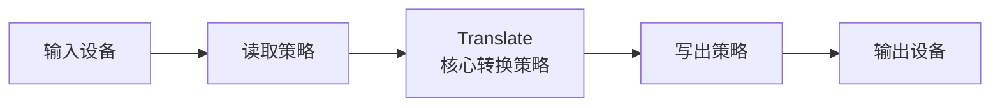
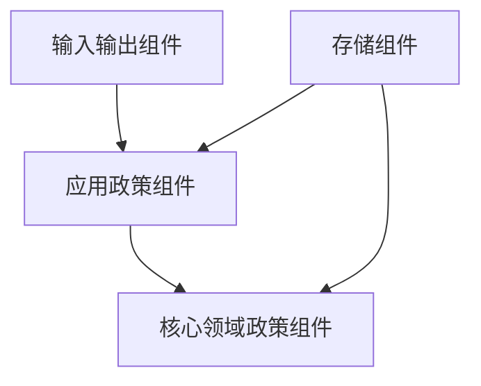
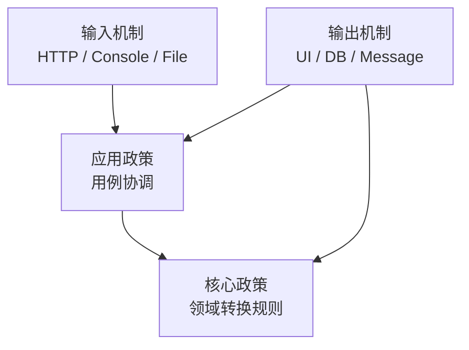
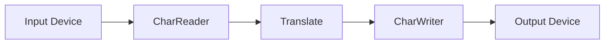
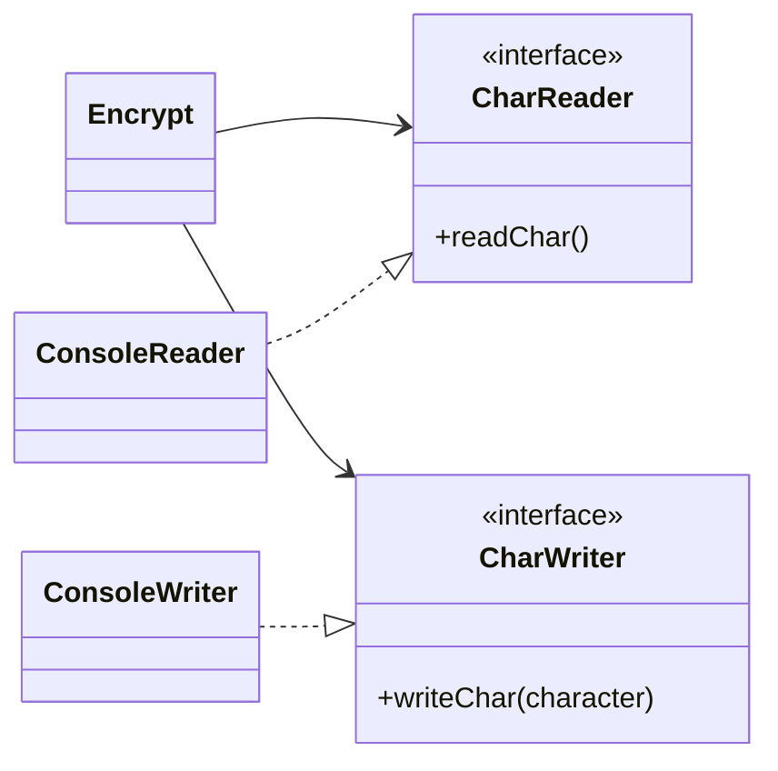
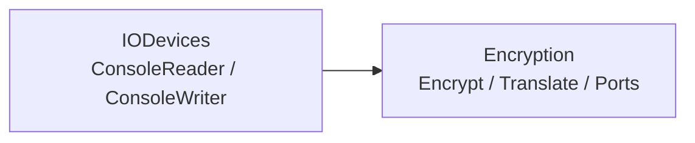
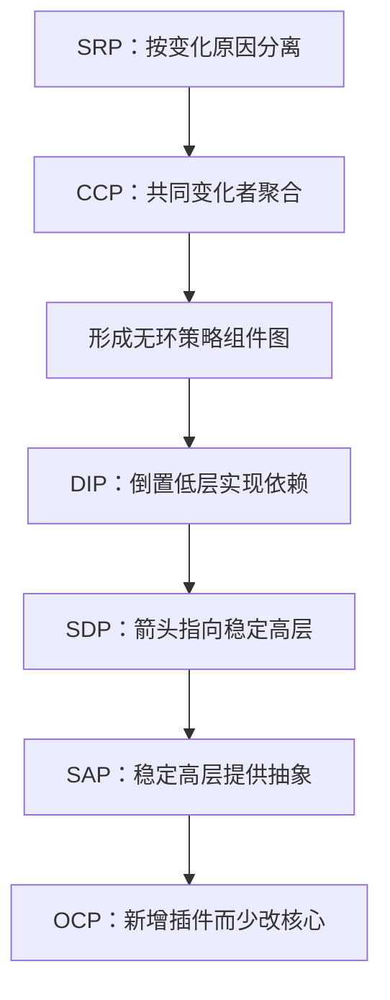

> 原书：Robert C. Martin, *Clean Architecture: A Craftsman's Guide to Software Structure and Design*<br>
> 本章：Chapter 19, Policy and Level<br>
> 原文参考：Clean Architecture.md

## 本章导读
> **原书图示**：Chapter 19 章首页
第 17 章说明边界应画在变化轴上，低层插件应依赖高层业务。

第 18 章进一步说明，不论边界表现为源码模块、动态组件、本地进程还是服务，源码依赖都应指向高层策略。

第 19 章接着回答：

> **什么叫“高层”与“低层”？为什么源码依赖必须朝高层？**

原书给出一个严格而容易记忆的定义：

> **层级是策略离系统输入和输出的距离。离输入与输出越远，策略层级越高；负责输入输出的策略层级最低。**

这里的“高层”不是：

- 写在架构图上方；
- 被更多函数调用；
- 由职位更高的人维护；
- 一定表现为抽象类；
- 一定变化得更慢。

高层表示它更接近系统核心的转换政策，更少关心数据从哪里来、最终到哪里去。

本章用一个加密程序说明：

- 输入设备读取字符；
- `Translate` 根据表格转换字符；
- 输出设备写出转换结果。



数据确实从输入流向输出，但源码依赖不应简单跟随数据流。输入和输出组件应通过高层定义的接口插件到 `Translate`，使核心加密规则不依赖 Console、文件、网络或其他设备。

本章最终把前面六条原则汇聚在一起：

- SRP；
- OCP；
- CCP；
- DIP；
- SDP；
- SAP。

它们共同回答同一个问题：如何把不同层级、不同变化原因的政策分开，并让变化影响从低价值细节停在高价值策略之外。

## 1. Policy：软件系统是策略的陈述

### 1.1 程序本质上描述一种政策

原书开门见山地说：

> **软件系统是 Policy，也就是策略或政策的陈述。**

程序详细规定：

- 接受什么输入；
- 怎样验证；
- 按什么规则处理；
- 在什么条件下做决定；
- 产生什么输出；
- 发生错误时怎样响应。

从这个角度看，计算机程序就是一套把输入转换成输出的精确政策。

### 1.2 Policy 不只指业务规则

本章对 Policy 的使用比“核心业务规则”更宽。

一个系统中可能同时存在：

- 贷款利率计算政策；
- 输入字段验证政策；
- 报表格式化政策；
- 数据读取政策；
- 权限检查政策；
- 错误重试政策；
- 输出编码政策。

它们都是程序行为的一部分，只是层级不同。

### 1.3 非平凡系统包含许多小政策

大型系统不可能只有一条整体政策。

例如订单系统可能包含：

- 订单能否创建；
- 价格如何计算；
- 库存如何保留；
- 支付如何确认；
- 请求字段如何解析；
- 页面如何显示；
- 记录如何保存；
- 通知如何发送。

架构师不能把它们视为同一种东西，因为它们由不同角色、在不同时间、因不同原因改变。

### 1.4 架构工作的第一步是分离政策

如果所有政策混在一起：

- UI 改动会进入价格计算；
- 数据库升级会影响领域规则；
- 输入格式变化会改动核心算法；
- 报表变化会迫使整个系统重新验证。

架构师要先识别不同政策，再建立边界。

### 1.5 分离后还要重新分组

架构不是把每个函数都放进独立组件。

分离之后，需要根据变化方式重新分组：

- 因相同原因变化；
- 在相同时间变化；
- 由相同角色负责；
- 共享相同政策层级。

这样的政策适合进入同一个组件。

### 1.6 同层政策为什么属于同一组件

同层政策通常：

- 对输入输出具有相似距离；
- 关注相似抽象程度；
- 响应相同类型需求；
- 具有相似稳定性目标。

例如，多种贷款利率计算规则可以共同形成领域策略组件，而 HTTP 参数解析不应混入其中。

### 1.7 不同层政策为什么应分开

若两个政策：

- 因不同原因变化；
- 在不同时间变化；
- 由不同 actor 驱动；
- 与 IO 的距离不同；

它们应位于不同组件。

这样低层、紧急的技术变化不会直接改动更高层、更重要的规则。

### 1.8 一个订单例子

可以把订单系统的部分政策分成：

| 政策 | 典型变化原因 | 大致层级 |
| --- | --- | --- |
| 折扣与定价 | 商业政策 | 高 |
| 下单流程 | 产品用例 | 较高 |
| HTTP 请求解析 | Web 协议与框架 | 低 |
| 数据库行映射 | Schema 与 ORM | 低 |
| 页面格式化 | UI 设计 | 低 |

这些层级不是为了评价谁更有价值，而是决定依赖方向与变化隔离。

## 2. 按变化方式形成策略组件

### 2.1 SRP 提供分离依据

Single Responsibility Principle（SRP）要求：

- 因不同角色变化的内容应分开；
- 一个模块不应同时对多个不相关 actor 负责。

在本章中，SRP 帮助识别哪些政策不应放在一起。

### 2.2 CCP 提供组件聚合依据

Common Closure Principle（CCP）要求：

- 因相同原因、在相同时间变化的类放入同一组件；
- 因不同原因变化的类分开。

在本章中，CCP 把已经分离的政策重新聚合成组件。

### 2.3 变化频率不是唯一依据

两个模块都每周变化，不代表应放在一起。

还要看：

- 是否由同一业务原因驱动；
- 是否在同一次需求中共同修改；
- 是否需要共享发布；
- 是否位于相同政策层级。

同频率的 UI 和数据库变化仍可能完全无关。

### 2.4 “一起变化”要用历史验证

可以观察：

- 哪些文件经常出现在同一业务提交；
- 哪些测试总是一起更新；
- 哪些模块由同一需求推动；
- 哪些发布长期锁步进行。

同时要排除格式化、批量重命名和依赖升级等噪声。

### 2.5 组件名称应表达政策层级

比起 `CommonService`、`Manager`、`Utils`，更好的名称通常能表达：

- 业务政策；
- 用例；
- 输入 Adapter；
- 输出 Adapter；
- 数据 Gateway；
- Presenter。

名称帮助开发者判断组件应知道什么、不应知道什么。

### 2.6 组件并不一定只有一个类

一个政策组件可以包含：

- 多个协作类；
- 领域值对象；
- 策略接口；
- 配套测试；
- 必要数据模型。

边界按共同变化形成，而不是机械按类数量形成。

## 3. 从策略组件形成依赖图

### 3.1 组件成为图中的节点

架构师把同层政策组成组件后，再建立组件依赖图。

- 节点表示组件；
- 箭头表示源码依赖；
- 箭头连接不同层级组件。



### 3.2 图必须保持无环

第 14 章 ADP 已经说明，组件依赖图应是 DAG。

无环图提供：

- 清楚构建顺序；
- 独立测试；
- 可预测影响范围；
- 可管理发布关系。

如果高层和低层互相依赖，它们就无法真正独立。

### 3.3 源码依赖具体表现

原书列举：

- Java 的 `import`；
- C# 的 `using`；
- Ruby 的 `require`。

在其他语言中还可能是：

- C/C++ 的 `include` 与链接；
- Python 的 `import`；
- JavaScript 的模块导入；
- Rust 的模块和 crate 引用；
- 构建系统中的项目依赖。

这些关系影响编译器、构建器和部署流程。

### 3.4 为什么强调编译期依赖

运行时数据可以从输入流向输出，调用也可以从高层进入低层实现。

但源码依赖决定：

- 谁必须知道谁；
- 谁改变会触发谁重建；
- 谁控制接口；
- 哪一侧可以独立替换；
- 变化向哪里传播。

因此，架构图不能只画运行时调用。

### 3.5 正确方向：低层依赖高层

在良好架构中：

- 低层输入组件依赖高层政策；
- 低层输出组件依赖高层政策；
- 数据库 Adapter 依赖业务接口；
- GUI 依赖用例；
- 框架插件依赖核心契约。

高层策略不导入具体 IO 与框架。

### 3.6 DAG 并不自动代表方向正确

一个图即使没有环，也可能：

- 核心业务依赖数据库；
- 领域模型依赖 Web；
- 稳定政策依赖易变工具。

ADP 只消除环，Policy and Level 进一步要求箭头按层级指向高层。

### 3.7 依赖方向是一种保护关系

被依赖的高层组件：

- 定义契约；
- 更值得稳定；
- 不受插件内部变化直接影响。

低层组件：

- 实现契约；
- 可以替换；
- 对高层变化负责适配。

这种不对称保护核心政策。

## 4. Level：层级的严格定义

### 4.1 原书定义

原书对 Level 的定义是：

> **政策离输入和输出的距离。**

离输入与输出越远，层级越高。

直接管理输入和输出的政策层级最低。

### 4.2 为什么同时看输入与输出

一个政策可能离输入很远，却紧贴输出；或者相反。

例如：

- HTTP 解析紧贴输入；
- JSON 格式化紧贴输出；
- 核心价格计算同时远离两者。

只有同时远离输入和输出，才更接近系统中央转换政策。

### 4.3 距离不是函数调用次数

层级距离不是简单数调用栈有几层。

中间可能存在许多：

- Adapter；
- 装饰器；
- 框架回调；
- 工具函数。

真正要问的是：

> 这个政策对外部输入输出机制了解多少？

越不关心数据来自 Console、Web、文件或网络，层级越高。

### 4.4 高层不等于通用工具

一个字符串工具函数可能被全系统调用，却仍不代表高层业务政策。

高层强调：

- 业务或系统核心意图；
- 对 IO 细节的独立；
- 决定输入如何被转换为有价值输出。

调用者数量和复用范围不是层级定义。

### 4.5 高层不等于抽象语法

一个接口可能仍然很低层，例如：

- `SqlStatementExecutor`；
- `HttpRequestParser`；
- `FileDescriptorWriter`。

它们虽然语法上抽象，却紧贴 IO 机制。

反过来，一个纯粹的具体领域算法也可以是高层政策。

### 4.6 高层不等于不变化

业务政策可能频繁变化，尤其在探索期。

层级由它与 IO 的关系决定，而不是提交频率。

原书只是观察到：在成熟系统中，高层政策通常变化较少，但原因更重要。

### 4.7 低层不等于不重要

输入输出组件可能承担：

- 安全验证；
- 性能优化；
- 数据完整性；
- 用户体验；
- 协议兼容。

它们很重要，只是更靠近机制，应该依赖核心政策而不是控制核心政策。

### 4.8 一个分层示意



图中的源码依赖由 IO 细节指向策略；运行时数据流可能与箭头不同。

## 5. Figure 19.1：简单加密程序

### 5.1 程序做什么
> **原书图示**：Figure 19.1：简单加密程序
原书设计了一个简单程序：

1. 从输入设备读取字符；
2. 根据转换表翻译字符；
3. 把转换字符写到输出设备。

其中包括三类政策：

- 如何读取；
- 如何转换；
- 如何写出。

### 5.2 数据流方向

数据自然从左向右流动：



Figure 19.1 用弯曲实线表示数据流。

### 5.3 `Translate` 为什么层级最高

`Translate` 不关心：

- 字符来自 Console、文件还是网络；
- 输出写到屏幕、文件还是消息系统；
- 输入输出使用什么驱动。

它只关心核心转换规则。

因此，它同时离输入和输出最远，是系统最高层组件。

### 5.4 Central Transform

原书脚注提到，Meilir Page-Jones 在 *The Practical Guide to Structured Systems Design* 中把这种组件称为 Central Transform，也就是中央转换。

它代表系统把输入转化为输出时最核心、最不依赖外部机制的政策。

现代系统中的 Central Transform 可能是：

- 定价算法；
- 风险判断；
- 路由政策；
- 编译优化；
- 图像处理核心；
- 订单状态机。

### 5.5 数据流与源码依赖是两张图

Figure 19.1 还用直虚线表示源码依赖。

数据流回答：

- 数据运行时去哪里？

源码依赖回答：

- 哪个模块知道哪个模块？
- 谁改变会影响谁？

两者不能混为一谈。

### 5.6 为什么直觉容易让依赖跟着数据流

开发者常从执行步骤写代码：

1. 调用读取函数；
2. 调用转换函数；
3. 调用写出函数。

于是一个中央函数直接导入三者，源码依赖沿数据流形成。

这种写法短小，却让高层转换政策知道低层 IO。

### 5.7 良好架构让依赖耦合于层级

原书的关键句是：

> **源码依赖应与数据流解耦，并与政策层级耦合。**

无论数据向哪里流，源码箭头都应朝 `Translate` 等高层政策。

## 6. 错误架构：`encrypt` 直接依赖 IO

### 6.1 原书的极短伪代码

原书展示了一个很自然却架构错误的实现：

```text
function encrypt() {
  while (true)
    writeChar(translate(readChar()));
}
```

代码本身能够工作，问题在依赖关系。

### 6.2 `encrypt` 知道了什么

高层 `encrypt` 同时知道：

- `readChar`；
- `translate`；
- `writeChar`。

这让核心加密流程直接依赖具体输入和输出政策。

### 6.3 输入设备变化会影响高层

若 `readChar` 从 Console 改为：

- 文件；
- Socket；
- 消息队列；
- 内存缓冲；

高层 `encrypt` 的源码或构造方式可能需要变化。

### 6.4 输出设备变化也会影响高层

若 `writeChar` 从 Console 改为：

- 文件；
- 网络；
- 数据库；
- 压缩流；

高层流程同样被卷入。

### 6.5 为什么“代码短”不能证明架构正确

直接调用减少接口和文件，但会增加长期耦合。

评价时应问：

- IO 会不会变化？
- 加密算法是否需要在不同上下文复用？
- 测试是否要替换输入输出？
- 核心是否值得被保护？

一次性脚本可能接受直接依赖，长期系统通常值得隔离。

### 6.6 错误不在函数式写法

问题不是嵌套函数调用，也不是过程式代码。

无论使用类、函数或模块，只要高层政策源码依赖低层 IO，实现方向就有问题。

## 7. Figure 19.2：更好的依赖结构

### 7.1 高层单元包含什么
> **原书图示**：Figure 19.2：更好的加密架构
Figure 19.2 用虚线边框包围最高层单元：

- `Encrypt`；
- `CharReader` 接口；
- `CharWriter` 接口。

接口属于高层，因为它们表达加密政策需要的输入输出能力。

### 7.2 低层实现包含什么

边界外是：

- `ConsoleReader`；
- `ConsoleWriter`；
- 其他可能的 Reader / Writer 实现。

它们靠近输入输出设备，因此层级较低。

### 7.3 依赖箭头全部向内



所有跨越高层边界的源码依赖都指向高层定义的接口。

### 7.4 运行时控制流仍进入低层

`Encrypt` 在运行时仍会：

- 调用具体 Reader 读取；
- 执行 Translate；
- 调用具体 Writer 写出。

多态让运行时调用进入低层实现，源码依赖却反向朝高层接口。

### 7.5 接口为什么属于 Encrypt 一侧

若 `CharReader` 由 Console 模块定义，Encrypt 就被迫使用 Console 设计出的模型。

由高层定义接口意味着：

- Encrypt 决定需要什么能力；
- 低层设备适配这种需要；
- 契约使用高层语言；
- IO 技术不会控制核心。

### 7.6 组合根负责注入实现

某个最外层启动模块会：

- 创建 `ConsoleReader`；
- 创建 `ConsoleWriter`；
- 把它们作为接口交给 `Encrypt`；
- 启动程序。

具体类名留在组合根，而不是进入高层政策。

### 7.7 更换输入输出不改加密政策

同一个 Encrypt 可以组合：

- Console Reader + Console Writer；
- File Reader + File Writer；
- Network Reader + File Writer；
- InMemory Reader + Capturing Writer。

核心转换逻辑无需了解这些组合。

### 7.8 测试也获得独立性

测试可以提供：

- 固定输入 Reader；
- 捕获输出 Writer；
- 模拟读取失败；
- 模拟写入失败。

无需真实 Console、文件或网络即可验证加密政策。

### 7.9 复用范围扩大

加密核心不绑定 IO 后，可以在：

- 命令行工具；
- 文件处理；
- 网络代理；
- 测试程序；
- 嵌入式组件；

中复用。

边界让高层政策成为可插拔核心，而不是某种设备流程的附属函数。

## 8. 变化频率、紧急性与重要性

### 8.1 高层通常因更重要原因变化

原书观察：高层政策通常变化较少，变化原因也更实质。

例如，加密算法改变可能因为：

- 安全政策变化；
- 算法被攻破；
- 合规要求；
- 协议升级。

这类变化直接影响系统核心行为。

### 8.2 低层通常变化更频繁

输入输出可能因为：

- 换设备；
- 换文件格式；
- 升级驱动；
- 改网络协议；
- UI 调整；

频繁变化。

这些变化可能很紧急，却不应迫使核心算法改变。

### 8.3 紧急不等于重要

Console 驱动故障可能需要今天立即修复，但它不一定比加密政策更高层。

层级表达政策位置和业务重要性，不表达工单优先级。

### 8.4 低频也不自动等于高层

一个多年未改的文件驱动仍然靠近输出，属于低层。

层级由 IO 距离定义，不由 Git 历史定义。

### 8.5 变化观察用于验证边界

虽然变化频率不定义层级，但可以检查边界是否合理：

- IO 经常变化时，核心是否保持稳定？
- 核心变化时，哪些插件需要适配？
- 技术升级是否越过边界？
- 紧急修复是否触碰高价值政策？

### 8.6 边界减少低层变化的爆炸半径

当 IO 组件依赖核心接口时：

- Console 改动主要停在 Console Adapter；
- 文件格式改动主要停在 File Adapter；
- 网络协议改动主要停在 Network Adapter；
- Encrypt 不必重新理解这些机制。

这正是变化防火墙的作用。

### 8.7 高层变化影响插件是合理的

若加密政策的核心契约真的改变，Reader、Writer 或其他插件可能需要适配。

这不是边界失败。

依赖方向本来就表达：

- 低层服从高层政策；
- 高层变化可以影响低层；
- 低层无关变化不应反向影响高层。

## 9. Figure 19.3：低层组件插件到高层组件

### 9.1 组件级视图
> **原书图示**：Figure 19.3：低层组件插件到高层组件
把类图拉远后，可以看到两个主要组件：

- `Encryption`；
- `IODevices`。

### 9.2 依赖方向



`IODevices` 依赖 `Encryption` 的接口。

`Encryption` 不知道 `IODevices` 存在。

### 9.3 为什么低层是高层插件

IODevices 提供：

- Console 输入；
- Console 输出；
- 文件实现；
- 网络实现。

这些实现插入 Encryption 定义的契约。

高层政策可以在没有任何特定 IO 插件时独立编写和测试。

### 9.4 插件不一定动态加载

“插件”描述依赖结构，不要求：

- 插件目录；
- 运行时发现；
- 动态库；
- 第三方扩展。

即使静态链接到一个可执行文件，只要低层实现依赖高层契约，它仍具有插件式架构。

### 9.5 组件图比调用图更能说明保护关系

调用图可能显示 Encryption 调用 IO。

源码组件图却显示 IODevices 依赖 Encryption。

后者更能回答：

- 谁控制契约；
- 谁对谁负责；
- 谁变化会影响谁；
- 哪个组件可以独立替换。

## 10. Conclusion：六项原则怎样汇合

### 10.1 SRP：分离不同变化原因

Single Responsibility Principle 让我们把：

- 加密政策；
- 输入政策；
- 输出政策；

按不同 actor 和变化原因分开。

### 10.2 CCP：聚合共同变化政策

Common Closure Principle 让同层、共同变化的政策组成组件：

- Encrypt、Translate 与高层接口进入 Encryption；
- Console Reader / Writer 等 IO 实现进入 IODevices。

### 10.3 OCP：通过插件扩展输入输出

Open-Closed Principle 让系统可以：

- 增加 File Reader；
- 增加 Network Writer；
- 增加测试实现；

而少修改 Encryption 核心。

### 10.4 DIP：倒置高层对低层的源码依赖

Dependency Inversion Principle 让：

- Encrypt 依赖 `CharReader` / `CharWriter` 抽象；
- Console 实现依赖这些接口；
- 源码依赖与部分运行时控制流反向。

### 10.5 SDP：依赖指向更稳定政策

Stable Dependencies Principle 要求低层 IO 依赖更稳定的 Encryption 政策。

设备和协议变化不会把高层拖入低层。

### 10.6 SAP：稳定组件需要抽象

Stable Abstractions Principle 让稳定的 Encryption 组件包含 Reader / Writer 抽象，从而：

- 被低层依赖；
- 又不因稳定而僵硬；
- 可以接入新 IO 实现。

### 10.7 六原则不是重复规则

它们分别回答：

| 原则 | 回答的问题 |
| --- | --- |
| SRP | 哪些政策应分开？ |
| CCP | 哪些政策应共同进入组件？ |
| OCP | 怎样增加实现而少改核心？ |
| DIP | 跨边界源码依赖怎样指向？ |
| SDP | 依赖应朝稳定还是易变组件？ |
| SAP | 稳定组件怎样保持可扩展？ |

### 10.8 六原则形成一条设计链



## 11. 在真实项目中判断 Policy 与 Level

### 11.1 第一步：列出输入和输出

先识别系统边缘：

**输入：**

- HTTP Request；
- UI 事件；
- 命令行；
- 消息；
- 文件；
- 设备信号；
- 定时任务。

**输出：**

- 页面或 API Response；
- 数据库写入；
- 消息；
- 文件；
- 通知；
- 设备控制。

这些是判断层级距离的参照点。

### 11.2 第二步：找到中央转换政策

询问：

- 系统为什么存在？
- 输入经过什么核心规则才产生有价值输出？
- 如果换掉所有 UI 和数据库，哪些行为仍成立？
- 哪些规则可以由人手工执行而仍创造业务价值？

这些政策通常层级最高。

### 11.3 第三步：识别围绕核心的应用政策

应用层政策通常负责：

- 用例步骤；
- 输入输出协调；
- 权限流程；
- 事务组织；
- 调用领域规则；
- 组织结果。

它们比领域核心更靠近 IO，但高于具体框架和设备。

### 11.4 第四步：识别低层机制政策

低层通常包含：

- 协议解析；
- UI 格式化；
- 数据库映射；
- 文件读写；
- 网络客户端；
- 设备驱动；
- 消息序列化。

这些组件应通过高层拥有的 Port 接入。

### 11.5 第五步：分别画数据流与源码依赖图

不要只画一张箭头图。

**数据流图：**

- 输入从哪里来；
- 经哪些步骤转换；
- 输出到哪里。

**源码依赖图：**

- 哪个组件导入哪个组件；
- 接口放在哪里；
- 具体类名出现在哪里。

比较两张图，寻找需要 DIP 倒置的边。

### 11.6 第六步：检查高层是否拥有端口

当高层需要低层能力时：

- 接口应表达高层需要；
- 数据模型应属于高层语言；
- 低层实现接口；
- 组合根注入具体实现。

如果接口复制低层 API，高层仍被低层控制。

### 11.7 第七步：用变化场景验证

尝试：

- Console 换文件；
- 文件换网络；
- SQL 换内存；
- Web UI 换 CLI；
- 外部供应商升级。

若核心政策必须修改，边界可能泄漏。

### 11.8 第八步：检查组件图是否无环

层级依赖应该形成由低层指向高层的 DAG。

若出现环：

- 检查接口是否放错组件；
- 检查共享模型是否泄漏；
- 使用 DIP 倒置依赖；
- 必要时提取真正共同的高层政策。

## 12. 现代示例

### 12.1 Web 订单系统

**数据流：**

HTTP Request → 创建订单用例 → 定价与库存 → 保存订单 → HTTP Response。

**合理源码依赖：**

- Web Adapter 依赖 CreateOrder；
- Database Adapter 依赖 Order Repository Port；
- CreateOrder 依赖领域政策；
- 领域政策不知道 HTTP 和 SQL。

### 12.2 编译器

**输入：** 源文件。

**高层中央转换：**

- 语义分析；
- 中间表示优化；
- 代码生成政策。

**低层机制：**

- 文件系统；
- 命令行；
- 输出文件格式；
- 诊断展示。

文件读取不应控制优化算法。

### 12.3 图像处理程序

**输入输出：** PNG、JPEG、摄像头、屏幕。

**高层政策：**

- 滤镜；
- 特征提取；
- 几何变换。

图像编解码 Adapter 应依赖核心像素处理模型，而不是让核心算法依赖某个文件库。

### 12.4 风险审批系统

**输入：** API、批处理文件、人工界面。

**高层政策：**

- 风险评分；
- 资格规则；
- 审批阈值。

**输出：** 审批结果、审计事件、通知。

入口与输出可以变化，风险政策保持独立。

### 12.5 ETL 管道

ETL 看起来天然按数据流组织，但源码依赖仍可指向高层转换政策：

- 数据源 Reader 实现输入 Port；
- 核心 Transform 处理领域转换；
- 数据目标 Writer 实现输出 Port。

换数据源或目标时，不应重写核心转换。

### 12.6 游戏系统

**低层输入输出：** 键盘、手柄、渲染、音频、网络。

**高层政策：**

- 游戏规则；
- 状态推进；
- 战斗与胜负条件。

设备和表现插件到游戏模型。

## 13. 易混淆概念与常见误解

### 13.1 “高层就是调用链最上方”

错误。层级由离输入输出的政策距离定义，不由调用栈位置定义。

### 13.2 “高层就是最抽象的接口”

错误。接口也可能描述低层 SQL 或文件机制；具体领域算法也可以是高层。

### 13.3 “高层一定变化很慢”

错误。层级与提交频率不同。探索期核心业务可能频繁变化。

### 13.4 “低层就是不重要”

错误。低层 IO 可能关系安全、性能和用户体验，只是更接近机制。

### 13.5 “紧急修复属于高层”

错误。紧急程度是调度问题，层级是政策与 IO 的结构关系。

### 13.6 “数据流方向就是源码依赖方向”

错误。本章加密案例的核心正是把二者解耦。

### 13.7 “数据从 Reader 到 Encrypt，所以 Encrypt 应导入 Reader”

错误。高层定义 Reader 接口，具体 Reader 反向依赖该接口。

### 13.8 “DAG 就代表架构方向正确”

错误。无环图仍可能让高层依赖低层，必须继续检查层级方向。

### 13.9 “离 IO 的距离就是中间函数数量”

错误。应看政策是否知道外部机制，而不是机械数调用层数。

### 13.10 “接口越多，层级越高”

错误。无意义接口只增加复杂性，不改变政策位置。

### 13.11 “高层变化影响低层说明耦合失败”

错误。低层本来就对高层契约负责；需要阻止的是低层无关变化反向污染高层。

### 13.12 “核心每天变化，所以应该放到低层”

错误。层级不由变化频率决定，核心仍应远离 IO 细节。

### 13.13 “插件必须动态加载”

错误。插件首先描述依赖结构，静态链接实现也可以是插件。

### 13.14 “加密示例只适用于流式程序”

错误。任何将外部输入转成业务输出的系统都有类似层级。

### 13.15 “错误伪代码不能工作”

错误。它可以完成功能，错误在长期源码依赖与复用性。

### 13.16 “业务规则应该直接读取输入以减少层次”

这会把输入机制与核心混合。简单脚本可能接受，长期系统应根据变化风险隔离。

### 13.17 “使用 DI 容器就自动获得正确层级”

错误。容器只装配对象，接口所有权和源码依赖仍需设计。

### 13.18 “OCP 是本章的起点”

更准确地说，起点是按政策层级和变化方式分离。OCP 是正确插件结构带来的结果。

## 14. 实践检查与掌握练习

### 14.1 Policy 检查

- 系统有哪些输入到输出的政策？
- 哪些是核心业务计算？
- 哪些是应用协调？
- 哪些是格式化、验证与 IO？
- 不同政策由哪些 actor 要求变化？
- 共同变化政策是否位于同一组件？

### 14.2 Level 检查

- 每个政策离输入和输出有多远？
- 它是否知道 HTTP、SQL、文件或设备？
- 哪个组件是 Central Transform？
- 高层是否被技术细节污染？
- 是否误用变化频率定义层级？

### 14.3 依赖方向检查

- 数据流和源码依赖是否分别绘制？
- 跨层源码箭头是否朝高层？
- 高层需要低层时是否使用 DIP？
- 接口由高层一侧拥有吗？
- 数据模型是否使用高层语言？
- 组件图是否为 DAG？

### 14.4 变化隔离检查

- 换输入设备会修改核心吗？
- 换输出格式会修改核心吗？
- 数据库升级会修改领域政策吗？
- UI 改版会修改用例吗？
- 低层紧急变化的影响是否停在 Adapter？
- 高层契约变化是否有清楚插件适配范围？

### 14.5 场景判断一：核心直接调用 Console

加密算法内部直接使用 Console 输入输出函数。

**判断：** 高层依赖低层。应由 Encryption 定义 `CharReader` 和 `CharWriter`，Console 实现它们。

### 14.6 场景判断二：Reader 接口位于 Console 包

Encrypt 依赖 Console 包中定义的 Reader 接口。

**判断：** 虽然用了接口，所有权仍错误。高层契约应位于 Encryption 一侧。

### 14.7 场景判断三：业务规则每天变化

新产品的定价政策每天调整，因此团队认为它是低层。

**判断：** 错误。它仍远离 IO，是高层业务政策；频繁变化更说明应隔离技术细节以便安全修改。

### 14.8 场景判断四：稳定文件格式多年不变

文件解析器五年没有修改，因此被称为最高层组件。

**判断：** 错误。它仍直接管理输入格式，属于低层政策。

### 14.9 场景判断五：数据流图无环

系统数据从 Web 到 Service 到 Database 单向流动，因此团队认为架构正确。

**判断：** 还需检查源码依赖。Service 若直接导入具体数据库，依赖方向仍错误。

### 14.10 场景判断六：新增文件 Writer

团队增加 `FileWriter` 实现而不修改 Encryption。

**判断：** 符合 OCP，说明 Writer Port 与依赖方向发挥作用。

### 14.11 场景判断七：插件静态链接

ConsoleReader 与 Encryption 最终静态链接成一个程序。

**判断：** 仍可构成插件式源码依赖；动态加载不是必要条件。

### 14.12 场景判断八：高层接口返回数据库 Row

Repository 接口位于业务组件，却返回某数据库驱动的 Row 类型。

**判断：** 数据契约泄漏低层细节。应在 Adapter 中转换为高层模型。

### 14.13 快速复述练习

能够回答以下问题，基本就掌握了本章：

1. 为什么说软件系统是政策的陈述？
2. Policy 是否只指业务规则？
3. 非平凡系统为什么要拆成多个小政策？
4. 政策依据什么分离与重新分组？
5. SRP 和 CCP 分别起什么作用？
6. 策略组件怎样形成依赖图？
7. Java、C#、Ruby 中的源码依赖怎样表现？
8. 为什么 DAG 还不够？
9. 低层组件为什么应依赖高层组件？
10. Level 的严格定义是什么？
11. 为什么要同时观察离输入和输出的距离？
12. 层级距离为什么不是调用次数？
13. Figure 19.1 的程序怎样处理字符？
14. `Translate` 为什么是最高层组件？
15. Central Transform 是什么？
16. 数据流与源码依赖有什么区别？
17. 原书 `encrypt` 伪代码为什么架构错误？
18. Figure 19.2 中最高层单元包含哪些元素？
19. `CharReader` 与 `CharWriter` 为什么属于高层？
20. ConsoleReader 和 ConsoleWriter 怎样插件到核心？
21. 高层与低层通常因什么原因变化？
22. 为什么紧急不等于重要？
23. 低层变化为何不应影响高层？
24. Figure 19.3 的组件依赖指向哪里？
25. 插件是否必须动态加载？
26. SRP、OCP、CCP、DIP、SDP、SAP 如何共同出现？

### 14.14 一分钟记忆卡

- **Policy：** 程序是把输入转换成输出的一组政策。
- **分组：** 同原因、同时间变化的政策进入同一组件。
- **图：** 策略组件形成无环源码依赖图。
- **Level：** 政策离输入输出越远，层级越高。
- **核心：** `Translate` 是加密程序的 Central Transform。
- **区分：** 数据流方向不等于源码依赖方向。
- **端口：** `CharReader` 与 `CharWriter` 由高层 Encryption 拥有。
- **插件：** Console 等低层 IO 实现依赖高层接口。
- **变化：** 低层变化频繁且紧急，高层变化通常更实质。
- **原则：** 所有源码依赖指向更高层政策。

## 15. 本章总结

1. 第 19 章解释软件政策的层级，以及源码依赖为什么必须指向高层。
2. 软件系统本质上是描述输入怎样转换成输出的一组政策。
3. Policy 不只包括业务规则，也包括验证、格式化和 IO 等低层政策。
4. 非平凡系统包含许多小政策，不能全部混在同一模块。
5. 架构师要先分离政策，再按变化方式重新分组。
6. 因相同原因、在相同时间变化的政策位于相同层级，适合进入同一组件。
7. 因不同原因或在不同时间变化的政策应被分入不同组件。
8. SRP 帮助分离不同 actor 负责的政策。
9. CCP 帮助把共同变化政策聚合成发布组件。
10. 政策组件形成有向无环依赖图，节点是组件，箭头是源码依赖。
11. Java `import`、C# `using` 和 Ruby `require` 都是原书列举的源码依赖形式。
12. 源码依赖决定谁知道谁，以及变化、编译和部署影响怎样传播。
13. 良好架构要求低层组件依赖高层组件。
14. 无环并不足够，DAG 中的箭头仍可能错误地从高层指向低层。
15. Level 的严格定义是政策离系统输入和输出的距离。
16. 同时远离输入与输出的政策层级最高，直接管理 IO 的政策层级最低。
17. 层级距离不是调用栈深度，而是政策对外部机制的知识距离。
18. 高层不等于通用工具、不等于接口，也不由提交频率决定。
19. 低层不等于不重要，它只表示更靠近具体输入输出机制。
20. Figure 19.1 的加密程序读取字符、按表格转换，再写出字符。
21. 数据流由输入经过 Reader、Translate、Writer 到输出。
22. `Translate` 同时离输入和输出最远，因此是最高层组件。
23. Meilir Page-Jones 把这种核心政策称为 Central Transform。
24. 数据流回答运行时数据去哪，源码依赖回答谁知道谁，两者是不同图。
25. 源码依赖应与数据流解耦，并与政策层级耦合。
26. 原书的短 `encrypt` 实现虽然能工作，却让高层函数直接依赖低层 `readChar` 和 `writeChar`。
27. 输入或输出机制变化因此会影响核心加密政策。
28. Figure 19.2 把 `Encrypt`、`CharReader` 和 `CharWriter` 放在最高层边界内。
29. `ConsoleReader` 与 `ConsoleWriter` 是靠近 IO 的低层实现。
30. 高层定义 Reader 与 Writer 接口，低层实现这些接口。
31. 运行时 Encrypt 调用低层实现，源码依赖却由低层指向高层接口。
32. 接口属于高层，因为它应表达 Encrypt 真正需要的能力。
33. 组合根创建具体 Reader / Writer 并注入 Encrypt。
34. 加密政策因此可配合 Console、文件、网络或内存等不同 IO。
35. 测试也能提供固定输入和捕获输出，而不使用真实设备。
36. 高层政策通常较少变化，但变化原因更重要和实质。
37. 低层 IO 通常变化更频繁、更紧急，但原因相对不影响核心政策。
38. 紧急程度与层级不同，低频变化也不自动代表高层。
39. 低层变化应停在 Adapter，避免扩大到高层政策。
40. 高层契约真正变化时，低层插件随之适配是合理依赖结果。
41. Figure 19.3 中 `IODevices` 组件依赖 `Encryption` 组件。
42. `Encryption` 不知道具体 IODevices 存在，低层设备作为高层插件。
43. 插件描述依赖结构，不要求动态加载或第三方实现。
44. SRP 决定哪些政策分开，CCP 决定哪些政策组成组件。
45. OCP 允许新增 IO 插件而少改核心。
46. DIP 通过高层接口倒置对低层实现的源码依赖。
47. SDP 让依赖指向更稳定的高层政策。
48. SAP 让稳定高层通过抽象保持可扩展。
49. 现代项目应分别画数据流与源码依赖图，寻找需要倒置的箭头。
50. 本章最终规则是：按变化方式组织政策，并让所有跨层源码依赖指向离输入输出更远的高层政策。
