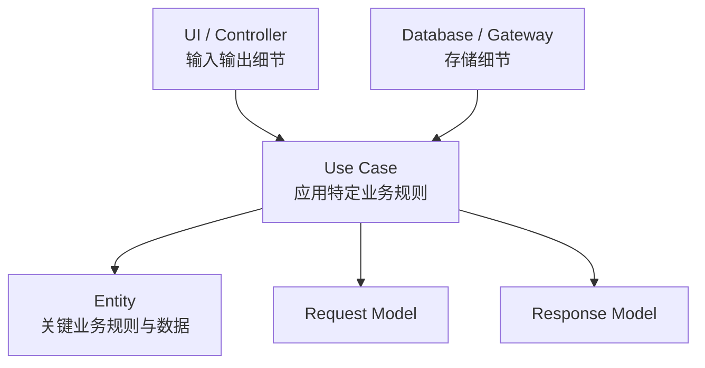
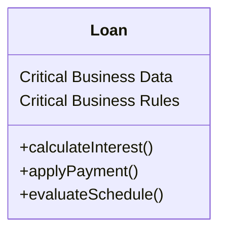
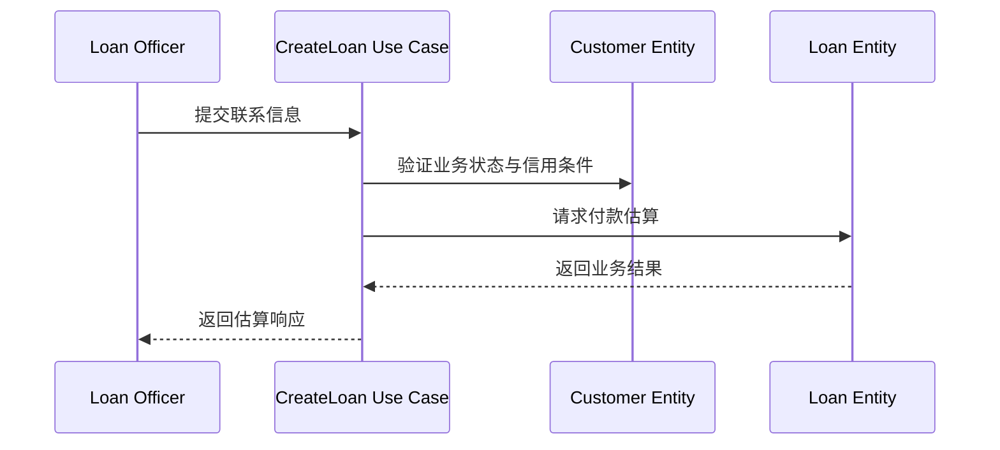
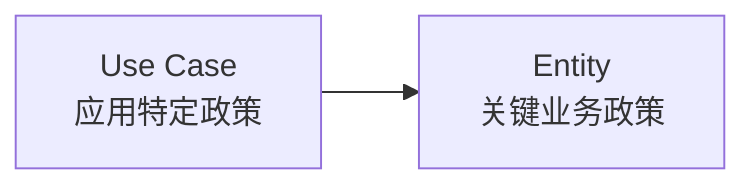
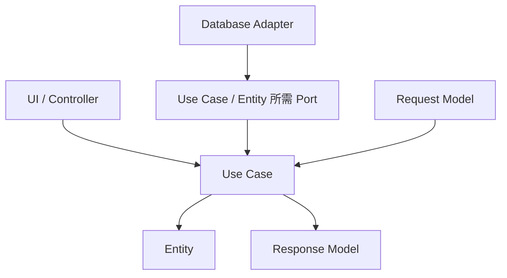

> 原书：Robert C. Martin, *Clean Architecture: A Craftsman's Guide to Software Structure and Design* 
> 本章：Chapter 20, Business Rules 
> 原文参考：Clean Architecture.md

## 本章导读
> **原书图示**：Chapter 20 章首页
前几章不断强调：

- 核心业务规则应位于系统中心；
- 数据库、GUI、框架与外部服务应作为插件；
- 低层细节依赖高层策略；
- 边界用于阻止技术变化污染核心。

第 20 章终于正面回答：

> **所谓 Business Rules，也就是业务规则，具体包括什么？核心中不同规则之间又怎样分层？**

作者区分了两类主要业务规则：

| 类型 | 含义 | 是否依赖自动化系统 |
| --- | --- | --- |
| Critical Business Rules | 对业务本身至关重要、创造或节省价值的规则 | 否，人工执行时仍成立 |
| Application-Specific Business Rules | 规定自动化应用怎样组织和调用核心规则 | 是，只对某个应用流程成立 |

与之对应，系统中心又形成两个层级：

- **Entity**：封装关键业务数据与关键业务规则；
- **Use Case**：编排 Entity，描述某个自动化应用怎样被使用。

源码依赖方向由外向内：

- UI 依赖 Use Case；
- Use Case 依赖 Entity；
- Entity 不知道 Use Case；
- Request / Response Model 不依赖 Web、数据库或框架。

本章最容易被误解的地方有三个：

1. Entity 不是数据库表映射类；
2. Use Case 不是 UI 页面流程，也不描述界面长什么样；
3. Request / Response Model 不应因为字段相似就直接复用 Entity、ORM Entity 或 HTTP 对象。

这些分离会增加少量模型与转换代码，却换来不同层次按各自原因独立变化的能力。

## 1. Business Rules：业务规则到底是什么

### 1.1 为什么需要先定义业务规则

第 17 章把系统分成核心业务规则与外围插件。

如果“业务规则”只是一个模糊标签，就无法判断：

- 哪些代码应放在中心；
- 哪些代码属于应用流程；
- 哪些只是 UI 和数据库细节；
- 接口应该由谁拥有；
- 依赖箭头应该指向哪里。

第 20 章因此先从业务是否依赖计算机这个反事实开始划分。

### 1.2 原书的严格定义

原书把业务规则定义为：

> **能够为业务赚钱或省钱的规则与过程。**

更严格地说，即使没有计算机自动化，这些规则仍然会：

- 创造收入；
- 降低成本；
- 控制风险；
- 保护业务价值。

### 1.3 人工执行测试

识别核心业务规则时，可以问：

> **如果明天所有计算机都消失，由员工拿纸笔、算盘或表格手工工作，这条规则是否仍然存在？**

若答案是“存在”，它很可能属于关键业务规则。

若规则只描述：

- 页面先显示哪一步；
- 请求怎样反序列化；
- 按钮怎样启用；
- API 返回什么状态码；

它更可能属于应用或外围机制。

### 1.4 银行利息例子

银行对贷款收取一定比例的利息，是关键业务规则。

它不取决于：

- 由计算机计算；
- 由职员使用算盘计算；
- 数据存放在数据库；
- 结果通过网页显示。

只要贷款业务存在，利息规则就存在。

### 1.5 “赚钱或省钱”不应机械理解

作者以商业组织为背景，因此使用金钱标准。

对于非营利、政府、科研或安全系统，可以把它扩展为：

- 实现组织使命；
- 遵守法律；
- 保护生命与安全；
- 保证公平；
- 维护核心服务价值。

关键判断仍是：规则是否独立于具体自动化机制而存在。

### 1.6 业务规则有不同纯度

不是所有规则都同样远离 IO。

可以大致区分：

- 核心领域政策；
- 某个应用的业务流程；
- 输入输出格式和技术机制。

第 19 章的 Level 概念在这里继续发挥作用：Entity 比 Use Case 更高层，Use Case 又比 UI、数据库和框架更高层。

## 2. Critical Business Rules：关键业务规则

### 2.1 定义

Critical Business Rules 是：

- 对业务本身至关重要；
- 创造、节省或保护核心价值；
- 即使没有自动化系统仍会执行；
- 不依赖某个 UI、数据库或技术平台。

### 2.2 典型例子

可能包括：

- 贷款利息计算；
- 保险保费政策；
- 库存可承诺规则；
- 税费计算；
- 信用额度政策；
- 退款资格；
- 货运计价；
- 会员权益；
- 医疗剂量限制。

### 2.3 为什么称为 Critical

这些规则直接体现组织为何开展某项业务。

若规则错误：

- 可能直接损失收入；
- 可能承担不当风险；
- 可能违反法规；
- 可能损害客户权益；
- 可能让业务无法持续。

因此，它们是系统最值得保护的政策。

### 2.4 关键业务规则不应知道什么

通常不应知道：

- HTTP；
- HTML；
- SQL；
- ORM；
- 消息队列；
- UI 控件；
- 云厂商 SDK；
- 依赖注入容器。

这些机制变化，不应迫使核心规则重写。

### 2.5 规则可以依赖领域概念

“纯业务”不表示规则只能处理基础数字和字符串。

它可以依赖：

- Money；
- InterestRate；
- PaymentSchedule；
- CreditScore；
- LoanBalance；
- Customer Status。

这些都是领域语言的一部分。

### 2.6 规则可以有错误和结果

关键业务规则可以表达：

- 不满足资格；
- 违反不变量；
- 超出额度；
- 状态转换非法；
- 计算结果。

错误应使用业务语义，而不是数据库异常或 HTTP 状态码。

## 3. Critical Business Data：关键业务数据

### 3.1 定义

关键业务规则通常需要数据才能工作。

贷款利息规则可能需要：

- 贷款余额；
- 利率；
- 还款计划。

这些数据即使在人工业务中也会存在，因此称为 Critical Business Data。

### 3.2 反事实判断

可以问：

> **没有数据库和应用时，业务人员是否仍需要记录这个信息？**

若需要，它可能是关键业务数据。

例如，纸质贷款档案同样会记录余额、利率与还款计划。

### 3.3 关键业务数据不等于数据库记录

数据库记录可能包含：

- 自增主键；
- 乐观锁版本；
- 创建时间戳；
- 分区键；
- ORM 导航字段；
- 软删除标志；
- 技术审计列。

这些字段不一定属于关键业务数据。

反过来，领域数据也可能以多张表、事件或文档存储，不能简单与一行记录对应。

### 3.4 数据的存储形式是细节

同一贷款业务数据可以存在于：

- 纸质档案；
- 内存对象；
- SQL 表；
- 文档数据库；
- 事件日志；
- 外部服务。

关键业务概念不应被某种存储形式定义。

### 3.5 规则与数据紧密绑定

关键业务规则总是围绕关键业务数据建立约束和行为。

例如：

- 余额决定利息基础；
- 利率决定费用政策；
- 还款计划约束付款；
- 状态决定允许的操作。

作者认为，这种不可分割关系很适合封装成 Entity。

### 3.6 数据不应是无行为袋子

如果关键数据只是一个结构，所有规则散落在 Controller、Service 和数据库触发器中：

- 不变量难以统一保护；
- 重复计算容易出现；
- 规则难以独立测试；
- 技术层会控制业务行为。

Entity 的价值是把真正属于该概念的规则与数据重新聚合。

## 4. Entities：封装关键业务规则与数据

### 4.1 原书定义

Entity 是系统中的一个对象，它：

- 封装一小组关键业务规则；
- 让这些规则操作关键业务数据；
- 自己包含数据，或能非常容易地访问数据；
- 通过接口暴露实现关键规则的函数。

### 4.2 Figure 20.1：Loan Entity
> **原书图示**：Figure 20.1：Loan Entity
原书以 `Loan` 为例。

它聚合：

- 贷款余额；
- 利率；
- 还款计划；
- 与这些数据直接相关的利息、付款和逾期等业务行为。

图中的方法名称用于帮助理解概念，具体名称以原书 UML 为准。

### 4.3 Entity 代表一个业务概念

创建 Loan Entity 时，我们是在软件中集中表达“贷款”这个业务概念。

它不是：

- 贷款页面；
- 贷款表；
- 贷款 API；
- 贷款 ORM Model；
- 贷款消息格式。

这些外围形式可以变化，Loan 的核心政策仍然成立。

### 4.4 Entity 应保持纯净

原书形容 Entity 不应被以下关注点玷污：

- 数据库；
- UI；
- 第三方框架；
- 计算机部署方式。

这使 Entity 能在不同系统和不同交付方式中复用。

### 4.5 Entity 可以依赖什么

Entity 可以依赖：

- 领域值对象；
- 同层领域政策；
- 必要的纯计算；
- 业务错误类型。

它不必完全没有依赖，而应避免依赖更低层的技术机制。

### 4.6 Entity 不应主动持久化自己

若 Entity 内部直接：

- 打开数据库连接；
- 执行 SQL；
- 调用 ORM Session；
- 发送 HTTP；

它就被存储与通信细节污染。

持久化通常由 Use Case 通过 Gateway 或 Repository Port 协调。

### 4.7 Entity 不等于 ORM Entity

许多框架把数据库映射对象称为 Entity。

Clean Architecture 中的 Entity 更强调：

- 关键业务规则；
- 关键业务数据；
- 对技术细节独立。

ORM Entity 可能恰好同时承担领域角色，也可能只是数据库记录模型。不能只因名称相同就视为同一概念。

### 4.8 Entity 不要求 OO 语言

作者专门说明，不必使用面向对象语言。

只要在一个独立模块中绑定：

- 关键业务数据；
- 操作这些数据的关键规则；

就可以形成 Entity。

它可以表现为：

- 类；
- 模块；
- 数据结构配套纯函数；
- 代数数据类型与函数；
- 其他语言原生封装。

### 4.9 Entity 与 DDD Entity 的关系

Domain-Driven Design 常把具有持续身份和生命周期的对象称为 Entity。

Clean Architecture 的 Entity 概念与其有重叠，但关注点略有不同：

- Clean Architecture 强调关键规则与数据的高层独立性；
- DDD 更严格地区分 Entity、Value Object、Aggregate 等领域模式。

不要强行把两个术语完全等同。

### 4.10 何时使用领域服务

某条关键规则可能跨越多个 Entity，难以自然归属单个对象。

可以使用领域服务，只要它：

- 仍然表达关键业务政策；
- 不依赖 UI 和数据库；
- 使用领域模型；
- 位于与 Entity 相同或相近层级。

“规则必须全部塞进一个类”不是本章要求。

### 4.11 Entity 应保护不变量

Entity 的重要职责之一是防止自身进入非法业务状态。

例如：

- 付款金额不能违反规则；
- 已关闭贷款不能继续计入不允许的操作；
- 还款计划必须满足业务约束。

不变量应集中表达，而不是由每个 Use Case 各自记住。

### 4.12 Entity 的测试特征

Entity 测试通常：

- 不启动数据库；
- 不启动 Web Server；
- 不构造 HttpRequest；
- 不依赖网络；
- 直接使用领域数据验证规则。

若测试关键计算必须加载整个应用，Entity 边界可能不够独立。

## 5. Use Cases：应用特定业务规则

### 5.1 为什么 Entity 还不够

Entity 表达业务本身的核心规则，却不描述某个自动化应用如何被使用。

应用还要决定：

- 谁先提供什么信息；
- 哪些步骤按什么顺序执行；
- 何时调用哪些 Entity；
- 哪些结果返回给使用者；
- 哪些应用前置条件必须满足。

这些属于 Use Case。

### 5.2 Use Case 的定义

原书把 Use Case 定义为：

> **对自动化系统使用方式的描述。**

它规定：

- 用户提供什么输入；
- 系统返回什么输出；
- 为产生输出要执行哪些处理步骤。

### 5.3 Use Case 是应用特定规则

Use Case 只在某个自动化应用中有意义。

例如，业务人员人工计算贷款时，不需要“先完成联系人页面，再进入估算页面”的软件流程。

因此，Use Case 比 Entity 更接近系统输入输出，层级也更低。

### 5.4 Use Case 不等于用户故事

用户故事常以简短自然语言表达需求，例如：

- 作为贷款专员，我希望估算还款额。

Use Case 则要更明确地定义：

- 输入；
- 前置条件；
- 处理步骤；
- Entity 交互；
- 输出；
- 失败路径。

它是可执行应用规则，不只是需求标题。

### 5.5 Use Case 可以是对象

原书说 Use Case 是对象，具有：

- 一个或多个实现应用规则的函数；
- 输入数据；
- 输出数据；
- 对相关 Entity 的引用。

但同样不要求 OO 语法。函数、模块或命令处理器也可以表达 Use Case。

### 5.6 Use Case 的主要职责

Use Case 通常负责：

- 接收独立 Request Model；
- 加载或创建 Entity；
- 检查应用级前置条件；
- 调用 Entity 规则；
- 协调 Gateway；
- 组织 Response Model；
- 管理用例成功与失败路径。

### 5.7 Use Case 不应承担什么

通常不应直接：

- 解析 HTTP；
- 拼接 HTML；
- 执行 SQL；
- 操作 UI 控件；
- 依赖 ORM Entity；
- 返回框架 Response；
- 知道具体服务器或数据库。

这些属于边界外的 Adapter。

## 6. 新贷款申请案例

### 6.1 原书场景
> **原书图示**：Figure 20.2：新贷款 Use Case
银行使用一个自动化应用，让贷款专员创建新贷款。

银行规定：在提供还款估算之前，系统必须：

1. 收集联系人信息；
2. 验证联系人信息；
3. 取得信用分；
4. 确认信用分达到至少 500；
5. 满足条件后才进入付款估算。

### 6.2 为什么这是 Use Case

这段规则描述的是：

- 自动化系统怎样推进；
- 输入按什么顺序取得；
- 哪些验证先执行；
- 什么时候允许展示估算。

它不是单纯的利息计算公式，而是应用流程。

### 6.3 Figure 20.2 表达什么

Figure 20.2 的 Use Case 描述包括：

- 输入数据；
- 处理步骤；
- 成功条件；
- 输出；
- 对 `Customer` Entity 的引用。

最后提到 Customer，说明 Use Case 会调用更高层 Entity 中的关键业务规则。

### 6.4 Use Case 控制 Entity 的舞蹈

原书用一句形象的话：

> **Use Cases control the dance of the Entities。Use Case 控制 Entity 的舞蹈。**

也就是：

- 决定何时加载 Customer；
- 决定何时检查信用；
- 决定何时调用 Loan 计算；
- 决定怎样组织整个应用流程。

Entity 负责每个核心规则，Use Case 负责让它们按应用需要协作。

图示省略 UI、Gateway 和异常细节，只强调 Entity 编排。

### 6.5 信用分 500 属于哪一层

不能只凭数字判断。

可能存在两部分：

**关键业务政策：**

- 银行不向低于某信用门槛的客户提供某类贷款。

这条规则即使人工办理也成立，可能属于 Entity 或领域政策。

**应用特定流程：**

- 系统在联系人信息验证后检查信用分；
- 未达到门槛时不进入付款估算页面。

这部分描述自动化系统顺序，属于 Use Case。

同一需求文本中可能同时包含两个层级。

### 6.6 Use Case 不描述 UI

原书强调，从 Use Case 无法判断应用通过什么交付：

- Web；
- Thick Client；
- Console；
- 纯服务；
- 其他界面。

Use Case 只非正式说明输入什么数据、输出什么数据，不描述：

- 页面布局；
- 按钮位置；
- CSS；
- 路由；
- HTTP 状态码。

### 6.7 “估算页面”怎样理解

原书例子使用“进入付款估算屏幕”的业务语言，但核心 Use Case 不应依赖具体 Screen 类。

它可以表达：

- 条件满足后产生付款估算；
- 条件不满足时产生业务失败。

Presenter 再决定是否显示页面、返回 JSON 或输出文本。

### 6.8 Use Case 的失败也是应用语义

可能的失败包括：

- 联系信息缺失；
- 联系信息无法验证；
- 信用分不足；
- Customer 不存在；
- 贷款类型不适用。

Use Case 应返回业务可理解的失败，而不是直接泄漏数据库异常或网络错误。

## 7. Entity 与 Use Case 的层级关系

### 7.1 Entity 不知道 Use Case

Entity 不应：

- 导入 Use Case；
- 调用应用流程；
- 判断当前页面；
- 决定 HTTP Response；
- 读取 Controller 状态。

它只执行自己的关键业务规则。

### 7.2 Use Case 知道 Entity

Use Case 需要：

- 创建或取得 Entity；
- 调用 Entity 规则；
- 组合多个 Entity；
- 根据结果推进流程。

因此源码依赖由 Use Case 指向 Entity。

这再次体现 Dependency Inversion Principle（DIP）：较低层、靠近应用输入输出的 Use Case 依赖更高层的 Entity，而 Entity 不反向依赖具体应用流程。

### 7.3 为什么 Entity 更高层

根据第 19 章的 Level 定义：

- Use Case 属于某个具体应用；
- 它更接近用户输入和应用输出；
- Entity 是可用于多个应用的业务概念；
- Entity 更远离具体输入输出。

所以 Entity 比 Use Case 更高层。

### 7.4 “协调全局”不等于层级更高

Use Case 可能协调许多对象，看起来更“宏观”。

但层级不是协调范围，而是离 IO 的距离。

Use Case 因为特定于应用流程，仍低于可跨应用复用的 Entity。

### 7.5 不同应用可以复用同一 Entity

同一个 Loan Entity 可能服务：

- 贷款专员桌面应用；
- 客户自助 Web；
- 批量审批系统；
- 风险模拟工具；
- 后台审计程序。

每个应用有不同 Use Case，却共享关键贷款政策。

### 7.6 Entity 变化会影响 Use Case

若关键业务政策真的改变：

- Use Case 可能需要适配；
- 测试需要更新；
- 输出解释可能变化。

这是合理依赖方向：低层应用流程依赖高层业务政策。

### 7.7 Use Case 变化不应影响 Entity

页面顺序、输入渠道、应用授权流程变化，通常不应修改 Loan 利息规则。

边界要阻止这种低层应用变化进入 Entity。

## 8. Request and Response Models

### 8.1 Use Case 必须收输入、产输出

Use Case 需要数据才能执行，也需要把结果交给调用者。

但它不应知道数据通过：

- HTML 表单；
- HTTP JSON；
- Console；
- 消息队列；
- 桌面 GUI；

传入或传出。

### 8.2 使用简单独立数据结构

原书要求 Use Case：

- 接受简单 Request Data Structure；
- 返回简单 Response Data Structure。

这些模型应尽量无依赖，只表达用例所需数据。

### 8.3 Request Model 表达什么

Request Model 可以包含：

- 用例所需输入字段；
- 业务标识；
- 应用级选项；
- 调用者身份的中立表示；
- 必要上下文。

它不应携带整个 Web Request 或数据库 Session。

### 8.4 Response Model 表达什么

Response Model 可以包含：

- 用例结果；
- 对调用者有意义的业务状态；
- 需要展示的数据；
- 可解释的失败原因；
- 后续操作所需标识。

它不应直接返回 HTML、数据库 Row 或框架 Response。

### 8.5 为什么不能继承 `HttpRequest`

如果 Request Model 继承 `HttpRequest`：

- Use Case 间接依赖 Web 框架；
- 测试必须构造框架对象；
- CLI 与消息入口难以复用；
- 框架升级会影响应用规则。

入口 Adapter 应先把 HttpRequest 转换成独立 Request Model。

### 8.6 为什么不能返回 `HttpResponse`

若 Use Case 直接返回 HttpResponse：

- 应用规则知道 HTTP；
- 状态码与 Header 进入核心流程；
- 非 Web 入口无法自然复用；
- Presenter 职责被混入 Use Case。

Use Case 返回中立结果，再由 Presenter 选择 HTTP 表达。

### 8.7 为什么不能依赖 SQL 模型

Use Case 也不应接受或返回：

- ORM Entity；
- ResultSet；
- Database Row；
- SQL 查询对象。

否则数据库细节通过数据模型越过边界。

### 8.8 无依赖为何至关重要

若 Request / Response Model 携带框架依赖，Use Case 会间接继承这些依赖。

表面上 Use Case 没有 `import` 框架，参数类型却让它仍然被框架控制。

边界模型必须真正独立，不能只是换一个文件名。

## 9. 为什么 Request / Response Model 不应引用 Entity

### 9.1 最自然的诱惑

Entity 与 Response 可能共享许多字段。

例如，Loan Entity 与贷款估算响应都可能包含：

- 金额；
- 利率；
- 计划；
- 状态。

于是直接返回 Loan 看起来最省代码。

原书明确要求避免这种做法。

### 9.2 两类对象目的不同

**Entity：**

- 保护关键业务规则与不变量；
- 在多个应用中复用；
- 按领域政策变化。

**Response Model：**

- 服务某个具体用例输出；
- 只包含调用者需要的信息；
- 按应用交互变化。

目的不同，变化原因也不同。

### 9.3 违反 SRP 与 CCP

把 Entity 直接用于 Request / Response，会让：

- UI 需求推动 Entity 字段；
- Entity 变化推动所有输出；
- 多个用例共享一个过宽模型；
- 条件分支不断增加。

这同时违反：

- Single Responsibility Principle；
- Common Closure Principle。

### 9.4 安全与隐私风险

Entity 可能包含调用者不应看到的数据：

- 内部风险标记；
- 隐私字段；
- 审计状态；
- 成本信息；
- 领域内部关系。

独立 Response Model 可以明确控制披露范围。

### 9.5 生命周期与序列化风险

直接输出 Entity 还可能带来：

- 懒加载；
- 循环引用；
- ORM Session 依赖；
- 意外深层对象图；
- 不稳定序列化格式。

边界转换能阻止这些内部结构外泄。

### 9.6 什么是 Tramp Data

原书警告，错误共享模型会产生大量 tramp data。

Tramp Data 指：

- 某层自己不需要的数据；
- 只是为了传给下一层而携带；
- 在许多函数和对象之间一路转送。

过宽 Entity 或通用 DTO 会让每层携带大量无关字段。

### 9.7 条件分支怎样增长

当一个共享模型服务多个用例时，代码开始出现：

- 如果是 Web 用例就填这些字段；
- 如果是批处理就跳过那些字段；
- 如果是管理员就暴露更多字段；
- 如果是创建流程就允许空值。

这些条件说明模型承担了多个变化原因。

### 9.8 模型转换不是无意义重复

从 Entity 复制少量字段到 Response Model 看起来重复，但两者表达不同知识：

- Entity 说明业务内部是什么；
- Response 说明本用例允许输出什么。

字段当前相同，未来可能独立变化。

### 9.9 DRY 针对知识，不针对相似形状

真正应消除的是同一业务规则的重复。

不同边界模型字段相似，通常是偶然重复。为了保护层次而保留独立模型，是合理选择。

### 9.10 Request Model 也不等于表单模型

HTML 表单可能包含：

- CSRF Token；
- 文本格式；
- 勾选框表示；
- 页面导航字段。

Use Case Request 只包含应用规则所需数据。

Controller 负责从表单模型转换到 Request Model。

## 10. Conclusion：业务规则是皇冠上的宝石

### 10.1 原书结论

原书把业务规则称为：

> **系统存在的理由、核心功能，以及皇冠上的宝石。**

它们包含真正创造或节省业务价值的代码。

### 10.2 业务规则应保持纯净

业务规则不应被以下低层关注点污染：

- UI；
- 数据库；
- Web；
- 第三方框架；
- 部署机制。

这些细节应插件到业务核心。

### 10.3 业务规则应最独立

理想情况下，业务规则代码应成为系统中：

- 最容易独立测试；
- 最少依赖外部技术；
- 最容易复用；
- 最稳定；
- 最清楚表达业务意图。

### 10.4 本章的层级结构

更准确的具体依赖关系会随 Port 所有权调整，但总方向是外围细节指向业务核心。

### 10.5 本章完整论证链

1. 先识别即使没有计算机仍成立的关键业务规则；
2. 找到这些规则需要的关键业务数据；
3. 把紧密相关的规则与数据封装为 Entity；
4. 让 Entity 独立于数据库、UI 和框架；
5. 再识别只对自动化应用有意义的流程；
6. 把输入、输出与处理步骤封装为 Use Case；
7. 让 Use Case 编排 Entity；
8. 保持 Entity 不知道 Use Case；
9. 用独立 Request / Response Model 隔离通信技术；
10. 不让边界模型直接复用 Entity 或框架对象；
11. 让所有外围机制插件到业务规则。

## 11. 如何在项目中识别 Entity 与 Use Case

### 11.1 第一步：进行“无计算机”测试

对每条规则询问：

- 人工办理时仍需要吗？
- 它直接创造、节省或保护组织价值吗？
- 它是否独立于页面和数据库？

若是，优先考虑关键业务规则。

### 11.2 第二步：找出关键业务数据

询问：

- 人工业务会记录哪些数据？
- 哪些数据参与核心不变量？
- 哪些字段只是技术元数据？
- 数据的领域名称是什么？

避免直接从数据库表反推 Entity。

### 11.3 第三步：形成业务概念模块

把紧密绑定的规则和数据放在一起：

- Entity；
- Value Object；
- 领域服务；
- 领域错误。

模块边界应围绕业务概念，而不是 ORM 注解。

### 11.4 第四步：列出应用流程

对每个用户目标写出：

- 输入；
- 前置条件；
- 处理步骤；
- 调用哪些 Entity；
- 输出；
- 失败路径。

这些流程形成 Use Case 候选。

### 11.5 第五步：去掉 UI 措辞

把：

- 点击按钮；
- 跳转页面；
- 返回 HTTP 201；

改写成应用语义：

- 提交申请；
- 产生估算；
- 返回创建结果。

UI Adapter 再决定具体呈现。

### 11.6 第六步：为每个 Use Case 定义独立模型

Request / Response 只包含该用例需要的数据。

检查：

- 是否依赖框架；
- 是否引用 Entity；
- 是否携带无关字段；
- 是否暴露敏感信息；
- 是否能由 CLI 和测试构造。

### 11.7 第七步：让 Gateway 位于正确边界

Use Case 需要数据时，由应用侧定义所需 Port。

数据库 Adapter 实现 Port，完成：

- ORM / Row 到 Entity 转换；
- 查询；
- 持久化；
- 技术异常映射。

Entity 不主动访问数据库。

### 11.8 第八步：分别测试三个层次

**Entity 测试：**

- 核心规则与不变量；
- 无外部 IO。

**Use Case 测试：**

- 流程与 Entity 编排；
- 使用 Fake Gateway。

**Adapter 测试：**

- HTTP、SQL、序列化和框架集成。

测试结构应映射架构层次。

## 12. 现代示例：订单系统

### 12.1 Critical Business Rules

可能包括：

- 商品定价；
- 折扣资格；
- 库存承诺；
- 取消条件；
- 退款金额。

这些规则即使由员工手工处理订单仍然成立。

### 12.2 Critical Business Data

可能包括：

- 商品与数量；
- 单价；
- 客户等级；
- 订单状态；
- 已付款金额。

数据库主键和 ORM 版本字段未必属于关键数据。

### 12.3 Entities

可能包括：

- Order；
- OrderLine；
- Money；
- Inventory Reservation；
- Refund Policy。

具体划分取决于领域模型，不必“一张表一个 Entity”。

### 12.4 PlaceOrder Use Case

负责：

1. 接收下单请求；
2. 取得商品与客户信息；
3. 创建或调用 Order Entity；
4. 执行定价和库存规则；
5. 保存结果；
6. 返回订单标识与金额。

### 12.5 PlaceOrder Request Model

只包含用例需要的：

- 客户标识；
- 商品与数量；
- 必要业务选项。

不包含：

- HttpRequest；
- ORM Session；
- 页面控件；
- 数据库行。

### 12.6 PlaceOrder Response Model

只返回调用者需要的：

- 订单标识；
- 总金额；
- 业务状态；
- 可解释失败。

不直接暴露完整 Order Entity。

### 12.7 不同入口复用同一 Use Case

同一 PlaceOrder 可由：

- Web Controller；
- 移动 API；
- 客服桌面程序；
- 批量导入；
- 自动测试；

调用。

每个入口只负责转换成相同 Request Model。

## 13. 验证应放在哪一层

### 13.1 语法与协议验证

入口 Adapter 负责：

- JSON 能否解析；
- 字段类型是否正确；
- HTTP Header 是否存在；
- 表单格式是否有效。

这些规则紧贴通信机制。

### 13.2 应用前置条件

Use Case 负责：

- 必要输入是否齐全；
- 当前调用者是否允许执行流程；
- 流程步骤是否满足；
- 所需对象是否可取得。

这些规则属于具体应用。

### 13.3 领域不变量

Entity 负责：

- 金额是否符合业务约束；
- 状态转换是否合法；
- 规则计算是否成立；
- 核心资格是否满足。

无论哪个 Use Case 调用，都必须保护这些不变量。

### 13.4 同一条件可能包含多层含义

例如“信用分必须达到 500”：

- 门槛本身可能是领域政策；
- 检查顺序属于 Use Case；
- 字段是否为整数属于输入 Adapter；
- 页面怎样显示失败属于 Presenter。

不要把一个需求句子整体塞进一个层。

### 13.5 分层验证避免重复与遗漏

若领域不变量只在 Controller 检查：

- 另一个入口可能绕过；
- 批处理可能产生非法 Entity；
- 规则被多处复制。

正确层次让规则在所有调用路径中一致生效。

## 14. 易混淆概念与常见误解

### 14.1 “Entity 就是数据库表对应类”

错误。Clean Architecture Entity 由关键规则和数据定义，与表结构不必一一对应。

### 14.2 “有 ID 的对象才是 Entity”

不是本章判据。关键在是否封装关键业务政策与数据，而不是技术 ID。

### 14.3 “所有业务规则都应放进 Entity”

错误。应用特定流程属于 Use Case，跨 Entity 的纯领域政策也可能进入领域服务。

### 14.4 “Use Case 就是用户故事文本”

错误。Use Case 是实现应用规则的可执行模块，明确输入、输出和步骤。

### 14.5 “Use Case 应描述页面跳转”

错误。它描述应用语义，Presenter 或 Controller 决定具体页面与导航。

### 14.6 “Use Case 应返回 HTTP 状态码”

错误。它返回中立业务结果，由 Web Adapter 映射成状态码。

### 14.7 “Entity 应调用 Repository 保存自己”

通常会让核心依赖持久化。Use Case 应通过应用侧 Port 协调保存。

### 14.8 “Request Model 继承 HttpRequest 没关系”

错误。参数类型会把整个 Use Case 间接绑定到 Web 框架。

### 14.9 “直接返回 Entity 可以减少重复”

短期少写映射，长期会绑定领域内部与外部输出，并带来安全和版本风险。

### 14.10 “DTO 与 Entity 字段相似违反 DRY”

不一定。它们表达不同层次的知识，通常会因不同原因变化。

### 14.11 “所有验证都应该放 Entity”

错误。协议格式、应用流程和领域不变量属于不同层。

### 14.12 “Entity 绝不能依赖任何接口”

过于绝对。它可以依赖同层领域抽象；关键是不能依赖低层技术细节。

### 14.13 “Use Case 协调更多对象，所以比 Entity 高层”

错误。Use Case 更靠近具体应用输入输出，因此层级低于可跨应用复用的 Entity。

### 14.14 “信用分门槛一定属于 Use Case”

不一定。门槛可能是关键业务政策，检查顺序与页面流程才属于 Use Case。

### 14.15 “纯业务代码不能产生任何状态变化”

错误。Entity 可以改变业务状态和保护不变量，只是不应执行无关技术 IO。

### 14.16 “Clean Architecture 要求每个规则一个文件”

错误。边界根据变化原因和层级建立，不按模板机械增加文件。

### 14.17 “业务规则只有直接赚钱的数学公式”

错误。资格、风险、合规、状态转换和流程约束都可能保护业务价值。

### 14.18 “Entity 必须在多个应用中实际复用才算高层”

不必。它的规则具有跨应用独立性即可，即使当前只有一个应用。

### 14.19 “没有数据库就无法设计 Entity”

错误。应先从业务概念和规则出发，再设计持久化映射。

### 14.20 “模型转换全是样板代码，应自动删除”

转换代码显式保护边界。可适度自动化，但不能让自动工具重新耦合模型。

## 15. 实践检查与掌握练习

### 15.1 Critical Business Rules 检查

- 没有计算机时规则仍会存在吗？
- 它创造、节省或保护什么价值？
- 由哪个业务角色要求变化？
- 是否被 UI 或数据库机制污染？
- 规则错误会造成什么业务损失？

### 15.2 Critical Business Data 检查

- 人工业务是否仍需记录这些数据？
- 哪些字段只是数据库元数据？
- 数据名称是否使用领域语言？
- 哪些不变量围绕数据成立？
- 数据存储形式是否泄漏进领域？

### 15.3 Entity 检查

- Entity 是否同时封装关键数据与规则？
- 是否保护自身不变量？
- 是否导入 ORM、HTTP 或 UI？
- 是否主动持久化自己？
- 是否能在无外部设施时测试？
- 跨 Entity 规则是否更适合领域服务？

### 15.4 Use Case 检查

- 是否有明确输入、输出和步骤？
- 是否编排 Entity 而不是复制 Entity 规则？
- 是否描述应用语义而非 UI 细节？
- 是否直接执行 SQL 或操作控件？
- 失败是否使用业务语言？
- 不同 Use Case 是否保持独立？

### 15.5 Request / Response Model 检查

- 模型是否依赖 HttpRequest、HttpResponse 或 ORM？
- 是否直接引用 Entity？
- 是否包含调用者不需要的数据？
- 是否携带敏感内部字段？
- 是否能由 CLI 和测试直接构造？
- 是否因多个用例共享而出现大量条件？

### 15.6 场景判断一：利息规则写在 Controller

Web Controller 直接根据余额与利率计算利息。

**判断：** 关键业务规则被 UI 污染，应移动到 Loan Entity 或同层领域政策。

### 15.7 场景判断二：Loan 继承 ORM 基类

Loan 的核心行为依赖 ORM 生命周期和数据库注解。

**判断：** Entity 与存储细节耦合。应评估分离领域 Entity 与持久化模型。

### 15.8 场景判断三：Use Case 决定先验证联系人

自动化贷款流程要求先验证联系信息，再计算估算。

**判断：** 步骤顺序属于应用特定 Use Case；其中信用门槛本身可能属于领域政策。

### 15.9 场景判断四：Response 返回 Customer Entity

API 为方便直接序列化 Customer。

**判断：** 领域内部、隐私和输出契约被绑定。应构造该用例专用 Response Model。

### 15.10 场景判断五：CLI 与 Web 共用 Request Model

两个入口分别转换输入，调用同一个独立 Use Case Request。

**判断：** 边界合理，Use Case 与通信形式无关。

### 15.11 场景判断六：Entity 没有 ID

一个纯计算政策模块没有持久身份，却封装关键业务数据与规则。

**判断：** 仍可能符合本章 Entity 概念，不应被 DDD 或 ORM 命名限制。

### 15.12 场景判断七：应用规则放在 Entity

Loan Entity 判断“联系人页面是否完成”，再决定能否计算利息。

**判断：** 自动化应用流程污染 Entity，应由 Use Case 管理顺序。

### 15.13 场景判断八：数据库字段与 Response 相同

团队想复用 ORM Record，避免写十行映射。

**判断：** 短期字段相似是偶然重复，独立模型更能保护变化、安全和序列化边界。

### 15.14 快速复述练习

能够回答以下问题，基本就掌握了本章：

1. 原书怎样定义业务规则？
2. “没有计算机”测试用于判断什么？
3. 银行利息为什么是 Critical Business Rule？
4. 非商业组织怎样理解“赚钱或省钱”？
5. 什么是 Critical Business Data？
6. 为什么关键数据不等于数据库记录？
7. Entity 的原书定义是什么？
8. Loan Entity 封装了哪些类型的数据与规则？
9. Entity 为什么应独立于数据库、UI 和框架？
10. Entity 是否必须由 OO Class 实现？
11. Clean Architecture Entity 与 ORM / DDD Entity 有何区别？
12. 什么规则可能适合领域服务？
13. Use Case 为什么存在？
14. Use Case 要规定哪些内容？
15. 新贷款案例的处理顺序是什么？
16. “Use Case 控制 Entity 的舞蹈”是什么意思？
17. Use Case 为什么不描述 UI？
18. 信用分 500 的需求可能包含哪两个层次？
19. Entity 与 Use Case 谁依赖谁？
20. 为什么 Entity 层级更高？
21. Request / Response Model 应具有什么特征？
22. 为什么不能继承 HttpRequest / HttpResponse？
23. 为什么不能直接传递 ORM 模型？
24. 为什么 Request / Response 不应引用 Entity？
25. 什么是 Tramp Data？
26. 模型转换为何不一定违反 DRY？
27. 输入验证、应用前置条件和领域不变量分别属于哪里？
28. 为什么业务规则被称为皇冠上的宝石？

### 15.15 一分钟记忆卡

- **关键规则：** 没有计算机也会创造或保护业务价值。
- **关键数据：** 人工业务中同样存在的数据。
- **Entity：** 把关键规则与关键数据绑定在纯业务模块中。
- **Use Case：** 描述自动化应用的输入、输出和处理步骤。
- **编排：** Use Case 控制 Entity 的舞蹈。
- **层级：** Entity 高于 Use Case，因为它更远离具体应用 IO。
- **模型：** Use Case 使用无框架依赖的 Request / Response Model。
- **隔离：** 不直接复用 Entity、HttpRequest、HttpResponse 或 ORM Record。
- **验证：** 协议在 Adapter，流程在 Use Case，不变量在 Entity。
- **目标：** 让业务规则成为系统最独立、最可复用的皇冠宝石。

## 16. 本章总结

1. 第 20 章区分不同层次的业务规则，并说明 Entity 与 Use Case 的职责。
2. 原书严格地把业务规则定义为能够为业务赚钱或省钱的规则和过程。
3. 即使没有计算机、由职员手工执行仍然成立的规则，是关键业务规则候选。
4. 银行贷款利息规则不依赖计算机，因此属于 Critical Business Rule。
5. 对非商业组织，可把标准扩展为实现使命、保护安全或遵守法规的核心政策。
6. 关键业务规则不应依赖 HTTP、SQL、ORM、UI 或第三方框架。
7. 关键规则通常需要 Critical Business Data 才能执行。
8. 贷款余额、利率和还款计划是原书列举的关键业务数据。
9. 关键业务数据即使在人工业务中也会存在。
10. 关键业务数据不等于数据库记录，技术主键、锁版本等字段未必属于领域。
11. 数据存入 SQL、文档、事件或纸张是实现细节。
12. 关键业务规则与关键业务数据紧密绑定，适合形成 Entity。
13. Entity 封装一小组关键业务规则，并让这些规则操作关键业务数据。
14. Entity 可以包含数据，也可以非常容易地取得该数据。
15. Entity 接口由实现关键业务规则的函数组成。
16. Loan Entity 代表贷款概念，而不是贷款页面、数据库表或 API。
17. Entity 应独立于数据库、UI、第三方框架和部署方式。
18. Entity 可以依赖领域值对象和同层政策，但不应依赖低层技术机制。
19. Entity 通常不应自行执行 SQL 或调用 ORM 保存自己。
20. Clean Architecture Entity 不等于 ORM Entity，也不必与 DDD Entity 完全相同。
21. Entity 不要求面向对象语言，只需在独立模块中绑定关键数据与规则。
22. 跨多个 Entity 的纯业务规则可以进入领域服务。
23. Entity 应集中保护业务不变量，并能在没有外部设施时测试。
24. 并非所有业务规则都像 Entity 一样独立于自动化应用。
25. Use Case 描述自动化系统怎样被使用。
26. Use Case 规定用户输入、系统输出以及产生输出的处理步骤。
27. Use Case 实现应用特定业务规则，而 Entity 实现关键业务规则。
28. 新贷款 Use Case 要先收集和验证联系人信息，再确认信用分至少为 500，最后才产生付款估算。
29. Use Case 控制何时、按什么顺序调用 Customer、Loan 等 Entity。
30. “Use Case 控制 Entity 的舞蹈”表示它负责应用流程编排，而 Entity 负责各自核心规则。
31. Use Case 不描述 Web、厚客户端、Console 或纯服务等具体交付方式。
32. 页面、按钮和 HTTP 状态码属于 UI / Adapter，而非 Use Case 核心。
33. 信用门槛本身可能是关键业务政策，检查顺序和页面推进则是 Use Case 政策。
34. Entity 不知道 Use Case，Use Case 依赖并编排 Entity。
35. Entity 比 Use Case 层级更高，因为它更通用、更远离某个应用的输入输出。
36. Use Case 协调更多对象并不意味着它比 Entity 更高层。
37. 同一 Entity 可以服务桌面、Web、批处理和其他不同应用 Use Case。
38. Use Case 应接受简单独立的 Request Model，并返回简单独立的 Response Model。
39. Request / Response Model 不应继承 HttpRequest、HttpResponse 或其他框架接口。
40. Use Case 内部不应知道 HTML 或 SQL。
41. 边界模型若依赖框架，Use Case 会通过参数和返回类型间接依赖框架。
42. Request / Response Model 不应直接引用 Entity，即使双方字段非常相似。
43. Entity 与边界模型目的不同，会因不同原因、以不同速度变化。
44. 直接输出 Entity 还会带来隐私、懒加载、循环引用和序列化风险。
45. Tramp Data 是某层不使用、只为传到下一层而携带的数据。
46. 过宽共享模型会产生大量 Tramp Data 和面向不同用例的条件分支。
47. Entity 到 Response 的映射不一定违反 DRY，因为两个模型表达不同层次的知识。
48. 协议与格式验证属于入口 Adapter，应用前置条件属于 Use Case，领域不变量属于 Entity。
49. 业务规则是系统存在的理由、核心功能和皇冠上的宝石。
50. 本章最终要求是：让业务规则保持纯净、独立和可复用，让 UI、数据库和框架作为外围插件依赖它们。
