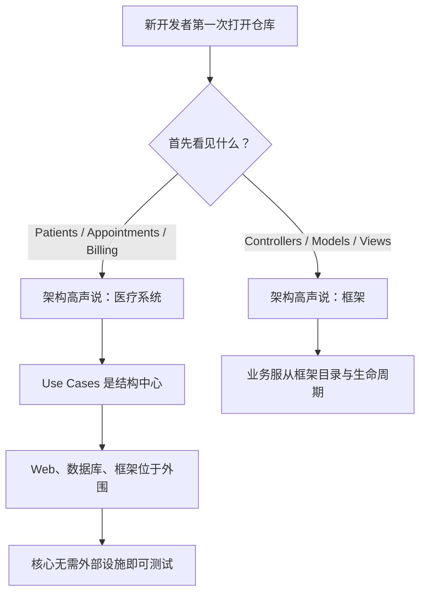
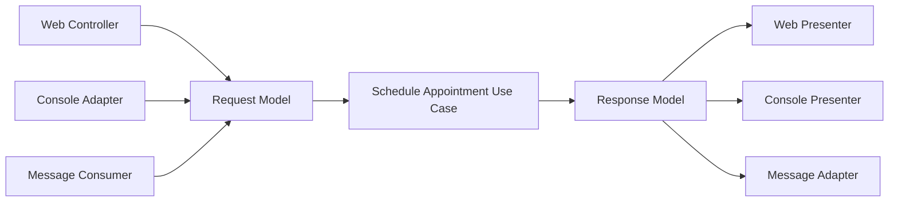
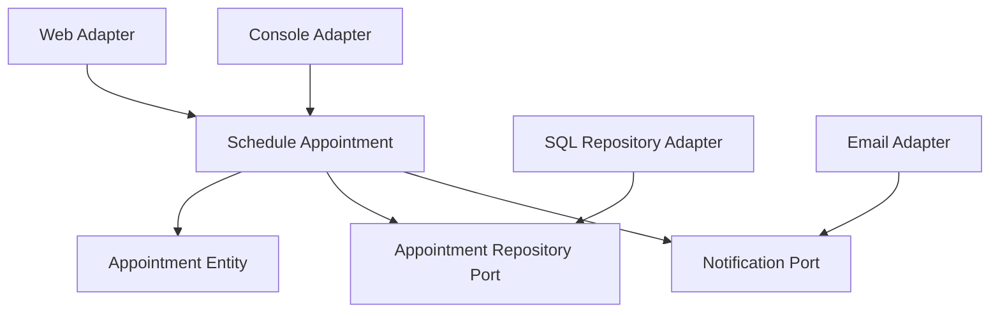

> 原书：Robert C. Martin, *Clean Architecture: A Craftsman's Guide to Software Structure and Design* 
> 本章：Chapter 21, Screaming Architecture 
> 原文参考：Clean Architecture.md

## 本章导读

第 20 章已经把系统核心区分为：

- Entity：关键业务规则与关键业务数据；
- Use Case：应用特定业务流程；
- Request / Response Model：与 UI、数据库和框架无关的边界模型。

第 21 章把视角拉回整个代码仓库，提出一个极具画面感的问题：

> **当新开发者第一次打开项目时，架构在高声喊什么？**

它是在喊：

- 医疗系统；
- 会计系统；
- 库存管理系统；

还是只在喊：

- Rails；
- Spring / Hibernate；
- ASP；
- Controller / Model / View？

作者用建筑蓝图解释“尖叫”：

- 住宅的入口、客厅、餐厅和厨房让人一眼认出住宅；
- 图书馆的借还区、阅览区和书架空间让人一眼认出图书馆；
- 软件的顶层结构也应让人一眼认出系统用途。

本章很短，却给出了三个强有力、可实际检查的判据：

1. **可见性**：顶层结构是否清楚展示领域与 Use Cases；
2. **依赖方向**：业务核心是否真的不依赖框架与交付机制；
3. **可测试性**：Entity 与 Use Case 是否无需 Web Server、数据库和框架即可运行测试。

“尖叫架构”不是把目录改成业务名这么简单。名称、源码依赖和运行测试必须共同证明：系统以业务用途为中心，技术只是可替换工具。

## 1. 建筑蓝图为什么会“尖叫”

### 1.1 独栋住宅的蓝图

作者先让读者想象一份独栋住宅蓝图。

我们通常会看到：

- 前门；
- 通向客厅的门厅；
- 餐厅；
- 靠近餐厅的厨房；
- 厨房旁的小餐区；
- 家庭活动室。

这些空间直接支持居住者的活动：

- 进入住宅；
- 会客；
- 烹饪；
- 用餐；
- 休息。

即使蓝图上没有写“住宅”，读者也不会把它误认为工厂或图书馆。

它高声喊出：

> **HOME。**

### 1.2 图书馆的蓝图

图书馆蓝图通常会出现：

- 宏大的入口；
- 借书与还书区域；
- 阅览区域；
- 小型会议室；
- 能容纳大量书架的成排空间。

这些空间围绕图书馆 Use Cases 组织：

- 查找书籍；
- 借还书；
- 阅读；
- 研究；
- 举行小组活动。

它高声喊出：

> **LIBRARY。**

### 1.3 建筑首先展示用途，而不是材料

住宅和图书馆都需要：

- 砖；
- 石材；
- 木材；
- 钢材；
- 玻璃；
- 管线。

但蓝图的首要主题不是“砖结构”或“玻璃结构”，而是建筑要支持的活动。

材料很重要，却服务于用途。

### 1.4 软件中的“材料”是什么

软件中的材料和工具包括：

- Web 框架；
- 数据库；
- ORM；
- Web Server；
- 消息系统；
- UI 工具包；
- 依赖注入容器；
- 云平台。

它们必须被正确选择和使用，但不应成为系统架构的第一主题。

### 1.5 软件架构应先说明用途

打开医疗系统仓库时，开发者应先看到：

- Patients；
- Appointments；
- Prescriptions；
- Billing；
- Discharge；
- Clinical Records。

它应高声说明自己是 Health Care System，而不是只暴露所用框架。

打开库存系统时，应先看到：

- Receive Stock；
- Reserve Inventory；
- Ship Goods；
- Reconcile Inventory；
- Reorder Stock。

同理，Accounting System 与 Inventory Management System 都应先显露各自业务主题。

这些名称让业务能力成为架构地标。

### 1.6 错误的第一印象

如果顶层只有：

- Controllers；
- Models；
- Views；
- Repositories；
- Services；
- Config；
- Utils；

读者能看出技术组织方式，却无法看出系统为什么存在。

同样的目录可能属于医疗、会计、博客或电商系统。

### 1.7 技术目录并非绝对禁止

技术目录可以存在于外围或具体业务切片内部。

问题是：

- 它们是否占据顶层视野；
- 用例是否被埋在通用 Service 中；
- 业务变化是否必须跨越多个无业务名称的目录；
- 框架是否决定所有类的形状。

尖叫架构强调信息优先级，而不是禁止某些文件夹名称。

### 1.8 第一眼只是起点

把目录从 `services` 政名为 `appointments`，不代表依赖已经正确。

真正的尖叫还要求：

- Appointments 核心不依赖 Web；
- Use Case 不接收 HttpRequest；
- Entity 不继承 ORM 基类；
- 业务测试无需启动框架。

第一眼可见性必须由真实架构支撑。

## 2. The Theme of an Architecture：架构的主题

### 2.1 Jacobson 的用例驱动观点

作者请读者回顾 Ivar Jacobson 的 *Object Oriented Software Engineering*。

这本书的副标题是：

> **A Use Case Driven Approach。**

Jacobson 的核心观点是：软件架构应是支持系统 Use Cases 的结构。

住宅和图书馆的架构围绕建筑用例组织，软件也应围绕应用用例组织。

### 2.2 Use Case 不应只存在于需求文档

需求文档可能列出：

- Register Patient；
- Schedule Appointment；
- Cancel Appointment；
- Record Diagnosis；
- Issue Prescription。

如果代码中只有一个巨大 `PatientService`，这些 Use Cases 并没有真正进入架构。

开发者仍需打开一个通用类，在许多方法和条件分支中寻找行为。

### 2.3 Use Case 应成为代码单元

用例可以表现为：

- 类；
- 函数；
- 模块；
- 包；
- 组件。

关键是每个用例：

- 有明确业务名称；
- 有可定位入口；
- 有独立 Request / Response；
- 有对应测试；
- 与其他用例的变化尽量隔离。

### 2.4 需求与代码应能互相追踪

产品人员说“取消预约”时，开发者应能快速找到：

- Cancel Appointment Use Case；
- 相关 Entity 规则；
- 对应入口 Adapter；
- 相关测试；
- 输出模型。

反过来，看到代码中的 Use Case，也应能理解它服务的业务目标。

### 2.5 技术分层与用例切片

一个系统可以同时有水平层和垂直用例。

| 层次 | Schedule Appointment | Cancel Appointment | Issue Prescription |
| --- | --- | --- | --- |
| UI Adapter | 预约入口 | 取消入口 | 处方入口 |
| Use Case | 安排流程 | 取消流程 | 开方流程 |
| Entity | 时间与资源规则 | 取消政策 | 用药政策 |
| Data Adapter | 保存预约 | 更新状态 | 保存处方 |

第一分解轴强调业务用途，内部仍可以保持层次边界。

### 2.6 Package by Feature 只是起点

按 Feature 分包可以改善可见性，但不自动得到 Clean Architecture。

一个 `appointments` 包内部仍可能：

- Use Case 直接执行 SQL；
- Entity 继承 ORM Model；
- Request 继承 HttpRequest；
- 核心调用具体邮件 SDK。

业务名称解决“看见什么”，依赖规则解决“谁知道谁”。

### 2.7 架构不应以框架为主题

原书明确说：

> **架构不是，也不应该是关于框架的。**

框架可以提供：

- 路由；
- 生命周期；
- 数据绑定；
- ORM；
- 依赖注入；
- 插件机制。

但框架不应替系统定义业务边界。

### 2.8 框架不能供应系统架构

框架通常给出一套默认结构，例如：

- Controller；
- Model；
- View；
- Migration；
- Configuration。

这套结构适合展示框架，也适合快速入门，却不一定适合表达产品 Use Cases。

产品架构应决定怎样使用框架，而不是让框架决定产品是什么。

### 2.9 两种关系的区别

**系统使用框架：**

- 框架位于外围；
- Adapter 调用 Use Case；
- 业务对象是普通对象；
- 框架升级主要影响 Adapter。

**框架容纳系统：**

- 业务类继承框架基类；
- Use Case 依赖容器生命周期；
- 领域模型带有 ORM 语义；
- 框架目录就是系统目录。

我们需要前一种关系。

### 2.10 框架主题与用例主题为何冲突

如果顶层按 Controller、Service、Repository 分组，一个 Use Case 会横跨多个顶层区域。

如果顶层按 Schedule Appointment、Cancel Appointment、Billing 分组，一个业务变化更容易局部化。

技术角色可以作为第二层组织，但不应夺走系统的主要主题。

## 3. The Purpose of an Architecture：架构的目的

### 3.1 房子先满足居住用例

住宅设计首先要保证：

- 能进入；
- 能休息；
- 能烹饪；
- 能用餐；
- 能生活。

外墙使用砖、石头还是雪松，可以在满足居住用途后再决定。

### 3.2 软件也应先支持 Use Cases

软件架构首先要保证：

- 用例清楚；
- 业务规则独立；
- 依赖方向正确；
- 变化影响被限制；
- 核心可以测试。

框架、数据库和服务器是实现这些用途的材料。

### 3.3 保留哪些选项

原书列出可以推迟的决定：

- Rails；
- Spring；
- Hibernate；
- Tomcat；
- MySQL；
- 其他 database 选择；
- 其他框架和环境工具。

“推迟”不是说最终不用，而是避免在业务尚未清楚时让它们控制核心结构。

### 3.4 为什么晚决定更有价值

等待一段时间后，团队会掌握更多事实：

- 真实用例；
- 数据量；
- 查询模式；
- 用户入口；
- 运维能力；
- 团队规模；
- 性能瓶颈；
- 许可证与成本。

技术选择因此更可能基于证据，而不是脚手架默认值。

### 3.5 架构还应允许改变主意

延迟决定只是第一步。

好的边界还应让团队在选择后仍能：

- 升级框架；
- 更换数据库；
- 增加交付入口；
- 替换 Web Server；
- 改变部署方式。

这不意味着零成本，而是核心业务规则不需要因技术替换而整体重写。

### 3.6 可替换不等于免费替换

从 MySQL 切换到其他数据库仍可能需要：

- 数据迁移；
- 查询重写；
- 性能验证；
- 运维培训；
- 部署调整。

架构主要限制源码影响范围，不能消除现实迁移成本。

### 3.7 推迟技术决定不等于忽略技术风险

团队仍应通过 Spike 或 Prototype 验证：

- 数据库性能；
- 框架兼容；
- 网络延迟；
- 安全要求；
- 平台限制。

关键是让技术实验留在外围，不要让试验代码成为核心业务结构。

### 3.8 有些决定不能无限推迟

必须较早明确的可能包括：

- 核心业务不变量；
- 安全与合规；
- 硬实时期限；
- 数据所有权；
- 一致性边界；
- 平台强制约束。

架构不是拖延一切，而是区分策略与可延迟细节。

### 3.9 用例中心架构的实际特征

一个真正以 Use Case 为中心的系统通常满足：

- 不知道框架时仍能描述核心结构；
- Use Case 接口不含框架类型；
- Entity 可用普通构造方式创建；
- 数据库与 Web 通过 Adapter 接入；
- 顶层可以定位主要业务行为；
- 替换外围技术时核心测试保持稳定。

## 4. But What About the Web?：Web 只是交付机制

### 4.1 Web 是否是一种架构

原书问：系统通过 Web 交付，是否就决定了系统架构？

答案是：

> **当然不是。**

Web 是一种 Delivery Mechanism，也就是交付机制。

它也是一种 IO Device，也就是输入输出设备。

### 4.2 Web 负责什么

Web 层通常负责：

- HTTP 路由；
- Request 解析；
- Header 与 Cookie；
- 身份凭证提取；
- JSON / HTML 序列化；
- 状态码；
- Web 安全机制。

这些工作很重要，但它们描述数据怎样进入和离开系统，不描述核心医疗、会计或库存政策。

### 4.3 Web 不应支配系统结构

若业务核心直接依赖：

- HttpRequest；
- HttpResponse；
- Controller 基类；
- Session；
- 路由注解；
- Web 容器；

系统就被 Web 交付方式锁定。

### 4.4 Controller 的边界职责

Controller 应主要完成：

1. 接收 HttpRequest；
2. 解析并验证协议格式；
3. 转换为 Use Case Request Model；
4. 调用 Use Case；
5. 把结果交给 Presenter。

它不应实现核心业务规则。

### 4.5 Presenter 的边界职责

Presenter 应主要完成：

1. 接收 Use Case Response Model；
2. 选择展示字段；
3. 格式化数据；
4. 映射业务失败；
5. 生成 HttpResponse 或 View Model。

Use Case 不应直接返回 HTML 或框架 Response。

### 4.6 同一 Use Case 可以有多个入口

核心 Use Case 不因交付方式变化。

### 4.7 系统甚至可以暂时没有 Web

团队可以先通过：

- 单元测试；
- 命令行；
- 简单脚本；
- 内存 Adapter；

验证核心用例。

Web 决定可以在业务结构稳定后加入。

### 4.8 把 Web 当细节不等于不重视 Web

Web 层仍需高质量处理：

- 安全；
- 性能；
- 可访问性；
- 缓存；
- 并发；
- 兼容性。

“低层”与“不重要”不是同义词。

### 4.9 区分业务约束与 Web 机制

例如预约系统可能要求：

- 同一时段不能重复预约，这是领域规则；
- 使用 ETag 做并发控制，是 HTTP 机制；
- 用户必须有取消权限，是业务与应用政策；
- 从 Cookie 取得 Token，是 Web Adapter 细节。

正确分层不是忽略约束，而是把规则放在正确位置。

### 4.10 Web 框架为何容易夺走架构

Web 框架往往同时提供：

- Controller；
- Model；
- View；
- ORM；
- 验证；
- Migration；
- DI；
- 目录脚手架。

团队很容易让所有业务都在框架生命周期中表达。

当需要 CLI、批处理或消息入口时，才发现业务只能通过 HTTP 触发。

## 5. Frameworks Are Tools, Not Ways of Life

### 5.1 框架可以强大且有用

原书没有反对框架。

框架能够：

- 减少基础设施代码；
- 提供成熟安全机制；
- 统一团队实践；
- 解决常见技术问题；
- 提高交付速度。

问题在于框架与系统的关系。

### 5.2 框架作者的视角

框架作者通常对自己的框架充满信心。

示例和教程会从“真正信徒”的视角展示：

- 怎样让框架管理一切；
- 怎样遵循框架生命周期；
- 怎样使用全部扩展点；
- 怎样把应用放进默认目录。

对于教学框架，这种写法很自然。

### 5.3 产品团队的目标不同

框架教程主要优化：

- 快速运行；
- 展示框架能力；
- 减少示例代码。

产品团队则要优化：

- 多年演进；
- 业务独立；
- 可测试性；
- 升级影响；
- 技术退出路径；
- 生命周期成本。

不能把教程架构原样当成产品架构。

### 5.4 用怀疑眼光评估框架

作者建议带着世故和怀疑的眼光审视框架。

应问：

- 它帮我们解决什么？
- 它要求核心承担什么？
- 业务类是否必须继承框架基类？
- 方法签名是否出现框架类型？
- 测试是否必须启动容器？
- 升级会影响哪些核心文件？
- 是否有退出路径？
- 能否把它限制在 Adapter 中？

### 5.5 把框架保持在一臂之外

“At arm's length”可以理解为：

- 框架代码位于系统外围；
- 核心不依赖框架；
- Adapter 把框架事件转换为用例请求；
- 组合根负责启动框架和连接实现；
- Entity 是普通业务对象。

### 5.6 框架对象应止步边界

以下类型通常不应进入 Use Case 与 Entity：

- HttpRequest / HttpResponse；
- ORM Session；
- 框架 Entity；
- GUI Widget；
- 消息客户端对象；
- 容器 Context。

边界 Adapter 负责转换成项目自有模型。

### 5.7 不让 Entity 继承框架基类

如果 Entity 必须：

- 继承 ORM ActiveRecord；
- 响应框架生命周期回调；
- 带有大量持久化注解；
- 依赖容器代理；

核心业务会被框架控制。

可以分离：

- 领域 Entity；
- ORM Record；
- 双向 Mapper。

### 5.8 集中组装具体框架

Main 或 Composition Root 可以知道：

- 具体 Web 框架；
- 数据库 Adapter；
- DI 容器；
- 路由；
- 配置。

业务模块不应自行查找这些具体实现。

### 5.9 框架防护不是为每个库加 Wrapper

稳定、局部、不会污染核心的小型库，可能无需额外抽象。

更值得隔离的是：

- 控制生命周期的框架；
- 易变第三方系统；
- 数据库与远程服务；
- 在核心签名中扩散的类型；
- 替换和测试价值高的依赖。

### 5.10 框架升级仍然可能困难

即使核心独立，升级仍可能涉及：

- Adapter 修改；
- 配置迁移；
- 数据迁移；
- 部署调整；
- 安全复核；
- 团队培训。

边界限制爆炸范围，不会让现实成本消失。

### 5.11 一个直观删除测试

可以想象临时删除框架目录。

如果仍能：

- 编译 Entity；
- 编译 Use Case；
- 运行核心测试；
- 阅读主要业务流程；

框架更像工具。

如果核心完全无法构造，框架可能已经成为生活方式。

## 6. Testable Architectures：可测试架构

### 6.1 无框架测试是架构证据

原书给出一个直接检验：

> **如果架构围绕 Use Cases，框架又保持在一臂之外，就应能在没有框架时单元测试所有 Use Cases。**

不应需要：

- 启动 Web Server；
- 连接数据库；
- 加载完整 DI 容器；
- 运行消息代理；
- 构造框架 Request。

### 6.2 Entity 应是普通对象

原书要求 Entity 是 plain old objects。

这意味着：

- 可以普通构造；
- 没有框架基类；
- 没有数据库会话；
- 不依赖网络；
- 不依赖容器回调；
- 直接方法调用即可验证规则。

它不限定具体语言或命名模式。

### 6.3 Use Case 协调 Entity

Use Case 测试可以：

- 构造 Request Model；
- 提供内存 Fake Gateway；
- 调用 Use Case；
- 检查 Response Model；
- 验证 Entity 状态和业务结果。

整个过程无需真实交付设施。

### 6.4 外部非确定性也应位于端口之后

即使没有 Web 与数据库，Use Case 仍可能隐式依赖：

- 系统时钟；
- 随机数；
- 环境变量；
- 文件系统；
- 全局单例；
- DNS。

这些外部因素若影响业务测试，也应通过适当 Port 控制。

### 6.5 Fake 通常比大量 Mock 更自然

无数据库测试不等于为每个方法编写交互式 Mock。

可以使用：

- 内存 Repository；
- 固定 Clock；
- 记录调用的 Notification Fake；
- 确定性 ID Generator。

Fake 可以保存状态，并参加与真实 Adapter 相同的契约测试。

### 6.6 测试快是结果，不是唯一目标

纯核心测试通常更快，因为不需要：

- 进程启动；
- 网络；
- 数据清理；
- 容器初始化；
- 外部等待。

但“测试很快”本身不能证明架构正确。还要检查：

- 用例是否可见；
- 依赖方向是否向内；
- 外部实现是否可替换；
- 测试是否真正覆盖业务行为。

### 6.7 快速反馈怎样帮助开发

当核心测试能随手运行：

- 开发者更频繁验证；
- 失败更接近引入缺陷的修改；
- 重构更有信心；
- 用例行为更容易理解；
- 外层故障不会阻塞核心开发。

这提高了第 15 章所强调的程序员生产力。

### 6.8 无框架单元测试不替代集成测试

仍然需要：

| 测试类型 | 主要验证内容 |
| --- | --- |
| Entity 单元测试 | 业务不变量与核心规则 |
| Use Case 单元测试 | 应用流程与 Entity 编排 |
| Adapter 契约测试 | 实现是否符合 Port |
| 数据库集成测试 | SQL、映射、事务 |
| Web 集成测试 | 路由、认证、序列化 |
| 端到端测试 | 完整组装与关键用户旅程 |

核心独立允许大部分业务行为快速验证，外围仍要通过较少但必要的集成测试确认。

### 6.9 必须启动框架是边界泄漏信号

若测试 Schedule Appointment Use Case 必须：

- 启动 Web Server；
- 加载 ORM；
- 建立数据库连接；
- 发送 HTTP；

应追踪依赖路径，寻找核心到细节的第一条错误箭头。

不要只优化容器启动速度，而忽略根本耦合。

### 6.10 可测试性是一种廉价架构实验

团队声称“框架已经隔离”时，可以直接尝试：

1. 不启动框架；
2. 普通构造 Entity 和 Use Case；
3. 注入内存实现；
4. 运行核心行为。

如果做不到，这个架构声称就被证伪。

## 7. Conclusion：让仓库先告诉读者系统是什么

### 7.1 原书结论

> **架构应告诉读者系统是什么，而不是告诉读者使用了什么框架。**

如果正在开发医疗系统，新开发者打开仓库后的第一印象应是：

> **这是一个医疗系统。**

### 7.2 新开发者应先学到什么

他应先看懂：

- 主要 Entity；
- 主要 Use Cases；
- 业务规则；
- 用例之间关系；
- 系统的核心价值。

他可以暂时不知道：

- 系统是否通过 Web 交付；
- 使用哪个数据库；
- 使用哪个 MVC 框架；
- 部署在哪个服务器。

这是正确的信息优先级，不是隐藏必要知识。

### 7.3 原书最后的对话

新开发者可能问：

> “我们看见了一些像 Model 的东西，但 View 和 Controller 在哪里？”

架构师应回答：

> “那些是目前不需要关心的细节。我们以后再决定。”

这段对话说明：即使 UI 与框架尚未进入视野，业务架构仍然完整、可理解。

### 7.4 本章的三个判据

**判据一：第一眼可见。**

- 顶层名称表达领域与用例；
- 主要业务行为容易定位。

**判据二：依赖真实向内。**

- Entity / Use Case 不依赖框架；
- Web 与数据库 Adapter 依赖核心 Port。

**判据三：核心可独立测试。**

- 不启动 Web Server；
- 不连接数据库；
- 不加载框架容器；
- 仍可运行 Entity 与 Use Case 测试。

三个条件缺一不可。

### 7.5 只有业务命名会怎样

如果目录名像业务，内部仍直接依赖 ORM 与 HTTP：

- 第一眼正确；
- 真实依赖错误；
- 框架升级仍影响核心；
- 测试仍需外部设施。

这只是装饰性尖叫。

### 7.6 只有依赖隔离会怎样

如果依赖方向正确，但所有用例都藏在 `services` 和 `managers`：

- 技术替换可能容易；
- 新人仍无法看见系统意图；
- 需求到代码的追踪仍然困难。

架构还没有充分表达用途。

### 7.7 只有快速测试会怎样

一些工具函数测试也可以很快，但它们未必表达业务用例。

测试性是架构证据之一，不是唯一充分条件。

## 8. 一个医疗预约系统怎样“尖叫”

### 8.1 顶层业务能力

一个医疗预约系统可以首先展示：

- Register Patient；
- Schedule Appointment；
- Reschedule Appointment；
- Cancel Appointment；
- Record Diagnosis；
- Issue Prescription；
- Generate Bill。

这些名称让系统用途立即可见。

### 8.2 Entity 层

可能包含：

- Patient；
- Appointment；
- Doctor Schedule；
- Prescription；
- Billing Policy。

它们表达核心领域规则，不依赖 Web 或数据库。

### 8.3 Use Case 层

每个 Use Case 负责：

- 接收中立 Request；
- 调用 Entity；
- 通过 Port 取得或保存数据；
- 返回中立 Response。

例如 Schedule Appointment 不知道请求来自网页还是客服桌面应用。

### 8.4 Adapter 层

外围可以包含：

- Web Controller；
- Console Adapter；
- SQL Repository；
- Message Consumer；
- Email Notification Adapter。

它们依赖核心契约。

### 8.5 依赖方向

具体箭头会根据接口所有权表达，但外围实现始终依赖核心定义。

### 8.6 测试形态

核心测试可以：

- 创建 Patient 与 Appointment；
- 注入 In-Memory Appointment Repository；
- 注入固定 Clock；
- 调用 Schedule Appointment；
- 检查冲突、成功或失败结果。

无需启动浏览器、Web Server 或 SQL 数据库。

### 8.7 多种交付方式

同一核心可以支持：

- 医院内部 Web；
- 患者移动 API；
- 客服 Console；
- 批量导入；
- 自动提醒 Worker。

交付方式扩展时，核心业务结构仍在。

## 9. 怎样在现有项目中让架构开始“尖叫”

### 9.1 不要先大规模移动文件

先观察：

- 主要 Use Cases 是什么；
- 代码目前在哪里；
- 哪些依赖穿透边界；
- 哪些测试必须启动外部设施；
- 哪些技术目录掩盖业务。

大规模改目录而不改依赖，只会造成高成本表面重构。

### 9.2 建立用例清单

从产品、文档、路由和测试中列出：

- 核心业务目标；
- 输入；
- 输出；
- 主要规则；
- 相关 Entity；
- 当前代码入口。

这建立需求到代码的追踪地图。

### 9.3 选择一个高价值用例试点

优先选择：

- 经常变化；
- 当前难测试；
- 横跨多个技术目录；
- 业务价值清楚；
- 范围可控。

将它提取为明确 Use Case，而不是一次重构全部系统。

### 9.4 提取独立 Request / Response

让 Use Case 不再接收：

- HttpRequest；
- ORM Entity；
- GUI Form；
- 消息框架对象。

Controller 或 Consumer 负责转换。

### 9.5 把外部依赖放到 Port 后

识别 Use Case 对外界的真实需要，例如：

- 查找预约；
- 保存预约；
- 读取当前时间；
- 发送通知。

由应用侧定义接口，外围 Adapter 实现。

### 9.6 先建立核心测试

在不启动 Web 和数据库的条件下测试：

- 成功流程；
- 业务失败；
- Entity 不变量；
- Gateway 交互结果。

测试失败会直接暴露遗漏的技术依赖。

### 9.7 再调整目录与模块

当 Use Case 边界真实存在后，再让目录表达它：

- 使用业务名称；
- 把核心和 Adapter 分开；
- 限制内部可见性；
- 加入架构依赖检查。

这样命名与真实结构一致。

### 9.8 保留必要技术入口

路由、Migration、框架配置仍然需要合理位置。

它们可以放在：

- Adapters；
- Infrastructure；
- Delivery；
- Main；
- Composition Root。

它们不是被删除，而是不占据架构中心。

### 9.9 用新人阅读实验验证

让不熟悉项目的开发者查看顶层结构，询问：

- 这是做什么的系统？
- 五个主要用例是什么？
- 核心规则在哪里？
- Web 和数据库在哪里接入？

阅读困难可以揭示命名、分组与依赖问题。

### 9.10 用删除实验验证框架边界

在隔离环境中尝试：

- 不加载 Web Adapter；
- 不启动数据库；
- 只构建核心模块；
- 运行 Entity / Use Case 测试。

如果核心仍可工作，框架边界更可信。

## 10. 框架评估与防护清单

### 10.1 引入前

- 框架解决的具体问题是什么？
- 不使用它的成本是什么？
- 是否控制应用生命周期？
- 是否要求核心继承类型？
- 是否有长期维护与退出风险？
- 是否能限制在外围？

### 10.2 使用中

- 框架类型是否进入 Entity / Use Case？
- Request / Response 是否被框架污染？
- ORM Model 是否充当领域 Entity？
- 测试是否必须启动容器？
- 配置是否散布在业务模块？
- 框架升级影响范围是否扩大？

### 10.3 升级时

- 核心业务文件是否被修改？
- Adapter 契约是否仍成立？
- 数据迁移成本是什么？
- 是否应借升级机会收缩框架侵入？
- 是否仍有替代选择？

### 10.4 退出时

- 新框架能否通过现有 Port 接入？
- 哪些框架对象已越过边界？
- 哪些生命周期回调包含业务规则？
- 哪些核心测试可在迁移期间继续运行？
- 是否可以逐个 Adapter 替换？

## 11. 易混淆概念与常见误解

### 11.1 “尖叫架构只是目录命名规范”

错误。目录提供第一印象，源码依赖和可测试性才证明业务是否真正独立。

### 11.2 “Package by Feature 自动等于 Clean Architecture”

错误。Feature 包内部仍可能直接依赖 ORM、HTTP 与第三方 SDK。

### 11.3 “框架不是架构，所以不应该使用框架”

错误。框架可以强大且有用，只应作为外围工具而非核心世界观。

### 11.4 “Web 是 IO，所以 Web 不重要”

错误。Web 的安全、性能与体验很重要，只是不应决定核心业务结构。

### 11.5 “推迟框架决策意味着不做技术验证”

错误。可以进行 Prototype 和 Spike，但应隔离试验，不让它绑定业务核心。

### 11.6 “Controller 就是 Use Case”

错误。Controller 转换外部输入，Use Case 实现应用业务流程，二者因不同原因变化。

### 11.7 “Service 目录已经表达业务”

通常不够。`ScheduleAppointment` 比 `AppointmentService.process` 更清楚表达行为。

### 11.8 “无数据库测试意味着大量 Mock”

错误。内存 Fake 通常更自然，也可以参与契约测试。

### 11.9 “测试快就证明架构正确”

错误。还要检查用例可见性、依赖方向和细节可替换性。

### 11.10 “所有技术决定都应推迟”

错误。核心约束、安全、合规和硬实时要求可能必须早决定。

### 11.11 “为每个第三方库包一层接口就能保留选项”

错误。无价值包装会增加复杂性。应优先隔离会污染核心且变化代价高的依赖。

### 11.12 “用例切片必然复制业务规则”

错误。共同关键规则应下沉到 Entity 或领域政策；不要为了切片复制同一知识。

### 11.13 “新人找不到 Controller，说明架构难懂”

不一定。新人应先理解系统用途，再了解交付细节。

### 11.14 “Modular Monolith 不够尖叫，必须微服务”

错误。尖叫架构讨论源码主题和依赖方向，不要求特定部署拓扑。

### 11.15 “框架升级只改 Adapter，就一定很轻松”

错误。配置、数据和运维仍可能昂贵，只是核心业务无需一起重写。

### 11.16 “顶层必须每个 Use Case 一个目录”

不必机械化。相关用例可以按业务能力聚合，只要意图清楚且变化边界合理。

### 11.17 “业务名称越多，架构越尖叫”

错误。命名泛滥不能代替内聚、依赖和清晰层次。

### 11.18 “核心完全不应知道任何技术约束”

错误。真实业务可能包含安全、延迟或一致性政策；核心只是不应依赖具体实现机制。

## 12. 实践检查与掌握练习

### 12.1 第一印象检查

- 新人能否迅速说出系统领域？
- 顶层是否能定位主要 Use Cases？
- 业务名还是框架名占据首要位置？
- 测试名称是否表达业务行为？
- 通用 `services`、`managers` 是否掩盖意图？

### 12.2 用例追踪检查

- 每个重要需求能否映射到明确 Use Case？
- 一个用例是否散落在多个无业务名目录？
- 用例是否有独立 Request / Response？
- 共同业务规则是否正确进入 Entity？
- 新用例能否主要通过增加代码完成？

### 12.3 框架边界检查

- Entity / Use Case 是否继承框架类型？
- 核心参数是否含 HttpRequest 或 ORM Model？
- 框架对象是否止步 Adapter？
- Composition Root 是否集中具体组装？
- 删除框架后核心是否仍可构建？

### 12.4 Web 交付检查

- Controller 是否只做协议到 Request Model 的转换？
- Presenter 是否只做 Response Model 到 HTTP 的转换？
- 同一 Use Case 能否由 CLI 或消息入口调用？
- Cookie、Header 和状态码是否停留在外围？
- 业务约束是否与 Web 机制区分？

### 12.5 可测试性检查

- Entity 测试是否无需框架和数据库？
- Use Case 是否可普通构造？
- 是否能使用内存 Gateway？
- 测试是否必须加载 DI 容器？
- 外部 Clock、随机数与环境是否可控制？
- 是否仍有必要的 Adapter 与端到端测试？

### 12.6 决策选项检查

- 哪些技术决定尚不成熟？
- 保留选择的收益是否大于边界成本？
- 是否有真实实验支持最终选择？
- 改变框架会修改多少核心业务？
- 某个选项是否已无价值，应当关闭？

### 12.7 场景判断一：顶层只有技术目录

医疗项目顶层只有 Controller、Service、Repository 和 Model。

**判断：** 系统意图被框架和技术层掩盖，应建立可见业务能力与用例入口。

### 12.8 场景判断二：目录按预约功能组织，但 Use Case 继承框架类

**判断：** 命名层在尖叫医疗，依赖层仍在尖叫框架。需要把框架限制在 Adapter。

### 12.9 场景判断三：核心测试必须启动 Spring 容器

**判断：** 可能存在框架生命周期、注入或类型泄漏。应追踪 Use Case 到框架的依赖路径。

### 12.10 场景判断四：核心由 CLI 与 Web 共用

两个入口都转换为相同 Request Model，Entity / Use Case 不依赖交付技术。

**判断：** Web 被正确当作 IO 插件。

### 12.11 场景判断五：系统只有一个可执行文件

源码按业务用例组织，框架在外围，核心可独立测试。

**判断：** Modular Monolith 完全可以拥有尖叫架构。

### 12.12 场景判断六：框架已经由公司统一

团队仍让业务接口使用项目自有类型，把统一框架留在 Adapter。

**判断：** 合理。既遵守组织标准，又避免把当前选择变成永恒业务规则。

### 12.13 场景判断七：为短期脚本建立完整五层架构

脚本生命周期短、无替换需求，却增加大量 Port 和 Adapter。

**判断：** 边界成本可能超过选项价值，架构应与生命周期相称。

### 12.14 场景判断八：Web 安全规则全部留在 Controller

部分规则其实是患者隐私和访问权限政策。

**判断：** 需要区分 Cookie / Header 等 Web 机制与真正业务安全政策，后者应进入 Use Case 或 Entity。

### 12.15 快速复述练习

能够回答以下问题，基本就掌握了本章：

1. 住宅蓝图为什么高喊 HOME？
2. 图书馆蓝图为什么高喊 LIBRARY？
3. 软件架构应首先展示用途还是技术材料？
4. 顶层目录只显示 Controller / Model / View 有什么问题？
5. 为什么第一眼可见性还不够？
6. Jacobson 的用例驱动观点是什么？
7. Use Case 怎样成为代码结构单元？
8. Package by Feature 为什么不自动等于 Clean Architecture？
9. 为什么架构不应由框架提供？
10. “系统使用框架”与“框架容纳系统”有什么区别？
11. 房屋材料类比说明了什么？
12. Rails、Spring、Hibernate、Tomcat、MySQL 为什么可以推迟？
13. 改变技术选择为什么仍可能有现实成本？
14. Web 为什么是交付机制和 IO 设备？
15. Controller 与 Presenter 分别承担什么边界职责？
16. 怎样让同一 Use Case 支持 Web、CLI 与消息入口？
17. 把 Web 当细节为什么不等于忽略安全和性能？
18. 为什么框架教程容易把框架放到中心？
19. 应怎样带着怀疑评估框架？
20. “保持框架在一臂之外”是什么意思？
21. 为什么 Entity 不应继承 ORM 基类？
22. 哪些情况下不值得为第三方库增加 Wrapper？
23. 无框架测试为什么是架构证据？
24. Plain Old Object 表达什么性质？
25. Use Case 测试怎样不使用数据库？
26. 无框架单元测试是否替代集成测试？
27. 本章三个核心判据是什么？
28. 原书最后关于 View 和 Controller 的对话说明什么？

### 12.16 一分钟记忆卡

- **建筑：** 住宅高喊 HOME，图书馆高喊 LIBRARY。
- **软件：** 顶层结构应高喊医疗、会计或库存等系统用途。
- **主题：** Use Cases 是架构中心，不是框架。
- **材料：** 数据库、Web Server、ORM 和框架是可推迟工具。
- **Web：** 只是交付机制与 IO 设备。
- **框架：** 保持在一臂之外，限制在 Adapter 与组合根。
- **Entity：** 普通业务对象，不欠框架任何东西。
- **测试：** 核心无需 Web Server、数据库和容器即可验证。
- **判据：** 用例可见、依赖向内、核心可独立测试。
- **结论：** 仓库先告诉读者系统是什么，再告诉他系统如何交付。

## 13. 本章总结

1. 第 21 章要求软件架构像建筑蓝图一样清楚展示系统用途。
2. 独栋住宅的入口、客厅、餐厅和厨房使蓝图高喊 HOME。
3. 图书馆的借还区、阅览区和书架空间使蓝图高喊 LIBRARY。
4. 建筑蓝图首先表达居住或借阅等 Use Cases，而不是砖、石材和木材。
5. 软件中的框架、数据库、Web Server 和 ORM 相当于建筑材料与工具。
6. 医疗系统的顶层结构应首先展示 Patient、Appointment、Prescription 和 Billing 等能力。
7. 会计和库存系统也应让主要业务用途在仓库第一视野中可见。
8. 顶层只有 Controller、Model、View、Repository 和 Service，只能说明技术组织方式。
9. 技术目录并非不能存在，但不应掩盖业务主题和用例入口。
10. 改业务目录名称不等于修正架构，真实源码依赖与测试方式也必须改变。
11. Ivar Jacobson 的用例驱动观点认为，软件架构是支持系统 Use Cases 的结构。
12. Use Case 不应只存在于需求文档，而应成为可定位、可测试的代码单元。
13. 需求、代码与测试应使用一致业务语言，帮助开发者追踪行为。
14. 水平技术层和垂直业务用例可以同时存在，但业务用途应成为主要主题。
15. Package by Feature 只改善可见性，包内部仍需遵守向内依赖。
16. 架构不是，也不应是关于框架的；框架是工具，不是系统架构。
17. 框架默认 Controller / Model / View 结构适合展示框架，不一定适合表达产品用途。
18. 系统应使用框架，而不是让框架容纳和控制整个系统。
19. 业务类继承框架基类、依赖容器生命周期，是框架接管核心的信号。
20. 好架构先确保 Use Cases 可用，再决定类似建筑材料的技术细节。
21. Rails、Spring、Hibernate、Tomcat 和 MySQL 是原书列举的可推迟选项。
22. 推迟决定让团队依据真实用例、负载、运维和成本信息选择技术。
23. 好架构还应降低改变主意的源码成本，但无法消除数据迁移与运维成本。
24. 技术风险仍应通过 Prototype 或 Spike 验证，只是不应污染核心业务。
25. 安全、合规、实时和一致性等核心约束不能无限推迟。
26. Web 不是架构，而是 Delivery Mechanism 和 IO Device。
27. HTTP 路由、Cookie、Header、JSON、HTML 和状态码应停留在 Web Adapter。
28. Controller 把 HttpRequest 转成 Use Case Request Model。
29. Presenter 把 Use Case Response Model 转成 HttpResponse 或 View Model。
30. 同一 Use Case 应能被 Web、CLI、消息消费者或其他入口驱动。
31. 把 Web 当细节不代表 Web 不重要，安全、性能和体验仍需高质量实现。
32. 应区分业务安全政策与 Cookie、ETag 等具体 Web 机制。
33. Web 框架容易同时提供路由、ORM、验证和 DI，从而夺走架构中心。
34. 框架强大且有用，但产品团队的长期目标不同于框架教程的展示目标。
35. 架构师应怀疑性地评估框架收益、侵入、升级影响和退出路径。
36. 把框架保持在一臂之外，意味着框架代码留在外围 Adapter 和 Composition Root。
37. 框架对象不应进入 Entity、Use Case 和独立 Request / Response Model。
38. Entity 不应为了 ORM 便利而被迫继承框架基类或依赖数据库 Session。
39. 不是每个第三方库都值得包装，应优先隔离会污染核心且变化代价高的依赖。
40. 即使框架已被隔离，升级仍可能涉及配置、数据、部署和培训。
41. 若临时删除框架目录后核心仍能构建和测试，框架更像工具而非生活方式。
42. 以 Use Case 为中心的架构应能在没有框架时单元测试全部业务用例。
43. 核心测试不应需要 Web Server、数据库、消息代理或完整 DI 容器。
44. Entity 应是可普通构造、无框架和数据库依赖的 Plain Old Object。
45. Use Case 测试可使用内存 Gateway、固定 Clock 与确定性 Fake。
46. 系统时钟、随机数和环境变量等外部非确定性也应位于适当 Port 后。
47. 无框架单元测试不会替代数据库、Web、Adapter 和端到端集成测试。
48. 必须启动框架才能测试 Use Case，通常是核心到细节依赖泄漏的信号。
49. 本章用“用例可见、依赖向内、核心可独立测试”三个判据识别真正的尖叫架构。
50. 新开发者应先看懂系统做什么，至于 View、Controller 和交付技术可以随后了解。
51. 尖叫架构不要求微服务，边界清楚的 Modular Monolith 同样可以成立。
52. 现有项目应先提取真实 Use Case 和依赖边界，再调整目录，而不是只做大规模改名。
53. 技术配置、路由和 Migration 仍然需要，只是应位于外围而非架构中心。
54. 本章最终要求是：让代码仓库先告诉读者系统是什么，再告诉读者使用什么工具实现它。
