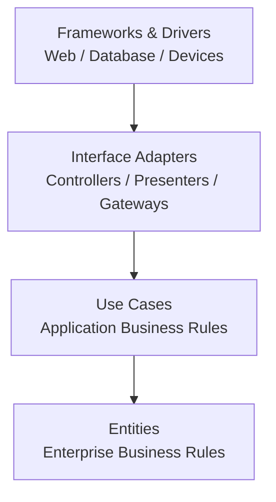
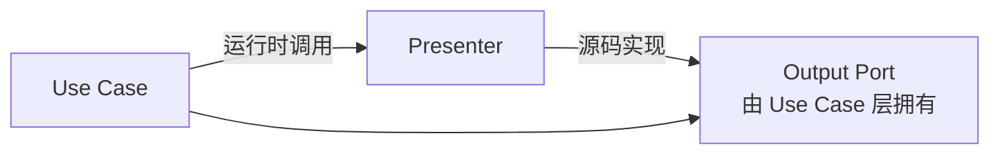
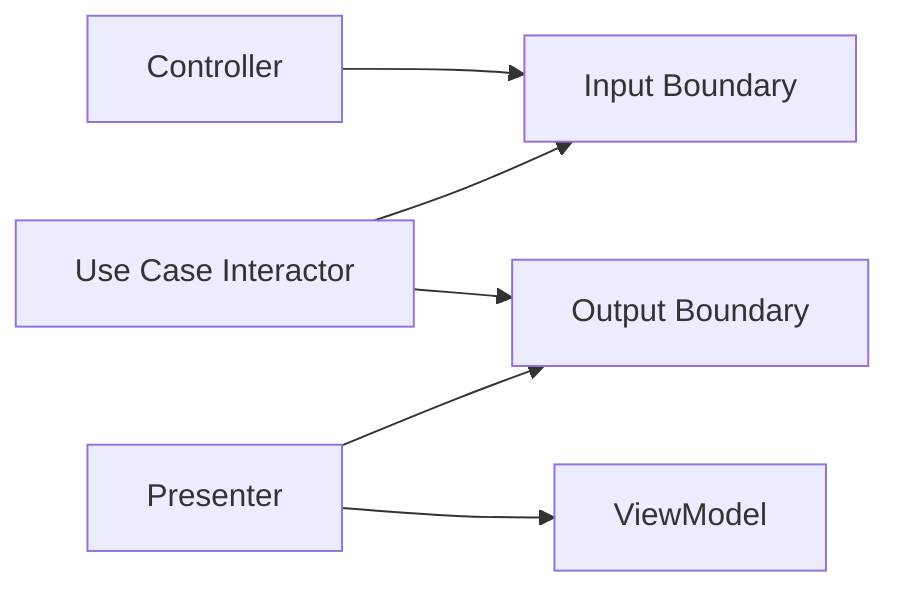
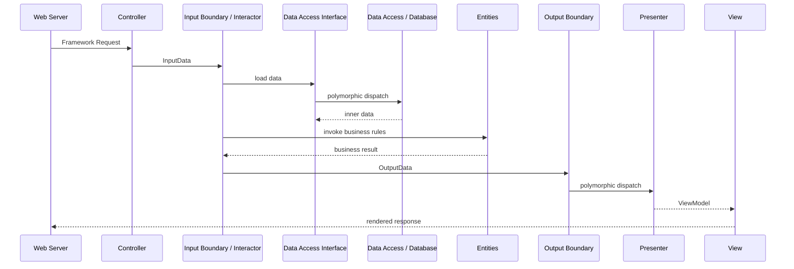

> 原书：Robert C. Martin, *Clean Architecture: A Craftsman's Guide to Software Structure and Design*<br>
> 本章：Chapter 22, The Clean Architecture<br>
> 原文参考：Clean Architecture.md

## 本章导读


第 17 至 21 章逐步建立了 Clean Architecture 的零件：

- 架构边界画在变化轴上；
- 边界可以表现为模块、部署组件、进程或服务；
- 政策离输入输出越远，层级越高；
- Entity 封装关键业务规则；
- Use Case 封装应用特定业务规则；
- 代码仓库应首先显露系统用途，而不是框架。

第 22 章把这些思想合成一幅完整、可执行的架构图：

> **The Clean Architecture。**

作者并不是凭空发明一种全新模式，而是把过去几十年的多种架构思想提炼成共同结构。最重要的共同点是：

- 按关注点划分软件；
- 把业务政策放在内层；
- 把技术机制放在外层；
- 所有源码依赖只向内指向更高层政策。



本章最容易混淆的是三种方向：

| 方向 | 规则 |
| --- | --- |
| 源码依赖 | 必须向内 |
| 运行时控制流 | 可以向内，也可以向外 |
| 业务数据流 | 可以按用例需要双向穿越边界 |

例如：

- Controller 在运行时调用 Use Case，源码依赖向内；
- Use Case 在运行时调用 Presenter，但通过内层 Output Port，使源码依赖仍然向内；
- 数据从 Web 进入核心，再从核心流回 View；
- 数据格式每过一个边界都转换成更适合内层的简单结构。

学习本章的目标不是背四个圆，而是能回答：

1. 这段代码属于哪个政策层级？
2. 它因什么原因变化？
3. 它可以知道哪些名称？
4. 跨边界接口由哪一侧拥有？
5. 数据为什么采用当前模型？
6. 外部框架变化时，影响是否停留在外层？

## 1. 多种架构思想的共同目标

### 1.1 Hexagonal Architecture

原书首先提到 Alistair Cockburn 提出的 Hexagonal Architecture，也叫 Ports and Adapters。

它的核心图景是：

- 应用核心定义 Ports；
- 外部世界通过 Adapters 接入；
- UI、数据库、测试和外部服务只是不同 Adapter；
- 核心不依赖具体 Adapter。

Steve Freeman 与 Nat Pryce 在 *Growing Object-Oriented Software, Guided by Tests* 中采用了这一思想。

### 1.2 DCI

DCI 由 James Coplien 与 Trygve Reenskaug 提出，名称代表：

- Data；
- Context；
- Interaction。

它试图区分数据对象、用例上下文与运行时交互，让系统行为不被静态数据结构完全淹没。

### 1.3 BCE

BCE 由 Ivar Jacobson 在 *Object-Oriented Software Engineering: A Use-Case Driven Approach* 中引入，名称代表：

- Boundary；
- Control；
- Entity。

它围绕 Use Case 区分：

- 与外界交互的 Boundary；
- 编排流程的 Control；
- 表达核心业务的 Entity。

### 1.4 三种思想为何看起来不同

它们使用：

- 不同图形；
- 不同术语；
- 不同建模重点；
- 不同历史背景。

但它们都试图阻止 UI、数据库和框架控制业务核心。

### 1.5 共同目标：Separation of Concerns

原书说，这些架构拥有同一个目标：

> **关注点分离。**

它们都通过分层实现：

- 至少有一层业务规则；
- 至少有一层用户或系统接口；
- 不同变化原因由边界隔离；
- 依赖方向保护高层政策。

### 1.6 分层不是为了目录整齐

层的价值在于：

- UI 改变不影响业务；
- 数据库改变不影响用例；
- 框架升级不影响 Entity；
- 核心规则可以独立测试；
- 外部机制可以替换。

如果只是创建四个目录，却让内层导入外层类型，就没有实现关注点分离。

## 2. 五项共同特征

### 2.1 Independent of Frameworks

架构不依赖某个功能丰富的框架才能存在。

框架可以使用，但应作为工具：

- Web 框架处理 HTTP；
- ORM 处理持久化；
- DI 容器完成组装；
- UI 工具包完成表现。

业务规则不应被迫塞入框架的生命周期、基类和对象模型。

### 2.2 Testable

业务规则应能在没有以下设施时测试：

- UI；
- 数据库；
- Web Server；
- 消息代理；
- 第三方服务；
- 完整框架容器。

这不是取消集成测试，而是让 Entity 与 Use Case 拥有快速、确定的核心测试。

### 2.3 Independent of the UI

UI 可以由 Web 换成 Console，或增加桌面、移动、消息入口，而业务规则不改变。

不同 UI 负责：

- 接收外部输入；
- 转换成 Use Case Request；
- 把 Response 转成展示模型。

核心只处理应用和领域语义。

### 2.4 Independent of the Database

业务规则不绑定 Oracle、SQL Server、Mongo、BigTable、CouchDB 或其他存储。

更换数据库仍可能需要：

- 数据迁移；
- 查询重写；
- 性能调优；
- 运维调整。

Clean Architecture 保护的是业务核心源码，不是承诺数据库迁移零成本。

### 2.5 Independent of Any External Agency

业务规则不应知道外部世界的具体接口，例如：

- 支付供应商；
- 信用服务；
- 邮件系统；
- 设备驱动；
- 云 SDK；
- 远程协议。

核心定义自己需要的 Port，外部 Adapter 实现或调用它。

### 2.6 五项特征来自同一根因

如果核心没有指向外部技术的源码依赖：

- 框架可以留在外围；
- Fake 可以替代数据库；
- UI 可以更换；
- 外部机构可以适配；
- 核心可以独立测试。

这些不是五种独立技巧，而是 Dependency Rule 的共同结果。

### 2.7 如何快速证伪这些特征

可以尝试：

- 删除 Web Adapter 后构建核心；
- 不启动数据库测试 Use Case；
- 用 Console 驱动同一用例；
- 用内存 Gateway 替代真实存储；
- 搜索核心是否出现框架类型。

若做不到，某条向外依赖很可能已经穿透边界。

## 3. Figure 22.1：The Clean Architecture


### 3.1 同心圆表示政策层级

Figure 22.1 使用同心圆表示不同软件区域。

一般而言：

- 越向内，政策层级越高；
- 越向外，机制越具体；
- 内层更一般、更稳定；
- 外层更接近输入输出与技术实现。

### 3.2 四个示意层

从内向外分别是：

1. Entities；
2. Use Cases；
3. Interface Adapters；
4. Frameworks and Drivers。

它们不是四个固定目录模板，而是四类职责与变化原因。

### 3.3 内层是 Policies

内层回答：

- 业务规则是什么；
- 应用怎样完成用户目标；
- 哪些状态和结果有效；
- 输入怎样被转换成有价值输出。

它们定义系统存在的理由。

### 3.4 外层是 Mechanisms

外层回答：

- HTTP 怎样解析；
- SQL 怎样执行；
- 页面怎样显示；
- 消息怎样序列化；
- 进程怎样启动；
- 第三方 API 怎样调用。

这些机制很重要，但不应决定内层政策。

### 3.5 图中的箭头不是数据流

同心圆上的依赖方向表示源码知道关系。

运行时数据可以：

- 从外层进入内层；
- 从内层返回外层；
- 经多个 Adapter 转换。

不能因为数据向外输出，就让内层源码依赖外层 Presenter。

## 4. The Dependency Rule：依赖规则

### 4.1 全章最高规则

原书用一句话概括：

> **Source code dependencies must point only inward, toward higher-level policies.**

即：

> **源码依赖只能向内，指向更高层政策。**

### 4.2 什么算源码依赖

包括：

- import / include / require / using；
- 参数和返回类型；
- 继承与实现；
- 注解；
- 异常类型；
- 泛型参数；
- 常量和枚举；
- 全局名称；
- 框架生成类型。

只要编译或加载内层代码需要知道外层声明，就形成了向外依赖。

### 4.3 内层不能提及外层名称

内层代码不能出现外层声明的：

- 函数名；
- 类名；
- 变量名；
- 框架类型；
- 其他具名软件实体。

例如 Use Case 不应提及：

- Concrete Presenter；
- ORM Row；
- HttpResponse；
- MySQL Client；
- Spring Context。

### 4.4 数据格式也会携带依赖

即使方法调用依赖已经倒置，如果 Use Case 接受框架生成的 Request，它仍然知道外层。

常见违规包括：

- Entity 带 ORM 注解；
- Use Case 接受 HttpRequest；
- Gateway 返回 ResultSet；
- Response 继承 Web Framework 类型；
- 核心抛出供应商异常。

类型与数据格式同样受 Dependency Rule 约束。

### 4.5 Dependency Rule 不要求所有调用向内

运行时控制流可以：

- Controller 调用 Use Case；
- Use Case 调用 Presenter；
- Use Case 调用 Database Gateway 实现；
- 核心调用外部通知 Adapter。

关键是高层通过自己拥有的接口调用低层，低层实现依赖这些接口。

### 4.6 依赖方向与控制流方向



运行时控制流可从 Use Case 到 Presenter；源码依赖仍由 Presenter 指向内层 Output Port。

### 4.7 为什么规则能够保护核心

当外层变化时：

- 新 Web 框架修改 Controller；
- 新数据库修改 Data Access；
- 新展示格式修改 Presenter；
- 新供应商修改 Adapter。

内层契约若未变化，Entity 与 Use Case 不必知道这些改动。

### 4.8 规则也允许高层变化影响外层

若核心业务政策或 Use Case 契约真的改变，外层 Adapter 可能需要适配。

这是合理的不对称：

- 外层服务核心；
- 核心定义系统价值；
- 低层对高层负责。

## 5. Entities

### 5.1 定义

Entities 封装企业范围的 Critical Business Rules。

它可以是：

- 有方法的对象；
- 数据结构与函数；
- 模块；
- 其他语言原生封装。

形式不重要，关键是它表达最一般的关键业务政策。

### 5.2 没有大型企业时怎样理解

如果只开发一个应用，Entities 就是该应用中最一般、最高层的业务对象。

不必为了符合术语假造“企业级”结构。

### 5.3 Entity 最不应受哪些变化影响

通常包括：

- 页面导航；
- Web 框架；
- 数据库；
- 安全实现机制；
- 某个应用的操作流程；
- 外部设备。

只有关键业务政策变化才应直接修改 Entity。

### 5.4 Entity 为什么位于最内层

根据第 19 章 Level 定义，Entity：

- 离具体输入输出最远；
- 可被多个应用使用；
- 不关心自动化流程；
- 只表达核心政策与不变量。

因此它是最高层、最一般的区域。

### 5.5 Entity 不等于 ORM Entity

ORM Entity 可能包含：

- 表映射；
- 主键；
- 懒加载；
- 持久化回调；
- 数据库关系。

Clean Architecture Entity 由业务规则定义。二者可以映射，但不应仅因名称相同就合并。

### 5.6 Entity 的测试形态

Entity 测试应能：

- 普通构造对象；
- 提供领域数据；
- 调用业务方法；
- 检查不变量和结果；
- 不启动数据库、UI 或框架。

## 6. Use Cases

### 6.1 定义

Use Cases 层包含 Application-Specific Business Rules，也就是应用特定业务规则。

它封装系统所有用例，并负责实现用户目标。

### 6.2 Use Case 的职责

Use Case 通常：

- 接收 Input Data；
- 验证应用前置条件；
- 取得或创建 Entity；
- 调用关键业务规则；
- 编排流程；
- 通过 Gateway 保存结果；
- 产生 Output Data。

### 6.3 Use Case 控制 Entity 的舞蹈

Use Case 决定：

- 哪些 Entity 参与；
- 先调用谁；
- 何时保存；
- 如何组织成功与失败；
- 返回什么结果。

Entity 决定自身关键业务规则。

### 6.4 Use Case 与 Entity 的变化隔离

我们期望：

- Use Case 变化不影响 Entity；
- UI、Database、Framework 变化不影响 Use Case；
- 应用操作流程变化会影响 Use Case。

变化应落在最合适层次。

### 6.5 Use Case 为什么位于 Entity 外层

Use Case：

- 属于某个具体应用；
- 更接近输入输出；
- 编排 Entity；
- 可能因应用流程变化。

因此它比 Entity 层级低，并依赖 Entity。

### 6.6 Use Case 可以访问数据库吗

运行时可以通过 Gateway 取得和保存数据。

源码上不能依赖：

- 具体 Database；
- SQL；
- ORM Row；
- 数据库驱动。

Use Case 依赖内层拥有的 Data Access Port，外层实现该 Port。

## 7. Interface Adapters

### 7.1 核心职责：转换格式

Interface Adapters 把数据在两种世界之间转换：

- 外部机构最方便的格式；
- Use Cases 与 Entities 最方便的格式。

转换是双向的。

### 7.2 Controller

Controller 通常：

- 接收 Framework Request；
- 解析协议与格式；
- 构造 Input Data；
- 调用 Use Case Input Port；
- 不实现核心业务规则。

### 7.3 Presenter

Presenter 通常：

- 实现 Use Case Output Port；
- 接收 Output Data；
- 格式化日期、金额和状态；
- 构造 ViewModel；
- 决定展示层需要的字符串和 Flag。

Presenter 属于 Interface Adapters，不属于 Use Case 层。

### 7.4 View

View 负责把 ViewModel 移动到：

- HTML；
- GUI 控件；
- 文本界面；
- 其他呈现媒介。

理想 View 很薄，不计算业务政策，也不查询数据库。

### 7.5 MVC 位于这一层

GUI 的 MVC 结构应整体位于 Interface Adapters：

- Model；
- View；
- Controller；
- Presenter；
- ViewModel。

MVC 只是交付架构的一部分，不是整个系统架构。

### 7.6 数据库 Adapter

数据访问 Adapter 负责：

- 实现 Data Access Interface；
- 执行查询；
- 把 Row / Document 转成内部模型；
- 把 Entity 或内部数据映射到持久化格式；
- 映射技术错误。

### 7.7 SQL 放在哪里

原书允许 SQL 位于 Interface Adapters 中与数据库相关的部分。

关键要求是：

- SQL 不进入 Use Cases；
- SQL 不进入 Entities；
- 数据库 Row 不跨越边界进入核心。

团队也可以把 SQL 与驱动 Glue Code 再细分到最外层，四个圆不是硬模板。

### 7.8 外部服务 Adapter

支付、信用、地图、邮件等外部 API 有自己的：

- 请求格式；
- 响应格式；
- 状态码；
- 错误模型；
- 版本。

Adapter 把这些外部格式转换成核心可理解的简单模型。

### 7.9 真正 Adapter 不能只是转发

如果 Controller 把 HttpRequest 原样传给 Use Case，或 Gateway 把 Database Row 原样返回，它没有完成适配。

真正的 Adapter 会终止外层类型，并建立内层模型。

## 8. Frameworks and Drivers

### 8.1 最外层包含什么

Frameworks and Drivers 通常包括：

- Web Framework；
- Database Engine；
- Device Driver；
- UI Toolkit；
- Message Broker；
- External Interface；
- 应用启动与配置。

### 8.2 Web 与 Database 都是细节

原书再次强调：

- Web 是细节；
- Database 是细节。

把它们放在最外层，可以把技术变化造成的伤害限制在外围。

### 8.3 最外层通常只有较薄 Glue Code

理想最外层代码主要：

- 读取配置；
- 创建具体 Adapter；
- 连接依赖；
- 启动框架；
- 把框架事件交给 Controller；
- 管理应用生命周期。

### 8.4 组合根位于外围

Composition Root 可以知道：

- 具体 Controller；
- 具体 Gateway；
- 具体 Presenter；
- 数据库驱动；
- Web Framework；
- 配置。

核心不应自行查找这些实现。

### 8.5 外层不等于不重要

外层仍要高质量处理：

- 安全；
- 性能；
- 可靠性；
- 兼容性；
- 用户体验；
- 运维。

“细节”表示它们不定义核心政策，并非可以粗糙实现。

### 8.6 外层也可以再分层

例如数据库部分可以分为：

- Gateway Adapter；
- ORM Mapping；
- Driver；
- Database Engine。

只要源码依赖继续向内，增加或减少外层层次都可以。

## 9. Only Four Circles?：只有四个圆吗

### 9.1 四个圆只是示意

原书明确说，Figure 22.1 的圆是 schematic，也就是示意性的。

没有规则要求所有系统必须刚好四层。

### 9.2 可能需要更多层

系统可能进一步区分：

- Enterprise Policy；
- Domain Service；
- Application Service；
- Anti-Corruption Layer；
- Protocol Adapter；
- Framework Glue。

层数取决于真实变化轴与政策层级。

### 9.3 也可能只需要更少层

小型应用可能把：

- Use Case 与部分领域政策放在同一组件；
- Controller 与 Presenter 放在同一 Adapter 模块；
- 多个外部细节统一管理。

只要职责清楚、依赖向内，不必为凑四层制造转发。

### 9.4 增加层的信号

可能包括：

- 两组代码因不同原因变化；
- 一侧需要保护免受另一侧影响；
- 抽象层级明显不同；
- 团队需要独立开发；
- 外部模型正在污染核心；
- 测试需要隔离。

### 9.5 不应增加层的理由

以下理由单独看并不充分：

- 图上看起来对称；
- 某模板规定四层；
- 每个项目都复制同一脚手架；
- 想显得架构更复杂；
- 为每个类都添加接口。

### 9.6 唯一不变的是 Dependency Rule

无论三层、四层还是七层：

- 源码依赖总是向内；
- 越向内，政策层级越高；
- 越向外，机制越具体；
- 内层不知道外层名称和格式。

## 10. Crossing Boundaries：跨越边界

### 10.1 Figure 22.1 中的控制流

图右下角展示：

```text
Controller → Use Case Interactor → Presenter
```

运行时控制流先向内，再向外。

### 10.2 表面矛盾

Dependency Rule 禁止 Use Case 提及外层 Presenter。

但 Use Case 完成后又必须把结果交给 Presenter。

若直接依赖 Concrete Presenter，源码箭头就会向外。

### 10.3 使用 Output Port

解决方法是：

1. 在 Use Case 层定义 Output Port；
2. Use Case 调用 Output Port；
3. 外层 Presenter 实现 Output Port；
4. 组合根把 Presenter 注入 Use Case。



### 10.4 运行时与源码方向

**运行时：**

- Interactor 调用 Presenter 实例。

**源码：**

- Interactor 依赖 Output Boundary；
- Presenter 依赖并实现 Output Boundary；
- Output Boundary 位于 Use Case 层。

动态多态让源码依赖与控制流在必要处反向。

### 10.5 为什么接口必须属于内层

如果 Output Port 放在 Presenter 包：

- Use Case 仍要导入外层包；
- 即使依赖的是接口，方向仍向外；
- Presenter 一侧控制了核心契约。

抽象本身不会自动产生正确方向。接口所有权才决定方向。

### 10.6 Input Port 怎样工作

Controller 依赖 Use Case 层定义的 Input Boundary。

Use Case Interactor 实现该接口。

因此：

- Controller 可以调用 Use Case；
- 外层 Controller 依赖内层端口；
- Use Case 不知道具体 Controller。

### 10.7 Data Access Port 怎样工作

Use Case 层定义所需 Data Access Interface。

外层 Data Access Adapter 实现它并调用 Database。

运行时 Interactor 会调用数据库实现，源码上核心仍不知道具体数据库。

### 10.8 所有边界采用同一技巧

同样适用于：

- Payment Gateway；
- Notification Sender；
- Business Clock；
- File Storage；
- External Credit Service；
- Device Driver。

高层定义需要，低层提供实现。

## 11. Which Data Crosses the Boundaries

### 11.1 传递简单、隔离的数据结构

原书允许多种形式：

- 基础 Struct；
- 简单 DTO；
- 函数参数；
- Hash Map；
- 简单对象。

重点不在语法，而在依赖：数据结构不能携带外层技术进入内层。

### 11.2 为什么不能“作弊”传 Entity

把 Entity 直接交给 Presenter 可能导致：

- 外层绕过 Use Case 调用业务方法；
- 敏感字段被序列化；
- UI 依赖 Entity 内部结构；
- 为显示需求修改 Entity；
- 生命周期跨层扩散。

Use Case 应构造专用 Output Data。

### 11.3 为什么不能传 Database Row

数据库框架返回的 Row Structure 对数据库层很方便。

若把它传给 Use Case：

- Use Case 参数依赖 Row 类型；
- Row 类型依赖数据库框架；
- 内层因此间接依赖外层。

Data Access Adapter 应先转换为内层模型。

### 11.4 为什么不能传 HttpRequest

同理，HttpRequest 携带：

- 框架生命周期；
- Header；
- Cookie；
- 协议格式；
- Web 依赖。

Controller 应把它转换成 Input Data。

### 11.5 数据格式以哪一侧方便为准

原书给出明确原则：

> **跨边界数据总是采用最方便内层的形式。**

因为内层是被保护对象，外层承担转换成本。

### 11.6 边界数据应包含什么

只包含当前用例真正需要：

- 输入字段；
- 输出字段；
- 业务标识；
- 业务可理解状态；
- 必要错误信息。

不应把外部对象整个塞进去“以后可能用”。

### 11.7 映射代码的价值

映射代码看起来像样板，却明确表达：

- 哪些数据允许越界；
- 哪些外部字段被忽略；
- 怎样转换语义；
- 哪一侧拥有格式。

它是边界的可见成本，也是隔离的实现。

### 11.8 性能敏感时怎么办

在极高吞吐路径中，数据复制可能需要优化。

应先：

- 测量真实瓶颈；
- 保持依赖方向；
- 使用内层拥有的高效结构；
- 避免未经证据让框架 Row 穿透核心。

性能优化不能自动取消 Dependency Rule。

## 12. Figure 22.2：典型 Web 与数据库场景


### 12.1 完整角色

Figure 22.2 包含：

- Web Server；
- Controller；
- Input Data；
- Input Boundary；
- Use Case Interactor；
- Entities；
- Data Access Interface；
- Data Access；
- Database；
- Output Data；
- Output Boundary；
- Presenter；
- ViewModel；
- View。

### 12.2 第一步：Web Server 收集输入

Web Server 负责：

- 接收 HTTP；
- 路由；
- 解析协议；
- 把请求交给 Controller。

这些工作位于外层。

### 12.3 第二步：Controller 构造 Input Data

Controller：

1. 从 Framework Request 取得所需字段；
2. 处理协议格式；
3. 构造 Plain Old Java Object `InputData`；
4. 通过 Input Boundary 调用 Use Case Interactor。

InputData 不依赖 HttpRequest。

### 12.4 第三步：Interactor 解释应用语义

Use Case Interactor：

- 解释 InputData；
- 验证应用前置条件；
- 决定处理步骤；
- 控制 Entities 的舞蹈。

Controller 不负责这些业务流程。

### 12.5 第四步：通过 Data Access Interface 取得数据

Interactor 依赖内层定义的 Data Access Interface。

外层 Data Access 实现该接口：

- 查询 Database；
- 取得 Row；
- 转换成内部数据或 Entity；
- 返回给 Interactor。

数据库格式止步 Adapter。

### 12.6 第五步：Entities 执行关键业务规则

Interactor 调用 Entities：

- 计算核心结果；
- 保护业务不变量；
- 更新业务状态。

Entities 不知道 Web、Controller、Presenter 或 Database。

### 12.7 第六步：构造 Output Data

完成用例后，Interactor：

- 从 Entities 收集必要结果；
- 构造另一个 Plain Old Java Object `OutputData`；
- 通过 Output Boundary 交给 Presenter。

OutputData 仍与 UI 无关。

### 12.8 第七步：Presenter 构造 ViewModel

Presenter 把 OutputData 转换成 ViewModel。

例如：

| OutputData | ViewModel |
| --- | --- |
| Date 对象 | 已格式化日期字符串 |
| Currency / Money | 带符号和小数位的字符串 |
| 业务状态 | 展示文本、颜色或 Flag |
| 可执行操作 | Button / MenuItem 名称和启用状态 |

Presenter 完成展示决策。

### 12.9 第八步：View 只负责显示

View 从 ViewModel 读取：

- 字符串；
- Flag；
- 已格式化值；
- 控件名称与状态。

然后把它们放入 HTML 或其他界面。

View 不应：

- 计算金额；
- 格式化业务日期；
- 判断按钮权限；
- 查询数据库；
- 调用 Entity。

### 12.10 完整控制流



### 12.11 逐条检查源码依赖

| 依赖 | 为什么向内 |
| --- | --- |
| Web Glue → Controller | Frameworks 依赖 Interface Adapters |
| Controller → Input Boundary | Adapter 依赖 Use Case Port |
| Interactor → Entity | Use Case 依赖更高层业务政策 |
| Data Access → Data Access Interface | 数据库实现依赖 Use Case 所需契约 |
| Presenter → Output Boundary | 外层 Presenter 实现内层 Port |
| View → ViewModel | 同属表现 Adapter 区域 |

所有跨圆源码依赖指向更内层。

### 12.12 逐条检查数据转换

| 边界 | 转换 |
| --- | --- |
| Web → Controller | Framework Request 被解析 |
| Controller → Use Case | 转成 InputData |
| Database → Data Access | Row / Document 被读取 |
| Data Access → Use Case | 转成内部模型 |
| Use Case → Presenter | 构造 OutputData |
| Presenter → View | 转成 ViewModel |

每层只看自己方便的数据格式。

### 12.13 变化怎样被局部化

**页面格式改变：**

- 修改 Presenter / View；
- Use Case 与 Entity 不变。

**Web Framework 改变：**

- 修改 Web Glue / Controller；
- 核心不变。

**Database Schema 改变：**

- 修改 Data Access 与 Migration；
- Use Case 接口若语义未变，则核心不变。

**用例步骤改变：**

- 修改 Interactor；
- Entity 核心规则可能不变。

**关键业务规则改变：**

- 修改 Entity；
- 外层测试和 Adapter 可能需要适配结果。

## 13. Conclusion：这些规则带来什么

### 13.1 原书结论

作者认为，遵守这些规则并不困难，却能在未来省去大量麻烦。

核心动作只有两个：

- 把软件按关注点分层；
- 遵守 Dependency Rule。

### 13.2 系统会内在可测试

可测试性不是额外补丁，而是依赖方向的结果：

- Entity 没有外部依赖；
- Use Case 依赖 Port；
- 测试提供 Fake；
- Web 与 Database 不必启动。

### 13.3 外部技术过时时更容易替换

当 Database、Web Framework 或其他外层元素过时：

- 核心业务仍保持；
- 新 Adapter 实现已有 Port；
- 主要修改留在外层；
- 核心测试继续保护业务行为。

### 13.4 替换仍需现实工作

可能仍需：

- 重写 Adapter；
- 迁移数据；
- 修改配置；
- 调整部署；
- 重新做集成测试；
- 培训团队。

Clean Architecture 减少核心重写，不承诺魔法式替换。

### 13.5 本章完整论证链

1. Hexagonal、DCI 与 BCE 都追求关注点分离；
2. 它们把业务规则与用户、系统接口分开；
3. 由此得到框架、UI、Database 和外部机构独立性；
4. Figure 22.1 用同心圆整合这些思想；
5. 越向内，政策层级越高；
6. Dependency Rule 要求所有源码依赖只向内；
7. 内层不能提及外层名称或数据格式；
8. Entities 封装最一般的关键业务规则；
9. Use Cases 封装应用特定业务规则并编排 Entities；
10. Interface Adapters 转换内外数据格式；
11. Frameworks and Drivers 容纳具体技术细节；
12. 四个圆只是示意，层数可按变化轴调整；
13. 控制流向外时，用内层 Port 和 DIP 反转源码依赖；
14. 跨界只传简单、隔离、适合内层的数据；
15. Figure 22.2 展示从 Web 输入到 View 输出的完整路径；
16. 每个跨边界源码箭头都向内；
17. 外部变化因此更容易停留在外围。

## 14. 如何在项目中落实 Dependency Rule

### 14.1 先画真实组件图

列出：

- Entities；
- Use Cases；
- Interface Adapters；
- Frameworks / Drivers；
- 实际 import 与构建依赖。

不要只画理想图，要核对代码事实。

### 14.2 为每个组件标注政策层级

询问：

- 它离 IO 多远？
- 它表达业务政策还是技术机制？
- 它因什么原因变化？
- 它应保护谁，或被谁保护？

层级不由目录名称自动决定。

### 14.3 检查内层出现的外层名称

搜索核心中的：

- Web Framework 类型；
- ORM 注解；
- SQL；
- HttpRequest / HttpResponse；
- Concrete Adapter；
- 供应商 SDK；
- 外层异常。

每个结果都应解释或移出边界。

### 14.4 检查接口所有权

对每个 Port 问：

- 谁需要这项能力？
- 接口是否位于需要被保护的一侧？
- 签名是否使用内层语言？
- 外层实现是否依赖接口？

“使用接口”不等于依赖方向正确。

### 14.5 检查跨界模型

禁止直接穿越：

- ORM Row；
- Framework Request；
- Entity 到 UI；
- 外部服务 Response；
- GUI Widget。

使用简单内部数据并显式映射。

### 14.6 加入架构自动检查

可以在 CI 中检查：

- Entity 不依赖 Use Case；
- Use Case 不依赖 Adapter；
- Core 不依赖 Framework；
- 组件图无环；
- 禁止特定包导入；
- Port 位于允许模块。

自动守卫能防止便利性逐步侵蚀边界。

### 14.7 先从一个 Use Case 试点

遗留系统不必一次重构全部层。

选择：

- 高价值；
- 经常变化；
- 当前难测试；
- 技术耦合明显；

的 Use Case，建立完整 Input Port、Interactor、Output Port 与 Gateway 边界。

### 14.8 用替换实验验证

尝试：

- 用内存 Gateway 替换 Database；
- 用 Console 替换 Web；
- 用 Fake Presenter 捕获 OutputData；
- 不启动框架运行核心测试。

实验比架构口号更能证明边界是否成立。

## 15. 易混淆概念与常见误解

### 15.1 “Clean Architecture 就是四层目录”

错误。四圆只是示意，Dependency Rule 才是不变量。

### 15.2 “依赖向内意味着运行时调用只能向内”

错误。Use Case 可以运行时调用 Presenter，通过 Output Port 保持源码依赖向内。

### 15.3 “只要使用接口就符合 Dependency Rule”

错误。接口若位于外层，内层仍依赖外层。接口所有权决定方向。

### 15.4 “Entity 就是 ORM Entity”

错误。Clean Entity 封装关键业务规则，ORM Entity 是数据库表示。

### 15.5 “Use Case 不能访问 Database”

它可以运行时通过 Gateway 访问，但源码不能依赖具体 Database、SQL 或 Row。

### 15.6 “Presenter 属于 Use Case 层”

错误。Presenter 知道展示格式和 ViewModel，属于 Interface Adapters。

### 15.7 “ViewModel 就是 Entity”

错误。ViewModel 服务特定 View，包含已格式化字符串和 Flag；Entity 服务核心业务政策。

### 15.8 “跨边界只能传 DTO Class”

错误。Struct、参数、Hash Map 或简单对象都可以，关键是隔离且无外层依赖。

### 15.9 “Database Row 可以减少映射，所以应直接返回”

这会让 Use Case 依赖数据库框架。少量映射是保护核心的合理成本。

### 15.10 “外层是细节，所以不重要”

错误。外层仍需安全、性能与可靠，只是不应控制核心政策。

### 15.11 “SQL 必须全部在最外层圆”

原书允许 SQL 位于 Interface Adapters 的数据库部分。关键是不进入 Use Cases 与 Entities。

### 15.12 “每层只能依赖相邻层”

原书没有强制。外层可直接依赖更内层，只要方向向内。相邻层限制是额外团队策略。

### 15.13 “数据转换一定造成严重性能问题”

通常应先测量。大多数业务路径中，映射成本小于网络和数据库成本。

### 15.14 “Clean Architecture 等于微服务”

错误。它首先是源码依赖架构，可用于单体、动态组件、进程或服务。

### 15.15 “Testable 表示不需要集成测试”

错误。核心可独立单测，外层 SQL、Web 与组装仍需集成和端到端测试。

### 15.16 “层越多越干净”

错误。每层都有接口、模型和映射成本，应由真实变化轴决定。

### 15.17 “所有业务都必须有 Enterprise Entity”

错误。单一应用同样可以用应用中最一般的业务对象作为 Entities。

### 15.18 “外层框架完全不能影响任何设计”

错误。真实性能、安全和平台约束必须考虑；只是具体框架名称与类型不应污染内层。

### 15.19 “一个通用 Request / Response 可供所有 Use Case 复用”

通常会产生大量无关字段与条件。边界数据应围绕具体 Use Case。

### 15.20 “转换模型违反 DRY”

不同层模型表达不同知识、因不同原因变化，字段相似通常是偶然重复。

## 16. 实践检查与掌握练习

### 16.1 五项独立性检查

- 核心是否可在无框架时构建？
- Use Case 是否可无 Database 测试？
- UI 能否替换而不修改业务？
- Database 变化是否停在 Adapter？
- 外部服务类型是否进入核心？

### 16.2 Dependency Rule 检查

- 每个组件属于哪个政策层级？
- 所有跨层源码依赖是否向内？
- 内层是否提及外层类、函数、注解或异常？
- 数据格式是否携带外层依赖？
- 组件图是否无环？

### 16.3 Entities 检查

- 是否封装最一般的关键业务规则？
- 页面导航和数据库变化是否影响它？
- 是否误用 ORM Entity 充当核心？
- 是否能无外部设施测试？

### 16.4 Use Cases 检查

- 是否有明确 Input / Output Data？
- 是否编排 Entity 而不复制规则？
- UI、Database 与 Framework 变化是否不影响它？
- 应用流程变化是否准确落在这一层？

### 16.5 Interface Adapters 检查

- Controller 是否终止 HttpRequest？
- Presenter 是否构造 ViewModel？
- Data Access 是否终止 Row / Document？
- 外部 API 是否被转换成内部模型？
- Adapter 是否真正转换而非透明转发？

### 16.6 Frameworks and Drivers 检查

- 最外层是否主要是 Glue Code？
- Composition Root 是否集中组装？
- 框架生命周期是否进入业务？
- Web、Database 与 Broker 是否可替换？

### 16.7 跨界控制流检查

- Input / Output Port 由哪一层拥有？
- Presenter 是否实现内层 Output Port？
- Gateway 是否实现内层 Data Access Interface？
- 运行时向外调用时，源码依赖是否仍向内？

### 16.8 边界数据检查

- 是否传递 Entity、ORM Row 或 HttpRequest？
- 模型是否只包含该 Use Case 所需字段？
- 数据格式是否最方便内层？
- 是否泄漏敏感内部信息？
- 映射代码是否清楚可测试？

### 16.9 场景判断一：Use Case 返回 ORM Row

**判断：** Row 把数据库框架依赖带入核心，Data Access Adapter 应转换为 OutputData 或内部模型。

### 16.10 场景判断二：Presenter 接口在 UI 包

Use Case 导入 UI 包中的接口。

**判断：** 虽然依赖抽象，方向仍向外。Output Port 应由 Use Case 层拥有。

### 16.11 场景判断三：Controller 包含定价规则

**判断：** 业务政策位于 Interface Adapter，应移动到 Entity 或 Use Case。

### 16.12 场景判断四：View 格式化金额并判断按钮权限

**判断：** Presenter 职责泄漏到 View，应把格式和 Flag 放进 ViewModel。

### 16.13 场景判断五：单体遵守全部依赖规则

**判断：** 完全可以是 Clean Architecture。部署拓扑不决定源码边界质量。

### 16.14 场景判断六：五层系统每层只有转发

**判断：** 很可能过度分层。应根据真实变化轴合并无价值边界。

### 16.15 场景判断七：Database Adapter 实现核心 Gateway

**判断：** 正确。运行时 Use Case 调数据库，源码上 Adapter 依赖内层契约。

### 16.16 场景判断八：核心没有 Framework Import，但 Request 带框架注解

**判断：** 数据类型仍携带外层依赖，违反 Dependency Rule。

### 16.17 快速复述练习

能够回答以下问题，基本就掌握了本章：

1. Clean Architecture 综合了哪些架构思想？
2. Hexagonal、DCI、BCE 的共同目标是什么？
3. Clean Architecture 产生哪五项独立性？
4. Figure 22.1 的同心圆表示什么？
5. 越向内，政策与抽象怎样变化？
6. Dependency Rule 的原文是什么？
7. 内层不能知道外层哪些名称？
8. 为什么数据格式也受 Dependency Rule 约束？
9. Dependency Rule 是否限制运行时控制流？
10. Entities 封装什么？
11. 单一应用怎样理解 Entities？
12. Use Cases 层负责什么？
13. Use Case 如何控制 Entities 的舞蹈？
14. Interface Adapters 的核心职责是什么？
15. MVC 为什么只属于 Interface Adapters？
16. SQL 可以位于哪里？
17. Frameworks and Drivers 包含什么？
18. 四个圆为什么只是示意？
19. 什么情况下值得增加或减少层？
20. Use Case 怎样在不依赖 Presenter 的情况下调用它？
21. 为什么 Output Port 必须位于内层？
22. Data Access Interface 怎样倒置数据库依赖？
23. 跨边界可以传哪些数据结构？
24. 为什么不能传 Entity、Database Row 或 HttpRequest？
25. 数据格式为什么以方便内层为准？
26. Figure 22.2 的输入路径是什么？
27. Interactor 怎样取得数据库数据？
28. OutputData 怎样到达 Presenter？
29. Presenter 怎样生成 ViewModel？
30. View 为什么应该很薄？
31. 外部技术变化怎样被局部化？
32. Clean Architecture 为什么内在可测试？

### 16.18 一分钟记忆卡

- **来源：** Hexagonal、DCI、BCE 等思想的共同提炼。
- **目标：** 关注点分离，保护业务规则。
- **圆：** Entities、Use Cases、Interface Adapters、Frameworks & Drivers。
- **规则：** 所有源码依赖只向内，指向更高层政策。
- **Entity：** 企业或应用中最一般的关键业务规则。
- **Use Case：** 应用特定流程，编排 Entity。
- **Adapter：** 终止外部格式，转换成内层模型。
- **Framework：** Web 与 Database 等具体细节留在最外层。
- **穿越：** 运行时可向外，源码通过内层 Port 保持向内。
- **数据：** 简单、隔离、以方便内层为准，不传 Row 或 Entity。
- **场景：** Controller → Interactor → Entity → Presenter → View。
- **结果：** 核心可测试，外部技术更容易替换。

## 17. 本章总结

1. 第 22 章把边界、政策层级、业务规则和尖叫架构整合为 The Clean Architecture。
2. 原书提到 Hexagonal Architecture、DCI 与 BCE 等相关架构思想。
3. Hexagonal Architecture 又称 Ports and Adapters，由 Alistair Cockburn 提出。
4. DCI 代表 Data、Context、Interaction，由 James Coplien 与 Trygve Reenskaug 提出。
5. BCE 代表 Boundary、Control、Entity，由 Ivar Jacobson 引入。
6. 这些思想虽然术语和图形不同，却都追求 Separation of Concerns。
7. 它们都至少分开业务规则与用户、系统接口。
8. Clean Architecture 应独立于框架，让框架成为工具而非系统容器。
9. 业务规则应能在没有 UI、Database、Web Server 和外部元素时测试。
10. UI 应可从 Web 换成 Console，而不修改业务规则。
11. Database 应可从 Oracle、SQL Server 换成 Mongo、BigTable、CouchDB 或其他存储，而不重写核心业务。
12. 业务规则也应独立于支付、邮件、设备等任何外部机构。
13. 五项独立性都来自核心不依赖外部技术这一共同根因。
14. Figure 22.1 用同心圆表示不同政策与机制区域。
15. 越向内，软件政策层级越高、越一般；越向外，机制越具体。
16. 四个示意层是 Entities、Use Cases、Interface Adapters、Frameworks and Drivers。
17. Dependency Rule 是全章最高规则：源码依赖只能向内，指向更高层政策。
18. 内层不能提及外层声明的函数、类、变量、异常、注解或其他名称。
19. 外层框架生成的数据格式也不能进入内层。
20. Dependency Rule 约束源码知道关系，不限制运行时控制流与业务数据流。
21. 高层运行时调用低层时，通过内层 Port 和动态多态反转源码依赖。
22. Entities 封装企业范围的 Critical Business Rules。
23. 没有大型企业时，Entities 就是应用中最一般的业务对象。
24. Entity 最不应受页面导航、数据库、框架和具体应用流程变化影响。
25. Entity 位于最内层，因为它离具体输入输出最远。
26. Clean Architecture Entity 不等于 ORM Entity。
27. Use Cases 层封装 Application-Specific Business Rules。
28. Use Case 接收输入、编排 Entity、协调 Gateway 并产生输出。
29. Use Case 变化不应影响 Entity，外部 UI、Database 与 Framework 变化也不应影响 Use Case。
30. 应用操作流程变化应准确落在 Use Case 层。
31. Interface Adapters 在外部格式与 Use Case / Entity 方便的内部格式之间转换。
32. Controller 终止 Framework Request，构造 Input Data 并调用 Input Boundary。
33. Presenter 实现 Output Boundary，把 Output Data 转成 ViewModel。
34. MVC 的 Controller、Presenter、View 与模型属于 Interface Adapters，而不是整个系统架构。
35. Data Access Adapter 实现内层接口，并在 Database Row 与内部模型之间转换。
36. SQL 可以位于 Interface Adapters 的数据库相关部分，但不能进入 Use Cases 和 Entities。
37. Frameworks and Drivers 容纳 Web、Database、设备、UI 工具和外部接口。
38. 最外层代码应主要是配置、组装、启动和事件转交的 Glue Code。
39. Web 和 Database 都是细节，但细节仍需高质量实现。
40. Figure 22.1 的四个圆只是示意，没有规则要求系统必须恰好四层。
41. 层数应由真实变化轴、政策层级和隔离收益决定。
42. 不论层数多少，Dependency Rule 始终适用。
43. Figure 22.1 的典型控制流是 Controller 到 Interactor，再到 Presenter。
44. Use Case 不能直接依赖 Concrete Presenter，因此在内层定义 Output Port。
45. Presenter 在外层实现 Output Port，运行时控制流向外，源码依赖仍向内。
46. Controller 依赖内层 Input Boundary，Interactor 实现它。
47. Data Access 实现内层 Data Access Interface，使具体 Database 成为插件。
48. 接口本身不保证正确依赖，接口所有权必须属于被保护的内层。
49. 跨边界数据可以是 Struct、DTO、函数参数、Hash Map 或简单对象。
50. 关键是数据简单、隔离，并且不携带外层依赖。
51. 不应把 Entity 直接交给 Presenter，以免外层绕过 Use Case、泄漏行为和敏感数据。
52. 不应把 Database Row 传入 Use Case，否则核心会依赖数据库框架。
53. 不应把 HttpRequest 传入 Use Case，否则核心会依赖 Web。
54. 跨界数据应采用最方便内层的格式，外层承担转换成本。
55. Figure 22.2 的输入路径是 Web Server、Controller、InputData、InputBoundary、UseCaseInteractor。
56. Interactor 通过 DataAccessInterface 调用外层 Data Access，并取得转换后的内部数据。
57. Interactor 控制 Entities 执行关键业务规则。
58. 完成后 Interactor 构造 OutputData，通过 OutputBoundary 调用 Presenter。
59. Presenter 把日期、货币、业务状态转换成字符串、Flag 与控件状态，构造 ViewModel。
60. View 几乎只需把 ViewModel 数据移动到 HTML 或其他界面。
61. Figure 22.2 中所有跨边界源码依赖都指向内层。
62. 页面格式变化停在 Presenter / View，Web Framework 变化停在 Web Adapter，Schema 变化停在 Data Access。
63. 按关注点分层并遵守 Dependency Rule，会使系统内在可测试。
64. 外部技术过时时，可替换相应 Adapter，而不必重写核心业务。
65. Clean Architecture 不消除数据迁移、配置和部署成本，只限制核心源码影响。
66. Clean Architecture 不是四层目录、微服务或接口数量模板，而是一条保护高层政策的依赖规则。
67. 在遗留系统中，可以从一个高价值 Use Case 试点，逐步提取 Port、Interactor、Presenter 与 Gateway。
68. 本章最终方法是：以政策层级划分软件，让所有源码依赖向内，并在每个边界显式转换控制与数据。
