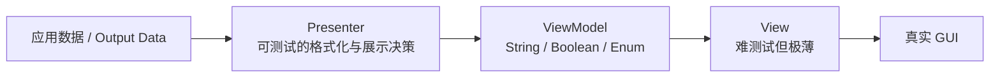
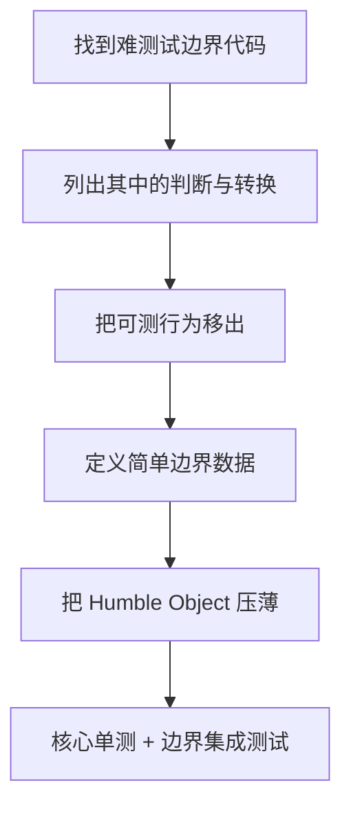
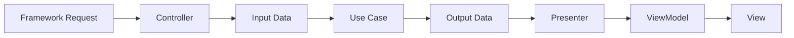
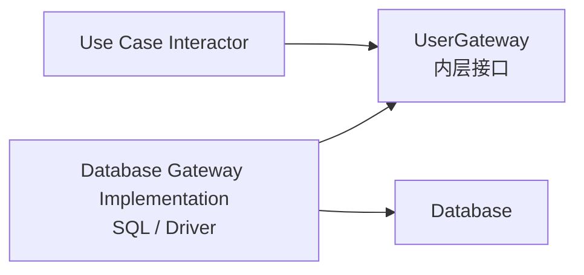
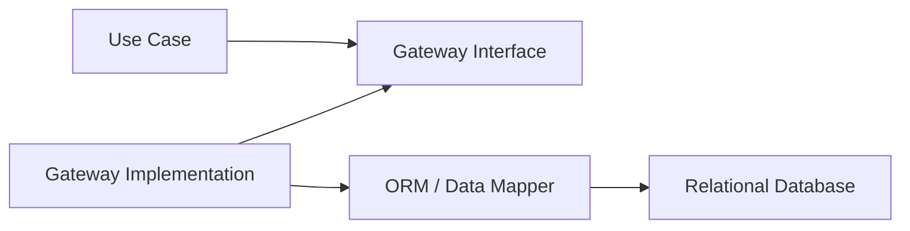
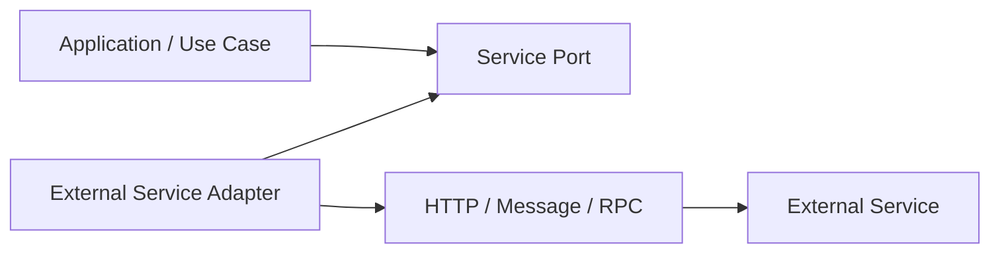

> 原书：Robert C. Martin, *Clean Architecture: A Craftsman's Guide to Software Structure and Design* 
> 本章：Chapter 23, Presenters and Humble Objects 
> 原文参考：Clean Architecture.md

## 本章导读

第 22 章用 Figure 22.2 展示了一个典型调用流程：

- Controller 把外部请求转换为 Input Data；
- Use Case Interactor 编排 Entity；
- Interactor 通过 Output Boundary 调用 Presenter；
- Presenter 把 Output Data 转换为 ViewModel；
- View 将 ViewModel 搬到屏幕上。

第 23 章专门解释这个 Presenter / View 分工背后的模式：

> **Humble Object Pattern，谦卑对象模式。**

它解决的问题是：系统边界附近往往存在一些难以单元测试的行为，例如：

- 真正把文字放到 GUI 控件；
- 调用 SQL 与数据库驱动；
- 收发网络消息；
- 读取框架事件；
- 操作设备或进程。

如果业务判断、格式化、状态决策都混在这些边界代码里，大量重要行为就只能依靠缓慢、脆弱的集成测试验证。

Humble Object Pattern 的做法很简单：

1. 把难测试行为压缩到一个尽可能薄的 Humble Object 中；
2. 把可以测试的判断、转换和格式化移到另一个普通模块；
3. 两边通过简单数据结构通信；
4. 对可测试模块编写大量快速单元测试；
5. 对 Humble Object 保留少量必要的集成测试。

作者随后把同一模式推广到多个架构边界：

- Presenter 与 View；
- Use Case Interactor 与 Database Gateway；
- Gateway 与 ORM / Data Mapper；
- 应用与外部 Service Listener。

本章没有数学公式，也没有需要推导的算法。它的关键论证是结构性的：

> **测试性会迫使我们识别边界；边界又把重要、可测试的政策与难测试的外部机制分开。**

## 1. The Humble Object Pattern

### 1.1 模式从什么问题出发

Humble Object Pattern 最初被识别为一种帮助单元测试的设计模式。

现实代码中有两类行为：

**容易单元测试的行为：**

- 纯计算；
- 格式化；
- 状态判断；
- 分支决策；
- 业务规则；
- 简单数据转换。

**难以单元测试的行为：**

- 真正绘制屏幕；
- 操作数据库驱动；
- 启动外部进程；
- 通过网络收发；
- 等待框架回调；
- 与真实硬件交互。

难点通常不在逻辑复杂，而在可观察性和外部环境。

### 1.2 为什么有些行为难测试

单元测试希望目标行为具有：

- 可控输入；
- 可观察输出；
- 确定性；
- 快速执行；
- 环境独立；
- 失败容易定位。

边界机制往往相反：

- 输入来自外部系统；
- 输出发生在屏幕、网络或数据库；
- 需要进程、驱动或容器；
- 时序与环境会影响结果；
- 失败可能来自多层基础设施。

### 1.3 GUI 为什么是典型例子

GUI 很难通过普通单元测试确认：

- 字符是否真的出现在正确位置；
- 控件是否真正变灰；
- 字体与颜色是否正确；
- 窗口系统是否完成绘制；
- 用户是否能看到最终画面。

可以使用截图、像素比较和 UI 自动化，但这些测试通常：

- 运行较慢；
- 对布局变化敏感；
- 依赖平台和窗口环境；
- 失败原因不够局部。

然而，GUI 中大部分决定其实很容易测试。

### 1.4 GUI 中哪些行为容易测试

例如：

- 日期应该格式化成什么字符串；
- 金额应该显示几位小数；
- 负数是否显示为红色；
- 某个按钮名称是什么；
- 按钮是否应禁用；
- 某菜单项是否可见；
- 表格中每个数字如何格式化。

这些行为无需真正屏幕，只需给定输入并检查简单输出。

### 1.5 模式的核心拆分

作者建议把行为拆成两个类或模块：

**Humble Object：**

- 保留无法轻易单元测试的行为；
- 代码尽可能少；
- 几乎不做判断；
- 主要负责触碰真实外部机制。

**Testable Object：**

- 承担可以测试的行为；
- 包含格式化、判断和转换；
- 使用普通数据；
- 不需要启动外部环境。

### 1.6 为什么称为 Humble

“Humble”可以理解为谦卑、克制。

这个对象不试图：

- 掌握业务规则；
- 做复杂决策；
- 成为系统中心；
- 隐藏大量逻辑。

它只承担无法避免的外部动作，并保持足够简单，让少量集成测试就能建立信心。

### 1.7 不是让难测代码完全不测试

Humble Object Pattern 并不主张忽略边界代码。

View、SQL Adapter 和 Service Listener 仍需要：

- 集成测试；
- 契约测试；
- 冒烟测试；
- 少量端到端测试；
- 必要的 UI 自动化。

区别在于：关键判断已经移出，边界测试只需验证连接和搬运是否正确。

### 1.8 模式为什么有效

这个方法有效，是因为它同时缩小了两类复杂度：

1. **难测试区域的行为复杂度**被压到最低；
2. **重要政策的环境复杂度**被移除。

结果是：

- 大量行为由快速单元测试覆盖；
- 少量环境代码由集成测试覆盖；
- 失败更容易定位；
- 架构边界更清楚。

### 1.9 模式与 Dependency Rule

Humble Object 通常位于更外层，Testable Object 位于更内层或更稳定的位置。

源码依赖应指向内层契约：

- View 依赖 ViewModel；
- Database Gateway 实现依赖 Use Case Port；
- Service Listener 依赖应用输入模型。

因此，测试性与依赖方向相互强化。

### 1.10 模式与 Functional Core / Imperative Shell

这个模式与 Functional Core, Imperative Shell 有相似精神：

- Core 中保留可测试决策；
- Shell 中处理 IO 和副作用。

区别在于 Humble Object Pattern 不要求核心完全函数式，也不要求没有状态。它只要求把难测机制与可测行为分开。

### 1.11 识别 Humble Object 的步骤

可以用以下过程寻找边界：

1. 找出必须依赖真实外部环境的代码；
2. 列出其中的计算、格式化和判断；
3. 把可测试行为移到普通模块；
4. 用简单数据连接两侧；
5. 让外层对象只执行搬运和机制调用；
6. 分别设计单元测试与集成测试。

### 1.12 模式的背景来源

原书脚注把 Humble Object Pattern 指向 Gerard Meszaros 的 *xUnit Test Patterns*。这本书系统整理了 Test Double、测试气味与可测试设计模式；Humble Object 的价值正在于通过结构拆分，让重要行为适合 xUnit 风格的快速、隔离测试。

## 2. Presenters and Views

### 2.1 View 是 Humble Object

原书把 View 定义为难测试的 Humble Object。

它负责：

- 读取 ViewModel；
- 把字符串放入控件；
- 按 Boolean 设置启用状态；
- 按 Enum 选择样式；
- 把表格数据放入屏幕。

它不应处理数据或做应用决策。

### 2.2 Presenter 是可测试对象

Presenter 接受应用产生的数据，并把它格式化为适合展示的形式。

它负责：

- 日期格式化；
- 金额格式化；
- 负数颜色标记；
- 按钮名称；
- 按钮是否禁用；
- 菜单名称与状态；
- 表格字符串格式。

这些行为都可以在没有真实 GUI 时测试。

### 2.3 Output Data 与 ViewModel 的区别

**Output Data：**

- 表达 Use Case 结果；
- 使用应用或业务语义；
- 与具体界面无关；
- 可以包含 Date、Money、状态等业务类型。

**ViewModel：**

- 为特定 View 准备；
- 包含已格式化字符串；
- 包含 Boolean 与 Enum；
- 包含控件名称和显示 Flag；
- 不要求 View 再做判断。

Presenter 是二者之间的转换器。

### 2.4 日期格式化案例

假设应用希望显示日期。

Use Case 可以产生 Date 对象或中立日期值。

Presenter 决定：

- 显示顺序；
- 分隔符；
- 时区；
- 本地化格式；
- 空值显示方式。

最终把字符串放入 ViewModel。

View 只把字符串赋给日期字段。

### 2.5 金额格式化案例

Use Case 可以产生 Money 或 Currency 对象。

Presenter 决定：

- 小数位；
- 货币符号；
- 千位分隔；
- 正负号；
- 本地化格式。

ViewModel 中保存最终字符串。

### 2.6 负数标红案例

如果负金额应显示为红色，Presenter 可以设置：

- `isNegative` Boolean；
- 或一个有限的展示状态 Enum。

View 根据这个简单标记设置样式。

View 不再重新判断金额大小。

### 2.7 按钮名称与启用状态

每个按钮都可能具有：

- 展示名称；
- 是否可见；
- 是否启用；
- 展示状态。

Presenter 把这些决定放入 ViewModel。

View 只应用：

- Label String；
- Enabled Boolean；
- Visible Boolean；
- Style Enum。

### 2.8 菜单、单选框与复选框

原书进一步强调：

- 菜单项名称；
- Radio Button 名称与选中状态；
- Check Box 名称与选中状态；
- Text Field 内容；

都应由 Presenter 准备为简单数据。

### 2.9 表格数据

若屏幕展示数字表格，Presenter 应把它转换成已格式化字符串表格。

View 不应逐单元格决定：

- 小数位；
- 单位；
- 颜色；
- 空值；
- 对齐语义。

这些展示政策应可独立测试。

### 2.10 ViewModel 应保持简单

原书说，应用可控制的屏幕内容通常都可在 ViewModel 中表示为：

- String；
- Boolean；
- Enum；
- 简单集合。

这里的目标不是禁止所有复杂类型，而是让 View 无需理解业务对象和应用规则。

### 2.11 View 几乎只剩数据搬运

理想 View 的工作类似：

1. 读取 ViewModel；
2. 设置控件属性；
3. 请求 GUI Framework 完成绘制。

它几乎不包含可分支的展示决策，因此保持 Humble。

### 2.12 Presenter 的测试案例

Presenter 单元测试可以验证：

- 给定日期得到正确字符串；
- 给定金额得到正确货币格式；
- 负值设置正确 Flag；
- 不允许操作时按钮禁用；
- 菜单名称正确；
- 表格每列格式正确。

这些测试无需屏幕和浏览器。

### 2.13 View 还需要哪些测试

View 可保留少量：

- 控件绑定测试；
- 页面渲染测试；
- 截图测试；
- 可访问性测试；
- 端到端用户旅程。

因为 View 很薄，这些测试不必覆盖大量业务分支。

### 2.14 Presenter 不等于 Controller

Controller 主要把输入机制转换为 Use Case Request。

Presenter 主要把 Use Case Response 转换为 ViewModel。

两者都属于 Interface Adapters，但位于输入与输出两端。

### 2.15 Presenter 与业务规则的边界

Presenter 可以决定“怎样显示”，不应决定“业务上是否允许”。

例如：

- 是否允许退款，由 Entity / Use Case 决定；
- 退款按钮怎样命名和是否置灰，由 Presenter 根据结果转换；
- View 只应用最终状态。

### 2.16 本地化放在哪里

本地化通常涉及展示政策，适合由 Presenter 或其协作者处理。

但业务规则中的语言与地区政策需要区分：

- 货币显示符号属于展示；
- 税务政策可能属于业务；
- 日期显示格式属于展示；
- 截止日期计算属于业务。

不要因两者都涉及地区而混在一起。

## 3. Testing and Architecture

### 3.1 可测试性是架构属性

作者指出，人们早已知道 Testability 是好架构的属性。

可测试性不只是：

- 使用某个测试框架；
- 增加 Mock；
- 提高覆盖率；
- 在 CI 中运行测试。

它取决于系统是否把重要行为放在可控、可观察、环境独立的位置。

### 3.2 测试困难如何揭示边界问题

若测试某个金额显示规则必须：

- 启动浏览器；
- 打开页面；
- 等待网络；
- 查询数据库；
- 读取像素；

说明可测试政策与 GUI 机制尚未分开。

测试痛点是寻找架构边界的线索。

### 3.3 分离行为经常定义架构边界

Humble Object Pattern 把：

- 难测试机制；
- 容易测试政策；

分到边界两侧。

这条测试边界往往同时也是：

- 变化边界；
- 依赖边界；
- 框架边界；
- 技术与业务边界。

### 3.4 Presenter / View 只是一个例子

相同模式还出现在：

- Use Case / Database Gateway；
- Gateway / ORM；
- Application / Service Listener；
- Domain / Device Driver；
- Core / File System Adapter。

### 3.5 测试金字塔怎样配合

不同部分适合不同测试：

| 区域 | 主要测试 |
| --- | --- |
| Entity | 快速单元测试 |
| Use Case | 单元测试与 Fake Gateway |
| Presenter | 格式化与状态单元测试 |
| View | 少量渲染与 UI 集成测试 |
| Gateway 实现 | 数据库集成与契约测试 |
| Service Listener | 协议与集成测试 |
| 完整系统 | 少量端到端测试 |

Humble Object Pattern 不消灭外层测试，而是改变测试数量分布。

### 3.6 快速反馈的价值

当大部分政策能通过快速单元测试验证：

- 开发者更频繁运行测试；
- 失败更靠近引入问题的修改；
- 重构更安全；
- 外部环境故障不会阻塞核心开发；
- 业务规则更容易理解。

### 3.7 测试替身的角色

边界接口允许测试使用 Test Double，例如：

- Stub：返回预设数据；
- Fake：提供简化但可工作的实现；
- Spy：记录调用供测试检查；
- Mock：验证预期交互。

选择哪种替身取决于测试目标，不必把所有依赖都变成严格 Mock。

### 3.8 契约测试防止替身说谎

Fake 或 Stub 可能与真实 Adapter 行为不一致。

可以为 Gateway 或 Service Port 建立契约测试：

- 真实实现通过同一组行为检查；
- 内存 Fake 也通过关键语义检查；
- 输入输出和错误约定保持一致。

### 3.9 可测试不等于无副作用

Use Case 和 Entity 可以：

- 改变业务状态；
- 产生领域事件；
- 调用 Gateway Port；
- 执行应用流程。

只要外部副作用通过可控制边界隔离，就仍然容易测试。

### 3.10 测试性不是唯一架构目标

一个模块可能容易测试，却：

- 职责错误；
- 依赖方向错误；
- 用例不可见；
- 性能不满足；
- 安全边界不正确。

可测试性是强证据，不是唯一充分条件。

## 4. Database Gateways

### 4.1 Gateway 位于哪里

Database Gateway 位于 Use Case Interactor 与 Database 之间。

Use Case 依赖 Gateway Interface。

Database 层提供具体实现。

### 4.2 Gateway 是多态接口

Gateway Interface 定义应用需要的数据库操作。

它通常包含：

- Create；
- Read；
- Update；
- Delete；
- 按用例需求设计的查询。

但不应机械地为每张表创建万能 CRUD 接口。

### 4.3 原书的查询例子

如果应用需要知道昨天登录过的所有用户的姓氏，`UserGateway` 可以提供：

`getLastNamesOfUsersWhoLoggedInAfter(Date)`

这个方法表达应用需要，而不是暴露：

- SQL 字符串；
- ResultSet；
- Query Builder；
- 数据库连接。

### 4.4 为什么方法可以很具体

有时团队喜欢通用 `findAll` 或 `executeQuery`，认为更可复用。

但过度通用会让 Use Case：

- 知道筛选细节；
- 自己拼查询；
- 依赖数据库能力；
- 取得过多数据。

按应用意图定义 Gateway 方法，可以把查询策略留在 Adapter。

### 4.5 Use Case 层不允许 SQL

原书再次强调：Use Case 层不包含 SQL。

原因是 SQL 属于：

- 数据库查询语言；
- Schema；
- 索引与连接；
- 持久化机制。

这些低层变化不应污染应用业务规则。

### 4.6 Gateway 实现为什么是 Humble Object

具体 Gateway 实现主要：

1. 接收 Gateway 调用；
2. 构造 SQL 或驱动操作；
3. 执行查询；
4. 读取结果；
5. 转换成内层简单数据；
6. 返回结果。

它应尽量不包含应用业务判断。

### 4.7 Interactor 为什么不是 Humble

Use Case Interactor 封装 Application-Specific Business Rules：

- 处理步骤；
- 权限；
- 前置条件；
- Entity 编排；
- 成功与失败路径。

这些行为重要且应充分测试，因此 Interactor 不是 Humble Object。

### 4.8 Interactor 为什么仍容易测试

测试可用：

- Stub Gateway；
- In-Memory Fake；
- Spy；
- 预设错误实现。

无需真实 Database 即可覆盖应用规则。

### 4.9 Gateway 实现仍需集成测试

Gateway 的 Humble 不意味着无需测试。

需要验证：

- SQL 是否正确；
- 参数绑定是否正确；
- Row 映射是否正确；
- 事务与并发是否符合约定；
- 数据库错误是否正确映射；
- Schema 变化是否被发现。

这些是数量较少、范围明确的数据库集成测试。

### 4.10 Gateway 与 Repository 的关系

两者经常重叠，但术语重点不同：

- Gateway 强调应用与外部数据源之间的入口；
- Repository 常强调像集合一样管理领域对象；
- Query Gateway 可以只返回投影而非完整 Entity。

名称不是关键，关键是接口由内层需要塑造，具体数据访问留在外层。

### 4.11 Gateway 不应返回 Database Row

若 `UserGateway` 返回数据库 Row：

- Interactor 依赖数据库类型；
- 测试替身要模拟外层结构；
- Schema 变化进入 Use Case；
- Dependency Rule 被破坏。

实现应转换成简单内层模型。

### 4.12 Gateway 的错误模型

不要把具体数据库异常直接抛给 Use Case。

Gateway 可以转换为应用可处理的结果，例如：

- Not Found；
- Conflict；
- Temporarily Unavailable；
- Persistence Failure。

具体驱动错误保留在 Database 层日志与诊断中。

### 4.13 Gateway 模式的背景来源

原书脚注把 Database Gateway 指向 Martin Fowler 等人的 *Patterns of Enterprise Application Architecture*。这里借用的核心思想是：在应用政策与数据源之间建立明确入口，使 Interactor 面向应用需要，而让 SQL、驱动与数据转换停留在外层实现。

## 5. Data Mappers

### 5.1 作者提出的挑衅性问题

原书问：Hibernate 等 ORM 应该位于哪一层？

答案是：

> **Database Layer。**

因为 ORM 处理关系数据库与程序数据表示之间的转换，是持久化机制。

### 5.2 作者为什么质疑“ORM”名称

作者提出一个强烈观点：严格来说，没有所谓 Object-Relational Mapper。

他的论证是：

- 对使用者而言，对象不是公开数据结构；
- 对象内部数据是私有的；
- 使用者看到的是一组公开操作；
- Data Structure 则是一组公开数据变量；
- ORM 实际把关系表数据装入数据结构。

因此，他认为更准确的名称是 Data Mapper。

### 5.3 Object 与 Data Structure 的区别

在作者采用的经典区分中：

**Object：**

- 隐藏数据；
- 暴露行为；
- 使用者通过方法交互；
- 强调封装。

**Data Structure：**

- 公开数据；
- 行为较少或没有；
- 使用者直接读取字段；
- 强调数据表示。

### 5.4 这个论断应怎样理解

现代 ORM 往往还提供：

- Identity Map；
- Unit of Work；
- Lazy Loading；
- Change Tracking；
- Relation Mapping；
- Query API。

因此，把 ORM 仅描述为“把表装入数据结构”是有意简化、带有作者立场的说法。

本章真正重要的结论不是术语争论，而是：

> **ORM 属于 Database Detail，不应进入 Entity 和 Use Case。**

### 5.5 ORM 位于 Database Layer 的原因

ORM 会随以下因素变化：

- 数据库产品；
- Schema；
- 查询方式；
- 框架版本；
- 映射策略；
- 性能优化。

这些变化原因与业务规则不同。

### 5.6 Data Mapper 形成另一条 Humble Boundary

可以把结构理解为：

- Use Case 与 Gateway Interface 位于内层；
- Gateway Implementation 与 Data Mapper 位于 Database Layer；
- ORM 负责低层数据搬运与映射。

### 5.7 ORM Model 不应等于 Entity

若领域 Entity 直接成为 ORM Model：

- 持久化注解进入核心；
- Lazy Loading 进入业务行为；
- 数据库 Session 影响 Entity 生命周期；
- Schema 推动领域模型；
- 测试需要框架代理。

在简单系统中合并模型可能是务实选择，但必须清楚耦合代价。

### 5.8 独立 Persistence Model 的收益

分离 Persistence Model 可以：

- 让 Entity 保持业务语言；
- 隔离 Schema 变化；
- 控制 Lazy Loading；
- 独立优化查询；
- 避免持久化字段外泄；
- 让核心测试无需 ORM。

### 5.9 映射代码的成本

分离会增加：

- 字段复制；
- Mapper；
- 两套模型；
- 集成测试；
- 维护工作。

不应在每个极小脚本中机械套用。

边界价值取决于：

- 系统寿命；
- 业务复杂度；
- ORM 侵入程度；
- Schema 变化频率；
- 核心独立性的价值。

### 5.10 Data Mapper 中不应藏业务规则

Mapper 应主要负责：

- 字段转换；
- 类型转换；
- 关系组装；
- 技术标识映射；
- 版本与时间戳处理。

贷款资格、价格计算和权限等业务规则应留在 Entity / Use Case。

### 5.11 映射失败怎样处理

若数据库数据无法构造合法 Entity：

- 可能表示数据损坏；
- 可能表示 Schema 迁移错误；
- 可能表示兼容问题。

Data Mapper 应产生明确技术或应用错误，而不是偷偷制造非法领域对象。

## 6. Service Listeners

### 6.1 服务边界同样需要 Humble Object

若应用：

- 调用外部服务；
- 或向外提供服务；

边界同样包含难测试的网络机制和容易测试的转换政策。

### 6.2 输出方向

当应用调用外部服务时：

1. 应用构造简单内部数据；
2. 外层模块接收这些数据；
3. 格式化成外部协议；
4. 加入 Header、认证和序列化；
5. 发送给远程服务。

### 6.3 输入方向

当应用向外提供服务时：

1. Service Listener 接收网络数据；
2. 解析协议格式；
3. 验证协议层要求；
4. 转换成简单内部数据；
5. 把数据交给应用边界。

### 6.4 Listener 为什么应保持 Humble

Listener 不应承担：

- 关键业务规则；
- Use Case 编排；
- 领域状态判断；
- 复杂权限政策；
- 业务结果格式以外的核心决策。

它主要负责协议与应用模型之间的转换。

### 6.5 协议细节应止步 Listener

包括：

- HTTP Header；
- JSON / XML；
- Topic；
- Queue；
- RPC Stub；
- 供应商状态码；
- 网络异常；
- 认证 Token 格式。

应用接收中立 Request Model。

### 6.6 Listener 的测试结构

**可测试转换部分：**

- 请求字段映射；
- 外部错误映射；
- 响应格式化；
- 版本兼容判断。

**Humble 机制部分：**

- 真正监听端口；
- 接收网络帧；
- 调用框架 API；
- 发送响应。

可以进一步把转换逻辑从 Listener 本身提取出来，使真正网络对象更薄。

### 6.7 Service Adapter 的集成测试

需要验证：

- 序列化格式；
- Header 与认证；
- 超时；
- 重试；
- 幂等；
- 协议版本；
- 错误映射。

核心 Use Case 单元测试则无需网络。

### 6.8 不要让远程 DTO 进入核心

若 Use Case 接受供应商生成的 DTO：

- 供应商升级会修改核心；
- 测试依赖外部 SDK；
- 协议字段变成业务字段；
- Dependency Rule 被破坏。

Service Adapter 应先转换成内层方便的简单数据结构。

### 6.9 服务 Listener 与 Controller 的关系

Web Controller、消息 Consumer、RPC Handler 都可以视为 Service Listener 的具体形式。

它们共同承担输入 Adapter 角色：

- 接收外部形式；
- 转换成应用形式；
- 调用 Use Case。

## 7. Conclusion

### 7.1 Humble Object 常出现在架构边界附近

原书总结：在每个架构边界附近，通常都能找到 Humble Object Pattern。

原因是边界两侧往往分别包含：

- 外部机制；
- 内部政策。

机制难测，政策易测；把两者分开正好形成边界。

### 7.2 跨边界通常使用简单数据结构

无论 GUI、Database 还是 Service：

- ViewModel；
- Gateway Result；
- Request / Response Model；
- 简单 DTO；

都应避免携带外层框架依赖。

简单数据是边界两侧的共同语言。

### 7.3 难测与易测的分界不是绝对的

Presenter 也可能依赖本地化库，Gateway 转换也可能复杂；View 也可以通过 UI 测试覆盖。

Humble Object Pattern 的目标不是宣称某类代码永远不可测试，而是：

- 把最适合普通单元测试的行为移到环境无关位置；
- 让剩余边界代码尽量少而简单。

### 7.4 本章完整论证链

1. GUI 的真实绘制难以单元测试；
2. GUI 中大部分格式化和状态判断其实容易测试；
3. 将二者拆成 Presenter 与 View；
4. Presenter 准备只含 String、Boolean、Enum 的 ViewModel；
5. View 只把 ViewModel 搬到屏幕，因此保持 Humble；
6. 这种拆分同时形成测试边界和架构边界；
7. Database Gateway 接口隔离 Use Case 与 SQL；
8. Gateway 实现是薄的数据库 Humble Object；
9. ORM / Data Mapper 留在 Database Layer；
10. Service Listener 把网络格式转换成简单应用数据；
11. 各边界都用简单数据通信；
12. 模式显著提高整个系统的可测试性。

### 7.5 与第 22 章的关系

第 22 章 Figure 22.2 中几乎每个外围角色都体现 Humble Object 思想：

- View 很薄；
- Presenter 承担可测试展示政策；
- Controller 只做输入适配；
- Data Access 隔离 SQL；
- Framework Glue 只做连接。

第 23 章解释了为什么这种分工不仅“干净”，而且能把测试成本控制在合理范围。

### 7.6 与后续章节的关系

第 24 章将讨论 Partial Boundaries，也就是完整边界成本过高时怎样保留部分结构。

Humble Object Pattern 提醒我们：即使不采用独立部署组件，也可以先通过类和模块边界隔离可测试政策与外部机制。

## 8. 作者分析问题的完整思路

### 8.1 从测试痛点开始

作者没有先从抽象分层出发，而是选择一个人人能感知的问题：GUI 难以单元测试。

这让边界需求具有直接工程依据。

### 8.2 识别真正难测的最小部分

GUI 不是所有行为都难测。

真正难测的是“把数据绘制到屏幕”这一小部分。

日期格式、金额格式和按钮状态都可以移出。

### 8.3 把决策移到可测模块

Presenter 接管所有可观察决策，View 只执行机制。

这一步把行为复杂度从环境依赖区域转移到普通对象。

### 8.4 用简单数据连接两侧

ViewModel 只含展示所需的简单类型，使 View 无需知道业务对象。

简单数据同时防止依赖反向泄漏。

### 8.5 从 GUI 推广到架构边界

作者随后观察：

- Database Gateway；
- Data Mapper；
- Service Listener；

都具有同一形状。

因此，Humble Object 不只是 GUI 技巧，而是架构边界模式。

### 8.6 为什么选择这种方法

相较于让所有行为都通过重型集成测试验证，这种方法：

- 反馈更快；
- 失败更局部；
- 核心更独立；
- 外部变化影响更小；
- 依赖方向更清楚。

### 8.7 方法的局限

它会增加：

- 接口；
- ViewModel / DTO；
- 映射代码；
- 测试替身；
- 模块数量。

对于极小、短生命周期程序，完整拆分可能不值得。

边界收益应与系统寿命、变化风险和测试价值匹配。

## 9. 在项目中应用 Humble Object Pattern

### 9.1 第一步：寻找环境依赖

搜索：

- GUI Framework；
- SQL；
- ORM；
- HttpRequest；
- Message Consumer；
- File System；
- Device API；
- Process API。

这些位置是 Humble Boundary 候选。

### 9.2 第二步：列出其中的决策

例如某 View 中可能包含：

- 日期格式化；
- 金额格式化；
- 按钮启用规则；
- 颜色判断；
- 文案选择。

这些可测试行为应移出。

### 9.3 第三步：定义边界数据

数据应：

- 简单；
- 明确；
- 不依赖框架；
- 只含接收方需要的信息；
- 使用内层或目标侧语言。

### 9.4 第四步：压薄 Humble Object

让边界对象只负责：

- 搬运；
- 调用外部 API；
- 接收框架事件；
- 应用已经决定好的状态。

### 9.5 第五步：单测政策，集成测机制

**单元测试：**

- Presenter；
- Use Case；
- Entity；
- 转换政策。

**集成测试：**

- View 绑定；
- SQL；
- ORM Mapping；
- 网络协议；
- 外部服务。

### 9.6 第六步：加入契约测试

确保 Fake 与真实实现对：

- 输入；
- 输出；
- 错误；
- 排序；
- 空值；
- 边界条件；

具有一致语义。

### 9.7 第七步：监控逻辑回流

随着需求增长，逻辑容易重新回到：

- View Event Handler；
- SQL Mapper；
- Message Listener；
- Controller。

代码评审应持续检查 Humble Object 是否重新变胖。

## 10. 一个订单页面示例

### 10.1 需求

订单详情页需要显示：

- 下单日期；
- 总金额；
- 退款按钮；
- 订单状态；
- 商品表格。

退款按钮只在符合条件时启用，负调整金额显示红色。

### 10.2 错误结构

View 直接接收 Order Entity，并自行：

- 格式化日期；
- 格式化金额；
- 判断退款资格；
- 查询状态；
- 决定颜色；
- 构造表格。

结果是重要行为只能通过 UI 测试验证。

### 10.3 改良结构

Use Case 返回 Output Data：

- Date；
- Money；
- Refund Eligibility；
- Order Status；
- Order Lines。

Presenter 生成 ViewModel：

- `orderDateText`；
- `totalText`；
- `refundButtonEnabled`；
- `statusText`；
- 已格式化商品行；
- `negativeAdjustment` Flag。

View 只设置控件。

### 10.4 分层判断

退款是否业务上允许，应由 Entity / Use Case 决定。

退款按钮是否灰色，由 Presenter 把业务结果转换为展示 Flag。

View 只应用 Flag。

### 10.5 测试划分

**Entity / Use Case 测试：**

- 退款资格规则。

**Presenter 测试：**

- 资格结果转为按钮启用状态；
- 金额和日期格式；
- 负数颜色 Flag。

**View 测试：**

- Flag 是否真正绑定到按钮；
- 字符串是否显示在正确控件。

## 11. 易混淆概念与常见误解

### 11.1 “Humble Object 就是不写测试的对象”

错误。它仍需要少量集成测试，只是不承载大量需要分支覆盖的政策。

### 11.2 “Humble Object 必须完全没有逻辑”

不必绝对化。必要的框架调用、错误转换和简单防御仍可存在，目标是保持最小行为复杂度。

### 11.3 “View 越笨越好，所以 UI 体验不重要”

错误。UI 仍应优秀；只是展示决策放到 Presenter，真实绘制留给 View。

### 11.4 “Presenter 就是 Controller”

错误。Controller 适配输入，Presenter 适配输出。

### 11.5 “Presenter 可以决定业务资格”

错误。它只能把业务结果转换为展示状态。资格政策属于 Entity / Use Case。

### 11.6 “ViewModel 就是 Response Model”

错误。Response Model 与 UI 无关，ViewModel 为特定 View 预先格式化。

### 11.7 “ViewModel 就是 Entity 的扁平副本”

错误。它只含 View 所需的已格式化数据和状态，不暴露完整领域对象。

### 11.8 “ViewModel 只能包含 String”

原书强调 String、Boolean、Enum 等简单类型；必要的简单集合和展示结构也可以使用。

### 11.9 “所有 CRUD 都应使用一个通用 Gateway”

错误。Gateway 方法应表达应用需要，避免让 Use Case 拼接查询或取得无关数据。

### 11.10 “Gateway 实现是 Humble，所以可以随便写”

错误。它仍需正确、安全、高效，并由数据库集成测试验证。

### 11.11 “Use Case 不允许访问数据库”

运行时可通过 Gateway 访问；源码不应依赖 SQL、驱动和 Row 类型。

### 11.12 “ORM 属于领域层，因为它映射对象”

错误。ORM 与关系表、查询和持久化生命周期有关，应位于 Database Layer。

### 11.13 “作者证明了 ORM 完全不映射对象”

不准确。这是作者基于对象封装观提出的术语批评。现代 ORM 功能更广，但其架构位置仍是低层细节。

### 11.14 “分离 Persistence Model 总是值得”

错误。极小、短生命周期系统可能不值得承担双模型和 Mapper 成本。

### 11.15 “Service Listener 可以直接把远程 DTO 交给 Use Case”

错误。这会让核心依赖外部协议和供应商模型。

### 11.16 “用了 Mock 就说明边界设计正确”

错误。Mock 可能掩盖过宽接口和错误语义；仍要检查接口所有权与契约。

### 11.17 “可测试架构不需要端到端测试”

错误。边界连接、真实 SQL、GUI 与网络仍需适量集成和端到端验证。

### 11.18 “简单 DTO 没有行为，所以一定是坏贫血模型”

错误。边界数据的职责就是安全搬运数据，它与领域模型承担不同角色。

### 11.19 “映射代码都是浪费”

错误。映射显式终止外层类型，并保护内层政策；只有无边界价值的转发才是浪费。

### 11.20 “每个类旁边都应有一个 Humble Object”

错误。模式适用于难测试机制与可测试政策交界处，不是机械类数量模板。

## 12. 实践检查与掌握练习

### 12.1 Presenter / View 检查

- View 是否格式化日期或金额？
- View 是否判断按钮权限？
- ViewModel 是否已经包含最终字符串与 Flag？
- Presenter 是否可以无 GUI 测试？
- View 是否仍包含大量分支？

### 12.2 Database Gateway 检查

- Use Case 是否含 SQL？
- Gateway 接口是否由应用需要塑造？
- Gateway 是否返回 Database Row？
- Interactor 是否可使用 In-Memory Fake 测试？
- 真实实现是否有集成与契约测试？

### 12.3 Data Mapper 检查

- ORM 是否进入 Entity / Use Case？
- Persistence Model 与 Domain Entity 是否被错误合并？
- Mapper 中是否藏有业务规则？
- 映射失败是否清楚处理？
- 分离模型的收益是否高于维护成本？

### 12.4 Service Listener 检查

- 远程 DTO 是否止步 Listener / Adapter？
- Header、Topic、状态码是否进入核心？
- 协议转换能否单元测试？
- 网络收发对象是否保持薄？
- 超时、重试、幂等是否有集成测试？

### 12.5 测试架构检查

- 哪些重要行为只能通过端到端测试覆盖？
- 能否把这些行为移到普通对象？
- Humble Object 是否只剩必要机制？
- Fake 与真实 Adapter 是否共享契约测试？
- 测试失败能否快速定位到政策或机制？

### 12.6 场景判断一：View 直接格式化 Money

**判断：** 格式化政策应移到 Presenter，View 只接收最终字符串。

### 12.7 场景判断二：Presenter 判断用户是否有退款资格

**判断：** 业务资格属于 Entity / Use Case；Presenter 只把资格结果转成按钮状态。

### 12.8 场景判断三：Use Case 调用通用 `executeSql`

**判断：** SQL 和查询机制泄漏。应定义按应用意图命名的 Gateway 方法。

### 12.9 场景判断四：Gateway 返回姓氏字符串列表

查询目标正是昨天登录用户的姓氏，接口返回简单字符串列表。

**判断：** 与原书例子一致，可以是面向用例的窄投影，不必构造完整 User Entity。

### 12.10 场景判断五：ORM Model 带大量领域方法

**判断：** 可能把核心与持久化绑定。应评估变化、测试与生命周期成本，必要时分离 Domain Entity。

### 12.11 场景判断六：消息 Listener 中包含贷款资格规则

**判断：** 业务政策位于难测协议对象中，应移到 Entity / Use Case。

### 12.12 场景判断七：View 只有十行绑定代码

Presenter 已提供最终字符串和状态，View 只绑定控件。

**判断：** View 成为合理 Humble Object，保留少量 UI 集成测试即可。

### 12.13 场景判断八：短期管理脚本直接使用 ORM

脚本很小、生命周期短、无领域复用和测试要求。

**判断：** 完整双模型边界可能不划算，应根据风险与寿命权衡。

### 12.14 快速复述练习

能够回答以下问题，基本就掌握了本章：

1. Humble Object Pattern 最初解决什么问题？
2. 为什么 GUI 难以单元测试？
3. GUI 中哪些行为其实容易测试？
4. 模式怎样拆分难测与易测行为？
5. Humble Object 为什么应保持简单？
6. Humble 是否表示完全不测试？
7. View 与 Presenter 各自负责什么？
8. Output Data 与 ViewModel 有什么区别？
9. 日期与金额格式化为什么属于 Presenter？
10. 负数标红怎样通过 Boolean / Enum 表达？
11. 按钮和菜单状态由谁决定？
12. ViewModel 为什么主要包含简单类型？
13. View 还需要哪些测试？
14. Presenter 与 Controller 有何区别？
15. 可测试性为什么是架构属性？
16. 测试困难怎样帮助发现边界？
17. 哪些测试替身可以用于 Gateway？
18. 契约测试为什么重要？
19. Database Gateway 位于哪两个部分之间？
20. 原书的 `UserGateway` 查询方法表达什么？
21. 为什么 Use Case 不允许 SQL？
22. Gateway 实现为什么是 Humble Object？
23. Interactor 为什么不是 Humble，却仍可测试？
24. Gateway 与 Repository 有何关系？
25. 作者为什么质疑 ORM 这个名称？
26. Object 与 Data Structure 在作者论证中怎样区分？
27. ORM / Data Mapper 应位于哪一层？
28. ORM Model 与 Domain Entity 合并有什么风险？
29. Service Listener 怎样处理输入与输出？
30. 为什么远程 DTO 不应进入核心？
31. 本章怎样把 GUI 模式推广到所有架构边界？

### 12.15 一分钟记忆卡

- **模式：** 把难测试机制与容易测试政策分开。
- **Humble：** 只保留必要外部动作，代码尽可能薄。
- **Presenter：** 格式化应用数据，生成 ViewModel。
- **View：** 把 String、Boolean、Enum 搬到屏幕。
- **测试：** 政策用快速单测，边界用少量集成测试。
- **Gateway：** Use Case 依赖窄接口，SQL 留在外层实现。
- **Interactor：** 包含应用规则，不 Humble，但可用 Test Double 测试。
- **Mapper：** ORM / Data Mapper 属于 Database Layer。
- **Listener：** 协议数据止步外层，转换成简单应用模型。
- **结论：** Humble Object 常潜伏在边界旁，显著提高整个系统的可测试性。

## 13. 本章总结

1. 第 23 章解释 Presenter 背后的 Humble Object Pattern，并把它推广到多种架构边界。
2. Humble Object Pattern 最初用于把难以测试的行为与容易测试的行为分开。
3. 模式把行为拆成两个模块：一个保持 Humble，另一个承载可测试政策。
4. Humble Object 只保留无法避免的外部机制，并把行为复杂度压到最低。
5. 可测试模块接收可控输入、产生可观察输出，不依赖重型环境。
6. GUI 是典型难测边界，因为普通单元测试难以观察真实屏幕与控件状态。
7. GUI 中日期、金额、颜色、按钮、菜单和表格格式等决策其实容易测试。
8. Presenter 与 View 的拆分把这些可测试行为从真实 GUI 中移出。
9. View 是 Humble Object，只负责把 ViewModel 数据放到界面控件。
10. Presenter 是可测试对象，负责把应用 Output Data 格式化为展示数据。
11. Use Case 可把 Date 交给 Presenter，Presenter 再生成最终日期字符串。
12. Money / Currency 由 Presenter 转成具有正确小数位和货币符号的字符串。
13. 负值显示为红色可以由 Presenter 设置 Boolean 或 Enum Flag。
14. 按钮名称、启用状态、菜单项、单选框、复选框和文本字段状态都应预先进入 ViewModel。
15. 表格数字也应由 Presenter 转成已格式化字符串表格。
16. ViewModel 主要包含 String、Boolean、Enum 与简单展示集合。
17. View 几乎只剩读取 ViewModel 并设置屏幕，因此保持 Humble。
18. Presenter 单元测试不需要真实 GUI，可以覆盖大量展示分支。
19. View 仍需少量绑定、渲染、可访问性和端到端测试。
20. Controller 适配输入，Presenter 适配输出，二者职责不同。
21. Presenter 不应决定退款资格等业务政策，只把业务结果转换成展示状态。
22. 可测试性是架构属性，不只是测试框架、Mock 或覆盖率问题。
23. 测试某行为必须启动大量外部设施，通常说明政策与机制尚未分离。
24. 测试边界经常同时成为变化、依赖和框架边界。
25. Humble Object Pattern 还出现在 Database Gateway、Data Mapper 和 Service Listener 附近。
26. Entity、Use Case 和 Presenter 适合大量快速单元测试，外层机制适合较少集成测试。
27. Stub、Fake、Spy 与 Mock 都可作为边界 Test Double，应按测试目标选择。
28. 契约测试可以减少 Fake 与真实 Adapter 语义不一致的风险。
29. Database Gateway 位于 Use Case Interactor 与 Database 之间。
30. Gateway 是多态接口，定义应用所需的 Create、Read、Update、Delete 与特定查询能力。
31. 原书 `UserGateway` 的 `getLastNamesOfUsersWhoLoggedInAfter(Date)` 直接表达应用查询意图。
32. Use Case 层不应包含 SQL、ResultSet、Query Builder 或数据库连接。
33. Gateway 实现负责执行 SQL、读取结果并转换为内层数据，因此是数据库侧 Humble Object。
34. Interactor 封装应用特定规则，因此不 Humble，但可通过 Stub 和 Fake Gateway 独立测试。
35. Gateway 实现仍需 SQL、映射、事务、错误处理和 Schema 的数据库集成测试。
36. Gateway 与 Repository 可以重叠，关键是接口由内层应用需要塑造。
37. Gateway 不应返回 Database Row，也不应把驱动异常直接泄漏给 Use Case。
38. 作者认为 ORM 更适合称为 Data Mapper，因为对象对使用者暴露操作，而数据结构暴露数据。
39. 这个命名论断带有作者立场；现代 ORM 功能更广，但仍属于 Database Detail。
40. ORM / Data Mapper 应留在 Database Layer，而不是 Entity 或 Use Case。
41. ORM Model 与 Domain Entity 合并会带来注解、Lazy Loading、Session 与 Schema 耦合。
42. 独立 Persistence Model 可保护领域，但也增加 Mapper 与双模型维护成本。
43. 是否分离模型应结合系统寿命、业务复杂度和 ORM 侵入程度判断。
44. Data Mapper 应负责数据转换，不应隐藏贷款资格、定价等业务规则。
45. 应用调用外部服务时，Service Adapter 把简单内部数据转换为外部协议并发送。
46. 应用提供服务时，Service Listener 接收协议数据并转换为简单内部 Request。
47. Header、JSON、Topic、状态码、网络异常和供应商 DTO 应止步 Listener / Adapter。
48. Listener 只负责协议与应用模型转换，不应承载 Entity 或 Use Case 政策。
49. Service Adapter 仍需序列化、认证、超时、重试和幂等的集成测试。
50. 在每个架构边界附近，通常都能找到难测机制与易测政策的 Humble Object 分工。
51. 跨边界通信通常使用简单、隔离且不携带框架依赖的数据结构。
52. Humble Object Pattern 不要求所有外层代码完全无逻辑，也不意味着外层无需测试。
53. 模式的成本是额外接口、ViewModel、DTO、Mapper 与测试替身，小型短命程序未必需要完整拆分。
54. 应用模式时，应先寻找环境依赖，再移出判断与格式化，定义简单数据，并压薄边界对象。
55. 本章最终结论是：把难测试行为缩到最小，把重要政策放进普通可测试模块，会显著提高整个系统的可测试性与边界清晰度。
