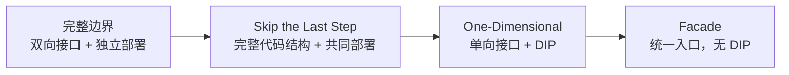
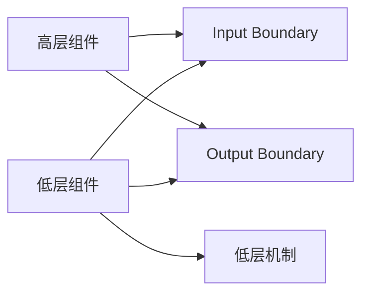
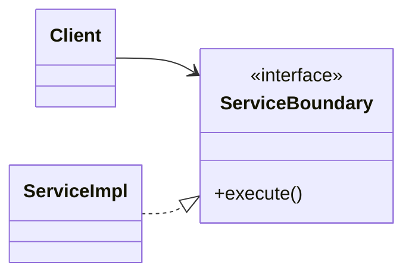
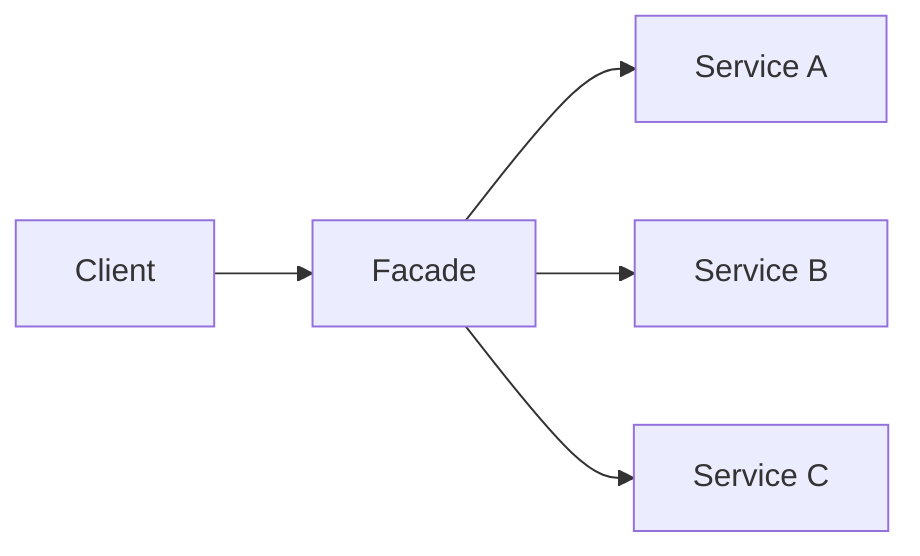

> 原书：Robert C. Martin, *Clean Architecture: A Craftsman's Guide to Software Structure and Design*<br>
> 本章：Chapter 24, Partial Boundaries<br>
> 原文参考：Clean Architecture.md

## 本章导读


前几章不断强调架构边界的价值：

- 把不同变化原因分开；
- 让低层细节依赖高层政策；
- 允许组件独立开发、测试和部署；
- 阻止外部技术变化污染业务核心；
- 为未来选择保留空间。

然而，完整边界并不免费。

一个 Full-Fledged Architectural Boundary，通常需要：

- 双向配套的多态 Boundary Interfaces；
- 独立 Input / Output Data Structure；
- 依赖倒置；
- 数据转换；
- 独立编译与部署结构；
- 版本与发布管理；
- 契约测试和兼容治理。

这些工作不仅初始成本高，后续维护成本也高。

于是，本章提出一个现实问题：

> **如果团队怀疑未来可能需要一条完整边界，但当前收益还不足以支付全部成本，该怎么办？**

答案是 Partial Boundary，也就是部分边界。

作者给出三种由强到弱的示例：

1. **Skip the Last Step**：完整设计隔离结构，但暂时共同编译、共同部署；
2. **One-Dimensional Boundary**：只建立一个方向的 Strategy 接口与依赖倒置；
3. **Facade**：只保留统一入口，连依赖倒置也暂时放弃。



从左向右：

- 实现与治理成本逐渐降低；
- 隔离强度逐渐降低；
- 防止错误依赖的能力逐渐降低；
- 将来升级为完整边界的难度逐渐增加；
- 对团队纪律的依赖逐渐增加。

本章没有数学公式，也没有需要推导的算法。它讨论的是架构判断：

- 未来风险有多可信；
- 当前边界收益有多大；
- 团队愿意支付多少成本；
- 怎样用最小结构保留未来选择；
- 怎样防止部分边界在需求未出现时逐步腐蚀。

## 1. 为什么需要 Partial Boundary

### 1.1 完整边界解决什么问题

一条完整架构边界希望让两侧能够：

- 独立编译；
- 独立测试；
- 独立发布；
- 独立部署；
- 通过稳定契约通信；
- 不知道彼此内部实现。

典型结构可能包含：



具体控制流会随用例而变，但所有跨边界源码依赖都应指向被保护的高层契约。

### 1.2 完整边界的初始成本

建立完整边界通常要设计：

- Input Port；
- Output Port；
- Request Model；
- Response Model；
- Adapter；
- Mapper；
- Composition Root；
- 错误模型；
- 契约测试；
- 模块与构建规则。

如果当前只有一个简单调用，这些结构可能显得远超需求。

### 1.3 完整边界的持续成本

边界建立后还要维护：

- 接口版本；
- 兼容策略；
- 发布说明；
- 独立制品；
- CI Pipeline；
- 依赖版本；
- 安全修补；
- 多组件调试；
- 跨边界测试。

独立部署单元越多，治理成本越明显。

### 1.4 为什么不能什么都做成完整边界

如果每个潜在变化都建立完整边界，系统会充满：

- 一次性接口；
- 只做转发的 Adapter；
- 重复 DTO；
- 复杂组装；
- 无实际消费者的发布单元；
- 难以理解的间接层。

边界本来用于降低生命周期成本，过度边界反而会增加成本。

### 1.5 为什么又不能完全不准备

另一方面，有些位置已经出现可信信号：

- 两部分因不同原因变化；
- 未来可能由不同团队负责；
- 某个实现可能被替换；
- 某能力可能独立部署；
- 外部技术正在污染核心；
- 当前需求尚小，但增长方向明确。

若完全不保留结构，将来拆分可能需要大规模重写。

### 1.6 Partial Boundary 的目标

部分边界试图在两种成本之间折中：

- 不立即支付完整边界的全部治理成本；
- 又不让代码完全失去未来分离的可能。

它是一种 Placeholder，也就是未来边界的占位结构。

### 1.7 Partial 不等于残缺实现

“部分”不是说代码写到一半，也不是临时 TODO。

它表示团队有意识地只实现边界能力的一部分，例如：

- 先控制源码依赖，不独立部署；
- 先保护 Client，不建立反向接口；
- 先隐藏 Service 类，只提供 Facade。

选择应明确，代价应被理解。

### 1.8 部分边界的核心风险

完整物理边界会由编译器、构建系统或进程强制隔离。

部分边界更多依赖：

- 团队纪律；
- 包可见性；
- 代码评审；
- 架构测试；
- 定期复审。

如果没有守卫，开发者会为了短期便利穿过边界。

### 1.9 边界会因熵而退化

需求没有要求独立部署时，团队会自然产生疑问：

- 为什么不能直接调用内部类？
- 为什么还要转换这个模型？
- 为什么不能把一个辅助方法放到另一侧？
- 为什么不能暂时导入具体实现？

每个局部捷径都可能削弱未来分离能力。

### 1.10 本章真正考验架构师什么

不是记住三种模式，而是判断：

- 哪条未来边界足够可能；
- 当前应支付多少准备成本；
- 哪种退化风险可以接受；
- 何时升级为完整边界；
- 何时承认边界不再需要并简化。

## 2. YAGNI 与架构预见之间的张力

### 2.1 什么是 YAGNI

YAGNI 是：

> **You Aren't Going to Need It。你不会需要它。**

它提醒团队：

- 不为猜测需求实现功能；
- 不提前建立无使用者的抽象；
- 不让未来想象拖慢当前交付；
- 用真实需求驱动设计。

### 2.2 为什么 Agile 社区警惕预先设计

历史上，许多项目为假想未来建立：

- 通用框架；
- 插件系统；
- 分布式服务；
- 复杂扩展点；
- 没有使用者的抽象。

这些投入最终没有产生价值，却长期增加维护负担。

### 2.3 架构师看到的另一面

架构师还要考虑：

- 某些依赖一旦扩散，拆除会非常昂贵；
- 数据与框架类型可能快速污染核心；
- 团队增长后边界重构更难；
- 未来独立部署虽然未确定，却可能价值很高。

因此，原书用一句带幽默感的话表达架构师的反应：

> **“Yeah, but I might.”——是的，但我可能会需要。**

### 2.4 YAGNI 并不禁止所有边界

YAGNI 反对没有证据的功能和复杂性，不等于禁止：

- 依赖倒置；
- 信息隐藏；
- 模块封装；
- 低成本可逆设计；
- 对高风险细节的隔离。

边界本身可以是当前质量需求，而不只是未来功能。

### 2.5 怎样避免把猜测伪装成架构

为候选边界记录：

- 预期变化轴；
- 可能的独立性需求；
- 支持证据；
- 当前成本；
- 升级触发条件；
- 下次复审时间。

如果无法说明边界保护什么，它可能只是推测性复杂度。

### 2.6 低成本选项更符合 YAGNI

部分边界的价值在于：

- 不立即实现全部功能；
- 只保留结构选项；
- 允许以后按证据升级；
- 控制当前成本。

它是 YAGNI 与架构预见之间的一种务实折中。

## 3. Skip the Last Step

### 3.1 方案是什么

第一种部分边界几乎完成所有设计工作：

- 双向 Boundary Interface 已存在；
- Input / Output Data Structure 已存在；
- 依赖倒置已完成；
- 两侧理论上可以独立编译和部署。

但团队故意跳过最后一步：

> **仍把两侧编译和部署成同一个组件。**

### 3.2 “最后一步”具体是什么

最后一步通常包括：

- 拆成独立制品；
- 建立独立版本号；
- 建立独立发布 Pipeline；
- 管理兼容矩阵；
- 分配独立部署配置；
- 维护多个 Release。

Skip the Last Step 暂时不承担这些行政与发布成本。

### 3.3 它没有省掉哪些成本

原书明确指出，这种方案没有节省多少代码和前期设计工作。

仍然需要：

- 接口；
- 数据模型；
- Adapter；
- Mapper；
- 依赖管理；
- 边界测试。

因此，它不是廉价编码方案。

### 3.4 它真正节省什么

它节省的是多组件 Administration，尤其是 release management（发布管理）：

- 不追踪多个版本；
- 不维护多个发布说明；
- 不协调版本兼容；
- 不管理多个下载；
- 不分别部署；
- 不处理独立升级顺序。

原书提醒，这个差异不能被轻视。

### 3.5 逻辑边界与物理边界分开

这种方案证明：

- 逻辑上可以完整隔离；
- 物理上可以暂时共同部署。

同一个 `.jar`、可执行文件或部署包内部，可以包含接近完整的架构边界。

### 3.6 FitNesse 的背景

FitNesse 早期采用了这种策略。

团队把 Web Server 组件设计成可与 Wiki 和测试部分分离。

当时考虑：

- 未来可能复用 Web 组件开发其他应用；
- 当前不希望用户下载多个组件。

### 3.7 “Download and Go”目标

FitNesse 的重要目标是：

> **用户只需下载一个 `.jar` 文件并直接执行。**

团队不希望用户：

- 到处寻找依赖 `.jar`；
- 分析版本兼容；
- 组装多个文件；
- 处理复杂安装。

因此，Web 与 Wiki 在架构上准备分离，在发布上仍保持单一组件。

### 3.8 这个选择当时为什么合理

它同时满足：

- 未来复用 Web 组件的可能；
- 当前单文件交付的便利；
- 核心 Wiki 与 Web 机制的逻辑隔离；
- 不增加用户版本管理负担。

### 3.9 FitNesse 案例暴露的危险

后来，独立 Web 组件的需求一直没有出现。

随着时间推移：

- 分离价值不再被日常需求强化；
- 开发者开始跨越边界；
- 错误方向的依赖逐渐增加；
- Web 与 Wiki 再次纠缠。

如今要重新拆开会比较费力。

### 3.10 为什么共同部署容易腐蚀边界

共同组件中：

- 内部类随手可见；
- 编译器不会阻止错误引用；
- 直接调用比经过接口方便；
- 没有独立发布失败提醒团队；
- 边界收益长期不可见。

物理隔离缺失后，纪律成为主要防线。

### 3.11 怎样守住这种边界

可以使用：

- 独立 Package / Module；
- 限制内部可见性；
- 禁止跨包 Import；
- 架构测试；
- Build Rule；
- 代码所有权；
- 定期依赖图审查；
- 偶尔进行可提取性演练。

### 3.12 可提取性演练

团队可以定期尝试：

1. 单独构建候选组件；
2. 检查是否存在反向 Import；
3. 列出需要补充的依赖；
4. 验证公共接口是否足够；
5. 不真正独立发布，只确认分离仍可行。

这能提前发现边界腐蚀。

### 3.13 何时适合这种方案

适合情况：

- 独立部署未来较可信；
- 核心与细节确实有不同变化轴；
- 当前用户需要单一部署物；
- 多版本治理收益尚不足；
- 团队愿意承担完整接口与模型成本。

### 3.14 何时不适合

不适合情况：

- 边界需求只有模糊猜测；
- 系统生命周期很短；
- 两侧总是共同变化；
- 完整接口成本已超过潜在价值；
- 团队没有能力维护逻辑隔离。

### 3.15 升级为完整边界的路径

如果未来触发独立发布需求：

1. 把两侧拆成独立 Build Target；
2. 为组件建立版本；
3. 建立独立发布流程；
4. 增加兼容与契约测试；
5. 调整部署和配置；
6. 保持原有接口与数据结构。

因为代码边界已完成，主要新增的是制品与治理工作。

## 4. One-Dimensional Boundaries

### 4.1 完整边界为何是双向的

完整边界经常需要 Reciprocal Interfaces，也就是相互配套的边界接口。

原因是控制流可能：

- 从 Client 进入 Service；
- 从 Service 返回输出；
- 由高层调用低层插件；
- 由低层通知高层。

要让所有源码依赖向正确方向，可能需要 Input Port 与 Output Port。

### 4.2 双向隔离的成本

双向接口意味着更多：

- 类型；
- 数据模型；
- 适配器；
- 测试；
- 组装；
- 契约维护。

如果当前只需要一个方向的调用，完整结构可能过重。

### 4.3 单向边界的结构


原书用传统 Strategy Pattern 展示一维边界：

- `Client` 依赖 `ServiceBoundary`；
- `ServiceImpl` 实现 `ServiceBoundary`；
- Client 不直接依赖 ServiceImpl。



### 4.4 它保留了什么

这套结构已经具备关键的 Dependency Inversion：

- Client 依赖抽象；
- 具体实现反向依赖接口；
- 实现可以替换；
- 测试可以提供 Fake；
- 未来可以扩展为完整边界。

### 4.5 为什么称为 One-Dimensional

它主要保护一个方向：

- Client 不知道 ServiceImpl。

但没有建立对另一个方向的同等隔离，例如：

- ServiceImpl 是否知道 Client；
- 回调是否通过独立 Output Port；
- 反向数据是否使用隔离模型。

### 4.6 Nasty Dotted Arrow

原书 Figure 24.1 用一条令人不快的虚线箭头表示 Backchannel，也就是后门依赖。

在缺少 Reciprocal Interface 时，ServiceImpl 可能直接：

- 导入 Client；
- 调用 Client 内部方法；
- 读取 Client 数据；
- 依赖 Client 具体类型。

于是边界变成双向耦合。

### 4.7 Backchannel 的后果

后门依赖会造成：

- 组件环；
- Client 与 ServiceImpl 锁步变化；
- 测试难以隔离；
- 未来独立部署困难；
- 接口失去保护意义。

### 4.8 为什么编译器未必阻止它

如果 Client、ServiceBoundary、ServiceImpl 位于同一 Build Target：

- 名称都可见；
- 直接 Import 合法；
- 没有物理组件禁止反向依赖。

边界需要开发者与架构师保持纪律。

### 4.9 怎样防止 Backchannel

可以使用：

- ServiceImpl 所在模块禁止依赖 Client 模块；
- 包级可见性；
- 架构规则测试；
- 依赖图检查；
- 代码评审清单；
- 明确接口所有权。

### 4.10 接口应该由谁拥有

`ServiceBoundary` 应位于需要被保护的 Client 或高层政策一侧。

若接口由 ServiceImpl 模块定义，Client 仍需依赖低层包，方向并未真正倒置。

### 4.11 如何增加反向通信

如果 Service 需要把结果或事件返回 Client，不应直接建立 Backchannel。

可以在高层一侧新增：

- Output Port；
- Callback Interface；
- Event Sink；
- Response Model。

ServiceImpl 实现或调用这些高层契约，逐步升级为完整边界。

### 4.12 何时适合一维边界

适合情况：

- 当前控制流主要单向；
- 需要替换 ServiceImpl；
- 测试需要 Fake；
- 独立部署尚不需要；
- 未来边界有一定可能；
- 团队能用规则防止反向依赖。

### 4.13 它比 Skip the Last Step 省了什么

与第一种方案相比，它可以暂时省去：

- Reciprocal Interface；
- 部分 Output Model；
- 完整双向 Adapter；
- 一部分边界组装与测试。

代价是隔离只完成一个方向。

### 4.14 它怎样演化为完整边界

演化步骤可能是：

1. 保留现有 `ServiceBoundary`；
2. 增加 Output Port；
3. 建立独立 Input / Output Model；
4. 清除所有 Backchannel；
5. 拆成独立 Build Target；
6. 最后按需独立发布和部署。

## 5. Facades

### 5.1 最简单的部分边界

Facade Pattern 提供比一维边界更简单的占位结构。

它建立一个统一入口，但放弃 Dependency Inversion。

### 5.2 Figure 24.2 的结构


- `Client` 依赖 `Facade`；
- `Facade` 列出可用 Service 方法；
- Facade 把调用分派到内部 Service Class；
- Client 按约定不直接访问这些 Service。



### 5.3 Facade 提供什么

它可以：

- 隐藏内部类数量；
- 提供统一 API；
- 简化 Client 使用；
- 集中编排低层调用；
- 给未来重构留下单一入口。

### 5.4 它放弃什么

没有高层拥有的 `ServiceBoundary` Interface：

- Client 直接依赖具体 Facade；
- Facade 直接依赖具体 Service；
- 源码依赖没有倒置；
- Service 变化可能沿依赖传给 Client。

### 5.5 什么是 Transitive Dependency

虽然 Client 没有直接 Import 每个 Service，它仍通过 Facade 间接依赖所有 Service。

依赖路径是：

```text
Client → Facade → Service Classes
```

因此，Client 的编译闭包包含这些 Service。

### 5.6 静态语言中的重新编译影响

原书指出，在静态类型语言中，某个 Service 源码变化可能迫使：

- Facade 重新编译；
- Client 也重新编译。

Facade 隐藏了使用方式，却没有形成独立编译防火墙。

### 5.7 Facade 与信息隐藏

Facade 可以隐藏内部 API，减少 Client 对许多类的直接认识。

但如果：

- 内部类仍公开可见；
- 包规则允许直接访问；
- Client 能轻易绕过 Facade；

信息隐藏只靠约定。

### 5.8 Backchannel 更容易产生

Client 可能为了一个 Facade 未暴露的方法而直接调用 Service。

Service 也可能反向引用 Client。

由于缺少多态接口与独立组件，没有结构阻止这些捷径。

### 5.9 Facade 与 Adapter 的区别

**Facade：**

- 为一组内部 Service 提供简化入口；
- 通常不改变依赖方向；
- 主要降低使用复杂度。

**Adapter：**

- 转换两种接口或数据模型；
- 常位于架构边界；
- 可以配合 DIP 保护内层。

两者可以组合，但不能混为一谈。

### 5.10 Facade 与 Gateway 的区别

Gateway 通常由应用侧需要塑造，并可通过接口倒置外部数据源。

Facade 可能只是对具体 Service 集合的方便包装。

如果 Facade Interface 由高层拥有、低层实现，它就开始向 Strategy / Gateway 结构演化。

### 5.11 何时 Facade 足够

适合情况：

- 当前只需要简化内部 API；
- Client 与 Service 共同发布；
- 实现替换需求很低；
- 边界风险不高；
- 系统生命周期有限；
- 团队希望为未来重构留下入口。

### 5.12 何时 Facade 不够

不适合情况：

- 高层必须免受 Service 变化；
- 需要替换实现；
- 需要独立测试 Client；
- 未来独立部署可信；
- Service 由外部团队维护；
- 传递依赖成本已经很高。

### 5.13 怎样从 Facade 演化

可以逐步：

1. 从 Client 的需要提取 `ServiceBoundary`；
2. 让 Facade 或 ServiceImpl 实现接口；
3. 把接口移动到高层一侧；
4. 禁止 Client 直接访问内部 Service；
5. 需要时增加 Output Port；
6. 最终拆分独立组件。

### 5.14 Facade 退化的信号

- Client 大量绕过 Facade；
- Facade 暴露内部 Service 类型；
- Facade 方法只是无意义转发；
- Service 反向依赖 Client；
- 一个 Service 修改导致大范围重编译；
- Facade 逐渐成为包含业务规则的巨型类。

## 6. 三种 Partial Boundary 的对比

### 6.1 核心能力对比

| 方案 | 双向接口 | 依赖倒置 | 独立部署 | 统一入口 |
| --- | --- | --- | --- | --- |
| 完整边界 | 有 | 完整 | 有 | 通常有 |
| Skip the Last Step | 有 | 完整 | 暂时没有 | 有 |
| One-Dimensional | 只有一个主要方向 | 部分 | 没有 | 有接口入口 |
| Facade | 没有 | 没有 | 没有 | 有 |

### 6.2 成本对比

| 方案 | 初始代码成本 | 发布治理成本 | 日常纪律要求 |
| --- | --- | --- | --- |
| 完整边界 | 高 | 高 | 中等，工具可强制 |
| Skip the Last Step | 高 | 低于完整边界 | 高 |
| One-Dimensional | 中等 | 低 | 高 |
| Facade | 低 | 低 | 很高 |

### 6.3 隔离强度对比

| 方案 | 防止实现泄漏 | 防止 Backchannel | 编译隔离 | 未来拆分便利 |
| --- | --- | --- | --- | --- |
| 完整边界 | 强 | 强 | 强 | 已完成 |
| Skip the Last Step | 较强 | 取决于模块守卫 | 较弱 | 较容易 |
| One-Dimensional | 保护 Client 一侧 | 较弱 | 较弱 | 中等 |
| Facade | 仅隐藏常用入口 | 很弱 | 弱 | 较困难 |

### 6.4 没有免费方案

成本降低意味着某种保护被放弃：

- 少一个接口，就多依赖团队纪律；
- 少一个数据模型，就更容易泄漏类型；
- 不拆组件，就失去编译和发布强制；
- 不做 DIP，就保留传递依赖。

### 6.5 选择不是永久决定

团队可以：

- 从 Facade 升级为 Strategy；
- 从 Strategy 增加 Reciprocal Interface；
- 从共同部署升级到独立组件；
- 发现边界无价值后反向简化。

架构应随证据演化。

## 7. 边界为什么会退化

### 7.1 缺少当前收益

如果独立部署从未发生，开发者看不到维护接口的即时价值。

长期目标会输给当前便利。

### 7.2 时间压力

紧急需求常产生：

- 临时 Import；
- 直接调用；
- 复用内部 DTO；
- 绕过 Facade；
- 反向回调。

临时方案若不清理，就成为永久耦合。

### 7.3 人员变化

新成员可能不知道：

- 边界为何存在；
- 未来拆分计划；
- 禁止依赖方向；
- 接口所有权。

只存在于口头历史中的边界很难长期维持。

### 7.4 工具没有强制

同一 Build Target 中，错误依赖仍能编译。

如果 CI 不检查，架构规则容易被忽略。

### 7.5 边界设计过重

如果每次简单修改都要更新许多无价值 DTO 和接口，开发者会主动绕过结构。

退化有时说明边界成本确实不合理，而不只是团队不自律。

### 7.6 边界意图不清

名称如 `CommonBoundary`、`GenericService` 无法告诉开发者：

- 哪一侧高层；
- 保护什么政策；
- 禁止什么依赖；
- 未来为何可能拆分。

### 7.7 防止退化的工程手段

- 明确模块所有权；
- 文档化依赖方向；
- 自动架构测试；
- 最小化边界 API；
- 定期检查循环依赖；
- 记录升级触发条件；
- 删除已证明无价值的边界。

## 8. 选择 Partial Boundary 的决策方法

### 8.1 第一步：识别变化轴

询问：

- 两侧是否因不同原因变化？
- 是否由不同角色驱动？
- 是否存在不同发布节奏？
- 是否有稳定高层与易变低层？

没有变化轴，就很难证明边界价值。

### 8.2 第二步：识别未来独立性需求

可能包括：

- 独立团队；
- 独立构建；
- 独立发布；
- 独立部署；
- 独立伸缩；
- 实现替换；
- 第三方插件。

### 8.3 第三步：评估证据强度

**弱证据：**

- “以后可能有用”；
- “大家都这样做”；
- “看起来更企业级”。

**强证据：**

- 已有第二个实现；
- 团队即将拆分；
- 发布频率已经分化；
- 技术污染正在扩散；
- 独立部署在路线图中；
- 当前耦合已经造成问题。

### 8.4 第四步：选择最便宜的足够方案

- 只需统一入口：Facade；
- 需要替换 ServiceImpl 与测试 Fake：One-Dimensional；
- 逻辑独立已非常重要，但暂不独立发布：Skip the Last Step；
- 独立发布和部署已是现实需求：完整边界。

### 8.5 第五步：明确放弃了什么

选择 Facade 时要承认：

- 没有 DIP；
- 有传递依赖；
- 编译隔离弱。

选择 One-Dimensional 时要承认：

- Backchannel 仍可能出现；
- 反向通信未隔离。

选择共同部署时要承认：

- 物理强制不足；
- 边界可能腐蚀。

### 8.6 第六步：安装相称守卫

Facade 可以配合：

- 内部类不可见；
- 禁止绕过入口。

One-Dimensional 可以配合：

- 禁止 ServiceImpl 依赖 Client；
- 依赖图测试。

Skip the Last Step 可以配合：

- 独立模块 Build；
- 可提取性检查。

### 8.7 第七步：定义升级触发器

例如：

- 出现第二个实现；
- 需要独立版本；
- 团队所有权分离；
- 反向依赖开始增加；
- 发布频率明显不同；
- 需要独立部署或伸缩。

### 8.8 第八步：定义删除触发器

如果长期观察到：

- 两侧总是一起变化；
- 没有独立消费者；
- 没有替换需求；
- 边界维护持续妨碍开发；

可以合并或简化，而不是永久维护猜测。

## 9. 一个通知模块示例

### 9.1 初始需求

订单系统完成下单后发送电子邮件通知。

当前只有一个邮件实现，所有代码共同部署。

未来可能增加：

- 短信；
- 推送；
- 独立通知服务。

### 9.2 使用 Facade

建立 `NotificationFacade`：

- `sendOrderConfirmation`；
- 内部调用邮件 Service。

收益：

- Order Use Case 只有一个入口；
- 内部邮件类可以隐藏。

限制：

- Client 仍传递依赖具体邮件 Service；
- 没有方便的 Fake Interface；
- 未来替换需继续重构。

### 9.3 使用 One-Dimensional Boundary

由订单应用定义 `NotificationBoundary`：

- Order Use Case 依赖接口；
- Email Service 实现接口；
- 测试使用 Fake。

收益：

- Client 与具体邮件实现隔离；
- 可增加短信实现。

风险：

- 邮件实现可能反向依赖订单内部类；
- 输出与错误模型尚未完整隔离。

### 9.4 使用 Skip the Last Step

进一步建立：

- Request / Response Model；
- Output Port；
- 错误契约；
- 独立模块规则。

但仍与订单系统打包成一个部署物。

收益：未来独立通知组件更容易。

成本：当前就要维护完整逻辑边界。

### 9.5 使用完整边界

通知成为：

- 独立制品；
- 独立版本；
- 独立发布；
- 可能独立服务。

只有当团队、部署、伸缩或故障隔离要求出现时，这个成本才值得。

### 9.6 这个例子说明什么

同一业务位置可以采用不同边界强度。

正确答案取决于：

- 当前真实需求；
- 未来证据；
- 团队能力；
- 变化成本；
- 可接受退化风险。

## 10. 与前面原则的关系

### 10.1 与 SRP 的关系

Single Responsibility Principle 帮助识别边界两侧不同变化原因。

Partial Boundary 决定当前把这条变化轴实现到什么强度。

### 10.2 与 CCP 的关系

Common Closure Principle 让共同变化的代码聚在一侧。

如果两侧长期总是共同变化，部分边界可能没有价值。

### 10.3 与 DIP 的关系

One-Dimensional Boundary 已应用部分 Dependency Inversion。

Facade 则明确牺牲 DIP，以换取更低成本。

### 10.4 与 ADP 的关系

Backchannel 可能形成依赖环。

即使部分边界不独立部署，组件图仍应监控环。

### 10.5 与 ISP 的关系

`ServiceBoundary` 应围绕 Client 需要设计。

过宽接口会让部分边界携带无关能力，并加快退化。

### 10.6 与 REP 的关系

Skip the Last Step 暂时不把逻辑边界变成独立 Release Unit。

当复用与发布需求出现时，才完成 REP 意义上的独立组件。

### 10.7 与 YAGNI 的关系

Partial Boundary 不应成为规避 YAGNI 的借口。

它只在：

- 未来边界有合理证据；
- 当前保留选项成本可控；
- 退化风险有守卫；

时成立。

## 11. 易混淆概念与常见误解

### 11.1 “Partial Boundary 是没做完的架构”

错误。它是有意识地只购买部分隔离能力，并明确接受剩余风险。

### 11.2 “YAGNI 禁止任何预见性设计”

错误。YAGNI 反对无证据复杂性，不反对低成本、保护核心的可逆结构。

### 11.3 “Skip the Last Step 是最便宜方案”

错误。它仍支付完整接口、数据结构和设计成本，只节省多组件发布治理。

### 11.4 “同一 `.jar` 中不存在架构边界”

错误。逻辑边界与部署边界可以分开，单一制品中可以有完整源码隔离。

### 11.5 “已经设计成可拆分，就永远容易拆”

错误。FitNesse 表明共同部署下的错误依赖会逐渐腐蚀边界。

### 11.6 “One-Dimensional Boundary 已保证双向隔离”

错误。它主要保护 Client 对 ServiceImpl 的依赖，反向 Backchannel 仍需纪律阻止。

### 11.7 “有一个 Interface 就是完整边界”

错误。完整边界还可能需要 Output Port、数据模型、独立构建与发布治理。

### 11.8 “Strategy Pattern 自动阻止组件环”

错误。ServiceImpl 仍可能反向依赖 Client，形成 Nasty Dotted Arrow。

### 11.9 “Facade 已经解耦 Client 与 Service”

不完整。Facade 简化了访问，却保留 Client 对 Service 的传递源码依赖。

### 11.10 “Facade 与 Adapter 是同一种模式”

错误。Facade 简化内部 API；Adapter 转换接口或数据，并可配合 DIP 建立边界。

### 11.11 “Facade 一定是坏架构”

错误。低风险、共同部署、只需统一入口的场景中，它是合理低成本方案。

### 11.12 “部分边界最终必须升级为完整边界”

错误。它可能长期足够，也可能证明不需要并被简化。

### 11.13 “边界退化只说明开发者不自律”

不一定。边界过重、意图不清或收益不存在，也会促使团队绕过它。

### 11.14 “架构测试可以替代模块隔离”

错误。架构测试是守卫之一；物理模块、访问控制和团队理解仍然重要。

### 11.15 “独立编译就等于独立部署”

错误。构建、版本、发布、配置和运行生命周期还需要额外治理。

### 11.16 “独立部署就一定要微服务”

错误。DLL、`.jar`、Gem 或插件都可以是独立部署组件，未必通过网络通信。

### 11.17 “未来可能有第二实现就必须现在抽象”

错误。需要评估概率、替换成本和当前接口成本，模糊可能性不足以证明边界。

### 11.18 “更多 Partial Boundary 会保留更多选项”

理论上选项增加，实际也增加认知和维护成本。错误边界会减少开发速度与可理解性。

### 11.19 “共同部署不需要版本概念”

内部模块可不独立版本，但整体制品仍需版本；未来拆分时才增加模块版本治理。

### 11.20 “一旦出现 Backchannel，只能立即拆成服务”

错误。可以先修复源码依赖、增加 Output Port 或模块规则，不必升级到网络边界。

## 12. 实践检查与掌握练习

### 12.1 候选边界检查

- 两侧因什么不同原因变化？
- 是否有真实独立性需求？
- 支持未来边界的证据是什么？
- 当前边界成本是什么？
- 不建立边界的最坏后果是什么？

### 12.2 Skip the Last Step 检查

- 双向接口与 Input / Output Model 是否完整？
- 是否仍能理论上独立构建？
- 错误方向 Import 是否被自动阻止？
- 为什么当前仍共同部署？
- 可提取性上次何时验证？
- 多组件治理何时值得开启？

### 12.3 One-Dimensional 检查

- `ServiceBoundary` 是否由 Client / 高层拥有？
- Client 是否完全不知道 ServiceImpl？
- ServiceImpl 是否出现反向依赖？
- 是否需要 Output Port？
- Fake 是否遵守真实实现语义？
- 架构测试是否阻止 Backchannel？

### 12.4 Facade 检查

- Facade 是否提供有意义的统一 API？
- Client 是否绕过 Facade？
- Facade 是否泄漏内部 Service 类型？
- 传递依赖是否可接受？
- 是否需要实现替换与独立测试？
- 何时升级为 Strategy？

### 12.5 退化检查

- 最近是否新增错误方向依赖？
- 是否有临时捷径未清理？
- 边界意图是否仍被团队理解？
- 当前收益是否仍存在？
- 边界是否太重而被普遍绕过？
- 是否应升级、修复或删除？

### 12.6 场景判断一：完整接口但一个制品

两个模块有 Input / Output Port 和独立模型，却共同打进一个 `.jar`。

**判断：** 属于 Skip the Last Step；逻辑边界完整，发布边界尚未完成。

### 12.7 场景判断二：Client 依赖接口，Impl 反向导入 Client

**判断：** One-Dimensional Boundary 已产生 Backchannel，应新增高层回调契约或重组依赖。

### 12.8 场景判断三：Client 只调用 Facade

但 Facade 与所有 Service 共同编译，Service 修改触发 Client 重编译。

**判断：** Facade 简化 API，却未提供编译隔离，符合原书警告。

### 12.9 场景判断四：未来边界五年未出现

逻辑隔离持续被绕过，维护成本高。

**判断：** 不应只责怪团队；应重新评估边界，选择修复、简化或删除。

### 12.10 场景判断五：即将拆出独立团队

当前已有 Strategy Interface，但缺少反向契约与独立发布。

**判断：** 证据增强，可以升级到完整接口与独立组件。

### 12.11 场景判断六：短命内部工具

只有一个实现、一个团队、统一部署，Facade 足以提供清楚入口。

**判断：** 不必为了理论纯度建立完整边界。

### 12.12 场景判断七：支付供应商可能替换

支付规则重要，供应商 SDK 易变，测试需要 Fake。

**判断：** 至少值得 One-Dimensional Boundary；是否完整部署隔离取决于团队和运行需求。

### 12.13 场景判断八：独立插件已被外部客户使用

**判断：** Partial Boundary 已不足，应建立版本、发布、兼容和独立制品治理。

### 12.14 快速复述练习

能够回答以下问题，基本就掌握了本章：

1. 完整架构边界为什么昂贵？
2. 初始代码成本与持续治理成本分别是什么？
3. Partial Boundary 想解决什么矛盾？
4. YAGNI 为什么反对推测性设计？
5. “Yeah, but I might”表达架构师的什么担忧？
6. Partial Boundary 为什么不一定违反 YAGNI？
7. Skip the Last Step 做了哪些完整准备？
8. 它跳过的最后一步是什么？
9. 它真正节省了哪些成本？
10. FitNesse 为什么同时保持 Web / Wiki 分离和单一 `.jar`？
11. Download and Go 是什么目标？
12. FitNesse 的边界后来为何退化？
13. 怎样守住共同部署中的逻辑边界？
14. One-Dimensional Boundary 使用什么模式？
15. `Client`、`ServiceBoundary`、`ServiceImpl` 怎样依赖？
16. 这套结构保留了什么能力？
17. 为什么它只能算一维边界？
18. Nasty Dotted Arrow 表示什么？
19. Backchannel 会造成什么后果？
20. 怎样升级成双向完整边界？
21. Facade 提供什么能力？
22. Facade 放弃了什么？
23. Client 为什么仍传递依赖所有 Service？
24. Facade 与 Adapter 有什么区别？
25. 三种部分边界的成本与隔离强度如何排列？
26. 为什么边界会随时间退化？
27. 如何为候选边界选择最便宜的足够方案？
28. 哪些信号触发升级为完整边界？
29. 哪些信号说明应删除边界？
30. 架构师在 Partial Boundary 决策中承担什么职责？

### 12.15 一分钟记忆卡

- **问题：** 完整边界昂贵，但未来可能需要隔离。
- **折中：** Partial Boundary 只购买当前值得的边界能力。
- **YAGNI：** 不为模糊未来实现完整复杂性，但可保留低成本选项。
- **Skip Last Step：** 完整代码隔离，共同编译与部署。
- **FitNesse：** Web / Wiki 逻辑可分，仍坚持单一 `.jar` 的 Download and Go。
- **风险：** 共同部署让错误依赖逐渐侵蚀边界。
- **One-Dimensional：** Client 依赖 `ServiceBoundary`，ServiceImpl 实现接口。
- **风险：** 没有 Reciprocal Interface，Backchannel 仍可能出现。
- **Facade：** 统一入口但无 DIP，Client 保留传递依赖。
- **选择：** 成本越低，隔离越弱，对纪律依赖越高。
- **职责：** 架构师决定边界位置，以及完整、部分还是暂不实现。

## 13. 本章总结

1. 第 24 章讨论完整架构边界成本过高时，如何使用 Partial Boundary 保留未来选项。
2. 完整边界需要相互配套的多态 Boundary Interface、Input / Output Data Structure 和依赖管理。
3. 完整边界还要支持两侧独立编译和部署。
4. 初始工作包括接口、模型、Adapter、Mapper、组装和测试。
5. 持续工作包括版本、发布、兼容、制品、CI 和跨组件治理。
6. 不是所有潜在变化都值得立即支付完整边界成本。
7. 完全不准备又可能让低层依赖扩散，使未来拆分昂贵。
8. Partial Boundary 是未来完整边界的有意识占位结构，不是没完成的代码。
9. 部分边界只实现某些隔离能力，并明确接受未解决风险。
10. 它比完整物理边界更依赖团队纪律、架构测试与模块规则。
11. YAGNI 即 You Aren't Going to Need It，反对没有证据的未来功能与复杂性。
12. 原书用“Yeah, but I might”表达架构师对未来高成本变化的顾虑。
13. YAGNI 不禁止低成本依赖倒置、信息隐藏和可逆模块设计。
14. 候选边界应记录变化轴、证据、成本、升级触发器和复审时间。
15. 第一种部分边界是 Skip the Last Step。
16. 它完成独立编译部署所需的接口、数据结构与依赖倒置设计。
17. 但两侧暂时仍共同编译和部署成一个组件。
18. 它没有节省多少代码和前期设计成本。
19. 它真正节省的是多组件版本、发布、兼容和下载管理成本。
20. FitNesse 早期把 Web Server 设计成可与 Wiki / Testing 部分分离。
21. 团队希望未来可能复用 Web 组件，又不希望用户下载多个组件。
22. Download and Go 要求用户下载一个 `.jar` 后即可执行。
23. 因此 FitNesse 保持逻辑分离，却共同发布为单一制品。
24. 独立 Web 组件需求长期未出现后，边界逐渐失去日常价值。
25. 错误方向依赖开始穿越边界，后来重新拆分变得困难。
26. 共同部署中的逻辑边界需要 Package Visibility、架构测试和依赖图等守卫。
27. 定期可提取性演练可以在真正拆分前发现腐蚀。
28. 第二种部分边界是 One-Dimensional Boundary。
29. 完整边界通过 Reciprocal Interface 维护双向隔离，一维边界只建立主要方向接口。
30. 原书用 Strategy Pattern 展示 `Client`、`ServiceBoundary` 与 `ServiceImpl`。
31. Client 依赖 ServiceBoundary，ServiceImpl 实现 ServiceBoundary。
32. 这已经倒置 Client 对具体实现的依赖，并支持替换与 Fake。
33. 但缺少反向接口时，ServiceImpl 仍可能直接依赖 Client。
34. Figure 24.1 的 Nasty Dotted Arrow 表示这种 Backchannel。
35. Backchannel 会形成双向耦合、组件环、锁步变化和测试困难。
36. 同一 Build Target 中，编译器通常不会阻止这种错误依赖。
37. 包规则、架构测试和代码评审必须守住一维边界。
38. 需要反向通信时，应增加高层拥有的 Output Port、Callback 或 Event Sink。
39. 一维边界可以逐步补齐模型、反向端口和独立组件，演化为完整边界。
40. 第三种部分边界是 Facade Pattern。
41. Facade 为一组 Service 提供统一入口，并把调用分派到内部类。
42. Facade 简化 Client 使用并隐藏内部类数量。
43. Facade 放弃 Dependency Inversion，Client 直接依赖具体 Facade。
44. Facade 又直接依赖具体 Service，因此 Client 传递依赖这些 Service。
45. 静态语言中 Service 变化可能迫使 Facade 和 Client 重新编译。
46. Facade 边界很容易被 Client 直连 Service 或 Service 反向依赖 Client 的后门破坏。
47. Facade 主要简化 API；Adapter 主要转换接口与数据并可配合 DIP。
48. Facade 适合共同发布、低替换需求、只需统一入口的低风险场景。
49. 可以从 Client 需要提取接口，让 Facade 实现它，从而升级为 Strategy 边界。
50. 完整边界、Skip the Last Step、One-Dimensional、Facade 的成本依次降低。
51. 同时，它们的隔离强度、编译保护和未来拆分便利也依次降低。
52. 成本降低没有免费午餐：少接口和少组件意味着更多风险由团队纪律承担。
53. 部分边界会因缺少当前收益、时间压力、人员变化和工具未强制而退化。
54. 边界普遍被绕过也可能说明设计过重或意图不清，而不只是开发者不自律。
55. 选择前应识别变化轴、未来独立性需求和证据强度。
56. 只需统一入口可选 Facade，需要实现替换可选 One-Dimensional。
57. 逻辑独立重要但暂不独立发布，可选 Skip the Last Step。
58. 独立发布和部署已成为现实需求时，应采用完整边界。
59. 每种选择都应明确放弃的保护、安装相称守卫，并定义升级与删除触发器。
60. Partial Boundary 可以升级、长期保留，也可以在证明无价值后简化。
61. SRP / CCP 帮助发现变化轴，DIP 决定依赖方向，ADP 防止 Backchannel 成环。
62. ISP 帮助保持 ServiceBoundary 面向 Client 需要，REP 决定何时成为独立发布单元。
63. 架构师的重要职责之一，是判断未来哪里可能出现边界，以及现在应完整、部分还是暂不实现。
64. 本章最终原则是：用最便宜的结构购买当前需要的隔离，同时诚实面对未购买的保护与边界退化风险。
