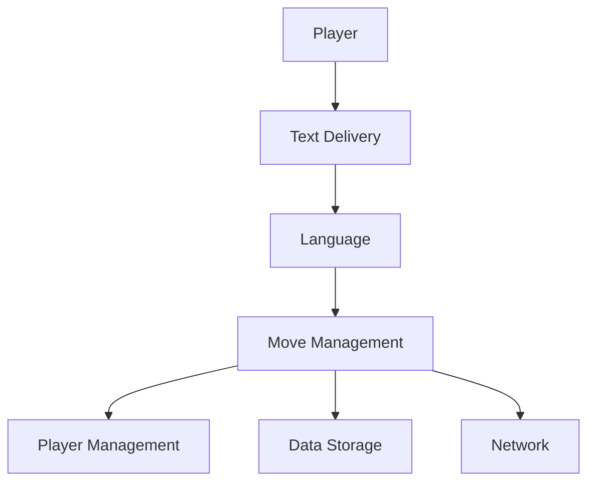
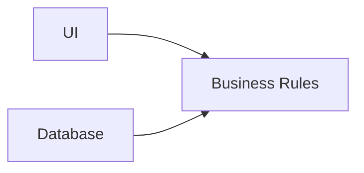
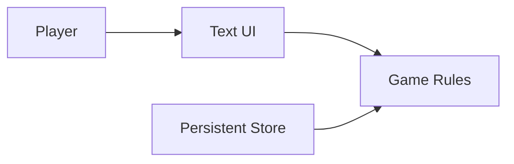
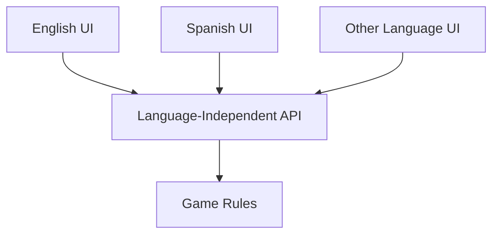
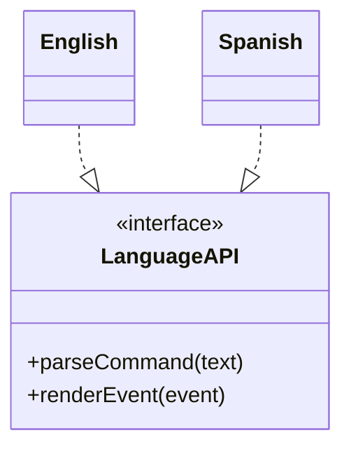
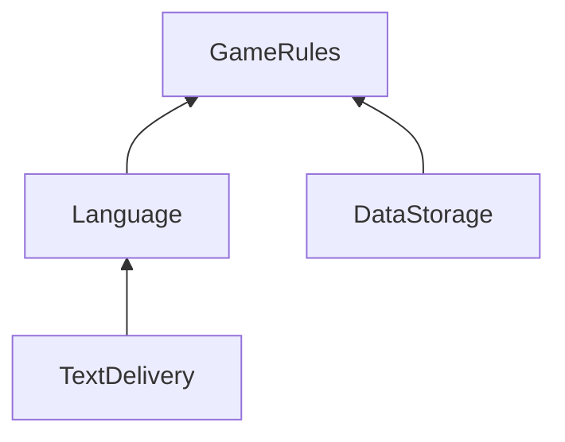
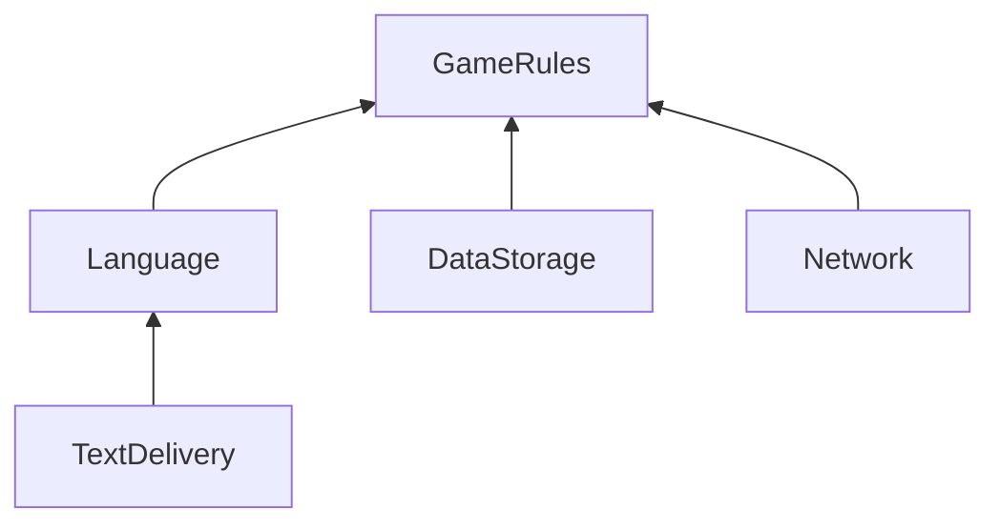
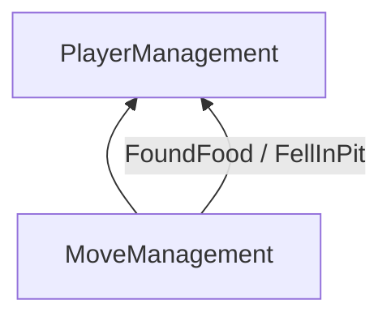

> 原书：Robert C. Martin, *Clean Architecture: A Craftsman's Guide to Software Structure and Design* 
> 本章：Chapter 25, Layers and Boundaries 
> 原文参考：Clean Architecture.md

## 本章导读

很多系统一开始都可以画成经典三层：

- UI；
- Business Rules；
- Database。

对于某些简单程序，这已经足够。

但第 25 章要说明：

> **大多数真实系统的变化轴远不止“界面、业务、数据库”三个，因此架构边界通常也不止三条。**

作者选择 1972 年的文字冒险游戏 *Hunt the Wumpus* 作为分析对象。

这个游戏的基本交互很简单：

- 玩家输入 `GO EAST`；
- 玩家输入 `SHOOT WEST`；
- 系统告诉玩家看见、听见、闻到或经历了什么；
- 玩家在洞穴中寻找 Wumpus，同时避开陷阱、深坑和其他危险。

看上去，它只需要：

- 一个文字 UI；
- 一组游戏规则；
- 一种游戏状态存储。

作者却逐步追问：

1. UI 的自然语言会不会变化？
2. 文本通过 Shell、SMS 还是 Chat 传递，会不会变化？
3. 游戏状态存在 RAM、Flash 还是 Cloud，会不会变化？
4. 多人游戏是否需要 Network Stream？
5. 地图移动规则与玩家生命、胜负规则是否属于同一政策层级？
6. 如果两组规则部署在客户端与服务器，是否需要完整服务边界？

随着问题展开，三层图逐步演化为多个独立 Stream 和多级 Policy。

这不是在鼓励为小游戏制造大量层和服务。

原书明确说明：这个游戏可能只需约 200 行 Kornshell 代码，现实中不应套用完整 Clean Architecture。作者故意把简单问题放大，是为了用它代替一个真正庞大的系统，让潜在变化轴和边界决策更容易观察。

本章真正讨论的是架构师的核心困境：

- 边界到处都可能存在；
- 完整边界很昂贵；
- 过早实现会过度工程；
- 太晚实现又会导致昂贵重构；
- 决策不能只在项目开始时做一次；
- 架构师必须持续观察摩擦，并在正确时机采取行动。

作者最后给出的标准不是固定公式，而是一个动态判断：

> **当实现边界的成本开始低于继续忽略边界的成本时，就到达了应当行动的拐点。**

## 1. 为什么经典三层通常不够

### 1.1 最自然的系统分解

当人们第一次分析软件时，很容易得到三个组件：

1. UI 负责接收用户输入并显示输出；
2. Business Rules 负责执行系统政策；
3. Database 负责持久化状态。

箭头表示源码依赖应指向业务规则，而不是数据流方向。

### 1.2 三层为什么有吸引力

它具有几个优点：

- 直观；
- 容易讲解；
- 能隔离最明显的 UI 与 Database；
- 适合许多小型 CRUD 应用；
- 与常见框架结构接近。

### 1.3 三层模型隐藏了什么

每一层内部都可能包含多个变化轴。

**UI 内部：**

- 自然语言；
- 交互渠道；
- 展示设备；
- 输入协议；
- 本地化政策。

**Business Rules 内部：**

- 用例编排；
- 核心领域政策；
- 不同政策层级；
- 不同运行位置；
- 不同团队所有权。

**Database 内部：**

- 存储介质；
- 数据格式；
- 缓存；
- 云服务；
- 持久化策略。

### 1.4 “层”不是天然不可再分的东西

一个层只是当前分析粒度下的组件集合。

当我们发现其中两部分：

- 因不同原因变化；
- 由不同 actor 驱动；
- 需要独立替换；
- 可能独立部署；
- 具有不同政策层级；

这个层就可能需要继续拆分。

### 1.5 不是所有潜在分割都值得实现

发现变化轴，只说明存在候选边界。

还要考虑：

- 变化是否真实发生；
- 分离收益多大；
- 接口成本多高；
- 团队是否需要独立；
- 系统寿命多长；
- 边界是否会被维护。

本章会不断区分“可能存在边界”和“现在应完整实现边界”。

## 2. Hunt the Wumpus

### 2.1 游戏背景

*Hunt the Wumpus* 是 1972 年的经典文字冒险游戏。

玩家在相互连接的洞穴中行动，目标是找到并猎杀 Wumpus，同时避开：

- 深坑；
- 陷阱；
- 其他危险；
- 错误移动与射击。

### 2.2 输入命令

游戏采用简单文字命令，例如：

- `GO EAST`；
- `GO WEST`；
- `SHOOT NORTH`；
- `SHOOT WEST`。

这些命令表达游戏意图，而不是键盘或网络协议细节。

### 2.3 输出内容

系统会告诉玩家：

- 看见什么；
- 闻到什么；
- 听见什么；
- 遭遇了什么；
- 移动结果；
- 射击结果；
- 是否胜利或失败。

### 2.4 初始三组件模型

最容易想象的结构是：

- UI 把玩家消息交给 Game Rules；
- Game Rules 更新游戏状态；
- Persistent Store 保存状态；
- Game Rules 返回描述，UI 显示给玩家。

### 2.5 为什么这个例子适合分析边界

它足够简单，可以清楚区分：

- 输入；
- 输出；
- 核心规则；
- 存储；
- 语言；
- 传递机制；
- 网络；
- 高低层政策。

如果用大型企业系统举例，业务细节会掩盖架构推理。

### 2.6 为什么作者又说不应真的这样做

原书脚注明确提醒：现实中的小游戏可能 200 行代码就能完成。

为它建立：

- 多个 API Component；
- 完整 Reciprocal Interface；
- 多个部署单元；
- 微服务；

会是典型过度工程。

本章使用它作为 Proxy，也就是大型系统的替代模型，而不是实施建议。

## 3. 第一条变化轴：自然语言

### 3.1 文本 UI 不等于具体语言

即使保留文字交互，系统仍可能面向不同市场：

- English；
- Spanish；
- Chinese；
- 其他语言。

游戏规则不应因玩家语言改变。

### 3.2 Game Rules 应使用语言无关 API

Game Rules 不应直接生成：

- `You smell a Wumpus.`；
- `你闻到了 Wumpus 的气味。`；
- 其他具体文案。

它应表达中立事件，例如：

- Wumpus Nearby；
- Player Moved；
- Arrow Missed；
- Player Fell In Pit。

Language Component 负责把这些语义转换成人类语言。

### 3.3 输入方向也需要翻译

玩家输入 `GO EAST` 时：

1. UI 接收具体文本；
2. Language 解析自然语言；
3. 转换成 Game Rules 理解的命令；
4. Game Rules 执行移动。

因此语言边界需要处理双向转换：

- Human Language → Game Command；
- Game Event → Human Language。

### 3.4 Figure 25.1：多个 UI 复用 Game Rules

Figure 25.1 表明，只要依赖方向正确：

- English UI 可以复用 Game Rules；
- Spanish UI 可以复用 Game Rules；
- 其他语言也能接入；
- Game Rules 不知道具体语言。

### 3.5 依赖应该指向谁

高层 Game Rules 定义自己需要的输入命令和输出事件。

Language 实现或适配这些契约。

源码依赖应由具体语言指向 Game Rules 拥有的 API。

### 3.6 为什么 API 不能由 English UI 定义

若 API 使用 English 文案作为核心契约：

- Game Rules 会间接依赖英语；
- Spanish 只能翻译 English String；
- 文案变化可能影响规则；
- 语言语义与游戏语义混合。

契约应使用更高层的游戏语言。

### 3.7 这种分离解决什么问题

- 支持多个市场；
- 核心规则独立测试；
- 文案变化不影响规则；
- 翻译可以独立发布；
- 输入解析可按语言变化。

### 3.8 何时不值得分离

如果游戏：

- 只服务一种语言；
- 生命周期很短；
- 文案与玩法高度绑定；
- 没有本地化计划；

完整 Language Boundary 可能不值得。

仍可以避免把文案散布在核心中，保留低成本资源表。

## 4. 第二条变化轴：数据存储

### 4.1 游戏状态需要保存什么

可能包括：

- 洞穴连接；
- Wumpus 位置；
- 深坑与陷阱位置；
- 玩家位置；
- 箭数量；
- 玩家生命值；
- 游戏进度。

### 4.2 存储方式可能不同

原书列出：

- Flash；
- Cloud；
- RAM。

还可以想象：

- 本地文件；
- SQL Database；
- Key-Value Store；
- 浏览器存储。

### 4.3 Game Rules 不应知道存储细节

Game Rules 只需要：

- 加载游戏状态；
- 保存游戏状态；
- 取得地图或玩家数据。

它不应知道：

- 文件路径；
- SQL；
- Cloud SDK；
- Serialization Format；
- Flash Driver。

### 4.4 Figure 25.2：遵守 Dependency Rule

Figure 25.2 用接口把 Data Storage 变成 Game Rules 的插件。

图示强调源码依赖向高层；运行时 Game Rules 仍会通过 Port 调用 Storage 实现。

### 4.5 存储接口应由谁拥有

Game Rules 是接口的 User，也就是使用者。

因此接口应由 Game Rules / 上游组件拥有，表达游戏真正需要的状态操作。

Storage Implementation 依赖并实现该契约。

### 4.6 为什么不应使用通用数据库 API

若 Game Rules 接收：

- SQL String；
- Database Row；
- Cloud Document；
- ResultSet；

存储格式就穿过了边界。

更合适的 API 使用游戏概念：

- loadGame；
- saveGame；
- loadMap；
- savePlayerState。

### 4.7 存储边界带来的收益

- 可使用 RAM 进行快速测试；
- 可从本地迁移到 Cloud；
- 核心不依赖驱动；
- 存储实现可独立优化；
- 数据迁移不必重写游戏规则。

### 4.8 存储替换并非零成本

仍可能需要：

- 数据迁移；
- 一致性设计；
- 并发控制；
- 性能调优；
- 备份恢复；
- 安全策略。

边界保护核心源码，不消除存储工程。

## 5. Clean Architecture 已经完成了吗

### 5.1 看似完整的结构

现在已经有：

- UI / Language；
- Game Rules；
- Data Storage；
- 向内 Dependency Rule；
- 多态边界接口。

似乎可以套用 Entity、Use Case、Boundary 和 Data Structure，宣布架构完成。

### 5.2 作者提出新的怀疑

原书问：

> **我们真的已经找到所有重要架构边界了吗？**

这是本章分析方法的关键转折。

作者不把第一张合理图当成最终答案，而是继续寻找每个组件内部的独立变化轴。

### 5.3 Language 不是 UI 唯一变化轴

UI 至少还包含：

- 使用哪种自然语言；
- 文本通过什么机制传递。

两者可能独立变化。

### 5.4 语言与传递机制为何不同

English 文案可以通过：

- Shell Window；
- SMS；
- Chat Application。

SMS 机制也可以传递：

- English；
- Spanish；
- 其他语言。

它们形成两个正交变化维度。

### 5.5 把两者混合的后果

若每个组合都是独立实现：

- English Shell；
- English SMS；
- Spanish Shell；
- Spanish SMS；

语言数量与传递机制数量增加时，组合数会快速增长。

更重要的是：

- 修改 SMS 需要修改每种语言实现；
- 修改 Spanish 需要触碰每种传递实现；
- 两类团队互相干扰。

### 5.6 新候选边界

因此可以在：

- Language；
- Text Delivery；

之间建立新的 API。

Language 只负责翻译语义，Text Delivery 只负责收发文本。

### 5.7 Figure 25.3：修订后的图

Figure 25.3 比三层图复杂，但它表达更多独立变化轴：

- English / Spanish；
- Shell / SMS / Chat；
- RAM / Flash / Cloud Data；
- Game Rules。

### 5.8 复杂图不一定是坏图

图变复杂可能说明：

- 系统本身具有多个变化维度；
- 原有简单图隐藏了耦合；
- 每个组件职责更清楚。

但也可能说明过度设计。

判断标准仍是这些变化是否真实、是否值得支付边界成本。

## 6. Upstream 组件拥有 API

### 6.1 Figure 25.3 中的虚线框

原书说明，虚线轮廓表示 Abstract Component。

这些组件定义 API，由其上方或下方的具体组件实现。

### 6.2 Language API

Language API 由 Language 抽象组件定义。

English 与 Spanish 作为具体实现，实现该 API。

### 6.3 Text Delivery API

Language 通过自己定义的 API 与 TextDelivery 交互。

Text Delivery 的具体实现可能是：

- Shell；
- SMS；
- Chat。

### 6.4 Game Rules 与 Language

GameRules 通过自己定义的 Boundary Interface 使用 Language。

Language 实现 GameRules 需要的契约。

如果 Language 还需要把信息回传 GameRules，可能存在配套的 Reciprocal Interface。

### 6.5 双向控制流不等于双向源码依赖

运行时信息会双向流动：

- 命令从玩家进入 GameRules；
- 游戏事件从 GameRules 返回玩家。

但源码依赖仍应通过高层拥有的接口向上指向政策。

### 6.6 API 由 User 而非 Implementer 拥有

原书给出关键规则：

> **API is defined and owned by the user, rather than by the implementer.**

这里的 User 指使用某项能力的上游组件，不是最终玩家。

### 6.7 为什么由 User 拥有

User 最清楚：

- 自己需要什么；
- 哪些操作足够；
- 哪些数据格式最方便；
- 哪些错误需要处理。

若 Implementer 定义接口，往往会暴露：

- 内部方法；
- 技术类型；
- 过宽能力；
- 实现生命周期。

### 6.8 与 DIP 的关系

Dependency Inversion Principle 不只要求“依赖接口”。

它还隐含：

- 高层拥有抽象；
- 低层实现抽象；
- 具体机制依赖高层政策。

### 6.9 与 ISP 的关系

Interface Segregation Principle 要求 API 按 User 的需要塑形。

GameRules 不应依赖包含大量本地化内部功能的通用 Language Interface。

### 6.10 与第 24 章的关系

完整 Reciprocal Interface 成本高。

若当前只需要一个方向，可以采用 One-Dimensional Boundary；若未来证据弱，也可能只保留 Facade。

接口所有权与边界强度是两个不同决策。

## 7. Figure 25.4：简化后的依赖图

### 7.1 为什么删除具体 Variations

Figure 25.3 包含：

- English；
- Spanish；
- SMS；
- Shell；
- CloudData；
- 其他具体实现。

为了看清高层结构，Figure 25.4 暂时删除这些变化，只保留 API Component。

### 7.2 简化不是删除真实能力

具体实现仍然存在，只是从高层架构图中隐藏。

不同图用于不同问题：

- 变化图展示实现替换；
- 依赖图展示政策方向；
- 数据流图展示运行过程；
- 部署图展示物理位置。

### 7.3 为什么所有箭头朝上

Figure 25.4 特意调整方向，使源码依赖箭头全部向上。

顶部是 `GameRules`，因为它包含最高层政策。

### 7.4 上方不代表运行时先执行

“上”只是图示政策层级。

运行时输入从底部进入，输出也会向下离开。

箭头表示 Source Code Dependency，而不是 Data Flow。

### 7.5 主要 API 组件

简化图中可观察：

- GameRules；
- Language；
- TextDelivery；
- DataStorage。

所有较低层组件通过 API 插件到更高层组件。

### 7.6 高层图为什么应隐藏变体

如果架构图列出每个：

- 语言；
- 存储供应商；
- 通信渠道；
- 网络实现；

核心政策结构会被细节淹没。

高层图应突出稳定政策与依赖方向。

## 8. 两条数据流 Stream

### 8.1 左侧用户通信流

所有用户输入从左下方进入：

1. Player 使用某种通信机制；
2. TextDelivery 接收文字；
3. Language 把自然语言翻译成命令；
4. GameRules 执行命令。

### 8.2 左侧输出返回

GameRules 产生事件后：

1. GameRules 输出中立游戏事件；
2. Language 翻译成人类语言；
3. TextDelivery 通过 Shell、SMS 或 Chat 发送；
4. Player 收到结果。

### 8.3 右侧持久化流

GameRules 还要与 DataStorage 交互：

- 加载游戏状态；
- 保存地图；
- 保存玩家位置；
- 恢复游戏。

### 8.4 两条 Stream 在哪里相遇

两条数据流在顶部的 GameRules 相遇。

- 左侧提供用户意图；
- 右侧提供和保存状态；
- GameRules 是最终数据处理者。

### 8.5 Central Transform

原书脚注指出，过去会把顶部组件称为 Central Transform。

它把输入和状态转换成新的状态与输出，是系统最高层政策。

### 8.6 数据流与源码依赖方向相反

用户数据向上进入 GameRules，输出又向下返回。

源码依赖箭头则统一指向上方高层政策。

### 8.7 为什么要分别画两种方向

如果只画 Data Flow，容易误以为 GameRules 应依赖 Language 和 Storage。

如果只画 Source Dependency，又看不清运行时交互。

架构评审应明确图中箭头语义。

## 9. Crossing the Streams：加入 Network

### 9.1 是否永远只有两条 Stream

原书回答：当然不是。

两条 Stream 只是当前游戏需求的结果。

### 9.2 多人游戏带来的新变化轴

若要在网络上进行多人 *Hunt the Wumpus*，系统需要：

- 玩家连接；
- 远程命令；
- 状态同步；
- 多玩家事件；
- 断线与重连；
- 网络协议。

### 9.3 Network Component

Network 成为新的低层组件，通过高层定义的 API 与 GameRules 通信。

### 9.4 三条数据流

现在至少有：

1. 本地用户通信流；
2. 数据持久化流；
3. 网络玩家流。

三条 Stream 都由 GameRules 控制。

### 9.5 Network 变化不应污染 GameRules

GameRules 不应知道：

- TCP / UDP；
- Socket；
- JSON；
- WebSocket；
- Server Address；
- Retry Library。

它只应知道多人游戏所需的中立命令和事件。

### 9.6 Stream 会随系统复杂度增长

大型系统可能有：

- 用户交互 Stream；
- Persistence Stream；
- Payment Stream；
- Notification Stream；
- Analytics Stream；
- Device Stream；
- Network Stream。

“三层”会逐渐演化成多条围绕核心政策汇聚的数据流。

### 9.7 不是每条 Stream 都必须是服务

Stream 是逻辑变化与数据流边界。

它可以实现为：

- 同一进程模块；
- 动态组件；
- 本地进程；
- 网络服务。

物理形态由运行与部署需求决定。

## 10. Splitting the Streams：高层政策也会继续分裂

### 10.1 所有 Stream 是否最终只汇聚到一个组件

读者可能认为：外围 Stream 虽多，但最终都汇聚到单一 GameRules。

原书再次打破这个简单答案。

GameRules 内部也可能包含不同层级的政策。

### 10.2 地图与移动机制

一组规则负责 Map Mechanics：

- 洞穴怎样连接；
- 哪些物体在哪个洞穴；
- 玩家怎样移动；
- 移动会触发什么事件；
- 当前洞穴包含什么危险。

作者把这组政策称为 `MoveManagement`。

### 10.3 玩家生命与胜负政策

另一组更高层政策负责：

- 玩家当前生命；
- 事件带来的成本或收益；
- 食物恢复生命；
- 深坑造成伤害；
- 玩家何时胜利；
- 玩家何时失败。

作者把这组政策称为 `PlayerManagement`。

### 10.4 两组政策的层级不同

MoveManagement 负责产生事实：

- `FoundFood`；
- `FellInPit`；
- 其他地图事件。

PlayerManagement 解释这些事实对玩家意味着什么。

因此，PlayerManagement 是更高层政策。

### 10.5 Figure 25.6：高层政策管理玩家

箭头表示低层移动机制依赖高层玩家政策契约。

### 10.6 为什么这是一条候选边界

两组政策可能：

- 因不同原因变化；
- 由不同规则专家维护；
- 在不同部署位置运行；
- 具有不同复用范围；
- 需要不同测试。

### 10.7 但逻辑差异不一定要求完整边界

在小型单机游戏中，两组规则可能：

- 位于同一模块；
- 共同编译；
- 通过普通函数调用；
- 无需独立 API。

识别层级并不自动要求 Microservice。

### 10.8 加入大规模多人部署假设

作者让例子更有趣：假设这是 Massive Multiplayer 版本。

- MoveManagement 在玩家本地计算机运行；
- PlayerManagement 在服务器运行；
- 多个客户端共享服务器上的 PlayerManagement；
- PlayerManagement 提供 Microservice API。

### 10.9 为什么此时完整边界更合理

现在出现真实物理需求：

- 不同进程；
- 不同机器；
- 独立部署；
- 网络通信；
- 服务器权威状态；
- 多客户端接入。

逻辑边界升级为 Full-Fledged Architectural Boundary。

### 10.10 Figure 25.7：Microservice API

Figure 25.7 以简化方式展示：

- 多个 MoveManagement 客户端；
- Network Elements；
- 服务器端 PlayerManagement；
- 完整服务 API。

### 10.11 服务边界带来的新责任

需要处理：

- 协议版本；
- 延迟；
- 超时；
- 重试；
- 幂等；
- 认证；
- 并发；
- 断线；
- 状态一致性。

所以服务化只有在独立运行收益足够时才值得。

### 10.12 高层服务不应依赖客户端细节

PlayerManagement 不应知道：

- 客户端 UI；
- 本地输入设备；
- 具体平台；
- 客户端网络库。

客户端 Adapter 依赖服务器契约。

## 11. 原书的分析方法

### 11.1 从最简单模型开始

作者先接受直觉三层：

- UI；
- Game Rules；
- Data Storage。

这给读者一个容易理解的起点。

### 11.2 用变化问题逐层追问

每一步都问：

- 这里还有哪些独立变化原因？
- 哪些内容可以替换？
- 谁应拥有 API？
- 数据流与源码依赖怎样不同？
- 是否有物理部署需求？

### 11.3 第一次拆分：Language

不同自然语言不应改变 Game Rules，因此建立 Language Boundary。

### 11.4 第二次拆分：Text Delivery

语言与通信机制正交，因此 UI 继续拆成 Language 与 TextDelivery。

### 11.5 第三次扩展：Network Stream

多人需求增加新的数据流，但不改变 GameRules 的核心政策地位。

### 11.6 第四次拆分：政策层级

GameRules 内部的 Map Mechanics 与 Player Health / Win-Lose Policy 层级不同，因此进一步分为 MoveManagement 与 PlayerManagement。

### 11.7 最后才引入 Microservice

只有当：

- 客户端与服务器物理分离；
- PlayerManagement 由服务器统一管理；

服务边界才变得有明确依据。

### 11.8 为什么这种推理方式有效

它没有从“我们要用微服务”出发。

而是从：

1. 业务意图；
2. 变化轴；
3. 政策层级；
4. 依赖方向；
5. 运行与部署需要；

逐步得出边界强度。

### 11.9 作者刻意放大的教育目的

一个小程序被推演成多 Stream、多 API、Microservice，不是推荐方案。

它帮助读者观察：

- 边界候选无处不在；
- 逻辑分离和物理部署是两回事；
- 不应只用三层思考大型系统；
- 每条边界都要付费。

## 12. Conclusion：架构师必须持续判断

### 12.1 为什么作者把简单游戏推到如此复杂

原书主动提出这个疑问：

> 为什么把一个约 200 行 Kornshell 就能完成的程序，推演出这么多疯狂边界？

答案是为了说明：

> **Architectural Boundaries exist everywhere。架构边界到处都可能存在。**

### 12.2 “存在候选边界”不等于“必须实现”

从概念上可以分离：

- Language；
- TextDelivery；
- DataStorage；
- Network；
- MoveManagement；
- PlayerManagement。

但对 200 行小游戏，完整实现会明显过度工程。

### 12.3 完整边界为什么昂贵

它可能需要：

- 双向 Port；
- Request / Response Model；
- Adapter；
- 数据转换；
- 独立模块；
- 独立测试；
- 独立版本；
- 独立部署；
- 兼容治理。

### 12.4 忽略边界为何也可能昂贵

如果不同变化原因长期纠缠：

- 技术类型会扩散；
- 组件形成环；
- 团队互相阻塞；
- 测试必须启动整个系统；
- 后期拆分风险很高；
- 数据迁移与协议提取困难。

即使测试充分、团队重构纪律良好，后加边界仍可能昂贵。

### 12.5 过度工程与不足工程的张力

**过度工程：**

- 为不会发生的未来支付成本；
- 增加接口和 DTO；
- 降低开发速度；
- 增加认知负担。

**不足工程：**

- 变化轴被忽略；
- 细节污染核心；
- 后期拆分代价巨大；
- 系统逐渐僵化。

### 12.6 YAGNI 的智慧

原书承认，非常聪明的人长期提醒我们：

> **You Aren't Going to Need It。**

过度工程通常比不足工程更糟，因为它确定地支付成本，而未来收益可能永远不出现。

### 12.7 但后加边界也有高风险

一旦系统已有：

- 大量反向依赖；
- 共享数据库；
- 跨层数据模型；
- 锁步部署；
- 循环调用；

后加边界可能要求大范围重构。

### 12.8 作者给出的“不令人满意”答案

架构师必须：

- 观察未来；
- 做出有根据的猜测；
- 权衡成本；
- 判断哪些边界完整实现；
- 哪些部分实现；
- 哪些暂时忽略。

没有机械规则能替代判断。

### 12.9 这不是项目开始时的一次决定

作者特别强调：

- 不能在项目第一天决定全部边界；
- 也不能完全不再观察；
- 系统演化时要持续注意；
- 候选边界的证据会逐步出现。

### 12.10 什么是 Friction

Friction，也就是摩擦，可能表现为：

- 一类变更总要修改多个模块；
- 团队频繁冲突；
- 一个测试需要启动大量组件；
- 技术升级影响业务；
- 同一概念在多处复制；
- 发布必须锁步；
- 性能要求推动独立伸缩；
- Backchannel 不断增加。

摩擦是边界不存在或过弱的早期信号。

### 12.11 什么是 Inflection Point

原书给出的目标是：

> **在实现边界的成本低于继续忽略它的成本的那个拐点，及时建立边界。**

这不是精确数学点，而是工程判断时刻。

### 12.12 为什么不能等到忽略成本已经巨大

如果等到：

- 团队完全无法独立；
- 数据模型深度共享；
- 服务循环严重；
- 发布长期失败；

才行动，边界实现成本也会被耦合推高。

架构师要在摩擦刚有可信迹象时评估。

### 12.13 为什么又不能见到一点摩擦就拆

偶发冲突可能来自：

- 临时需求；
- 一次性迁移；
- 错误组织；
- 单个缺陷；
- 尚不稳定的领域理解。

应观察模式，而不是对每次摩擦立即创建服务。

### 12.14 Watchful Eye

原书用一句简短结论描述所需能力：

> **It takes a watchful eye。它需要一双警觉的眼睛。**

架构师需要：

- 理解代码；
- 观察团队；
- 关注发布；
- 查看依赖图；
- 追踪变化历史；
- 定期复审判断。

## 13. 实际边界决策框架

### 13.1 收集四类证据

**变化证据：**

- 是否因不同原因变化；
- 是否反复共同修改。

**组织证据：**

- 是否由不同团队负责；
- 是否互相阻塞。

**运行证据：**

- 是否需要独立伸缩；
- 是否需要故障或安全隔离。

**发布证据：**

- 是否有不同发布节奏；
- 是否需要独立版本。

### 13.2 评估当前忽略成本

- 修改影响范围；
- 测试启动成本；
- 团队协调；
- 框架污染；
- 循环依赖；
- 发布风险；
- 性能约束。

### 13.3 评估实现边界成本

- 接口；
- 数据模型；
- Mapper；
- Adapter；
- 模块迁移；
- 数据迁移；
- 部署与版本；
- 运维与监控；
- 团队学习。

### 13.4 选择边界强度

结合第 24 章：

- 暂时忽略；
- Facade；
- One-Dimensional Boundary；
- Skip the Last Step；
- Full-Fledged Boundary；
- Service Boundary。

不要把“发现候选边界”直接等同于“创建微服务”。

### 13.5 设置观察指标

可以记录：

- 跨组件修改频率；
- 反向依赖数量；
- 构建影响范围；
- 锁步发布次数；
- 接口绕过次数；
- 团队等待时间；
- 独立伸缩需求。

这些是决策证据，不应变成绩效 KPI。

### 13.6 定期复审

在以下时刻复审：

- 重要版本后；
- 团队重组；
- 新交付渠道；
- 新市场或语言；
- 存储迁移；
- 性能拐点；
- 服务事故；
- 依赖环出现。

### 13.7 记录决策

Architecture Decision Record 可以记录：

- 候选边界；
- 当前选择；
- 未采用方案；
- 成本与证据；
- 升级触发器；
- 复审日期。

这能防止未来团队不知道边界为何存在或为何暂未实现。

## 14. 一个现代订单系统的类比

### 14.1 初始三层

系统最初只有：

- Web UI；
- Order Rules；
- SQL Database。

### 14.2 发现交付 Stream

后来增加：

- Mobile API；
- Batch Import；
- Message Consumer。

输入机制与订单用例需要分开。

### 14.3 发现语言与渠道变化

通知同时支持：

- English / Chinese；
- Email / SMS / Push。

自然语言与传递渠道应独立变化，类似 Wumpus 的 Language / TextDelivery。

### 14.4 发现持久化 Stream

订单写模型、查询投影和审计日志具有不同存储需求。

可按变化与运行压力建立不同 Adapter，而核心订单政策不依赖存储。

### 14.5 发现新的网络 Stream

外部支付、库存和物流成为独立外部机构。

它们通过 Port 接入，不应让供应商 DTO 进入 Order Rules。

### 14.6 发现政策继续分层

订单内部可能分为：

- Fulfillment Mechanics；
- Pricing Policy；
- Risk Policy；
- Customer Eligibility。

这些政策因不同原因变化，层级也可能不同。

### 14.7 何时服务化

只有当某政策需要：

- 独立团队；
- 独立数据；
- 独立伸缩；
- 故障隔离；
- 不同发布节奏；

才进一步考虑服务边界。

### 14.8 类比的核心

不要从“三层够不够”或“是否微服务”出发。

应从：

- 变化轴；
- 政策层级；
- 数据 Stream；
- API 所有权；
- 实际摩擦；

逐步发现架构。

## 15. 易混淆概念与常见误解

### 15.1 “UI、业务、数据库三层适合所有系统”

错误。它只隔离最明显关注点，复杂系统内部还有多种变化轴与政策层级。

### 15.2 “层越多，架构越好”

错误。每条边界都有成本，应由真实变化与摩擦证明。

### 15.3 “发现变化轴就必须建立完整边界”

错误。它只是候选边界，可以忽略、部分实现或完整实现。

### 15.4 “Hunt the Wumpus 应按书中图真正实现”

错误。原书明确说小游戏可能只需约 200 行代码，案例只是大型系统代理。

### 15.5 “自然语言与通信渠道都属于 UI，所以不必分开”

错误。它们可以正交变化，混合后会产生组合耦合。

### 15.6 “API 应由实现者定义，因为实现者最懂技术”

错误。架构端口应由 User / Upstream 定义，表达其需要，而不是实现内部能力。

### 15.7 “User 指最终玩家”

在 API 所有权语境中，User 指使用某项服务的上游组件。

### 15.8 “控制流双向，所以源码依赖也应双向”

错误。Reciprocal Interface 和 DIP 可让双向控制流保持单向源码依赖。

### 15.9 “图中向上箭头表示数据向上流”

错误。Figure 25.4 的箭头表示源码依赖，数据会向上和向下流动。

### 15.10 “简化图删除具体组件，说明具体实现不重要”

错误。简化只是为了观察政策结构；实现仍需可靠、安全和高效。

### 15.11 “每条 Stream 都应该成为 Service”

错误。Stream 是逻辑数据流，可以留在同一进程或部署组件中。

### 15.12 “所有 Stream 最终必须汇聚到一个类”

错误。核心内部还可能存在多个政策层级，如 MoveManagement 与 PlayerManagement。

### 15.13 “MoveManagement 更接近玩家，所以政策更高”

错误。PlayerManagement 解释事件对生命与胜负的含义，政策层级更高。

### 15.14 “多人游戏天然需要微服务”

不一定。原书特意假设本地客户端与权威服务器分离，才让完整服务边界有依据。

### 15.15 “微服务 API 只需把本地方法暴露到网络”

错误。还要设计延迟、失败、幂等、认证、版本和一致性。

### 15.16 “YAGNI 说明永远不应预留边界”

错误。YAGNI 反对无证据复杂性，架构师仍需观察高成本风险并选择部分边界。

### 15.17 “有全面测试，后加边界就很便宜”

错误。测试降低行为风险，却不能自动消除共享数据、错误依赖和部署耦合。

### 15.18 “架构边界应在项目开始时一次设计完成”

错误。本章明确要求持续观察系统演化，并频繁复审。

### 15.19 “看到摩擦就立即拆服务”

错误。应确认摩擦形成稳定模式，并比较边界实现与忽略成本。

### 15.20 “Inflection Point 可以用固定数值公式精确计算”

错误。原书提供的是动态工程判断，不是数学算法。

### 15.21 “架构师只需要预测未来”

不完整。更重要的是持续观察、收集证据和及时调整，而不是一次押中未来。

### 15.22 “低层 Component 应拥有自己的 API”

若 API 服务高层调用者，应由高层 User 拥有；实现者可以有内部 API，但不能控制上游契约。

## 16. 实践检查与掌握练习

### 16.1 变化轴检查

- UI 内是否同时混合语言与传递机制？
- 存储实现是否污染核心？
- 网络协议是否进入业务规则？
- 核心内部是否包含不同政策层级？
- 哪些变化由不同 actor 驱动？

### 16.2 API 所有权检查

- 谁是接口的 User？
- 接口位于上游还是实现模块？
- 接口是否使用高层语言？
- 是否暴露实现技术类型？
- 双向控制流是否通过 Reciprocal Interface？

### 16.3 Stream 检查

- 系统有多少主要输入输出 Stream？
- 每条 Stream 的职责是什么？
- 它们在哪里汇聚？
- 是否错误共享外部 DTO？
- 是否真的需要物理分离？

### 16.4 政策层级检查

- 哪些组件只声明事件？
- 哪些组件解释事件意义？
- 谁决定最终业务结果？
- 低层机制是否依赖高层政策？
- 核心是否还需继续拆分？

### 16.5 边界成本检查

- 完整接口和模型成本是什么？
- 独立部署治理成本是什么？
- 当前忽略成本是什么？
- 是否可以先使用 Partial Boundary？
- 何时升级、何时删除？

### 16.6 持续观察检查

- 最近有哪些重复跨模块修改？
- 哪些团队经常互相阻塞？
- 是否出现新 Backchannel？
- 哪些测试依赖完整系统？
- 哪些组件需要独立伸缩？
- 上次边界复审是什么时候？

### 16.7 场景判断一：英文和西班牙文各自实现 SMS 与 Shell

**判断：** Language 与 TextDelivery 被混合。应评估分离两个正交变化轴。

### 16.8 场景判断二：GameRules 接收 SQL Row

**判断：** Storage Detail 穿透核心。应由 DataStorage Adapter 转换成游戏模型。

### 16.9 场景判断三：Language 接口由 SMS 模块定义

**判断：** API 所有权倒置。Language / 上游 User 应定义所需契约，SMS 实现。

### 16.10 场景判断四：新增多人网络只增加 Network Adapter

GameRules 使用中立命令与事件，不依赖 Socket。

**判断：** Network Stream 边界合理，具体协议留在低层。

### 16.11 场景判断五：MoveManagement 与 PlayerManagement 同进程

二者逻辑分层清楚，通过函数调用协作。

**判断：** 可以是合理源码边界，不必为了概念分离立即服务化。

### 16.12 场景判断六：服务器权威管理所有玩家状态

客户端只处理本地移动，服务器统一生命与胜负，需独立部署和网络接入。

**判断：** 完整服务边界具有真实运行依据。

### 16.13 场景判断七：小型单机游戏只有 180 行

团队准备实现六个部署组件和三个服务。

**判断：** 明显可能过度工程，应保留简单实现并把案例当作思考工具。

### 16.14 场景判断八：跨模块修改连续三个版本增长

团队开始锁步发布，测试需要启动双方。

**判断：** 候选边界摩擦已出现，应比较现在实现边界与继续忽略的成本。

### 16.15 快速复述练习

能够回答以下问题，基本就掌握了本章：

1. 为什么经典三层对多数复杂系统不够？
2. *Hunt the Wumpus* 的基本交互是什么？
3. 为什么作者使用一个极小程序讲复杂边界？
4. 游戏最初可以分成哪三个组件？
5. 自然语言为什么是独立变化轴？
6. Game Rules 应与 Language 交换什么？
7. Figure 25.1 如何支持多语言复用？
8. Data Storage 有哪些可能实现？
9. Figure 25.2 如何遵守 Dependency Rule？
10. 为什么 Database API 应由 Game Rules 一侧拥有？
11. 初始 Clean Architecture 图为什么还不完整？
12. Language 与 TextDelivery 为什么应分开？
13. Figure 25.3 的虚线抽象组件表示什么？
14. 为什么 API 由 User 而不是 Implementer 拥有？
15. Figure 25.4 为什么删除具体 Variations？
16. Figure 25.4 的箭头为何全部朝上？
17. 左右两条数据 Stream 分别是什么？
18. GameRules 为什么是 Central Transform？
19. 数据流与源码依赖方向有何区别？
20. 多人游戏增加了哪条 Stream？
21. 是否每条 Stream 都应成为服务？
22. MoveManagement 管理哪些政策？
23. PlayerManagement 为什么层级更高？
24. FoundFood 与 FellInPit 在两层之间扮演什么角色？
25. 什么假设使两者之间出现完整 Microservice Boundary？
26. 为什么小型游戏本身不应按全部边界实现？
27. 边界过早实现与过晚实现各有什么代价？
28. YAGNI 在本章中提供什么智慧？
29. Friction 有哪些可观察信号？
30. Inflection Point 表达什么决策时刻？
31. 为什么边界决策不是项目开始时的一次行动？
32. Watchful Eye 对架构师意味着什么？

### 16.16 一分钟记忆卡

- **起点：** UI、Business Rules、Database 三层只是最粗粒度模型。
- **案例：** Wumpus 用文字命令驱动洞穴冒险。
- **语言：** English / Spanish 与 Game Rules 分离。
- **渠道：** Shell / SMS / Chat 与自然语言再次分离。
- **存储：** RAM / Flash / Cloud 作为 Game Rules 插件。
- **所有权：** API 由上游 User 定义，而非低层 Implementer。
- **Stream：** 用户通信、存储、网络等数据流都汇向高层政策。
- **分层：** MoveManagement 声明事件，PlayerManagement 解释生命与胜负。
- **服务：** 只有真实客户端 / 服务器分离时才建立完整 Microservice Boundary。
- **成本：** 边界到处可能存在，但完整实现很昂贵。
- **时机：** 在实现成本低于忽略成本的拐点建立边界。
- **职责：** 架构师持续观察摩擦，频繁复审，而非一次预测完未来。

## 17. 本章总结

1. 第 25 章说明，大多数系统不能只用 UI、Business Rules、Database 三层完全描述。
2. 三层适合某些简单系统，却会隐藏每层内部更多独立变化轴。
3. 作者使用 1972 年文字冒险游戏 *Hunt the Wumpus* 逐步发现这些边界。
4. 玩家通过 `GO EAST`、`SHOOT WEST` 等文字命令探索洞穴并猎杀 Wumpus。
5. 系统返回玩家看到、听到、闻到和经历的事件，同时管理陷阱与深坑等危险。
6. 初始结构可分为 Text UI、Game Rules 与 Persistent Data Store。
7. 原书明确指出，这个游戏可能只需约 200 行 Kornshell，现实中不应套用全部复杂边界。
8. 小游戏只是大型系统的代理，帮助读者看清架构推理。
9. 第一条变化轴是 Human Language：English、Spanish 等语言不应改变 Game Rules。
10. Game Rules 应输出中立游戏事件，并接收中立游戏命令，而不是直接处理具体文案。
11. Figure 25.1 表明多个语言 UI 可以复用同一 Game Rules。
12. 具体 Language 组件依赖 Game Rules 拥有的语言无关 API。
13. 第二条变化轴是 Data Storage，状态可能保存在 Flash、Cloud 或 RAM。
14. Game Rules 不应知道文件路径、SQL、Cloud SDK 或 Flash Driver。
15. Figure 25.2 通过 Game State API 让具体 Storage 插件到 Game Rules。
16. Storage API 应由使用它的 Game Rules / 上游组件拥有。
17. 存储边界允许快速内存测试和替换存储，但不消除数据迁移与一致性成本。
18. 即使已有 UI、Rules、Storage 与 Dependency Rule，也未必找到全部重要边界。
19. UI 内部至少还有自然语言与 Text Delivery 两个正交变化轴。
20. 同一种语言可通过 Shell、SMS 或 Chat 传递，同一渠道也可承载多种语言。
21. 混合这两个维度会让语言和渠道组合互相牵制。
22. Figure 25.3 在 Language 与 TextDelivery 之间增加潜在架构边界。
23. 图中虚线轮廓表示定义 API 的 Abstract Components。
24. English 与 Spanish 实现 Language API，Shell 与 SMS 等实现 TextDelivery API。
25. GameRules 与 Language 之间可能使用相互配套的多态 Boundary Interfaces。
26. 双向运行时通信不要求双向源码依赖，可以通过 DIP 维持向高层依赖。
27. 原书明确指出，API 应由 User 而不是 Implementer 定义和拥有。
28. 这里的 User 是使用能力的上游组件，不一定是最终玩家。
29. User 拥有 API 能让接口表达高层需要，并避免低层技术类型泄漏。
30. 这一规则同时体现 DIP 与 ISP。
31. Figure 25.4 删除 English、SMS、CloudData 等具体 Variations，只保留稳定 API Components。
32. 高层图隐藏具体变体，是为了突出政策结构与源码依赖方向。
33. Figure 25.4 将 GameRules 放在顶部，因为它包含最高层政策。
34. 图中所有箭头向上，表示 Source Code Dependencies 指向高层，而非 Data Flow。
35. 左侧 Stream 负责用户通信：TextDelivery 接收文字，Language 翻译命令，GameRules 执行。
36. 输出沿同一 Stream 反向返回：GameRules 产生事件，Language 翻译，TextDelivery 交付。
37. 右侧 Stream 负责 Data Persistence，由 DataStorage 与 GameRules 交换状态。
38. 两条 Stream 在 GameRules 相遇，它是系统的 Ultimate Processor 或 Central Transform。
39. 运行时数据可以上下双向流动，源码依赖仍统一指向高层政策。
40. 多人游戏增加 Network Component，形成第三条数据 Stream。
41. Network 应把 Socket、协议、地址和重试等细节隔离在低层。
42. 复杂系统可能拥有用户、持久化、支付、通知、分析、设备与网络等多条 Stream。
43. Stream 是逻辑数据流，不自动意味着独立 Service。
44. GameRules 内部也并非天然是单一政策层。
45. MoveManagement 负责洞穴连接、对象位置、玩家移动和地图事件等 Mechanics。
46. PlayerManagement 负责生命值、事件成本收益以及最终胜负政策。
47. MoveManagement 声明 `FoundFood`、`FellInPit` 等事件，PlayerManagement 解释其业务意义。
48. 因为 PlayerManagement 决定更一般的玩家状态与胜负，它比 MoveManagement 层级更高。
49. Figure 25.6 展示高层 PlayerManagement 管理玩家，低层 MoveManagement 向其报告事件。
50. 逻辑政策分层不要求两者立即成为独立进程或服务。
51. 原书进一步假设 Massive Multiplayer 版本，让 MoveManagement 在客户端运行、PlayerManagement 在服务器运行。
52. PlayerManagement 为多个客户端提供 Microservice API，此时存在真实完整架构边界。
53. 服务边界必须额外处理协议版本、延迟、超时、重试、幂等、认证和一致性。
54. 作者逐步从简单三层追问语言、渠道、存储、网络与政策层级，而不是预先选择微服务。
55. 这种方法从业务意图、变化轴、层级、依赖方向和运行需求逐步推出边界强度。
56. 架构边界候选到处存在，但候选并不等于应该立即完整实现。
57. 完整边界需要 Port、Model、Adapter、转换、模块、测试、版本、部署与治理，成本很高。
58. 忽略真实边界也可能导致技术污染、团队阻塞、锁步发布和昂贵后期拆分。
59. YAGNI 提醒我们，过度工程往往比不足工程更糟，因为提前成本确定而未来收益不确定。
60. 即使拥有全面测试和重构纪律，后加深度耦合的边界仍可能昂贵。
61. 架构师必须有根据地猜测，决定哪些边界完整实现、部分实现或暂时忽略。
62. 边界决策不是项目开始时的一次性活动，而要随系统演化持续观察。
63. Friction 可表现为跨模块共同修改、团队冲突、全系统测试、锁步发布、反向依赖与独立伸缩压力。
64. 架构师应在摩擦形成可信模式时，比较实现边界与继续忽略的成本。
65. 目标是在实现成本开始低于忽略成本的 Inflection Point 及时行动。
66. 太晚行动会让耦合同时推高边界实现成本，太早行动则会为不存在的未来付费。
67. 应定期复审变化、组织、运行和发布证据，并记录架构决策与触发条件。
68. 第 24 章的 Facade、One-Dimensional、Skip the Last Step 与完整边界构成可选强度光谱。
69. 现代系统同样可以从语言与渠道、存储、外部服务和内部政策层级中发现多条 Stream。
70. 本章最终结论是：架构师需要一双警觉的眼睛，持续识别变化轴与摩擦，并在恰当时机以恰当强度建立边界。
