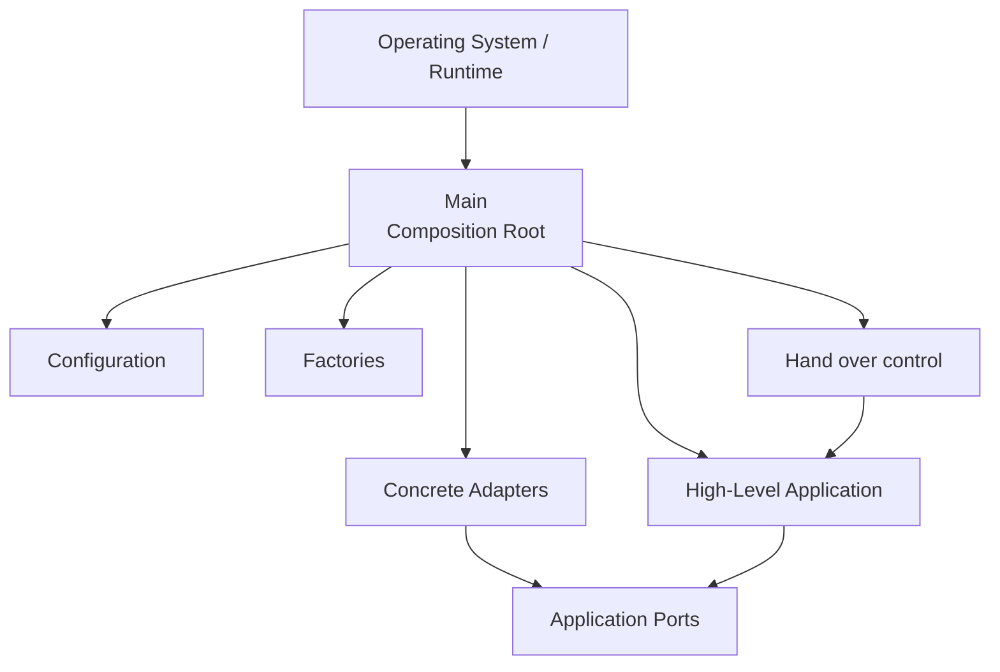
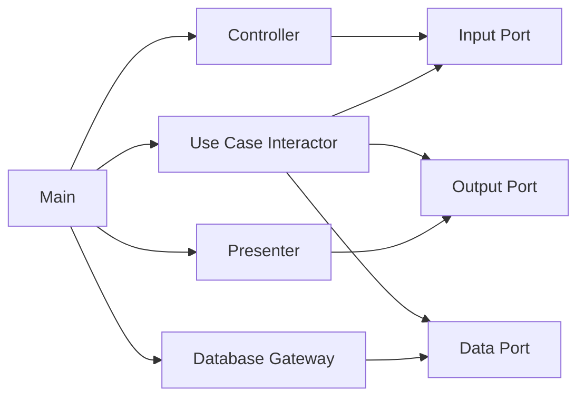
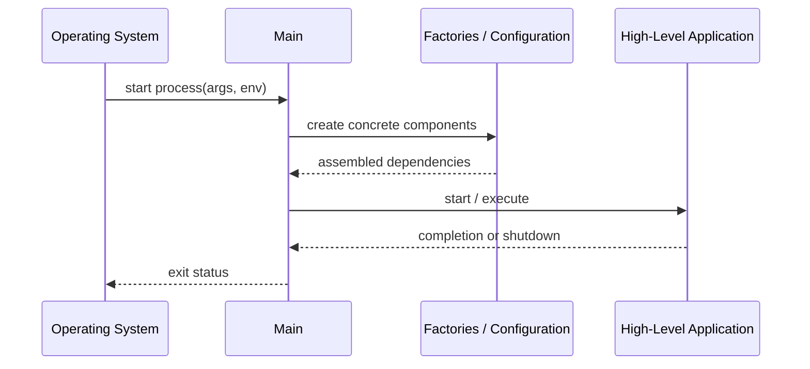
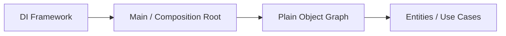
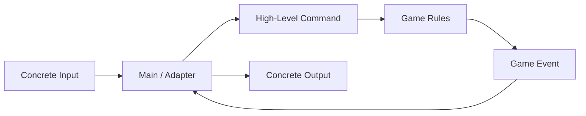
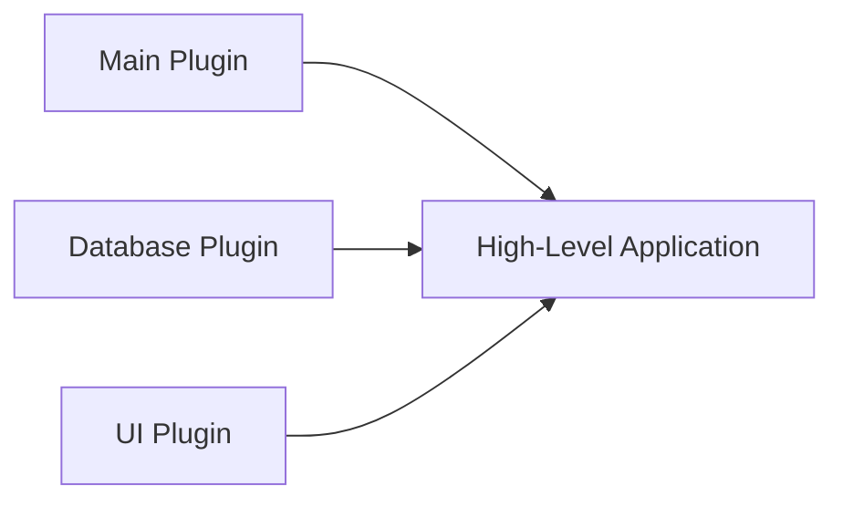

> 原书：Robert C. Martin, *Clean Architecture: A Craftsman's Guide to Software Structure and Design*<br>
> 本章：Chapter 26, The Main Component<br>
> 原文参考：Clean Architecture.md

## 本章导读


每个可运行系统都需要一个起点。

无论系统内部采用：

- Clean Architecture；
- Hexagonal Architecture；
- Modular Monolith；
- 插件架构；
- 多进程或服务；

最终都必须有某处负责：

- 选择具体实现；
- 创建对象；
- 连接依赖；
- 读取配置；
- 初始化外部资源；
- 设置初始状态；
- 启动高层应用。

原书把这个组件称为：

> **Main。**

Main 看似只是一个很小的入口函数，却在 Clean Architecture 中拥有特殊地位：

- 它是系统的 Initial Entry Point；
- 它离操作系统和运行环境最近；
- 它知道许多具体实现；
- 它是最外层、最低层的 Policy；
- 应用的其他组件不依赖它；
- 它完成组装后，把控制权交给高层 Policy。



作者把 Main 称为：

- **The Ultimate Detail**；
- **The Lowest-Level Policy**；
- **The Dirtiest of All the Dirty Components**。

这里的“脏”不是代码质量差，也不是可以不测试。

它表示 Main 必须知道那些核心业务刻意不知道的具体细节：

- 使用哪个数据库；
- 使用哪个 Web Framework；
- 创建哪个 Gateway；
- 使用哪个 Strategy；
- 读取哪些环境变量；
- 打开哪个输入流；
- 采用哪套配置；
- 选择哪个实现类。

本章以 *Hunt the Wumpus* 的 Main 为例，展示它如何：

1. 加载游戏文案和环境数据；
2. 通过 `HtwFactory` 创建游戏实现；
3. 创建输入流并解释简短命令；
4. 初始化随机地图、玩家、Wumpus、蝙蝠、深坑与箭袋；
5. 把真正的游戏行为委托给更高层组件。

本章最后进一步指出：

> **Main 本身也是应用的插件。**

因此，同一应用可以拥有多个 Main：

- Dev Main；
- Test Main；
- Production Main；
- 不同国家或司法辖区的 Main；
- 不同客户配置的 Main；
- Web、CLI、Worker 等不同入口的 Main。

把 Main 当作插件后，Configuration 不再需要侵入核心业务，而成为最外层组装选择。

本章没有数学公式，也没有需要推导的算法。重要的是理解对象图、依赖方向、生命周期与配置责任怎样集中到最外层。

## 1. Main Component 是什么

### 1.1 每个系统至少有一个协调者

原书开头说，每个系统至少有一个组件负责：

- Creates：创建其他组件；
- Coordinates：协调它们；
- Oversees：监督它们。

作者把这个组件称为 Main。

### 1.2 Main 不一定叫 `main`

不同平台中的入口可能是：

- C / C++ 的 `main`；
- Java 的 `public static void main`；
- .NET 的 Program Entry；
- Web Framework 的 Application Bootstrap；
- Serverless Handler；
- Mobile App Delegate；
- Desktop Application Initializer；
- Plugin Entry Point；
- Test Runner Setup。

名称不同，架构角色相同：组装并启动系统。

### 1.3 Main 是组件，不只是一个函数

复杂系统中的 Main 可能包含：

- 一个入口函数；
- 多个 Configuration Module；
- Factory；
- Dependency Registration；
- Lifecycle Manager；
- Startup Validation；
- Shutdown Hook；
- Environment-Specific Adapter。

因此更准确地把它看成一个最外层组件，而不是单行启动函数。

### 1.4 Main 的核心产物是对象图

Main 创建的不是孤立对象，而是一张 Object Graph：

- Use Case 需要 Repository Port；
- Database Adapter 实现 Repository Port；
- Presenter 实现 Output Port；
- Controller 依赖 Input Port；
- Main 创建并连接这些实例。



### 1.5 Main 是具体选择发生的位置

核心代码只知道：

- Repository；
- Payment Gateway；
- Notification Sender；
- Clock；
- Output Boundary。

Main 决定当前使用：

- SQL Repository；
- 某支付供应商 Adapter；
- Email Sender；
- System Clock；
- Web Presenter。

### 1.6 Main 与 Composition Root

现代设计中常把这一位置称为 Composition Root。

Composition Root 是：

> **应用中集中创建并连接对象图的位置。**

第 26 章虽然未使用这个术语，但 Main 的职责与它高度一致。

### 1.7 为什么要集中组装

如果每个业务类自行创建依赖：

- 具体实现名称散布在核心；
- 测试难以替换；
- 生命周期难以统一；
- 配置读取到处出现；
- 技术选择污染业务。

集中到 Main 后，这些选择有明确归属。

### 1.8 Main 不是 Service Locator

Main 可以创建并分发依赖，但业务对象不应随时回头向 Main 查询依赖。

不推荐：

- Use Case 调 `Main.getRepository()`；
- Entity 访问全局 Container；
- 任意模块调用 Service Locator。

这会隐藏真实依赖，并让核心反向依赖 Main。

### 1.9 Main 应把依赖显式交给使用者

常见方式包括：

- Constructor Injection；
- Factory Parameter；
- 显式函数参数；
- Setter Injection，仅在生命周期确有需要时；
- 组合对象。

对象获得依赖后，应像普通对象一样使用，不继续依赖组装框架。

## 2. The Ultimate Detail

### 2.1 Main 是终极细节

原书把 Main 称为 The Ultimate Detail。

它是最接近以下事物的代码：

- Operating System；
- Command Line；
- Process Environment；
- File System；
- Framework Startup；
- Concrete Class；
- Runtime Configuration。

这些都是系统最外层的具体机制。

### 2.2 Main 是最低层 Policy

Main 也包含一种 Policy：启动与配置政策。

它决定：

- 创建哪些组件；
- 使用什么顺序；
- 采用哪些实现；
- 初始参数是什么；
- 哪个入口启动；
- 何时关闭资源。

但这种 Policy 与业务规则相比层级最低，因为它最靠近运行环境与 IO。

### 2.3 为什么“最低层”不表示不重要

如果 Main 配置错误：

- 应用可能无法启动；
- 使用错误数据库；
- 加载错误策略；
- 泄漏密钥；
- 连接错误服务；
- 资源无法关闭。

低层表示政策位置，不表示工程质量可以降低。

### 2.4 Main 是 Initial Entry Point

Operating System 或 Runtime 首先把控制交给 Main。

Main 完成组装后，再把控制权交给高层 Application。



### 2.5 应用组件不应依赖 Main

除了操作系统或运行平台，没有其他应用组件应依赖 Main。

核心不能：

- Import Main；
- 调用 Main 方法；
- 读取 Main 的全局变量；
- 依赖 Main 中的配置类型；
- 要求 Main 的静态单例。

### 2.6 Main 可以依赖许多组件

因为 Main 负责组装，它可以知道：

- 高层 Port；
- 具体 Adapter；
- Framework Configuration；
- Factory；
- Driver；
- Application Entry。

这使它位于依赖图最外缘。

### 2.7 Main 的变化不应向内传播

从 Dev 切换到 Production Main，不应修改：

- Entity；
- Use Case；
- 业务 Request / Response；
- 核心 Port。

变化主要发生在组装与具体实现选择。

### 2.8 Main 应创建 Factories

Factory 用于：

- 隐藏复杂构造；
- 选择实现；
- 创建运行期对象；
- 管理生命周期；
- 延迟具体绑定。

Main 可以创建并注入 Factory，而不是让 Use Case 直接创建具体对象。

### 2.9 Main 应选择 Strategies

Strategy 代表可替换政策实现，例如：

- 定价 Strategy；
- 路由 Strategy；
- Locale Strategy；
- Persistence Strategy；
- Retry Strategy。

Main 根据配置选择具体 Strategy，再把它作为抽象交给高层。

### 2.10 Main 应创建 Global Facilities

原书提到 Global Facilities。

现代系统中可能包括：

- Logger；
- Metrics Registry；
- Tracer；
- Clock；
- ID Generator；
- Thread Pool；
- Scheduler；
- Configuration Provider。

“Global”不一定意味着可从任何地方访问的全局变量。

更好的方式是由 Main 创建，再显式注入需要它们的组件。

### 2.11 Main 最后要让出控制权

Main 不应成为永久业务协调中心。

完成以下工作后：

- 创建；
- 配置；
- 连接；
- 验证；

它应调用高层 Application 的启动接口，让真正 Use Case 和业务 Policy 控制系统行为。

## 3. Dependency Injection Framework 应停在哪里

### 3.1 原书的明确要求

原书指出，Dependency Injection Framework 应在 Main 中注入依赖。

注入完成后，Main 应使用普通方式把依赖分发给对象，而不让框架继续渗透系统。

### 3.2 DI Framework 适合做什么

它可以帮助 Main：

- 注册实现；
- 解析对象图；
- 管理 Scope；
- 调用 Factory；
- 处理生命周期；
- 读取外层配置。

### 3.3 DI Framework 不应做什么

不应让核心：

- 依赖容器 API；
- 使用框架 Annotation 表达业务；
- 在方法内部主动 Resolve Service；
- 依赖 Framework Scope；
- 通过字符串查找对象。

### 3.4 容器应是组装工具

正确关系是：



框架帮助构建对象图，但对象图运行后不需要持续知道框架存在。

### 3.5 Constructor Injection 为什么常被优先选择

它让依赖：

- 显式；
- 创建后完整；
- 易于测试；
- 不依赖容器；
- 容易检查。

Main 或 Container 调用普通构造函数即可。

### 3.6 Service Locator 为什么危险

如果业务代码到全局 Container 中取对象：

- 依赖被隐藏；
- 测试需要配置容器；
- Main 角色扩散到整个系统；
- Dependency Rule 被破坏；
- 运行期错误替代编译期检查。

### 3.7 Framework Annotation 的边界

有些 DI Framework 通过 Annotation 注册依赖。

可以把 Annotation 限制在：

- Main Module；
- Configuration Class；
- 外层 Adapter；
- Framework Glue。

Entity 与 Use Case 尽量保持普通对象。

### 3.8 手工 DI 也是合理方案

小型系统可以在 Main 中直接：

1. 创建 Database Connection；
2. 创建 Gateway；
3. 创建 Presenter；
4. 创建 Interactor；
5. 创建 Controller；
6. 启动应用。

手工组装更显式，也避免不必要框架。

### 3.9 何时 DI Container 更有价值

- 对象图很大；
- 生命周期复杂；
- 多种 Scope；
- 插件较多；
- 需要声明式配置；
- 平台本身提供成熟容器。

即便使用，仍应限制在 Main。

### 3.10 如何测试 DI 配置

可以建立 Startup / Composition Test：

- 容器能否完整构造对象图；
- 是否有循环依赖；
- 是否缺少 Binding；
- Scope 是否正确；
- Production Adapter 是否被错误替换；
- 关键配置是否有效。

## 4. 为什么 Main 是最脏的组件

### 4.1 “脏”的含义

Main 必须知道：

- 具体类；
- 配置文件；
- 环境变量；
- 类名字符串；
- IO Stream；
- Framework；
- Driver；
- 启动顺序。

这些是业务核心刻意避免的低层知识。

### 4.2 “脏”不等于混乱

一个好的 Main 仍应：

- 结构清楚；
- 依赖显式；
- 错误可诊断；
- 资源可关闭；
- 配置可验证；
- 不包含业务规则。

### 4.3 Main 是脏代码的隔离区

与其让具体依赖散布整个系统，不如集中到一个已知位置。

这类似：

- 防腐层集中外部格式；
- Adapter 集中技术转换；
- Main 集中系统组装细节。

### 4.4 Main 可以比较长

复杂系统的对象图可能需要许多注册和连接代码。

长度本身不是首要问题。

更应检查：

- 是否主要是声明式组装；
- 是否出现业务条件；
- 是否重复复杂算法；
- 是否可以按配置模块拆分。

### 4.5 Main 不应成为 God Object

危险信号：

- 每个请求都经过 Main；
- Main 保存所有业务状态；
- Main 执行价格计算；
- Main 决定权限；
- 其他模块不断调用 Main；
- Main 充当全局 Service Locator。

### 4.6 Main 中可以出现条件选择

例如：

- Dev 使用 In-Memory Repository；
- Production 使用 SQL Repository；
- Test 使用 Fixed Clock。

这是配置选择，不是业务政策。

### 4.7 配置选择与业务规则的界线

**配置选择：**

- 选择哪个实现；
- 设置连接地址；
- 设置线程数；
- 选择 Locale Plugin。

**业务规则：**

- 客户是否有资格；
- 金额怎样计算；
- 订单何时取消；
- 游戏何时胜利。

后者不应进入 Main。

### 4.8 Main 中的敏感信息

Main 可能读取：

- Password；
- Token；
- Certificate；
- Secret；
- Connection String。

但不应：

- 把 Secret 硬编码进源码；
- 打印敏感值；
- 让核心依赖 Secret Provider 的具体类型。

### 4.9 Main 的错误处理

启动失败时，Main 应：

- 给出清楚诊断；
- 不进入半初始化状态；
- 关闭已创建资源；
- 返回非零 Exit Code；
- 记录必要上下文；
- 避免泄漏 Secret。

### 4.10 Main 的可读性很重要

Main 是系统对象图的地图。

开发者应能从中看出：

- 主要组件；
- 具体实现；
- 依赖关系；
- 启动流程；
- 环境差异。

## 5. Hunt the Wumpus Main：配置数据

### 5.1 原书案例背景

作者展示近期版本 *Hunt the Wumpus* 的 Main Component。

这个 Main 实现 `HtwMessageReceiver`，并保存游戏入口所需的具体配置和状态。

### 5.2 `game` 引用

Main 持有一个 `HuntTheWumpus` 抽象类型的 `game` 引用。

具体实现由 Factory 创建。

这让 Main 的后续命令循环面向高层游戏接口，而不是直接操作具体 Facade。

### 5.3 初始 Hit Points

示例把 `hitPoints` 初始化为 10。

这属于该部署版本的初始游戏配置。

若生命规则本身变复杂，应由 PlayerManagement 管理；Main 只提供初始条件。

### 5.4 Caverns 列表

Main 维护 Cavern 名称列表，用于建立随机地图。

它知道地图初始化所需的具体词汇和数量选择。

### 5.5 `environments`

环境形容词包括：

- bright；
- humid；
- dry；
- creepy；
- ugly；
- foggy；
- hot；
- cold；
- drafty；
- dreadful。

这些词属于具体英文游戏表现或配置，不应污染高层规则。

### 5.6 `shapes`

形状词包括：

- round；
- square；
- oval；
- irregular；
- long；
- craggy；
- rough；
- tall；
- narrow。

### 5.7 `cavernTypes`

洞穴类型包括：

- cavern；
- room；
- chamber；
- catacomb；
- crevasse；
- cell；
- tunnel；
- passageway；
- hall；
- expanse。

### 5.8 `adornments`

装饰描述包括：

- 硫磺气味；
- 墙上雕刻；
- 凹凸地面；
- 垃圾；
- 蝙蝠粪；
- Wumpus 排泄物；
- 散落骨头；
- 地面尸体；
- 震动感；
- 闷热感；
- 恐惧感。

### 5.9 为什么这些 String 位于 Main

原书说，Main 加载了主程序不应知道的 String。

高层 Game Rules 应处理：

- Cavern Identity；
- Move；
- Event；
- Player State。

它不应硬编码某个语言版本的装饰文案。

### 5.10 这些 String 是否一定都属于 Main

不一定。

在更成熟架构中，它们可能属于：

- Language Plugin；
- Resource Bundle；
- Content Pack；
- Configuration File；
- Procedural Generation Strategy。

原书示例把它们放在 Main，是为了展示最外层具体数据的集中。

### 5.11 配置数据与领域政策的边界

如果词汇只影响表现，它是低层配置。

如果某种环境影响：

- 玩家生命；
- 移动成本；
- Wumpus 行为；

这些影响规则应进入更高层 Game Policy，而不是藏在 Main 的 String 中。

## 6. Hunt the Wumpus Main：创建游戏

### 6.1 `HtwFactory.makeGame`

Main 使用 `HtwFactory` 创建游戏。

它传入：

- 具体实现类名；
- 一个 `Main` 实例作为 `HtwMessageReceiver`。

### 6.2 具体类名

原书示例传入：

`htw.game.HuntTheWumpusFacade`

这是一个字符串，而不是直接构造函数引用。

### 6.3 为什么通过类名字符串创建

原书说，这个 Facade 比 Main 还脏。

通过类名交给 Factory，可以避免 Main 在源码中直接依赖该具体类定义。

具体实现改变时，Main 不必因为类实现细节而重新编译和部署。

### 6.4 这种机制通常怎样实现

Factory 可能使用：

- Reflection；
- Plugin Registry；
- Dynamic Class Loading；
- Configuration Mapping。

原书重点是避免直接源码依赖，而不是指定唯一技术。

### 6.5 字符串解耦的代价

类名字符串会带来：

- 拼写错误推迟到运行时；
- 重命名工具可能无法追踪；
- 启动失败；
- 配置诊断要求更高；
- 安全上要限制可加载类型。

### 6.6 更现代的替代方式

可以使用：

- 显式 Factory Binding；
- DI Container Registration；
- Plugin Descriptor；
- Service Provider Interface；
- 编译期模块配置。

目标仍是把具体选择限制在 Composition Root。

### 6.7 `HtwMessageReceiver` 的角色

Main 实现 Message Receiver，说明这个简单 Console 入口同时承担：

- 系统组装；
- 一部分输出 Adapter；
- 接收游戏消息。

在更复杂系统中，可以把 Console Presenter / Listener 再拆出。

### 6.8 Main 可以兼任 Adapter 吗

可以，尤其在小型程序中。

但若：

- 输入输出逻辑增长；
- 需要多种 UI；
- 本地化增加；
- 测试复杂；

应把 Adapter 与 Composition Root 分离。

## 7. Hunt the Wumpus Main：命令循环

### 7.1 入口函数的结构

原书 Main Function 大致执行：

1. 创建游戏；
2. 创建地图；
3. 创建 Console Input Stream；
4. 执行初始 Rest Command；
5. 循环显示状态；
6. 读取玩家命令；
7. 转成高层 Command；
8. 执行 Command；
9. 收到 Quit 时退出。

### 7.2 简化伪代码

下面是对应结构的简化版本，不复制原程序细节：

```text
main(args):
    game = factory.makeGame(configuredImplementation, messageReceiver)
    createMap(game)
    input = openConsoleInput()

    game.makeRestCommand().execute()

    loop:
        display(game.playerCavern, health, game.quiver)
        rawCommand = input.readLine()
        command = translateCommand(rawCommand, game)

        if command is Quit:
            return success

        command.execute()
```

### 7.3 Main 创建输入流

原书使用：

- `BufferedReader`；
- `InputStreamReader`；
- `System.in`。

这些都是 Console IO 细节，适合位于最外层。

### 7.4 Main 显示当前状态

循环输出：

- 玩家当前 Cavern；
- Health；
- Quiver 中的箭数量；
- 命令提示符。

这说明示例 Main 还承担简单 Console View / Controller 职责。

### 7.5 命令映射

原书把短命令转换成游戏 Command：

| 输入 | 高层命令 |
| --- | --- |
| `e` | Move EAST |
| `w` | Move WEST |
| `n` | Move NORTH |
| `s` | Move SOUTH |
| `r` | Rest |
| `sw` | Shoot WEST |
| `se` | Shoot EAST |
| `sn` | Shoot NORTH |
| `ss` | Shoot SOUTH |
| `q` | Quit |

### 7.6 为什么 Main 只解释简单命令

Main 负责把 Console Token 转成高层 Command。

它不负责：

- 判断移动是否合法；
- 计算射击结果；
- 决定 Wumpus 行为；
- 计算生命变化；
- 判定胜负。

这些行为委托给更高层游戏组件。

### 7.7 Command Pattern 的作用

`makeMoveCommand`、`makeShootCommand` 和 `makeRestCommand` 返回 Command 对象。

它们把：

- 输入解释；
- 游戏行为执行；

分开。

Main 只选择并执行命令，不实现行为本身。

### 7.8 为什么调用 `execute`

每个 Command 封装相应高层行为。

这让 Main 的循环保持统一：

- 解析输入；
- 获得 Command；
- 调用 `execute`。

### 7.9 未知命令怎么办

原书简化代码未展开完整错误处理。

实际 Main / Controller 可以：

- 返回 Help；
- 显示 Invalid Command；
- 不改变游戏状态；
- 记录输入诊断。

输入错误处理属于 Adapter，不应污染游戏规则。

### 7.10 为什么初始执行 Rest Command

示例在进入循环前执行一次 Rest Command，可能用于：

- 初始化当前状态；
- 触发环境事件；
- 产生第一段描述。

具体语义由高层 Command 实现，Main 只负责启动。

### 7.11 `q` 为什么直接由 Main 处理

Quit 表示终止当前 Process / Console Session。

它与 Operating System 生命周期紧密相关，因此由 Main 处理是合理的。

如果“退出游戏”包含保存、确认或业务结算，则应先调用高层 Use Case，再终止进程。

### 7.12 循环是否应该永远在 Main

简单 CLI 可以如此。

复杂应用可能把：

- Event Loop；
- Request Loop；
- Message Pump；
- Server Lifecycle；

交给 Framework 或专门 Driver。

Main 只完成注册和启动。

## 8. Hunt the Wumpus Main：创建地图

### 8.1 `createMap` 的职责

原书 Main 还创建游戏地图，并设置游戏初始条件。

### 8.2 Cavern 数量

代码随机生成 10 到 39 个 Cavern。

直觉来自：

- 随机值先覆盖 30 个整数范围；
- 再加上最小值 10。

因此最小 10，最大 39。

### 8.3 生成 Cavern 名称

循环调用 `makeName`，使用前面的：

- Environment；
- Shape；
- Cavern Type；
- Adornment；

组合名称。

### 8.4 建立方向连接

对每个 Cavern，代码尝试连接：

- NORTH；
- SOUTH；
- EAST；
- WEST。

具体 `maybeConnectCavern` 代码在原书中省略。

### 8.5 设置 Player 起点

从任意 Cavern 中选择玩家初始位置，并交给 Game。

### 8.6 设置 Wumpus

Wumpus 被放到不同于 Player 起点的 Cavern。

避免游戏开始时两者直接重合。

### 8.7 设置 Bat Caverns

原书添加三个 Bat Cavern。

每个位置选择为不同于 Player 起点的其他 Cavern。

### 8.8 设置 Pit Caverns

原书添加三个 Pit Cavern。

同样避免使用 Player 起点。

### 8.9 设置 Quiver

玩家箭袋初始设置为 5 支箭。

### 8.10 简化伪代码

```text
createMap(game):
    cavernCount = random integer from 10 through 39
    caverns = generateNames(cavernCount)

    for each cavern:
        maybeConnect(cavern, NORTH)
        maybeConnect(cavern, SOUTH)
        maybeConnect(cavern, EAST)
        maybeConnect(cavern, WEST)

    player = chooseAnyCavern()
    game.setPlayerCavern(player)
    game.setWumpusCavern(chooseOtherThan(player))

    repeat 3 times: game.addBatCavern(chooseOtherThan(player))
    repeat 3 times: game.addPitCavern(chooseOtherThan(player))

    game.setQuiver(5)
```

### 8.11 为什么地图初始化放在 Main

对这个示例而言，Main 选择：

- 地图大小；
- 随机名称；
- 初始危险数量；
- 初始箭数。

这些被视为特定游戏配置和初始条件。

### 8.12 哪些内容可能应移出 Main

如果地图生成本身成为重要游戏政策，例如：

- 必须保证所有 Cavern 连通；
- 难度决定 Pit 数量；
- 地图不能产生无解状态；
- 竞技模式需要可复现 Seed；

这些规则应进入可测试的 Map Generation Strategy，而不是留在 Main。

### 8.13 随机数也可以注入

为了：

- 可重复测试；
- 重放地图；
- 固定比赛 Seed；
- 排查缺陷；

可以由 Main 创建 Random Source，再注入地图生成政策。

### 8.14 Main 应配置，而不是实现复杂算法

Main 可以决定：

- 使用哪个 Map Generator；
- Seed 是多少；
- 难度参数是什么。

Map Generator 决定怎样生成合法地图。

### 8.15 原书示例为什么容许混合

Wumpus 示例规模较小，Main 同时承担：

- Composition Root；
- Console Adapter；
- Initial Map Setup。

作者的目标是说明 Ultimate Detail，而不是提供所有职责都最精细拆分的生产模板。

## 9. Main 把控制权交给高层

### 9.1 Main 不处理 Move 规则

玩家输入方向后，Main 只请求 `makeMoveCommand`。

移动合法性与结果由 Game 处理。

### 9.2 Main 不处理 Shoot 规则

Main 只选择射击方向并创建 Shoot Command。

箭命中、路径和 Wumpus 结果属于高层游戏政策。

### 9.3 Main 不处理 Rest 规则

休息如何影响：

- Health；
- 事件；
- Wumpus；
- 时间；

由高层 Command 决定。

### 9.4 Main 不判定 Win / Lose

胜负是 PlayerManagement / GameRules 的高层政策。

Main 只负责显示消息和管理 Process 生命周期。

### 9.5 委托是关键结构

Main 的流程是：



### 9.6 为什么这符合 Dependency Rule

- Main 知道高层接口；
- 高层规则不知道 Main；
- Main 选择具体实现；
- 高层只处理游戏政策；
- 具体 IO 留在外层。

### 9.7 Main 的业务分支应保持最少

命令 Token 分支属于输入解析。

如果 Main 开始出现：

- 玩家资格判断；
- 价格策略；
- 胜负规则；
- 领域状态机；

说明高层政策正在下沉。

## 10. Main 是应用的插件

### 10.1 原书结论

作者要求把 Main 看成 Application 的 Plugin。

它：

- 设置 Initial Conditions；
- 选择 Configuration；
- 收集 Outside Resources；
- 连接具体实现；
- 把控制交给高层 Policy。

### 10.2 为什么 Main 是插件

应用核心不依赖 Main。

Main 依赖并组装应用核心。

这与数据库和 GUI 插件结构相同：



### 10.3 Main 位于架构边界之后

边界内是稳定 Application Policy。

边界外是 Main 所携带的：

- 环境；
- 配置；
- 驱动；
- 入口；
- 具体资源。

### 10.4 Main Plugin 可以替换

同一 Application 可以由不同 Main 启动，而核心不变。

### 10.5 多个 Main 不等于复制业务

多个 Main 应共享：

- Entity；
- Use Case；
- Port；
- 业务测试。

它们只在具体组装、入口和配置上不同。

### 10.6 Main 与 Framework Plugin 的区别

Main 是主动启动者，数据库 Adapter 等通常是被 Main 组装的插件。

但从源码依赖看，它们都位于外层并依赖 Application 契约。

### 10.7 Configuration 因此变简单

配置不必渗入每个业务模块。

不同配置由不同 Main 选择：

- 哪个 Adapter；
- 哪个 Strategy；
- 哪个 Resource；
- 哪个入口。

### 10.8 配置不能全部变成条件语句

一个巨大的 Main 若包含数百个：

- `if environment == ...`；
- `if country == ...`；
- `if customer == ...`；

也会难以维护。

可以把不同配置拆成独立 Composition Module 或 Main Plugin。

## 11. 多个 Main 的典型配置

### 11.1 Dev Main

可能选择：

- In-Memory Database；
- Local File Storage；
- Console Logger；
- Fake External Service；
- 快速启动参数。

### 11.2 Test Main

可能选择：

- Deterministic Clock；
- Fixed Random；
- In-Memory Gateway；
- Capturing Presenter；
- Test Message Bus。

### 11.3 Production Main

可能选择：

- Production Database；
- Real Payment Adapter；
- Secret Provider；
- Metrics / Tracing；
- Managed Thread Pool；
- Production Server。

### 11.4 Country Main

不同国家可能选择：

- Locale；
- Tax Strategy；
- Currency Formatter；
- Regulatory Adapter；
- Local External Provider。

### 11.5 Jurisdiction Main

不同司法辖区可能配置：

- 合规策略实现；
- 数据存放区域；
- 审计 Adapter；
- 保留期限配置。

### 11.6 Customer Main

企业产品可能为不同客户选择：

- Branding Adapter；
- Authentication Provider；
- Feature Set；
- Integration Plugin；
- Deployment Resource。

### 11.7 Web Main

创建：

- Web Server；
- Route；
- Controller；
- Presenter；
- Use Case；
- Gateway。

### 11.8 CLI Main

创建：

- Command Parser；
- Console Presenter；
- 相同 Use Case；
- 适合本地的 Adapter。

### 11.9 Worker Main

创建：

- Message Consumer；
- Job Use Case；
- Retry Adapter；
- Queue Client；
- Graceful Shutdown。

### 11.10 Migration Main

创建：

- Migration Runner；
- Source / Target Data Adapter；
- Audit Logger；
- 专用配置。

不应复用 Production Web Main 只为运行一次迁移。

### 11.11 多 Main 的共享方式

可以抽取：

- Common Factory Function；
- Shared Composition Module；
- Adapter Builder；
- Core Object Graph Builder。

但不要让共享 Builder 吞掉所有环境差异，重新变成巨大条件中心。

## 12. Main 与应用生命周期

### 12.1 启动顺序

通常先创建底层资源，再创建依赖它们的组件：

1. Configuration；
2. Logger / Metrics；
3. Database / Network Client；
4. Adapter；
5. Use Case；
6. Controller / Listener；
7. Server / Event Loop。

### 12.2 先验证再接收流量

Main 应在开始服务前验证：

- 必要配置存在；
- Secret 可用；
- 端口可绑定；
- 数据库可连接；
- 迁移兼容；
- Object Graph 完整。

### 12.3 资源所有权

创建资源的组件通常应清楚谁负责关闭：

- Connection Pool；
- Thread Pool；
- File Handle；
- Network Client；
- Message Consumer；
- Server。

Main 是常见生命周期所有者。

### 12.4 关闭顺序

关闭通常与启动相反：

1. 停止接收新流量；
2. 完成或取消在途工作；
3. 停止 Listener / Worker；
4. 刷新 Buffer；
5. 关闭 Network / Database；
6. 刷新日志与追踪；
7. 返回 Exit Status。

### 12.5 Graceful Shutdown

Main 可以响应：

- SIGTERM；
- Framework Shutdown Event；
- Process Cancellation；
- Console Quit。

但业务补偿应委托给高层 Use Case，而不是写在 Signal Handler 中。

### 12.6 Startup Failure

若初始化中途失败：

- 已创建资源必须清理；
- 应用不能接收流量；
- 错误应清楚；
- Exit Code 应非零；
- 不应重试到无限循环，除非策略明确。

### 12.7 健康检查

Main / Framework Glue 可以暴露：

- Liveness；
- Readiness；
- Startup Status。

健康判断的技术采集在外层，业务可用性规则可由更高层定义。

### 12.8 Observability 初始化

Main 适合创建：

- Logger；
- Metrics；
- Tracer；
- Correlation ID Provider。

然后以抽象或外层方式提供给需要的组件。

### 12.9 不要让 Observability 污染核心

Entity 不应依赖具体监控 SDK。

可以：

- 在 Adapter 记录技术指标；
- 由 Use Case 依赖简洁审计 Port；
- 在 Composition Root 注入实现。

## 13. Configuration 的边界

### 13.1 配置也是输入

Environment Variable、Command-Line Argument 和 Config File 都是外部输入。

它们需要：

- 解析；
- 验证；
- 转换；
- 默认值；
- 错误报告。

### 13.2 外部配置模型不应进入核心

核心不应到处调用：

- `getenv`；
- Config Singleton；
- Framework Environment；
- Property Bag。

Main 应读取并转换为具体依赖或高层参数。

### 13.3 配置值与 Strategy

例如配置写：

- `storage=cloud`；
- `payment=providerA`；
- `locale=es`。

Main 将它们转换成：

- Cloud Storage Adapter；
- Provider A Gateway；
- Spanish Language Plugin。

高层不解析这些 String。

### 13.4 配置验证

在启动时检查：

- 枚举值合法；
- URL 格式；
- 文件存在；
- 数值范围；
- 必要 Secret；
- 相互约束。

尽量 Fail Fast。

### 13.5 默认值的风险

开发环境便利默认值可能在 Production 造成：

- 使用本地数据库；
- 关闭认证；
- 使用弱密钥；
- 丢失数据；
- 禁用日志。

Production Main 应对危险缺失明确失败。

### 13.6 配置不是业务规则的替代品

不要把复杂业务政策变成随意配置：

- 规则语义难验证；
- 配置组合爆炸；
- 缺少类型与测试；
- 责任不清。

Main 选择 Strategy，Strategy 内部实现业务政策。

### 13.7 Secret Management

Main 可以从 Secret Store 取得凭证，再用于创建 Adapter。

核心只看到已构造好的 Port，不看到 Secret 字符串。

### 13.8 配置快照与动态配置

启动配置适合 Main。

动态配置若会运行时变化，需要专门：

- Configuration Port；
- Refresh Policy；
- Consistency；
- Audit；
- Fallback。

不要让所有组件直接监听外部配置中心。

## 14. Main 的测试策略

### 14.1 核心不依赖 Main 的直接收益

Entity / Use Case 测试不需要：

- 启动 Main；
- 读取 Production Config；
- 加载 DI Container；
- 连接真实外部资源。

### 14.2 Main 不适合大量业务单元测试

因为 Main 不应包含复杂业务规则。

它的测试重点是组装正确性。

### 14.3 Composition Test

验证：

- 所有依赖都可解析；
- 没有循环依赖；
- Production 绑定正确；
- Scope 正确；
- Application 可启动。

### 14.4 Startup Smoke Test

在接近真实环境中：

1. 启动应用；
2. 等待 Ready；
3. 执行最小健康操作；
4. 关闭应用；
5. 确认资源释放。

### 14.5 Configuration Matrix Test

对 Dev、Test、Production、Country / Customer Variant 验证：

- 配置可解析；
- 必要绑定存在；
- 禁止组合会失败；
- Feature 与 Adapter 匹配。

### 14.6 Factory Test

若使用 `HtwFactory` 或 Plugin Factory，应验证：

- 合法实现可加载；
- 错误类名有清楚诊断；
- 类型不兼容被拒绝；
- 安全白名单有效；
- 生命周期符合约定。

### 14.7 Command Mapping Test

Wumpus Console Adapter 可以单测：

- `e` 映射 Move EAST；
- `sw` 映射 Shoot WEST；
- `q` 映射 Quit；
- 未知命令返回错误。

这部分可从真正 Main 提取成 Testable Parser。

### 14.8 Map Initialization Test

若地图生成仍在 Main 附近，应使用固定 Random Seed 验证：

- 玩家与 Wumpus 不重合；
- Bat / Pit 数量正确；
- Quiver 初始为 5；
- Cavern 数量位于 10 至 39；
- 地图满足必要约束。

如果规则复杂，说明应提取 Map Generator。

### 14.9 Shutdown Test

验证：

- 不再接收任务；
- 在途任务正确处理；
- 资源按顺序关闭；
- 重复关闭安全；
- 超时后有明确行为。

### 14.10 测试不能证明所有环境正确

仍需：

- Staging 验证；
- Production Monitoring；
- 配置审计；
- 部署检查；
- 回滚演练。

## 15. 作者分析问题的思路

### 15.1 从不可避免的事实出发

无论架构多干净，具体对象总要由某处创建。

作者没有假装可以消灭所有具体依赖，而是寻找它们最合理的归宿。

### 15.2 把不可避免的脏集中起来

既然：

- 具体类名；
- 配置；
- IO；
- Framework；

不可避免，就集中在 Main，而不是让它们散布核心。

### 15.3 用依赖方向保护系统

Main 可以知道 Application。

Application 不知道 Main。

因此，配置改变不会从 Main 向核心传播源码依赖。

### 15.4 用 Wumpus 代码给出具体证据

作者没有只给抽象图，而是展示：

- String 配置；
- Factory 类名；
- Console Loop；
- Command Mapping；
- Map 初始化。

读者能看见“脏”具体是什么。

### 15.5 再观察 Main 做了什么与没做什么

Main 做：

- IO；
- 初始化；
- 配置；
- 命令选择。

Main 不做：

- 游戏移动规则；
- 射击规则；
- 胜负政策；
- 玩家状态政策。

### 15.6 最后把 Main 重新解释为 Plugin

这个视角带来关键结果：

- Main 可以替换；
- Main 可以有多个；
- Application 保持不变；
- Configuration 被隔离到边界外。

### 15.7 为什么选择 Plugin 视角

如果把 Main 当系统中心，所有组件容易依赖它。

如果把 Main 当插件，源码依赖自然由 Main 指向 Application。

### 15.8 本章方法的一般化

面对任何不可避免的细节：

1. 承认它存在；
2. 找到最外层归属；
3. 防止核心反向依赖；
4. 集中组装；
5. 通过插件替换不同配置。

## 16. 适用范围与局限

### 16.1 小型程序

几十行脚本可能只需一个入口函数。

引入 DI Container、多个 Main Module 和大量 Port 可能得不偿失。

### 16.2 原书 Wumpus Main 并非完美模板

它同时包含：

- Composition；
- Console IO；
- 命令解析；
- Map Setup；
- 文案配置；
- 一些状态。

在大型系统中，这些职责可能继续拆分。

### 16.3 “最脏”不应成为借口

不能因为 Main 本来就具体，就允许：

- 无结构代码；
- 重复业务逻辑；
- 明文 Secret；
- 无错误处理；
- 无测试；
- 全局可变状态泛滥。

### 16.4 多个 Main 的重复

多个入口可能重复组装代码。

可以抽取共享 Builder，但要避免：

- 把所有差异塞进巨大条件；
- 让 Builder 成为新的 Service Locator；
- 让核心依赖 Builder。

### 16.5 Reflection 的风险

类名字符串降低编译依赖，却增加运行时风险。

适合插件需求明确的场景，不必为每个具体类都采用 Reflection。

### 16.6 DI Framework 的侵入

某些平台强制框架接管生命周期。

仍可以：

- 把 Framework Entry 当 Main；
- 立即转入普通 Application；
- 限制 Annotation；
- 保持 Entity / Use Case 独立。

### 16.7 Serverless 环境

每个 Handler 可能像一个 Main。

可以共享核心 Composition Function，但要关注：

- Cold Start；
- Resource Reuse；
- Handler 生命周期；
- 配置与 Secret；
- 幂等。

### 16.8 Plugin Host 环境

应用自身可能被另一个 Host 启动。

此时 Main 角色可能是：

- Plugin Initializer；
- Framework Callback；
- Module Activator。

依赖原则仍然相同。

## 17. 易混淆概念与常见误解

### 17.1 “Main 只是三行启动代码”

不一定。它是整个组装组件，可能包含配置、Factory、生命周期与多个模块。

### 17.2 “Main 是最高层，因为它启动一切”

错误。它最靠近 OS 与具体环境，因此是最低层 Policy。

### 17.3 “调用顺序决定政策层级”

错误。OS 最先调用 Main，不代表 Main 是高层。层级由离 IO 与核心政策的距离决定。

### 17.4 “最脏表示代码质量可以差”

错误。“脏”表示包含具体细节，不表示可以混乱、不安全或无测试。

### 17.5 “Main 可以包含业务规则，因为它知道所有对象”

错误。Main 只选择并连接业务实现，不应实现业务政策。

### 17.6 “核心可以调用 Main 获取依赖”

错误。这会使核心反向依赖最外层，并形成 Service Locator。

### 17.7 “DI Framework 应遍布所有模块”

错误。框架应主要停在 Main / Composition Root，普通对象使用显式依赖。

### 17.8 “用了 Constructor Injection 就一定符合 DIP”

不一定。如果注入的参数是具体低层类，核心仍直接依赖细节。

### 17.9 “所有应用都必须使用 DI Container”

错误。手工组装在小型和中型系统中常更清楚。

### 17.10 “Global Facilities 就应该做成 Global Singleton”

错误。Main 可以创建全局生命周期设施，再以接口显式注入。

### 17.11 “Main 中的所有条件分支都不合理”

错误。环境与实现选择属于配置；业务判断才应移到高层。

### 17.12 “类名字符串比直接依赖永远更好”

错误。它牺牲编译检查并增加运行时风险，只在动态插件价值明确时使用。

### 17.13 “Map Creation 在原书 Main，所以地图规则都应放 Main”

错误。示例简单；复杂合法性与难度规则应进入可测试 Map Generator。

### 17.14 “Main 持有 Static State 是 Clean Architecture 要求”

错误。这只是示例实现。现代系统通常更倾向显式对象图与受控状态。

### 17.15 “多个 Main 意味着复制整个系统”

错误。它们共享核心，只替换入口、配置和具体 Adapter。

### 17.16 “Dev / Test / Production 只需一个巨型条件 Main”

不一定。独立 Composition Module 往往更清楚，也更容易验证。

### 17.17 “不同国家规则都属于 Main”

错误。Main 选择 Jurisdiction Strategy；规则本身若是关键业务政策，应位于高层实现。

### 17.18 “配置改变永远不影响业务”

错误。有些配置实际改变业务政策，应被建模、验证和审计，而不是当作无类型字符串。

### 17.19 “Main 不需要测试，因为核心不依赖它”

错误。组装错误会让系统无法运行，需要 Composition、Startup 与 Configuration Test。

### 17.20 “Main 是 Plugin，所以必须动态加载”

错误。Plugin 描述依赖方向与可替换角色，不要求运行时动态加载。

## 18. 实践检查与掌握练习

### 18.1 Main 责任检查

- 是否集中创建具体对象？
- 是否连接 Object Graph？
- 是否读取并验证配置？
- 是否初始化外部资源？
- 是否把控制交给高层 Application？
- 是否承担不应存在的业务规则？

### 18.2 依赖方向检查

- 是否有核心模块 Import Main？
- 是否有 Entity 访问 Config Singleton？
- 具体实现是否只在外层被选择？
- Main 是否依赖 Application Port？
- Application 是否不知道具体 Main？

### 18.3 DI 检查

- DI Framework 是否局限在 Composition Root？
- 核心是否调用 Container？
- 依赖是否通过 Constructor 显式传递？
- 是否注入抽象而非具体低层类型？
- 容器配置是否有启动测试？

### 18.4 配置检查

- Environment Variable 是否集中解析？
- 是否 Fail Fast？
- Secret 是否安全读取？
- Production 是否使用危险默认值？
- 业务政策是否被错误降级为字符串配置？
- 动态配置是否有专门 Port？

### 18.5 生命周期检查

- 启动顺序是否明确？
- 谁拥有资源关闭责任？
- 是否先 Ready 再接流量？
- Shutdown 是否反向有序？
- Startup Failure 是否清理资源？
- Exit Code 与诊断是否清楚？

### 18.6 多 Main 检查

- Dev / Test / Production 是否共享核心？
- 不同入口是否复用 Use Case？
- 差异是否只在具体组装？
- 是否出现巨大环境条件分支？
- Shared Builder 是否隐藏真实差异？
- 每种配置是否可独立验证？

### 18.7 Wumpus 示例检查

- 文案是否属于 Language / Config Detail？
- Command Mapping 是否止步 Console Adapter？
- Move / Shoot / Rest 行为是否委托高层？
- Map 规则复杂后是否应提取？
- Random 是否可控制？
- Quit 是否正确处理生命周期？

### 18.8 场景判断一：Use Case 调用 `Main.container.resolve`

**判断：** 核心反向依赖 Composition Root，属于 Service Locator，应改为显式注入。

### 18.9 场景判断二：Production Main 选择 SQL，Test Main 选择内存

两者把同一 Repository Port 注入相同 Use Case。

**判断：** 合理，多 Main 作为插件替换具体配置。

### 18.10 场景判断三：Main 中计算订单折扣

**判断：** 业务 Policy 下沉，应移到 Entity / Use Case 或 Strategy。

### 18.11 场景判断四：Main 读取 `payment=providerA`

随后创建 Provider A Adapter 并注入 Payment Port。

**判断：** 合理的具体实现选择。

### 18.12 场景判断五：Entity 带 Spring Component Annotation

只有启动 Spring Main 才能构造 Entity。

**判断：** DI Framework 已侵入核心，应恢复普通对象并在 Main 注册。

### 18.13 场景判断六：地图生成出现复杂可达性规则

**判断：** 不应继续留在 Main；提取可测试 Map Generator，Main 只选择和配置它。

### 18.14 场景判断七：不同司法辖区使用不同税务 Strategy

Main 选择 Strategy，Strategy 本身在高层实现并经过业务测试。

**判断：** 配置与政策责任分离合理。

### 18.15 场景判断八：类名 Reflection 配置拼错

系统在 Production 启动时才失败。

**判断：** 应增加启动验证、白名单和 Composition Test，或改用编译期 Binding。

### 18.16 快速复述练习

能够回答以下问题，基本就掌握了本章：

1. 每个系统中 Main 至少承担哪三类职责？
2. 为什么 Main 是组件而不仅是函数？
3. Main 与 Composition Root 有什么关系？
4. 什么是 Object Graph？
5. 为什么具体实现选择应集中在 Main？
6. Main 为什么被称为 The Ultimate Detail？
7. Main 为什么是最低层 Policy？
8. 为什么应用组件不应依赖 Main？
9. Main 应创建哪些 Factories、Strategies 与 Global Facilities？
10. 为什么 Main 完成组装后要让出控制权？
11. DI Framework 应停在哪一层？
12. 注入完成后为什么应使用普通依赖传递？
13. Service Locator 有什么问题？
14. 为什么 Main 是最脏的组件？
15. “脏”为什么不等于低质量？
16. Wumpus Main 加载了哪些 String 类别？
17. 为什么这些 String 不应进入核心 Game Rules？
18. `HtwFactory.makeGame` 接收什么？
19. 为什么具体 Facade 用类名字符串选择？
20. Reflection 解耦有什么代价？
21. Wumpus Main 如何创建 Console 输入？
22. `e`、`sw`、`r`、`q` 分别映射什么？
23. Main 如何把行为委托给 Command？
24. `createMap` 创建多少 Cavern、Bat、Pit 与 Arrow？
25. 复杂 Map Generation 为什么应移出 Main？
26. 为什么 Main 可以看作 Application Plugin？
27. 多个 Main 可以对应哪些配置？
28. 多 Main 怎样简化 Configuration？
29. Main 在启动与关闭生命周期中承担什么？
30. 应如何测试 Main 与 Composition？
31. 作者如何从“具体依赖不可避免”推导出 Main 的位置？

### 18.17 一分钟记忆卡

- **定义：** Main 创建、协调并监督其他组件。
- **位置：** Initial Entry Point、Ultimate Detail、Lowest-Level Policy。
- **方向：** Main 依赖 Application，Application 不依赖 Main。
- **职责：** 创建 Factory、Strategy、Adapter、Global Facility 和 Object Graph。
- **DI：** Framework 停在 Composition Root，核心使用普通显式依赖。
- **脏：** 具体类、配置、IO 与驱动集中于 Main，不等于低质量。
- **Wumpus：** Main 加载文案、创建游戏、解析命令、初始化地图，再委托高层 Command。
- **配置：** Dev、Test、Production、Country、Jurisdiction、Customer 都可有不同 Main。
- **插件：** Main 是 Application 的可替换启动插件。
- **生命周期：** Main 负责启动、Ready、Shutdown 与资源释放。
- **测试：** 核心无需 Main；Main 需要 Composition、Configuration 和 Smoke Test。

## 19. 本章总结

1. 第 26 章解释每个系统中负责创建、协调和监督其他组件的 Main Component。
2. Main 不一定叫 `main`，也可能是 Web Bootstrap、Serverless Handler、Mobile Initializer 或 Plugin Entry。
3. Main 是一个组件，不只是一个函数，可能包含配置、Factory、生命周期和组装模块。
4. Main 的核心产物是连接 Controller、Interactor、Presenter、Gateway 等对象的 Object Graph。
5. 具体实现选择应集中在 Main，而不是散布在 Entity 和 Use Case 中。
6. 现代术语 Composition Root 与本章 Main 的角色高度一致。
7. 集中组装让依赖显式、测试可替换、生命周期可管理。
8. Main 可以向对象分发依赖，但核心不应回头把 Main 当 Service Locator。
9. 第 26 章把 Main 称为 The Ultimate Detail 和 Lowest-Level Policy。
10. Main 最靠近 Operating System、Command Line、Process Environment、Framework 和具体类。
11. Main 的启动与配置选择也是 Policy，但因为紧贴外部环境而层级最低。
12. Main 是 Initial Entry Point；操作系统先调用它，它再把控制交给高层 Application。
13. 除运行平台外，应用中的其他组件不应依赖 Main。
14. Main 可以依赖高层 Port、具体 Adapter、Driver、Factory 和 Framework Configuration。
15. Dev 与 Production Main 的变化不应迫使 Entity 和 Use Case 改变。
16. Main 创建 Factory，以隐藏复杂构造、选择实现和管理运行期对象。
17. Main 选择具体 Strategy，再把它作为抽象交给高层政策。
18. Logger、Metrics、Clock、Scheduler 等 Global Facilities 应由 Main 创建并显式注入，不必做成全局单例。
19. Main 完成创建、配置、连接和验证后，应让高层 Policy 控制系统行为。
20. Dependency Injection Framework 应局限在 Main / Composition Root。
21. Framework 可以帮助注册、解析和管理对象图，但 Entity / Use Case 不应依赖容器 API。
22. 注入完成后，依赖应通过 Constructor、Factory Parameter 等普通方式传递。
23. Service Locator 会隐藏依赖、迫使测试配置容器，并让核心反向依赖最外层。
24. 小型系统可以手工组装，复杂生命周期才更可能需要 DI Container。
25. 容器配置需要 Composition Test，检查 Binding、Scope、循环依赖与对象图完整性。
26. 作者称 Main 为最脏的组件，因为它集中具体类名、配置、IO、Framework 与 Driver。
27. “脏”表示具体细节集中，不表示代码可以混乱、不安全或不测试。
28. Main 是脏细节的隔离区，防止它们扩散到整个核心。
29. Main 可以较长，但应主要是声明式组装，不应成为 God Object。
30. 环境与实现选择可以位于 Main，价格、资格和胜负等业务判断不能位于 Main。
31. Main 可能读取 Secret，但不应硬编码、输出或让核心依赖具体 Secret Provider。
32. Startup Failure 应产生清楚诊断、清理已创建资源并返回非零 Exit Code。
33. Wumpus Main 实现 `HtwMessageReceiver`，持有 `HuntTheWumpus` 抽象游戏引用。
34. 示例初始 `hitPoints` 为 10，并维护 Cavern 名称列表。
35. Main 加载 Environment、Shape、Cavern Type 与 Adornment 等具体英文 String。
36. 这些词汇属于语言或配置细节，不应污染高层 Game Rules。
37. 更成熟系统可以把词汇移入 Language Plugin、Resource Bundle 或 Content Pack。
38. 若环境名称影响玩家生命等行为，其规则应进入高层 Policy，而不是隐藏在 String 中。
39. Main 使用 `HtwFactory.makeGame` 创建游戏，并传入具体类名与 Message Receiver。
40. 原书具体类名是 `htw.game.HuntTheWumpusFacade`。
41. 通过类名字符串选择实现，避免 Main 对具体 Facade 的直接编译依赖。
42. Factory 可使用 Reflection、Plugin Registry 或 Dynamic Class Loading 完成创建。
43. 字符串绑定会失去部分编译检查，并引入拼写、重命名、安全和启动失败风险。
44. 现代系统也可以使用显式 Factory Binding、DI Registration 或 Service Provider Interface。
45. Wumpus Main 同时承担简单 Composition Root、Console Adapter 和 Message Receiver 职责。
46. 小程序可以合并这些角色，复杂后应把 Console Adapter 从 Main 拆出。
47. Main 创建游戏、地图和 Console Input Stream，然后进入命令循环。
48. 原书使用 `BufferedReader`、`InputStreamReader` 与 `System.in` 读取输入。
49. `e/w/n/s` 创建对应方向的 Move Command，`r` 创建 Rest Command。
50. `sw/se/sn/ss` 创建四个方向的 Shoot Command，`q` 退出进程。
51. Main 只解释输入并调用 Command.execute，不实现移动、射击、休息和胜负规则。
52. Command Pattern 统一了 Main 的命令执行流程，并把行为留在高层。
53. Process Quit 可以由 Main 处理；若退出含业务补偿，应先调用高层 Use Case。
54. `createMap` 随机创建 10 至 39 个 Cavern，并尝试建立四向连接。
55. Main 选择 Player 起点，并把 Wumpus 放入不同 Cavern。
56. 原书加入三个 Bat Cavern、三个 Pit Cavern，并把 Quiver 设置为 5。
57. 地图合法性、难度与可达性变复杂后，应提取可测试 Map Generation Strategy。
58. Main 可以选择 Generator 与 Random Seed，而不实现复杂生成算法。
59. Main 的关键结构是把 Concrete Input 转成高层 Command，把 Game Event 转回 Concrete Output。
60. 高层游戏规则不知道 Main，符合 Dependency Rule。
61. 原书结论要求把 Main 看作 Application 的 Plugin。
62. Main Plugin 设置 Initial Conditions、选择 Configuration、收集 Outside Resources 并交出控制权。
63. 同一核心可以拥有 Dev、Test、Production 等多个 Main。
64. 还可以按 Country、Jurisdiction、Customer、Web、CLI、Worker 或 Migration 提供不同 Main。
65. 多个 Main 共享 Entity、Use Case 和 Port，只替换入口、配置和具体 Adapter。
66. 不同 Main 可以避免一个巨型环境条件入口，但共享 Builder 也不应隐藏真实差异。
67. Main 通常负责启动顺序、配置验证、资源所有权、Graceful Shutdown 和 Exit Status。
68. 启动应先验证必要配置和资源，再进入 Ready 状态并接收流量。
69. 关闭通常按启动相反顺序进行，并停止新流量、处理在途任务和释放资源。
70. Environment Variable、Command Line 与 Config File 都是外部输入，应在 Main 集中解析和验证。
71. 核心不应到处访问 Config Singleton；Main 应把配置转换为具体实现或高层参数。
72. Production 配置应避免不安全默认值，并从受控 Secret Store 读取凭证。
73. 配置不能代替业务模型；Main 选择 Strategy，业务 Policy 由 Strategy 实现和测试。
74. Entity / Use Case 测试不需要启动 Main，这是核心独立性的直接收益。
75. Main 本身需要 Composition Test、Startup Smoke Test、Configuration Matrix Test 与 Shutdown Test。
76. Reflection Factory 应测试合法加载、错误诊断、类型检查与安全白名单。
77. 命令映射可以从 Main 提取成可测试 Parser；地图初始化也可用固定 Seed 验证。
78. 作者从“具体对象总要由某处创建”这个不可避免事实出发，而不是假装消灭所有具体依赖。
79. 解决办法是把不可避免的具体依赖集中到最外层 Main，并禁止核心反向依赖。
80. Wumpus 代码展示具体脏细节，再用委托证明 Main 没有承载游戏核心 Policy。
81. 把 Main 重新解释为 Plugin，使不同 Configuration 能在不改 Application 的情况下替换。
82. 原书 Wumpus Main 是教学样例，不是大型系统所有职责的完美生产模板。
83. “最脏”不能成为全局可变状态、明文 Secret、无错误处理和业务逻辑堆积的借口。
84. Reflection、DI Container、多 Main 与动态配置都应按系统规模和真实需求选择。
85. 本章最终原则是：把所有不可避免的启动、配置和具体组装细节集中到可替换的 Main Plugin，再把控制权交给不依赖它的高层 Application。
