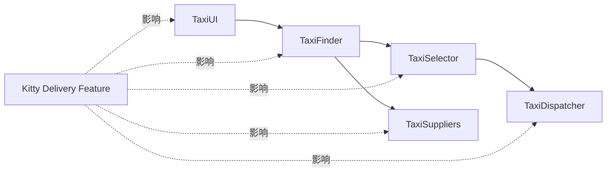
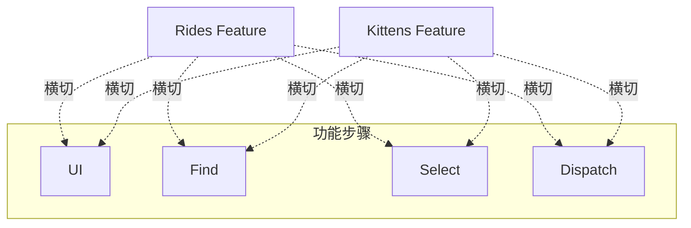
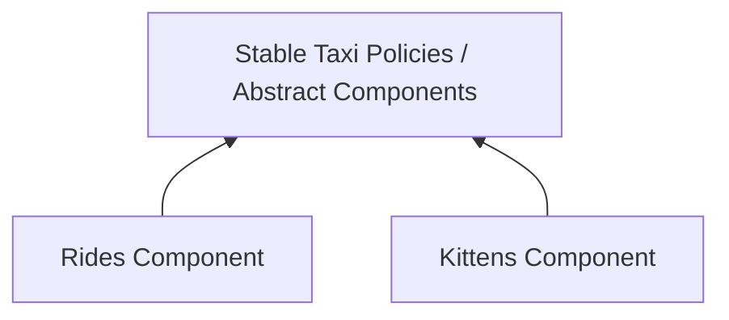
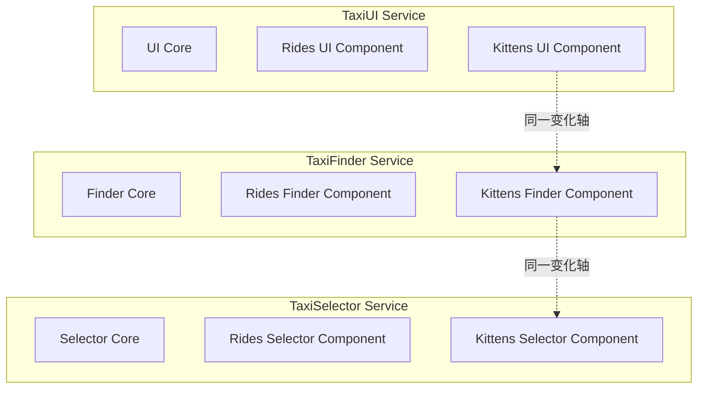

> 原书：Robert C. Martin, *Clean Architecture: A Craftsman's Guide to Software Structure and Design* 
> 本章：Chapter 27, Services: Great and Small 
> 原文参考：Clean Architecture.md

## 本章导读

Service-Oriented Architecture 与 Microservice Architecture 流行时，人们常把服务本身当作架构质量的保证：

- 服务运行在不同进程，因此天然强解耦；
- 每个服务可由独立团队负责，因此天然独立开发；
- 每个服务可以单独发布，因此天然独立部署；
- 把系统拆得足够小，就会自然获得可扩展架构。

第 27 章专门挑战这些说法。

作者并不反对服务，也不否认服务能带来重要收益。他要澄清的是：

> **服务是一种进程与通信边界，不会自动成为架构边界。**

真正的架构边界由以下内容定义：

- 它是否分隔高层 Policy 与低层 Detail；
- 跨界 Source Code Dependency 是否遵守 Dependency Rule；
- 一侧变化是否能被阻止传播到另一侧；
- 新功能能否通过扩展加入，而少修改稳定核心。

服务本质上可以被理解为：

> **跨越进程或平台边界的昂贵 Function Call。**

某些服务调用跨越真正架构边界，具有架构意义；另一些只是把两个行为放到不同进程，不具有特殊架构意义。

本章用出租车聚合系统说明这一点。

原系统被拆成多个 Microservice：

- `TaxiUI`；
- `TaxiFinder`；
- `TaxiSelector`；
- `TaxiDispatcher`；
- 各种 `TaxiSupplier`。

后来市场部门提出 Kitty Delivery，也就是小猫配送：

- 选择附近小猫收集点；
- 选择参与计划的出租车供应商；
- 排除对猫过敏的司机；
- 对过敏客户排除最近三天运过猫的车辆；
- 把小猫送到客户地址。

结果是：所有服务都要修改、协调、测试和部署。

这就是 Cross-Cutting Concern 的问题：

- 服务按原有功能步骤横向拆分；
- 新业务功能却垂直切过所有步骤；
- 进程分离没有阻止变化传播；
- 服务团队仍然必须锁步协调。

作者随后给出两步修复思路：

1. 使用 SOLID、Template Method、Strategy 与 Factory，把 Rides 与 Kittens 做成可插拔 Feature Component；
2. 服务仍然可以保留，但每个服务内部也必须具有组件架构，让横切 Feature 以插件形式贯穿服务，而不是修改所有服务核心。

本章最反直觉的结论是：

> **系统的架构边界不一定落在服务之间；它们可能穿过一组服务，把每个服务内部切成高层政策、稳定抽象和低层功能插件。**

因此：

- 一个 Service 可能就是一个完整架构组件；
- 一个 Service 也可能包含多个由架构边界分隔的组件；
- Client 与 Service 甚至可能紧耦合到根本没有架构意义；
- 物理拓扑不能替代源码依赖设计。

本章没有数学公式，也没有需要推导的算法。其论证是一种反例驱动的架构分析：先检验流行主张，再用横切变化暴露隐藏耦合，最后把 OCP 与 Dependency Rule 应用到服务内部。

## 1. 服务为何如此有吸引力

### 1.1 进程隔离看起来像强解耦

不同服务通常拥有：

- 独立进程；
- 独立地址空间；
- 独立运行时；
- 独立端口；
- 显式网络接口。

一个服务不能直接读取另一个服务的普通变量，因此边界似乎非常牢固。

### 1.2 网络接口看起来比函数接口正式

服务通常拥有：

- HTTP API；
- RPC IDL；
- Message Schema；
- OpenAPI Document；
- Versioned Endpoint；
- Authentication Contract。

这些机制让接口显得正式、清楚和可治理。

### 1.3 独立制品看起来支持独立部署

每个服务可以拥有：

- 独立 Repository；
- 独立 Build；
- 独立 Container Image；
- 独立 CI/CD Pipeline；
- 独立 Version；
- 独立 Rollback。

### 1.4 团队所有权看起来支持规模化

组织可以让一个小团队负责：

- 开发；
- 测试；
- 发布；
- 监控；
- On-Call；
- 运行成本。

这与 DevOps 的“you build it, you run it”精神相符。

### 1.5 服务还能提供真实运行收益

合理服务边界可以支持：

- 独立伸缩；
- 故障隔离；
- 资源隔离；
- 安全域隔离；
- 异构技术栈；
- 跨机器部署；
- 独立生命周期。

作者没有否认这些收益。

### 1.6 本章为何仍要质疑

问题在于把这些物理与组织收益推导成：

- 自动低耦合；
- 自动独立开发；
- 自动独立部署；
- 自动良好架构。

这些结论并不成立。

### 1.7 物理隔离与逻辑隔离不同

服务可以物理分开，却在逻辑上通过以下方式紧密耦合：

- 共享数据模型；
- 共享数据库；
- 同步调用链；
- 共同业务规则；
- 协议字段语义；
- 发布顺序；
- 跨服务事务；
- 锁步版本。

### 1.8 架构问题不能只看部署图

部署图告诉我们：

- 进程在哪里运行；
- 怎样通信；
- 哪些节点可以伸缩。

源码依赖图与变化图告诉我们：

- 谁知道谁；
- 谁因谁而变化；
- 哪些团队必须协调；
- 哪个政策被哪个细节控制。

两类图都需要，但不能互相替代。

## 2. Service Architecture?

### 2.1 使用服务本身不是架构

原书对“服务天然构成架构”的说法给出直接否定。

一个系统是否具有良好架构，不能只看它是否包含：

- REST Service；
- Microservice；
- Message Broker；
- Service Mesh；
- Container；
- API Gateway。

### 2.2 架构由什么定义

根据前文，架构由边界定义。

这些边界：

- 分隔高层 Policy 与低层 Detail；
- 遵守 Dependency Rule；
- 控制变化传播；
- 让低层插件到高层。

### 2.3 服务可能只是行为分割

假设把：

- 查找候选车；
- 选择车辆；
- 派发车辆；

分别放进不同服务。

这只说明运行行为被分到不同进程，不证明它们位于不同政策层级，也不证明变化能够独立。

### 2.4 “昂贵函数调用”类比

作者把服务调用类比为跨进程或平台的 expensive function calls，也就是昂贵的 Function Call。

它比普通函数多了：

- 序列化；
- 网络；
- 延迟；
- 超时；
- 重试；
- 部分失败；
- 认证；
- 版本兼容。

因此它更昂贵，却不因此更有架构意义。

### 2.5 函数调用也有不同意义

在单体中：

- 某些函数调用跨越真正架构边界；
- 某些函数调用只把一个算法拆成辅助函数。

不能说每个函数都是架构组件。

服务也是如此。

### 2.6 具有架构意义的服务

服务边界若同时：

- 分隔不同政策层级；
- 保护高层业务；
- 拥有正确依赖方向；
- 阻止低层变化传播；
- 支持真实独立生命周期；

它才具有显著架构意义。

### 2.7 不具架构意义的服务仍可能有价值

一个服务即使不跨架构边界，也可能用于：

- 分摊 CPU；
- 隔离故障；
- 使用专门硬件；
- 接入遗留平台；
- 跨地域运行；
- 独立资源控制。

作者只是要求不要把运行价值误称为架构保证。

### 2.8 服务粒度不能由代码行决定

“Micro”没有可靠的行数定义。

过小服务可能：

- 调用频繁；
- 协议众多；
- 业务被切碎；
- 团队认知成本上升。

服务边界应由政策、数据、团队和运行需求共同决定。

### 2.9 架构显著性是连续判断

有些服务完整包围一个业务能力，边界清楚。

有些服务只是技术 Worker。

有些服务与 Client 共享模型、数据库和发布，几乎没有独立性。

不应只用“是服务 / 不是服务”做二元评价。

## 3. Service Benefits?

### 3.1 标题中的问号

原书在 Service Benefits 后加问号，是要挑战流行正统观念。

重点审查两项常见主张：

1. Services are strongly decoupled；
2. Services support independent development and deployment。

### 3.2 为什么要逐项检验

技术宣传常把多个条件合并成一个结论。

作者的分析方法是：

- 明确主张；
- 承认其中真实部分；
- 找出未被证明的跳跃；
- 用具体变化场景测试。

### 3.3 不采取全盘否定

原书多次说“there is some truth”。

这说明目标不是反微服务，而是去掉绝对化神话。

### 3.4 评估收益需要问什么

- 解耦发生在哪一层？
- 哪些数据仍然共享？
- 哪些行为仍然锁步？
- 部署是否真的独立？
- 团队是否仍需协调？
- 新业务变化会切过多少服务？

## 4. The Decoupling Fallacy

### 4.1 物理变量隔离确实存在

不同进程通常不能直接访问彼此的：

- Stack；
- Heap Object；
- Ordinary Variable；
- Pointer。

这一点比同进程模块边界更强。

### 4.2 但共享资源仍会耦合服务

服务可能共享：

- Processor；
- Network；
- Database；
- Queue；
- Cache；
- File System；
- Rate Limit；
- External Provider。

一个服务的负载或故障可能拖累其他服务。

### 4.3 数据是更强的隐藏耦合

服务经常交换 Data Record。

如果新增一个 Field：

- 生产者需要写入；
- 消费者需要解析；
- 使用该字段的服务需要更新；
- 所有服务必须同意其含义；
- Version Compatibility 必须协调。

### 4.4 字段语义比字段格式更重要

即使 Schema 向后兼容，服务仍需共同理解：

- 单位；
- 时区；
- 是否可空；
- 默认值；
- 枚举含义；
- 生命周期；
- 业务约束。

语法兼容不等于语义解耦。

### 4.5 一个共享记录示例

出租车候选记录可能包含：

- Vehicle ID；
- Supplier ID；
- Pickup Time；
- Cost；
- Luxury Level；
- Driver Experience。

Kitty Feature 又需要：

- Driver Cat Allergy；
- Vehicle Last Kitty Delivery Time；
- Supplier Participates In Kitty Program；
- Collection Point。

所有读取候选记录的服务都可能受影响。

### 4.6 共享数据库耦合更强

若多个服务直接访问同一表：

- Schema 变化必须协调；
- Migration 影响多方；
- 数据所有权模糊；
- 一个查询可能破坏另一个服务性能；
- 独立部署受限。

### 4.7 Temporal Coupling

同步调用要求：

- 被调用服务此刻可用；
- 延迟在预算内；
- 调用顺序正确；
- 超时策略一致。

服务虽物理分离，运行时仍可能高度耦合。

### 4.8 Behavioral Coupling

服务之间可能共享业务流程：

- A 必须先成功；
- B 才能执行；
- C 需要补偿；
- D 最终确认。

流程政策横跨多个服务时，变化仍会同时影响它们。

### 4.9 Operational Coupling

服务还可能通过以下内容耦合：

- 共同部署窗口；
- Shared Secret；
- Service Mesh Policy；
- Certificate Rotation；
- Incident Response；
- Capacity Planning。

### 4.10 接口正式不表示接口更好

服务接口通常显式，但函数接口同样可以：

- 强类型；
- 有版本；
- 有文档；
- 有契约测试；
- 有行为约束。

网络并不会自动让接口更严谨。

### 4.11 服务接口甚至可能更难演化

因为：

- 调用者版本未知；
- 部署不同步；
- 消息已在途中；
- 外部客户无法同时升级；
- 协议兼容期限更长。

### 4.12 真正解耦需要什么

- 清楚数据所有权；
- 最小稳定契约；
- 行为语义明确；
- 避免共享内部模型；
- 兼容演化；
- 变化轴正确；
- Dependency Rule；
- 组件内 OCP。

### 4.13 “Fallacy”并非全盘虚假

服务确实隔离变量和地址空间。

谬误在于从这种局部隔离推出“整体强解耦”。

## 5. The Fallacy of Independent Development and Deployment

### 5.1 流行主张

每个服务由专门团队负责：

- Build；
- Maintain；
- Operate；
- Deploy。

大量服务就可以由大量团队并行开发。

### 5.2 这项主张何时成立

当服务：

- 业务边界内聚；
- 数据独立拥有；
- 协议稳定；
- 不需锁步更新；
- 可独立测试；
- 运行故障隔离；
- 团队具备完整能力。

### 5.3 服务不是大型系统唯一选择

原书提醒，历史已经证明大型 Enterprise System 也可以由：

- Monolith；
- Component-Based System；
- Service-Based System；

成功构建。

服务不是可规模化开发的唯一途径。

### 5.4 模块化单体也能支持团队独立

如果组件：

- 有稳定接口；
- 有清楚所有权；
- 依赖图无环；
- 可以独立测试；
- 变化被限制；

多个团队可以在同一部署物内并行工作。

### 5.5 数据耦合会破坏独立开发

如果多个服务共享同一 Record 或 Schema，新字段会要求：

- 多团队协商；
- 同步实现；
- 集成测试；
- 版本计划。

### 5.6 行为耦合会破坏独立部署

一个跨服务 Use Case 若改变：

- 多个 Endpoint；
- 调用顺序；
- 错误语义；
- 事务补偿；

服务必须协调发布。

### 5.7 Independent Deployability 不是“有独立 Pipeline”

即使技术上能单独部署，如果部署后：

- 调用者立即失败；
- 数据不兼容；
- 业务流程不完整；
- 必须同时打开 Feature Flag；

它并不具备真实独立部署能力。

### 5.8 独立部署需要兼容演化

常见手段：

- Expand / Contract；
- Consumer-Driven Contract Test；
- Versioned Message；
- Tolerant Reader；
- Feature Flag；
- Rolling Upgrade；
- Backward / Forward Compatibility。

但这些手段增加成本，也不能修复错误业务边界。

### 5.9 团队独立性是结果，不是服务数量函数

团队能否独立，取决于：

- 变更是否局部；
- 数据是否独立；
- 契约是否稳定；
- 业务边界是否正确；
- 运行责任是否清楚。

### 5.10 原书的结论

服务在一定程度上支持独立开发部署，但只在它们没有被数据与行为紧耦合时成立。

## 6. The Kitty Problem

### 6.1 出租车聚合系统背景

系统知道城市中多个 Taxi Provider，让用户按条件预订出租车。

选择条件包括：

- Pickup Time；
- Cost；
- Luxury；
- Driver Experience；
- 其他用户偏好。

### 6.2 为什么选择 Microservices

团队希望系统具有扩展性，因此：

- 拆成许多小服务；
- 把开发人员拆成许多小团队；
- 每个团队负责少量服务；
- 团队承担开发、维护和运行。

### 6.3 Figure 27.1 的服务结构

主要服务包括：

- `TaxiUI`；
- `TaxiFinder`；
- `TaxiSelector`；
- `TaxiDispatcher`；
- `TaxiSupplier` Integrations。

### 6.4 `TaxiUI`

负责与客户交互。

客户通过移动设备：

- 输入位置；
- 指定时间；
- 设置价格与豪华程度偏好；
- 请求车辆。

### 6.5 `TaxiFinder`

检查不同 TaxiSupplier 的车辆库存。

它确定可能满足用户需求的候选出租车，并把候选放入与用户关联的短期 Data Record。

### 6.6 `TaxiSelector`

读取候选记录与用户条件：

- Cost；
- Time；
- Luxury；
- Driver Experience。

再选择合适出租车。

### 6.7 `TaxiDispatcher`

接收已选择车辆，并向相应供应商下单派车。

### 6.8 一年后的新需求

系统稳定运行一年多，团队持续新增功能并维护服务。

市场部门提出 Kitty Delivery：用户可以订购小猫，把它们送到住宅或办公地点。

### 6.9 Kitten Collection Points

公司会在城市中设置多个小猫收集点。

订单发生时，系统要：

1. 找到附近收集点；
2. 找到合适出租车；
3. 让车辆去收集小猫；
4. 把小猫送到客户地址。

### 6.10 Supplier Participation

一部分 Taxi Supplier 参与计划：

- 已有一家同意；
- 其他可能加入；
- 另一些可能拒绝。

候选搜索与派发都要理解参与状态。

### 6.11 Driver Allergy

部分司机对猫过敏。

这些司机绝不能被 Kitty Delivery 选中。

这影响：

- Supplier Data；
- Candidate Finding；
- Selection Policy；
- Dispatch Validation。

### 6.12 Customer Allergy

部分客户也可能过敏。

若客户声明猫过敏，最近三天运过猫的车辆不能为他提供普通出租车服务。

### 6.13 Last 3 Days：三天历史要求

系统必须记录或查询：

- Vehicle 是否运送过 Kitty；
- 最近一次 Kitty Delivery 时间；
- 当前客户过敏状态；
- 三天窗口判断。

### 6.14 哪些服务必须改变

答案是：全部。

**TaxiUI：**

- 新 Kitty Order 输入；
- 客户 Allergy 信息；
- 新输出状态。

**TaxiFinder：**

- 搜索 Collection Point；
- 过滤参与 Supplier；
- 过滤不合适车辆与司机。

**TaxiSelector：**

- 新 Kitty Criteria；
- Driver Allergy；
- Vehicle Delivery History；
- Customer Allergy。

**TaxiDispatcher：**

- 新取猫与送猫路线；
- Supplier Kitty Protocol；
- 派发语义。

**TaxiSupplier Integration：**

- 参与状态；
- Driver / Vehicle 新数据；
- 新订单类型。

### 6.15 为什么必须协调开发

多个团队要共同决定：

- 新字段；
- 字段语义；
- 服务 API；
- 发布顺序；
- Feature Flag；
- 测试数据；
- 回滚方案。

### 6.16 为什么必须协调部署

如果只部署其中一部分：

- UI 可能发送旧服务不理解的数据；
- Finder 可能产生 Selector 不理解的候选；
- Dispatcher 可能无法处理 Kitty Ride；
- Supplier Adapter 可能错误派车。

### 6.17 微服务没有阻止横切变化

物理边界仍然存在，但业务变化沿功能流程切过了全部服务。

服务无法独立演进，因为它们共同实现一个端到端 Use Case。

### 6.18 Kitty Problem 的一般形式

类似横切需求包括：

- 全系统审计；
- 新权限政策；
- 多租户；
- 数据隐私；
- 新订单类型；
- 促销；
- 合规；
- 新客户渠道。

这些功能很难只落在单个功能服务中。

## 7. Cross-Cutting Concern 为什么击穿功能分解

### 7.1 原服务按处理步骤分解

出租车服务按流水线步骤组织：

- UI；
- Find；
- Select；
- Dispatch。

这是一种 Functional Decomposition。

### 7.2 新功能按业务变体切入

Kitty Delivery 不是流水线中的一个新步骤。

它是整条流水线的新变体：

- Kitty UI；
- Kitty Finding；
- Kitty Selection；
- Kitty Dispatch。

### 7.3 两个分解轴相交

### 7.4 只按步骤分解的脆弱性

每新增一个端到端 Feature，都要修改各步骤。

因此：

- 服务数没有减少变更数；
- 团队数反而增加协调；
- 协议成为新耦合面；
- 独立部署失效。

### 7.5 这不是微服务独有问题

Monolith 若按：

- Controller；
- Service；
- Repository；

纯技术层分解，也会遇到相同横切问题。

### 7.6 问题根源是错误变化轴

架构围绕“处理步骤”组织，而新需求围绕“业务变体”变化。

组件边界与变化边界不一致。

### 7.7 为什么不能预测所有横切需求

未来可能出现：

- Kitty；
- Package Delivery；
- Wheelchair Ride；
- Medical Transport；
- Electric Vehicle Preference。

无法为每项未来需求预先设计全部插件。

### 7.8 但可以保护稳定处理骨架

可以把稳定步骤抽象为：

- Finder；
- Selector；
- Dispatcher；
- UI Flow。

再让不同 Feature 提供可扩展策略。

### 7.9 OCP 的角色

Open-Closed Principle 要求：

- 增加 Kitty Feature 时扩展系统；
- 尽量不修改已有 Rides 与稳定服务核心。

### 7.10 SRP 与 CCP 的角色

- Rides 因普通乘车需求变化；
- Kittens 因小猫配送需求变化；
- 基础流程因通用调度机制变化。

这些变化原因应进入不同组件。

## 8. Objects to the Rescue

### 8.1 作者为何转向 Object Model

作者问：在 Component-Based Architecture 中怎样解决 Kitty Problem？

答案来自 SOLID 与 Polymorphism。

### 8.2 Figure 27.2 的总体策略

图中的类大致对应原服务：

- UI；
- Finder；
- Selector；
- Dispatcher；
- Supplier。

但关键不同是加入了真正架构边界与依赖方向。

### 8.3 保留稳定基础逻辑

原服务中的通用逻辑保留在 Base Class 或稳定抽象中，例如：

- 候选发现骨架；
- 选择流程；
- 派发流程；
- 通用供应商交互。

### 8.4 抽取 Ride-Specific Logic

只适用于普通乘车的行为被提取到 `Rides` Component。

它不再散布于所有基础类。

### 8.5 新建 Kittens Component

小猫配送相关行为集中到 `Kittens` Component：

- Collection Point；
- Driver Allergy；
- Customer Allergy；
- Three-Day Vehicle Rule；
- Kitty Dispatch。

### 8.6 两个 Feature Component 怎样接入

`Rides` 与 `Kittens` 通过多态扩展基础抽象。

原书提到可使用：

- Template Method；
- Strategy。

### 8.7 Template Method

Base Class 定义稳定流程：

1. 找候选；
2. 过滤；
3. 选择；
4. 派发。

子类覆盖特定 Hook：

- eligibility；
- ranking；
- dispatch details。

### 8.8 Strategy

上下文依赖抽象策略：

- Candidate Policy；
- Selection Policy；
- Dispatch Policy。

`RideStrategy` 与 `KittyStrategy` 分别实现。

### 8.9 两种模式怎样选择

**Template Method：**

- 稳定算法骨架明确；
- 变体只覆盖少量步骤；
- 继承耦合可接受。

**Strategy：**

- 需要运行时组合；
- 多个变化维度；
- 希望避免继承刚性；
- 测试替换频繁。

### 8.10 Dependency Rule

Rides 与 Kittens 都依赖更稳定的抽象组件。

基础组件不依赖具体 Feature。

### 8.11 Factory 由 UI 控制

原书指出，具体 Feature Class 由 UI 控制的 Factory 创建。

UI 知道用户请求的是：

- 普通 Ride；
- Kitty Delivery。

Factory 选择相应 Feature 实现并注入流程。

### 8.12 为什么 TaxiUI 仍需改变

新增 Kitty Feature 后，TaxiUI 需要：

- 暴露新用例；
- 收集新输入；
- 选择 Kittens Component。

这是合理变化，因为系统对用户增加了新能力。

### 8.13 为什么其他稳定组件不需修改

Finder、Selector、Dispatcher 的稳定抽象已经支持插件策略。

新增 Feature 主要通过：

- 新 Component；
- 新实现类；
- Factory Registration；

完成。

### 8.14 独立制品

Kittens 可以作为新的：

- `.jar`；
- Gem；
- DLL；
- Plugin Package。

加载后扩展系统，而不修改原稳定组件。

### 8.15 这才是独立开发部署

Kittens Team 可以：

- 开发 Feature Component；
- 运行契约测试；
- 独立发布组件；
- 在运行时加载。

独立性来自组件边界与 OCP，不只来自进程分离。

### 8.16 对象不是目的，多态才是关键

不一定必须使用传统 Class Inheritance。

也可以使用：

- Function Strategy；
- Trait；
- Protocol；
- Module Interface；
- Plugin Registry；
- Composition。

关键是稳定高层不依赖具体 Feature。

## 9. 为什么“Objects to the Rescue”不是回到巨型单体

### 9.1 作者不是否定服务

对象组件方案展示的是依赖结构。

同一结构可以：

- 全部同进程；
- 分成部署组件；
- 运行在服务内部；
- 跨服务部署。

### 9.2 组件边界与服务边界正交

- Component 决定源码依赖和变化隔离；
- Service 决定进程、网络与运行隔离。

二者可以组合。

### 9.3 对象模型也可能设计很差

如果：

- Base Class 巨大；
- 继承层次脆弱；
- 所有 Feature 共享状态；
- Factory 硬编码到处散布；
- 接口过宽；

仍然会耦合。

### 9.4 插件点要来自真实变化轴

不能为所有想象 Feature 预先建立 Hook。

Kitty Problem 已经提供实际变化证据，因此抽取 Feature Axis 有依据。

### 9.5 避免 Feature Flag 蔓延

如果在每个服务中加入：

- `if kitty`；
- `if ride`；
- `if package`；

横切分支会继续增长。

多态组件把变体集中。

## 10. Component-Based Services

### 10.1 服务能否采用同样结构

原书明确回答：

> **当然可以。**

服务不必是 Little Monolith。

### 10.2 什么是 Little Monolith

一个 Service 内部若：

- 所有代码紧密耦合；
- 无组件边界；
- 业务和 Framework 混合；
- 每次 Feature 修改整个服务；

它只是部署较小的单体，而非自动拥有好架构。

### 10.3 服务内部仍应应用 SOLID

每个服务内部仍需：

- SRP；
- OCP；
- LSP；
- ISP；
- DIP；
- 组件无环与稳定依赖。

网络边界不能取代这些原则。

### 10.4 Java 服务的抽象组件

原书建议把服务想成：

- 一个或多个 `.jar` 中的 Abstract Class；
- 稳定核心定义扩展契约；
- 新 Feature 由另一个 `.jar` 中的派生类提供。

### 10.5 Feature Component

新的 Rides 或 Kittens Feature 可以：

- 独立 Component；
- 实现服务内部抽象；
- 添加到每个相关服务的 Load Path；
- 不修改原稳定组件。

### 10.6 原书的动态加载语境

作者描述“添加 `.jar` 到 Load Path，而不是重新部署服务”。

在现代 Immutable Infrastructure 中，通常仍会：

- 构建新 Image；
- 滚动部署 Service；
- 加载新组件版本。

应理解为：业务核心组件无需修改，Feature 作为独立制品加入；不必机械理解为 Production Process 永远不重启。

### 10.7 Figure 27.3

服务仍然存在，但每个服务内部都有：

- Stable Abstract Component；
- Rides Feature Component；
- Kittens Feature Component；
- Factory / Loader。

### 10.8 横切 Feature 怎样贯穿多个服务

Kittens Component 可能在：

- UI Service；
- Finder Service；
- Selector Service；
- Dispatcher Service；

各有一部分实现。

这些实现属于同一 Feature 变化轴，可以由共同组件或协调版本管理。

### 10.9 是否仍要部署多个位置

是的，若服务物理分离，Feature Component 需要进入多个 Service Runtime。

但稳定服务核心无需被修改；变化以插件扩展形式出现。

### 10.10 OCP 的真正收益

新增 Feature 从：

- 修改多个已有服务核心；

变成：

- 添加多个遵守共同契约的 Feature Plugin；
- 更新组装与加载。

仍有集成工作，但爆炸范围更可控。

### 10.11 Feature Component 的版本问题

需要管理：

- Core Contract Version；
- Feature Plugin Version；
- 各服务兼容版本；
- Rolling Upgrade；
- Feature Flag；
- Contract Test。

组件化不是零治理成本。

### 10.12 服务内部组件测试

**Core Contract Test：**

- 抽象流程与不变量。

**Feature Test：**

- Kitty 过敏与三天规则。

**Service Adapter Test：**

- 网络、序列化和加载。

**End-to-End Test：**

- 完整 Kitty Delivery。

### 10.13 Component-Based Service 的收益

- 服务内部变化局部化；
- Feature 更接近 OCP；
- 核心可独立测试；
- Framework 留在外层；
- 新变体减少条件分支；
- 服务拓扑与业务组件结构分开演化。

### 10.14 成本与局限

- 插件接口设计；
- 多服务组件发布；
- Loader 与 Factory；
- 版本兼容；
- 调试复杂度；
- 跨服务端到端测试；
- 可能过度抽象。

## 11. Cross-Cutting Concerns

### 11.1 架构边界不一定在服务之间

本章最重要的结论之一：

> **Architectural Boundaries do not fall between Services。**

至少不能假定它们天然落在那里。

### 11.2 边界可能穿过服务

Rides 与 Kittens 是业务变化轴。

它们横穿：

- UI Service；
- Finder Service；
- Selector Service；
- Dispatcher Service。

因此架构边界也穿过这些服务，把每个服务内部切成稳定核心与 Feature Component。

### 11.3 Figure 27.4

### 11.4 物理拓扑与业务变化轴正交

可以把系统看成矩阵：

| Feature / Service | UI | Finder | Selector | Dispatcher |
| --- | --- | --- | --- | --- |
| Rides | Rides UI | Rides Finder | Rides Selector | Rides Dispatcher |
| Kittens | Kitty UI | Kitty Finder | Kitty Selector | Kitty Dispatcher |
| Future Feature | 新 UI | 新 Finder | 新 Selector | 新 Dispatcher |

服务按列组织运行职责，Feature 按行组织业务变化。

### 11.5 哪个方向更应该形成组件

两者都可能形成组件：

- Service Column 是部署和运行组件；
- Feature Row 是变化与发布组件；
- Stable Core 是高层政策组件。

架构师需要同时管理两个维度。

### 11.6 这与第 16 章的矩阵一致

第 16 章说明系统同时存在：

- Horizontal Layers；
- Vertical Use Cases。

第 27 章说明即使采用服务，Vertical Feature 仍会横切服务拓扑。

### 11.7 横切关注点不只指技术能力

常见 Cross-Cutting Concern 也可能是：

- Audit；
- Authorization；
- Privacy；
- Multi-Tenancy；
- Localization；
- New Product Type。

其中有些是技术机制，有些是业务 Feature。

### 11.8 不应把所有横切逻辑放进共享库

一个巨大 Common Library 会：

- 产生锁步版本；
- 扩大依赖；
- 混合变化原因；
- 破坏 CRP。

应按真实政策与 Feature 分离组件。

### 11.9 Aspect-Oriented Programming 不是唯一答案

AOP 适合某些技术横切逻辑，如：

- Logging；
- Metrics；
- Transaction Decoration。

Kitty Delivery 是完整业务变体，通常需要显式领域组件，而不是隐式切面。

### 11.10 Boundary 仍需遵守 Dependency Rule

每个 Feature Component 应依赖稳定 Core Contract。

Core 不依赖 Rides、Kittens 或未来 Feature。

### 11.11 Factory 与组装边界

Main / UI 控制 Factory：

- 根据请求选择 Feature；
- 创建对应策略；
- 连接服务内部组件；
- 保持具体类在外层。

### 11.12 数据契约也要按 Feature 隔离

不要在所有服务共享 Record 中不断增加：

- Kitty-Only Field；
- Ride-Only Field；
- Future Feature Field。

可以使用：

- Feature-Specific Message；
- 独立 Contract；
- Tagged Union；
- Extension Payload；
- 内部模型转换。

选择取决于兼容与查询需求。

## 12. Conclusion

### 12.1 服务确实有用

原书承认服务有助于：

- Scalability；
- Develop-Ability；
- Process Separation；
- Platform Distribution。

### 12.2 但服务本身没有必然架构意义

服务只是物理执行与通信机制。

架构意义来自：

- 边界；
- 政策层级；
- 依赖方向；
- 变化隔离。

### 12.3 一个服务可能是单一组件

如果服务：

- 内聚；
- 被完整架构边界包围；
- 拥有独立政策；
- 数据与发布独立；

它可以对应一个架构组件。

### 12.4 一个服务可能包含多个组件

服务内部可以包含：

- Core Policy；
- Rides Plugin；
- Kittens Plugin；
- Framework Adapter；
- Database Gateway。

架构边界位于服务内部。

### 12.5 Client 与 Service 可能毫无架构独立性

若它们：

- 共享数据模型；
- 锁步部署；
- 共享数据库；
- 共同变化；
- 接口只是远程对象镜像；

物理分离并没有形成有意义架构边界。

### 12.6 通信方式不定义架构

使用：

- Function Call；
- IPC；
- HTTP；
- Message Queue；
- gRPC；

不能单独决定架构质量。

### 12.7 本章完整论证链

1. 服务看似强解耦并支持独立开发部署；
2. 服务本身只是跨进程的昂贵 Function Call；
3. 物理变量隔离只提供局部解耦；
4. 服务仍通过共享资源、数据、行为、时序与运维耦合；
5. 网络接口并不天然比函数接口更正式；
6. 数据和行为耦合会迫使团队协调开发与部署；
7. Kitty Feature 横切出租车聚合系统的所有服务；
8. 因此服务团队不能独立实现和发布该功能；
9. 问题根源是按步骤功能分解与业务变化轴不一致；
10. SOLID 与多态可把稳定处理骨架与 Feature 变体分开；
11. Rides 与 Kittens 作为独立 Component 扩展 Base Policy；
12. Factory 在外层选择具体 Feature；
13. 服务内部也可以采用同样组件架构；
14. 新 Feature 通过新 `.jar`、Gem 或 DLL 接入；
15. 架构边界可能穿过服务，而不是天然位于服务之间；
16. 最终应由组件依赖与 Dependency Rule 定义架构。

## 13. 作者分析问题的完整思路

### 13.1 先列出流行收益

作者不从个人偏好出发，而是准确列出服务支持者的两项主要主张。

### 13.2 承认局部事实

- 地址空间确实隔离变量；
- 服务确实有显式接口；
- 团队确实可以拥有独立 Pipeline。

### 13.3 寻找推理跳跃

局部隔离不等于整体解耦。

技术上可部署不等于业务上可独立部署。

### 13.4 用变化而非静态图检验架构

Kitty Feature 是压力测试：

- 它要求哪些组件变化？
- 哪些团队必须协调？
- 哪些部署必须同步？

架构质量在变化中显现。

### 13.5 找到根因

原分解围绕处理步骤，Kitty 围绕业务 Feature 横切。

真正边界与变化轴不一致。

### 13.6 回到已验证原则

解决方案不是发明新网络机制，而是使用：

- SRP；
- CCP；
- OCP；
- DIP；
- Template Method；
- Strategy；
- Factory。

### 13.7 把对象方案再推广回服务

作者没有停在“单体更好”。

他证明服务内部也能有插件组件，从而把逻辑架构与物理拓扑组合起来。

### 13.8 提炼最终一般结论

架构由组件边界与依赖定义，而不是由进程、网络和部署拓扑定义。

## 14. 在现代系统中应用本章方法

### 14.1 同时画三张图

**Deployment Diagram：**

- Service；
- Process；
- Database；
- Network。

**Source Dependency Diagram：**

- Module Import；
- Port；
- Adapter；
- Component。

**Change Map：**

- 一个 Feature 修改哪些部分；
- 哪些团队共同变化；
- 哪些发布锁步。

### 14.2 审查共享数据

对每个跨服务 Record 问：

- 谁拥有 Schema？
- 谁能添加字段？
- 含义由谁定义？
- 哪些消费者真正需要？
- 能否使用 Feature-Specific Contract？
- 兼容期限多长？

### 14.3 审查同步调用链

- 一个 Use Case 经过多少服务？
- 是否必须同时可用？
- 谁负责超时和补偿？
- 是否存在 Chatty Call？
- 能否把政策聚合到更内聚边界？

### 14.4 审查独立部署真实性

尝试只部署一个服务，并回答：

- 旧消费者能否继续工作？
- 数据是否兼容？
- 是否必须同步 Feature Flag？
- 是否需要其他服务同版本？
- 回滚是否独立？

### 14.5 识别横切 Feature

从最近需求中寻找：

- 同时修改多个服务；
- 同时新增多个字段；
- 同时修改多个团队组件；
- 同时调整多条协议。

这些 Feature 可能揭示真正架构边界。

### 14.6 抽取稳定骨架

寻找跨 Feature 共同且稳定的流程：

- Find；
- Select；
- Dispatch；
- Validate；
- Persist。

再把 Feature-Specific Policy 插件化。

### 14.7 选择多态机制

可使用：

- Strategy Object；
- Template Method；
- Function Injection；
- Plugin Interface；
- Event Handler；
- Component Registry。

选择应符合语言、部署和变化需求。

### 14.8 在服务内部划组件

禁止把 Service 当成不可再分的 Little Monolith。

在服务内明确：

- Core；
- Port；
- Adapter；
- Feature Plugin；
- Framework Glue。

### 14.9 自动守卫 Dependency Rule

CI 可以检查：

- Core 不依赖 Feature；
- Core 不依赖 Framework；
- Kittens 依赖 Stable Contract；
- 服务内组件图无环；
- 外部 DTO 不进入核心。

### 14.10 谨慎对待动态插件

动态加载有：

- 安全；
- 版本；
- ClassLoader；
- 生命周期；
- 故障诊断。

也可以在构建期组合 Feature Component，而不必运行时动态加载。

### 14.11 现代不可变部署的解释

在 Container 环境，增加 Feature 往往仍要构建和滚动部署新 Image。

独立性体现在：

- 原核心源码不修改；
- Feature 是独立 Component；
- 契约稳定；
- 变化局部。

不要机械追求“绝不重启服务”。

## 15. 一个现代电商类比

### 15.1 原服务分解

系统按步骤拆成：

- Order UI；
- Product Finder；
- Pricing；
- Payment；
- Fulfillment；
- Notification。

### 15.2 新 Subscription Feature

订阅商品需要：

- UI 新选项；
- 周期价格；
- 定期支付；
- 循环履约；
- 提醒；
- 暂停与取消。

它横切所有服务。

### 15.3 如果直接修改每个服务

- 多团队协调；
- 新共享字段；
- 同步发布；
- 条件分支扩散；
- 回滚困难。

这与 Kitty Problem 相同。

### 15.4 组件化方案

各服务内部定义 Stable Port：

- Pricing Policy；
- Payment Schedule；
- Fulfillment Policy；
- Notification Policy。

Subscription Component 实现这些契约。

### 15.5 现实限制

Feature 仍横跨多个部署单元，需要：

- 版本治理；
- 端到端测试；
- 数据演化；
- 发布协调。

组件化能降低核心修改，不会消除业务本身的跨域性质。

## 16. 适用范围与局限

### 16.1 不是每个横切需求都要插件化

一次性、低风险、小范围需求可能直接修改更简单。

应观察重复变化模式。

### 16.2 Template Method 有继承刚性

Base Class 变化可能影响全部子类。

组合式 Strategy 常更灵活，但类型与组装更多。

### 16.3 插件契约可能过早抽象

第一次 Kitty Feature 出现时，团队可能尚不知道未来 Package Delivery 的共同点。

接口应从真实用例提炼，而不是猜测万能模型。

### 16.4 Feature Component 仍可能共享数据

如果 Kittens 与 Rides 直接共享内部数据库模型，组件边界仍会泄漏。

### 16.5 跨服务 Feature 仍需协调

即使核心不改，新插件仍可能需要进入多个服务版本。

独立开发部署能力会提高，但不一定达到完全独立。

### 16.6 服务边界有真实物理收益

不要因本章批评就忽略：

- 伸缩；
- 故障隔离；
- 安全；
- 地域；
- 技术平台。

只是这些收益与架构边界是不同维度。

### 16.7 架构边界不一定按 Feature 划分

有些高层政策与低层 Detail 关系比 Feature Axis 更重要。

应综合：

- Policy Level；
- Change Axis；
- Team；
- Data；
- Operation。

## 17. 易混淆概念与常见误解

### 17.1 “使用 Microservices 就拥有架构”

错误。服务只是物理机制，架构由政策边界与 Dependency Rule 定义。

### 17.2 “不同进程等于强解耦”

只在变量与地址空间层面成立。数据、行为、时序和资源仍会耦合。

### 17.3 “有 OpenAPI 就比函数接口更严谨”

不一定。接口质量取决于语义、兼容、契约与治理，而非是否通过网络。

### 17.4 “一个服务一个团队就能独立开发”

只有在变化、数据和协议独立时成立。Kitty Feature 证明团队仍可能锁步。

### 17.5 “独立 Pipeline 就等于独立部署”

错误。若业务兼容要求同步发布，技术 Pipeline 独立没有解决问题。

### 17.6 “Monolith 无法支持大型团队”

错误。模块化组件、稳定接口与无环依赖也能支持大型开发。

### 17.7 “Kitty Problem 是因为服务拆得不够细”

不一定。继续按处理步骤细拆不会改变横切 Feature 轴，反而增加协议。

### 17.8 “Cross-Cutting Concern 只是日志和监控”

错误。新的业务类型、隐私、权限和多租户也会横切系统。

### 17.9 “Objects to the Rescue 表示应该取消服务”

错误。对象组件结构可以应用在服务内部。

### 17.10 “必须使用继承才能解决”

错误。Strategy、Function、Trait、Protocol 与 Composition 都可提供多态扩展。

### 17.11 “Template Method 永远优于条件分支”

错误。少量稳定变体可能用简单分支更清楚；模式应解决真实变化压力。

### 17.12 “新增插件后完全不需部署原服务”

在现代不可变部署中通常仍需构建并滚动部署新制品。重点是核心不改、Feature 独立。

### 17.13 “Kittens Component 让 Kitty Feature 只改一个文件”

错误。Feature 仍可能包含多个服务内插件与数据迁移；它只是按变化轴组织这些修改。

### 17.14 “架构边界一定在服务 API 上”

错误。本章结论正是边界可能穿过服务内部。

### 17.15 “一个服务只能包含一个组件”

错误。服务可由多个架构组件、Adapter 与插件组成。

### 17.16 “一个组件必须独占一个服务”

错误。组件可以同进程、跨进程或被多个服务制品复用。

### 17.17 “共享 Library 自动解决横切关注点”

错误。巨大共享库会制造版本耦合和 CRP 违规。

### 17.18 “AOP 能解决所有横切业务”

错误。完整业务变体需要显式领域组件，AOP 更适合有限技术切面。

### 17.19 “服务无架构意义，所以都应合并”

错误。服务可有真实运行价值，部分服务也确实包围架构边界。

### 17.20 “物理通信方式完全无关紧要”

错误。它影响延迟、故障和运维；只是不单独定义 Policy Boundary。

## 18. 实践检查与掌握练习

### 18.1 服务架构检查

- 服务边界分隔了哪些 Policy Level？
- 还是只分开处理步骤？
- 跨服务依赖是否遵守 Dependency Rule？
- 服务内部是否是 Little Monolith？
- 物理边界解决了什么运行问题？

### 18.2 解耦检查

- 是否共享 Database / Cache / Queue？
- 是否共享 Data Record？
- 字段语义由谁拥有？
- 是否存在同步调用链？
- 是否需要锁步版本？
- 一个服务过载是否拖累其他服务？

### 18.3 独立部署检查

- 能否只部署一个服务且保持兼容？
- 是否需要其他服务同步发布？
- 是否使用 Expand / Contract？
- 回滚是否独立？
- Feature Flag 是否协调？
- 数据迁移是否向后兼容？

### 18.4 横切变化检查

- 最近哪些 Feature 修改了多个服务？
- 是否按处理步骤而非变化轴分解？
- 新字段扩散到多少协议？
- 哪些团队必须共同发布？
- 是否存在稳定骨架与可插拔变体？

### 18.5 服务内部组件检查

- Core 是否依赖具体 Feature？
- Rides / Kittens 是否为独立 Component？
- 是否有 Stable Contract？
- Factory 是否位于外层？
- 服务内部组件图是否无环？
- Framework 是否止步 Adapter？

### 18.6 数据契约检查

- 是否不断给通用 Record 增加 Feature Field？
- 能否使用 Feature-Specific Message？
- 是否泄漏内部数据库模型？
- Consumer 是否容忍未知字段？
- 语义变化是否有版本策略？

### 18.7 场景判断一：两个服务共享同一表

**判断：** 物理分离但数据强耦合，独立部署与所有权可疑。

### 18.8 场景判断二：服务可独立发布但每次都同步上线

**判断：** 技术独立存在，业务独立不存在，应寻找共享变化轴。

### 18.9 场景判断三：Kitty Feature 只增加新插件组件

Core Contract 不变，各服务加载 Kitty Plugin。

**判断：** 更符合 OCP，但仍需组件版本与端到端验证。

### 18.10 场景判断四：Finder Service 内有 50 个 `if featureType`

**判断：** Feature 变体散布，应考虑 Strategy / Plugin Component。

### 18.11 场景判断五：服务只为独立 GPU 伸缩而存在

它未必跨架构 Policy Boundary。

**判断：** 仍可有运行价值，不必强行赋予业务架构意义。

### 18.12 场景判断六：单体按 Feature Component 组织

Kitty 作为独立 DLL 插件，核心不修改。

**判断：** 可以具有比错误服务分解更好的架构独立性。

### 18.13 场景判断七：服务内 ORM Entity 直接传播到其他服务

**判断：** Database Detail 通过协议泄漏，产生数据与版本耦合。

### 18.14 场景判断八：所有横切逻辑放进 `common` 包

**判断：** 很可能混合变化原因并强迫无关消费者升级，应按政策拆分。

### 18.15 快速复述练习

能够回答以下问题，基本就掌握了本章：

1. 服务流行的两项主要架构主张是什么？
2. 为什么服务本身不等于架构？
3. 服务为何可类比为昂贵 Function Call？
4. 什么样的服务边界具有架构意义？
5. 不具架构意义的服务仍有哪些运行价值？
6. The Decoupling Fallacy 承认了哪部分事实？
7. 服务通过哪些共享资源耦合？
8. 为什么共享 Data Record 会强耦合服务？
9. 字段格式兼容为何不等于语义兼容？
10. Temporal / Behavioral / Operational Coupling 分别是什么？
11. 服务接口为什么不天然优于函数接口？
12. Independent Development / Deployment 何时才成立？
13. 为什么大型系统不一定需要服务才能扩展团队？
14. 独立 Pipeline 为什么不等于独立部署？
15. TaxiUI、TaxiFinder、TaxiSelector、TaxiDispatcher 分别负责什么？
16. Kitty Delivery 增加了哪些业务条件？
17. Driver Allergy 与 Customer Allergy 如何影响选择？
18. 三天车辆历史规则要求哪些数据？
19. 为什么所有服务都要修改？
20. Kitty Problem 如何证明横切关注点问题？
21. Functional Decomposition 为什么脆弱？
22. Figure 27.2 怎样保留稳定基础逻辑？
23. Rides 与 Kittens Component 各自负责什么？
24. Template Method 与 Strategy 怎样支持扩展？
25. 为什么 TaxiUI 仍需改变，而其他稳定组件不改？
26. Factory 在哪里选择 Feature 实现？
27. Kittens 如何成为独立 `.jar`、Gem 或 DLL？
28. 服务内部怎样应用同样组件结构？
29. Figure 27.3 表达什么？
30. 现代不可变部署应如何理解“添加 jar 而不重新部署”？
31. 为什么架构边界可能穿过服务？
32. Figure 27.4 怎样表示横切 Feature？
33. 服务拓扑与业务变化轴有什么关系？
34. 本章最终如何定义系统架构？

### 18.16 一分钟记忆卡

- **误区：** 不同进程不等于整体强解耦。
- **本质：** 服务是跨进程或平台的昂贵 Function Call。
- **架构：** 由 Policy Boundary 与 Dependency Rule 定义，不由网络定义。
- **耦合：** 服务仍通过共享资源、数据、行为、时序和运维耦合。
- **独立：** 独立 Pipeline 不等于业务上可独立部署。
- **Kitty：** 新业务横切 UI、Finder、Selector、Dispatcher 和 Supplier。
- **根因：** 服务按处理步骤分解，Feature 按另一变化轴切入。
- **修复：** 稳定 Core + Rides / Kittens Feature Components。
- **模式：** Template Method、Strategy、Factory 与 OCP。
- **服务内部：** 也必须有 SOLID Component Architecture，不能只是 Little Monolith。
- **边界：** 可能穿过服务，而不是天然落在服务之间。
- **结论：** 物理拓扑解决运行问题，组件依赖决定架构问题。

## 19. 本章总结

1. 第 27 章挑战服务天然强解耦、天然支持独立开发部署的流行主张。
2. 作者并不反对服务，而是区分服务的物理运行价值与架构意义。
3. 系统架构由分隔高层 Policy 与低层 Detail 的边界以及 Dependency Rule 定义。
4. 单纯把应用行为放进不同服务，并不一定形成架构边界。
5. 服务本质上可看作跨越进程或平台边界的昂贵 Function Call。
6. 函数调用有些跨越架构边界、有些只是代码分解；服务调用同样如此。
7. 不具架构意义的服务仍可提供伸缩、故障、安全、资源和平台隔离等运行收益。
8. 服务粒度不能用代码行数机械决定。
9. The Decoupling Fallacy 来自把进程变量隔离夸大成整体强解耦。
10. 不同服务确实无法直接访问彼此普通变量，这是局部真实收益。
11. 服务仍可能共享 Processor、Network、Database、Queue、Cache 和外部供应商。
12. 共享 Data Record 会让多个服务共同依赖字段、格式与业务含义。
13. 新字段会要求生产者与消费者共同理解单位、空值、默认值、枚举和生命周期。
14. Schema 语法兼容不等于字段语义解耦。
15. 共享数据库会造成 Schema、Migration、性能和数据所有权耦合。
16. 同步调用还会造成 Temporal Coupling，要求对方同时可用且满足延迟预算。
17. 跨服务业务流程产生 Behavioral Coupling，调用顺序与补偿会共同变化。
18. 共同证书、Mesh、部署窗口和事故处理还会形成 Operational Coupling。
19. 服务接口并不天然比函数接口更正式或更严谨。
20. 网络接口甚至可能因未知消费者和不同版本而更难演化。
21. 真正解耦需要清楚数据所有权、最小契约、兼容演化与正确变化轴。
22. Independent Development and Deployment 只在服务业务、数据、协议和运行责任真正独立时成立。
23. 大型 Enterprise System 历史上也能由 Monolith 或 Component-Based System 成功构建。
24. 模块化单体通过稳定接口、无环依赖和组件所有权同样可以支持大型团队。
25. 数据与行为耦合会迫使多个服务团队协调开发、测试和部署。
26. 独立 CI/CD Pipeline 只表示技术上可部署，不保证部署后业务兼容。
27. 真实独立部署还需要 Backward / Forward Compatibility、Contract Test 和 Rolling Upgrade 等能力。
28. 团队独立性来自变化局部化和稳定契约，不与服务数量简单成正比。
29. Kitty Problem 使用出租车聚合系统检验服务解耦主张。
30. TaxiUI 处理移动端客户输入，TaxiFinder 从供应商库存寻找候选车。
31. TaxiFinder 把候选放入与用户关联的短期 Data Record。
32. TaxiSelector 按 Cost、Time、Luxury 与 Driver Experience 选择车辆。
33. TaxiDispatcher 向相应 TaxiSupplier 下单派车。
34. 系统运行一年后，市场提出 Kitty Delivery，让出租车从收集点把小猫送到客户地址。
35. 部分 Supplier 参与计划，其他可能加入或拒绝。
36. 对猫过敏的 Driver 不能执行 Kitty Delivery。
37. 对猫过敏的 Customer 不能乘坐最近三天运过猫的车辆。
38. 系统因此需要 Supplier 参与状态、Driver Allergy、Customer Allergy 与 Vehicle Delivery History。
39. TaxiUI、Finder、Selector、Dispatcher 和 Supplier Integration 全部必须改变。
40. Kitty Feature 的开发、协议、测试、发布和回滚必须跨团队协调。
41. 因而这些服务不能针对该变化独立开发、部署和维护。
42. Kitty Problem 是 Cross-Cutting Concern 的例子，与系统是否服务化无关。
43. 原服务按 UI、Find、Select、Dispatch 等处理步骤做 Functional Decomposition。
44. Kitty 是整个处理流水线的新业务变体，因此横切全部服务。
45. 技术层单体也会遭遇同样问题，根因是组件边界与变化轴不一致。
46. SOLID 与 Polymorphism 可把稳定处理骨架和 Feature-Specific Logic 分开。
47. Figure 27.2 中原服务逻辑大致保留为 Base Class 或稳定抽象。
48. 普通乘车专有逻辑进入 Rides Component，小猫配送逻辑进入 Kittens Component。
49. Kittens 集中 Collection Point、Driver Allergy、Customer Allergy 与 Three-Day Vehicle Rule。
50. Rides 与 Kittens 可通过 Template Method 或 Strategy 扩展稳定基础组件。
51. Template Method 适合稳定算法骨架，Strategy 更适合运行时组合和多变化维度。
52. Rides 与 Kittens 依赖稳定 Core，Core 不依赖具体 Feature，符合 Dependency Rule。
53. UI 控制的 Factory 根据用户请求选择具体 Feature 实现。
54. 新 Kitty Use Case 需要修改 TaxiUI，但其他稳定基础组件可以不修改。
55. Kittens 可作为独立 `.jar`、Gem 或 DLL 加入系统。
56. 独立开发部署能力来自 OCP、组件边界和依赖方向，而不只来自不同进程。
57. “Objects to the Rescue”不要求取消服务，对象组件结构可以位于服务内部。
58. 服务与组件是正交维度：服务管理运行拓扑，组件管理源码依赖与变化。
59. 服务内部若没有边界，只是一个 Little Monolith。
60. 每个服务内部仍需遵守 SRP、OCP、LSP、ISP、DIP 和组件原则。
61. 原书建议把 Java 服务核心看成包含 Abstract Class 的一个或多个 `.jar`。
62. 新 Feature 由另一个 `.jar` 中实现这些抽象的派生类提供。
63. Figure 27.3 展示每个服务内部都有稳定核心和 Feature Component。
64. Kittens Feature 可能在 UI、Finder、Selector 与 Dispatcher 服务中各有插件部分。
65. 物理服务分离时，Feature Component 仍需进入多个 Service Runtime，并进行版本治理。
66. 现代 Immutable Infrastructure 通常仍会构建并滚动部署新 Image，不能机械理解为永不部署服务。
67. 关键收益是原稳定核心源码不修改，Feature 以独立制品扩展。
68. Feature Plugin 还需要 Core Contract、兼容版本、Rolling Upgrade、Flag 和 Contract Test。
69. 本章最重要结论是 Architectural Boundaries 不一定落在 Services 之间。
70. 架构边界可能穿过多个服务，把每个服务切成 Core、Rides、Kittens 与 Adapter。
71. Figure 27.4 展示服务内部组件遵守 Dependency Rule，并按横切 Feature 形成变化轴。
72. 服务拓扑按运行职责组织，Feature Component 按业务变化组织，两者形成矩阵。
73. 这与第 16 章 Horizontal Layer 和 Vertical Use Case 同时存在的观点一致。
74. 横切关注点不仅是 Logging 等技术能力，也包括 Kitty、新产品类型、隐私和权限等业务政策。
75. 巨大 `common` Library 会制造版本耦合与 CRP 违规，不能替代正确组件划分。
76. AOP 可处理有限技术切面，但完整业务变体通常需要显式领域组件。
77. 每个 Feature Component 都应依赖稳定 Core Contract，Core 不依赖具体 Feature。
78. Factory 与 Main 位于外层，负责选择和连接具体插件。
79. 一个 Service 可能恰好是一个完整架构组件。
80. 一个 Service 也可能包含多个由架构边界分开的组件。
81. Client 与 Service 若共享模型、数据库并锁步发布，可能几乎没有架构独立性。
82. HTTP、IPC、Message Queue 或普通 Function Call 等通信机制都不能单独定义架构。
83. 作者的分析方法是先准确陈述流行收益，再承认局部事实并寻找推理跳跃。
84. Kitty Feature 作为变化压力测试，揭示静态服务图看不出的耦合。
85. 解决方案回到已验证的 SOLID、Template Method、Strategy、Factory 与 Dependency Rule。
86. 作者再把对象组件方案推广回服务内部，而不是得出“单体永远更好”的结论。
87. 现代系统应同时查看 Deployment Diagram、Source Dependency Diagram 和 Change Map。
88. 审查服务时要检查共享数据、同步调用链、独立部署真实性和横切变化。
89. 插件化应由真实变化压力驱动，避免为所有假想 Feature 过早设计扩展点。
90. 本章最终原则是：物理服务边界解决运行问题，真正架构边界由政策层级、组件变化轴和向内源码依赖决定。
