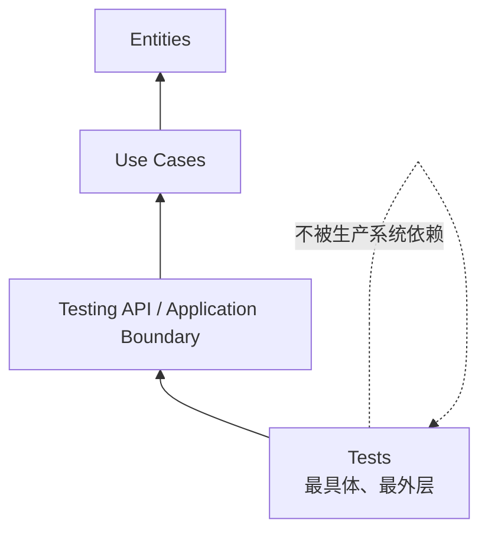
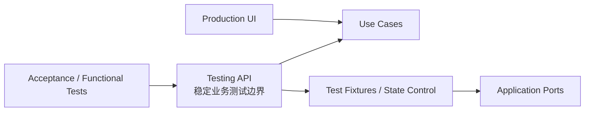
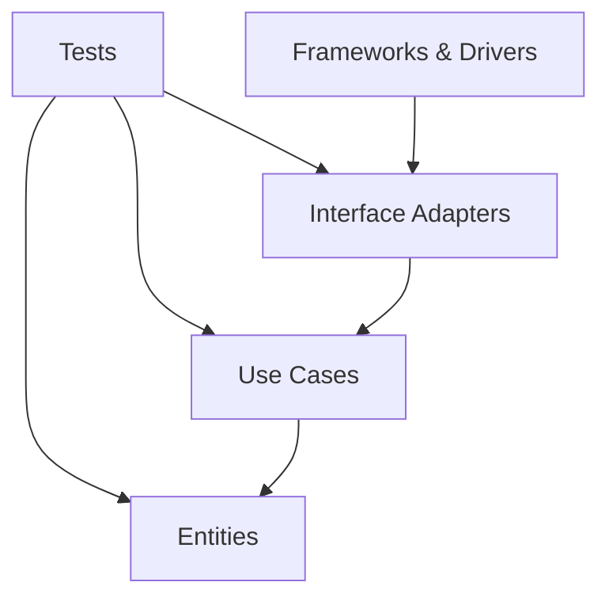
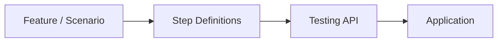
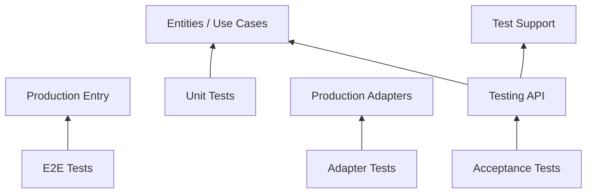

> 原书：Robert C. Martin, *Clean Architecture: A Craftsman's Guide to Software Structure and Design*<br>
> 本章：Chapter 28, The Test Boundary<br>
> 原文参考：Clean Architecture.md

## 本章导读


测试代码经常被当成生产系统之外的辅助物：

- 它不随 Production Artifact 一起部署；
- 最终用户看不到它；
- 它不直接处理真实业务请求；
- 它只在 CI、开发机或测试环境中运行。

于是，团队容易认为测试不属于系统架构，也不需要像生产代码一样认真设计。

第 28 章直接否定这种观点：

> **Tests are part of the system。测试是系统的一部分。**

测试同样：

- 由代码组成；
- 依赖系统组件；
- 拥有部署方式；
- 会随时间演化；
- 会产生维护成本；
- 会反过来限制生产代码的变化。

从架构角度看，各种测试名称并不重要：

- Unit Test；
- Integration Test；
- Acceptance Test；
- Functional Test；
- TDD Test；
- BDD Test；
- Cucumber Test；
- FitNesse Test；
- SpecFlow Test；
- JBehave Test；
- Component Test。

它们都位于系统最外层，并遵守相同依赖方向：

> **测试依赖被测系统，系统绝不依赖测试。**



这使测试成为一个很特殊的系统组件：

- 它独立部署到测试环境；
- 它不参与 Production Operation；
- 没有最终用户依赖它；
- 它服务于 Development；
- 它比大多数组件更加孤立。

但“孤立”不表示可以随意设计。

测试如果紧密绑定：

- GUI 页面结构；
- Production Class 数量；
- 每个具体 Method；
- 内部调用顺序；
- 数据库细节；
- 框架生命周期；

就会产生 Fragile Tests Problem：生产代码稍有重构，成百上千测试一起失败。

这会带来一个反常后果：

> **本来用于支持变化的测试，反而让系统变得不敢改变。**

作者给出的核心解决方案是 Testing API：

- 面向业务行为，而不是生产类结构；
- 允许测试绕开 GUI；
- 允许替换昂贵 Database；
- 允许建立特定测试状态；
- 必要时绕过 Security Mechanism；
- 隐藏应用内部类与方法的重构；
- 与危险测试能力一起独立部署，避免进入 Production。



本章没有数学公式，也没有需要推导的算法。它的重点是依赖与演化论证：

1. 测试是最外层系统组件；
2. 外层测试仍可能通过错误耦合让内层系统僵硬；
3. 应把测试依赖稳定业务边界，而不是易变实现结构；
4. Testing API 允许测试和生产代码分别演化；
5. 测试特权必须与 Production 安全隔离。

## 1. Tests as System Components

### 1.1 为什么测试身份经常令人困惑

团队常问：

- 测试属于系统吗？
- 测试是否只是开发工具？
- Unit 与 Integration 是否本质不同？
- Acceptance Test 是否属于产品？
- BDD Scenario 与普通测试有什么不同？
- Test Fixture 是否是生产架构的一部分？

这些问题在测试方法论中很重要，但本章关心的是架构共同点。

### 1.2 作者刻意回避测试分类争论

原书没有试图解决“什么才算 Unit Test”的长期争论。

原因是：

> **从 Architecture 的视角看，所有测试都具有相同依赖位置。**

无论测试：

- 小到一个 TDD Example；
- 大到一个 FitNesse Acceptance Suite；
- 通过 Cucumber 描述；
- 通过 SpecFlow 或 JBehave 执行；

它都依赖系统内部组件，而不是被系统内部组件依赖。

### 1.3 架构等价不表示测试作用相同

Unit、Integration、Acceptance 仍然验证不同命题。

| 测试类型 | 主要目的 |
| --- | --- |
| Entity Unit Test | 核心不变量与业务规则 |
| Use Case Test | 应用流程与 Entity 编排 |
| Presenter Test | 展示格式和 ViewModel |
| Gateway Integration Test | SQL、映射和事务 |
| Contract Test | Port / Adapter 行为一致性 |
| Acceptance Test | 用户可观察业务行为 |
| End-to-End Test | 完整组装和关键旅程 |

“架构等价”只说明依赖方向，不取消测试层次。

### 1.4 测试遵守 Dependency Rule

测试是低层、具体的代码。

它可以知道：

- Use Case；
- Entity；
- Input / Output Port；
- Testing API；
- Fake Adapter；
- 测试数据构造器。

而生产核心不应知道：

- Test Class；
- Assertion Framework；
- Fixture；
- Mock Library；
- Test Runner；
- Cucumber Step Definition。

### 1.5 测试位于最外层圆

可以把测试想象成 Clean Architecture 的 outermost circle，也就是最外面的一圈。



测试可以直接依赖某个更内层组件，只要测试目标明确。

### 1.6 为什么测试非常具体

测试通常固定：

- 特定输入；
- 特定输出；
- 特定边界条件；
- 特定错误；
- 特定业务场景；
- 特定回归缺陷。

生产核心会逐渐抽象出一般政策，测试则会积累越来越多具体例子。

### 1.7 测试独立部署

测试是 independently deployable 的组件，通常不会进入 Production Artifact。

它们可能部署到：

- Developer Machine；
- CI Runner；
- Test Environment；
- Staging；
- Dedicated Performance Environment；
- Device Lab。

所以测试天然具有独立部署特征。

### 1.8 即使系统其他部分不独立部署

一个 Monolith 可能只有单一 Production Executable。

测试仍然：

- 在独立 Test Process 中运行；
- 使用独立 Test Dependency；
- 不随 Production 交付；
- 有自己的数据和配置。

因此，测试往往是系统中最明确的独立组件之一。

### 1.9 测试不参与系统 Operation

测试通常不是完成业务请求所必需的。

Production System 在没有测试制品时仍能运行。

最终用户也不会调用测试来完成订单、预约或付款。

### 1.10 测试服务于 Development

测试支持：

- Regression Detection；
- Refactoring；
- Design Feedback；
- Specification；
- Defect Reproduction；
- Deployment Confidence；
- Team Communication。

它们主要优化开发和维护生命周期。

### 1.11 测试是最孤立的组件

原书把测试称为 Most Isolated System Component。

它的典型依赖性质是：

- 没有生产用户；
- 没有内层组件依赖它；
- 它可以单独变化和部署；
- 它只朝内依赖系统。

### 1.12 测试为何是其他组件的模型

理想测试组件展示了良好组件应有的特征：

- 单向依赖；
- 独立部署；
- 关注点清楚；
- 不被核心反向依赖；
- 可单独演化。

### 1.13 “测试代码不是生产代码”怎样理解

测试代码不在 Production Runtime 中执行，但仍是专业工程产物。

它需要：

- 清楚设计；
- 可维护命名；
- 合理抽象；
- 稳定边界；
- 安全配置；
- 快速反馈。

### 1.14 测试代码同样会产生技术债

测试债可能表现为：

- 重复 Setup；
- 脆弱 Selector；
- 固定 Sleep；
- 共享可变 Fixture；
- 隐藏断言；
- 过度 Mock；
- 难以理解失败；
- 环境依赖。

### 1.15 为什么测试不应被核心编译依赖

如果 Production Core 依赖测试工具：

- Test Framework 会进入运行制品；
- 测试实现变化影响核心；
- 安全与体积增加；
- 依赖方向反转；
- 测试删除会破坏产品。

### 1.16 测试辅助代码放在哪里

可以有独立 Test Support Component，包含：

- Builder；
- Fixture Factory；
- Fake；
- Assertion Helper；
- Scenario DSL；
- Test Data Generator。

生产代码不依赖它。

### 1.17 测试与生产共享代码要谨慎

如果生产与测试都需要某个真正业务工具，它应成为正常生产组件并由双方依赖。

不要为了复用测试便利，把 Test Helper 引入 Production。

## 2. 测试类型的架构统一与实践差异

### 2.1 Tiny TDD Tests

TDD 产生的小测试通常：

- 聚焦一个行为；
- 反馈快速；
- 与开发同步编写；
- 直接驱动设计。

它们仍是最外层依赖者。

### 2.2 FitNesse Tests

FitNesse 测试可能跨越：

- Use Case；
- Fixture；
- Testing API；
- 数据与结果表格。

规模更大，但依赖方向仍朝内。

### 2.3 Cucumber / SpecFlow / JBehave

这些工具使用自然语言或 DSL 描述 Scenario。

通常结构是：



Step Definition 应尽量依赖稳定 Testing API，而不是到处操作内部 Class。

### 2.4 Integration Tests

Integration Test 会依赖：

- Database；
- Network；
- Framework；
- File System；
- Multiple Components。

它们仍位于外层，只是测试边界更接近真实 Mechanism。

### 2.5 End-to-End Tests

E2E Test 通过真实入口驱动完整系统。

价值是验证：

- 组装；
- 路由；
- 配置；
- 关键用户旅程。

代价是脆弱、慢和诊断困难，因此数量应克制。

### 2.6 Architectural Equivalence 的意义

架构统一视角帮助我们把注意力从标签转向：

- 测试依赖什么？
- 测试通过什么边界进入系统？
- 哪些变化会让测试失败？
- 测试是否独立部署？
- 生产代码是否知道测试？

### 2.7 不应用统一视角抹平测试策略

不同测试仍需不同：

- 速度目标；
- 环境；
- 数据管理；
- 失败诊断；
- 运行频率；
- 所有权。

本章只统一架构位置。

## 3. Design for Testability

### 3.1 极端隔离带来的误解

因为测试：

- 通常不部署到 Production；
- 与用户操作无关；
- 可以放在单独目录；

开发者容易认为测试不参与系统设计。

原书称这是 Catastrophic Point of View，也就是灾难性的观点。

### 3.2 为什么会是灾难性观点

如果测试在架构完成后才“贴上去”，它们只能抓住最容易接触的表面：

- GUI；
- 具体 Class；
- 具体 Method；
- Database Table；
- Internal Call Sequence；
- Framework Object。

这些表面往往最易变化。

### 3.3 测试也必须集成到系统设计

“集成”不是让生产代码依赖测试。

它表示系统应主动提供：

- 可测试 Use Case；
- 稳定 Port；
- 独立 Business Model；
- 可替换 Adapter；
- Testing API；
- 可控制 Clock、Random 与 External Resource。

### 3.4 测试耦合是核心问题

原书把问题归结为 Coupling。

测试若强依赖系统易变结构，生产结构变化时测试必须同步修改。

### 3.5 合理耦合与有害耦合

**合理耦合：**

- 测试依赖业务行为；
- 业务规则变化时测试变化；
- 契约变化时契约测试变化。

**有害耦合：**

- 重命名内部 Method 导致 Acceptance Test 变化；
- 页面导航变化导致业务规则测试失败；
- Class 拆分导致所有测试重写；
- SQL 重构导致 Use Case Test 失败。

### 3.6 测试应该对行为敏感

测试的理想性质是：

- 业务行为变化时失败；
- 无行为差异的内部重构时保持通过；
- 外层 UI 重排不破坏核心业务测试。

### 3.7 测试不应对实现结构过敏

如果测试断言：

- 某私有方法调用三次；
- 某对象必须由特定 Class 构造；
- 某中间变量存在；
- 内部方法顺序固定；

它可能把当前实现冻结成契约。

### 3.8 Design for Testability 不是加 `public`

把私有方法改成公开以便测试，可能扩大 API 并泄漏结构。

更好的方法是：

- 通过公共业务行为测试；
- 提取真正独立政策；
- 定义稳定 Testing API；
- 把外部机制放到 Port 后。

### 3.9 可测试性与 Clean Architecture

Clean Architecture 已提供良好基础：

- Entity 可普通构造；
- Use Case 接受简单 Request；
- Gateway 可以 Fake；
- Presenter 可独立测试；
- Framework 留在外层。

### 3.10 可测试性与 Humble Object

第 23 章的 Humble Object Pattern 把：

- 难测机制压薄；
- 可测政策移出。

第 28 章把同一思想扩大到测试组件与 Testing API。

## 4. Fragile Tests Problem

### 4.1 什么是 Fragile Test

Fragile Test 是：

- 被测行为没有改变；
- 测试却因无关结构或界面变化而失败；
- 或需要大量同步修改。

### 4.2 常见脆弱来源

- GUI Selector；
- 页面路径；
- DOM Structure；
- Internal Method；
- Exact Call Order；
- Shared Database State；
- Fixed Time；
- Random Data；
- Thread Timing；
- External Service。

### 4.3 Common Component 的放大效应

如果许多测试都依赖同一个易变组件：

- Login Page；
- Navigation Menu；
- Base Test Class；
- Shared Fixture；
- Internal Service API；

该组件一次变化可能打破数百或数千测试。

### 4.4 GUI 测试业务规则的典型失败

原书设想一套测试：

1. 从 Login Screen 开始；
2. 输入账号与密码；
3. 经过页面导航；
4. 到达目标页面；
5. 操作控件；
6. 检查某条 Business Rule。

### 4.5 页面导航变化的影响

市场团队只要求调整导航：

- 菜单改名；
- 页面移动；
- 登录步骤变化；
- 按钮位置改变。

业务规则没有变化，数百测试却可能一起失败。

### 4.6 为什么测试失败无法说明业务回归

失败可能来自：

- Selector 失效；
- 页面尚未加载；
- 导航路径变化；
- 浏览器环境；
- 测试数据；
- 真正业务缺陷。

诊断信号非常嘈杂。

### 4.7 脆弱测试如何让系统僵硬

开发者知道一个简单 UI 修改会导致 1000 个测试失败时，可能：

- 拒绝重构；
- 推迟用户体验改进；
- 保留错误结构；
- 跳过测试；
- 降低测试信任；
- 最终删除测试。

### 4.8 测试从安全网变成阻力

测试本应支持变化。

若每次变化都要先修复大量与行为无关的测试，它们就变成 Rigidity 的来源。

### 4.9 测试维护成本也是系统成本

不能只统计生产代码改动。

一次需求总成本包括：

- Production Change；
- Test Change；
- Fixture Change；
- Data Migration；
- CI Diagnosis；
- Flaky Retry；
- Review Cost。

### 4.10 脆弱测试与 Flaky Test 不同

**Fragile Test：**

- 对无关结构变化敏感；
- 变化后稳定失败。

**Flaky Test：**

- 在相同代码下有时通过、有时失败；
- 常由时序、并发、环境造成。

二者可能同时存在，但修复方法不同。

### 4.11 脆弱测试与严格契约测试不同

契约真的改变时测试失败是正确行为。

问题是测试是否把内部结构误当成公共契约。

### 4.12 识别脆弱测试的信号

- 无行为变更时大量测试修改；
- 重命名 Class 导致 Acceptance Test 失败；
- 页面调整破坏业务测试；
- 测试失败集中在公共 Setup；
- 团队害怕删除无用方法；
- 测试经常被批量重写。

## 5. 不要依赖易变事物

### 5.1 软件设计第一原则

原书给出的解决原则是：

> **Don't depend on volatile things。不要依赖易变的事物。**

这与 DIP、SDP 和前文保持一致。

### 5.2 GUI 是易变的

GUI 会因为以下原因频繁变化：

- UX；
- Branding；
- Accessibility；
- Device Size；
- Navigation；
- Framework Upgrade；
- Experiment；
- Localization。

### 5.3 业务规则测试不应经过 GUI

如果测试目标是：

- 折扣资格；
- 贷款利息；
- 退款规则；
- 预约冲突；

应通过 Use Case / Testing API 直接验证。

### 5.4 UI 测试仍然必要

GUI Test 应验证 GUI 自己的责任：

- Binding；
- Rendering；
- Navigation；
- Accessibility；
- 关键用户路径；
- Browser Compatibility。

不要让它承担全部业务回归。

### 5.5 稳定业务边界优于易变入口

测试依赖：

- Use Case Name；
- Business Request；
- Business Response；
- Stable Test DSL；

比依赖 CSS Selector 和页面层级更稳定。

### 5.6 数据库也是易变机制

业务规则测试不应依赖：

- 实际 Schema；
- SQL；
- Migration；
- Database Server；
- Connection Pool。

可通过 In-Memory Fake 或 Testing API 隔离。

### 5.7 时间、随机与外部服务同样易变

应把：

- Clock；
- Random；
- ID Generator；
- External API；
- Message Broker；

放到可替换 Port 后。

### 5.8 “不要依赖”不是完全不测试

外层机制仍由专门测试验证。

原则是让不同测试依赖与其目标相匹配的边界。

## 6. The Testing API

### 6.1 Testing API 的目的

Testing API 是专门供测试验证系统业务规则的稳定入口。

它把测试与以下内容解耦：

- GUI；
- Application Internal Structure；
- Expensive Resource；
- Security Mechanism；
- Framework Lifecycle。

### 6.2 Testing API 不只是公开生产 API

Production API 可能：

- 面向最终用户；
- 包含认证；
- 受协议限制；
- 只允许合法业务流程；
- 为安全隐藏内部能力。

Testing API 面向测试，可提供额外控制能力。

这些能力可以绕过 security constraints，并避开 Database 等 expensive resources，以便快速建立可重复场景。

### 6.3 Testing API 是稳定测试边界

测试应表达：

- 给定业务状态；
- 当执行某个 Use Case；
- 得到某个业务结果。

而不是表达：

- 调用哪三个内部 Class；
- 经过哪些页面；
- 哪个私有 Method 被调用。

### 6.4 Testing API 可以覆盖哪些层

它可以是：

- Use Case Input Port 的集合；
- Test Fixture API；
- State Builder；
- Query API；
- Fake Adapter Control；
- Test Clock Control；
- Scenario DSL。

### 6.5 Testing API 是 Interactor 与 Adapter 的超集

原书说，它应成为 UI 使用的 Interactor 与 Interface Adapter 集合的 Superset。

原因是测试需要：

- 执行业务操作；
- 观察业务状态；
- 建立前置状态；
- 绕开昂贵路径；
- 触发边界条件。

### 6.6 Superset 不表示暴露所有内部类

错误做法是把所有 Class 和 Method 都公开给测试。

正确的 Superset 是增加稳定的测试能力，而不是暴露实现结构。

### 6.7 面向业务的 Testing API 示例

订单系统可以提供：

- createCustomer；
- placeOrder；
- markPaymentSuccessful；
- advanceBusinessClock；
- queryOrderStatus；
- resetScenario。

这些操作使用业务语言。

### 6.8 不应提供的结构型 API

避免：

- callPrivateMethod；
- getInternalRepository；
- setControllerField；
- instantiateConcreteService；
- inspectCallStack；
- mutateDatabaseRow。

这些接口会把测试绑定到实现。

### 6.9 Testing API 与 Test DSL

在 Testing API 上可以构建 Scenario DSL：

```text
Given a customer with sufficient credit
And an available product
When the customer places an order
Then the order is confirmed
And inventory is reserved
```

DSL 依赖业务边界，而非 UI 页面。

### 6.10 Testing API 与 Fixture Builder

Fixture Builder 可以：

- 创建合法 Entity；
- 提供合理默认值；
- 只覆盖场景差异；
- 隐藏无关构造细节。

Builder 应依赖稳定业务模型或 Testing API。

### 6.11 Testing API 与 Query API

测试需要观察结果，但不应直接查询任意内部表。

可以提供：

- queryOrderStatus；
- getCustomerBalance；
- listPublishedEvents；
- inspectNotificationOutbox。

返回稳定、简单测试数据。

### 6.12 Testing API 与 Command API

命令用于建立状态和执行行为：

- seedCustomer；
- createOrder；
- advanceClock；
- simulatePaymentResult。

应避免无约束地修改任意内部字段。

### 6.13 Testing API 的版本与兼容

它也会演化。

应：

- 使用业务名称；
- 保持最小；
- 明确弃用；
- 避免映射每个 Production Method；
- 允许测试独立重构。

### 6.14 Testing API 的所有权

通常由应用或测试架构共同拥有。

它属于最外层测试组件使用的 Port，但实现可能横跨 Application Adapter 与 Test Support Component。

### 6.15 是否所有项目都需要显式 Testing API

小型系统可能直接通过 Use Case Port 测试，已经足够。

当出现：

- 大型 Acceptance Suite；
- GUI Fragility；
- 昂贵环境；
- 复杂 Fixture；
- 安全测试特权；

显式 Testing API 更有价值。

## 7. Testing API 的 Superpowers

### 7.1 为什么需要 Superpowers

真实用户受制于：

- Security；
- Workflow；
- Rate Limit；
- Expensive Resource；
- Time；
- External Agency。

测试需要快速、确定地构造边界场景。

### 7.2 绕过 Security Constraint

测试可能需要：

- 直接以某角色执行；
- 建立已认证身份；
- 跳过真实 SSO；
- 模拟权限结果。

目标是测试业务授权政策，而不是每次都运行完整身份基础设施。

### 7.3 绕开昂贵 Database

Testing API 可以使用：

- In-Memory Repository；
- Transaction Rollback；
- Test Container；
- State Builder；
- Snapshot Fixture。

业务测试不必每次经过真实 Production Database。

### 7.4 强制特定系统状态

例如：

- 账户恰好到期；
- 库存只剩一个；
- 支付即将超时；
- 用户信用不足；
- 消息已重复送达；
- 订单处于罕见状态。

### 7.5 控制时间

Test Clock 可以：

- Advance Time；
- Freeze Time；
- 设置 Date；
- 模拟 Deadline；
- 验证三天窗口。

不要用真实等待制造时间场景。

### 7.6 控制随机性

可注入：

- Fixed Random；
- Seeded Random；
- Deterministic ID Generator。

这让失败可重复。

### 7.7 模拟外部失败

可以配置 Fake Adapter：

- Payment Declined；
- Timeout；
- Service Unavailable；
- Duplicate Message；
- Partial Data。

### 7.8 观察内部业务结果

Testing API 可以暴露稳定业务观察点：

- Domain Event；
- Order Status；
- Outbox Message；
- Business Audit Entry。

不应暴露任意内部变量。

### 7.9 重置场景

为了测试隔离，可以：

- 重建 In-Memory State；
- 清空 Test Tenant；
- Rollback Transaction；
- 使用唯一 Namespace。

### 7.10 Superpower 的危险

这些能力若进入 Production，攻击者或普通用户可能：

- 绕过认证；
- 伪造状态；
- 跳过资源限制；
- 读取内部数据；
- 修改时间；
- 注入失败。

因此必须独立部署和严格隔离。

## 8. Structural Coupling

### 8.1 什么是 Structural Coupling

Structural Coupling 是测试与 Production Code 的类、方法和内部组织一一对应。

### 8.2 原书的典型结构

想象测试套件具有：

- 每个 Production Class 对应一个 Test Class；
- 每个 Production Method 对应一组 Test Method。

这看似系统化，却把测试绑定到当前实现结构。

### 8.3 为什么一一对应很诱人

- 容易统计 Coverage；
- IDE 可以生成；
- 文件容易定位；
- Review 看起来整齐；
- 初期写法直接。

### 8.4 为什么它会成为强耦合

生产代码重构时可能：

- 合并 Class；
- 拆分 Class；
- 移动 Method；
- 改变协作方式；
- 用新算法替代旧实现。

业务行为不变，结构测试却需要大改。

### 8.5 测试类与生产类同名是否一定错误

不一定。

Entity Unit Test 与 Entity Class 对应可能自然。

问题在于测试是否：

- 只验证该类公共业务契约；
- 还是复制所有内部 Method 结构。

### 8.6 行为耦合优于结构耦合

更稳定的测试组织方式：

- 按 Use Case；
- 按 Business Rule；
- 按 Scenario；
- 按 Public Contract；
- 按 Regression Behavior。

### 8.7 一个重构例子

原来：

- `OrderService`；
- `PriceCalculator`；
- `InventoryChecker`。

后来重构为一个 `PlaceOrderInteractor` 与多个 Policy。

如果测试依赖“调用 PriceCalculator.calculate 三次”，会大量破坏。

如果测试表达“下单时按规则计算总价并保留库存”，可以保持通过。

### 8.8 Testing API 怎样隐藏结构

Testing API 提供稳定行为入口：

- placeOrder；
- cancelOrder；
- queryOrder。

测试无需知道内部由多少 Class 完成。

### 8.9 隐藏结构不表示隐藏所有失败细节

测试失败仍应能诊断：

- 输入；
- 输出；
- 业务状态；
- 关键事件；
- 错误原因。

只是不依赖具体类布局。

### 8.10 Structural Coupling 与 White-Box Test

White-Box Test 了解实现细节，有时对：

- 算法边界；
- 性能；
- 安全关键内部不变量；

有价值。

但不应让整个 Acceptance Suite 都成为 White-Box。

### 8.11 Interaction-Based Mocking 的风险

过度验证：

- 调用次数；
- 调用顺序；
- 中间协作者；

会产生结构耦合。

只对真正外部可观察协作或关键协议使用交互断言。

### 8.12 Structural Coupling 的检测信号

- Class 重命名导致大量 Test Rename；
- Method 移动导致大量 Mock 改写；
- 覆盖率高但重构困难；
- 测试名称都是方法名；
- 业务行为难从测试读出；
- 每个内部调用都被 Verify。

## 9. 测试与生产代码的分离演化

### 9.1 原书观察

随着时间：

- Tests 越来越 Concrete and Specific；
- Production Code 越来越 Abstract and General。

这是两种不同、都合理的演化方向。

### 9.2 测试为何越来越具体

每发现一个缺陷或边界条件，测试会增加具体例子：

- 特定日期；
- 特定金额；
- 特定权限；
- 特定历史组合；
- 特定回归输入。

### 9.3 生产代码为何越来越一般

重构会把多个例子归纳为：

- Policy；
- Strategy；
- Algorithm；
- Entity；
- Reusable Component。

### 9.4 强结构耦合怎样阻碍两者

如果 Test Class 必须复制 Production Class：

- 生产代码不敢重新分组；
- 测试无法按业务 Scenario 重组；
- 两边必须锁步维护；
- 抽象与具体的自然分化被阻止。

### 9.5 Testing API 允许独立重构

Production 可以：

- 拆分内部 Class；
- 合并算法；
- 替换实现；
- 改变协作。

Tests 可以：

- 重组 Scenario；
- 抽取 DSL；
- 改善 Fixture；
- 合并重复行为。

只要 Testing API 的业务契约保持稳定，两边互不干扰。

### 9.6 Testing API 自身也应演化

它不应永久冻结错误抽象。

可以：

- 版本化；
- 提供过渡 Adapter；
- 批量迁移 Test DSL；
- 删除无用 Superpower；
- 按真实业务重构。

### 9.7 避免 Testing API 成为第二套产品 API

若 Testing API 过大：

- 维护成本高；
- 安全风险大；
- 行为重复；
- 测试依赖过宽。

它应只提供测试稳定性所需能力。

### 9.8 测试失败应指向行为差异

理想情况下：

- Business Contract 改变，相关测试失败；
- Internal Refactor，不相关测试保持通过；
- UI Change，只破坏 UI Test；
- Database Change，只破坏 Adapter Test。

这体现变化局部性。

## 10. Security

### 10.1 Testing API 为什么有安全风险

它可能允许：

- Bypass Authentication；
- Force State；
- Skip Expensive Resource；
- Inspect Internal Result；
- Reset Data；
- Simulate Privileged Identity。

这些能力若暴露给 Production User，会非常危险。

### 10.2 原书的解决建议

如果存在风险：

> **把 Testing API 以及实现危险能力的部分，放入独立、可单独部署的组件。**

也就是把它们做成 independently deployable component，并确保 Production 根本不装入该组件。

Production 不包含该组件。

### 10.3 Build-Time Exclusion

可以使用独立：

- Test Source Set；
- Test Package；
- `.jar` / DLL；
- Container Image；
- Build Target。

Production Build 根本不打包测试特权代码。

### 10.4 Deployment-Time Isolation

Testing API 只部署到：

- CI；
- Test；
- Staging；
- Ephemeral Environment。

不部署到 Production Cluster。

### 10.5 Network Isolation

若必须在 Staging 远程访问：

- 使用独立 Network；
- 不暴露 Public Route；
- 强 Authentication；
- 最小权限；
- 完整 Audit；
- 短生命周期 Credential。

### 10.6 不要只靠 Environment Flag

危险做法：

- Production Binary 内保留 `/test/reset-all`；
- 只靠 `if ENV != production` 阻止。

配置错误可能打开后门。

物理不打包通常更安全。

### 10.7 测试凭证管理

- 不使用 Production Secret；
- 不把 Token 提交到 Repository；
- 使用短期 Credential；
- 定期 Rotation；
- 权限限制到 Test Resource。

### 10.8 测试数据隐私

测试环境不应随意复制真实敏感数据。

可以使用：

- Synthetic Data；
- Masking；
- Tokenization；
- 最小数据集；
- 独立 Test Tenant。

### 10.9 Testing API 的审计

记录：

- 谁调用；
- 何时调用；
- 修改了什么；
- 使用哪个 Scenario；
- 是否清理完成。

### 10.10 Security Test 与 Security Bypass 要分开

测试授权规则可以通过受控身份建立场景。

不能因为测试方便就绕过真正需要验证的 Authorization Policy。

例如：

- 测试业务规则时可 Fake SSO；
- 测试认证集成时必须使用真实认证路径。

### 10.11 Production Observability 不应依赖 Testing API

生产监控应有独立、安全的 Health / Metrics / Diagnostics 接口。

不要让运维为了诊断而开启危险测试入口。

## 11. Testing API 的设计方法

### 11.1 第一步：列出稳定业务行为

从 Use Cases 与 Acceptance Criteria 中提取：

- Commands；
- Queries；
- Business Outcomes；
- Error Cases。

### 11.2 第二步：列出测试控制需求

- 建立哪些前置状态；
- 控制哪些外部资源；
- 观察哪些结果；
- 模拟哪些失败；
- 控制时间与随机性。

### 11.3 第三步：区分业务 API 与 Test Superpower

**业务 API：**

- placeOrder；
- cancelOrder；
- scheduleAppointment。

**Superpower：**

- seedInventory；
- advanceClock；
- simulatePaymentDecline；
- resetScenario。

分开命名和部署。

### 11.4 第四步：定义简单数据

使用：

- Request DTO；
- Response DTO；
- Test Query Result；
- Scenario Identifier。

不要返回 ORM Row 或内部 Object Graph。

### 11.5 第五步：保持 API 粗粒度

测试 API 应围绕业务意图，而不是内部 Method。

粗粒度接口更能承受重构。

### 11.6 第六步：建立 Test Fixture Lifecycle

定义：

- Setup；
- Isolation；
- Reset；
- Cleanup；
- Parallel Execution；
- Failure Diagnostics。

### 11.7 第七步：安全隔离

决定：

- 独立 Build；
- 独立 Artifact；
- 独立 Deployment；
- 权限与网络；
- Production Exclusion。

### 11.8 第八步：契约测试

验证 Testing API：

- Command 正确执行；
- Query 正确观察；
- Fake 与真实路径语义一致；
- Reset 真正隔离；
- Error 稳定可解释。

### 11.9 第九步：监控结构耦合

代码评审中检查：

- 是否新增内部 Class 访问；
- 是否 Verify 过多调用；
- 是否依赖 GUI Selector；
- 是否读取任意 Table；
- 是否把 Implementation Detail 变成 Test Contract。

### 11.10 第十步：控制 API 膨胀

定期删除：

- 无测试使用的 Endpoint；
- 重复 Superpower；
- 过时 Fixture；
- 结构型 Query；
- 已迁移的兼容入口。

## 12. 一个订单系统示例

### 12.1 目标行为

测试“信用足够的客户下单后，订单确认并保留库存”。

### 12.2 脆弱 GUI 路径

1. 打开 Login Page；
2. 输入凭证；
3. 进入商品页面；
4. 搜索商品；
5. 加入购物车；
6. 打开 Checkout；
7. 提交；
8. 查找页面文字。

任何页面变化都可能破坏测试。

### 12.3 Testing API 路径

```text
scenario = testingApi.newScenario()
scenario.createCustomer(credit = sufficient)
scenario.stockProduct(productId, quantity = 1)
result = scenario.placeOrder(customerId, productId, quantity = 1)
assert result.status == CONFIRMED
assert scenario.inventoryOf(productId) == 0
```

这是结构示意，不绑定具体语言。

### 12.4 测试表达什么

- 前置业务状态；
- 执行业务 Use Case；
- 检查业务结果；
- 不依赖 UI 与内部 Class。

### 12.5 UI 测试保留什么

单独验证少量关键路径：

- 用户可以从页面提交订单；
- 页面正确展示确认结果；
- Controller 与 Presenter 正确连接。

### 12.6 Clock Superpower

测试订单到期：

1. 创建订单；
2. Advance Clock；
3. 执行 Expire Orders；
4. 检查状态。

无需等待真实时间。

### 12.7 Payment Failure Superpower

配置 Payment Fake 下一次返回 Declined。

测试 Use Case 对拒付的业务处理，而不调用真实供应商。

### 12.8 Security 分层

- 订单业务测试可以创建已认证 Test Principal；
- Web Security Integration Test 仍验证真实 Login 与 Token；
- Testing API 不进入 Production。

### 12.9 内部重构

Production 可把：

- OrderService；
- InventoryService；
- PaymentCoordinator；

重组为新的 Interactor 与 Policy。

只要 `placeOrder` 行为不变，Acceptance Test 不改。

## 13. 测试套件的组件化

### 13.1 按业务能力组织

测试顶层可以是：

- Orders；
- Payments；
- Inventory；
- Customers；
- Billing。

而不是只按：

- Unit；
- Integration；
- E2E。

两种维度可以同时存在。

### 13.2 Test Support Component

提供：

- Business Fixture；
- Test Clock；
- Fake Gateway；
- Scenario DSL；
- Assertion Library。

### 13.3 Adapter Test Component

分别测试：

- SQL Adapter；
- Web Adapter；
- Message Adapter；
- External Service Adapter。

### 13.4 Acceptance Component

通过 Testing API 执行：

- 跨 Use Case Scenario；
- Regression Scenario；
- Business Workflow。

### 13.5 E2E Component

保留少量：

- Deployment Smoke；
- Critical User Journey；
- Cross-System Contract；
- Production-Like Validation。

### 13.6 独立运行与并行

测试组件应尽量：

- 独立数据；
- 独立 Namespace；
- 无执行顺序依赖；
- 可并行；
- 可重复。

### 13.7 测试组件依赖图



生产核心不依赖任何测试组件。

## 14. 作者分析问题的完整思路

### 14.1 先解决“测试是否属于系统”

作者先确立身份：测试是系统组件。

否则后续设计要求没有基础。

### 14.2 回避无关分类争论

不纠缠 Unit / Integration 定义，直接找架构共同性质：测试都依赖被测代码。

### 14.3 用 Dependency Rule 定位测试

测试最具体、最外层，依赖箭头向内。

### 14.4 观察测试的特殊部署属性

测试不进 Production，却独立部署到 Test System。

这强化了其组件身份。

### 14.5 找出错误心理模型

“测试不在 Production，所以不在设计中”会导致脆弱套件。

### 14.6 把问题归因于耦合

不是测试工具不够强，而是测试依赖了易变 GUI 与内部结构。

### 14.7 用极端反例说明后果

登录与导航变化导致 1000 个业务测试失败，直观展示 Fragility 如何制造 Rigidity。

### 14.8 回到通用设计原则

解决方案仍是：

> 不要依赖易变事物。

让业务测试绕过 GUI。

### 14.9 引入 Testing API

API 不只隐藏 UI，还隐藏应用结构，使生产与测试各自演化。

### 14.10 识别新风险

测试 Superpowers 会绕过 Security 和昂贵资源，因此不能进入 Production。

### 14.11 给出物理隔离方案

把 Testing API 的危险部分放入独立可部署组件。

### 14.12 最终回到生命周期成本

设计良好测试可提供稳定 Regression Protection。

设计糟糕测试会因维护成本过高被团队丢弃。

## 15. 适用范围与局限

### 15.1 小型库

一个纯函数库可能不需要独立 Testing API。

直接通过 Public API 测试已经足够稳定。

### 15.2 UI 本身就是核心产品

设计工具、游戏和可视化产品的 GUI 行为非常重要。

仍应分离可测试决策，但不可避免需要更多视觉与交互测试。

### 15.3 Testing API 可能掩盖集成缺陷

如果所有 Acceptance Test 都绕过：

- Security；
- Database；
- Network；

可能漏掉组装问题。

必须保留针对真实边界的集成测试。

### 15.4 Fake 可能与真实实现不一致

需要：

- Contract Test；
- Integration Test；
- 定期真实环境验证。

### 15.5 Testing API 也会成为维护负担

过宽或结构型 API 会：

- 重复产品 API；
- 增加安全风险；
- 固化错误模型；
- 产生双份维护。

### 15.6 结构测试有时必要

架构规则测试本来就要断言结构：

- Core 不依赖 Framework；
- Component Graph 无环；
- API 位于正确模块。

这种结构耦合是测试目标本身，不属于误耦合。

### 15.7 Performance Test 可能依赖内部指标

性能诊断有时需要：

- Query Count；
- Allocation；
- Cache Hit；
- Internal Timing。

应将其限制在专门测试，不让全部业务套件依赖内部实现。

### 15.8 安全测试需要真实路径

Testing API 绕过认证只能用于非认证目标。

安全测试必须验证真实：

- Login；
- Authorization；
- Token；
- Session；
- Audit。

## 16. 易混淆概念与常见误解

### 16.1 “测试不部署到 Production，所以不属于系统”

错误。它们是独立部署、参与依赖图并产生维护成本的系统组件。

### 16.2 “只有 Unit Test 属于最外层”

错误。Acceptance、Cucumber、FitNesse 与 E2E 在架构上也依赖系统并位于外层。

### 16.3 “架构等价表示所有测试都一样”

错误。它们验证范围、速度和环境不同，只共享依赖位置。

### 16.4 “测试越接近真实 GUI 越有价值”

不一定。GUI Test 对 UI 有价值，却不适合承担全部业务规则验证。

### 16.5 “测试失败越多，保护越强”

错误。无关变化导致大量失败表示 Fragility，不是高质量保护。

### 16.6 “Fragile Test 就是 Flaky Test”

错误。Fragile 对结构变化敏感，Flaky 在相同代码下不稳定。

### 16.7 “页面变化让测试失败是正常的”

UI Test 失败正常；与页面无关的业务测试一起失败则说明边界错误。

### 16.8 “Design for Testability 就是把方法改成 Public”

错误。应通过稳定行为边界测试，而不是扩大内部 API。

### 16.9 “每个 Production Class 都应有同名 Test Class”

不一定。公共契约单测可自然对应，但不应机械复制所有内部结构。

### 16.10 “Mock 越精确，测试越可靠”

过度验证内部调用会制造 Structural Coupling。

### 16.11 “Testing API 就是 Production API”

不完全相同。它是超集，可包含状态控制和资源替代等测试能力。

### 16.12 “Testing API 应暴露所有内部类”

错误。它应隐藏结构，只提供稳定业务操作与观察点。

### 16.13 “Superpowers 可以方便 Production 运维”

危险。测试特权应与 Production 诊断接口分离，并通常不打包到 Production。

### 16.14 “只靠环境变量关闭测试接口就安全”

不够。配置错误会暴露后门，优先使用独立制品和物理不部署。

### 16.15 “Testing API 绕过 Security 后，就不用测试 Security”

错误。绕过只服务其他业务测试，Security 自身仍需真实集成测试。

### 16.16 “有 Testing API 就不需要 E2E”

错误。仍需少量 E2E 验证真实组装和关键旅程。

### 16.17 “Fake Database 足以证明 SQL 正确”

错误。Fake 验证 Use Case，真实 SQL 需要 Adapter Integration Test。

### 16.18 “测试越具体，Production 就应越具体”

错误。测试具体化与生产抽象化是自然的不同演化方向。

### 16.19 “测试辅助代码可以被 Production 复用”

只有它本身是真正生产能力时才应提取为正常组件；否则会反转依赖。

### 16.20 “结构耦合永远错误”

错误。Architecture Test 的目标就是结构；问题是业务测试不应依赖无关实现结构。

## 17. 实践检查与掌握练习

### 17.1 测试组件检查

- 测试是否独立部署？
- Production 是否依赖测试包？
- Test Support 是否与核心分离？
- 测试依赖是否全部向内？
- 测试组件是否有明确所有权？

### 17.2 Fragility 检查

- 无行为重构会修改多少测试？
- 页面变化会打破多少业务测试？
- 是否有公共 Setup 导致批量失败？
- 团队是否因测试害怕重构？
- 是否有测试因维护成本被禁用？

### 17.3 Structural Coupling 检查

- Test Class 是否机械对应 Production Class？
- 是否验证大量内部调用？
- Method 移动是否要求 Test 重写？
- 测试名称是否表达业务行为？
- Acceptance Test 是否知道内部对象图？

### 17.4 Testing API 检查

- 是否围绕 Use Case 而非 Class 设计？
- 是否隐藏 Application Structure？
- 是否能建立稳定前置状态？
- 是否能观察业务结果？
- 是否只返回简单数据？
- API 是否膨胀？

### 17.5 Superpower 检查

- 能否控制 Clock 与 Random？
- 能否替换昂贵资源？
- 能否模拟外部失败？
- 是否绕过了正在测试的规则？
- 是否有 Reset 和 Cleanup？
- 是否可能进入 Production？

### 17.6 Security 检查

- Test API 是否独立 Build？
- Production Artifact 是否完全排除危险代码？
- 是否只部署到隔离环境？
- Test Credential 是否最小权限？
- 测试数据是否脱敏？
- 调用是否审计？

### 17.7 测试分层检查

- Entity / Use Case 是否快速单测？
- Presenter 是否独立测试？
- Gateway 是否有真实集成测试？
- Contract Test 是否约束 Fake？
- E2E 是否只覆盖关键旅程？
- 失败能否快速定位？

### 17.8 场景判断一：导航改版破坏 800 个贷款规则测试

**判断：** 业务测试通过 GUI，存在 Fragile Tests Problem；应通过 Testing API 测贷款规则。

### 17.9 场景判断二：重命名私有方法破坏 50 个 Mock Test

**判断：** 测试过度验证内部交互，存在 Structural Coupling。

### 17.10 场景判断三：每个 Entity 有同名测试

测试只验证该 Entity 的公共业务不变量。

**判断：** 可以合理，不应仅因一一命名就判定错误。

### 17.11 场景判断四：Acceptance Test 使用业务 Scenario DSL

底层通过 Testing API 调 Use Case，不知道内部 Class。

**判断：** 有利于测试与生产独立演化。

### 17.12 场景判断五：Production 包含 `/test/reset-database`

只靠环境变量禁用。

**判断：** 高风险，应把危险 API 移到独立测试制品，Production 不打包。

### 17.13 场景判断六：业务测试用 Fake Repository

另有契约与 SQL Integration Test 验证真实 Adapter。

**判断：** 测试层次合理。

### 17.14 场景判断七：Testing API 暴露每个 Repository 和 Service

**判断：** 它复制应用结构，未解决 Structural Coupling；应改成业务行为入口。

### 17.15 场景判断八：安全测试使用真实认证路径

普通业务测试使用受控 Test Principal。

**判断：** 正确区分测试目标，既快速又不遗漏 Security Integration。

### 17.16 快速复述练习

能够回答以下问题，基本就掌握了本章：

1. 为什么测试是系统组件？
2. 作者为什么不讨论 Unit / Integration 的精确定义？
3. 不同测试在架构上有什么共同点？
4. 测试怎样遵守 Dependency Rule？
5. 为什么测试位于最外层？
6. 测试为什么独立部署？
7. 测试为何是最孤立的组件？
8. 测试主要支持 Operation 还是 Development？
9. 为什么把测试排除在设计之外是灾难性观点？
10. 测试耦合怎样影响生产代码？
11. 什么是 Fragile Tests Problem？
12. GUI 业务测试为什么脆弱？
13. 导航变化为什么可能破坏上千测试？
14. 测试怎样反过来让系统僵硬？
15. Fragile Test 与 Flaky Test 有何区别？
16. “不要依赖易变事物”如何应用于测试？
17. GUI Test 应保留哪些职责？
18. Testing API 的主要目的是什么？
19. 为什么 Testing API 是 Interactor 与 Adapter 的超集？
20. Superset 为什么不等于暴露全部内部结构？
21. Testing API 可具有哪些 Superpowers？
22. 怎样控制时间、随机和外部失败？
23. 什么是 Structural Coupling？
24. 每类每方法一一对应为什么危险？
25. 行为耦合为什么比结构耦合稳定？
26. 测试为何越来越具体，生产代码为何越来越抽象？
27. Testing API 怎样允许双方独立演化？
28. Superpowers 为什么有安全风险？
29. 原书建议怎样隔离危险 Testing API？
30. 为什么不能只靠 Production 环境变量禁用？
31. Testing API 是否替代 Integration / E2E Test？
32. 一个良好测试架构应怎样组织测试组件？

### 17.17 一分钟记忆卡

- **身份：** Tests are part of the system。
- **位置：** 最具体、最外层，只向内依赖被测代码。
- **部署：** 测试独立部署到 Test System，不进入 Production Operation。
- **风险：** 测试若依赖 GUI 与内部结构，会产生 Fragile Tests。
- **后果：** 测试反而让 Production Code 僵硬、不敢重构。
- **原则：** 不要依赖易变事物；业务测试绕过 GUI。
- **边界：** Testing API 隐藏应用结构，暴露稳定业务行为。
- **特权：** 可绕开昂贵资源、控制状态、时间、随机和失败。
- **结构：** 测试按行为与 Scenario 组织，不机械复制每个 Class / Method。
- **演化：** Tests 越来越具体，Production 越来越抽象，两者应独立重构。
- **安全：** 危险 Testing API 放入独立制品，Production 不部署。
- **结论：** 测试必须像生产组件一样被设计，才能长期提供稳定回归保护。

## 18. 本章总结

1. 第 28 章明确指出 Tests 是系统的一部分，并像其他组件一样参与架构。
2. Unit、Integration、Acceptance、Functional、TDD、BDD、Cucumber、FitNesse、SpecFlow 与 JBehave 测试在架构上等价。
3. 架构等价只说明依赖方向相同，不表示测试范围、速度和环境完全相同。
4. 测试天然遵守 Dependency Rule：它们是具体外层代码，始终向内依赖被测系统。
5. Production Core 不应依赖 Test Class、Fixture、Mock Library 或 Test Runner。
6. 测试可以被看成 Clean Architecture 的最外层圆。
7. 测试通常独立部署到 Developer、CI、Test 或 Staging Environment，而不进入 Production。
8. 即使 Production 是单一 Monolith，测试仍是独立部署组件。
9. 测试不参与系统正常 Operation，也没有最终用户依赖它们。
10. 测试的职责是支持 Development、Regression、Refactoring、Specification 与 Deployment Confidence。
11. 原书把测试称为系统中最孤立的组件。
12. 这种单向依赖与独立部署使测试成为其他组件可以参考的模型。
13. 测试不在 Production 运行，不表示测试代码可以缺乏设计和维护。
14. Test Support 可以作为独立组件提供 Builder、Fake、Fixture 与 Scenario DSL。
15. 生产代码不能为了复用便利反向依赖 Test Helper。
16. 作者刻意回避测试分类争论，因为本章只需它们共同的架构位置。
17. 把测试看成系统设计之外的东西，是原书所说的灾难性观点。
18. 未被架构考虑的测试通常会抓住 GUI、具体 Class、Method 与内部调用顺序。
19. 测试的核心问题是 Coupling：依赖易变结构会迫使测试与生产代码锁步修改。
20. 合理测试应对业务行为变化敏感，对无行为差异的内部重构不敏感。
21. Design for Testability 不等于把私有方法全部改成 Public。
22. Clean Architecture 的 Entity、Use Case、Port 与 Adapter 为可测试性提供天然基础。
23. Fragile Test 在被测行为未变时，仍因无关结构或界面变化而失败或需要修改。
24. 常见脆弱来源包括 GUI Selector、页面导航、内部 Method、Shared Fixture、固定时间与外部环境。
25. 许多测试依赖一个 Common Component 时，该组件改变可能破坏数百或数千测试。
26. 原书用从 Login Screen 导航到目标页面再验证业务规则的测试作为反例。
27. Login Page 或 Navigation Structure 的简单变化可能让大量业务测试失效。
28. 这类失败混合 UI、环境与业务原因，诊断信号很差。
29. 开发者知道小改动会破坏 1000 个测试后，可能拒绝重构或页面改进。
30. 测试于是从变化安全网变成使系统 Rigidity 增加的阻力。
31. Fragile Test 与 Flaky Test 不同：前者对结构变化过敏，后者在相同代码下不稳定。
32. 真正 Public Contract 改变导致测试失败是正确行为，不属于错误脆弱。
33. 原书的通用解决原则是 Don't Depend on Volatile Things。
34. GUI 高度易变，因此业务规则测试不应必须经过 GUI。
35. GUI Test 仍应验证 Binding、Rendering、Navigation、Accessibility 与关键用户路径。
36. Database、Clock、Random 与 External Service 等易变机制也应位于可替换 Port 后。
37. Testing API 是供测试验证业务规则的稳定专用入口。
38. 它不仅把测试与 UI 分离，还把测试结构与 Application Internal Structure 分离。
39. 测试应表达业务状态、Use Case 与业务结果，而不是生产内部 Class 和 Method。
40. Testing API 可以由 Use Case Port、Fixture API、State Builder、Query API 与 Scenario DSL 构成。
41. 原书说 Testing API 应是 UI 使用的 Interactor 与 Interface Adapter 集合的 Superset。
42. Superset 表示增加稳定测试能力，不表示公开所有内部类型。
43. Testing API 应围绕 createCustomer、placeOrder、queryStatus 等业务语言设计。
44. callPrivateMethod、getInternalRepository 等结构型入口会重新制造耦合。
45. Fixture Builder 能创建合法对象并隐藏无关构造细节。
46. Testing Query API 应返回稳定简单数据，而非任意 Database Row。
47. 小型纯函数库可能直接通过 Public API 测试，无需显式 Testing API。
48. 测试复杂、GUI 脆弱、环境昂贵或 Fixture 繁重时，显式 Testing API 更有价值。
49. Testing API 可以拥有 Test Superpowers，以快速建立困难场景。
50. Superpowers 可以绕过真实 SSO、替换昂贵 Database、强制状态、控制 Clock 与 Random、模拟外部失败。
51. Test Clock 应 Advance 或 Freeze Time，而不是让测试真实等待。
52. Fake Adapter 可模拟 Payment Declined、Timeout、Duplicate Message 等边界条件。
53. Testing API 可以暴露 Domain Event、Order Status、Outbox 等稳定业务观察点。
54. 测试状态应能够 Reset、Rollback 或使用独立 Namespace，支持隔离和并行。
55. Superpowers 若进入 Production，可能绕过认证、伪造状态、读取内部数据或跳过资源限制。
56. Structural Coupling 是测试与 Production Class、Method 和内部组织的一一对应。
57. 每个 Production Class 对应 Test Class、每个 Method 对应 Test Method 的机械结构会固化实现。
58. 类名对应本身不一定错误，关键是测试公共行为还是复制内部结构。
59. 更稳定的测试应按 Use Case、Business Rule、Scenario 与 Public Contract 组织。
60. 过度验证内部调用次数和顺序的 Mock Test 会产生强结构耦合。
61. Testing API 隐藏内部 Class，使生产代码能拆分、合并和替换实现而不改行为测试。
62. 随时间推移，Tests 会积累具体 Scenario，Production Code 会提炼更一般的抽象与政策。
63. 强结构耦合会阻止测试具体化和生产代码抽象化这两种合理演化。
64. Testing API 让生产和测试代码能分别重构，只共享稳定业务契约。
65. Testing API 自身也应演化、弃用和删除无用能力，不能无限膨胀。
66. 测试特权的 Security 风险要求危险实现位于独立可部署组件。
67. Production Build 应从物理制品中排除 Test Reset、Security Bypass 和 State Force 能力。
68. 只用 Environment Flag 关闭危险测试 Endpoint 不够安全，因为配置错误可能暴露后门。
69. Test Environment 还应使用隔离网络、最小权限 Credential、审计和脱敏数据。
70. 测试其他业务时可以 Fake SSO，但 Security Test 本身必须走真实认证路径。
71. Production Health 与 Diagnostics 应使用独立安全接口，不能依赖 Testing API。
72. 设计 Testing API 应先列业务行为，再列状态控制需求，并区分业务 API 与 Test Superpower。
73. 跨边界使用简单 DTO，保持 API 粗粒度，并定义 Setup、Reset、Cleanup 与 Parallel Lifecycle。
74. 测试组件可以按业务能力组织，同时保留 Unit、Integration、Acceptance 与 E2E 层次。
75. Unit Test 依赖 Core，Adapter Test 依赖 Adapter，Acceptance Test 依赖 Testing API，E2E 依赖 Production Entry。
76. Test Fake 需要 Contract Test，避免与真实 Adapter 行为不一致。
77. Testing API 能减少 GUI 依赖，却不能替代 SQL、Web、安全和完整组装的集成测试。
78. 纯 UI 产品仍需要更多视觉和交互测试，但可测试决策仍应尽量移出 Humble View。
79. Architecture Test 对源码结构的耦合是有意的，因为结构正是它的被测行为。
80. Performance 与 Security Test 有时需要内部信息，应限制在专门测试而非整个业务套件。
81. 作者的分析从确认测试组件身份开始，再通过 Dependency Rule 确定其最外层位置。
82. 随后作者把测试脆弱归因于易变 GUI 与内部结构耦合，而不是测试工具不足。
83. Testing API 是切断这种耦合的架构边界，同时提供测试所需控制能力。
84. 安全风险再推动 Testing API 危险部分形成独立部署边界。
85. 本章最终原则是：测试不是系统之外的附属物；只有把测试作为系统组件认真设计，才能长期获得稳定、可维护的回归保护。
