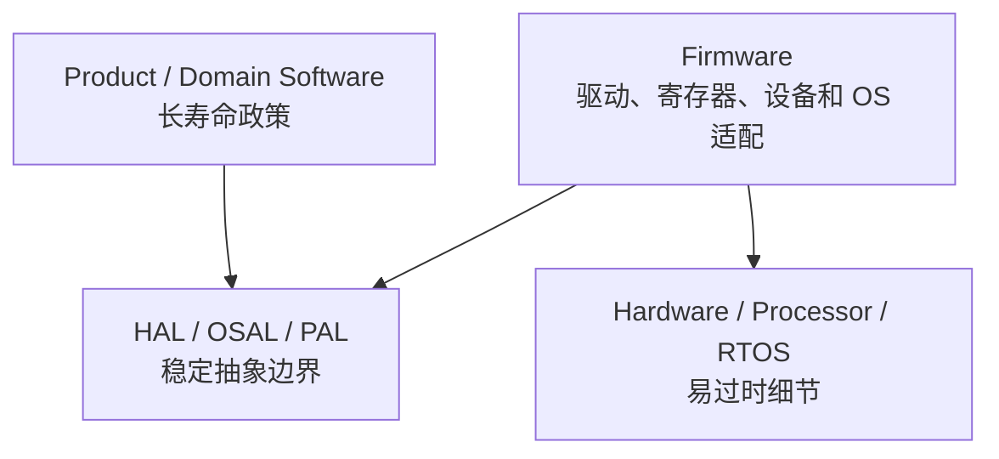
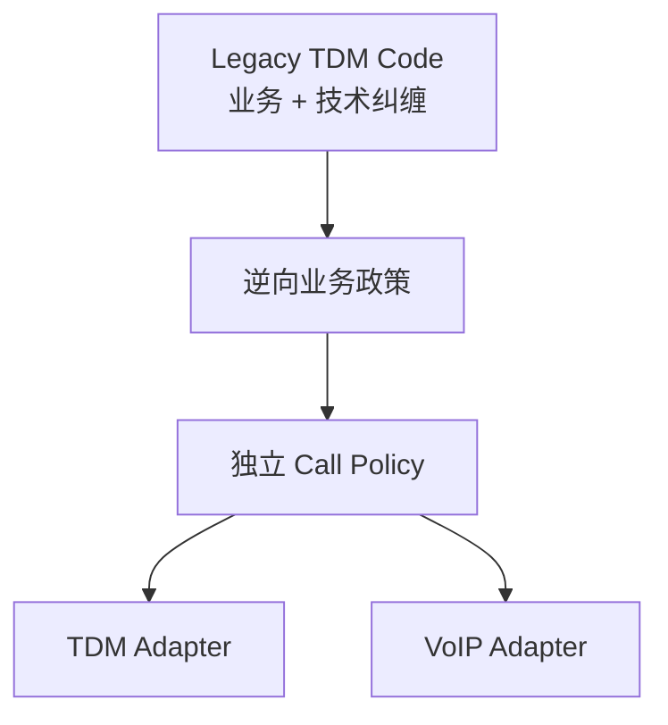
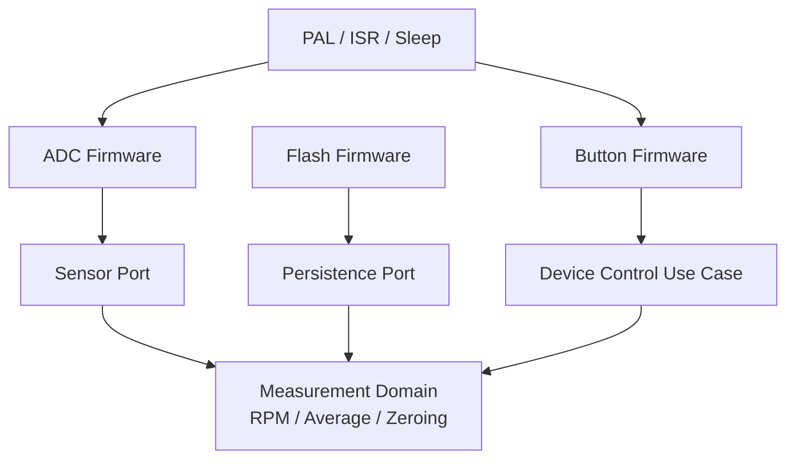
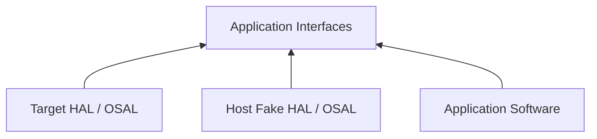
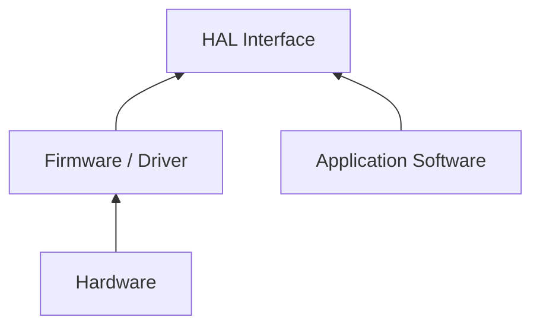
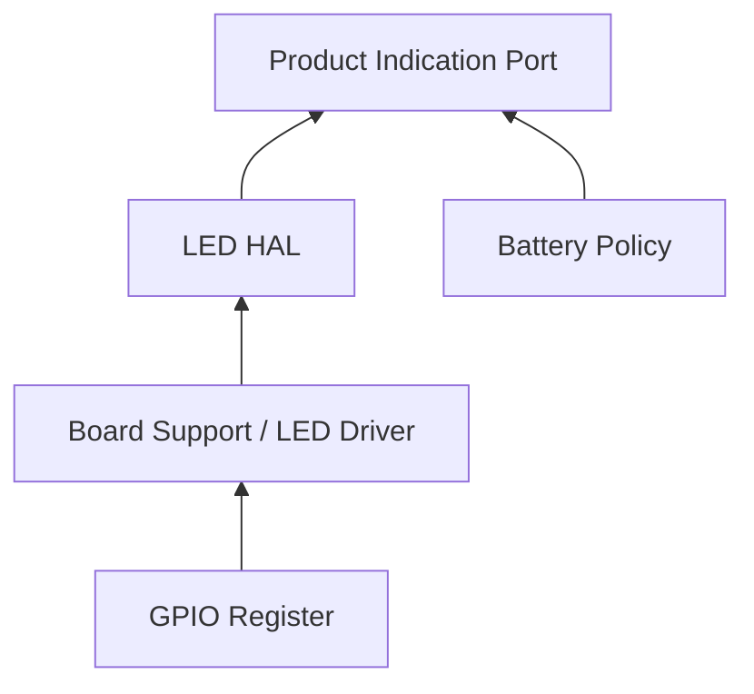
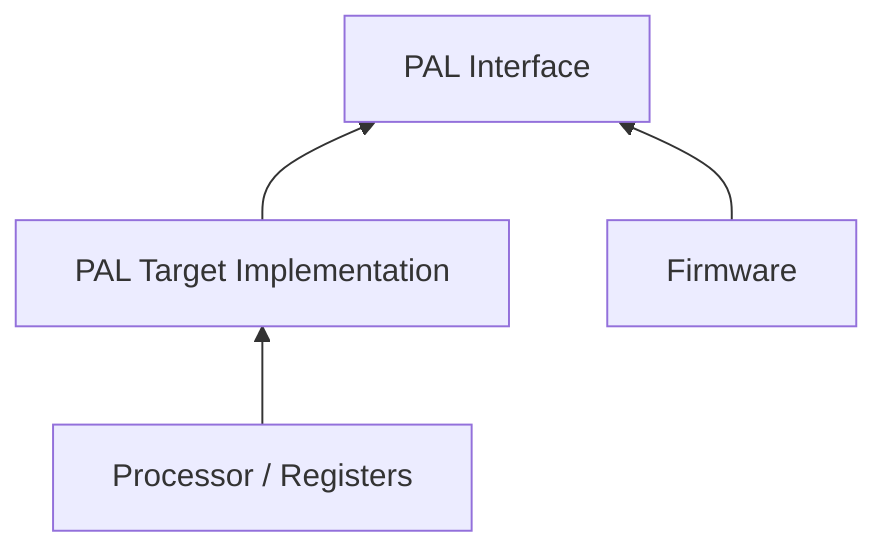
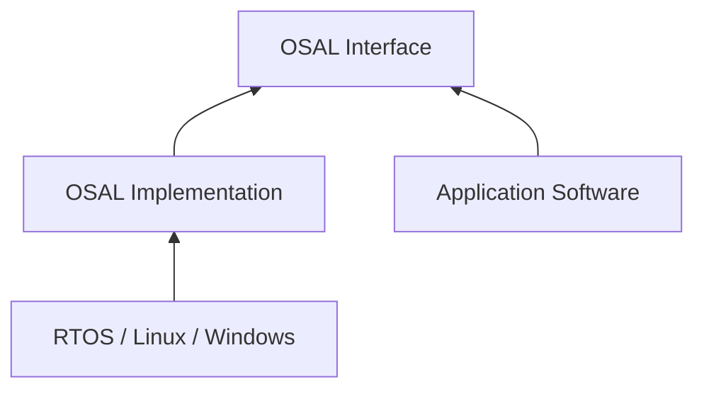
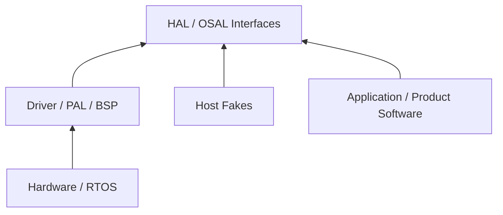

> 原书：Robert C. Martin, *Clean Architecture: A Craftsman's Guide to Software Structure and Design*<br>
> 本章：Chapter 29, Clean Embedded Architecture<br>
> 作者：James Grenning<br>
> 原文参考：Clean Architecture.md

## 本章导读


第 29 章把 Clean Architecture 的原则带入 Embedded System，也就是嵌入式系统。

嵌入式开发经常面临普通应用不那么突出的约束：

- Memory 很小；
- CPU 资源有限；
- Real-Time Deadline；
- IO 能力有限；
- 用户界面非常规；
- 需要连接 Sensor、Motor、UART、GPIO 等真实设备；
- Hardware 与 Software 常常并行开发；
- Target Hardware 可能尚未完成，或自身带有 Defect；
- Vendor Toolchain 常扩展标准 C / C++；
- Hardware、Processor 与 RTOS 会在产品生命周期中更换。

这些约束很真实，却不意味着嵌入式系统可以放弃架构。

本章的核心判断是：

> **Hardware 会过时，Firmware 也会随 Hardware 过时；真正的 Software 应被保护，使它有机会拥有更长的有效寿命。**

作者在 Doug Schmidt 的观点上进一步补充：

> **Software 本身不会磨损，但它会被对 Firmware 和 Hardware 的失控依赖从内部摧毁。**

这里的 Software / Firmware 区分，不取决于代码存储在 ROM、EPROM、Flash 还是 RAM。

更重要的判断是：

- 代码依赖什么；
- Hardware 改变时，代码是否被迫改变；
- 能否在 Off-Target 环境测试；
- 是否被特定 Processor、Compiler、Register、RTOS 与 Device API 绑定。



本章主要给出四类架构手段：

1. **HAL**：Hardware Abstraction Layer，把产品软件与设备细节分开；
2. **PAL**：Processor Abstraction Layer，把 Firmware 与特定 Processor / Compiler 扩展分开；
3. **OSAL**：Operating System Abstraction Layer，把 Software 与 RTOS / OS API 分开；
4. **Programming to Interfaces and Substitutability**：通过接口、替换实现和 Link-Time / Runtime Binding 支持 Off-Target Test 与平台迁移。

作者还批评嵌入式代码的常见目标次序失衡：

- 只做 Make It Work；
- 过早痴迷 Make It Fast；
- 忽略 Make It Right。

最终后果是 Target-Hardware Bottleneck：

- 只有拿到真实 Target 才能运行；
- Hardware 尚未完成时 Software 无法推进；
- Hardware Defect 与 Software Defect 混在一起；
- 回归测试慢且依赖人工；
- Processor 或 RTOS 更换时大量代码重写。

Clean Embedded Architecture 的重要可观察结果是：

> **有价值的 Application Software 能够 Off-Target、Off-OS 测试。**

本章没有数学公式或算法推导。它通过反例、代码依赖和架构边界论证，说明怎样把“能运行的 Firmware”逐步改造成“可长期演进的 Software”。

## 1. 章首观点：Software 不磨损，但会被依赖摧毁

### 1.1 Doug Schmidt 的观点

James Grenning 从 Doug Schmidt 关于 DoD Sustaining Software 的文章出发。

Doug 的核心判断是：

> **Software 不会磨损，但 Firmware 与 Hardware 会过时，从而迫使 Software 修改。**

原文以 `Software does not wear out` 开头，强调代码不会像机械部件那样因使用而物理耗损。

机械部件会磨损，Software Bit 不会因为运行次数增加而物理损耗。

但外部平台会变化：

- 芯片停产；
- 新芯片更便宜；
- 新器件功耗更低；
- 新 Processor 性能更高；
- Vendor 被收购；
- RTOS 价格与质量变化；
- 安全要求升级；
- 新功能持续加入。

### 1.2 作者的补充

作者进一步说：

> **虽然 Software 不会磨损，但不受管理的 Firmware / Hardware Dependency 会从内部摧毁它。**

这意味着 Software 寿命不只由业务需求决定，还由依赖方向决定。

### 1.3 “摧毁”具体表现为什么

- Hardware 更换时业务代码也要改；
- Vendor Header 遍布项目；
- Register 名称进入 Domain Logic；
- RTOS Primitive 出现在所有模块；
- Off-Target 无法编译；
- Test 只能在真实板卡上执行；
- Toolchain 更换等于重写产品；
- Legacy Implementation 变成唯一 Specification。

### 1.4 Embedded Software 为什么需要长寿命

嵌入式产品可能运行多年甚至数十年：

- 医疗设备；
- 工业控制；
- 汽车；
- 电信设备；
- 航空航天；
- 国防系统；
- 基础设施。

Hardware 世代可能更换多次，而核心 Product Policy 仍然存在。

### 1.5 架构目标

Clean Embedded Architecture 希望让：

- Product / Domain Software 长寿；
- Firmware 局部适配 Hardware；
- Hardware 与 RTOS 成为可替换 Detail；
- 测试不被 Target Hardware 独占；
- 变化影响停在边界处。

## 2. Firmware 的真正含义

### 2.1 常见定义

原书列出多种常见 Firmware 定义，例如：

- 存储在 ROM、EPROM 或 Flash 中的软件；
- 写入 Hardware Device 的程序或指令；
- 嵌入 Hardware 的 Software；
- 写入 Read-Only Memory 的程序或数据。

### 2.2 作者为何认为这些定义过时

现代系统中：

- 普通 Application 也可能存储在 Flash；
- Bootloader 可能从可写介质更新；
- Firmware 可以通过网络升级；
- 代码存放位置不决定依赖结构；
- RAM 中运行的代码也可能深度绑定 Hardware。

### 2.3 依赖定义比存储位置更有用

本章采用更架构化的理解：

> **Firmware 是依赖 Hardware、Processor、Toolchain 或 OS Detail，因而会随它们过时和变化的代码。**

### 2.4 Software 与 Firmware 的区分

| 维度 | Software | Firmware |
| --- | --- | --- |
| 主要关注 | Product / Domain Policy | Hardware / Platform Mechanism |
| 依赖 | Stable Interface | Register、Driver、Vendor API |
| Hardware 更换 | 通常不改 | 需要适配或重写 |
| Off-Target Test | 容易 | 常常困难 |
| Toolchain 绑定 | 低 | 高 |
| 期望寿命 | 可跨 Hardware 世代 | 常与平台同步过时 |

### 2.5 这是连续光谱，不是绝对二分

某些 Firmware 比其他 Firmware 更独立：

- 直接操作 Register 的代码最“Firm”；
- PAL 上方代码可以 Off-Target；
- HAL 实现仍依赖 Device；
- Application Software 只依赖 Product-Level Interface。

### 2.6 作者并不反对 Firmware

产品必须有代码：

- 配置 Register；
- 处理中断；
- 控制 UART；
- 驱动 Sensor；
- 访问 Flash；
- 调用 RTOS。

问题不是 Firmware 存在，而是 Firmware 太多，并污染了本可成为 Software 的代码。

### 2.7 目标是 Less Firmware, More Software

- 把不可避免的平台代码压到边界外；
- 把可独立的政策移到边界内；
- 让更多代码能用标准 Toolchain 构建；
- 让更多测试能在 Host 执行。

### 2.8 判断一段代码是否 Firmware

询问：

- 是否提及 Register Name？
- 是否 Include Vendor Header？
- 是否使用 Compiler Extension？
- 是否调用 RTOS Primitive？
- 是否依赖特定 Endianness / Word Size？
- 是否只能在 Target 编译？
- Hardware 替换是否迫使它变化？

答案越多为“是”，它越接近 Firmware。

## 3. 非嵌入式开发者也会写 Firmware

### 3.1 SQL 散布在业务代码

普通应用若把 SQL 到处写进核心：

- Schema 改变会影响业务；
- Database Vendor 改变会影响业务；
- 测试依赖真实 Database；
- 核心寿命受存储技术限制。

这在架构意义上类似 Firmware。

### 3.2 Platform Dependency 散布

例如：

- Cloud SDK 遍布 Use Case；
- Framework Request 进入 Entity；
- OS File API 直接进入 Domain；
- Vendor Message Type 进入核心接口。

这些代码被平台“固化”。

### 3.3 Android 例子

作者指出，Android Developer 如果不把 Business Logic 与 Android API 分开，也在写 Firmware。

症状包括：

- Domain Object 继承 Android Class；
- Use Case 需要 Activity / Context；
- 业务测试必须启动 Emulator；
- Platform Lifecycle 决定业务对象。

### 3.4 通用结论

Firmware 不是嵌入式团队的专属问题。

任何把高层政策绑定到低层平台的系统，都在缩短 Software 的可用寿命。

## 4. TDM 到 VoIP：Legacy Implementation 变成 Specification

### 4.1 案例背景

20 世纪 90 年代末，作者参与重构一个通信子系统。

系统正在从：

- TDM，Time-Division Multiplexing；

迁移到：

- VoIP，Voice over IP。

### 4.2 TDM 曾经是主流

TDM 从 1950、1960 年代发展，在 1980、1990 年代广泛部署。

后来 VoIP 成为新的通信机制。

### 4.3 团队怎样获得业务答案

当开发者询问 Systems Engineer：

- 某种 Call Situation 应怎样处理？
- 某个状态转换应怎样发生？
- 某个异常条件代表什么？

Systems Engineer 会离开一会儿，再带着非常详细的答案回来。

### 4.4 答案来自哪里

答案来自 Current Product Code。

Legacy Code 已经成为新产品的 Specification。

### 4.5 为什么这是危险信号

理想情况下，应能区分：

- Call Business Rules；
- TDM Mechanism；
- State Model；
- Device Interaction。

但旧系统把它们完全纠缠。

### 4.6 TDM 与业务逻辑无法分离

- 业务规则通过 TDM Primitive 表达；
- 状态依赖硬件流程；
- 技术限制被误当成业务规则；
- 没有独立 Domain Model；
- 没有可替换 Port。

### 4.7 整个产品变成 Firmware

虽然其中很多 Call Policy 本可跨 TDM / VoIP 复用，但依赖污染使它们无法独立。

### 4.8 迁移为何困难

团队必须同时：

- 理解业务；
- 逆向 TDM 行为；
- 区分偶然机制与必要政策；
- 设计 VoIP 实现；
- 防止遗漏隐含规则。

### 4.9 一般教训

若实现是唯一规格，平台迁移就不只是“换 Adapter”，而是业务考古。

### 4.10 怎样避免

- 独立描述 Domain Policy；
- 核心测试表达业务；
- Hardware / Protocol 留在 Adapter；
- 用稳定 Event 与 State 表达 Call Behavior；
- 维护可执行 Specification。



## 5. UART Message Processor 污染案例

### 5.1 场景

Command Message 通过 Serial Port 到达系统。

系统具有 Message Processor / Dispatcher，它负责：

- 了解 Message Format；
- 解析消息；
- 找到 Handler；
- 分派请求。

### 5.2 哪部分本可成为 Software

Message Parsing 与 Dispatch Policy 通常不需要知道：

- 具体 UART Register；
- Interrupt Flag；
- Serial Driver；
- Processor Vendor。

它可以接收一个 Byte Stream 或完整 Message。

### 5.3 实际代码结构

Message Processor 与 UART Hardware Interaction 位于同一 Source File。

### 5.4 污染怎样发生

- Parser Include UART Header；
- Dispatcher 直接读取 Register；
- Message Loop 依赖 Interrupt；
- Handler 测试需要 Serial Hardware；
- Transport 与 Message Semantics 混合。

### 5.5 为什么它被降级为 Firmware

Message Processor 本可跨 Hardware 长期复用，却因为 UART Detail 只能在特定 Target 上构建和测试。

### 5.6 更好的边界


### 5.7 输入 Port 可以怎样设计

- readByte；
- readFrame；
- onMessage；
- MessageSource；
- ByteBuffer。

接口应由 Message Processor 的需要塑造，而不是暴露 UART Register。

### 5.8 Off-Target Test

Host Test 可以提供：

- In-Memory Byte Stream；
- Recorded Frame；
- Corrupt Message；
- Partial Frame；
- Timeout Simulation。

### 5.9 一般教训

文件共置经常暗示责任混合。

但只拆文件不够，必须改变依赖方向和接口所有权。

## 6. App-titude Test

### 6.1 为什么提出这个词

作者观察到，大量 Embedded Code 只关注：

- 让应用跑起来；
- 在 Target 上看到结果；
- 尽快通过 Demo。

他把“只证明 App 能工作”称为 App-titude Test。

### 6.2 Kent Beck 的三步

1. **First make it work.**
2. **Then make it right.**
3. **Then make it fast.**

### 6.3 Make It Work

必要性：

- 不工作就没有产品；
- 需要验证需求；
- 需要学习 Hardware；
- 需要暴露未知风险。

但它只是第一步。

### 6.4 Make It Right

通过 Refactoring 让代码：

- 可理解；
- 可测试；
- 有清楚边界；
- 依赖正确；
- 能随需求演进；
- 能让其他人维护。

### 6.5 Make It Fast

只有在性能需求与测量证据下优化：

- Deadline；
- Memory；
- Power；
- Throughput；
- Latency。

### 6.6 嵌入式团队常见失衡

常见次序变成：

1. Make It Work；
2. 到处 Micro-Optimize；
3. 永远没有 Make It Right。

### 6.7 过早 Micro-Optimization 的代价

- 直接 Register Access 扩散；
- Inline Hardware Assumption；
- 重复 Conditional Compilation；
- 难以测试；
- 难以迁移；
- 可读性下降。

### 6.8 Fred Brooks 的建议

*The Mythical Man-Month* 中的 “Plan to Throw One Away” 与 Kent Beck 的观点相通：

- 第一版用于学习；
- 学到真实约束后重构或重建；
- 不把探索性结构永久固化。

### 6.9 App-titude 通过不等于工程完成

一个 Engineer 让设备工作，只证明功能阶段成功。

还要问：

- 能否理解？
- 能否测试？
- 能否迁移？
- 能否维护？
- 能否在 Hardware 未就绪时开发？

### 6.10 非嵌入式系统同样存在

许多 Web / Enterprise App 也只做到：

- 页面可点；
- 数据可存；
- Demo 可过。

却没有长期架构。

## 7. 一个文件中的混杂函数

### 7.1 原书函数列表

原书展示某个小型 Embedded System 同一文件中的函数，包括：

- `ISR(TIMER1_vect)`；
- `ISR(INT2_vect)`；
- `btn_Handler`；
- `calc_RPM`；
- `Read_RawData`；
- `Do_Average`；
- `Get_Next_Measurement`；
- `Zero_Sensor_1`；
- `Zero_Sensor_2`；
- `Dev_Control`；
- `Load_FLASH_Setup`；
- `Save_FLASH_Setup`；
- `Store_DataSet`；
- `bytes2float`；
- `Recall_DataSet`；
- `Sensor_init`；
- `uC_Sleep`。

### 7.2 原顺序说明什么

函数按作者在文件中发现的顺序排列，看不出：

- 领域；
- Hardware；
- Persistence；
- Button Handling；
- Sensor Boundary。

文件没有表达架构。

### 7.3 Domain Logic 组

- `calc_RPM`；
- `Do_Average`；
- `Get_Next_Measurement`；
- `Zero_Sensor_1`；
- `Zero_Sensor_2`。

这些函数可能具有较长寿命，应尽量独立于 Target。

### 7.4 Hardware Platform Setup 组

- `ISR(TIMER1_vect)`；
- `ISR(INT2_vect)`；
- `uC_Sleep`。

这些函数紧贴 Processor / Toolchain。

### 7.5 Button Reaction 组

- `btn_Handler`；
- `Dev_Control`。

其中可能同时含：

- Hardware Input；
- Product State Transition。

还需继续分离机制与政策。

### 7.6 A/D Input 组

- `Read_RawData`。

直接读取 ADC 的部分属于 Firmware。

对原始值进行业务解释的部分可能属于 Software。

### 7.7 Persistent Storage 组

- `Load_FLASH_Setup`；
- `Save_FLASH_Setup`；
- `Store_DataSet`；
- `bytes2float`；
- `Recall_DataSet`。

应进一步区分：

- Name / Value Persistence Policy；
- Flash Driver；
- Serialization Detail。

### 7.8 名称不符行为

作者特别指出 `Sensor_init` 并没有做名称暗示的事情。

这说明：

- 命名失真；
- 职责不清；
- 阅读成本高；
- 可能隐藏副作用。

### 7.9 仅重新排序不够

把函数分组只是识别 Concern 的第一步。

还需要：

- 独立 Module；
- Interface；
- 依赖方向；
- 可替换实现；
- 测试边界。

### 7.10 一个可能的模块结构



### 7.11 文件结构应表达用途

顶层应更容易看见：

- Measurement；
- Calibration；
- Device Control；
- Persistence Port；
- Sensor Port。

而不是只看到：

- `hardware.c`；
- `misc.c`；
- `util.c`。

## 8. 代码为何失去长期寿命

### 8.1 特定 Microprocessor Architecture

原书案例几乎每段代码都知道：

- 特定 Processor；
- 特定 Register；
- 特定 Interrupt；
- 特定 Toolchain。

### 8.2 Extended C

Vendor Compiler 可能增加：

- 非标准 Keyword；
- Register Variable；
- Binary Literal；
- 特殊 Address Space；
- Interrupt Syntax。

代码看起来像 C，但已不再是 Standard C。

### 8.3 Toolchain Lock-In

换 Compiler 时：

- Keyword 不识别；
- Header 不存在；
- Integer Size 不同；
- Register 名称不同；
- Build Script 失效。

### 8.4 Off-Target 无法编译

Host Compiler 不认识 Vendor Extension，因此 Domain Logic 也无法在 Host 测试。

### 8.5 Hardware 永不改变的假设不现实

即使当前确定使用某 MCU：

- Part 可能停产；
- Cost 可能变化；
- Supply Chain 可能中断；
- 新版本可能换 Processor；
- 测试平台与量产平台不同。

### 8.6 长寿命机会被剥夺

本可长期复用的测量、校准和控制政策被迫随 Silicon 一起过时。

## 9. The Target-Hardware Bottleneck

### 9.1 Embedded 的特殊现实

- Limited Memory；
- Real-Time Constraints；
- Deadline；
- Limited IO；
- Unconventional UI；
- Sensor；
- Physical Connection。

### 9.2 Hardware 与 Software 并行开发

Software Team 可能没有稳定 Target 可用。

### 9.3 Hardware 本身也有 Defect

首次拿到 Board 时，失败可能来自：

- PCB；
- Power；
- Clock；
- Driver；
- Firmware；
- Software；
- Test Equipment。

诊断非常慢。

### 9.4 什么是 Target-Hardware Bottleneck

如果所有代码只能在 Target 上运行和测试：

- Board 数量限制并行；
- Hardware 延期阻塞 Software；
- Flash / Deploy 周期慢；
- 调试资源稀缺；
- 自动测试困难；
- 反馈周期变长。

### 9.5 Bottleneck 对团队的影响

- 开发者排队使用 Board；
- CI 无法执行大部分测试；
- 夜间 Hardware Lab 成为唯一验证；
- Bug 定位跨 Hardware / Software；
- 小改动需要完整回归。

### 9.6 只在 Target 测试为何危险

Target Test 数量会受：

- 时间；
- 设备；
- 稳定性；
- 人工操作；
- 观测能力；

限制。

最终团队可能减少回归测试。

### 9.7 Off-Target Test 的目标

不是完全取消 Target Test，而是把：

- Domain Logic；
- Use Case；
- Parser；
- State Machine；
- Algorithm；

尽量放到 Host 自动测试。

### 9.8 Target Test 应集中验证什么

- Driver；
- Timing；
- Interrupt；
- Electrical Behavior；
- Memory Layout；
- Real Device Integration；
- End-to-End Deadline。

### 9.9 测试金字塔

| 层次 | 运行位置 | 主要目标 |
| --- | --- | --- |
| Domain / Use Case Unit | Host | 业务与算法 |
| HAL / OSAL Contract | Host + Target | 替换一致性 |
| Firmware Integration | Simulator / Board | Driver 与外设 |
| Hardware-in-the-Loop | Lab | 真实电气与时序 |
| System Acceptance | Target | 完整产品行为 |

### 9.10 消除 Bottleneck 的关键

建立 Substitution Point：

- HAL；
- PAL；
- OSAL；
- Fake Device；
- Host Implementation；
- Simulator。

## 10. A Clean Embedded Architecture Is Testable

### 10.1 可测试性是结果也是判据

如果 Application Software 无法 Off-Target Test，通常说明 Hardware Detail 已越界。

### 10.2 Off-Target

在 Developer Workstation 或 CI 上：

- 使用标准 Compiler；
- 使用 Fake HAL；
- 不连接真实 Device；
- 快速执行大量测试。

### 10.3 Off-OS

即使 Target 使用 RTOS，Application Policy 也应可在没有该 RTOS 时测试。

Fake / Host OSAL 提供：

- Message Queue；
- Timer；
- Thread / Task；
- Lock；
- Sleep。

### 10.4 可测试性与依赖方向



Application 只依赖自己需要的接口。

### 10.5 Contract Test

Host Fake 与 Target Implementation 应共享契约测试：

- Return Value；
- Error；
- Boundary Condition；
- State Transition；
- Timing Semantics，在可验证范围内。

### 10.6 Fake 不能证明 Hardware 正确

Fake 只帮助验证 Application。

Target Driver 仍需真实 Hardware Test。

### 10.7 Simulator 的位置

Simulator 可位于：

- HAL 实现；
- Device Model；
- System Test Environment。

它比简单 Fake 更真实，但也更昂贵。

### 10.8 Test Double 的选择

- Stub 提供固定 Sensor 值；
- Fake Flash 保存 Name / Value；
- Spy LED 记录 Indicator 调用；
- Simulator 模拟 Protocol 与 Timing；
- Mock 验证关键交互。

### 10.9 可测试架构提高 Hardware 并行开发

Hardware Team 尚未完成时：

- Software 可基于 Interface 推进；
- 测试可用 Host Fake；
- 双方通过 Contract 对齐；
- 集成阶段更集中。

### 10.10 Target Test 数量可以更少但更有价值

把大量政策测试移到 Host 后，Target Test 专注无法替代的物理事实。

## 11. Layers


### 11.1 最初的三层

Figure 29.1 从三层开始：

- Software；
- Firmware；
- Hardware。

### 11.2 Hardware 必然变化

原因包括：

- Moore's Law；
- Obsolescence；
- Cost；
- Power；
- Performance；
- Availability；
- New Peripheral。

### 11.3 Figure 29.2 的基本边界

代码与实体 Hardware 之间自然有边界。

但这条物理边界不足以阻止 Hardware Knowledge 污染所有 Code。

### 11.4 Software / Firmware Intermingling Anti-Pattern

Software 与 Firmware 混杂会导致：

- Change Resistance；
- 危险修改；
- Unintended Consequence；
- Minor Change 触发 Full Regression；
- Manual Test 疲劳；
- 新 Bug 增加。

### 11.5 层是重复 Fractal

原书强调 Layer 中还可以有 Layer。

例如：

- Application；
- Product HAL；
- Device HAL；
- PAL；
- Register Driver；
- Hardware。

Clean Architecture 不是固定三层模板。

## 12. The Hardware Is a Detail


### 12.1 Software / Firmware 边界为何模糊

代码与物理 Hardware 容易区分。

但 Software 与 Firmware 都是代码，边界很容易消失。

### 12.2 Embedded Developer 的职责

作者说，开发者的工作之一是把这条模糊线变清楚。

### 12.3 边界名称：HAL

Hardware Abstraction Layer 位于：

- Application Software；
- Hardware-Specific Firmware；

之间。

### 12.4 HAL 不是新概念

PC 在 Windows 之前已经使用类似思想。

### 12.5 HAL 为谁存在

HAL 为上方 Software 服务。

因此 HAL API 应按 Application Need 设计，而不是按 Hardware Capability 原样暴露。

### 12.6 依赖方向

- Software 依赖 HAL Interface；
- Firmware 实现 HAL；
- Firmware 依赖 Hardware；
- Hardware Detail 不进入 Software。



### 12.7 HAL 是 Seam

Seam 是可替换实现的接缝。

它允许：

- Target HAL；
- Host Fake HAL；
- Simulator HAL；
- New Hardware HAL。

### 12.8 HAL 的目标不是隐藏一切

Hardware 真实约束可能影响 Product：

- Sampling Rate；
- Resolution；
- Deadline；
- Error Model；
- Capacity。

应以 Product Semantic 表达约束，而不是泄漏 Register。

## 13. HAL 示例：Persistence

### 13.1 Firmware 能做什么

Flash Firmware 可以读写：

- Byte；
- Byte Array；
- Address；
- Sector。

### 13.2 Application 需要什么

Application 可能只想：

- 保存 Name / Value Pair；
- 读取 Setting；
- 删除 Setting。

### 13.3 错误的 HAL

若接口是：

```c
int flash_write_sector(uint32_t address, const uint8_t *bytes, size_t length);
int flash_erase_sector(uint32_t sector);
```

它只是把 Flash Mechanism 暴露给 Software。

### 13.4 更高层的 HAL

```c
bool settings_put(const char *name, const void *value, size_t size);
bool settings_get(const char *name, void *value, size_t capacity);
```

Application 不知道：

- Flash；
- Spinning Disk；
- Cloud；
- Core Memory。

### 13.5 为什么接口层级更重要

抽象不是给 Register 换名字。

好的 HAL 表达 Product Need，而不是 Device Primitive。

### 13.6 Host Fake

Host Test 可以用 Map 实现 `settings_put/get`。

### 13.7 Target Implementation

Target Firmware 负责：

- Sector Erase；
- Wear Leveling；
- CRC；
- Power-Failure Safety；
- Flash Address。

### 13.8 应用收益

- 设置逻辑可 Host Test；
- Flash 更换不影响 Application；
- Cloud 版本可复用 Policy；
- Persistence 错误可用统一语义表达。

## 14. HAL 示例：LED 与 Product Intent

### 14.1 Firmware 视角

LED 连接某个 GPIO Bit。

低层函数可能是：

```c
void led_turn_on(unsigned led_index);
```

### 14.2 更低层的风险

Application 仍需要知道：

- 哪个 LED Index；
- LED 与哪个产品状态对应；
- Board Revision 的编号变化。

### 14.3 Product 视角

若 LED 表示 Low Battery，HAL 可以提供：

```c
void indicate_low_battery(void);
void clear_low_battery_indication(void);
```

### 14.4 抽象层级提升

- Firmware / BSP 知道 `led_turn_on(5)`；
- Product HAL 知道 `indicate_low_battery()`；
- Application 只表达 Low Battery Policy。

### 14.5 为什么 Layer 可以包含 Layer



### 14.6 Board Revision 变化

LED 从 GPIO 5 移到 GPIO 2，只修改低层实现。

### 14.7 产品表现变化

未来 Low Battery 改为：

- 屏幕图标；
- 蜂鸣器；
- 手机通知；

Application Policy 仍调用产品语义接口。

### 14.8 不要泄漏 Hardware Detail

原书小节标题强调：

> **Don't Reveal Hardware Details to the User of the HAL。**

User 是上层 Software，不是最终用户。

## 15. The Processor Is a Detail

### 15.1 Vendor Toolchain 的“帮助”

Compiler 常提供：

- 特殊 Header；
- Register Global；
- Interrupt Keyword；
- Address-Space Keyword；
- Binary Literal；
- Peripheral Access Macro。

### 15.2 代码看起来像 C，但不再是 C

标准 Host Compiler 不能编译这些扩展。

### 15.3 Register Global 的便利

代码可以直接访问：

- IO Port；
- Timer；
- Interrupt Controller；
- Clock；
- Serial Buffer。

### 15.4 便利背后的绑定

所有使用这些设施的文件都绑定：

- Silicon；
- Compiler；
- Vendor Header；
- Memory Map。

### 15.5 需要限制知道 ACME 的文件

原书用虚构 ACME DSP 说明：

- 不能禁止 Vendor Header 存在；
- 应严格限制哪些文件 Include 它；
- Application Software 不应知道 ACME。

### 15.6 Processor 变化的现实原因

- Chip Obsolete；
- Supply Shortage；
- Cost Reduction；
- Performance Upgrade；
- Power Requirement；
- Second Source；
- Test Host。

## 16. Vendor Type Header 与 `stdint.h`

### 16.1 `acmetypes.h` 的问题

原书示例根据：

- `_ACME_X42`；
- `_ACME_A42`；

定义 `Uint_32`、`Uint_16`、`Int_32` 等类型。

### 16.2 直接使用的后果

- Application Include Vendor Header；
- Processor 名称扩散；
- Host Integer Size 可能错误；
- 迁移新 Processor 要修改大量文件；
- Test Build 困难。

### 16.3 标准接口更合适

优先让 Software 使用：

- `uint32_t`；
- `uint16_t`；
- `uint8_t`；
- `int32_t`；
- `int16_t`；
- `int8_t`。

### 16.4 Target Compiler 没有 `stdint.h` 怎么办

在 Platform Boundary 中提供兼容 Header：

```c
#ifndef PROJECT_STDINT_H
#define PROJECT_STDINT_H

#include <acmetypes.h>

typedef Uint_32 uint32_t;
typedef Uint_16 uint16_t;
typedef Uint_8  uint8_t;
typedef Int_32  int32_t;
typedef Int_16  int16_t;
typedef Int_8   int8_t;

#endif
```

### 16.5 这个 Wrapper 解决什么

- Vendor Type 只出现在一处；
- Software 使用标准名称；
- Host Build 使用系统 `stdint.h`；
- 新 Target 只替换兼容层。

### 16.6 Wrapper 的边界

它不能解决所有 ABI 问题：

- Endianness；
- Alignment；
- Packing；
- Calling Convention；
- Atomicity。

这些也应限制在 Platform Adapter。

### 16.7 Header Search Path

Host 与 Target Build 可以通过 Include Path 选择不同 `stdint.h` / Platform Header 实现。

### 16.8 不要重新发明标准类型

如果 Toolchain 已提供合格 `stdint.h`，直接使用标准版本。

Compatibility Header 只用于隔离缺失的标准支持。

## 17. Processor Abstraction Layer

### 17.1 PAL 的目的

Processor Abstraction Layer 隔离：

- Register；
- Interrupt；
- Clock；
- Atomic Primitive；
- CPU Sleep；
- Cache；
- Memory Barrier。

### 17.2 PAL 位于哪里



### 17.3 PAL 使 Firmware 少一点 Firm

PAL 上方 Firmware 可以：

- 使用标准 C；
- Host 编译；
- 用 Fake PAL 测试；
- 更容易迁移 Compiler。

### 17.4 PAL 示例能力

- `pal_enter_critical()`；
- `pal_exit_critical()`；
- `pal_sleep()`；
- `pal_ticks()`；
- `pal_uart_write_byte()`。

### 17.5 PAL 不应变成万能平台包

接口应只暴露上层需要的 Processor Service。

### 17.6 PAL 与 HAL 的区别

| 层 | 主要隔离对象 |
| --- | --- |
| HAL | Product Hardware / Device |
| PAL | Processor / Compiler / Register |
| BSP | 特定 Board 的 Device Wiring |

术语会因团队不同而重叠，依赖目标比名字重要。

## 18. `say_hi`：直接 Register Access 的问题

### 18.1 原书函数

原书展示一个直接向 Serial Port 输出 `hi` 的小函数。

它操作：

- `IE`：Interrupt Enable Bit；
- `SBUF0`：Serial Output Buffer；
- `TI_0`：Transmit Buffer Empty Flag。

### 18.2 代码形状

```text
设置中断位
写入字符 h
忙等待发送完成
清除发送标志
写入字符 i
再次等待
写入换行与回车
恢复中断位
```

### 18.3 非标准 Binary Literal

原代码使用 `0b11000000`。

作者指出，标准 C 当时并不支持这种写法；这是 Compiler Extension。

现代标准与 Compiler 支持可能不同，但原书结论仍成立：不要让 Vendor Extension 扩散。

### 18.4 Uppercase “Variable” 其实是 Peripheral

`IE`、`SBUF0`、`TI_0` 看似 Global Variable，实际映射 Microcontroller Peripheral Register。

### 18.5 为什么它是 Firmware

- 绑定具体 Register；
- 绑定 Interrupt Model；
- 绑定 Serial Peripheral；
- 绑定 Toolchain Extension；
- Host 无法直接执行。

### 18.6 直接访问应限制在哪里

仅允许少数：

- PAL Implementation；
- Driver；
- ISR；
- BSP File。

### 18.7 上层接口

```c
bool serial_write(const uint8_t *data, size_t length);
```

更高层还可以是：

```c
void console_write_line(const char *text);
```

### 18.8 Busy Wait 的问题

- 占用 CPU；
- 可能错过 Deadline；
- 难以测试 Timeout；
- 与 Interrupt / DMA 策略绑定。

### 18.9 更高层 Software 不应关心发送机制

可以由 Driver 选择：

- Polling；
- Interrupt；
- DMA；
- RTOS Queue。

### 18.10 迁移收益

换 UART Peripheral 时只改 Driver / PAL，而 Message 或 Console Policy 不改。

## 19. The Operating System Is a Detail


### 19.1 HAL 是否总是足够

Bare-Metal System 中 HAL 可能足够。

使用以下平台时还需要考虑 OS：

- RTOS；
- Embedded Linux；
- Embedded Windows；
- Vendor Scheduler。

### 19.2 OS 为什么是 Detail

OS 提供 Mechanism：

- Thread / Task；
- Mutex；
- Semaphore；
- Queue；
- Timer；
- Memory；
- File；
- Network。

它不定义 Product 的核心业务价值。

### 19.3 直接依赖 RTOS 的风险

- Vendor 被收购；
- Royalty 上涨；
- Quality 下降；
- Capability 不足；
- API 改变；
- 项目迁移 Linux；
- License 改变。

### 19.4 换 OS 不只是语法迁移

不同 OS 的 Primitive 在语义上可能不同：

- Priority；
- Scheduling；
- Timeout；
- Queue Ownership；
- ISR Safety；
- Cancellation；
- Error Code。

### 19.5 OSAL

Operating System Abstraction Layer 位于 Software 与 OS 之间。



### 19.6 OSAL 实现可能很薄

有时只是改名或薄 Wrapper。

### 19.7 OSAL 实现也可能组合多个 Primitive

例如 Product 需要 `mailbox_receive_with_deadline`，OSAL 可能组合：

- Queue Receive；
- Timer；
- Cancellation；
- Error Mapping。

### 19.8 为什么重写 OSAL 比修改整个系统好

迁移 RTOS 时：

- 旧 Application 继续依赖同一 OSAL Contract；
- 新代码集中适配新 OS；
- 业务与算法测试保持；
- 变化范围可控。

### 19.9 Code Bloat 担忧

作者回应：OSAL 可以集中原本散布的重复 OS 使用代码。

并不一定带来显著 Runtime Overhead。

### 19.10 OSAL 还能统一 Application Structure

例如统一：

- Message Passing；
- Task Lifecycle；
- Timeout；
- Error Handling；
- Synchronization。

避免每个 Thread 自行设计 Concurrency Model。

### 19.11 Off-OS Test

Host OSAL 可以在普通环境模拟：

- Queue；
- Timer；
- Task；
- Lock；
- Sleep。

### 19.12 OSAL 的局限

“最小公分母”接口可能：

- 隐藏有价值 OS 能力；
- 限制性能；
- 语义模糊；
- 变成巨大 Wrapper。

应按 Product Need 定义，不追求支持所有 OS 的万能 API。

## 20. Programming to Interfaces and Substitutability

### 20.1 分层建立在接口之上

Module 通过 Interface 交互，Service Provider 才能被替换。

### 20.2 `printf` 例子

许多 Embedded Developer 会为 Target 编写小型 `printf`。

只要接口与标准版本一致：

- Host 使用 Standard `printf`；
- Target 使用 Lightweight `printf`；
- 调用代码不变。

### 20.3 Substitutability 的前提

不仅 Signature 相同，还需：

- Output Semantic；
- Error Behavior；
- Thread Safety；
- Timing Requirement；
- Buffer Rule；
- Reentrancy。

### 20.4 LSP 的作用

低层替代实现必须满足高层依赖的行为契约。

### 20.5 Interface 应由 User 塑造

HAL / OSAL / PAL 不应机械复制 Vendor API。

上层 Software 决定自己需要什么服务。

### 20.6 Host Implementation

Host Implementation 可以：

- 使用 File 模拟 Flash；
- 使用 Map 模拟 Settings；
- 记录 LED Indicator；
- 使用 Thread Library 模拟 Task；
- 用 Pipe 模拟 Serial。

### 20.7 Target Implementation

Target Implementation 负责真实：

- Register；
- Interrupt；
- Driver；
- RTOS；
- Memory Constraint。

### 20.8 Interface 不应承诺无法替代的细节

若接口暴露：

- Register Address；
- RTOS Handle；
- Vendor Error Type；
- DMA Descriptor；

Host Fake 与新平台会被迫复制低层细节。

## 21. Header File 作为接口定义

### 21.1 原书的经验规则

在 Embedded C 中，可以使用 Header File 定义 Interface。

### 21.2 Header 应包含什么

- Function Declaration；
- 必要 Constant；
- 必要 Struct Name；
- Opaque Type；
- 契约文档。

### 21.3 不应包含什么

- 只供实现使用的 Struct；
- Internal Constant；
- Vendor Header；
- Register Definition；
- 私有 Typedef；
- 不必要 Macro。

### 21.4 Clutter 不只是美观问题

多余 Header 内容会产生：

- Unwanted Dependency；
- Recompilation；
- Vendor Lock-In；
- 实现泄漏；
- 迁移成本。

### 21.5 Opaque Pointer Pattern

```c
typedef struct sensor Sensor;

Sensor *sensor_create(void);
void sensor_destroy(Sensor *sensor);
float sensor_read_rpm(Sensor *sensor);
```

调用者不知道内部 Register 与 Driver State。

### 21.6 Forward Declaration

在 C / C++ 中减少 Include，可以降低编译依赖。

### 21.7 Interface Stability

公开 Header 变化会影响所有使用者，因此应：

- 小而内聚；
- 按 Client 需要；
- 不泄漏实现；
- 清楚版本。

### 21.8 Contract Documentation

说明：

- Unit；
- Range；
- Error；
- Ownership；
- Thread / ISR Safety；
- Blocking；
- Deadline；
- Lifetime。

### 21.9 C++ 的补充

可使用：

- Abstract Class；
- PImpl；
- Pure Virtual Interface；
- Template，在编译期替换适用时。

但不能让 Template 把 Vendor Header 扩散到核心。

## 22. DRY Conditional Compilation Directives

### 22.1 常见做法

Embedded C / C++ 常用：

- `#ifdef BOARD_V1`；
- `#ifdef BOARD_V2`；
- `#ifdef RTOS_X`；
- `#ifdef TARGET_ARM`；

开关代码段。

### 22.2 少量条件编译并非问题

在少数 Platform Boundary File 中使用一次，可以合理。

### 22.3 原书极端案例

某 Telecom Application 中，`#ifdef BOARD_V2` 出现数千次，原书进一步说有约 6000 次。

### 22.4 为什么违反 DRY

Hardware Identity 这一知识被复制到数千位置。

Board 变化时，每处都可能要理解和修改。

### 22.5 条件编译怎样污染 Software

```c
#ifdef BOARD_V2
    /* one hardware path */
#else
    /* another hardware path */
#endif
```

如果散布于 Domain Logic：

- 业务与 Board 组合增长；
- 测试组合爆炸；
- 可读性下降；
- 每个平台都编译不同程序结构。

### 22.6 HAL 让 Hardware Type 成为 Detail

Software 只调用 HAL。

具体 Board 实现位于：

- `hal_board_v1.c`；
- `hal_board_v2.c`。

### 22.7 Link-Time Binding

不同 Target Build 链接不同实现：

```text
application + hal_board_v1 -> firmware_v1
application + hal_board_v2 -> firmware_v2
```

Application Source 不含 Board `#ifdef`。

### 22.8 Runtime Binding

若同一 Binary 支持多 Board，可由 Main / Factory 选择实现。

### 22.9 Build System 的职责

- 选择 Source Set；
- 选择 Library；
- 设置 Link Target；
- 限制 Vendor Include Path；
- 生成配置。

不要让 Preprocessor 代替架构。

### 22.10 条件编译应集中

理想位置：

- Composition Root；
- PAL / HAL Implementation；
- Platform Config Header；
- Build Script。

### 22.11 条件编译测试

CI 应构建所有支持组合，避免长期未编译分支腐烂。

### 22.12 DRY 的核心含义

不要重复“当前 Hardware 是什么”这一知识。

让它在 Build / Main / HAL 边界中只有少数真相来源。

## 23. 现代 Clean Embedded 分层示例

### 23.1 Product 层

- Measurement Policy；
- Alarm Policy；
- Calibration；
- Device State Machine；
- Use Cases。

### 23.2 Application Port

- Sensor Input；
- Settings Store；
- Indicator；
- Clock；
- Message Output。

### 23.3 HAL / OSAL

- 产品语义接口；
- OS-independent Service；
- Host Fake；
- Target Implementation。

### 23.4 Driver / PAL / BSP

- Register；
- ISR；
- DMA；
- GPIO；
- Flash Sector；
- RTOS Primitive。

### 23.5 Hardware / OS

- MCU；
- Sensor；
- UART；
- Flash；
- RTOS；
- Board。



### 23.6 依赖规则

所有源码依赖朝 Product Policy。

Target Driver 与 Host Fake 都依赖 Application Port。

### 23.7 Main Component

Main 选择：

- Target HAL；
- Host Fake；
- Simulator；
- OSAL；
- Product Use Case。

### 23.8 测试分层

- Product Unit Test 在 Host；
- HAL Contract Test 在 Host / Target；
- Driver Test 在 Board；
- HIL Test 在 Lab；
- System Test 在 Target。

## 24. 从现有 Firmware 迁移的步骤

### 24.1 不要一次重写

先选择高价值、常变化、可测试的 Slice。

### 24.2 建立 Dependency Inventory

搜索：

- Vendor Header；
- Register Name；
- RTOS API；
- `#ifdef BOARD`；
- Global Hardware State；
- ISR Call。

### 24.3 标记 Domain Logic

识别：

- Calculation；
- State Machine；
- Validation；
- Product Decision；
- Message Semantics。

### 24.4 在接缝处定义 Port

从 Product Need 出发定义：

- Sensor Port；
- Persistence Port；
- Indicator Port；
- Clock Port。

### 24.5 用旧 Firmware 实现 Port

先包住现有 Driver，不必立即重写全部底层。

### 24.6 提取 Host Fake

让 Domain Slice 在 Host 编译和测试。

### 24.7 迁移业务规则

逐步把：

- 条件；
- 计算；
- 状态；
- 解析；

从 Firmware File 移到 Software Module。

### 24.8 集中 Vendor Dependency

将 Include 和 Compiler Extension 限制到：

- PAL；
- BSP；
- Driver；
- Build Config。

### 24.9 建立 Contract Test

确保旧 Target 实现和 Host Fake 在关键语义上一致。

### 24.10 减少条件编译

用：

- Link Selection；
- Factory；
- Source Set；
- Runtime Binding；

替代散布 `#ifdef`。

### 24.11 逐步扩大 Off-Target 覆盖

记录：

- 可 Host Compile 的文件比例；
- Host Test 覆盖的 Policy；
- Vendor Header 扩散范围；
- Target-Only Test 数量。

这些是改进信号，不应作为机械 KPI。

## 25. 实时与性能约束怎样处理

### 25.1 Clean Architecture 不忽略 Deadline

Real-Time Requirement 可能是 Product Policy 的关键约束。

### 25.2 Host Test 能验证什么

- Algorithm Correctness；
- State Transition；
- Worst-Case Input Path；
- 逻辑 Timeout；
- 调度政策。

### 25.3 Host Test 不能验证什么

- 真正 Interrupt Latency；
- Cache Behavior；
- Bus Contention；
- DMA Timing；
- Electrical Signal；
- Worst-Case Execution Time on Target。

### 25.4 Target 性能测试仍必要

架构目标是把性能相关代码局部化，并让大多数政策在 Host 验证。

### 25.5 先正确再优化

- 测量；
- 找到 Bottleneck；
- 优化局部实现；
- 保持接口；
- 用 Regression Test 保护行为。

### 25.6 零开销抽象

C / C++ 可通过：

- Link-Time Binding；
- Inline Wrapper；
- Static Polymorphism；
- LTO；

降低边界开销。

但需注意编译依赖与 Vendor Type 泄漏。

### 25.7 何时允许穿透抽象

极少数经测量证明的 Hot Path 可能需要特殊优化。

应：

- 文档化；
- 限制范围；
- 保持替代测试路径；
- 避免让例外扩散。

## 26. 作者分析问题的完整思路

### 26.1 从寿命问题出发

不是先画 Layer，而是先问：为什么 Embedded Code 随 Hardware 一起过时？

### 26.2 重新定义 Firmware

从“存在哪里”转向“依赖什么”。

这把问题从介质定义转成架构定义。

### 26.3 用两个真实反例证明污染

- TDM / VoIP：整个 Legacy Implementation 成为 Specification；
- UART：可复用 Message Processor 被 Hardware Detail 污染。

### 26.4 解释团队为何落入陷阱

App-titude Test 与 Target Pressure 让团队只追求能跑和微优化。

### 26.5 展示混杂函数列表

通过重新分组，证明同一文件中实际包含多个 Concern。

### 26.6 找到主要瓶颈

Target-Hardware Bottleneck 让 Software 进度、测试和 Hardware 绑在一起。

### 26.7 提出可验证目标

Clean Embedded Architecture 必须支持 Off-Target / Off-OS Test。

### 26.8 逐层隔离 Detail

- HAL 隔离 Hardware；
- PAL 隔离 Processor；
- OSAL 隔离 OS；
- Interface / Header 提供替换接缝。

### 26.9 处理常见反对意见

- Code Bloat；
- Performance；
- Vendor Convenience；
- Target Specialness；
- Conditional Compilation。

### 26.10 回到通用原则

- Separation of Concerns；
- Programming to Interfaces；
- Substitutability；
- DRY；
- Dependency Rule；
- Testability。

### 26.11 最终落到长期健康

少写 Firmware、多保留 Software，才能让产品跨 Hardware 与 OS 演进。

## 27. 适用范围与局限

### 27.1 极小一次性 Firmware

短生命周期、固定 Hardware 的简单程序，完整 HAL / OSAL 可能不划算。

### 27.2 强 Hardware-Centric 算法

某些算法与：

- DSP Instruction；
- FPGA；
- DMA Layout；
- Sensor Physics；

深度相关。

仍可隔离上层 Policy，但不能假装 Hardware 无关。

### 27.3 HAL 可能太低层

`gpio_set(5)` 只是 Register Wrapper，Application 仍知道 Hardware Mapping。

### 27.4 HAL 可能太高层

若 HAL 包含大量具体业务流程，也会变成混合层。

应使用多层 Fractal，而非寻找唯一万能 HAL。

### 27.5 OSAL 最小公分母问题

为了支持所有 OS 而削弱全部能力，可能导致：

- 性能差；
- 语义模糊；
- 难以使用高级特性。

应围绕产品当前需要与可信迁移目标设计。

### 27.6 Fake 与真实时序差异

Host Fake 很难模拟：

- Race；
- Jitter；
- Interrupt；
- Hardware Failure；
- Timing。

必须保留 Target / HIL Test。

### 27.7 Interface 数量成本

每个接缝都需要：

- API；
- 实现；
- Fake；
- Contract；
- 维护。

按变化风险选择边界。

### 27.8 C ABI 与性能限制

抽象需要注意：

- Memory；
- Stack；
- Dynamic Allocation；
- Virtual Dispatch；
- Code Size。

可以使用静态分配和 Link-Time Binding，而不放弃依赖方向。

## 28. 易混淆概念与常见误解

### 28.1 “Firmware 由存储在 ROM 决定”

错误。本章更关注它依赖 Hardware 的程度与随 Hardware 过时的风险。

### 28.2 “所有嵌入式代码都是 Firmware”

错误。Product Policy 可以成为跨平台长寿 Software。

### 28.3 “只有 Embedded Developer 会写 Firmware”

错误。SQL、Android API、Cloud SDK 散布在业务中也会固化代码。

### 28.4 “Hardware 已经确定，所以不需要 HAL”

错误。还要考虑测试、Toolchain、Board Revision、Part Obsolescence 和下一代产品。

### 28.5 “HAL 就是给 Register 函数换名字”

错误。HAL 应表达上层 Product Need，并隐藏 Hardware Detail。

### 28.6 “HAL 越通用越好”

错误。万能 HAL 往往层级过低或语义模糊，应由 User 需要塑造。

### 28.7 “Off-Target Test 可以取代 Target Test”

错误。它验证 Policy，真实电气、时序和 Driver 仍需 Target / HIL。

### 28.8 “Make It Work 后立即 Make It Fast”

错误。应先 Make It Right，再基于测量优化。

### 28.9 “Embedded 特殊，所以 Clean Architecture 不适用”

错误。特殊约束影响实现方式，不取消依赖和测试原则。

### 28.10 “Vendor Header 很方便，可以全项目 Include”

错误。它应被限制在 PAL / Driver 边界。

### 28.11 “代码看起来像 C 就是标准 C”

错误。Vendor Keyword、Register Global 与 Literal 可能绑定特定 Toolchain。

### 28.12 “Wrapper Header 能解决所有 Portability”

错误。Endianness、Alignment、ABI 与 Timing 仍需处理。

### 28.13 “OSAL 只是改函数名，没有价值”

即使薄 Wrapper，也能集中依赖、建立 Test Seam；复杂语义则需更高层适配。

### 28.14 “OSAL 必须支持所有 RTOS”

错误。应支持产品可信需求，不做无限通用框架。

### 28.15 “Header 放更多内容便于使用”

错误。不必要类型和常量会扩大依赖与重编译范围。

### 28.16 “6000 个 `#ifdef` 是嵌入式不可避免”

错误。HAL、Source Set 与 Link Binding 可以集中 Hardware Selection。

### 28.17 “条件编译完全不能使用”

错误。在少数 Platform Boundary / Build Config 中可合理使用。

### 28.18 “接口一定增加运行时开销”

错误。C Function、Link-Time Binding、Inline 与 LTO 可使开销很低；仍需测量。

### 28.19 “Domain Logic 没有 IO 就是纯 Software”

若它仍 Include Vendor Header 或使用 RTOS Type，依然被平台绑定。

### 28.20 “只要有全面 Target Test，架构就干净”

错误。Target-Only Test 本身可能是 Hardware Coupling 的信号。

### 28.21 “重写比重构旧 Firmware 更简单”

未必。旧代码可能是唯一隐含规格，必须先提取业务知识和 Regression Test。

### 28.22 “Real-Time 要求允许所有层直接访问 Register”

错误。先测量 Hot Path，并把例外限制在局部 Firmware。

## 29. 实践检查与掌握练习

### 29.1 Software / Firmware 检查

- 哪些模块表达 Product Policy？
- 哪些模块知道 Register / RTOS / Vendor？
- Hardware 更换会修改哪些文件？
- 本可长寿的代码是否被平台污染？
- Firmware 是否被限制在少数边界？

### 29.2 Off-Target 检查

- Domain Logic 能否用 Host Compiler 构建？
- 多少测试必须排队使用 Board？
- 是否有 Fake HAL / OSAL？
- Clock、Random、Sensor 是否可控制？
- Hardware 未到时 Software 能否推进？

### 29.3 HAL 检查

- API 是否表达 Product Need？
- 是否泄漏 GPIO、Sector、Register？
- Interface 由上层 User 拥有吗？
- 是否有 Host 与 Target 实现？
- 是否有 Contract Test？

### 29.4 PAL 检查

- Vendor Header 出现在哪些文件？
- Register Global 是否限制在 Driver？
- Compiler Extension 是否扩散？
- 标准类型是否优先？
- Host Build 是否可替换 PAL？

### 29.5 OSAL 检查

- Application 是否直接调用 RTOS？
- Queue / Timer / Lock 语义是否集中？
- 换 RTOS 要修改多少业务文件？
- 是否支持 Off-OS Test？
- OSAL 是否成为万能最小公分母？

### 29.6 Header 检查

- Header 是否只有必要 Declaration？
- 是否 Include Vendor Detail？
- 是否泄漏私有 Struct？
- Ownership、Blocking、ISR Safety 是否文档化？
- 修改实现是否触发大量重编译？

### 29.7 Conditional Compilation 检查

- `#ifdef BOARD` 出现多少位置？
- 是否散布 Domain Logic？
- 能否改为不同 Source Set / Library？
- Hardware Identity 是否只有一个真相来源？
- CI 是否构建所有 Target？

### 29.8 场景判断一：Parser 与 UART Register 同文件

**判断：** Message Policy 被 Hardware 污染，应提取输入 Port 与 UART Adapter。

### 29.9 场景判断二：Application 调 `led_turn_on(5)`

**判断：** HAL 层级过低，应用仍知道 Board Mapping；可提升为 `indicate_low_battery`。

### 29.10 场景判断三：Domain 使用 `uint32_t`

Target 通过兼容 Header 映射 Vendor Type。

**判断：** 合理，比直接使用 `Uint_32` 更可移植。

### 29.11 场景判断四：所有 Task 直接调用 RTOS Queue

**判断：** OS 依赖扩散，应评估 OSAL 与统一 Message Passing Policy。

### 29.12 场景判断五：Host Fake 通过，Board Timing 失败

**判断：** 不矛盾。Host 验证 Policy，Target 仍需验证真实 Timing 与 Driver。

### 29.13 场景判断六：只有一个文件使用 `#ifdef BOARD_V2`

位于 HAL Composition Boundary。

**判断：** 可以合理，DRY 问题来自知识大规模重复。

### 29.14 场景判断七：6000 个 `#ifdef BOARD_V2`

**判断：** Hardware Identity 散布，应用应改为 HAL + Link / Runtime Binding。

### 29.15 场景判断八：性能热点绕过 HAL

尚无 Profiling 证据。

**判断：** 过早优化；先测量，再限制例外范围。

### 29.16 快速复述练习

能够回答以下问题，基本就掌握了本章：

1. Doug Schmidt 关于 Software、Firmware、Hardware 的观点是什么？
2. James Grenning 在其上补充了什么？
3. 为什么 Firmware 不应仅按 ROM / Flash 存储位置定义？
4. 本章如何按依赖区分 Software 与 Firmware？
5. 为什么作者要求 Less Firmware, More Software？
6. 非嵌入式开发者怎样写出 Firmware？
7. TDM 到 VoIP 案例中，为什么 Legacy Code 变成 Specification？
8. UART Message Processor 为什么本可成为长寿 Software？
9. App-titude Test 是什么？
10. Kent Beck 的 Make It Work / Right / Fast 次序是什么？
11. Fred Brooks 的 Plan to Throw One Away 与之有何关系？
12. 原书函数列表混合了哪些 Concern？
13. 为什么重新分组函数还不够？
14. 什么是 Target-Hardware Bottleneck？
15. Hardware 并行开发与 Defect 怎样加重 Bottleneck？
16. Clean Embedded Architecture 为什么必须 Off-Target Test？
17. Target Test 应集中验证什么？
18. Figure 29.1 / 29.2 的三层与边界说明什么？
19. Software / Firmware Intermingling Anti-Pattern 有何后果？
20. HAL 是什么，为谁设计？
21. Persistence HAL 为什么应使用 Name / Value，而非 Flash Sector？
22. `led_turn_on(5)` 与 `indicate_low_battery()` 有何层级差异？
23. 为什么 Layer 是 Fractal？
24. “Don't Reveal Hardware Details to the User of the HAL”是什么意思？
25. Vendor C Extension 怎样绑定 Processor 与 Toolchain？
26. `acmetypes.h` 直接扩散有什么问题？
27. `stdint.h` Compatibility Wrapper 怎样限制依赖？
28. PAL 解决什么问题？
29. `say_hi` 为什么是 Firmware？
30. Busy Wait 和 Register Global 有什么风险？
31. 为什么 OS 也是 Detail？
32. OSAL 怎样降低 RTOS 迁移成本？
33. OSAL 如何提供 Off-OS Test Seam？
34. Programming to Interfaces 与 Substitutability 如何应用？
35. Header File 作为接口时应包含和排除什么？
36. 为什么 Header Clutter 会产生依赖？
37. 原书约 6000 个 `#ifdef BOARD_V2` 说明什么？
38. HAL、Linker 与 Runtime Binding 如何替代条件编译散布？
39. 如何从 Legacy Firmware 渐进提取 Software？
40. Clean Architecture 如何兼顾 Real-Time 与 Performance？

### 29.17 一分钟记忆卡

- **寿命：** Software 不磨损，但会被 Hardware / Firmware 依赖摧毁。
- **定义：** Firmware 由依赖与可变性决定，不由存储在 ROM 决定。
- **目标：** Less Firmware, More Software。
- **反例：** TDM 业务与技术纠缠；UART 污染 Message Processor。
- **次序：** Make It Work → Make It Right → Make It Fast。
- **瓶颈：** Target-Only Test 阻塞开发与回归。
- **判据：** Clean Embedded Software 可 Off-Target、Off-OS 测试。
- **HAL：** 以 Product Need 隔离 Hardware Detail。
- **PAL：** 隔离 Processor、Register 与 Compiler Extension。
- **OSAL：** 隔离 RTOS / OS Primitive。
- **接口：** 上层拥有，支持 Host / Target Substitution。
- **Header：** 只暴露必要契约，不泄漏 Vendor Detail。
- **DRY：** 把 Board 选择集中到 HAL、Link 或 Main，避免数千 `#ifdef`。
- **结论：** Hardware、Processor 与 OS 都是 Detail，Product Policy 才应获得长寿命。

## 30. 本章总结

1. 第 29 章由 James Grenning 撰写，把 Clean Architecture 原则应用到 Embedded System。
2. Doug Schmidt 指出 Software 不会磨损，但 Firmware 与 Hardware 会过时并迫使 Software 修改。
3. Grenning 补充：未管理的 Firmware / Hardware Dependency 会从内部摧毁 Software。
4. Embedded Hardware 会因 Obsolescence、Cost、Power、Performance 与 Supply 等原因持续演进。
5. Product Policy 可能跨多个 Hardware 世代存在，因此应获得更长有效寿命。
6. 常见 Firmware 定义强调代码存储在 ROM、EPROM 或 Flash，作者认为这不足以描述现代问题。
7. 本章更关注代码依赖什么，以及 Hardware 变化时它是否被迫变化。
8. 直接依赖 Register、Vendor Header、Compiler Extension、RTOS 与 Device API 的代码属于更强 Firmware。
9. Firmware 并非坏事，Driver、ISR、Register 和 Device Adapter 不可避免。
10. 真正问题是 Firmware 太多，并污染本可独立演化的 Software。
11. 本章目标可概括为 Less Firmware, More Software。
12. 非嵌入式开发者把 SQL、Cloud SDK、Android API 与 Framework Type 散布到业务代码时，也会写出架构意义上的 Firmware。
13. TDM 到 VoIP 案例中，旧产品代码混合通信机制与 Call Business Logic。
14. Systems Engineer 必须阅读 Current Product Code 才能回答业务行为，Legacy Implementation 已成为 Specification。
15. 技术和业务无法解开，使整个产品几乎都变成 Firmware，迁移等于业务考古。
16. UART 案例中，Message Processor / Dispatcher 与 Hardware Access 位于同一文件。
17. Parser 与 Dispatch Policy 本可跨 Hardware 长期复用，却被 UART Detail 污染。
18. 更好结构是 UART Firmware 实现 Message Input Port，Message Processor 只处理格式和分派。
19. Host 可用 In-Memory Byte Stream 测试完整、损坏、分片和超时消息。
20. App-titude Test 指只证明应用能运行，而没有为长期演进把代码做对。
21. Kent Beck 的顺序是 First Make It Work、Then Make It Right、Then Make It Fast。
22. Make It Work 是必要起点，但不能成为工程终点。
23. Make It Right 通过 Refactoring 获得可理解、可测试和清晰边界。
24. Make It Fast 应由真实 Deadline、Memory、Power 与 Profiling 驱动。
25. Embedded Team 常跳过 Make It Right，直接在全项目进行 Micro-Optimization。
26. Fred Brooks 的 Plan to Throw One Away 同样强调先学习，再构造更好方案。
27. 原书展示的单一文件混合 ISR、Button、RPM Calculation、A/D、Flash、Sensor 与 Sleep 等 Concern。
28. 重新分组后可以识别 Domain Logic、Hardware Setup、Button、ADC、Persistence 与命名错误函数。
29. 只重新排列函数不够，还要建立 Module、Interface、正确 Dependency 与 Test Boundary。
30. Vendor Extended C 让几乎所有文件绑定特定 Microprocessor、Compiler 与 Toolchain。
31. 代码因此无法 Off-Target Compile，并失去跨 Hardware 的长期寿命。
32. Target-Hardware Bottleneck 指只有真实 Target 才能运行和测试代码。
33. Hardware 与 Software 常并行开发，Board 未完成会阻塞 Software。
34. 首批 Hardware 本身也可能有 Defect，使故障归因更困难。
35. Board 数量、Flash 周期、人工操作与 Lab 资源会限制并行开发和自动回归。
36. Clean Embedded Architecture 的关键判据是 Application Software 可 Off-Target Test。
37. 使用 RTOS 时，还应能 Off-OS Test 高价值 Application Policy。
38. Host Unit Test 不能替代真实 Driver、Electrical、Interrupt 与 Deadline 的 Target / HIL Test。
39. 合理测试分层把大量 Domain / Use Case Test 放在 Host，把不可替代的物理验证留给 Target。
40. Figure 29.1 从 Software、Firmware、Hardware 三层开始。
41. Figure 29.2 表明 Hardware 与其余系统有天然物理边界，但 Hardware Knowledge 仍可能污染全部代码。
42. Software / Firmware Intermingling 是 Anti-Pattern，会抵抗变化并制造意外后果。
43. Minor Change 可能要求 Full Regression，人工测试疲劳又会导致新 Bug。
44. Software 与 Firmware 的模糊边界应由 Embedded Developer 主动明确。
45. 这条边界称为 Hardware Abstraction Layer，HAL。
46. HAL 为上层 Software 存在，因此 API 应按 Software / Product Need 设计。
47. Persistence HAL 应表达 Name / Value，而不是 Flash Address、Sector 与 Byte Array。
48. Target Firmware 负责 Erase、Wear Leveling、CRC 与 Power-Failure Safety 等 Flash Detail。
49. Host Fake 可用 Map 实现同一 Persistence Contract，支持 Off-Target Test。
50. `led_turn_on(5)` 仍泄漏 LED Index，而 `indicate_low_battery()` 表达 Product Intent。
51. GPIO Mapping、Board Revision 与具体 Indicator 留在 HAL / BSP 下方。
52. Layer 可以继续包含 Layer，架构更像重复 Fractal 而非固定三层。
53. HAL 是 Test Seam，可由 Target、Host Fake、Simulator 与 New Hardware 实现替换。
54. Hardware 真实 Sampling Rate、Resolution 与 Error Model 可以通过 Product Semantic 表达，但不能泄漏 Register。
55. Processor 也是 Detail，Vendor Toolchain 的特殊 Header、Keyword 与 Register Global 会绑定 Silicon。
56. 代码看起来像 C，不代表它仍是 Standard C。
57. 原书用 ACME DSP 的 `_ACME_X42`、`_ACME_A42` 与 `Uint_32` 等类型展示 Vendor Lock-In。
58. Application 直接使用 `acmetypes.h` 会让 Host Build 类型错误，并增加 Processor 迁移成本。
59. 优先使用 `stdint.h` 的 `uint32_t`、`int16_t` 等标准名称。
60. Target 缺少 `stdint.h` 时，可在 Platform Boundary 用兼容 Header 映射 Vendor Type。
61. Wrapper 只能集中类型依赖，不能自动解决 Endianness、Alignment、Packing 与 ABI。
62. Processor Abstraction Layer 隔离 Register、Interrupt、Clock、Sleep 与 CPU Primitive。
63. PAL 上方 Firmware 可以更接近 Standard C，并使用 Host Fake 测试。
64. HAL、PAL、BSP 术语可能重叠，关键是它们隔离的变化对象和依赖方向。
65. 原书 `say_hi` 示例直接操作 `IE`、`SBUF0` 与 `TI_0` 等 Microcontroller Peripheral。
66. `0b11000000` 等语法在原书语境中是非标准 Compiler Extension。
67. Uppercase Variable 实际是 Register，使用它的代码绑定具体 Processor。
68. Busy Wait 占用 CPU，并把发送策略锁定到 Polling。
69. Register Access 应限制在少数 PAL、Driver、ISR 与 BSP 文件。
70. 上层可依赖 `serial_write` 或更高层 `console_write_line`，不关心 Polling、Interrupt 或 DMA。
71. HAL 对 Bare-Metal 可能足够，使用 RTOS、Embedded Linux 或 Windows 时还要隔离 OS。
72. RTOS Vendor、Royalty、Quality 与 Capability 都可能变化，因此 OS 是 Detail。
73. RTOS 迁移不只是 API 改名，不同 Scheduling、Timeout、Queue 与 ISR Semantic 也要适配。
74. Operating System Abstraction Layer 位于 Application Software 与 RTOS / OS 之间。
75. OSAL 可以是薄 Wrapper，也可以组合多个 OS Primitive 提供 Product-Level Service。
76. 迁移 OS 时重写一个符合旧 Contract 的 OSAL，比修改大量复杂 Application Code 更安全。
77. OSAL 可集中原本重复的 Message Passing 与 Concurrency Pattern，不必造成显著 Code Bloat。
78. Host OSAL 为 Queue、Timer、Task、Lock 与 Sleep 提供 Off-OS Test Seam。
79. OSAL 不应追求支持所有 OS 的万能最小公分母，应围绕可信 Product Need 设计。
80. Layered Architecture 建立在 Programming to Interfaces 与 Substitutability 上。
81. Target 可替换 Standard `printf` 的前提不仅是 Signature，还包括输出、错误、线程与时序语义。
82. HAL / OSAL / PAL Interface 应由上层 User 需要塑造，不应机械复制 Vendor API。
83. Host Implementation 与 Target Implementation 都依赖同一稳定 Contract。
84. Embedded C 可使用 Header File 作为 Interface Definition。
85. Header 应只暴露必要 Function Declaration、Constant、Struct Name、Opaque Type 与契约。
86. Implementation-Only Struct、Vendor Header、Register 和 Private Typedef 不应泄漏。
87. Header Clutter 会产生 Unwanted Dependency、Recompilation 与 Vendor Lock-In，不只是美观问题。
88. Opaque Pointer 与 Forward Declaration 可减少实现暴露。
89. Interface 文档应说明 Unit、Range、Ownership、Blocking、ISR Safety、Thread Safety 与 Lifetime。
90. Embedded Code 常用 `#ifdef BOARD_V1`、`BOARD_V2` 与 `RTOS_X` 选择平台。
91. 少量条件编译位于 Platform Boundary 时可以合理。
92. 原书案例中 `#ifdef BOARD_V2` 出现约 6000 次，Hardware Identity 被重复到整个系统。
93. 这违反 DRY，并使业务代码承担 Board 组合与迁移成本。
94. HAL 可以把 Hardware Type 隐藏为 Detail，不同 Build 链接不同 Board Implementation。
95. Runtime 需要多 Board 时，也可由 Main / Factory 选择实现。
96. Build System 应负责 Source Set、Library、Link Target 与 Vendor Include Path，而不是让 Preprocessor 代替架构。
97. CI 应构建所有支持 Target，防止长期未编译分支腐烂。
98. Legacy Firmware 迁移应渐进进行：盘点依赖、标记 Domain Logic、定义 Port、包住旧 Driver、增加 Host Fake。
99. Real-Time 与 Performance 约束不会使 Clean Architecture 失效；应先测量，再局部优化 Hot Path。
100. Host Test 验证算法与政策，Target Test 验证 Interrupt、Cache、Bus、DMA 与真实 Worst-Case Timing。
101. C / C++ 可使用 Link-Time Binding、Inline、Static Polymorphism 与 LTO 降低抽象开销。
102. 极少数性能例外应文档化并限制范围，不能让 Register Detail 再次扩散。
103. Clean Embedded Architecture 不要求所有小程序建立完整 HAL / OSAL，边界成本应匹配寿命和变化风险。
104. 强 Hardware-Centric 算法仍可能依赖 DSP、DMA 或 Sensor Physics，但应保护更高层 Product Policy。
105. Fake 无法完整模拟 Race、Jitter、Interrupt 与 Hardware Failure，因此 Target / HIL Test 永远重要。
106. 本章分析方法从 Software 寿命问题出发，重新按依赖定义 Firmware，再用真实反例验证污染后果。
107. App-titude 与 Target-Hardware Bottleneck 解释了团队为何只追求能运行而忽视架构。
108. HAL、PAL、OSAL、Interface 与 DRY Conditional Compilation 构成逐层隔离方案。
109. 这些方法最终都回到 Separation of Concerns、Dependency Rule、Substitutability 与 Testability。
110. 本章最终原则是：Hardware、Processor 与 Operating System 都是 Detail；把它们限制在 Firmware 边界外，才能让 Product Software 获得长久、可测试、可迁移的生命。
