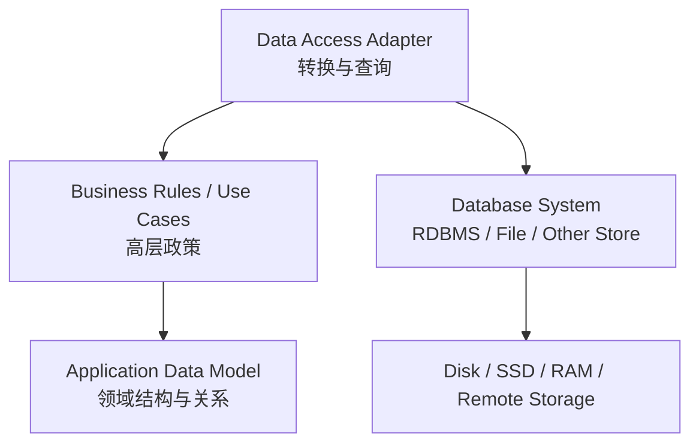
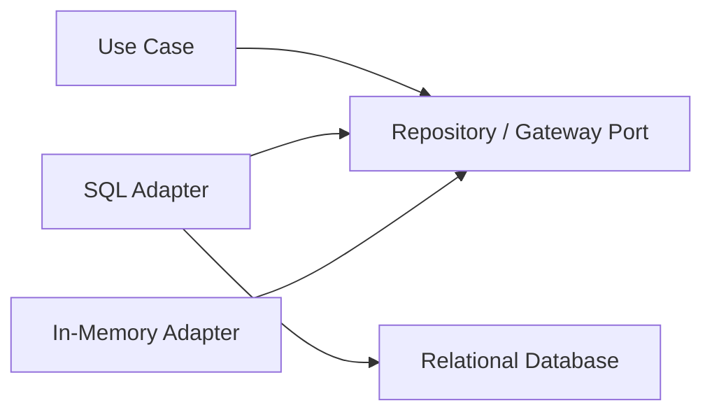
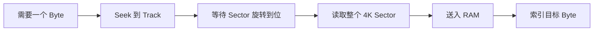
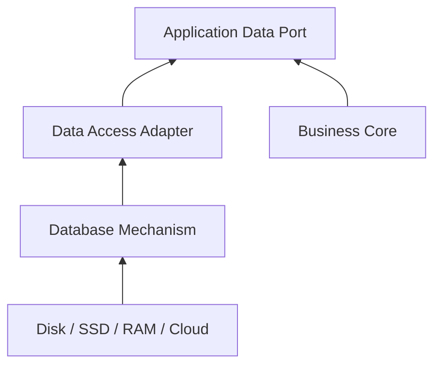
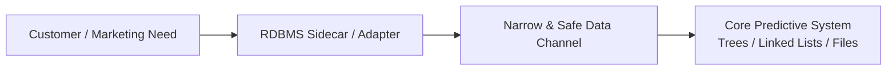

> 原书：Robert C. Martin, *Clean Architecture: A Craftsman's Guide to Software Structure and Design* 
> 本章：Chapter 30, The Database Is a Detail 
> 原文参考：Clean Architecture.md

## 本章导读

第 30 章进入 Part VI：Details，也就是“细节”。

作者首先选择一个在企业软件中经常被当作架构中心的对象：Database。

他的结论非常强烈：

> **从 Architecture 的角度看，Database 是一个 Non-Entity，是低层 Detail，而不是高层架构元素。**

作者甚至把 Database 与房屋 Architecture 的关系类比为：

> **Doorknob 与房屋架构的关系。**

这个说法很容易引起反对，因为 Database 往往：

- 保存最重要的数据；
- 影响一致性与事务；
- 决定查询性能；
- 占据大量运维成本；
- 驱动 Schema 与 Migration；
- 是许多系统最昂贵的基础设施。

本章并没有否认这些事实。

作者真正区分的是：

- **Data Model**：应用内部如何组织业务数据与关系，具有架构意义；
- **Database System**：把数据存入某种介质并提供访问能力的 Software Utility，是低层 Mechanism。

作者沿着以下推理路线展开：

1. Relational Model 很优秀，但优秀技术仍然只是技术；
2. Rows、Tables 与 SQL 不应进入 Use Case 与 Business Rule；
3. Database 和 File System 的普及来自 Rotating Disk 的慢速访问特性；
4. Disk 需要 Index、Cache、Query Optimization 和规则化存储布局；
5. 数据进入 RAM 后，程序仍会重新组织为 List、Set、Tree、Hash Table、Stack、Queue；
6. 因此 Database 主要是把 Bit 在长期介质与 RAM 之间搬运和管理的机制；
7. Performance 很重要，但可被封装在低层 Data Access Mechanism；
8. 即使市场或客户强制要求 RDBMS，也应把它“挂在系统侧面”，通过 Narrow and Safe Channel 接入，而不是让它成为核心。

本章没有正式数学公式或算法推导。它使用：

- 历史背景；
- 介质延迟直觉；
- 文件系统与数据库对比；
- 无磁盘思想实验；
- 真实创业公司案例；

说明技术的市场重要性、运行重要性与架构层级不是一回事。

需要特别注意时代边界：原书预测旋转磁盘将被 RAM 取代。到今天，HDD 仍在大容量冷数据和云存储中广泛存在，SSD、NVMe、Persistent Memory、Object Storage 与分布式存储也改变了介质结构。因此，具体预测不应机械接受；长期有效的结论是：

> **存储介质与数据库产品会变化，核心业务不应被某种持久化机制定义。**

## 1. Database 是什么，不是什么

### 1.1 作者的“战斗性”开场

作者知道“Database 不是架构元素”会引起争论。

许多组织会先决定：

- Oracle；
- MySQL；
- SQL Server；
- MongoDB；
- Cloud Database；

再围绕它组织系统。

### 1.2 Database 是一段 Software

Database System 本身是：

- 一个程序；
- 一组进程；
- 一套 Storage Engine；
- 一种 Query Mechanism；
- 一种 Transaction Mechanism；
- 一套运维工具。

它为数据提供访问与管理能力。

### 1.3 Database 是 Utility

原书称 Database 为 Utility。

它提供：

- Store；
- Retrieve；
- Search；
- Index；
- Join；
- Transaction；
- Recovery；
- Concurrency Control。

这些能力服务 Application Policy。

### 1.4 Database 为什么是低层 Mechanism

它关心：

- Page；
- Row；
- Table；
- Index；
- Query Plan；
- Buffer Pool；
- Log；
- Storage Layout；
- Network Protocol。

这些都靠近数据存取机制，而不是系统存在的业务理由。

### 1.5 Data Model 为什么不同

Data Model 描述：

- 核心业务概念；
- 概念之间关系；
- 约束；
- 生命周期；
- 一致性；
- 身份；
- 状态转换。

例如订单系统中的：

- Order；
- Order Line；
- Customer；
- Payment；
- Inventory Reservation。

这些结构直接影响业务政策。

### 1.6 Data Model 不等于 Schema

Schema 是某种 Database 中的数据表示。

同一个 Domain Model 可以映射为：

- Relational Tables；
- Documents；
- Events；
- Key-Value Entries；
- Graph Nodes；
- In-Memory Objects。

### 1.7 Schema 仍然很重要

说 Schema 是外层表示，不表示它可以随意设计。

Schema 会影响：

- Integrity；
- Migration；
- Query Performance；
- Concurrency；
- Operations；
- Storage Cost。

但它不应反向定义核心业务对象的全部形状。

### 1.8 Doorknob 类比怎样理解

门把手：

- 对房屋使用很重要；
- 坏了会影响用户；
- 需要选型和维护；
- 但不定义房屋的房间布局与居住用途。

Database 也可以非常重要，却仍是外围 Mechanism。

### 1.9 “细节”不表示低质量

Database Adapter 仍需：

- 正确；
- 安全；
- 高性能；
- 可恢复；
- 可观测；
- 易运维。

“Detail”描述依赖层级，不是质量等级。

## 2. Data Model 与 Database 的边界

### 2.1 核心代码应该知道什么

- Business Entity；
- Value Object；
- Use Case Request / Response；
- Repository / Gateway Port；
- Business Invariant；
- Application Query Need。

### 2.2 核心代码不应该知道什么

- SQL Syntax；
- Table Name；
- Column Name；
- ResultSet；
- ORM Session；
- Database Row；
- Vendor Client；
- Migration Tool。

### 2.3 Adapter 的作用

Use Case 定义自己需要的数据能力，外层 Adapter 提供具体访问。

### 2.4 Interface 应按应用需要设计

例如：

- `findEligibleLoansForCustomer`；
- `saveOrder`；
- `loadInventorySnapshot`；
- `getUsersLoggedInAfter`。

不要只暴露通用：

- `executeSql`；
- `findAllRows`；
- `getConnection`。

### 2.5 Database Row 不应跨边界

如果 Use Case 接收 Row：

- Schema 变化进入核心；
- Database Framework Type 进入核心；
- 测试替身要模拟 Row；
- Persistence Model 与 Business Model 绑定。

### 2.6 Mapper 的作用

Data Mapper 在：

- Row / Document；
- Internal Data / Entity；

之间转换。

### 2.7 映射不是无意义浪费

它明确终止 Database Type，并允许：

- 两侧独立变化；
- 隐藏技术字段；
- 控制敏感数据；
- 适配不同模型。

### 2.8 何时可以合并模型

小型、短命、简单 CRUD System 可能使用同一模型更经济。

应清楚接受：

- Database 绑定；
- Test 依赖；
- Migration 影响；
- 未来分离成本。

## 3. Relational Databases

### 3.1 Edgar Codd 与 1970 年

Edgar Codd 在 1970 年提出 Relational Database 的原则。

### 3.2 1980 年代中期成为主流

到 1980 年代中期，Relational Model 已成为主导数据存储形式。

### 3.3 为什么它成功

原书称 Relational Model：

- Elegant；
- Disciplined；
- Robust。

它为数据访问提供严格、统一的思想体系。

### 3.4 Relational Model 的典型能力

- Declarative Query；
- Join；
- Constraint；
- Normalization；
- Transaction；
- Set-Oriented Operation；
- Index。

### 3.5 数学与工程价值不改变架构位置

即使一种技术：

- 理论优美；
- 工程成熟；
- 广泛使用；
- 商业关键；

它仍然可能是低层 Detail。

### 3.6 Tables 与 Rows 不具天然架构意义

将数据安排为 Table / Row，主要方便某类存储和查询。

业务 Use Case 不应因 Table Layout 改变。

### 3.7 SQL 不应进入 Use Case

Use Case 应表达：

- 需要哪些业务数据；
- 用这些数据完成什么目标。

SQL 属于 Adapter 对需求的实现。

### 3.8 关系结构的知识应留在外层

- Table；
- Foreign Key；
- Join；
- Index Hint；
- Query Plan；
- ORM Mapping。

应限制在 Data Access 部分。

### 3.9 数据访问框架的危险

某些 Framework 鼓励把：

- Row；
- Active Record；
- ORM Entity；
- Lazy Collection；

传遍系统。

原书称这是 Architectural Error。

### 3.10 为什么会污染 UI

当 UI 直接使用 Database Model：

- Schema 字段变成页面字段；
- Lazy Loading 在 View 中触发；
- Database Null 语义进入展示；
- 安全字段可能泄漏；
- 页面需求反向修改 Schema。

### 3.11 Relation 不等于 Domain Relationship

Foreign Key 表示持久化约束。

Domain Relationship 可能具有：

- 行为；
- 生命周期；
- 聚合边界；
- 权限；
- 时间语义。

二者不应自动等同。

### 3.12 RDBMS 仍可能是最佳实现

把它视为 Detail，不表示应避免使用。

它可能是：

- 最成熟；
- 最可靠；
- 团队最熟悉；
- 事务最合适；
- 运维工具最好；
- 成本最低。

架构只要求核心不依赖其具体性。

## 4. Why Are Database Systems So Prevalent?

### 4.1 作者的单词答案

为什么 Oracle、MySQL、SQL Server 如此主导软件企业？

原书用一个词回答：

> **Disks。**

### 4.2 Rotating Magnetic Disk 的历史

旋转磁盘长期是主流长期存储介质。

它经历了巨大演进：

- 直径约 48 英寸的巨大盘片堆；
- 重达数千磅；
- 只能保存约 20MB；
- 演进到约 3 英寸、几克重；
- 可以保存 1TB 或更多。

### 4.3 不变的致命特征

> **Disks are slow。磁盘很慢。**

### 4.4 Disk 的基本物理结构

- Platter；
- Circular Track；
- Sector；
- Read / Write Head；
- Rotation。

### 4.5 读取一个 Byte 的过程

1. 移动 Head 到正确 Track；
2. 等待盘片旋转到正确 Sector；
3. 读取整个 Sector，常见约 4K；
4. 把 Sector 放入 RAM；
5. 在 RAM Buffer 中定位目标 Byte。

### 4.6 为什么 Millisecond 很慢

磁盘访问通常以 Millisecond 计。

Processor 与 RAM 操作通常接近 Nanosecond 级。

二者差距跨越多个数量级。

原书用直觉性说法强调：一个 Millisecond 相比 Processor Cycle 极其漫长。

### 4.7 不应机械使用“百万倍”

原书说 Millisecond 约比大多数 Processor Cycle 长一百万倍，是为了说明数量级差距。

具体比例取决于：

- CPU Frequency；
- Cache；
- Memory；
- Disk Type；
- Queue；
- Workload。

重点是介质访问远慢于计算。

### 4.8 慢介质催生哪些技术

为了掩盖 Disk Delay，需要：

- Index；
- Cache；
- Optimized Query；
- Buffer；
- Page Layout；
- Prefetch；
- Batch IO；
- Regular Data Representation。

### 4.9 为什么需要 Data Access Management System

这些机制需要共同理解：

- 数据怎样排列；
- 怎样定位；
- 怎样缓存；
- 怎样查询；
- 怎样写回；
- 怎样恢复。

于是产生 Data Access and Management System。

### 4.10 两个主要家族

原书把长期发展出的系统分为：

- File System；
- Relational Database Management System，RDBMS。

## 5. File Systems 与 RDBMS

### 5.1 File System 是 Document-Based

File System 自然地存储完整 Document / File。

### 5.2 它擅长什么

- 按 Name 查找；
- 保存完整文档；
- 读取完整文档；
- 目录组织；
- 顺序访问。

### 5.3 它不擅长什么

原书例子：

- 找到名为 `login.c` 的文件很容易；
- 找到所有含变量 `x` 的 `.c` 文件较慢且困难。

因为 File System 通常不理解文件内部内容语义。

### 5.4 Database System 是 Content-Based

Database 擅长按 Record Content 查找。

### 5.5 它擅长关联

- Filter；
- Join；
- Group；
- Index Lookup；
- 根据共享内容关联多个 Record。

### 5.6 它不擅长什么

原书指出，RDBMS 对 Opaque Document 的存取相对不自然。

现代数据库可存 BLOB / JSON，但这不改变原书对两种系统主要优化方向的对比。

### 5.7 两者都解决 Disk 组织问题

- 怎样在 Disk 上排布；
- 怎样建立 Index；
- 怎样减少 IO；
- 怎样把相关数据送入 RAM。

### 5.8 最终数据都进入 RAM

无论 File 还是 Database：

- 存储介质保存长期状态；
- 程序操作时把相关数据载入 RAM；
- CPU 在 RAM / Cache 中处理。

### 5.9 现代边界补充

今天还有：

- Object Storage；
- LSM-Based Store；
- Search Engine；
- Graph Database；
- Columnar Warehouse；
- Stream / Log；
- Distributed KV。

它们仍是针对访问模式优化的存储机制。

## 6. What If There Were No Disk?

### 6.1 思想实验

作者问：如果所有 Disk 都消失，所有数据都在 RAM 中，我们会怎样组织数据？

### 6.2 会继续使用 Table 与 SQL 吗

原书的回答是：不会把内存中的一切都机械组织成关系 Table 并用 SQL 访问。

### 6.3 会继续使用 Directory 与 File 吗

也不会为了模拟 File System 而强制所有内存数据按目录和文件组织。

### 6.4 程序员会使用什么

- Linked List；
- Tree；
- Hash Table；
- Stack；
- Queue；
- Set；
- Graph；
- Domain Object；
- 适合算法的其他 Data Structure。

### 6.5 怎样访问

- Pointer；
- Reference；
- Iterator；
- Function；
- Method；
- Query over in-memory structure。

### 6.6 这其实已经发生

即使数据存于 Database 或 File：

1. 程序把数据读入 RAM；
2. 转换成对象与数据结构；
3. 按应用需要重新组织；
4. 执行业务与算法；
5. 再映射回持久化形式。

### 6.7 Application Model 才是核心使用形式

程序通常不会让 Business Rule 永远直接操作：

- Database Row；
- File Byte；
- Disk Sector。

它操作适合当前政策的数据结构。

### 6.8 思想实验想证明什么

- Table / File 是持久化表示；
- 内存中的 Policy 有自己的数据组织；
- 介质约束不应决定高层模型；
- Database 是把持久数据带入应用世界的 Mechanism。

### 6.9 思想实验的局限

现代系统即使全在 RAM，也可能使用：

- Relational Algebra；
- SQL Engine；
- In-Memory Database；
- Columnar Layout；
- Query Compiler。

因为这些技术还提供：

- Declarative Query；
- Concurrency；
- Transaction；
- Shared Access；
- Optimization。

因此，“一定不会使用 Table / SQL”不应当作普遍事实。

### 6.10 长期有效的结论

无论介质是 Disk、SSD、RAM 还是 Remote Object Storage：

> **高层业务应选择最适合政策的数据模型，而不是被底层存储格式绑架。**

## 7. Details

### 7.1 Database 的简化本质

原书把 Database 描述为：

- 在 Disk Surface 与 RAM 之间移动数据的 Mechanism；
- 长期保存 Bit 的大桶。

### 7.2 “Big Bucket of Bits”怎样理解

这是刻意去魅的表达。

Database 在产品营销中显得宏大，但在架构层级上只是：

- 保存 Bit；
- 找回 Bit；
- 提供管理机制。

### 7.3 我们很少直接使用持久化形式

数据进入应用后，通常会被转换成：

- Entity；
- Value Object；
- Aggregate；
- View Model；
- Algorithm Data Structure。

### 7.4 为什么不应让 Disk 形式进入架构核心

如果核心知道：

- Sector；
- Page；
- Row；
- Table；
- SQL；

介质与产品变化会推动核心修改。

### 7.5 “不承认 Disk 存在”是什么意思

不是运维团队真的忽略 Disk。

它表示高层 Policy 的源码与接口不依赖具体介质。

### 7.6 低层仍必须理解介质

Data Access / Storage Engine 要处理：

- IO；
- Cache；
- Index；
- Recovery；
- Transaction；
- Consistency；
- Performance。

### 7.7 Detail Boundary

## 8. But What about Performance?

### 8.1 Performance 确实是架构 Concern

作者没有否认 Performance 的架构重要性。

### 8.2 数据访问性能可以被封装

需要快速完成：

- Load；
- Query；
- Save；
- Search；
- Aggregate。

可以由低层 Data Access Mechanism 负责。

### 8.3 性能政策与机制要区分

**高层约束：**

- 用例必须在某 Deadline 内完成；
- 批处理吞吐目标；
- 可用性目标；
- 一致性需求。

**低层实现：**

- Index；
- Cache；
- Query Plan；
- Partition；
- Batch；
- Connection Pool。

高层定义需要，低层选择机制。

### 8.4 Port 设计要支持有效实现

过于抽象的 Port 可能制造 N+1 Query。

例如，逐对象 Getter 可能迫使大量往返。

Port 应围绕 Use Case 的数据需求，允许 Adapter 做高效查询。

### 8.5 不应把性能借口变成类型泄漏

可以定义：

- Query Projection；
- Batch Load；
- Page Result；
- Stream Result；
- Aggregate Query。

不必把 ResultSet 或 ORM Query 传给 Use Case。

### 8.6 性能优化仍需测量

- Trace；
- Query Plan；
- IO Metric；
- Cache Hit；
- Latency Distribution；
- Load Test。

不要未经测量破坏边界。

### 8.7 某些数据设计本身是高层约束

例如：

- 强一致性；
- 审计不可变；
- 全局唯一性；
- 保留期限；
- 隐私删除；
- 事件顺序。

这些属于业务与系统政策，不能简单下放给 Database 决定。

### 8.8 实现可按约束替换

同一 Port 可能有：

- SQL Adapter；
- In-Memory Adapter；
- Cache-Backed Adapter；
- Event Store Adapter；
- Remote Service Adapter。

## 9. 作者的历史判断与现代介质

### 9.1 原书关于 Disk 的预测

作者认为 Rotating Disk 正在消亡，将像 Tape、Floppy、CD 一样被 RAM 取代。

### 9.2 今天应怎样看

HDD 没有完全消失。

它仍广泛用于：

- 大容量存储；
- 冷数据；
- 备份；
- 云存储底层；
- 成本敏感场景。

### 9.3 SSD / NVMe 改变了什么

- 无机械 Seek；
- Random Read 更快；
- 并行 Queue；
- 写放大与擦除限制；
- 新的访问优化。

### 9.4 Cloud 与 Distributed Storage

应用看到的“Database”可能背后使用：

- SSD；
- HDD；
- Object Storage；
- Replication；
- Cache；
- Remote Memory。

### 9.5 Persistent Memory 与 In-Memory Database

即使介质更像 RAM，系统仍可能使用 Database 为：

- Transaction；
- Query；
- Multi-User Concurrency；
- Durability；
- Recovery；
- Replication。

### 9.6 原书历史预测不是核心结论

核心结论不依赖 Disk 是否真的消失。

只要：

- 介质会变化；
- Database 产品会变化；
- 业务政策寿命更长；

Database 就应保持 Detail。

### 9.7 更一般的表达

Database 是：

> **围绕某种数据访问、并发、持久化与查询需求实现的外部机制。**

它不应决定应用的核心政策结构。

## 10. Anecdote：T1 网络管理系统

### 10.1 20 世纪 80 年代末的创业公司

作者带领 Software Engineer 团队开发 Network Management System。

### 10.2 系统目的

测量 T1 Telecommunication Line 的 Communications Integrity。

### 10.3 数据来源

系统从线路两端 Device 取得数据。

### 10.4 核心处理

运行 Predictive Algorithm：

- 检测问题；
- 预测故障；
- 生成报告。

### 10.5 技术平台

团队使用 UNIX Platform。

### 10.6 持久化方案

使用简单 Random Access File。

### 10.7 为什么不需要 Relational Database

数据很少存在 Content-Based Relationship。

最适合：

- Tree；
- Linked List；
- Random Access File。

### 10.8 数据组织目标

数据以方便载入 RAM 并进行预测算法处理的形式保存。

### 10.9 工程判断

从技术需求看：

- RDBMS 会增加 Overhead；
- SQL / Table 需要重新排列数据；
- 当前 File 足够；
- 关系查询价值很低。

### 10.10 Marketing Manager 的要求

新 Marketing Manager 坚持系统必须有 Relational Database。

他说这：

- 不是 Optional；
- 不是 Engineering Issue；
- 是 Marketing Issue。

### 10.11 作者为什么反对

他认为：

- Tree / List 已适合算法；
- 转成 Row / Table 无益；
- Massive RDBMS 带来成本；
- 没有工程需求。

### 10.12 Hardware Engineer 的支持

Hardware Engineer 也认为需要 RDBMS，并在作者背后向 Executive 游说。

### 10.13 “House on a Pole”比喻

他画一座立在杆子上的房子，并问：

> **Would you build a house on a pole?**

暗示直接使用 Random Access File 不可靠，而 RDBMS 才是坚实基础。

### 10.14 比喻的问题

RDBMS 本身也把 Table 存储在 File / Disk Mechanism 上。

不能仅因增加一层 RDBMS 就自动推导可靠性。

### 10.15 组织结果

Hardware Developer 被提升为 Software Manager。

最终系统加入 RDBMS。

### 10.16 作者承认自己错了

作者说，最终对方完全正确，而自己错误。

但不是 Engineering Reason。

### 10.17 作者在工程上仍认为自己正确

- 系统不需要关系查询；
- File 更适合当前数据；
- RDBMS 不应进入架构核心。

### 10.18 为什么商业上必须有 RDBMS

客户期望产品包含 Relational Database。

它已成为采购清单中的 Check Box Item。

### 10.19 客户是否真的会使用关系能力

客户：

- 不知道要怎样使用；
- 没有现实访问方式；
- 仍然要求存在。

### 10.20 不理性需求仍然是真实需求

市场需求可以：

- 没有技术合理性；
- 由认知和采购流程驱动；
- 仍决定产品能否销售。

架构必须面对真实商业环境。

### 10.21 需求来源

Database Vendor 的高效 Marketing Campaign 让 Executive 相信：

- Corporate Data Asset 需要保护；
- RDBMS 是理想保护方式。

### 10.22 作者类比今天的营销词

原书提到：

- Enterprise；
- Service-Oriented Architecture。

这些词有时更多来自 Marketing，而不是工程现实。

### 10.23 这个故事不是说市场永远错

客户信任、采购标准、生态兼容与合规也是真实 Product Requirement。

工程师不能只按内部技术最优做决定。

### 10.24 正确架构怎样同时满足双方

作者事后认为应该：

1. 保留 Random Access File 作为核心高效机制；
2. 在系统侧面挂接 RDBMS；
3. 提供 Narrow and Safe Data Access Channel；
4. 满足市场 Check Box；
5. 不让 RDBMS 污染核心。

### 10.25 “Bolt It on the Side”含义

把 RDBMS 当 Plugin / Adapter：

- 可导出数据；
- 可提供采购需要的接口；
- 可独立变化；
- 核心继续使用最合适模型。

### 10.26 作者实际做了什么

他辞职并成为 Consultant。

这个幽默结尾也承认：架构决策同时受技术、组织、权力与市场影响。

## 11. Engineering Truth 与 Product Truth

### 11.1 两种“正确”

**Engineering Truth：**

- 哪种机制最简单；
- 性能与关系需求是什么；
- RDBMS 是否必要。

**Product Truth：**

- 客户是否购买；
- 采购清单需要什么；
- 市场怎样认知可靠性；
- 销售是否能成交。

### 11.2 架构师不能忽略 Product Truth

架构目标是支持业务，而不是赢得纯技术争论。

### 11.3 也不能让 Product Truth 污染核心

满足市场要求不等于：

- 全部业务改成 Table-Centric；
- 核心依赖 SQL；
- Data Model 等同 Schema。

### 11.4 边界是折中工具

通过 Adapter / Sidecar：

- 外部满足客户；
- 内部保持适合业务的模型；
- 两者通过窄契约连接。

### 11.5 先确认需求的真正目标

客户可能真正需要：

- 报表；
- 导出；
- 数据治理；
- 审计；
- 备份；
- 第三方工具接入；
- 采购合规。

RDBMS 可能只是他们表达需求的方式。

### 11.6 可通过更小方案满足

- Read-Only Reporting DB；
- ETL Export；
- Replicated Projection；
- SQL Query Sidecar；
- Data Warehouse Feed；
- Standard Connector。

### 11.7 不要嘲笑“不理性”需求

需求的商业背景可能比工程师看到的更广。

应通过架构隔离，而不是简单拒绝。

## 12. Conclusion

### 12.1 Data Organization 具有架构意义

原书最终明确：

> **数据的组织结构，也就是 Data Model，具有架构意义。**

因为它影响：

- 业务表达；
- 算法；
- 不变量；
- 用例；
- 一致性；
- 变化方式。

### 12.2 移动数据的技术没有同等层级

把数据移入移出 Rotating Magnetic Surface 的技术：

- File System；
- RDBMS；
- Driver；
- Storage Engine；

属于低层 Detail。

### 12.3 Table 与 SQL 更接近哪一侧

它们主要属于 Data Access Mechanism，而非核心 Policy。

### 12.4 最终结论

> **The data is significant. The database is a detail.**

即：

> **数据重要；数据库只是细节。**

### 12.5 本章完整论证链

1. Database 与 Data Model 不是同一概念；
2. Data Model 直接表达业务，因此具有架构意义；
3. Database 是访问和管理数据的 Utility；
4. Relational Model 优秀，但仍是技术；
5. Row / Table 不应进入 Use Case；
6. Database 普及源于 Disk 极慢；
7. Disk 需要 Index、Cache 与 Query Scheme；
8. File System 和 RDBMS 分别优化名称与内容访问；
9. 数据最终都进入 RAM 并重组为应用数据结构；
10. 因此持久化形式不应控制核心模型；
11. Performance 可封装到低层 Mechanism；
12. 市场强制 RDBMS 时，也可用边界挂接；
13. 架构师应同时满足 Product Truth 与保护 Core；
14. 数据具有架构意义，Database 是 Detail。

## 13. 作者分析问题的完整思路

### 13.1 先给出挑衅性结论

“Database 是 Non-Entity”迫使读者重新检查默认假设。

### 13.2 立即澄清 Data Model 例外

作者避免把论点误解为“数据不重要”。

### 13.3 承认 Relational Model 的卓越

不是因技术不好才称它为 Detail。

优秀、数学严谨、广泛使用的技术仍可能是 Detail。

### 13.4 从历史解释其中心地位

Database 之所以主导企业系统，不仅因业务必然性，也因 Disk 物理限制。

### 13.5 用介质访问过程建立直觉

Seek、Rotation、Sector、RAM Buffer 解释为什么需要 Database Management。

### 13.6 比较 File 与 Database

两者都是为 Disk Access Pattern 优化的机制，只是擅长不同检索方式。

### 13.7 用无 Disk 思想实验剥离机制

去掉慢介质后，程序自然选择适合算法的内存结构，证明持久化形式不是高层模型本体。

### 13.8 主动回应 Performance 反对意见

作者没有否认性能，而是把它放回低层 Mechanism。

### 13.9 用个人失败案例增加现实复杂度

工程上不需要 RDBMS，市场上却必须有。

这防止结论变成脱离商业的纯主义。

### 13.10 事后给出边界方案

不是全盘接受或拒绝，而是把 RDBMS 挂到侧面，通过窄通道满足外部要求。

## 14. 在现代项目中应用本章方法

### 14.1 从 Use Case 定义数据需要

不要从 Table 开始。

先问：

- 用例需要什么信息？
- 哪些业务关系重要？
- 哪些一致性必须成立？
- 哪些查询是核心？

### 14.2 建立内层 Data Port

例如：

- `loadCustomerForCreditDecision`；
- `saveApprovedLoan`；
- `findOrdersAwaitingShipment`。

### 14.3 外层实现多种 Adapter

- SQL；
- Document；
- In-Memory；
- Remote Service；
- Event Store；
- File。

### 14.4 使用专用 Query Model

读路径可以返回 Use Case 所需 Projection，而不强制构造完整 Entity。

这仍然可以与 Database Row 分离。

### 14.5 控制 ORM 边界

- ORM Model 留在 Adapter；
- Entity 不依赖 Session；
- Lazy Loading 不进入 Use Case；
- Mapping 显式；
- Transaction Boundary 由应用政策协调。

### 14.6 数据库迁移策略

使用：

- Expand / Contract；
- Backfill；
- Dual Read / Write，仅在必要时；
- Versioned Schema；
- Compatibility Window。

核心 Port 尽量稳定。

### 14.7 性能从 Use Case 出发

- 定义 Latency / Throughput；
- 设计 Bulk / Query Port；
- Adapter 使用 Index / Cache；
- 测量真实 Query Plan；
- 避免 N+1。

### 14.8 市场要求的数据库功能

若客户要求 SQL Access，可提供：

- Read Replica；
- Reporting Projection；
- Export Schema；
- Data Warehouse Connector；
- Narrow Integration API。

不必让交易核心变成客户查询 Schema。

### 14.9 架构测试

CI 可检查：

- Core 不 Import ORM；
- Use Case 不含 SQL；
- Row Type 不跨边界；
- Database Adapter 实现 Core Port；
- Migration Module 位于外层。

### 14.10 替换实验

使用 In-Memory Adapter 跑 Core Test。

目标不是证明一定会换 Database，而是证明 Dependency Direction 正确。

## 15. 适用范围与局限

### 15.1 Database-Centric Product

如果产品本身就是：

- Database Engine；
- Query Platform；
- Data Warehouse；
- Analytics Product；

查询、存储和优化政策可能是核心业务，而非细节。

### 15.2 强依赖特定数据库能力

系统可能依赖：

- Serializable Transaction；
- Geospatial Query；
- Full-Text Search；
- Vector Search；
- Stored Procedure；
- Change Data Capture。

仍可隔离，但替换成本高，不能假装完全可移植。

### 15.3 Data Gravity

大规模数据迁移可能比代码替换困难得多。

架构边界不消除：

- 数据量；
- 停机；
- 一致性；
- 回填；
- 验证。

### 15.4 Transaction Boundary

业务事务与 Database Transaction 需要映射。

不能为追求数据库无关性而忽略真实一致性。

### 15.5 Query Shape 影响模型

高性能分析可能需要：

- Denormalization；
- Materialized View；
- CQRS Projection；
- Columnar Layout。

这些是外层实现与系统约束的共同设计问题。

### 15.6 小型 CRUD

极小系统中，直接使用 ORM Model 可能更经济。

只要团队清楚：

- 绑定是有意的；
- 生命周期有限；
- 分离成本不值得。

### 15.7 原书对 RAM 的推断过强

现代内存系统仍会使用 SQL 与 Database，因为数据库价值不只来自 Disk Delay。

应保留核心依赖结论，修正具体技术预测。

## 16. 易混淆概念与常见误解

### 16.1 “Database 是 Detail，所以数据不重要”

错误。原书明确说 Data Model 具有高度架构意义。

### 16.2 “Database 是 Detail，所以 Schema 无需设计”

错误。Schema 对完整性、性能和迁移非常重要，只是不应控制核心政策。

### 16.3 “RDBMS 是 Detail，所以关系模型落后”

错误。作者称它优雅、严谨、稳健且非常有用。

### 16.4 “Detail 表示可以随时轻松替换”

错误。数据迁移和运维可能非常昂贵；Detail 指依赖层级。

### 16.5 “业务代码永远不能使用任何 Query 概念”

错误。Use Case 可以定义业务查询与 Projection，但不能依赖 SQL、ResultSet 或 Vendor API。

### 16.6 “Repository 必须只做通用 CRUD”

错误。按 Use Case 需要定义窄查询通常更好。

### 16.7 “ORM Entity 就是 Domain Entity”

不一定。ORM Entity 表达持久化，Domain Entity 表达关键业务规则。

### 16.8 “映射代码一定是浪费”

错误。映射保护模型独立和依赖方向。

### 16.9 “Database Row 可直接传到 UI”

这是原书明确批评的架构错误，会耦合 UI、Use Case 和关系结构。

### 16.10 “所有数据都在 RAM 后不需要 Database”

错误。Database 还提供 Query、Transaction、Concurrency、Recovery 与 Multi-User Access。

### 16.11 “Disk 已经消失”

错误。HDD 仍有大量使用；原书预测有时代局限。

### 16.12 “SSD 使 Database 不再是 Detail”

错误。介质变快改变实现与性能，不改变高层依赖原则。

### 16.13 “Performance 是低层，所以架构师不用管”

错误。高层规定性能目标，低层封装实现机制。

### 16.14 “为性能可让 ResultSet 穿透核心”

通常不必。可设计 Bulk / Projection Port，在不泄漏 Vendor Type 的情况下优化。

### 16.15 “作者的 T1 方案工程正确，所以市场必须接受”

错误。Product Success 还受客户期望和采购现实影响。

### 16.16 “非理性市场需求可以忽略”

错误。它仍是产品必须满足的真实外部约束。

### 16.17 “满足市场就应让 RDBMS 成为核心”

错误。可以 Bolt It on the Side，通过窄安全通道满足要求。

### 16.18 “数据模型必须完全不受持久化影响”

过于绝对。性能、一致性和容量会反馈设计，但依赖方向与职责仍应清楚。

### 16.19 “用了 Repository 就自动数据库无关”

错误。若接口返回 ORM Type 或暴露 Query Builder，边界仍泄漏。

### 16.20 “任何系统都应支持随意切换五种数据库”

错误。边界用于保护核心和测试，不应为虚假可移植性制造过度抽象。

## 17. 实践检查与掌握练习

### 17.1 Data Model 检查

- 核心业务概念是什么？
- 不变量与生命周期在哪里？
- Data Model 是否被 Table 一一绑定？
- 关系是 Domain Relationship 还是 Foreign Key Convenience？
- ORM 变化会修改 Entity 吗？

### 17.2 Database Boundary 检查

- Use Case 是否包含 SQL？
- Gateway 是否返回 Row / ResultSet？
- Port 由应用需要塑造吗？
- Adapter 是否负责映射？
- Core Test 能否用 In-Memory Adapter？

### 17.3 Performance 检查

- Use Case 的 Latency / Throughput 目标是什么？
- Port 是否导致 N+1？
- 是否支持 Batch / Projection？
- 优化是否有测量证据？
- Vendor Type 是否因性能借口泄漏？

### 17.4 Migration 检查

- Schema 能否 Expand / Contract？
- 旧版本是否兼容？
- Backfill 怎样验证？
- 回滚怎样处理？
- Data Migration 是否与 Core Release 解耦？

### 17.5 市场需求检查

- 客户说“必须有 RDBMS”真正要解决什么？
- 是 Reporting、Audit、Export 还是采购 Check Box？
- 能否 Sidecar / Projection 满足？
- 是否应保留核心数据机制？
- 外部 Channel 是否 Narrow and Safe？

### 17.6 场景判断一：Use Case 接收 Hibernate Entity

**判断：** Database Framework Type 穿透核心，应由 Adapter 转换成领域或应用模型。

### 17.7 场景判断二：只读报表直接查询 Replica

核心交易模型不依赖该 Schema。

**判断：** 可以是合理外层 Reporting Adapter / Projection。

### 17.8 场景判断三：Data Warehouse 产品使用 SQL 为核心语言

**判断：** 对该产品 SQL / Query Policy 可能是核心，不能机械套用普通业务应用结论。

### 17.9 场景判断四：客户采购要求 Oracle

业务核心通过 Port 独立，Main 选择 Oracle Adapter。

**判断：** 合理满足市场要求并保护核心。

### 17.10 场景判断五：替换 Database 需要迁移 100TB

**判断：** 源码边界不能消除 Data Gravity，替换仍是重大工程。

### 17.11 场景判断六：为数据库无关只提供逐行 CRUD

导致大量 N+1 Query。

**判断：** 抽象层级错误，应按 Use Case 提供批量与 Projection 查询。

### 17.12 场景判断七：UI 直接绑定 Database Row

**判断：** 原书明确反对，Schema 与 UI 会锁步变化。

### 17.13 场景判断八：简单内部工具直接使用 ORM

寿命短、无复杂政策、无替换需求。

**判断：** 可以是有意权衡，不必为了理论纯度增加大量层。

### 17.14 快速复述练习

能够回答以下问题，基本就掌握了本章：

1. 作者为什么称 Database 为 Non-Entity？
2. Doorknob 类比表达什么？
3. Data Model 与 Database 有何区别？
4. 为什么 Data Model 具有架构意义？
5. 为什么 Schema 不等于 Domain Model？
6. 作者怎样评价 Relational Model？
7. 优秀技术为什么仍可只是 Detail？
8. Table / Row 知识应限制在哪里？
9. 为什么把 Row 当 Object 传遍系统是架构错误？
10. Database 为什么如此普及？
11. Rotating Disk 读取 Byte 要经历哪些步骤？
12. Disk 慢怎样催生 Index、Cache 与 Query Optimization？
13. File System 与 RDBMS 分别擅长什么？
14. 为什么两者最终都把数据送入 RAM？
15. “没有 Disk”思想实验说明什么？
16. 为什么今天不能机械接受“不再使用 SQL”的预测？
17. Database 作为 Big Bucket of Bits 的直觉是什么？
18. “不承认 Disk 存在”真正指什么？
19. Performance 为什么可以封装在低层？
20. Port 怎样避免 N+1 又不泄漏 ResultSet？
21. T1 Network Management System 做什么？
22. 为什么 Random Access File 在工程上足够？
23. Marketing Manager 为什么坚持 RDBMS？
24. House on a Pole 比喻有什么问题？
25. 作者为什么说自己工程上正确、产品上错误？
26. Check Box Requirement 为什么是真实需求？
27. 正确方案为什么是 Bolt RDBMS on the Side？
28. Narrow and Safe Data Access Channel 怎样保护核心？
29. HDD / SSD / RAM 的时代变化是否推翻本章？
30. 哪些场景中 Database / SQL 可能反而是产品核心？

### 17.15 一分钟记忆卡

- **区分：** Data Model 有架构意义，Database System 是访问 Utility。
- **关系：** Database 对 Architecture 如 Doorknob 对房屋。
- **关系模型：** Elegant、Disciplined、Robust，但仍是 Technology。
- **边界：** Row、Table、SQL、ORM 留在外层 Adapter。
- **历史：** Database 普及的重要原因是 Rotating Disk 太慢。
- **机制：** Index、Cache、Query Scheme 用来掩盖介质延迟。
- **对比：** File System 按名称管理 Document，RDBMS 按内容搜索 Record。
- **内存：** 数据进入 RAM 后会被重组为适合应用的 List、Tree、Hash 等结构。
- **性能：** 高层定义目标，低层封装存取优化。
- **市场：** 不理性 Check Box 仍是 Product Requirement。
- **折中：** 把 RDBMS 挂在系统侧面，通过 Narrow and Safe Channel 接入。
- **结论：** The data is significant. The database is a detail.

## 18. 本章总结

1. 第 30 章是 Part VI Details 的开篇，讨论 Database 在架构中的位置。
2. 作者把 Database 称为 Non-Entity，并类比为房屋架构中的 Doorknob。
3. 这个类比不表示 Database 不重要，而表示它不应定义高层系统形状。
4. Database System 是一段 Software，是提供数据访问与管理能力的 Utility。
5. Data Model 与 Database 不是同一概念。
6. Data Model 描述业务概念、关系、不变量、身份、生命周期与一致性，因此高度影响架构。
7. Schema 是某种存储中的表示，不等于 Domain Model。
8. 同一 Domain Model 可以映射为 Relational Table、Document、Event、KV 或 In-Memory Object。
9. Schema 仍需认真设计，因为它影响 Integrity、Performance、Migration 与 Operations。
10. “Detail”描述 Dependency Level，不表示 Database Adapter 可以低质量实现。
11. 核心应知道 Entity、Value Object、Use Case Data 与 Repository / Gateway Port。
12. 核心不应知道 SQL、Table、Column、ResultSet、ORM Session 与 Vendor Client。
13. Adapter 负责把 Database Row / Document 转成内层模型。
14. 映射代码终止外层类型，支持两侧独立变化，不是天然浪费。
15. 小型短命 CRUD 可以有意合并模型，但要接受 Database 绑定。
16. Edgar Codd 在 1970 年定义 Relational Database 原则。
17. 到 1980 年代中期，Relational Model 已成为主导存储方式。
18. 作者称 Relational Model Elegant、Disciplined、Robust，是优秀的数据存取技术。
19. 技术再优秀、再数学严谨，也仍可能是低层 Detail。
20. Rows 与 Tables 对某些访问方便，却不具天然业务架构意义。
21. Use Cases 不应知道 Tabular Structure，SQL 应停留在外层 Data Access。
22. 把 Row、Table 或 ORM Object 传遍 Use Case、Business Rule 与 UI 是 Architectural Error。
23. UI 直接绑定 Database Model 会让 Schema、Lazy Loading、Null 与敏感字段进入展示层。
24. Foreign Key 是持久化约束，不等于完整 Domain Relationship。
25. 把 RDBMS 视为 Detail 不意味着不应使用；它常常仍是最成熟可靠的实现。
26. 作者认为 Database System 普及的关键历史原因是 Disk。
27. Rotating Magnetic Disk 曾从 48 英寸、数千磅、约 20MB 演进到 3 英寸、几克、1TB 以上。
28. 贯穿这一历史的关键问题是 Disks Are Slow。
29. Disk 把数据放在 Track 和 Sector 中，Sector 常为约 4K。
30. 读取一个 Byte 需要 Seek、等待 Rotation、读取整个 Sector 到 RAM，再索引 Byte。
31. Disk 访问按 Millisecond 计，CPU / Memory 操作接近 Nanosecond，差距巨大。
32. 原书“百万倍”是数量级直觉，具体比例依 Hardware 与 Workload 而变。
33. 为掩盖 Disk Delay，需要 Index、Cache、Optimized Query、Buffer 与规则化 Data Layout。
34. 这些需求催生 Data Access and Management System。
35. 原书把长期形成的两个主要家族概括为 File System 与 RDBMS。
36. File System 是 Document-Based，擅长按名称保存和读取完整文件。
37. 找到 `login.c` 很容易，查找所有含变量 `x` 的 `.c` 文件较困难。
38. Database System 是 Content-Based，擅长按内容查找和关联 Record。
39. RDBMS 对完全 Opaque Document 的存取相对不自然。
40. 两类系统都为特定访问需求组织 Disk、Index 与 Cache，并最终把数据带入 RAM。
41. 现代 Object Store、Search Engine、Graph DB、Warehouse 与 KV Store 仍是按访问模式优化的机制。
42. “What If There Were No Disk”思想实验要求想象所有数据常驻 RAM。
43. 原书认为程序员会使用 Linked List、Tree、Hash Table、Stack、Queue 等结构，而非机械保留 Table / File。
44. 实际程序今天已经会把 Database / File 数据读入 RAM，再重组为适合业务和算法的结构。
45. 这个思想实验说明持久化表示不应控制 Application Model。
46. 现代 In-Memory Database 仍可能使用 SQL，因为 Database 还提供 Query、Transaction、Concurrency 与 Recovery。
47. 因此“不用 Disk 就不用 SQL”具有时代和论证局限，不能机械推广。
48. 长期有效结论是：无论介质怎样，高层业务都应使用适合政策的模型。
49. 原书把 Database 去魅为在 Disk Surface 与 RAM 之间搬运数据的 Mechanism，以及长期保存 Bit 的大桶。
50. 高层“不承认 Disk 存在”表示源码与接口不依赖具体介质，不表示运维忽略 Storage。
51. Data Access 与 Storage Engine 仍需认真处理 IO、Index、Recovery、Transaction 与 Consistency。
52. Performance 是架构 Concern，但存储性能机制可与 Business Rule 分离。
53. 高层定义 Latency、Throughput、Availability 与 Consistency 需要，低层实现 Index、Cache、Query Plan 与 Partition。
54. Repository Port 不应过度抽象成逐行 CRUD，否则可能产生 N+1。
55. 可以用 Batch、Projection、Aggregate Query 与 Stream Result 支持高效实现，而不泄漏 ResultSet。
56. 强一致性、审计、唯一性、保留与隐私删除可能是高层业务政策，不能交给 Database 随意决定。
57. 原书预测 Rotating Disk 将被 RAM 取代，这个具体预测今天没有完全实现。
58. HDD 仍用于大容量、冷数据、备份和云存储，SSD / NVMe 则消除了机械 Seek 并引入新特性。
59. Database 的价值也不只来自 Disk Delay，还包括 Transaction、Query、Multi-User Access、Recovery 与 Replication。
60. 介质和 Database 产品会变化而业务政策寿命更长，因此本章依赖结论仍成立。
61. 作者的创业公司在 1980 年代末开发 T1 Network Management System。
62. 系统从线路端点 Device 取数据，并用 Predictive Algorithm 检测和报告通信问题。
63. 团队在 UNIX 上使用 Random Access File 保存数据。
64. 数据很少有 Content-Based Relationship，Tree 与 Linked List 更适合加载到 RAM 处理。
65. 从工程需求看，团队没有使用 RDBMS 的必要。
66. Marketing Manager 坚持 RDBMS 是不可选的 Marketing Requirement，而不是 Engineering Issue。
67. Hardware Engineer 用 House on a Pole 比喻向 Executive 游说，暗示 Random Access File 不可靠。
68. RDBMS 自身也把 Table 存在 File / Disk Mechanism 上，因此比喻不能自动证明技术优越。
69. 最终 Hardware Engineer 被提拔为 Software Manager，系统加入 RDBMS。
70. 作者承认对方是对的、自己错了，但错的不是 Engineering 判断。
71. 客户期望系统拥有 Relational Database，它已经成为采购 Check Box Item。
72. 客户未必知道怎样使用关系数据，但这种不理性外部需求仍然真实影响销售。
73. 需求来自 Database Vendor 对 Corporate Data Asset Protection 的成功 Marketing Campaign。
74. 原书提醒 Enterprise 与 Service-Oriented Architecture 等词也可能受营销驱动。
75. 工程师不能只追求内部技术最优而忽略客户认知、采购和 Product Truth。
76. 同时也不必让市场要求污染核心架构。
77. 作者事后认为应保留核心 Random Access File，并把 RDBMS Bolt on the Side。
78. RDBMS 应通过 Narrow and Safe Data Access Channel 连接核心。
79. 现代对应方案包括 Reporting Replica、Read-Only SQL Projection、ETL Export 与 Data Warehouse Feed。
80. 这种边界同时满足市场 Check Box 和核心数据模型独立性。
81. Database-Centric Product 中，Query / Storage Policy 可能本身就是核心，不能机械套用普通应用结论。
82. 使用特定 Database 的高级能力可能合理，但替换成本应被诚实承认并局部化。
83. 大规模 Data Gravity、Transaction Boundary 和 Query Shape 不会因接口存在而消失。
84. 极小 CRUD System 可以选择直接 ORM 以减少成本，但应把绑定视为有意权衡。
85. 作者的分析先用挑衅性结论打破默认假设，再立即区分 Data Model 与 Database。
86. 他承认关系模型优秀，再从 Disk 历史解释 Database 为何居于中心。
87. 无 Disk 思想实验把持久化机制剥离，突出 Application Data Structure。
88. Performance 反驳被放回低层 Mechanism，个人案例又补充市场与组织现实。
89. 本章最终原则是：Data Organization 与 Data Model 具有架构意义；搬运和访问持久数据的具体 Database Technology 是 Detail。
90. 最值得记住的原句是：The data is significant. The database is a detail.
