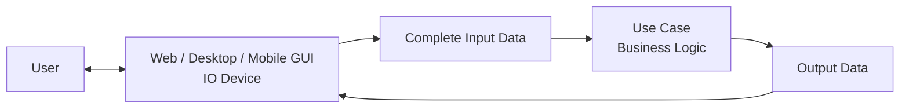
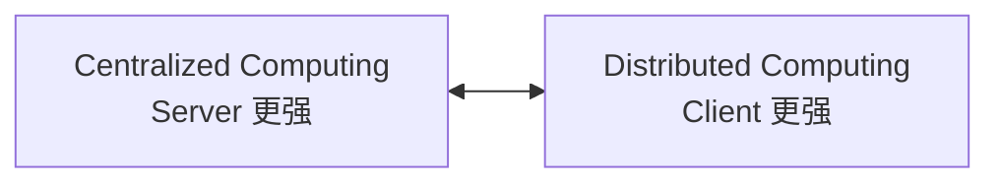
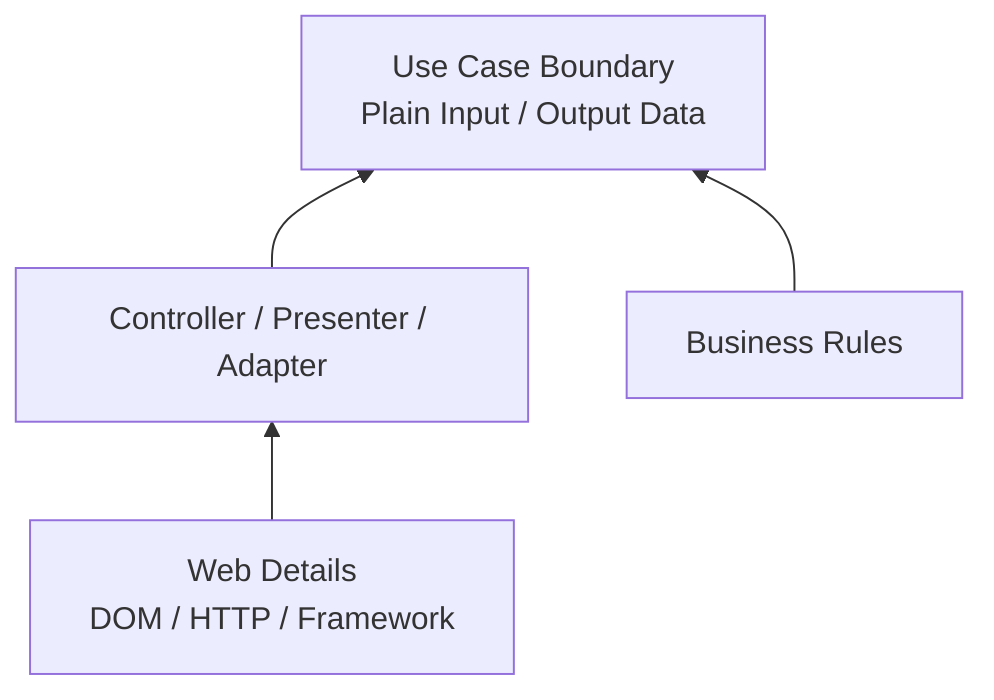
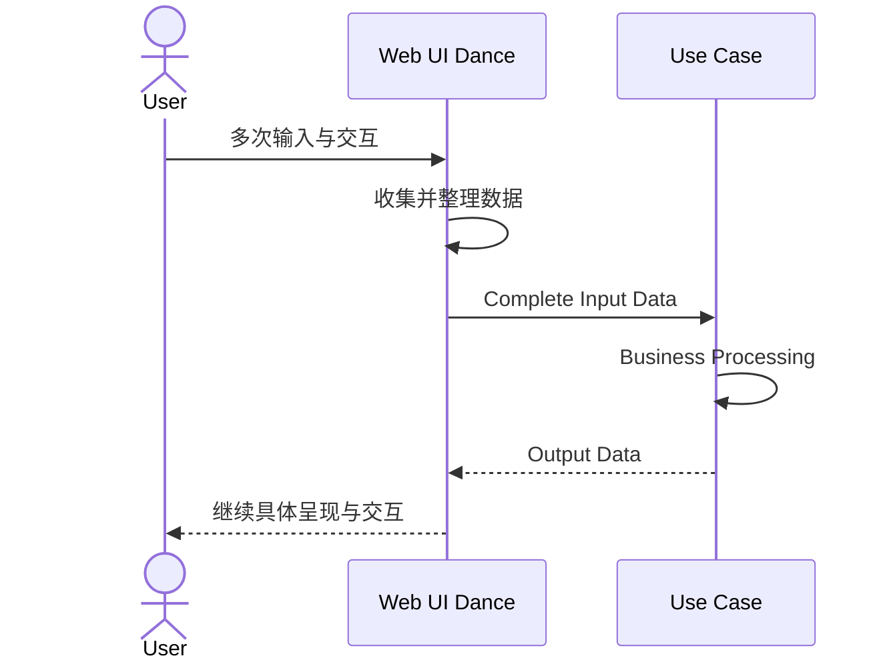
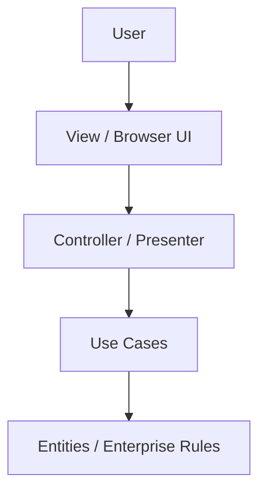
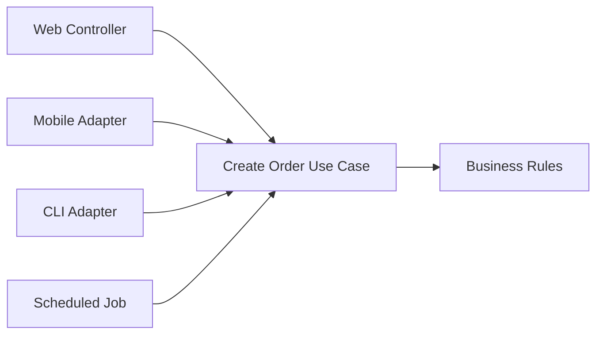
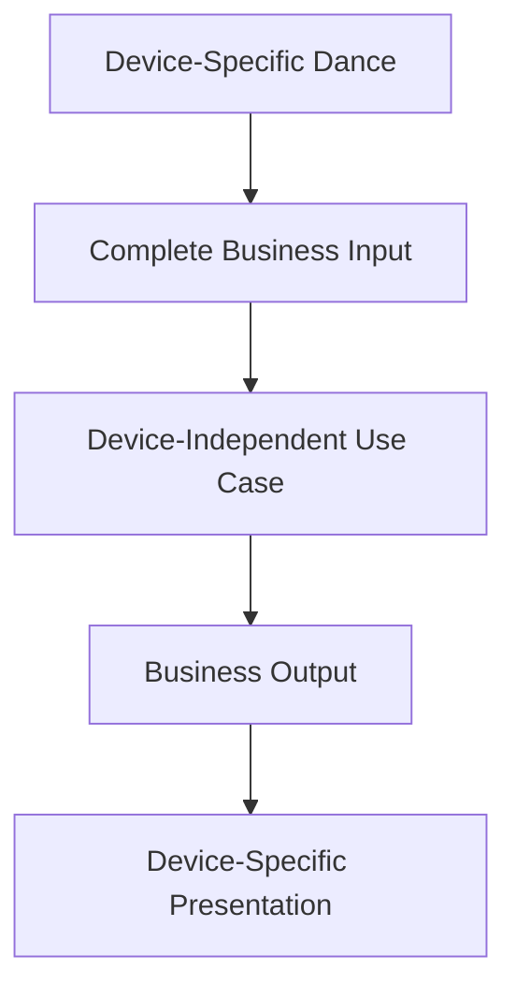
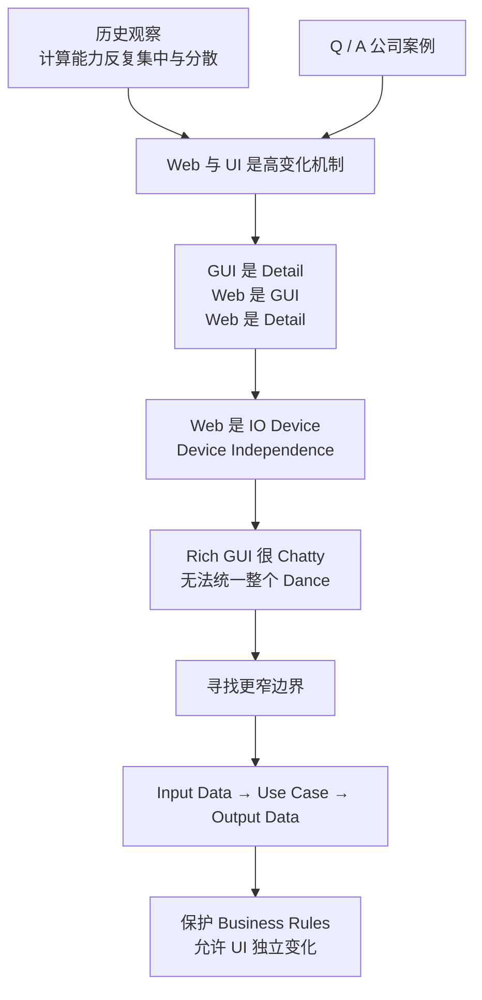

> 原书：Robert C. Martin, *Clean Architecture: A Craftsman's Guide to Software Structure and Design*
>
> 本章：Chapter 31, The Web Is a Detail
>
> 原文参考：Clean Architecture.md

## 本章导读


第 31 章继续讨论 Part VI：Details。

上一章说：

> **The database is a detail.**

本章进一步说：

> **The web is a detail.**

这句话并不是说 Web 技术简单、不重要，或者可以随便实现。作者真正讨论的是它在 Architecture 中的位置：

- Web 是一种 Delivery Mechanism；
- Web 页面是 GUI；
- GUI 是系统与用户交互的 IO Device；
- IO Device 会随技术、市场和审美快速变化；
- Business Rules 与 Use Cases 不应依赖某种具体 IO Device。

本章的完整推理链是：

1. 计算能力在 Server 与 Terminal 之间反复迁移；
2. Web 只是这场长期摆动中的一次；
3. UI 的形态还会继续变化；
4. Company Q 与 Company A 的案例说明，市场可以突然要求全面改变 Look and Feel；
5. 如果 Business Rules 与 UI 耦合，每次界面变化都会冲击核心；
6. GUI 是 Detail，Web 是 GUI，因此 Web 是 Detail；
7. Web 可被视为 IO Device，应延续 1960 年代以来的 Device Independence；
8. 不能也不必抽象 Browser 与 Application 之间所有细碎、Chatty 的交互；
9. 但可以抽象稳定的 Use Case Boundary；
10. UI 先收集完整 Input Data，再执行 Use Case；
11. Use Case 返回 Output Data，UI 再继续具体的交互过程；
12. 这种边界不容易一次设计正确，却是可能且经常必要的。



本章没有数学公式、数值计算或正式算法。作者使用的是：

- 技术史回顾；
- 摆锤隐喻；
- 两个匿名公司案例；
- IO Device 类比；
- 反方意见与有限让步；
- Input / Processing / Output 的边界分解。

因此，本笔记不会人为补造公式。重点放在论证过程、边界方法、现代 Web 场景中的具体落地，以及这种方法的适用范围与局限。

## 1. 开场：Web 真的改变了一切吗

### 1.1 1990 年代开发者的共同记忆

Web 兴起时，软件行业普遍觉得：

- 一切都变了；
- 旧式 Client–Server Architecture 过时了；
- Browser 会成为全新的应用平台；
- 所有系统都应重新围绕 Web 设计。

### 1.2 人们如何看待旧架构

面对闪亮的新技术，许多开发者开始轻视原来的 Client–Server System。

这是一种常见的技术周期：

1. 新技术出现；
2. 行业把它描述为根本断裂；
3. 旧知识被迅速贬低；
4. 架构围绕新平台重写；
5. 数年后又发现许多旧原则仍然适用。

### 1.3 作者的反直觉回答

作者说：

> **Actually the web didn't change anything. Or, at least, it shouldn't have.**

更准确地说：

- Web 改变了 Delivery Technology；
- Web 改变了 Deployment、Reach 与 Interaction；
- Web 不应改变 Business Rules 的本质；
- Web 不应支配整个系统的依赖结构。

### 1.4 “没有改变任何东西”不是事实否认

Web 显然带来了重大变化：

- 全球分发；
- 超链接；
- Browser Runtime；
- HTTP；
- Stateless Request；
- JavaScript；
- Search Engine；
- Online Commerce；
- Cloud Delivery。

作者使用夸张表达，是为了挑战“新 Delivery Mechanism 必须成为架构中心”的假设。

### 1.5 变化的层级不同

可以区分三层：

- **Business Purpose**：系统为什么存在；
- **Application Policy**：用户通过哪些 Use Case 达成目的；
- **Delivery Mechanism**：用户通过 Web、Desktop、Mobile 或其他设备触发 Use Case。

Web 主要改变第三层，也可能影响第二层的交互组织，但不应任意侵入第一层。

### 1.6 本章要解决的问题

> 当 UI 技术不断变化时，怎样让核心业务仍然稳定？

### 1.7 问题为什么困难

因为 Web UI 同时承担：

- 输入收集；
- 状态展示；
- 导航；
- 即时验证；
- 网络通信；
- 异步更新；
- 错误反馈；
- 用户体验。

它看起来与应用行为紧密交织，很容易让开发者相信二者无法分开。

## 2. Web 时代的第一次摆动

### 2.1 长期摆动的两个端点

软件行业长期在两种部署方向间摆动：

- 把 Computing Power 集中在 Central Server；
- 把 Computing Power 分散到 Terminal / Client。



### 2.2 最初的 Web 想象

Web 刚流行时，行业设想：

- 所有计算都在 Server Farm；
- Browser 很“笨”；
- Browser 只负责显示；
- Server 生成动态内容。

### 2.3 Applet 把计算移回 Browser

随后开发者开始在 Browser 中运行 Applet。

动机包括：

- 更丰富的交互；
- 减少页面刷新；
- 使用 Client CPU；
- 模拟 Desktop Application。

### 2.4 又把动态内容移回 Server

Applet 带来：

- 安全问题；
- 插件问题；
- 兼容问题；
- 部署问题；
- 用户体验问题。

于是 Dynamic Content 又回到 Server。

### 2.5 Web 2.0 再把计算推向 Browser

Ajax 与 JavaScript 让 Browser 能够：

- 异步请求；
- 局部更新页面；
- 保存更多 Client State；
- 构建复杂交互。

### 2.6 巨型 Browser Application

行业进一步在 Browser 中构建完整应用：

- 大量 Client-Side State；
- Routing；
- Validation；
- Rendering；
- Data Transformation；
- Offline Behavior。

### 2.7 Node 又把 JavaScript 拉回 Server

作者写作时，Node 让行业兴奋于：

- Server-Side JavaScript；
- 同一种语言运行在两端；
- 把部分 JavaScript Processing 移回 Server。

### 2.8 作者的一声叹息

原书在这段历史后只写：

> **(Sigh.)**

它表达的不是反对某种技术，而是对行业反复把摆动当作革命的无奈。

### 2.9 技术名词变化，问题没有消失

今天仍能看到类似选择：

- Server-Side Rendering 与 Client-Side Rendering；
- Single-Page Application 与 Multi-Page Application；
- Thin Client 与 Rich Client；
- Edge Computing 与 Central Cloud；
- Server Components 与 Client Components；
- Local-First 与 Cloud-Centric。

### 2.10 摆动的真正驱动力

每次迁移都可能由不同约束驱动：

- Network Latency；
- Device Capability；
- Deployment Cost；
- Security；
- Offline Need；
- Developer Productivity；
- Bandwidth；
- SEO；
- Energy Consumption；
- Vendor Platform。

### 2.11 作者不是说选择无所谓

计算放在哪里会影响：

- Performance；
- Availability；
- Privacy；
- Cost；
- User Experience。

作者的结论是：这些选择不应重写稳定的 Business Rules。

## 3. The Endless Pendulum

### 3.1 摆动并非始于 Web

原书把历史继续向前追溯。

### 3.2 Web 之前是 Client–Server

Client 负责部分展示与处理，Server 提供共享数据和服务。

### 3.3 Client–Server 之前是 Minicomputer

Central Minicomputer 连接一排 Dumb Terminal。

Terminal 主要负责输入和显示，计算集中在中央机器。

### 3.4 再之前是 Mainframe

Mainframe 配合 Smart Green-Screen Terminal。

作者认为这些 Green-Screen Terminal 在某些方面很像现代 Browser：

- 受中央系统控制；
- 负责交互与显示；
- 通过协议连接后端；
- 本地能力有限但并非完全没有能力。

### 3.5 更早是 Computer Room 与 Punch Card

用户提交 Punched Card，等待中央计算机批处理。

计算能力高度集中，用户交互极弱。

### 3.6 历史顺序

```mermaid
flowchart LR
    CARD["Computer Rooms<br/>Punched Cards"] --> MAINFRAME["Mainframes<br/>Smart Green Screens"]
    MAINFRAME --> MINI["Central Minicomputers<br/>Dumb Terminals"]
    MINI --> CS[Client–Server]
    CS --> WEB1["Early Web<br/>Thin Browser"]
    WEB1 --> APPLET[Browser Applets]
    APPLET --> SERVER[Server Dynamic Content]
    SERVER --> WEB2["Web 2.0<br/>Ajax + JavaScript"]
    WEB2 --> NODE["Node<br/>JavaScript on Server"]
```



### 3.7 行业始终没有最终答案

作者说，我们似乎始终无法决定 Computing Power 应放在哪里。

### 3.8 这不是能力不足

不存在对所有系统都正确的唯一位置。

因为约束不断变化：

- Hardware；
- Network；
- Security；
- Cost；
- User Device；
- Product Experience。

### 3.9 摆动还会继续

作者预计这种 Oscillation 会持续很久。

后来的技术发展也支持这一判断：

- Cloud 集中计算；
- Mobile App 强化 Client；
- Edge 把计算向用户移动；
- Server-Driven UI 再次集中控制；
- Local AI 又把推理放回 Device。

### 3.10 架构师需要不同时间尺度

技术团队可能关心：

- 当前 Framework；
- 当前 Rendering Mode；
- 当前 Browser API。

Architect 必须关心：

- 五年后仍存在的 Use Case；
- 业务规则怎样避免随摆动重写；
- 哪些依赖应该指向内层；
- 哪些变化应被 Boundary 吸收。

### 3.11 短期选择要被推离核心

原书的关键动作是：

> 把这些短期摆动从 Business Rules 的 Central Core 推开。

### 3.12 “推开”不是忽略

它表示：

- 把具体 UI 放在外层；
- 通过稳定边界调用 Use Case；
- UI 可以变化；
- Core 不 Import UI Framework；
- UI 变化不应迫使 Business Policy 改写。

## 4. Company Q：个人财务软件案例

### 4.1 Company Q 的产品

Company Q 开发一款很受欢迎的 Personal Finance System。

### 4.2 原产品形态

它是一款 Desktop Application，拥有非常实用的 GUI。

作者本人喜欢使用它。

### 4.3 Web 到来后的改版

在下一次发布中，Company Q 把 GUI 改得：

- 看起来像 Browser；
- 操作起来像 Browser。

### 4.4 作者为什么震惊

产品仍运行在 Desktop 上，却强行模拟 Web Browser 的 Look and Feel。

作者质疑：

> 哪位 Marketing Genius 认为桌面个人财务软件必须长得像 Browser？

### 4.5 这不是功能需求

案例没有说核心财务规则变化：

- 账户余额没有改变；
- 交易分类没有改变；
- 预算规则没有改变；
- 财务计算没有改变。

变化主要来自呈现风格与交互潮流。

### 4.6 用户并不喜欢

作者讨厌新界面，其他用户显然也有类似反应。

### 4.7 后续回摆

经过几个版本，Company Q 逐步移除 Browser-Like Feel，重新变回普通 Desktop GUI。

### 4.8 同一产品经历两次 UI 改造

1. Desktop GUI 变成 Browser-Like GUI；
2. Browser-Like GUI 又变回 Desktop GUI。

### 4.9 如果业务与 UI 耦合

每次改造都可能触及：

- Domain Object；
- Business Rule；
- Persistence；
- Transaction；
- Report Logic；
- Test。

### 4.10 如果边界清楚

主要变化应集中在：

- View；
- Presenter；
- Controller；
- Navigation；
- Interaction State；
- Styling。

### 4.11 作者向架构师提出的问题

假设你是 Company Q 的 Software Architect，Management 被说服要全面 Web 化 UI，你该怎么办？

### 4.12 更重要的问题发生在改版之前

原书进一步问：

> 在 Marketing 提出这种要求之前，你本应做什么来保护 Application？

答案不是临时增加 Wrapper，而是从一开始隔离 Business Rules 与 UI。

### 4.13 为什么要提前建立边界

重大 UI 改版到来后再分离，成本通常更高：

- 耦合已经扩散；
- 测试依赖 GUI；
- 数据模型已按页面塑形；
- Workflow 与 Widget 混合；
- Deadline 又很紧。

### 4.14 作者没有掌握 Q 的内部事实

他明确说自己不知道 Company Q 的 Architects 是否已经做了隔离。

这是一个观察到外部产品变化后的架构推演，不是对内部实现的事实断言。

### 4.15 案例的直觉结论

> **你无法控制下一次 UI 潮流，但可以控制它能触及系统多深。**

## 5. Company A：Smartphone OS 案例

### 5.1 Company A 的产品

Company A 制造一款优秀的 Smartphone。

### 5.2 Operating System 升级

它发布了新版 Mobile Operating System。

作者顺带感叹：我们现在可以自然地谈论“电话里的操作系统”。

### 5.3 升级改变了所有 App 的 Look and Feel

这次系统升级不只改变底层能力，还全面改变应用的视觉与交互风格。

### 5.4 作者推测原因

他用同样幽默的表达归因于某位 Marketing Genius。

重点不是确认组织内部决策，而是说明 UI 变化可能从 Platform 层突然下达。

### 5.5 作者再次承认信息边界

他不是该设备内部软件的专家，不知道此次变化是否给 App Programmer 带来重大困难。

### 5.6 他真正关心的事

希望：

- Company A 的 Architects；
- 各个 App 的 Architects；

都将 UI 与 Business Rules 隔离。

### 5.7 Platform-Level UI Change 为什么危险

它可能同时影响：

- Navigation Pattern；
- Widget Behavior；
- Layout；
- Gesture；
- Accessibility API；
- Lifecycle；
- Design Language。

### 5.8 如果业务规则依赖 Widget

例如 Eligibility Rule 直接读取 Checkbox 或 Text Field：

- Widget 更换就会触发业务修改；
- Headless Test 难写；
- Web / Mobile 无法复用；
- Platform Upgrade 风险放大。

### 5.9 Company Q 与 A 的关系

- Q 展示 Product Team 主动追逐 Web 风格；
- A 展示 Platform Upgrade 推动全生态改变；
- 两者都说明 UI 是高变化率组件；
- 高变化率组件不应支配低变化率 Business Rules。

### 5.10 “Marketing Genius”怎样理解

这是作者带有讽刺色彩的叙述。

现实中 UI 改版也可能来自：

- User Research；
- Accessibility；
- Competitive Pressure；
- Brand Strategy；
- Platform Consistency；
- Security；
- New Device Form Factor。

本章结论不依赖对 Marketing 的负面判断。

## 6. 两个案例揭示的架构问题

### 6.1 UI 的变化率通常很高

UI 受以下因素影响：

- Trend；
- Brand；
- Device；
- Framework；
- Browser；
- Operating System；
- User Feedback。

### 6.2 Business Rule 的变化率通常较低

例如个人财务软件中的：

- 交易入账；
- 余额计算；
- 预算限制；
- 税务分类；
- 对账规则。

这些变化通常由业务政策驱动，而不是颜色和 Widget 风格驱动。

### 6.3 变化率差异意味着需要 Boundary

Clean Architecture 的一般原则是：

- 把变化原因不同的元素分开；
- 让依赖指向更稳定、更高层的 Policy；
- 不让高层 Core 依赖快速变化的 UI。

### 6.4 UI 不应塑造 Domain Object

如果 Domain Object 只是 Screen Field 的镜像：

- 页面重排会改变 Core；
- 多种 UI 很难共存；
- 业务约束散落在 Event Handler；
- Domain Language 被 Widget Language 替代。

### 6.5 Event Handler 不应成为 Use Case

`onClick`、`onChange`、`onSubmit` 是 Delivery Event。

它们可以触发 Use Case，却不应承载全部业务流程。

### 6.6 UI State 与 Business State 不同

**UI State：**

- 当前 Tab；
- Focus；
- Hover；
- 展开状态；
- 未提交输入；
- Loading Spinner。

**Business State：**

- Order 已批准；
- Payment 已结算；
- Account 已冻结；
- Loan 已拒绝。

### 6.7 两类状态可以相关，但不等同

UI 会展示 Business State，也会暂存尚未形成业务事实的交互状态。

### 6.8 目标不是让 UI 不变化

目标是：

- UI 可以快速变化；
- Business Rules 也可以按业务需要变化；
- 两种变化不必互相扩散。

## 7. The Upshot：核心结论

### 7.1 原书的三段论

作者给出极简推理：

1. **The GUI is a detail.**
2. **The web is a GUI.**
3. **So the web is a detail.**

### 7.2 第一前提：GUI 是 Detail

GUI 是用户触发和观察系统行为的具体方式。

它不是 Business Rule 本身。

### 7.3 第二前提：Web 是 GUI

从应用架构角度看，Web 提供：

- Input Controls；
- Output Presentation；
- Navigation；
- Interaction；
- User Feedback。

这些正是 GUI 的职责。

### 7.4 结论：Web 是 Detail

HTML、CSS、DOM、Browser Event、HTTP Framework 等应位于架构外层。

### 7.5 “Web 是 Detail”不表示 HTTP 永远无关

某些系统的 Product Contract 就是 HTTP API。

但即便如此，也可以区分：

- 业务语义；
- Application Use Case；
- HTTP Status、Header、Cookie 与 Serialization。

### 7.6 Detail 应被放在哪里

放在 Boundary 后面，让它与 Core Business Logic 分离。



### 7.7 Dependency Direction

- Web Adapter 依赖 Use Case Port；
- Use Case 不依赖 Web Adapter；
- Core 不 Import Web Framework；
- Composition Root 在外层连接二者。

### 7.8 Detail 仍可复杂

现代 Web UI 可以包含：

- Routing；
- State Management；
- Accessibility；
- Animation；
- Offline Sync；
- Streaming；
- Optimistic Update。

复杂不等于高层 Policy。

### 7.9 Detail 仍值得专业设计

“Detail”不是“随便写”。

Web Layer 仍需：

- Correctness；
- Security；
- Performance；
- Accessibility；
- Usability；
- Maintainability。

### 7.10 判断标准

问：

> 如果把 Browser 换成 Desktop、CLI、Mobile 或 Test Harness，这条业务规则是否仍成立？

若答案是“是”，它不应依赖 Web Type。

## 8. Web 是 IO Device

### 8.1 作者的另一个观察角度

> **The WEB is an IO device.**

### 8.2 Input 侧

Web 接收：

- Click；
- Text Input；
- Selection；
- Upload；
- Gesture；
- Request Parameter；
- Form Submission。

### 8.3 Output 侧

Web 呈现：

- Text；
- Table；
- Chart；
- Error；
- Confirmation；
- Progress；
- Download；
- Notification。

### 8.4 IO Device 类比的价值

把 Web 看作 IO Device，会把问题从：

> 怎样让整个系统成为 Web Application？

改写为：

> 怎样让 Web Adapter 驱动已有 Use Cases，并呈现结果？

### 8.5 1960 年代的 Device Independence

作者指出，软件行业在 1960 年代已经认识到 Device-Independent Application 的价值。

### 8.6 为什么需要 Device Independence

输入输出设备会改变：

- Card Reader；
- Printer；
- Terminal；
- File；
- Network；
- GUI；
- Browser。

如果 Application Policy 直接依赖设备细节，每次硬件或交互更新都要改核心。

### 8.7 Web 不是例外

它更丰富、更流行，并不推翻 Device Independence 的动机。

### 8.8 Device Independence 不等于忽视设备能力

不同设备有真实差异：

- Screen Size；
- Pointer / Touch；
- Keyboard；
- Network Availability；
- Camera；
- Location；
- Accessibility。

Adapter 可以利用这些能力，而 Core 不必依赖具体 API。

### 8.9 IO Boundary 的双向职责

**输入方向：**

- 解释 Device Event；
- 收集数据；
- 转成 Use Case Request。

**输出方向：**

- 接收 Use Case Result；
- 转成 View Model；
- 呈现为具体 Device Experience。

### 8.10 Web Server 也是 Delivery Device 的一部分

Web Controller、Route、Middleware、Serializer 处理协议和交付，不应成为业务规则容器。

### 8.11 Browser 不是可信业务执行环境

Client-Side Validation 可以改善体验，但 Server / Trusted Core 仍需执行关键规则。

这也支持把 Business Rules 放在独立 Use Case 中。

## 9. 反方意见：Web GUI 太独特，无法设备无关

### 9.1 最强反对理由

Web GUI 非常丰富且独特，追求 Device-Independent Architecture 似乎不切实际。

### 9.2 JavaScript Validation

即时校验与：

- Focus；
- Keystroke；
- Field State；
- Error Placement；
- Browser Event Timing；

紧密相关。

### 9.3 Drag-and-Drop AJAX Call

拖放操作可能同时涉及：

- Pointer Event；
- Coordinate；
- Animation；
- Optimistic UI；
- Async Request；
- Rollback；
- Accessibility Alternative。

### 9.4 Widgets 与 Gadgets

页面可以包含大量平台特有的 Widget，它们很难被一个通用设备接口完整描述。

### 9.5 UI 与 Application 的交互很 Chatty

一次业务动作前后，可能发生大量细粒度事件：

- 输入一个字符；
- 触发校验；
- 更新建议列表；
- 移动 Focus；
- 发起预取；
- 取消旧请求；
- 更新局部状态。

### 9.6 Browser Dance 与 Desktop Dance 不同

Web Application 受：

- Network Round Trip；
- Browser Sandbox；
- HTTP；
- DOM；
- Page Lifecycle；

影响。

Desktop GUI 则有不同 Event Loop、Widget Toolkit 与 Process Model。

### 9.7 作者的让步

原书明确承认：

> **To some extent, this is true.**

### 9.8 不应抽象所有 Dance

试图像 UNIX 抽象设备一样，把 Browser 与 Desktop 的整个交互过程统一成一种接口，可能不可行，也没有价值。

### 9.9 为什么全量抽象会失败

它容易产生：

- Lowest Common Denominator；
- 巨型通用 UI Interface；
- 大量条件分支；
- 平台能力被削弱；
- 抽象比具体 UI 更难维护。

### 9.10 关键转折

“无法抽象全部交互”并不推出“无法建立任何边界”。

作者转而寻找另一条更稳定的 Boundary。

## 10. 可以抽象的边界：Use Cases

### 10.1 Business Logic 可以看成 Use Case Suite

每个 Use Case 代表系统代表用户完成的一项功能。

例如：

- 转账；
- 创建订单；
- 批准贷款；
- 生成报表；
- 修改预算。

### 10.2 每个 Use Case 的三个组成部分

原书用三个方面描述 Use Case：

- Input Data；
- Processing；
- Output Data。

### 10.3 Input Data 是什么

执行业务动作所需的完整、与设备无关的数据。

例如转账：

- Source Account ID；
- Destination Account ID；
- Amount；
- Actor Identity；
- Request Time 或 Idempotency Key，若业务需要。

### 10.4 Processing 是什么

Use Case 执行的 Application Policy：

- 验证权限；
- 检查账户状态；
- 检查余额；
- 执行转账；
- 记录结果。

### 10.5 Output Data 是什么

执行后供调用方理解结果的数据：

- Success / Failure；
- Transfer ID；
- New Balance；
- Business Error；
- Confirmation Data。

### 10.6 什么不应进入 Input Data

- DOM Event；
- HTTP Request Object；
- Framework Context；
- Button；
- Text Field；
- Browser Session Type；
- CSS Class。

### 10.7 什么不应进入 Output Data

- HTML Element；
- Framework Response；
- DOM Node；
- Widget；
- Template Engine Object。

### 10.8 Boundary 的稳定性来自业务语义

“把 100 元从账户 A 转到账户 B”比：

- 点击蓝色按钮；
- 提交 `/transfer` Form；
- 触发某个 Component Event；

更稳定。

### 10.9 UI Adapter 的工作

UI Adapter 把具体交互翻译成 Use Case Language。

### 10.10 Use Case 的工作

Use Case 不关心用户通过：

- Web Form；
- Mobile Screen；
- Desktop Dialog；
- CLI；
- Automated Job；

发起请求。

### 10.11 Presenter 的工作

Presenter 把 Use Case Result 转成适合 UI 的 View Model。

### 10.12 简化伪代码

以下不是原书代码，而是对边界的最小表达：

```text
record TransferRequest(sourceAccountId, destinationAccountId, amount)
record TransferResult(transferId, status, updatedBalance, businessError)

interface TransferFundsUseCase
    execute(request: TransferRequest) -> TransferResult

WebController.onSubmit(form)
    request = mapFormToTransferRequest(form)
    result = transferFunds.execute(request)
    viewModel = mapTransferResultToViewModel(result)
    render(viewModel)
```

### 10.13 伪代码与原理的对应

- `form` 属于 Web Detail；
- `mapFormToTransferRequest` 是 Input Adapter；
- `TransferRequest` 是完整 Input Data；
- `execute` 是 Use Case Boundary；
- `TransferResult` 是 Output Data；
- `mapTransferResultToViewModel` 是 Output Adapter；
- `render` 再次回到 Web Detail。

### 10.14 Dependency Direction

`TransferFundsUseCase` 由 Application/Core 定义。

`WebController` 依赖这个接口，而接口不依赖 Controller。

## 11. 完整输入出现的时刻

### 11.1 UI Dance 可以继续复杂

用户完成 Use Case 输入前，UI 可以经历很多步骤：

- 打开页面；
- 搜索账户；
- 选择收款人；
- 输入金额；
- 查看手续费；
- 二次确认。

### 11.2 不必让 Core 接收每个 Keystroke

每个字符、Hover 和 Focus Change 通常属于 UI Interaction。

### 11.3 关键判断

原书说，在 UI 与 Application 的 Dance 中，总有某个时刻可以认为 Input Data 已经完整。

### 11.4 完整不等于完全有效

UI 可以确认字段已收集齐，但关键业务有效性仍由 Use Case 判断。

例如：

- 金额格式正确，不代表余额足够；
- 收款人已选择，不代表账户仍可用；
- 日期已填写，不代表符合结算规则。

### 11.5 输入完成后执行 Use Case



### 11.6 Use Case 完成后返回结果

Output Data 进入 UI Dance，随后 UI 决定：

- 显示成功页；
- 标注业务错误；
- 更新局部内容；
- 导航；
- 发出通知。

### 11.7 Input / Output Data 应是 Data Structure

原书强调可以把完整输入和结果放进 Data Structure，作为执行 Use Case 的输入值与输出值。

### 11.8 为什么使用显式 Data Structure

- Boundary 可见；
- 数据契约明确；
- 与 Framework 解耦；
- 容易测试；
- 容易版本化；
- 防止 UI Object 渗入 Core。

### 11.9 Request Model 不一定等于 Domain Entity

输入是一次 Use Case 所需的数据，不必强迫它与某个 Entity 完全一致。

### 11.10 Result Model 不一定等于 Domain Entity

输出应符合调用者需要，同时避免暴露整个内部对象图。

### 11.11 Use Case 以 Device-Independent 方式操作 UI

这不是说 Use Case 直接控制 Widget。

而是说：

- UI 用输入数据“告诉”Use Case 用户要做什么；
- Use Case 用输出数据“告诉”UI发生了什么；
- 二者不共享具体设备对象。

### 11.12 Boundary 抽象的粒度

抽象的是业务动作的完整请求与结果，不是每一个 Pixel、Event 和 Animation。

### 11.13 为什么这个粒度有效

它恰好对应变化原因：

- UI Dance 因设备和体验变化；
- Use Case 因业务政策变化；
- Input / Output Contract 连接二者。

## 12. Conclusion：原书结论

### 12.1 这种抽象并不容易

作者没有把分层描述成机械工作。

难点包括：

- 何时输入才算完整；
- 哪些 Validation 属于 UI；
- 哪些错误属于 Business；
- Request / Result 需要哪些字段；
- Use Case 粒度多大；
- 怎样避免 Chatty Boundary。

### 12.2 往往需要多次迭代

原书说，需要若干 Iteration 才可能把 Boundary 做对。

### 12.3 为什么不能一次设计完美

团队需要通过真实 Use Case 学习：

- 用户实际怎样交互；
- 哪些数据组合稳定；
- 哪些规则属于 Core；
- 哪些变化频繁发生；
- 性能和错误反馈怎样影响契约。

### 12.4 迭代不等于放弃边界

错误做法是因为第一次不完美，就让 Web Object 进入 Core。

更好的方式是逐步改进：

1. 识别一个 Use Case；
2. 定义最小 Input / Output Data；
3. 隔离 Framework Type；
4. 通过测试和 UI 改动观察；
5. 调整 Boundary。

### 12.5 这种抽象是可能的

原书明确给出肯定判断：

> **But it is possible.**

### 12.6 为什么经常必要

因为下一次 UI、Platform 或 Marketing 变化无法预测。

### 12.7 原书的幽默收束

世界上充满等待下一次机会的 Marketing Geniuses，因此保护核心并不难找到理由。

### 12.8 去掉讽刺后的普遍结论

无论变化来自 Marketing、User、Platform 还是 Regulation：

> **高变化率的 Delivery Mechanism 应与低变化率的 Business Policy 分离。**

## 13. 概念之间的关系

### 13.1 GUI、Web 与 IO Device

- Web 是一种 GUI；
- GUI 是一种 IO Device；
- IO Device 是 Delivery Mechanism；
- Delivery Mechanism 位于架构外层。

### 13.2 Use Case 与 Business Rule

Use Case 协调 Business Rule，为用户完成一个目标。

### 13.3 Controller 与 Use Case

Controller：

- 接收协议或 UI Event；
- 整理 Input Data；
- 调用 Use Case。

Use Case：

- 执行业务处理；
- 返回 Output Data。

### 13.4 Presenter 与 View

Presenter 将 Output Data 转换为 View 需要的形式。

View 负责具体呈现。

### 13.5 Request Model 与 HTTP Request

Request Model 表达业务动作输入。

HTTP Request 表达 Web 协议输入。

二者需要 Mapping，不应等同。

### 13.6 Response Model 与 HTTP Response

Response Model 表达 Use Case 结果。

HTTP Response 决定：

- Status Code；
- Header；
- Cookie；
- Serialization；
- Cache Control。

### 13.7 UI Validation 与 Business Validation

**UI Validation：**

- 必填提示；
- 格式提示；
- 即时反馈；
- 输入控件限制。

**Business Validation：**

- 权限；
- 额度；
- 状态；
- 不变量；
- Eligibility。

### 13.8 两种 Validation 可以重复

UI 可以提前检查以改善体验，但可信 Business Rule 必须在 Core 再执行。

### 13.9 View Model 与 Domain Model

View Model 为呈现优化：

- 已格式化文本；
- 显示状态；
- Label；
- Action Availability。

Domain Model 为业务规则优化。

### 13.10 Chatty UI 与 Coarse Use Case

UI 内部可以 Chatty，Use Case Boundary 通常应以完整业务动作相对粗粒度地调用。

### 13.11 Device Independence 与 Portability

Device Independence 保护业务政策。

它不承诺一套 UI Code 无修改运行在所有设备。

### 13.12 Clean Architecture 中的位置



## 14. 在现代 Web 应用中落地

### 14.1 Web Framework 留在外层

例如 Router、Component、Server Action、Middleware 不应成为 Domain Model 的基础类型。

### 14.2 Controller 只做转换与调度

典型职责：

1. 解析 HTTP / UI Input；
2. 认证上下文转换；
3. 构造 Use Case Request；
4. 调用 Input Port；
5. 把结果交给 Presenter；
6. 构造 HTTP / UI Response。

### 14.3 不把 Framework Request 传入 Use Case

否则 Use Case 会依赖：

- Header API；
- Cookie API；
- Route Parameter；
- Framework Lifecycle；
- Test Harness。

### 14.4 身份信息怎样传入

Adapter 从 Authentication Mechanism 取得 Principal，再映射成 Use Case 需要的 Actor Identity 或 Permission Context。

### 14.5 不把 HTTP Status 当 Business Result

例如“余额不足”首先是 Business Failure。

Presenter / Controller 再决定映射为：

- 某个 HTTP Status；
- 页面错误；
- Mobile Dialog；
- CLI Message。

### 14.6 Form 与 Request Model 分离

Form 可以有：

- String；
- 空字段；
- 未完成输入；
- UI-Only Option。

Request Model 应表达 Use Case 可理解的完整输入。

### 14.7 Presenter 不应执行核心业务

Presenter 可以决定：

- 文本；
- 格式；
- 颜色状态；
- 可见性；
- Locale。

但不应决定贷款是否批准或订单是否有效。

### 14.8 Single-Page Application

SPA 可以在 Client 有复杂状态，但 Use Case Boundary 仍可存在：

- Client-Side Use Case；
- Server-Side Use Case；
- Shared Application Contract；
- Remote Input Port。

### 14.9 Server-Side Rendering

SSR 改变 Rendering Placement，不必改变 Business Use Case。

### 14.10 Server Components

Server / Client Component 边界是 Rendering Architecture 的选择，不等同于 Domain / Use Case Boundary。

### 14.11 Mobile 与 Web 共用 Use Case

同一业务动作可以由不同 Adapter 调用：



### 14.12 WebSocket 与 Streaming

持续连接更 Chatty，但仍可把有业务意义的 Message 映射为：

- Command；
- Query；
- Domain Event；
- Use Case Result。

### 14.13 Optimistic UI

UI 可以提前显示结果以改善体验，但最终 Business Outcome 来自可信 Use Case。

失败时 UI 负责 Rollback 或 Reconciliation。

### 14.14 Offline-First

离线应用可能在本地执行部分 Use Case，再与 Server 同步。

这会增加：

- Conflict；
- Version；
- Reconciliation；
- Trust Boundary。

但仍应区分业务政策与 Browser Storage / Sync API。

### 14.15 Accessibility

Accessibility 是 Delivery Quality 的重要要求。

将 Web 视为 Detail 绝不表示可以忽视：

- Keyboard Navigation；
- Screen Reader；
- Contrast；
- Focus Order；
- Semantic Markup。

### 14.16 Security

Web Adapter 处理：

- CSRF；
- CORS；
- Cookie；
- Header；
- Input Parsing；
- Output Encoding。

Core 处理：

- Authorization Policy；
- Business Permission；
- Sensitive Operation Rule。

### 14.17 Observability

Web Layer 可以记录：

- Route；
- Status；
- Latency；
- Request ID。

Use Case 可以记录：

- Business Outcome；
- Decision Reason；
- Domain Event。

### 14.18 Testing Strategy

- Core Test：直接调用 Use Case；
- Adapter Test：验证 Mapping；
- Contract Test：验证 Input / Output；
- End-to-End Test：验证完整 Web Dance。

不应只通过 Browser E2E Test 验证所有 Business Rules。

## 15. 三个具体应用示例

### 15.1 示例一：转账

Web UI 收集：

- 付款账户；
- 收款账户；
- 金额；
- 确认操作。

### 15.2 转账中的 UI 规则

- 金额输入框只允许合理字符；
- 未填写字段时显示提示；
- 提交时禁用按钮；
- 请求期间显示 Loading。

### 15.3 转账中的 Business Rule

- 用户有操作权限；
- 付款账户未冻结；
- 收款账户有效；
- 余额足够；
- 金额符合限额；
- 转账保持账务一致性。

### 15.4 替换 Delivery Mechanism

同一 Transfer Use Case 可以由：

- Web Form；
- Mobile App；
- Bank Teller Desktop；
- Scheduled Transfer Job；
- Public API；

调用。

### 15.5 示例二：拖放任务卡片

用户把 Kanban Card 从“待办”拖到“完成”。

### 15.6 拖放 Dance 属于 UI

- Pointer Down；
- Drag Preview；
- Collision Detection；
- Drop Animation；
- Optimistic Movement。

### 15.7 完整业务输入

当用户 Drop 后，可以形成：

- Task ID；
- Target Status；
- Actor ID；
- Expected Version。

### 15.8 Use Case 处理

- 检查 Transition 是否允许；
- 检查权限；
- 检查 Version；
- 更新 Task；
- 返回新状态或 Conflict。

### 15.9 为什么不抽象 Drag

Mobile 可能用 Swipe，CLI 可能用 Command，Automation 可能直接发 Message。

需要抽象的是 `ChangeTaskStatus`，不是 Drag Event。

### 15.10 示例三：个人财务软件换皮

假设 Company Q 的核心 Use Cases 包括：

- Import Transaction；
- Categorize Transaction；
- Reconcile Account；
- Calculate Budget；
- Generate Cash-Flow Report。

### 15.11 Browser-Like 改版改变什么

- Navigation；
- Toolbar；
- Link Style；
- Page Layout；
- Interaction Pattern。

### 15.12 不应改变什么

- 对账规则；
- 预算算法；
- 交易分类政策；
- 账户不变量。

### 15.13 边界带来的结果

若 Input / Output Port 清楚：

- 两次 UI 改造主要发生在外层；
- Core Test 保持稳定；
- 新旧 GUI 可短期并存；
- 回退风险更可控。

### 15.14 示例共同结构



## 16. 作者如何分析问题

### 16.1 从流行叙事入手

作者先引用“Web 改变了一切”的行业共识。

### 16.2 用反命题打破默认假设

“Web 什么也没改变”迫使读者区分：

- 技术形态变化；
- 架构原则变化。

### 16.3 拉长历史时间尺度

他不只比较 Web 与 Client–Server，而是追溯：

- Punch Card；
- Mainframe；
- Minicomputer；
- Client–Server；
- Web。

### 16.4 识别重复模式

重复模式是 Computing Power 在 Central 与 Terminal 间摆动。

### 16.5 从模式推导架构风险

既然摆动会继续，就不能让当前落点成为 Business Core 的固定前提。

### 16.6 用 Company Q 提供产品案例

同一产品追随 Web 风格，又逐步撤回，显示 UI Trend 的短期性。

### 16.7 用 Company A 扩展到平台案例

UI 改变不只来自产品团队，也可能来自 Operating System 与生态平台。

### 16.8 提炼三段论

- GUI 是 Detail；
- Web 是 GUI；
- Web 是 Detail。

### 16.9 用 IO Device 连接旧原则

Web 不是需要全新原则的例外，而是 Device Independence 的新对象。

### 16.10 主动提出最强反驳

Rich GUI 的交互非常 Chatty，全部设备无关似乎不现实。

### 16.11 对反驳作有限让步

作者承认无法合理抽象整个 GUI Dance。

### 16.12 缩小问题寻找可行边界

他不再试图统一所有 Widget，而是寻找每个 Use Case 的稳定输入与输出。

### 16.13 用 Input–Processing–Output 分解

这三个元素把业务动作从具体交互中抽出来。

### 16.14 选择完整输入时刻

UI 可以保持平台特有，只需在数据完整时越过 Boundary。

### 16.15 诚实说明设计成本

这种抽象困难，需要 Iteration，而不是一张图就自动完成。

### 16.16 最终方法的一般性

面对新技术时：

1. 拉长时间尺度；
2. 找出反复变化的机制；
3. 找出稳定的业务政策；
4. 承认无法抽象的具体差异；
5. 寻找更窄、更稳定的 Boundary；
6. 让 Dependency 指向 Policy；
7. 通过迭代校正契约。

## 17. 方法为什么有效

### 17.1 按变化原因分离

UI 因 Device / Experience 变化，Use Case 因 Business Policy 变化。

分开后，修改更集中。

### 17.2 缩小依赖传播

Browser API 变化只影响 Adapter，不直接传播到 Entity 与 Use Case。

### 17.3 提高 Testability

Use Case 接收 Plain Data，可以不启动 Browser、Server 或 Framework 直接测试。

### 17.4 支持多个 Delivery Mechanism

Web、Mobile、CLI 与 Job 可以共享 Business Policy。

### 17.5 允许 UI 独立创新

隔离不是限制 UI，而是让 UI 在不破坏 Core 的前提下快速变化。

### 17.6 明确 Trust Boundary

Browser Input 不可信；Adapter 负责解析，Core 负责权威业务验证。

### 17.7 明确错误语义

Business Error 先按领域定义，再由不同 Presenter 转换成不同呈现。

### 17.8 减少 Framework Lock-In

Core 不依赖 Framework Type，升级或替换 Web Stack 时风险较小。

### 17.9 改善并行协作

UI Team 与 Domain Team 可以围绕 Input / Output Contract 协作。

### 17.10 让迁移可以渐进进行

新旧 UI 可同时调用同一 Use Case，支持逐步替换而非 Big Bang Rewrite。

### 17.11 前提条件

这种方法有效，需要：

- Use Case 能被清楚识别；
- Boundary 不泄漏 Framework Type；
- Business Rule 真正位于内层；
- Mapping 责任明确；
- Contract 粒度合理；
- 团队愿意维护分层。

### 17.12 失败征兆

- Controller 包含大量 Business Rule；
- Use Case 接收 HTTP Request；
- Domain Entity 继承 UI Framework Class；
- Result 返回 HTML；
- Core Test 必须启动 Browser；
- 每次 UI 改版都修改大量 Domain Code。

## 18. 适用范围、局限与常见误区

### 18.1 适合高价值、长生命周期业务系统

当系统：

- 业务规则复杂；
- UI 会多次变化；
- 有多个 Client；
- 需要高测试性；
- 生命周期长；

这种边界收益明显。

### 18.2 简单短命页面可能不需要完整分层

一次性 Campaign Page 或极简单 Form 可以选择更轻量结构。

应根据风险与寿命决定，而不是机械增加层数。

### 18.3 UI 本身可能就是产品核心

例如：

- Graphic Editor；
- Game；
- Collaborative Canvas；
- Design Tool；
- Accessibility Technology。

其 Interaction Model 可能具有高层产品意义。

### 18.4 UI 是核心时仍可隔离平台 API

即使 Interaction Policy 很重要，也可把：

- DOM；
- Browser Event；
- Rendering Engine；

与平台无关的 Interaction Model 分开。

### 18.5 Web Protocol 可能是公开产品契约

Public HTTP API 的兼容性很重要，不能随意当作无成本细节。

但公开协议稳定，不等于 Business Core 必须依赖 Framework Object。

### 18.6 性能可能影响边界

高频交互若每次都跨网络调用 Use Case，会造成 Latency。

可使用：

- Client-Side State；
- Batch；
- Local Validation；
- Optimistic Update；
- Coarse-Grained Command。

### 18.7 边界可能过于 Chatty

如果每个 Keystroke 都成为远程 Use Case，说明抽象粒度可能错误。

### 18.8 边界也可能过于粗大

一个包含几十种可选行为的万能 Request 会模糊业务意图。

### 18.9 Mapping 有成本

需要额外：

- Request / Response Model；
- Mapper；
- Contract Test；
- Error Translation。

只有在变化风险值得时才应承担对应复杂度。

### 18.10 完全设备无关并非目标

本章明确承认整个 GUI Dance 很难统一。

目标是保护 Use Case，而不是构建万能 UI Framework。

### 18.11 常见误区一：Web 是 Detail，所以前端不重要

错误。Detail 表示架构位置，不表示用户价值低。

用户可能只通过 UI 感知产品。

### 18.12 常见误区二：UI 只应该“很薄”

不一定。UI 可以有复杂的 Interaction Logic，只要 Business Policy 不被混入。

### 18.13 常见误区三：所有 JavaScript 都是 Detail

不准确。JavaScript 只是语言；用它实现的 Business Rule 仍可能属于 Core。

关键是责任与依赖，不是语言。

### 18.14 常见误区四：Server Code 天然是业务核心

错误。Server 上的 Route、Controller、ORM 与 Framework 仍可能是外层 Detail。

### 18.15 常见误区五：Client Code 天然只是展示

错误。Client 可能包含真正 Application Policy，也可能需要独立分层。

### 18.16 常见误区六：Device Independence 意味着一套 UI 到处运行

错误。它强调 Use Case 不依赖设备，不要求共享全部 View Code。

### 18.17 常见误区七：Input Data 就是 HTTP JSON

错误。JSON 是传输表示；Input Model 是业务动作契约。

### 18.18 常见误区八：Output Data 就是 HTML

错误。HTML 是 Web Presenter 的产物，不应成为 Use Case Result。

### 18.19 常见误区九：Client Validation 足以保护规则

错误。Client 可被绕过，关键 Business Rule 必须由可信边界执行。

### 18.20 常见误区十：所有输入都必须一次提交

错误。UI 可以多步收集，关键是执行某个 Use Case 时有完整 Input Data。

### 18.21 常见误区十一：Marketing 需求都是错误需求

错误。作者使用讽刺语气，但 Brand、User Research 与 Market Fit 都可能是真实约束。

### 18.22 常见误区十二：只要有 Interface 就实现了 Clean Architecture

错误。若 Interface 暴露 DOM、HTTP、Framework Context，依赖仍然泄漏。

### 18.23 常见误区十三：每个 Button 对应一个 Use Case

错误。Use Case 表达用户业务目标，不由 Widget 数量决定。

### 18.24 常见误区十四：一个页面只能有一个 Use Case

错误。页面可以组合多个 Query 与 Command。

### 18.25 常见误区十五：边界设计必须第一次正确

错误。原书明确说需要 Iteration。

### 18.26 常见误区十六：Web 变化不会影响任何内层设计

过于绝对。新的产品能力可能引入新 Use Case；边界保护的是无关变化，不是否认真正业务变化。

## 19. 实践检查、知识结构与核心总结

### 19.1 Architecture Boundary 检查

- Core 是否 Import Web Framework？
- Use Case 是否接收 HTTP Request / DOM Event？
- Output 是否返回 HTML / Widget？
- Web Controller 是否只负责 Mapping 与调用？
- Presenter 是否把 Business Result 转为 View Model？
- Dependency 是否指向 Use Case Port？

### 19.2 Input Data 检查

- 是否表达明确业务动作？
- 输入何时算完整？
- 是否混入未提交 UI State？
- 是否混入 Cookie、Header 或 Route Object？
- 字段是否都是 Use Case 真正需要的？

### 19.3 Output Data 检查

- 是否表达 Business Outcome？
- 是否泄漏 Domain Object Graph？
- 是否泄漏 Framework Response？
- 不同 UI 能否各自呈现？
- Error 是否按业务语义表达？

### 19.4 Validation 检查

- 格式提示是否在 UI？
- 关键不变量是否在可信 Core？
- Client Validation 被绕过时系统仍安全吗？
- Authorization 是 Business Policy 还是仅 Route Guard？
- 失败语义能否跨 Delivery Mechanism 复用？

### 19.5 Change Scenario 检查

尝试回答：

- Web 换 Mobile，要改哪些模块？
- CSR 换 SSR，要改 Use Case 吗？
- Web Framework 升级会触及 Entity 吗？
- 新增 CLI 能否直接调用同一 Use Case？
- Look and Feel 全面变化时 Core Test 是否稳定？

### 19.6 Testing 检查

- Business Rule 能否无 Browser 测试？
- Use Case 能否使用 Plain Data 调用？
- Mapper 是否有边界测试？
- E2E Test 是否只覆盖关键整合，而非承担全部业务验证？
- 多个 Adapter 是否满足同一 Contract？

### 19.7 场景判断一：Controller 直接计算贷款资格

**判断：** Business Rule 落入 Web Detail，应移到 Use Case / Domain。

### 19.8 场景判断二：Use Case 接收 Framework Request

**判断：** Web Type 穿透 Boundary，应先映射为 Plain Input Data。

### 19.9 场景判断三：Drag Preview 留在 Component

**判断：** 合理，它属于 Device-Specific Dance。

### 19.10 场景判断四：Drop 后调用 `ChangeTaskStatus`

**判断：** 合理，完整业务意图在这一时刻形成。

### 19.11 场景判断五：Mobile 与 Web 使用不同 View Model

**判断：** 合理。它们可共享 Use Case Result，由不同 Presenter 转换。

### 19.12 场景判断六：Client 与 Server 都检查金额上限

**判断：** Client 检查改善体验，Server / Core 检查提供权威保证；适度重复合理。

### 19.13 场景判断七：Web-Based Graphic Editor 的 Interaction 是核心竞争力

**判断：** 不能简单把全部 Interaction 当低价值细节；应保留高层 Interaction Policy，同时隔离 DOM 与 Browser API。

### 19.14 场景判断八：一次性静态宣传页建立五层 Use Case

**判断：** 可能过度设计，边界成本超过变化风险。

### 19.15 快速复述练习

能够回答以下问题，基本就掌握了本章：

1. 作者为什么说 Web 没有改变任何东西？
2. 这句话为什么不是否认 Web 的历史影响？
3. Computing Power 在哪两个方向之间摆动？
4. Web 时代经历了哪些 Server / Browser 迁移？
5. Applet、Dynamic Server、Web 2.0、Ajax、JavaScript 与 Node 在论证中扮演什么角色？
6. Web 之前有哪些类似摆动？
7. Green-Screen Terminal 为什么可类比 Browser？
8. Architect 为什么要采用更长时间尺度？
9. Company Q 原本是什么产品？
10. 它为什么改成 Browser-Like GUI？
11. 用户反应与后续回摆说明什么？
12. Q 案例最重要的问题为什么发生在改版之前？
13. Company A 的 OS Upgrade 改变了什么？
14. Q 与 A 案例分别代表哪两种 UI 变化来源？
15. UI 与 Business Rule 的变化率有什么差异？
16. 原书关于 Web 的三段论是什么？
17. “Detail”为什么不等于“不重要”？
18. 为什么 Web 可被视为 IO Device？
19. 1960 年代 Device Independence 与本章有什么关系？
20. Web 为什么不是 Device Independence 的例外？
21. Rich GUI 对 Device Independence 提出什么反驳？
22. JavaScript Validation 与 Drag-and-Drop AJAX 为什么难统一抽象？
23. 作者对反方意见让步了什么？
24. 为什么不应抽象完整 GUI Dance？
25. 作者最终选择了哪条 Boundary？
26. Use Case 的 Input、Processing、Output 分别是什么？
27. 什么时刻 Input Data 可以认为完整？
28. 完整为什么不等于业务有效？
29. 为什么 Request Model 不应是 HTTP Request？
30. 为什么 Result Model 不应是 HTML？
31. UI Adapter、Use Case 与 Presenter 分别负责什么？
32. Chatty UI 与相对粗粒度 Use Case 怎样共存？
33. 为什么 Boundary 需要迭代？
34. 这种方法成立需要哪些前提？
35. 现代 SPA、SSR 与 Server Components 是否改变核心结论？
36. WebSocket 与 Offline-First 怎样应用同一原则？
37. UI Validation 与 Business Validation 如何区分？
38. 为什么 Client Validation 不能替代可信规则？
39. UI 本身是产品核心时怎样处理？
40. Public HTTP API 是稳定契约时怎样理解“Web 是 Detail”？
41. 如何识别 Boundary 过于 Chatty？
42. 如何识别为简单页面过度设计？
43. Company Q 若有清晰 Use Case Boundary，两次改版会怎样变化？
44. “下一次 Marketing 变化”背后的普遍架构含义是什么？
45. 本章解决新技术问题的一般思路是什么？

### 19.16 一分钟记忆卡

- **历史：** Computing Power 长期在 Central Server 与 Terminal 之间摆动。
- **Web：** 只是这场 Endless Pendulum 中的一次，不应定义业务核心。
- **案例：** Company Q 改成 Browser 风格又改回；Company A 的 OS 改变所有 App Look and Feel。
- **风险：** UI 变化快，Business Rules 相对稳定，二者耦合会扩大修改。
- **结论：** GUI 是 Detail；Web 是 GUI；所以 Web 是 Detail。
- **类比：** Web 是 IO Device，应继续追求 Device Independence。
- **让步：** Browser 与 Desktop 的 Chatty Dance 不必强行统一。
- **边界：** 抽象完整 Input Data、Use Case Processing 与 Output Data。
- **输入：** UI 收集完成后，以 Plain Data 调用 Use Case。
- **输出：** Use Case 返回 Business Result，Presenter 再决定具体呈现。
- **方向：** Web Adapter 依赖 Use Case Port，Core 不依赖 Web Framework。
- **迭代：** 边界不容易一次做对，但可以通过真实场景持续校正。

### 19.17 本章知识结构



### 19.18 七十条核心结论

1. 第 31 章讨论 Web 在 Architecture 中的位置，而不是教授 Web Programming。
2. 作者以 1990 年代“Web 改变一切”的行业记忆开场。
3. 他的反命题是 Web 实际上没有改变任何东西，至少不应该改变核心架构原则。
4. 这不是否认 Web 的技术和社会影响，而是区分 Delivery Technology 与 Business Policy。
5. Web 是从 1960 年代开始的一系列 Computing Oscillation 中较新的一次。
6. 摆动的两个端点是 Central Server 与 Terminal / Client。
7. 早期 Web 假设 Server Farm 承担计算，Browser 保持简单。
8. Applet 随后把计算移到 Browser。
9. 行业又把 Dynamic Content 移回 Server。
10. Web 2.0、Ajax 与 JavaScript 再次把大量 Processing 移向 Browser。
11. 完整大型 Application 开始在 Browser 中运行。
12. Node 又让行业兴奋于把 JavaScript 放到 Server。
13. 作者的叹息针对把每次摆动都当作全新革命的行业习惯。
14. Web 之前已有 Client–Server Architecture。
15. 更早有 Central Minicomputer 与 Dumb Terminal。
16. 再早有 Mainframe 与 Smart Green-Screen Terminal。
17. Green-Screen Terminal 在中央控制、协议交互与本地能力方面类似现代 Browser。
18. 更早的 Computer Room 与 Punch Card 把计算高度集中。
19. 历史没有给出 Computing Power 永久正确的位置。
20. 位置选择仍影响 Latency、Cost、Security、Privacy 与 Experience，但它不是永恒业务政策。
21. Architect 应采用比当前 Framework 和 Rendering Trend 更长的时间尺度。
22. 短期技术摆动应被推离 Business Rules 的 Central Core。
23. Company Q 开发一款受欢迎的 Desktop Personal Finance System。
24. Web 流行后，Q 把 Desktop GUI 改得像 Browser。
25. 核心财务需求没有因此必然变化，主要变化是 Look and Feel。
26. 用户不喜欢新界面，几个版本后 Q 又逐步恢复普通 Desktop GUI。
27. Q 案例说明同一产品可能因潮流经历方向相反的 UI 改造。
28. 架构师应在改版要求出现前就隔离 Business Rules 与 GUI。
29. Company A 的 Smartphone OS Upgrade 改变了所有 App 的 Look and Feel。
30. A 案例说明 UI 变化也可能从 Platform 层突然传导到应用生态。
31. 作者不知道两家公司内部实现，因此案例是架构推演，不是源码事实断言。
32. Q 与 A 共同说明 UI 通常具有较高变化率。
33. Business Rules 通常由业务政策驱动，变化原因与 UI 不同。
34. 不同变化原因的代码应被 Boundary 分开。
35. 本章核心三段论是 GUI 是 Detail、Web 是 GUI、所以 Web 是 Detail。
36. Web 的 HTML、DOM、Browser Event、HTTP Framework 等具体性应位于外层。
37. Detail 描述依赖层级，不表示 Web 不重要、不复杂或可以低质量实现。
38. 用户体验、安全、性能与 Accessibility 仍必须专业实现。
39. Web 可以被视为接收输入、呈现输出的 IO Device。
40. 软件行业从 1960 年代就认识到 Device-Independent Application 的价值。
41. Web 更丰富、更流行，并不使它自动成为 Device Independence 的例外。
42. Device Independence 不表示忽视 Touch、Screen、Network 等真实设备能力。
43. Adapter 可以利用设备能力，Core 不必依赖具体 API。
44. Rich GUI 为设备无关提出了有力反驳。
45. JavaScript Validation、Drag-and-Drop AJAX 与复杂 Widget 形成平台特有的 Chatty Dance。
46. Browser Dance 与 Desktop Dance 的事件、网络和生命周期不同。
47. 作者承认把整个 Dance 统一抽象可能不现实。
48. 这一让步避免了建立最低公分母式万能 UI Interface。
49. 无法抽象全部交互，不等于无法建立稳定边界。
50. 可以把 Business Logic 看成代表用户完成工作的 Use Case Suite。
51. 每个 Use Case 可以用 Input Data、Processing 与 Output Data 描述。
52. UI 可在边界外经历任意复杂的输入、提示、动画和导航。
53. 在某个时刻，执行 Use Case 所需的 Input Data 会完整。
54. Input 完整不表示业务有效，权威 Business Validation 仍由 Use Case 执行。
55. 完整 Input Data 应放进 Plain Data Structure，而不是传入 DOM Event 或 HTTP Request。
56. Use Case 执行业务处理后返回 Output Data。
57. Output Data 应表达 Business Outcome，而不是 HTML、Widget 或 Framework Response。
58. Presenter 把 Output Data 转换成具体 View Model。
59. 通过这一方式，Use Case 能以 Device-Independent 方式操作 UI。
60. 抽象粒度是完整业务动作，而不是每个 Keystroke、Pixel 或 Animation。
61. Web Adapter 依赖 Use Case Port，Use Case 不依赖 Web Adapter。
62. UI Validation 可改善体验，关键 Business Rule 必须在可信 Core 重复执行。
63. SPA、SSR、Server Components 与 WebSocket 改变交付方式，不必改变核心 Use Case。
64. Web、Mobile、CLI 与 Scheduled Job 可以通过不同 Adapter 调用同一 Business Policy。
65. UI 本身是产品核心时，应保留高层 Interaction Policy，但仍可隔离 DOM 与平台 API。
66. Public HTTP API 可能是重要兼容契约，但 Framework Object 仍不必进入 Core。
67. Boundary 过细会造成 Chatty Call，过粗会形成含义模糊的万能请求。
68. Request / Result、Mapper 与 Contract Test 有真实成本，简单短命页面不必机械套用全部层次。
69. 作者明确承认这种抽象不容易，通常需要多次 Iteration 才能做好。
70. 本章解决问题的一般方法是拉长历史尺度、识别高频变化机制、保护稳定政策、承认无法统一的差异，再寻找更窄的 Input–Use Case–Output Boundary。

### 19.19 最终结论

本章最值得带走的不是“不要使用 Web Framework”，而是：

> **不要让今天的 Web Delivery Mechanism 决定长期的 Business Architecture。**

Browser 与 Application 之间的具体交互可以非常丰富、Chatty、平台相关，也没有必要全部抽象。真正需要保护的是每个 Use Case 的稳定边界：

- UI 收集完整 Input Data；
- Use Case 执行 Business Processing；
- Use Case 返回 Output Data；
- UI 再把结果变成具体体验。

因此：

> **The GUI is a detail. The web is a GUI. So the web is a detail.**
