> 原书：Robert C. Martin, *Clean Architecture: A Craftsman's Guide to Software Structure and Design*
>
> 本章：Chapter 32, Frameworks Are Details
>
> 原文参考：Clean Architecture.md

## 本章导读


第 32 章继续讨论 Part VI：Details。

前两章依次说明：

- Database 是 Detail；
- Web 是 Detail。

本章把同一个判断应用到 Framework：

> **Frameworks are details. Frameworks are not architectures.**

作者并不反对框架。开篇就承认，许多 Framework：

- 免费；
- 强大；
- 有用；
- 能解决大量共性问题。

他反对的是另一件事：

> **把应用的 Architecture 围绕 Framework 组织，让 Business Objects 继承 Framework Base Class、依赖 Framework Annotation，并把核心生命周期交给 Framework。**

本章使用“婚姻”隐喻描述这种关系：

- Application 对 Framework 作出巨大且长期的承诺；
- Framework Author 不对某个 Application 作出对等承诺；
- 一旦深度耦合，退出成本很高；
- 因而这是一场 Asymmetric Marriage。

作者的解决方案不是“不用框架”，而是：

- 不要立刻与 Framework 结婚；
- 把 Framework 保持在 Architecture 的 Outer Circle；
- 通过 Adapter、Proxy、Plugin 接入 Core；
- 让依赖遵循 Dependency Rule；
- 只让 Main / Composition Root 知道具体 Framework；
- 对无法避免的深度绑定作出有意识的长期决定。

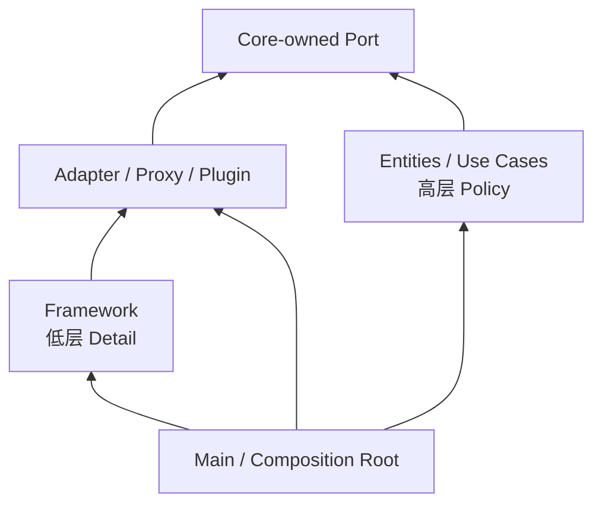

本章原文没有数学公式、数值计算或正式算法。其论证依靠：

1. Framework Author 与 Application Team 的信息边界；
2. 双方承诺不对称的激励分析；
3. 四类生命周期风险；
4. Dependency Rule；
5. Proxy / Plugin 的边界设计；
6. Spring Dependency Injection 案例；
7. STL 与 Java Standard Library 这种不可避免的例外；
8. “先约会、后结婚”的渐进决策隐喻。

因此，本笔记不会人为添加公式，而会详细解释这条因果链、实现方法、现代适用场景、边界成本、迁移策略与常见误区。

## 1. 开场：Framework 很有用，但不是 Architecture

### 1.1 Framework 已经非常流行

Framework 为开发者提供现成的：

- Lifecycle；
- Extension Point；
- Dependency Injection；
- Routing；
- Persistence；
- UI Rendering；
- Testing；
- Messaging；
- Security Integration。

### 1.2 流行通常有合理原因

Framework 能减少重复工作，让团队专注于产品差异。

### 1.3 作者先作正面评价

原书明确说，Framework 流行总体上是一件好事。

### 1.4 免费、强大、有用

大量 Framework 由社区免费提供，同时具备成熟能力。

### 1.5 核心转折

> **However, frameworks are not architectures—though some try to be.**

### 1.6 Framework 是什么

Framework 通常是一套：

- 控制应用部分生命周期的代码；
- 规定扩展点的抽象；
- 要求 Application Code 按某种结构接入的运行环境。

### 1.7 Architecture 是什么

Architecture 决定：

- 高层 Policy 与低层 Detail 的边界；
- Dependency Direction；
- 变化如何被隔离；
- 关键 Use Case 如何表达；
- 哪些决策被推迟；
- 系统如何支持开发、部署、运行与维护。

### 1.8 二者为什么容易混淆

Framework 往往提供：

- 推荐目录；
- Base Class；
- Annotation；
- Module System；
- Generator；
- “最佳实践”。

这些会形成强烈的系统外观，让人误以为目录结构就是 Architecture。

### 1.9 Framework Structure 不等于 Business Structure

按 Controller、Service、Repository 分目录，并不能自动表达：

- 系统有哪些 Use Case；
- 核心 Business Rule 是什么；
- 哪些 Policy 比 Framework 更稳定。

### 1.10 Framework 可以承载 Architecture

好的 Architecture 可以使用 Framework 实现 Delivery、Persistence 或 Composition。

但 Architecture 不应由 Framework 的类型系统和生命周期完全定义。

### 1.11 判断问题的关键

不是问：

> 这个项目用了什么 Framework？

而是问：

> 如果 Framework 改变，高层 Business Policy 会被迫改变多少？

### 1.12 本章要解决的问题

> 怎样利用 Framework 的价值，又不把 Application 的长期命运无条件交给它？

## 2. Framework Authors

### 2.1 作者首先讨论人，而不是技术

Framework 的风险不仅来自 API，还来自双方信息与激励结构。

### 2.2 多数 Framework Author 怀有善意

他们希望：

- 帮助 Community；
- 回馈行业；
- 分享解决方案；
- 减少重复劳动。

### 2.3 作者称这种动机值得赞扬

原书并未把 Framework Author 描绘为恶意 Vendor。

### 2.4 “不把你的最佳利益放在心上”是什么意思

原书说，Framework Author 并不把你的最佳利益放在心上。

这不是道德指控，而是信息事实：

- 他们不认识你；
- 不知道你的具体系统；
- 不知道你的约束；
- 不知道你的长期路线。

### 2.5 Framework Author 知道什么

他们最了解：

- 自己的问题；
- 同事的问题；
- 朋友的问题；
- 早期用户的问题；
- 目标市场中的典型问题。

### 2.6 Framework 解决谁的问题

它首先解决作者所观察到的问题，而不是你的全部问题。

### 2.7 这为什么不构成否定

你的问题很可能与那些问题有大量 Overlap。

### 2.8 Overlap 是 Framework 有用的基础

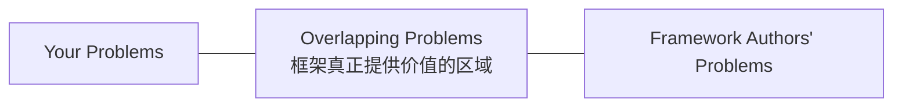

### 2.9 Overlap 越大，短期收益越高

例如通用 Web Framework 对以下问题覆盖良好：

- Request Parsing；
- Routing；
- Serialization；
- Middleware；
- Authentication Hook。

### 2.10 Non-Overlap 才是长期摩擦来源

你的特殊约束可能包括：

- 独特 Transaction Boundary；
- 严格 Latency；
- Legacy Integration；
- Regulatory Requirement；
- 特殊 Deployment；
- 长达十年的兼容需求。

### 2.11 Framework 不可能为每个项目优化

它必须选择：

- 默认值；
- Extension Point；
- Lifecycle；
- Trade-off；
- Backward Compatibility Policy。

这些选择未必适合你的系统。

### 2.12 Framework Documentation 的目标

文档通常教你如何最顺畅地进入 Framework 的模型。

它不负责替你保护完整 Application Architecture。

### 2.13 现代开源项目也不改变根本事实

即使可以：

- 提 Issue；
- 提 Pull Request；
- Fork；
- 参与 Governance；

也不意味着维护者承诺按你的产品路线演进。

### 2.14 Fork 不是免费控制权

Fork 会带来：

- Security Patch 合并；
- Upstream Sync；
- Release；
- Documentation；
- 长期维护。

### 2.15 正确心态

感谢 Framework Author 的贡献，同时保持自己的 Architecture Responsibility。

## 3. Asymmetric Marriage

### 3.1 关系为什么不对称

Application Team 必须对 Framework 作出很大承诺，Framework Author 却不对单个 Application 作出对应承诺。

### 3.2 Application 承诺了什么

采用 Framework 后，团队可能依赖：

- Base Class；
- Annotation；
- Callback；
- Lifecycle；
- Data Model；
- Serialization；
- Build Tool；
- Runtime；
- Deployment Model。

### 3.3 Framework Author 承诺了什么

通常只承诺项目自己的：

- Release Policy；
- Support Window；
- General Roadmap；
- License Terms。

不承诺你的产品永远可无痛升级。

### 3.4 文档怎样推动深度集成

开发者阅读 Framework Documentation，按照作者与社区建议接入系统。

### 3.5 常见建议一：Architecture 围绕 Framework 包裹

Framework 成为中心，Application Code 被放进它规定的插槽。

### 3.6 常见建议二：继承 Base Class

Framework 要求：

原书以复数形式概括这些 **Base Classes**：

- Controller 继承 Framework Controller；
- Entity 继承 Persistence Base；
- Test 继承 Framework Test Case；
- Domain Object 实现 Framework Interface。

### 3.7 常见建议三：在 Business Object 中 Import Framework

Framework Facility 直接进入：

- Entity；
- Use Case；
- Domain Service；
- Business Exception。

### 3.8 常见建议四：尽可能紧密耦合

对 Framework Author 而言，这通常能提供最完整体验与最少 Glue Code。

### 3.9 为什么作者自己不怕这种耦合

Framework Author 对自己的 Framework 拥有高度控制：

- 可以修改 API；
- 可以修复 Bug；
- 可以添加 Extension Point；
- 知道内部实现；
- 能协调 Release。

### 3.10 为什么你的风险不同

Application Team 没有同等控制权，却要承担升级和迁移成本。

### 3.11 Framework 为什么希望你深度耦合

深度采用会带来：

- 更完整的 Feature Use；
- 更强的 Ecosystem Stickiness；
- 更高的 Adoption；
- 更难的退出。

### 3.12 作者的心理描述

原书幽默地说，没有什么比大量用户不可分割地继承作者的 Base Class 更能让 Framework Author 感到被认可。

### 3.13 婚姻隐喻

Framework 邀请 Application 作出：

- 巨大；
- 长期；
- 难退出；

的承诺。

### 3.14 单向婚姻

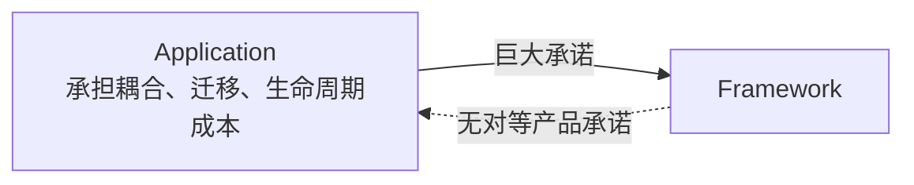

### 3.15 风险与负担由谁承担

主要由 Application Team 承担：

- Release Delay；
- Migration Work；
- Compatibility Bug；
- Rewrite Cost；
- Product Disruption。

### 3.16 这与商业采购也相似

无论 Open Source 还是 Commercial Framework，都要检查：

- 谁控制 Roadmap；
- 谁承担 Breaking Change；
- 谁负责长期支持；
- 退出需要修改多少 Core Code。

### 3.17 不对称不等于不能合作

它意味着风险需要由你的 Architecture 主动管理，不能假设对方会替你管理。

## 4. 深度耦合是怎样形成的

### 4.1 Inheritance Coupling

Business Object 继承 Framework Base Class 后：

- Core 的类型层次被 Framework 定义；
- 单元测试需要 Framework Runtime；
- 替换需要重写继承关系；
- Dependency 指向外层 Detail。

### 4.2 Annotation Coupling

Annotation 看起来只是几行 Metadata，但可能引入：

- Compile-Time Dependency；
- Runtime Scanning；
- Hidden Lifecycle；
- Proxy Requirement；
- Framework Semantics。

### 4.3 Callback Coupling

Framework 决定何时调用 Application：

- Hook Name；
- Thread；
- Transaction；
- Error Handling；
- Retry；
- Lifecycle Order。

### 4.4 Data Model Coupling

Business Object 被迫按 Framework 的 Persistence / UI / Serialization Model 塑形。

### 4.5 Exception Coupling

Core 抛出 Framework-Specific Exception 后，业务错误语义与外层机制绑定。

### 4.6 Global Context Coupling

Business Code 直接访问 Framework Container、Static Context 或 Service Locator。

### 4.7 Build Coupling

代码生成、Plugin、Compiler Enhancement 与 Packaging 可能使 Framework 深入 Build Pipeline。

### 4.8 Deployment Coupling

Application 可能只能部署在 Framework 指定的：

- Container；
- Cloud Runtime；
- Application Server；
- Function Platform。

### 4.9 Data Coupling

Framework 将数据写入专有：

- Schema；
- Serialized Form；
- Migration History；
- Metadata Store。

这类退出成本可能高于源码修改。

### 4.10 Test Coupling

若每个 Business Test 都必须启动 Framework Container：

- 反馈变慢；
- Failure Diagnosis 变难；
- Core 与 Integration Test 混淆。

### 4.11 Hidden Control Flow

Framework 通过 Reflection、Annotation、Convention 驱动控制流，依赖不再从普通调用关系中直接可见。

### 4.12 耦合并非只有 Import 数量

即使只有一个 Annotation，也可能接受整个 Framework Lifecycle Contract。

### 4.13 Inversion of Control 的双刃剑

Framework 调用 Application 能减少 Boilerplate，但如果 Core 必须服从 Framework Protocol，控制反转也可能带来架构依赖反转。

### 4.14 判断深度的三个问题

1. Core 能否在没有 Framework Runtime 时运行测试？
2. 替换 Framework 是否需要修改 Entity / Use Case？
3. Framework Type 是否跨过 Architecture Boundary？

## 5. The Risks

### 5.1 原书列出四项主要风险

作者没有说“框架可能有 Bug”这种普通风险，而是讨论生命周期和 Dependency 风险。

### 5.2 风险一：Framework Architecture 往往不够 Clean

Framework 以通用性、易接入和功能为目标，不一定遵循你的 Dependency Rule。

### 5.3 Framework 怎样违反 Dependency Rule

它要求高层 Business Object：

- 继承低层 Base Class；
- Import Framework Facility；
- 遵守低层 Lifecycle；
- 使用低层 Annotation。

### 5.4 最危险的位置是 Entity

原书特别强调 Framework 甚至想进入最内层的 Entities。

### 5.5 为什么进入 Inner Circle 后难以移除

Framework Concern 会扩散到：

- Constructor；
- Method Signature；
- Object Identity；
- Persistence State；
- Test；
- Error Handling。

### 5.6 作者再次使用婚戒隐喻

Framework 一旦进入核心，Wedding Ring 已经戴上，很难取下。

### 5.7 风险一的因果链

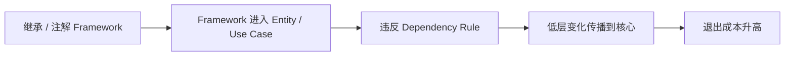

### 5.8 风险二：产品会超出 Framework 能力

Framework 可能非常适合 Early Features。

但随着产品成熟，Application may **outgrow** the Framework，也就是产品需求会超出框架原本覆盖的能力边界。

### 5.9 为什么早期匹配不保证长期匹配

产品成熟后会出现：

- 特殊 Workflow；
- 性能热点；
- 非标准 Transaction；
- 新 Deployment；
- Legacy Integration；
- 更严格的 Compliance。

### 5.10 Framework 开始“反抗”你

当需求超出 Happy Path，团队会不断：

- 绕过默认机制；
- 覆盖内部行为；
- 使用 Undocumented Hook；
- Patch Framework；
- 与 Lifecycle 冲突。

### 5.11 越深度耦合，摩擦越大

如果 Business Model 已围绕 Framework 设计，无法只替换局部 Adapter。

### 5.12 风险三：Framework 可能向无益方向演进

Framework Roadmap 服务整个 Community 或 Vendor Strategy，不服务某一个 Application。

原书的关键词是 **evolve**：Framework 会持续演进，但其演进方向未必对你的产品有帮助。

### 5.13 被迫升级

团队可能因：

- Security Patch；
- Runtime Support；
- Ecosystem Compatibility；
- End of Life；

升级到并不提供产品价值的新版本。

### 5.14 旧 Feature 可能消失或改变

依赖的能力可能：

- Deprecated；
- Removed；
- 改变 Semantics；
- 迁移到付费版本；
- 与新 Runtime 不兼容。

### 5.15 升级速度可能跟不上

Framework 的 Release Cadence 可能快于 Application 能消化的速度。

### 5.16 风险四：出现更好的新 Framework

技术生态会出现：

原书直接设想会有 **a new and better framework** 出现：

- 更合适的模型；
- 更强性能；
- 更好工具；
- 更活跃维护；
- 更低运维成本。

### 5.17 想切换却无法切换

深度绑定意味着新 Framework 的收益必须先覆盖巨大 Migration Cost。

### 5.18 四项风险的共同根因

不是 Framework 一定会变坏，而是：

> **Application 无法控制 Framework，却让 Framework 控制了 Core 的形状。**

### 5.19 现代补充风险：Maintenance 与 Security

Framework 可能：

- 停止维护；
- 出现 Supply-Chain Incident；
- 长期保留 Vulnerability；
- 依赖过时 Runtime。

### 5.20 现代补充风险：License 与商业模式

License、Pricing 或 Hosting Requirement 可能改变。

### 5.21 现代补充风险：Operational Lock-In

Framework 可能把：

- Metrics；
- Deployment；
- Scaling；
- Configuration；

绑定到特定 Platform。

### 5.22 现代补充风险不改变原书主线

这些新风险仍指向同一策略：把不可控 Detail 限制在 Boundary 外。

## 6. The Solution：不要与 Framework 结婚

### 6.1 原书的直接回答

> **Don't marry the framework!**

### 6.2 不是禁止使用

紧接着作者说：

> 可以使用 Framework，只是不要与它耦合。

### 6.3 Keep It at Arm's Length

与 Framework 保持一臂距离，意味着：

- Core 不依赖 Framework Type；
- Framework 通过 Adapter 接入；
- Framework Lifecycle 停在外层；
- Composition 集中在边缘。

### 6.4 把它视为 Detail

Framework 应属于 Architecture 的 Outer Circle。

### 6.5 不让它进入 Inner Circle

特别保护：

- Entity；
- Enterprise Business Rule；
- Use Case；
- Application Port。

### 6.6 让 Framework 依赖应用定义的接口

在源码依赖上，低层 Adapter 实现 Core-owned Port。

### 6.7 运行时控制与源码依赖要区分

运行时可能是 Framework 调用 Application，但源码仍可让 Adapter 依赖 Core Interface。

### 6.8 插件结构

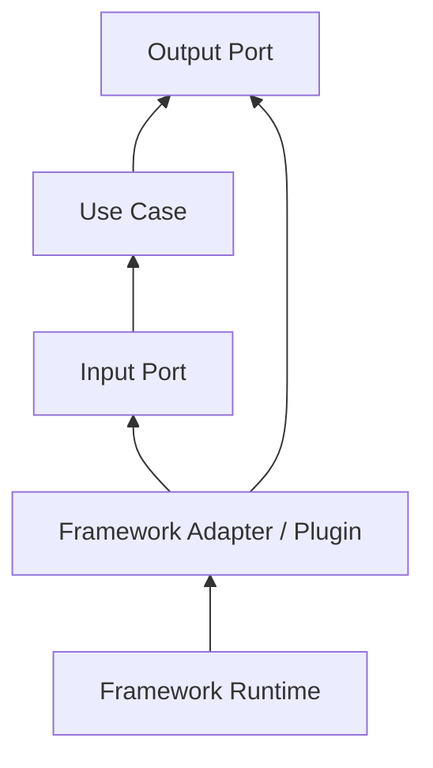

### 6.9 Framework 应可被替换到什么程度

目标不是保证零成本替换，而是：

- 变更集中；
- Core 保持稳定；
- 测试不依赖 Framework；
- 退出路径可识别。

### 6.10 不要追求虚假抽象

如果一种 Framework 能力直接定义产品核心，完全隐藏它可能不现实。

应诚实选择 Boundary，而不是声称任意替换。

### 6.11 边界的成本

需要额外：

- Interface；
- Adapter；
- Mapping；
- Composition；
- Contract Test。

### 6.12 为什么成本通常值得

当 Framework：

- 变化快；
- 侵入强；
- 产品寿命长；
- 核心规则复杂；
- 替换风险高；

边界能显著控制长期成本。

## 7. Base Class、Proxy 与 Plugin

### 7.1 Framework 要求 Entity 继承 Base Class 时怎么办

原书回答：

> **Say no! Derive proxies instead.**

### 7.2 Proxy 是什么

Proxy 是位于外层、满足 Framework Protocol，同时把工作委托给 Core Object 的对象。

### 7.3 Proxy 继承，Entity 不继承

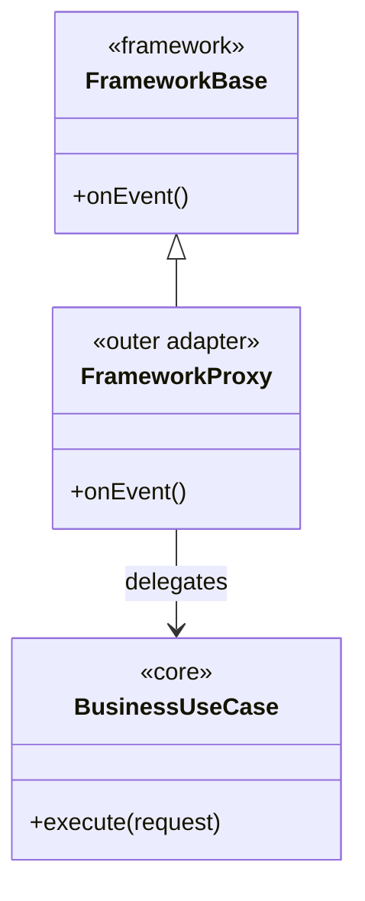

### 7.4 为什么 Proxy 有效

Framework 要求被限制在 Outer Component，Core 只看到自己的 Input Data 与 Port。

### 7.5 Proxy 应放在哪里

原书要求把 Proxy 放入作为 Business Rules Plugin 的 Component 中。

更直观地说：它是插到 Core 外围的低层 Adapter。

### 7.6 Plugin 关系的关键

不是 Core 插入 Framework，而是 Framework Adapter 插入 Core 定义的边界。

### 7.7 Input Adapter 示例

Web Framework Controller 可以继承 Framework Base Class，但它只：

- 解析 Request；
- 构造 Use Case Input；
- 调用 Input Port；
- 转换 Response。

### 7.8 Persistence Proxy 示例

ORM 要求的 Persistence Object 可以留在 Adapter，Mapper 再转换成 Domain Entity。

### 7.9 Messaging Proxy 示例

Message Framework Listener 接收 Framework Message，转换成 Command，再调用 Use Case。

### 7.10 UI Proxy 示例

UI Framework Component 处理 Lifecycle 和 Event，再委托给独立 Interaction / Use Case Logic。

### 7.11 简化伪代码

```text
class FrameworkListener extends FrameworkBaseListener
    coreUseCase

    onFrameworkMessage(frameworkMessage)
        request = mapToCoreRequest(frameworkMessage)
        result = coreUseCase.execute(request)
        acknowledge(mapToFrameworkResult(result))
```

### 7.12 伪代码对应关系

- `FrameworkBaseListener` 停留在外层；
- `FrameworkListener` 是 Proxy / Adapter；
- `frameworkMessage` 不进入 Core；
- `coreUseCase` 不认识 Framework；
- Mapping 形成 Boundary。

### 7.13 Wrapper 不一定足够

如果 Core 仍依赖：

- Framework Transaction；
- Lazy Proxy；
- Framework Identity；
- Framework Annotation；

外面再包一层 Interface 也没有真正隔离。

### 7.14 边界必须阻断语义泄漏

不仅要隔离 Type，还要隔离 Framework 特有的 Lifecycle 与 Assumption。

## 8. Dependency Rule 是解决方案的依据

### 8.1 Dependency Rule

源码依赖只能指向更内层、更高层的 Policy。

### 8.2 Framework 属于哪一层

Framework 通常处理：

- Delivery；
- Persistence；
- UI；
- Dependency Injection；
- Messaging；
- Runtime Integration。

因此通常属于外层 Detail。

### 8.3 错误方向

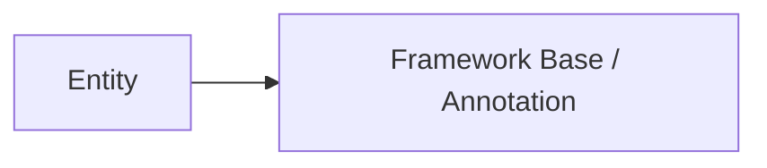

高层 Entity 依赖低层 Framework，违反 Dependency Rule。

### 8.4 正确方向

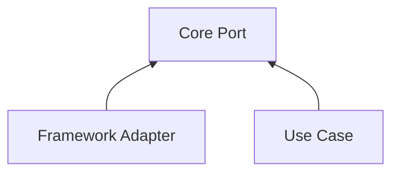

### 8.5 Interface 由谁定义

由需要该能力的高层 Policy 定义，而不是让 Framework API 直接成为 Core Port。

### 8.6 为什么 Interface Ownership 重要

若 Core Interface 只是 Framework Interface 的复制品，Framework Semantics 仍然控制 Core。

### 8.7 Data Structure 也要由 Core 需要塑形

Input / Output Model 应表达 Use Case，而不是 Framework Request / Entity / Message。

### 8.8 Control Flow 可以反向

Runtime 中 Framework 可能先获得控制，再调用 Adapter 和 Use Case。

源码 Dependency 仍然可以指向 Core。

### 8.9 Dependency Inversion 的作用

它让低层 Detail 遵守高层所需的契约，而非高层服从低层实现。

### 8.10 编译边界与部署边界

Framework Adapter 可以在独立 Component / Module 中，使替换和测试边界更清楚。

### 8.11 Architecture Test

可自动检查：

- Core 不 Import Framework Package；
- Entity 不继承 Framework Base；
- Use Case 不使用 Framework Annotation；
- Adapter 依赖 Core Port；
- Main 负责具体装配。

## 9. Spring 案例

### 9.1 原书选择 Spring

作者说，也许你喜欢 Spring；Spring 是一个好的 Dependency Injection Framework。

### 9.2 可以用 Spring Auto-Wire

作者并不反对使用 Framework 完成 Dependency Injection。

### 9.3 不应怎样使用

不要在所有 Business Object 中散布 `@Autowired` Annotation。

### 9.4 为什么 Annotation 散布有问题

Business Object 会：

- Compile-Time 依赖 Spring；
- 依赖 Container Construction；
- 隐藏 Constructor Dependency；
- 需要 Spring Test Context；
- 难以独立实例化。

### 9.5 原书的原则

> **Your business objects should not know about Spring.**

### 9.6 不理想的简化示意

```java
public class ApproveLoan {
    @Autowired
    private SpringApplicantRepository applicants;
}
```

### 9.7 问题不只是 Annotation

`SpringApplicantRepository` 这种具体类型也让 Use Case 依赖外层 Detail。

### 9.8 更合适的 Core

```java
public final class ApproveLoan {
    private final ApplicantGateway applicants;

    public ApproveLoan(ApplicantGateway applicants) {
        this.applicants = applicants;
    }
}
```

### 9.9 这段代码表达什么

- `ApproveLoan` 只依赖 Core-owned `ApplicantGateway`；
- Dependency 显式通过 Constructor 传入；
- 普通 Unit Test 可直接构造；
- Spring 不进入 Business Object。

### 9.10 Spring 放在哪里

在 Main / Composition Root 中：

- 创建 Framework Adapter；
- 创建 Use Case；
- 注入 Dependency；
- 启动 Application。

### 9.11 简化组装关系

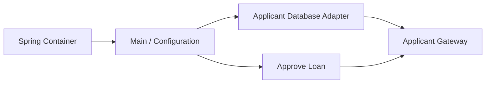

### 9.12 可选的配置方式

具体实现可以使用：

- Java Configuration；
- Framework Module；
- External Configuration；
- 手工 Composition。

关键不是语法，而是 Spring Knowledge 被限制在外层。

### 9.13 Constructor Injection 与 Framework Independence

Constructor Injection 本身是普通语言机制，不要求 Container。

Framework 可以调用它，但 Core 不知道调用者是谁。

### 9.14 Annotation 并非绝对禁止

如果 Annotation：

- 只存在于外层 Adapter；
- 不改变 Core Semantics；
- 替换成本可接受；

它通常没有问题。

### 9.15 问题在位置与传播

同一个 `@Autowired`：

- 放在 Main Configuration，影响局部；
- 放在 Entity，影响最内层。

### 9.16 现代 Spring 的细节边界

原书示例强调原则，不要求所有项目采用某一种具体 Spring 配置风格。

## 10. Main 是最脏、最低层的 Component

### 10.1 原书为何允许 Main 知道 Spring

Main 的职责就是处理具体性并组装系统。

原书称 Main 为 Architecture 中 **the dirtiest, lowest-level component**；这里的 `dirtiest` 指它知道最多低层具体细节。

### 10.2 Main 知道什么

- Framework；
- Driver；
- Database Adapter；
- Configuration；
- Environment；
- Concrete Implementation。

### 10.3 Core 不知道什么

- 谁创建它；
- 使用哪个 Container；
- 如何部署；
- 哪个 Framework 启动进程。

### 10.4 “最脏”不是质量差

它表示 Main 包含最多低层具体知识。

### 10.5 Main 是 Plugin Manager

它选择并连接：

- Input Adapter；
- Output Adapter；
- Use Case；
- Infrastructure；
- Framework Runtime。

### 10.6 Main 应保持简单

虽然知道很多 Concrete Type，但主要执行 Construction 与 Wiring，不应承载 Business Rule。

### 10.7 Composition Root 的价值

依赖关系集中后：

- Framework 使用位置清楚；
- 测试可替换 Adapter；
- Runtime Variant 可配置；
- Migration 范围可识别。

### 10.8 Main 可以依赖一切吗

在架构方向上，它可以知道所有需要组装的具体组件；但仍应避免无关复杂度和散落的业务逻辑。

### 10.9 不同 Entry Point 可以有不同 Main

例如：

- Web Main；
- CLI Main；
- Worker Main；
- Test Main。

它们组装相同 Core 与不同 Framework Adapter。

### 10.10 Framework Upgrade 的理想影响范围

主要集中在：

- Main；
- Framework Adapter；
- Integration Test；
- Deployment Configuration。

## 11. I Now Pronounce You：有时必须结婚

### 11.1 作者没有把原则绝对化

有些 Framework 或基础设施几乎无法避免深度依赖。

### 11.2 C++ 与 STL

如果使用 C++，通常很难避免依赖 Standard Template Library。

### 11.3 Java 与 Standard Library

如果使用 Java，几乎必然依赖 Java Standard Library。

### 11.4 Standard Library 严格说不总是 Framework

现代术语通常区分：

- Library；
- Framework；
- Runtime；
- Platform。

原书在这里使用更宽泛的“需要长期绑定的基础软件”含义。

### 11.5 Library 与 Framework 的经典区别

- 使用 Library 时，Application 主动调用它；
- 使用 Framework 时，Framework 常通过 Inversion of Control 调用 Application。

但真实产品中边界可能混合。

### 11.6 本章原则不依赖术语分类

核心问题仍然是：

- 承诺有多深；
- 生命周期有多长；
- 谁控制变化；
- 退出成本多高；
- Dependency 是否进入 Core。

### 11.7 不可避免是正常的

选择 Programming Language 本身就意味着接受：

- Type System；
- Runtime；
- Standard Library；
- Toolchain；
- ABI / Bytecode；
- Ecosystem。

### 11.8 正常不等于无须决策

原书强调：即使必须结婚，也应该把它当作 Decision。

### 11.9 生命周期承诺

深度绑定后，Framework 很可能伴随 Application 的整个 Life Cycle。

### 11.10 婚礼誓词的幽默

作者借用婚礼誓词：

- For better or for worse；
- In sickness and in health；
- For richer, for poorer；
- Forsaking all others。

### 11.11 直觉含义

不要把重大、长期、难逆的技术选择当作一条普通 Dependency 安装命令。

### 11.12 哪些“婚姻”可能合理

- Language Standard Library；
- Operating System Platform；
- 核心 Product Platform；
- 有明确长期支持的 Runtime；
- 其能力就是产品差异的一部分。

### 11.13 合理承诺的前提

- 收益明确；
- 风险可接受；
- 生命周期匹配；
- 团队能力匹配；
- 退出成本已知；
- Decision 被记录。

### 11.14 Architecture 不能消除所有承诺

它的目标是：

- 避免不必要承诺；
- 推迟尚未成熟的承诺；
- 局部化必须承诺的影响。

## 12. Conclusion：先约会，不要立刻结婚

### 12.1 面对 Framework 的默认姿态

不要一开始就与它结婚。

### 12.2 先 Date 一段时间

“约会”表示有限、可逆、局部使用 Framework。

### 12.3 Date 的实践方式

- Prototype；
- Spike；
- 单一 Adapter；
- 非核心 Feature；
- 独立 Module；
- Time-Boxed Evaluation。

### 12.4 观察什么

- API Stability；
- Upgrade Experience；
- Escape Hatch；
- Performance；
- Testability；
- Operational Behavior；
- Community Health。

### 12.5 在 Boundary 后保持尽可能久

即使 Framework 已投入生产，也尽量让它停留在 Architecture Boundary 外。

### 12.6 “Get the Milk without Buying the Cow”

作者最后问，是否能在不买下整头牛的情况下获得牛奶。

### 12.7 隐喻的技术含义

获得 Framework 的局部能力，而不接受它对整个 Application Structure 的控制。

### 12.8 例子

- 使用 DI Container 组装，不给 Entity 加 Annotation；
- 使用 Web Router，不把 HTTP Request 传入 Use Case；
- 使用 ORM Adapter，不让 Domain Entity 继承 ORM Base；
- 使用 Message Broker Client，不把 Broker Message 作为 Business Command。

### 12.9 什么时候从约会走向结婚

当团队确认：

- Framework 与核心需求长期一致；
- 深度能力带来的收益显著；
- 隔离成本高于绑定风险；
- 生命周期和支持策略匹配；
- 退出成本可以接受。

### 12.10 仍应保留哪些保护

即使决定深度绑定，也可以：

- 限制绑定模块；
- 建立 Contract Test；
- 记录 Decision；
- 监控 EOL；
- 保存 Data Export Path；
- 避免向更多 Core 扩散。

### 12.11 原书最终态度

不是恐惧 Framework，而是审慎管理 Commitment。

## 13. Framework、Library、Platform 与 Architecture

### 13.1 Framework

提供整体执行骨架和 Extension Point，常通过 IoC 调用 Application Code。

### 13.2 Library

提供可调用能力，控制流通常由 Application 主导。

### 13.3 Platform

提供 Runtime、Operating Environment、API 和 Deployment Model。

### 13.4 Tool

参与 Build、Test、Generation 或 Analysis，未必进入 Runtime Dependency。

### 13.5 Architecture

组织 Policy、Boundary 与 Dependency，使系统能承受变化。

### 13.6 分类为什么有帮助

不同类型带来的 Commitment 不同：

- Build Tool 可替换但影响 Pipeline；
- Library 可能泄漏 Type；
- Framework 可能控制 Lifecycle；
- Platform 可能控制部署与数据。

### 13.7 分类为什么不够

同一产品可能同时扮演多种角色。

### 13.8 不要陷入术语争论

应检查实际依赖：

- 是否进入 Core Signature；
- 是否控制 Object Creation；
- 是否决定 Data Format；
- 是否需要专用 Runtime；
- 是否可局部替换。

### 13.9 Framework-Friendly Architecture

Architecture 可以方便接入 Framework，但不把 Framework 当作高层 Policy。

### 13.10 Framework-Centric Architecture

Framework 的 Module、Entity、Lifecycle 和 Convention 定义整个系统形状。

### 13.11 两者差异

前者是 Application 拥有 Architecture；后者是 Framework 拥有 Application Shape。

### 13.12 Plugin Architecture 的关系

Plugin Architecture 让 Detail 依赖稳定 Core Contract，正是本章推荐的结构。

## 14. 作者如何分析问题

### 14.1 先承认 Framework 的价值

这避免把讨论变成简单的反框架立场。

### 14.2 区分 Framework 与 Architecture

强大工具不自动等于正确 Dependency Structure。

### 14.3 转向 Framework Author 的信息边界

作者说明维护者善意却不可能知道你的具体问题。

### 14.4 用 Problem Overlap 解释成功

Framework 有用，是因为用户问题与作者问题存在重叠。

### 14.5 再分析承诺结构

Application 深度耦合，Framework Author 却无对等承诺，形成 Asymmetry。

### 14.6 解释耦合怎样被文档推动

继承 Base Class、Import Facility 和围绕 Framework 包裹 Architecture 是常见集成路径。

### 14.7 解释作者为何不承担同样风险

Framework Author 控制 Framework，你不控制。

### 14.8 用婚姻隐喻强化长期性

问题不只是当前 API 调用，而是整个 Application Life Cycle 的 Commitment。

### 14.9 列举四项具体风险

- 违反 Dependency Rule；
- 产品超出 Framework；
- Framework 向无益方向演进；
- 更好 Framework 出现却无法切换。

### 14.10 找到共同根因

不可控的低层 Detail 被允许进入最稳定、最关键的 Inner Circle。

### 14.11 给出直接原则

使用但不要耦合，把 Framework 保持在 Outer Circle。

### 14.12 给出结构性手段

- Proxy；
- Plugin；
- Dependency Rule；
- Main / Composition Root。

### 14.13 用 Spring 提供具体落点

Spring 可以 Auto-Wire，但 `@Autowired` 不应散布到 Business Objects。

### 14.14 主动承认例外

STL、Java Standard Library 等依赖可能无法避免。

### 14.15 把绝对禁令改成显式决策

必须结婚时也应理解生命周期后果，不能无意识进入。

### 14.16 用“约会”提出渐进策略

在承诺前局部使用、观察、保留 Boundary 和退出路径。

### 14.17 一般问题解决模式

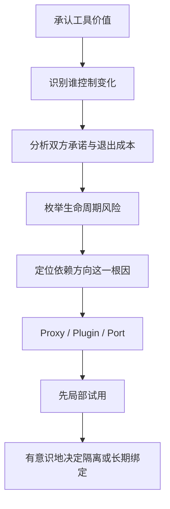

## 15. 问题的真正难点

### 15.1 早期收益立即可见

Framework 能迅速交付 Feature，Boundary 的长期收益却暂时不可见。

### 15.2 Coupling 往往渐进发生

一个 Annotation、一个 Base Class、一个 Helper，逐步扩散到 Core。

### 15.3 Happy Path 很顺畅

Framework Demo 通常展示最适合它的场景，特殊需求尚未出现。

### 15.4 退出成本难以预估

真正替换前，团队常不知道：

- 隐式 Lifecycle；
- Data Migration；
- Hidden Hook；
- Test Dependency；
- Operational Assumption。

### 15.5 Boundary 会增加当前代码

Adapter 和 Mapping 容易被看作无用 Boilerplate。

### 15.6 团队可能把 Framework Skill 当作 Domain Design

熟练使用 Annotation 和 Convention，不等于理解 Business Policy。

### 15.7 Framework 可能跨越多个层

例如一个 Full-Stack Framework 同时控制：

- UI；
- Routing；
- Persistence；
- Validation；
- Build；
- Deployment。

### 15.8 深度能力有时确实需要绑定

完全隔离可能失去：

- Performance；
- Tooling；
- Type Safety；
- Productive Convention。

### 15.9 因此不能只说“永不耦合”

需要按：

- 变化率；
- 业务价值；
- 产品寿命；
- 替换概率；
- 隔离成本；

作出判断。

### 15.10 本章方法的成熟之处

它不是追求零依赖，而是要求：

- 先隔离；
- 推迟承诺；
- 必须承诺时保持清醒。

## 16. 在现代项目中应用

### 16.1 Web Framework

Router、Controller Base、Request、Response 留在 Delivery Adapter。

### 16.2 ORM Framework

Persistence Model、Session、Lazy Collection、Annotation 留在 Data Adapter。

### 16.3 Dependency Injection Framework

Container 与 Configuration 集中在 Main / Composition Root。

### 16.4 Messaging Framework

Consumer、Acknowledgment、Broker Header 留在 Message Adapter。

### 16.5 UI Framework

Component Lifecycle、Hook、Widget 留在 UI Layer；Business Policy 通过 Plain Port 调用。

### 16.6 Testing Framework

Test Framework 应驱动 Test，不应要求 Production Entity 继承 Test-Specific Base。

### 16.7 Cloud Framework

Function Handler、Cloud Event、SDK Client 通过 Adapter 转成 Use Case Input / Output。

### 16.8 Workflow Engine

区分：

- 真正业务 Workflow Policy；
- Engine DSL、Runtime State 和 Callback。

### 16.9 Machine Learning Framework

Model Tensor / Runtime Type 若进入产品核心，要评估：

- 是否属于算法本质；
- 是否只是执行引擎；
- 是否需要 Neutral Model Boundary。

### 16.10 Plugin 实现方式

可使用：

- Interface；
- Dependency Injection；
- Function Boundary；
- Message Contract；
- Process Boundary。

### 16.11 Process Boundary 更强但更贵

独立进程可加强隔离，却增加：

- Serialization；
- Network Failure；
- Deployment；
- Observability；
- Latency。

### 16.12 不要自动使用 Microservice 隔离 Framework

源码 Component Boundary 往往已经足够。

### 16.13 架构规则自动化

CI 可执行：

- Dependency Analysis；
- Forbidden Import Check；
- Module Boundary Test；
- Architecture Test。

### 16.14 Upgrade Drill

定期在 Branch 中尝试 Framework Upgrade，测量真实摩擦。

### 16.15 Exit Drill

对关键 Framework 验证：

- 能否替换一个 Adapter；
- 能否导出数据；
- Core Test 是否无需 Framework；
- 是否依赖 Undocumented API。

### 16.16 Architecture Decision Record

记录：

- 为什么采用；
- 绑定范围；
- 被拒绝方案；
- 风险；
- Upgrade / Exit Strategy；
- Review Date。

## 17. 评估 Framework 的方法

### 17.1 先问业务重叠

Framework 解决的问题与项目问题重叠多少？

### 17.2 再问侵入方式

是否要求：

- Entity 继承；
- Core Annotation；
- 专用 Data Model；
- Global Context；
- 特殊 Build？

### 17.3 控制权

- Roadmap 由谁控制？
- Breaking Change 如何管理？
- 是否可 Fork？
- Fork 成本多高？

### 17.4 生命周期匹配

Framework 的支持期是否覆盖 Application 的预期寿命？

### 17.5 Upgrade 记录

过去 Major Version 的：

- Migration Guide；
- Backward Compatibility；
- Deprecation Window；
- Security Response。

### 17.6 Escape Hatch

遇到特殊需求时能否：

- 插入 Custom Adapter；
- 替换默认 Component；
- 绕过部分 Lifecycle；
- 使用 Standard Protocol？

### 17.7 Data Portability

- 数据格式是否开放？
- 是否可完整导出？
- Migration 是否依赖专有工具？
- Schema 是否被 Framework 控制？

### 17.8 Testability

Core Test 能否不启动 Framework？

### 17.9 Observability

能否观测隐藏 Lifecycle、Retry、Transaction 与 Error？

### 17.10 Operational Fit

Framework 是否符合：

- Deployment；
- Scaling；
- Resource Limit；
- Security；
- Compliance。

### 17.11 Community 与 Bus Factor

检查：

- Maintainer 数量；
- Release 活跃度；
- Security Process；
- Ecosystem；
- 文档质量。

### 17.12 License 与商业风险

- License Compatibility；
- Pricing；
- Support Contract；
- Vendor Acquisition Risk。

### 17.13 团队能力

边界设计再好，也需要团队能：

- 调试 Framework；
- 维护 Adapter；
- 执行 Upgrade；
- 识别 Leakage。

### 17.14 不用虚假精确分数

本章没有 Framework 评分公式。

不同项目的风险权重不同，定性证据与明确 Trade-off 比机械总分更可靠。

### 17.15 最终决策类型

- **Adopt behind boundary**：使用但隔离；
- **Adopt deeply and deliberately**：有意长期绑定；
- **Trial**：局部约会；
- **Hold**：暂缓采用；
- **Reject**：收益不足以覆盖风险。

## 18. 从深度绑定中迁移

### 18.1 先承认已有婚姻

不要用一个空 Interface 假装 Framework 已被隔离。

### 18.2 盘点耦合面

搜索：

- Import；
- Annotation；
- Base Class；
- Framework Type in Signature；
- Static Context；
- Lifecycle Callback；
- Data Format。

### 18.3 找出最稳定的 Use Case

选择一个业务切片建立 Plain Input / Output Boundary。

### 18.4 建立 Characterization Test

先固定当前行为，避免迁移时无意改变 Business Rule。

### 18.5 抽出 Core-owned Port

Port 以业务需要命名，不复制 Framework API。

### 18.6 建立 Adapter

让旧 Framework 实现新 Port，先保持运行行为不变。

### 18.7 移除 Core Type Leakage

逐步转换：

- Framework Entity → Domain Entity；
- Framework Exception → Business Error；
- Framework Context → Plain Request Data。

### 18.8 把组装移到 Main

集中创建 Concrete Adapter 和 Use Case。

### 18.9 逐个切片迁移

避免一次性 Rewrite 整个系统。

### 18.10 使用双实现验证

必要时让旧、新 Adapter 同时通过同一 Contract Test。

### 18.11 数据迁移单独规划

源码解耦不自动解决：

- Schema；
- Serialized State；
- Migration History；
- Operational Cutover。

### 18.12 删除 Framework Dependency

只有所有调用与数据路径迁出后，才能真正移除。

### 18.13 防止重新扩散

增加：

- Module Rule；
- Forbidden Import；
- Review Checklist；
- Architecture Test。

### 18.14 渐进迁移图

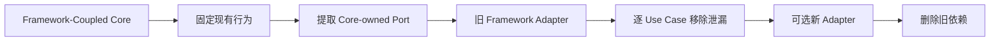

## 19. 适用范围、局限与常见误区

### 19.1 适用范围

本章最适合：

- 长生命周期系统；
- 复杂 Business Rules；
- Framework 变化可能性高；
- 多 Delivery / Persistence 机制；
- 需要快速 Core Test；
- 需要长期独立演进。

### 19.2 简单短命项目

Prototype、内部小工具或明确短命产品可能直接围绕 Framework 构建更经济。

### 19.3 Framework 本身就是产品平台

如果产品就是 Framework Extension、IDE Plugin 或特定 Cloud App，深度绑定可能是商业前提。

### 19.4 深度利用可换取巨大收益

有时 Framework-Specific Feature 提供：

- 关键性能；
- 强工具链；
- 显著开发效率；
- 生态兼容。

此时可以有意承诺。

### 19.5 Boundary 不是免费保险

它增加代码、Mapping、测试和认知负担。

### 19.6 Boundary 不能消除 Operational Coupling

即使 Core 独立，部署、数据和运维仍可能强依赖 Framework。

### 19.7 Boundary 不能保证轻松替换

它只缩小修改范围，不消除语义差异和 Migration Work。

### 19.8 常见误区一：作者反对所有 Framework

错误。原书首先肯定 Framework 免费、强大且有用。

### 19.9 常见误区二：Framework Author 有恶意

错误。作者明确肯定其社区动机；问题是不可能了解你的全部利益。

### 19.10 常见误区三：Framework 永远不能出现在代码中

错误。它可以出现在 Outer Adapter 与 Main。

### 19.11 常见误区四：任何 Annotation 都违反 Clean Architecture

错误。关键在 Annotation 是否进入 Inner Circle 并塑造 Business Policy。

### 19.12 常见误区五：继承永远错误

错误。外层 Proxy 可以继承 Framework Base Class；不应让 Entity 因低层 Framework 被迫继承。

### 19.13 常见误区六：包装一层 Interface 就解耦

错误。若 Lifecycle、Type 和 Data Semantics 仍泄漏，Interface 只是表面包装。

### 19.14 常见误区七：可以保证任意替换 Framework

错误。目标是局部化风险，不是承诺零成本替换。

### 19.15 常见误区八：为了可替换必须只用最低公分母

错误。Adapter 可以充分利用 Framework 能力，只需控制其传播范围。

### 19.16 常见误区九：Framework 推荐结构就是 Architecture

错误。目录和 Convention 不自动表达 Use Case、Policy 与 Dependency Rule。

### 19.17 常见误区十：DI Container 等于 Dependency Inversion

错误。Container 负责对象组装；Dependency Inversion 关心源码依赖方向与接口所有权。

### 19.18 常见误区十一：用了 Constructor Injection 就自动 Clean

错误。如果 Constructor 参数仍是 Framework Type，Core 仍然依赖 Detail。

### 19.19 常见误区十二：Main 最脏所以可以写业务逻辑

错误。“最脏”表示知道 Concrete Detail，Main 仍主要负责 Wiring。

### 19.20 常见误区十三：Standard Library 与普通 Framework 风险相同

错误。稳定性、控制、生态和退出成本不同，但仍应意识到长期承诺。

### 19.21 常见误区十四：开源意味着没有 Lock-In

错误。API、Data、Skill、Operations 和 Fork Maintenance 都会形成 Lock-In。

### 19.22 常见误区十五：商业支持消除 Asymmetry

错误。Support Contract 能缓解风险，但 Vendor Roadmap 仍不等于你的 Product Roadmap。

### 19.23 常见误区十六：Microservice 能自动隔离 Framework

错误。Framework Type 仍可能污染每个 Service Core，同时引入分布式复杂度。

### 19.24 常见误区十七：所有项目都需要大量 Port 与 Adapter

错误。边界深度应与寿命、复杂度和变化风险匹配。

### 19.25 常见误区十八：先深度采用，以后再抽象一样便宜

错误。Core Model、Data 与 Test 一旦塑形，后置分离通常昂贵得多。

### 19.26 常见误区十九：不用 Framework 就没有依赖风险

错误。自研平台同样可能形成不可控内部 Framework 和隐式 Lifecycle。

### 19.27 常见误区二十：框架升级只是改版本号

错误。可能涉及 Semantics、Data、Runtime、Security、Deployment 与 Ecosystem。

## 20. 实践检查、知识结构与核心总结

### 20.1 Core Dependency 检查

- Entity 是否 Import Framework？
- Use Case 是否继承 Framework Base？
- Core Signature 是否暴露 Framework Type？
- Business Error 是否使用 Framework Exception？
- Core Test 是否必须启动 Container？

### 20.2 Adapter 检查

- Framework Callback 是否停在 Adapter？
- Adapter 是否转换为 Plain Input / Output？
- Proxy 是否位于 Outer Component？
- Port 是否由 Core 需要定义？
- Framework Lifecycle 是否泄漏？

### 20.3 Main 检查

- Concrete Wiring 是否集中？
- Spring / Container Knowledge 是否主要位于 Main？
- Main 是否只组装而不执行 Business Rule？
- 不同 Entry Point 是否可使用不同 Main？
- 测试是否可手工组装 Core？

### 20.4 生命周期风险检查

- 产品可能在哪些方面超出 Framework？
- Framework 的 EOL 与 Application 寿命是否匹配？
- Major Upgrade 记录如何？
- 新 Framework 出现时切换范围多大？
- 数据与运维 Lock-In 在哪里？

### 20.5 “约会”检查

- 能否先做局部 Spike？
- 能否只在一个 Adapter 试用？
- 能否验证 Upgrade？
- 能否保留标准 Data Export？
- 何时 Review 是否深化绑定？

### 20.6 “结婚”决策检查

- 深度绑定带来的独特收益是什么？
- 为什么隔离成本不值得？
- 谁承担长期 Upgrade？
- Roadmap 与 Support 是否可信？
- Decision 与 Exit Plan 是否记录？

### 20.7 场景判断一：Entity 继承 ORM Base

**判断：** Framework 进入 Inner Circle，正是原书重点警告的结构。

### 20.8 场景判断二：ORM Persistence Object 位于 Adapter

Mapper 把它转换成 Domain Entity。

**判断：** 符合 Proxy / Plugin 与 Dependency Rule。

### 20.9 场景判断三：Spring 在 Main 组装 Use Case

Core 使用普通 Constructor。

**判断：** 符合原书 Spring 示例。

### 20.10 场景判断四：所有 Business Object 都有 `@Autowired`

**判断：** Spring Knowledge 扩散到 Core，独立测试与替换能力下降。

### 20.11 场景判断五：C++ Core 使用 `std::vector`

**判断：** 属于原书承认的合理长期承诺，但仍是语言生态决策。

### 20.12 场景判断六：项目是某 IDE 的 Plugin

**判断：** IDE API 绑定可能是产品前提；应局部化能局部化的部分，而非假装完全独立。

### 20.13 场景判断七：两周 Prototype 直接使用 Full-Stack Framework

**判断：** 可能是合理权衡，前提是团队不误把 Prototype 结构自动扩展为十年架构。

### 20.14 场景判断八：Interface 完全复制 Vendor SDK

**判断：** 语义仍由 Vendor 控制，不是真正 Core-owned Port。

### 20.15 场景判断九：Framework 升级只修改 Adapter 与 Main

**判断：** 说明 Boundary 有效，但仍需验证 Data 与 Deployment。

### 20.16 场景判断十：为避免 Lock-In 自研整个 Framework

**判断：** 可能把外部风险换成更昂贵的内部维护风险，应比较总成本。

### 20.17 快速复述练习

能够回答以下问题，基本就掌握了本章：

1. 作者为什么先肯定 Framework？
2. Framework 与 Architecture 的根本区别是什么？
3. 为什么 Framework Author 即使善意也无法以你的最佳利益为中心？
4. Problem Overlap 为什么解释了 Framework 的价值？
5. Non-Overlap 为什么产生长期摩擦？
6. Asymmetric Marriage 的两边分别承诺了什么？
7. Framework Documentation 通常怎样推动深度集成？
8. Framework Author 为什么不承担同等耦合风险？
9. Inheritance 怎样让 Framework 进入 Core？
10. Annotation 为什么不只是无害 Metadata？
11. Callback、Data Model、Build 与 Deployment 如何形成耦合？
12. 原书列出的四项风险是什么？
13. Framework 怎样违反 Dependency Rule？
14. 为什么 Entity 是最危险的侵入位置？
15. 产品成熟后为什么可能超出 Framework？
16. Framework 演进方向为什么可能对产品无益？
17. 新 Framework 出现时，旧耦合怎样阻碍切换？
18. 四项风险的共同根因是什么？
19. “Don't marry the framework”为什么不是“不用 Framework”？
20. Keep It at Arm's Length 在代码中是什么样？
21. Outer Circle 与 Inner Circle 分别包含什么？
22. Framework 要求继承 Base Class 时，作者建议怎样做？
23. Proxy 为什么能保护 Entity？
24. Plugin 的 Dependency Direction 是什么？
25. Wrapper 为什么不一定真正解耦？
26. Runtime Control Flow 与 Source Dependency 有何区别？
27. Core-owned Port 为什么不能只是 Framework API 的复制？
28. 原书怎样评价 Spring？
29. 为什么不应把 `@Autowired` 散布到 Business Object？
30. Constructor Injection 怎样允许 Spring 留在外层？
31. Main 为什么可以知道 Spring？
32. Main 为什么被称为最脏、最低层 Component？
33. “最脏”为什么不等于代码质量差？
34. Main 应做 Wiring 还是 Business Rule？
35. C++ STL 与 Java Standard Library 为什么是例外？
36. Standard Library 严格说与 Framework 有什么差异？
37. 为什么不可避免的依赖仍应是显式决策？
38. 婚礼誓词隐喻强调了什么？
39. “先 Date”在工程中有哪些形式？
40. 应在试用期观察哪些证据？
41. “Get the Milk without Buying the Cow”是什么意思？
42. 什么条件下可以有意深度绑定？
43. Framework Boundary 能否保证零成本替换？
44. 简单短命项目为什么可能不需要完整隔离？
45. Framework 本身是产品平台时怎样处理？
46. 开源为什么不等于没有 Lock-In？
47. DI Container 为什么不等于 Dependency Inversion？
48. 如何从已深度绑定的系统渐进迁移？
49. Architecture Test 可以检查什么？
50. 本章解决 Framework 决策的一般方法是什么？

### 20.18 一分钟记忆卡

- **价值：** Framework 可以免费、强大且有用。
- **边界：** Framework 不是 Architecture，虽然有些 Framework 试图成为 Architecture。
- **作者：** Framework Author 有善意，但只真正了解自己与身边人的问题。
- **重叠：** 你的问题与其问题的 Overlap 决定 Framework 的当前价值。
- **不对称：** Application 作出长期承诺，Framework Author 不对你的产品作对等承诺。
- **风险一：** Framework 进入 Entity，违反 Dependency Rule。
- **风险二：** 产品成熟后超出 Framework 的能力。
- **风险三：** Framework 向无益方向演进或移除依赖能力。
- **风险四：** 更好 Framework 出现，却因 Lock-In 难以切换。
- **原则：** 使用 Framework，但不要让 Core 与它结婚。
- **结构：** Framework 留在 Outer Circle，通过 Proxy / Adapter / Plugin 接入。
- **方向：** 低层 Adapter 依赖 Core-owned Port。
- **Spring：** 可以负责 Auto-Wire，但 Business Object 不应知道 Spring。
- **Main：** 最低层、最具体的 Composition Root，可以知道 Framework。
- **例外：** STL、Java Standard Library 等长期承诺可能无法避免，但必须是有意识决策。
- **策略：** 先 Date，尽可能长期保持 Boundary，再决定是否深度绑定。

### 20.19 本章知识结构

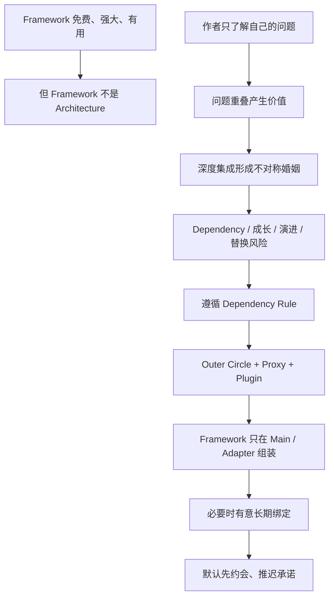

### 20.20 八十条核心结论

1. 第 32 章讨论 Framework 在 Architecture 中的位置，而不是否定 Framework 的工程价值。
2. 作者开篇承认 Framework 流行总体上是好事。
3. 许多 Framework 免费、强大且有用。
4. Framework 可以提供 Lifecycle、Extension Point 和大量通用能力。
5. Framework 不是 Architecture，虽然有些 Framework 试图成为 Architecture。
6. Architecture 关心 Policy、Boundary、Dependency 与长期变化。
7. Framework 推荐目录、Base Class 和 Convention 不能自动替代架构决策。
8. Framework 可以被 Architecture 使用，但不应无条件定义 Business Core。
9. 多数 Framework Author 希望帮助 Community，其动机值得赞扬。
10. 他们却不可能真正知道你的全部问题和最佳利益。
11. Framework Author 最了解自己、同事与朋友的问题。
12. Framework 首先为这些已知问题而设计。
13. 你的问题与作者问题通常有大量 Overlap，因此 Framework 才有价值。
14. Non-Overlap 区域会随着特殊需求和产品成熟产生摩擦。
15. Open Source Contribution 与 Fork 能增加影响力，却不构成对你的产品路线的承诺。
16. Framework 与 Application 的关系是 Asymmetric Marriage。
17. Application 可能承诺 Base Class、Annotation、Lifecycle、Data Model、Build 与 Runtime。
18. Framework Author 不对单个 Application 作出对等生命周期承诺。
19. Framework Documentation 通常教你把 Application 包裹在 Framework 周围。
20. 它可能鼓励 Entity 继承 Base Class并直接 Import Framework Facility。
21. Framework Author 对这种耦合风险较低，因为作者控制 Framework。
22. Application Team 不控制 Roadmap，却承担升级、迁移与退出成本。
23. 深度采用还会增强 Ecosystem Stickiness，使离开越来越困难。
24. Asymmetry 不表示不能采用，只表示风险必须由自己的 Architecture 管理。
25. Inheritance Coupling 会让 Framework 定义 Core Type Hierarchy。
26. Annotation 可能引入 Compile Dependency、Scanning、Proxy 和 Hidden Lifecycle。
27. Callback Coupling 让 Framework 决定 Thread、Transaction、Retry 与调用时机。
28. Data Model Coupling 让 Domain Object 按 Persistence 或 UI Framework 塑形。
29. Build、Deployment、Data 与 Test 也都可能形成深度绑定。
30. 耦合深度不能只按 Import 数量判断，一个 Annotation 也可能接受整个 Lifecycle Contract。
31. 原书第一项风险是 Framework Architecture 常不够 Clean，并可能违反 Dependency Rule。
32. Framework 要求低层代码进入 Entity，是最危险的依赖方向。
33. Framework 一旦进入 Inner Circle，会扩散到构造、签名、Identity、State 与 Test。
34. 原书第二项风险是 Framework 只帮助 Early Features，成熟产品可能超出其能力。
35. 超出 Happy Path 后，团队会不断 Override、Patch 或使用 Undocumented Hook。
36. 深度绑定越强，Framework 与新需求的摩擦越难局部解决。
37. 原书第三项风险是 Framework 可能向对产品无益的方向演进。
38. Security、Runtime 与 EOL 可能迫使团队升级到无直接产品收益的版本。
39. 旧 Feature 可能被移除、改变或停止支持。
40. 原书第四项风险是更好的 Framework 可能出现，而旧 Lock-In 阻碍切换。
41. 四项风险的共同根因是不可控 Detail 控制了 Core 的形状。
42. Maintenance、Security、License 与 Operational Lock-In 是同一主线下的现代补充风险。
43. 原书的解决方案是 Don't Marry the Framework。
44. 这不表示不使用 Framework，而是不要让 Core 与它耦合。
45. Framework 应保持在 Architecture 的 Outer Circle。
46. Entity、Enterprise Rule、Use Case 与 Core Port 应避免 Framework Knowledge。
47. 低层 Framework Adapter 应依赖 Core-owned Port。
48. Runtime 中 Framework 可以先获得控制，Source Dependency 仍能指向 Core。
49. Framework 要求 Business Object 继承 Base Class 时，作者建议让外层 Proxy 继承。
50. Proxy 满足 Framework Protocol，再把工作委托给 Core Use Case。
51. Proxy 应位于作为 Business Rules Plugin 的外层 Component。
52. Web Controller、ORM Object、Message Listener 都可作为外层 Adapter。
53. Wrapper 只有阻断 Type、Lifecycle 与 Semantic Leakage 时才真正有效。
54. Core-owned Interface 应由业务需要塑形，不能只是复制 Vendor API。
55. Dependency Rule 是整个解决方案的结构依据。
56. Architecture Test 可以阻止 Framework Import、Base Class 和 Annotation 进入 Core。
57. 作者把 Spring 称为好的 Dependency Injection Framework。
58. Spring 可以执行 Auto-Wire，但不应在 Business Object 中到处散布 `@Autowired`。
59. Business Object 不应知道 Spring。
60. 普通 Constructor Injection 允许 Framework 组装对象，而 Core 保持独立。
61. Spring 应主要在 Main / Composition Root 创建和注入 Concrete Dependency。
62. Main 被称为最脏、最低层 Component，因为它知道最多具体 Detail。
63. “最脏”描述依赖层级，不表示 Main 可以低质量或包含 Business Rule。
64. Main 的主要职责是选择、构造与连接 Plugin。
65. 不同 Web、CLI、Worker Entry Point 可以有不同 Main，复用同一 Core。
66. 作者承认有些 Framework 或基础软件必须与 Application 结婚。
67. C++ 程序通常很难避免 STL，Java 程序几乎必然依赖 Standard Library。
68. Standard Library 严格说未必是 Framework，但同样代表长期基础技术承诺。
69. 不可避免的承诺是正常的，却仍必须被当作显式 Decision。
70. 深度绑定可能持续 Application 的整个 Life Cycle。
71. Architecture 不能消除所有承诺，只能避免、推迟或局部化承诺。
72. 原书结论建议不要立刻结婚，先与 Framework Date 一段时间。
73. Date 可以是 Prototype、Spike、单一 Adapter、独立 Module 或限时 Evaluation。
74. 试用期应观察 Upgrade、Escape Hatch、Testability、Performance 与 Community Health。
75. 应尽可能长时间把 Framework 保持在 Architectural Boundary 后。
76. “Get the Milk without Buying the Cow”表示使用局部能力，不交出整个 Application Structure。
77. 当深度收益明确、生命周期匹配且退出成本可接受时，可以有意结婚。
78. 即使决定深度绑定，也应限制范围、记录 Decision、监控 EOL 并保留数据出口。
79. 本章不是追求零依赖或任意替换，而是审慎管理不可控技术的长期 Commitment。
80. 一般解决思路是先承认工具价值，再分析控制权与承诺不对称，枚举生命周期风险，用 Dependency Rule 建立 Proxy / Plugin Boundary，局部试用后才作出长期决策。

### 20.21 最终结论

本章最重要的不是一句“少用 Framework”，而是：

> **Framework 是工具，不是 Application Architecture 的主人。**

框架作者可以善意、优秀，框架也可以非常强大；但维护者不知道你的全部问题，也不会为你的产品生命周期承担对等责任。因此，Application Team 必须保留架构控制权：

- Framework 留在 Outer Circle；
- Proxy / Adapter 满足 Framework Protocol；
- Core-owned Port 表达 Business Need；
- Main / Composition Root 负责具体组装；
- 必须绑定时，明确承认这是一项长期 Commitment。

最终可浓缩为：

> **Use the framework. Do not let the framework use your architecture. Date it before you marry it.**
