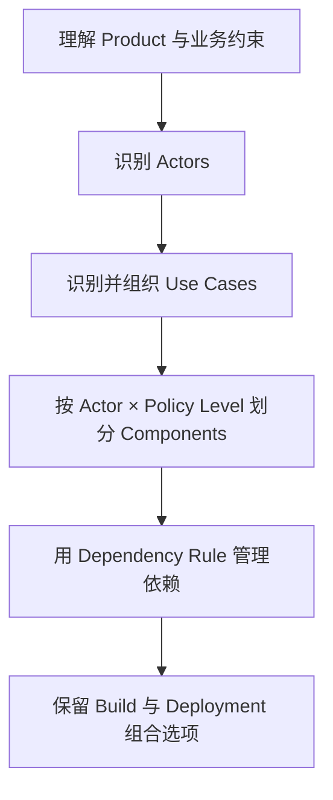
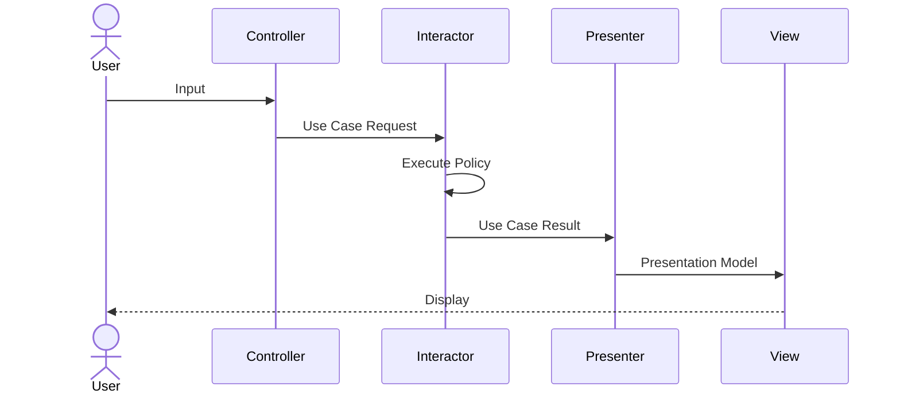
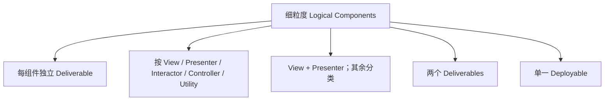
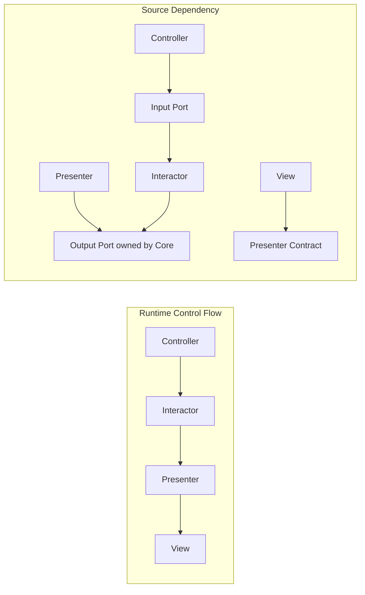
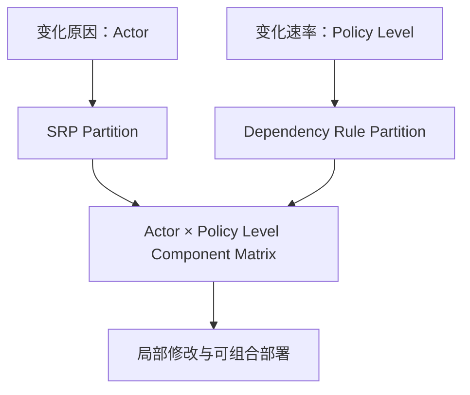
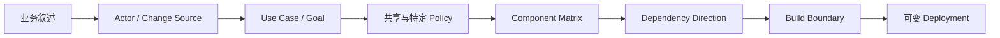
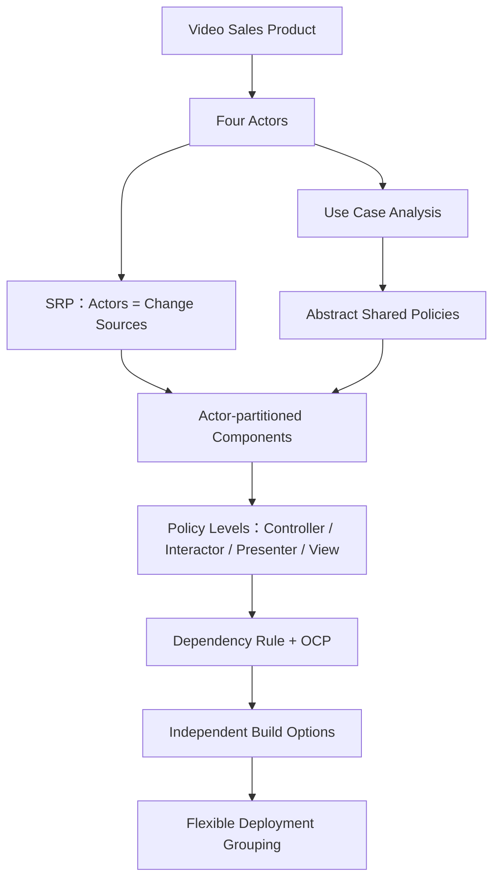

> 原书：Robert C. Martin, *Clean Architecture: A Craftsman's Guide to Software Structure and Design*
>
> 本章：Chapter 33, Case Study: Video Sales
>
> 原文参考：Clean Architecture.md

## 本章导读


第 33 章用一个在线视频销售网站，把前面分散讲解的 Architecture 原则组合成一次简短案例分析。

案例类似作者销售软件教学视频的 `cleancoders.com`：

- 向个人和企业销售视频；
- 个人可以购买 Streaming License 或 Download License；
- 企业只能购买成批的 Streaming License，并获得 Quantity Discount；
- Author 提交视频、说明和配套资料；
- Admin 管理 Series、Video 和 License Price；
- Purchaser 与 Viewer 在个人场景中常是同一人，在企业场景中却经常是不同的人。

作者没有从 Database、Framework、Web Page 或 Class 开始，而是依次做四件事：

1. 理解 Product；
2. 识别 Actors 与 Use Cases；
3. 按 Actor 和 Policy Level 划分 Components；
4. 用 Dependency Rule 与 Open–Closed Principle 调整依赖方向。

最终 Architecture 同时沿两个维度分离变化：

- **不同变化原因**：对应不同 Actor，依据 Single Responsibility Principle；
- **不同变化速率**：对应不同 Policy Level，依据 Dependency Rule。



这章看似只给出两张图，实际在回答几个很重要的问题：

- Architecture 的初始结构从哪里来？
- SRP 中的“变化原因”怎样从 Actor 得到？
- 一个人为什么可以对应两个 Actor？
- Use Case 什么时候值得抽象？
- Controller、Interactor、Presenter、View 为什么要分开？
- 为什么 Runtime Control Flow 与 Source Code Dependency 可以方向相反？
- Component 是否必须一一部署为 `.jar` 或 `.dll`？
- 怎样保留从单体部署到更细粒度部署的选择权？

本章没有正式数学公式、数值计算或算法代码。作者展示的是一种 Architecture Analysis Process。因此，本笔记不会人为补造公式，而会完整解释每一步的依据、图中结构、决策权衡、现代落地方式、适用范围和局限。

## 1. 案例的目的与边界

### 1.1 从规则转向综合应用

前面章节分别讨论了：

- SRP；
- OCP；
- DIP；
- Component Principles；
- Boundary；
- Use Case；
- Clean Architecture；
- Database、Web 与 Framework 这些 Details。

第 33 章把它们放进同一个案例。

### 1.2 案例刻意保持短小

作者说案例会 Short and Simple。

目的不是提供可直接复制的完整商业系统，而是展示：

- Good Architect 使用什么过程；
- Good Architect 作出什么类型的决定。

### 1.3 重点是推导过程

最终 Component Diagram 并不是凭经验直接画出，而是由以下信息逐步得到：

- Product Rule；
- Actor；
- Use Case；
- Change Source；
- Policy Level；
- Dependency Direction。

### 1.4 案例不是完整需求规格

原书明确省略很多 Use Case，例如：

- Log In；
- Log Out。

还可能存在但未讨论：

- Payment；
- Refund；
- Tax；
- Search；
- Recommendation；
- Content Moderation。

### 1.5 “不完整”是有意控制范围

若纳入所有功能，本章会扩展成一本书。

### 1.6 初始 Architecture 不是最终 Architecture

原书称 Figure 33.2 为 Preliminary Component Architecture。

后续还要根据：

- 真实变化；
- 团队结构；
- 性能；
- 部署；
- 运维；

持续调整。

### 1.7 最便宜的起点

在大量实现信息尚不存在时，先识别 Actors 与 Use Cases，比先选择 Framework 或 Database 更能揭示稳定业务结构。

## 2. The Product

### 2.1 产品是什么

一个通过 Web 销售 Video 的软件系统。

### 2.2 现实原型

它让人联想到作者销售 Software Tutorial Video 的 `cleancoders.com`。

### 2.3 基本商业目标

系统拥有一批 Video，希望把观看或下载权销售给个人与企业。

### 2.4 Web 是交付机制

产品通过 Web 销售，但前一章已经说明：Web 是 Detail。

本章不会从 Web Framework 或 Page Structure 推导 Architecture。

### 2.5 两类客户

- Individual；
- Business。

### 2.6 个人 Streaming License

个人可以按一个价格购买 Streaming 权利。

### 2.7 个人 Download License

个人也可以支付更高价格，下载 Video 并永久拥有。

### 2.8 两种个人 License 的业务差异

- 访问方式不同；
- 权利期限不同；
- 价格不同；
- 交付行为不同。

### 2.9 企业 License

Business License 只允许 Streaming。

### 2.10 批量购买

企业以 Batch 方式购买 License。

### 2.11 Quantity Discount

企业批量购买时可以获得 Quantity Discount。

原书未给出具体阶梯或计算公式，因此这里只保留规则语义，不虚构折扣算法。

### 2.12 个人中的角色重合

个人通常同时是：

- Purchaser；
- Viewer。

### 2.13 企业中的角色分离

企业中经常由一个人负责购买，另一些人负责观看。

### 2.14 人与 Actor 不同

同一个 Human 可以扮演多个 Actor；多个 Human 也可以扮演同一个 Actor。

### 2.15 Author 的责任

Video Author 需要提交：

- Video File；
- Written Description；
- Ancillary File。

### 2.16 Ancillary Material 包括什么

- Exam；
- Problem；
- Solution；
- Source Code；
- 其他配套材料。

### 2.17 Admin 的责任

Administrator 需要：

- 添加新 Video Series；
- 向 Series 添加 Video；
- 从 Series 删除 Video；
- 为不同 License 设置 Price。

### 2.18 Product Rule 是架构输入

这些规则决定：

- 存在哪些业务角色；
- 每类角色想完成什么目标；
- 哪些政策可以共享；
- 哪些变化需要彼此隔离。

### 2.19 Product Rule 不是 UI Screen

“Purchase Streaming License”是业务目标；“点击购买按钮”只是某种 Web Interaction。

### 2.20 Product Rule 不是 Database Table

“Business License 只允许 Streaming”是业务政策；它不等于某张 License Table 的字段设计。

## 3. 从 Product 识别四个 Actor

### 3.1 Author

负责向系统提供可销售内容和配套材料。

### 3.2 Purchaser

负责选择并购买 License。

### 3.3 Viewer

负责浏览 Catalog，并使用已获权利观看或下载 Video。

### 3.4 Admin

负责维护 Catalog Structure 和 License Price。

### 3.5 Actor 是角色

Actor 描述与系统交互时承担的一组责任和目标。

### 3.6 Actor 不是用户名类型

一个 Account 是否属于某种数据库 Role，不足以完整定义 Architecture Actor。

### 3.7 Actor 是 Change Source

本章最重要的解释是：Actor 代表系统变化的主要来源。

### 3.8 Author 为什么会推动变化

例如 Author 可能需要：

- 新 Video Format；
- 新 Ancillary Material；
- 新 Submission Workflow。

### 3.9 Purchaser 为什么会推动变化

例如 Purchaser 可能需要：

- 新 License Type；
- 新 Purchase Flow；
- 新 Pricing Presentation。

### 3.10 Viewer 为什么会推动变化

例如 Viewer 可能需要：

- 新 Playback Capability；
- 新 Download Experience；
- 新 Catalog View。

### 3.11 Admin 为什么会推动变化

例如 Admin 可能需要：

- 新 Series Management；
- 新 Pricing Rule；
- 新 Publication Workflow。

### 3.12 同一个人为何仍可对应多个 Actor

个人买家虽然既购买又观看，但：

- Purchase Policy 可能因 Payment 或 License 改变；
- Viewing Policy 可能因 Player 或 Entitlement 改变。

变化原因不同，所以 Actor 应保持区分。

### 3.13 企业场景让区分更明显

Purchaser 与 Viewer 可能是完全不同的人，拥有不同权限和目标。

### 3.14 Actor 与 Persona 的区别

Persona 描述典型用户的背景、动机和行为；Actor 在本章主要表达系统责任与变化来源。

### 3.15 Actor 与 Organization 的区别

一个 Business Customer 可能包含许多 Purchaser 和 Viewer。

### 3.16 Actor 与权限的关系

权限支持 Actor 的操作，但 Actor 划分不应只由 Access Control List 决定。

### 3.17 四个 Actor 是初始模型

真实系统可能新增：

- Finance；
- Support；
- Auditor；
- Content Reviewer。

新增 Actor 会带来新的变化轴。

## 4. Actor 与 Single Responsibility Principle

### 4.1 SRP 的架构含义

SRP 不是简单的“一个 Class 只做一件事”。

更准确的表述是：

> 一个 Module 应只对一个 Actor 或一类一致的 Change Source 负责。

### 4.2 本章怎样应用 SRP

四个 Actor 被视为四个 Primary Sources of Change。

### 4.3 新 Feature 为谁服务

作者认为，每次新增或修改 Feature，都会服务于这些 Actor 中的一个。

### 4.4 因此如何 Partition

系统应被划分为：

- Author 相关部分；
- Purchaser 相关部分；
- Viewer 相关部分；
- Admin 相关部分。

### 4.5 Partition 的目标

服务一个 Actor 的变化不应影响其他 Actor 的 Components。

### 4.6 “不影响”不是绝对零修改

若真正的 Business Policy 同时变化，多个部分可能都要改。

目标是避免无关的连带修改。

### 4.7 典型错误：按技术层共享一切

一个万能 `VideoService` 同时负责：

- Author Submission；
- Purchase；
- Playback；
- Administration。

它会因四种不同原因变化。

### 4.8 典型错误：按数据库实体聚合一切

因为所有功能都涉及 Video，就把全部行为放进一个巨大 `Video` Module，同样会混合 Actor 变化。

### 4.9 Actor Boundary 与 Data Sharing

不同 Actor 可以读取同一业务数据，但不必共享同一 Use Case Implementation。

### 4.10 Shared Data 不等于 Shared Responsibility

Catalog Data 可能被 Purchaser 和 Viewer 使用，但二者对它的政策和呈现需求可能不同。

### 4.11 Shared Policy 才可能抽象

只有真正相同的 General Policy 才值得抽出共享 Use Case。

### 4.12 SRP 带来的局部性

- Change Scope 更小；
- Test 更聚焦；
- Ownership 更清楚；
- Release Risk 更可控。

### 4.13 SRP 与团队结构

Actor Partition 可以帮助团队围绕业务能力协作，但原书没有要求“一 Actor 一 Team”。

### 4.14 SRP 与部署无关

代码按 Actor 分离，不代表必须部署成四个 Service。

## 5. 从业务叙述到 Use Case

### 5.1 Use Case 表达什么

Use Case 表达某个 Actor 借助系统完成的业务目标。

### 5.2 Use Case 从动词开始

Figure 33.1 中的名称包括：

- Submit；
- Purchase；
- View；
- Stream；
- Download；
- Add；
- Publish；
- Remove；
- Set。

### 5.3 为什么不从 Entity 开始

Entity 说明业务对象是什么，Use Case 说明系统代表 Actor 做什么。

### 5.4 为什么不从 Page 开始

Page 是 Web Delivery Detail，同一 Use Case 可以由 Mobile、CLI 或 API 调用。

### 5.5 为什么不从 API Endpoint 开始

Endpoint 是 Protocol Contract，不等于完整业务意图。

### 5.6 Use Case 的边界

每个 Use Case 通常需要：

- Input Data；
- Application Processing；
- Output Data；
- Business Rule 协作；
- Gateway 协作。

### 5.7 Use Case 的粒度

应足以表达一个 Actor Goal，又不应把整个 Actor 的所有行为合并成一个万能流程。

### 5.8 Use Case 与 Feature

Feature 可以跨多个 Use Case；一个 Use Case 也可以通过多个 UI Feature 暴露。

### 5.9 Use Case 名称应保持业务语言

`Purchase Business License` 比 `POST /licenses` 更能表达政策。

### 5.10 初始清单不要求完美

Use Case Analysis 会随需求学习而修订。

## 6. Use Case Analysis


### 6.1 Figure 33.1 的作用

它把四个 Actor 与各自目标放在同一张图中。

### 6.2 Author Use Cases

- Submit MP4；
- Submit Exam；
- Submit Video Description。

### 6.3 Purchaser Use Cases

- Purchase Download License；
- Purchase Streaming License；
- Purchase Business License；
- View Catalog as Purchaser。

### 6.4 Viewer Use Cases

- View Catalog as Viewer；
- Stream Video；
- Download Video。

### 6.5 Admin Use Cases

- Add New Series；
- Publish Video in Series；
- Remove Video from Series；
- Set License Price。

### 6.6 两个虚线 Abstract Use Cases

- Purchase License；
- View Catalog。

### 6.7 Purchase License 的具体化

三个具体 Purchase Use Case 从共同的 Purchase License Policy 派生：

- Download；
- Streaming；
- Business。

### 6.8 View Catalog 的具体化

两个 Actor-Specific Use Case 从共同 Catalog Policy 派生：

- View Catalog as Purchaser；
- View Catalog as Viewer。

### 6.9 图中的蓝色边界

图把不同 Actor 的 Use Cases 分隔开，强化 Actor 作为变化来源的划分。

### 6.10 Figure 33.1 的结构化复述

| Actor | Use Cases | 主要变化原因 |
|---|---|---|
| Author | Submit MP4、Exam、Description | 内容提交与材料格式 |
| Purchaser | Purchase Licenses、View Catalog | 购买、价格与 License |
| Viewer | View Catalog、Stream、Download | 内容访问与消费体验 |
| Admin | Series、Publication、Price | Catalog 管理与运营政策 |

### 6.11 图不是权限矩阵

它说明业务目标与变化责任，不完整表达 Authentication、Authorization 或 Data Access。

### 6.12 图不是调用顺序图

Use Case Diagram 不说明哪个 Use Case 先执行，也不说明 Runtime Message Flow。

### 6.13 图不是部署图

Actor 分区不等于四个 Process 或 Service。

### 6.14 图不是完整 Domain Model

它没有展示 Video、Series、License 等 Entity 的内部关系。

### 6.15 它解决的核心问题

在实现之前找到：

- 稳定业务意图；
- 主要变化来源；
- 值得隔离的责任边界；
- 可能共享的 General Policy。

## 7. 为什么省略 Log In 与 Log Out

### 7.1 原书明确承认 Use Case List 不完整

Figure 33.1 只是典型分析，不是完整 Product Backlog。

### 7.2 省略的直接原因

管理本书中的问题规模。

### 7.3 不是说 Authentication 不重要

真实销售系统必须认真处理：

- Identity；
- Session；
- Credential；
- Authorization；
- Account Recovery。

### 7.4 不是说 Log In 必然是 Business Use Case

是否将它建模为 Use Case，取决于：

- 是否具有独特业务政策；
- 是否只是 Delivery / Security Mechanism；
- 是否对 Actor Goal 有独立意义。

### 7.5 Architecture Analysis 需要控制范围

如果一次分析包含所有边缘情况，核心结构反而难以看清。

### 7.6 Scope Management 的方法

1. 先覆盖主业务路径；
2. 标记省略项；
3. 不声称模型完整；
4. 后续按风险扩展。

### 7.7 省略不能变成遗忘

安全、支付和审计即使未出现在教学图中，也必须在真实项目补齐。

### 7.8 教学模型与生产模型的边界

复制 Figure 33.1 不能替代真实 Requirement Discovery。

## 8. Abstract Use Case

### 8.1 什么是 Abstract Use Case

原书定义：

> 设定 General Policy，由另一个 Use Case 进一步充实的 Use Case。

### 8.2 General Policy 是什么

多个具体业务动作真正共享的规则骨架。

### 8.3 Concrete Use Case 做什么

补充特定 Actor、License 或交互场景的具体政策。

### 8.4 View Catalog 抽象

Viewer 与 Purchaser 都要查看 Catalog，因此存在共享行为。

### 8.5 Actor-Specific Catalog

- Purchaser Catalog 可补充购买相关政策；
- Viewer Catalog 可补充观看相关政策。

原书没有详细列出差异，不能把这些示例当作原书事实。

### 8.6 Purchase License 抽象

不同 License 购买流程可能共享：

- 选择 Offer；
- 校验 Eligibility；
- 形成 Purchase；
- 产生 Entitlement。

具体规则仍因 Download、Streaming、Business 而不同。

### 8.7 作者为何创建 Catalog 抽象

两个 Catalog Use Case 非常相似，作者认为值得尽早识别并统一。

### 8.8 这项抽象不是严格必要

作者明确说，删掉它不会损害 Product Feature。

### 8.9 为什么仍然选择抽象

相似程度足够高，早期统一可以：

- 明确共同 Policy；
- 减少真正重复；
- 让差异更可见。

### 8.10 这与“不要过早抽象”是否矛盾

不矛盾。作者把它描述为判断，而不是强制规则。

### 8.11 有效抽象的前提

- 相似来自相同业务原因；
- Shared Policy 具有稳定语义；
- 具体 Use Case 只补充差异；
- 抽象不会迫使双方锁步变化。

### 8.12 Accidental Duplication

如果两个 Catalog 只是暂时长得像，却由不同 Actor 推动变化，强行共享可能产生错误耦合。

### 8.13 Abstract Use Case 与 Base Class

原书后续假设可使用 Abstract Class 实现相关 View / Presenter。

但概念上的政策抽象不必只能用 Inheritance 实现。

### 8.14 可选实现方式

- Composition；
- Shared Policy Object；
- Function；
- Template Method；
- Decorator；
- Shared Query Service。

### 8.15 选择实现方式的标准

应表达真实变异关系，而不是为了复用几行代码。

### 8.16 原书虚线记法

作者使用 Dashed Use Case 表示 Abstract。

### 8.17 UML 标准记法

更标准的做法是使用 `<<abstract>>` Stereotype。

### 8.18 作者对标准的态度

他认为如今严格遵循这类表示标准没有太大价值。

### 8.19 真正重要的是沟通

团队应让读者清楚：

- 哪个 Use Case 是 General Policy；
- 哪些 Use Case 具体化它；
- 这种关系有什么语义。

## 9. 从 Use Cases 到 Component Architecture

### 9.1 输入信息已经足够

知道 Actor 与 Use Case 后，可以构造 Preliminary Component Architecture。

### 9.2 为什么还不能直接写 Class

Class 过早进入实现细节，容易失去：

- Actor Boundary；
- Policy Level；
- Component Dependency；
- Build Option。

### 9.3 Component 是什么

本章中 Component 是可以形成独立 Compile / Build Unit 的模块。

### 9.4 Component 不只是文件夹

它应拥有可执行的依赖边界，而不是仅靠命名约定。

### 9.5 Component 与 Use Case 的关系

Use Case 被分配到对应 Actor 的 Interactor Component，并由相应 Controller、Presenter、View 支持。

### 9.6 Component 与 Actor 的关系

每个技术类别继续按 Actor 拆分，避免一个层内混合四种变化来源。

### 9.7 Component 与 Policy Level 的关系

Views、Presenters、Interactors、Controllers 处于不同责任和稳定性层级。

### 9.8 初始 Architecture 是二维矩阵

```mermaid
flowchart TB
    subgraph ADMIN[Admin Actor]
        AC[Admin Controllers] --- AI[Admin Interactors] --- AP[Admin Presenters] --- AV[Admin Views]
    end
    subgraph AUTHOR[Author Actor]
        AUC[Author Controllers] --- AUI[Author Interactors] --- AUP[Author Presenters] --- AUV[Author Views]
    end
    subgraph PURCHASER[Purchaser Actor]
        PC[Purchaser Controllers] --- PI[Purchaser Interactors] --- PP[Purchaser Presenters] --- PV[Purchaser Views]
    end
    subgraph VIEWER[Viewer Actor]
        VC[Viewer Controllers] --- VI[Viewer Interactors] --- VP[Viewer Presenters] --- VV[Viewer Views]
    end
```



### 9.9 两个维度不能互相替代

只按 Actor 分，没有 Policy Boundary；只按 Layer 分，又会让不同 Actor 在层内耦合。

## 10. Component Architecture


### 10.1 Double Lines

Figure 33.2 中的 Double Lines 表示 Architectural Boundaries。

### 10.2 四类核心组件

- Views；
- Presenters；
- Interactors；
- Controllers。

### 10.3 每类再按 Actor 拆分

- Admin；
- Author；
- Purchaser；
- Viewer。

### 10.4 Admin Components

- Admin Views；
- Admin Presenters；
- Admin Interactors；
- Admin Controllers。

### 10.5 Author Components

- Author Views；
- Author Presenters；
- Author Interactors；
- Author Controllers。

### 10.6 Purchaser Components

- Purchaser Views；
- Purchaser Presenters；
- Purchaser Interactors；
- Purchaser Controllers。

### 10.7 Viewer Components

- Viewer Views；
- Viewer Presenters；
- Viewer Interactors；
- Viewer Controllers。

### 10.8 Catalog Components

Figure 33.2 还包含：

- Catalog View；
- Catalog Presenter。

### 10.9 Bottom Infrastructure Components

图底部还展示：

- Revenue Gateways；
- Data Gateways；
- Database，示例标注为 Datomic。

### 10.10 Revenue Gateway 的角色

把收入、支付或销售相关外部能力隔离在 Use Case Boundary 外。

原书图中只给出名称，没有展开其协议和业务细节。

### 10.11 Data Gateway 的角色

为 Interactor 提供数据访问边界，同时隔离具体 Database。

### 10.12 Datomic 的架构位置

Datomic 是图中的具体 Database Detail，不是高层 Architecture 的中心。

### 10.13 图与第 30 章的关系

Database 位于 Gateway 外部，体现：

> Data Model 重要，具体 Database 是 Detail。

### 10.14 图与第 31 章的关系

View / Controller 位于外层，体现：

> Web 是 Delivery Detail。

### 10.15 图与第 32 章的关系

Framework 可以实现 View、Controller、Gateway 或 Main，但不应进入 Interactor 的核心政策。

### 10.16 图不是唯一正确排版

关键是 Boundary、Responsibility 和 Dependency，不是组件在纸面上的绝对坐标。

## 11. Views、Presenters、Interactors、Controllers

### 11.1 Controller

接收外部 Input，并把它转换为 Use Case 可理解的 Request。

### 11.2 Controller 不负责什么

不应承载核心 Purchase、License 或 Catalog Policy。

### 11.3 Interactor

实现一个或一组 Use Cases 的 Application-Specific Business Rules。

### 11.4 Interactor 协调什么

- Entity；
- Gateway；
- Input Data；
- Output Boundary；
- Use Case Transaction。

### 11.5 Presenter

把 Interactor Result 转换成适合 View 展示的 Presentation Model。

### 11.6 Presenter 不负责什么

不应重新决定 License 是否有效、Price 如何计算等核心政策。

### 11.7 View

把 Presentation Model 显示给 User，并处理具体设备呈现。

### 11.8 四者的 Runtime 流程



### 11.9 为什么不合成一个组件

它们因不同原因、以不同速率变化：

- Input Protocol 变化；
- Business Policy 变化；
- Formatting 变化；
- Device / UI 变化。

### 11.10 分离不表示永远远程通信

它们可以在同一 Process、同一 Thread 甚至同一 Deployable 中调用。

### 11.11 分离首先是 Source Boundary

目标是控制 Compile-Time Dependency 与 Change Propagation。

### 11.12 现代命名可以不同

团队可能使用：

- Handler；
- Application Service；
- Output Port；
- View Model Mapper。

名称不同不改变责任关系。

## 12. Catalog View 与 Catalog Presenter

### 12.1 为什么有 Special Components

它们承载 Abstract View Catalog Use Case 对应的共享 View / Presentation Policy。

### 12.2 原书假设的实现

Catalog View 与 Catalog Presenter 中包含 Abstract Classes。

### 12.3 谁继承这些 Abstract Classes

Purchaser 与 Viewer 的具体 View / Presenter Classes。

### 12.4 继承表达什么

共同 Catalog 行为位于抽象组件，Actor-Specific 差异位于具体组件。

### 12.5 Source Dependency 的方向

具体的 Purchaser / Viewer Components 依赖更稳定的 Catalog Abstraction。

### 12.6 为什么不是把所有 Catalog 放进一个 Actor

Catalog 同时服务 Purchaser 与 Viewer，不能任意归属于其中一个变化来源。

### 12.7 Shared Kernel 风险

共享组件可能让两个 Actor 锁步变化。

### 12.8 何时共享是合理的

只有共同部分代表同一个稳定 Policy，而不只是 UI 暂时相似。

### 12.9 何时应拆开

如果 Purchaser 与 Viewer Catalog 因不同利益持续分化，共享抽象可能需要缩小或删除。

### 12.10 Abstract Class 不是唯一方法

现代实现可用 Composition 和 Port，减少脆弱继承层次。

### 12.11 原书方法的真正重点

识别并显式表示共同 Policy，而不是强制所有语言采用继承。

### 12.12 Catalog 抽象与 OCP

新增 Actor-Specific Catalog 行为时，可以扩展具体组件，而尽量不修改共享 General Policy。

## 13. Component 作为潜在 `.jar` 或 `.dll`

### 13.1 Figure 33.2 中每个框的潜力

每个 Component 都可以成为一个独立：

- Java `.jar`；
- .NET `.dll`。

### 13.2 “Potential” 很关键

它表示有能力独立构建，不表示必须独立部署。

### 13.3 Component 内包含什么

例如 `Admin Interactors` Component 包含分配给 Admin 的 Interactor Classes。

### 13.4 Compile Boundary

独立 Component 可以：

- 声明允许的 Dependency；
- 隐藏 Implementation；
- 独立 Build；
- 独立 Test；
- 形成 Release Unit。

### 13.5 Build Environment 应先支持细分

作者会按 Figure 33.2 拆分 Compile 与 Build Environment。

### 13.6 为什么先做细粒度 Build Boundary

从细粒度 Component 合并部署较容易，从一个无边界代码块重新拆分通常更难。

### 13.7 独立 Deliverable 的价值

可以只重新构建或发布真正变化的组件。

### 13.8 不等于每个框一个 Repository

原书没有要求 Multi-Repo。

### 13.9 不等于每个框一个 Team

Team Topology 是另一项决策。

### 13.10 不等于每个框一个 Process

`.jar` / `.dll` 可以在同一 Process 中加载。

### 13.11 不等于每个框一个 Microservice

Service Boundary 还要考虑 Network、Data、Transaction 与 Operations。

### 13.12 Component Boundary 的首要目标

让依赖和变化边界在代码与 Build 中真实存在。

## 14. Deployment Grouping 与 Keeping Options Open

### 14.1 作者会真的部署所有组件吗

原书回答：

> **Yes and no.**

### 14.2 Yes 的部分

会按图拆分 Compile / Build Environment，使独立 Deliverable 成为可能。

### 14.3 No 的部分

实际部署时可以把多个 Deliverables 合并成更少的单元。

### 14.4 方案一：每个 Component 独立

这是 Figure 33.2 所保留的最细粒度可能性。

### 14.5 方案二：按技术类别组成五个 `.jar`

- Views；
- Presenters；
- Interactors；
- Controllers；
- Utilities。

### 14.6 方案二的特点

按 Policy / Technical Role 聚合，同时保持层级边界。

### 14.7 方案三：Views 与 Presenters 合并

- Views + Presenters 一个 `.jar`；
- Interactors 一个 `.jar`；
- Controllers 一个 `.jar`；
- Utilities 一个 `.jar`。

### 14.8 方案三的直觉

Presentation 相关组件可能一起变化和部署，核心 Use Case 与其他 Utility 仍可分开。

### 14.9 方案四：两个 `.jar`

- Views + Presenters；
- 其余所有组件。

### 14.10 方案四更原始

部署粒度较粗，但 Source Architecture 仍可保持细分。

### 14.11 还可以单一部署

虽然原书示例止于两个 Deliverable，但同样的逻辑允许在需要时打包为一个 Application。

### 14.12 为什么保留多种组合

系统实际变化模式在项目早期未知。

### 14.13 根据真实变化调整

未来可以观察：

- 哪些组件经常一起变化；
- 哪些组件需要独立发布；
- 哪些部署边界增加成本；
- 哪些 Boundary 真正产生价值。

### 14.14 Logical Architecture 与 Physical Deployment



### 14.15 逻辑分离为何能支持部署组合

清晰依赖让打包成为外层 Build / Deployment Decision，而不是重写 Business Code。

### 14.16 反过来为什么困难

若源码边界不存在，仅把一个大程序切成多个 Process 会暴露：

- 循环依赖；
- Shared State；
- 隐式调用；
- Transaction Coupling。

### 14.17 Keeping Options Open

Architecture 的目标之一是推迟不需要立即确定的部署决策。

### 14.18 Option 不是无限抽象

保留的是有现实变化可能的组合能力，不是为所有想象场景构建通用平台。

## 15. Dependency Management

### 15.1 Runtime Control Flow

Figure 33.2 的 Control Flow 从右向左。

### 15.2 第一步：Controller 接收 Input

外部请求首先进入 Controller。

### 15.3 第二步：Interactor 处理

Controller 把 Input 转换后交给 Interactor，Interactor 产生 Result。

### 15.4 第三步：Presenter 格式化

Presenter 把 Result 转换成 Presentation。

### 15.5 第四步：View 显示

View 显示 Presenter 产生的内容。

### 15.6 Runtime 顺序

> Controller → Interactor → Presenter → View

### 15.7 图中 Arrow 却不全向左

作者要求读者特别注意：大多数 Dependency Arrow 实际向右。

### 15.8 为什么与 Control Flow 不同

Architecture 遵循 Dependency Rule，Source Code Dependency 指向 Higher-Level Policy。

### 15.9 所有跨 Boundary 的依赖

跨越 Double Lines 时只允许单一方向，并指向包含更高层 Policy 的 Component。

### 15.10 Higher-Level Policy

Interactor 和其定义的 Boundary 比具体 UI、Formatting、Database Mechanism 更接近业务目的。

### 15.11 Controller 的依赖

Controller 可以依赖 Use Case Input Boundary，触发 Interactor。

### 15.12 Presenter 的依赖

Presenter 实现由更高层定义的 Output Boundary，使 Interactor 不依赖具体 Presenter。

### 15.13 View 的依赖

View 依赖 Presenter 提供的 Presentation Model / Contract，而 Presenter 不需要依赖具体 Device View。

### 15.14 Gateway 的依赖

具体 Revenue、Data 或 Database Adapter 依赖 Interactor 所需的 Gateway Boundary，而不是让 Interactor 依赖具体 Detail。

### 15.15 静态依赖与动态调用



### 15.16 为什么必须区分两种方向

如果把 Runtime Call Direction 直接当作 Source Dependency Direction，Interactor 会 Import Presenter，Core 就依赖外层 UI。

### 15.17 Dependency Inversion 的作用

通过 Core-owned Interface，让 Runtime Call 可以向外，而 Compile Dependency 仍向内。

### 15.18 简化伪代码

```text
interface PurchaseOutputBoundary
    present(result)

class PurchaseInteractor
    outputBoundary: PurchaseOutputBoundary

    execute(request)
        result = applyPurchasePolicy(request)
        outputBoundary.present(result)

class WebPurchasePresenter implements PurchaseOutputBoundary
    present(result)
        viewModel = formatForWeb(result)
```

### 15.19 伪代码与图的对应

- Runtime：Interactor 调用 Presenter；
- Source：Presenter 实现 Core 定义的 Output Boundary；
- Interactor 只知道抽象；
- Web Formatting 变化不要求修改 Purchase Policy。

## 16. Open Arrows、Closed Arrows 与 OCP

### 16.1 Open Arrows

原书称图中的 Open Arrows 为 Using Relationships。

### 16.2 Open Arrows 的方向

它们与 Control Flow 同向。

### 16.3 Closed Arrows

原书称 Closed Arrows 为 Inheritance Relationships。

### 16.4 Closed Arrows 的方向

它们与 Control Flow 反向。

### 16.5 反向继承为什么重要

低层 Detail 继承或实现高层定义的 Abstraction，从而把 Source Dependency 反转。

### 16.6 典型 Output Boundary

Interactor 调用 Output Interface；Presenter 实现该 Interface。

### 16.7 Control Flow

Interactor → Presenter。

### 16.8 Source Dependency

Presenter → Core-owned Output Interface。

### 16.9 这体现 Open–Closed Principle

高层 Policy 对新的 Detail 实现开放，对修改自身关闭。

### 16.10 更换 View 技术

新增或替换 Presenter / View Adapter，而尽量不修改 Interactor。

### 16.11 更换 Database

新增 Data Gateway Adapter，而尽量不修改 Use Case Policy。

### 16.12 新增 Revenue Provider

通过 Gateway Implementation 扩展，而不把 Provider SDK 引入 Interactor。

### 16.13 OCP 不是永不修改

若 Business Policy 本身变化，Interactor 应当修改。

### 16.14 OCP 保护的是无关 Detail 变化

- UI Framework；
- Database Driver；
- Formatting；
- External Service。

### 16.15 Inheritance 不是唯一反转手段

现代语言可以通过：

- Interface Implementation；
- Function Injection；
- Protocol；
- Trait；
- Callback Port。

### 16.16 关键是 Dependency Direction

语法形式可以变化，高层仍不应依赖低层 Detail。

## 17. Conclusion：两个分离维度

### 17.1 Figure 33.2 的第一维

基于 Single Responsibility Principle 按 Actor 分离。

### 17.2 第一维解决什么

分离因不同 Actor 而变化的 Components。

### 17.3 不同 Reason

- Author 需求；
- Purchaser 需求；
- Viewer 需求；
- Admin 需求。

### 17.4 Figure 33.2 的第二维

基于 Dependency Rule 按 Policy Level 分离。

### 17.5 第二维解决什么

分离以不同 Rate 变化的 Components。

### 17.6 不同 Rate

通常：

- Device / UI Detail 变化较快；
- Presentation 变化较快；
- Application Use Case 相对稳定；
- Enterprise Rule 更稳定。

### 17.7 两维合并



### 17.8 为什么只按 Actor 不够

同一 Actor 的 View 与 Interactor 仍有不同变化速率，不能无条件混在一起。

### 17.9 为什么只按 Layer 不够

一个全局 `Interactors` Module 仍可能让 Author、Purchaser、Viewer、Admin 的变化互相影响。

### 17.10 两维共同目标

> 把因不同原因、以不同速率变化的 Components 分开。

### 17.11 Architecture 与 Deployment 解耦

代码结构完成后，可按环境需要 Mix and Match Deployable Deliverables。

### 17.12 分组可以改变

条件变化时可以重新组合，而无需推翻内部 Policy Boundary。

### 17.13 最终结论的直觉

先把真正独立的变化分开，之后再决定怎样打包；不要让当前打包方式反过来决定业务结构。

## 18. 作者完整的分析过程

### 18.1 第一步：选择熟悉且足够小的 Product

熟悉度减少领域误解，小规模让推导可展示。

### 18.2 第二步：先写业务叙述

描述 License、角色、内容和管理规则，不提 Framework。

### 18.3 第三步：从叙述中识别 Actor

Author、Purchaser、Viewer、Admin。

### 18.4 第四步：把 Actor 解释为 Change Source

用 SRP 给 Partition 提供因果依据。

### 18.5 第五步：枚举 Actor Goals

把目标命名为 Use Cases，而不是 Page 或 API。

### 18.6 第六步：控制分析范围

明确省略 Log In / Log Out，不假装清单完整。

### 18.7 第七步：识别真正相似的政策

抽出 Purchase License 与 View Catalog Abstract Use Cases。

### 18.8 第八步：承认抽象是判断

Catalog 抽象不是功能必需，只是作者认为相似度值得统一。

### 18.9 第九步：把 Use Cases 映射到 Components

引入 Controller、Interactor、Presenter、View Boundary。

### 18.10 第十步：每个层级继续按 Actor 切分

形成二维矩阵，而非单一水平 Layer。

### 18.11 第十一步：为共享政策建立专用组件

Catalog View 与 Catalog Presenter 承载 Abstract Policy。

### 18.12 第十二步：把 Infrastructure 放在外侧

Revenue Gateway、Data Gateway、Datomic 不控制 Interactor。

### 18.13 第十三步：先建立细粒度 Build 能力

每个 Component 都有潜力成为独立 `.jar` 或 `.dll`。

### 18.14 第十四步：推迟实际部署粒度

可以组合为五个、四个、两个或其他数量的 Deliverables。

### 18.15 第十五步：区分 Control Flow 与 Dependency

Runtime 从 Controller 流向 View，Source Dependency 则指向 Higher-Level Policy。

### 18.16 第十六步：用 OCP 反转低层依赖

低层 Presenter / Gateway 实现高层 Boundary。

### 18.17 第十七步：总结两个变化维度

Reason 对应 Actor，Rate 对应 Policy Level。

### 18.18 这一过程为什么有效

每个结构决策都有可解释来源：

- Actor；
- Use Case；
- Change Reason；
- Policy Stability；
- Dependency Rule。

### 18.19 一般化方法



## 19. 难点、依据与取舍

### 19.1 难点一：Actor 不是人

若按具体用户身份划分，会错过同一人承担多个变化责任的事实。

### 19.2 难点二：Actor 不是权限组

权限是实现需求，Actor 是业务目标和变化来源。

### 19.3 难点三：Use Case 粒度

过大时混合变化，过小时退化为 Button Event 或 CRUD Operation。

### 19.4 难点四：共享还是重复

Catalog 相似可能是 General Policy，也可能是 Accidental Duplication。

### 19.5 难点五：早期抽象

信息不足时过早统一，会锁住后来独立演进的 Use Cases。

### 19.6 难点六：组件数量看起来过多

Figure 33.2 让简单系统出现大量 Component，容易被认为 Overengineering。

### 19.7 作者的回答

先保留细粒度 Compile Option，再按现实需要合并 Deployment。

### 19.8 难点七：Layer 与 Actor 两种切法

传统 Layer Architecture 容易只看到 Controller / Service / Repository，忽略 Actor 变化轴。

### 19.9 难点八：Control Flow 误导依赖

调用顺序向外流动，容易让高层直接 Import 低层。

### 19.10 解决方式

使用 Interface / Inheritance 让低层 Detail 依赖高层 Boundary。

### 19.11 难点九：逻辑与物理边界混淆

认为每个 Component 必须独立部署，会过早引入发布和运维复杂度。

### 19.12 难点十：未来变化未知

无法一开始准确知道哪些 Component 会一起改变或部署。

### 19.13 解决方式

保持 Source / Build Boundary，并延迟 Deployment Grouping。

### 19.14 选择这种方法的前提

- 系统有多个 Actor；
- Business Rules 有一定寿命；
- UI / Infrastructure 可能变化；
- 团队需要控制 Change Propagation。

### 19.15 方法的成本

- 更多 Components；
- 更多 Interfaces；
- Mapping；
- Build Configuration；
- Architecture Governance。

### 19.16 收益何时超过成本

当：

- Product 长期演进；
- Actor 需求频繁分化；
- Framework / Database 会替换；
- 并行开发和独立测试重要。

## 20. 现代项目中的落地方式

### 20.1 先做 Actor–Use Case Workshop

邀请 Product、Domain Expert 和 Engineer 共同列出：

- Actor；
- Goal；
- Policy；
- Change Source；
- 省略项。

### 20.2 用业务语言命名 Module

例如：

- `purchasing`；
- `viewing`；
- `authoring`；
- `administration`。

### 20.3 Actor Module 内再分 Policy Level

每个 Actor Module 可包含：

- Delivery Adapter；
- Application Use Case；
- Output Adapter；
- Gateway Port。

### 20.4 不必复制 Figure 33.2 的每个框

小项目可在一个 Deployable 中用 Package / Module 强制边界。

### 20.5 Modular Monolith

这套结构很适合作为 Modular Monolith：

- 一个 Process；
- 清晰 Module Boundary；
- 独立测试；
- 可调整部署。

### 20.6 不要直接跳到 Microservices

网络边界会增加：

- Failure；
- Latency；
- Versioning；
- Observability；
- Distributed Transaction。

### 20.7 Java 实现

可使用：

- Multi-Module Build；
- Package Visibility；
- Java Module System；
- Architecture Test。

### 20.8 .NET 实现

可使用独立 Project / Assembly 与 `internal` Visibility 控制依赖。

### 20.9 TypeScript 实现

可使用 Workspace Package、Project Reference、Lint Boundary Rule。

### 20.10 C++ 实现

可使用 Library Target、Header Boundary 和 Build Graph 限制依赖。

### 20.11 Controller Port

Controller 把 HTTP、CLI 或 Message Input 转成 Plain Use Case Request。

### 20.12 Presenter Port

Interactor 输出 Business Result，Presenter 转成 Web / Mobile / CLI Model。

### 20.13 Gateway Port

Interactor 定义自己需要的 Revenue / Data 能力，Adapter 接入实际 Provider。

### 20.14 Database Adapter

Datomic、SQL 或其他 Database 只实现 Data Gateway，不进入 Use Case Signature。

### 20.15 Shared Catalog Policy

先验证 Purchaser 与 Viewer 的共同语义，再选择 Composition 或 Inheritance。

### 20.16 Architecture Test

自动检查：

- Viewer Module 不依赖 Admin Detail；
- Interactor 不依赖 Web Framework；
- Presenter 依赖 Core Output Port；
- Database Adapter 位于外层。

### 20.17 Contract Test

不同 Gateway Implementation 应满足同一 Core Contract。

### 20.18 Deployment Review

根据实际 Release History 定期检查：

- 是否需要拆分；
- 是否可以合并；
- 哪些 Boundary 只增加成本；
- 哪些 Components 真正独立变化。

## 21. 三个演化场景

### 21.1 场景一：新增企业 License 折扣规则

主要服务 Purchaser，并影响 Purchase Business License Interactor。

### 21.2 不应无关影响

- Author Submission；
- Viewer Playback；
- Admin Series Publication。

### 21.3 可能合理影响

Admin 的 Price Configuration 可能需要支持新规则，因为业务政策确实跨两个 Actor 改变。

### 21.4 场景一说明

Boundary 隔离无关变化，不否认真正相关的跨 Actor 变化。

### 21.5 场景二：播放器从 Web Video 切换到 Native App

主要改变：

- Viewer View；
- Viewer Controller；
- Viewer Presenter；
- Delivery Adapter。

### 21.6 应保持稳定

- Streaming Entitlement；
- Purchase Policy；
- Catalog General Policy。

### 21.7 场景三：Datomic 替换为其他 Database

主要改变：

- Data Gateway Implementation；
- Mapping；
- Migration；
- Main / Configuration。

### 21.8 应保持稳定

Interactor 所依赖的 Core-owned Data Gateway Contract。

### 21.9 现实局限

数据迁移仍可能很昂贵，Dependency Boundary 不会消除 Data Gravity。

### 21.10 场景共同检验

如果每个变化都迫使修改所有 Actor、所有 Layer，Figure 33.2 的 Boundary 没有真正实现。

## 22. 适用范围与局限

### 22.1 适合多 Actor 业务系统

角色目标明显、变化来源不同的系统收益较高。

### 22.2 适合长生命周期 Product

多次 UI、Database、Pricing 和 Workflow 变化会体现边界价值。

### 22.3 简单 CRUD 工具

若生命周期短、Actor 少、规则简单，完整矩阵可能成本过高。

### 22.4 Actor 边界可能随业务变化

最初的 Purchaser 与 Viewer 可能后来合并或继续分化。

### 22.5 Policy Level 不是固定层数

不同系统可能需要更多或更少 Boundary。

### 22.6 Abstract Use Case 可能错误

共享 Catalog 若后来完全分化，应允许删除抽象。

### 22.7 独立 Build 有成本

- Build Configuration；
- Version Management；
- CI 时间；
- Dependency Governance。

### 22.8 独立 Deployment 成本更高

还需要处理 Runtime Compatibility 和 Operations。

### 22.9 共享数据会制造耦合

即使 Source Module 分开，共享 Schema 仍可能让 Actor 变化传播。

### 22.10 Cross-Cutting Concern

Security、Audit、Observability 可能跨 Actor，需要明确 Policy 与 Mechanism 的位置。

### 22.11 性能可能推动合并

过多 Remote Boundary 会增加 Latency；逻辑隔离不要求远程调用。

### 22.12 Transaction 可能跨 Use Case

应根据 Business Invariant 设计，不能为了组件图任意拆开一致性边界。

### 22.13 原图不是完整 Production Architecture

它没有展开：

- Payment Failure；
- Media Storage；
- CDN；
- Security；
- Reporting；
- Operations。

### 22.14 原书的价值不依赖这些缺失

它展示的是从变化原因和速率推导结构的方法。

## 23. 容易混淆的概念与常见误区

### 23.1 误区一：Actor 就是一个人

错误。同一人可同时是 Purchaser 与 Viewer。

### 23.2 误区二：Actor 就是权限角色

错误。Actor 主要表达 Goal 和 Change Source，权限只是支持机制。

### 23.3 误区三：一个 Actor 必须对应一个 Team

错误。Actor Partition 与组织分工有关但不等同。

### 23.4 误区四：一个 Actor 必须对应一个 Service

错误。原书首先讨论 Component / Build Boundary，不是 Network Service。

### 23.5 误区五：Use Case 就是页面

错误。Use Case 是业务目标，页面是 Delivery Detail。

### 23.6 误区六：Use Case 就是 CRUD Method

错误。Use Case 应表达 Actor Intent 与 Policy。

### 23.7 误区七：Figure 33.1 是完整需求

错误。原书明确省略 Log In、Log Out 等功能。

### 23.8 误区八：省略 Log In 表示安全不重要

错误。只是教学范围控制。

### 23.9 误区九：虚线是标准 UML Abstract 记法

错误。作者说明这是自己的记法，标准做法更接近 `<<abstract>>`。

### 23.10 误区十：两个 Use Case 相似就必须继承

错误。相似必须来自稳定 Shared Policy，且实现可用 Composition。

### 23.11 误区十一：Abstract Use Case 是功能必需

错误。作者明确说删掉 Catalog 抽象不会损害 Product Feature。

### 23.12 误区十二：Component 就是 Package

不一定。Component 应有实际 Compile / Dependency Boundary。

### 23.13 误区十三：每个框必须一个 `.jar`

错误。每个框只是 Potential Independent Deliverable。

### 23.14 误区十四：每个 `.jar` 必须独立部署

错误。多个 `.jar` 可以组合到一个 Process。

### 23.15 误区十五：细粒度 Source Architecture 等于 Microservices

错误。Deployment Mode 是后续可变决策。

### 23.16 误区十六：按四个技术 Layer 分包已经足够

错误。还需要按 Actor 隔离不同 Change Reasons。

### 23.17 误区十七：只按 Feature 分包已经足够

错误。同一 Feature 内仍要控制高低层 Dependency Direction。

### 23.18 误区十八：Control Flow 与 Source Dependency 必须同向

错误。Output Boundary 使二者可以反向。

### 23.19 误区十九：Interactor 调用 Presenter，所以 Interactor 应 Import Presenter

错误。Interactor 依赖 Core-owned Output Port，Presenter 实现它。

### 23.20 误区二十：Inheritance 是唯一 Dependency Inversion 方法

错误。Interface、Protocol、Function Port 都可以。

### 23.21 误区二十一：OCP 表示 Interactor 永远不修改

错误。Business Policy 变化时它应该修改；OCP 隔离的是低层 Detail 变化。

### 23.22 误区二十二：Database 在图底部，所以不重要

错误。位置表达 Policy Level，不表达运维或数据价值。

### 23.23 误区二十三：Datomic 是推荐的必选数据库

错误。它只是图中的 Concrete Detail。

### 23.24 误区二十四：Build Boundary 一开始就必须最细

不一定。作者会保留这种能力，但项目应权衡实际复杂度。

### 23.25 误区二十五：保留选项等于为所有未来设计

错误。应保留高价值、低成本的可逆性，避免 Speculative Generality。

### 23.26 误区二十六：共享数据意味着共享 Use Case

错误。Data Sharing 与 Change Responsibility 是不同问题。

### 23.27 误区二十七：两个维度是 UI 与 Backend

错误。两个维度是 Actor / Reason 和 Policy Level / Rate。

### 23.28 误区二十八：架构图一旦画出就不再变化

错误。Figure 33.2 是 Preliminary，需根据真实演化调整。

## 24. 实践检查与掌握练习

### 24.1 Product 检查

- 客户买的究竟是什么权利？
- Individual 与 Business Rule 有何差异？
- 哪些规则是长期 Policy？
- 哪些只是 Web Interaction？
- 哪些需求被有意省略？

### 24.2 Actor 检查

- Actor 是 Human、Role 还是 Change Source？
- 同一个人是否扮演多个 Actor？
- 一个 Module 对几个 Actor 负责？
- 新需求由谁提出或服务谁？
- Actor Boundary 是否仍符合真实业务？

### 24.3 Use Case 检查

- 名称是否表达 Actor Goal？
- 是否退化为 CRUD 或 Button Event？
- Input / Output 是否与 Delivery 无关？
- 是否存在真正 Shared Policy？
- Abstract Use Case 是否造成锁步变化？

### 24.4 Component 检查

- 是否同时按 Actor 与 Policy Level 划分？
- Boundary 是否由 Build System 强制？
- Core 是否依赖 Framework / Database？
- Catalog Shared Component 是否最小？
- Gateway 是否隔离 Concrete Detail？

### 24.5 Dependency 检查

- Runtime Control Flow 是什么？
- Source Dependency 指向哪里？
- 跨 Boundary 是否指向 Higher-Level Policy？
- Presenter 是否实现 Core Output Port？
- Data Adapter 是否实现 Core Gateway？

### 24.6 Deployment 检查

- Logical Component 与 Deployable 是否混淆？
- 当前为什么需要独立部署？
- 哪些组件真实独立变化？
- 能否在不改 Core 的情况下重新组合？
- 分布式成本是否有证据支持？

### 24.7 场景判断一：个人用户既购买又观看

**判断：** 仍保留 Purchaser 与 Viewer 两个 Actor，因为变化原因不同。

### 24.8 场景判断二：全局 `VideoService` 包含所有功能

**判断：** 对四个 Actor 负责，违反本章的 SRP 分区。

### 24.9 场景判断三：Purchaser 与 Viewer 共享 Catalog Query

**判断：** 若共享的是稳定业务政策，可以抽象；若只是暂时代码相似，应分开。

### 24.10 场景判断四：每个 Figure 33.2 Component 一个 Microservice

**判断：** 原书没有这个要求，可能引入严重分布式成本。

### 24.11 场景判断五：所有 Components 打包进一个 Application

**判断：** 可以，只要 Source / Build Dependency Boundary 仍然清楚。

### 24.12 场景判断六：Interactor 直接构造 Web Presenter

**判断：** 高层依赖低层 Detail，应通过 Output Boundary 反转。

### 24.13 场景判断七：替换 Datomic 只修改 Data Adapter

**判断：** 是理想依赖结果，但真实 Data Migration 仍需独立处理。

### 24.14 场景判断八：Business Discount 变化修改 Purchaser 与 Admin

**判断：** 可能合理，因为同一真实 Policy 同时影响购买和价格配置，不应为追求零跨界修改而复制规则。

### 24.15 场景判断九：Login 未出现在图中便不实现

**判断：** 错误。教学省略不等于生产需求取消。

### 24.16 场景判断十：Catalog Abstract Class 越来越多条件分支

**判断：** Shared Policy 可能已失效，应缩小抽象或拆分 Actor-Specific 实现。

## 25. 知识结构与核心总结

### 25.1 快速复述练习

能够回答以下问题，基本就掌握了本章：

1. 第 33 章为什么选择 Video Sales 案例？
2. 作者希望展示结果还是分析过程？
3. Individual 有哪两种 License？
4. Download License 与 Streaming License 有何区别？
5. Business License 有什么限制和价格特点？
6. 为什么个人中的 Purchaser 与 Viewer 仍是两个 Actor？
7. 企业场景怎样强化这种区分？
8. Author 需要提交哪些内容？
9. Admin 管理哪些业务能力？
10. Product Rule 为什么应先于 Framework 和 Database？
11. 四个主要 Actors 是谁？
12. Actor 为什么是 Primary Source of Change？
13. Actor 与 Human、Persona、Permission 有何区别？
14. 本章怎样应用 SRP？
15. 为什么一个变化服务某 Actor 就应局部化到该 Actor？
16. Author 有哪三个 Use Cases？
17. Purchaser 有哪些 Use Cases？
18. Viewer 有哪些 Use Cases？
19. Admin 有哪些 Use Cases？
20. Figure 33.1 中哪两个 Use Cases 是 Abstract？
21. Purchase License 有哪三个 Concrete Use Cases？
22. View Catalog 有哪两个 Concrete Use Cases？
23. 为什么 Figure 33.1 不是完整清单？
24. Log In / Log Out 为什么被省略？
25. 省略为什么不表示安全不重要？
26. Abstract Use Case 的定义是什么？
27. 作者为什么抽象 View Catalog？
28. 为什么该抽象并非严格必要？
29. 什么时候相似是 Shared Policy，什么时候是 Accidental Duplication？
30. 虚线是否为标准 UML Abstract 记法？
31. Figure 33.2 中 Double Lines 表示什么？
32. 四类主要 Components 是什么？
33. 为什么每类 Component 还要按 Actor 拆分？
34. Catalog View 与 Catalog Presenter 解决什么问题？
35. 原书假设怎样实现 Catalog 抽象？
36. Revenue Gateway 与 Data Gateway 位于哪里？
37. Datomic 在图中为什么是 Detail？
38. 每个 Component 为什么是潜在 `.jar` 或 `.dll`？
39. Potential 为什么不等于必须独立部署？
40. 作者为何回答是否全部独立部署为 Yes and No？
41. 五个 `.jar` 的组合方案是什么？
42. Views 与 Presenters 合并后的方案是什么？
43. 两个 `.jar` 的最粗方案是什么？
44. 为什么先保留细粒度 Build Boundary？
45. Keeping Options Open 在本章具体指什么？
46. Runtime Control Flow 的完整顺序是什么？
47. 为什么图中大多数 Dependency Arrow 与 Control Flow 不同？
48. Dependency Rule 要求跨 Boundary 的依赖指向哪里？
49. Open Arrows 与 Closed Arrows 分别表示什么？
50. Inheritance Relationship 为什么逆着 Control Flow？
51. Output Boundary 怎样反转 Interactor 与 Presenter 的 Source Dependency？
52. 这为什么体现 OCP？
53. 第一维 Separation 是什么？
54. 第二维 Separation 是什么？
55. Different Reasons 对应什么？
56. Different Rates 对应什么？
57. 为什么只按 Actor 分不够？
58. 为什么只按 Layer 分不够？
59. Source Architecture 与 Deployment Topology 有何区别？
60. 本章一般问题解决过程是什么？

### 25.2 一分钟记忆卡

- **Product：** 个人购买 Streaming 或 Download；企业批量购买 Streaming；Author 供稿；Admin 管理。
- **Actors：** Author、Purchaser、Viewer、Admin。
- **SRP：** Actor 是主要 Change Source；服务一个 Actor 的变化不应无关影响其他 Actor。
- **Use Cases：** 从 Actor Goal 推导，不从 Page、Endpoint 或 Table 推导。
- **Abstract Use Cases：** Purchase License、View Catalog 表达 General Policy。
- **范围：** Figure 33.1 有意不完整，Log In / Log Out 被省略以控制规模。
- **Components：** Views、Presenters、Interactors、Controllers，并继续按 Actor 拆分。
- **Shared Components：** Catalog View 与 Catalog Presenter 承载共同 Catalog Policy。
- **Details：** Revenue Gateway、Data Gateway、Datomic 位于外围。
- **Build：** 每个 Component 都是潜在 `.jar` / `.dll`，但不必独立部署。
- **Deployment：** 可组合成五个、四个、两个或其他 Deliverables。
- **Control Flow：** Controller → Interactor → Presenter → View。
- **Dependency：** 跨 Boundary 指向 Higher-Level Policy。
- **OCP：** 低层 Presenter / Gateway 实现高层 Boundary，使 Detail 可替换。
- **二维结构：** Actor 对应 Different Reasons，Policy Level 对应 Different Rates。
- **总目标：** 分开因不同原因、以不同速率变化的代码，并保留部署选项。

### 25.3 本章知识结构



### 25.4 八十条核心结论

1. 第 33 章把全书前面的 Architecture 规则组合进 Video Sales 案例。
2. 案例类似作者销售软件教程的 `cleancoders.com`。
3. 案例刻意短小，重点是 Good Architect 的过程与决策。
4. 它不是完整生产系统设计，也不是可直接复制的模板。
5. Product 通过 Web 销售 Video，但 Web 不应决定核心 Architecture。
6. Individual 可以购买 Streaming License。
7. Individual 可以支付更高价格购买 Download License 并永久拥有 Video。
8. Business License 只允许 Streaming。
9. Business License 按 Batch 购买并允许 Quantity Discount。
10. 原书没有给出折扣公式，因此不能虚构具体计算。
11. 个人通常同时扮演 Purchaser 与 Viewer。
12. 企业中 Purchaser 与 Viewer 经常是不同的人。
13. 同一个 Human 可扮演多个 Actor，因此 Actor 不是具体的人。
14. Author 提交 MP4、Video Description、Exam、Problem、Solution、Source Code 等内容。
15. Admin 添加 Series、发布或移除 Video，并设置 License Price。
16. Architecture 的第一步是从 Product 识别 Actors 与 Use Cases。
17. 四个主要 Actors 是 Author、Purchaser、Viewer、Admin。
18. Actor 表达业务角色、目标和 Primary Source of Change。
19. Actor 不等同于 Persona、Account Type 或 Permission Group。
20. SRP 在本章中表示 Module 应对一致的 Actor / Change Source 负责。
21. 新增或修改 Feature 通常服务某个 Actor。
22. 系统应被划分，使一个 Actor 的变化不无关影响其他 Actors。
23. Shared Data 不自动意味着 Shared Responsibility。
24. Figure 33.1 为每个 Actor 列出业务目标，而不是 Page、API 或 Table。
25. Author Use Cases 是 Submit MP4、Submit Exam、Submit Video Description。
26. Purchaser Use Cases 包括三种 Purchase License 和 View Catalog as Purchaser。
27. Viewer Use Cases 是 View Catalog as Viewer、Stream Video、Download Video。
28. Admin Use Cases 是 Add New Series、Publish Video in Series、Remove Video from Series、Set License Price。
29. Figure 33.1 还包含 Purchase License Abstract Use Case。
30. 三种具体 Purchase Use Cases 是 Download、Streaming 与 Business License。
31. Figure 33.1 包含 View Catalog Abstract Use Case。
32. View Catalog as Purchaser 与 View Catalog as Viewer 具体化 General Catalog Policy。
33. 图中的 Actor Boundary 表达不同变化来源的分离。
34. Use Case Diagram 不是 Sequence、Deployment、Permission 或完整 Domain Diagram。
35. Use Case List 有意不完整，Log In 与 Log Out 被省略。
36. 省略是为了控制教学问题规模，不表示 Authentication 不重要。
37. Abstract Use Case 设定 General Policy，由 Concrete Use Case 补充。
38. 作者认为两个 Catalog Use Cases 足够相似，因此尽早统一。
39. 作者也明确承认该抽象不是 Product Feature 所必需。
40. 相似必须来自稳定 Shared Policy，而不能只是 Accidental Duplication。
41. 作者用虚线表示 Abstract Use Case，这是个人记法。
42. 更标准 UML 可使用 `<<abstract>>` Stereotype，但沟通清楚比形式更重要。
43. Actor 与 Use Case 确定后，作者创建 Preliminary Component Architecture。
44. Figure 33.2 的 Double Lines 表示 Architectural Boundaries。
45. 四类主要 Components 是 Views、Presenters、Interactors、Controllers。
46. 每类 Component 又按 Admin、Author、Purchaser、Viewer 拆分。
47. 这种结构同时保留 Actor 与 Policy Level 两个维度。
48. Controller 接收输入并形成 Use Case Request。
49. Interactor 实现 Application-Specific Business Rule。
50. Presenter 把 Use Case Result 格式化为 Presentation Model。
51. View 负责具体显示。
52. Catalog View 与 Catalog Presenter 是共享 Abstract Catalog Policy 的 Special Components。
53. 原书假设在这些组件中使用 Abstract Class，由 Purchaser / Viewer 具体类继承。
54. Composition、Protocol 或 Shared Policy Object 也可以表达相同意图。
55. 图底部包含 Revenue Gateways、Data Gateways 和 Datomic Database。
56. Gateway 隔离外部 Revenue / Data Mechanism，Datomic 只是 Concrete Detail。
57. 每个 Figure 33.2 Component 都是潜在独立 `.jar` 或 `.dll`。
58. 作者会按这种方式拆分 Compile 与 Build Environment。
59. Potential Independent Deliverable 不表示必须独立运行或部署。
60. 最细方案可以保留每个 Component 独立构建。
61. 一种合并方案是 Views、Presenters、Interactors、Controllers、Utilities 五个 `.jar`。
62. 另一方案把 Views 与 Presenters 合并，并让 Interactors、Controllers、Utilities 各自成包。
63. 更粗方案只保留两个 `.jar`：Views + Presenters，以及其余 Components。
64. 清晰 Source Boundary 还允许在需要时组成单一 Deployable。
65. 先保留细粒度 Build Option，再根据真实变化决定 Deployment Grouping。
66. 这体现 Architecture 的 Keeping Options Open。
67. Runtime Control Flow 从右向左：Controller → Interactor → Presenter → View。
68. Figure 33.2 中大多数 Source Dependency Arrow 却向右。
69. 原因是 Dependency Rule 要求依赖指向包含 Higher-Level Policy 的 Component。
70. 跨 Architectural Boundary 的依赖应保持单一方向。
71. Open Arrows 表示 Using Relationships，并与 Control Flow 同向。
72. Closed Arrows 表示 Inheritance Relationships，并逆着 Control Flow。
73. 低层 Presenter 实现高层 Output Boundary，使 Runtime Call 与 Source Dependency 方向分离。
74. 这使用 OCP，让低层 Detail 可扩展而不迫使高层 Policy 修改。
75. Figure 33.2 的第一维按 Actor 分离，依据 SRP。
76. 第一维对应 Different Reasons for Change。
77. 第二维按 Policy Level 分离，依据 Dependency Rule。
78. 第二维对应 Different Rates of Change。
79. 两维共同目标是局部化变化，并允许 Build / Deployment 单元自由组合。
80. 本章一般方法是从业务叙述识别 Actor 与 Goal，用 SRP 提取变化原因，用 Use Case 表达政策，再按 Actor × Policy Level 划分组件，以 Dependency Rule 和 OCP 调整依赖，最后推迟实际部署粒度。

### 25.5 最终结论

第 33 章真正展示的不是一张“标准 Clean Architecture 组件图”，而是一条可复用的推理路径：

> **Architecture 从 Product 的 Actor、Use Case 和变化模式中生长出来，而不是从 Framework、Database 或部署潮流中生长出来。**

先按 Actor 分开不同 Change Reasons，再按 Policy Level 分开不同 Change Rates；随后使用 Dependency Rule 和 OCP，让 Source Dependency 指向 Higher-Level Policy。只要这些逻辑和编译边界真实存在，系统就可以根据现实条件把 Components 灵活组合成不同 Deployable Deliverables。

最精炼的记忆方式是：

> **Actors explain why code changes. Policy levels explain how fast it changes. Boundaries keep those changes from spreading.**
