> 原书：Robert C. Martin, *Clean Architecture: A Craftsman's Guide to Software Structure and Design*
>
> 本章：Chapter 34, The Missing Chapter
>
> 作者：Simon Brown
>
> 原文参考：Clean Architecture.md

## 本章导读


第 34 章由 Simon Brown 撰写，是全书正文的最后一章。

前面章节已经给出了大量设计原则：

- 清晰的 Boundary；
- 明确的 Responsibility；
- 受控的 Dependency；
- SOLID；
- Component Cohesion；
- Dependency Rule；
- Ports and Adapters；
- Clean Architecture。

但 Simon Brown 指出，这些原则仍缺少最后一块极其现实的内容：

> **怎样把理想 Architecture 映射为真正能被语言、编译器、模块和构建系统约束的代码结构？**

如果只画出一张漂亮的 Architecture Diagram，却让：

- 所有 Type 都是 `public`；
- 所有 Package 都能互相访问；
- Controller 能直接调用 Repository；
- Infrastructure 能绕过 Domain；

那么 Architecture 只是开发者自觉遵守的愿望。

本章以 Online Book Store 的 `View Orders` Use Case 为例，依次比较：

1. Package by Layer；
2. Package by Feature；
3. Ports and Adapters；
4. Package by Component。

随后作者展示一个关键反转：

> **如果所有 Java Type 都标记为 `public`，四种看似不同的 Architecture 在语法和可访问性上可能完全相同。**

因此，真正的分界不只是“代码放在哪个文件夹”，还包括：

- 哪些 Type 对外可见；
- 哪些 Type 只在 Package 内可见；
- 哪些 Package / Module 被导出；
- Compile-Time Dependency 能否建立；
- Compiler 能否阻止违规调用；
- Runtime 与 Compile-Time 使用何种 Decoupling Mode。

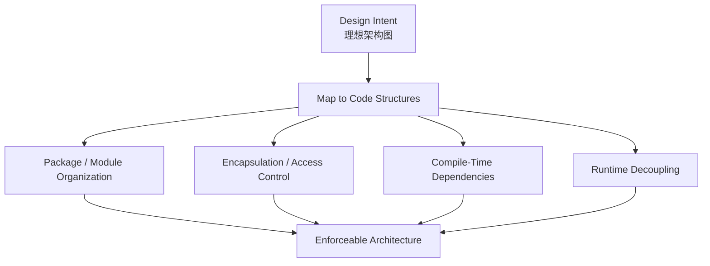

本章没有数学公式、数值计算或正式算法。它的“推导”是一系列结构对照：

- 保持相同五个 Java Type，只改变 Package；
- 再改变 Dependency Direction；
- 再引入 Component Facade；
- 最后移除 Package 外观，比较真实 Type Dependency；
- 通过 Access Modifier 恢复 Encapsulation；
- 再比较 Module 与 Source Tree 级别的隔离。

本笔记会沿原书顺序完整解释九幅图、四种组织方式、Newcomer 绕过 Service 的案例、Compiler Enforcement、C4 Component、Java Module System、Périphérique Anti-Pattern，以及最终的 Missing Advice。

## 1. 为什么这是 “The Missing Chapter”

### 1.1 前面原则还缺少什么

原则说明“应当怎样依赖”，却不自动决定：

- Package 怎样划分；
- Type 是否 `public`；
- Module 导出什么；
- Build Project 怎样拆；
- Compiler 能否阻止违规依赖。

### 1.2 最后一公里最容易失败

作者说，The Devil Is in the Implementation Details。

设计意图可能在最后一步被轻易破坏。

### 1.3 Architecture Diagram 不是 Architecture 的全部

一张图可以表达：

- 希望的 Boundary；
- 希望的 Dependency；
- 希望的 Responsibility。

但代码仍可能允许任意越界。

### 1.4 代码结构必须承载设计意图

真正的问题是：

> 如何让 Code Structure 与 Desired Design 对齐？

### 1.5 语言机制是 Architecture 工具

Java Access Modifier、Package、Module 不只是语法细节，也能形成 Architectural Constraint。

### 1.6 Build System 也是 Architecture 工具

Maven、Gradle、MSBuild 等可通过 Module / Project Dependency 限制 Source Dependency。

### 1.7 Compiler 比文档更严格

文档提醒开发者“不要这样做”；Compiler 可以让错误代码根本无法通过 Build。

### 1.8 本章的核心问题

> **你的架构原则是被工具强制执行，还是只存在于团队记忆中？**

## 2. Online Book Store 与 View Orders

### 2.1 案例系统

作者假设正在开发一个 Online Book Store。

### 2.2 目标 Use Case

Customer 能够 View the Status of Their Orders。

### 2.3 为什么选这个 Use Case

它足够简单，却同时涉及：

- Web Input；
- Business Logic；
- Persistent Data；
- Dependency Direction；
- Code Organization。

### 2.4 Java 是示例语言

原书使用 Java Class、Interface、Package 与 Access Modifier。

### 2.5 原则不局限于 Java

其他语言同样要回答：

- Visibility；
- Module Export；
- Assembly Boundary；
- Package Dependency；
- Build Graph。

### 2.6 暂时把 Clean Architecture 放在一边

作者先从常见代码组织方式开始，不直接宣布最终答案。

### 2.7 比较时保持业务问题不变

四种方案都实现同一个 `View Orders` Use Case。

### 2.8 比较时尽量保持 Type 不变

前两种方案使用相同的五个 Type，只改变 Package Placement。

### 2.9 这种比较为什么有效

控制业务和 Type 变量后，可以清楚观察：

- Organization 改变了什么；
- Dependency 改变了什么；
- Encapsulation 是否真的改变。

## 3. Package by Layer


### 3.1 什么是 Package by Layer

传统 Horizontal Layered Architecture 按技术职责组织代码。

### 3.2 水平切分

典型三层为：

- Web；
- Business Logic / Service；
- Data / Persistence。

### 3.3 为什么称为 Horizontal

一个业务 Use Case 的代码被横向分散到多个技术层。

### 3.4 Java 中怎样实现

每一层通常对应一个 Java Package。

### 3.5 示例 Package

- `com.mycompany.myapp.web`；
- `com.mycompany.myapp.service`；
- `com.mycompany.myapp.data`。

### 3.6 Strict Layered Architecture

严格分层要求每层只依赖紧邻的下一层。

### 3.7 Dependency Direction

Figure 34.1 中所有 Package Dependency 向下：

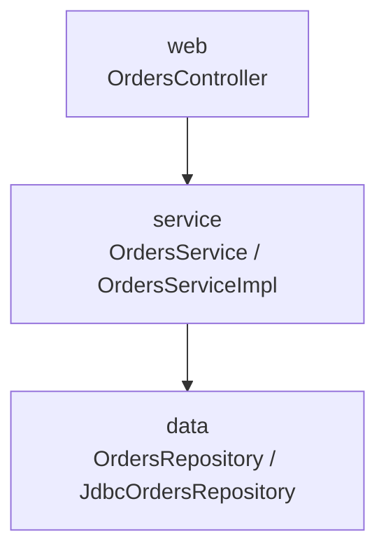

### 3.8 OrdersController

Web Controller，类似 Spring MVC Controller，处理 Web Request。

### 3.9 OrdersService

定义 Order 相关 Business Logic 的 Interface。

### 3.10 OrdersServiceImpl

`OrdersService` 的 Concrete Implementation。

### 3.11 命名旁注

原书脚注承认 `OrdersServiceImpl` 可能是糟糕的 Class Name。

它只说明“实现了某接口”，没有表达业务含义。

### 3.12 OrdersRepository

定义访问 Persistent Order Information 的 Interface。

### 3.13 JdbcOrdersRepository

使用 JDBC 实现 Repository Interface。

### 3.14 Runtime Call Chain

```text
OrdersController
    -> OrdersService
        -> OrdersServiceImpl
            -> OrdersRepository
                -> JdbcOrdersRepository
```

### 3.15 Interface 与 Implementation

Service 与 Repository 都用 Interface / Implementation Pair 表示。

### 3.16 分层解决什么问题

- Web 与 Persistence 不混在同一个 Class；
- 技术职责可定位；
- Dependency Graph 简单；
- 初始开发速度快。

### 3.17 为什么容易入门

它与常见 Request → Service → Database 心智模型一致。

## 4. Package by Layer 的收益与问题

### 4.1 Martin Fowler 的建议

原书引用 Martin Fowler 的 “Presentation Domain Data Layering”。

Fowler 认为 Layered Architecture 是一个不错的起点。

### 4.2 行业广泛采用

大量：

- Book；
- Tutorial；
- Training Course；
- Sample Code；

都推荐这种结构。

### 4.3 初始收益

不需要大量复杂设计即可快速启动项目。

### 4.4 三个 Bucket

原书称其为 **three large buckets of code**。

代码最初被放进：

- Web Bucket；
- Service Bucket；
- Repository Bucket。

### 4.5 规模增长后的问题

当系统规模和复杂度增加，三个巨大 Bucket 不足以表达内部模块。

### 4.6 Service Package 会怎样膨胀

所有业务领域的 Service 混在一起：

- Orders；
- Customers；
- Payments；
- Shipping。

### 4.7 Data Package 会怎样膨胀

所有 Repository 和 Database Adapter 混在同一个技术层。

### 4.8 Change Locality 差

修改 `View Orders` 可能需要跨：

- Web Package；
- Service Package；
- Data Package。

### 4.9 Top-Level Structure 不 Scream Domain

代码树首先告诉读者：

- 这里有 Web；
- 这里有 Service；
- 这里有 Repository。

却没有首先告诉读者系统是 Book Store。

### 4.10 两个不同领域看起来相同

把两个完全不同业务的 Layered Code Base 并排，顶层都可能是：

- `web`；
- `services`；
- `repositories`。

### 4.11 Architecture 不 Scream Business

这呼应前文 “Screaming Architecture”：顶层结构应暴露系统 Purpose。

### 4.12 还有一个更大的问题

作者暂时保留悬念：Layered Architecture 很容易被合法语法绕过。

这个问题会在 Package by Component 段落展开。

### 4.13 分层并非完全错误

它仍可以是：

- 小系统的起点；
- Component 内部的实现方式；
- 清楚的 Policy Separation。

问题在于只靠全局水平分层不足以形成业务模块和强 Encapsulation。

## 5. Package by Feature


### 5.1 什么是 Package by Feature

按 Related Feature、Domain Concept 或 Aggregate Root 组织代码。

### 5.2 Vertical Slicing

一个业务 Feature 所需的多种技术角色放在同一个 Vertical Slice 中。

### 5.3 DDD 术语

原书提到 Aggregate Root 作为可能的分组依据。

### 5.4 示例 Package

五个 Type 全部放入：

- `com.mycompany.myapp.orders`。

### 5.5 Type 没有改变

仍然是：

- OrdersController；
- OrdersService；
- OrdersServiceImpl；
- OrdersRepository；
- JdbcOrdersRepository。

### 5.6 只是一次简单 Refactoring

从三个技术 Package 移到一个 Feature Package。

### 5.7 Top-Level Structure 开始 Scream Domain

看到 `orders`，读者立即知道系统包含 Order 业务。

### 5.8 Change Locality 改善

`View Orders` Use Case 变化时，相关代码都在一个 Package 中。

### 5.9 代码查找更容易

不必在三个远隔的 Layer Package 之间跳转。

### 5.10 IDE 脚注边界

原书脚注承认，现代 IDE Navigation 会降低“文件更容易找”的重要性。

### 5.11 作者的幽默旁注

他提到 Lightweight Text Editor 再度流行，并自嘲可能太老而无法理解原因。

### 5.12 更重要的收益不是文件查找

Feature Package 让业务能力在 Source Tree 中成为一等结构。

### 5.13 常见迁移路径

团队发现 Horizontal Layering 问题后，会切换到 Vertical Package by Feature。

### 5.14 作者的评价

Simon Brown 认为 Package by Layer 和常见 Package by Feature 都是 Suboptimal。

### 5.15 为什么 Feature 方案仍不够

如果所有 Type 都在同一 Package 且全部 Public：

- 外部可直接调用 Repository；
- 内部层次不受保护；
- Package 只是文件夹。

### 5.16 Package by Feature 的图示

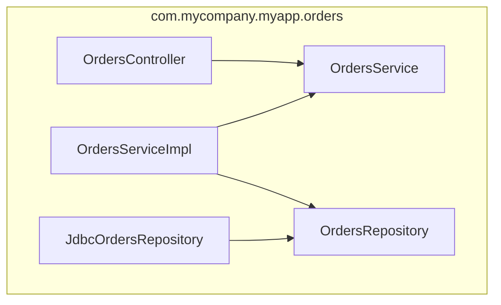

## 6. Layer 与 Feature 的第一轮比较

### 6.1 相同之处

- 同一 Use Case；
- 同一五个 Type；
- 同一调用关系；
- 同一 Interface / Implementation Pair。

### 6.2 不同之处

只有 Package Organization。

### 6.3 Layer 优先表达什么

Technical Function。

### 6.4 Feature 优先表达什么

Business Capability。

### 6.5 Layer 的 Change Locality

一个 Feature 分散在多个 Package。

### 6.6 Feature 的 Change Locality

一个 Feature 的相关 Type 集中在一个 Package。

### 6.7 两者都未自动改变 Dependency Rule

移动文件不会自动让 Domain 独立于 Infrastructure。

### 6.8 两者都未自动形成 Encapsulation

真正边界取决于 Type Visibility。

### 6.9 这一步的分析作用

作者先证明：Organization 能改善可读性，但还不能保证 Architecture。

## 7. Ports and Adapters


### 7.1 相关名称

原书列出：

- Ports and Adapters；
- Hexagonal Architecture；
- Boundaries, Controllers, Entities。

### 7.2 共同目标

让 Business / Domain Code 独立于 Technical Implementation Details。

### 7.3 需要隔离的 Details

- Framework；
- Database；
- UI；
- Third-Party Integration。

### 7.4 Inside

包含 Domain Concepts 与稳定 Business Policy。

### 7.5 Outside

包含与 Outside World 的交互机制。

### 7.6 Major Rule

> **Outside depends on Inside, never the other way around.**

### 7.7 同心圆直觉

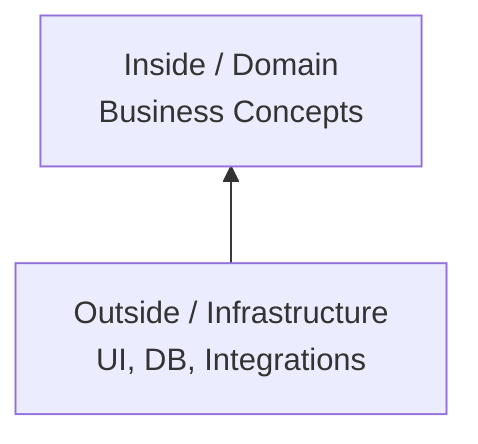

### 7.8 依赖方向为什么重要

Technical Detail 变化不应迫使 Domain Code 修改。

### 7.9 Port

Inside 定义自己需要或提供的 Contract。

### 7.10 Adapter

Outside 实现或调用这些 Contract，把具体技术转换成 Domain Language。

### 7.11 与 Clean Architecture 的关系

二者都要求 Source Dependency 指向更高层 Policy。

### 7.12 与 Package by Feature 的区别

Feature Grouping 只说明代码放在一起；Ports and Adapters 进一步规定 Inside / Outside Dependency Direction。

## 8. Ports and Adapters 的 View Orders 实现


### 8.1 Package 划分

- `com.mycompany.myapp.web`；
- `com.mycompany.myapp.domain`；
- `com.mycompany.myapp.database`。

### 8.2 Domain 是 Inside

Domain Package 包含：

- OrdersService；
- OrdersServiceImpl；
- Orders。

### 8.3 Web 是 Outside

OrdersController 位于 Web Package。

### 8.4 Database 是 Outside

JdbcOrdersRepository 位于 Database Package。

### 8.5 Dependency 向 Inside 流动

- Web Controller 依赖 OrdersService；
- Database Adapter 实现 Domain 定义的 Orders Interface。

### 8.6 OrdersRepository 被重命名为 Orders

这是图中一个容易忽略的重要变化。

### 8.7 为什么去掉 Repository 后缀

Inside 应使用 Ubiquitous Domain Language。

### 8.8 Domain 讨论中的自然语言

领域专家通常谈 “Orders”，不是 “Orders Repository”。

### 8.9 名称反映 Owner

`Orders` 是 Domain 所需的能力，不应以外部 Persistence Mechanism 命名。

### 8.10 JdbcOrdersRepository 的位置

它可以保留技术名称，因为它属于 Outside Adapter。

### 8.11 Runtime 与 Source Dependency

Runtime 中 Domain 可能调用 Persistence Adapter；Source Code 中 Adapter 实现 Domain Port。

### 8.12 简化依赖图

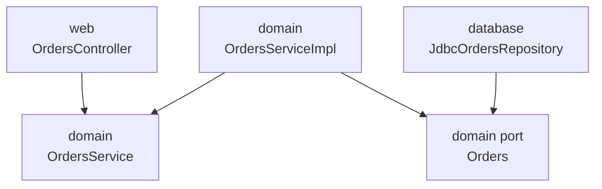

### 8.13 Figure 34.4 是简化图

原书明确说缺少：

- Interactor；
- 跨 Dependency Boundary 的 Data Marshalling Object。

### 8.14 为什么简化

保持比较聚焦在 Package 与 Dependency Direction。

### 8.15 不应误读为完整模板

真实实现还要处理：

- Request / Response Model；
- Mapping；
- Transaction；
- Error；
- Authorization。

## 9. Package by Component

### 9.1 作者为何提出第四种方案

Simon Brown 赞同本书关于：

- SOLID；
- REP；
- CCP；
- CRP；

的大部分内容，却对 Code Organization 得出略有不同的结论。

### 9.2 经验背景

他长期开发 Enterprise Software，主要使用 Java，跨多个 Business Domain。

### 9.3 技术背景多样

这些系统包括：

- Web-Based；
- Client–Server；
- Distributed；
- Message-Based；
- 其他形态。

### 9.4 共同主题

多数系统仍基于 Traditional Layered Architecture。

### 9.5 Layered Architecture 的目的

分开相同 Technical Function 的 Code：

- Web；
- Business Logic；
- Data Access。

### 9.6 Package 与 Layer

在 Java 实现中，一个 Layer 通常就是一个 Package。

### 9.7 跨 Package 依赖要求 Public

OrdersController 要访问 OrdersService，后者必须为 `public`。

### 9.8 Repository Interface 也必须 Public

OrdersServiceImpl 位于另一个 Package，要看到 OrdersRepository，因此该 Interface 也必须 `public`。

### 9.9 Public Surface 扩大

任何能 Import 这些 Public Type 的代码都可能绕过预期路径。

### 9.10 Strict Layered Rule

每层只依赖相邻下一层，以形成 Clean、Acyclic Dependency Graph。

### 9.11 Acyclic 不等于正确

即使依赖图无环，仍可能存在不希望的跨层依赖。

### 9.12 “Cheat” 的可能

开发者可以添加绕过 Business Layer 的依赖，箭头依然向下，图仍然 Acyclic。

## 10. Newcomer 案例与 Relaxed Layered Architecture


### 10.1 新成员加入团队

团队招聘一位新人，并让他实现另一个 Order-Related Use Case。

### 10.2 新人的目标

尽快完成任务，留下好印象。

### 10.3 第一个发现

已有 OrdersController，新的 Order Web Page 看起来适合放在那里。

### 10.4 第二个需求

页面需要从 Database 获取 Order Data。

### 10.5 第三个发现

已有 OrdersRepository Interface。

### 10.6 快捷实现

把 Repository Implementation 通过 Dependency Injection 直接注入 Controller。

### 10.7 功能结果

几分钟后页面可以工作。

### 10.8 架构结果

OrdersController 同时依赖：

- OrdersService；
- OrdersRepository。

### 10.9 Service 被绕过

某些 Use Cases 不再经过 Business Logic Layer。

### 10.10 依赖箭头仍向下

因此图仍然 Acyclic，看起来没有违反“只向下依赖”的粗略规则。

### 10.11 Relaxed Layered Architecture

允许 Layer 跳过相邻 Layer 的组织方式，通常被称为 Relaxed Layered Architecture。

### 10.12 Strict 与 Relaxed 对比

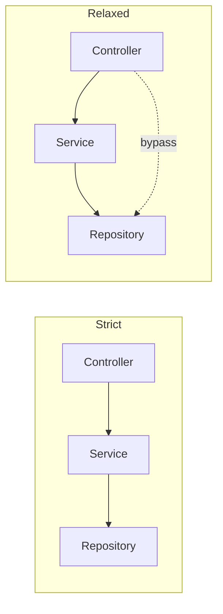

### 10.13 跳层并非永远错误

原书给出 CQRS 作为可能的合理场景。

### 10.14 CQRS

Command Query Responsibility Segregation 分离：

- Update Model；
- Read Model。

### 10.15 Read Path 可能有意直达 Query Mechanism

如果明确设计为独立 Read Model，绕过写入 Business Logic 可能合理。

### 10.16 关键是 Intentional Architecture

有意设计的 Query Path 与为了赶进度随手绕过 Service 不是同一件事。

### 10.17 为什么常常危险

Business Layer 可能负责：

- Authorized Access；
- Record-Level Permission；
- Business Filter；
- Audit；
- Invariant。

### 10.18 直接 Repository 的安全风险

Controller 可能返回调用者无权看到的 Order Record。

### 10.19 功能正确不等于架构正确

页面能显示数据，不代表：

- 授权正确；
- Policy 正确；
- Boundary 正确；
- 后续可维护。

### 10.20 作者的咨询观察

这种情况在真实团队中经常发生。

### 10.21 问题何时暴露

团队第一次 Visualize Real Code Base 时，才发现实际依赖不同于 Architecture Slide。

## 11. 怎样阻止 Controller 直接访问 Repository

### 11.1 所需原则

> **Web Controllers should never access Repositories directly.**

### 11.2 原则本身不够

真正问题是 Enforcement。

### 11.3 方案一：Discipline

依靠开发者自觉遵守。

### 11.4 方案二：Code Review

由 Reviewer 发现越界 Dependency。

### 11.5 团队常见说法

“我们信任开发者，通过 Discipline 和 Review 执行 Architecture。”

### 11.6 为什么会失效

当以下压力增加时：

- Budget；
- Deadline；
- Staff Turnover；
- Emergency Fix；
- Knowledge Gap。

### 11.7 信任与防护并不冲突

Compiler Guardrail 不是不信任开发者，而是减少认知负担和偶然错误。

### 11.8 方案三：Static Analysis

原书列举：

- NDepend；
- Structure101；
- Checkstyle。

### 11.9 Static Rule 示例

```text
Types in package **/web must not access types in **/data.
```

### 11.10 执行时机

原书描述这些规则常在 Compilation 后执行。

### 11.11 优点

- 自动发现；
- 可 Fail Build；
- Architecture Rule 可版本化；
- 不依赖 Reviewer 记忆。

### 11.12 粗糙之处

Regex / Wildcard 可能：

- 误报；
- 漏报；
- 依赖命名；
- 无法理解语义。

### 11.13 两种方案都 Fallible

Discipline / Review 会遗漏，Post-Compilation Tool 也可能配置不完整。

### 11.14 Feedback Loop 太长

违规代码可能直到：

- Review；
- CI；
- Post-Compile Check；

才被发现。

### 11.15 Big Ball of Mud

长期不受约束，Code Base 可能退化成 Big Ball of Mud。

### 11.16 作者的偏好

> **If possible, use the compiler to enforce the architecture.**

### 11.17 为什么 Compiler 更好

- 违规立即无法编译；
- Feedback 更短；
- Rule 精确；
- 每个开发环境一致；
- 不需要额外记忆。

### 11.18 Enforcement 强度阶梯

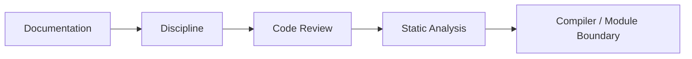

### 11.19 不是只能选一个

成熟团队可以组合：

- Compiler 防止结构违规；
- Static Analysis 检查更复杂规则；
- Review 判断业务语义；
- Documentation 解释理由。

## 12. Package by Component 的结构


### 12.1 Hybrid Approach

Package by Component 吸收前面方案的部分优点。

### 12.2 核心目标

把一个 Coarse-Grained Component 的全部相关责任放进同一个 Java Package。

### 12.3 Service-Centric View

从业务服务能力而非全局技术层看系统。

### 12.4 UI 仍然分离

与 Ports and Adapters 一样，Web 只是 Delivery Mechanism。

### 12.5 示例 Package

- Web Package：OrdersController；
- Orders Package：OrdersComponent 及内部实现。

### 12.6 唯一外部入口

Controller 只依赖 `OrdersComponent` Interface。

### 12.7 Component 内部

- OrdersComponentImpl；
- OrdersRepository；
- JdbcOrdersRepository。

### 12.8 业务与 Persistence 被同包封装

它们属于一个 Orders Component，但仍保持内部 Separation of Concerns。

### 12.9 Consumer 不需要知道内部结构

外部只看到 OrdersComponent。

### 12.10 依赖图

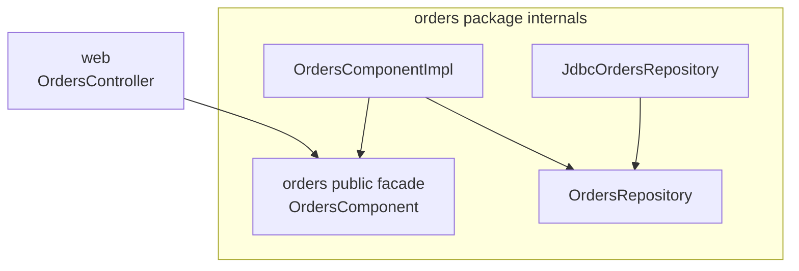

### 12.11 为什么 Repository 放在同一 Component

Persistence Mechanism 是 Orders Capability 的内部实现细节，不必向整个 Application 公开。

### 12.12 Component Interface 是 Facade

它定义外部能对 Orders 做什么。

### 12.13 与 Package by Feature 的区别

普通 Feature Package 可能把所有 Type 都公开；Package by Component 强调一个小 Public API 和隐藏实现。

### 12.14 与 Ports and Adapters 的关系

内部仍可使用 Port / Adapter 分离 Business Logic 与 Persistence，只是不把每个内部边界都暴露给全系统。

### 12.15 Component 是 Encapsulation Unit

不是简单把相关文件放在同一目录，而是隐藏内部协作关系。

## 13. 两种 Component 定义

### 13.1 Uncle Bob 的定义

前文把 Component 定义为 Unit of Deployment。

### 13.2 Java 对应物

最小可部署实体是 `.jar`。

### 13.3 Simon Brown 的定义

> 一组相关功能，位于清晰 Interface 后，并存在于 Application 等 Execution Environment 中。

### 13.4 两种定义关注点不同

- Uncle Bob：Deployment / Packaging；
- Simon Brown：Logical Encapsulation / Static Structure。

### 13.5 C4 Model

Simon Brown 的定义来自 C4 Software Architecture Model。

### 13.6 C4 层次

原书用 **containers、components and classes (or code)** 描述这些静态结构层次：

- Software System；
- Container；
- Component；
- Class / Code。

### 13.7 C4 中的 Container

可包括：

- Web Application；
- Mobile App；
- Stand-Alone Application；
- Database；
- File System。

### 13.8 Container 包含 Components

每个 Component 再由一个或多个 Class / Code Element 实现。

### 13.9 Component 是否独立 `.jar`

在 C4 定义中，这是 Orthogonal Concern。

### 13.10 Orthogonal 的含义

Logical Component Boundary 与 Physical Packaging 可以独立决策。

### 13.11 两种定义不必互斥

一个 C4 Component 也可以在需要时映射为独立 `.jar`。

### 13.12 避免术语争论

使用 “Component” 时应说明：

- 逻辑边界；
- 编译边界；
- 部署边界；

究竟指哪一种。

## 14. Package by Component 的价值与边界

### 14.1 One Place to Go

任何需要处理 Orders 的代码只需访问 OrdersComponent。

### 14.2 小 Public Surface

外部不能直接看到 OrdersRepository 或其实现。

### 14.3 内部 Separation 仍存在

Business Logic 与 Data Persistence 并未混成一个 Method。

### 14.4 内部分层是 Implementation Detail

Consumer 不依赖内部 Layer。

### 14.5 Change Locality

Order Capability 的实现集中在一个 Component 内。

### 14.6 强化业务结构

Top-Level Package 体现 Orders，而不是全局 Service / Data Bucket。

### 14.7 与 Microservices 的相似性

每个业务能力有清晰 Interface 并封装内部实现。

### 14.8 与 SOA 的相似性

类似独立 OrdersService 封装所有 Order Handling。

### 14.9 关键区别是 Decoupling Mode

Package by Component 可以仍在 Monolithic Application 内：

- 同进程；
- 同 Source Tree；
- Compiler-Enforced Package Boundary。

### 14.10 Microservice 使用更强物理边界

通常通过 Network / Process 隔离。

### 14.11 Stepping Stone

Well-Defined Monolithic Component 可以成为未来 Microservices 的踏脚石。

### 14.12 不是必须演化成 Microservice

如果没有独立部署需求，保持 Modular Monolith 往往更简单。

### 14.13 组件边界先于网络边界

先证明 Business Capability 与 Dependency 能独立，再考虑 Distributed Deployment。

### 14.14 Package by Component 的主要限制

Java Package 只有单层 Package-Private Visibility，复杂 Component 可能需要更多 Module / Source Boundary。

### 14.15 同包内部仍可能混乱

Compiler 只能阻止 Package 外越界，不能自动保证内部设计优良。

### 14.16 Component Facade 可能变成 God Interface

若把所有 Orders 行为塞进巨大 Interface，也会失去 Use Case 清晰度。

### 14.17 需要按业务 Cohesion 控制粒度

Coarse-Grained 不等于无限大。

## 15. The Devil Is in the Implementation Details

### 15.1 四种方案表面不同

- Package by Layer；
- Package by Feature；
- Ports and Adapters；
- Package by Component。

### 15.2 可以视为四种 Architectural Styles

它们的：

- Package；
- Dependency；
- Conceptual Boundary；

看起来不同。

### 15.3 Implementation 错误会让差异瓦解

如果没有正确使用 Language Encapsulation，图中的边界不是真实边界。

### 15.4 最常见错误

在 Java 中过度使用 `public` Access Modifier。

### 15.5 Muscle Memory

开发者常本能地给 Class、Interface、Method 加 `public`，没有先判断是否需要暴露。

### 15.6 这种倾向普遍存在

原书建议查看：

- Book Samples；
- Tutorials；
- Open-Source Frameworks on GitHub。

### 15.7 与架构风格无关

无论声称使用：

- Horizontal Layer；
- Vertical Layer；
- Ports and Adapters；
- 其他 Architecture；

都可能犯同样错误。

### 15.8 全部 Public 的后果

语言无法阻止其他代码直接实例化 Concrete Implementation。

### 15.9 Intended Style 被绕过

Developer 可以合法编译出违反 Architecture Diagram 的依赖。

### 15.10 关键结论

> **Architecture Style 必须被 Implementation Strategy 支撑。**

## 16. Organization versus Encapsulation

### 16.1 Package 的两种角色

- Organization；
- Encapsulation。

### 16.2 Organization

像 Folder 一样把相关文件放在一起，便于浏览和命名。

### 16.3 Encapsulation

隐藏 Internal Type，只暴露刻意选择的 Public Contract。

### 16.4 所有 Type Public 时

Package 只剩 Organization 功能。

### 16.5 为什么 Package 可被忽略

Public Type 可从 Code Base 任何位置使用，Package 不再阻止依赖。

### 16.6 Architecture Style 失去实际差异

如果忽略 Package，四种方案只剩相同的 Type Dependency Graph。

### 16.7 Figure 34.7 的实验

作者拿掉 Package Box，只保留 Type 与 Arrow。


### 16.8 四列图的箭头相同

尽管 Package 布局不同，Type 间 Dependency 实质一致。

### 16.9 Conceptually Different

四种方案在概念上不同。

### 16.10 Syntactically Identical

若所有 Type 都可互访，语言层面却相同。

### 16.11 更尖锐的判断

它们可能只是描述 Traditional Horizontal Layered Architecture 的四种画法。

### 16.12 作者的反讽

“当然没人会把所有 Java Type 都设为 Public，除非他们真的这样做，而我见过。”

### 16.13 设计意图与可编译状态

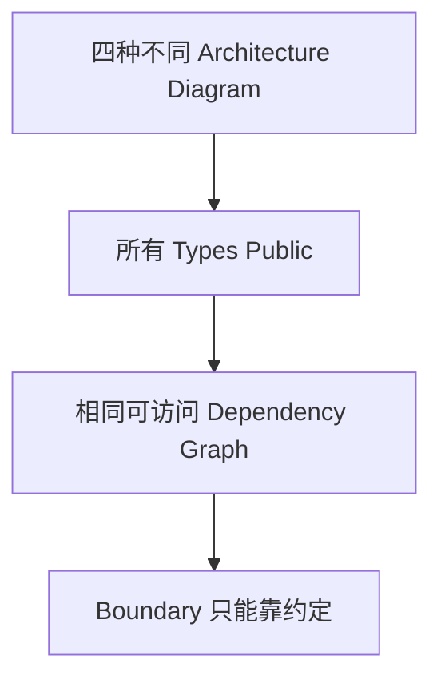

### 16.14 结论

Folder Structure 可以传达意图，Visibility 才能建立强制边界。

## 17. Figure 34.8：逐种收紧可见性


### 17.1 Java Access Modifier 并不完美

但忽视它们是在主动制造风险。

### 17.2 图中的灰色 Type

表示 Access Modifier 可以更严格，不需要对全系统 Public。

### 17.3 Java 的准确术语

原书使用 “package protected”；Java 更常称：

- Package-Private；
- Default Access。

即省略 Access Modifier。

### 17.4 Package by Layer 的 Public Types

必须 Public：

- OrdersService；
- OrdersRepository。

### 17.5 为什么 OrdersService 必须 Public

OrdersController 位于 Web Package，需要从外部 Package 访问它。

### 17.6 为什么 OrdersRepository 必须 Public

OrdersServiceImpl 位于 Service Package，需要访问 Data Package 中的 Interface。

### 17.7 Package by Layer 的 Hidden Types

可 Package-Private：

- OrdersServiceImpl；
- JdbcOrdersRepository。

### 17.8 为什么 Implementation 可隐藏

外部只需依赖 Interface，不需要知道 Concrete Class。

### 17.9 Layer 方案仍暴露 Repository Port

任何能访问 Public OrdersRepository 的 Package 都可能尝试绕过 Service。

### 17.10 Package by Feature 的 Public Type

OrdersController 可作为 Package 唯一 Entry Point。

### 17.11 Package by Feature 的 Hidden Types

其余全部可以 Package-Private：

- OrdersService；
- OrdersServiceImpl；
- OrdersRepository；
- JdbcOrdersRepository。

### 17.12 Feature 方案的 Caveat

Package 外任何 Order-Related Access 都必须经过 Controller。

### 17.13 为什么可能不理想

其他 Delivery Mechanism 或 Internal Component 可能不应通过 Web Controller 使用 Orders。

### 17.14 Ports and Adapters 的 Public Types

必须 Public：

- OrdersService；
- Orders。

### 17.15 为什么 OrdersService Public

Web Controller 位于外部 Package，需要调用 Inbound Port。

### 17.16 为什么 Orders Public

Database Adapter 位于外部 Package，需要实现 Outbound Port。

### 17.17 Ports and Adapters 的 Hidden Types

可 Package-Private：

- OrdersServiceImpl；
- JdbcOrdersRepository。

### 17.18 Runtime Dependency Injection

Hidden Concrete Implementations 可由 Composition Root 通过适当 Factory / DI 组装。

### 17.19 Package by Component 的 Public Type

只需：

- OrdersComponent。

### 17.20 为什么只需一个 Public Type

Controller 对 Orders Package 的唯一 Inbound Dependency 指向 Component Facade。

### 17.21 Package by Component 的 Hidden Types

- OrdersComponentImpl；
- OrdersRepository；
- JdbcOrdersRepository。

### 17.22 Compiler-Enforced Rule

Package 外代码无法直接使用 OrdersRepository Interface 或 Implementation。

### 17.23 Repository 绕过变成 Compile Error

新人即使想把 Repository 注入 Controller，也无法 Import 不可见 Type。

### 17.24 Public Types 越少

Potential Dependencies 越少。

### 17.25 最小 Public API 的价值

- 更强 Encapsulation；
- 更小 Compatibility Surface；
- 更少误用；
- 更容易理解 Component Contract。

### 17.26 四种可见性对比

| Style | 必须对外 Public | 可隐藏的实现 |
|---|---|---|
| Package by Layer | OrdersService、OrdersRepository | OrdersServiceImpl、JdbcOrdersRepository |
| Package by Feature | OrdersController | 其余四个 Type |
| Ports and Adapters | OrdersService、Orders | OrdersServiceImpl、JdbcOrdersRepository |
| Package by Component | OrdersComponent | OrdersComponentImpl、OrdersRepository、JdbcOrdersRepository |

### 17.27 `.NET internal`

.NET 可以使用 `internal` 达到类似目的。

### 17.28 .NET 的额外条件

若要按 Component 隔离，需要为每个 Component 建立独立 Assembly。

### 17.29 Reflection 例外

原书脚注承认 Java Reflection 可以作弊绕过限制，并明确劝读者不要这样做。

### 17.30 语言边界不是安全沙箱

Access Modifier 主要保护设计与协作，不应被视为抵御恶意代码的 Security Boundary。

## 18. Compiler Enforcement 与 Monolithic Application

### 18.1 原书讨论的上下文

一个 Monolithic Application，所有 Code 位于单一 Source Code Tree。

### 18.2 Monolith 不等于 Big Ball of Mud

单一部署可以拥有严格 Component Boundary。

### 18.3 Package by Component 的适用性

特别适合在 Monolith 内建立业务模块。

### 18.4 为什么 Compiler 优于 Self-Discipline

违规依赖不能进入可编译状态。

### 18.5 为什么 Compiler 优于 Post-Compilation Tool

Feedback 更早，并直接利用 Language Semantics。

### 18.6 Compiler 不能做什么

不能判断：

- Interface 是否具有好业务语义；
- Component 粒度是否合理；
- Policy 是否放错层；
- Data Model 是否耦合。

### 18.7 Compiler 是 Guardrail，不是 Architect

人负责决定 Rule，Compiler 负责执行可形式化的部分。

### 18.8 最佳组合

- Design 明确边界；
- Access Modifier 强制可见性；
- Build Module 强制 Dependency；
- Static Analysis 检查高级规则；
- Review 检查语义。

### 18.9 Modular Monolith

现代常用名称是 Modular Monolith：

- 单进程部署；
- 业务 Component 清晰；
- Public API 小；
- 内部实现隐藏；
- 可为未来拆分保留选项。

### 18.10 不要因 Monolith 而放弃 Boundary

Source Code Boundary 与 Runtime Topology 是两项独立决策。

## 19. Other Decoupling Modes

### 19.1 Access Modifier 不是唯一手段

语言和生态通常提供其他 Source Dependency Decoupling Mode。

### 19.2 Java Module Framework

原书提到：

- OSGi；
- Java 9 Module System。

### 19.3 历史语境

原书写作时 Java 9 Module System 还是新工具；今天通常称 JPMS，已经是正式平台能力。

### 19.4 Public 与 Published 的区别

Module System 可以让 Type：

- 在 Module 内是 `public`；
- 但不 Export 给其他 Module。

### 19.5 为什么有价值

Java Package-Private 有时不足以组织大型 Component，Module Export 提供更高层 Encapsulation。

### 19.6 Orders Module 示例

Module 内所有 Type 可以 Public，外部只看到少量 Published Type。

### 19.7 简化 `module-info.java`

```java
module myapp.orders {
    exports com.mycompany.myapp.orders.api;
}
```

### 19.8 代码含义

只有 `orders.api` Package 被 Export；内部 Package 即使包含 Public Class，其他 Module 也不能普通访问。

### 19.9 OSGi / JPMS 的代价

- Module Configuration；
- Split Package 限制；
- Reflection / Framework Compatibility；
- Build Complexity；
- Team Learning。

### 19.10 作者的希望

Module System 能帮助构建更好的软件，并重新激发 Design Thinking。

## 20. 三个 Source Code Trees

### 20.1 更强的 Source-Level Decoupling

把代码拆到不同 Source Tree / Build Project。

### 20.2 Ports and Adapters 的三树方案

1. Business / Domain；
2. Web；
3. Data Persistence。

### 20.3 Domain Tree

包含：

- OrdersService；
- OrdersServiceImpl；
- Orders。

### 20.4 Web Tree

包含：

- OrdersController。

### 20.5 Persistence Tree

包含：

- JdbcOrdersRepository。

### 20.6 Compile-Time Dependency

- Web → Domain；
- Persistence → Domain；
- Domain 不知道 Web；
- Domain 不知道 Persistence。

### 20.7 图示

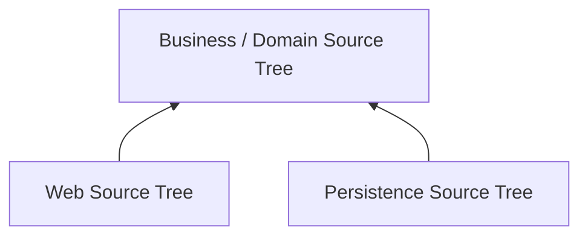

### 20.8 Build Tool 实现

原书列举：

- Maven；
- Gradle；
- MSBuild。

### 20.9 理想目标

每一个 Application Component 都有独立 Source Code Tree。

### 20.10 为什么更强

无法声明未配置的 Compile Dependency，越界在 Build Graph 层被阻止。

### 20.11 为什么是 Idealistic Solution

过多 Source Tree 会带来现实成本。

### 20.12 Performance Cost

Build、Test 和 Dependency Resolution 可能变慢。

### 20.13 Complexity Cost

Module Graph、Version、Configuration 更复杂。

### 20.14 Maintenance Cost

需要维护更多：

- Build File；
- Release Metadata；
- Dependency Version；
- CI Job。

### 20.15 粒度选择

不要因为“一个 Component 一个 Project”听起来纯粹，就忽略项目规模和团队能力。

### 20.16 合理策略

对高价值 Boundary 使用 Build Module，对小型内部细节使用 Package Visibility。

## 21. 两个 Source Code Trees 与 Périphérique Anti-Pattern


### 21.1 简化方案

只建立：

- Domain / Inside；
- Infrastructure / Outside。

### 21.2 Compile-Time Dependency

Infrastructure → Domain。

### 21.3 这与同心圆图高度一致

视觉上清楚表达 Outside 依赖 Inside。

### 21.4 方案可以工作

作者没有否定这种 Organization。

### 21.5 潜在 Trade-Off

所有 Infrastructure 被放进一个 Source Tree。

### 21.6 Périphérique Anti-Pattern

Simon Brown 称其为 Ports and Adapters 的 Périphérique Anti-Pattern。

### 21.7 名称来源

巴黎有环城道路 Boulevard Périphérique。

### 21.8 环路的功能

可以绕着 Paris 行驶，而不进入复杂 City Center。

### 21.9 Architecture 类比

Infrastructure 代码可以沿“外环”从一个区域直接访问另一个区域，而不经过 Domain。

### 21.10 具体危险路径

Web Controller 直接调用 Database Repository。

### 21.11 为什么两树方案允许绕行

Web 与 Database 都在同一个 Infrastructure Module，Build System 无法阻止它们互相访问。

### 21.12 Access Modifier 会放大或缓解风险

若 Repository 还是 Public，绕行尤其容易。

### 21.13 Périphérique 图示

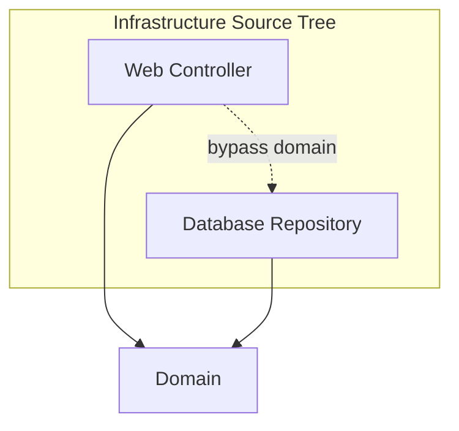

### 21.14 解决方式一

把 Web 和 Persistence 拆成不同 Build Module。

### 21.15 解决方式二

利用严格 Access Modifier / Module Export 限制可见性。

### 21.16 解决方式三

添加 Architecture Test / Static Analysis 作为补充。

### 21.17 关键教训

“Outside 依赖 Inside”还不够；不同 Outside Adapter 之间也可能产生不希望的耦合。

## 22. Conclusion: The Missing Advice

### 22.1 本章整体目的

提醒读者：忽略 Implementation Strategy，会在瞬间毁掉最佳 Design Intention。

### 22.2 把 Design 映射到 Code Structure

需要明确：

- Package；
- Namespace；
- Module；
- Project；
- Assembly；
- Source Tree。

### 22.3 思考 Code Organization

代码位置应表达：

- Business Capability；
- Policy Boundary；
- Public Contract；
- Internal Detail。

### 22.4 思考 Decoupling Modes

分别考虑：

- Runtime；
- Compile Time。

### 22.5 Runtime Decoupling

可通过：

- Function Call；
- Dependency Injection；
- Plugin；
- Process；
- Message；
- Network。

### 22.6 Compile-Time Decoupling

可通过：

- Access Modifier；
- Package；
- Module Export；
- Separate Project；
- Dependency Graph。

### 22.7 Leave Options Open

在适当位置保留未来改变 Package / Deployment / Decoupling Mode 的选择。

### 22.8 Be Pragmatic

不要为了架构纯度无条件增加复杂度。

### 22.9 Team Size

小团队与大型团队需要的 Boundary Enforcement 不同。

### 22.10 Skill Level

过于复杂的 Module Strategy 若团队无法维护，会适得其反。

### 22.11 Solution Complexity

简单系统不需要与大型 Enterprise System 相同的分解。

### 22.12 Time Constraint

Architecture Investment 必须考虑交付时间。

### 22.13 Budget Constraint

每个 Build Module、Adapter 和 Test 都有成本。

### 22.14 使用 Compiler

尽可能让 Compiler 帮助执行选定 Architecture Style。

### 22.15 关注其他 Coupling

原书特别提醒 Data Model 也可能造成 Coupling。

### 22.16 代码边界不能掩盖 Data Coupling

两个 Component 即使源码独立，共享 Database Schema 仍可能锁步变化。

### 22.17 最终原句

> **The devil is in the implementation details.**

## 23. 作者如何形成解决思路

### 23.1 先承认前文原则正确

作者并非推翻 Clean Architecture，而是补足 Implementation Advice。

### 23.2 选取最小可比较 Use Case

Online Book Store 的 View Orders 足以展示三层协作。

### 23.3 从最常见方案开始

Package by Layer 是行业最熟悉、最容易启动的起点。

### 23.4 公平承认其收益

快速、简单、低初始复杂度。

### 23.5 再展示规模问题

三个大型 Technical Buckets 不表达 Domain，也难以继续模块化。

### 23.6 只改变 Package 进行对照

Package by Feature 保持 Type 不变，证明 Business-Oriented Organization 能改善 Screaming Architecture。

### 23.7 指出 Organization 仍不够

Feature Package 没有自动建立 Domain Independence 或 Encapsulation。

### 23.8 引入 Dependency Direction

Ports and Adapters 明确 Outside → Inside。

### 23.9 用 Ubiquitous Language 调整 Port

`OrdersRepository` 改为 `Orders`，说明 Inside Contract 应属于 Domain。

### 23.10 回到 Layered Architecture 的真实缺陷

Public Interface 让 Controller 可以合法跳过 Service。

### 23.11 用 Newcomer 故事说明激励

开发者并非故意破坏 Architecture，只是在 Deadline 下选择最短路径。

### 23.12 承认 CQRS 例外

跳层有时是 Intentional Design，因此不能只靠“箭头必须相邻”的口号。

### 23.13 比较 Enforcement 方法

- Discipline；
- Code Review；
- Static Analysis；
- Compiler。

### 23.14 选择最短 Feedback Loop

Compiler 能在违规依赖形成时立即拒绝。

### 23.15 提出 Component Facade

让 OrdersComponent 成为唯一 Public Entry Point，把 Repository 隐藏在同包内部。

### 23.16 澄清 Component Definition

逻辑 C4 Component 与 Deployable `.jar` 是不同维度。

### 23.17 进行最关键的消融实验

移除 Package Box 后，四种方案在 All-Public 情况下拥有相同箭头。

### 23.18 由此证明根因

Package Organization 只有与 Access Control 结合，才形成 Encapsulation。

### 23.19 逐种恢复 Visibility

Figure 34.8 展示每种 Style 最小 Public Surface。

### 23.20 再提升 Decoupling 强度

从 Package Access 扩展到 JPMS 与 Separate Source Trees。

### 23.21 主动指出新风险

只有 Domain / Infrastructure 两棵树会产生 Périphérique 绕行。

### 23.22 最终回到 Pragmatism

没有唯一组织方案；需要结合团队、复杂度、时间与预算选择。

### 23.23 完整推理链

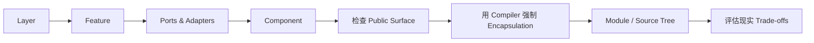

## 24. 四种方案的系统比较

### 24.1 Package by Layer

**主要组织轴：** Technical Role。

### 24.2 Layer 优点

- 简单；
- 熟悉；
- 快速启动；
- Dependency Graph 直观。

### 24.3 Layer 缺点

- 不 Scream Domain；
- Feature 分散；
- Package 膨胀；
- Repository Interface 必须 Public；
- 容易 Relaxed Layer Bypass。

### 24.4 Package by Feature

**主要组织轴：** Feature / Domain Concept。

### 24.5 Feature 优点

- Scream Domain；
- Change Locality 好；
- 可以隐藏大量内部 Type。

### 24.6 Feature 缺点

- 常见版本只移动文件；
- 内部 Dependency Rule 不一定清楚；
- Controller 作为唯一 Entry Point 可能过度 Web-Centric。

### 24.7 Ports and Adapters

**主要组织轴：** Inside / Outside 与 Dependency Direction。

### 24.8 Ports and Adapters 优点

- Domain 独立；
- Technical Detail 可替换；
- Contract 使用 Domain Language；
- 易测试。

### 24.9 Ports and Adapters 缺点

- Public Inbound / Outbound Ports 较多；
- Mapping 与 Composition 成本；
- 两树实现可能产生 Périphérique Bypass。

### 24.10 Package by Component

**主要组织轴：** Coarse-Grained Business Component 与 Public Facade。

### 24.11 Component 优点

- 最小 Public Surface；
- Compiler-Enforced Repository Hiding；
- Consumer 只知道 Component Contract；
- 适合作为 Modular Monolith。

### 24.12 Component 缺点

- 同包内部仍需良好设计；
- Facade 可能膨胀；
- Java Package Visibility 对复杂模块有限；
- 需决定 Component 粒度。

### 24.13 对比表

| 维度 | By Layer | By Feature | Ports & Adapters | By Component |
|---|---|---|---|---|
| 顶层表达 | 技术层 | 业务 Feature | Inside / Outside | 业务 Component |
| Domain 可见性 | 弱 | 较强 | 强 | 强 |
| 核心依赖方向 | 向下 | 未必明确 | Outside → Inside | Consumer → Facade |
| 最小 Public Surface | Service、Repository Port | Controller | Inbound、Outbound Ports | Component Facade |
| 防止 Controller 直调 Repository | 弱 | 可通过同包设计，但入口受限 | 视 Module 划分而定 | 强 |
| 典型部署 | Monolith | Monolith | 任意 | Modular Monolith / 可演化 |

### 24.14 没有绝对赢家

选择取决于：

- Product；
- Team；
- Language；
- Build System；
- Change Pattern；
- Cost。

### 24.15 作者个人偏好

Simon Brown 倾向 Package by Component，因为它用较小 Public API 和 Compiler 保护 Monolith 内的业务边界。

## 25. Java 可执行边界示例

### 25.1 目标

让 Web 只能调用 OrdersComponent，无法直接调用 Repository。

### 25.2 Public Facade

```java
package com.mycompany.myapp.orders;

public interface OrdersComponent {
    OrderStatus viewOrderStatus(OrderId orderId);
}
```

### 25.3 Package-Private Implementation

```java
package com.mycompany.myapp.orders;

final class OrdersComponentImpl implements OrdersComponent {
    private final OrdersRepository repository;

    OrdersComponentImpl(OrdersRepository repository) {
        this.repository = repository;
    }

    @Override
    public OrderStatus viewOrderStatus(OrderId orderId) {
        return repository.findStatus(orderId);
    }
}
```

### 25.4 Package-Private Repository Port

```java
package com.mycompany.myapp.orders;

interface OrdersRepository {
    OrderStatus findStatus(OrderId orderId);
}
```

### 25.5 Package-Private JDBC Adapter

```java
package com.mycompany.myapp.orders;

final class JdbcOrdersRepository implements OrdersRepository {
    @Override
    public OrderStatus findStatus(OrderId orderId) {
        // JDBC mapping belongs to this internal adapter.
        throw new UnsupportedOperationException("illustrative example");
    }
}
```

### 25.6 Web Controller

```java
package com.mycompany.myapp.web;

import com.mycompany.myapp.orders.OrdersComponent;

public final class OrdersController {
    private final OrdersComponent orders;

    public OrdersController(OrdersComponent orders) {
        this.orders = orders;
    }
}
```

### 25.7 Compiler 如何保护边界

以下 Import 无法编译：

```java
import com.mycompany.myapp.orders.OrdersRepository;
```

因为 `OrdersRepository` 没有 `public` Modifier。

### 25.8 代码与 Figure 34.6 的对应

- OrdersComponent：Public Facade；
- OrdersComponentImpl：Hidden Business Implementation；
- OrdersRepository：Hidden Internal Port；
- JdbcOrdersRepository：Hidden Persistence Adapter；
- OrdersController：Outside Consumer。

### 25.9 示例边界

这些是短小结构示意，不是完整可运行 Book Store；原书本身也没有给出完整程序。

### 25.10 Composition 问题

Package 外 Main 无法直接构造 Hidden Implementations，因此可在 Orders Package 暴露：

- Factory；
- Framework Module；
- Public Bootstrap Function。

### 25.11 不要因此公开所有实现

只暴露最小 Construction Entry Point，而不是牺牲 Encapsulation。

## 26. 从现有 Layered Code 迁移

### 26.1 第一步：Visualize Real Dependencies

不要只看 Architecture Slide，生成或检查真实 Import / Call Graph。

### 26.2 第二步：识别 Business Components

例如：

- Orders；
- Catalog；
- Payments；
- Shipping。

### 26.3 第三步：列出外部 Consumer

确认谁真正需要调用 Orders。

### 26.4 第四步：定义 Component Facade

使用业务 Use Case 命名，而不是暴露 Repository CRUD。

### 26.5 第五步：移动相关实现

把 Service、Repository Port、Adapter 移入 Component Boundary。

### 26.6 第六步：收紧 Visibility

先把无外部 Consumer 的 Type 改为 Package-Private / Internal。

### 26.7 第七步：修复 Compile Error

每个错误都暴露一个真实越界依赖。

### 26.8 第八步：判断合法例外

例如 Intentional CQRS Query Path 应建立独立明确 Port，而不是恢复 Repository Public。

### 26.9 第九步：集中 Composition

通过 Factory、Main 或 DI Module 组装 Hidden Implementations。

### 26.10 第十步：添加 Architecture Test

防止后续重新扩大 Public Surface。

### 26.11 第十一步：评估 Build Module

高价值 Component 可进一步拆成独立 Project / Module。

### 26.12 第十二步：暂不拆部署

先获得 Source Encapsulation，再根据独立 Deployment Need 决定是否分布式。

### 26.13 渐进迁移图


## 27. 适用范围与局限

### 27.1 Package by Component 适合什么

- Monolithic Application；
- 多个清晰 Business Capability；
- Java / .NET 等支持 Visibility 的语言；
- 希望 Compiler-Enforced Boundary；
- 未来可能拆分部署。

### 27.2 很小的 Application

一个简单 Package 可能已经足够，不必引入大量 Module。

### 27.3 Framework 限制

某些 Framework 要求 Class / Constructor 为 Public，可能削弱 Encapsulation。

### 27.4 Reflection-Based DI

可以组装 Hidden Type，但也可能绕过语言边界；应集中在 Composition，而非普遍使用。

### 27.5 Serialization Framework

可能要求 Public No-Arg Constructor 或 Public Field，需要 Adapter Model 隔离。

### 27.6 Java Package 不分层

原书脚注明确：

- Package Name 看起来有层级；
- Java 不提供 Parent Package 对 Subpackage 的特殊访问权；
- 层级只存在于名称和 Disk Directory。

### 27.7 大型 Component

单个 Package 可能装不下复杂内部结构，需要 JPMS、独立 Module 或 Architecture Test。

### 27.8 Public API 演化

Component Facade 一旦被广泛依赖，也需要兼容性管理。

### 27.9 Data Model Coupling

源码隐藏 Repository 仍不自动隔离共享 Schema。

### 27.10 Runtime Coupling

同进程 Component 仍可能通过 Shared Memory、Global State 或 Transaction 互相耦合。

### 27.11 Compiler Enforcement 的边界

无法阻止 Reflection、Dynamic Dispatch、Runtime String Lookup 等所有绕过手段。

### 27.12 Process Boundary 更强但更贵

Microservices 提供物理隔离，却增加 Network Failure、Latency 和 Operations。

### 27.13 Source Tree 过度拆分

过多 Project 会增加 Build 和 Maintenance Cost。

### 27.14 两树方案过粗

Domain / Infrastructure 简洁，但可能允许 Infrastructure 外环绕行。

### 27.15 必须结合团队现实

原书结论明确要求考虑 Team Size、Skill、Time 和 Budget。

## 28. 容易混淆的概念与常见误区

### 28.1 误区一：有 Package 就有 Encapsulation

错误。若所有 Type Public，Package 可能只是 Folder。

### 28.2 误区二：Architecture Diagram 能阻止违规依赖

错误。图只传达意图，Compiler / Module 才能拒绝代码。

### 28.3 误区三：Acyclic Graph 就一定架构正确

错误。Controller 直调 Repository 仍可保持 Acyclic。

### 28.4 误区四：所有向下依赖都合理

错误。向下跳层可能绕过 Authorization 与 Business Policy。

### 28.5 误区五：跳层永远错误

错误。CQRS Read Path 可能有意跳过 Write Business Layer，但必须显式设计。

### 28.6 误区六：Package by Feature 自动等于 Vertical Slice Architecture

错误。只是移动文件而不限制依赖，仍可能是传统层次的另一种外观。

### 28.7 误区七：Ports and Adapters 自动防止 Controller 直调 Database

错误。若 Web 与 Database 位于同一 Infrastructure Module 且 Type Public，仍可绕行。

### 28.8 误区八：Repository 必须叫 Repository

错误。Inside Port 应使用 Ubiquitous Domain Language；原书把它改名为 Orders。

### 28.9 误区九：Package by Component 把 Business 与 Persistence 混在一起

错误。它们在同一 Encapsulation Boundary 内，内部仍分离职责。

### 28.10 误区十：Component 必须是 `.jar`

要区分 Uncle Bob 的 Deployable Component 与 C4 Logical Component。

### 28.11 误区十一：每个 Component 都应成为 Microservice

错误。Monolithic Component 可以是长期正确选择。

### 28.12 误区十二：Public Interface 总是好设计

错误。每个 Public Type 都扩大 Potential Dependency 和 Compatibility Surface。

### 28.13 误区十三：Implementation Interface 都应 Public 以便测试

错误。测试可以位于同 Package，或通过 Public Behavior 测试 Component。

### 28.14 误区十四：Package-Private 就是 `protected`

不准确。Java Default Access 与 `protected` 有不同规则。

### 28.15 误区十五：Access Modifier 是 Security Boundary

错误。它主要是 Compile-Time Encapsulation，Reflection 等可以绕过。

### 28.16 误区十六：Compiler 可以设计 Architecture

错误。Compiler 只执行团队编码进结构的 Rule。

### 28.17 误区十七：Static Analysis 没有价值

错误。它能检查语言 Visibility 无法表达的更复杂规则，只是 Feedback 与配置需要管理。

### 28.18 误区十八：Code Review 可以完全替代自动约束

错误。Deadline 和认知负担会使人工规则失效。

### 28.19 误区十九：JPMS 中 Public Type 必然对所有 Module 可见

错误。只有 Exported Package 的 Public Type 才被 Published。

### 28.20 误区二十：一个 Source Tree 等于一个 Deployable

错误。Source、Compile、Package、Process、Deployable 是不同 Decoupling Dimension。

### 28.21 误区二十一：Separate Source Trees 越多越好

错误。Performance、Complexity、Maintenance 成本会快速增加。

### 28.22 误区二十二：Domain / Infrastructure 两树是完美 Ports and Adapters

错误。可能出现 Périphérique Anti-Pattern。

### 28.23 误区二十三：Infrastructure 内部依赖无所谓

错误。Web 直调 Repository 可能绕过 Domain Policy。

### 28.24 误区二十四：Modular Monolith 是过渡性失败状态

错误。它可以是稳定、低运维成本的目标 Architecture。

### 28.25 误区二十五：好架构必须采用 Simon Brown 的唯一方案

错误。本章强调 Pragmatism，不同语言和系统可选择不同 Enforcement Mode。

### 28.26 误区二十六：Implementation Detail 不重要

错误。本章标题正是在说明细节决定 Architecture 是否真实。

### 28.27 误区二十七：只要代码结构独立即没有 Data Coupling

错误。Shared Data Model、Schema 和 Transaction 仍会耦合 Components。

### 28.28 误区二十八：保留选项意味着预先实现所有选项

错误。保持可逆 Boundary，不等于提前构建所有 Deployment Mode。

## 29. 实践检查与掌握练习

### 29.1 Organization 检查

- Top-Level Package Scream 什么？
- 是 Business Capability 还是 Technical Layer？
- 一个 Use Case 的代码散落在哪里？
- Package 只是 Folder 还是 Encapsulation Unit？
- Component 有唯一清晰 Entry Point 吗？

### 29.2 Visibility 检查

- 哪些 Type 真正需要 Public？
- 哪些 Implementation 可 Package-Private？
- Repository 是否被无关代码看到？
- Public API 是否最小？
- Framework 是否迫使内部 Type Public？

### 29.3 Dependency 检查

- Controller 能否直接 Import Repository？
- Outside 是否依赖 Inside？
- Infrastructure Adapter 能否互相绕行？
- Graph 无环之外，Dependency 是否符合 Policy？
- CQRS 跳层是否有意且显式？

### 29.4 Enforcement 检查

- Rule 只写在 Wiki 吗？
- Code Review 是否有自动支持？
- Static Analysis 在何时反馈？
- Compiler 能否直接拒绝违规依赖？
- CI 是否验证 Module Boundary？

### 29.5 Decoupling Mode 检查

- Package Visibility 是否足够？
- 是否需要 JPMS / Assembly？
- 是否需要 Separate Build Project？
- 是否真的需要 Separate Process？
- Runtime 与 Compile-Time Boundary 是否一致？

### 29.6 Pragmatism 检查

- Team Size 多大？
- 团队熟悉 Module System 吗？
- Solution Complexity 是否值得拆分？
- Time / Budget 是否允许？
- 哪些 Option 值得保持开放？

### 29.7 场景判断一：Controller 直接注入 Repository

**判断：** 若非有意 CQRS Path，通常绕过 Business Policy，应被 Boundary 阻止。

### 29.8 场景判断二：依赖图没有 Cycle

**判断：** 只能证明 Acyclic，不能证明没有不希望的 Dependency。

### 29.9 场景判断三：所有 Type 都放在 `orders` Package 且 Public

**判断：** Scream Domain 有改善，但 Encapsulation 仍弱。

### 29.10 场景判断四：OrdersRepository 是 Package-Private

**判断：** Package 外 Controller 无法直接使用它，Compiler 可执行规则。

### 29.11 场景判断五：Web 与 JDBC 在同一 Infrastructure Project

**判断：** 存在 Périphérique 绕行风险，应增加 Visibility、Module 或 Test Boundary。

### 29.12 场景判断六：查询直接访问专用 Read Model

**判断：** 可以是合理 CQRS，但应有明确 Query Contract、Authorization 和 Intent。

### 29.13 场景判断七：一个 Component 一个 `.jar` 导致 Build 复杂

**判断：** Logical Component 不必一一对应 Deployable，可合并物理 Packaging。

### 29.14 场景判断八：为了强边界立即拆 Microservices

**判断：** 可能过度；先用 Modular Monolith 和 Compiler Boundary 验证 Component。

### 29.15 场景判断九：JPMS Module 内 Class Public 但 Package 不 Export

**判断：** Class 可供 Module 内使用，却未 Published 给外部 Module。

### 29.16 场景判断十：Reflection 访问 Hidden Class

**判断：** 技术上可能，架构上是在主动绕过 Guardrail，除集中 Framework Integration 外应避免。

## 30. 知识结构与核心总结

### 30.1 快速复述练习

能够回答以下问题，基本就掌握了本章：

1. 为什么本章叫 The Missing Chapter？
2. Simon Brown 认为前文原则还缺少什么？
3. 案例 Product 与 Use Case 是什么？
4. 为什么使用 Java 不限制原则的通用性？
5. Package by Layer 如何组织代码？
6. Strict Layered Architecture 的依赖规则是什么？
7. Figure 34.1 有哪五个 Type？
8. OrdersController、OrdersService、OrdersRepository 分别负责什么？
9. 为什么 `OrdersServiceImpl` 命名可能很糟？
10. Fowler 为什么认为 Layered Architecture 是好起点？
11. 三个大型 Bucket 在规模增长后有什么问题？
12. Layered Architecture 为什么不 Scream Domain？
13. Package by Feature 如何改变 Package？
14. 为什么它是 Vertical Slicing？
15. Feature Organization 的主要收益是什么？
16. 为什么作者仍认为常见 Package by Feature Suboptimal？
17. Ports and Adapters 的 Inside / Outside 分别是什么？
18. Major Dependency Rule 是什么？
19. Figure 34.4 中 OrdersRepository 为什么改名 Orders？
20. Ubiquitous Domain Language 在 Port Naming 中有什么作用？
21. Figure 34.4 省略了哪些真实元素？
22. Simon Brown 为什么提出 Package by Component？
23. Layered Package 为什么必须公开 Service 和 Repository Interface？
24. Acyclic Dependency Graph 为什么仍可被 Cheat？
25. Newcomer 怎样绕过 OrdersService？
26. 什么是 Relaxed Layered Architecture？
27. 为什么 CQRS 可能是合理跳层例外？
28. Controller 直调 Repository 可能绕过哪些 Policy？
29. Discipline 与 Code Review 为什么不够可靠？
30. 原书列举哪些 Static Analysis Tools？
31. Regex / Wildcard Architecture Rule 有什么优缺点？
32. 为什么作者更希望 Compiler Enforcement？
33. Package by Component 的唯一外部入口是什么？
34. Orders Component 内包含哪些 Type？
35. 为什么 Business Logic 与 Persistence 同包不等于职责混合？
36. Uncle Bob 与 Simon Brown 对 Component 的定义有何不同？
37. C4 Model 有哪些 Static Structure 层次？
38. Logical Component 与 `.jar` 为什么是 Orthogonal Concerns？
39. Package by Component 为什么可成为 Microservices 的 Stepping Stone？
40. 为什么它不必最终拆成 Microservices？
41. The Devil Is in the Implementation Details 指什么？
42. 为什么开发者会本能地使用 Public？
43. Organization 与 Encapsulation 有何区别？
44. Figure 34.7 如何证明四种方案可能相同？
45. Conceptually Different 与 Syntactically Identical 分别指什么？
46. Package by Layer 中哪些 Type 必须 Public？
47. Package by Feature 中哪些 Type 可以隐藏？
48. Feature 方案以 Controller 为唯一入口有什么 Caveat？
49. Ports and Adapters 中哪些 Port 必须 Public？
50. Package by Component 中为什么只需 OrdersComponent Public？
51. Public Type 数量与 Potential Dependency 有何关系？
52. Java Package-Private 与 `protected` 有何区别？
53. `.NET internal` 需要怎样的 Assembly Boundary？
54. Reflection 为什么不应被用于绕过 Architecture？
55. 本章讨论的是哪种 Monolithic Context？
56. Compiler 能执行什么，又不能判断什么？
57. OSGi 与 JPMS 提供什么更强能力？
58. Public 与 Published 有何区别？
59. 三 Source Tree 方案怎样依赖？
60. 为什么每 Component 一 Source Tree 很理想化？
61. 两 Source Tree 方案是什么？
62. 什么是 Périphérique Anti-Pattern？
63. 巴黎环城路类比表达什么？
64. 怎样阻止 Infrastructure 沿外环绕过 Domain？
65. Runtime 与 Compile-Time Decoupling 有何区别？
66. 为什么还要考虑 Data Model Coupling？
67. Leave Options Open 与 Overengineering 有何区别？
68. Team Size、Skill、Complexity、Time、Budget 如何影响选择？
69. 如何从 Layered Code 渐进迁移到 Component Boundary？
70. 本章一般问题解决过程是什么？

### 30.2 一分钟记忆卡

- **缺失内容：** 理想 Design 必须映射到可执行的 Code Structure。
- **案例：** Online Book Store 的 View Orders Use Case。
- **Layer：** 按 Web / Service / Data 横切，启动快，但不 Scream Domain。
- **Feature：** 按 Orders 纵切，改善业务可见性，但不自动提供 Encapsulation。
- **Ports and Adapters：** Outside 依赖 Inside；Domain Port 使用 Ubiquitous Language。
- **Component：** OrdersComponent 是唯一 Public Facade，内部 Service 与 Repository 隐藏。
- **作弊案例：** Controller 可直接注入 Public Repository，图仍 Acyclic。
- **例外：** CQRS Read Path 可以有意跳层，但必须显式设计。
- **执行：** Discipline < Review < Static Analysis < Compiler Guardrail。
- **关键反转：** 所有 Type Public 时，四种方案可能 Syntactically Identical。
- **封装：** Package 不只用于 Organization，还要通过 Visibility 隐藏实现。
- **最小表面：** Public Types 越少，Potential Dependencies 越少。
- **模块：** JPMS 区分 Public 与 Published；Build Project 可加强 Source Boundary。
- **风险：** Domain / Infrastructure 两树可能形成 Périphérique 外环绕行。
- **务实：** 根据团队、技能、复杂度、时间和预算选择 Decoupling Mode。
- **结论：** The Devil Is in the Implementation Details。

### 30.3 本章知识结构

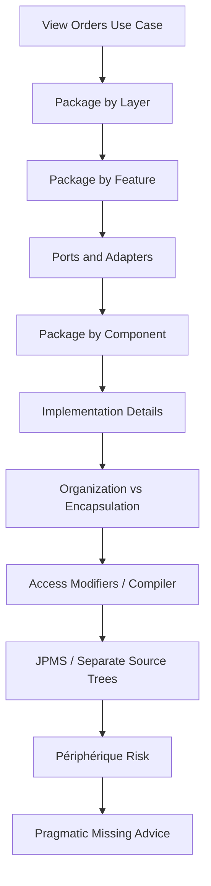

### 30.4 九十条核心结论

1. 第 34 章由 Simon Brown 撰写，是全书正文的最后一章。
2. 前文设计原则仍需要 Implementation Strategy 才能成为真实 Architecture。
3. 最好的 Design Intention 可能在最后的代码组织步骤被破坏。
4. Architecture Diagram 本身不能阻止违规 Dependency。
5. 本章案例是 Online Book Store 的 View Orders Use Case。
6. 示例使用 Java，但原则适用于其他有 Module、Visibility 或 Build Boundary 的语言。
7. 作者保持业务问题不变，比较多种 Code Organization。
8. Package by Layer 按 Technical Function 水平切分代码。
9. 典型三层是 Web、Business Logic / Service 和 Data / Persistence。
10. Strict Layered Architecture 要求每层只依赖相邻下一层。
11. Figure 34.1 中所有 Package Dependency 向下。
12. OrdersController 是处理 Web Request 的 Controller。
13. OrdersService 是 Order Business Logic Interface。
14. OrdersServiceImpl 是其 Implementation，但名称只表达技术关系，业务语义较弱。
15. OrdersRepository 定义 Persistent Order Access。
16. JdbcOrdersRepository 使用 JDBC 实现 Repository。
17. Layered Architecture 简单、熟悉，能快速启动项目。
18. Martin Fowler 也把 Presentation Domain Data Layering 视为良好起点。
19. 系统增长后，Web、Service、Repository 三个大 Bucket 不足以继续模块化。
20. Layered Top-Level Structure 不 Scream Business Domain。
21. 两个完全不同领域的 Layered Code Base 可能拥有相同顶层目录。
22. Package by Feature 按 Feature、Domain Concept 或 Aggregate Root 纵向切分。
23. Figure 34.2 把同样五个 Type 全部移入 `orders` Package。
24. Feature Package 让 Source Tree 开始 Scream Domain。
25. 一个 Use Case 的相关代码集中，Change Locality 更好。
26. 现代 IDE 降低了“更容易找到文件”的相对价值，但不消除业务结构价值。
27. Package by Feature 仅移动文件时，没有自动改变 Dependency Direction。
28. 如果所有 Type Public，Feature Package 也没有真正 Encapsulation。
29. Simon Brown 认为常见 Package by Layer 与 Package by Feature 都是 Suboptimal。
30. Ports and Adapters、Hexagonal Architecture 等把系统分为 Inside 与 Outside。
31. Inside 包含 Domain Concepts，Outside 包含 UI、Database 和 Third-Party Integration。
32. Major Rule 是 Outside 依赖 Inside，绝不反向。
33. Figure 34.4 把 OrdersController 放在 Web Outside。
34. OrdersService、OrdersServiceImpl 与 Orders 位于 Domain Inside。
35. JdbcOrdersRepository 位于 Database Outside，并实现 Domain Port。
36. OrdersRepository 被改名为 Orders，以使用 Ubiquitous Domain Language。
37. Inside Contract 应按 Domain Need 命名，而非 Persistence Mechanism 命名。
38. Figure 34.4 是简化图，省略 Interactor 与跨 Boundary Data Marshalling Object。
39. Simon Brown 在赞同 SOLID、REP、CCP、CRP 后提出 Package by Component。
40. 他的经验覆盖 Web、Client–Server、Distributed 和 Message-Based Enterprise Systems。
41. 多数这些系统仍使用 Traditional Layered Architecture。
42. 跨 Java Package 调用要求 OrdersService 与 OrdersRepository Interface Public。
43. Strict Layering 可保持 Acyclic Graph，却不能阻止不希望的向下跳层。
44. Newcomer 为快速交付，把 OrdersRepository 直接注入 OrdersController。
45. 新页面可以工作，但部分 Use Case 绕过 OrdersService。
46. 允许跳过相邻 Layer 的形式称为 Relaxed Layered Architecture。
47. 跳层并非绝对错误，CQRS Read Path 可能有意采用不同路径。
48. 无意跳层可能绕过 Record-Level Authorization 与其他 Business Policy。
49. Functional Correctness 不等于 Architectural Correctness。
50. 真实 Dependency 常在团队第一次 Visualize Code Base 时才暴露。
51. “Controller 不得直接访问 Repository”需要 Enforcement，而非只有口号。
52. Discipline 和 Code Review 会受到 Deadline、Budget 与知识差异影响。
53. 原书列举 NDepend、Structure101、Checkstyle 等 Static Analysis Tool。
54. Package Regex / Wildcard Rule 可以发现违规并 Fail Build。
55. 这类规则可能粗糙、可遗漏，并且 Feedback 晚于 Compiler Error。
56. 长期不受约束会让系统退化为 Big Ball of Mud。
57. 作者希望尽可能使用 Compiler 强制 Architecture。
58. Package by Component 把一个 Coarse-Grained Business Component 的责任放在同一 Package。
59. UI 继续作为独立 Delivery Mechanism。
60. OrdersController 只依赖 Public OrdersComponent Interface。
61. OrdersComponentImpl、OrdersRepository、JdbcOrdersRepository 都是 Component Internal Detail。
62. Business Logic 与 Persistence 在同一 Encapsulation Boundary 内，但内部仍保持 Separation of Concerns。
63. Consumer 只需知道一个 Component Facade。
64. Uncle Bob 把 Component 定义为 Deployment Unit，Java 中通常是 `.jar`。
65. Simon Brown 的 C4 定义是位于清晰 Interface 后的一组相关功能。
66. C4 使用 Software System、Container、Component、Class / Code 层次。
67. Logical Component 是否独立 `.jar` 是 Orthogonal Deployment Concern。
68. Well-Defined Monolithic Component 可以成为 Microservices 的 Stepping Stone。
69. Stepping Stone 不表示最终必须拆成 Microservices。
70. 本章最关键的 Implementation Detail 是 Java `public` 的过度使用。
71. 全部 Type Public 时，Package 只用于 Organization，不用于 Encapsulation。
72. 忽略 Package 后，四种 Architecture 拥有相同 Type Dependency Arrow。
73. 因而它们可能 Conceptually Different，却 Syntactically Identical。
74. Figure 34.7 证明漂亮的 Package Diagram 不能替代 Visibility。
75. Package by Layer 中 OrdersService 与 OrdersRepository 必须 Public，Concrete Implementations 可隐藏。
76. Package by Feature 中 OrdersController 可作为唯一 Public Entry Point，其余 Type 可隐藏。
77. 该 Feature 方案的代价是 Package 外所有 Order Access 都必须通过 Controller。
78. Ports and Adapters 中 OrdersService 与 Orders Port 必须 Public，Concrete Adapter 可隐藏。
79. Package by Component 只需 OrdersComponent Public，其余 Type 可 Package-Private。
80. Public Types 越少，Potential Dependencies 越少。
81. Java 更准确的术语是 Package-Private / Default Access，而非把它与 `protected` 混淆。
82. `.NET internal` 可提供类似能力，但按 Component 隔离通常需要独立 Assembly。
83. Reflection 技术上可绕过 Visibility，但不应被用于规避 Architecture。
84. 本章主要讨论单一 Source Tree 中的 Monolithic Application。
85. Monolith 可以拥有 Compiler-Enforced Component Boundary，并不等于 Big Ball of Mud。
86. OSGi 与 JPMS 能区分 Module 内 Public 和对外 Published / Exported Type。
87. Separate Source Trees 可让 Web、Persistence 只在 Compile Time 依赖 Domain。
88. 每 Component 一 Source Tree 更强，却带来 Performance、Complexity 和 Maintenance Cost。
89. 只有 Domain / Infrastructure 两树时，Infrastructure 可能沿 Périphérique 外环从 Web 直达 Repository。
90. 最终 Missing Advice 是把设计映射到代码结构，分别选择 Runtime 与 Compile-Time Decoupling，尽可能让 Compiler 执行边界，同时依据 Team Size、Skill、Solution Complexity、Time、Budget 和 Data Coupling 保持务实。

### 30.5 最终结论

第 34 章补上的不是另一种漂亮 Architecture Diagram，而是一条更严格的判断标准：

> **如果预期之外的依赖仍然可以轻松编译，你的边界就还不够真实。**

Package by Layer、Package by Feature、Ports and Adapters 与 Package by Component 都能表达不同设计意图。但当所有 Type 都是 `public` 时，它们可能只剩下不同 Folder Layout。真正让 Architecture 落地的是：

- 最小 Public API；
- Package-Private / Internal Implementation；
- Module Export；
- Separate Build Dependency；
- Compiler-Enforced Rule；
- 对 Runtime 与 Compile-Time Decoupling 的明确选择。

同时，不应把更强隔离当作无条件目标。Module、Project 和 Process 都有成本，必须结合团队规模、技能、系统复杂度、交付时间和预算选择恰当强度。

最值得记住的三句话是：

> **Organization is not encapsulation.**
>
> **Use the compiler to enforce architectural boundaries whenever practical.**
>
> **The devil is in the implementation details.**
