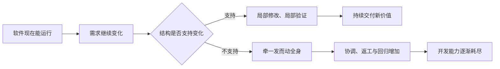
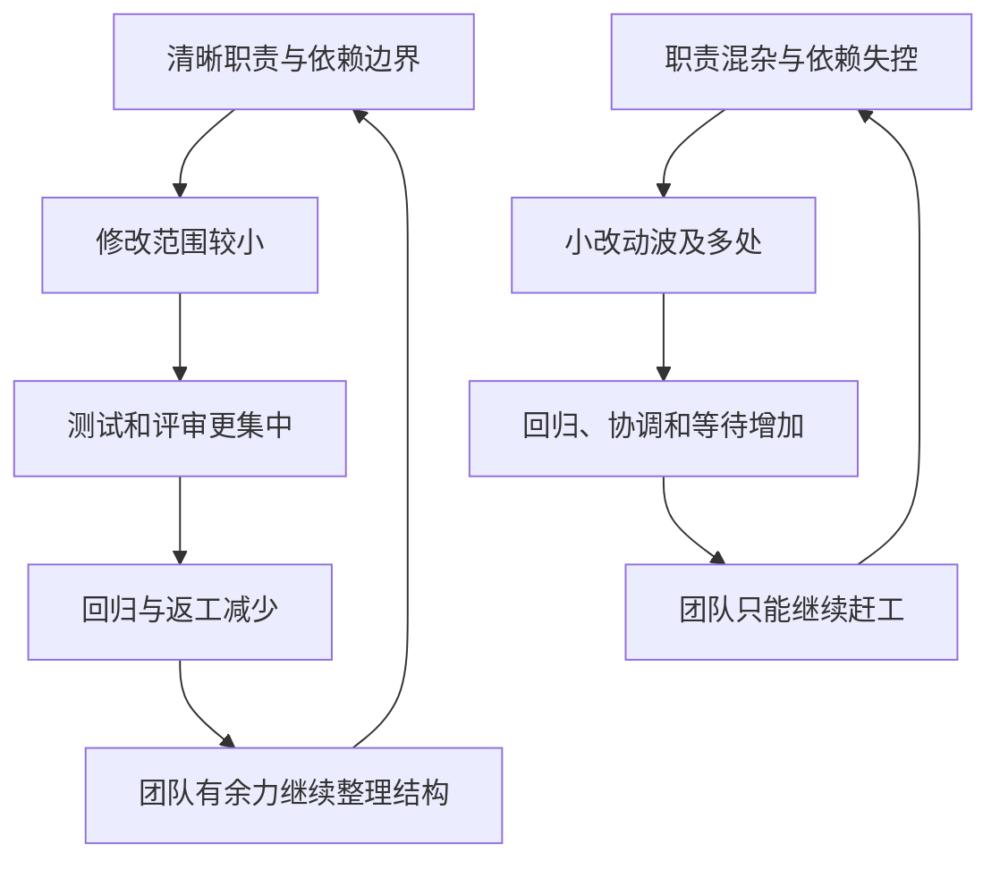
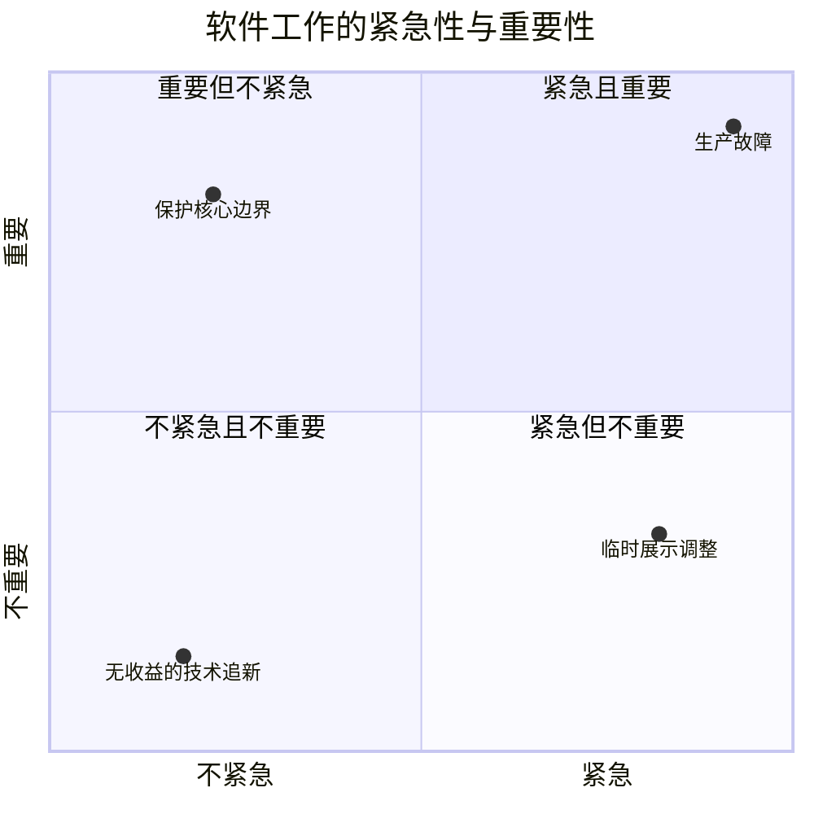

> 原书：Robert C. Martin, *Clean Architecture: A Craftsman's Guide to Software Structure and Design* 
> 覆盖范围：Preface、Part I Introduction、Chapter 1、Chapter 2 
> 原文参考：Clean Architecture.md

## 阅读主线

这部分不是在介绍某一种架构模板，也没有开始讲同心圆、依赖规则或具体设计原则。作者首先希望读者建立一套评价软件架构的基本尺度：

> **一个系统不仅要在今天正确运行，还要能在明天以合理成本继续修改。**

作者的论证按以下顺序展开：

1. Preface 说明：语言、硬件和框架变化很快，但组织程序与管理依赖的基本问题长期存在。
2. Part I Introduction 指出：让程序暂时运行并不稀奇，真正困难的是持续保持低成本的开发能力。
3. Chapter 1 解释 Design 与 Architecture 是同一个连续过程，并把架构目标落到全生命周期的人力成本上。
4. Chapter 2 区分软件的行为价值与结构价值，说明为什么结构总是容易被紧急需求挤压，也为什么开发团队必须主动维护它。

读这部分时，最重要的不是记住一句口号，而是学会反复追问：

- 当前改动的困难，来自需求本身，还是来自现有代码结构？
- 团队增加的人力，真正用于新功能的比例是在上升还是下降？
- 今天为了赶进度留下的混乱，未来真的会有机会集中清理吗？
- 谁负责在业务压力下保护软件长期可变更的能力？

## Preface

### 1. 为什么书名叫 Clean Architecture

作者知道这个名称听起来很大胆，仿佛自己掌握了唯一正确的架构。他给出的依据并不是某套新发明的理论，而是从 1964 年开始积累的五十多年软件开发经验。

这些经验来自非常不同的系统：

- 嵌入式与实时系统；
- 批处理与交互式系统；
- 游戏、图形、通信和控制系统；
- 财务、Web 和数据库应用；
- 单线程、多线程、多进程和多处理器环境。

这些系统使用的语言、硬件、部署方式和业务领域差异很大，但作者发现，导致系统难以修改的原因高度相似：

- 模块职责混杂；
- 依赖方向失控；
- 高层业务规则被低层技术细节绑住；
- 变化沿错误的路径扩散；
- 团队为了短期速度不断破坏结构。

因此，本书所说的 Clean 并不是统一的目录模板，而是反复出现的一组组织原则：让不同原因变化的代码彼此分开，让依赖朝稳定且重要的方向流动，让可以替换的细节留在边界之外。

### 2. 硬件变化巨大，软件的基本材料变化很小

作者把早期计算机与写作本书时的现代笔记本进行比较。几十年间，处理速度、内存、存储、显示和交互能力发生了惊人的提升。原书使用一个极大的数量级来表现这种历史差距，它主要是一种强调硬件进步幅度的说法，不应当当成精密性能基准。

硬件虽然巨变，程序的基本控制方式却没有发生同等程度的改变：

- **顺序**：先做一件事，再做下一件事；
- **选择**：根据条件决定走哪条路径；
- **迭代**：重复执行某段逻辑。

现代语言增加了类型系统、异常、泛型、闭包、协程和自动内存管理；现代工具增加了 IDE、版本控制、持续集成、容器和云平台。但这些技术改善的是表达、复用、部署和运行方式，并没有消除以下问题：

- 哪些代码应该放在一起；
- 哪些代码应该彼此分开；
- 谁可以知道谁；
- 谁应该依赖谁；
- 一项变化应该影响多大范围。

这就是作者认为架构原则具有长期稳定性的原因。架构面对的不是某个框架的配置方法，而是代码组织与变化传播问题。

### 3. 普适原则不等于所有项目使用同一模板

这一点很容易误读。

**原则稳定，不代表技术不重要。**

理解依赖方向不能代替学习数据库事务、C++ 生命周期、分布式一致性或安全协议。架构原则负责组织这些技术，具体技术仍决定系统能否正确、高效和安全地运行。

**原则稳定，不代表层数固定。**

一次性命令行工具可能只需要几个清晰函数；长期演进的业务平台可能需要组件、进程和服务边界。边界强度应与寿命、变化风险和团队规模相匹配。

**原则稳定，不代表过去的经验不容质疑。**

具体做法仍应接受项目反馈。某个抽象如果没有隔离真实变化，只增加了跳转和维护成本，就应删除或调整。

### 4. Preface 为全书划定的范围

这本书不是：

- 某种框架的使用手册；
- 一个可直接复制的项目脚手架；
- 只适用于大型企业系统的分层规范；
- 一套追求形式美感的代码风格。

它研究的是更持久的问题：如何安排软件中的政策、机制、组件和依赖，使系统能在外部技术与业务需求不断变化时，继续保持开发能力。

## Part I Introduction

### 1. 程序能运行，为什么还不够

让程序在当前演示路径上工作，通常只是第一步。团队可以用很多快捷方法迅速得到结果：

- 把新逻辑直接塞进现有大函数；
- 复制一段相似代码再稍作修改；
- 让 Controller 直接查询数据库；
- 让任何模块都能调用任何其他模块；
- 先关闭难写的测试，等功能上线后再说。

这些方法有时确实能缩短第一次提交所需时间，但软件不会停在第一次提交。下一项需求可能要求：

- 更换输入渠道；
- 增加一种业务规则；
- 支持另一种数据库；
- 调整流程顺序；
- 修改错误处理；
- 在不影响旧客户的情况下推出新版本。

这时，原先被隐藏的依赖开始收取代价。一个看似局部的修改需要理解多个无关模块，测试范围扩大，回归故障增加，团队之间频繁协调。

作者真正关心的是：

> **交付下一次变化时，工作量是否仍与这项变化本身相称。**

### 2. 真正困难的是长期保持低成本

软件开发中常见一种反常现象：

- 团队人数越来越多；
- 每个人都越来越忙；
- 加班和会议越来越多；
- 业务却觉得交付越来越慢。

这并不一定意味着开发者不努力。大量时间可能已经从创造新行为转为：

- 理解散落的旧逻辑；
- 绕开脆弱依赖；
- 等待漫长构建和环境；
- 修复无关回归；
- 协调多个团队同时改同一片代码；
- 处理临时方案产生的新临时方案。

良好架构不会消除需求本身的难度，也不会让所有功能都变得简单。它要消除的是**由错误结构额外制造的困难**。

### 3. 两种反馈循环

好的结构和坏的结构都会自我强化。

在健康循环中，局部修改容易验证，团队因此敢于持续重构；在恶性循环中，每次改动都风险很高，团队为了避险更不敢整理，只能继续叠加补丁。

这也是为什么架构问题不能只等到某个单独的「重构阶段」解决。结构必须在日常功能开发中持续维护。

## Chapter 1 What Is Design and Architecture?

### 1. Design 与 Architecture 没有清晰分界线

一种常见说法是：

| 术语 | 常见理解 |
| --- | --- |
| Architecture | 高层、宏观、由架构师决定 |
| Design | 低层、局部、由程序员实现 |

作者认为这种分法并不成立。

他以住宅为例：房间布局、外观和用途通常被视为高层架构；插座位置、开关线路、墙体结构和地基做法则被视为低层细节。但一栋房屋只有把这些决策组合起来才能真正可用。低层做法会直接支持或破坏高层目标。

软件也是如此：

- 系统如何拆分；
- 组件如何部署；
- 模块暴露什么接口；
- 类和函数如何协作；
- 数据结构放在哪一层；
- 一个文件包含了哪些头文件；

这些决策影响范围不同，却共同构成系统设计。一个高层架构图声称数据库是可替换细节，但业务代码到处直接使用 ORM 类型，那么低层代码已经推翻了高层意图。

因此，作者把 Design 与 Architecture 看成一个连续体，而不是两个互不相干的领域。

### 2. 为什么低层细节也属于架构

如果把架构只理解成高层框图，团队很容易把以下问题视为无关紧要的实现细节：

- 一个业务类是否直接引用数据库类型；
- 一个函数是否同时处理业务计算和页面格式；
- 一个跨层参数是否携带框架对象；
- 一个模块是否可以绕过正常入口修改共享数据；
- 测试是否必须启动整个外部环境。

但边界最终只能通过具体代码体现。错误的一条引用、一个共享数据结构或一个跨层调用，就可能让图上的边界失效。

判断某个设计决定是否具有架构意义，可以问：

- 它是否让变化跨越原本的边界传播？
- 它是否绑定了难以替换的技术？
- 它是否扩大构建、测试或部署范围？
- 它是否改变核心业务规则的表达方式？

### 3. The Goal：软件架构的目标

作者给出一个非常务实的目标：

> **软件架构的目标，是尽量减少构建和维护所需系统的人力。**

这里有三个重要限定。

**第一，系统必须满足要求。**

删掉所有代码当然最省人力，却没有任何价值。架构必须在功能、可靠性、安全和性能达到要求的前提下讨论成本。

**第二，关注整个生命周期。**

首个版本开发很快，不代表架构良好。如果以后每次改动都越来越慢，总成本仍然很高。

**第三，减少的是无效消耗。**

目标不是简单压缩团队人数，而是减少协调、返工、回归、重复实现和被结构迫使进行的无意义劳动。

### 4. 如何判断架构是否健康

作者给出的判断方法很朴素：观察系统不断发布新版本时，开发成本如何变化。

如果需求规模大致相似，但每个版本需要投入的人力持续上升，应当追问：

- 新需求真的越来越复杂吗？
- 还是每项需求都要穿过更多模块？
- 构建和测试是否越来越慢？
- 修改一个功能是否需要越来越多团队参与？
- 代码中的重复和特殊分支是否越来越多？

架构健康并不意味着每次发布成本完全相等。安全改造、数据迁移或复杂业务规则本来就可能更难。关键是把**需求固有难度**与**结构制造的额外难度**区分开。

### 5. Case Study：投入增长，产出停滞

作者使用一家公司的真实数据说明坏结构如何转化为经营问题。案例观察了：

- 工程团队人数；
- 每个版本的代码产出；
- 开发者生产率；
- 每行代码成本；
- 每月工资支出。

图中团队规模快速增长，代码产出却逐渐趋于平缓。仅凭代码行数不能衡量业务价值，但「投入快速上升、产出没有相应增长」至少是一个必须调查的信号。

原书指出，到第 8 个版本时，每行代码的成本大约是第 1 个版本的 40 倍。这个数字不是为了鼓励多写代码，而是说明：公司支付了越来越多工资，却换来越来越少的可见进展。

### 6. 为什么不能把代码行数当成生产率

代码行数有明显局限：

- 删除重复代码可能提升质量，却减少行数；
- 自动生成代码会虚增行数；
- 不同语言和问题的代码密度不同；
- 一行边界检查可能比大量样板代码更有价值；
- 不同版本的需求难度可能不同。

所以，案例不能证明架构是唯一原因，更不能证明开发者变懒。更可靠的判断还应结合：

- 从需求提出到上线的时间；
- 一项改动涉及的文件和组件数量；
- 缺陷率与变更失败率；
- 故障恢复时间；
- 构建和测试耗时；
- 团队之间的等待与交接；
- 重复代码和临时分支数量。

作者使用这些图，是为了揭示一种典型模式，而不是建立精确的软件生产率公式。

### 7. The Signature of a Mess

作者把案例中的趋势称为「混乱的特征」。它通常表现为：

1. 初期为追求速度不断绕过设计；
2. 新功能主要靠增加开发者来完成；
3. 模块边界越来越模糊；
4. 每次修改都需要更多协调；
5. 团队越来越忙，实际产出却越来越低；
6. 公司继续用加人和加班解决同一个问题。

增加人员并非总是错误。边界清楚、工作可以独立推进时，新成员能够提高产出。但在所有模块彼此牵连的系统里，新增人员也会增加沟通、合并冲突、知识同步和任务切分成本。

架构的重要作用之一，就是让团队可以围绕稳定边界独立工作，而不是让每个人都必须理解和协调整个系统。

### 8. 开发者视角与管理者视角

**从开发者视角看：**

开发者并没有闲着。他们的时间被理解旧代码、等待环境、修复连锁回归和跨团队协调占满。主观感受是每天都很累，客观结果却是功能推进缓慢。

**从管理者视角看：**

案例后期每月工资支出达到约 2,000 万美元，而代码产出几乎没有增长。管理者自然会要求团队更快，但如果「更快」只意味着更多人、更多并行任务和更多加班，系统性摩擦反而会加剧。

更有价值的管理问题是：

- 为什么一个普通改动要碰这么多模块？
- 为什么测试必须启动所有环境？
- 为什么多个团队总在同一文件上冲突？
- 为什么数据库或 UI 的小变化会修改业务核心？
- 哪些工作是需求本身要求的，哪些是结构额外制造的？

### 9. What Went Wrong?

作者把问题归结为一种过度自信：

> **先用混乱代码抢速度，等成功以后再清理。**

这句话包含两个危险假设。

#### 9.1 假设一：混乱写法短期一定更快

混乱可能从第一次开发就开始增加调试、重复和返工。所谓速度优势，有时只是把测试和修复推迟几天，并没有真正省下时间。

作者引用 Jason Gorman 连续六天实现「整数转罗马数字」的小实验：交替使用 TDD 与非 TDD，结果 TDD 日并没有更慢，整体还略快。

这个实验样本很小，不能证明所有人、所有项目使用 TDD 都能得到固定提速。它的作用是反驳一个绝对判断：**保持纪律并不必然拖慢短期开发。**

#### 9.2 假设二：以后会有时间清理

产品上线后，压力通常不会消失，而会出现：

- 客户反馈；
- 竞争功能；
- 生产故障；
- 兼容需求；
- 运维工作；
- 新的商业承诺。

因此，「以后」往往不会自动到来。临时代码成为正式代码，下一项需求继续叠在它上面，清理难度越来越高。

### 10. 龟兔赛跑真正想表达什么

作者借龟兔赛跑说明：持续、谨慎、保持质量的开发方式，长期会超过靠冲刺和透支结构获得的短暂领先。

他说「想快，唯一的办法是先把事情做好」，并不是要求：

- 每个类都设计得完美；
- 上线前预见所有未来变化；
- 为简单程序建立大量抽象；
- 暂停业务数月只做重构。

更准确的理解是：

- 保持代码可理解；
- 保持测试可运行；
- 不把明显不同的职责混在一起；
- 不让临时依赖轻易穿过边界；
- 在每次修改中顺手改善被触及的结构。

### 11. 为什么推倒重写通常不能自动解决问题

当旧系统极其痛苦时，团队很容易认为从头重写可以摆脱历史负担。作者提醒：如果团队的工程习惯、决策方式和过度自信没有变化，新系统很可能重演旧系统的问题。

重写还有额外困难：

- 旧系统仍要维护；
- 新需求不会停止；
- 新系统必须重新发现大量隐含业务规则；
- 新旧系统长期双轨运行；
- 最后一次切换风险很高。

重写并非永远错误。旧平台无法继续支持、现有行为有可靠测试保护、系统可以增量替换、团队清楚旧架构失败原因时，重写可能合理。

更常见、更稳妥的方法是：

1. 为关键行为建立测试保护；
2. 找出最稳定的业务规则；
3. 在旧代码中建立可替换的接缝；
4. 把 UI、数据库和框架细节逐步移到边界外；
5. 按业务能力逐块替换，而不是等待一次大爆炸切换。

### 12. Chapter 1 的核心结论

Chapter 1 不是要求团队多画架构图，而是建立一条因果链：

这条判断主要适用于有真实生命周期、会持续变化的软件。短命实验、一次性迁移脚本或验证性原型，不需要投入与大型长期系统同等强度的架构成本。

## Chapter 2 A Tale of Two Values

### 1. 软件同时提供两种价值

作者认为每个软件系统都提供两种价值：

| 价值 | 核心问题 | 常见表现 |
| --- | --- | --- |
| Behavior | 系统现在做得对不对 | 功能、输出、业务结果 |
| Architecture | 系统以后是否容易改变 | 修改范围、测试能力、替换成本 |

两种价值都不可缺少。

- 只有结构、没有正确行为，软件不能解决现实问题；
- 只有当前行为、没有可变更结构，软件会在需求变化后迅速失去价值。

### 2. Behavior：让机器按照要求工作

行为价值最容易被理解，也最容易被观察。利益相关者提出需求，开发者让机器按要求运行；出现偏差时，再把缺陷修正。

例如订单系统要做到：

- 接受商品与数量；
- 检查库存；
- 计算价格；
- 创建订单；
- 返回成功或失败结果。

如果系统给出错误金额或允许库存变成负数，行为就是错误的。

作者并不否定行为价值。他批评的是把「实现当前功能」当成开发者的全部职责。因为需求必然继续变化，而当前正确的行为必须依靠可修改的结构延续下去。

### 3. Architecture：让软件保持柔软

Software 之所以叫「软」件，是因为它应当比硬件更容易改变行为。结构价值表现为：

- 新需求可以在有限区域实现；
- 外部技术可以替换；
- 核心规则可以独立测试；
- 修改不会迫使整个系统重新理解和验证；
- 开发成本不会仅因系统年龄增长而不断上升。

作者用两个词解释变更成本：**scope（范围）**与 **shape（形状）**。

### 4. Scope：需求本身有多大

Scope 指需求固有涉及多少业务规则、数据和交互。

例如：

- 修改一句页面文案，范围很小；
- 增加一种订单折扣，范围通常较小；
- 重做整个结算流程，范围较大；
- 把单币种系统扩展成多币种，范围可能很大。

范围大，工作量增加是合理的。架构不能消除真实业务复杂度。

### 5. Shape：需求如何穿过现有系统

Shape 指同一需求在当前结构中必须经过哪些模块、层和技术边界。

以「订单满 1,000 元增加一种折扣」为例：

**结构清晰时：**

- 折扣规则集中在业务策略中；
- 新增一种规则或修改一个策略；
- 相关测试集中；
- UI 和数据库不需要变化。

**结构混乱时：**

- 页面 JavaScript 算一次；
- Controller 算一次；
- 数据库存储过程再算一次；
- 报表中还有一份复制逻辑；
- 不同渠道使用不同特殊分支。

需求范围没有改变，困难却因现有结构呈现出完全不同的形状。

作者的目标是：让修改难度主要取决于需求范围，而不是取决于它与旧结构是否碰巧匹配。

### 6. Shape Agnostic 不等于预测所有未来

架构应尽量不偏爱某一种变化形状，但这不表示提前为所有可能性建立扩展点。

过度预测会产生：

- 无人使用的接口；
- 复杂配置；
- 大量空洞抽象；
- 当前开发者难以理解的通用框架。

更实际的方法是：

1. 先围绕已知业务边界组织代码；
2. 把明显不同的变化原因分开；
3. 不让业务规则直接依赖 UI、数据库和框架；
4. 从真实变化中识别模式；
5. 通过持续重构调整边界。

架构的价值不是准确预测未来，而是让预测错误时仍有调整空间。

### 7. The Greater Value：为什么作者认为结构价值更重要

作者使用两个极端情况进行思考。

**情况一：系统当前行为完全正确，但几乎无法修改。**

只要业务需求发生变化，系统就会逐渐不再满足需要。理论上可以改代码，但如果修改成本、风险和迁移代价超过变化带来的价值，组织实际上不会再改。软件在经济意义上变得不可修改。

**情况二：系统当前行为有问题，但结构很容易修改。**

在需求明确、技术可行并且团队有资源的前提下，错误可以修复，系统也能继续适应后续变化。

作者由此认为，结构保存了软件持续产生行为价值的能力，因此更加根本。

这一结论不能被误读为「不能运行的漂亮代码比正确软件更好」。当前行为仍是软件兑现价值的必要条件。更准确的说法是：

> **行为让软件今天有用，结构让它明天还能继续有用。**

### 8. Eisenhower's Matrix：重要与紧急不是一回事

作者借艾森豪威尔矩阵解释为什么架构工作容易失去优先级。

矩阵的优先顺序是：

1. 紧急且重要；
2. 重要但不紧急；
3. 紧急但不重要；
4. 不紧急且不重要。

行为需求通常带有明确日期、客户承诺或故障压力，因此显得紧急。架构问题通常不会在今天上午突然阻止某个按钮上线，却会影响未来每项需求的成本，所以常属于「重要但不紧急」。

团队最常犯的错误，是让大量「紧急但不重要」的任务长期挤掉「重要但不紧急」的结构工作。等结构恶化到无法发布或频繁故障时，它才突然变成「紧急且重要」。

### 9. 不要机械使用矩阵

不是所有功能都不重要，也不是所有架构工作都重要。

- 支付金额错误既紧急又重要；
- 修复数据泄漏既紧急又重要；
- 隔离一个不断影响核心的第三方接口重要但可能不紧急；
- 为追逐潮流重写一个稳定模块，可能既不重要也不紧急。

判断依据应是业务影响、变化频率和风险，而不是任务被贴上「功能」或「架构」标签。

### 10. Fight for the Architecture

架构价值不像新功能那样容易演示。业务方会维护收入和市场时机，运营会维护可靠性，销售会维护客户承诺；开发团队也必须维护系统继续变化的能力。

作者使用 Fight 或 Struggle，并不是鼓励架构师与所有人对抗，而是强调：不能只在会议上轻声提醒一次，然后在压力下永远放弃结构。

有效的沟通方式不是说：

- 「代码不优雅」；
- 「这不符合最佳实践」；
- 「我们必须先重构三个月」。

而是说明可以验证的业务后果：

- 当前依赖会让三种支付渠道都参与本次改动；
- 数据库类型已经进入核心，下一次升级需要重测全部结算规则；
- 花两天建立边界，可让已排期的三个需求各减少一天工作；
- 继续叠加特殊分支会增加哪些回归风险。

架构师的职责不是独自决定所有优先级，而是把长期成本、风险和选项带入共同决策。

### 11. 在日常交付中保护架构

最可持续的做法不是等待一次大型架构项目，而是在功能工作中同步改善：

1. 修改某个功能前，先确认真正的业务规则位于哪里；
2. 若规则散落多处，先用测试固定现有行为；
3. 把本次需要修改的规则集中起来；
4. 阻止新的数据库、UI 或框架类型进入核心；
5. 用小步提交验证每次调整；
6. 记录本次边界调整对后续需求的实际收益。

这样既交付当前行为，也改善未来交付能力。

## 作者在这部分如何分析问题

### 1. 从经济结果而不是技术风格出发

作者没有先说应该使用接口、组件或分层，而是先展示人数、工资和生产率的变化。这样把架构从「代码是否漂亮」转成「组织还能否持续交付」。

### 2. 使用案例揭示趋势，而不是假装精确证明

公司案例和 TDD 小实验都有局限。作者使用它们的合理方式是：指出一种反复出现、值得解释的现象，并反驳「混乱一定更快」这样的绝对信念。

### 3. 使用极端情况澄清价值顺序

Chapter 2 对两种软件价值的比较，不是日常项目决策公式，而是思想实验。它帮助读者看到：当前正确却永远无法变化的软件，会随着需求变化失去用途。

### 4. 把技术责任放回团队决策

结构不会自动得到保护。业务压力总有具体日期，而架构收益通常出现在未来，因此开发者必须把未来成本转译成当前可以讨论的风险和收益。

## 易混淆概念与常见误解

### 1. 架构好不等于代码少

少量代码也可能高度耦合；大量代码也可能边界清楚。真正要观察的是修改影响范围、依赖方向、测试能力和部署成本。

### 2. 可变更不等于到处增加配置和接口

大量预留参数可能只是猜测未来。可变更性的关键是隔离真实变化源，并保持代码能够安全重构。

### 3. 重视架构不等于可以不交付功能

行为和结构都是软件价值。目标是在交付功能时不破坏未来继续交付的能力。

### 4. 把事情做好不等于追求完美

架构永远基于当前信息。正确做法是建立足够清楚的边界，并随着真实变化持续调整，而不是一次设计出永不改变的系统。

### 5. 团队繁忙不等于系统生产率高

开发者可能把大量时间花在等待、协调、回归和理解无关代码上。架构问题首先是系统性问题，不应简单归咎于个人效率。

### 6. 技术债不一定能以后一次还清

坏结构从下一次修改开始持续增加成本，还会塑造团队的沟通方式。没有测试和增量边界的大规模清理，本身也可能变成高风险重写。

### 7. 架构价值更大不等于架构拥有绝对优先权

安全事故、收入故障和法规要求可能必须立即处理。作者要求的是不要长期用紧急性掩盖重要性，而不是让架构师否决所有业务需求。

## 实践检查清单

### 观察开发成本

- 相似规模的需求是否越来越慢？
- 一项普通改动涉及的模块和团队是否持续增加？
- 构建、测试和部署等待是否在增长？
- 新增人员后，实际交付能力是否相应增长？

### 区分需求难度与结构摩擦

- 这项需求本身是否真的复杂？
- 困难是否来自规则散落、依赖反向或技术细节泄漏？
- 若从头解释业务规则，需要多少步骤？
- 现有代码是否迫使团队处理与需求无关的内容？

### 同时维护行为与结构

- 当前行为是否有测试保护？
- 本次修改是否引入新的跨边界依赖？
- 能否把结构改善限制在本次触及的区域？
- 新增抽象是否隔离了真实变化，而不是想象中的未来？

### 沟通架构价值

- 能否说明不改结构会影响哪些已知需求？
- 能否给出影响文件、测试范围、故障风险或等待时间？
- 能否提出小步、可验证、不中断业务的方案？
- 完成后是否记录实际收益，以改善下一次估算？

## 总结：Preface 与 Introduction 建立的架构观

1. 硬件、语言和框架快速变化，但代码组织、依赖和变化传播问题长期存在。
2. Clean Architecture 不是统一模板，而是让政策与细节按正确方向协作的一组原则。
3. Design 与 Architecture 是一个连续整体；低层代码可以支持，也可以破坏高层意图。
4. 架构目标是在满足功能和质量要求的前提下，降低系统全生命周期的人力消耗。
5. 判断架构是否健康，要观察相似变化的成本趋势，而不只看首版速度或架构图。
6. 原书案例展示了典型混乱：人员和工资持续增长，实际产出却趋于停滞。
7. 代码行数不是业务价值，但结合交付时间、缺陷、影响范围和等待成本，可以帮助识别系统性摩擦。
8. 「先弄乱、以后再清理」通常失败，因为产品上线后的压力不会自动消失。
9. 推倒重写若不改变团队习惯和依赖结构，往往只会重演旧问题。
10. 软件同时提供行为价值和结构价值：行为让它现在有用，结构让它以后还能有用。
11. 修改难度应主要由需求范围决定，而不是由需求碰巧穿过系统的形状决定。
12. Shape Agnostic 不是预测所有未来，而是避免把核心绑定到某种外部细节，并持续根据反馈重构。
13. 架构通常重要但不紧急，因此很容易被看似紧急的工作长期挤压。
14. 开发团队必须用业务成本、风险和增量方案维护架构，而不是只诉诸代码美感。
15. 可持续的速度来自日常保持代码可理解、可测试、职责清楚和依赖受控，而不是先透支结构再等待一个不会自动出现的以后。
