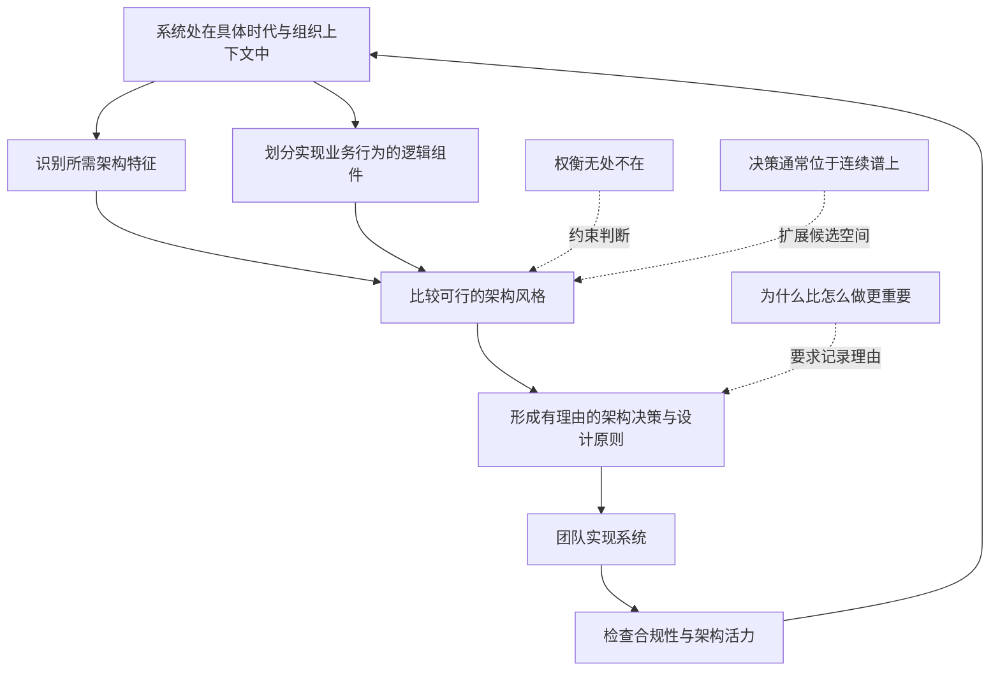
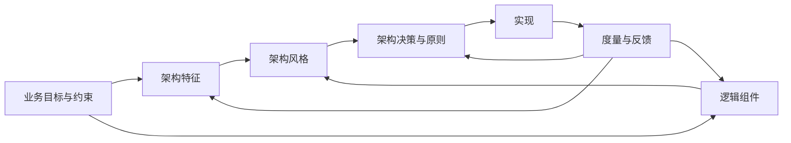
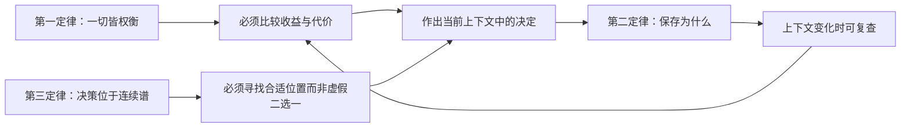
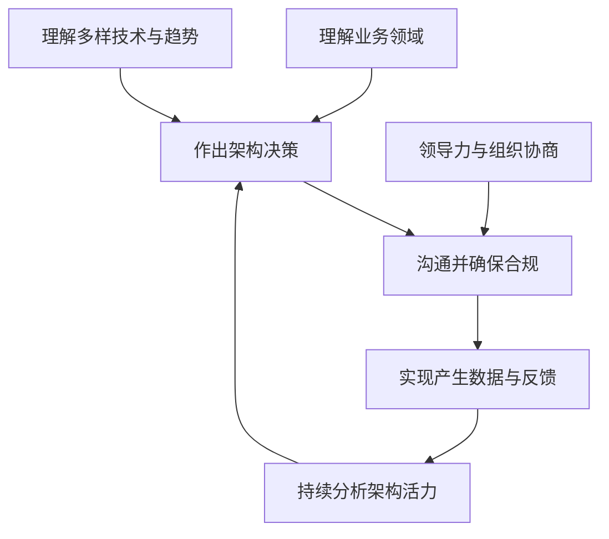
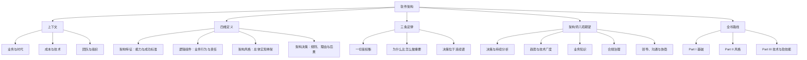

> 对应原章：1. Introduction.md
> 本章不是架构风格目录，也不提供计算型算法，而是建立全书的共同语言：软件架构由哪些维度构成，架构判断遵循什么基本规律，以及组织为什么需要架构师这一角色。
> 本笔记严格沿原章顺序展开。文中的数学表达、决策伪代码、在线零售示例和检查清单是为了把作者的论证形式化、具体化，并非原书逐式给出的公式或算法。

## 0. 本章要回答的核心问题

1. 为什么软件架构不能脱离技术、经济、组织和时代背景来评价？
2. 什么是“偶然成为的架构师”，为什么职位名称不是判断架构职责的唯一标准？
3. 软件架构的四个维度分别是什么，它们各自解决什么问题？
4. 架构特征、逻辑组件、架构风格和架构决策之间是什么关系？
5. 为什么架构风格只是实现的起点，而不是一套可以直接套用的完整答案？
6. 为什么软件架构中的一切都是权衡，而且权衡不能只做一次？
7. 为什么记录“为什么这样决定”通常比只记录“系统怎样工作”更重要？
8. 为什么多数架构决策不是非黑即白，而是两个极端之间的连续选择？
9. 架构师与高级程序员的职责有何不同？架构师被期待完成哪八类工作？
10. 技术判断为什么必须与业务知识、沟通、领导力、治理和组织协商结合？
11. 本章的概念如何连接全书的基础、架构风格和软技能三部分？
12. 怎样把本章原则转化为一套可复用、可解释、可复查的架构工作流程？

本章的论证主线如下：



一句话概括：**软件架构不是一张静态结构图，而是系统结构与四个架构维度的组合；架构工作则是在特定上下文中，围绕系统能力与业务行为持续作出、解释、落实和复查权衡决策的过程。**

---

## 1. 开篇：为什么要学习软件架构

### 1.1 本章面对的读者

作者首先列出三类常见读者：

- 希望走向下一职业阶段的开发者；
- 希望理解软件架构如何影响项目成败的项目经理；
- 已经在作架构决策、却还没有“软件架构师”头衔的“偶然架构师”（accidental architect）。

“偶然架构师”揭示了一个重要边界：**架构师首先是一组责任，其次才是职位名称。** 当一个人开始决定系统如何分解、哪些依赖被允许、质量目标怎样实现、多个团队如何协作时，他事实上已经在承担架构职责。没有正式头衔不会降低这些决定的影响，也不会免除解释和治理责任。

学习软件架构也不是简单地学习“更大的代码结构”。开发者通常已经在解决局部实现问题；架构工作则把视角拉远，关注：

1. 系统的大块结构怎样组合；
2. 一个局部选择会怎样影响性能、可用性、可修改性等全局能力；
3. 技术、成本、人员、业务期限和组织边界如何相互制约；
4. 信息不完整时如何作出仍可辩护的决定。

因此，从开发走向架构，不只是把技术做得“更深”，还意味着把判断范围扩展到整个社会技术系统。

### 1.2 架构工作的核心难点

作者把软件架构师的工作描述为：深入理解复杂软件系统，并在信息不完整时作出重要的权衡决定。难点主要来自四个方面：

| 难点 | 为什么难 | 对架构工作的要求 |
| --- | --- | --- |
| 变量多 | 技术、业务、成本、合规、人员和时间同时起作用 | 不能只优化单一指标 |
| 变量会变 | 流量、团队、市场和基础设施都会变化 | 决策必须持续复查 |
| 信息不完整 | 新系统没有完整运行数据，未来需求也不确定 | 需要明确假设、风险和验证方式 |
| 决定影响长久 | 结构和依赖一旦扩散，修改代价很高 | 要记录理由并控制不可逆性 |

原章还把生成式 AI 放入这一背景：开发者可能担心部分编码工作被自动化，而架构判断更依赖复杂、变化中的上下文与权衡。原文据此作出“这正是 AI 无法作出的决定”这一强判断；更审慎地说：**生成方案与为具体组织承担决策责任并不是同一件事。** 工具可以帮助枚举方案、生成代码和分析数据，但目标冲突如何取舍、风险由谁承担、组织是否有能力执行，仍需要上下文判断。

### 1.3 架构只能在上下文中理解

作者用艺术作类比：架构决策只有放回产生它的环境中才有意义。一个结构在今天看起来笨重，可能是当时成本、许可证、硬件和组织能力下最合理的答案；一个今天流行的风格，也可能在另一个团队中完全不经济。

原书先指出，20 世纪末软件架构的一项重要目标，是尽可能高效地共享昂贵的商业操作系统、应用服务器和数据库服务器等基础设施。资源共享不是抽象偏好，而是当时成本结构下的理性选择。

可以把架构上下文拆成五层：

| 上下文层 | 典型问题 | 会影响什么 |
| --- | --- | --- |
| 业务 | 目标是什么，交付窗口多长，失败代价多大 | 优先级与成功标准 |
| 技术 | 基础设施、平台和工具能做什么 | 可行方案与实现成本 |
| 经济 | 许可证、计算、网络、人力有多贵 | 方案是否值得 |
| 组织 | 团队规模、技能、所有权边界如何 | 系统能否被正确构建和运维 |
| 时代 | 当时有哪些工程实践和产业条件 | 哪些风格已具备现实基础 |

#### 2002 年的微服务反例

原章用一个思想实验说明上下文为何决定可行性。若在 2002 年要求每个服务运行于隔离机器、使用独立数据库，可能需要购买大量操作系统、应用服务器和数据库许可证，还要承担机器采购和运维成本。即使结构概念能够画出来，它在经济上也几乎不可行。

后来两个变化降低了这类架构的门槛：

1. **开源软件普及**：许多操作系统、运行时、数据库和中间件不再按过去的商业许可证方式计费；
2. **DevOps 工程实践成熟**：自动化配置、部署、监控和基础设施管理，使大量独立部署单元不必完全依靠人工操作。

这个案例的推理不是“新架构一定优于旧架构”，而是：

```text
技术上可描述
    不等于
在当前成本与组织能力下可实施
    更不等于
在当前问题中值得实施
```

微服务在某些上下文中获得了可行性，但它仍会带来网络延迟、分布式数据、一致性、可观测性和运维复杂度。时代条件只改变了权衡，不会消除权衡。

### 1.4 开篇得到的第一个方法论结论

评价一个架构之前，应先问：

1. 它要解决什么业务问题？
2. 当时有哪些硬约束？
3. 团队具备什么能力？
4. 哪些替代方案当时真实可用？
5. 选择者接受了哪些代价来换取哪些收益？

脱离这些问题直接争论“单体还是微服务”“同步还是异步”，很容易把架构讨论退化成技术偏好竞赛。

---

## 2. Defining Software Architecture：定义软件架构

### 2.1 为什么需要一个多维定义

只把架构理解为方框和连线，会遗漏系统必须达到的能力与作出选择的理由；只列出质量目标，又无法说明业务行为由谁实现；只报出“微服务”或“分层架构”的名称，也不能说明该系统的具体边界和规则。

因此，作者用四个维度共同定义软件架构：

1. **架构特征（architectural characteristics）**；
2. **逻辑组件（logical components）**；
3. **架构风格（architectural style）**；
4. **架构决策（architecture decisions）**。

为了便于记忆，可以把它写成一个教学化元组：

$$
\mathrm{Dimensions}(A) = (C, L, S, D)
$$

其中 $C$ 表示架构特征，$L$ 表示逻辑组件，$S$ 表示架构风格，$D$ 表示架构决策。这不是原书的计算公式，也不表示四项可以机械相加；它只概括四个分析维度。系统结构是这些维度共同作用的载体，缺少结构本身或任一维度，都不足以完整描述一个系统的架构。

| 维度 | 核心问题 | 主要产物 | 缺失后的典型后果 |
| --- | --- | --- | --- |
| 架构特征 $C$ | 系统必须具备哪些跨功能能力，怎样算成功？ | 质量目标、约束、可测标准 | 系统功能可用，但性能、可用性或安全性不达标 |
| 逻辑组件 $L$ | 哪些领域、实体和工作流实现业务行为？ | 责任边界、组件关系 | 职责混乱、变化相互扩散 |
| 架构风格 $S$ | 用哪种总体拓扑作为实现起点？ | 分层、模块化单体、微服务等结构骨架 | 局部设计缺少共同组织方式 |
| 架构决策 $D$ | 哪些构建规则必须遵守，为什么？ | 约束、原则、理由和后果 | 团队各自理解，结构逐渐偏离目标 |

图 1-1 的“支架”隐喻很有帮助：逻辑组件和架构特征规定横向跨度，架构风格与架构决策形成纵向约束，实际的软件元素被放在这个支架中。它表达的不是四个彼此孤立的清单，而是四者共同限定可接受的实现空间。

### 2.2 架构特征：定义系统成功所需的能力

架构特征常以 `-ility` 结尾，因此也被简称为 “-ilities”，例如 availability、scalability、reliability、maintainability。它们描述系统需要支持的能力和成功标准。

#### 为什么要引入架构特征

功能需求只能说明系统应完成什么业务动作，例如“用户可以提交订单”。它没有回答：

- 高峰期多少用户可以同时提交？
- 请求应在多长时间内完成？
- 一个节点故障时是否仍可下单？
- 订单数据应怎样保护？
- 新支付方式能否低成本加入？

这些问题会改变系统结构，而不只是改变某个函数的实现。架构特征的作用，就是把“系统能运行”提升为“系统以业务需要的方式运行”。

#### 架构特征与功能行为的区别

| 角度 | 功能行为 | 架构特征 |
| --- | --- | --- |
| 回答 | 系统做什么 | 系统以何种能力、约束和质量完成 |
| 例子 | 创建订单、退款、查询库存 | 可用性、吞吐量、安全性、可修改性 |
| 常见作用范围 | 某个用例或领域流程 | 多个组件乃至整个系统 |
| 对结构的影响 | 决定需要哪些业务责任 | 决定责任如何部署、通信、隔离和治理 |

二者不能完全割裂。若“支付结果必须及时返回”是业务要求，它会同时塑造支付流程和响应时间目标。架构师要做的不是争论它属于“功能”还是“非功能”，而是识别哪些要求会显著影响结构。

#### 为什么架构特征必须可验证

“系统要快”“系统要稳定”无法指导设计，也无法判断是否达成。更有效的表达应包含场景、度量和边界，例如：

- 在正常峰值流量下，结算接口的 p95 延迟不超过约定阈值；
- 单个应用实例失效时，服务在约定恢复时间内继续提供核心能力；
- 展示层代码不得直接依赖数据库访问模块。

具体阈值必须来自业务，而不是从行业模板复制。第 1 章只建立概念，后续章节才深入讨论识别、度量与治理。

### 2.3 逻辑组件：组织系统的业务行为

如果说架构特征关注系统的能力，逻辑组件就关注系统的行为。作者指出，逻辑组件承载应用的领域、实体和工作流。

例如在线零售系统可能包含：

- 商品目录；
- 购物车；
- 订单；
- 库存；
- 支付；
- 配送。

这里的“组件”首先是**逻辑责任边界**，不自动等于进程、容器、服务或代码仓库。一个部署单元可以包含多个逻辑组件，一个逻辑组件也可能因规模或隔离需要被拆成多个物理单元。

#### 为什么要先识别逻辑组件

1. **降低认知复杂度**：让团队可以按业务责任理解系统；
2. **隔离变化**：价格规则变化时，不应迫使配送逻辑一起修改；
3. **暴露交互**：订单为何依赖库存和支付，可以在写代码前讨论；
4. **为风格选择提供输入**：只有知道边界、耦合和工作流，才知道哪些结构适合。

组件划分并非越细越好。拆得过粗会把不相关变化绑在一起；拆得过细则增加接口、协调和运行复杂度。这已经预示了第一定律：组件粒度本身也是权衡。

### 2.4 架构风格：选择总体实现骨架

当架构师已经理解所需架构特征和逻辑组件后，才有足够信息选择合适的架构风格。架构风格是一种有名称的总体拓扑和组织方式，例如分层架构、模块化单体、事件驱动架构或微服务架构。

作者给出的选择原则非常务实：**寻找满足这组需求的最容易实现路径。** 这句话包含三层含义：

1. 风格服务于需求，不能反过来让需求迁就流行风格；
2. 在都能满足目标时，应优先较简单、团队更能驾驭的方案；
3. 风格是起点，仍需结合组件、特征和决策形成具体架构。

#### “风格是起点”与“先分析需求”并不矛盾

静态地描述架构时，风格提供最容易识别的结构骨架，所以作者称它为 starting point；动态地开展设计时，必须先理解架构特征和逻辑组件，才能合理选择这个起点。前者回答“成品从哪里看起”，后者回答“设计时先分析什么”。

#### 风格名称不能替代架构说明

“我们采用微服务”仍然没有回答：

- 服务边界在哪里？
- 数据由谁拥有？
- 同步和异步通信分别用于什么场景？
- 失败怎样传播或隔离？
- 哪些特征促使团队承担分布式复杂度？

所以，架构风格只是四个维度之一。

### 2.5 架构决策：规定系统应怎样被构建

架构决策定义构建系统时允许和禁止的规则。原章的例子是：在分层架构中，只允许规定的业务层和服务层路径访问数据库，展示层不得直接调用数据库。

这项规则不是任意限制。它要保护的是依赖方向和变化隔离：


如果展示层直接依赖数据库模式，数据库字段变化可能同时破坏 UI、业务逻辑和持久化逻辑；若访问经过稳定边界，变化更容易被局部吸收。架构决策因此把抽象的“可修改性”转化成开发团队可以执行的依赖规则。

作为本笔记的扩展检查清单，可以根据决策的影响范围和风险考虑以下问题；本章只给出架构决策的定义，具体记录方法留到第 21 章：

1. **上下文**：出现了什么问题或约束？
2. **决定**：允许什么、禁止什么、适用范围是什么？
3. **理由**：它优先保护哪些架构特征？
4. **替代方案**：还考虑过什么？为什么暂不选择？
5. **后果**：获得什么，又承担什么成本？
6. **验证**：怎样发现实现偏离？
7. **复查触发器**：哪些上下文变化会使决定失效？

这也为第二定律“为什么比怎么做更重要”埋下伏笔。

### 2.6 四个维度如何共同工作

四者不是线性流水线，但存在合理的主要分析顺序：



1. 从业务目标和上下文提取真正重要的架构特征；
2. 从领域、实体和工作流识别逻辑组件；
3. 用这两类输入比较架构风格，选择最简单的可行起点；
4. 用架构决策和设计原则把风格具体化；
5. 在实现和运行中测量结果，持续修正前面的判断。

其中，架构特征和逻辑组件往往需要来回迭代。例如，为了更高的可用性，可能要把某个组件隔离；新的组件边界又会增加通信成本，从而影响性能特征。

### 2.7 贯穿示例：从需求走到架构

假设一个小团队要构建在线零售系统，当前业务强调：订单不能丢失、库存扣减必须一致、半年内需要快速增加促销规则；流量中等，团队没有成熟的分布式运维平台。

按四维模型分析：

| 维度 | 示例输出 | 推理依据 |
| --- | --- | --- |
| 架构特征 | 可靠性、数据一致性、可修改性优先 | 订单错误代价高，促销变化频繁 |
| 逻辑组件 | 商品、购物车、订单、库存、支付、促销 | 它们承担不同业务责任和变化原因 |
| 架构风格 | 先考虑模块化单体，而非直接采用微服务 | 中等流量和小团队不需要立即承担分布式成本 |
| 架构决策 | 模块只能通过公开接口协作；展示层不得直接访问数据库；订单事务边界显式定义 | 保护模块边界、数据一致性和可修改性 |

这个选择并不证明模块化单体“永远更好”。若未来多个团队需要独立发布、局部扩缩容收益巨大、平台能力成熟，微服务的收益可能超过其成本。正确结论是：**风格选择依赖当前上下文，并应设置重新评估的触发条件。**

### 2.8 四个容易混淆的边界

| 容易混淆 | 正确理解 |
| --- | --- |
| 架构特征 = 功能需求 | 功能描述业务行为，架构特征描述跨功能能力与成功约束；二者会互相影响 |
| 逻辑组件 = 微服务 | 组件是逻辑责任，微服务是可能的物理实现形式之一 |
| 架构风格 = 完整架构 | 风格只是骨架，具体组件、特征和决策仍不可缺少 |
| 架构决策 = 技术产品清单 | 决策应说明跨团队构建规则及理由，产品选型可能只是其实现细节 |

---

## 3. Laws of Software Architecture：软件架构三定律

作者在第一版写作时试图寻找十几条普遍规律，最终只找到两条；第二版又增加一条。数量少恰好说明架构高度依赖上下文，真正普适的不是某种固定结构，而是如何理解决策。

### 3.1 第一定律：软件架构中的一切都是权衡

> Everything in software architecture is a trade-off.

任何架构选择都会提高某些能力，同时增加别处的成本。常见冲突包括：

| 选择方向 | 可能获得 | 常见代价 |
| --- | --- | --- |
| 增加服务独立性 | 独立部署、局部扩缩容 | 网络、数据一致性、运维复杂度 |
| 增加缓存 | 更低延迟、更少后端负载 | 失效策略、陈旧数据、额外内存 |
| 增加强约束 | 一致性、可预测性 | 自主性、局部优化空间 |
| 增加抽象层 | 隔离变化、统一接口 | 间接性、调试和性能成本 |
| 增加冗余 | 可用性、容错能力 | 资源成本、状态同步复杂度 |

#### 用多目标选择理解“权衡”

为了表达作者的直觉，可以把架构选择写成一个教学化模型：

$$
a^*(c) = \operatorname*{arg\,max}_{a \in A(c)} U(a \mid c)
$$

- $c$ 是当前上下文；
- $A(c)$ 是满足硬约束的可行方案集合；
- $U(a \mid c)$ 是方案 $a$ 在上下文 $c$ 中的综合效用；
- $a^*(c)$ 是当前更合适的选择，而不是脱离上下文的永久最优解。

若把综合效用进一步展开，可理解为：

$$
U(a \mid c) = w_1(c)s_1(a) + w_2(c)s_2(a) + \cdots + w_n(c)s_n(a) - \operatorname{Cost}(a \mid c)
$$

$s_i(a)$ 表示方案对某项架构特征的支持程度，$w_i(c)$ 表示该特征在当前上下文中的重要性。权重和成本随上下文改变，所以同一方案不会在所有组织、所有时期都胜出。

这个式子不是让团队用一个虚假的精确总分代替判断。它的价值是迫使讨论者说清：评价维度是什么、什么是硬约束、谁更重要、成本由谁承担。许多特征无法可靠压缩成一个数字，此时应使用场景、证据和风险讨论。

#### 推论一：没看到权衡，不代表没有权衡

作者的第一条推论是：如果某个方案看起来只有优点，更可能是尚未识别代价。

遇到“显然应该”的方案，可以追问：

1. 它把复杂度转移到了哪里？
2. 谁获得收益，谁承担成本？
3. 正常路径更简单时，异常路径是否更困难？
4. 当前规模下的收益，是否足以覆盖固定成本？
5. 它优化了运行时，是否恶化了开发、测试或发布？
6. 它依赖哪些尚未验证的团队能力？

#### 推论二：权衡分析不能一次完成

上下文会变化：业务规模增长、团队重组、供应商能力变化、法规更新、原有假设被运行数据推翻。即使当初的选择正确，也不能推出今天仍然正确。

因此，架构决定应附带复查机制：

- 明确关键假设；
- 指定可测信号；
- 设置时间或事件触发器；
- 保留替代方案和迁移方向；
- 当证据变化时允许修订，而不是把修订视为失败。

#### “只使用编舞”的反例

原章提到，有团队试图把分布式工作流统一规定为只使用 choreography（编舞）。编舞让参与者对事件自主响应，能减少中央协调者，但也可能让端到端流程、失败恢复和状态追踪变得困难。

某些简单、松耦合通知适合编舞；跨多个服务、要求明确补偿与审计的关键业务流程，可能更适合一定程度的 orchestration（编排）。把一次权衡固化为全局默认，就忽略了不同工作流的差异。

### 3.2 第二定律：为什么比怎么做更重要

> Why is more important than how.

系统结构图、代码和部署清单通常能告诉后来者“系统怎样工作”，却不能自动解释：

- 为什么要拆成这些边界？
- 为什么选择异步消息而不是同步调用？
- 为什么当时接受了重复数据？
- 为什么没有使用看起来更流行的风格？
- 哪个业务约束一旦消失，就应重新考虑当前方案？

#### 论证过程

1. 架构决定产生于特定上下文；
2. 实现结果只保留了被选方案，通常不会保留被放弃的替代方案；
3. 后来者能从结构反推出“怎么做”，却很难可靠反推出当时的目标、约束与证据；
4. 若不知道理由，就无法判断旧决定仍然有效，还是只是在机械延续；
5. 因而，保存理由比重复描述可从代码观察到的结构更有长期价值。

这也是架构决策记录需要包含 context、alternatives、trade-offs 和 consequences 的原因。真正重要的不是文档格式，而是保留决策链：

```text
问题与上下文
    -> 被优先保护的特征
    -> 候选方案
    -> 证据与权衡
    -> 当前决定
    -> 后果与复查条件
```

“为什么”也不是为决定写一段宣传文案。有效理由必须能被证据反驳：如果流量、成本或团队能力与假设不同，结论就应允许变化。

### 3.3 第三定律：多数架构决策位于两个极端之间

> Most architecture decisions aren't binary but rather exist on a spectrum between extremes.

团队常把讨论压缩成二选一，因为二元问题容易表达：“单体还是微服务”“同步还是异步”“集中还是分散”。但现实系统通常可以在不同范围、不同粒度上组合策略。

| 决策轴 | 极端 A | 中间选择 | 极端 B |
| --- | --- | --- | --- |
| 部署粒度 | 单一部署单元 | 少量可独立部署域 | 每个细粒度能力独立部署 |
| 工作流协调 | 全编排 | 核心流程编排、通知编舞 | 全编舞 |
| 数据所有权 | 完全共享数据库 | 按域划分 schema 或写权限 | 每个服务独立数据库 |
| 通信方式 | 全同步 | 查询同步、事件通知异步 | 全异步 |
| 技术标准化 | 单一技术栈 | 核心平台统一、边缘受控多样化 | 团队完全自治 |
| 治理 | 所有决定集中审批 | 架构护栏内自治 | 无统一约束 |

第三定律解决两个问题：

1. **避免虚假二分**：候选空间不应只有两个标签；
2. **支持局部优化**：不同组件和流程可以位于连续谱的不同位置。

但“存在连续谱”不等于“任何混合都合理”。中间方案仍需清晰边界，否则会同时继承两端的成本而得不到收益。例如，部分共享数据库必须明确数据所有权和写入规则，不能只说“我们折中一下”。

### 3.4 三条定律之间的关系



- 第一定律说明为什么不能寻找没有代价的“最佳实践”；
- 第三定律说明候选方案不应局限于两个极端；
- 第二定律让后来者知道当时如何选择，进而能够重新评估；
- 第一定律的第二条推论又要求这个循环持续发生。

### 3.5 把三条定律转化为决策流程

下面的伪代码不是求数学最优解的算法，而是一套防止遗漏上下文、权衡和复查条件的工作流程：

```text
function decide_architecture(problem, context):
    outcomes = identify_business_outcomes(problem)
    hard_constraints = identify_hard_constraints(context)
    characteristics = rank_architecture_characteristics(outcomes, context)
    options = include_status_quo_and_intermediate_options()

    feasible = reject_options_violating(options, hard_constraints)
    for each option in feasible:
        record_benefits(option, characteristics)
        record_costs_and_risks(option, context)
        test_critical_assumptions(option)

    decision = choose_simplest_sufficient_option(feasible)
    document_why(decision, options, context)
    define_compliance_checks(decision)
    define_review_triggers(decision)
    return decision
```

逐步解释：

1. **先确认业务结果**：否则技术指标没有优化方向；
2. **先过滤硬约束**：不合法、预算不可承受或团队无法运行的方案，无需再比较偏好；
3. **排序架构特征**：不能把所有好处都声明为最高优先级；
4. **加入现状和中间方案**：落实第三定律，避免只比较两个极端；
5. **显式列出收益、成本和风险**：落实第一定律及其第一推论；
6. **用原型、基准或历史数据检验关键假设**：减少纯观点争论；
7. **选择最简单的充分方案**：避免为尚不存在的问题预付复杂度；
8. **记录理由**：落实第二定律；
9. **定义检查与复查触发器**：落实权衡不能只做一次。

这套流程的局限也很明确：它不会消除不确定性，排序和证据仍可能错误；它只能提高决定的透明度、可验证性和可修订性。

---

## 4. Expectations of an Architect：对架构师的八项期望

架构师的实际职位可能从“资深程序员”延伸到“企业技术战略制定者”，很难用一份统一职位说明定义。作者因此不问“架构师究竟是什么”，而问“无论头衔如何，组织会期待架构师做什么”。

八项期望构成一个完整闭环：

| 序号 | 期望 | 核心问题 | 忽略后的风险 |
| --- | --- | --- | --- |
| 1 | 作出架构决策 | 团队应遵循什么技术方向和边界？ | 局部选择互相冲突 |
| 2 | 持续分析架构 | 原架构今天仍然有效吗？ | 结构衰败、能力退化 |
| 3 | 跟踪趋势 | 哪些变化会影响长期决定？ | 方案过早过时或错过机会 |
| 4 | 确保决策合规 | 实现是否仍符合架构意图？ | 文档架构与实际系统分离 |
| 5 | 理解多样技术 | 有哪些可行工具及其权衡？ | 被单一熟悉方案绑架 |
| 6 | 理解业务领域 | 技术究竟在解决什么问题？ | 优化错误目标、失去信任 |
| 7 | 具备人际与领导能力 | 如何让团队共同落实方案？ | 正确决定无法执行 |
| 8 | 理解并处理组织政治 | 如何让跨边界决定获得支持？ | 利益冲突阻断变更 |

### 4.1 Make Architecture Decisions：作出架构决策

> 架构师应定义架构决策和设计原则，用它们指导团队、部门或企业范围内的技术决定。

#### 关键词是“指导”，不是“替所有人指定”

原章用前端框架举例：直接规定“必须使用 React.js”通常是具体技术决定；规定“前端 Web 开发采用响应式框架”则为团队提供方向，让开发者在 Angular、Elm、React.js、Vue 等候选项中结合实际选择。

| 决策层级 | 示例 | 合理责任主体 |
| --- | --- | --- |
| 架构方向 | 前端采用响应式模型，以支持既定交互与状态管理需求 | 架构师与相关负责人 |
| 技术选择 | 在候选响应式框架中选择某个框架 | 开发团队在架构护栏内决定 |
| 实现细节 | 组件怎样拆、变量怎样命名 | 开发者与代码评审者 |

这样划分有三个原因：

1. 最接近实现的人拥有更多局部信息；
2. 保留团队自主性可以提高响应速度和责任感；
3. 架构师的注意力应放在跨边界、长寿命、难逆转的决定上。

#### 什么时候需要指定具体技术

“指导而非指定”不是绝对禁令。若某个产品选择直接决定可扩展性、性能、可用性、安全或兼容性，架构师可能必须把决定具体到技术。例如，监管认证、既有平台兼容或经过验证的延迟上限，都可能把候选空间收窄到某个实现。

判断一个决定是否需要上升到架构层，可以检查：

- 是否影响多个团队或多个组件？
- 是否显著影响关键架构特征？
- 是否难以逆转、迁移成本很高？
- 是否形成长期依赖或数据边界？
- 局部自由是否会破坏系统整体目标？

答案越多为“是”，越需要由架构师参与并记录理由。

#### 架构决策与设计原则

二者都用于指导，但约束强度可以不同：

- **架构决策**通常对特定问题给出明确选择和边界，例如“展示层不得直接访问数据库”；
- **设计原则**提供更一般的方向，例如“优先让数据所有者控制写入”。

原则帮助团队处理尚未逐项规定的新情况；决策则在风险较高处建立明确护栏。

### 4.2 Continually Analyze the Architecture：持续分析架构

> 架构师应持续分析架构和当前技术环境，并提出改进方案。

#### 架构活力

作者用 architecture vitality 表示一个三年或更早定义的架构在今天是否仍然可行。这里的“三年”是提醒人们旧架构需要复查，不是一个到期即重写的机械期限。

架构活力取决于两类变化：

1. **问题域变化**：业务流程、规模、风险、法规和用户预期改变；
2. **技术环境变化**：平台能力、成本、工具和行业实践改变。

原架构只要仍能经济地满足目标，就可能保持活力；新技术出现本身不是重写理由。

#### 结构衰败

当开发者不断加入看似局部的代码或设计变化，却逐渐破坏性能、可用性、可扩展性等关键特征时，就出现 structural decay（结构衰败）。其形成过程通常是渐进的：


单次绕过可能节省一天开发时间，但大量绕过会让系统结构与原始意图分离。持续分析的作用，是在代价仍小的时候发现趋势。

#### 敏捷性必须端到端衡量

作者特别提醒不要只看编码速度。如果代码一天可修改，但测试需要数周、发布需要数月，整个架构并不敏捷。

端到端变更时间可以教学化地拆成：

$$
T_{\mathrm{change}} = T_{\mathrm{understand}} + T_{\mathrm{code}} + T_{\mathrm{test}} + T_{\mathrm{release}} + T_{\mathrm{recover}}
$$

这不是原书公式，而是说明局部优化为什么会误导。架构师必须同时观察开发、测试、发布和恢复环境；真正的交付能力由整条路径决定。

#### 持续分析闭环

1. 观测架构特征和交付数据；
2. 比较当前结果与原目标；
3. 查找结构、技术环境或业务上下文的变化；
4. 评估风险和改进选项；
5. 小步验证并更新决定；
6. 继续观测。

持续分析不是持续改写系统，而是持续验证“当前结构仍然适合当前问题”。

### 4.3 Keep Current with Latest Trends：跟踪最新趋势

> 架构师应跟踪最新技术和行业趋势。

开发者要掌握日常使用的技术；架构师还要理解更广泛的变化，因为架构决定通常寿命更长、迁移更困难。作者以云存储、云部署和第二版写作时快速发展的生成式 AI 为例：即使不立即采用，架构师也必须知道这些变化会怎样改变成本、能力和风险。

#### 跟踪趋势不等于追逐热点

架构师需要区分四个层次：

| 层次 | 要回答的问题 |
| --- | --- |
| 认知 | 这个趋势是什么，解决什么问题？ |
| 评估 | 它的收益、成熟度和隐藏成本是什么？ |
| 试验 | 它能否在本组织的关键场景中成立？ |
| 采用 | 证据是否足以支持生产承诺和迁移成本？ |

一个实用节奏是：持续扫描、定期归类、对少数高相关项做小型实验，只在证据与业务时机匹配时采用。这样既避免知识过时，也避免把生产系统变成技术展览。

### 4.4 Ensure Compliance with Decisions：确保决策得到遵守

> 架构师应持续验证开发团队是否遵循已定义、记录并沟通的架构决策和设计原则。

#### 分层数据库访问案例

原章再次使用“展示层不得直接访问数据库”的规则。UI 开发者可能为了更快的查询而绕过业务和服务层。局部看，请求路径缩短了；整体看，这会让展示层耦合数据库模式，破坏原本为了隔离变化而作出的决定。

完整的因果链是：

```text
需要保护可修改性
    -> 限制数据库访问边界
    -> 展示层只依赖稳定业务接口
    -> 数据库变化被中间层吸收
    -> UI 不随数据库模式一起变化
```

若没有合规检查，架构特征只存在于文档中，实际系统不会自动获得它们。

#### 合规不应只依赖人工提醒

可以把可执行规则自动化为 architecture fitness function（架构适应度函数）。以下是语言无关的示意：

```text
rule presentation_must_not_access_database:
    forbidden_targets = {Persistence, DatabaseDriver, DatabaseSchema}

    for each dependency from Presentation:
        assert dependency.target not in forbidden_targets
```

它与原理的对应关系是：

- 输入是代码或构建产物中的依赖图；
- 规则编码了架构决定；
- 断言失败表示实现已经越过边界；
- 将检查放入持续集成，可在违规进入主干前反馈。

自动检查也有局限。静态依赖规则可能发现不了运行时反射、跨服务数据复制或人工 SQL；某些决策只能通过指标、测试、评审和运行监控验证。因此，治理通常需要“自动护栏 + 人工判断”。

#### 当规则与性能目标冲突时怎么办

UI 开发者的性能担忧可能是真的。正确处理方式不是静默绕过，也不是机械压制，而是回到三条定律：

1. 测量实际瓶颈；
2. 说明直接访问带来的收益和耦合代价；
3. 比较缓存、专用查询接口、读模型等中间方案；
4. 若上下文已变化，正式修订架构决策；
5. 记录新理由和新的合规方式。

治理的目标是保护架构特征，不是保护架构师个人权威。

### 4.5 Understand Diverse Technologies：理解多样化技术

> 架构师应接触多种技术、框架、平台和环境。

现代环境通常是异构的。架构师不必成为每种语言和产品的专家，但至少要理解不同系统怎样集成，以及主要候选方案的收益、代价和适用条件。

原书给出的培养方法很直接：主动走出舒适区，争取接触和实践多种语言、平台与技术，而不是只在熟悉的技术栈中积累年限。

作者强调架构师应优先扩展 technical breadth（技术广度）。可以把知识组合分成三层：

| 层次 | 要求 | 例子 |
| --- | --- | --- |
| 深度区 | 能亲手解决复杂问题 | 对一两类平台有生产经验 |
| 比较区 | 能解释主要权衡并识别风险 | 知道多类缓存、消息和数据库方案的差异 |
| 认知区 | 知道某能力存在，知道何时找专家 | 了解较少接触的语言或云服务边界 |

原章用缓存产品说明：对十种缓存方案的优缺点有判断力，往往比只精通一种更适合架构工作。原因不是深度无用，而是架构师首先要防止“手里只有锤子，看什么都像钉子”。

#### 广度不等于浅尝辄止

有效广度至少要能回答：

- 这项技术解决什么问题？
- 它把复杂度放在哪里？
- 主要运行和组织成本是什么？
- 与现有环境怎样集成？
- 哪些风险需要领域专家确认？

如果只能记住产品名称，就还没有形成可用于决策的技术广度。

### 4.6 Know the Business Domain：理解业务领域

> 架构师应具备一定程度的业务领域知识。

业务领域包含架构要解决的问题、目标、规则和需求。架构特征的优先级不能凭技术人员喜好产生：银行系统为何强调审计和一致性，媒体推荐为何重视响应时间和实验能力，都来自业务。

作者用金融术语举例：若银行架构师听不懂 average directional index、aleatory contracts、rates rally、nonpriority debt 等业务人员使用的概念，就难以理解规则，更无法判断哪些数据、流程和风险需要进入结构设计。

领域知识有三重价值：

1. **选择正确问题**：避免优化一个与业务结果无关的代理指标；
2. **发现隐含约束**：许多监管、结算和例外流程不会自然出现在技术需求中；
3. **建立可信沟通**：能用管理者和业务用户理解的语言解释方案。

最成功的架构师通常同时具有广泛的实践技术知识和某一领域的扎实理解。只有技术而没有领域，容易做出漂亮但错误的系统；只有领域而没有技术，则难以把规则转化为可靠结构。

### 4.7 Possess Interpersonal Skills：具备人际与领导能力

> 架构师应具备出色的团队协作、引导和领导能力。

技术人员往往更愿意解决技术问题，但架构决定必须由人理解、接受和实现。作者引用 Gerald Weinberg 的观点强调，表面上的技术问题经常包含人的问题。

架构师的指导工作至少包含：

- **沟通**：让不同受众理解决定、理由与后果；
- **引导**：帮助团队在冲突目标中形成共同判断；
- **领导**：给出方向，同时让团队保有解决细节的空间；
- **辅导与培养**：让架构知识分布到团队，而非集中在一个人身上；
- **倾听**：吸收实现者掌握的局部信息，允许证据修正决定；
- **冲突处理**：把人身立场转回问题、约束和权衡。

作者甚至认为领导技能至少占有效架构师能力的一半。这个判断背后的因果关系是：

```text
架构意图
    -> 被清楚解释
    -> 被团队理解和挑战
    -> 形成共同承诺
    -> 在大量局部决定中持续落实
    -> 系统才真正呈现预期特征
```

技术正确但无法沟通的决定，实际效果接近没有决定。反过来，人际能力也不能替代技术判断；架构师必须同时让论证正确、让组织能够行动。

### 4.8 Understand and Navigate Politics：理解并处理组织政治

> 架构师应理解企业的政治环境，并能够在其中推进决策。

这里的“政治”不是操纵，而是承认：跨团队决定会重新分配成本、控制权、风险和自主性，因此必然引起利益相关者反应。谈判是架构工作的一部分。

#### 场景一：开发者选择设计模式

开发者为降低一段复杂代码的复杂度而使用某个设计模式，通常不需要全公司批准。它的影响范围局部，主要属于编程艺术：代码结构、类设计、设计模式乃至某些情况下的语言选择，都可由最接近问题的人处理。

#### 场景二：CRM 数据库改为应用独占

CRM 架构师面临三个问题：

- 其他系统直接访问数据库，导致访问难以控制；
- 敏感客户数据难以统一保护；
- 数据库模式一改，多个外部系统可能同时受影响。

因此，架构师决定建立 application silos（应用孤岛式所有权）：每个应用数据库只允许拥有它的应用直接访问，其他系统必须通过 CRM 暴露的远程接口获取数据。

这项决定的收益与代价如下：

| 方面 | 收益 | 代价或反对理由 |
| --- | --- | --- |
| 数据所有权 | CRM 能统一控制客户数据 | 其他系统失去直接查询自由 |
| 安全 | 访问策略集中于明确边界 | 需要设计身份、授权和审计接口 |
| 模式演进 | 内部模式可在接口后变化 | CRM 团队要维护兼容接口 |
| 交付成本 | 长期减少跨库耦合 | 消费方要改造现有集成 |
| 性能与可用性 | 可统一缓存、限流和保护 | 远程调用增加延迟与故障模式 |

CRM 团队可能支持，其他产品负责人、项目经理、业务利益相关者和开发者却会承担迁移成本，因此几乎必然挑战决定。这不是他们“不懂架构”，而是同一决定对各方的收益和成本不同。

#### 为什么架构决策比局部编程决定更需要协商

1. 影响范围更广；
2. 成本往往由多个团队承担；
3. 改变数据或平台控制权；
4. 需要长期协同行动；
5. 失败风险和成功收益分布不对称。

架构师从开发者转岗后容易不适应：过去很多决定可以直接实施，现在影响越大，越需要解释、争取和谈判。权力扩大并不意味着可以跳过同意过程。

#### 一套可复用的协商顺序

1. **画出利益相关者地图**：谁获益、谁付费、谁承担运行风险；
2. **先对齐共同结果**：例如客户数据安全和模式可演进，而不是先宣布技术方案；
3. **展示现状成本与证据**：让问题可见，避免只靠架构职位施压；
4. **呈现替代方案与权衡**：包括维持现状和分阶段方案；
5. **降低迁移阻力**：提供兼容期、工具、接口和明确支持责任；
6. **约定成功指标与复查点**：把争论转为可验证承诺；
7. **记录决定及异议**：保留“为什么”，也保留尚未消除的风险。

谈判的目标不是让所有人都喜欢方案，而是让受影响者理解问题、权衡和执行路径，并形成足以行动的承诺。

### 4.9 八项期望如何形成闭环

八项期望不是独立技能列表：



- 业务知识告诉架构师什么值得优化；
- 技术广度与趋势认知提供候选方案；
- 三条定律指导如何比较和记录选择；
- 人际、领导与政治能力让决定能够跨团队落实；
- 合规检查确保实际结构没有漂移；
- 持续分析用反馈重新评估决定。

只具备其中一部分会形成明显缺口：会设计但不会推动，架构停在图上；会推动但缺少技术判断，组织可能高效地执行错误方案；会决策但不复查，正确方案也会随上下文变化而过时。

---

## 5. Roadmap：全书路线图

本章最后把全书分成三部分。这个顺序本身就是作者的架构方法：先理解输入与基本构件，再比较结构风格，最后学习让决定落地的技术与人际方法。

### 5.1 Part I：Foundations

第一部分定义软件架构的关键构件，重点是两个结构输入：

1. **架构特征**：系统必须支持哪些能力；
2. **逻辑组件**：系统用哪些责任边界实现行为。

分析二者需要不同技术，但结果会共同为架构风格选择提供依据。换言之，第一部分解决“我们究竟在设计什么，以及它必须做到什么程度”。

### 5.2 Part II：Architecture Styles

第二部分提供架构风格目录。架构风格是有名称的软件拓扑，比较维度不只包括代码结构，还包括：

- 组件之间怎样通信；
- 数据采用什么拓扑；
- 团队边界怎样匹配；
- 物理部署结构如何组织。

目录的目的不是选出冠军，而是建立共同比较语言。读者应带着第一定律阅读：每种风格都优化一组能力并承担另一组成本。

### 5.3 Part III：Techniques and Soft Skills

前两部分偏技术，第三部分转向架构师实际工作所需的方法和软技能。作者特别指出，soft skills 并不“软”在难度上；很多人成为架构师是因为技术表现突出，却会在上岗后发现，沟通、领导、谈判和组织协作更难补齐。

第三部分解决“如何记录和分析决定、如何表达架构、如何让团队有效、如何协商并推进跨边界改变”。这正对应八项期望中从“作出判断”到“让判断产生结果”的后半程。

### 5.4 三部分之间的输入输出关系


这条路线也说明，仅阅读架构风格目录是不够的：没有 Part I，风格选择缺少需求依据；没有 Part III，选择难以被组织正确实施和长期维护。

---

## 6. 容易混淆的概念与常见误区

### 6.1 “架构就是高层设计图”

错误之处：图只能表达部分结构，无法自动表达架构特征、决策理由、组织约束和持续治理。

正确理解：架构包含结构、能力、逻辑责任、风格、规则及其理由，而且会随反馈演进。

### 6.2 “架构师就是最资深、写代码最强的程序员”

错误之处：技术深度有帮助，却不能覆盖业务理解、跨团队决策、沟通、领导、合规和谈判。

正确理解：架构师要把局部技术判断提升为系统和组织范围内可执行的判断。

### 6.3 “使用了某种风格，就拥有了完整架构”

错误之处：“微服务”或“分层”只给出总体拓扑，不给出本系统的组件边界、质量目标、数据所有权和具体约束。

正确理解：风格是四维架构中的一个起点。

### 6.4 “架构决策越具体越好”

错误之处：架构师若替团队决定所有库、类和实现细节，会形成瓶颈并丢失一线信息。

正确理解：默认用原则和边界指导；只有具体技术直接影响关键特征或硬约束时，才把决定收窄到产品级。

### 6.5 “一切都是权衡，所以没有对错”

错误之处：权衡不等于相对主义。违反法律、预算、业务目标或已验证容量要求的方案仍可被排除。

正确理解：先识别硬约束，再比较可行方案；结论必须有证据和上下文。

### 6.6 “既然没有完美方案，就不应作决定”

错误之处：不决定也会保留现状，而现状本身有成本和风险。

正确理解：选择当前最简单的充分方案，记录不确定性，并设置复查触发器。

### 6.7 “为什么更重要，所以实现细节不重要”

错误之处：第二定律讨论的是知识保存和决策解释，不是否定实现质量。

正确理解：“怎么做”让系统运行，“为什么”让团队知道何时维持、何时改变；两者都需要，但后者更难从结果反推。

### 6.8 “决策在连续谱上，所以边界可以含糊”

错误之处：混合策略若没有适用范围和所有权规则，可能同时继承多种复杂度。

正确理解：可以选择中间位置，但必须明确哪些场景采用哪种方式。

### 6.9 “持续分析就是持续重构或追新技术”

错误之处：频繁重写会制造风险；新技术也不自动产生业务价值。

正确理解：持续分析是持续验证假设和能力，只在证据表明收益值得成本时改变。

### 6.10 “确保合规就是架构师审批一切”

错误之处：人工集中审批既慢又容易把治理变成个人权威。

正确理解：把重要规则转成自动护栏，对无法自动化的部分使用评审和指标，并允许按正式过程修订决定。

### 6.11 “技术广度就是知道很多产品名字”

错误之处：名称清单不能支持权衡分析。

正确理解：至少要理解问题、代价、集成方式、适用范围和何时寻求专家。

### 6.12 “组织政治与技术无关”

错误之处：架构改变成本、控制权和风险分配，天然会触发组织利益冲突。

正确理解：架构师必须把技术理由翻译为共同目标、迁移成本和可验证结果，并通过谈判形成承诺。

---

## 7. 从本章提炼的通用架构问题解决法

下面的方法把本章四维定义、三条定律和八项期望串成一条端到端路径。

### 第 1 步：建立上下文

记录业务目标、时代条件、预算、法规、现有系统、团队能力和时间限制。不要急着报出架构风格名称。

**输出**：上下文说明、关键假设和利益相关者列表。

### 第 2 步：定义成功与硬约束

把业务语言转换成有优先级的架构特征；区分不可违反的硬约束和可以权衡的偏好。

**输出**：架构特征场景、优先级和度量方式。

### 第 3 步：理解业务行为

从领域、实体和工作流识别逻辑组件，检查每个组件的责任和变化原因。

**输出**：逻辑组件、责任边界和关键交互。

### 第 4 步：生成真正不同的候选方案

比较架构风格，也加入维持现状和两个极端之间的中间方案。不要把技术品牌当成方案本身。

**输出**：候选结构及其适用范围。

### 第 5 步：分析权衡并验证假设

逐项说明收益、成本、风险、受益者和成本承担者。对最不确定、最能改变结论的假设使用原型、容量测试或历史数据验证。

**输出**：权衡表、风险列表和验证证据。

### 第 6 步：选择最简单的充分方案

在满足硬约束的方案中，优先团队有能力构建、测试、发布和运维的方案。为未来保留演进路径，但不要提前实现所有可能性。

**输出**：当前选择、明确范围和未解决风险。

### 第 7 步：记录为什么

保存上下文、候选项、决定、理由、后果和复查触发器。让后来者不必从代码猜测历史。

**输出**：架构决策记录和设计原则。

### 第 8 步：沟通、协商并分配责任

针对开发者、管理者和业务方使用不同表达，明确谁实施、谁提供平台、谁承担迁移和运行责任。

**输出**：共同承诺、迁移计划和所有权模型。

### 第 9 步：把意图变成可执行护栏

用依赖测试、持续集成规则、运行指标、发布检查和评审验证架构决策。护栏应尽量靠近反馈发生处。

**输出**：自动检查、仪表盘和例外流程。

### 第 10 步：持续复查架构活力

根据指标、事故、业务变化、团队变化和技术趋势重新评估旧假设。决定继续、局部改进或正式替换旧决策。

**输出**：复查结论、更新后的决定和下一轮验证计划。

这十步不是一次性瀑布流程。组件划分可能暴露新的架构特征，原型可能否定风格选择，组织协商也可能揭示原先遗漏的成本，因此需要小步迭代。

---

## 8. 本章知识结构



可以把整章压缩成四层：

1. **认识论**：架构只能在上下文中理解；
2. **描述框架**：用特征、组件、风格和决策共同描述架构；
3. **决策规律**：承认权衡、记录理由、寻找连续谱上的合适位置；
4. **执行机制**：由具备技术、业务和人际能力的架构师推动决定、治理实现并持续复查。

---

## 9. 核心结论

1. **软件架构由系统结构及四个架构维度共同定义，不是静态图或技术产品清单；架构工作则是一组上下文相关的持续决策活动。**
2. **完整架构至少包含架构特征、逻辑组件、架构风格和架构决策四个维度。**
3. **架构特征定义成功所需的系统能力，逻辑组件承载行为，架构风格提供骨架，架构决策把意图变成规则。**
4. **应先理解特征和组件，再选择最容易满足需求的架构风格，而不是先选流行风格再寻找理由。**
5. **一切架构选择都有代价；若只看到优点，应继续寻找被转移或延迟的复杂度。**
6. **权衡分析必须反复进行，因为业务、技术、成本和组织能力都会变化。**
7. **保存“为什么”使团队能够理解旧决定、评估假设并在上下文变化时安全修订。**
8. **多数架构问题不是二选一，应在连续谱上寻找范围明确的合适位置。**
9. **架构师应指导团队的技术选择，而不是包办所有实现细节；具体程度取决于风险和架构影响。**
10. **架构治理必须把文档意图变成自动检查、指标、评审和可管理的例外。**
11. **编码速度不等于系统敏捷性，测试、发布和恢复同样属于架构分析范围。**
12. **技术广度、业务领域知识、领导力和谈判能力不是附属技能，而是架构决定能够落地的必要条件。**
13. **好的架构师既能作出当前足够好的决定，也能说明其边界，并为未来修订留下证据和路径。**

---

## 10. 自测问题

### 10.1 为什么 2002 年不适合直接照搬今天的微服务实践？

因为当时商业操作系统、应用服务器、数据库许可证和物理基础设施成本很高，自动化运维能力也不成熟。结构概念即使存在，也可能在经济和组织上不可行。这个案例说明架构必须放在时代上下文中评价。

### 10.2 四个架构维度分别回答什么问题？

- 架构特征：系统必须具备什么能力，怎样算成功；
- 逻辑组件：谁实现哪些业务行为；
- 架构风格：总体结构采用什么实现骨架；
- 架构决策：构建时必须遵守什么规则，为什么。

### 10.3 为什么不能仅凭“我们使用微服务”描述架构？

因为它没有说明服务边界、关键特征、数据所有权、通信方式、约束规则和选择理由。它只给出了风格名称。

### 10.4 第一定律怎样改变架构评审？

评审不再寻找只有优点的方案，而是显式比较每个方案获得什么、牺牲什么、成本由谁承担，并检查尚未暴露的复杂度。

### 10.5 第二定律为什么对长期维护重要？

后来者可以从代码看出系统怎样运行，却很难反推出当时的目标、约束和替代方案。保存理由后，团队才能判断旧决定是否仍然成立。

### 10.6 第三定律是否意味着可以随意折中？

不是。它要求扩大候选空间，但任何中间方案仍需明确适用范围、边界和所有权，并接受与极端方案同样严格的权衡分析。

### 10.7 架构师为什么不应直接决定所有技术？

因为一线团队拥有更多局部信息，过度指定会降低自主性并制造决策瓶颈。架构师应优先规定保护全局特征的方向和护栏，只在具体技术直接影响关键约束时收窄选择。

### 10.8 为什么合规与持续分析必须同时存在？

合规保证当前实现没有偏离已有决定；持续分析则检查已有决定本身是否仍然正确。只有前者会把过时规则永久固化，只有后者而无合规则无法让新判断真正进入系统。

### 10.9 为什么组织政治是架构问题的一部分？

架构决定会重新分配成本、风险、控制权和自主性。受影响团队自然会提出异议，架构师必须通过证据、共同目标、迁移方案和谈判形成可执行承诺。

### 10.10 本章给出的最一般问题解决思路是什么？

先理解上下文和业务结果，再识别架构特征与逻辑组件；比较包含中间位置的候选风格，显式分析权衡；选择最简单的充分方案，记录为什么；通过沟通、治理和自动检查落实，并随上下文持续复查。
