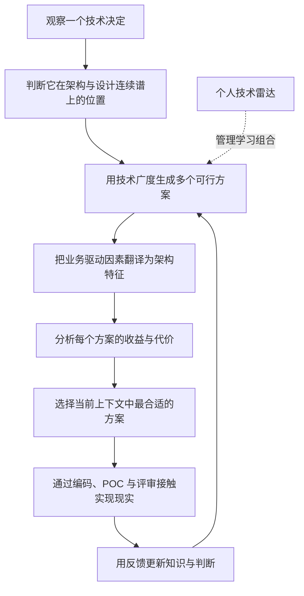
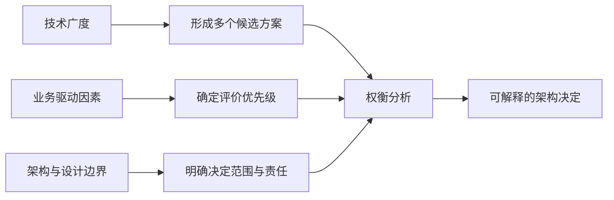
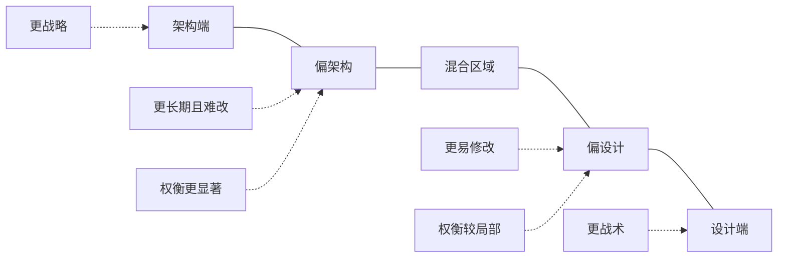
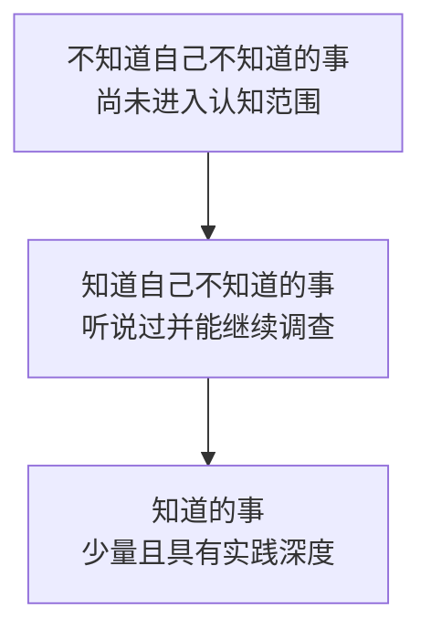
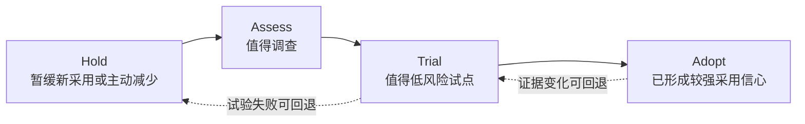
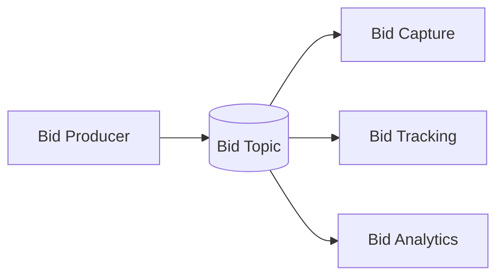
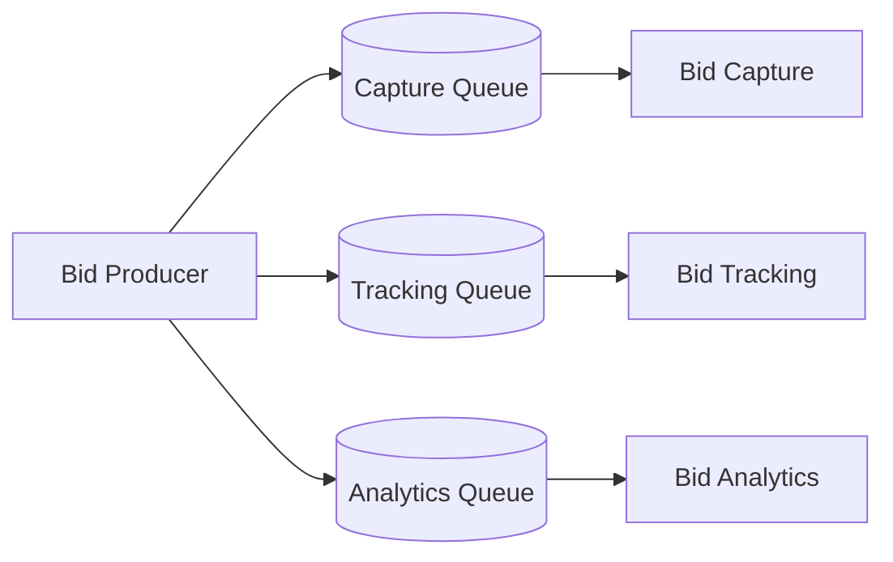
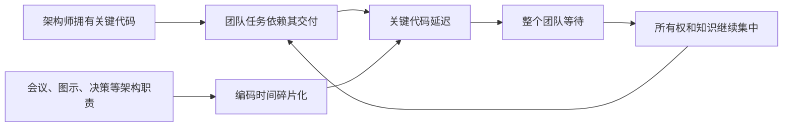
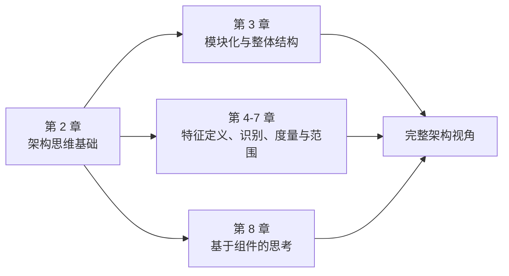
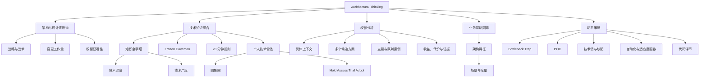

> 对应原章：2. Architectural Thinking.md
> 本章讨论的不是某一种架构风格，而是架构师看待问题的方式：如何区分架构与设计，如何管理技术知识，如何把业务驱动因素翻译成架构问题，如何分析没有标准答案的权衡，以及如何在架构职责与动手编码之间保持平衡。
> 本笔记严格沿原章顺序展开。原章没有正式的数学算法；文中的判断向量、风险公式、加权矩阵、决策伪代码和示例指标都是教学化工具，用于显式呈现作者的推理，不应误认为原书逐式给出的内容。

## 0. 本章要回答的核心问题

1. 什么叫“用架构师的眼光看问题”？
2. 架构与设计为什么不是非黑即白的二分，而是一条连续谱？
3. 战略性、变更工作量和权衡显著性如何帮助判断一个决定更偏向架构还是设计？
4. 为什么架构师需要技术广度，开发者通常更依赖技术深度？
5. “知道”“知道自己不知道”“不知道自己不知道”三类知识有什么差别？
6. 为什么从开发者转向架构师，往往需要主动放弃维护一部分深度？
7. 什么是 Frozen Caveman Antipattern，过去真实发生过的事故为何仍可能误导今天的判断？
8. 每天 20 分钟怎样持续扩展技术广度，为什么作者建议把它放在清晨查看邮件之前？
9. 个人技术雷达怎样对抗技术泡沫和随意学习？四象限与四环分别表达什么？
10. 为什么具体架构问题通常不能只靠搜索引擎或大语言模型给出答案？
11. 在拍卖系统中，主题和队列分别优化什么，又牺牲什么？
12. 怎样从业务驱动因素推导出可设计、可度量的架构特征？
13. 架构师为什么仍应编码，又为什么不能占据团队关键路径上的代码？
14. POC、技术债、缺陷修复、自动化和代码评审分别怎样帮助架构师保持动手能力？
15. 怎样把本章内容组合成一套可复用的架构思考流程？

本章的论证主线如下：



一句话概括：**架构思维不是拥有所有答案，而是能扩大候选空间、识别决定的影响范围，把业务目标转成架构关切，并在具体上下文中说清每个方案得到什么、失去什么。**

---

## 1. 开篇：什么是架构思维

Architectural thinking 可以直译为“架构式思考”，即从架构视角观察技术变化，而不是只看眼前代码能否工作。原章给出三个直观例子：

- 判断某项修改会怎样影响系统整体可扩展性；
- 留意系统不同部分如何交互，而不只关心单个模块内部；
- 根据具体情境判断哪种第三方库或框架更合适。

这三个例子共同体现了视角的变化：

| 普通局部问题 | 架构视角增加的问题 |
| --- | --- |
| 这段代码能否完成功能？ | 它会不会改变系统容量、故障传播或演进成本？ |
| 这个模块内部是否清晰？ | 模块之间的依赖方向、通信和数据所有权是否合理？ |
| 这个框架是否流行、是否好用？ | 它是否匹配业务驱动因素、团队能力、运行环境和长期约束？ |

架构视角不是“永远站得更高、拒绝实现细节”。它要求在不同尺度之间切换：既能看见跨组件和跨团队影响，也能通过实现细节验证抽象判断。

### 1.1 架构思维的四项基础

作者把架构思维建立在四项能力上：

1. **理解软件架构，以及架构与设计的差异**：知道一个决定影响多大、应由谁负责；
2. **拥有广泛的技术知识**：看见别人没有看见的候选方案；
3. **理解业务驱动因素并把它们翻译成架构关切**：避免只按技术偏好优化；
4. **理解、分析并调和权衡**：承认每个方案都有代价，作出上下文相关的选择。

这四项能力互相依赖：



只有技术广度而没有业务方向，会产生很多“能做”的方案，却不知道哪个值得做；只有业务目标而没有技术广度，容易把熟悉方案误当成唯一方案；没有权衡分析，则会把方案优点当成完整结论。

---

## 2. Architecture Versus Design：架构与设计

### 2.1 房屋类比：结构与外观

作者先让读者想象理想住宅。

房屋的楼层数、平顶或尖顶、单层大宅或多层住宅、卧室数量，共同定义整体**结构**，更接近 architecture。地毯或木地板、墙面颜色、落地灯或吊灯，则更接近内部**设计**。

软件中的对应关系是：

- 选择微服务会改变系统的总体形状、部署边界和通信结构，因此明显偏向架构；
- UI 的观感、配色和具体布局更偏向设计。

这个类比的价值是先建立两个极端，但它不能被理解成“结构全部是架构，外观全部是设计”的绝对规则。软件决定大多处在两端之间，例如：

- 是否把一个服务进一步拆小；
- 选择哪一种 UI 框架；
- 是否为某个模块引入独立缓存；
- 某个接口应同步还是异步。

这些决定既可能只是局部实现，也可能改变跨团队边界、架构特征或长期迁移成本。于是作者引入一条**连续谱**，而不是硬分类。



### 2.2 三个判断维度

原章给出三项标准：

1. 决定更偏**战略**还是更偏**战术**；
2. 构建或改变它需要多大**工作量**；
3. 它涉及的**权衡有多显著**。

可以把一个决定教学化地表示为判断向量：

$$
J(d) = \bigl(S(d), E(d), T(d)\bigr)
$$

- $S(d)$：决定 $d$ 的战略性；
- $E(d)$：实施、迁移或撤销它所需的工作量；
- $T(d)$：收益与代价对系统整体的显著程度。

这不是把架构机械打分的原书公式。三个维度可能互相冲突，也不存在书中规定的阈值。它的用途是迫使讨论者说明：为什么某个决定需要架构层关注，以及谁应参与。

| 决定 | 战略性 | 改变成本 | 权衡显著性 | 大致位置 |
| --- | --- | --- | --- | --- |
| 从分层单体迁移到微服务 | 高 | 高 | 高 | 明显偏架构 |
| 划分一个跨领域服务边界 | 中到高 | 中到高 | 高 | 偏架构 |
| 为前端选择长期框架 | 视组织影响而定 | 中到高 | 中到高 | 连续谱中部或偏架构 |
| 拆分一个过大的类 | 低 | 低 | 低 | 偏设计 |
| 调整页面字段顺序 | 低 | 低 | 低 | 明显偏设计 |

### 2.3 连续谱解决了什么问题

如果强迫每个决定只能标成“架构”或“设计”，会出现两类错误：

1. **把重要决定降格为局部实现**：跨团队影响、长期成本和关键特征没有被充分评审；
2. **把普通设计决定升级为架构审批**：架构师成为瓶颈，开发团队失去必要自主权。

连续谱允许责任随影响程度变化：明显偏设计的决定由开发者自主完成；明显偏架构的决定需要更多利益相关者、证据和记录；中间区域则可由架构师与开发团队共同决定。

### 2.4 Strategic Versus Tactical Decisions：战略决策与战术决策

越具战略性，决定越偏向架构；越具战术性，越偏向设计。

**战略决策**通常：

- 服务长期方向；
- 影响多个后续行动；
- 需要跨角色或跨团队协调；
- 不会频繁改变。

**战术决策**通常：

- 解决近期、局部问题；
- 与其他决定相对独立；
- 参与人数较少；
- 可以很快修改。

原章建议通过三个问题判断。

#### 问题一：需要多少思考和规划

几分钟内可以决定的事项通常更战术，因而更接近设计；需要数周分析、试验和计划的事项通常更战略，更接近架构。

时间本身不是因果标准。一个草率作出的架构决定仍然是架构决定；一个团队也可能为普通颜色争论数周。真正有意义的是：**这个决定是否需要理解大量依赖、未来影响和利益相关者约束。** 所需规划时间只是它们的可观察信号。

#### 问题二：多少人参与

个人或两位同事即可完成的决定往往较战术；需要多次会议和多类利益相关者参与的决定往往较战略。

参与人数反映影响范围，但也不能单独定性。低效组织可能让很多人参与小事，高度授权的组织也可能让小组承担重大决定。应继续追问：哪些人会承担成本、风险或迁移工作？

#### 问题三：长期愿景还是短期行动

很快会变化的决定通常偏战术；预期持续很久、为后续决定定向的选择更偏战略。

例如，“本周怎样修复一个查询超时”是战术问题；“未来三年数据访问是否统一经过领域服务”则会塑造大量后续工作，更偏战略。

#### 三个问题的组合用法

```text
若一个决定：
    需要跨依赖规划
    + 影响多个利益相关者
    + 建立长期方向
则将其放在连续谱的架构侧，并提高记录与验证强度。

若一个决定：
    局部、短期、易撤销
    + 只影响少数实现者
则让最接近代码的人在架构护栏内自主决定。
```

### 2.5 Level of Effort：工作量

Martin Fowler 在 “Who Needs an Architect?” 中把架构概括为“难以改变的东西”。原章由此得到第二个判断标准：越难构建或改变、越需要大量工作，越偏向架构；改变成本越低，越偏向设计。

原书的两个对照例子是：

- 从分层单体迁移到微服务，需要重划边界、拆分数据、改变部署和运维方式，工作量巨大，因此明显属于架构；
- 调整屏幕字段顺序，影响局部且修改容易，因此更属于设计。

#### “难改”不只是代码行数

教学上可以把变更成本拆开：

$$
C_{\mathrm{change}} = C_{\mathrm{implementation}} + C_{\mathrm{migration}} + C_{\mathrm{coordination}} + C_{\mathrm{operation}} + C_{\mathrm{risk}}
$$

| 成本 | 含义 | 例子 |
| --- | --- | --- |
| 实现成本 | 编写和测试新方案 | 拆分服务、重写接口 |
| 迁移成本 | 旧状态、数据和客户端怎样过渡 | 双写、回填、兼容期 |
| 协调成本 | 多少团队必须同步改变 | 跨团队发布、培训 |
| 运行成本 | 新结构需要什么平台和运维能力 | 监控、告警、容量管理 |
| 风险成本 | 改变失败会造成什么损失 | 停机、数据错误、回滚困难 |

这个公式不是要求精确货币化，而是防止只估算“开发几天”。许多决定之所以属于架构，正是因为代码之外的迁移和协调成本占主导。

#### 工作量标准的适用边界

- 工作量会随团队和平台能力变化，同一决定在不同组织的位置可能不同；
- 已有自动化可以降低变更成本，使过去的架构决定逐渐变得更像常规设计决定；
- 小改动也可能触碰高风险边界，例如更改认证默认值；
- 大工作量不自动代表架构，例如机械迁移大量页面素材可能很耗时，却不改变系统结构。

因此，工作量必须与战略性和权衡显著性一起判断。

### 2.6 The Significance of Trade-Offs：权衡的显著性

决定带来的收益和代价越重大、影响范围越广，它越偏向架构。

#### 微服务案例

原章列出采用微服务可能获得的能力：

- 更好的可扩展性；
- 更强的敏捷性；
- 更好的弹性；
- 更强的容错性。

同时，它可能付出的代价是：

- 结构和运行高度复杂；
- 成本很高；
- 数据一致性较差；
- 服务耦合和远程通信使性能变差。

这些收益和代价会影响系统、团队、基础设施与长期交付方式，所以“是否采用微服务”明显位于架构侧。

这里不能把列表误读成“所有微服务一定比所有单体更可扩展、更敏捷”。这些是风格倾向与常见权衡，是否兑现取决于服务边界、自动化、数据模型、团队结构和业务需求。

#### 拆分类的案例

把一个类拆成多个类，可能提高可维护性和可读性，但要管理更多类。它同样有权衡，只是代价通常局限于局部代码，远不如微服务结构的代价显著，因此偏向设计。

#### 显著性不等于数量

不能用“优点三条、缺点两条”决定显著性。一项涉及法规违规或数据丢失的缺点，可能压倒十项便利性收益。需要看：

1. 影响哪些架构特征；
2. 影响多少用户、系统和团队；
3. 失败后果有多大；
4. 代价是否长期持续；
5. 是否容易检测、隔离和恢复。

### 2.7 综合判断：谁应该负责这个决定

三项标准的真正目的不是给决定贴标签，而是安排合适的决策过程。

| 连续谱位置 | 推荐责任方式 | 需要的证据和记录 |
| --- | --- | --- |
| 明显偏架构 | 架构师、开发代表和关键利益相关者共同负责 | 业务驱动因素、候选方案、权衡、风险、后果和复查条件 |
| 中间区域 | 架构师与实施团队协作 | 简化的权衡说明、关键验证结果 |
| 明显偏设计 | 开发团队在既有原则内自主负责 | 代码、测试和必要的局部设计说明 |

一个实用判断流程是：

```text
function classify_decision(decision):
    strategic = inspect_planning_scope_people_and_lifetime(decision)
    effort = inspect_implementation_migration_coordination_and_risk(decision)
    tradeoffs = inspect_systemic_benefits_and_costs(decision)

    if all_are_high(strategic, effort, tradeoffs):
        return ARCHITECTURE_SIDE
    if all_are_low(strategic, effort, tradeoffs):
        return DESIGN_SIDE
    return COLLABORATIVE_MIDDLE
```

伪代码的直觉是：先判断影响，再决定治理强度。它不是投票算法；若某一项虽单独存在却具有灾难性影响，仍应提升决策级别。

---

## 3. Technical Breadth：技术广度

开发者要完成实现工作，通常需要在某种语言、平台、框架或产品上拥有很深的知识；架构师则必须知道更多类别的解决方案，才能从架构视角发现可能性。作者因此区分：

- **技术深度（technical depth）**：对少数主题知道得有多深入；
- **技术广度（technical breadth）**：知道多少不同主题，至少能识别其用途与主要权衡。

架构师不是不需要深度，而是其价值函数发生了变化：开发者常靠深度直接产出代码，架构师常靠广度生成候选方案、识别限制并找到合适专家。

### 3.1 知识金字塔

作者用知识金字塔把全世界技术知识分成三层。



图从下向上的箭头表示理想的知识迁移路径，不表示底层会被清空。技术世界不断增长，“未知的未知”永远存在。

#### 第一层：知道的事

这是每天用来工作的语言、框架、工具和平台。例如 Java 程序员熟练掌握 Java。它是金字塔最小的一层，因为没有人能对所有技术都成为专家。

这一层构成技术深度。它不仅需要获得，还需要维护：Ruby on Rails 专家如果一两年完全不接触 Rails，原有知识会随着框架和生态变化而逐渐过时。

#### 第二层：知道自己不知道的事

这一层包含听说过、略知用途，却没有实践经验或专业能力的主题。例如，知道 Clojure 是基于 Lisp 的编程语言，但不会编写 Clojure 代码。

它比第一层大得多，因为“知道某方案存在”比“成为专家”便宜。对架构师而言，这层尤其有价值：遇到匹配问题时，能够把它列为候选、快速调查或找到专家，而不是因为没听说过就永远排除。

#### 第三层：不知道自己不知道的事

这是最大的一层，其中可能恰好存在最适合当前问题的工具、语言、框架或技术，只是解决问题的人不知道它存在。

这类无知最危险的地方在于：人不会主动搜索一个完全不知道的概念。搜索通常只能回答已经能够提出的问题。因此，技术广度的首要目标不是立刻精通，而是不断把项目从第三层移动到第二层。

### 3.2 知识迁移的正确目标

职业发展可以理解为两种迁移：

1. **发现迁移**：未知的未知 $\rightarrow$ 已知的未知；
2. **能力迁移**：已知的未知 $\rightarrow$ 已知且能实践。

并非所有主题都应进入第一层。合理流程是：

```text
先知道某能力存在
    -> 理解它解决的问题与主要代价
    -> 在真实问题需要时深入试验
    -> 只有承担持续工作时才维护为专家知识
```

若把所有听说过的技术都提升为深度知识，维护成本会迅速超过个人时间。技术组合管理的本质，是决定哪些知识只需识别，哪些需要比较能力，哪些值得长期精通。

### 3.3 开发者与架构师的知识形状

职业早期的开发者通过扩大金字塔顶端获得专业能力，这是正确且必要的。成为架构师后，知识重心逐渐转向顶部与中部的组合：保留少数深度领域，同时让“知道自己不知道”的区域尽可能向未知区域扩展。

| 角色重心 | 主要知识目标 | 典型价值 |
| --- | --- | --- |
| 开发者 | 对当前技术栈形成并维护深度 | 正确、高效地实现复杂功能 |
| 架构师 | 保留必要深度，同时扩大候选技术认知 | 将业务能力与技术约束匹配，比较多种路径 |

作者作出一个看似反直觉的建议：架构师应允许一部分来之不易的专业知识自然退化，把释放的时间用于拓宽组合。喜欢或关键的领域仍可保持深度，但试图维持所有旧专长既不现实，也不经济。

### 3.4 为什么“知道五种方案”常比“只精通一种”更有价值

架构问题首先需要正确的候选空间。若一个人只精通方案 $A$，他很容易把每个问题都表述成适合 $A$ 的形式；知道 $A$ 到 $E$ 五类方案的用途和局限，即使不能亲手实现全部，也能：

- 识别问题属于哪一类；
- 排除明显不合适的方案；
- 找到值得做 POC 的少数候选；
- 向相应专家提出正确问题；
- 避免把个人熟悉度当成系统需求。

广度的有效下限不是记住名称，而是至少能回答：它解决什么问题、把复杂度放在哪里、主要风险是什么、什么条件下值得进一步调查。

### 3.5 角色转换中的两类失调

作者指出，从开发者转向架构师时常出现两种失调。

#### 失调一：试图在很多领域同时保持专家水平

结果通常是没有一项真正保持深度，同时个人被持续学习压垮。问题不是努力不够，而是专家知识具有维护成本，技术数量又持续增长。

#### 失调二：陈旧的专业知识

人以为自己仍掌握某项技术的前沿，实际依据却来自多年前。这在大型公司尤其常见：创始开发者进入领导岗位后不再亲手实践，却继续用早期经验决定今天的技术方向。

陈旧知识比明确的“不知道”更危险，因为它不会触发重新调查。承认“我以前很熟，但当前状态需要验证”是架构判断的重要能力。

### 3.6 Frozen Caveman Antipattern：冻结穴居人反模式

Andrew Koenig 把 antipattern 定义为：开始时看似好主意，最终却把人带入麻烦的做法。Frozen Caveman Antipattern 是一种行为反模式：架构师被过去的糟糕决定或意外事故“冻住”，之后面对每个系统都反复强调同一个非理性担忧。

#### “如果我们失去意大利怎么办”

原章的案例中，一个客户曾因罕见通信故障，导致总部无法与意大利门店通信，造成严重不便。几年后，每次评审集中式架构，客户架构师仍执着地问：“如果我们失去意大利怎么办？”

过去的事故是真实的，考虑风险也没有错。反模式出现在推理被过去单一事件接管时：

1. 某次低概率事件造成强烈记忆；
2. 记忆使该风险在认知中被过度放大；
3. 新系统无论上下文如何，都围绕旧事故优化；
4. 其他更可能或更严重的风险被挤出视野；
5. 架构承担长期复杂度，却未必换来相称收益。

#### 真实风险与感知风险

一个常见教学模型是：

$$
R(e) = P(e) \times I(e)
$$

- $P(e)$ 是事件 $e$ 的发生概率；
- $I(e)$ 是事件发生后的影响；
- $R(e)$ 是用于比较的期望风险。

它提醒团队同时考虑概率和影响，而不是只被生动案例支配。但它也有局限：极端尾部风险、监管底线、不可逆损失和相关故障不能仅靠期望值处理。更完整的问题是：

- 旧事故的原因在当前系统中仍存在吗？
- 当前概率和影响有何证据？
- 与其他风险相比，它排在什么位置？
- 预防成本是否低于风险降低带来的收益？
- 能否用恢复演练、隔离或监控代替昂贵的永久结构？

#### 如何走出冻结状态

1. 明确写出担忧背后的历史事件；
2. 把历史条件与当前条件逐项比较；
3. 使用当前数据估计风险，而不是只讲故事；
4. 主动寻找其他解决方案；
5. 邀请未经历旧事故的人挑战假设；
6. 让风险缓解措施与实际优先级匹配。

技术广度在这里发挥直接作用：候选方案越多，架构师越不容易用过去唯一熟悉的防御方式解决所有风险。

### 3.7 The 20-Minute Rule：20 分钟规则

架构师需要扩展广度，却同时有全职工作、职业发展、朋友和家庭。作者给出的办法不是偶尔集中学习，而是每天至少投入 20 分钟学习新主题或深入已有主题。

若全年坚持，其累计时间约为：

$$
T_{\mathrm{year}} = \frac{20 \times 365}{60} \approx 121.7\ \mathrm{hours}
$$

这只是说明小时间块的累积效应，不是要求全年无休或用时长替代学习质量。关键是建立稳定、低门槛的知识发现机制。

#### 20 分钟可以做什么

原章建议的信息源包括：

- InfoQ；
- DZone Refcardz；
- Thoughtworks Technology Radar；
- 搜索不熟悉的技术术语；
- 阅读本书或其他技术书。

最重要的产出往往不是“学会使用”，而是把一个术语从“不知道自己不知道”移动到“知道自己不知道”：知道它存在、解决哪类问题、何时值得深入。

#### 为什么安排在早晨、邮件之前

很多人计划午餐或下班后学习，但作者观察到：午餐容易被工作侵占，晚上容易被社交、家庭和疲劳占据。他们强烈建议在早晨喝完咖啡或茶后、查看电子邮件之前完成。

原因不是早晨对所有人都有神奇效果，而是：

1. 尚未被响应性工作占据注意力；
2. 精力相对充足；
3. 邮件会启动别人为你安排的优先级；
4. 把学习放在固定触发器后，更容易形成习惯。

若个人作息不同，可以保留原则而调整时间：选择最不容易被临时事务吞噬的固定时段，并把它放在高干扰活动之前。

#### 一个可执行的 20 分钟循环

```text
2 分钟：从个人雷达的 Assess 项中选择一个问题
12 分钟：阅读一份高质量材料或运行一个最小试验
4 分钟：记录它解决的问题、主要收益和主要代价
2 分钟：决定保持 Assess、进入 Trial，还是移入 Hold
```

这不是原章规定的时间分配，而是把 20 分钟规则与后面的个人雷达连接起来。不要让记录本身吃掉学习时间；每次留下几行可检索结论即可。

### 3.8 Developing a Personal Radar：建立个人技术雷达

#### Clipper 消失的教训

20 世纪 90 年代到 21 世纪初，作者之一曾担任一家小型培训与咨询公司的 CTO。公司的主要平台是 Clipper：一种在 dBASE 文件之上构建 DOS 应用的快速开发工具。公司注意到了 Windows 的兴起，但企业市场仍以 DOS 为主，直到某一天市场突然不再如此，庞大的 Clipper 经验迅速失去价值。

这个案例的关键不是嘲笑旧技术，而是说明技术转换具有非线性：

```text
新平台出现
    -> 很长时间看似只是边缘趋势
    -> 生态、客户和工具逐步迁移
    -> 某个临界点后需求突然转向
    -> 旧知识的市场价值快速下降
```

详细知识会过时，是软件职业的常态。忽视技术演进并不会保护已有投入，只会让人更晚发现组合已经失衡。

#### 技术泡沫与回音室

当开发者或架构师在某项技术上投入大量工作和认同，就容易进入 memetic bubble（模因泡沫）：泡沫中的每个人都像自己一样关心并认可该技术，外部批评很难进入，供应商主导的社区还可能进一步过滤负面信息。

泡沫带来三种认知偏差：

- **选择性信息**：只接触支持既有投入的消息；
- **虚假普遍性**：把社区内部热度误认为整个市场共识；
- **延迟预警**：生态已衰退时，内部讨论仍显得活跃。

因此，架构师需要一个持续更新的外部观察机制，而不是依赖偶然资讯。

#### 技术雷达是什么

技术雷达是一份 living document（持续演进的文档），用于评估现有与新兴技术的收益、风险和投入优先级。它解决的不是“预测哪个技术一定胜出”，而是三个更实际的问题：

1. 我正在关注什么，为什么？
2. 我对它的认识处于听说、评估、试验还是采用阶段？
3. 有哪些技术、习惯或信息源应减少投入？

### 3.9 The Thoughtworks Technology Radar：Thoughtworks 技术雷达

Thoughtworks 的 Technology Advisory Board（TAB）由公司内的资深技术领导者组成，帮助 CTO 决定公司及客户的技术方向和战略。为了保持更新，TAB 开始制作如今每半年发布一次的 Technology Radar。

雷达产生了超出内部决策的影响：其他公司开始制作自己的版本，开发者和架构师也用类似结构回答“怎样跟上技术、下一步研究什么”。其价值不是替所有人给出统一答案，而是提供一种显式管理技术判断的结构。

#### 3.9.1 Parts：四个象限

Thoughtworks 雷达用四个象限覆盖软件开发的大部分领域：

| 象限 | 范围 | 示例类型 |
| --- | --- | --- |
| Tools | 从开发工具到企业集成工具 | IDE、构建工具、分析器、集成工具 |
| Languages and Frameworks | 编程语言、库和框架，通常包含开源项目 | 语言、Web 框架、测试库 |
| Techniques | 帮助软件开发的实践 | 流程、工程实践、设计与交付建议 |
| Platforms | 提供运行或基础能力的平台 | 数据库、云厂商、操作系统 |

象限回答“这是什么类别”，并不表达推荐强度。一个数据库和一种工程实践不能用同一技术细节比较，但都可以进入组织的投资讨论。

#### 3.9.2 Rings：四个环

雷达由外到内包含 Hold、Assess、Trial、Adopt 四环。每个 blip（雷达点）代表一项技术或实践。



箭头用于表示可能的学习路径，不表示每项技术都必须逐环向内，也不表示位置只能前进。证据和上下文变化时，项目可以停留、回退或移除。

##### Hold

Hold 最初表示“现在先不要用”，针对过新、热度很高但尚未验证的技术；后来更接近“不要用它启动新项目”。已有项目继续使用不一定有问题，但新开发应慎重。

个人雷达还可以把想戒掉的习惯或低价值信息源放入 Hold。例如，某位 .NET 背景的架构师可能花大量时间阅读团队内部八卦，这很有趣，却未必提高技术判断。Hold 在这里是注意力的停止清单。

##### Assess

Assess 表示值得探索。可通过研究项目、会议内容或短期技术 spike 了解它会怎样影响组织。

个人雷达中，Assess 是有良好信号但尚未亲自验证的技术暂存区。它帮助区分“听说过”与“我推荐使用”。

##### Trial

Trial 表示值得认真投入，应该理解怎样构建它，并在低风险项目中试点。

个人雷达中，Trial 代表正在主动研究和开发，例如在较大代码库内做 spike。目标是获得足够一手经验，使它能进入真实权衡分析。

##### Adopt

Thoughtworks 的 Adopt 表示公司强烈认为行业应采用这些项目。

个人 Adopt 则表示自己最认可、最感兴趣的新技术，或已经验证过的特定问题最佳实践。它仍不是“任何项目默认使用”；采用建议总有问题和上下文边界。

#### 3.9.3 组织雷达与个人雷达不能直接等同

| 维度 | Thoughtworks 或组织雷达 | 个人雷达 |
| --- | --- | --- |
| 判断主体 | 多位技术领导者形成集体观点 | 个人依据职业方向与经验判断 |
| 服务目标 | 组织和客户的技术战略 | 个人学习、能力与职业组合 |
| Adopt 含义 | 组织具有较强采用立场 | 个人已验证、愿意继续投入 |
| Hold 含义 | 通常不建议新项目采用 | 也可包含要停止的习惯和信息源 |
| 证据来源 | 多项目经验和集体讨论 | 阅读、试验、工作反馈与交流 |

直接照抄 Thoughtworks 雷达会失去上下文。它可以提供发现线索，但个人和组织仍要根据自身业务、环境、能力与目标重新判断。

#### 3.9.4 用投资组合思维管理技术能力

作者建议像管理金融投资组合一样管理技术组合：要多样化。

- 选择一些市场需求广泛的技术或技能，并持续观察需求；
- 也可以配置少量高不确定、高潜力的技术尝试，例如生成式 AI 或嵌入式 IoT 设备；
- 不要让个人职业完全依赖一个供应商、一个框架或一种问题类型；
- 也不要因为“更酷”就忽略就业市场、学习成本和个人兴趣之间的权衡。

组合类比的边界是：技能不是可瞬间交易的金融资产，学习之间还会产生迁移效应。例如，一种函数式语言可能提高对不可变性的理解，即使不直接用于工作，也可能改善其他技术判断。

#### 3.9.5 怎样创建个人雷达

下面是一套与原章思想一致的实践流程：

1. **收集候选项**：从工作难题、20 分钟学习、社区外部信号和同事讨论中收集；
2. **放入象限**：判断它属于工具、语言与框架、技术实践还是平台；
3. **写清问题**：每个雷达点必须说明它解决什么问题，而不只是一个名称；
4. **放入环**：根据一手证据和投入意图选择 Hold、Assess、Trial 或 Adopt；
5. **记录依据**：写下收益、风险、当前证据和下一步；
6. **安排时间**：从 Assess 中选择 20 分钟主题，从 Trial 中选择小型 POC；
7. **定期复查**：删除过时项、移动位置并记录理由；
8. **与他人讨论**：用不同经验打破个人回音室。

每个雷达点可采用一个很小的记录模板：

```text
名称：
象限：Tools | Languages and Frameworks | Techniques | Platforms
环：Hold | Assess | Trial | Adopt
它解决的问题：
可能收益：
主要代价或风险：
当前证据：
下一步行动：
复查日期或触发条件：
```

原章强调：**建立雷达的过程比最终图片更重要。** 分类和移动雷达点会迫使人留出时间思考、比较标准并与他人对话。可视化只是这些思考的外显结果。

Thoughtworks 还发布了 Build Your Own Radar 工具，可使用 Google 电子表格生成个人雷达。工具降低了绘图成本，但不能替代判断本身。

---

## 4. Analyzing Trade-Offs：分析权衡

架构思维的核心活动，是看见技术与非技术方案中的权衡，并根据具体情境选择最好，或更准确地说“最不差”的方案。

原章用两句话强调其上下文依赖：

> Architecture is the stuff you can't Google or ask an LLM about.

> There are no right or wrong answers in architecture--only trade-offs.

第一句话不表示搜索引擎和 LLM 对架构无用。它们能帮助解释技术、枚举候选、发现风险和生成验证思路，但无法仅凭一个抽象问题知道组织的部署环境、业务驱动因素、文化、预算、期限、开发者技能和其他约束。**通用工具可以提供事实与选项，不能自动拥有本地上下文并替决策者承担后果。**

第二句话也不表示所有答案同样好。违反法律、硬性容量要求或明确业务底线的方案可以直接判错；所谓“只有权衡”强调的是：在多个可行方案之间，不存在脱离上下文的永久冠军。

### 4.1 “It depends” 应该依赖什么

“视情况而定”如果没有后半句，只是在回避判断。架构师应继续说明它取决于：

- 部署和运行环境；
- 业务成功驱动因素；
- 公司文化和团队所有权方式；
- 预算和总体成本；
- 交付期限；
- 开发与运维技能；
- 安全、监管和数据约束；
- 可接受的故障与恢复方式。

高质量回答的结构应是：

```text
如果上下文更重视 X，并且约束 Y 成立，方案 A 更合适，代价是 Z；
如果优先级变为 P，或假设 Y 不成立，则应重新比较方案 B。
```

### 4.2 拍卖系统：问题设置

原章用在线物品拍卖系统演示权衡。竞拍者提交报价后，`Bid Producer` 产生一条 bid，并把它交给三个服务：

- `Bid Capture`：捕获竞价；
- `Bid Tracking`：跟踪竞价；
- `Bid Analytics`：分析竞价。

异步传递有两个候选模型：

1. **主题（topic）+ 发布/订阅**：生产者只向一个主题发布，各服务分别订阅；
2. **多个队列（queues）+ 点对点**：生产者向每个消费者对应的队列发送消息。





这里比较的不是“异步还是同步”，而是在已经选择异步行为后，比较两种消息分发拓扑。

### 4.3 第一轮分析：主题看起来明显更好

#### 优势一：架构可演化性（architectural extensibility）

主题方案中，`Bid Producer` 只连接一个主题。若新增 `Bid History` 服务，为每个竞拍者保存历史报价，只需让新服务订阅现有主题；已有生产者、消费者和主题基础设施无需修改。

队列方案中，需要：

1. 创建新的 History 队列；
2. 修改 `Bid Producer`，增加到新队列的连接与发送；
3. 部署并验证生产者变更。

因此，新增消费者的变化传播范围不同：

$$
\Delta_{\mathrm{topic}} \approx \{\text{new consumer}\}
$$

$$
\Delta_{\mathrm{queues}} \approx \{\text{new queue},\ \text{producer change},\ \text{new consumer}\}
$$

这是教学化集合表达，强调“加入功能要改哪些元素”，不是性能公式。

#### 优势二：服务解耦

主题方案中，生产者不知道谁会使用报价，也不需要知道用途；它只发布事实。队列方案中，生产者明确知道三个消费者及其通道，新消费者会改变生产者。

这是一种**拓扑耦合**差异：

- 主题让生产者依赖事件契约和主题，不依赖消费者数量；
- 多队列让生产者依赖每个目标通道，消费者集合进入生产者知识范围。

到这里，主题似乎是显然答案。但 Rich Hickey 的提醒正是：程序员常知道方案的收益，却不知道其权衡；架构师必须同时理解两者。这里的 extensibility 指新增功能和消费者时的演化成本，不是处理更多运行负载的 scalability。

### 4.4 第二轮分析：主题的隐藏代价

#### 代价一：数据访问与安全

在原章的概念模型中，任何能订阅主题的服务都可以复制竞价数据。一个未授权或恶意服务可以旁听主题，而正常消费者仍然收到消息，因此泄露不容易通过消息缺失被发现。

队列中，每条消息由特定消费者取得。若恶意消费者从队列取走消息，合法服务将收不到对应报价，数据损失会触发通知，从而暴露异常。作者据此概括：主题容易被窃听，队列不容易。

这个结论依赖具体中间件和安全配置。现代消息代理通常支持身份认证、主题级 ACL、加密和审计；这些措施可以降低风险，但也会增加策略管理和监控成本。原书要表达的核心是：**广播式分发扩大了潜在数据可见面，必须把访问控制纳入权衡。**

#### 代价二：同质契约

原章中的主题模型让所有订阅者接收同一份报价契约。假设新增的 `Bid History` 还需要当前要价，而其他服务不需要，那么修改共享契约会影响所有订阅者。

队列模型可以为每个消费者建立独立通道和独立契约，只给 History 队列增加当前要价，不影响 Capture、Tracking 和 Analytics。

| 模型 | 契约关系 | 优点 | 代价 |
| --- | --- | --- | --- |
| 共享主题 | 多消费者共享事件契约 | 发布简单、事实一致 | 新字段、版本和敏感数据影响面更大 |
| 消费者专属队列 | 每个通道可有独立契约 | 可按消费者裁剪 | 生产者知道更多消费者，转换逻辑增多 |

这同样不是所有消息平台的绝对限制。可以在主题上使用版本化事件、schema registry、消费者投影或多个主题，但复杂度只是被移动到契约治理和转换层，不会凭空消失。

#### 代价三：监控与程序化扩缩容

原章指出，在该主题模型中，不能通过“主题中有多少待处理消息”监控每个消费者积压，因此难以根据积压自动扩容。队列则可逐个监控深度，并对每个竞价消费者独立负载均衡和扩缩容。

这里作者特别标注了**技术特定性**。AMQP 把生产者发送的 exchange 与消费者监听的 queue 分开，可以同时支持灵活路由、队列监控和程序化负载均衡。其他现代平台也可能提供 consumer lag 等指标。

因此，架构师不能只凭“topic”或“queue”标签下结论，必须核实具体产品语义：

- 消息是被多个订阅复制，还是由消费者组竞争？
- 每个订阅是否有独立持久化积压？
- 能否观测消费者延迟和失败？
- ACL 作用于主题、订阅还是队列？
- 契约由生产者、通道还是消费者管理？

### 4.5 完整权衡表

原书表 2-1 从主题视角总结：

| 主题优势 | 主题劣势 |
| --- | --- |
| 架构可演化性 | 数据访问与数据安全问题 |
| 服务解耦 | 不支持异质契约 |
|  | 监控和程序化扩缩容受限 |

为了看清另一面，可对称展开队列：

| 队列可能获得 | 队列相应代价 |
| --- | --- |
| 每个消费者有专属访问边界 | 生产者与消费者集合更耦合 |
| 每个通道可独立定义契约 | 契约和发送逻辑数量增加 |
| 可逐队列观察积压并扩缩容 | 增加通道、配置和基础设施管理 |
| 非法消费可能造成可见消息缺失 | 检测依赖可靠告警，且消息已被干扰 |

最终问题不是“哪个优点更多”，而是：**对当前拍卖业务而言，架构可演化性和生产者解耦，与安全、契约差异和独立扩缩容相比，谁更重要？**

### 4.6 两种可能得到不同结论的上下文

#### 上下文 A：消费者变化频繁，事件本身可广泛共享

- 新分析、历史和通知消费者经常加入；
- 报价事件没有超出订阅者权限的敏感字段；
- 平台支持可靠 ACL、独立订阅积压和 consumer lag；
- 共享事件契约可以稳定演进。

此时主题的扩展性和解耦收益可能占主导。

#### 上下文 B：数据访问严格，消费者需要明显不同的负载

- 每个消费者只能看到最小必要字段；
- History 需要的字段与 Analytics 明显不同；
- 各消费者流量和处理速度差异很大；
- 当前中间件无法可靠观察主题订阅积压。

此时独立队列可能更容易满足安全、契约和扩缩容要求。

两个结论都可能正确，因为上下文不同。这正是“不能直接搜索出答案”的含义。

### 4.7 一套完整的权衡分析方法

原章通过案例展示分析习惯，没有给出正式算法。可以将其整理为以下步骤：

```text
function analyze_tradeoffs(problem, context):
    drivers = identify_business_drivers(context)
    characteristics = translate_to_architecture_characteristics(drivers)
    constraints = identify_hard_constraints(context)
    options = generate_distinct_options(problem)

    for each option in options:
        verify_actual_technology_semantics(option)
        list_benefits(option, characteristics)
        list_costs_and_failure_modes(option, characteristics)
        identify_who_gains_and_who_pays(option)
        test_high_uncertainty_assumptions(option)

    feasible = reject_constraint_violations(options, constraints)
    decision = choose_for_current_priorities(feasible, drivers)
    document_context_tradeoffs_and_review_triggers(decision)
    return decision
```

#### 每一步为什么必要

1. **先找业务驱动因素**：没有优先级，就无法比较安全和扩展性谁更重要；
2. **翻译为架构特征**：把业务语言转成可设计和验证的系统能力；
3. **明确硬约束**：先淘汰不可接受方案，避免用小优点补偿法律或安全底线；
4. **生成不同方案**：广度不足时，比较可能退化为“熟悉方案与什么都不做”；
5. **核实技术语义**：主题和队列等标签在不同产品中行为不同；
6. **同时列收益与代价**：防止只做方案推销；
7. **定位收益和成本承担者**：系统总收益可能掩盖某团队无法承受的迁移成本；
8. **验证不确定假设**：用 POC、容量测试或安全评审替代猜测；
9. **记录上下文和复查触发器**：当优先级或平台能力变化时重新判断。

### 4.8 加权矩阵：辅助讨论，而非替代判断

当候选较多时，可以教学化地使用加权效用：

$$
U(a \mid c) = \sum_{i=1}^{n} w_i(c)s_i(a) - \sum_{j=1}^{m} r_j(c)p_j(a)
$$

- $a$ 是候选方案；
- $c$ 是当前上下文；
- $w_i(c)$ 是第 $i$ 项收益在当前上下文中的权重；
- $s_i(a)$ 是方案对该收益的支持程度；
- $r_j(c)$ 是第 $j$ 类风险的重要性；
- $p_j(a)$ 是方案暴露于该风险的程度。

它的正确用法是暴露假设，而不是制造“8.37 分必然优于 8.21 分”的精确幻觉。使用时应遵守：

1. 硬约束不参与加权补偿，违反即淘汰；
2. 分数必须附带证据和不确定性；
3. 对权重做敏感性分析：稍微调整优先级，结果是否翻转？
4. 记录少数真正决定结论的因素，而不是堆几十项平均掉风险；
5. 最终决定仍需文字说明收益、代价和适用边界。

---

## 5. Understanding Business Drivers：理解业务驱动因素

架构思维还要求理解“什么使系统在业务上成功”，并把这些要求翻译为可用于架构设计的特征，例如可扩展性、性能和可用性。

### 5.1 为什么不能从技术特征直接开始

“高可用”“高性能”“可扩展”听起来都很好，但没有系统能把所有能力无限提高。每项能力都需要成本，还可能与其他能力冲突。

业务驱动因素提供选择依据：

```text
业务结果
    -> 关键场景与失败后果
    -> 架构特征
    -> 可度量目标
    -> 结构和技术决定
```

例如，“拍卖最后一分钟不能流失有效出价”可能推导出：

- 高峰期容量和可扩展性；
- 报价接收延迟目标；
- 消息可靠性与可恢复性；
- 故障时的业务降级策略；
- 对接受、排序和确认语义的一致性要求。

若只说“使用消息队列”，就跳过了为什么使用、要保护什么，以及怎样验证成功。

### 5.2 翻译为何困难

#### 业务语言与技术语言不同

利益相关者可能说“不能太慢”“必须随时可用”“年底要支持更多客户”。这些表达有业务含义，却不能直接指导容量、拓扑和恢复设计。

#### 驱动因素彼此冲突

更严格的一致性可能增加延迟；更高可用性可能增加基础设施与运行复杂度；更强安全隔离可能降低集成便利性。

#### 隐含要求不容易出现

真正决定结构的条件可能藏在异常流程中：促销时的峰值、跨地区断网、监管审计、批量结算窗口或数据保留期限。

#### 利益相关者的成功标准不同

业务负责人关注收入和上市时间，安全团队关注泄露风险，运维团队关注恢复和可观测性，开发团队关注可修改性。架构师要让这些目标进入同一权衡讨论。

### 5.3 从驱动因素到架构特征的示例

以下是教学化示例，不是原章给出的固定阈值：

| 业务表达 | 追问后的场景 | 候选架构特征 | 可验证表达 |
| --- | --- | --- | --- |
| 拍卖结束时不能卡住 | 最后 60 秒流量达到平时若干倍 | 可扩展性、性能 | 在约定峰值下，报价接收延迟满足业务阈值 |
| 已接受报价不能丢 | 节点在确认前后故障 | 可靠性、可恢复性 | 故障注入时满足约定消息丢失和恢复目标 |
| 新分析功能要快速接入 | 每季度增加消费者 | 可演化性、可修改性 | 新消费者无需修改核心生产者或只需限定范围修改 |
| 竞价数据只能被授权方使用 | 新服务尝试订阅 | 安全性、审计性 | 未授权身份被拒绝且访问尝试可审计 |

关键是让特征具有**场景、刺激、响应和度量**，而不是只列抽象名词。阈值必须与业务共同确定。

### 5.4 领域知识与协作关系

作者强调，这项翻译工作需要：

- 一定的业务领域知识；
- 与关键业务利益相关者建立健康、协作的关系。

领域知识帮助架构师听懂规则、发现例外和提出正确问题；协作关系让利益相关者愿意暴露真实优先级、风险和组织约束。架构师不能独自在技术会议中猜出业务成功标准。

### 5.5 与后续章节的关系

原章说明全书用四章继续展开：

| 后续章节 | 解决的问题 |
| --- | --- |
| 第 4 章 | 定义各种架构特征 |
| 第 5 章 | 识别并限定真正重要的架构特征 |
| 第 6 章 | 度量特征，验证业务需求是否满足 |
| 第 7 章 | 讨论架构特征的作用范围及其与耦合的关系 |

这一顺序本身是一条方法链：先建立词汇，再从业务中识别，接着让它可测，最后确定影响范围。第 2 章只建立“必须做翻译”的架构思维，具体技术由后续章节展开。

---

## 6. Balancing Architecture and Hands-On Coding：平衡架构与动手编码

作者明确认为：每位架构师都应该编码，并保持一定技术深度。困难在于，架构师还要画图、分析、开会、沟通和治理，不可能像全职开发者一样稳定承担大量交付任务。

真正的问题不是“架构师写不写代码”，而是：**写什么代码、何时写、是否会让团队依赖他才能前进。**

### 6.1 为什么架构师仍需要编码

- 保持对语言、框架和开发环境的现实理解；
- 验证架构决定是否真正可实现；
- 感受团队在流程、工具和代码中的摩擦；
- 提高 POC、评审和技术指导的可信度；
- 避免专业知识完全变成陈旧经验。

编码不是为了证明架构师比团队更强，也不是为了保住所有深度，而是让高层判断持续受到实现事实约束。

### 6.2 Bottleneck Trap：瓶颈陷阱

当架构师负责系统关键路径上的代码，通常是底层框架或最复杂部分时，就可能形成 Bottleneck Trap 反模式。

因果链如下：



问题不在于架构师能力不足，而在于他不是全职开发者。关键路径任务需要稳定注意力和及时响应，架构职责却会不断打断它。个人越不可替代，系统交付风险越高。

### 6.3 推荐做法：写非关键、提前一到三次迭代的业务功能

作者建议：

1. 把系统关键部分委托给开发团队；
2. 架构师选择一个较小的业务功能，例如服务或 UI 页面；
3. 选择距离当前一到三次迭代之后才需要的工作。

时间缓冲非常关键。即使架构会议突然增加，架构师的代码延迟也不会阻塞当前迭代。

这个做法产生三个效果：

#### 效果一：保持生产编码经验而不阻塞团队

架构师写的是实际生产代码，可以接触构建、测试、部署和运行现实，但任务不在眼前关键路径上。

#### 效果二：关键框架与复杂代码由团队拥有

开发团队不再等待架构师，也能真正理解最难部分。知识和所有权分布到长期维护者，而不是集中在兼职编码者手中。

#### 效果三：架构师经历团队的真实痛点

架构师写与团队相同的业务代码，会亲身遇到低效构建、复杂审批、糟糕脚手架、难以测试的接口和开发环境问题。这样，流程改进不再只依赖汇报。

### 6.4 如果无法参与团队功能开发

原章提供五类替代方法。

#### 6.4.1 Frequent proofs-of-concept：频繁做 POC

POC 既要求编码，也能把实现细节带入架构验证。

原书以两个缓存方案为例：分别做可工作的最小示例，可以亲自比较：

- 实现完整方案需要多少工作；
- 性能和可扩展性怎样；
- 故障时怎样表现；
- 开发和运维复杂度有何差异。

一个有效 POC 应围绕能改变决定的假设，而不是演示“Hello World”：

```text
决策问题：两个缓存方案哪个更适合？
关键假设：方案 A 在目标容量下延迟更低，且故障恢复可接受。
最小试验：实现同一读写场景，注入节点故障并测量恢复。
产出：证据、限制、未验证项和对最终决策的影响。
```

#### 为什么 POC 也应尽量保持生产级代码质量

作者给出两个原因：

1. 所谓“抛弃型”代码经常进入仓库，随后成为参考架构或团队示例；
2. 持续写草率 POC 会练习并固化糟糕编码习惯，无法维持高质量编码能力。

“生产级”不表示 POC 必须具备完整产品功能，而是核心示例应结构清晰、测试关键假设、明确错误处理边界，并标注哪些部分不能直接投入生产。

#### 6.4.2 Tackle technical debt：处理技术债

架构师可以承担一些技术债，让开发团队集中处理关键业务故事。原章认为技术债通常优先级较低，因此若架构师没有在当前迭代完成，一般不会影响迭代成功。

适合选择的任务应满足：

- 不在本次交付关键路径；
- 能增进对真实代码结构的理解；
- 范围可控，可以安全中断；
- 完成后确实降低维护或运行成本。

“技术债通常低优先级”不是说所有债都可延后。安全漏洞、即将导致事故的容量问题或持续阻塞交付的债务可能具有最高优先级，此时应交给有稳定时间的团队成员共同处理。

#### 6.4.3 Fix bugs：修复缺陷

修复缺陷不耀眼，却能让架构师：

- 阅读真实执行路径；
- 看到模块边界和测试中的弱点；
- 理解故障如何传播；
- 发现架构决定与实际实现的偏差；
- 为开发团队减少工作量。

应避免只挑容易修的表面问题。最有学习价值的是范围可控、又能暴露系统行为和结构问题的缺陷。

#### 6.4.4 Automate：自动化

架构师可以编写简单命令行工具和分析器，自动化团队的重复工作，例如：

- 检查普通 lint 未覆盖的编码标准；
- 自动执行检查清单；
- 批量完成重复的手工重构；
- 分析依赖并检查架构边界；
- 实现架构适应度函数。

架构适应度函数把架构意图转成可持续执行的检查。例如，Java 平台可使用 ArchUnit 编写规则，验证展示层不能直接依赖持久化层：

```text
rule presentation_cannot_depend_on_persistence:
    source = classes_in("presentation")
    forbidden = classes_in("persistence")
    assert no_dependency(source, forbidden)
```

这段语言无关伪代码与原理的对应关系是：

- 架构决定定义禁止的依赖方向；
- 分析器从代码构建实际依赖图；
- 持续集成执行断言；
- 失败时在结构衰败扩散前反馈。

自动化既保持编码能力，又直接提高团队效率和架构合规性。第 6 章会继续讨论度量与适应度函数。

#### 6.4.5 Do code reviews：做代码评审

代码评审不等于亲自写代码，但至少让架构师持续接触代码库。它还能：

- 发现实现是否偏离架构原则；
- 识别团队辅导和培养机会；
- 观察抽象设计对日常开发是否友好；
- 从重复问题中发现需要自动化或调整架构的地方。

架构师参与评审不应演变为所有变更都等待一个人的批准。更好的目标是抽样高风险变更、建立共享标准并培养团队自行判断。

### 6.5 五种方式的适用比较

| 方法 | 主要价值 | 对迭代的阻塞风险 | 最适合的场景 | 主要局限 |
| --- | --- | --- | --- | --- |
| POC | 验证技术假设和实现成本 | 低，若独立且限时 | 架构候选难以仅靠文档比较 | 试验环境可能不代表生产 |
| 技术债 | 理解结构并降低维护成本 | 低到中，取决于范围 | 有可中断、非关键任务 | 容易无限扩张范围 |
| 缺陷修复 | 理解真实故障路径 | 取决于严重性；仅在非关键、可中断且可转交时较低 | 缺陷范围清楚且有学习价值 | 可能只接触局部症状；发布阻断或事故缺陷会落入关键路径 |
| 自动化 | 提高团队效率和合规 | 低 | 重复任务或可执行架构规则 | 工具本身需要维护 |
| 代码评审 | 保持代码感知并辅导团队 | 若全量审批则高 | 高风险改动和模式观察 | 不等于实际编写与调试 |

### 6.6 选择编码任务的实用规则

```text
function choose_architect_coding_work(task):
    if task.is_on_current_critical_path:
        delegate_to_full_time_team_member()
        support_with_pairing_or_review()
    elif task.validates_high_uncertainty_decision:
        timebox_as_proof_of_concept()
    elif task.is_interruptible_and_improves_system_or_team:
        implement_with_production_quality()
    else:
        stay_close_through_code_review_and_automation()
```

这不是原书算法，而是把 Bottleneck Trap 和五类建议组合成决策规则。核心原则是：**保持接触实现，但不要让组织必须等待架构师。**

### 6.7 “动手”不等于英雄式编码

常见误解是，架构师只有提交大量功能代码才算技术可信。实际上，更重要的是：

- 能理解和验证关键实现约束；
- 能与开发者讨论具体证据；
- 能写出值得模仿的代码；
- 能通过工具和评审扩大团队能力；
- 能把关键代码所有权留给长期维护团队。

架构师的目标不是在开发产出榜上竞争，而是让架构判断更贴近现实，同时让团队整体更强。

---

## 7. There’s More to Architectural Thinking：架构思维不止于此

作者最后强调，本章只建立了架构思维的基础。完整的架构视角还包括三个后续主题：

1. **理解系统整体结构**：第 3 章通过模块化继续展开；
2. **理解业务关切并翻译为架构特征**：第 4 至第 7 章系统展开；
3. **通过逻辑组件观察系统**：第 8 章讨论作为系统构建块的组件。



本章的作用不是让读者读完后“已经会做架构”，而是改变提问方式：从“我熟悉什么技术”转向“系统要成功需要什么能力”；从“这个方案有什么优点”转向“它牺牲了什么”；从“这是架构还是设计”转向“它在连续谱的什么位置，需要何种决策强度”。

---

## 8. 容易混淆的概念与常见误区

### 8.1 “架构与设计有清晰边界”

错误之处：大量决定同时影响结构和实现，强制二分会造成治理不足或过度审批。

正确理解：用战略性、变更工作量和权衡显著性判断它在连续谱上的相对位置。

### 8.2 “参与人数多或讨论时间长，就一定是架构”

错误之处：组织低效也会让小事耗时；草率决定也可能具有重大架构影响。

正确理解：人数和时间是影响范围的信号，必须继续检查长期方向、迁移成本和系统性后果。

### 8.3 “难改的东西才是架构，所以容易自动化修改的都不是架构”

错误之处：自动化会降低工作量，但决定仍可能影响安全、数据边界和多个团队。

正确理解：工作量只是三个标准之一，且应包含迁移、协调、运行与风险成本。

### 8.4 “架构师只需要广度，不需要深度”

错误之处：没有任何深度，架构师难以判断实现成本、验证 POC 或与开发者有效沟通。

正确理解：架构师保留少数必要深度，但把更多时间投入扩大中层知识和候选空间。

### 8.5 “技术广度就是听说过很多产品名”

错误之处：名称清单不能支持权衡。

正确理解：至少知道技术解决的问题、核心机制、主要收益、代价和何时需要专家。

### 8.6 “旧经验是真实事故，所以应在每个新系统中优先防范”

错误之处：真实发生不代表当前概率、原因和优先级相同。

正确理解：把历史条件与当前条件比较，用证据评估实际风险，避免 Frozen Caveman Antipattern。

### 8.7 “每天 20 分钟太少，没有系统学习价值”

错误之处：规则的首要目标是持续发现和分类知识，不是每天成为一个新领域专家。

正确理解：小时间块把未知移入认知范围；值得深入的项目再进入 Trial、POC 或系统课程。

### 8.8 “个人雷达应该照抄 Thoughtworks 雷达”

错误之处：组织观点服务于其客户、经验和战略，与你的职业目标和环境不同。

正确理解：外部雷达提供线索，个人必须重新分类、验证并写出自己的依据。

### 8.9 “Adopt 表示所有项目默认使用，Hold 表示立刻删除”

错误之处：环表示当前建议和投入意向，不消除具体问题上下文。

正确理解：Adopt 仍有适用范围；Hold 通常表示不建议新采用，已有系统是否迁移要单独分析成本。

### 8.10 “It depends 是架构师拒绝给答案”

错误之处：只说这句话确实没有价值，但上下文依赖本身是真实的。

正确理解：专业回答必须补全“取决于哪些驱动因素、假设如何改变结论、当前建议是什么”。

### 8.11 “没有绝对最佳，所以任何架构答案都可以”

错误之处：硬约束、证据和业务目标仍能淘汰错误方案。

正确理解：可行方案之间需要权衡；违反安全底线、容量要求或事实语义的方案并不会因“视情况而定”变正确。

### 8.12 “主题一定比队列解耦，所以一定更好”

错误之处：主题在生产者与消费者拓扑上更解耦，却可能增加数据可见面、共享契约和积压观测难度。

正确理解：先核实具体中间件语义，再根据安全、契约、扩展性和扩缩容优先级选择。

### 8.13 “队列天然安全”

错误之处：队列仍需认证、授权、加密和审计；恶意消费者造成消息缺失也已经构成安全事件。

正确理解：专属通道可能缩小访问面并使异常可见，但不能替代完整安全控制。

### 8.14 “业务方负责业务，架构师只需接收需求”

错误之处：模糊业务表达不会自动变成可设计、可测量的系统能力。

正确理解：架构师必须具备领域知识，并与利益相关者协作完成驱动因素到架构特征的翻译。

### 8.15 “架构师应该亲自写最难、最关键的代码”

错误之处：架构师时间不稳定，会成为团队关键路径瓶颈，并把知识与所有权集中到一人。

正确理解：关键代码由全职开发团队拥有；架构师通过提前的非关键功能、POC、自动化和评审保持动手能力。

### 8.16 “POC 是抛弃型代码，所以质量无所谓”

错误之处：POC 经常进入仓库并成为参考，草率代码也会练习错误习惯。

正确理解：POC 可以缩小功能和运行范围，但核心代码应清晰、可验证，并明确不能直接生产化的部分。

---

## 9. 从本章提炼的通用架构思考法

### 第 1 步：确定决定的尺度

检查战略性、改变工作量和权衡显著性，把问题放到架构—设计连续谱上。

**输出**：影响范围、参与者和适当的决策强度。

### 第 2 步：理解业务成功条件

询问业务结果、关键场景、失败后果、期限和硬约束，不要从喜欢的技术开始。

**输出**：有优先级的业务驱动因素。

### 第 3 步：翻译为架构特征

把“快、稳定、可增长”等语言变成带场景和度量的性能、可用性、可扩展性、安全性等关切。

**输出**：候选架构特征及验证方式。

### 第 4 步：扩大候选空间

利用技术广度、个人雷达、专家和资料，寻找多个机制真正不同的方案。

**输出**：候选方案及其适用前提。

### 第 5 步：核实具体技术语义

不要仅凭“主题”“队列”“微服务”等标签推理。检查所选产品的契约、故障、监控、安全和扩缩容行为。

**输出**：事实清单、未知项和需要验证的假设。

### 第 6 步：双向分析权衡

对每个方案同时问：得到什么、失去什么、复杂度移到哪里、谁获益、谁付费。

**输出**：与业务优先级对齐的权衡表。

### 第 7 步：验证最能改变结论的假设

使用 POC、容量试验、故障注入、安全评审或历史数据验证高不确定项。试验应回答决策问题，而不是展示技术能启动。

**输出**：足以更新判断的一手证据。

### 第 8 步：作出上下文相关的选择

先排除违反硬约束的方案，再选择最符合当前优先级、团队能够构建和运维的方案。

**输出**：当前建议、接受的代价和适用边界。

### 第 9 步：让实现反馈架构判断

通过非关键业务代码、自动化、缺陷修复和代码评审接触真实开发环境，同时避免占据关键路径。

**输出**：实现反馈、合规检查和待改进摩擦。

### 第 10 步：持续更新知识组合

每天投入小块时间发现技术，用个人雷达管理 Assess、Trial、Adopt 与 Hold，定期挑战旧经验和技术泡沫。

**输出**：更大的已知未知区域，以及下一轮值得验证的候选。

这十步形成闭环：新实现暴露的问题进入学习雷达，新知识扩大方案空间，业务和技术环境变化又要求重新分析旧权衡。

---

## 10. 本章知识结构



整章可压缩为五层能力：

1. **尺度判断**：知道决定更偏架构还是设计；
2. **认知管理**：用广度和雷达看见更多可能；
3. **目标翻译**：把业务成功条件转换为架构特征；
4. **权衡选择**：根据上下文比较收益、代价和风险；
5. **现实校验**：通过编码、POC、自动化和评审让判断接触实现。

---

## 11. 核心结论

1. **架构思维是一种观察尺度和推理方式，不等同于职位名称或只画高层图。**
2. **架构与设计位于连续谱上，不能只按“结构还是外观”机械二分。**
3. **战略性越强、改变工作量越大、权衡越显著，决定越需要架构层关注。**
4. **三项标准的目的，是匹配责任、证据和治理强度，而不是争夺“架构”标签。**
5. **开发者通常依赖技术深度直接实现，架构师则需要用技术广度发现和比较多个方案。**
6. **知识金字塔中最关键的职业动作，是不断把“不知道自己不知道”变成“知道自己不知道”。**
7. **架构师应保留必要深度，但允许部分旧专长退化，把有限时间投入更有价值的广度。**
8. **过去事故必须进入风险分析，却不能在脱离当前证据时支配所有系统，否则会形成 Frozen Caveman Antipattern。**
9. **每天至少 20 分钟的稳定学习，能以较低成本持续扩展认知边界；固定在干扰开始前更容易执行。**
10. **个人技术雷达把随意追热点变成显式组合管理，真正价值来自分类、讨论、试验和复查。**
11. **Hold、Assess、Trial、Adopt 表示当前证据和投入意图，不是技术的永久等级。**
12. **架构问题不能从通用搜索或 LLM 直接得到最终答案，因为决定依赖本地业务、组织、预算、技能和运行环境。**
13. **“It depends” 只有在说明依赖因素、当前建议和结论翻转条件时才是专业回答。**
14. **主题在拍卖案例中提高架构可演化性和生产者解耦，却可能牺牲数据访问控制、异质契约和独立积压监控。**
15. **队列提供更明确的消费者通道、契约和扩缩容单位，却让生产者知道更多消费者并增加基础设施管理。**
16. **消息系统权衡具有产品特定性，必须核实真实中间件语义，不能靠抽象标签决定。**
17. **业务驱动因素必须被翻译为带场景和度量的架构特征，才能指导和验证技术选择。**
18. **架构师应持续编码，但不应拥有当前关键路径上的代码。**
19. **提前的非关键功能、POC、技术债、缺陷、自动化和代码评审，都是保持技术现实感的有效方式。**
20. **最成熟的架构判断不是宣布某方案最好，而是解释它在什么条件下更合适、接受了哪些代价，以及何时应重新评估。**

---

## 12. 自测问题

### 12.1 什么是架构思维？

它是从系统整体和长期影响观察技术问题：理解结构和交互，识别业务驱动因素，用广泛技术知识形成候选，并根据具体上下文分析和调和权衡。

### 12.2 为什么架构与设计不能简单二分？

因为服务拆分、框架选择等大量决定既有局部实现成分，也可能影响长期结构。应使用战略性、改变工作量和权衡显著性判断其相对位置。

### 12.3 战略性判断的三个问题是什么？

决定需要多少思考和规划、多少人参与、它属于长期愿景还是短期行动。这些是信号，不是单独的绝对标准。

### 12.4 “架构是难以改变的东西”应怎样理解？

难改不仅指代码多，还包括数据迁移、跨团队协调、运行能力和失败风险。工作量越大，决定通常越偏架构，但仍要与战略性和权衡一起判断。

### 12.5 技术深度与技术广度分别是什么？

深度是对少数主题知道得多深入；广度是知道多少主题，能够识别其用途和主要权衡。开发者通常更依赖深度，架构师需要在保留必要深度的同时扩大广度。

### 12.6 知识金字塔的三层是什么？

知道的事、知道自己不知道的事、不知道自己不知道的事。架构师首先要不断把第三层项目移入第二层，在真实需要时才把少数项目移入第一层。

### 12.7 什么是 Frozen Caveman Antipattern？

架构师因过去事故或错误形成固定恐惧，在不同上下文中反复优先防范同一风险。解决方法是比较历史与当前条件，以当前概率、影响和成本证据重新排序风险。

### 12.8 20 分钟规则为什么强调清晨查看邮件之前？

午餐和晚上容易被工作、家庭与疲劳占据；邮件会启动响应性任务。把学习放在固定且低干扰的时间，可以提高长期执行概率。具体时段可按个人作息调整。

### 12.9 Thoughtworks 雷达的四个象限和四个环是什么？

象限是 Tools、Languages and Frameworks、Techniques、Platforms；环由外到内是 Hold、Assess、Trial、Adopt。象限表示类别，环表示当前判断和投入程度。

### 12.10 为什么建立个人雷达的过程比图更重要？

因为收集、分类、写依据、移动项目和与人讨论会暴露假设、打破泡沫并安排学习。图片只是这些思考的可视化结果。

### 12.11 为什么 REST、消息或微服务之类的问题不能直接搜索出答案？

资料可以说明机制和常见权衡，却不知道本地业务驱动因素、预算、文化、团队技能、期限和运行环境。最终选择必须把通用知识与本地上下文结合。

### 12.12 拍卖案例中主题的主要优势是什么？

架构可演化性和生产者解耦。新增 `Bid History` 等消费者时，可直接订阅已有主题，不必修改 `Bid Producer` 和现有基础设施。

### 12.13 拍卖案例中主题的主要代价是什么？

原章指出数据访问与安全问题、只能共享同质契约，以及不便按消费者积压监控和程序化扩缩容；具体程度取决于消息产品与配置。

### 12.14 为什么 AMQP 的例子重要？

它说明抽象权衡可能具有技术特定性。AMQP 通过 exchange 与 queue 分离，能够支持更灵活的路由、队列监控和负载均衡，因此不能仅凭“topic”标签推断能力。

### 12.15 怎样把业务驱动因素翻译成架构特征？

先确认业务结果和失败场景，再提出容量、延迟、故障和访问等问题，映射到可扩展性、性能、可用性、安全性等特征，最后与利益相关者定义可验证的响应和阈值。

### 12.16 什么是 Bottleneck Trap？

架构师拥有当前关键路径上的框架或复杂代码，却因会议和其他职责无法像全职开发者一样稳定交付，导致整个团队等待、知识继续集中。

### 12.17 架构师参与业务编码的推荐方式是什么？

把关键代码交给开发团队，自己选择一到三次迭代之后才需要的较小业务功能。这样既能写生产代码，又不会阻塞当前交付。

### 12.18 POC 为什么应尽量保持生产级质量？

因为“临时”代码常进入仓库并成为参考；持续写草率代码也会形成糟糕习惯。POC 可以缩小范围，但关键示例应清晰、可验证并标明生产化缺口。

### 12.19 如果架构师无法参与功能开发，还能怎样保持动手能力？

频繁做 POC、处理范围可控的技术债、修复缺陷、编写自动化与架构适应度函数，以及持续参与代码评审。

### 12.20 本章最一般的问题解决思路是什么？

先判断决定尺度和业务成功条件，再把它们翻译为架构特征；用技术广度生成候选，核实具体技术语义，双向分析收益与代价；通过 POC 和实现反馈验证关键假设，作出上下文相关的选择，并持续更新知识与旧判断。
