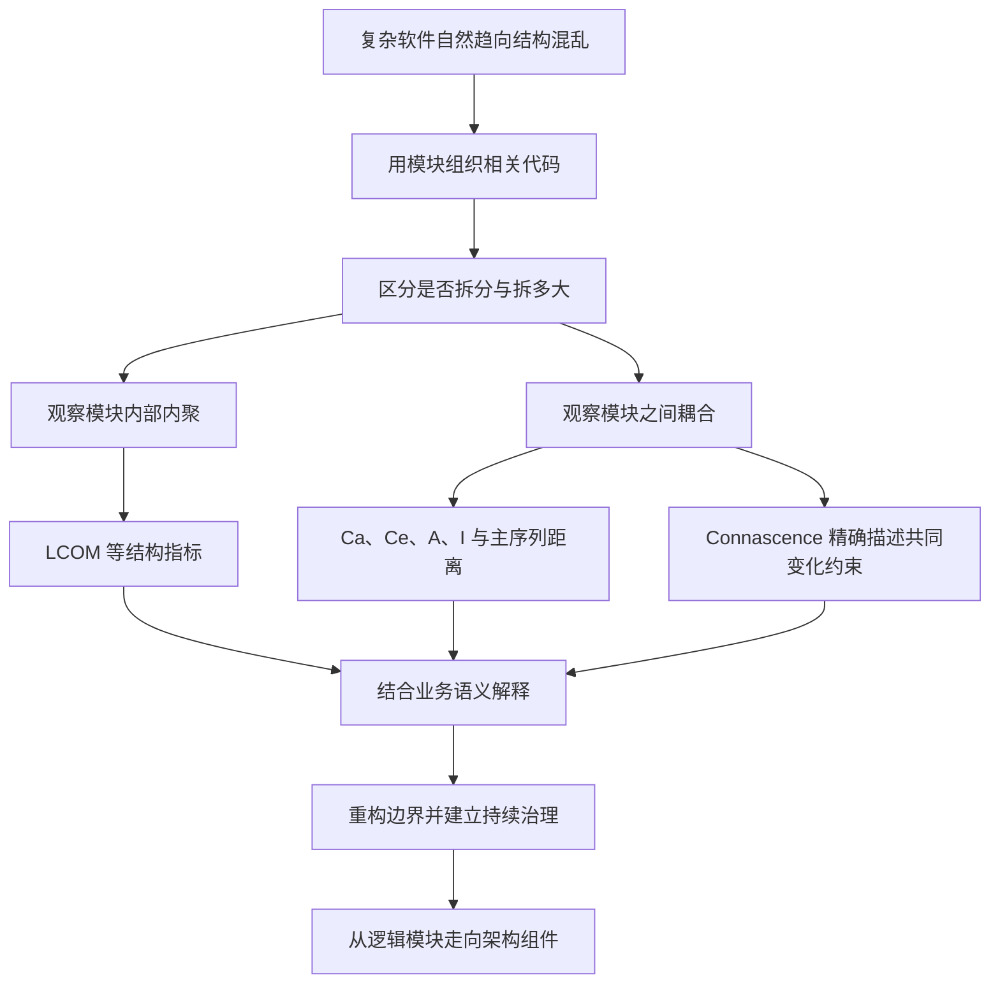
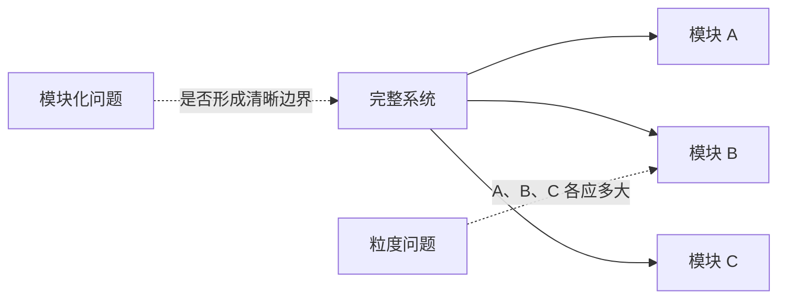
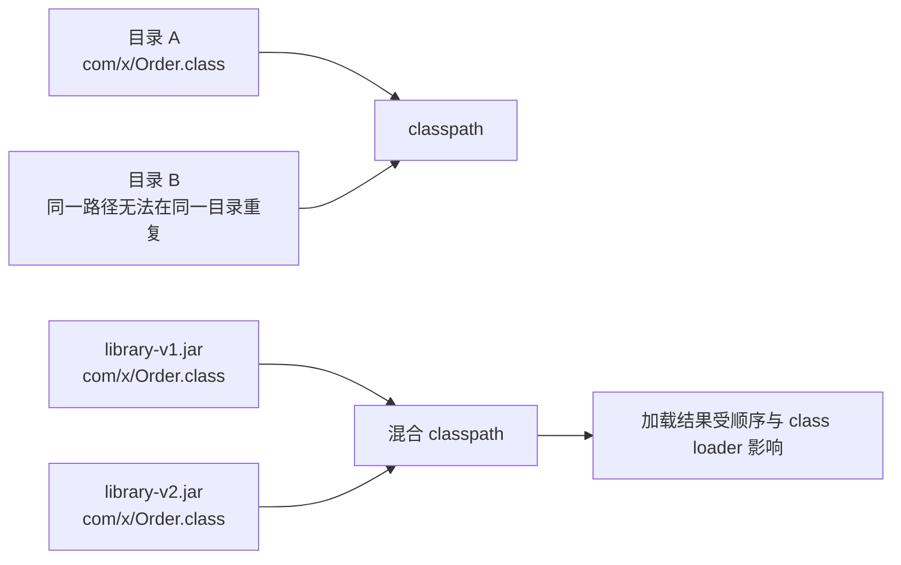
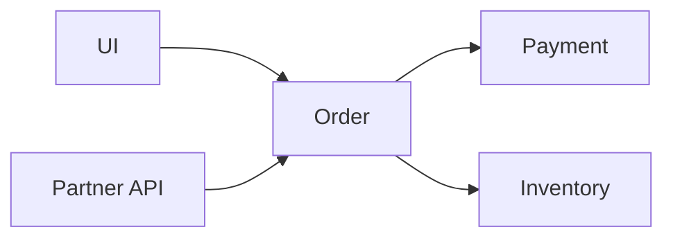
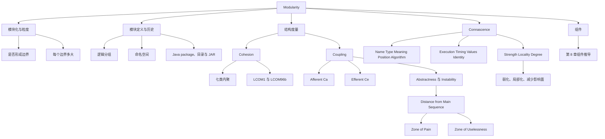

> 对应原章：3. Modularity.md
> 本章把“模块化很好”这一笼统口号拆成可讨论的结构问题：模块是什么，模块化与粒度有何不同，如何用内聚、耦合和 connascence 分析代码，以及抽象度、不稳定度和主序列距离能告诉架构师什么。
> 本笔记严格沿原章顺序展开。原章给出的 LCOM、Abstractness、Instability 和 Distance 公式均保留并详细推导；文中的补充算例、Python 代码、启发式风险表达和重构流程用于教学，不是原书新增指标。指标定义在不同工具中可能存在变体，实际治理时应固定工具、统计边界与版本后再比较趋势。

## 0. 本章要回答的核心问题

1. 为什么软件行业长期赞美模块化，却仍难以说明怎样实现它？
2. 为什么模块化是一项通常不写入需求、却决定代码库可持续性的隐含架构特征？
3. 模块化与粒度分别回答什么问题，为什么“拆开”不等于“拆得合适”？
4. 逻辑模块与物理部署单元有什么区别？
5. 包、命名空间、类、函数和目录如何共同塑造模块边界？
6. 从 `GOTO`、结构化编程、模块化语言到面向对象语言，代码组织机制是怎样演化的？
7. Java 1.0 如何借助文件系统避免类名冲突，JAR 又为什么破坏了这个原始假设？
8. cohesion、coupling 和 connascence 各自观察结构的哪个侧面？
9. 七类内聚从好到坏如何区分，为什么 Customer 与 Order 的边界没有脱离上下文的唯一答案？
10. LCOM1 与 LCOM96b 怎样计算，数值为何能暴露一个类中互不相关的方法簇？
11. 为什么 LCOM 只能识别结构内聚，不能判断业务逻辑是否真正相关？
12. afferent coupling 与 efferent coupling 分别表示什么，怎样避免记反？
13. Abstractness 和 Instability 的公式、取值范围与直觉是什么？
14. 主序列为什么是 $A+I=1$，痛苦区与无用区分别代表什么结构失衡？
15. 为什么主序列距离不是代码质量总分，所有指标都必须结合上下文解释？
16. connascence 与普通耦合有什么关系，静态和动态 connascence 各有哪些类型？
17. strength、locality 和 degree 怎样共同决定某种 connascence 的危害？
18. 如何把强而远的耦合逐步重构为弱而近的耦合？
19. module 与 component 是什么关系，本章怎样衔接后续的组件和架构特征？

本章的论证主线如下：



一句话概括：**模块化不是把系统切成尽可能多的小块，而是让应该一起变化的代码靠近并封装，让跨边界的依赖尽量少、弱、近且可见，再用指标发现异常、用业务语义作最终判断。**

---

## 1. 开篇：为什么模块化既重要又难定义

作者以 Glenford J. Myers 在 1978 年《Composite/Structured Design》中的观察开场：有关软件架构的文字大量赞美 modularity，却很少说明怎样实现它。近半个世纪后，这个问题仍然存在。

### 1.1 普遍存在，却缺少统一定义

不同平台提供不同复用机制，但几乎都允许把相关代码归为模块：

- Java 使用 package；
- .NET 使用 namespace；
- JavaScript/TypeScript 使用 ES module 与 package；
- C/C++ 常通过头文件、源文件、namespace、库和构建目标组织；
- 函数式语言可能以函数、模块和命名空间组织。

概念如此普遍，定义却很滑：网络上可以找到几十种相互不一致甚至矛盾的解释。为了让后续章节能够使用共同语言，作者必须给出本书自己的工作定义，而不是声称解决了所有语言中的术语争议。

### 1.2 模块化是一种组织原则

本章把 modularity 视为组织相关代码的原则。它要解决的核心问题是：

```text
哪些代码应该放在一起？
哪些细节只应在边界内部可见？
模块之间允许怎样通信？
一个变化会传播到多大范围？
```

模块化不是目录美化。包、命名空间或仓库只有在表达责任边界、限制依赖并支持局部变化时，才真正产生结构价值。

### 1.3 熵的类比：结构不会自动保持健康

作者借用物理学类比：复杂系统倾向于 entropy（熵、无序）。物理系统需要持续输入能量来维持秩序，软件结构也一样。

如果没有持续治理，常见演化路径是：


维持秩序所需的“能量”包括：

- 设计清晰的模块职责；
- 代码评审与依赖规则；
- 自动化架构适应度函数；
- 指标基线和趋势监控；
- 定期删除无效抽象、拆分偶然聚合；
- 在业务变化后重新评估边界。

### 1.4 隐含的架构特征

项目需求很少写“系统必须具有良好的模块区分与通信”，但可持续代码库离不开这种秩序与一致性。因此，作者把良好模块化视为 **implicit architecture characteristic（隐含架构特征）**。

“隐含”不等于可选，而是指：

1. 业务方通常不会直接提出；
2. 它却会影响可修改性、可测试性、可部署性和迁移成本；
3. 架构师必须主动识别并保护；
4. 若等到业务直接抱怨，结构问题通常已经转化为交付迟缓或高故障率。

---

## 2. Modularity Versus Granularity：模块化与粒度

开发者和架构师经常混用 modularity 与 granularity，但原章明确区分二者。

### 2.1 两个概念回答不同问题

| 概念 | 核心问题 | 关注点 | 示例 |
| --- | --- | --- | --- |
| 模块化（modularity） | 系统是否被拆成具有边界的较小部分？ | 分解、职责、边界和通信 | 从未分区单体整理为模块化单体；从单体拆成服务 |
| 粒度（granularity） | 每一部分应该多大？ | 边界大小、职责范围和交互频率 | 一个服务承载整个订单域，还是拆成创建、支付、履约多个服务 |

模块化是“要有结构化分解”，粒度是“每刀切在哪里”。前者不要求物理分布：模块化单体也可以有良好模块化；微服务只是高度物理分布的一种形式。



### 2.2 为什么粒度更容易出问题

Mark Richards 的警句是：

> Embrace modularity, but beware of granularity.

拆得过粗时：

- 不相关职责一起变化；
- 团队容易互相阻塞；
- 局部扩缩容与发布困难；
- 代码所有权模糊。

拆得过细时：

- 原本应在同一边界内完成的工作变成远程协作；
- 接口、网络、序列化和故障模式增加；
- 数据一致性与事务更难；
- 修改一个业务规则需要同时改许多部分；
- 部署单元虽然多，实际上却不能独立变化。

所以“更多模块”不自动意味着“更模块化”。如果每个小服务都必须与其他服务同时修改和发布，只是把内部耦合转换成昂贵的分布式耦合。

### 2.3 粒度与架构反模式

原章指出，不合适粒度会通过服务或组件耦合形成：

| 反模式 | 结构表现 | 根本问题 |
| --- | --- | --- |
| Spaghetti Architecture | 调用和依赖交错，难以追踪业务路径 | 边界与依赖方向缺乏约束 |
| Distributed Monolith | 部署单元很多，却必须协调修改、测试和发布 | 物理拆分没有带来变化独立性 |
| Big Ball of Distributed Mud | 大量分布式组件无清晰领域边界 | 高耦合与分布式复杂度叠加 |

避免这些反模式的关键，不只是“继续拆”，而是同时观察：

1. 模块内部是否内聚；
2. 模块之间有多少耦合；
3. 耦合是静态还是运行时；
4. 一次变化影响多少模块；
5. 高频共同变化的代码是否被错误分开。

### 2.4 模块化与粒度的联合判断

```text
如果模块内部职责互不相关：考虑拆分。
如果拆分后需要大量跨边界协作：重新检查边界。
如果多个模块总是一起变化：考虑合并或重新划分。
如果一个模块有独立业务能力和变化原因：保护其边界。
```

这已经引出后文两个核心概念：内部相关程度由 cohesion 帮助描述，跨边界依赖由 coupling 与 connascence 帮助描述。

---

## 3. Defining Modularity：定义模块化

Merriam-Webster 把 module 定义为一组可用于构建更复杂结构的标准化部分或独立单元。本书采用更适合代码分析的工作定义：

> 模块化是对相关代码的逻辑分组。

在面向对象语言中，模块可能是一组类；在结构化或函数式语言中，可能是一组函数。Java 的 `com.mycompany.customer` 包按约定应包含与客户相关的代码。

### 3.1 逻辑分组不等于物理分离

模块首先是逻辑概念，不隐含独立进程、容器、仓库或部署单元。

| 层次 | 例子 | 主要作用 |
| --- | --- | --- |
| 语言级逻辑边界 | package、namespace、module | 命名、可见性、依赖组织 |
| 构建边界 | library、JAR、assembly、构建目标 | 编译依赖与版本复用 |
| 仓库边界 | 单仓库中的目录、多仓库 | 代码所有权与交付流程 |
| 部署边界 | 进程、容器、服务 | 故障、扩缩容和发布隔离 |

逻辑模块可以共处于同一个单体部署中。反过来，把代码放入不同服务也不保证逻辑边界正确：若服务共享数据库内部表、相互调用私有细节或必须同步发布，物理分离只会掩盖逻辑耦合。

### 3.2 为什么语言提供多种包装机制

现代语言常允许开发者在函数/方法、类、包/命名空间等多个层次定义行为，每层具有不同作用域和可见性规则；某些语言还有 metaobject protocol 等扩展机制。

选择困难来自多个目标同时存在：

- 封装哪些细节；
- 暴露何种公共 API；
- 允许谁扩展行为；
- 怎样避免命名冲突；
- 怎样编译、发布和复用；
- 怎样让目录和构建结构表达业务责任。

架构师必须理解开发者怎样包装代码，因为包装会改变可复用性和迁移难度。若几个包高度耦合，单独复用其中一个就必须连带引入其他包；名义上的模块不再是可独立理解的单元。

### 3.3 Modular Reuse Before Classes：类出现之前的模块化复用

今天的语言同时拥有类、函数、包和模块，看似重复，背后是编程范式的历史叠加。

#### 1968：反对无约束跳转

1968 年 3 月，Edsger Dijkstra 在 ACM 的《Communications》发表 “Go To Statement Considered Harmful”。当时常见的 `GOTO` 允许控制流在代码中非线性跳跃，使推理和调试困难。

问题不是某条跳转指令本身“邪恶”，而是缺少清晰控制结构时，程序员难以回答：

- 当前执行从哪里来；
- 哪些状态已经建立；
- 这段代码结束后会去哪里；
- 修改一处会影响哪些路径。

#### 20 世纪 70 年代中期：结构化编程

Dijkstra 的文章推动了 Pascal、C 等结构化语言的发展。顺序、分支、循环、函数等结构让控制流更局部、更容易推理。

但开发者很快遇到下一层问题：语言可以组织单个过程，却缺少把一组相关过程和数据归为更大逻辑单元的机制。

#### 20 世纪 80 年代中期：模块化语言

Modula 和 Ada 等语言把 module 作为一等组织构造，作用类似今天的 package 或 namespace，但并不依赖类。它们解决的是：

- 哪些声明属于同一逻辑单元；
- 哪些名称对外可见；
- 哪些实现细节应隐藏；
- 怎样复用一组相关功能。

#### 面向对象时代：模块没有消失

面向对象语言通过类提供封装与复用，模块化语言的短暂时代结束，但语言设计者保留了模块思想，形成包和命名空间。

Java 就叠加了多种范式：

- package 与包级静态初始化体现模块化机制；
- class、interface 与继承体现面向对象机制；
- lambda、函数式接口和流体现函数式机制；
- 各机制拥有不同作用域与规则。

这些看似重叠的结构不是纯粹冗余，而是历史范式及兼容思维的累积。

### 3.4 为什么把模块化独立于平台讨论

本书用 modularity 泛指任何相关代码分组，不限定类、函数或包，也不假定物理隔离。这样做有两个好处：

1. 可以跨语言讨论内聚、耦合和变化传播；
2. 可以在决定部署结构之前先评价逻辑边界。

一个单体把大量类随意堆在一起，短期很方便；当要迁移或拆分时，松散分区鼓励的依赖会成为阻力。物理边界可以后加，逻辑耦合却不会因移动文件自动消失。

### 3.5 namespace 的一般含义

这里的 namespace 是通用概念，不只指 .NET 的同名构造。软件资产需要精确、完全限定的名称，避免不同组件、类、函数或变量互相冲突。互联网域名就是日常使用的全局唯一标识体系，并最终关联到网络地址。

多数语言的模块机制也兼作命名空间：

```text
短名称：Order
完全限定名称：catalog.order.Order
另一语义：installation.order.Order
```

命名空间解决“两个实体能否同名”，模块边界还要解决“它们是否相关、谁可以依赖谁”。二者相关但不等同。

某些语言还让逻辑结构反映到物理文件：Java 的包名必须与类文件目录结构对应。这为下一节 Java 1.0 的设计铺垫。

### 3.6 A Language with No Name Conflicts: Java 1.0

Java 最初设计者深知早期平台中的名称冲突。假设领域中同时有“目录订单”和“安装工单”，两个类都自然叫 `Order`，但语义完全不同。

#### Java 1.0 的文件系统技巧

Java 1.0 同时规定：

1. 使用 package 构造命名空间；
2. 物理目录结构必须匹配包名；
3. 文件系统不允许同一目录存在两个同名文件。

于是两个 `Order.class` 可以位于不同目录：

```text
catalog/order/Order.class
installation/order/Order.class
```

原始 classpath 只包含目录。语言规则借用了操作系统文件系统的不变量来避免同一完全限定位置的二义性。这是一个典型设计思路：不重新实现冲突检测，而是让底层平台约束替自己维持唯一性。

#### 为什么原始方案难以扩展

项目变大后，强迫每个可复用框架和库都展开为完整目录树很笨重：

- 分发文件数量多；
- 版本和完整性难管理；
- 构建与部署复用资产不方便；
- classpath 配置越来越长。

#### Java 2 的 JAR 与假设失效

第二个主要版本 Java 1.2（品牌名 Java 2）加入 JAR，让一个归档文件在 classpath 上表现得像目录。分发复用资产变容易，但原始唯一性假设被打破：两个 JAR 可以各自包含同一个完全限定类名。



之后十年，Java 开发者经常要调试目录与多个 JAR 混合形成的 classpath，以及复杂 class loader 行为。

#### 这个历史案例的一般教训

1. 架构机制依赖底层假设；
2. 新需求可能削弱旧不变量；
3. 便利性与确定性存在权衡；
4. 逻辑命名、物理包装和运行时解析必须一起分析；
5. “当初为什么这样设计”比只看今天的复杂结果更有解释力。

---

## 4. Measuring Modularity：度量模块化

模块化如此重要，架构师就需要工具理解现状。原章聚焦三个概念：

| 概念 | 观察方向 | 核心问题 |
| --- | --- | --- |
| Cohesion | 模块内部 | 放在一起的元素是否真正相关？ |
| Coupling | 模块之间 | 一个模块依赖谁，又被谁依赖？ |
| Connascence | 共同变化约束 | 一处改变为何迫使另一处同时改变？ |

指标不是为了宣布“代码得了 87 分”，而是帮助发现值得调查的结构异常，为迁移、重构、技术债评估和架构治理提供线索。

### 4.1 Cohesion：内聚

Cohesion 表示一个模块中的部分应该共同处于该模块的程度，即这些部分彼此有多相关。

理想内聚模块包含完成其责任所需的全部部分；若继续拆小，原本内部协作会变成跨模块调用，反而提高耦合并降低可读性。Larry Constantine 的结论是：拆分一个本来内聚的模块，只会增加耦合并降低可读性。

这说明“单一职责”不能机械理解为“每个类只有一个方法”。责任应是具有业务或变化一致性的完整能力。

### 4.2 七类内聚：从最好到最差

计算机科学家给出一条从好到坏的内聚序列。

#### 4.2.1 Functional cohesion：功能内聚

模块每一部分都与其他部分相关，并包含完成单一功能所必需的一切。

例：`InvoiceTotalCalculator` 内部包含计算商品小计、折扣、税费与最终金额所需的协作，所有步骤服务于“计算发票总额”。

为什么最好：责任和变化原因高度一致，外部只需调用稳定入口，不必了解内部步骤。

#### 4.2.2 Sequential cohesion：顺序内聚

一个模块的输出成为另一个模块的输入，二者形成数据处理序列。

例：解析原始订单文本后，把结构化订单传给校验模块。它们因数据流相关，但每一阶段仍有可识别责任。

容易混淆之处：顺序内聚强调“前一步输出是后一步输入”，而 procedural cohesion 只要求执行顺序，不一定有直接数据传递。

#### 4.2.3 Communicational cohesion：通信内聚

多个模块围绕同一信息工作，或共同贡献某个输出。

原书例子：一个模块向数据库新增记录，另一个根据这条信息发送邮件。它们共同围绕一次业务信息或结果形成通信链。

它比纯功能内聚弱，因为不同动作可能有不同变化原因，但共享数据或输出使它们仍具有明显关系。

#### 4.2.4 Procedural cohesion：过程内聚

多个部分因为必须按某个顺序执行而放在一起。

例：先校验权限、再打开资源、最后写审计日志。它们可能操作不同数据，主要联系是流程顺序。

若顺序来自稳定业务流程，组合可能合理；若只是当前实现偶然要求，就需要警惕执行耦合。

#### 4.2.5 Temporal cohesion：时间内聚

模块因同一时间点执行而相关。

原书例子是系统启动：加载配置、预热缓存、注册监控等功能彼此未必相关，却都必须在启动阶段发生。

时间内聚常形成 `Startup`, `Shutdown`, `Cleanup` 模块。它有现实价值，但容易成为无关职责的收纳箱，应让每项初始化继续委托给其所有者。

#### 4.2.6 Logical cohesion：逻辑内聚

模块中的数据或操作在概念类别上相关，却不共同完成一个具体功能。

原书例子是转换模块：把文本、序列化对象或流转换成其他格式。操作都叫“转换”，实际算法和变化原因却不同。Java 项目中的 `StringUtils` 也很常见：方法都操作 String，但彼此功能无关。

“Utils”“Helpers”“Common” 往往提示逻辑内聚甚至偶然内聚。并非所有工具类都应立即删除，但它们容易无限增长并成为迁移障碍。

#### 4.2.7 Coincidental cohesion：偶然内聚

元素除了恰好位于同一源文件或模块中，没有真实关系。这是最差形式。

例：一个 `Misc` 文件同时包含日期格式化、支付重试、图像缩放和用户权限逻辑。任何一个变化都无法由模块名和责任预测。

### 4.3 七类内聚的关系与使用边界

| 类型 | 共同点来自 | 典型问题 | 通常方向 |
| --- | --- | --- | --- |
| Functional | 同一完整功能 | 是否所有元素服务同一责任？ | 尽量追求 |
| Sequential | 数据流水线 | 前一步输出是否直接喂给后一步？ | 合理但检查边界 |
| Communicational | 同一信息或输出 | 是否围绕同一业务信息协作？ | 视变化原因判断 |
| Procedural | 执行顺序 | 除顺序外还有什么关系？ | 警惕偶然流程 |
| Temporal | 同一时间 | 是否只是都在启动/关闭时发生？ | 委托回真正所有者 |
| Logical | 同一类别标签 | 是否只是都操作 String/文件？ | 防止工具箱膨胀 |
| Coincidental | 同一文件位置 | 能否说出共同责任？ | 应重构 |

这条序列是分析词汇，不是每个模块必须被唯一归类的自动分类器。一个模块可能同时具有功能与顺序内聚；架构师仍要结合业务变化来判断。

### 4.4 Customer Maintenance：边界为什么取决于上下文

原章给出一个模块：

```text
Customer Maintenance
    add customer
    update customer
    get customer
    notify customer
    get customer orders
    cancel customer orders
```

最后两个订单操作应留在客户模块，还是提取为：

```text
Customer Maintenance
    add customer
    update customer
    get customer
    notify customer

Order Maintenance
    get customer orders
    cancel customer orders
```

没有脱离上下文的答案。作者提出三个问题。

#### 问题一：订单是否只有这两个操作

如果订单模块永远只有两个与客户高度相关的操作，拆出新模块可能只增加调用和理解成本。若订单还有创建、付款、履约、退货等独立行为，它更像真正的业务责任。

#### 问题二：客户模块是否会继续增长

若 Customer Maintenance 预计快速膨胀，提前识别独立变化原因可以控制复杂度。若规模稳定，过早拆分可能属于推测性设计。

#### 问题三：订单对客户知识的依赖有多深

若 Order Maintenance 为完成每个操作都要读取大量客户内部信息，分开后会产生高耦合。边界可能切错，也可能需要定义更稳定的客户接口或重新建模共享概念。

因此，粒度判断可以写成一个循环：

```text
提出候选边界
    -> 检查模块内部变化是否一致
    -> 检查拆分后的跨边界知识和调用
    -> 比较未来增长与当前复杂度
    -> 选择总变化成本更低的边界
```

### 4.5 LCOM：把结构内聚变成可观察信号

Chidamber and Kemerer Object-Oriented Metrics Suite 包含循环复杂度、耦合指标，以及 Lack of Cohesion in Methods（LCOM）。LCOM 不是直接度量“内聚有多好”，而是寻找方法之间缺少共同字段联系的程度。

直觉是：如果一个类中的一组方法只访问字段 `a`，另一组只访问字段 `b`，两组没有交集，那么这个类可能把两个责任偶然塞在了一起。

#### Equation 3-1. LCOM, version 1

LCOM1 以方法对为单位。设方法 $M_i$ 使用的实例字段集合为 $F_i$：

$$
P = \{(M_i,M_j) \mid 1 \le i < j \le m,\ F_i \cap F_j = \varnothing\}
$$

$$
Q = \{(M_i,M_j) \mid 1 \le i < j \le m,\ F_i \cap F_j \ne \varnothing\}
$$

$$
LCOM_1 = \max\bigl(|P|-|Q|, 0\bigr)
$$

- $P$ 包含不共享任何字段的方法对；
- $Q$ 包含至少共享一个字段的方法对；
- $i<j$ 保证只统计不同方法组成的无序对，不包含方法与自身，也不重复计算 $(M_i,M_j)$ 与 $(M_j,M_i)$；
- 不共享对多于共享对时，差值越大，缺乏内聚越明显；
- 共享对占优时截断为 0。

若有 $m$ 个方法，方法对总数为 $\binom{m}{2}$，因此：

$$
0 \le LCOM_1 \le \binom{m}{2}
$$

LCOM1 没有按方法对数量归一化，类越大，潜在上限越高。因此它更适合在规模相近且统计规则一致的类之间比较，或观察同一类的变化，不能直接把不同规模类的原始分数排序为质量高低。

##### 算例

假设：

- `m1` 访问 `{a}`；
- `m2` 访问 `{a}`；
- `m3` 访问 `{b}`。

三对方法中：

- `(m1,m2)` 共享 `a`，进入 $Q$；
- `(m1,m3)` 不共享字段，进入 $P$；
- `(m2,m3)` 不共享字段，进入 $P$。

所以 $|P|=2$，$|Q|=1$：

$$
LCOM_1 = \max(2-1,0)=1
$$

这提示 `m3` 与字段 `b` 可能属于可提取的另一责任，但还不能单凭数值决定重构。

#### Equation 3-2. LCOM96B

1996 年变体 LCOM96b 写为：

$$
LCOM_{96b}=\frac{1}{a}\sum_{j=1}^{a}\frac{m-\mu(A_j)}{m}
$$

其中：

- $a$：类中参与统计的字段数；
- $m$：参与统计的方法数；
- $A_j$：第 $j$ 个字段；
- $\mu(A_j)$：访问字段 $A_j$ 的方法数量。

公式可以改写为：

$$
LCOM_{96b}=1-\frac{1}{am}\sum_{j=1}^{a}\mu(A_j)
$$

#### 逐步理解公式

1. 对每个字段 $A_j$，$m-\mu(A_j)$ 是“不访问它的方法数”；
2. 除以 $m$，得到该字段没有被多少比例的方法共享；
3. 对所有 $a$ 个字段取平均；
4. 越多字段只被小方法簇使用，数值越高；
5. 若每个方法访问每个字段，则每项为 0，LCOM96b 为 0。

在 $a>0,m>0$ 且只统计真实字段访问时，它通常位于 $[0,1]$。不同工具是否排除构造器、静态方法、访问器和未使用字段，会改变结果，不能混用实现直接比较。

##### 一个可运行的 LCOM96b 示例

```python
def lcom96b(total_methods, methods_by_field):
    if total_methods <= 0 or not methods_by_field:
        return None

    missing_ratios = []
    for methods in methods_by_field.values():
        accessed_by = len(set(methods))
        if accessed_by > total_methods:
            raise ValueError("field has more users than total methods")
        missing_ratios.append((total_methods - accessed_by) / total_methods)

    return sum(missing_ratios) / len(missing_ratios)


examples = {
    "cohesive": {
        "a": {"m1", "m2", "m3"},
        "b": {"m1", "m2"},
    },
    "split": {
        "a": {"m1"},
        "b": {"m2"},
        "c": {"m3"},
    },
    "mixed": {
        "a": {"m1", "m2"},
        "b": {"m1", "m2"},
        "c": {"m3"},
    },
}

for name, fields in examples.items():
    print(f"{name}: {lcom96b(3, fields):.3f}")
```

输出：

```text
cohesive: 0.167
split: 0.667
mixed: 0.444
```

代码与公式逐项对应：`total_methods` 是 $m$，字典项数量是 $a$，每个集合大小是 $\mu(A_j)$，`missing_ratios` 计算每个 $\frac{m-\mu(A_j)}m$，最后取平均。

### 4.6 图 3-1：怎样解释 LCOM 结构


图中八边形是字段，方块是方法，连线表示方法访问字段：

- **Class X**：方法和字段通过共享访问形成连通结构，LCOM 较低，结构内聚较好；
- **Class Y**：每个字段只与一个方法成对，三组可彼此独立移动，LCOM 高；
- **Class Z**：一部分方法共享字段，最后一组较孤立，呈现混合内聚，可能只需提取一个责任。

LCOM 特别适合在遗留系统重构、单体拆分或迁移前寻找 shared utility class 中的偶然聚合。它把“这个类看起来像杂物箱”转换成可排序、可进一步检查的候选列表。

### 4.7 LCOM 的适用范围与局限

LCOM 只能发现 **structural lack of cohesion（结构性缺乏内聚）**，不能知道业务语义。

它可能误导的情形包括：

- 两组方法不共享字段，却共同实现一个业务协议；
- 无状态服务几乎没有实例字段，字段访问无法表达内聚；
- CQRS 风格故意让读写路径使用不同状态；
- 框架通过注解、反射或外部配置建立隐式联系；
- 数据类主要由访问器组成，数值受工具统计规则支配；
- 一个结构内聚的类可能在业务上仍承担多个变化原因。

因此，正确用法是：

```text
用 LCOM 发现异常候选
    -> 查看方法簇与字段簇
    -> 询问业务责任和共同变化历史
    -> 评估拆分后新增耦合
    -> 再决定保持、重命名、提取或重新建模
```

这呼应第二定律：结构指标展示“怎样连接”，无法自动解释“为什么应该放在一起”。

### 4.8 Coupling：耦合

耦合比内聚更容易用结构工具分析，因为调用与依赖可以表示为有向图：



若分析 `Order`：

- UI 与 Partner API 指向它，是 incoming connections；
- 它指向 Payment 与 Inventory，是 outgoing connections。

Edward Yourdon 与 Larry Constantine 在 1979 年《Structured Design》中定义：

- **Afferent coupling，$C_a$**：进入某代码构件的连接数量，即有多少外部构件依赖它；
- **Efferent coupling，$C_e$**：从该构件出去的连接数量，即它依赖多少外部构件。

代码构件可以是组件、包、类、函数等，但同一次分析必须保持粒度一致。

### 4.9 Why Such Similar Names for Coupling Metrics?：为什么名称如此相似

两个方向相反的关键指标只差几个相似元音，确实容易记反。原章给出两个记忆法：

1. 英文字母 `a` 排在 `e` 前，就像 incoming 在 outgoing 前；
2. efferent 的 `e` 对应 exit，表示从当前构件向外离开。

还可以使用依赖语义记忆：

```text
Afferent / incoming / 被别人依赖 / dependents
Efferent / outgoing / 依赖别人 / dependencies
```

在前面的 `Order` 图中，若每条边按一个外部构件计，则 $C_a=2$，$C_e=2$。

### 4.10 Core Metrics：核心派生指标

原始 $C_a$ 和 $C_e$ 已经有价值，Robert C. Martin 又基于模块中的抽象/具体构件和依赖方向定义 Abstractness 与 Instability。这些指标广泛适用于面向对象语言。

#### Equation 3-3. Abstractness

Abstractness（抽象度）是抽象构件占全部抽象与具体构件的比例：

$$
A=\frac{N_a}{N_c+N_a}
$$

原书写作 $\sum m^a/(\sum m^c+\sum m^a)$，其中：

- $N_a$ 或 $\sum m^a$：抽象类、接口等抽象构件数量；
- $N_c$ 或 $\sum m^c$：非抽象类等具体实现数量。

取值解释：

| $A$ | 含义 | 风险 |
| --- | --- | --- |
| 0 | 全部是具体实现 | 若同时非常稳定，修改可能痛苦 |
| 0 到 1 | 抽象与具体混合 | 需要结合依赖方向判断 |
| 1 | 全部是抽象构件 | 若无人稳定依赖，可能只有空洞抽象 |

例如模块有 3 个接口/抽象类和 7 个具体类：

$$
A=\frac{3}{3+7}=0.3
$$

抽象度不是“越高越好”。一端是没有抽象、所有逻辑集中于具体实现；另一端是层层抽象，开发者难以知道实现怎样连接。原章以名字复杂的 `AbstractSingletonProxyFactoryBean` 说明过度抽象的认知成本。

原书用 5,000 行代码都位于单个 `main()` 的极端例子表达“几乎没有抽象”。按常见指标定义，统计单位应是抽象/具体类型而不是代码行；这个例子的正确直觉是 $A$ 接近或等于 0，不能把一个抽象构件与 5,000 行代码直接相除。实际使用必须先确认工具把什么计为 artifact。

#### Equation 3-4. Instability

Instability（不稳定度）定义为向外耦合占全部方向耦合的比例：

$$
I=\frac{C_e}{C_e+C_a}
$$

取值解释：

| 结构 | $I$ | 直觉 |
| --- | --- | --- |
| 只有进入依赖，$C_e=0$ | 0 | $C_a$ 在方向比例中完全占主导，它自己不依赖外部，较稳定 |
| 进入与出去相当 | 接近 0.5 | 依赖方向较平衡 |
| 只有出去依赖，$C_a=0$ | 1 | $C_e$ 在方向比例中完全占主导，容易替换也易受依赖变化影响 |

例如 $C_a=8,C_e=2$：

$$
I=\frac{2}{2+8}=0.2
$$

这里“稳定”不是运行时可用性，也不是代码不变。它表示依赖图中的 **resistance to change（变更阻力）**：很多构件依赖某模块时，改变它会影响大量调用者，因此它在结构上更难改变。

同样，$I=1$ 不自动表示代码质量差。一个靠近系统边缘、没有其他模块依赖的具体适配器本来就应该容易变化。Instability 是方向比例，不反映耦合总量：$C_e=1,C_a=0$ 和 $C_e=100,C_a=0$ 都得到 1，风险规模却完全不同。

若 $C_e+C_a=0$，模块在当前图中完全孤立，公式分母为 0。工具可能返回 0、空值或跳过；分析者应把它单独标记，不能擅自解释为“完美稳定”。

### 4.11 Distance from the Main Sequence：到主序列的距离

Abstractness 与 Instability 单独看都没有“越大越好”。主序列把二者放入同一坐标系：横轴是不稳定度 $I$，纵轴是抽象度 $A$。


理想线连接：

- $(I=0,A=1)$：高度稳定，因此应高度抽象，让许多依赖者依赖稳定契约；
- $(I=1,A=0)$：高度不稳定，因此可以具体，且没有大量调用者被实现变化拖累。

这条线满足：

$$
A+I=1
$$

核心直觉是 **稳定抽象原则**：越稳定、越难改变的模块，自身越应由抽象构件组成，以便在不修改稳定契约的情况下扩展实现；越具体的模块，越应位于容易替换的位置。这里仍须查看原始 $C_a$、$C_e$ 判断实际影响规模，$I$ 本身只给出方向比例。

#### Equation 3-5. Distance from the Main Sequence

归一化主序列距离为：

$$
D=|A+I-1|
$$

因为 $A,I\in[0,1]$，所以 $D\in[0,1]$：

- $D=0$：点恰好位于主序列；
- $D$ 越大：抽象度与依赖稳定性的组合越失衡；
- $D=1$：位于左下或右上极端角落。

严格的欧氏垂直距离是 $|A+I-1|/\sqrt{2}$；上式把最大可能垂直距离归一化后得到 $[0,1]$，便于比较。原章和常用工具所说的 Distance 通常指这个归一化值。


#### 逐步算例

假设一个模块有：

- 3 个抽象构件，7 个具体构件，因此 $A=0.3$；
- $C_a=8,C_e=2$，因此 $I=0.2$。

则：

$$
D=|0.3+0.2-1|=0.5
$$

它位于主序列下方：相对于自己的稳定程度，具体实现过多。下一步不是机械“增加接口”，而是检查：它为何被很多模块依赖、哪些变化经常发生、能否收窄公共表面或提取真正稳定的抽象。

### 4.12 痛苦区与无用区


#### Zone of Pain：痛苦区

左下角同时具有低抽象度和低不稳定度：

- $C_a$ 相对 $C_e$ 占主导，因此在依赖方向上较稳定；其真实影响规模还要查看 $C_a$ 的绝对值；
- 它又主要由具体实现组成，缺少容纳变化的抽象；
- 结果是刚性、脆弱、维护代价高。

典型例子是被全系统直接调用的具体工具或共享数据库模型。任何细节变化都会扩散到大量调用者。

#### Zone of Uselessness：无用区

右上角同时具有高抽象度和高不稳定度：

- 模块几乎全是抽象；
- $C_e$ 相对 $C_a$ 占主导，说明它在依赖方向上易变；是否真的“无人使用”仍要查看 $C_a$ 的绝对值；
- 抽象没有保护稳定责任，可能只是推测性框架或无人使用的扩展点。

“无用”是结构警报，不表示每个点都应删除。插件 SPI、新 API 草案或迁移中的模块可能暂时位于这里，需要结合生命周期解释。

#### 四个极端点

| $A$ | $I$ | $D$ | 解释 |
| ---: | ---: | ---: | --- |
| 1 | 0 | 0 | 稳定且抽象，位于主序列端点 |
| 0 | 1 | 0 | 易变且具体，位于另一端点 |
| 0 | 0 | 1 | 稳定且具体，痛苦区极端 |
| 1 | 1 | 1 | 易变且抽象，无用区极端 |

### 4.13 可运行的 A、I、D 计算示例

```python
def module_metrics(abstract, concrete, afferent, efferent):
    artifacts = abstract + concrete
    couplings = afferent + efferent

    abstractness = abstract / artifacts if artifacts else None
    instability = efferent / couplings if couplings else None
    distance = (
        abs(abstractness + instability - 1)
        if abstractness is not None and instability is not None
        else None
    )
    return abstractness, instability, distance


modules = {
    "stable_concrete": (0, 10, 9, 1),
    "balanced_plugin": (1, 9, 1, 9),
    "core": (3, 7, 8, 2),
}

for name, inputs in modules.items():
    abstractness, instability, distance = module_metrics(*inputs)
    print(
        f"{name}: A={abstractness:.1f}, "
        f"I={instability:.1f}, D={distance:.1f}"
    )
```

输出：

```text
stable_concrete: A=0.0, I=0.1, D=0.9
balanced_plugin: A=0.1, I=0.9, D=0.0
core: A=0.3, I=0.2, D=0.5
```

代码先按抽象/具体数量计算 $A$，再按进入/出去依赖计算 $I$，最后代入 $D$。对空模块或孤立模块返回 `None`，避免把分母为 0 伪装成有效指标。

### 4.14 怎样应用主序列指标

1. 明确统计单位，例如 package 或 component，不混合类和服务；
2. 固定工具对抽象构件和依赖边的定义；
3. 计算 $A,C_a,C_e,I,D$；
4. 先找远离主序列或随时间快速漂移的异常点；
5. 查看调用图、修改历史、业务责任和运行边界；
6. 选择减少依赖、收窄 API、移动实现或提取有意义抽象；
7. 重构后重新计算并运行行为测试；
8. 把阈值作为调查触发器，而不是自动判罪线。

#### The Limitations of Metrics：指标的局限

软件代码指标比其他工程学科的分析工具粗糙得多，即使直接来自代码结构，也需要解释。

原章以 Cyclomatic Complexity（圈复杂度）为例：它能测量控制流复杂度，却不能区分：

- **essential complexity（本质复杂度）**：问题本身包含复杂规则；
- **accidental complexity（偶然复杂度）**：实现方式让代码比问题更复杂。

同一个高分可能来自必要的税法分支，也可能来自可以消除的嵌套条件。LCOM、耦合和主序列距离也存在类似限制。

#### 指标不能直接回答的问题

- 依赖是合理业务协作还是错误边界；
- 一个抽象是否表达稳定概念，还是只增加层次；
- 高内聚是否把多个业务责任错误地围绕共享数据库绑定；
- 某种复杂度是否不可避免；
- 代码生成、反射和运行时注入是否隐藏了真实依赖；
- 指标改善是否只是为迎合规则而拆出无意义类型。

#### 更稳妥的治理方式

- 建立当前代码库的基线，而不是盲用通用阈值；
- 观察趋势和异常值，而非只看一次快照；
- 把指标与变更频率、缺陷、构建和运行数据结合；
- 对关键模块设架构适应度函数；
- 每次告警都回到源代码和业务语义确认；
- 记录工具版本、配置和统计边界。

1979 年的《Structured Design》早于面向对象语言普及，其中一些耦合类型已因现代语言设计而过时。面向对象又引入更精细的耦合词汇，即下一节的 connascence。

---

## 5. Connascence：共同变化约束

Meilir Page-Jones 在 1996 年《What Every Programmer Should Know about Object-Oriented Design》中提出 connascence，为面向对象代码的不同耦合形式提供更精确的语言。

### 5.1 定义与耦合指标的区别

若修改组件 A 时，为维持系统整体正确性必须同时修改组件 B，则 A 与 B 具有 connascence。

```text
改变 A
    -> 若不改变 B，系统语义或行为错误
    -> A 与 B 具有共同变化约束
```

Connascence 不是像 $C_a$、$C_e$ 那样的单一数量指标。它是一套分类语言，帮助架构师说明：

- 双方必须在哪个约定上保持一致；
- 约束在编译时还是运行时显现；
- 它有多强、传播多远、影响多少元素；
- 可以朝什么较弱形式重构。

Page-Jones 把它分为 static 与 dynamic 两大类。

### 5.2 Static connascence：静态共同变化约束

静态 connascence 存在于源代码层面，可以通过代码和静态分析发现。它可看作 afferent/efferent 耦合的具体“质地”。

#### 5.2.1 Connascence of Name：名称共同性

多个组件必须同意某个实体的名称。

```java
invoice.calculateTotal();
```

调用者必须知道方法叫 `calculateTotal`。若重命名，声明和所有引用都要一起变化。

这是较弱、较理想的形式，因为现代重构工具可以安全地全局重命名，编译器也容易发现遗漏。

#### 5.2.2 Connascence of Type：类型共同性

多个组件必须同意实体类型。

```java
Money calculateTotal(List<LineItem> items)
```

调用方和实现方必须认同 `Money` 与 `List<LineItem>`。静态类型语言明显体现它，Clojure Spec 等动态语言的可选约束也能形成类型共同性。

类型共同性可以提供验证和工具支持，但跨边界暴露过于具体的内部类型会提高修改成本。稳定边界通常应选择表达业务语义、版本可控的类型。

#### 5.2.3 Connascence of Meaning：含义共同性

多个组件必须同意特定值的意义，也称 Connascence of Convention。

```java
if (status == 1) {
    approve();
}
```

生产者和消费者必须都知道 `1` 表示已批准。若某处把约定改为 `2`，其他地方仍按 `1` 解释，代码可能编译通过却产生错误。

原章还举出 `int TRUE = 1; int FALSE = 0;`。若有人交换值，所有依赖约定的代码都会受影响。

改进方向是把隐含含义提升为名称或类型：

```java
if (status == OrderStatus.APPROVED) {
    approve();
}
```

这把 Connascence of Meaning 弱化为工具更容易管理的 Name/Type。

#### 5.2.4 Connascence of Position：位置共同性

多个组件必须同意值的顺序。

```java
void updateSeat(String name, String seatLocation)

updateSeat("14D", "Ford, N");
```

两个实参类型都是 String，编译器无法发现顺序颠倒。调用者必须记住第一个是姓名、第二个是座位。

可改为参数对象或不同业务类型：

```java
updateSeat(new PassengerName("Ford, N"), new SeatLocation("14D"));
```

命名参数语言也能降低位置共同性，但公共 API 的参数增删与兼容性仍需治理。

#### 5.2.5 Connascence of Algorithm：算法共同性

多个组件必须使用同一算法并得到兼容结果。

原书例子是客户端与服务器使用同一安全散列算法完成身份验证。任何一侧改变算法、盐值处理、编码或参数，握手都会失败。

这是一种强耦合，因为双方不仅同意名称或类型，还必须复制完整计算语义。改进方法可能包括：

- 把算法集中在单一服务；
- 共享经过版本管理的库；
- 在协议中显式协商算法版本；
- 使用标准协议而非自定义密码学。

选择取决于部署边界和安全约束；共享库也会带来同步升级耦合。

### 5.3 Dynamic connascence：动态共同变化约束

动态 connascence 只有在运行时调用、时序、状态或身份关系中才能完整观察，通常比静态形式更难发现和重构。

#### 5.3.1 Connascence of Execution：执行共同性

多个组件的执行顺序必须正确。

原章代码：

```java
email = new Email();
email.setRecipient("foo@example.com");
email.setSender("me@me.com");
email.send();
email.setSubject("whoops");
```

`send()` 在 `setSubject()` 之前执行，邮件无法按预期发送。调用者必须知道隐藏状态机：哪些 setter 必须先调用、何时对象才有效。

可通过构造器、Builder 或类型状态让无效顺序难以表达：

```java
Email email = Email.builder()
    .recipient("foo@example.com")
    .sender("me@me.com")
    .subject("hello")
    .build();
email.send();
```

重构把运行时执行约束部分转移为创建时名称与类型约束。

#### 5.3.2 Connascence of Timing：时间共同性

多个组件执行的时间关系必须正确。

典型例子是 race condition：两个线程同时读写共享状态，结果取决于不可预测的调度时序。

```text
线程 A 读取余额 100
线程 B 读取余额 100
线程 A 写入 90
线程 B 写入 80
最终值取决于最后写入者，而非两次扣款总和
```

互斥、原子操作、消息串行化或不可变数据可以降低这种约束，但会带来吞吐、延迟或复杂度权衡。

#### 5.3.3 Connascence of Values：值共同性

多个值彼此依赖，必须一起改变。

原书例子是由四个角点定义的矩形。随机移动一个点可能破坏矩形形状，修改时必须保持其他点满足几何不变量。

更常见且更困难的例子是分布式事务：多个独立数据库中的值必须全部更新或全部不更新。物理拆分把原来的本地事务约束升级为跨网络的值共同性，需要两阶段提交、Saga、补偿或重新设计一致性边界。

#### 5.3.4 Connascence of Identity：身份共同性

多个组件必须引用同一逻辑实体或资源，即相同 identity，而不只是值相等的副本；在同一进程内它可能是同一对象实例，跨进程时则通常由稳定资源标识来保证身份一致。

原书例子是两个独立组件共享并更新同一个数据结构，例如分布式队列。双方必须对“就是这个队列/对象/资源”达成一致。

身份共同性常见于：

- 共享内存对象；
- 分布式锁；
- 特定队列或 topic；
- 数据库中的同一记录；
- 单例服务实例。

它很强，因为复制一个值相同的新对象并不能满足约束；必须维持身份、生命周期和并发语义。

### 5.4 静态与动态类型总览

| 类型 | 必须共同同意 | 发现时机 | 典型改进方向 |
| --- | --- | --- | --- |
| Name | 名称 | 编译/静态分析 | IDE 重命名、稳定 API |
| Type | 类型 | 编译/验证 | 业务类型、减少内部类型泄漏 |
| Meaning | 值的隐含意义 | 静态检查加语义理解 | 常量、枚举、业务类型 |
| Position | 参数或数据顺序 | 调用检查 | 参数对象、命名参数 |
| Algorithm | 相同计算规则 | 集成测试/协议验证 | 集中、共享库、版本协商 |
| Execution | 调用顺序 | 运行时 | 构造器、Builder、状态机 |
| Timing | 相对执行时刻 | 并发运行 | 同步、原子性、串行化 |
| Values | 多个值共同变化 | 运行时/事务 | 封装不变量、事务、Saga |
| Identity | 同一实体实例 | 运行时 | 明确所有权、资源标识与生命周期 |

分类有助于讨论，但强弱不是脱离语言、工具和距离的绝对总排序。现代重构工具会显著弱化 Name；跨组织协议中的 Name 仍可能比同一方法内的位置约束更难修改。

### 5.5 Connascence properties：共同变化约束的属性

类型说明“因为什么一起变化”，properties 说明“这种约束有多危险”。原章给出 strength、locality、degree。

#### 5.5.1 Strength：强度

强度由耦合被重构的难易程度决定。越容易由编译器、IDE 和局部重构安全修改，通常越弱；越依赖运行时顺序、时间、多个值或同一身份，通常越强。


作者建议优先静态而非动态 connascence：

- 静态约束可通过源码分析发现；
- 现代工具容易自动修改名称和类型引用；
- 动态约束常在特定执行、负载或故障时才暴露。

例如把魔法值提取为具名常量，就是从 Meaning 重构到 Name。

图中的顺序应当作为重构方向而非僵硬等级表。实际强度还受语言、工具、协议版本和兼容要求影响。

#### 5.5.2 Locality：局部性

Locality 衡量具有 connascence 的模块在代码库中相距多远。

同一方法、同一类或同一模块内可以容忍更强的共同变化约束，因为：

- 相关代码更容易同时看见；
- 通常由同一团队和发布单元控制；
- 修改和测试可以原子完成；
- 约束不会穿过版本、网络和组织边界。

相同的 Connascence of Meaning 若跨越两个独立服务，会比位于同一私有方法中危险得多。跨服务后还要考虑不同部署时间、旧版本兼容和团队协调。

这与 DDD bounded context 的思想相通：把高实现耦合限制在尽可能窄的边界内，对外暴露较弱、明确的契约。

#### 5.5.3 Degree：程度

Degree 表示改变一个构件会影响多少其他类或模块。

- 一个强动态约束只存在于两个紧邻私有类中，影响可能可控；
- 一个看似较弱的名称约束若传播到数百个仓库和外部客户，迁移也会很昂贵；
- 代码库增长会让原本小的 degree 逐渐扩大。

因此，评价不能只问“是什么类型”，还要问“跨多远”和“影响多少”。

### 5.6 综合 strength、locality 与 degree

可以用一个教学化启发式表达调查优先级：

$$
Risk_{\mathrm{connascence}} \propto Strength \times Distance \times Degree
$$

这不是原书可计算公式，也没有统一单位。它表达三个直觉：

1. 约束越难修改，风险越大；
2. 跨越的代码、部署和组织距离越远，协调越难；
3. 受影响元素越多，变化传播越广。

若三者同时高，应优先重构；若强约束被封装在一个很小、稳定的边界内，未必是问题。

### 5.7 Page-Jones 的三条模块化指导原则

原章列出三条：

1. **通过把系统拆成封装元素，最小化总体 connascence；**
2. **最小化所有跨越封装边界的剩余 connascence；**
3. **最大化封装边界内部的 connascence。**

第三条看似反常，实际是在追求高内聚：既然一些代码必须紧密共同变化，就应把它们放在同一边界内，而不是人为分散到远处。


这把模块化目标概括为：**内部高内聚，外部低耦合。**

### 5.8 Jim Weirich 的两条规则

Jim Weirich 在 2012 年 “Connascence Examined” 演讲中重新推广该概念，并给出：

> Rule of Degree: Convert strong forms of connascence into weaker forms of connascence.

> Rule of Locality: As the distance between software elements increases, use weaker forms of connascence.

应用顺序可以是：

```text
识别共同变化约束
    -> 判断类型与强度
    -> 测量跨越距离和受影响数量
    -> 优先处理强、远、广的约束
    -> 封装必须保留的强约束
    -> 把跨边界约束转换为名称、类型或版本化契约
```

### 5.9 一组逐步弱化 connascence 的例子

#### Meaning -> Name/Type

```text
status == 1
    -> status == APPROVED
    -> status == OrderStatus.APPROVED
```

把隐含约定提升为具名、受类型约束的领域概念。

#### Position -> Name/Type

```text
updateSeat("14D", "Ford, N")
    -> updateSeat(name="Ford, N", seat="14D")
    -> updateSeat(PassengerName(...), SeatLocation(...))
```

让调用不再依赖两个相同基础类型的位置记忆。

#### Execution -> Valid construction

```text
new -> set recipient -> set sender -> send -> set subject
    -> Builder 收集全部必填值 -> build -> send
```

把隐式运行时顺序转换为构造阶段可验证约束。

#### Values across services -> Local invariant plus explicit workflow

```text
多个数据库必须瞬时一起更新
    -> 每个服务本地提交
    -> 通过显式事件和补偿工作流协调最终结果
```

这不会消除业务一致性要求，而是把不可见的跨库原子假设转换为可观察、可恢复的协议。是否适用取决于业务能否接受中间状态。

### 5.10 精确语言为什么重要

Connascence 对架构师有用，理由与设计模式相似：一个名称可以压缩完整上下文。

与其说：

> 我们需要一个服务，而且只能有一个实例。

不如说：

> 我们需要 Singleton service。

与其在评审中只说：

> 不要在方法中间写魔法字符串，把它提取出来。

可以更精确地说：

> 这里存在 Connascence of Meaning，请把它重构为 Connascence of Name。

术语不是为了炫耀，而是让团队更快识别问题机制、预期后果和重构方向。若听众不熟悉术语，仍应同时解释普通语言含义。

---

## 6. From Modules to Components：从模块到组件

本书使用 module 作为“相关代码包”的通用名称。多数架构师则把模块称为 component，组件是软件架构的关键构建块。

### 6.1 module 与 component 的关系

| 术语 | 本章中的重心 | 是否必然物理隔离 |
| --- | --- | --- |
| Module | 相关代码的通用逻辑分组 | 否 |
| Component | 架构层面的构建块，可进一步讨论逻辑或物理边界 | 否，取决于具体架构 |

一个 package 可以是模块，却未必达到架构组件所需的责任清晰度；一个组件也可能由多个包组成。名称不决定质量，真正重要的是内聚、依赖、共同变化和边界治理。

### 6.2 为什么从模块指标走向组件

本章建立的工具可以帮助组件设计：

- 内聚说明哪些行为可能属于同一组件；
- afferent/efferent coupling 暴露依赖方向；
- Abstractness、Instability 与 Distance 检查稳定性和抽象平衡；
- connascence 说明哪些共同变化约束应封装在组件内部；
- locality 与 degree 帮助判断哪些跨边界联系最危险。

但组件不能仅由指标自动聚类得到。业务领域、团队边界、数据所有权、架构特征和工作流同样会决定组件划分。

### 6.3 与后续章节的衔接

作者将在第 8 章讨论怎样从问题域推导组件。在此之前，必须先讨论另一项基础：架构特征及其作用范围。

这条顺序很重要：


组件边界既要让业务行为内聚，也要让性能、可用性、安全和可扩展性等架构特征作用在合适范围。只按代码依赖切分，会遗漏运行和业务约束。

---

## 7. 容易混淆的概念与常见误区

### 7.1 “模块越多，模块化越好”

错误之处：过细粒度会把内部协作变成跨边界耦合，甚至形成分布式单体。

正确理解：模块化要求清晰边界；粒度要平衡内部内聚与外部耦合。

### 7.2 “微服务天然比单体更模块化”

错误之处：物理服务很多仍可能共享数据、同步发布并互相了解内部细节。

正确理解：模块化首先是逻辑责任和变化边界；模块化单体可能优于边界混乱的微服务。

### 7.3 “package 或目录就是模块边界”

错误之处：目录只提供组织位置，不自动限制依赖和可见性。

正确理解：需要公共 API、依赖规则、所有权和自动检查共同保护边界。

### 7.4 “命名空间与模块化完全相同”

错误之处：命名空间主要解决名称唯一与作用域，不能保证其中元素业务相关。

正确理解：命名机制是模块化工具之一，内聚与耦合仍需单独分析。

### 7.5 “高内聚意味着一个模块应该包含所有相关功能”

错误之处：“相关”可能只是都操作 String、都在启动时执行，形成逻辑或时间内聚。

正确理解：优先围绕完整业务责任和共同变化形成更强的功能内聚。

### 7.6 “单一职责就是每个类只有一个方法”

错误之处：拆开一个本来内聚的功能会增加调用和理解成本。

正确理解：责任是稳定的变化原因或完整能力，不是机械计数。

### 7.7 “LCOM 高就必须拆类”

错误之处：LCOM 只观察字段访问结构，不理解业务协议、无状态服务或框架隐式关系。

正确理解：高分用于发现候选，最终通过业务语义和拆分后耦合判断。

### 7.8 “LCOM 低就证明设计良好”

错误之处：一个类可能因共享大状态而结构内聚，却承担多个不相关业务责任。

正确理解：结构内聚是必要线索，不是语义内聚证明。

### 7.9 “afferent 是我依赖谁”

错误之处：这把方向记反。

正确理解：afferent 是进入当前模块、别人依赖我；efferent 中的 `e` 可记作 exit，是我向外依赖别人。

### 7.10 “Instability 高表示系统运行不稳定”

错误之处：它不是可用性或故障率指标。

正确理解：它描述依赖图中的变更阻力与方向，$I=1$ 的边缘具体实现可能完全合理。

### 7.11 “Instability 能衡量耦合总量”

错误之处：它是比例，1 条向外边和 100 条向外边都可能得到 $I=1$。

正确理解：必须同时查看 $C_a$、$C_e$ 的原始数量和依赖语义。

### 7.12 “Abstractness 越高越好”

错误之处：无人依赖的抽象会进入无用区，增加理解和维护成本。

正确理解：抽象应保护稳定、被广泛依赖且真正存在变化需求的概念。

### 7.13 “D=0 就代表模块质量完美”

错误之处：主序列只平衡抽象度与不稳定度，不评价业务边界、算法、命名、安全或运行正确性。

正确理解：Distance 是结构调查信号，必须与其他证据结合。

### 7.14 “痛苦区中的模块只要多加接口就能修好”

错误之处：无意义接口可能提高 $A$，却不降低真实变化成本。

正确理解：先找依赖者、变化原因和稳定契约，再决定收窄依赖、移动职责或提取抽象。

### 7.15 “Connascence 是另一种单一耦合分数”

错误之处：它是一套描述共同变化原因的语言。

正确理解：同时分析类型、strength、locality 和 degree，才能判断风险。

### 7.16 “所有动态 connascence 都必须消除”

错误之处：事务、并发和共享身份有时是问题本质的一部分。

正确理解：优先封装在狭窄边界，减少跨边界传播，并在可行时转成较弱静态约束。

### 7.17 “同一种 connascence 在任何位置都同样坏”

错误之处：同一私有模块内的强约束比跨服务、跨团队、跨版本的同类约束更容易管理。

正确理解：距离越远，应使用越弱、越显式、越可版本化的契约。

### 7.18 “最大化边界内 connascence 与降低耦合矛盾”

错误之处：必须共同变化的代码分散到多个边界，才会制造昂贵耦合。

正确理解：让紧密关系局部化形成高内聚，同时最小化跨边界 connascence。

### 7.19 “指标阈值可以跨项目直接复用”

错误之处：语言、工具、生成代码、统计单位和架构风格都会改变分布。

正确理解：固定定义，建立本项目基线，观察趋势和异常值。

---

## 8. 从本章提炼的通用模块化分析法

### 第 1 步：明确分析边界

选择一致的粒度，例如 class、package 或 component，并记录语言、工具和统计规则。

**输出**：可重复的分析单位与依赖图。

### 第 2 步：描述每个模块的业务责任

不要先看目录名。列出模块提供的行为、拥有的数据、主要变化原因和使用者。

**输出**：责任与公共 API 清单。

### 第 3 步：检查内部内聚

用七类内聚判断元素为何放在一起，再用 LCOM 等指标寻找字段/方法孤岛。

**输出**：可能偶然聚合或可提取的方法簇。

### 第 4 步：检查依赖方向和数量

计算 $C_a$ 与 $C_e$，画出谁依赖当前模块、当前模块又依赖谁。

**输出**：进入/出去耦合及高影响节点。

### 第 5 步：检查抽象与稳定性平衡

计算 $A$、$I$、$D$，找出痛苦区、无用区和随时间快速漂移的模块。

**输出**：需要语义调查的结构异常点。

### 第 6 步：给耦合命名

对关键边识别 Name、Type、Meaning、Position、Algorithm、Execution、Timing、Values 或 Identity connascence。

**输出**：共同变化的具体原因，而不只是“耦合很高”。

### 第 7 步：评估强度、距离和程度

优先处理强动态约束、跨边界距离远、影响模块多的组合。

**输出**：按变化风险排序的重构候选。

### 第 8 步：结合业务和修改历史解释

查看哪些文件经常一起变、哪些规则属于同一领域、哪些复杂度是问题本身造成。

**输出**：结构信号背后的“为什么”。

### 第 9 步：选择边界动作

可能动作包括：

- 合并总是共同变化的模块；
- 拆分偶然聚合的方法簇；
- 移动职责以缩短距离；
- 收窄公共 API；
- 把 Meaning/Position 转成 Name/Type；
- 用 Builder、状态机或本地事务封装动态约束；
- 删除无人使用的抽象。

**输出**：最小、可验证的重构方案。

### 第 10 步：验证并持续治理

运行行为测试，重新计算指标，比较依赖图和变更影响，并把关键边界写成自动规则。

**输出**：没有行为回归、结构确实改善且可持续保护的模块化设计。

这十步不是“指标自动设计架构”的算法，而是从结构证据走向业务判断的循环。若重构降低 LCOM 却显著增加跨模块动态 connascence，应回退并重新划分粒度。

---

## 9. 本章知识结构



整章可以压缩成四层：

1. **边界语言**：模块化决定是否分组，粒度决定分组大小；
2. **结构证据**：内聚看内部，耦合看外部，主序列看抽象与稳定性平衡；
3. **变化语义**：connascence 解释为什么两处必须一起改变；
4. **治理原则**：强关系放在近处，跨边界关系保持少、弱、显式且可验证。

---

## 10. 核心结论

1. **模块化是相关代码的逻辑组织原则，不等于目录数量、仓库数量或服务数量。**
2. **良好模块化通常是隐含架构特征，业务不会主动提出，架构师却必须持续保护。**
3. **软件结构自然趋向无序，边界不会偶然保持健康，必须通过评审、自动化和重构持续投入。**
4. **模块化关注是否分解，粒度关注每块多大；拆得过粗和过细都会增加变化成本。**
5. **分布式单体说明物理拆分并不能替代逻辑模块化。**
6. **包、命名空间和类是模块化机制，但只有表达责任、限制可见性和依赖时才构成有效边界。**
7. **Java 1.0 到 JAR 的历史说明：平台演进可能破坏早期设计依赖的不变量。**
8. **高内聚意味着应该一起变化的部分被放在一起；过度拆分内聚模块会提高耦合。**
9. **功能内聚最强，偶然内聚最弱；时间或逻辑相关不能自动证明业务责任一致。**
10. **Customer 与 Order 的划分取决于未来增长、责任完整性和拆分后的知识耦合。**
11. **LCOM 通过方法是否共享字段发现结构孤岛，高值是调查信号，不是自动拆分类指令。**
12. **LCOM 看不见业务语义、运行时协议和许多框架隐式关系。**
13. **$C_a$ 表示进入依赖，即谁依赖当前模块；$C_e$ 表示出去依赖，即当前模块依赖谁。**
14. **Abstractness 衡量抽象构件比例，不是越高越好；无用抽象同样产生维护成本。**
15. **Instability 是依赖方向比例和变更阻力指标，不是运行稳定性，也不表示耦合总量。**
16. **主序列 $A+I=1$ 表达稳定模块应更抽象、具体模块应更容易替换的平衡。**
17. **痛苦区是稳定且具体，无用区是易变且抽象；两者都需要上下文确认。**
18. **主序列距离只评价两个结构维度，$D=0$ 不代表总体设计完美。**
19. **指标无法区分本质复杂度与偶然复杂度，应建立本地基线并结合业务语义解释。**
20. **Connascence 描述一处变化为什么迫使另一处变化，它是分类语言而非单一分数。**
21. **静态 connascence 通常比动态形式更容易发现、重构和自动验证。**
22. **必须同时考虑 connascence 的 strength、locality 和 degree；强、远、广的组合最危险。**
23. **好的模块化会最小化总体及跨边界 connascence，同时把必须共同变化的代码集中到同一边界。**
24. **距离越远，契约越应该弱、显式且可版本化。**
25. **组件是架构构建块，模块指标能提供证据，但组件边界最终还要结合领域、数据、团队和架构特征。**

---

## 11. 自测问题

### 11.1 为什么模块化是隐含架构特征？

业务需求通常不会明确要求良好模块边界，但缺少边界会破坏可修改性、测试、迁移和长期交付，因此架构师必须主动保护。

### 11.2 模块化与粒度有什么区别？

模块化关注系统是否被分成相关代码组；粒度关注每个组有多大、边界切在哪里。前者应拥抱，后者必须谨慎权衡。

### 11.3 为什么微服务不自动代表良好模块化？

服务仍可能共享内部数据、互相了解实现并必须同步发布，形成分布式单体。物理分离不能消除逻辑耦合。

### 11.4 本书怎样定义模块化？

把相关代码进行逻辑分组；它可以是一组类或函数，不隐含独立部署。

### 11.5 模块化语言为何出现在结构化语言之后？

结构化语言改善了过程内部控制流，开发者随后需要把多个相关过程和数据组织为更大的可见性与复用单元，因此出现 Modula、Ada 等模块化语言。

### 11.6 Java 1.0 怎样借助文件系统避免名字冲突？

package 名对应物理目录，而同一目录不能有两个同名文件；完全限定名因此映射到唯一目录路径。JAR 允许多个归档包含相同路径后，这个假设不再成立。

### 11.7 什么是 cohesion？

模块内部元素应该共同存在的程度。高内聚模块围绕同一完整责任，继续拆分会增加跨模块耦合。

### 11.8 Sequential 与 Procedural cohesion 有什么区别？

Sequential 强调前一阶段输出成为后一阶段输入；Procedural 只要求按特定顺序执行，未必共享直接数据流。

### 11.9 Logical cohesion 为什么通常较弱？

元素只因类别标签相关，例如都操作 String，却可能具有完全不同的功能和变化原因，容易形成不断膨胀的工具箱。

### 11.10 Customer 与 Order 模块应怎样决定是否拆分？

检查订单行为是否会扩展、客户模块是否持续增长，以及拆分后 Order 是否需要大量 Customer 内部知识；比较内部内聚收益与新增跨边界耦合。

### 11.11 LCOM1 怎样计算？

把方法对分成不共享字段的 $P$ 与共享字段的 $Q$，计算 $\max(|P|-|Q|,0)$。不共享对越多，结构性缺乏内聚越明显。

### 11.12 LCOM96b 的直觉是什么？

对每个字段计算“不访问它的方法比例”，再对字段取平均。字段若各自只被不同小方法簇使用，数值会升高。

### 11.13 为什么不能按 LCOM 自动拆类？

它只看字段访问，不理解业务语义、无状态协议、框架关系和拆分后耦合，必须人工调查。

### 11.14 $C_a$ 与 $C_e$ 分别是什么？

$C_a$ 是进入当前构件的依赖数量，即依赖它的外部构件；$C_e$ 是当前构件向外依赖的构件数量。

### 11.15 Abstractness 怎样计算？

抽象类、接口等抽象构件数量除以抽象与具体构件总数，即 $A=N_a/(N_a+N_c)$。

### 11.16 Instability 怎样计算，它不表示什么？

$I=C_e/(C_e+C_a)$。它表示依赖方向和变更阻力，不表示运行故障率，也不能单独表示耦合总量。

### 11.17 主序列为什么连接 $(0,1)$ 与 $(1,0)$？

稳定、被广泛依赖的模块应更抽象；具体实现应位于容易替换、较少被依赖的位置。二者平衡满足 $A+I=1$。

### 11.18 痛苦区与无用区是什么？

痛苦区是低 $A$、低 $I$，模块稳定却具体，难以修改；无用区是高 $A$、高 $I$，抽象很多却很少被依赖，可能是推测性设计。

### 11.19 为什么 $D=0$ 不证明代码质量好？

$D$ 只度量抽象度和不稳定度关系，不评价业务职责、算法正确性、命名、安全和运行行为。

### 11.20 Connascence 的定义是什么？

若改变一个组件时，为保持系统正确必须同时改变另一个组件，两者就具有 connascence。

### 11.21 静态 connascence 有哪五类？

Name、Type、Meaning（Convention）、Position 和 Algorithm。

### 11.22 动态 connascence 有哪四类？

Execution、Timing、Values 和 Identity。

### 11.23 Meaning 怎样重构为 Name？

把 `status == 1` 之类魔法值替换为 `status == APPROVED` 的具名常量；进一步可使用 `OrderStatus.APPROVED` 形成类型约束。

### 11.24 为什么动态 connascence 通常更强？

它依赖执行顺序、并发时机、多个状态共同变化或同一实体身份，静态分析难以完整发现，问题常在运行时才出现。

### 11.25 strength、locality、degree 分别是什么？

Strength 是约束重构难度，locality 是相关元素相距多远，degree 是一次变化影响多少元素。三者要联合评价。

### 11.26 Page-Jones 的三条指导原则是什么？

通过封装最小化总体 connascence，最小化跨封装边界的剩余 connascence，并最大化封装边界内部 connascence。

### 11.27 为什么要最大化边界内部 connascence？

必须共同变化的代码放在一起会形成高内聚，可由同一所有者和发布单元原子修改；把它们分散才会产生昂贵跨边界耦合。

### 11.28 本章最一般的问题解决思路是什么？

先明确分析粒度和业务责任，再用内聚、依赖方向与主序列指标寻找异常；为关键耦合识别 connascence 类型，并按强度、距离和影响面排序；结合业务语义决定合并、拆分、移动或弱化约束，最后以测试、指标和自动规则持续验证。
