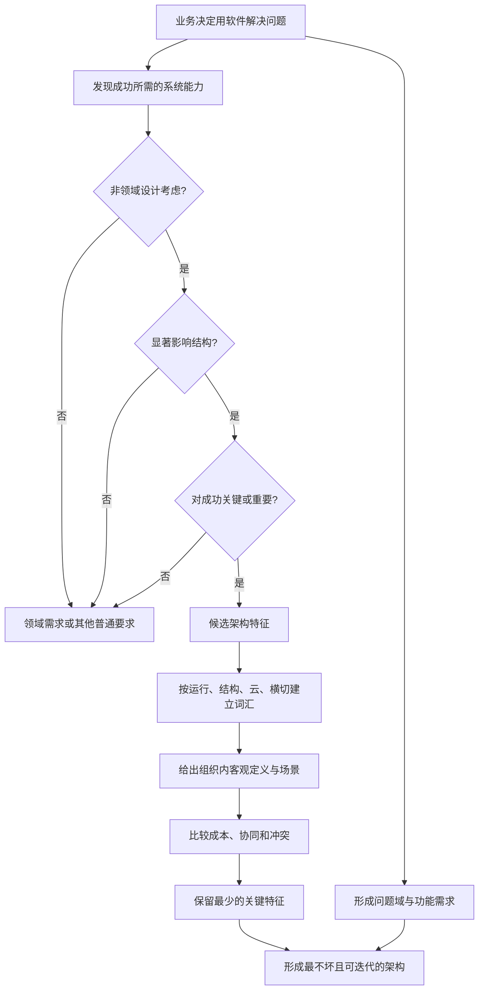
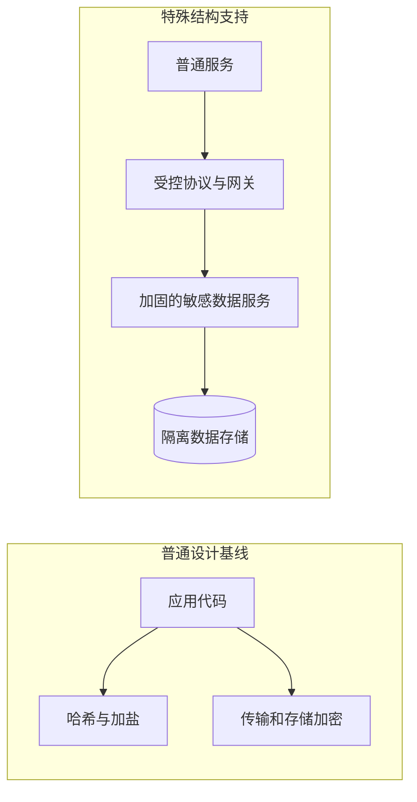
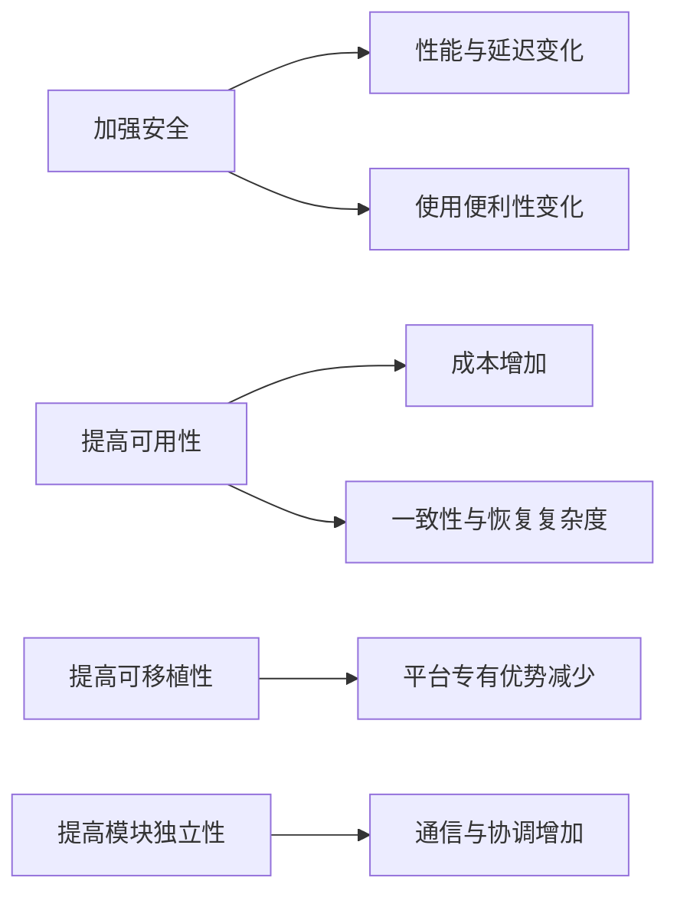
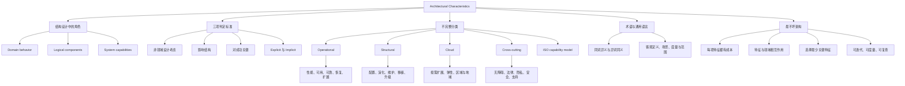

> 对应原章：4. Architectural Characteristics Defined.md
> 本章不只是列举 performance、availability、security 等术语，而是回答一个更基础的问题：什么样的系统关注才算架构特征，以及架构师怎样在没有统一词典、目标彼此冲突的情况下选出少数真正决定结构的能力。
> 本笔记严格沿原章顺序展开。原章没有计算型算法；文中的布尔判定式、成本模型、可用性公式、判断代码和选择流程是教学化表达，用来显式呈现作者的论证。除特别说明外，术语应由具体组织结合业务场景重新定义，不能把本文解释直接当作所有项目的统一标准。

## 0. 本章要回答的核心问题

1. 架构特征分析与逻辑组件设计怎样共同构成结构设计？
2. problem domain、domain requirement 与 architectural characteristic 分别描述什么？
3. 为什么作者不喜欢“非功能需求”和“质量属性”这两个常见名称？
4. “非功能需求”为什么从 20 世纪 70 年代延续至今？
5. 一项关注必须同时满足哪三个条件，才能上升为架构特征？
6. “与领域无关”是否表示架构特征与业务无关？
7. 为什么所有系统都需要安全，却不是所有安全要求都会改变架构结构？
8. 为什么架构师应选择尽可能少、而不是尽可能多的架构特征？
9. explicit 与 implicit architectural characteristics 有什么区别？
10. 运行、结构、云和横切特征四类分别关注什么，它们为什么不是互斥分类？
11. availability、reliability、continuity、recoverability 和 robustness 怎样区分？
12. scalability 与 elasticity、extensibility 有什么不同？
13. interoperability 与 compatibility 为什么有时相似、有时不同？
14. learnability 为什么可能指完全不同的两件事？
15. IP 为什么可以 available 却不 reliable？
16. ISO 质量模型提供了哪些类别和子特征，作者为什么排除 functional suitability？
17. 为什么没有统一词典会直接造成架构风险？
18. ubiquitous language 怎样降低同词异义与异词同义造成的误解？
19. 架构特征之间为何具有协同与冲突关系？
20. “最不坏架构”是什么，为什么比追求“最佳架构”更现实？
21. 迭代能力如何降低第一次选择必须完全正确的压力？

本章的论证主线如下：



一句话概括：**架构特征不是所有“好品质”的愿望清单，而是那些不直接描述领域行为、会改变系统结构、并且对当前系统成功至关重要的少数能力；架构师必须让它们含义明确、可以验证，并在相互冲突时作出可迭代的最不坏选择。**

---

## 1. 开篇：架构特征在结构设计中的位置

作者从软件架构师的一项核心职责切入：structural design（结构设计）。它主要包含两类活动：

1. **architectural characteristics analysis**：分析系统为了成功必须具备哪些跨功能能力，本章及第 5 至第 7 章继续展开；
2. **logical component design**：把问题域行为组织成逻辑组件，第 8 章展开。

两项活动可以先后进行，也可以并行，但最终必须在一个关键汇合点结合。


只做组件设计，会知道系统“由谁做什么”，却不知道这些组件需要怎样部署、隔离、通信和恢复；只做特征分析，会知道系统要“多快、多稳、多安全”，却没有承载业务行为的责任边界。

### 1.1 问题域是什么

当企业决定用软件解决某个问题，会收集系统需求。本书把这些需求整体称为 problem domain，简称 domain。

问题域主要描述系统行为，例如：

- 用户可以创建订单；
- 仓库可以分配库存；
- 财务可以退款；
- 竞拍者可以出价。

这些需求通常直接来自业务流程、规则、实体和用例。

### 1.2 架构特征是什么

第 1 章已经把架构特征概括为系统成功所需的能力。本章进一步强调：它们不直接属于问题域行为，却会决定系统能否以业务需要的方式提供这些行为。

例如，“提交订单”是领域行为；“促销高峰仍能在目标延迟内提交”“一个节点故障时核心下单仍可用”“订单数据只对授权方可见”则分别涉及性能、可扩展性、可用性和安全性。


图 4-1 把 requirements 与 auditability、performance、security、data、legality、scalability 并列，表达两个要点：

1. 功能需求不是设计的全部输入；
2. 数据、法律和多种能力会同时约束最终结构。

### 1.3 架构师为何必须主动发现这些能力

架构师通常参与领域定义，但其区别于普通编码和局部设计的一项职责，是定义、发现并分析所有“不直接属于功能，却决定软件成功”的事项。

原因是很多关键能力不会自然出现在需求文档中：

- 业务方会说“交易必须成功”，未必写清故障恢复；
- 用户会说“页面不能卡”，未必给出峰值延迟场景；
- 合规团队会给出法规名称，未必说明数据和部署结构；
- 开发者会关注当前功能，未必主动限制未来技术债。

若架构师只照抄显式需求，系统可能功能完整，却在容量、故障、安全、维护或法律上失败。

---

## 2. The Longevity of the Term “Non-Functional Requirements”：为何“非功能需求”长期存在

组织使用过多种名称描述架构特征，其中最常见的是 non-functional requirements（非功能需求）和 quality attributes（质量属性）。作者都不满意。

### 2.1 “非功能需求”的问题

这个名称原本用于区别 functional requirements，但语言上带有自我贬低意味：

- “非功能”容易被听成“不重要”或“没有功能”；
- 团队更容易把它排在功能交付之后；
- 利益相关者难以理解为什么要为“非功能”投入结构和预算；
- 实际上，性能、可靠性或安全失败完全可能让系统无法使用。

名称会影响组织注意力。若一个决定成功与否的条件被放在“非功能”标签下，团队可能直到上线前才处理它，而那时结构已很难改变。

### 2.2 “质量属性”的问题

quality attributes 比“非功能”积极，但作者认为它暗示事后质量评估：系统先设计完成，再检查质量如何。

架构特征却应该在结构设计开始时进入决策：

```text
错误顺序：先完成结构 -> 再问性能、安全和可用性是否足够
正确顺序：先识别关键能力 -> 用这些能力塑造结构 -> 持续验证
```

“质量属性”并非行业中错误术语，许多成熟方法都使用它；作者的偏好主要是在强调这些能力是设计输入，而不只是验收标签。

### 2.3 为什么选择“架构特征”

architectural characteristics 直接表明：

- 它们是架构的组成维度；
- 对架构乃至系统成功至关重要；
- 不应因“非功能”而被降级；
- 它们描述系统需要支持的能力。

在作者另一本《Head First Software Architecture》中，architecture characteristics 被称为 system capabilities；相对地，domain 表示 system behavior。

| 维度 | 核心问题 | 例子 |
| --- | --- | --- |
| Behavior / domain | 系统做什么？ | 下单、付款、查询库存 |
| Capabilities / characteristics | 系统以何种能力完成？ | 高峰扩展、故障恢复、授权访问 |

能力与行为不是互相独立。业务行为决定哪些能力重要，能力又会改变行为被划分和部署的方式。

### 2.4 术语的历史来源

“非功能需求”在 20 世纪 70 年代末开始进入软件工程文献，与 function point analysis（功能点分析）大致同期。

功能点分析试图：

1. 把系统需求分解为代表工作单元的 function points；
2. 汇总功能点；
3. 据此估计项目规模和投入。

它提供了确定性的外观，却像许多估算方案一样深受主观判断影响，原章认为如今已经不再使用。

但这一时期留下了一个重要洞见：构建系统的大量工作并不直接来自功能列表，而来自系统能力。人们把相关工作称为 non-function points，进一步促成 non-functional requirements 的流行。

### 2.5 为什么旧术语会“粘住”

术语一旦进入模板、合同、职位培训、工具和组织流程，就会形成切换成本。即使新名称更准确，也不能自动消除旧习惯。

因此，实际沟通中比争论名称更重要的是：

1. 明确团队当前使用哪个词；
2. 给出客观定义；
3. 说明它如何影响结构和成功；
4. 避免同一文档中无解释地混用 capability、quality attribute、NFR 和 characteristic。

---

## 3. Architectural Characteristics and System Design：架构特征与系统设计

本章给出最核心定义：一项需求或关注只有同时满足三个条件，才是架构特征。

1. 它描述 **nondomain design consideration（非领域设计考虑）**；
2. 它会影响设计的某个 **structural aspect（结构方面）**；
3. 它对应用成功 **critical or important（关键或重要）**。


三角形是刻意选择的：三个条件彼此支撑，整体托住系统设计；三角形形成的支点也暗示各特征相互作用，需要不断权衡。

### 3.1 教学化判定式

可以把三项条件写成布尔谓词：

$$
AC(x,c)=N(x,c)\land S(x,c)\land K(x,c)
$$

- $x$ 是某项需求或关注；
- $c$ 是当前系统上下文；
- $N$：它不直接描述领域行为；
- $S$：它需要或显著影响结构；
- $K$：它对当前系统成功关键或重要。

这不是原书计算公式。三个判断都依赖上下文，并需要业务、技术和风险证据。相同关注在一个项目中可能是架构特征，在另一个项目中只是普通设计要求。

```text
function is_architectural_characteristic(concern, context):
    if directly_describes_domain_behavior(concern):
        return false
    if not materially_influences_structure(concern, context):
        return false
    if not critical_to_success(concern, context):
        return false
    return true
```

伪代码的意义是防止把所有好品质都收入架构清单。实际分析还应保留未通过项：它们可能仍是重要的编码、产品或运维要求，只是没有上升为该系统的架构驱动因素。

### 3.2 条件一：非领域设计考虑

结构设计包含两类输入：

- 问题域定义系统行为；
- 架构特征定义系统成功所需能力。

原章表述为：设计需求说明应用应该做什么，架构特征说明这些要求应怎样实现，以及为什么作出某些选择，即项目成功的运行和设计标准。

这里的“非领域”最容易被误解。它不表示与业务无关。恰恰相反，哪些能力关键通常由业务驱动：

| 业务上下文 | 领域行为 | 可能的架构特征 |
| --- | --- | --- |
| 高频交易 | 接单、撮合、成交 | 极低延迟、可预测抖动、可靠性 |
| 医疗设备 | 采集信号、给出治疗动作 | safety、可靠性、可审计性 |
| 内容网站 | 发布和阅读文章 | 峰值可扩展性、可用性、缓存效率 |
| 内部临时报表 | 查询并导出数据 | 可维护性可能比全天候可用更重要 |

“非领域”是说它不直接定义业务用例，不是说它没有业务来源。

#### 隐含设计考虑

性能目标经常重要，却未写入需求；需求文档也几乎不会写“必须防止技术债”，但两者都可能影响设计。

架构师需要从以下信号中提取：

- 业务目标与失败成本；
- 峰值、增长和地域分布；
- 法规、合同和审计要求；
- 团队发布与运维能力；
- 数据敏感性与生命周期；
- 现有系统痛点和修改历史。

第 5 章会详细讨论从领域关切中提取显式和隐式特征，本章只建立定义。

### 3.3 条件二：影响结构

架构师描述架构特征的主要目的，是找出需要特殊结构支持的设计考虑。关键问题是：

> 普通设计和编码实践已经足够，还是系统必须改变边界、部署、通信、数据或冗余结构才能达成？

#### Security：可能是编码基线，也可能成为架构特征

几乎所有项目都要采取安全基线：

- 输入验证；
- 加密；
- 哈希与加盐；
- 安全依赖管理；
- 最小权限编码。

在某些单体系统中，良好编码卫生就足以满足当前安全风险；此时 security 重要，却未必成为决定架构形状的首要特征。

在分布式系统中，若某类数据风险很高，架构师可能建立 hardened service：

- 独立部署敏感能力；
- 使用更严格访问协议；
- 缩小网络和数据访问面；
- 单独审计、监控和加固；
- 限制其他服务直接接触秘密。

此时安全明确改变服务边界和通信结构，因而上升为架构特征。



这个例子不是说单体不需要结构性安全，也不是说微服务天然安全。判断取决于威胁模型、数据等级、合规要求和现有平台能力。

#### Scalability：到一定程度必须改变结构

设计优化、缓存、索引和代码改进可以提高单体容量，但它们有上限。若业务要求超过单一部署单元可承担范围，就需要：

- 复制实例并分配流量；
- 外置或分区状态；
- 拆分热点能力；
- 改变数据拓扑；
- 采用支持独立扩展的分布式结构。

因此，高等级 scalability 往往比一般 security 更直接要求结构支持。原章也指出，运行型架构特征最常触发这种特殊结构。

### 3.4 条件三：对应用成功关键或重要

系统理论上可以支持大量优秀特征，但不应该把所有特征都列为最高目标。每增加一个架构特征，都会增加设计复杂度。

例如同时要求：

- 任何地区全天候可用；
- 所有数据即时强一致；
- 极低延迟；
- 任意平台可移植；
- 最低成本；
- 无停机升级；
- 每项能力都可独立扩展；
- 完整审计且无限期保存。

这些目标不仅昂贵，还可能互相冲突。架构师应选择 **最少的关键特征**，而不是收集最多名词。

#### 为什么少更好

可以用教学化成本表达理解：

$$
C_{\mathrm{architecture}}
=C_{\mathrm{base}}
+\sum_{i=1}^{n}C_i
+\sum_{i<j}C_{ij}
$$

- $C_i$：支持第 $i$ 项特征的设计、开发、测试和运行成本；
- $C_{ij}$：两项特征相互作用产生的修正项；冲突增加成本时为正，协同复用同一机制而降低总成本时可以为负；
- 特征数量 $n$ 增加时，交互组合也会快速增长。

这不是可直接预算的原书公式，而是忽略三项及以上高阶交互的二阶近似。它表达的是：复杂度不只来自每项能力，还来自能力之间的冲突和协同。

### 3.5 Explicit 与 Implicit 架构特征

| 类型 | 来源 | 例子 | 架构师职责 |
| --- | --- | --- | --- |
| Explicit | 需求文档、合同、法规或明确指令 | “结算接口必须满足给定延迟目标” | 澄清场景、结构影响与验证方式 |
| Implicit | 领域常识、风险、默认业务期待 | 可用性、可靠性、安全；高频交易的低延迟 | 主动发现并与利益相关者确认 |

Availability、reliability 和 security 支撑几乎所有应用，却经常没有写入设计文档。高频交易公司也可能不在每个系统中重复“低延迟”，因为领域架构师已经知道它是成功前提。

隐含特征的危险在于双方“以为对方知道”：业务方认为技术团队当然会保证，技术团队认为没写就不是目标。架构师必须把隐含假设变成可讨论、可验证的显式决定。

### 3.6 三条件必须同时成立

| 关注 | 非领域 | 影响结构 | 对成功关键 | 结论示例 |
| --- | --- | --- | --- | --- |
| 用户可以取消订单 | 否，直接属于领域行为 | 可能 | 是 | 功能需求，不因重要就变成架构特征 |
| 所有代码使用统一格式 | 是 | 通常不改变架构结构 | 有帮助但未必关键 | 工程规范，不一定是架构特征 |
| 高峰期支持十倍订单量 | 是 | 是，需要容量和状态结构 | 若促销收入依赖它则是 | 架构特征 |
| 支持罕见旧平台 | 是 | 可能影响适配结构 | 若没有用户依赖则否 | 不应仅因“更兼容”就纳入 |
| 客户数据必须留在指定地域 | 是 | 是，改变部署与数据拓扑 | 法律上关键 | 架构特征 |

#### 可运行的教学化筛选示例

```python
from dataclasses import dataclass


@dataclass(frozen=True)
class Concern:
    name: str
    nondomain: bool
    structural: bool
    critical: bool


def classify(concern):
    return (
        "architecture characteristic"
        if concern.nondomain and concern.structural and concern.critical
        else "other requirement or practice"
    )


concerns = [
    Concern("cancel order", False, True, True),
    Concern("code formatting", True, False, False),
    Concern("10x peak load", True, True, True),
    Concern("regional data residency", True, True, True),
]

for concern in concerns:
    print(f"{concern.name}: {classify(concern)}")
```

输出：

```text
cancel order: other requirement or practice
code formatting: other requirement or practice
10x peak load: architecture characteristic
regional data residency: architecture characteristic
```

代码只是三项标准的记忆工具。真实判断不能让一个人直接勾选三个布尔值，必须记录业务场景、结构证据、失败后果和利益相关者确认。

### 3.7 三角形为何同时表达 trade-off

图 4-2 中三边共同托住 design；三角形支点表达这些因素会彼此牵动：

- 业务成功标准决定什么值得改变结构；
- 结构选择反过来限制性能、成本和可修改性；
- 隐含特征被发现后，可能改变原本的领域组件划分；
- 加强一个特征会影响其他特征。

因此，架构特征分析不是独立清单填写，而是与领域、结构和其他能力反复迭代。

---

## 4. Architectural Characteristics (Partially) Listed：架构特征的不完整清单

架构特征跨度很大：从 modularity 这样的低层代码结构，到 scalability、elasticity 等复杂运行能力。

不存在真正通用的完整标准，原因包括：

1. 不同组织会用同一词表达不同含义；
2. 同一能力在不同系统中边界不同；
3. 技术生态持续产生新概念、度量和验证方法；
4. 云、DevOps、隐私和 AI 等变化不断扩大架构关注范围；
5. 项目可能因独特约束创造自己的特征名称。

所以本节标题刻意使用 “Partially Listed”：分类和表格是起点，不是封闭本体论。

### 4.1 分类的正确用法

分类帮助团队：

- 提醒可能遗漏的关注；
- 建立需求访谈词汇；
- 按专业领域寻找利益相关者；
- 组织验证与治理方式；
- 比较同一组织内多个系统。

分类不能替团队：

- 决定哪些特征关键；
- 给出客观场景和阈值；
- 解决特征冲突；
- 证明某种结构一定正确。

同一特征也可能跨类。例如 security 既有代码结构、运行防护、云 IAM 和横切治理，不能因被放入某一表格就忽略其他作用范围。

### 4.2 Operational Architectural Characteristics：运行型架构特征

运行型特征描述系统在生产运行时必须表现出的能力，常与 operations 和 DevOps 高度重叠。原书列出 availability、continuity、performance、recoverability、reliability/safety、robustness 和 scalability。

#### 4.2.1 Availability：可用性

**是什么**：系统需要在多大比例或哪些时间窗口内可访问、可工作。

若要求 24/7，架构必须考虑故障时怎样快速恢复或继续服务，例如冗余实例、健康检查、自动切换和无停机发布。

教学上常用：

$$
Availability=\frac{Uptime}{Uptime+Downtime}
$$

对于可修复、只在“正常运行/故障停机”两种状态间交替，并已达到长期稳态的服务，常用以下简化近似：

$$
Availability\approx\frac{MTBF}{MTBF+MTTR}
$$

- MTBF：平均故障间隔；
- MTTR：平均修复或恢复时间。

公式未出现在原章，也不覆盖计划停机、降级状态、外部依赖故障和相关性故障，不能替代业务场景。99.9% 月可用性仍允许约 43.8 分钟不可用，而停机发生在结算高峰与深夜的业务影响完全不同。还要定义“可用”的功能边界和测量位置。

#### 4.2.2 Continuity：连续性

**是什么**：系统的灾难恢复能力，以及严重中断后业务能否持续。

它关注的不只是单实例失败，而是机房、区域、关键供应商或数据中心级事件。典型问题：

- 是否有替代运行位置；
- 人员和流程如何切换；
- 数据副本是否可用；
- 灾难期间哪些业务必须继续；
- 是否定期演练。

#### 4.2.3 Performance：性能

**是什么**：系统在给定负载和资源条件下表现多好。

原章列出评估方式：

- stress testing；
- peak analysis；
- 分析功能使用频率；
- response time。

性能不是一个数，至少要区分：

| 指标 | 问题 |
| --- | --- |
| 延迟 | 一次请求多久完成？ |
| 吞吐 | 单位时间完成多少工作？ |
| 并发 | 同时能处理多少活动？ |
| 资源效率 | 达到目标使用多少 CPU、内存、网络？ |
| 尾延迟 | 最慢的一小部分请求怎样？ |

平均延迟可能掩盖 p95/p99 尾部问题，性能目标必须绑定场景、负载和测量点。

#### 4.2.4 Recoverability：可恢复性

**是什么**：灾难发生后多快恢复业务，以及备份与重复硬件需要达到什么程度。

常用补充概念：

- **RTO（Recovery Time Objective）**：目标恢复时间；
- **RPO（Recovery Point Objective）**：最多可接受丢失多长时间范围的数据。

原章直接强调恢复速度、备份策略和重复硬件，没有展开 RTO/RPO；它们是把要求客观化的常用工具。

Recoverability 与 continuity 接近：continuity 更关注灾难期间和整体业务持续，recoverability 更聚焦恢复速度、状态和手段。组织也可能采用不同定义，因此必须在本地词典中说明。

#### 4.2.5 Reliability/Safety：可靠性与安全性

**是什么**：系统是否需要 fail-safe，在故障时是否危及生命或造成巨大经济损失。

这通常是连续谱而非二元属性：

- 娱乐推荐错误可能只影响体验；
- 支付重复扣款会造成经济损失；
- 医疗控制或交通系统错误可能危及生命。

Safety 还要求考虑错误状态是否可检测、系统怎样降级、默认状态是否安全，以及人能否接管。

#### 4.2.6 Robustness：健壮性

**是什么**：系统运行时处理错误和边界条件的能力。

原章举例：互联网连接或电源失败时系统怎样表现。还可包括：

- 依赖超时；
- 输入异常；
- 磁盘满；
- 下游返回部分数据；
- 流量突增；
- 重复或乱序消息。

Robustness 关注面对异常是否有受控行为；reliability 关注在规定条件和时间内是否持续正确提供服务。二者相关但观察角度不同。

#### 4.2.7 Scalability：可扩展性

**是什么**：用户或请求数量增长时，系统仍能运行并满足目标的能力。

需要先定义扩展维度：

- 请求数；
- 数据量；
- 并发连接；
- 租户数；
- 地域数；
- 某个热点功能的负载。

然后说明结构怎样增长：纵向加大单机、横向增加实例、数据分片、异步削峰或独立扩展热点组件。

Scalability 与 performance 不等同：一个系统在当前负载下很快，不代表负载增长后仍能保持；一个可横向扩展系统在低负载下也可能单次请求较慢。

### 4.3 运行特征之间的边界

| 特征 | 主要问题 | 常见混淆 |
| --- | --- | --- |
| Availability | 需要时能否访问和使用？ | 不保证每次结果可靠 |
| Reliability | 在指定条件和时间内是否正确工作？ | 不等于永不故障 |
| Continuity | 灾难下业务怎样持续？ | 比普通实例可用更广 |
| Recoverability | 失败后多快、以何种状态恢复？ | 是连续性的重要部分 |
| Robustness | 异常与边界条件下怎样受控处理？ | 不只是“不会崩溃” |
| Performance | 当前条件下多快、多高效？ | 不自动保证随负载扩展 |
| Scalability | 负载增长后能否维持目标？ | 不等于动态回收资源的弹性 |

### 4.4 Structural Architectural Characteristics：结构型架构特征

架构师对代码结构负有全部或共享责任，包括模块化、可读性、组件耦合控制和其他内部质量。原书列出 configurability、extensibility、installability、leverageability/reuse、localization、maintainability、portability 和 upgradeability。

#### 4.4.1 Configurability：可配置性

**是什么**：最终用户能够多容易地通过界面改变软件配置。

关键不只是配置文件数量，而是：

- 哪些行为可以无代码修改；
- 配置是否有类型、验证和默认值；
- 修改何时生效；
- 是否可审计、回滚；
- 用户是否能理解影响。

配置太少会迫使频繁发版，配置太多会把程序逻辑变成难以测试的隐式语言。

#### 4.4.2 Extensibility：可演化性/可扩展功能性

**是什么**：架构容纳现有功能扩展的能力。

例如新增一种支付提供商时，是否只需实现稳定接口并注册，还是必须修改核心结算流程的多处分支。

它与 scalability 不同：

- extensibility 关注增加或改变功能；
- scalability 关注增加运行负载。

#### 4.4.3 Installability：可安装性

**是什么**：系统在所有必要平台上安装有多容易。

涉及依赖检查、安装自动化、权限、网络、回滚、离线环境和卸载清理。云服务也存在“安装”问题，只是表现为基础设施配置与部署流水线。

#### 4.4.4 Leverageability/Reuse：可复用性

**是什么**：公共组件能在多个产品中被利用的程度。

复用可以减少重复，但通用组件会引入版本协调、兼容性和所有权成本。真正值得共享的通常是稳定、语义一致的能力；仅仅代码相似，不一定应抽成跨团队平台。

#### 4.4.5 Localization：本地化

**是什么**：输入、查询界面和数据字段支持多语言及地区规则的能力。

除翻译文本外，还可能涉及日期、数字、货币、排序、时区、姓名和地址格式。若后期补做，本地化常会触及数据库长度、布局和领域模型，因此可能成为结构特征。

#### 4.4.6 Maintainability：可维护性

**是什么**：系统应用修改和增强有多容易。

它受模块化、耦合、测试、文档、构建反馈和团队认知共同影响。可维护性不能只靠“代码整洁”衡量，应观察从理解变化到安全发布的端到端成本。

#### 4.4.7 Portability：可移植性

**是什么**：系统能否运行于多个平台，例如不同数据库或运行环境。

可移植性通常需要抽象平台差异、限制专有能力使用并建立多环境测试，因此不是免费的。若业务没有迁移可能，过度可移植会牺牲当前平台优势。

#### 4.4.8 Upgradeability：可升级性

**是什么**：服务器和客户端升级到新版本有多容易、多快。

涉及向后兼容、数据迁移、滚动升级、协议版本、客户端滞后和回滚。分布式系统中不同版本共存会使 upgradeability 直接影响契约设计。

### 4.5 结构特征之间的常见张力

| 目标 | 可能帮助 | 可能代价 |
| --- | --- | --- |
| 高可配置性 | 无需发版即可调整行为 | 状态空间和测试组合增加 |
| 高可演化性 | 新功能局部加入 | 抽象层和插件治理增加 |
| 高复用 | 减少重复、统一规则 | 跨产品协调和版本耦合 |
| 高可移植性 | 降低平台锁定 | 难以充分使用平台专有优势 |
| 快速升级 | 缩短漏洞和功能迁移周期 | 需要兼容结构、自动化和额外测试 |

### 4.6 Cloud Characteristics：云特征

第一版出版时云计算已存在，但没有如今普遍。现在多数系统至少部分与云交互，架构词汇随生态变化而扩展。原书列出 on-demand scalability、on-demand elasticity、zone-based availability 和 region-based privacy and security。

#### 4.6.1 On-demand scalability：按需可扩展性

**是什么**：云提供商根据需求动态增加资源的能力。

“云支持扩展”不表示应用自动可扩展。应用仍需：

- 可复制或可分区；
- 正确处理状态；
- 有可用容量信号；
- 避免共享瓶颈；
- 在扩展后维持数据和通信语义。

#### 4.6.2 On-demand elasticity：按需弹性

**是什么**：资源需求突增或下降时，云提供商灵活匹配资源的能力，与 scalability 相似但更强调动态性。

实用区分：

- scalability 关注容量是否能随增长扩大；
- elasticity 关注资源能否及时扩出、缩回并接近实际需求。

弹性还涉及启动时间、冷启动、缩容安全、最小容量和成本上限。

#### 4.6.3 Zone-based availability：基于可用区的可用性

**是什么**：把资源分布在独立计算区域，提高系统对单区故障的韧性。

仅把实例放入多个 zone 不足以保证可用：

- 数据副本是否跨区；
- 负载均衡是否能移除故障区；
- 控制面和依赖是否仍是单区；
- 跨区延迟与费用是否可接受；
- 团队是否演练过整区故障。

#### 4.6.4 Region-based privacy and security：基于地域的隐私与安全

**是什么**：云提供商在法律上能否存储不同国家和地区的数据，以及系统能否遵守数据驻留限制。

许多国家限制公民数据离开特定地域。这个要求会改变：

- 数据库和备份位置；
- 日志、分析和监控数据流；
- 跨区复制；
- 密钥管理；
- 支持人员访问；
- 灾难恢复区域选择。

它同时是云、法律、隐私、安全和数据拓扑问题，说明分类天然交叠。

### 4.7 为什么第二版把云加入各架构风格

原书说明，第二版每个架构风格章节都增加了该风格怎样容纳和促进云考虑的内容。

原因不是“云是一种架构风格”，而是云改变了：

- 资源获取和计费方式；
- 故障域与部署拓扑；
- 托管服务能力；
- 弹性和自动化可行性；
- 地域、隐私和供应商约束。

同一种风格在本地数据中心与云中可能有不同权衡。

### 4.8 Cross-Cutting Architectural Characteristics：横切架构特征

一些特征无法自然归入单一类别，却形成重要设计约束。原书列出 accessibility、archivability、authentication、authorization、legal、privacy、security、supportability、usability/achievability。

#### 4.8.1 Accessibility：无障碍性

**是什么**：所有用户，包括色盲、听力损失等残障用户，能够多容易地访问系统。

它不仅是 UI 颜色问题，还涉及键盘导航、语义结构、字幕、屏幕阅读器、焦点管理和替代交互。若组件库、内容模型和测试流程都要改变，它会形成结构约束。

#### 4.8.2 Archivability：可归档性

**是什么**：数据在指定期限后归档或删除的约束。

要回答：

- 哪些记录必须保留多久；
- 归档后查询速度要求；
- 删除是否包括副本、缓存和备份；
- 法律保全是否暂停删除；
- 归档格式怎样长期可读。

它会影响冷热存储、数据分区、索引、备份和审计结构。

#### 4.8.3 Authentication：认证

**是什么**：确保用户确实是其声称身份的安全要求。

认证回答“你是谁”，可涉及密码、多因素认证、证书、单点登录和机器身份。它与 authorization 不同。

#### 4.8.4 Authorization：授权

**是什么**：确保用户只能访问允许的功能和数据。

授权回答“你能做什么”，粒度可以到：

- 用例；
- 子系统；
- 页面；
- 业务规则；
- 字段级；
- 特定资源实例。

认证成功不代表拥有任何具体权限。两者常由同一安全系统支持，却必须分别建模和测试。

#### 4.8.5 Legal：法律约束

**是什么**：系统运行所受立法和监管限制。

原书举例：

- GDPR 等数据保护法律；
- 美国 Sarbanes-Oxley 等财务记录法律；
- 应用构建或部署方式的规定；
- 公司所需保留权利。

法律条款本身不是技术设计，架构师需与法律和合规专家合作，将其转成数据、日志、访问、驻留、保留和可证明性要求。

#### 4.8.6 Privacy：隐私

**是什么**：系统加密并隐藏交易，使公司内部员工甚至 DBA 和网络架构师也不能无必要地查看。

Privacy 不只是外部攻击防护，还关注内部最小可见性、数据最小化、用途限制和职责分离。它可能要求字段级加密、令牌化、受控解密和审计访问。

#### 4.8.7 Security：安全

**是什么**：数据库加密、内部系统网络通信、远程访问认证等规则和约束的总称。

Security 是大伞概念，可包含 authentication、authorization、confidentiality、integrity 等。项目必须把“安全”拆成具体威胁、资产、控制和验证，不能只把单词列为最高优先级。

#### 4.8.8 Supportability：可支持性

**是什么**：应用需要何种技术支持，以及需要多少日志和诊断设施来定位错误。

Supportability 影响：

- 结构化日志；
- 指标与追踪；
- 关联 ID；
- 诊断端点；
- 运行手册；
- 安全的调试信息；
- 支持团队权限。

系统可以功能正确，却因无法观察内部状态而极难运营。

#### 4.8.9 Usability/Achievability：可用性/目标达成性

**是什么**：用户需要多少训练才能通过应用或解决方案达成目标。

这里的 usability 指人机使用体验，不是 availability 的“服务可用”。应关注用户是否能有效、低错误地完成任务，而不只是界面是否美观。

原表使用 `usability/achievability` 这一组合名称；行业更常单独使用 usability，组织采用时应明确本地定义。

### 4.9 横切特征为什么“横切”

以 privacy 为例，它可能同时进入：

- 领域：哪些数据属于个人信息；
- 代码：怎样标记和处理字段；
- 数据：存储、复制与删除；
- 部署：数据驻留地域；
- 安全：密钥、权限与审计；
- 运维：日志不得泄露敏感值；
- 组织：谁可以批准访问。

横切特征不能由一个局部组件独自“完成”，通常需要跨层设计原则、平台能力和自动验证。

### 4.10 列表为什么必然不完整

任何项目都可能因独特因素创造新的架构特征。术语也常不精确，原因有两类：

1. **细微差别**：不同词关注同一问题的不同侧面；
2. **缺少客观定义**：同一词被不同团队用于不同概念。

列表应作为访谈和发现工具，而不是机械要求每个项目全部支持。

### 4.11 Interoperability 与 Compatibility

某些系统中两者可以近似同义，但原章给出实用区分：

| 术语 | 重点 | 结构信号 |
| --- | --- | --- |
| Interoperability | 与其他系统集成有多容易 | 公开、文档化 API，协议与数据交换 |
| Compatibility | 是否符合行业和领域标准，能否共处或替换 | 标准格式、平台约束、兼容行为 |

例如，一个系统提供清晰 REST API，interoperability 较好；但若输出不符合行业标准格式，domain compatibility 仍可能较差。

ISO 模型把 interoperability 放在 compatibility 之下，说明分类层级本身也不是唯一答案。

### 4.12 Learnability 的两种完全不同含义

原章指出 learnability 至少有两种用法：

1. 用户多容易学会使用软件，属于 usability；
2. 系统利用机器学习算法了解环境，从而自配置或自优化的程度。

若需求只写“系统必须具有 learnability”，UI 团队可能理解为培训成本，平台团队却理解为在线学习能力。必须补充主体和场景：

```text
User learnability：新客服人员在多长时间内能独立完成核心任务？
System learning capability：系统依据哪些反馈、以什么安全边界自动调整配置？
```

### 4.13 Availability 与 Reliability：IP/TCP 例子

两者高度重叠，却不相同。原章用互联网协议说明：

- IP 可用：网络可以继续传输数据包；
- IP 不可靠：数据包可能丢失、重复或乱序，不保证交付；
- 接收方可能需要请求重传；
- TCP 建立在 IP 之上，增加有序、可靠字节流语义。

因此：

```text
available：服务能接收和提供某种能力
reliable：在规定条件下持续给出正确、完整、符合契约的结果
```

一个接口始终返回 HTTP 200，却随机遗漏交易，可能高 availability、低 reliability。

### 4.14 ISO 能力分类

ISO 发布了按能力组织的质量模型，与原书列表重叠，但仍只是一套不完整分类。原章对术语作现代化改写并补充类别。

#### 4.14.1 Performance efficiency：性能效率

在已知条件下，相对于使用资源衡量性能。

| 子特征 | 含义 |
| --- | --- |
| Time behavior | 响应时间、处理时间和吞吐率 |
| Resource utilization | 使用资源的数量和类型 |
| Capacity | 达到或超过已建立最大限制的程度 |

它比单说 performance 更明确地把性能与资源成本绑定。两个系统延迟相同，但一个消耗十倍资源，其 performance efficiency 更差。

#### 4.14.2 Compatibility：兼容性

产品、系统或组件交换信息，或在共享软硬件环境中完成所需功能的程度。

| 子特征 | 含义 |
| --- | --- |
| Coexistence | 与其他产品共享环境和资源时仍能高效完成自身功能 |
| Interoperability | 两个或更多系统交换并使用信息的程度 |

Coexistence 关注共享环境不互相破坏，interoperability 关注信息互通。

#### 4.14.3 Usability：易用性

用户能否为预定目的有效、高效且满意地使用系统。

| 子特征 | 含义 |
| --- | --- |
| Appropriateness recognizability | 用户能否识别软件是否适合自身需要 |
| Learnability | 用户多容易学会使用 |
| User error protection | 系统怎样防止用户犯错 |
| Accessibility | 最广泛能力与特征的人群能否使用 |

这里 accessibility 被放在 usability 下，而原书前表把它列为横切特征，再次说明类别服务于观察角度，不是互斥事实。

#### 4.14.4 Reliability：可靠性

系统在指定条件和指定时间内完成预期功能的程度。

| 子特征 | 含义 |
| --- | --- |
| Maturity | 正常运行时是否满足可靠性需要 |
| Availability | 软件是否可运行且可访问 |
| Fault tolerance | 软硬件故障存在时是否仍按预期工作 |
| Recoverability | 能否恢复受影响数据并重建期望状态 |

在该模型中 availability 和 recoverability 是 reliability 的子特征；组织完全可以采用这个层级，但应与本地文档保持一致。

#### 4.14.5 Security：安全性

软件保护信息和数据，使人或其他系统只获得与其授权类型和级别相符访问的程度。

| 子特征 | 含义 |
| --- | --- |
| Confidentiality | 数据只对获授权者可访问 |
| Integrity | 防止未授权访问或修改软件与数据 |
| Nonrepudiation | 能证明某项动作或事件确实发生 |
| Accountability | 能把用户动作追溯到责任主体 |
| Authenticity | 能证明用户或实体身份 |

这些子特征可能需要完全不同的控制和证据。“我们使用加密”主要帮助 confidentiality，不能自动证明 integrity、accountability 或 nonrepudiation。

#### 4.14.6 Maintainability：可维护性

开发者为改进、纠错或适应环境/需求变化而修改软件时的有效性和效率。

| 子特征 | 含义 |
| --- | --- |
| Modularity | 软件由离散组件组成的程度 |
| Reusability | 资产可在多个系统或构建其他资产时使用的程度 |
| Analyzability | 开发者多容易收集软件的具体指标并理解影响 |
| Modifiability | 修改时不引入缺陷或降低现有质量的程度 |
| Testability | 开发者和其他人多容易测试软件 |

第 3 章的模块化、耦合和指标正是 maintainability 的结构基础之一。

#### 4.14.7 Portability：可移植性

系统、产品或组件从一个软硬件、运行或使用环境转移到另一个环境的程度。

| 子特征 | 含义 |
| --- | --- |
| Adaptability | 能否高效适应不同或变化中的环境 |
| Installability | 能否在指定环境安装或卸载 |
| Replaceability | 现有功能多容易被其他软件替代 |

Portability 不只意味着“能在另一操作系统启动”，也包括环境适应、交付和替换能力。

### 4.15 Functional suitability：功能适合性

ISO 列表最后一项描述软件功能方面：产品或系统在指定条件下满足显式和隐式需要的程度。

| 子特征 | 含义 |
| --- | --- |
| Functional completeness | 功能集合是否覆盖所有指定任务和用户目标 |
| Functional correctness | 是否以所需精度给出正确结果 |
| Functional appropriateness | 功能是否帮助完成指定任务和目标 |

作者不认为 functional suitability 属于架构特征，因为它描述构建软件的动机和问题域要求，而非独立于领域的架构能力。

这个判断也不是说功能正确性不重要。它说明分类边界：

- “计算税额正确”是领域功能正确性；
- “高峰负载下仍在目标时间内正确计算”包含性能和可扩展性；
- “税法变化可局部修改”包含可维护性和模块化。

功能与架构特征共同定义成功，但概念角色不同。第 7 章会继续讨论这种关系的演化和作用范围。

### 4.16 The Many Ambiguities in Software Architecture：软件架构中的大量歧义

软件架构本身和许多关键术语都没有清晰、统一定义。这会导致：

- 不同公司为常见概念创造自己的名称；
- 同一个词被用于完全不同含义；
- 不同词实际指向同一能力；
- 需求看似达成共识，实施时才发现理解不同；
- 指标和验收标准无法比较。

行业不可能被强制采用一套永恒命名，因为技术和问题持续变化。作者采用 DDD 的建议：在组织内部建立 ubiquitous language（通用语言）。

#### 通用语言不是术语表复制

有效条目至少应包含：

```text
名称：本组织统一使用的词
定义：它在这里明确表示什么
不表示什么：与相邻术语的边界
场景：在什么刺激和条件下观察
度量：怎样判断满足
作用范围：系统、组件、流程或数据域
负责人：谁提供证据和作出取舍
```

例如：

```text
名称：核心交易可用性
定义：授权用户能够提交并获得持久化受理结果
不表示：所有报表和推荐功能同时可用
场景：单个应用实例故障，流量处于约定峰值
度量：从用户入口测量的成功率和恢复时间
作用范围：交易入口、订单持久化及必要身份服务
```

“客观定义”不一定意味着一个数字，但必须让不同人能依据相同证据判断。

---

## 5. Trade-Offs and Least Worst Architecture：权衡与最不坏架构

本章最后回到第一定律：架构中的一切都是权衡。系统只能重点支持少数架构特征，原章给出四方面原因。

### 5.1 原因一：支持特征从来不是免费的

每项特征都可能要求：

- 架构师设计和验证；
- 开发者实现与长期维护；
- 特殊结构；
- 基础设施和许可证；
- 测试、演练和监控；
- 文档、培训与支持流程。

例如高可用需要冗余和故障切换，可审计需要记录与保护事件，可移植需要抽象平台差异。这些能力还会持续产生运行成本。

### 5.2 原因二：特征彼此协同，也与问题域协同

原章使用 synergistic，强调一个设计元素变化会影响其他元素和领域设计。

#### Security 与 Performance

加强安全往往增加：

- 在线加密与解密；
- 多一层身份和策略检查；
- 为隐藏秘密增加间接访问；
- 审计写入；
- 网络握手和令牌验证。

这些操作可能提高 CPU、I/O 和请求路径长度，降低性能。但不能由此得出“安全和性能只能二选一”：硬件加速、会话复用、缓存验证结果、合理边界都能缓解代价。真正结论是收益不免费，必须测量。

#### 直升机类比

学习驾驶直升机的飞行员要同时控制双手和双脚；改变一个控制会影响其他控制。选择架构特征也是平衡过程：



改变一项特征还可能改变组件边界和领域工作流，所以分析必须迭代。

### 5.3 原因三：定义歧义妨碍选择

若组织对 reliability、availability 或 scalability 没有共同定义，就无法：

- 判断它是否真正关键；
- 比较候选结构；
- 设计验证；
- 解释为什么牺牲另一特征；
- 在交付后验收。

行业不会产生永恒完整列表，但组织可以维护自己的客观词典和通用语言。

### 5.4 原因四：特征类别还在增加

几十年前，架构师较少关心运行问题，operations 常被当作独立黑盒。微服务等分布式架构普及后：

- 服务数量和故障模式增加；
- 部署、可观测性和自动化直接决定结构是否可行；
- 架构师与运维必须更频繁协作；
- 云、成本、地域和平台能力进入设计早期；
- 软件架构与组织更多部分纠缠。

这体现架构边界随生态变化，而不是一套固定技术图。

### 5.5 为什么无法最大化所有特征

多目标问题通常没有一个方案在所有维度都最佳。设候选架构 $a$ 在多个特征上得到结果向量：

$$
Q(a)=(q_{\mathrm{performance}},q_{\mathrm{security}},q_{\mathrm{availability}},q_{\mathrm{maintainability}},q_{\mathrm{affordability}},\ldots)
$$

这里把所有分量统一约定为“越大越好”，因此使用 affordability（成本可承受性）而不是原始 cost；若直接使用成本，则其优化方向应为最小化。提升一个分量可能降低另一个，且优先级来自当前问题域。更合理的目标不是“所有分量最大”，而是：

1. 满足法律、生命安全、预算等硬约束；
2. 优先保护少数业务关键能力；
3. 在可行方案中选择整体代价可接受者；
4. 记录牺牲与复查条件。

### 5.6 Least worst architecture：最不坏架构

作者给出本章最重要建议：

> 不要追求“最佳”架构；应追求“最不坏”架构。

“最不坏”不是降低标准，而是承认：

- 每个方案都有缺点；
- 不同利益相关者承担不同代价；
- 未来信息不完整；
- 当前上下文只允许某些可行方案；
- 好决定必须明确接受了什么坏处。

专业架构建议不应说“方案 A 最好”，而应说：

```text
在当前业务优先级和约束下，A 最能保护 X 与 Y；
我们接受 Z 的成本，并用措施 M 限制它；
若流量、法规或团队边界发生条件 R，重新比较 B。
```

### 5.7 为什么“支持太多特征”会产生通用架构陷阱

试图处理所有架构特征，往往得到一个想解决所有业务问题的 generic solution：

- 抽象层过多；
- 配置项爆炸；
- 插件和扩展点无人使用；
- 同时支持多种数据、部署和通信模式；
- 测试组合难以覆盖；
- 团队无法理解整体；
- 当前核心场景反而变慢。

这种架构看似未来证明，实际因体量和复杂度难以工作。架构应为已知关键变化留空间，而不是预先实现所有想象中的未来。

### 5.8 一套可复用的最不坏选择流程

```text
function choose_least_worst_architecture(context, concerns, options):
    define_local_ubiquitous_language(concerns)
    candidates = []

    for concern in concerns:
        if nondomain(concern) and structural(concern) and critical(concern):
            candidates.append(concern)

    rank_by_business_outcome_and_failure_cost(candidates)
    keep_the_fewest_critical_characteristics(candidates)

    for option in options:
        reject_if_it_violates_hard_constraints(option)
        expose_benefits_costs_and_characteristic_interactions(option)
        test_the_assumptions_most_likely_to_change_the_decision(option)

    decision = choose_option_with_acceptable_tradeoffs(options)
    document_accepted_disadvantages(decision)
    define_measures_and_review_triggers(decision)
    return decision
```

逐步依据：

1. **先统一词义**：否则后面的比较对象不同；
2. **应用三条件**：把普通愿望从架构驱动因素中筛出；
3. **排序并最小化**：避免所有目标都最高优先级；
4. **先过滤硬约束**：法律和安全底线不能被便利性补偿；
5. **显式列交互**：不能只计算单项收益；
6. **验证关键假设**：用容量测试、故障演练、威胁建模或原型减少猜测；
7. **记录接受的缺点**：让利益相关者理解真实代价；
8. **定义度量和复查**：支持下一轮迭代。

这套教学化流程不会自动给出答案。特征优先级、硬约束和风险判断仍需要领域专家、业务方、开发与运维共同承担。

### 5.9 迭代为何是答案的一部分

作者最后把 Agile 的重要经验应用到架构：尽可能设计可迭代的架构。架构越容易改变，团队越不必为第一次发现“精确正确答案”承受过大压力。

迭代不等于无设计或随时推翻。它要求：

- 决策规模尽量可逆；
- 组件边界和契约支持局部变化；
- 数据迁移有策略；
- 基础设施和测试自动化；
- 运行指标能验证特征；
- 架构决策记录上下文和复查触发器；
- 先验证高风险、难逆转部分。


可迭代性本身也有成本，不能为了未来可变而加入无限抽象。目标是让最可能变化、最不确定的决定具有合理退出路径。

---

## 6. 容易混淆的概念与常见误区

### 6.1 “非功能需求不属于功能，所以不重要”

错误之处：性能、安全或可靠性失败可以让功能完全失去业务价值。

正确理解：作者使用“架构特征”强调它们是系统成功能力和结构设计输入。

### 6.2 “质量属性只需在开发完成后验收”

错误之处：高可用、地域驻留或独立扩展往往要求早期结构支持。

正确理解：架构特征应在结构形成前识别，并在实现中持续验证。

### 6.3 “非领域设计考虑与业务无关”

错误之处：特征优先级正是由业务目标、失败成本和法规驱动。

正确理解：它不直接描述业务行为，但决定行为必须以何种能力提供。

### 6.4 “所有项目都需要安全，所以 security 总是首要架构特征”

错误之处：所有项目需要安全基线，但只有特殊安全目标显著影响结构时，才成为该项目的架构驱动因素。

正确理解：同时检查结构影响和成功关键性，并把“安全”拆为具体威胁与控制。

### 6.5 “一项关注很重要，就一定是架构特征”

错误之处：核心业务功能很重要，却仍属于问题域；代码格式也可能重要，但不一定影响架构结构。

正确理解：非领域、结构影响、成功关键三项缺一不可。

### 6.6 “架构特征越多，系统质量越高”

错误之处：每项特征增加成本，特征交互还会产生额外复杂度。

正确理解：选择最少的关键特征，其他能力保持适当基线。

### 6.7 “隐含特征不必写出来，因为业内都懂”

错误之处：不同角色对“当然可用”“当然安全”的阈值完全不同。

正确理解：架构师要发现隐含项，并将场景、范围和度量显式化。

### 6.8 “四类架构特征互相排斥”

错误之处：地域隐私同时属于云、法律、安全和数据；accessibility 也可归入 usability。

正确理解：分类用于组织思考，不是唯一归属规则。

### 6.9 “Availability 高就表示 Reliability 高”

错误之处：系统可以始终响应，却返回错误或丢失数据；IP 能传包但不保证可靠交付。

正确理解：availability 关注可访问，reliability 关注规定条件下持续正确工作。

### 6.10 “Continuity 与 Recoverability 完全相同”

错误之处：两者重叠，但 continuity 更宽地关注灾难下业务持续，recoverability 更聚焦恢复时间、数据和状态。

正确理解：不要依赖字面差异，应在组织词典中给出本地边界。

### 6.11 “Scalability、Elasticity、Extensibility 都是可扩展性”

错误之处：中文译名相近，关注对象不同。

正确理解：scalability 处理负载增长，elasticity 处理资源动态匹配，extensibility 处理功能演化。

### 6.12 “云提供自动扩展，所以应用天然可扩展”

错误之处：共享状态、数据库热点和单点依赖不会因增加实例自动消失。

正确理解：云提供资源能力，应用结构必须允许正确复制、分区和观测。

### 6.13 “Authentication 成功就代表拥有权限”

错误之处：认证只证明身份，授权决定该身份能访问什么。

正确理解：分别建模身份、权限、资源和策略，并分别测试。

### 6.14 “使用加密就满足 Security”

错误之处：加密主要保护机密性，不能自动提供完整性、可追责、不可否认和正确授权。

正确理解：把 security 分解为具体子特征、威胁和证据。

### 6.15 “Interoperability 与 Compatibility 永远同义”

错误之处：前者可强调集成和信息利用，后者可强调标准、共存和环境兼容。

正确理解：采用哪种层级并不重要，重要的是组织内定义一致。

### 6.16 “Learnability 的含义显而易见”

错误之处：它既可能指用户学习软件，也可能指系统通过机器学习适应环境。

正确理解：定义学习主体、输入、目标和验证场景。

### 6.17 “ISO 列表就是完整行业标准答案”

错误之处：ISO 提供有用分类，但仍不完整，类别也与原书分类重叠。

正确理解：把它作为发现词汇，项目仍需选择、重定义和度量。

### 6.18 “Functional suitability 不重要，所以被排除”

错误之处：作者排除它是因为它属于构建软件的功能动机和问题域，而不是因为功能正确性不重要。

正确理解：领域行为与架构能力同样必要，但概念角色不同。

### 6.19 “最不坏架构就是接受低质量”

错误之处：它不是放弃工程标准，而是诚实承认多目标冲突和已接受代价。

正确理解：满足硬约束，保护最关键能力，并为缺点设置缓解和复查机制。

### 6.20 “可迭代架构意味着先不设计”

错误之处：无边界、无度量和无迁移策略会让未来更难改变。

正确理解：优先设计难逆转部分，同时让不确定决定可验证、可局部修订。

---

## 7. 从本章提炼的通用架构特征分析法

### 第 1 步：建立问题域与成功结果

明确系统行为、业务目标、用户、关键流程、失败成本、法规和时间边界。

**输出**：领域需求与业务成功条件。

### 第 2 步：收集显式与隐式关注

从需求、利益相关者、历史事故、运行数据、领域常识和风险中收集候选，不急于把它们都叫架构特征。

**输出**：未经筛选的 concern 清单及来源。

### 第 3 步：应用三项必要条件

逐项判断是否为非领域考虑、是否显著改变结构、是否对当前成功关键。

**输出**：架构特征候选与被排除项的原因。

### 第 4 步：建立组织内通用语言

为每个候选写出定义、反例、相邻术语边界、场景、作用范围和负责人。

**输出**：可供业务、开发、运维和安全共同使用的词典。

### 第 5 步：把抽象名词变成场景

定义刺激、环境、受影响构件、期望响应和度量。例如不要只写“高可用”，而要说明什么故障下哪些功能保持何种结果。

**输出**：可验证的特征场景。

### 第 6 步：识别结构影响

说明该特征会改变组件、部署、数据、通信、冗余、可观测性或团队所有权的哪一部分。

**输出**：特征到结构决策的因果链。

### 第 7 步：排序并最小化

区分硬约束、最高优先级、重要基线和普通愿望。只保留足以改变架构选择的少数关键特征。

**输出**：有优先级的最小特征集合。

### 第 8 步：绘制相互作用

对安全与性能、可用与成本、可移植与平台利用等关系，记录增强一项对其他项的影响。

**输出**：协同、冲突与成本承担者矩阵。

### 第 9 步：选择最不坏结构

过滤违反硬约束的方案，比较各方案保护什么、牺牲什么，验证高风险假设并记录接受的缺点。

**输出**：带上下文、理由、风险和替代方案的架构决定。

### 第 10 步：度量并迭代

把特征转成测试、指标、演练和适应度函数；业务或技术变化时重新评估优先级和结构。

**输出**：运行证据、复查触发器和下一轮改进。

这十步不是线性瀑布。新组件边界可能暴露安全作用范围，容量测试可能否定可扩展假设，法规解释也可能改变数据拓扑，因此需要持续往返。

---

## 8. 本章知识结构



整章可以压缩为四层：

1. **定义层**：架构特征必须同时非领域、影响结构、决定成功；
2. **词汇层**：运行、结构、云、横切及 ISO 分类帮助发现候选；
3. **语义层**：任何术语都必须在组织内用场景和度量消除歧义；
4. **决策层**：选择最少关键特征，分析相互作用，形成可迭代的最不坏架构。

---

## 9. 核心结论

1. **结构设计由架构特征分析与逻辑组件设计共同构成，两者可以并行，但最终必须结合。**
2. **问题域描述系统行为，架构特征描述系统成功所需能力；能力仍由业务驱动，并非与业务无关。**
3. **“非功能需求”容易降低注意力，“质量属性”容易暗示事后检查，作者因此偏好“架构特征”。**
4. **一项关注只有同时属于非领域设计考虑、显著影响结构、对当前系统成功关键，才是架构特征。**
5. **安全等关注可能只是所有项目的编码基线，也可能因特殊威胁和隔离要求上升为结构驱动因素。**
6. **高等级可扩展性通常要求复制、分区或分布式结构，不能只靠局部代码优化无限获得。**
7. **架构师必须主动发现 implicit characteristics，并把领域常识和默认期待转成可讨论场景。**
8. **架构特征应越少越好，因为每项都增加实现、维护和运行成本，特征之间还会产生组合复杂度。**
9. **运行型特征关注生产行为，结构型关注代码和演进，云特征关注供应商资源与故障/法律拓扑，横切特征跨越多个层次。**
10. **分类不是互斥标准；privacy、security、accessibility 等可以同时位于多个观察类别。**
11. **Availability 关注能否访问，reliability 关注是否持续正确工作；IP 提供了可用但不可靠的经典例子。**
12. **Continuity 更宽地关注灾难下业务持续，recoverability 更聚焦恢复速度、数据和期望状态。**
13. **Scalability 关注负载增长，elasticity 关注资源动态匹配，extensibility 关注功能演化。**
14. **Authentication 证明身份，authorization 决定权限；二者不能互相替代。**
15. **Interoperability、compatibility、learnability 等词没有脱离上下文的唯一含义。**
16. **ISO 模型提供了有价值的能力与子特征分类，但仍不完整，也不是每个项目的必选清单。**
17. **作者排除 functional suitability，是因为它描述问题域功能动机，而不是因为功能正确性不重要。**
18. **组织应建立包含定义、反例、场景、度量和作用范围的 ubiquitous language。**
19. **特征彼此协同并冲突：提高安全可能影响性能，提高可用可能增加成本，提高可移植可能限制平台优势。**
20. **不存在最大化全部特征的通用最佳架构，成熟目标是满足硬约束并保护少数关键能力的最不坏架构。**
21. **追求太多特征会产生臃肿的通用解决方案，预付大量当前业务并不需要的复杂度。**
22. **架构越易于度量和迭代，第一次选择就必须完全正确的压力越小，但可变性本身也不能无限抽象。**

---

## 10. 主动回忆与应用题

以下问题不重复提供紧邻答案，适合在读完后脱离正文作答，再回到对应章节核对推理链。

1. 某银行需求写着“转账必须正确、全年可用且任何员工不得看到完整账号”。分别判断哪些是领域行为、普通基线或架构特征，并逐项应用三项必要条件。
2. 一个内部工具每天只使用两小时。团队仍把 99.999% availability 列为最高目标，你会追问哪些业务问题，又怎样判断它是否关键？
3. 同一项 security 关注在什么时候只需编码卫生，什么时候必须改变服务、数据和网络边界？给出两个对照场景。
4. 用一个具体系统说明 explicit characteristic 与 implicit characteristic，并解释怎样把隐含期待转成可验证场景。
5. 为 availability、reliability、continuity、recoverability 和 robustness 各写一句不互相循环引用的本地定义。
6. 一个接口当前延迟很低，却无法增加第二个实例。解释为什么 performance 良好不能推出 scalability 良好。
7. 比较 scalability、elasticity 与 extensibility：各自增加的对象是什么，各自可能要求哪些结构支持？
8. 对“用户登录后可以删除订单”这句话，分别从 authentication、authorization 和领域规则三个角度指出仍需澄清的内容。
9. 设计一个地域数据驻留场景，说明它为何会同时跨越 cloud、privacy、security、legal 与 data topology。
10. 解释 IP available but not reliable 的含义，并给出另一个“持续响应但结果不可靠”的软件例子。
11. 为 learnability 写出两个完全不同的验收场景，使一个面向用户、一个面向能够自适应的系统。
12. 从 ISO Security 子特征中选择 confidentiality、integrity、accountability，分别说明为什么“已加密”不能证明另外两项成立。
13. 为什么作者把 functional suitability 排除在架构特征之外？再举一个同时包含功能正确性与架构特征的需求。
14. 为自己的项目建立一条 ubiquitous language 条目，至少包含定义、反例、场景、度量与作用范围。
15. 选择一对存在冲突的架构特征，画出增强其中一项如何改变另一项、成本和领域流程。
16. 面对十项都被标为“最高优先级”的特征，怎样通过硬约束、失败成本和业务结果缩减为最小关键集合？
17. 给出一个 generic architecture 为未来预置过多能力而失败的例子，并指出哪些复杂度属于提前支付。
18. 用“在条件 X 下选择 A、接受代价 Y、由措施 Z 缓解、条件 R 触发复查”的格式写一条 least-worst architecture 建议。
19. 哪些架构决定最难迭代？如何用试验、契约、迁移与自动化降低第一次选择错误的代价？
20. 不看正文，完整复述本章的问题解决链：收集关注、三条件筛选、统一词义、场景化、排序、权衡、决策、度量与迭代。
