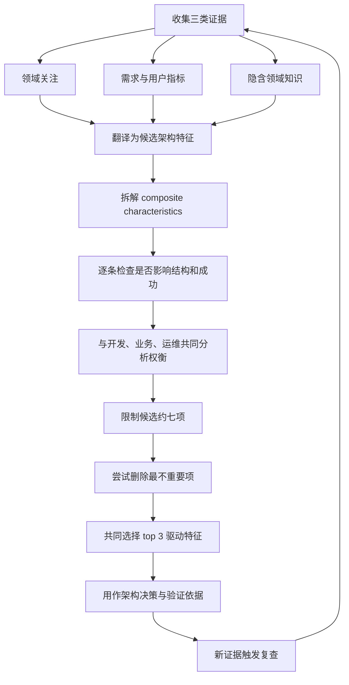
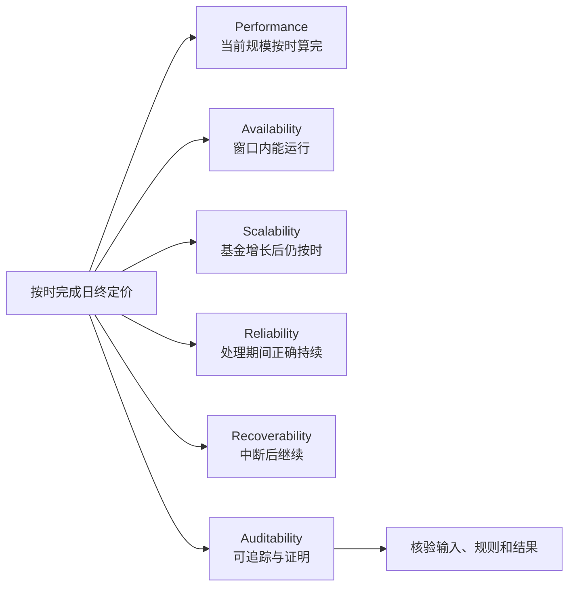
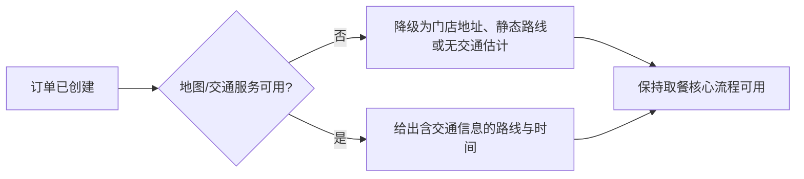

> 对应原章：5. Identifying Architectural Characteristics.md
> 第 4 章回答“什么才算架构特征”，本章回答“怎样从真实业务材料中找出来并压缩成可用的优先级”。核心不是看到关键词就贴标签，而是把领域语言翻译为工程能力，拆解复合目标，从显式需求和隐含领域知识交叉取证，再通过协作和淘汰控制特征数量。
> 本笔记严格沿原章顺序展开。原章没有正式计算算法；文中的集合、峰值公式、Python 算例、提取伪代码和工作坊流程属于教学化表达。它们用于显式展示作者的推理，不能代替利益相关者协作、领域判断和真实容量验证。

## 0. 本章要回答的核心问题

1. 创建新架构或验证旧架构时，为什么必须同时分析问题域和架构特征？
2. 需要的架构特征至少可以从哪三个来源发现？
3. 领域利益相关者与架构师为什么会产生“翻译丢失”？
4. mergers and acquisitions、time to market、user satisfaction 等业务语言怎样映射到 “-ilities”？
5. 为什么这种映射只能产生候选，不能当成固定查找表？
6. 什么是 composite architectural characteristic，为什么 agility 不能只等同于 time to market？
7. 为什么“日终基金定价必须按时完成”不能只优化 performance？
8. 架构师的领域知识如何补足需求文档中的平均值假设和行为模式？
9. architecture kata 是什么，为什么架构师需要刻意练习？
10. kata 的 Description、Users、Requirements、Additional context 分别提供什么证据？
11. Silicon Sandwiches 案例怎样从用户规模推导 scalability，从用餐时段推导 elasticity？
12. scalability 与 elasticity 的负载形状和结构要求有何区别？
13. 为什么某些功能需求不产生特殊架构特征？
14. 外部地图服务会带来什么可靠性问题，为什么不应让可选交通信息拖垮下单？
15. 移动端、促销定制、支付、加盟、海外扩张和低成本劳动力分别更偏架构还是设计？
16. customizability 何时由 Template Method 等应用设计解决，何时值得采用 microkernel 结构？
17. security 为什么在所有系统中隐含存在，却未必是本系统的驱动架构特征？
18. overspecifying 与 underspecifying 为什么都危险？
19. Ivory Tower architecture antipattern 是怎样产生的？
20. 为什么完成第一轮候选后应尝试删除“最不重要的一项”？
21. Vasa 的沉没怎样说明“全部都要”会毁掉系统？
22. architectural characteristics worksheet 如何限制候选、提升隐含项、保留淘汰项并选出 top 3？
23. 为什么不应强求所有利益相关者对完整排序达成一致？
24. 怎样把本章方法转化为可重复的识别与优先级工作坊？

本章的论证主线如下：



一句话概括：**架构特征识别是一项翻译、分解、取证和删减工作：从业务真正关心的结果出发，把模糊目标转成可设计能力，用领域知识补足隐藏负载与风险，再只保留会驱动结构的少数关键特征。**

---

## 1. 开篇：架构特征从哪里来

要创建架构，或判断现有架构是否仍然有效，架构师必须分析两个方面：

1. **architectural characteristics**：系统成功所需的能力和结构驱动力；
2. **domain**：系统要解决的问题、业务行为和规则。

第 4 章已经定义：架构特征不直接描述领域行为，却影响结构并对成功关键。本章进一步指出，正确识别它们不仅需要理解领域问题，还需要与利益相关者合作，确认从业务视角看什么才真正重要。

### 1.1 三个发现来源

原章至少给出三个来源：

| 来源 | 能提供什么 | 常见风险 |
| --- | --- | --- |
| Domain concerns | 业务目标、竞争压力、失败成本和组织变化 | 语言过于抽象，无法直接设计 |
| Project requirements | 用户数量、集成、地域、功能和明确约束 | 文档遗漏高峰、异常和默认期待 |
| Implicit domain knowledge | 领域中“不言自明”的风险、时序和行为模式 | 依赖个人经验，可能过时或带偏见 |

三者不能互相替代：

- 只有需求文档，会漏掉学生拖到最后注册、午餐流量突发等现实行为；
- 只有架构师经验，会把未经验证的假设强加给业务；
- 只有高层业务目标，又无法得到可实现、可验证的结构能力。

### 1.2 通用隐含特征与领域隐含特征

一些隐含特征几乎适用于所有系统，例如 security 和 modularity；另一些来自特定领域。

原书以医疗软件为例：读取诊断设备数据的系统必须重视 data integrity 和消息丢失后果。需求可能没有反复写“不可丢消息”，但熟悉医疗领域的架构师应知道，缺失诊断数据可能导致错误判断，后果远高于普通分析事件丢失。

领域知识的正确作用不是替利益相关者决定，而是帮助提出需求文档没有提出的问题：

```text
这条消息丢失后会发生什么？
能否重放？重复消息是否同样危险？
怎样证明数据从设备到诊断结果没有被篡改？
什么故障必须阻止继续操作？
```

### 1.3 识别不是一次性活动

新证据会不断出现：

- 容量测试否定用户均匀分布假设；
- 法务解释改变数据边界；
- 业务决定海外扩张；
- 外部 API 的故障历史暴露可靠性风险；
- 开发团队发现某项定制可以用简单设计完成。

因此，识别结果应记录来源、假设和复查条件，而不是冻结为永恒清单。

---

## 2. Extracting Architectural Characteristics from Domain Concerns：从领域关注提取架构特征

大多数架构特征来自倾听关键领域利益相关者，并与他们协作确认业务上真正重要的事情。看似直接，实际存在语言鸿沟。

### 2.1 “翻译丢失”问题

架构师常说：

- scalability；
- interoperability；
- fault tolerance；
- learnability；
- availability。

领域利益相关者常说：

- mergers and acquisitions；
- user satisfaction；
- time to market；
- competitive advantage。

双方若只用自己的词汇，会出现：


业务目标太宏观，不能直接转成组件、通信或部署；技术特征太抽象，业务方看不出它与收入、客户和风险的关系。架构师必须建立因果链，而不是做词语替换。

### 2.2 原书表 5-1 的常见映射

| Domain concern | Architectural characteristics |
| --- | --- |
| Mergers and acquisitions | Interoperability, scalability, adaptability, extensibility |
| Time to market | Agility, testability, deployability |
| User satisfaction | Performance, availability, fault tolerance, testability, deployability, agility, security |
| Competitive advantage | Agility, testability, deployability, scalability, availability, fault tolerance |
| Time and budget | Simplicity, feasibility |

表格不是一对一翻译器，而是问题提示器。每行背后有一条推理链。

### 2.3 Mergers and acquisitions：并购

并购意味着未来要把不同组织的系统、数据和流程组合起来。

可能推导：

- **interoperability**：能否通过文档化接口交换并使用信息；
- **scalability**：合并后用户、交易和数据规模是否增长；
- **adaptability**：系统能否适应新的流程、平台和组织规则；
- **extensibility**：能否加入新产品、区域或能力。

但并购目标不自动要求所有四项最高优先。若公司计划淘汰被收购系统而非长期集成，短期数据迁移与可替换性可能比永久 interoperability 更重要。

### 2.4 Time to market：上市时间

业务要更快交付，架构不能只要求开发者“写快一点”。持续速度来自：

- **agility**：响应变化的综合能力；
- **testability**：能否快速、可信地验证；
- **deployability**：能否低风险、频繁地把变化交付生产。

若编码一天、测试两周、发布一个月，局部开发速度无法缩短上市时间。

### 2.5 User satisfaction：用户满意度

满意度是结果，不是单一技术属性。原表映射到：

- performance：交互是否及时；
- availability：需要时能否使用；
- fault tolerance：局部故障是否摧毁体验；
- testability：变更是否少引入回归；
- deployability：问题和改进能否快速上线；
- agility：能否响应用户变化；
- security：用户能否信任系统。

还可能需要 usability、accessibility 或 privacy，说明表格并不完整。最关键的是与用户研究和业务指标确认：当前满意度到底被速度、错误、缺功能还是信任问题主导。

### 2.6 Competitive advantage：竞争优势

竞争优势可能来自更快试验、更稳定服务、更大规模或独特功能，所以原表列出 agility、testability、deployability、scalability、availability、fault tolerance。

不能把“竞争优势”全部交给架构。品牌、渠道、定价和领域创新也可能更重要。架构特征只应覆盖软件结构真正能影响的部分。

### 2.7 Time and budget：时间与预算

硬性时间和预算约束指向：

- **simplicity**：减少构件、间接层和运行负担；
- **feasibility**：方案能否在现有资金、期限、技能和平台下实现。

简单不是功能少，而是避免为未证实未来支付复杂度；可行性也不是“技术上能做”，还包括团队能否构建、测试、运营和承担成本。

### 2.8 从“查表”升级为因果翻译

正确过程是：

```text
领域关注
    -> 追问成功结果与失败后果
    -> 识别受影响场景
    -> 提出候选架构特征
    -> 说明每项特征怎样支持结果
    -> 定义结构影响和验证方式
```

例如：

```text
领域关注：缩短上市时间
失败后果：错过季节窗口，竞争者先进入市场
瓶颈证据：回归测试 8 天，发布审批 10 天
候选特征：testability、deployability
结构影响：自动测试边界、部署单元、兼容策略
验证：变更前置时间、发布频率、回滚时间
```

这样得到的架构决定可以向业务解释，而不是从术语表凭感觉选择。

---

## 3. Composite Architectural Characteristics：复合架构特征

从领域关注翻译时，一个常见陷阱是制造 false equivalence，例如把 agility 只等同于 time to market。

### 3.1 什么是复合架构特征

Composite architectural characteristic 没有单一客观定义，而由多个可观测、可度量能力共同构成。

Agility 就是典型例子：不存在一个脱离上下文的“敏捷度仪表”。它可能由以下能力共同决定：

$$
Agility=f(Deployability,Modularity,Testability,\ldots)
$$

这个教学化表达不是加总公式。它表示：

- deployability 让变化容易交付；
- modularity 让变化影响范围受控；
- testability 让变化可以快速验证；
- 组织流程、团队边界和领域复杂度也可能参与。

若只优化其中一项，就像做蛋糕漏掉面粉：某个局部指标很好，复合业务目标仍无法达成。

### 3.2 日终基金定价案例

利益相关者说：

> 由于监管要求，日终基金定价绝对必须按时完成。

表面上最明显的是 performance。低效架构师可能只优化计算速度，但作者逐步指出失败路径。

#### 第一步：Performance

计算必须在截止时间前完成，因此吞吐、批处理并行度、关键路径和资源效率重要。

#### 第二步：Availability

系统若在定价窗口不可用，再快的算法也没有价值。关键服务、数据和基础设施必须在指定时间可访问。

#### 第三步：Scalability

基金数量会增长。今天按时完成不代表数据量扩大后仍然按时，容量必须随业务规模增长。

#### 第四步：Reliability

系统必须在整个处理期间持续正确运行，不能进行到中途崩溃或产生不可预测结果。

#### 第五步：Recoverability

若在 85% 完成时崩溃，能否从检查点继续，而不是从头开始并错过截止时间？这要求保存进度、幂等重试和恢复流程。

#### 第六步：正确性与 Auditability

按时算出错误价格仍然失败。原章最终把 auditability 列入所需架构特征：系统应能追踪输入、规则、版本和计算结果，支持核验和监管证明。

需要明确边界：**auditability 帮助证明、追溯和重现计算，不会自动使价格正确。** 正确性还依赖领域规则、数据完整性、算法和测试。

### 3.3 复合目标的成功链

可将案例表示为：



不能把这张图理解为所有特征同等优先。架构师仍要定义：

- 截止时间和规模；
- 哪些故障必须恢复；
- 最多可重算多少；
- 审计保留多长；
- 哪项是硬约束、哪项可以降级。

### 3.4 怎样拆解复合特征

1. 用业务语言写最终结果；
2. 列出使结果失败的不同方式；
3. 为每类失败找到可控制能力；
4. 排除重复、纯领域功能和无结构影响项；
5. 为剩余能力给出场景和度量；
6. 检查它们是否共同充分，又是否有不必要项。

```text
function decompose_composite(goal):
    failure_modes = ask_how_goal_can_fail(goal)
    candidates = map_failures_to_capabilities(failure_modes)
    candidates = remove_domain_functions_and_duplicates(candidates)
    return define_scenarios_and_measures(candidates)
```

它不是自动算法。失败模式是否完整，取决于领域、运维、安全和开发等多方知识。

### 3.5 为什么客观定义重要

“敏捷”“稳定”“企业级”容易让所有人表面同意，实际理解不同。拆解后才能测量：

| 复合词 | 可进一步问 |
| --- | --- |
| Agility | 测试多久？部署多久？模块修改影响多少范围？ |
| Resilience | 哪类故障？是否降级？恢复多快？丢多少数据？ |
| User satisfaction | 哪类用户、哪项任务、由延迟还是错误主导？ |
| Enterprise-ready | 哪些合规、支持、容量和身份场景？ |

第 6 章会继续讨论度量。本章的任务是先把不可操作的大词拆成能够进入设计的能力。

---

## 4. Extracting Architectural Characteristics：提取架构特征

许多特征来自需求文档中的显式陈述，例如预期用户数和规模；另一些来自架构师内化的领域知识。这两条路径要交叉验证。

### 4.1 大学选课：平均负载为何危险

假设大学有 1,000 名学生，选课窗口 10 小时。

若均匀分布：

$$
\lambda_{average}=\frac{1000}{10}=100\ \text{students/hour}
$$

但熟悉学生行为的人会预期大量学生拖到最后 10 分钟。若全部集中：

$$
\lambda_{burst}=\frac{1000}{10/60}=6000\ \text{students/hour}
$$

峰值与平均值之比：

$$
B=\frac{\lambda_{burst}}{\lambda_{average}}=60
$$

同一需求总人数不变，容量假设却相差 60 倍。需求文档常只给总量，领域知识揭示时间分布。

#### 可运行算例

```python
students = 1_000
window_hours = 10
burst_minutes = 10

average_per_hour = students / window_hours
burst_per_hour = students / (burst_minutes / 60)
burst_factor = burst_per_hour / average_per_hour

print(f"average_rate={average_per_hour:.0f}/hour")
print(f"burst_rate={burst_per_hour:.0f}/hour")
print(f"burst_factor={burst_factor:.0f}x")
```

输出：

```text
average_rate=100/hour
burst_rate=6000/hour
burst_factor=60x
```

代码对应公式，但它只是最后 10 分钟窗口内的平均等效到达率，不是瞬时最坏峰值或完整容量模型。真实设计还要考虑并发会话、请求数、课程热点、数据库锁、重试、响应时间和安全余量。

### 4.2 隐含知识也必须验证

“学生总拖延”是有用领域假设，却可能形成刻板印象。正确做法是：

- 查看历史注册曲线；
- 询问教务流程是否鼓励最后提交；
- 区分登录、搜索、提交等不同负载；
- 做峰值容量测试；
- 对无数据的新系统保留保守余量和弹性设计。

领域知识用于发现问题，不是绕过证据。

### 4.3 The Origin of Architecture Katas：架构套路练习的起源

十多年前，Ted Neward 设计 architecture katas，让初学架构师练习从领域描述推导架构特征。Kata 来自日语，指强调正确形式与技术的个人武术训练。

Fred Brooks 的话揭示核心：

> 伟大设计师如何产生？当然是通过设计。

### 4.4 为什么架构需要刻意练习

大型架构项目周期很长，一个架构师职业中可能只完整设计约半打系统。若只能在高风险真实项目中学习：

- 反馈太慢；
- 样本太少；
- 失败代价太高；
- 很难在短时间比较多种领域和风格；
- 组织往往只看到最终方案，不会系统讨论遗漏的权衡。

Kata 提供低风险、时间受限的实验室。Ted 创建最早的网站，作者 Neal Ford 与 Mark Richards 在本书配套网站上更新和改编练习。

### 4.5 Working with Katas：怎样进行 Kata

每个练习提供领域语言描述的问题、一组需求和额外上下文。小组在限定时间内完成：

- 架构特征分析；
- 架构图；
- 关键权衡说明。

随后各组分享结果并投票选出最佳架构。

这里“最佳”是练习中的比较机制，不违背“没有绝对最佳”：评价应基于谁更清楚地匹配给定上下文、识别风险并解释代价。

### 4.6 Kata 的四个预定义部分

#### Description

系统要解决的总体领域问题。它提供目标和边界，但通常不会给出技术答案。

#### Users

预期用户数量和类型。它可能暴露规模、并发、地域、权限、设备和使用模式。

#### Requirements

领域用户和专家期望的功能需求。分析时要逐条问：它只是行为，还是暗含会改变结构的能力？

#### Additional context

作者后来加入的重要背景，使练习更真实。例如组织所有权、未来扩张、预算和人员策略。现实架构从来不只由功能列表决定。

### 4.7 一次有效 Kata 的工作方式


任何人都可以组织 brown-bag lunch。资深架构师可当场或事后评估设计和权衡，指出遗漏与替代方案。由于 timebox，设计不会很精细；练习目标是判断过程和表达，不是生产蓝图。

### 4.8 Kata 的局限

- 场景被压缩，真实政治、遗留系统和数据质量更复杂；
- 短时间容易奖励表达，而非长期可运行性；
- 投票可能变成人气选择；
- 没有真实流量和故障数据；
- 练习结果不能直接复制到生产。

因此，Kata 用于训练提问、识别和权衡，不用于证明某种风格普遍正确。

---

## 5. Kata: Silicon Sandwiches：硅三明治案例

本章用一个完整 Kata 演示怎样逐条提取，而不是直接宣布答案。

### 5.1 Description

一家全国性三明治连锁店希望在现有电话订餐之外增加在线订餐。

### 5.2 Users

当前数千用户，未来也许数百万。这个跨度会影响增长容量、并发和成本，但“也许”同时表明未来规模仍有不确定性。

### 5.3 Requirements

1. 用户下单；门店支持配送时，可以选择自取或配送；
2. 自取客户获得取餐时间和门店路线；系统须集成多个含交通信息的外部地图服务；
3. 配送时把订单派给司机并送到用户；
4. 支持移动设备访问；
5. 提供全国每日促销和特价；
6. 提供本地每日促销和特价；
7. 支持在线、店内或送达时支付。

### 5.4 Additional context

1. 门店采用加盟制，每家有不同所有者；
2. 总公司近期计划向海外扩张；
3. 公司为最大化利润，希望雇用低成本劳动力。

Additional context 中的组织、未来和人员条件，会改变最合适的技术方案，即使功能需求相同。

### 5.5 分析任务的边界

本节不设计完整系统。领域代码、订单实体、配送算法和支付流程仍需要第 8 章的组件设计。当前只寻找：

- 哪些陈述暗示系统能力；
- 哪些能力会影响结构；
- 哪些只是应用或 UX 设计；
- 哪些必须成为优先驱动力。

第一步是分开 explicit 与 implicit candidates。

### 5.6 Explicit Characteristics：显式特征

Explicit 不要求需求文档直接写出 “scalability” 这个术语；用户数、集成和海外计划等明确陈述只要可以解码，也属于显式证据。与之相对，午餐时段突发等信息需要领域推断。

#### 5.6.1 用户数量 -> Scalability

“数千，未来可能数百万”首先指向 scalability：用户数量长期增加时，系统应在不发生严重性能下降的情况下继续工作。


图 5-1 的横轴是时间、纵轴是用户数，整体趋势逐步上升，中间可以有平台期和小幅下降。它关注长期容量增长，不要求每一秒自动扩缩。

需要澄清：

- “用户数”是注册用户、日活还是并发；
- 数百万何时发生；
- 哪些功能随规模增长；
- 可接受性能如何变化；
- 是全国总量还是单门店热点。

#### 5.6.2 用餐高峰 -> Elasticity

Elasticity 是处理请求突发，并在突发结束后调整资源的能力。


图 5-2 展示负载反复陡升陡降。三明治店流量不太可能全天均匀，而会在早餐、午餐、晚餐附近突发。需求没有直接写 elasticity，它“藏在”领域使用模式中。原章虽然在 Explicit Characteristics 小节讨论它，证据来源却包含隐含领域推断，这正说明分类边界不是文档标签的机械切割。

#### 5.6.3 Scalability 与 Elasticity 的区别

| 维度 | Scalability | Elasticity |
| --- | --- | --- |
| 负载形状 | 长期增长或更高稳定平台 | 短时间尖峰和回落 |
| 核心问题 | 最大容量能否扩大 | 资源能否及时扩出、缩回 |
| 本案例中的典型时间尺度 | 月、年或业务增长期 | 分钟、小时或事件窗口 |
| 典型结构 | 横向复制、分区、消除瓶颈 | 自动伸缩、快速启动、队列缓冲、冷启动治理 |
| 成本关注 | 扩到目标规模是否可行 | 峰值结束后能否回收资源 |

有些系统 scalable 但不 elastic。酒店预订在没有特卖或活动时常呈可预测季节性，可以提前容量规划；热门演唱会开票会瞬间涌入粉丝，需要高度 elasticity。弹性系统也常需要 scalability，因为突发峰值本身可能非常高。

二者不能只按持续时间区分：长期运行的平台也可能需要快速弹性，短期活动同样可能要求很高的总容量。严格边界在于关注容量上限能否增长，还是资源能否随需求动态匹配。

### 5.7 逐条检查业务需求

#### 需求一：下单并选择自取或配送

原章认为没有明显特殊架构特征。这是核心领域行为，可以由普通应用设计实现。

“没有特殊特征”不表示不需要可靠或安全，而是这句话本身没有提供足以改变结构的新证据。

#### 需求二：取餐时间、路线和外部地图服务

外部地图与交通服务引入 integration points，可能影响 reliability：调用失败会影响本系统。

关键分析是区分核心能力与可选增强：



如果交通服务下线，网站是否应整体失败？通常不应。交通信息只提高效率，不应不必要地把外部故障变成订餐故障。

需要考虑：

- 超时与重试；
- 熔断和降级；
- 多供应商切换是否值得；
- 缓存静态门店信息；
- 外部 SLA 与本地承诺的差异；
- 地图响应是否包含隐私数据。

避免 overspecification 同样重要：为可选交通信息建设昂贵的多活地图代理，可能远超业务价值。

#### 需求三：派司机配送

原章认为这句话本身不要求特殊架构特征。派单是领域行为。

现实中若进一步给出实时位置、严格时限或断网工作要求，才可能推导出性能、可用性或离线能力。不要从一个普通功能自动发明所有高级场景。

#### 需求四：移动设备访问

它首先影响 UX 设计，并提出选择：

- portable/mobile-optimized web application；
- 多个 native applications。

结合预算约束和应用简单性，原章倾向移动优化 Web 应用，多个原生应用可能过度。由此还可定义移动敏感 performance，例如页面加载和低带宽表现。

架构师不能独断：应与 UX 设计师、领域利益相关者和其他参与者确认。业务可能需要只有原生应用才能实现的设备行为、离线能力或通知。

这说明 “mobile accessibility” 不自动等于 “必须原生”，也不自动成为独立架构特征。它可以主要通过 UX 和前端设计解决。

#### 需求五与六：全国和本地促销

两类促销暗示跨地点 customizability。需求一中的地址相关交通信息也可能包含本地定制。

候选结构一：microkernel architecture。

- 核心包含默认行为；
- 每个地点或规则以 plug-in 扩展；
- 适合大量变化点与独立定制；
- 代价是插件生命周期、契约、性能和耦合治理。

候选设计二：传统架构加 Template Method。

- 父类定义流程；
- 子类覆盖可变步骤；
- 不引入完整插件结构；
- 适合定制范围有限、与部署不必独立的情况。

这里 customizability 是候选特征，但是否上升为架构结构，要看定制数量、变化频率、隔离要求和其他驱动因素。

#### 需求七：多种支付方式

在线支付暗示 security，但没有证据表明要高于一般支付安全基线。原章认为它在本应用中是 minimal architectural characteristics concern。

可能的务实选择是让第三方支付商处理卡数据，本系统只保存支付令牌和结果，并遵循：

- 不以明文传信用卡号；
- 不存储不必要的支付信息；
- 使用安全通信和秘密管理；
- 验证回调和交易状态。

若公司决定自己保存卡数据、进入高监管支付范围，security 会更可能显著改变结构和优先级；即使使用第三方支付，身份认证、回调完整性、欺诈风险或其他隐私数据也可能使安全成为结构驱动力，最终仍取决于实际威胁模型和责任边界。

### 5.8 逐条检查 Additional context

#### 加盟店、不同所有者

加盟制可能施加成本约束。需要检查 feasibility：

- 谁承担门店硬件和网络成本；
- 门店技术环境是否一致；
- 低成本方案能否满足支持要求；
- 开发期限和技能是否允许复杂平台；
- 是否应采用 simple 或 sacrificial architecture。

Sacrificial architecture 指有意识构建满足当前阶段的简单架构，并接受未来达到不同规模时可能替换，而不是为不确定的数百万用户今天就支付全部复杂度。

这不是鼓励草率代码；应明确触发替换的规模、能力和迁移边界。

#### 近期海外扩张

它指向 internationalization（i18n）。原章认为有许多设计技术可处理，不一定需要特殊架构结构，但一定会影响 UX。

需要考虑文本外置、日期/货币/地址格式、时区和翻译布局。若进一步涉及数据驻留、多地区部署或当地支付，才会引入额外架构特征；原需求没有给出这些信息，不能自动假设。

#### 雇用低成本劳动力

它暗示 usability：培训时间、错误预防和任务流程应足够简单。但原章认为这更偏设计，而非架构特征。

只有当人员流动、培训成本或错误风险迫使系统引入统一工作流、强约束终端或特殊离线结构时，才可能上升到架构层。

### 5.9 Performance：不能只说“要快”

作者从业务常识推导第三个主要候选：performance。没人愿意在高峰期等待缓慢的三明治网站。

但 performance 必须具体化：

- 下单页面加载时间；
- 提交订单响应时间；
- 地图服务超时预算；
- 峰值吞吐；
- 支付确认等待；
- p95/p99 而非只有平均值。

Performance 必须与 scalability 联合定义。先建立某个基准规模下的性能，再定义给定用户数时可接受的性能：

$$
Latency(n)\le L_{target},\qquad Throughput(n)\ge T_{target}
$$

$n$ 必须明确是并发用户、请求率还是订单率。公式是教学化约束，不来自原章；它说明“200 ms”若没有负载条件，就不是完整性能目标。

### 5.10 显式分析小结

本案例从明确需求和可解码信息得到的主要候选包括：

- scalability；
- elasticity；
- performance；
- customizability；
- 与外部地图集成相关的 reliability；
- feasibility/simplicity 等成本约束。

它们仍是候选，不代表全部都进入最终驱动列表。

### 5.11 Implicit Characteristics：隐含特征

#### Availability

用户需要能够访问网站，尤其在用餐高峰。如果在线渠道不可用，业务可能退回电话订餐，但容量和体验会受损。

#### Stability

原章在此用 stability 表示用户交互过程中网站保持运行，不应中途断开并迫使重新登录。该词与 reliability、availability 可能重叠，项目应给出本地定义。

#### Security

所有系统都隐含需要安全，但优先级随风险而变。只有 security 既影响结构、又对应用成功关键时，才应作为驱动特征。

Silicon Sandwiches 可把支付交给第三方；只要遵循一般安全卫生，就可能无需特殊结构。Security 仍要实现，却不一定挤入 top driving characteristics。

#### Customizability

多个领域细节共同指向定制：

- recipes；
- local sales；
- 本地覆盖的 directions；
- 全国与本地 specials。

当问题域依赖特殊结构来支持这些变化时，customizability 从应用设计进入架构特征领域。然而原章也提醒，它未必对应用成功最关键。

### 5.12 Overspecifying 与 Underspecifying

| 错误 | 做法 | 后果 |
| --- | --- | --- |
| Underspecifying | 只按明文需求，遗漏峰值、故障、安全和领域风险 | 架构无法承受真实场景 |
| Overspecifying | 把所有好品质都列为驱动特征 | 结构臃肿、成本高、相互冲突 |

架构特征具有 synergistic 性：一项会影响其他项。更多特征不是更保险，而是更多必须同时平衡的结构目标。

Mark Richards 的话是：

> 架构中没有错误答案，只有昂贵答案。

它不是说所有方案都正确，而是提醒：看似合理的额外能力，会通过实现、基础设施和协调持续收费。

### 5.13 Design Versus Architecture and Trade-Offs：设计、架构与权衡

Silicon Sandwiches 很可能需要 customizability，但关键问题是用架构还是设计实现。

#### 方案 A：Microkernel

用核心系统加插件提供结构性定制。

更适合：

- 定制点多且长期增长；
- 加盟方需要独立扩展；
- 插件需要隔离、独立生命周期或第三方开发；
- 核心和扩展契约相对稳定。

代价：

- 插件契约与版本治理；
- 运行发现和加载复杂度；
- 性能与调试成本；
- 核心与插件的耦合边界。

#### 方案 B：Template Method 等应用设计

保留其他架构风格，在代码内用设计模式覆盖可变步骤。

更适合：

- 定制数量有限；
- 同一团队和部署单元控制；
- 不需要独立安装扩展；
- 简单性和性能更重要。

代价：定制增加后，继承层次、条件分支和同步发布可能变得困难。

#### 作者要求追问的三类问题

1. 是否有理由不使用 microkernel，例如性能和耦合？
2. 其他理想架构特征在某方案中是否更难实现？
3. 在架构层支持所有特征，与在应用设计层支持，成本各是多少？

这说明 architecture/design 不是荣誉等级。能用局部设计经济完成的能力，没有必要强行升级为架构结构。

### 5.14 协作与 Ivory Tower 反模式

架构决定不应脱离实施团队。需要共同参与者包括：

- architect；
- tech lead；
- developers；
- domain analysts；
- project manager；
- operations；
- UX 和安全等相关角色。

若架构师独自在“象牙塔”中决定插件体系，开发者可能发现框架难实现，运维发现无法观测，业务发现定制根本不需要独立部署。这就是 Ivory Tower architecture antipattern。

协作不是让所有人对每个细节投票，而是让承担实现、运行、成本和业务结果的人提供约束并理解权衡。

### 5.15 不必执着于“精确唯一集合”

功能可以有多种实现。正确识别重要结构元素通常会产生更简单或优雅的设计，但 customizability 即使不进入架构结构，也可由应用设计承担。

没有最佳设计，只有 least worst collection of trade-offs。团队应记录：

- 当前把什么放在架构层；
- 什么留给设计；
- 为什么；
- 哪种增长会触发升级。

### 5.16 删除最不重要的一项

完成第一轮后，作者建议问：

> 如果必须删除一个，会删哪个？

这个反向问题比“每项重要吗”更有辨别力，因为利益相关者很容易对每项回答“重要”。删除迫使比较边际价值与结构成本。

一般而言，更可能淘汰显式候选，因为许多隐含项支撑通用成功。但这不是固定规则，隐含 security 若无特殊结构需求，也可能只保留为基线。

在 Silicon Sandwiches 中，可能删除：

- **customizability**：仍由应用设计支持，不作为架构驱动；
- **performance**：不意味着故意做慢，而是不把它置于 scalability 或 availability 之前。

原书没有给出唯一正确删除项。结论是优先级必须表现为真实取舍，而不是所有特征并列第一。

---

## 6. Limiting and Prioritizing Architectural Characteristics：限制并确定优先级

与领域利益相关者协作时，应努力保持最终列表尽可能短。目的不是迷信数字，而是保持设计简单。

### 6.1 Generic architecture 反模式

Generic architecture 试图支持所有架构特征。每支持一项都会增加结构复杂度，而此时团队甚至还没有开始处理写软件的原始动机：问题域。

典型症状：

- 为所有可能供应商建立抽象；
- 同时支持多种部署、数据库和通信模型；
- 为未出现的租户和地区预置插件；
- 每个组件都支持独立扩展和多活；
- 配置和测试组合爆炸；
- 当前核心用例反而更慢、更难理解。

不要执着于“正确数量”，但要持续问：这项特征真的驱动当前结构吗？

### 6.2 Case Study: The *Vasa*：瓦萨号案例

原章把 Vasa 视为过度指定特征最终杀死项目的经典故事。

#### 背景

- 瑞典战舰，建于 1626 至 1628 年；
- 国王希望它成为史上最壮丽的船；
- 当时船通常是运兵船或炮舰，Vasa 要两者兼具；
- 多数船只有一层甲板，Vasa 有两层；
- 火炮尺寸是同类船的两倍；
- 专业造船者虽有担忧，却无法对国王说不。

#### 结果

完工庆典中，Vasa 驶入斯德哥尔摩港并从一侧鸣炮。由于头重脚轻，船倾覆沉没。1961 年被打捞，现陈列于斯德哥尔摩博物馆。

原章借此表达的因果链是：


问题不是单项能力不好，而是全部叠加后破坏整体可行性。软件中的对应物是既要极致性能、强一致、最低成本、无限定制、全平台可移植和多地域多活，却不愿接受任何代价。

### 6.3 为什么不能把完整清单交给业务方勾选

架构师若展示很长的好品质列表，问利益相关者“想要哪些”，答案几乎总是：全部。

原因是选择表面上没有价格：

- “高可用”听起来总比“普通可用”好；
- 业务方看不到冗余、测试和运行成本；
- 每项单独看都能找到价值；
- 未要求两项之间做真实交换。

架构师必须管理讨论：让每项能力附带结构、成本、延迟和机会成本，再要求排序与删除。

### 6.4 Architectural characteristics worksheet

作者设计了 worksheet，用于架构师主持的互动会话。


工作表包含：

- System/project 与 Architect/team；
- 左侧 7 个 Driving characteristics 空位；
- 每项旁边的 Top 3 勾选框；
- 右侧 Implicit characteristics：Feasibility (cost/time)、Security、Maintainability、Observability；
- Others considered 区域。

### 6.5 为什么是七项

作者的回答基本是：“为什么不呢？”六项或八项也可以，虽然数字七有一些心理学背景。

真正机制是 **capacity constraint（容量约束）**：

- 空位无限，所有人就只会继续添加；
- 空位有限，新候选必须与已有项竞争；
- 比较迫使团队说明什么更能驱动结构；
- 被挤出不等于遗忘，而是移入 Others considered。

七不是质量定律，也不应为了凑满七项加入弱候选。

### 6.6 Implicit characteristics 区域怎样使用

右侧默认列出多数系统都关心的隐含能力。它们默认作为一般工程基线存在，但不自动成为 driving characteristics。

如果某项在当前系统中需要特殊设计并决定成功，就把它 “pull” 到左列。例如：

- 支付平台的 Security 可能升为驱动项；
- 长寿命复杂系统的 Maintainability 可能升为驱动项；
- 高度分布式生产系统的 Observability 可能升为驱动项；
- 极紧预算项目的 Feasibility 可能升为驱动项。

这与第 4 章三条件完全一致：普遍重要不等于当前结构驱动力。

### 6.7 Others considered 的价值

当左列已满，更重要候选出现时，把被替换项移到 Others considered，而不是删除名称。

该区域本身只保留被考虑或替换的候选名称，帮助团队知道曾讨论过什么，并为环境变化后的复查提供索引。为什么未入选、依据是什么、什么条件触发复查，必须另行记录在会议纪要或 ADR 中；名称清单不能替代第二定律要求的“为什么”。

### 6.8 最后选 Top 3，不要求内部排序

最后一步是协作选出三个最高优先级特征，任意顺序勾选。

为什么只选 top 3：

- 让架构师知道权衡冲突时优先保护什么；
- 让风格和结构比较有主轴；
- 降低“所有都同等重要”的模糊；
- 仍保留其他候选作为次级约束。

为什么不要求 1、2、3 完整排序：

- 很少所有利益相关者对每一项精确次序达成一致；
- 强迫完整排序浪费时间并制造挫折；
- 选出共同最重要的一小组，已足以推动架构讨论；
- 具体冲突发生时再结合场景判断。

### 6.9 一个工作坊流程

```text
function identify_driving_characteristics(kata_or_project):
    collect_domain_concerns_requirements_and_implicit_knowledge()
    translate_concerns_into_candidate_characteristics()
    decompose_composite_characteristics()
    define_each_candidate_with_scenarios_and_structural_impact()

    driving = []
    others = []
    for candidate in candidates:
        if candidate_is_critical_and_structural(candidate):
            compete_for_limited_slot(candidate, driving, others, limit=7)
        else:
            keep_as_baseline_design_or_other_requirement(candidate)

    challenge_team_to_remove_the_least_important(driving)
    top_three = stakeholders_select_three_without_ordering(driving)
    record_sources_tradeoffs_and_rejected_candidates()
    return driving, top_three, others
```

这不是自动评分算法。主持人必须防止：

- 职位最高者控制结果；
- 用抽象词却没有场景；
- 忽略实施和运维声音；
- 把隐含基线误当作“不用做”；
- 把 top 3 理解为其他能力可以完全失败。

### 6.10 工作表的输出怎样用于架构

| 输出 | 后续用途 |
| --- | --- |
| Driving characteristics | 比较架构风格、组件边界和数据拓扑 |
| Top 3 | 冲突时的主要决策方向 |
| Implicit baseline | 编码、平台和治理的默认最低要求 |
| Others considered | 被考虑或替换的候选名称；淘汰理由、范围和复查条件需另行记录 |
| 场景与指标 | 第 6 章度量和 fitness functions |

工作表本身不会产生好架构。价值来自受控讨论、明确舍弃和共同理解。

### 6.11 何时复查优先级

- 用户规模假设改变；
- 从单国扩展到海外；
- 支付责任从第三方转回内部；
- 加盟模式改变；
- 新法规或安全事件出现；
- customizability 数量远超预期；
- 测试或部署成为上市瓶颈；
- 当前架构无法达到已定义指标。

Top 3 是当前决策工具，不是永久组织价值观。

---

## 7. 容易混淆的概念与常见误区

### 7.1 “领域利益相关者应该直接给出架构特征”

错误之处：业务方通常表达用户满意度、并购和上市时间，不会自然给出可设计的 “-ilities”。

正确理解：架构师负责建立业务结果到工程能力的因果翻译，并由双方确认。

### 7.2 “表 5-1 是固定查找表”

错误之处：同一个业务目标在不同系统中的失败原因不同。

正确理解：映射用于提出候选和问题，最终以本地场景、证据和结构影响为准。

### 7.3 “Agility 就是尽快写完功能”

错误之处：测试、部署和模块耦合会决定变化能否真正交付。

正确理解：agility 是 deployability、modularity、testability 等共同构成的复合能力。

### 7.4 “日终定价按时完成只需要 Performance”

错误之处：不可用、规模增长、处理中崩溃、无法续跑或结果不可追溯都能让目标失败。

正确理解：从失败模式拆出 availability、scalability、reliability、recoverability、auditability 等候选。

### 7.5 “Auditability 能保证计算正确”

错误之处：审计能追踪和证明，不能替代正确规则、数据和算法。

正确理解：正确性属于领域和测试，auditability 提供可核验、重现和责任证据。

### 7.6 “需求写 1,000 个用户，就按平均负载设计”

错误之处：总量没有描述时间分布，大学注册可能在最后十分钟形成 60 倍平均率。

正确理解：使用领域知识发现峰值假设，再以历史数据和容量测试验证。

### 7.7 “Implicit knowledge 是专家经验，所以无需验证”

错误之处：经验可能过时、局部或带偏见。

正确理解：它用于提出隐藏问题，不用于替代数据和利益相关者确认。

### 7.8 “Architecture kata 的获胜设计就是生产答案”

错误之处：Kata 被时间限制、上下文压缩且没有真实运行证据。

正确理解：它训练识别、图示和权衡表达，生产仍需完整发现与验证。

### 7.9 “Explicit characteristic 必须在需求中直接写出术语”

错误之处：“数千、未来数百万”虽没写 scalability，却是明确规模证据。

正确理解：架构师需要把明确领域数据解码成工程能力。

### 7.10 “Scalability 与 Elasticity 是同一个概念”

错误之处：前者关注长期容量增长，后者关注短时突发与资源回收。

正确理解：系统可以 scalable 但不 elastic；高突发系统通常两者都需要。

### 7.11 “所有功能需求都会产生特殊架构特征”

错误之处：下单、自取/配送和司机派单在当前描述下只是领域行为。

正确理解：只有额外成功场景需要特殊结构时，才产生驱动特征。

### 7.12 “外部服务失败就应该让本系统失败”

错误之处：交通信息只是增强功能，把它变成核心依赖会制造脆弱性。

正确理解：按业务关键性设计超时、降级与隔离，避免不必要 brittleness。

### 7.13 “移动设备访问必然要求多个原生 App”

错误之处：预算和功能可能更适合移动优化 Web；某些设备能力才需要原生。

正确理解：与 UX 和业务共同比较行为、性能、成本和维护。

### 7.14 “Internationalization 一定是架构特征”

错误之处：文本、格式和布局常由设计处理，不一定改变整体结构。

正确理解：若进一步涉及地域部署、数据驻留和当地支付，才可能上升为架构驱动。

### 7.15 “Security 在所有系统中重要，所以都应进入 Top 3”

错误之处：一般安全卫生必须存在，但不一定需要特殊结构或高于本系统其他驱动力。

正确理解：区分 implicit baseline 与 driving characteristic。

### 7.16 “Customizability 必须使用 Microkernel”

错误之处：有限定制可由 Template Method 等设计实现。

正确理解：根据扩展数量、独立性、生命周期和其他特征比较结构方案与设计方案。

### 7.17 “Overspecifying 至少比漏掉特征安全”

错误之处：过度指定会引入冲突、成本和 generic architecture，可能让核心系统不可行。

正确理解：过多与过少同样危险，目标是最少充分集合。

### 7.18 “架构师应独立作出架构决定”

错误之处：这会忽略实现、运维和业务约束，形成 Ivory Tower 反模式。

正确理解：架构师主持和整合判断，但必须与共同构建者协作。

### 7.19 “不把 Performance 作为驱动项，就是接受糟糕性能”

错误之处：未进入 Top 特征不表示放弃工程基线。

正确理解：它表示冲突时不优先于更关键的 scalability、availability 等目标。

### 7.20 “七项是科学证明的最佳数量”

错误之处：作者明确把它当合理人为限制，六或八也可以。

正确理解：有限槽位用于迫使比较，不应凑数或迷信数字。

### 7.21 “Others considered 是失败候选，可以删除”

错误之处：它们保留决策历史和未来复查入口。

正确理解：该区域保留候选名称，为决策历史提供索引；为什么未入选仍需另行记录，才能证明是主动取舍而非遗漏。

### 7.22 “Top 3 必须排出精确第一、第二、第三”

错误之处：完整排序难以形成共识，也未必增加决策价值。

正确理解：先共同选择最重要小组，具体冲突再结合场景权衡。

### 7.23 “Top 3 以外的特征可以完全忽略”

错误之处：其他项仍可能是驱动清单次级成员或隐含基线。

正确理解：Top 3 只是在架构冲突中提供主要方向。

---

## 8. 从本章提炼的通用识别方法

### 第 1 步：收集三类输入

并列收集领域关注、需求/指标、隐含领域知识，并记录每条来源。

**输出**：原始证据，不先贴技术标签。

### 第 2 步：把业务目标变成失败问题

对“满意度”“上市时间”“按时完成”等目标追问：怎样会失败，失败后果是什么？

**输出**：场景化失败模式。

### 第 3 步：翻译为候选能力

把失败模式映射到 performance、availability、testability 等，并写出因果理由。

**输出**：有来源和理由的候选特征。

### 第 4 步：拆解复合特征

把 agility 等不可直接度量的大词拆成 deployability、modularity、testability 等可观察组成。

**输出**：可定义和验证的能力集合。

### 第 5 步：补足隐含负载和风险

使用领域知识检查高峰、异常、外部依赖、数据完整性和默认安全期待，再用证据验证。

**输出**：需求文档未写出的候选与假设。

### 第 6 步：逐条判断架构还是设计

询问是否需要特殊结构，以及能否用局部设计模式更经济实现。

**输出**：架构驱动项、设计项和普通领域需求。

### 第 7 步：定义场景和相互作用

把性能与规模、可用与可靠、定制与耦合放在一起说明，避免孤立名词。

**输出**：带负载、刺激、响应和验证的定义。

### 第 8 步：通过有限槽位进行比较

把真正驱动结构的候选放入约七个槽位；新项必须与已有项竞争，被替换项进入 Others considered。

**输出**：短候选表和完整取舍记录。

### 第 9 步：强迫删除并共同选 Top 3

先问必须删除哪一项，再让利益相关者选三项最重要特征，不要求内部精确排序。

**输出**：能真正指导权衡的主要驱动力。

### 第 10 步：连接决策、验证与复查

用 Top 3 比较风格和结构，用完整清单建立基线和指标，在假设变化时重新运行流程。

**输出**：可解释、可验证、可更新的架构特征决策。

这十步不是一次性需求阶段。真实实现和运行会暴露新峰值、故障和成本，候选集合应随证据变化。

---

## 9. 本章知识结构

```mermaid
flowchart TD
    ROOT[Identifying Architectural Characteristics] --> SRC[三个来源]
    ROOT --> TRANS[领域语言翻译]
    ROOT --> COMP[复合特征拆解]
    ROOT --> KATA[Architecture Katas]
    ROOT --> SS[Silicon Sandwiches]
    ROOT --> PRIOR[限制与优先级]

    SRC --> DC[Domain concerns]
    SRC --> REQ[Project requirements]
    SRC --> IK[Implicit domain knowledge]

    TRANS --> MAP[业务结果到 ilities]
    COMP --> AG[Agility]
    COMP --> FUND[日终基金定价六维失败分析]

    KATA --> DESC[Description]
    KATA --> USERS[Users]
    KATA --> RQ[Requirements]
    KATA --> CTX[Additional context]

    SS --> EX[Explicit candidates]
    SS --> IM[Implicit candidates]
    EX --> SCALE[Scalability]
    EX --> ELASTIC[Elasticity]
    EX --> PERF[Performance]
    IM --> AV[Availability Stability Security]
    SS --> CUST[Customizability]
    CUST --> MK[Microkernel architecture]
    CUST --> TM[Template Method design]

    PRIOR --> VASA[Vasa 过度指定]
    PRIOR --> WS[Worksheet 七个槽位]
    WS --> BASE[Implicit baseline]
    WS --> OTH[Others considered]
    WS --> TOP[Top 3 无需排序]
```



整章可压缩为四层能力：

1. **发现**：从领域关注、需求和隐含知识获得证据；
2. **翻译**：把业务结果和失败模式变为可设计能力；
3. **判断**：区分领域功能、应用设计、基线实践和结构驱动力；
4. **删减**：通过有限槽位、反向淘汰和 Top 3 共识形成最小优先集合。

---

## 10. 核心结论

1. **架构特征识别必须与问题域分析结合，脱离业务结果的 “-ilities” 清单没有优先级依据。**
2. **候选至少来自领域关注、项目需求和架构师的隐含领域知识。**
3. **架构师与业务方说不同语言，识别工作的核心之一是建立从业务结果到工程能力的因果翻译。**
4. **表 5-1 是候选提示，不是固定查找表；同一领域关注在不同系统中可能映射到不同特征。**
5. **Agility 等 composite characteristic 必须拆成 deployability、modularity、testability 等可观察能力。**
6. **“日终基金定价按时完成”同时依赖性能、可用、扩展、可靠、恢复和审计，而非单一速度。**
7. **Auditability 帮助追踪和证明结果，不会自动保证领域计算正确。**
8. **平均用户量会掩盖峰值；大学选课案例中最后十分钟集中可形成平均小时率的 60 倍。**
9. **隐含领域知识用于发现未写问题，但应由历史数据、专家确认和测试验证。**
10. **Architecture kata 通过低风险、限时、反复设计弥补真实架构项目样本少、反馈慢的问题。**
11. **Kata 的 Description、Users、Requirements、Additional context 提供不同种类的设计证据。**
12. **Scalability 关注长期容量增长，elasticity 关注短期突发与资源回收；两者经常同时需要但不能混同。**
13. **Silicon Sandwiches 的下单、配送选择和派司机首先是领域行为，不会自动产生特殊架构特征。**
14. **可选外部交通服务不应不必要地拖垮核心订餐，架构师要避免把增强功能变成脆弱依赖。**
15. **移动访问、i18n 和低成本劳动力主要可以驱动 UX/应用设计，只有需要特殊结构时才上升为架构特征。**
16. **Security 是所有系统的隐含基线，却只有在特殊结构支持且决定成功时成为主要驱动项。**
17. **Customizability 可以用 microkernel 的结构插件实现，也可以用 Template Method 等设计模式实现，选择取决于扩展规模与代价。**
18. **架构决定必须与开发、业务、运维和其他共同构建者协作，否则容易形成 Ivory Tower 反模式。**
19. **过少特征遗漏真实风险，过多特征制造 generic architecture；目标是最少充分集合。**
20. **删除“最不重要项”比逐项问“重要吗”更能暴露真实优先级。**
21. **不优先 performance 不等于接受糟糕性能，而是冲突时优先保护更关键能力。**
22. **Vasa 案例说明每项愿望单独合理，叠加后仍可能破坏整体可行性。**
23. **Worksheet 的七个槽位是人为容量约束，不是科学最佳数；六或八同样可以。**
24. **隐含项默认作为基线，只有需要特殊设计时才提升到 driving characteristics。**
25. **Others considered 保存被考虑或替换的候选名称并提供复查入口；主动舍弃的理由必须另行记录。**
26. **最终只需共同选出 Top 3，不必强求所有利益相关者对完整顺序达成共识。**
27. **Top 3 指导主要权衡，其他特征仍是次级约束或工程基线。**
28. **识别结果是当前上下文的决策工具，应随规模、法规、责任和实现证据变化而复查。**

---

## 11. 主动回忆与应用题

以下问题不提供紧邻答案，适合脱离正文作答后再回查推理链。

1. 为一个医疗诊断消息系统分别列出领域关注、显式需求和隐含领域知识，并说明三者如何互相验证。
2. 选择“用户满意度”或“上市时间”，不要查表，从失败模式独立推导候选架构特征。
3. 为什么把领域关注直接替换成一个 “-ility” 仍不算完成翻译？还必须补充哪些因果与验证信息？
4. 选择一个 composite characteristic，把它拆成至少三个可观察组成，并指出只优化其中一个会怎样失败。
5. 重建日终基金定价案例：列出六种不同失败路径及对应能力，并解释 auditability 与 correctness 的边界。
6. 计算 2,000 个用户在 8 小时均匀到达与最后 15 分钟集中到达的等效小时率和 burst factor。
7. 怎样使用领域经验而不落入刻板印象或 Frozen Caveman 反模式？
8. 设计一次 45 分钟 architecture kata，说明四类输入、团队产物、反馈方式和 timebox 限制。
9. 对 Silicon Sandwiches 的七条需求逐条标出：纯领域行为、应用/UX 设计、架构候选或需要更多信息。
10. 画两条用户负载曲线，分别说明 scalability 与 elasticity，并为酒店预订和演唱会开票选择重点。
11. 外部地图服务不可用时，你会保留哪些核心结果、舍弃哪些增强结果，又用什么结构实现？
12. 在什么新增条件下，“派司机配送”会从普通领域行为上升为性能、可用或离线架构特征？
13. 比较移动优化 Web 与多个原生 App，列出业务行为、性能、预算和维护方面的结论翻转条件。
14. 为 customizability 比较 microkernel 与 Template Method：何时结构收益超过插件治理成本？
15. 说明第三方支付为什么可能降低本系统 security 的结构优先级，又为什么不消除安全责任。
16. 海外扩张在什么情况下只需要 i18n 设计，什么情况下会引入地域部署、隐私和支付架构特征？
17. 为 Silicon Sandwiches 提出自己的约七项 driving candidates，明确删除一项，再选择不排序的 Top 3。
18. 写出一次架构讨论如何形成 Ivory Tower 反模式，再改写为包含实施和运行团队的协作流程。
19. 用软件系统而非船舶举一个 Vasa 式“全部都要”案例，说明特征交互怎样让核心使命失败。
20. 解释 worksheet 中 Driving、Implicit、Others considered 和 Top 3 四个区域分别解决什么认知问题。
21. 为什么完整优先级排序可能是徒劳的？Top 3 无序集合在哪些决策中已经足够，在哪些冲突中还需继续细化？
22. 不看正文，复述完整流程：三源收集、失败分析、翻译、复合拆解、架构/设计判断、有限槽位、删除挑战、Top 3 与复查。
