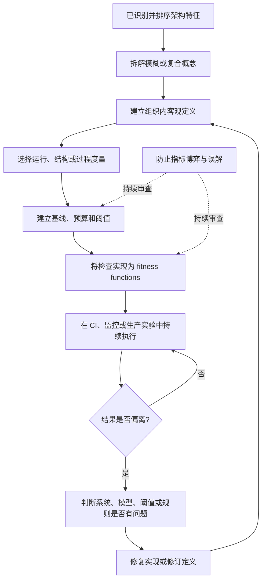
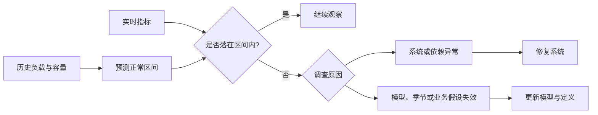
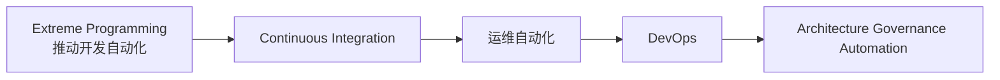
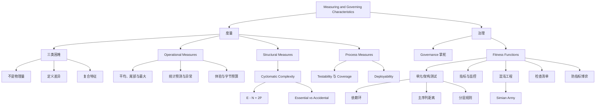

> 对应原章：6. Measuring and Governing Architecture Characteristics.md
> 第 4 章定义架构特征，第 5 章识别并排序，本章完成下一步：怎样把模糊能力变成可观察定义，并用自动化治理让实际系统长期不偏离架构意图。度量回答“现在怎样”，治理回答“怎样持续维持”，fitness function 则把二者连接成反馈闭环。
> 本笔记严格沿原章顺序展开。原书 Java/C# 示例依赖 JDepend、ArchUnit、NetArchTest 等外部库，本文保留其意图但不把它们冒充可独立编译程序；Python 算例与公式扩展用于教学。Cyclomatic Complexity、覆盖率、主序列距离等都是窄维度信号，必须结合领域、代码与运行证据解释。

## 0. 本章要回答的核心问题

1. 为什么架构师会被大量模糊、宽泛的架构特征淹没？
2. 架构特征难以度量的三个根本原因是什么？
3. 怎样通过拆解 composite characteristic 建立 ubiquitous language 和客观定义？
4. 为什么平均响应时间会掩盖少量极慢请求？最大值、分位数和统计模型各解决什么问题？
5. 实时指标偏离预测模型时，为什么既可能是系统异常，也可能是模型错误？
6. first contentful paint、first CPU idle 和 K-weight budget 说明性能定义怎样随设备与工具演进？
7. 为什么内部结构比运行性能更难以全面度量？
8. Cyclomatic Complexity 的 $E-N+2P$ 公式怎样从控制流图得到？
9. 为什么两个条件分支对应三条独立路径？
10. CC 多大才合理，为什么行业阈值不能脱离问题域使用？
11. essential complexity 与 accidental complexity 怎样区分？
12. 为什么 TDD 往往间接产生更小、更内聚、低 CC 的方法？
13. testability 与 deployability 可以用哪些过程指标衡量？
14. 为什么 100% code coverage 仍可能无法证明测试有效？
15. 软件过程在什么情况下会反过来影响架构结构？
16. architecture governance 为什么是架构师“掌舵”的职责？
17. Extreme Programming、CI、DevOps 与自动化架构治理之间是什么演进关系？
18. fitness function 从遗传算法借用了什么思想？
19. architectural fitness function 为什么不是一个待下载的新框架，而是对现有工具的统一视角？
20. 指标、监控、单元测试和 chaos engineering 怎样分别充当 fitness function？
21. IDE 自动导入为什么会逐渐制造 cyclic dependencies？
22. JDepend 如何在 CI 中阻止包依赖环？
23. Distance from the Main Sequence 怎样变成带项目容差的持续测试？
24. 为什么架构师在强制 fitness function 前必须让开发者理解其目的？
25. ArchUnit 和 NetArchTest 怎样把分层依赖规则编码为测试？
26. 当指标成为目标时，开发者可能怎样 gaming the system？
27. Netflix 的 Chaos Monkey、Latency Monkey、Chaos Kong、Conformity/Security/Janitor Monkey 分别验证什么？
28. 为什么混沌工程的前提不是“系统会不会坏”，而是“什么时候坏”？
29. fitness function 与飞行员、外科医生使用检查清单有什么共同逻辑？
30. 怎样设计一套既能自动守护架构、又不会变成重量级审批的治理闭环？

本章的论证主线如下：



一句话概括：**不要只给架构特征起名字，要把它拆成团队共同理解的可观察结果，再用离变更最近、反馈最快的自动机制持续验证；指标触发调查而不替代判断，治理保护意图而不是保护数字。**

---

## 1. 开篇：从定义走向持续控制

架构师面对的特征横跨软件项目各层：

- performance、elasticity、scalability 等运行关注；
- modularity、deployability 等结构和交付关注；
- 安全、可靠性、可测试性、可观测性等横切能力。

仅有宽泛定义会造成两个失败：

1. **无法判断是否满足**：团队都同意“系统应敏捷”，却不知道怎样验收；
2. **无法防止退化**：初始设计符合意图，日常修改仍会逐渐引入环依赖、越层访问和脆弱故障路径。

本章因此处理两个连续问题：

| 问题 | 目标 | 典型产物 |
| --- | --- | --- |
| Measuring | 把抽象能力变成可观察证据 | 指标、预算、阈值、统计模型、测试 |
| Governing | 让证据持续约束演进 | CI 规则、监控、架构测试、混沌实验、自动清理 |

度量而不治理，只会得到报告；治理而没有可靠度量，只会得到主观审批。

---

## 2. Measuring Architecture Characteristics：度量架构特征

架构师难以定义特征，原章给出三个原因。

### 2.1 They aren’t physics：它们不是物理量

许多常用词没有类似米、秒、千克的天然统一含义：

- agility 到底测交付频率、变更前置时间还是模块修改范围？
- deployability 是部署按钮能按，还是能安全、快速、可回滚？
- “wicked fast performance” 是 100 ms、1 s，还是在某个负载下的 p99？

不同上下文产生不同定义有时完全合理；问题在于团队没有说清差异，却误以为达成共识。

### 2.2 Wildly varying definitions：定义差异巨大

即使同一组织内部，不同部门也可能对 performance 理解不同：

| 角色 | 可能关注 |
| --- | --- |
| 产品 | 用户何时看到首屏 |
| 后端 | API p95/p99 延迟和吞吐 |
| 数据库 | 查询时间、锁等待和 I/O |
| 运维 | 资源利用、容量余量和错误率 |
| 财务 | 每单位请求的基础设施成本 |

若开发、架构、运维和业务没有统一定义，就无法正确讨论，也无法判断某项优化是否真的改善系统。

### 2.3 Too composite：特征过于复合

很多理想特征其实是更小能力的集合。第 5 章的典型例子是：

$$
Agility=f(Modularity,Deployability,Testability,\ldots)
$$

这个教学化表达不是可计算加权公式，而是说明“敏捷”没有单一传感器。若只测部署频率，仍可能漏掉测试太慢或模块耦合太高。

### 2.4 解决三类问题的共同方法

把复合特征拆成组成部分，并为每部分建立客观定义：

```text
模糊业务词
    -> 失败模式与用户场景
    -> 可观察组成能力
    -> 指标、测试或实验
    -> 组织内统一定义
```

当组织同意所有人使用标准、具体定义时，就形成围绕架构的 ubiquitous language。共同语言不是维护一张术语表，而是让不同角色面对同一证据得出相近判断。

### 2.5 客观不等于只有一个数字

客观定义可以由多种证据组成：

- 一个数值阈值，例如 p99 延迟；
- 一个不变量，例如组件依赖图必须无环；
- 一个行为实验，例如单实例被终止时核心请求继续成功；
- 一个过程结果，例如部署在目标时间内完成且可回滚；
- 一个趋势模型，例如容量偏离正常预测区间时告警。

“可观察、可重复、可解释”比强行把所有东西压成单分数更重要。

### 2.6 Operational Measures：运行度量

Performance 和 scalability 看似容易直接测量，实际仍有多种解释。

#### 2.6.1 平均值如何掩盖边界条件

假设 99% 请求耗时 100 ms，1% 请求耗时 1,000 ms：

$$
\overline{x}=0.99\times100+0.01\times1000=109\ \mathrm{ms}
$$

平均值只从 100 ms 增至 109 ms，看起来良好；每一百个请求中却有一个等待十倍时间。在大流量站点，这仍会稳定影响大量真实请求。请求比例不能直接换算成用户比例，因为一个用户可能发出多个请求。

```python
latencies_ms = [100] * 99 + [1_000]

average = sum(latencies_ms) / len(latencies_ms)
maximum = max(latencies_ms)
slow_fraction = sum(value >= 1_000 for value in latencies_ms) / len(latencies_ms)

print(f"average={average:.0f}ms")
print(f"maximum={maximum}ms")
print(f"slow_fraction={slow_fraction:.0%}")
```

输出：

```text
average=109ms
maximum=1000ms
slow_fraction=1%
```

代码对应加权平均。它说明平均值的盲区，不意味着 maximum 永远是最佳指标：最大值会被单个异常、采样周期和测量错误主导。生产中通常组合使用 p50、p95、p99、最大值、错误率和请求量。

#### 2.6.2 分位数也需要定义

“p99 小于 300 ms”仍要说明：

- 在什么时间窗口计算；
- 按全站还是端点分组；
- 是客户端、网关还是服务端测量；
- 样本量多大；
- 超时和失败是否计入；
- 使用哪一种分位数算法。

指标名称相同，统计边界不同，结果不可直接比较。

#### 2.6.3 用统计模型监控 Scalability

成熟团队不只设置任意硬数值。原章以视频流服务为例：

1. 长期测量规模和负载；
2. 建立统计预测模型；
3. 实时指标落到预测区间外时告警。

偏离可能有两种解释：

- **模型错了**：季节、产品或用户行为已改变，需要更新模型；
- **系统有异常**：容量、依赖、流量或实现出现问题。

两者都是有价值的发现。告警不是“系统一定坏了”，而是“当前观测与我们对正常行为的假设不一致”。



#### 2.6.4 度量会随工具和设备演进

团队度量的对象随目标、设备和能力快速变化。原章举出移动 Web 的：

- first contentful paint：首次内容绘制，用户第一次看到页面内容；
- first CPU idle：CPU 首次达到可较稳定响应输入的阶段；
- 其他面向真实用户体验的性能预算。

`first CPU idle` 后来在部分主流工具中被弃用，这并不削弱原书结论，反而说明指标会演进。团队应保护用户结果，而不是永久绑定某个工具名称。

#### 2.7 The Many Flavors of Performance：性能的多种形态

多数项目只看 Web 请求/响应周期等一般性能。成熟组织则为应用不同部分建立细粒度 performance budgets。

##### 2.7.1 首屏体验预算

组织通过用户行为研究发现，页面首次可见进展的理想时间是“一秒的某个分数”。原文还说多数应用在该指标上落入“两位数范围”，但没有明确该处单位，因此不应擅自解释为秒或毫秒。对争夺用户注意力的现代站点，这种数量级差距会直接影响流失和转化，值得单独跟踪。

一个完整预算应描述：

```text
设备与网络条件
    + 页面或用户旅程
    + 指标定义
    + 目标分位数
    + 允许回归幅度
```

##### 2.7.2 K-weight budget：页面字节预算

前瞻组织还会限制页面可下载的库和框架总字节数。理由来自物理约束：尤其在低带宽移动网络上，单位时间能传输的字节有限。

粗略地，在忽略协议、拥塞和并行请求时：

$$
T_{download}\ge\frac{Bytes\times8}{Bandwidth}
$$

这只是理论下界。真实时间还包括往返延迟、TLS、丢包、服务器处理、解析、编译和执行。因此，压缩后体积预算只是用户性能的一部分，却能在开发时阻止依赖无限增长。

##### 2.7.3 性能预算为什么比“要快”有效

- 把目标绑定用户场景；
- 在每次变更中比较增量；
- 为新增框架建立机会成本；
- 可自动放入构建和监控；
- 发生回归时能定位预算类别。

局限是预算可能被局部优化：为通过字节数而删除必要可访问性代码，或把工作转移到运行时，都会损害整体体验。

### 2.8 Structural Measures：结构度量

内部结构的客观度量比运行性能更不明显。良好 modularity 是隐含架构特征：架构师负责定义组件及交互，希望结构长期可持续。

目前没有能够全面评价架构质量的指标。现有工具只能在窄维度观察：

- 代码复杂度；
- 包或组件依赖；
- 循环；
- 耦合与内聚；
- 抽象度、不稳定度与主序列距离；
- 越层访问和命名约束。

指标可以说“结构具有某种形状”，不能自动说“这个形状符合业务原因”。

### 2.9 Cyclomatic Complexity：圈复杂度

Thomas McCabe Sr. 于 1976 年设计 Cyclomatic Complexity（CC），用图论客观度量函数/方法、类或应用的控制流复杂度。

#### 2.9.1 从决策点理解

- 没有 `if`、循环或其他分支：只有一条独立路径，$CC=1$；
- 一个二元条件：两条路径，$CC=2$；
- 两个顺序条件：通常三条独立路径，$CC=3$。

对单入口、单出口、结构化控制流，一个常用快捷理解是：

$$
CC=DecisionPoints+1
$$

实际工具对 `switch`、短路布尔、异常处理和模式匹配的计数可能不同，应固定实现。

#### 2.9.2 图论公式

更一般的公式是：

$$
CC=E-N+2P
$$

- $E$：控制流图的边，即控制转移；
- $N$：控制流图节点/基本块数量；
- $P$：连通组件数量。

单个独立函数通常 $P=1$：

$$
CC=E-N+2
$$

原章把节点简述为代码行、边简述为可能决策，这是便于入门的说法；严格地说，节点和边来自所采用的控制流图构造，不能直接拿所有源代码行数代入。

#### 2.9.3 Example 6-1

原书示例存在返回类型和变量大小写的排版问题。按其意图整理为：

```java
public int decision(int c1, int c2) {
    if (c1 < 100)
        return 0;
    else if (c1 + c2 > 500)
        return 1;
    else
        return -1;
}
```

有两个判断点，因此：

$$
CC=2+1=3
$$

三条独立行为路径是：

1. `c1 < 100`，返回 0；
2. 第一个条件为假、第二个为真，返回 1；
3. 两个条件都为假，返回 -1。


图 6-1 展示判断节点与控制流边。不同画图约定可能合并返回节点或入口/出口，但使用同一控制流定义代入 $E-N+2P$ 应得到一致圈复杂度。

#### 2.9.4 可运行的公式算例

下面用一个含 3 个节点、4 条边、1 个连通组件的简化控制流图验证：

```python
def cyclomatic_complexity(edges, nodes, components=1):
    if edges < 0 or nodes <= 0 or components <= 0:
        raise ValueError("invalid control-flow graph counts")
    return edges - nodes + 2 * components


print(f"cc={cyclomatic_complexity(edges=4, nodes=3)}")
```

输出：

```text
cc=3
```

代码只是公式计算器，不会从源代码构建控制流图；生产分析应使用语言感知工具。

#### 2.9.5 为什么高 CC 是 code smell

复杂控制流会损害：

- modularity：过多责任聚在一处；
- testability：需要覆盖更多路径和组合；
- readability：人难以建立完整执行模型；
- deployability：修改风险和回归范围增加；
- maintainability：小改动可能影响隐藏分支。

若复杂度不持续受控，会逐渐主导整个代码库。

#### 2.9.6 Essential 与 Accidental Complexity

CC 的典型局限是只能测结构复杂，不能解释来源：

| 类型 | 含义 | 处理方式 |
| --- | --- | --- |
| Essential complexity | 问题本身包含大量规则和分支 | 通过清晰模型、表驱动、分解和测试管理 |
| Accidental complexity | 糟糕实现引入不必要分支和跳转 | 重构、重新建模、删除重复与特殊情况 |

税法、协议解析或编译器可能本质复杂，但仍可用状态机、规则表和小函数表达得更可理解。不能以“领域复杂”为由忽略结构，也不能为降低数字把一个完整决策拆成难追踪的跳转链。

#### 2.9.7 生成式 AI 与复杂度

原章指出，生成式 AI 常用 brute force 解决问题，容易产生 accidental complexity。评价生成代码不能只看测试是否通过，还应看：

- 是否重复条件；
- 是否引入无必要分支；
- 是否能用数据结构替代控制流；
- 错误路径是否一致；
- CC 与维护成本是否异常。

### 2.10 What’s a Good Value for Cyclomatic Complexity?：什么值算好

标准架构回答是：取决于 problem domain。

#### 2.10.1 原书阈值建议

- 行业通常认为 CC 小于 10 可接受，需结合其他因素；
- 作者认为 10 很高，更偏好小于 5，以体现内聚、良好分解；
- 算法复杂领域可能合理地高于普通业务代码。

阈值是调查线，不是自然定律。还应比较：

- 同类模块分布；
- 随时间增长趋势；
- 修改和缺陷热点；
- 测试路径；
- 方法长度和责任。

#### 2.10.2 判断问题域还是糟糕代码

架构师应问：

1. 复杂分支是否对应真实业务规则？
2. 是否把多个责任塞进一个大方法？
3. 能否拆成逻辑小块而不隐藏整体流程？
4. 能否用策略、状态机、映射表或多态降低条件耦合？
5. 高 CC 是否与高变更、高缺陷同时出现？

#### 2.10.3 Crap4J 的复合视角

Crap4J 结合 CC 与 code coverage，尝试判断代码“crappiness”。直觉是：

- 高复杂度但充分测试，风险可部分降低；
- 低覆盖且高复杂度，修改风险很高；
- 当 CC 超过 50，原书指出再高覆盖也无法挽救其糟糕程度。

这仍是启发式。覆盖率不证明断言正确，也不证明所有数据和并发组合都被验证。

#### 2.10.4 CC 超过 800 的真实警示

Neal Ford 遇到过一个商业软件核心 C 函数：

- 超过 4,000 行；
- 大量使用 `GOTO` 跳出极深嵌套循环；
- CC 超过 800。

这不是“领域复杂”的合理借口，而是控制流、责任和测试风险集中到一个不可理解单元的极端例子。

#### 2.10.5 TDD 为什么常降低 CC

Test-driven development 的循环是：

1. 写一个简单失败测试；
2. 写通过它的最少代码；
3. 重构并保持测试通过。

聚焦离散行为和可测试边界，常自然产生较小、内聚、低复杂度的方法。这是有益副作用，不是保证：测试写得差、缺少重构或复杂规则仍会产生高 CC。

### 2.11 Process Measures：过程度量

一些架构特征与软件开发过程交叉。Agility 由 testability、deployability 等组成，而过程又可能反过来影响结构。

#### 2.11.1 Testability 的度量

各平台 coverage 工具可报告测试执行了多少代码：

- line coverage；
- branch coverage；
- condition coverage；
- mutation score 等补充指标。

原章强调：100% code coverage 仍可能没有信心。例如测试调用代码却没有任何 assertion，只“触碰”执行路径而不验证结果。

Coverage 回答“执行过没有”，不回答：

- 断言是否正确；
- 边界数据是否充分；
- 并发与故障是否覆盖；
- 测试是否稳定；
- 需求是否被正确理解。

#### 2.11.2 Deployability 的度量

原章列出：

- successful deployment percentage；
- deployment duration；
- 部署引发的问题和缺陷。

还可结合变更前置时间、回滚时间与发布频率，但应选择真正服务组织目标的定性和定量数据，而不是照搬外部排行榜。

#### 2.11.3 过程何时影响架构

若易部署和可测试是高优先级，架构师会强调：

- 良好 modularity；
- 组件 isolation；
- 可独立测试边界；
- 受控依赖；
- 自动化环境与兼容契约。

这体现第 4 章三条件：任何项目范围内的事项，只要会迫使重要结构决定并对成功关键，就可能上升为架构特征。

---

## 3. Governance and Fitness Functions：治理与适应度函数

当团队已经建立和排序架构特征，下一问题是：在进度压力下，怎样确保开发者仍安全、正确地落实架构意图？

Modularity 是典型 important but not urgent：

- 今天多加一个跨包 import 很快；
- 一周后环依赖已经扩散；
- 短期功能仍能运行；
- 长期复用、测试和迁移越来越难。

治理应把长期重要性转成日常即时反馈，而不是依赖架构师逐行监督。

### 3.1 治理闭环


治理既要防止实现偏离，也要允许规则本身被证据修订。

### 3.2 Governing Architecture Characteristics：治理架构特征

Governance 源自希腊语 `kubernan`，意为“掌舵”。它覆盖架构师希望影响的软件开发过程各方面。

例如软件质量属于架构治理，因为长期忽视会造成灾难性问题。治理不是架构师拥有所有决定，而是：

- 明确共同方向；
- 把关键约束变成可执行反馈；
- 让团队知道为什么；
- 在违规或环境变化时及时调整。

### 3.3 自动化能力的演进

原章描述一条生态能力增长链：



自动构建和测试证明日常反馈可以机器执行；DevOps 把同样思想扩展到部署和运行；fitness functions 再把架构完整性纳入自动化底座。

### 3.4 Fitness Functions：适应度函数

#### 3.4.1 概念来自 evolutionary computing

《Building Evolutionary Architectures》中的 evolutionary 更多来自 evolutionary computing，而非生物进化。作者 Rebecca Parsons 曾从事遗传算法等工作。

遗传算法产生候选结果后，需要一个 objective function 评估它距离目标多近，这个指导机制叫 fitness function。

#### 3.4.2 Traveling Salesperson Problem 示例

给定销售员、必须访问的城市和城市间距离，要寻找最优路线。不同 fitness functions 可以分别评价：

- 总路线长度；
- 总成本；
- 离家时间。

这些目标可能冲突：最短距离不一定最便宜，最便宜不一定用时最短。适应度函数把“好”变成明确评价维度，而不是保证多目标问题只有一个答案。

#### 3.4.3 Architectural fitness function 的定义

> 任何对某项架构特征或特征组合提供客观完整性评估的机制。

关键词：

- **any mechanism**：不是限定某个框架；
- **objective**：不同执行者能重复得到证据；
- **integrity assessment**：检查系统仍保持预期性质；
- **one or more characteristics**：可以检查单项或相互作用。

#### 3.4.4 Fitness function 不是新产品

它是重新看待已有工具的视角：


| 机制 | 适合验证 | 反馈位置 |
| --- | --- | --- |
| Unit tests / architecture tests | 依赖、命名、分层、主序列距离 | 提交或 CI |
| Metrics | 延迟、错误率、复杂度、覆盖率 | 构建或运行 |
| Monitors | SLO、资源、异常趋势 | 生产运行 |
| Chaos engineering | 故障隔离、恢复、韧性 | 预生产或受控生产 |
| Static analyzers | 安全、依赖、复杂度和编码约束 | IDE 或 CI |
| Checklists | 难自动化但容易遗漏的步骤 | 评审、发布、演练 |

同一机制只有在用于客观保护架构特征时，才在该上下文中充当 fitness function。

### 3.5 设计 fitness function 的组成

一项可操作检查应回答：

1. 保护哪项特征和业务结果？
2. 观察什么系统边界？
3. 通过条件是什么？
4. 在何时、何地执行？
5. 失败时谁处理，能否自动阻断？
6. 如何防止误报和指标博弈？
7. 什么上下文变化会要求修订规则？

```text
Characteristic: Modularity
Invariant: package dependency graph contains no cycle
Scope: production packages, excluding generated code
Execution: every CI build
Failure: block merge and print cycle path
Owner: owning development team with architect support
Review trigger: package model or build topology changes
```

### 3.6 Fitness function 的分类视角

虽然原章不在此建立完整分类，实践中可从四个维度理解：

| 维度 | 两端示例 |
| --- | --- |
| 触发方式 | 持续执行 / 事件触发 / 定期执行 |
| 结果 | 二元通过 / 连续指标 / 统计异常 |
| 环境 | 开发机 / CI / 预生产 / 生产 |
| 自动化程度 | 完全自动 / 人工检查表 / 混合判断 |

选择应匹配特征。依赖环适合每次构建二元检查；延迟适合连续分布；灾难恢复适合定期受控演练。

### 3.7 Cyclic dependencies：循环依赖

Modularity 是多数架构师关心的隐含特征。IDE 自动导入让跨组件引用非常容易：开发者输入未导入类名，确认提示即可建立依赖。局部看节省时间，长期会形成环。


循环的危害：

- 不能只复用一个组件而不带上其他组件；
- 初始化和构建顺序复杂；
- 修改和测试影响范围扩大；
- 组件边界失去方向；
- 其他依赖继续加入时趋向 Big Ball of Mud。

#### 3.7.1 为什么 code review 太晚

评审当然有价值，但如果团队一周内已大量跨包导入，评审时损害已经形成。架构师需要在依赖第一次进入时反馈，最好在 IDE、提交或 CI 阶段。

#### 3.7.2 Example 6-2：JDepend 环检测

原书代码：

```java
public class CycleTest {
    private JDepend jdepend;

    @BeforeEach
    void init() {
        jdepend = new JDepend();
        jdepend.addDirectory("/path/to/project/persistence/classes");
        jdepend.addDirectory("/path/to/project/web/classes");
        jdepend.addDirectory("/path/to/project/thirdpartyjars");
    }

    @Test
    void testAllPackages() {
        Collection packages = jdepend.analyze();
        assertFalse(jdepend.containsCycles(), "Cycles exist");
    }
}
```

逐步对应：

1. JDepend 读取编译后的包和类；
2. `addDirectory` 定义分析范围；
3. `analyze()` 构建包依赖图；
4. `containsCycles()` 检查图中是否存在有向环；
5. 测试失败使 CI 阻止新循环进入主干。

它守护 important rather than urgent：开发者当天功能可能不受影响，架构却被持续保护。

### 3.8 图算法直觉与可运行示例

环检测可用深度优先搜索的三色标记：

- WHITE：尚未访问；
- GRAY：位于当前递归路径；
- BLACK：该节点及后继已完成。

遇到指向 GRAY 节点的边，即发现 back edge 和有向环。

```python
def has_cycle(graph):
    white, gray, black = 0, 1, 2
    color = {node: white for node in graph}

    def visit(node):
        color[node] = gray
        for neighbor in graph.get(node, []):
            if color.get(neighbor, white) == gray:
                return True
            if color.get(neighbor, white) == white:
                color.setdefault(neighbor, white)
                if visit(neighbor):
                    return True
        color[node] = black
        return False

    return any(
        color[node] == white and visit(node)
        for node in list(color)
    )


cyclic = {"web": ["service"], "service": ["data"], "data": ["web"]}
acyclic = {"web": ["service"], "service": ["data"], "data": []}

print(f"cyclic={has_cycle(cyclic)}")
print(f"acyclic={has_cycle(acyclic)}")
```

输出：

```text
cyclic=True
acyclic=False
```

时间复杂度为 $O(V+E)$，空间复杂度为 $O(V)$，其中 $V$ 是组件/包数，$E$ 是依赖边数。生产工具还应输出完整环路径，并正确处理反射、生成代码和运行时依赖的可见性边界。

### 3.9 Distance from the Main Sequence fitness function：主序列距离适应度函数

第 3 章定义：

$$
A=\frac{N_a}{N_a+N_c},\qquad
I=\frac{C_e}{C_a+C_e},\qquad
D=|A+I-1|
$$

- $N_a$：抽象类、接口等抽象构件数量；
- $N_c$：具体构件数量；
- $C_a$：进入当前包的依赖数量；
- $C_e$：当前包向外的依赖数量。

当两个分母均非零时，$A,I,D\in[0,1]$。若 $N_a+N_c=0$ 或 $C_a+C_e=0$，对应比例没有定义，不能擅自填为 0；应按工具规则跳过、返回空值或把空包/孤立包单独分析。

Fitness function 可以把这个快照指标变成持续约束。

#### 3.9.1 Example 6-3

```java
@Test
void allPackages() {
    double ideal = 0.0;
    double tolerance = 0.5; // project-dependent
    Collection packages = jdepend.analyze();
    Iterator iter = packages.iterator();
    while (iter.hasNext()) {
        JavaPackage p = (JavaPackage) iter.next();
        assertEquals(
            ideal,
            p.distance(),
            tolerance,
            "Distance exceeded: " + p.getName()
        );
    }
}
```

含义：

- ideal 为 0，即位于主序列；
- tolerance 为 0.5，表示允许项目相关偏差；
- 每个 package 的距离超出范围，测试失败并打印包名。

#### 3.9.2 为什么 tolerance 必须 project-dependent

$D=0$ 不代表总体质量完美，$D>0.5$ 也不自动表示错误。合理例外可能包括：

- 纯数据传输对象；
- 生成代码；
- 框架适配层；
- 正在迁移的包；
- 刻意稳定的具体协议模型。

建立阈值前应：

1. 测量当前分布；
2. 排除不适用构件；
3. 人工检查异常样本；
4. 决定是绝对上限、趋势预算还是仅告警；
5. 与开发团队共同确认。

#### 3.9.3 协作要求

原章明确警告：fitness function 不是架构师登上 ivory tower 后创造开发者无法理解的神秘规则。

> 架构师在强制适应度函数之前，必须确保开发者理解它的目的。

若团队不理解：

- 会把检查视为障碍；
- 可能只为过关而重构数字；
- 无法判断合理例外；
- 规则与实际架构原因逐渐脱节。

### 3.10 ArchUnit：将分层规则编码为测试

ArchUnit 是 Java 测试框架，借鉴并使用 JUnit 生态，提供预定义治理规则，也允许编写定制模块化测试。


分层不是美观排列。它建立允许的依赖方向，以隔离数据库变化、业务规则和外部输入。开发者可能因性能等局部目标选择“先做了再请求原谅”，逐渐侵蚀架构理由。

#### 3.10.1 Example 6-4

```java
layeredArchitecture()
    .consideringAllDependencies()
    .layer("Controller").definedBy("..controller..")
    .layer("Service").definedBy("..service..")
    .layer("Persistence").definedBy("..persistence..")

    .whereLayer("Controller").mayNotBeAccessedByAnyLayer()
    .whereLayer("Service").mayOnlyBeAccessedByLayers("Controller")
    .whereLayer("Persistence").mayOnlyBeAccessedByLayers("Service")
```

原书代码反映其采用的 ArchUnit API 版本；较新的 ArchUnit 要求显式选择依赖分析方式，这里用 `consideringAllDependencies()` 表明检查所有可解析依赖。具体方法名仍应以项目锁定版本的 API 为准。

规则表达：

- Controller、Service、Persistence 分别由包模式定义；
- 除同层内部访问外，Service 只能被 Controller 访问；
- 除同层内部访问外，Persistence 只能被 Service 访问；
- 不允许其他已定义层访问 Controller。

图中还有 Presentation，示例代码没有把它声明为层。未建模类对已定义层的依赖是被检查还是被忽略，取决于 ArchUnit 版本、dependency setting 和规则范围，不能一概而论。若要治理图中的四层，应显式定义 Presentation，并按项目 API 要求确保所有目标类都包含在架构模型中。

### 3.11 NetArchTest：.NET 中的层依赖治理

```csharp
// Classes in the presentation should not directly reference repositories
var result = Types.InCurrentDomain()
    .That()
    .ResideInNamespace("NetArchTest.SampleLibrary.Presentation")
    .ShouldNot()
    .HaveDependencyOn("NetArchTest.SampleLibrary.Data")
    .GetResult()
    .IsSuccessful;
```

代码选择当前域中名称以指定 Presentation namespace 开头的类型，断言其静态元数据/IL 中不能直接引用名称匹配 Data namespace 的类型，最后返回检查是否成功。`ResideInNamespace` 的匹配按 NetArchTest 版本通常是对类型全名做不区分大小写的前缀匹配；`HaveDependencyOn` 主要看到直接静态引用，不覆盖传递依赖，也看不到反射、字符串配置或其他运行时才产生的依赖。

ArchUnit 与 NetArchTest 的共同原理是：

```text
架构意图
    -> 机器可识别的代码集合
    -> 允许/禁止依赖谓词
    -> CI 中持续执行
    -> 违规时给出接近源代码的反馈
```

### 3.12 防止 Gaming the Metric

任何度量都可能被针对性优化。Goodhart 定律常被概括为：当指标成为目标，它就不再是好指标。

原章的 testability 例子：开发者写没有 assertion 的测试，执行所有代码以提高 coverage，却不验证结果。这是“触碰代码”而非测试。

其他可能博弈：

- 把大方法机械拆小，使单方法 CC 降低，但调用链更难理解；
- 创建无意义接口，提高抽象度；
- 排除失败请求，让延迟分位数变好；
- 把越层访问移到反射或字符串配置；
- 为满足部署成功率而减少部署次数。

治理对策：

1. 解释指标保护的业务和架构结果；
2. 组合互补证据，而非依赖单值；
3. 抽样人工检查；
4. 监控趋势和异常变化；
5. 允许透明例外，但要求理由和期限；
6. 定期验证规则是否仍能预测真实风险。

原章提到可用 ArchUnit 等规则确保每个单元测试至少包含 assertion。这能防止意外遗漏，但无法证明断言有意义；专门作弊者总能绕过表面规则。

### 3.13 Netflix Chaos Engineering：生产中的适应度函数

Netflix 迁移到 Amazon 云后，不再控制底层运维环境。架构师担忧：生产中出现基础设施缺陷时，系统是否真的能承受？

他们由此推动 chaos engineering：主动、受控地注入故障，观察系统能否维持特征。

#### 3.13.1 Chaos Monkey 与 Latency Monkey

- Chaos Monkey 随机破坏实例或模拟一般故障；
- AWS 某些实例的延迟问题突出，因此后来有专门模拟高延迟的 Latency Monkey。

它们验证的不是“有没有错误日志”，而是实例或网络退化时，服务是否仍满足可用性、韧性和恢复目标。

#### 3.13.2 Chaos Kong

Chaos Kong 模拟整个 Amazon 数据中心/区域级故障。通过提前演练，Netflix 在真实大范围故障发生时更有能力避免中断。

#### 3.13.3 Conformity Monkey

允许架构师定义在生产中自动执行的治理规则。例如，若每个服务都应对所有请求无错误响应，就建立相应检查。

这里“所有请求无错误”是原章示例，真实系统必须区分客户端错误、预期拒绝和服务失败，否则目标不可实现。

#### 3.13.4 Security Monkey

检查常见安全缺陷，例如：

- 不应开放的端口；
- 错误安全配置；
- 其他可自动识别的风险。

它把安全基线从人工审计移动到持续生产治理。

#### 3.13.5 Janitor Monkey

Netflix 的演进式架构中，开发者迁移到新服务后，旧服务可能仍在云中运行却没有任何路由。Janitor Monkey 查找孤儿实例并从生产中清除，减少云成本和无主攻击面。

自动删除必须建立：

- 可靠“无人使用”证据；
- 观察期；
- 所有者通知；
- 保护名单；
- 回滚或重建能力。

#### 3.13.6 混沌工程的核心假设

```text
不是 if something breaks
而是 when something breaks
```

预先假定故障必然发生，主动测试故障路径，系统会比只验证正常路径更 robust。

但混沌实验必须受控：

- 先定义 steady state；
- 设定 blast radius；
- 从预生产或小范围开始；
- 有自动终止条件；
- 保护真实用户和数据；
- 实验后修复发现，而不是只制造事故。

### 3.14 Checklist Manifesto：检查清单视角

Atul Gawande 在《The Checklist Manifesto》中描述飞行员和外科医生怎样使用检查清单，有时甚至由法律要求。

原因不是专业人士不知道工作或健忘，而是：

- 高度细节工作反复执行；
- 人的注意力有限；
- 紧急情况增加认知负担；
- 熟悉会让人跳过“显然步骤”；
- 简短清单能在正确时刻提醒。

Fitness function 应采用同一视角：它不是重量级治理，而是让架构师表达并自动验证重要原则。

开发者知道不应发布不安全代码，但安全与几十、上百项日常优先级竞争。Security Monkey 等工具把重要检查嵌入架构底座，使正确行为成为默认路径。

### 3.15 Fitness function 的适用范围与局限

能有效自动化：

- 包依赖无环；
- 分层访问方向；
- 性能预算；
- 主序列距离阈值；
- 安全配置；
- 服务故障恢复；
- 孤儿资源清理。

不能完全替代：

- 领域边界是否正确；
- 抽象是否有意义；
- 某项复杂度是否本质；
- 利益相关者是否接受权衡；
- 规则本身是否仍符合业务。

好的 governance 是自动反馈加人的判断，而不是把架构师意见固化成永远不可质疑的测试。

---

## 4. 容易混淆的概念与常见误区

### 4.1 “客观度量必须是单个数字”

错误之处：依赖无环、故障演练和行为不变量也可客观重复验证。

正确理解：客观意味着边界、方法和结果可解释、可重复，不等于只能量化成一分。

### 4.2 “平均延迟良好就代表用户性能良好”

错误之处：少量十倍慢请求可被大样本平均稀释。

正确理解：结合分位数、最大值、错误率、请求量和用户旅程。

### 4.3 “最大值一定比分位数更好”

错误之处：一个测量异常即可主导最大值。

正确理解：指标解决不同问题，需定义时间窗口、采样和异常处理。

### 4.4 “预测区间外告警证明系统坏了”

错误之处：模型也可能因业务、季节或数据变化而失效。

正确理解：告警表示观测与正常假设不一致，需要调查系统和模型两边。

### 4.5 “性能只有请求响应时间”

错误之处：首屏绘制、交互、吞吐、资源和下载体积都可能主导体验。

正确理解：按用户场景建立多层 performance budgets。

### 4.6 “架构质量可以由一个综合分数衡量”

错误之处：结构指标只观察窄维度，不理解领域理由和组织约束。

正确理解：组合指标、依赖图、修改历史与人工语义审查。

### 4.7 “CC 的 N 就是源代码总行数”

错误之处：严格公式使用控制流图节点/基本块；源行只是原章的入门简述。

正确理解：让语言工具按一致控制流模型计算，不手工混用定义。

### 4.8 “每个 if 都使路径数翻倍”

错误之处：CC 计独立路径，不是所有可能路径组合；两个顺序条件通常是 CC=3，而非 4。

正确理解：使用控制流图的 $E-N+2P$ 或工具规定的决策点规则。

### 4.9 “CC 小于 10 就一定好”

错误之处：阈值不理解领域、方法责任和调用复杂度。

正确理解：作者偏好小于 5，但任何阈值都只是结合上下文的调查线。

### 4.10 “降低 CC 就一定降低复杂度”

错误之处：机械拆函数可能把复杂度转成难追踪调用和共享状态。

正确理解：区分本质与偶然复杂度，围绕内聚责任重构。

### 4.11 “100% coverage 等于测试完整”

错误之处：没有断言的测试也能执行所有代码。

正确理解：结合分支、断言质量、变异测试、边界和故障场景。

### 4.12 “Deployability 只能主观评价”

错误之处：成功率、持续时间和部署引发问题都可观察。

正确理解：同时使用定量指标和对失败原因的定性分析。

### 4.13 “Governance 就是架构师审批所有代码”

错误之处：集中审批反馈慢且制造瓶颈。

正确理解：把共同理解的原则编码为自动、接近变更的反馈。

### 4.14 “Fitness function 是一个特定框架”

错误之处：定义强调 any mechanism。

正确理解：单元测试、监控、指标、混沌实验和检查表都可承担该角色。

### 4.15 “所有 fitness functions 都应在 CI 阻断构建”

错误之处：生产延迟和区域故障只能在运行或实验环境观察。

正确理解：根据特征选择执行位置、频率和失败响应。

### 4.16 “依赖环只是编译问题”

错误之处：即使语言允许编译，环也会破坏复用、初始化、测试和独立变化。

正确理解：在第一次引入时通过图分析阻止，而非等人工评审清理。

### 4.17 “D 超过 0.5 的包一定错误”

错误之处：阈值依项目、统计边界和包职责而定。

正确理解：建立基线、排除生成代码、人工检查异常并与团队约定容差。

### 4.18 “架构规则只要技术上正确，就可直接强制”

错误之处：不理解目的的团队会抵触、绕过或只优化指标。

正确理解：共同设计规则，说明业务与架构理由，并提供例外过程。

### 4.19 “ArchUnit 示例覆盖了图中所有层”

错误之处：原示例定义 Controller、Service、Persistence，未显式定义 Presentation。

正确理解：实际规则必须覆盖目标包和入口，否则盲区可绕过约束。

### 4.20 “防止无断言测试就证明测试有效”

错误之处：断言仍可能永远为真或验证无关结果。

正确理解：自动规则防意外遗漏，语义正确性仍需评审与更强测试。

### 4.21 “混沌工程就是随机破坏生产”

错误之处：无稳态、范围和终止条件的破坏只是事故。

正确理解：受控提出假设、限制 blast radius、观察并改进韧性。

### 4.22 “检查清单只给经验不足的人用”

错误之处：高重复、高细节专业工作最容易因注意力限制漏步骤。

正确理解：清单和 fitness function 让专家把注意力用于真正需要判断的部分。

---

## 5. 从本章提炼的通用度量与治理方法

### 第 1 步：从优先架构特征开始

不要为所有可测事物建仪表盘。先使用第 5 章得到的 driving characteristics。

**输出**：被保护的业务结果和架构特征。

### 第 2 步：拆解复合词

把 agility、resilience 等拆成模块化、部署、测试、恢复等可观察部分。

**输出**：特征组成和因果关系。

### 第 3 步：建立共同定义

说明场景、范围、测量点、统计窗口、单位和成功条件。

**输出**：组织内 ubiquitous language 条目。

### 第 4 步：选择证据类型

运行特征用指标和实验，结构特征用图与规则，过程特征用交付和测试数据。

**输出**：最接近目标的证据集合。

### 第 5 步：建立基线和预算

先观察当前分布，再设阈值、趋势或预测区间；明确排除项和容差。

**输出**：可解释且项目相关的判断标准。

### 第 6 步：实现最小 fitness function

选择 unit test、monitor、metric、chaos experiment 或 checklist，把规则放在最快有效反馈点。

**输出**：自动或半自动完整性检查。

### 第 7 步：与开发和运维共同评审

解释目的、演示失败、确认修复路径和例外机制，避免 ivory tower。

**输出**：共同理解与明确所有权。

### 第 8 步：逐步自动化执行

先告警观察误报，再在证据成熟时阻断；高风险生产实验从小 blast radius 开始。

**输出**：可靠、低噪声的持续反馈。

### 第 9 步：检测指标博弈

组合互补指标，抽样审查，观察数字改善是否对应业务和架构结果改善。

**输出**：对 Goodhart 效应的防护。

### 第 10 步：修订系统或规则

失败可能来自实现、架构、模型、阈值或业务变化。记录判断并更新相应部分。

**输出**：持续演进的架构治理闭环。

---

## 6. 本章知识结构



整章可以压缩成四层：

1. **语义层**：拆解复合特征并建立共同客观定义；
2. **证据层**：按运行、结构、过程选择合适指标、测试和实验；
3. **反馈层**：把验证放入 CI、监控和受控生产环境；
4. **治理层**：让团队理解意图，防止指标博弈，并随证据修订规则。

---

## 7. 核心结论

1. **架构特征只有被具体定义和持续验证，才能真正指导系统，而不只是文档中的好词。**
2. **度量困难来自特征不是物理量、组织定义差异巨大，以及许多目标本身是复合能力。**
3. **拆解复合特征并建立 ubiquitous language，是从模糊愿望走向客观证据的共同方法。**
4. **客观评估不要求单一数字；不变量、行为实验和统计异常同样可以重复验证。**
5. **平均响应时间会掩盖小比例极慢请求，应组合分位数、最大值、错误率和请求量。**
6. **实时指标偏离预测区间既可能说明系统异常，也可能说明模型和业务假设失效。**
7. **性能有多种形态，首屏体验、交互和下载体积预算必须绑定设备、网络与用户场景。**
8. **架构质量没有完整单一指标，现有结构度量只提供窄维度调查信号。**
9. **Cyclomatic Complexity 对一致控制流图使用 $CC=E-N+2P$，单个结构化函数也可用决策点加一理解。**
10. **CC 不能区分本质复杂度与偶然复杂度，必须回到领域规则、责任和代码结构解释。**
11. **行业常见 CC 阈值小于 10，作者偏好小于 5，但阈值只能作为项目相关调查线。**
12. **TDD 常通过小测试、小实现和重构间接产生较小、内聚、低复杂度方法，但不构成保证。**
13. **Coverage 只证明代码执行过；100% coverage 与有意义的断言和场景完整性不是一回事。**
14. **Deployability 可以通过部署成功率、持续时间和部署引发问题等结果度量。**
15. **过程能力若对成功关键并影响模块化与隔离，就会反过来成为架构结构驱动力。**
16. **Governance 意为掌舵，目标是让长期重要原则在短期压力下仍有即时反馈。**
17. **自动化从 XP、CI 和 DevOps 演进到架构治理，使架构完整性可以持续执行。**
18. **Architectural fitness function 是任何对一个或多个架构特征提供客观完整性评估的机制，不是特定框架。**
19. **指标、监控、单元测试、静态分析、混沌工程和检查清单都可能充当 fitness function。**
20. **循环依赖使组件无法独立复用和变化，应在首次引入时通过依赖图测试阻止。**
21. **JDepend 能检查包环和主序列距离，但阈值、范围与例外必须由项目上下文决定。**
22. **ArchUnit 与 NetArchTest 把层依赖意图写成代码，使越层访问在 CI 中快速失败。**
23. **Fitness function 必须与开发者共同理解和设计，否则会形成 ivory tower、抵触和指标博弈。**
24. **单指标会诱发 Goodhart 效应，应组合证据、抽样审查并检查数字是否对应真实结果。**
25. **Chaos Monkey、Latency Monkey 和 Chaos Kong 用受控故障验证生产韧性，前提是故障迟早会发生。**
26. **Conformity、Security 和 Janitor Monkey 分别治理服务规范、安全配置和孤儿云资源。**
27. **混沌工程不是随机破坏；必须定义稳态、限制 blast radius、设置终止条件并修复发现。**
28. **Fitness function 像专业检查清单：不是怀疑人的能力，而是在高细节、多优先级环境中防止遗漏。**
29. **最好的治理是自动反馈与人的判断结合，既保护架构意图，也允许规则随上下文修订。**

---

## 8. 主动回忆与应用题

以下问题不提供紧邻答案，适合脱离正文作答后再核对推理链。

1. 选择 agility 或 resilience，把它拆成至少三个可观察能力，并为每项定义不同证据。
2. 某 API 99% 请求为 80 ms、1% 为 3 s。计算平均值，并解释为什么平均值、p99 和最大值可能给出不同叙事。
3. 为“视频服务可扩展”设计一个统计预测告警，并列出偏离时模型错误和系统异常各三种原因。
4. 为移动首页定义一组 performance budget，明确设备、网络、测量点、分位数和字节预算。
5. 为什么 first CPU idle 指标被替换不会推翻本章关于度量的结论？
6. 为一段包含 `if`、循环、`switch` 和异常处理的代码画控制流图，并按工具规则计算 CC。
7. 给出 essential complexity 与 accidental complexity 各一个例子，并提出不扭曲领域语义的重构方式。
8. 一个方法 CC=12，但领域规则复杂且测试充分。你还需要哪些证据才能决定是否拆分？
9. 设计一个“CC 下降但系统更难维护”的指标博弈例子。
10. 为什么 Crap4J 要组合 CC 与 coverage？这种组合仍遗漏什么？
11. 为 testability 和 deployability 各选择三个指标，说明它们如何被博弈。
12. 画出 XP 自动化、CI、DevOps 与架构治理之间的能力演进关系。
13. 用 Traveling Salesperson Problem 解释多项 fitness functions 为什么可能互相冲突。
14. 为“包依赖不得形成环”写出完整 fitness function 规格：范围、触发、输出、失败处理和例外。
15. 手工对一个小依赖图执行三色 DFS，指出 back edge 在哪一步被发现。
16. 为什么 code review 发现循环依赖通常比 CI 架构测试更晚？两者怎样互补？
17. 为主序列距离选择容差前，你会建立什么基线、排除哪些构件、怎样验证误报？
18. 检查原书 ArchUnit 示例，解释 Presentation 为什么可能成为规则盲区，并补出你的约束。
19. 比较 ArchUnit、NetArchTest、运行监控和 chaos experiment：它们分别能看到什么、看不到什么？
20. 设计一个有 coverage 但无有效断言的测试，再提出自动检查与人工审查的组合防线。
21. 为 Chaos Monkey 实验定义 steady state、blast radius、终止条件和用户保护。
22. 比较 Chaos Monkey、Latency Monkey、Chaos Kong、Conformity Monkey、Security Monkey 和 Janitor Monkey 的目标。
23. 为什么孤儿资源自动删除需要观察期、所有者通知和回滚能力？
24. 选择一个组织中的人工检查表，把其中一项转换为自动 fitness function，并说明不应自动化的判断。
25. 不看正文，复述完整闭环：拆解、定义、度量、基线、自动检查、协作、执行、防博弈和修订。
