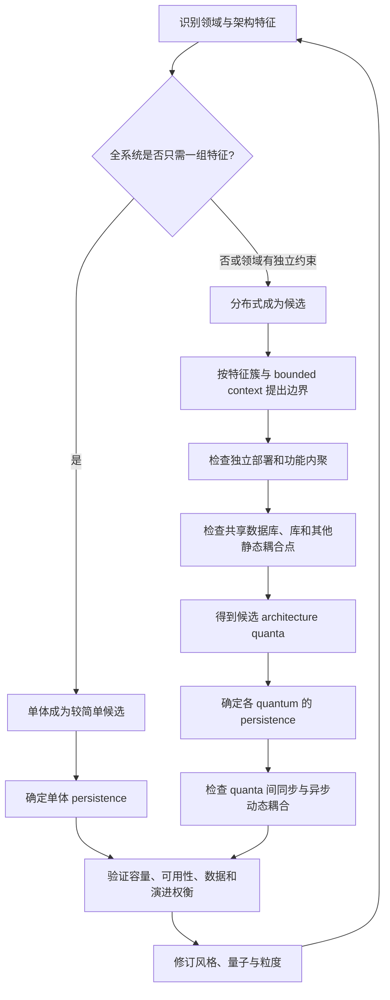
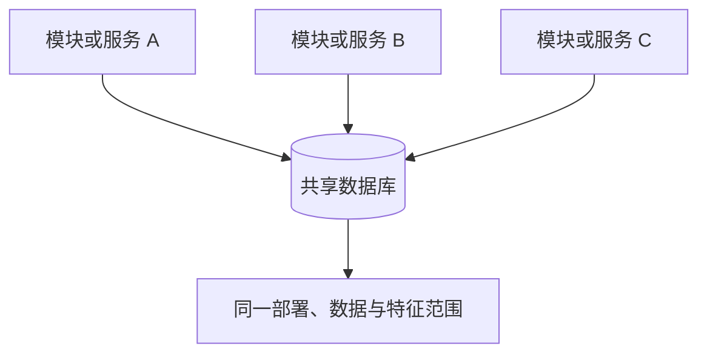

> 对应原章：7. The Scope of Architectural Characteristics.md
> 第 4 至第 6 章分别讨论架构特征的定义、识别和治理，本章补上容易被忽略的一维：**这些特征究竟作用于系统的哪一部分**。现代系统不一定共享一套统一的性能、可用性、安全性和演进要求；作用范围的差异会直接影响单体/分布式风格、服务粒度、数据边界和通信方式。
> 本笔记严格沿原章顺序展开。原章没有计算型算法；文中的吞吐/积压公式、Python 示例、静态耦合分组和决策伪代码是教学化工具。Architecture quantum 是分析边界，不是只凭图算法自动生成微服务的公式；最终边界仍需结合领域语义、独立部署、数据所有权、运行特征和组织能力判断。

## 0. 本章要回答的核心问题

1. 为什么“全系统只有一套架构特征”在现代架构中经常失效？
2. 代码级复杂度、耦合和主序列距离为什么无法表达架构特征的作用范围？
3. 数据库等代码库外依赖为什么会决定性能、弹性和可用性的真实边界？
4. 什么是 architecture quantum，它为什么能辅助衡量结构可演进性？
5. Quantum 的复数为什么是 quanta，这个词与物理学中的量子有何异同？
6. Architecture quantum 的四个构成条件分别解决什么问题？
7. 独立部署为什么必须把数据库和其他必要依赖一起纳入，而不只是看服务进程？
8. High functional cohesion 为什么是量子边界的领域基础？
9. DDD bounded context 怎样解决全组织共享统一 `Customer` 模型造成的耦合？
10. Semantic、implementation、static、dynamic coupling 分别描述什么？
11. 为什么多个服务共享同一数据库时，名义上有多个服务，实际可能只有一个 quantum？
12. 为什么高耦合在狭窄边界内可以合理，跨越更大范围后却会导致脆弱？
13. 同步通信为什么会让不同量子的 operational characteristics 相互传播？
14. Payment 每 500 ms 处理一次时，Auction 突发请求会怎样失败？
15. 消息队列如何缓冲突发，又为什么不能解决长期到达率高于处理率？
16. 架构特征范围怎样帮助选择 monolithic 或 distributed architecture？
17. “只有一组特征可选单体，多组特征倾向分布式”为什么只是启发式而非定理？
18. 分布式架构中怎样进一步确定 quantum boundaries？
19. 单体和分布式架构分别有哪些 persistence 选择？
20. 为什么 persistence 和 synchronous/asynchronous communication 会反过来改变量子边界？
21. Going Green 的业务流程是什么，为什么会形成三组不同架构特征？
22. 客户界面、设备评估、回收/报表/会计分别优先保护什么能力？
23. Going Green 最终为什么有多个服务，却只有三个 architecture quanta？
24. 怎样把特征簇作为服务粒度的第一条证据，而不是唯一证据？
25. 云上托管容器与直接组合云厂商资源时，架构特征分析有何不同？
26. 云把过去艰难实现的 elasticity 变成配置后，为什么架构权衡并没有消失？
27. 如何把本章概念转化为一套可复查的范围与边界分析流程？

本章的论证主线如下：



一句话概括：**架构特征必须有作用范围；把应以不同方式扩展、保护和演进的能力放进同一边界，会迫使全系统承担最严格要求，而共享数据和同步调用又可能把看似独立的服务重新绑成一个运行整体。**

---

## 1. 开篇：为什么“范围”成为独立问题

传统架构方法常假设整个系统只有一套架构特征：同一可用性目标、同一性能等级、同一安全与演进节奏。在单体和共享数据库占主导的时代，这个假设经常接近现实。

现代微服务等架构则可能同时存在：

- 面向公众的接口需要高 scalability 和 availability；
- 财务能力需要 security、data integrity 和 auditability；
- 高频变化的规则引擎需要 maintainability、deployability 和 testability；
- 离线分析可以接受延迟，却追求高吞吐与低成本。

若把这些要求都提升为全系统统一目标，所有部分都要支付所有能力的成本；若忽略范围，又会让关键局部能力达不到业务要求。

### 1.1 范围影响哪些架构决定

| 范围问题 | 可能影响的决定 |
| --- | --- |
| 哪些功能共享一组运行特征 | 单体还是分布式架构 |
| 哪些代码和数据必须一起部署 | 服务与 quantum 边界 |
| 哪些能力需要独立扩缩 | 服务粒度和数据分区 |
| 哪些故障可以隔离 | 同步/异步通信、冗余和降级 |
| 哪些数据必须强一致或严格审计 | persistence 和事务边界 |
| 哪些部分变化频繁 | 独立部署、测试和所有权 |

范围不是在架构风格选完后补画的标签，而是选择风格的输入。

### 1.2 为什么第 3、6 章的代码指标不够

代码级指标能观察：

- 方法和类的复杂度；
- 包依赖与循环；
- 内聚和耦合；
- Abstractness、Instability 和 Distance。

它们看不到代码库之外的强耦合点，例如：

- 多个服务共享数据库模式；
- 共同依赖的消息代理或文件系统；
- 必须同步可用的外部服务；
- 云厂商区域和托管服务；
- 部署、数据迁移和恢复必须一起发生的资源。

一个服务的代码可以非常模块化，但若它和五个服务共同修改同一数据库表，就无法独立扩展、部署和恢复。

### 1.3 数据库为何是典型反例

假设服务代码经过精心优化，能够水平扩展；数据库却只有单实例、存在热点锁或无法分区。最终 scalability 和 elasticity 的上限仍由数据库决定。

```text
应用实例可复制
    + 数据库不可扩展或必须同步迁移
    = 整体并不具备独立扩展能力
```

同理，应用有多区副本但数据库只在单区，可用性范围仍包含数据库的单区故障域。

### 1.4 Architecture quantum 的产生动机

作者在编写《Building Evolutionary Architectures》时，需要衡量不同架构风格的 structural evolvability（结构可演进性）。现有指标粒度太低，无法表达代码、数据库和运行依赖共同形成的作用范围，于是提出 architecture quantum。

它要回答的不是“这个类复杂吗”，而是：

> 系统中最小的哪一部分，能够作为一个独立运行和演进的整体，并拥有一组一致的架构特征？

---

## 2. Architectural Quanta and Granularity：架构量子与粒度

组件间调用不是唯一绑定力。业务概念也会把代码语义性地连在一起，形成 functional cohesion。要让软件能够成功设计、分析和演进，必须识别所有可能因变化而断裂的耦合点。

### 2.1 与模块化和粒度的关系

- **Modularity**：系统是否形成了有意义的边界；
- **Granularity**：每个边界多大；
- **Architecture quantum**：哪一组代码、数据和必要依赖形成独立运行且共享架构特征范围的整体。

一个 quantum 可能包含一个服务，也可能包含共享静态耦合点的多个服务。服务数量不等于量子数量。

### 2.2 Plurals for Latin-Derived Technical Terms：拉丁词源技术名词的复数

`Quantum` 来自拉丁语，复数以 `a` 结尾：

- 一个 quantum；
- 多个 quanta。

`Data` 也源自拉丁语，原本是 `datum` 的复数。不过《Chicago Manual of Style》第 18 版（2024）指出，现代英语常把 data 作为集合名词并搭配单数动词。

这个语言说明看似旁枝，实际避免团队在讨论 quanta 时误以为是另一个概念。

### 2.3 从物理量子到架构量子

物理学中的 quantum 表示某种量的最小离散单位，通常与能量有关。拉丁词义接近“多大”或“多少”，一般语境常引申为“小而不可再分的东西”。

Architecture quantum 借用的是“最小独立整体”的直觉，不是声称软件边界像物理粒子一样具有自然定律。非正式定义是：

> 系统中能够独立运行的最小部分。

Microservice 经常形成 quantum，因为服务可以连同自己的数据和必要依赖独立运行；但这不是“一服务一量子”的保证。

### 2.4 Architecture quantum 的完整定义

一个 architecture quantum 为一组架构特征建立作用范围，并具有四项特征：

1. 能够与架构其他部分 **independently deployable**；
2. 具有 **high functional cohesion**；
3. 对外具有 **low implementation static coupling**；
4. 与其他 quanta 的 **synchronous communication** 会形成需要分析的动态耦合。

第 4 项不是建议量子之间都使用同步调用。原章专门列出同步通信，是因为它会传播阻塞、吞吐、可用性等运行特征，某些系统中甚至会改变由静态耦合得到的量子边界；异步通信通常能更好地分离时间维度。

可把候选量子教学化表示为：

$$
Q=(Code,Data,Dependencies,AC)
$$

- `Code`：实现有意义业务能力的代码；
- `Data`：该能力独立运行所必需的数据；
- `Dependencies`：部署和运行不可缺少的资源；
- `AC`：在这个边界内应一致满足的架构特征集合。

这不是原书计算公式，也不表示四个集合能自动决定边界。

### 2.5 Establishes the scope for a set of architectural characteristics

Quantum 首先是特征作用范围：尤其适合 operational characteristics。

例如：

| Quantum | 主要特征 | 不必强加给其他部分的能力 |
| --- | --- | --- |
| 公共报价 | 高扩展、高可用、快速响应 | 会计级审计细节 |
| 财务结算 | 完整性、审计、安全 | 面向公众的巨大弹性 |
| 规则评估 | 易修改、易测试、易部署 | 财务数据长期保留 |

把范围局部化，可以让每部分为真正需要的能力付费。

### 2.6 Independently deployable：独立部署

Quantum 必须包含独立工作所需的全部组件。判断不能只问“服务二进制能单独发布”，还要问：

- 数据库 schema 是否能独立迁移；
- 依赖服务是否必须同时升级；
- 配置、队列、缓存和密钥是否属于同一发布单元；
- 故障时能否独立恢复；
- 是否能在其他部分不变时回滚。

若应用离不开数据库，数据库就是 quantum 的一部分。

#### 共享单库的遗留系统

大量 legacy systems 虽有多个模块或服务，却通过一个数据库整体部署。按照定义，它们通常只有一个 quantum：



#### Microservices 的常见情形

在符合 bounded context 思想的微服务中，每个服务拥有自己的数据库，可以形成多个 quanta。但若多个“微服务”共享表、必须一起迁移或同步发布，它们在量子意义上仍被绑在一起。

### 2.7 High functional cohesion：高功能内聚

Quantum 应完成有意义、统一的目的。

- `Customer` 组件的属性和方法都围绕客户，内聚较高；
- `Utility` 收集随机方法，内聚较低。

单体共享数据库中，cohesion 的边界常被整个系统吞没；事件驱动或微服务中，更需要让服务对应单一 workflow 或 bounded context。

高内聚不是“代码都访问同一张表”，而是它们围绕同一业务能力共同变化。

### 2.8 Domain-Driven Design’s Bounded Context：领域驱动设计的限界上下文

Eric Evans 2003 年的《Domain-Driven Design》深刻影响现代架构。DDD 是有组织地分解复杂问题域的建模方法。

Bounded context 建立一个语义边界：

- 与某部分领域相关的概念在内部清晰可见；
- 内部模型对其他 bounded contexts 不透明；
- 边界之间通过明确契约协调差异。

#### 2.8.1 为什么全组织统一模型常失败

DDD 之前，架构师常试图在整个组织统一复用共同实体，例如唯一的 `Customer` 类。

但不同领域眼中的 Customer 不同：

| 上下文 | Customer 关注 |
| --- | --- |
| 销售 | 线索、折扣、购买历史 |
| 配送 | 地址、收件窗口、联系方式 |
| 财务 | 信用、账单、税务身份 |
| 支持 | 工单、服务等级、沟通记录 |

一个全局模型会不断膨胀，让所有团队协调每次字段变化，并引入无关依赖。

Bounded context 允许每个问题域拥有自己的 `Customer`，在跨域通信点转换和调和差异。局部重复换取语义自主，通常比共享“企业万能实体”更易演进。

#### 2.8.2 Bounded context 与 quantum 的关系

| 概念 | 主要关注 | 典型问题 |
| --- | --- | --- |
| Bounded context | 领域模型和语言边界 | 这个概念在何种语境中含义一致？ |
| Service | 实现与部署构件 | 哪段代码以什么接口运行？ |
| Architecture quantum | 架构特征与独立运行范围 | 哪些代码、数据和依赖必须作为一个整体演进？ |

三者经常重叠，但不必一一对应。一个 bounded context 可能包含多个服务；多个共享数据库的服务也可能组成一个 quantum。

### 2.9 Semantic coupling：语义耦合

Semantic coupling 来自问题本身的自然联系。

订单处理天然涉及：

- inventory；
- catalog；
- shopping cart；
- customer；
- sales。

当业务要求改变，语义会传播。架构模式无法神奇地阻止核心问题变化影响系统；它只能让传播更显式、更局部、更可管理。

### 2.10 Implementation coupling：实现耦合

Implementation coupling 来自团队怎样实现依赖，而非问题域本身。

订单系统可以选择：

- 全部数据放在单一数据库；
- 按领域拆分数据；
- 单体部署；
- 分布式服务；
- 同步调用；
- 消息通信。

这些选择不大改变业务语义，却显著改变扩展、可用、部署和故障权衡。实现耦合是架构师能够主动设计的部分。

### 2.11 Static coupling：静态耦合

Static coupling 是架构的“布线”：服务、组件和资源怎样形成依赖。

判断直觉：

> 若改变 A 可能使 B 失效，A 与 B 存在耦合。

两个服务若依赖同一个不可独立演进的耦合点，就属于同一 quantum。原章例子是 `Catalog` 和 `Shipping` 都依赖共享地址组件；共享依赖变化可能同时破坏两者。

最典型静态耦合点是共享关系数据库：多个服务共享 schema、约束和迁移，因此形成同一特征范围。

### 2.12 Dynamic coupling：动态耦合

Dynamic coupling 描述 quanta 在运行时通信产生的力量：

- 谁等待谁；
- 延迟怎样累积；
- 下游容量怎样限制上游；
- 故障怎样传播；
- 重试是否放大流量；
- 消息积压和一致性怎样处理。

静态耦合回答“依赖图怎样连”，动态耦合回答“系统运行时这些连接怎样影响行为”。

### 2.13 四类耦合的关系

| 类型 | 来源 | 能否由架构选择改变 | 例子 |
| --- | --- | --- | --- |
| Semantic | 业务问题和领域含义 | 不能消除，只能建模和局部化 | 订单需要库存与客户 |
| Implementation | 技术实现选择 | 可以显著改变 | 单库还是分库 |
| Static | 编译、部署、数据和共享依赖 | 可以通过边界与所有权改变 | 多服务共享数据库 |
| Dynamic | 运行通信、时序和故障传播 | 可以通过协议和通信模式改变 | 同步调用或消息队列 |

Implementation 是上位视角，static 和 dynamic 是实现耦合的两个重要侧面；semantic 则提醒团队不要把业务本身的联系误认为纯技术问题。

### 2.14 Low external implementation static coupling：低外部静态实现耦合

Quanta 之间应保持低 implementation static coupling。它们位于 component 之上，形成架构的运行构建块，并经常与服务边界重叠。

低耦合的目标不是零通信，而是：

- 一个量子可独立部署和回滚；
- 内部模型不泄露到外部；
- 数据有明确所有者；
- 契约变化范围可控；
- 外部不依赖内部表和类；
- 故障和扩缩容尽量局部化。

### 2.15 为什么窄范围允许更高耦合

高 cohesion 往往需要内部元素紧密协作。若所有强关系都被拆成远程接口，系统会同时失去可理解性和性能。

原章原则是：

> 范围越窄，越能容忍较高耦合；范围越广，耦合越应该松散。

这与第 3 章 connascence 的 locality 规则一致：强约束留在同一边界内更容易原子修改和测试，跨服务、跨团队、跨版本后则必须弱化。

### 2.16 Brittle architecture：脆弱架构

若一个实现细节变化引发大量意外副作用，架构就很脆弱。

原章例子：架构师把服务字段从 `State` 改名为 `StateCode`，以为只有一个调用者，实际却破坏许多隐藏依赖。

根因可能包括：

- 契约未版本化；
- 内部字段被多个外部系统复制；
- 无消费者清单和契约测试；
- 共享模型跨越 bounded contexts；
- 变化范围与所有权不可见。

### 2.17 候选 quantum 的静态分组示例

下面用共享的、不可独立演进的数据依赖复现 Going Green 图 7-7 的三个静态范围：

```python
from collections import defaultdict


def group_by_shared_dependency(service_dependencies):
    parent = {service: service for service in service_dependencies}

    def find(service):
        while parent[service] != service:
            parent[service] = parent[parent[service]]
            service = parent[service]
        return service

    def union(left, right):
        left_root = find(left)
        right_root = find(right)
        if left_root != right_root:
            parent[right_root] = left_root

    users_by_dependency = defaultdict(list)
    for service, dependencies in service_dependencies.items():
        for dependency in dependencies:
            users_by_dependency[dependency].append(service)

    for users in users_by_dependency.values():
        for service in users[1:]:
            union(users[0], service)

    groups = defaultdict(list)
    for service in service_dependencies:
        groups[find(service)].append(service)

    return sorted(tuple(sorted(group)) for group in groups.values())


dependencies = {
    "quote": {"customer_db"},
    "item_status": {"customer_db"},
    "assessment": {"assessment_db"},
    "receiving": {"backoffice_db"},
    "recycling": {"backoffice_db"},
    "accounting": {"backoffice_db"},
    "reporting": {"backoffice_db"},
}

for group in group_by_shared_dependency(dependencies):
    print(", ".join(group))
```

输出：

```text
accounting, receiving, recycling, reporting
assessment
item_status, quote
```

这个并查集算法只计算“共享静态依赖的传递闭包”。其中 $V$ 是服务数，$E$ 是所有“服务使用依赖”关系的总数；由于示例使用路径压缩但没有按秩/大小合并，且最终还要排序输出，保守地写整体时间复杂度为 $O((V+E)\log V)$，空间复杂度为 $O(V+E)$。它不能验证功能内聚、真正独立部署、同步通信、领域边界或共享依赖是否可以拆开，因此只能生成调查候选，不能自动宣布服务边界。

---

## 3. Synchronous Communication：同步通信

Communication 属于 dynamic coupling：不同 architecture quanta 在运行时互相调用。它尤其影响 operational characteristics，因为分布式调用包含等待、阻塞、容量和故障传播。

### 3.1 Auction 与 Payment 案例

微服务架构中有：

- `Auction`：拍卖结束并产生支付请求；
- `Payment`：处理付款；
- Auction 同步把支付信息发给 Payment；
- Payment 每 500 ms 只能处理一笔付款。

Payment 单工作槽的理论服务率为：

$$
\mu=\frac{1}{0.5\ \mathrm{s}}=2\ \mathrm{payments/s}
$$

若许多拍卖同时结束，Auction 的发送能力可能远高于 Payment。第一笔调用成功，随后请求开始超时、排队或失败。两者虽然是不同服务，却没有兼容的 scalability。

### 3.2 同步链中的“最弱环节”

若每个请求必须同步通过多个服务，简化条件下：

$$
Throughput_{workflow}\le\min(Throughput_1,\ldots,Throughput_n)
$$

$$
Latency_{workflow}\approx\sum_{i=1}^{n}Latency_i+NetworkOverhead
$$

若所有依赖都必须成功，并粗略假设故障独立：

$$
Availability_{workflow}\approx\prod_{i=1}^{n}Availability_i
$$

这些是教学化近似。真实系统有并发、批处理、缓存、超时、重试、相关故障和降级路径；乘积公式在故障相关时尤其可能误导。

### 3.3 为什么同步通信“不宽容”

同步调用要求调用方在时间上与被调用方同时满足条件：

- 下游必须在线；
- 下游必须及时响应；
- 下游容量必须承受当前上游流量；
- 调用方线程、连接和超时预算被占用；
- 重试可能进一步放大下游压力。

因此，不同 quanta 的架构特征会在请求路径上相互制约。高扩展 Auction 同步依赖低扩展 Payment 时，Auction 无法为该工作流兑现自己的扩展承诺。

### 3.4 异步队列怎样缓冲突发

若 Auction 把支付命令写入队列：

- Auction 可快速接受突发；
- Payment 按自身速率消费；
- 两者不必同时在线；
- 队列积压成为明确状态。

简化地，突发期间恒定到达率为 $\lambda$、消费率为 $\mu$、持续 $T$ 秒，队列积压约为：

$$
B(T)=\max(0,(\lambda-\mu)T)
$$

突发结束且新到达停止后，清空时间约为：

$$
T_{drain}=\frac{B(T)}{\mu}
$$

### 3.5 可运行的容量示例

假设 Auction 以 20 笔/秒持续突发 10 秒，Payment 仍为 2 笔/秒：

```python
service_time_ms = 500
arrival_rate = 20
burst_seconds = 10

payment_rate = 1_000 / service_time_ms
overload_factor = arrival_rate / payment_rate
queued = max(0, (arrival_rate - payment_rate) * burst_seconds)
drain_seconds = queued / payment_rate

print(f"payment_capacity={payment_rate:.0f}/s")
print(f"overload_factor={overload_factor:.0f}x")
print(f"queued_after_burst={queued:.0f}")
print(f"drain_time={drain_seconds:.0f}s")
```

输出：

```text
payment_capacity=2/s
overload_factor=10x
queued_after_burst=180
drain_time=90s
```

代码假设单消费者、固定处理时间、无重试且突发后完全停止。它说明队列把立即失败转成可观察延迟，不代表 90 秒业务上一定可接受。

### 3.6 队列不能修复长期容量不足

若长期 $\lambda>\mu$：

$$
\lim_{T\to\infty}B(T)=\infty
$$

有限队列最终溢出。必须采取：

- 增加 Payment 并行能力；
- 批处理或优化单笔时间；
- 限流和背压；
- 增大但仍有限的队列；
- 明确最大业务延迟；
- 拒绝或降级部分工作。

异步通信缓冲 burst，不会创造处理容量。

### 3.7 异步的新增权衡

异步通常降低时间耦合，却引入：

- eventual consistency；
- 消息重复与幂等；
- 顺序和分区；
- 死信和重放；
- 积压监控；
- 端到端追踪；
- 用户何时看到最终结果。

因此，源章说异步 “less potential impact”，不是 “no impact”。

### 3.8 同步通信与 quantum 边界

Architecture quantum 让架构师从 quantum level 而非统一 system level 定义特征。但若两个候选量子通过不可降级的同步链紧密绑定：

- 它们的可用性范围可能重叠；
- 吞吐由较慢一方限制；
- 部署契约可能必须协调；
- 故障隔离可能失效。

此时应重新检查：它们仍是两个独立量子，还是同步 connascence 已让有效特征范围扩大。不是每个同步调用都自动合并量子，关键在于调用是否位于关键路径、能否降级、契约是否独立，以及失败是否传播。

---

## 4. The Impact of Scoping：作用范围的影响

架构师可以利用特征作用范围确定服务边界，并辅助选择架构风格。


图 7-1 给出总体决策树：

1. 选择架构特征并分析领域；
2. 判断单体或分布式候选；
3. 分布式架构确定 quanta；
4. 两类架构确定 persistence；
5. 分布式 quanta 确定通信风格。

这是缩小候选空间的思考顺序，不是保证唯一正确答案的自动流程。

### 4.1 Scoping and Architectural Style：范围与架构风格

#### 4.1.1 第一步：一组还是多组架构特征


若全系统一套特征足以成功，可以选择 monolithic architecture，从而减少后续分布式决策。

若需要多组特征，或领域约束要求独立边界，distributed architecture 更可能合适，因为不同量子可以：

- 独立扩展；
- 独立部署；
- 使用不同数据和安全策略；
- 按各自节奏演进。

##### 不是机械二选一

“单组 -> 单体、多组 -> 分布式”是启发式：

- 单体内部也能建立模块和局部治理；
- 多组特征不一定足以支付网络、运维和数据分布成本；
- 单组特征也可能因团队、地域或法规选择分布式；
- 现有平台和迁移成本可能限制可行方案。

应理解为：多组显著不同的特征是支持物理分离的重要证据，而不是充分必要条件。

#### 4.1.2 第二步：确定 distributed quanta


选择分布式后，继续确定：

- 哪些能力形成 bounded contexts；
- 哪些功能共享架构特征；
- 哪些服务和数据能够独立部署；
- 哪些静态依赖会把边界合并；
- 粒度是否造成过多通信。

第 18 章会继续讨论 microservices granularity。本章只把特征范围作为第一条边界证据。

#### 4.1.3 第三步：确定 persistence


##### Monolithic architecture

单一 monolithic database 通常合适：应用与数据库 lockstep 开发和部署。确定后可以继续选择最合适的单体风格。

“通常”不是必须。单体可以使用多个存储，但若它们仍随一个应用整体部署和运行，量子仍可能只有一个。

##### Distributed architecture

可以：

- 使用单一数据库，event-driven architectures 中较常见；
- 按 service granularity 分区数据，microservices 中较典型。

共享数据库会产生静态耦合，可能让多个服务落入同一 quantum；数据库按边界分离则提高自主性，但引入分布式一致性、复制、查询和运维成本。

#### 4.1.4 第四步：确定 quanta 间通信

分布式架构还要选择 synchronous 或 asynchronous communication。

- 同步简单直接，适合即时结果，却传播容量和故障；
- 异步缓冲和解耦时间，却增加消息语义和最终一致性；
- 实际系统常按工作流混合使用。

静态与动态耦合会互动：原本数据独立的两个量子，可能因关键同步调用共享可用性范围；共享数据库的服务即使只用异步事件，也仍受同一静态边界约束。

### 4.2 一套教学化决策流程

```text
function choose_architecture_boundaries(domain, characteristics):
    clusters = group_characteristics_by_domain_workflow(characteristics)

    if one_cluster_is_sufficient(clusters) and no_domain_constraint_requires_split():
        consider_monolithic_styles()
        choose_monolithic_persistence()
        validate_tradeoffs_with_capacity_failure_and_change_scenarios()
        return revisable_architecture_decision()
    else:
        consider_distributed_styles()
        candidate_quanta = align_clusters_with_bounded_contexts()
        merge_boundaries_tied_by_nonindependent_static_dependencies()
        verify_independent_deployment_and_functional_cohesion()
        choose_persistence_for_each_quantum()
        analyze_communication_between_quanta()
        validate_tradeoffs_with_capacity_failure_and_change_scenarios()
        return revisable_architecture_decision()
```

流程有效的原因是按依赖顺序决策：先知道需要保护什么，再决定边界；先看静态独立性，再看运行时通信。它仍需迭代，因为 persistence 和 communication 可能推翻早期边界。

### 4.3 Kata: Going Green：Going Green 架构套路练习

本章用 Going Green（GG）展示怎样把架构特征范围转成 quanta。

#### 4.3.1 业务流程

GG 回收并转售旧电子设备，例如手机：

1. 公共 kiosk 和 website 运行同一系统；
2. 用户提交设备型号与状态；
3. GG 给出报价；
4. 用户接受后，在 kiosk 投入设备，或由网站寄送包装盒；
5. GG 收到设备后进行 assessment；
6. 向用户付款；
7. 估算设备价值；
8. 选择 recycle 或 resell；
9. 系统生成 reporting 和 analytics。


#### 4.3.2 三个架构特征簇

分析后形成三个明显 cluster：


##### Customer facing：报价与状态

- scalability：公众访问和活动可能带来高并发；
- availability：用户需要随时获取报价和状态；
- agility：客户体验和市场功能需要快速变化。

##### Electronic item assessment：设备评估

- maintainability：新设备和估价规则持续出现；
- deployability：规则要快速、安全上线；
- testability：报价变化直接影响利润，需快速验证；
- 三者共同构成 composite agility。

##### Recycling, reporting, and accounting：后台处理

- security：付款、库存和财务数据敏感；
- data integrity：回收、转售、付款和账务必须一致；
- auditability：需要追踪设备、资金和处理结果。

#### 4.3.3 为什么 Assessment 单独成簇

GG 的商业模式依赖转售高价值二手设备，而新型号持续出现。评估规则更新越快，就越能及时收购较新、价值更高的设备。

因此，maintainability、deployability 和 testability 不是一般代码偏好，而是直接支持商业优势的架构特征。

#### 4.3.4 为什么不让全系统支持全部特征

理论上可以设计一个同时最大化：

- scalability；
- availability；
- security；
- data integrity；
- auditability；
- maintainability；
- deployability；
- testability。

但代价很高，且目标互相制约：

- 强 auditability 会增加记录、控制和发布验证；
- 快 deployability 需要局部修改和自动化；
- 公共 UI 的巨大 scalability 对后台会计未必有价值；
- 将财务安全控制施加到所有公开查询会增加成本和摩擦。

特征簇允许每个范围选择自己的 least-worst trade-offs。

#### 4.3.5 从三个特征簇得到三个 quanta


图中虚线是 quantum boundaries：

| Quantum | 服务 | Persistence | 主要特征 |
| --- | --- | --- | --- |
| Customer-facing | Quote、Item Status | 共享客户侧数据库 | scalability、availability、agility |
| Assessment | Assessment | 独立评估数据库 | maintainability、deployability、testability/agility |
| Back office | Receiving、Recycling、Accounting、Reporting | 共享后台数据库 | security、data integrity、auditability |

关键观察：图中有 7 个服务，却只有 3 个 quanta。共享数据库和统一特征范围让 Quote/Item Status 属于同一 quantum，四个后台服务也属于同一 quantum。

这说明：

```text
service boundary != architecture quantum boundary
```

#### 4.3.6 特征簇只是粒度的第一步

按 scope 划分有价值，但还要检查：

- 每个量子是否有高功能内聚；
- 数据是否能独立拥有和迁移；
- 服务之间调用是否过于频繁；
- 同步依赖是否扩大故障范围；
- 团队是否能独立构建和运维；
- 分布式成本是否值得；
- 合规事务是否跨越边界。

第 18 章会继续讨论粒度。图 7-7 是合理起点，不是最终生产拓扑。

#### 4.3.7 Going Green 的潜在动态耦合

即使静态上有三个量子，工作流仍跨边界：

- 客户报价依赖设备评估规则或评估结果；
- 收货触发评估；
- 评估结果触发付款、回收或转售；
- 状态页面读取后台处理进度。

若这些全部同步：

- 后台安全和延迟可能拖慢公共接口；
- Assessment 发布故障可能阻断收货；
- 客户侧可用性目标被后台可用性限制。

可考虑用事件传递状态变化，对必须即时返回的报价使用受控同步路径，并为超时、缓存和降级建立明确语义。

### 4.4 决策树的适用范围与局限

它适合：

- 新系统初步选择风格；
- 识别单体拆分候选；
- 发现不同运行特征范围；
- 检查“微服务”是否被共享数据重新绑住。

它不能独立回答：

- 团队边界和政治成本；
- 遗留迁移顺序；
- 每个服务的精确粒度；
- 分布式事务和一致性策略；
- 具体技术产品选择；
- 业务价值是否值得分布式复杂度。

---

## 5. Scoping and the Cloud：作用范围与云

云资源让范围分析更复杂，因为云平台封装了大量 operational characteristics。架构师至少要区分两种部署模型。

### 5.1 Using the cloud to host containers：云托管容器

许多团队把云当成替代 operations center，在云中运行并编排服务器容器。

此时仍需分析：

- 每个 container 的 CPU、内存、启动和状态约束；
- 副本能否真正无状态；
- volume 与数据库的故障域；
- 网络策略和服务发现；
- Kubernetes 等 orchestrator 的调度、滚动升级和健康检查语义；
- 节点、zone 和 region 故障；
- 配额与伸缩速度。

Kubernetes 能编排副本，不会自动修复共享数据库、错误服务边界或同步瓶颈。

### 5.2 Using cloud-provider resources as system components：把云资源作为组件

另一种方式是直接组合云厂商 building blocks：

- triggered functions；
- managed databases；
- queues 和 event buses；
- object storage；
- identity、API gateway 和其他托管能力。

此时架构特征部分来自厂商宣称并“希望能够维持”的能力：

- 可用性 SLA；
- 弹性和并发限制；
- 数据一致性；
- 区域与备份；
- 安全和身份边界；
- 升级与弃用策略。

架构师不能只看功能列表，应验证配额、失败语义、冷启动、地域限制、恢复能力和退出成本。

### 5.3 托管资源怎样影响 quantum

云资源也会形成耦合点：

- 多个函数共享同一数据库，可能处于同一静态范围；
- 多个服务依赖同一 region，拥有共同故障域；
- 所有工作流同步依赖单一厂商 API，动态可用性被绑定；
- 共享 IAM、密钥或事件总线可能形成治理和安全范围。

“Serverless” 或 “managed” 不等于没有 quantum，只是部分实现和运维责任转移给供应商。

### 5.4 过去的难题变成今天的配置

Elasticity 等能力，是上一代架构师在物理系统上艰难实现的成果；今天常表现为云配置项。

这带来巨大收益：

- 更快获得资源；
- 自动伸缩；
- 托管故障转移；
- 全球基础设施；
- 标准化监控和部署。

但出现新的权衡：

- provider availability；
- heightened security concerns；
- 配额和共享责任；
- 网络和跨区费用；
- vendor lock-in；
- 托管服务语义变化；
- 数据驻留和合规。

软件架构的具体问题不断改变，分析 trade-offs 的职责不变。

### 5.5 两种云模型对比

| 角度 | 云托管容器 | 云资源作为组件 |
| --- | --- | --- |
| 团队控制 | 更多控制运行时与容器 | 更多能力交给供应商 |
| 主要范围线索 | Pod/服务、volume、数据库、orchestrator | 函数、托管数据库、队列、区域与 IAM |
| 可移植性 | 通常较高但仍依赖平台 | 更可能依赖厂商专有语义 |
| 运维负担 | 团队管理更多中间层 | 供应商承担更多，团队管理配置与集成 |
| 特征证据 | 自己测试容器和平台组合 | 同时验证厂商承诺与应用行为 |
| 新耦合 | 编排器和集群 | 托管 API、配额、区域和服务生命周期 |

---

## 6. 容易混淆的概念与常见误区

### 6.1 “全系统必须共享同一组架构特征”

错误之处：公共接口、财务后台和高频变化规则可能有完全不同优先级。

正确理解：在 quantum level 定义特征，系统级只保留真正横切的最低要求。

### 6.2 “代码模块化好，系统就能独立演进”

错误之处：共享数据库、配置、同步服务和部署流程可能把代码外部分重新绑在一起。

正确理解：范围分析必须包含数据和运行依赖。

### 6.3 “Architecture quantum 就是物理学量子的严格类比”

错误之处：软件边界没有自然不可分定律，会随需求和实现改变。

正确理解：借用“最小独立整体”的分析直觉。

### 6.4 “一个 microservice 必然是一个 quantum”

错误之处：共享数据库或必须一起部署的服务仍可能组成同一 quantum。

正确理解：检查代码、数据、必要依赖和特征范围的整体独立性。

### 6.5 “一个 quantum 只能包含一个服务”

错误之处：Going Green 的客户侧有两个服务，后台有四个服务，却各自共享数据库与特征范围。

正确理解：服务是构件，quantum 是更高一层的独立运行范围。

### 6.6 “独立部署只看二进制能否单独发布”

错误之处：数据库迁移、配置、回滚和下游兼容可能仍要求协调。

正确理解：把必要数据与依赖纳入部署和恢复边界。

### 6.7 “Bounded context 就是服务”

错误之处：前者是领域语义边界，后者是实现/部署构件。

正确理解：它们可以重叠，但数量和粒度不必一致。

### 6.8 “所有领域都应该共享唯一 Customer 类”

错误之处：销售、配送、财务和支持需要不同语义，全局实体制造协调和无关耦合。

正确理解：上下文内建模，在边界转换。

### 6.9 “Semantic coupling 可以用某种架构模式完全消除”

错误之处：业务问题本身变化必然影响系统需求。

正确理解：只能让变化局部、显式和可管理。

### 6.10 “Static coupling 只指代码 import”

错误之处：共享数据库、schema、库和不可独立演进资源也属于静态布线。

正确理解：检查改变一个耦合点会同时破坏哪些部分。

### 6.11 “Dynamic coupling 只表示网络连接存在”

错误之处：真正重要的是阻塞、时序、容量、重试和故障传播。

正确理解：分析运行时工作流和 operational characteristics。

### 6.12 “低耦合意味着所有地方都不应紧密协作”

错误之处：高功能内聚需要边界内部的紧密关系。

正确理解：强耦合局部化，范围越广使用越弱契约。

### 6.13 “字段重命名只是局部重构”

错误之处：若字段已成为跨服务契约或共享模型，隐藏消费者会一起破坏。

正确理解：区分内部实现名与外部版本化契约。

### 6.14 “同步调用只增加一点网络延迟”

错误之处：它还传播可用性、吞吐、超时和故障，较慢 Payment 会限制高扩展 Auction。

正确理解：把整条同步路径作为运行范围分析。

### 6.15 “异步队列解决容量不足”

错误之处：长期 $\lambda>\mu$ 时队列必然持续增长并最终溢出。

正确理解：队列缓冲有限突发；持续过载必须增加容量或施加背压。

### 6.16 “异步通信没有耦合”

错误之处：消息契约、顺序、幂等和最终一致性仍形成动态与语义约束。

正确理解：异步主要降低时间耦合，不消除所有耦合。

### 6.17 “一个同步调用会自动合并两个 quanta”

错误之处：可降级、非关键、稳定契约的同步调用未必改变整体边界。

正确理解：看它是否把关键容量、可用性和发布演进绑定起来。

### 6.18 “一组特征必须选单体，多组特征必须选分布式”

错误之处：决策树是启发式，组织、成本、法规和迁移也会影响风格。

正确理解：特征簇是重要证据，不是数学定理。

### 6.19 “单体只能有一个数据库”

错误之处：单体可以访问多个存储。

正确理解：原章说单一数据库通常合适；quantum 还取决于是否整体部署和演进。

### 6.20 “分布式就必须 database per service”

错误之处：事件驱动架构可以共享数据库，微服务更常按服务分区。

正确理解：数据拓扑是独立权衡，并会改变静态量子边界。

### 6.21 “Going Green 有七个服务，所以有七个 quanta”

错误之处：共享数据库与特征范围把它们归为三个独立整体。

正确理解：看虚线量子边界，不按服务框数量计数。

### 6.22 “特征簇直接给出最终服务粒度”

错误之处：还需检查领域内聚、调用频率、数据、团队和分布式成本。

正确理解：把 scope 当成粒度分析的第一步。

### 6.23 “Kubernetes 自动提供良好架构特征”

错误之处：编排器无法修复共享状态、错误边界和同步瓶颈。

正确理解：同时分析容器和编排工具的能力与约束。

### 6.24 “托管云服务意味着架构师不再负责运行特征”

错误之处：责任转移不等于风险消失，应用还要面对 SLA、配额、区域和失败语义。

正确理解：验证供应商承诺，并设计应用端降级和退出路径。

### 6.25 “云把 Elasticity 变成配置，所以权衡消失了”

错误之处：配置背后仍有启动时间、成本、配额、安全和供应商可用性。

正确理解：旧难题变简单，新耦合和权衡随之出现。

---

## 7. 从本章提炼的通用范围分析法

### 第 1 步：列出领域工作流

识别客户、后台、规则、分析等有意义业务能力及其变化原因。

**输出**：候选 bounded contexts 和跨域流程。

### 第 2 步：为每个工作流识别特征集合

不要默认继承系统统一清单，分别说明性能、可用、安全、完整性和演进优先级。

**输出**：带业务理由的 characteristic clusters。

### 第 3 步：比较特征集合

找出差异足以影响结构、成本和运行方式的 cluster，而不是为细小阈值差异任意拆分。

**输出**：可能需要独立范围的能力簇。

### 第 4 步：检查功能内聚

验证每个候选范围是否完成统一业务目的，避免只按技术层或数据库表分组。

**输出**：高内聚候选边界。

### 第 5 步：检查独立部署

把代码、数据库、配置、队列、迁移和恢复一起纳入，测试能否独立发布和回滚。

**输出**：真实部署单元，而非名义服务。

### 第 6 步：追踪静态耦合闭包

寻找共享数据库、共享组件和必须同步升级的依赖；必要时合并 quantum 或拆除耦合点。

**输出**：候选 architecture quanta。

### 第 7 步：分析动态耦合

对跨量子工作流计算容量、延迟和可用性传播，比较同步、异步、降级与背压。

**输出**：通信模式和运行风险。

### 第 8 步：选择风格和 persistence

单组特征优先考虑较简单单体，多组特征考虑分布式；再明确共享或分区数据的代价。

**输出**：带理由的候选架构风格与数据拓扑。

### 第 9 步：验证最坏场景与演进场景

测试突发、依赖故障、数据库迁移、独立扩缩和频繁规则发布，观察范围是否真实独立。

**输出**：容量、故障和变更证据。

### 第 10 步：记录并持续复查

记录边界依据、共享依赖、通信假设和触发拆分/合并的条件；云配置与业务变化后重新分析。

**输出**：可演进而非永久冻结的 quantum map。

---

## 8. 本章知识结构

```mermaid
flowchart TD
    ROOT[Scope of Architectural Characteristics] --> AQ[Architecture Quantum]
    ROOT --> CPL[Coupling]
    ROOT --> COM[Communication]
    ROOT --> STYLE[Architecture Style]
    ROOT --> GG[Going Green]
    ROOT --> CLOUD[Cloud]

    AQ --> DEP[Independent Deployment]
    AQ --> COH[High Functional Cohesion]
    AQ --> LOW[Low External Static Coupling]
    AQ --> AC[Characteristic Scope]
    AQ --> SYNC[Synchronous Dynamic Impact]

    CPL --> SEM[Semantic]
    CPL --> IMP[Implementation]
    IMP --> STATIC[Static Wiring]
    IMP --> DYN[Dynamic Runtime]
    COH --> BC[DDD Bounded Context]

    COM --> PAY[Auction and Payment]
    PAY --> BOT[Throughput Bottleneck]
    COM --> QUEUE[Async Buffer]
    QUEUE --> OVER[Sustained Overload Still Fails]

    STYLE --> SETS[One or Multiple Characteristic Sets]
    STYLE --> QBOUND[Choose Quanta]
    STYLE --> PERSIST[Choose Persistence]
    STYLE --> COMM[Choose Communication]

    GG --> CUST[Customer Facing Quantum]
    GG --> ASSESS[Assessment Quantum]
    GG --> BACK[Back-office Quantum]

    CLOUD --> CONT[Hosted Containers]
    CLOUD --> MANAGED[Provider Resources as Components]
```



整章可以压缩为四层：

1. **范围层**：一组架构特征属于哪个最小独立运行整体；
2. **耦合层**：语义、实现、静态和动态关系怎样扩大或收缩边界；
3. **决策层**：特征簇辅助选择风格、quanta、persistence 和通信；
4. **验证层**：用容量、故障、部署和云约束检验名义边界是否真的独立。

---

## 9. 核心结论

1. **现代系统不一定共享一套架构特征；服务级与系统级能力可以不同。**
2. **代码级指标无法表达数据库、外部服务和运行资源形成的架构特征范围。**
3. **Architecture quantum 是拥有一组架构特征、能够独立运行和演进的最小架构范围。**
4. **Quantum 的复数是 quanta；术语借用“最小独立整体”直觉，不是物理定律。**
5. **Quantum 必须综合独立部署、高功能内聚、低外部静态实现耦合和同步动态影响来判断。**
6. **数据库是 quantum 的一部分；共享单库常把多个模块或服务收拢成一个量子。**
7. **Microservice 经常形成 quantum，但服务与量子不保证一一对应。**
8. **DDD bounded context 允许同一实体在不同领域拥有本地模型，减少全局共享模型的协调耦合。**
9. **Semantic coupling 来自业务问题，无法消除；implementation coupling 来自技术选择，可以主动重构。**
10. **Static coupling 描述代码、数据和共享依赖的布线，dynamic coupling 描述运行时通信与故障传播。**
11. **Quantum 之间应低静态实现耦合，量子内部可为高内聚容忍更紧密关系。**
12. **范围越窄可容忍越强耦合；范围越广，契约越应松散、显式和可独立演进。**
13. **同步通信会传播延迟、吞吐和可用性，较慢下游可使高扩展上游无法兑现工作流目标。**
14. **Payment 每 500 ms 一笔意味着单工作槽约 2 笔/秒；超出能力的同步突发会失败或阻塞。**
15. **异步队列能缓冲有限突发并降低时间耦合，却不能修复长期 $\lambda>\mu$ 的容量不足。**
16. **异步新增幂等、顺序、积压、重放和最终一致性权衡，并非无耦合。**
17. **一组架构特征使单体成为较简单候选，多组显著不同特征为分布式提供重要证据。**
18. **风格决策树是启发式，不是单组必单体、多组必分布式的定理。**
19. **分布式架构选定后，还必须确定 quanta、persistence 与 quanta 间通信。**
20. **共享数据库可让多个服务属于同一 quantum；database per boundary 提高自主性但增加分布式数据成本。**
21. **Going Green 的客户界面、设备评估和后台处理形成三组不同架构特征。**
22. **Assessment 的 maintainability、deployability 和 testability 直接支持快速收购新型号的商业优势。**
23. **Going Green 有七个服务但三个 quanta，证明不能按服务框数量推断特征范围。**
24. **特征簇是服务粒度的重要第一步，仍需结合内聚、数据、调用、团队和成本。**
25. **云托管容器时要同时分析容器与编排器；组合托管资源时要验证厂商能力、配额和失败语义。**
26. **托管服务转移部分责任，却会引入供应商可用性、安全、区域、成本和锁定等新权衡。**
27. **架构技术不断变化，识别范围、耦合与 trade-offs 的核心工作保持不变。**

---

## 10. 主动回忆与应用题

以下问题不提供紧邻答案，适合脱离正文作答后再核对推理链。

1. 为什么全系统统一 performance 和 security 目标可能同时造成浪费与不足？
2. 选择一个代码结构良好却被共享数据库绑住的系统，画出真实 quantum 边界。
3. 用自己的话定义 architecture quantum，并解释四项构成条件缺一项会发生什么。
4. 为什么一个应用二进制能单独发布仍不一定 independently deployable？
5. 为销售、配送和财务分别定义本地 `Customer`，说明边界处需要怎样转换。
6. 对订单系统分别列出 semantic、implementation、static 和 dynamic coupling。
7. 两个服务共同依赖一个共享库时，什么条件下它们属于同一 quantum，什么条件下仍可独立演进？
8. 用 connascence locality 解释为什么强耦合在同一模块内可能合理，跨服务后却危险。
9. 设计一个字段改名破坏隐藏消费者的案例，并提出契约版本与测试防线。
10. Payment 并发为 4、单笔仍需 500 ms 时，计算理论容量；若 Auction 以 30/s 突发 20 秒，估算积压与清空时间。
11. 为什么同步链吞吐受最慢环节限制，而可用性在独立故障近似下会随依赖增多下降？
12. 列出异步队列缓冲突发所需的业务前提，以及它引入的五项新复杂度。
13. 给出一个 $\lambda>\mu$ 的长期工作流，设计扩容、背压和拒绝策略。
14. 哪些同步调用不会实质改变 quantum 边界？哪些会让两个候选量子共享运行特征？
15. 用一个实际项目检验“单组特征倾向单体、多组特征倾向分布式”的启发式，并列出反例条件。
16. 为什么 architecture style、quantum、service 和 bounded context 不能混为同义词？
17. 分布式系统采用共享数据库会获得什么，又会失去什么？
18. 重画图 7-1 的决策树，并在每个箭头旁写出可能让结论回退的证据。
19. 完整复述 Going Green 流程，并从业务驱动独立推导三个特征簇。
20. 为什么设备评估需要单独的 agility 范围，而后台会计更重 auditability？
21. 根据图 7-7 解释七个服务为何形成三个 quanta；若拆分后台数据库，边界可能怎样变化？
22. 为 Going Green 设计跨三个 quanta 的同步与异步混合流程，说明失败和一致性语义。
23. 比较云托管容器与直接使用函数/托管数据库时的 quantum 耦合点。
24. Kubernetes 能提供哪些运行能力，又不能修复哪些架构问题？
25. 选择一个托管数据库，列出厂商声明的架构特征、你需要验证的证据和退出条件。
26. 不看正文，复述范围分析十步：工作流、特征簇、差异、内聚、部署、静态闭包、动态耦合、风格/数据、验证、复查。
