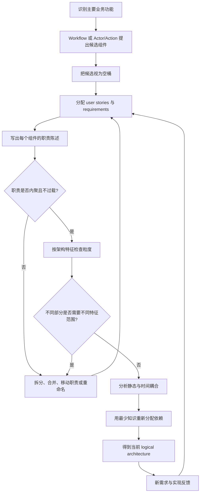
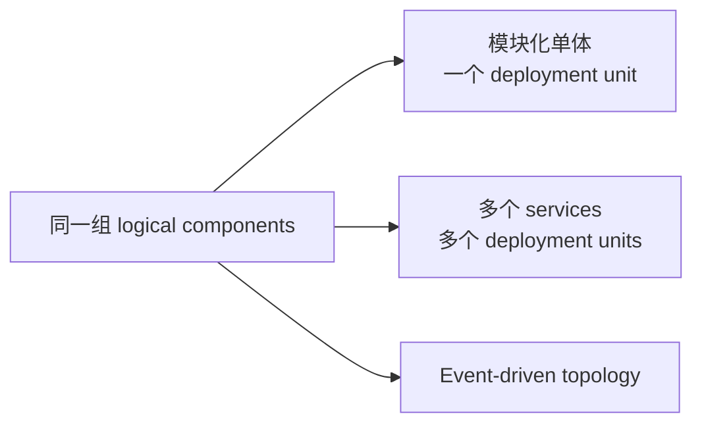
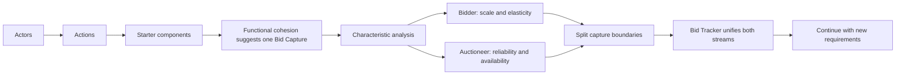
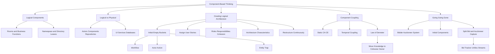

> 对应原章：8. Component-Based Thinking.md
> 第 3 章把模块定义为相关代码的集合，第 4 至第 7 章讨论架构特征及其作用范围；本章把这些概念落到系统的业务构建块上：怎样发现 logical components，怎样让代码目录反映业务责任，以及怎样用 cohesion、architecture characteristics 和 coupling 反复修订边界。
> 本笔记严格沿原章顺序展开。原章没有计算型算法；文中的有向图公式、Python 耦合算例、检查清单和伪代码是教学化表达。Logical component、physical service、bounded context 和 architecture quantum 经常重叠，但不是同义词，不能按目录、实体表或部署框数量机械互换。

## 0. 本章要回答的核心问题

1. 什么是 component-based thinking，为什么架构师主要在组件层而非类层“看见”系统？
2. 房屋房间类比怎样解释组件，又在哪些方面不能照搬？
3. Logical component 与第 3 章的 module 是什么关系？
4. 为什么代码目录或 namespace 的叶节点通常代表组件，上层节点代表 domain/subdomain？
5. Logical architecture 与 physical architecture 分别表达什么，为什么不应跳过前者？
6. Actor、repository、UI、service 和 database 在两类图中的语义有何不同？
7. 为什么 logical architecture 通常不依赖单体、微服务或事件驱动等物理风格？
8. 创建 logical architecture 为什么必须是持续 feedback loop？
9. 初始组件为什么只是 empty buckets，而不是一次设计完成的稳定边界？
10. Workflow approach 如何从主要 happy path 提出候选组件？
11. Actor/Action approach 为什么适合多角色系统，system 本身为何也是 actor？
12. 为什么多个步骤或动作可以落入同一个组件，而非“一动作一组件”？
13. 什么是 Entity Trap，`Manager`、`Controller`、`Processor` 等名称为什么是警报而不是绝对错误？
14. 纯 CRUD 系统为什么可能更适合框架或 low-code，而不需要复杂架构？
15. 怎样把 user stories 分配到候选组件，并在没有合适归属时创建新组件？
16. Customer Notification 案例为什么不能把邮件代码复制到三个组件？
17. 怎样用职责陈述中的 `and`、`also`、`in addition` 等词发现组件做得太多？
18. Order Placement 为什么需要拆出 Payment Processing、Inventory Management 和 Customer Notification？
19. Architecture characteristics 怎样改写纯功能视角下看似合理的组件边界？
20. 为什么组件重构贯穿新建和维护系统的整个生命周期？
21. 两个组件没有直接通信时，为什么仍可能耦合？
22. Afferent coupling $C_A$ 与 efferent coupling $C_E$ 怎样从有向依赖图计算？
23. 本章语境中的 static coupling 与第 7 章更广义的静态“布线”怎样对应？
24. Temporal coupling 为什么难以通过静态工具发现？
25. Law of Demeter/Principle of Least Knowledge 限制的是责任还是知识？
26. 为什么在 Order Placement 与 Inventory Management 之间增加转发组件不能降低有效耦合？
27. Demeter 重构为什么可能降低一个组件的 $C_E$，却不降低系统总耦合？
28. Going, Going, Gone 如何用 Actor/Action 得到初始组件？
29. 为什么 bidder 与 auctioneer 的 bid capture 在功能上相似，却因架构特征差异而拆分？
30. Bid Tracker 为什么成为两个不同信息流的汇合点？
31. 为什么图 8-17 仍只是起点，不是唯一或最终设计？
32. 怎样把本章方法转化为一套可重复、可验证的组件发现流程？

本章的论证主线如下：



一句话概括：**Logical component 不是从数据实体直接生成的盒子，而是围绕业务动作和工作流提出、由用户故事填充、以职责内聚和架构特征校正、再通过耦合分析持续重构的代码责任边界。**

---

## 1. 开篇：什么是 Component-Based Thinking

第 3 章把 module 作为相关代码的一般分组。本章进一步关注模块化在架构层面的表现：logical components，即系统的主要构建块。

Component-based thinking 是把系统看成一组彼此协作、共同完成业务功能的逻辑组件。架构师在这个层次观察：

- 业务能力由哪些组件承担；
- 每个组件知道什么、负责什么；
- 组件怎样交换信息；
- 变化会传播到哪里；
- 哪些能力应保持同一边界，哪些应拆开；
- 逻辑边界怎样约束代码组织。

### 1.1 为什么不是先看类

类和函数太细，无法直接说明系统的整体行为。一个支付能力可能包含：

- API 输入；
- 领域规则；
- 第三方网关适配；
- 状态转换；
- 错误与补偿；
- 测试和配置。

架构师首先需要看见“Payment Processing”这一业务责任，再由开发者在边界内设计类和函数。组件层连接业务语言与代码结构。

### 1.2 本章的三个分析轴

| 分析轴 | 核心问题 | 主要风险 |
| --- | --- | --- |
| Component identification | 候选业务构建块是什么？ | 遗漏责任或陷入实体分组 |
| Cohesion/granularity | 每个组件内部是否统一、大小是否适当？ | 过粗成为杂物箱，过细增加调用 |
| Coupling | 组件互相知道和依赖多少？ | 修改传播、测试与部署风险 |

三个轴必须一起迭代。仅追求低耦合可能把完整工作流拆得支离破碎；仅追求内聚可能形成过大组件；仅按业务名称分组又可能忽略性能和可用性范围。

---

## 2. Defining Logical Components：定义逻辑组件

### 2.1 房屋房间类比

典型住宅由厨房、卧室、卫生间、客厅、办公室等房间组成，每个房间服务不同目的。它们是房屋的构建块。


软件系统也由主要功能构成，例如：

- Inventory Management；
- Order Shipment；
- Payment Processing。

每个组件包含实现该业务功能的源代码，组件共同组成系统。


### 2.2 类比的适用边界

房间有固定物理墙体，logical component 首先是代码和责任的逻辑边界：

- 可以在同一进程、同一仓库和同一数据库中；
- 可以随新需求拆分或合并；
- 不自动等于一个 service 或 deployment unit；
- 边界由职责、特征和耦合证明，而非由绘图框证明。

类比用于理解“不同目的的构建块”，不能用来推导物理部署。

### 2.3 Logical component 的工作定义

可以把逻辑组件理解为：

> 对实现某个主要业务功能、具有相对统一责任的一组源代码进行命名和边界化。

一个有效组件应至少让团队回答：

1. 它完成什么业务目的？
2. 哪些 user stories 属于它？
3. 哪些代码位于边界内部？
4. 它向外暴露什么能力？
5. 它依赖谁，谁依赖它？
6. 哪类变化应局限在内部？

### 2.4 组件如何映射到代码

Logical component 通常由 namespace 或 directory structure 表现：

- 叶节点包含实现特定功能的源代码，通常代表组件；
- 上层目录或命名空间表达 domain 与 subdomain；
- 路径本身向开发团队传达责任和边界。

原书例子：

```text
order_entry/ordering/payment
    -> Payment Processing

order_entry/processing/fulfillment
    -> Order Fulfillment
```


### 2.5 目录只是表现，不是证明

把代码移入 `payment/` 不会自动产生内聚。如果目录同时包含订单校验、库存扣减和邮件模板，它仍然职责混乱。

反过来，一个组件也可能因语言、生成代码或多模块构建而跨越多个物理目录。应检查语义和依赖，而不是只按文件夹计数。

### 2.6 Module、Component、Service 与 Quantum

| 概念 | 主要关注 | 是否物理部署边界 |
| --- | --- | --- |
| Module | 相关代码的一般分组 | 否 |
| Logical component | 架构层面的业务功能与代码责任 | 否 |
| Service | 可调用或可部署的运行构件 | 通常是，但取决于语境 |
| Bounded context | 领域模型与语言的一致范围 | 否，常影响服务边界 |
| Architecture quantum | 独立运行且拥有一组架构特征的最小范围 | 强调部署、数据和运行整体 |

一种可能映射是多个 logical components 位于一个单体；也可能一个组件由多个物理服务共同实现。先定义逻辑责任，再决定物理映射，能避免技术拓扑反过来支配业务边界。

---

## 3. Logical Versus Physical Architecture：逻辑架构与物理架构

### 3.1 Logical architecture

Logical architecture 包含：

- 系统的 logical components；
- 组件之间的交互；
- 与系统交互的 actors；
- 必要时用 repository 表示数据在哪里被使用或传递。

这里的 repository 是用于说明数据在哪里被使用或传递的逻辑数据存储抽象，不是表示流动的箭头，也不是具体 database 产品。


逻辑图通常不显示：

- 用户界面的物理实现；
- 数据库实例；
- 服务进程；
- 容器、节点和网络；
- 具体架构风格部署拓扑。

它回答“系统做什么、功能如何分界、逻辑部分如何协作”。

### 3.2 Physical architecture

Physical architecture 包含运行和部署构件，例如：

- services；
- user interfaces；
- databases；
- 消息基础设施；
- 进程、容器和节点。


物理架构通常接近 Part II 中某种 style，例如：

- layered architecture；
- microservices；
- event-driven architecture。

### 3.3 为什么不能直接从物理架构开始

许多架构师跳过 logical architecture，直接画服务、数据库和队列。原章反对这种做法，原因包括：

1. **业务功能不可见**：Payment Processing 可能分散在多个服务中，图上难以看出完整责任；
2. **代码组织缺少指导**：团队知道部署几个服务，却不知道服务内部怎样按业务组织；
3. **容易技术先行**：先画 Kafka、数据库和 API，再把领域行为塞入；
4. **边界无法解释**：服务为什么这样切，只剩技术偏好；
5. **形成无结构架构**：代码难维护、测试和部署。

### 3.4 逻辑独立于物理是什么意思

逻辑独立不是说两者无关，而是设计顺序和关注点不同。

同一 logical architecture 可以映射为：



创建逻辑图时，团队可能尚未决定：

- 所有组件放入一个单体；
- 每个组件成为服务；
- 多个组件组合成服务；
- 使用哪种 architecture style。

后续 architecture characteristics、quantum scope、团队和运维成本会影响映射。

### 3.5 两类图应如何配合

| 逻辑问题 | 物理问题 |
| --- | --- |
| 谁负责订单校验？ | 代码运行在哪个服务？ |
| Payment 与 Fulfillment 怎样协作？ | 同步 API、消息还是进程内调用？ |
| 哪些故事属于 Notification？ | Notification 独立部署还是模块？ |
| 信息由哪些组件使用？ | 存在哪个数据库或 topic？ |

逻辑图保持业务可理解性，物理图验证运行可行性。两者应能互相追踪，但不要求一框一框对应。

---

## 4. Creating a Logical Architecture：创建逻辑架构

Logical architecture 不是一次绘图产物，而是持续识别和重构组件。


### 4.1 完整反馈循环

原章流程包含：

1. Identify initial components；
2. Assign requirements/user stories；
3. Analyze roles and responsibilities；
4. Analyze architecture characteristics；
5. Restructure components；
6. 继续接收新需求并重复。

```text
function evolve_logical_architecture(domain_evidence):
    components = propose_initial_components(domain_evidence)

    while new_requirements_or_feedback_exist():
        assign_stories_to_components(components)
        inspect_roles_responsibilities_and_cohesion(components)
        inspect_characteristic_scope_and_granularity(components)
        inspect_static_and_temporal_coupling(components)
        components = split_merge_move_or_rename(components)

    return current_best_component_model(components)
```

伪代码不是等待需求“全部完成”后才返回；`current_best` 表示任一时刻都有可用模型，同时承认模型仍会演进。

### 4.2 适用范围

这个 workflow 可用于：

- greenfield 新系统；
- 添加功能；
- 修改已有工作流；
- 单体模块化；
- 拆分或合并服务；
- 维护阶段持续重构。

原书举例：订单系统新增“到店自取”。它需要 scheduling code，并改变 ordering process，可能导致：

- 新建 Pickup Scheduling 组件；
- 修改 Order Placement；
- 调整 Fulfillment 与 Shipment 边界；
- 改写组件职责和依赖。

### 4.3 Identifying Core Components：识别核心组件

新逻辑架构最难的是起步。常见错误是希望第一次就得到完美组件。

但此时团队掌握的信息最少：

- 需求尚未完整；
- 异常路径未知；
- 架构特征阈值可能未验证；
- 实现摩擦尚未出现；
- 业务语言还在形成。

更好的方法是依据 core functionalities 做 best guess，再通过流程修订。

### 4.4 不需要先知道所有需求

初始组件通常可从：

- 用户的 major actions；
- 系统的 major processing workflows；
- 主要角色和业务结果；
- 已知核心领域能力。

开始设计不等于冻结设计。早期模型用于组织后续发现，而非证明需求已完整。

### 4.5 Empty buckets：空桶模型

初始组件像空桶：名称表达预计角色，但尚未分配 user stories，因此只是假设性占位符。


空桶思维解决两个心理问题：

- 允许团队尽早提出结构；
- 防止团队因已经画框而把边界视为不可更改。

组件名应说明 proposed role/responsibility。`Order Placement` 比 `Order Stuff` 更能指导故事归属。

### 4.6 三种起步方法

原章介绍：

1. Workflow approach：推荐；
2. Actor/Action approach：推荐；
3. Entity Trap：反模式，通常应避免。

前两种从行为出发，第三种从名词/数据实体出发。行为更容易揭示职责和变化原因。

#### 4.6.1 The Workflow approach

Workflow approach 使用用户的主要 happy-path（非错误）流程，或系统主请求处理流。若知道一般流程，就能为关键步骤提出组件。

订单示例：

| 步骤 | 业务动作 | 候选组件 |
| ---: | --- | --- |
| 1 | 浏览商品目录 | `Item Browser` |
| 2 | 下单 | `Order Placement` |
| 3 | 支付 | `Order Payment` |
| 4 | 发送订单详情邮件 | `Customer Notification` |
| 5 | 准备订单 | `Order Fulfillment` |
| 6 | 发货 | `Order Shipment` |
| 7 | 发送已发货邮件 | `Customer Notification` |
| 8 | 跟踪物流 | `Order Tracking` |

##### 为什么步骤不等于组件

第 4 与第 7 步都由 Customer Notification 承担，因为它们共享“向客户发送订单状态通知”的责任。若每一步都建组件，会把统一能力拆成重复薄层。

##### 为什么先建 happy path

Happy path 能快速揭示主要业务能力。错误、取消、补偿和异常流程仍需后续加入，可能推翻边界；起步时不必穷举所有路径。

##### 为什么不要建模所有流程

目标是主要 workflows，剩余部分会随 stories 进入。过早穷举会耗时，并在信息最少时制造虚假确定性。

#### 4.6.2 The Actor/Action approach

Actor/Action 适合多角色系统。步骤是：

1. 找出 actors；
2. 找出每个 actor 的主要 actions；
3. 为 action 分配候选组件；
4. 合并由同一职责承担的多个 actions。

System 本身也是 actor，因为它执行自动功能，例如计费、库存补充和定时任务。

订单系统有三个 actors。

##### Customer actor

| Action | Component |
| --- | --- |
| Search for items | `Item Search` |
| View item details | `Item Details` |
| Place an order | `Order Placement` |
| Cancel an order | `Order Cancel` |
| Register | `Customer Registration` |
| Update customer information | `Customer Profile` |

##### Order packer actor

| Action | Component |
| --- | --- |
| Select box size | `Order Fulfillment` |
| Mark ready for shipment | `Order Fulfillment` |
| Ship order | `Order Shipment` |

##### System actor

| Action | Component |
| --- | --- |
| Adjust inventory | `Inventory Management` |
| Order stock from supplier | `Supplier Ordering` |
| Apply payment | `Order Payment` |

选择箱型和标记待发货都属于 Fulfillment，再次说明 action 与 component 不是一一对应。

##### 与 Workflow 的比较

| 角度 | Workflow | Actor/Action |
| --- | --- | --- |
| 起点 | 端到端主要流程 | 角色及其行为 |
| 优势 | 容易看见顺序和协作 | 容易覆盖多角色与系统自动动作 |
| 风险 | 忽略非主流程角色 | 候选组件可能偏多 |
| 适用 | 主流程清晰 | 角色多、行为差异大 |

Actor/Action 通常生成更多组件，具体取决于 Workflow 选择了多少主要旅程。两种方法可交叉使用：Workflow 验证端到端完整性，Actor/Action 验证角色覆盖。

#### 4.6.3 The Entity Trap：实体陷阱

Entity Trap 从 `Customer`、`Item`、`Order` 等实体直接创建：

- `Customer Manager`；
- `Item Manager`；
- `Order Manager`。

作者强烈反对把它作为默认组件识别法。

##### 问题一：名称模糊

“Order Manager 做什么？”只能回答“管理订单”，没有提供具体职责。相比之下，`Validate Order`、`Order Placement`、`Order Tracking` 都表达清晰动作。

以下后缀是警报：

- Manager；
- Supervisor；
- Controller；
- Handler；
- Engine；
- Processor。

它们不是绝对禁词。例如 MVC Controller 有明确技术语义；问题在于名称是否掩盖业务责任。

##### 问题二：成为 dumping ground

所有与 Order 有关的功能都会进入 Order Manager：

- validation；
- placement；
- history；
- fulfillment；
- shipment；
- tracking。

它会像 kitchen-sink utility class，一切“相关”代码都可塞入，边界失去筛选能力。

##### 问题三：粒度过粗、失去目的

过粗组件：

- 难维护；
- 难测试；
- 难部署；
- 可靠性降低；
- 多团队修改冲突；
- 无法按局部特征独立扩展。


##### CRUD 例外

若系统确实只对实体执行 create/read/update/delete，没有复杂工作流和差异化架构特征，那么可能不需要精心设计架构，而适合：

- CRUD framework；
- code generator；
- no-code/low-code environment。

这不是说 CRUD 系统永远无需安全、审计或部署设计，而是不要为简单数据维护凭空制造复杂业务组件。

### 4.7 Assigning User Stories to Components：把用户故事分配给组件

下一步用 stories/requirements 填充空桶。需求不会一次完整出现，因此分配本身也是迭代过程。


#### 4.7.1 三个用户故事

##### Customer #1

希望订单经过校验，确保所有内容完整、正确。

##### Order preparer

希望知道应使用什么尺寸箱子，以最高效地打包。

##### Customer #2

希望订单状态每次变化时收到邮件，持续知道订单状态。

已有组件：

- `Order Placement`；
- `Order Fulfillment`；
- `Order Shipment`；
- `Inventory Management`。

#### 4.7.2 前两个故事的自然归属

```text
Validate order
    -> Order Placement

Determine box size
    -> Order Fulfillment
```

理由不是组件名“看起来像”，而是故事属于其业务责任：下单入口负责接受有效订单；履约负责准备和包装。

#### 4.7.3 Email story 暴露缺失组件

邮件会在 placed、ready for shipment、shipped 等多个状态发生。可以让 Placement、Fulfillment、Shipment 各自发送，但实现代码必须落入具体 namespace：

- 复制邮件代码会产生重复；
- 模板、通道和重试会散落；
- 通知策略变化需要修改三个边界；
- 各组件承担不属于自身的通信细节。

因此创建：

```text
Email customer
    -> Customer Notification (new)
```

原三个组件与 Notification 通信，告诉它何时发送。


#### 4.7.4 新组件不是“消除一切重复”的机械结果

若三处只各有一行完全稳定调用，抽出远程服务可能代价更高。逻辑组件首先可以是同一部署单元内的 namespace。应比较：

- 通知是否有统一业务责任；
- 是否会扩展短信、推送、偏好和模板；
- 是否需要集中重试和审计；
- 抽出后调用是否合理；
- 是否只是偶然代码相似。

### 4.8 Analyzing Roles and Responsibilities：分析角色和职责

分配故事后，架构师检查：

- Stories 是否真的属于该组件；
- 组件是否做得太多；
- Operations 如何、以及在多大程度上彼此相关；
- 责任陈述能否简洁说明。

这就是 cohesion 分析。

#### 4.8.1 Order Placement 的过载责任

原章假设它承担：

1. 校验订单字段；
2. 显示购物车描述、数量和价格；
3. 确定配送地址；
4. 收集支付信息；
5. 生成唯一订单 ID；
6. 应用支付；
7. 调整库存；
8. 发送订单摘要邮件。

这些动作都“与下单有关”，却不是同一职责。支付、库存和通知有各自变化原因、规则和架构特征。

#### 4.8.2 职责陈述的语言信号

写一段话描述组件职责。若不断出现：

- and；
- also；
- in addition；
- as well as；
- 过多逗号；

组件可能承担太多责任。

这个方法是 heuristic，不是语法定理。一个内聚流程也会使用“并且”；真正要检查的是连接词两侧是否有不同变化原因和外部依赖。

#### 4.8.3 Namespace 的现实含义

若所有责任都放入：

```text
com/app/order/placement
com.app.order.placement
```

一个目录将包含校验、UI 数据、地址、支付、库存和邮件大量代码。目录无法再让开发者预测在哪里修改，也会增加多人冲突。

#### 4.8.4 拆分结果

##### Order Placement

- 校验订单；
- 显示有效购物车；
- 确定正确配送地址；
- 收集支付信息；
- 生成唯一订单 ID。

##### Payment Processing

- 应用支付。

##### Inventory Management

- 调整所订商品的库存数量。

##### Customer Notification

- 向客户发送订单摘要。

拆分让每个组件角色更清楚，也让支付、安全、库存一致性和通知可靠性可独立分析。

#### 4.8.5 收集支付信息与应用支付为何可分开

Placement 负责下单交互，可能收集或接收支付 token；Payment Processing 负责与支付系统交互并应用付款。边界应避免让 Placement 掌握网关协议、重试和支付状态细节。

若支付必须在订单创建的同一事务中强一致完成，拆分仍需明确协调协议，不能靠移动目录解决一致性。

### 4.9 Analyzing Architectural Characteristics：分析架构特征

最终分析步骤是把第 4 至第 7 章得到的特征作用到组件粒度。

可能影响大小的特征包括：

- scalability；
- reliability；
- availability；
- fault tolerance；
- elasticity；
- agility。

#### 4.9.1 为什么更小可能更有利

拆分大组件可能带来：

- 易维护和易测试，支持 agility；
- 热点功能独立 scalability/elasticity；
- 故障隔离，提高 fault tolerance；
- 变化和部署范围缩小。

但不是越小越好。拆分还会增加：

- 组件调用；
- 契约和映射；
- 事务协调；
- 认知与治理成本；
- 若物理分布则增加网络失败。

#### 4.9.2 同一功能类别也可能需要拆分

若两个用户输入路径功能相似，但：

- 一个支持数百并发用户；
- 另一个只支持少数内部用户；

它们需要的 scalability、availability 和 security 可能不同。纯功能视角会把“用户交互”放进一个组件，特征范围则可能要求细分。

#### 4.9.3 与 Architecture Quantum 的关系

Logical component 是职责候选；architecture quantum 是独立运行和特征范围。分析顺序可理解为：

```text
业务动作 -> logical components
组件职责 + 特征差异 -> 调整逻辑粒度
组件 + 数据 + 部署/耦合 -> candidate quanta/services
```

不同特征可以促使逻辑组件拆分，但并不自动要求每个组件独立部署。

#### 4.9.4 为什么通常先识别特征

原章明确指出，应先识别系统最重要的 architecture characteristics，再建立 logical architecture，使这些特征从一开始就参与组件粒度判断。组件模型建立后仍会随用户故事、实现反馈和特征变化持续迭代，但不能把关键特征留到初始逻辑架构完成之后才补做。

### 4.10 Restructuring Components：重构组件

反馈是软件设计核心。架构师必须与 developers 协作，持续迭代组件。

原因：

1. 不可能预见所有发现与 edge cases；
2. 实现会暴露依赖、数据和性能现实；
3. 团队逐渐理解行为应放在哪里；
4. 新需求改变职责；
5. 架构特征及其优先级会变化。

重构动作包括：

- split：组件责任或特征范围过多；
- merge：组件总是共同变化、边界增加无效调用；
- move：故事或类落在错误责任中；
- rename：名称无法解释目的；
- introduce：新故事没有自然归属；
- retire：组件不再有独立责任。

### 4.11 重构何时停止

反馈循环“永不停止”不等于每天重画系统。当前版本达到以下条件即可交付：

- 主要 stories 有清晰归属；
- 职责内聚且可解释；
- 关键特征得到支持；
- 依赖方向可管理；
- 团队知道代码放在哪里；
- 已知风险和未来触发器被记录。

维护阶段出现新证据时再继续。

---

## 5. Component Coupling：组件耦合

当组件互相通信，或一个组件变化可能影响另一个时，它们发生 coupling。


耦合越高，系统通常越难：

- maintain；
- test；
- deploy；
- 理解变化影响；
- 隔离故障。

### 5.1 通信不是耦合的唯一证据

两个组件可能没有直接调用，却因为：

- 共享数据库 schema；
- 共享消息格式；
- 同时依赖一个内部库；
- 必须按同一事务或时间变化；
- 一个组件改变了另一个依赖的业务语义；

而耦合。判断核心仍是：改变一方是否可能迫使另一方改变或失败。

### 5.2 Static Coupling：静态耦合

本章在组件通信语境中，把同步、方向明确的组件依赖作为 static coupling 进行 CA/CE 分析。第 7 章采用更宽定义，把共享数据库和部署“布线”也算 static coupling。二者并不冲突：本节度量的是可画成有向边的直接依赖子集。

设有向边：

$$
A\rightarrow B
$$

表示 A 依赖 B，则：

$$
C_A(B)=indegree(B)
$$

$$
C_E(A)=outdegree(A)
$$

同一分析中要固定“边”的定义：按组件计一次，而非按方法调用次数重复计数。

### 5.3 Afferent Coupling：传入耦合

Afferent coupling 又称：

- incoming coupling；
- fan-in coupling；
- 通常记为 $C_A$。

它表示多少其他组件依赖目标组件。

Order Placement 与 Order Shipment 都依赖 Customer Notification：

$$
C_A(CustomerNotification)=2
$$


高 $C_A$ 表示变化潜在影响面大，不自动表示设计坏。稳定公共能力本来可能被广泛使用，但其契约应谨慎演进。

### 5.4 Efferent Coupling：传出耦合

Efferent coupling 又称：

- outgoing coupling；
- fan-out coupling；
- 通常记为 $C_E$。

它表示目标组件依赖多少其他组件。

Order Placement 依赖 Order Fulfillment：

$$
C_E(OrderPlacement)=1
$$


高 $C_E$ 表示组件知道和协调的外部能力较多，修改和测试所需替身可能增加；仍需看依赖是否属于其合理职责。

### 5.5 CA 与 CE 的关系

每条内部有向依赖同时：

- 为源组件贡献一个 $C_E$；
- 为目标组件贡献一个 $C_A$。

因此，在只统计同一闭合组件集合的内部边时：

$$
\sum_v C_A(v)=\sum_v C_E(v)=|E|
$$

若工具包含外部库或只截取部分图，两边总和可能不相等，必须说明范围。

### 5.6 Temporal Coupling：时间耦合

Temporal coupling 描述非静态依赖，通常基于 timing 或 transaction。

例：处理订单时必须先执行 Order Placement，之后才能执行 Order Shipment。二者即使没有直接代码 import，也依赖正确执行顺序。

时间耦合还可能包括：

- A 必须在 B 之前；
- A 与 B 必须处于同一事务；
- B 必须在 A 后某时间窗口完成；
- 两个事件不能并发；
- 某状态存在时才允许调用。

### 5.7 为什么 Temporal Coupling 难发现

静态工具可扫描依赖图，却常看不到：

- 数据库状态隐含顺序；
- 消息到达时序；
- 跨服务事务；
- 配置和调度；
- 人工流程；
- 失败后补偿要求。

它通常从：

- design documents；
- sequence diagrams；
- tests；
- production errors；
- tracing；
- incident analysis；

中发现。

### 5.8 Static 与 Temporal Coupling 的组合

| 场景 | Static | Temporal | 风险 |
| --- | --- | --- | --- |
| A 直接同步调用 B | 有 | 通常有 | 代码与时间都绑定 |
| A 发布事件，B 稍后消费 | 契约耦合 | 时间耦合较弱 | 最终一致、顺序与重复 |
| A、B 共享数据库但不调用 | 共享 schema 静态耦合 | 可能有事务耦合 | 隐藏传播 |
| 两个批任务按时间先后 | 可能无直接代码边 | 强 | 静态工具漏检 |

---

## 6. The Law of Demeter：迪米特法则

松耦合通常提高 maintainability、testability、deployability 和 reliability，因为变化影响更少组件。

Law of Demeter 又称 Principle of Least Knowledge：

> 一个组件或服务应该只对其他组件或服务拥有有限知识。

### 6.1 Demeter 神话类比

希腊神话中的 Demeter 为世界提供谷物，却不知道人们拿谷物喂牲畜、做面包或用于其他用途。她提供能力，不协调所有下游用途，因此与其余世界解耦。

类比强调：组件应完成自己的责任，并让更接近后续规则的组件掌握后续知识。

### 6.2 重构前：Order Placement 知道太多

接受订单后，Order Placement：

1. 告诉 Inventory Management 扣减库存；
2. 若库存过低，告诉 Supplier Ordering 补货；
3. 告诉 Item Pricing 因低库存调整价格；
4. 告诉 Email Notification 发送订单详情。


Order Placement 没有亲自执行这些动作，却知道它们必须发生。Responsibility 已分开，knowledge 仍集中，所以依然高耦合。

### 6.3 为什么增加一个转发组件无效

若在 Order Placement 与 Inventory Management 之间加一个组件，仅转发“扣减库存”：

- Order Placement 仍然知道库存必须扣减；
- 仍有一个向外依赖；
- 只是增加间接层；
- $C_E$ 没有减少。

降低耦合需要移动业务知识，而不是插入 pass-through abstraction。

### 6.4 哪些知识应移到 Inventory Management

Inventory Management 最接近库存状态，因此应知道：

- 库存扣减后是否低于阈值；
- 何时触发 Supplier Ordering；
- 何时通知 Item Pricing 调整价格。

Order Placement 只需要：

- 请求库存扣减；
- 请求订单通知。


### 6.5 重构前后的耦合计算

按图中四条依赖建模：

```python
from collections import Counter


def coupling(edges):
    afferent = Counter(target for _, target in edges)
    efferent = Counter(source for source, _ in edges)
    nodes = sorted({node for edge in edges for node in edge})
    return {
        node: (afferent[node], efferent[node])
        for node in nodes
    }


before = {
    ("placement", "inventory"),
    ("placement", "supplier"),
    ("placement", "pricing"),
    ("placement", "notification"),
}

after = {
    ("placement", "inventory"),
    ("placement", "notification"),
    ("inventory", "supplier"),
    ("inventory", "pricing"),
}

print(f"before_placement_CE={coupling(before)['placement'][1]}")
print(f"after_placement_CE={coupling(after)['placement'][1]}")
print(f"after_inventory_CE={coupling(after)['inventory'][1]}")
print(f"edge_count_before={len(before)}")
print(f"edge_count_after={len(after)}")
```

输出：

```text
before_placement_CE=4
after_placement_CE=2
after_inventory_CE=2
edge_count_before=4
edge_count_after=4
```

代码验证原章结论：Placement 的传出耦合下降，Inventory 的传出耦合上升，系统边数未变。

### 6.6 Demeter 是重新分配，不必然减少总耦合

应用法则后：

- Order Placement 更容易理解和测试；
- Inventory Management 获得与自身状态一致的知识；
- 总依赖数可能不变；
- 耦合被移动到更有内聚理由的位置。

目标不是让每个节点 degree 最小，而是让知识位于最能拥有它的职责边界。

### 6.7 何时重新分配反而有害

若 Inventory Management 被迫了解不属于库存的营销、邮件和财务细节，它会成为新的 Manager 陷阱。应问：

- 规则是否直接由库存状态驱动？
- Inventory 是事实所有者，还是只是技术存储？
- 发布领域事件是否比直接调用更合适？
- 新依赖是否影响不同架构特征范围？

Law of Demeter 不是“把所有下游调用推给第一个依赖”，而是最小化无关知识。

---

## 7. Case Study: Going, Going, Gone—Discovering Components：发现组件案例

若没有特殊约束，需要通用组件分解，Actor/Action 是合适起点。

### 7.1 三个主要角色

Going, Going, Gone（GGG）有：

- bidder；
- auctioneer；
- system。

### 7.2 角色与动作

#### Bidder

- View live video stream；
- View live bid stream；
- Place a bid。

#### Auctioneer

- Enter live bids into system；
- Receive online bids；
- Mark item as sold。

#### System

- Start auction；
- Make payment；
- Track bidder activity。

### 7.3 初始组件

Actor/action 映射产生 starter components：


#### Video Streamer

向用户直播拍卖视频。

#### Bid Streamer

向用户实时展示报价。Video Streamer 与 Bid Streamer 都给 bidder 提供 read-only view。

#### Bid Capture

捕获 auctioneer 和 bidders 的报价。

#### Bid Tracker

跟踪所有报价，作为 system of record。

#### Auction Session

启动拍卖；某件物品结束且 bidder 获胜后，触发 payment 和 resolution，包括通知下一件拍品。

#### Payment

第三方信用卡支付处理器。

这些组件可能协作和共享信息。初始图不是按实体 `Bid Manager`、`Auction Manager` 分组，而是按动作和职责命名。

### 7.4 功能视角为何先得到一个 Bid Capture

Auctioneer 与 bidder 提交的都是 bid，捕获和基本处理在功能上相似，因此先合并合理。若只看 domain action，一个组件具有内聚性。

### 7.5 Architecture characteristics 改写边界

进一步分析发现两种入口要求不同。

#### Bidder capture

- bidder 可能数千；
- 需要高 scalability；
- 开拍等时段需要 elasticity；
- 单个 bidder 断线不理想，但影响局部。

#### Auctioneer capture

- 只有一个或少量 auctioneer 流；
- 不需要相同规模扩展；
- 更强调 reliability，连接不能掉；
- 更强调 availability，主持人无法输入会让整场拍卖停摆。

对 bidder 掉线会损失一位参与者；auctioneer 掉线可能使所有参与者无法继续。这是 failure impact 的差异。

### 7.6 拆分 Bid Capture 与 Auctioneer Capture

为了支持同类特征的不同等级，架构师拆成：

- `Bid Capture`：多个 bidder streams；
- `Auctioneer Capture`：单一、关键 auctioneer stream。

然后修改信息链接：

- Auctioneer Capture -> Bid Streamer，让在线 bidder 看到现场报价；
- Auctioneer Capture -> Bid Tracker，统一跟踪；
- Bid Capture -> Bid Tracker，提交线上报价。

Bid Tracker 汇合两种不同信息流：一个 auctioneer 流和多个 bidder 流。


### 7.7 为什么不是复制两个完整竞价系统

拆分入口不等于复制 tracking、streaming 和 auction session：

- 两个入口具有不同架构特征；
- Bid Tracker 仍统一 system of record；
- 共同结果通过明确组件汇合；
- 避免将相同记录规则复制两份。

边界沿差异切开，沿共同责任复用。

### 7.8 这仍不是最终设计

尚未发现的需求包括：

- 新账户如何注册；
- payment functions 如何管理；
- 欺诈、退款与争议；
- 拍卖取消与恢复；
- 视频和竞价同步；
- 身份与权限；
- 历史报表。

这些 stories 可能新增组件、移动责任或改变特征范围。

### 7.9 没有 One True Design

图 8-17 只是一个可行起点：

- 其他团队可能把 streaming 合并；
- 可能用事件驱动协调 Bid Tracker；
- 可能按 auction session 分区；
- 可能因延迟目标改变入口设计。

软件系统通常有多个充分设计。架构师不应寻找 “one true design”，而要客观比较 trade-offs，选择 least worst 组合。

### 7.10 GGG 案例的完整推理链



---

## 8. 容易混淆的概念与常见误区

### 8.1 “组件就是一组类”

错误之处：一组类只是结构事实，未说明业务目的和责任。

正确理解：组件是实现主要业务功能、由命名边界组织的相关代码。

### 8.2 “目录叶节点天然是好组件”

错误之处：目录可以装入无关代码，也可能不受依赖规则保护。

正确理解：叶节点是常见表现，仍需故事、职责、特征和耦合证明。

### 8.3 “房屋组件类比证明一个组件应独立部署”

错误之处：房间是物理边界，logical component 不是。

正确理解：类比只表达构建块具有不同用途。

### 8.4 “Logical component、service 和 quantum 一一对应”

错误之处：职责、部署和特征范围是不同分析维度。

正确理解：先建立逻辑模型，再结合数据和运行约束映射物理边界。

### 8.5 “Logical architecture 应显示数据库和容器”

错误之处：这些通常属于 physical architecture；逻辑 repository 也不是物理数据库。

正确理解：逻辑图强调功能和信息协作。

### 8.6 “先画 Microservices 再决定业务放哪里”

错误之处：物理拓扑不能告诉团队功能如何组织，容易形成无结构服务。

正确理解：先让 logical architecture 表达责任，再选择物理风格。

### 8.7 “第一次组件设计必须正确”

错误之处：此时信息最少，过度追求完美会延迟反馈。

正确理解：提出 empty buckets，尽快用 stories 和实现证据修订。

### 8.8 “必须收集全部需求才能开始”

错误之处：major workflows 和 actors 已足以形成可讨论候选。

正确理解：开始不等于冻结，遗漏会进入反馈循环。

### 8.9 “Workflow 每一步都应该是组件”

错误之处：多个步骤可能由同一内聚责任承担，例如两次客户通知。

正确理解：步骤提供候选，职责决定合并。

### 8.10 “Actor/Action 中每个 action 都应单独成组件”

错误之处：选箱和标记待发货都属于 Order Fulfillment。

正确理解：按目的和共同变化聚合 actions。

### 8.11 “System 不是 actor”

错误之处：自动计费、补货和调度也是系统行为来源。

正确理解：Actor 是发起 action 的角色，不只是真人。

### 8.12 “所有带 Manager 后缀的组件都错误”

错误之处：某些模式中名称有明确语义。

正确理解：后缀是检查责任是否模糊的信号，不是字符串禁令。

### 8.13 “按实体分组件最符合领域模型”

错误之处：实体横跨验证、履约、历史和跟踪等不同变化原因。

正确理解：优先从行为和 workflow 形成职责；真正简单 CRUD 可用框架。

### 8.14 “发现重复邮件代码就必须建独立微服务”

错误之处：逻辑组件可留在同一部署单元，远程化会增加成本。

正确理解：先建立 Notification 责任边界，再按特征决定物理映射。

### 8.15 “组件职责句出现 and 就必须拆分”

错误之处：完整内聚流程也可能包含多个步骤。

正确理解：连接词提示检查不同变化原因，不是自动规则。

### 8.16 “拆得越小，Agility 越高”

错误之处：过细组件增加契约、调用、事务和认知成本。

正确理解：比较局部变化收益与跨边界协调成本。

### 8.17 “功能相似就一定属于同一组件”

错误之处：GGG 的两个 bid capture 在规模与失败影响上差异很大。

正确理解：functional cohesion 之后还要分析 architecture characteristics。

### 8.18 “组件图完成后不应再改变”

错误之处：stories、边界条件和实现经验持续出现。

正确理解：频繁重构是生命周期正常活动，但应有测试和迁移保护。

### 8.19 “两个组件不直接调用就没有耦合”

错误之处：共享数据、契约、事务和时序都可形成耦合。

正确理解：判断一方变化是否可能破坏另一方。

### 8.20 “高 $C_A$ 或 $C_E$ 自动表示设计坏”

错误之处：稳定公共能力可能有高 $C_A$，协调组件可能合理依赖多个能力。

正确理解：结合职责、稳定性、范围和变化历史解释。

### 8.21 “Temporal coupling 能完全由 import graph 发现”

错误之处：时间、事务和状态顺序常位于运行流程中。

正确理解：结合 sequence diagram、tracing、测试和事故分析。

### 8.22 “Law of Demeter 要求组件完全不知道其他组件”

错误之处：协作必然需要一些知识。

正确理解：限制为完成自身职责所需的最少知识。

### 8.23 “增加中间转发层就能降低耦合”

错误之处：Placement 仍知道库存必须扣减，$C_E$ 不变，间接层反而增加。

正确理解：移动业务知识，而非只移动调用。

### 8.24 “应用 Demeter 会减少系统总依赖数”

错误之处：订单例子边数仍为 4，只是从 Placement 转给 Inventory。

正确理解：目标是让知识落到最内聚的所有者。

### 8.25 “GGG 初始图就是最终设计”

错误之处：账户、支付管理等需求尚未发现。

正确理解：它是可继续迭代的当前最佳起点。

### 8.26 “一个问题只有唯一组件分解”

错误之处：不同特征、团队和物理约束产生不同合理取舍。

正确理解：比较候选并选择 least worst，而非追求 one true design。

---

## 9. 从本章提炼的通用组件发现法

### 第 1 步：明确逻辑视角

暂不决定服务、数据库和队列，先描述业务功能、actors 和主要信息流。

**输出**：领域行为和逻辑交互草图。

### 第 2 步：选择起步方法

主流程清晰时用 Workflow；角色多时用 Actor/Action；两者交叉验证覆盖。

**输出**：带动作依据的 candidate components。

### 第 3 步：把候选视为空桶

用动作/责任命名，明确这只是 best guess，不追求初次完美。

**输出**：可修改的初始组件表。

### 第 4 步：分配 User Stories

逐条给故事找自然所有者；无合适归属时考虑新组件，不在多处复制责任。

**输出**：story-to-component map 和未归属项。

### 第 5 步：写职责陈述

用一小段话描述每个组件，标记过多连接词、不同外部依赖和不同变化原因。

**输出**：cohesion 风险与拆分候选。

### 第 6 步：排除 Entity Trap

检查 Manager/Handler 等模糊组件是否只是按实体收纳所有功能；区分真正 CRUD 系统。

**输出**：动作化、目的明确的名称和边界。

### 第 7 步：叠加架构特征

比较组件内部不同路径对 scalability、availability、security、agility 等要求是否显著不同。

**输出**：因特征范围需要拆分或合并的候选。

### 第 8 步：画静态与时间耦合

计算 $C_A/C_E$，并用 sequence/workflow 标记顺序、事务和状态依赖。

**输出**：依赖图、知识热点和隐藏 temporal coupling。

### 第 9 步：应用 Least Knowledge

将后续规则移到最接近事实的组件，避免 pass-through abstraction，并检查耦合只是减少还是重新分配。

**输出**：更内聚的知识所有权与依赖方向。

### 第 10 步：映射物理架构并持续反馈

结合 quantum、数据、部署和团队约束，把 logical components 映射到单体模块或服务；新证据进入下一轮。

**输出**：可解释、可实现、可继续演进的 logical/physical mapping。

---

## 10. 本章知识结构



整章可以压缩为四层：

1. **表达层**：Logical component 用业务责任组织代码，logical diagram 与 physical topology 分开；
2. **发现层**：Workflow/Actor-Action 提出空桶，stories 逐步填充；
3. **校正层**：职责内聚和架构特征共同决定组件粒度；
4. **协作层**：静态/时间耦合和 Least Knowledge 决定知识与依赖应放在哪里。

---

## 11. 核心结论

1. **Component-based thinking 是在逻辑组件层观察业务结构和交互，而不是从类或服务框开始。**
2. **Logical component 是实现主要业务功能的相关代码边界，通常表现为 namespace 或 directory leaf。**
3. **目录只是边界的表现，不能自动证明业务内聚。**
4. **Logical architecture 展示组件、actors 和逻辑信息交互；physical architecture 展示 UI、services、databases 等运行构件。**
5. **跳过逻辑架构会隐藏功能位置，并让开发团队缺少代码组织指导。**
6. **同一逻辑架构可以映射到单体、服务或事件驱动物理结构。**
7. **组件识别是持续反馈循环：提出候选、分配故事、分析职责、叠加特征、重构。**
8. **初始组件是 empty buckets，只是依据主要功能作出的 best guess。**
9. **Workflow 从主要 happy path 发现组件，Actor/Action 从角色行为发现组件；两者都不要求一步一组件。**
10. **System 也是 actor，因为自动计费、补货等动作同样需要职责所有者。**
11. **Entity Trap 用实体加 Manager 等模糊名称聚集所有相关功能，容易产生过粗 dumping ground。**
12. **真正简单的 entity CRUD 系统可能更适合生成框架或 low-code，而非人为增加架构复杂度。**
13. **User story 无自然归属时，新组件可能正是模型遗漏的业务责任。**
14. **Customer Notification 集中状态邮件责任，避免 Placement、Fulfillment、Shipment 复制代码和知识。**
15. **职责陈述中的大量连接词是过载信号，最终判断仍看变化原因和内聚。**
16. **Order Placement 拆出 Payment、Inventory、Notification 后，每个组件拥有更清楚角色。**
17. **Architecture characteristics 会让功能相似的路径因扩展、可用、可靠或敏捷要求不同而拆分。**
18. **更小组件可以提高局部演进和隔离，但过细会增加契约、事务与认知成本。**
19. **组件边界应在整个产品生命周期内与开发者协作重构，而非新项目一次完成。**
20. **耦合包括通信和变化影响；没有直接调用的组件也可能通过数据、事务或时序耦合。**
21. **$C_A$ 是传入依赖数量，$C_E$ 是传出依赖数量；数字必须结合职责和分析范围解释。**
22. **Temporal coupling 描述顺序、时间和事务依赖，静态工具常无法发现。**
23. **Law of Demeter 限制组件对系统其他部分的知识，而不是禁止必要协作。**
24. **插入转发层不等于降低耦合；必须把业务知识移动到更内聚的所有者。**
25. **Demeter 重构可能只重新分配耦合：Placement 的 $C_E$ 下降，Inventory 的 $C_E$ 上升，总边数不变。**
26. **GGG 的 Actor/Action 初始模型包含 Video/Bid Streamer、Bid Capture/Tracker、Auction Session 和 Payment。**
27. **Bidder 与 auctioneer 的报价功能相似，但前者重 scalability/elasticity，后者重 reliability/availability。**
28. **拆分 Auctioneer Capture 后，Bid Tracker 统一单一主持人流与多个 bidder streams。**
29. **图 8-17 仍缺账户和支付管理等需求，只是可迭代起点。**
30. **组件设计不存在 one true design，应比较多种候选并选择 least worst trade-offs。**

---

## 12. 主动回忆与应用题

以下问题不提供紧邻答案，适合脱离正文作答后再核对推理链。

1. 用自己的项目说明 module、logical component、service、bounded context 和 architecture quantum 的区别。
2. 画一张房屋房间类比图，并写出该类比不能用于推导物理部署的三个原因。
3. 从现有仓库目录树推断 logical architecture，再找两个“目录名看似组件、实际责任混乱”的反例。
4. 对同一系统分别画 logical 与 physical diagram，说明哪些元素只能出现在其中一种图中。
5. 为什么先画微服务可能隐藏支付功能的完整位置？如何从逻辑模型恢复可理解性？
6. 为“到店自取”功能运行一次完整组件反馈循环，列出可能新增、修改和合并的组件。
7. 选择一个订单流程，用 Workflow approach 提出 empty buckets；指出哪些步骤应共享组件。
8. 对同一问题用 Actor/Action 再建一版，比较它为何产生更多或不同组件。
9. 找出系统 actor 的三个自动 actions，并为其分配组件。
10. 将一个 `Order Manager` 拆成动作化组件，解释每个边界的变化原因。
11. 给出一个真正适合 CRUD framework 的系统，以及一个表面 CRUD、实际不能落入 Entity Trap 的系统。
12. 三个组件都需要发送邮件时，什么条件支持建立 Customer Notification，什么条件只需局部代码？
13. 写一段组件职责陈述，用连接词测试法识别至少两个潜在拆分点，再用业务语义复核。
14. 为什么“收集支付信息”可以留在 Placement，而“应用支付”适合 Payment Processing？
15. 给出一个功能上统一、却因 scalability 差异必须拆分的组件案例。
16. 给出一个拆分后远程调用成本大于敏捷收益的反例。
17. 为五个组件画有向依赖图，手工计算每个节点的 $C_A$ 与 $C_E$，验证两者总和等于边数。
18. 设计一个没有直接 import、却通过共享 schema 强耦合的例子。
19. 画一个 Temporal coupling sequence，说明为什么代码依赖扫描无法发现。
20. 重现 Order Placement 的 Demeter 前后图，解释为何增加转发组件无效。
21. 修改 Python 耦合示例，再把 Notification 知识移动到 Inventory；判断这是否符合内聚，还是制造新陷阱。
22. 为什么 Law of Demeter 可以改善局部设计而不减少系统总边数？
23. 从 GGG 三个 actors 和九个 actions 独立推导 starter components，再与图 8-16 比较。
24. 如果 auctioneer 也有数百个并发用户，Bid Capture 是否仍应拆分？列出结论翻转条件。
25. 为 Auctioneer Capture 定义 reliability/availability 场景，为 Bid Capture 定义 scalability/elasticity 场景。
26. 为什么 Bid Tracker 适合统一两个流，而不是让两个 Capture 各自成为 system of record？
27. 新增账户注册、退款和欺诈需求后，推演图 8-17 可能怎样演化。
28. 设计另一套合理 GGG 组件，并与原方案比较至少五项 trade-offs。
29. 不看正文，复述组件发现十步：逻辑视角、起步法、空桶、stories、职责、实体陷阱、特征、耦合、最少知识、物理映射。
