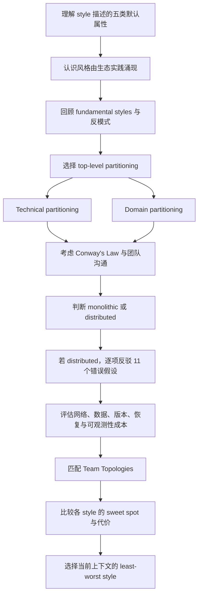
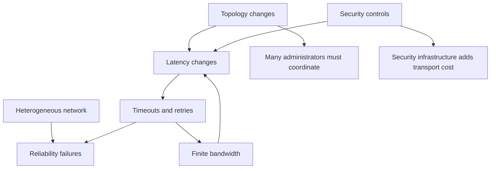
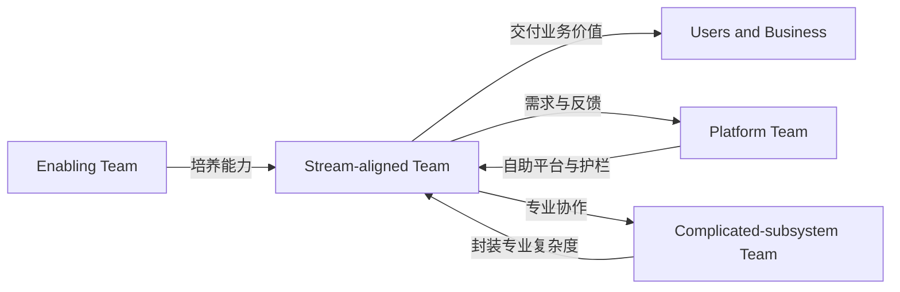
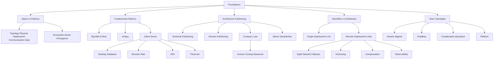

> 对应原章：9. Foundations.md
> 本章是 Part II 架构风格目录的坐标系：先区分 architectural style 与 architecture pattern，再回顾 unitary、client/server 等基础形态；接着比较 technical/domain top-level partitioning；最后用分布式计算的 8 个经典谬误、作者补充的 3 个谬误及 4 类 Team Topologies，建立后续风格共同的代价模型。
> 本笔记严格沿原章顺序展开。原章没有正式算法；文中的风格元组、延迟/带宽公式、Python 算例和选择伪代码是教学化工具。架构风格描述默认拓扑与倾向，不是产品配方；所有公式都依赖明确假设，不能替代生产测量与 trade-off analysis。

## 0. 本章要回答的核心问题

1. Architectural style 与 pattern in architecture 有什么区别，为什么行业常混用？
2. 一个 style 至少压缩了 component topology、physical architecture、deployment、communication 和 data topology 中的哪些信息？
3. 为什么给风格命名能降低沟通成本，却不能替代上下文与具体架构决策？
4. 新架构风格从哪里产生，为什么不存在制定风格的“官方架构委员会”？
5. Microservices 这一名称怎样从 DevOps、开源系统和 DDD 等生态能力中涌现？
6. “Micro” 为什么是标签而非要求服务越小越好？
7. 什么是 Big Ball of Mud，为什么它常由无治理的便利性修改渐进形成？
8. Big Ball of Mud 的全局/重复信息和高耦合怎样让变化进入不可预测的临界点？
9. Unitary architecture 怎样演化到 client/server？
10. Desktop/database、browser/web server、single-page JavaScript 和 three-tier 分别把计算放在哪里？
11. CORBA、DCOM、application server 和 serialization 在三层架构历史中扮演什么角色？
12. 为什么把时代流行架构假设写入语言核心会产生长期兼容成本？
13. Top-level partitioning 为什么是选择架构风格时最重要的早期决定之一？
14. Technical partitioning 与 domain partitioning 分别按什么组织代码？
15. Layered monolith 与 modular monolith 都是单体，为何变化传播和团队协作却不同？
16. Conway’s Law 与 Inverse Conway Maneuver 怎样连接组织沟通和系统结构？
17. 为什么 technical partitioning 易查找技术类别，却会把 CatalogCheckout 业务流程“涂抹”到各层？
18. Silicon Sandwiches 的 domain 与 technical partitioning 各自怎样组织 Common/Local customization？
19. 两种分区方式各自有哪些明确优缺点，为什么没有绝对赢家？
20. Monolithic 与 distributed architecture 的分类依据是什么？
21. 为什么分布式架构在性能、扩展和可用性方面潜力更大，却具有单体没有的一组共同挑战？
22. 八个经典 distributed computing fallacies 分别错误假设了什么？
23. 网络故障为何会让远程调用结果变成“未知”，timeout、retry 和 circuit breaker 分别解决什么？
24. 为什么平均 latency 不足，串行调用和 long-tail latency 怎样累积？
25. 什么是 stamp coupling，500 KB 与 200 bytes 的契约对 2,000 req/s 带宽有何影响？
26. 网络安全、拓扑变化、多管理员、运输成本和异构设备为什么不是纯运维细节？
27. Contract versioning 为什么比增加 `/v2` 复杂得多？
28. Compensating update 本身失败时，分布式事务应怎样思考恢复？
29. 为什么 observability 对 distributed architecture 不是可选附加项？
30. Stream-aligned、enabling、complicated-subsystem 与 platform teams 分别如何管理认知负担和交付流？
31. 怎样用本章坐标比较后续具体风格并选择 least-worst architecture？

本章论证主线如下：



一句话概括：**架构风格是对一组结构默认值的命名压缩；真正的选择必须同时看顶层分区、部署与数据边界、网络现实和团队沟通结构，尤其不能把远程调用误当作“较慢的方法调用”。**

---

## 1. 开篇：进入架构风格前需要哪些共同基础

读者可能急于学习 layered、event-driven、microservices 等具体风格，但若没有统一比较坐标，很容易：

- 只看结构图，不看部署和数据；
- 把 style、pattern 和产品混为一谈；
- 只记优点，不理解分布式共同成本；
- 按流行度选择，而不是按特征与团队；
- 把一个风格名称误当成完整架构。

本章先建立四组基础：

1. style 与 pattern 的概念边界；
2. 历史上反复出现的基础形态；
3. technical/domain top-level partitioning；
4. monolithic/distributed 的物理分界、网络谬误与团队拓扑。

这些基础是后续各风格 trade-off 分析的共同分母。

---

## 2. Styles Versus Patterns：风格与模式

Architectural style 与 architecture pattern 容易混淆，因为二者都给反复出现的解决方案命名。但抽象范围不同。

### 2.1 Architectural style 描述什么

原章列出五类属性。

#### 2.1.1 Component topology

组件和依赖怎样组织。

- Layered architecture 按 presentation、business、service、persistence 等 technical capabilities 分层；
- Modular monolith 按 domains/workflows 划分顶层组件。

它回答“主要构件是什么、允许怎样依赖”。

#### 2.1.2 Physical architecture

风格通常暗示 monolithic 或 distributed：

- modular monolith 通常是一个部署单元及单一数据库；
- 按本书 Part II 对 event-driven architecture style 的分类，它属于分布式架构并涉及分布式参与者和消息通信；更广义的 event-driven programming 也可以完全位于单进程或单体内部。

“通常”与“默认”很重要：具体实现可能混合，但偏离默认会改变风格预期权衡。

#### 2.1.3 Deployment

风格关联部署粒度和频率：

- 单体通常整体部署，并常与单一关系数据库共同演进；
- microservices 等高度敏捷分布式风格需要自动集成、provisioning，有时自动 deployment；
- 分布式单元可以以更快节奏分别发布。

独立部署能力并不由服务框数量自动保证，仍取决于数据库、契约和团队。

#### 2.1.4 Communication style

- 单体组件可做进程内 method/function calls；
- 分布式构件通过 REST、RPC、message queues 等网络协议通信。

通信风格直接影响 latency、failure semantics、事务和耦合。

#### 2.1.5 Data topology

- 单体倾向 monolithic database；
- 分布式架构有时按服务分离数据，是否分离由风格哲学决定；
- 共享数据库会改变独立部署和 architecture quantum。

### 2.2 用一个元组理解 Style

可以教学化表示为：

$$
Style=(T_c,T_p,D,C,T_d)
$$

- $T_c$：component topology；
- $T_p$：physical topology；
- $D$：deployment model；
- $C$：communication style；
- $T_d$：data topology。

它不是原书公式，也不是说所有风格只能由五项定义；其作用是防止只凭一张组件图判断风格。

### 2.3 Style 与 Pattern 的区别

Pattern 是某个上下文中的可复用问题解决方案，通常包含：

- context；
- problem/forces；
- solution；
- consequences。

Architectural style 更专注架构整体 topology 及默认 characteristics。一个 style 内可以使用许多 patterns：

- microservices 中使用 circuit breaker；
- event-driven 中使用 saga 或 dead-letter queue；
- layered architecture 中使用 repository pattern。

原书第 20 章会讨论现代 architecture patterns。

### 2.4 为什么名称有价值

说“microservices”会让有共同背景的人预期：

- 多个独立部署服务；
- 网络通信；
- 较强自动化；
- 围绕领域的边界；
- 常见的数据所有权倾向；
- 扩展和可用收益；
- 分布式复杂度。

名称是一种 information compression。它不回答：

- 服务边界具体在哪里；
- 是否同步或异步；
- 数据怎样一致；
- 为什么值得承担成本；
- 团队能否运营。

### 2.5 常见混淆

| 概念 | 主要回答 | 示例 |
| --- | --- | --- |
| Architecture style | 整体拓扑与默认特征 | Layered, microservices |
| Architecture pattern | 某类上下文问题的架构解法 | Circuit breaker, saga |
| Design pattern | 较局部设计协作 | Strategy, Template Method |
| Technology/product | 实现机制 | Kafka, Kubernetes, PostgreSQL |

采用 Kafka 不自动等于 event-driven style；部署 Kubernetes 不自动等于 microservices。

### 2.6 Where Do Architectural Styles Come From?：架构风格从哪里来

不存在一个在象牙塔开会、决定下一种风格的官方 cabal。新风格从生态变化中涌现：

1. 新 platform/tool/practice 出现；
2. 某架构师发现它可解决长期问题；
3. 与新旧能力组合成可工作的结构；
4. 其他团队复制、改进；
5. 实践足够普遍后，人们为其命名以便讨论。

### 2.7 Microservices 的涌现

Microservices 可行依赖多项成熟条件：

- DevOps 自动化；
- 可靠开源操作系统；
- DDD 对 bounded contexts 的强调；
- 自动部署、监控和基础设施；
- 对大服务与重 orchestration 痛点的反应。

名称 `microservices` 是相对于当时大型服务的标签，不是严格描述，也不是“服务必须尽可能小”的命令。

真正粒度应由：

- 业务边界；
- 架构特征范围；
- 数据所有权；
- 变更和部署独立性；
- 通信与事务成本；

共同决定。

### 2.8 风格会继续演化

生态变化会让：

- 旧风格获得新实现；
- 旧权衡成本变化；
- 混合风格出现；
- 原本昂贵能力变成平台默认；
- 新问题产生新命名。

因此，学习风格应理解 forces 和 trade-offs，而不是只记当前产品栈。

---

## 3. Fundamental Patterns：基础模式

一些基础形态在软件历史中反复出现，因为它们提供组织代码、部署或职责的稳定视角。

Layers 就与软件一样古老：按功能关注分开不同部分，今天仍以多种 style 和 pattern 出现。第 10 章会讨论现代 layered variants。

另一种反复出现的“形态”不是设计，而是缺少设计：Big Ball of Mud。

### 3.1 Big Ball of Mud

Brian Foote 与 Joseph Yoder 在 1997 年 PLoP 论文中定义该 antipattern：结构随意、蔓延、草率，靠临时修补维持；信息在远距离元素间任意共享，最终几乎全局化或重复；整体结构可能从未清晰定义，也可能已侵蚀到无法辨认。

#### 3.1.1 它怎样形成

很少有人有意设计混乱系统。常见渐进路径：


根因常是缺少 code quality 与 structure governance，而不只是开发者能力不足。

#### 3.1.2 小脚本怎样长成泥球

简单脚本可能把 event handlers 直接连到数据库。对短寿命、低风险工具，这可以是合理起点；问题是系统继续增长，边界没有同步演进：

- UI 直接操作数据；
- 业务规则散落；
- 状态全局共享；
- 相同信息重复；
- 修改没有局部范围。

#### 3.1.3 主要后果

- change increasingly difficult；
- deployment 风险高；
- testability 低；
- scalability 和 performance 难以局部优化；
- ripple effects 不可预测；
- 开发者主要时间用于追 bug 及其次生影响，而非新功能。

#### 3.1.4 真实代码可视化

原章中的匿名客户为了尽快交付，在数年间持续开发一个 Java Web 应用；短期速度优先且缺少结构治理，最终累积成下面这张依赖图。这一背景说明泥球通常不是一次错误设计造成，而是长期便利性决策叠加的结果。


图中：

- 圆周每个点是一個 class；
- 每条线是类之间 connection；
- 粗线表示更强连接；
- 工具是已退役 Eclipse 插件 XRay。

网络几乎全连通，使修改任何类的影响难以预测。这是“耦合密度”可视化，不是说红线数量本身即可完整评价架构。

#### 3.1.5 避免与治理

- 给逻辑组件明确责任；
- 限制依赖方向；
- 自动检测循环和越层访问；
- 控制全局状态与共享数据库；
- 持续重构而非等待“大重写”；
- 记录并偿还结构性捷径；
- 让测试与部署反馈足够快。

“不惜一切避免”不表示任何简单脚本都要预建复杂架构，而是随着寿命和规模增长，应有意识增加结构。

### 3.2 Unitary Architecture：单体计算单元的早期形态

最初只有一台计算机，软件在其上运行，软硬件近似一个整体。随着能力需求增长，职责逐步分离：

- mainframe 从单一系统逐渐把 data 分成独立系统；
- 早期 PC 专注单机；
- PC 网络普及后出现 client/server 分布式形态。

今天 unitary architecture 主要存在于 embedded systems 和高度受限环境，例如：

- 微控制器固件；
- 离线设备；
- 严格资源约束控制器。

Unitary 不等于“代码一定混乱”；它描述物理计算和数据未分离。

### 3.3 Client/Server

软件通常随时间增加功能，需要分离关注以维持 performance 和 scale。Client/server 是基础 two-tier style：在 frontend 与 backend 间分配 technical functionality。

不同年代的计算能力产生不同变体。

#### 3.3.1 Desktop and database server

早期 PC 变体：

- Windows 等 rich desktop application 承担 presentation；
- 独立 database server 保存数据并执行更重的数据操作；
- 通过标准网络协议连接。

客户端部署和升级成本高，数据库常承担过多业务逻辑，但当时利用了 PC UI 与服务器算力。

#### 3.3.2 Browser and web server

Web 到来后：

- browser 是更薄客户端；
- web server 处理应用；
- database server 位于后端。

虽然物理上有 browser、web、database 三类构件，很多架构师仍称 two-tier，因为 web/database 同属 operations center 一侧，UI 在用户浏览器一侧。

这说明 “tier” 是部署/信任/计算边界的抽象，不一定按进程数量机械计数。

#### 3.3.3 Single-page JavaScript applications

浏览器和 JavaScript 变强后，rich client 回到 browser：

- UI 状态和交互在客户端；
- 后端提供 API 和数据；
- 形态接近早期 rich desktop/database 变体，但分发通过 Web。

职责在客户端与服务器间摆动，反映平台能力变化；“层”不会消失，只会以新形式出现。

#### 3.3.4 Three-tier

20 世纪 90 年代末流行 three-tier：

1. database tier：工业级数据库；
2. application tier：Java/.NET application server 管理业务能力；
3. frontend tier：生成 HTML，后来越来越多 JavaScript。

CORBA 和 DCOM 更准确地说是 distributed-object middleware/technologies，而不是单一 network-level protocol：CORBA 通常通过 GIOP/IIOP，DCOM 则通过基于 RPC 的机制完成远程对象协作。

今天架构师通常不直接处理当时的 plumbing；其能力进入：

- message queues 等工具；
- event-driven architecture 等 patterns/styles；
- RPC 和服务框架。

##### 3.3.4.1 Three-Tier Architectures, Language Design, and Long-Term Implications

Java 设计时期，三层计算非常流行。C++ 等语言跨网络一致移动对象很麻烦，因此 Java 平台把 serialization 纳入核心 API。

原章称“每个 Java object 都实现一个要求支持 serialization 的接口”，这一表述从 Java 类型系统看并不准确：`java.lang.Object` 并未实现 `java.io.Serializable`，普通类需要显式 opt in，且 `Serializable` 是 marker interface。作者要表达的核心是：Java 核心语言生态长期承担了对象序列化兼容包袱。

#### 3.3.5 把当代假设烘焙进基础设施的代价

当时人们假设 three-tier 会永久主导，内建 serialization 看起来方便；风格退潮后：

- 老序列化格式仍需兼容；
- 新语言特性要考虑历史机制；
- 安全和版本演进更复杂；
- 语言设计者长期承担旧时代决策。

一般教训：

```text
当前流行风格
    != 永久不变的平台事实
```

Favor simple designs 是未来保护策略：减少把短期预测固化为难以移除的基础契约。

---

## 4. Architecture Partitioning：架构分区

组件是通用 containment mechanism，可以按多种方式划分。第一定律说明每种分区都有 trade-offs。

影响最大的选择之一是 top-level partitioning：代码库第一层按什么原则组织。顶层选择会影响：

- 变化传播；
- 团队组织；
- 数据边界；
- 迁移到分布式的难度；
- 哪种 architecture style 自然匹配。

### 4.1 Layered monolith 与 Modular monolith


#### Layered monolith

- 单一 deployment unit；
- 通常单一 database；
- 顶层按 technical layers；
- 第 10 章详述。

#### Modular monolith

- 单一 deployment unit；
- 关联 database；
- 顶层按 domains/workflows；
- 由 Simon Brown 推广；
- 第 11 章详述。

二者物理形态都可为单体，差别在代码 top-level axis。

### 4.2 Technical top-level partitioning

按技术能力组织：

- Presentation；
- Business Rules；
- Service；
- Persistence。


#### 优势

- 同类技术代码集中；
- persistence code 容易查找；
- separation of technical concerns；
- 层间依赖可限制 ripple effects；
- MVC 等熟悉模式使团队容易理解。

#### 默认流行的原因

Layered concept 历史悠久、工具与教育普遍采用，许多组织自然把它作为默认架构。

### 4.3 Domain top-level partitioning

受 Eric Evans DDD 启发，按 domain/workflow 组织：

- CatalogCheckout；
- UpdateInventory；
- ShipToCustomer；
- Reporting；
- Analytics；
- UpdateAccounts。

每个 domain component 内部仍可包含 business rules layer、persistence library 等子结构。`Top-level` 指第一组织轴，非否定内部技术分层。

Microservices 哲学建立在此基础上；modular monolith 也可按领域组织而不物理分布。

### 4.4 Conway’s Law

Melvin Conway 在 20 世纪 60 年代末提出：

> 设计系统的组织，其设计会受限于并复制这些组织的沟通结构。

因果直觉：

1. 团队之间沟通成本较高；
2. 团队内部沟通更频繁；
3. 接口自然出现在团队边界；
4. 系统结构逐渐映射组织结构。

技术分层组织常对应：

- frontend team；
- backend/business team；
- DBA/persistence team；
- operations team。

一个业务功能需要跨多个部门排期和交接。

### 4.5 Inverse Conway Maneuver

Jonny Leroy 提出的 Inverse Conway Maneuver：有意识共同演化团队与组织结构，以促进想要的 architecture。

若希望按领域形成独立边界，可组织 cross-functional teams，使团队拥有：

- UI；
- business rules；
- persistence；
- testing；
- deployment/operations。

这不是简单“重画组织图”。团队还需技能、权限、平台和清晰边界，否则名称变了，依赖仍然跨部门。

### 4.6 从 Conway 到 Team Topologies

团队结构对架构、交付速度和认知负担影响巨大，后来形成 Team Topologies 方法。本章末尾会定义四类团队；后续每个 style 也会分析团队影响。

### 4.7 Separation of Technical Concerns 的价值

技术分区可建立有用解耦。例如：

```text
Business Rules -> Service -> Persistence
```

若 Service 只连接上方 Business Rules 与下方 Persistence，数据库变化的直接影响可限制在邻近层，而非任意 UI 代码。

但这种解耦保护的是 technical axis；真实业务变化通常沿 workflow 发生。

### 4.8 Domain Smearing：领域被涂抹到各技术层

CatalogCheckout 需要：

- presentation input；
- business rules；
- services；
- persistence；
- database changes。

在 technical partitioning 中，一个业务功能散布所有层。


结果可能是：

- 一项 feature 需要多个技术团队；
- 修改触及多个目录；
- 测试和部署按整体协调；
- 业务边界在代码结构中不明显。

Domain partitioning 把工作流放在顶层；组件内部仍可分层，但常见变化更局部。

### 4.9 哪一种更正确

都不绝对正确：

- 技术分区适合技术关注强、团队按技能组织、工作流较简单的系统；
- 领域分区适合业务变化频繁、跨职能团队、独立演进需求强的系统；
- 领域分区可能重复 technical/customization code；
- 技术分区可能造成 global coupling 和 domain smearing。

行业近年在单体和分布式两侧都更倾向 domain partitioning，但趋势不是证明。Top-level partitioning 是架构师最早要做的决定之一。

### 4.10 Kata: Silicon Sandwiches—Partitioning

第 5 章的 Silicon Sandwiches 可用两种方式组织。

#### 4.10.1 Domain-partitioned design


顶层 components：

- `Purchase`，内部有 Order 与 Payment；
- `Promotion`；
- `MakeOrder`，内部有 Products；
- `ManageInventory`；
- `Recipes`；
- `Delivery`，内部有 Address；
- `Location`。

许多领域组件内部有 Common/Local subcomponents，以支持全国与加盟店本地定制。

#### 4.10.2 Technically partitioned customization design


- `Common` 和 `Local` 是顶层 components；
- Recipes、Inventory、Promotion、Location 在两层重复出现；
- `Purchase` 与 `Delivery` 保留 workflow component；
- 设计按 customization capability 分区。

#### 4.10.3 Domain partitioning

##### 优势

1. 更接近业务如何运行，而不是 implementation detail；
2. 容易围绕 domain 组建 cross-functional teams；
3. 更匹配 modular monolith 与 microservices；
4. message flow 与 problem domain 一致；
5. 数据和组件更容易迁移到 distributed architecture。

##### 劣势

- customization code 分散在多个领域位置，可能重复或难统一治理。

#### 4.10.4 Technical partitioning

##### 优势

- Common/Local customization code 清晰分离；
- 更匹配 layered architecture pattern。

##### 劣势

1. global coupling 更高：Common/Local 改变可能影响所有领域；
2. domain concepts 可能在 Common 与 Local 两层重复；
3. data-level coupling 通常更高；
4. 可能形成包含定制与所有领域的单一 database；
5. 将来迁移分布式时难以解开 data relationships。

### 4.11 分区决策检查表

```text
function choose_top_level_partitioning(context):
    identify_most_frequent_change_axis()
    map_team_communication_and_ownership()
    compare_domain_workflow_cohesion_with_technical_reuse()
    inspect_data_and_deployment_migration_goals()
    estimate_global_coupling_and_duplication_costs()
    choose_the_partition_with_the_least_worst_tradeoffs()
    record_conditions_that_would_reverse_the_choice()
```

该流程不输出机械答案。特别要避免：因为重复一小段代码就把多个领域绑定到全球共享组件，或为了追求领域纯度复制复杂安全/合规机制。

---

## 5. Monolithic Versus Distributed Architectures：单体与分布式架构

Part I 将风格粗分为：

- **Monolithic**：所有代码为单一 deployment unit；
- **Distributed**：多个 deployment units，通过 remote access protocols 连接。

分类不完美，但 distributed styles 共享一套单体中不存在或显著弱化的问题，因此是有用分界。

### 5.1 Part II 风格地图

原章列出：

#### Monolithic

- Layered architecture（第 10 章）；
- Pipeline architecture（第 12 章）；
- Microkernel architecture（第 13 章）。

本章前文和第 11 章还明确讨论 Modular Monolith，它同样属于 monolithic；原章此处枚举没有列入，应视为列表疏漏而不是分类改变。

#### Distributed

- Service-based architecture（第 14 章）；
- Event-driven architecture（第 15 章）；
- Space-based architecture（第 16 章）；
- Service-oriented architecture（第 17 章）；
- Microservices architecture（第 18 章）。

### 5.2 分布式的能力与代价

Distributed architecture 在以下方面常有更高潜力：

- performance（通过并行和局部扩展，非自动保证）；
- scalability；
- availability；
- deployability 和团队自主。

代价包括：

- network failure；
- latency 和 bandwidth；
- security surface；
- topology/operations coordination；
- monetary transport cost；
- data consistency；
- versioning；
- observability。

下面 11 个 fallacies 是审查分布式方案的共同反问题。

### 5.3 Fallacy #1: The Network Is Reliable

错误假设：网络可靠。


现实：

- packet loss；
- connection reset；
- DNS、proxy、firewall 故障；
- partial partition；
- request 到达但 response 丢失。

最后一种最困难：Service A timeout 时，不知道 B 是否已完成副作用，形成 ambiguous outcome。

#### 防护机制

- timeout：限制等待，不证明操作未执行；
- retry：应配合 idempotency、backoff 和 jitter；
- circuit breaker：持续失败时停止放大压力；
- fallback/degradation：保留核心能力；
- idempotency/deduplication key：识别重复请求并防止副作用重复执行；
- correlation/trace ID：关联跨服务调用、日志和诊断信息，本身不提供去重保证；
- monitoring：观察网络与依赖。

服务越细、远程边越多，潜在不可靠点越多。

### 5.4 Fallacy #2: Latency Is Zero

错误假设：远程调用像本地方法一样快。


本地调用通常纳秒/微秒级；REST、messaging、RPC 等远程访问通常毫秒级，还包含：

- serialization；
- network transit；
- queueing；
- server scheduling；
- TLS/proxy；
- deserialization。

$$
T_{remote}>T_{local}
$$

#### 串行调用累积

若业务请求串行经过 $n$ 次远程调用：

$$
T_{network}=\sum_{i=1}^{n}L_i
$$

若每次平均 100 ms，10 次就增加 1,000 ms。

```python
remote_latencies_ms = [100] * 10

sequential_ms = sum(remote_latencies_ms)
parallel_lower_bound_ms = max(remote_latencies_ms)

print(f"sequential_network_time={sequential_ms}ms")
print(f"parallel_lower_bound={parallel_lower_bound_ms}ms")
```

输出：

```text
sequential_network_time=1000ms
parallel_lower_bound=100ms
```

并行下界忽略线程、连接、调度和汇合开销，也只有相互独立的调用才能并行。

#### Long-tail latency

平均 60 ms 可能伴随 p95 400 ms。用户路径往往受慢尾部控制，尤其 fan-out 请求需要等待多个下游时。

架构师必须测量 production：

- average；
- p95/p99；
- endpoint-specific latency；
- timeout/error distribution；
- 串行深度与 fan-out。

没有真实 latency 数据，无法判断细粒度分布式风格是否可行。

### 5.5 Fallacy #3: Bandwidth Is Infinite

错误假设：网络带宽无限。


单体请求进入进程后很少再次消耗网络；分布式把内部协作变成网络数据传输。带宽压力又会恶化 latency 和 reliability。

#### 5.5.1 Stamp coupling 案例

- Service A 管理 wish list；
- Service B 管理 customer profile；
- A 只需 customer name，约 200 bytes；
- B 返回 45 attributes，共 500 KB；
- wish-list 请求 2,000 次/秒。

通用计算：

$$
PayloadRate_{\mathrm{bytes/s}}=PayloadBytes\times RequestsPerSecond
$$

该式计算的是应用 payload byte rate，不是完整链路带宽。实际 on-the-wire bandwidth 还会受到请求与响应 headers、TLS framing、编码、压缩和重传等因素影响。

```python
requests_per_second = 2_000
full_payload_bytes = 500_000
needed_payload_bytes = 200

full_bytes_per_second = requests_per_second * full_payload_bytes
needed_bytes_per_second = requests_per_second * needed_payload_bytes

print(f"full_payload={full_bytes_per_second / 1_000_000_000:.1f}GB/s")
print(f"needed_payload={needed_bytes_per_second / 1_000:.0f}KB/s")
print(f"needed_payload_bits={needed_bytes_per_second * 8 / 1_000_000:.1f}Mbps")
print(f"waste_factor={full_bytes_per_second / needed_bytes_per_second:.0f}x")
```

输出：

```text
full_payload=1.0GB/s
needed_payload=400KB/s
needed_payload_bits=3.2Mbps
waste_factor=2500x
```

原章把 200 bytes × 2,000/s 写成 “400 Kbps”。按其给定数值，正确结果是 400,000 bytes/s，即十进制 400 KB/s 或约 3.2 Mbps；除非原始 payload 或单位另有未说明假设。500 KB × 2,000/s 约 1 GB/s 的结论成立。

#### 5.5.2 解决 Stamp coupling

- private REST endpoints；
- field selectors；
- GraphQL；
- value-driven contracts + consumer-driven contracts；
- internal messaging endpoints。

共同原则：只传消费者真正需要的数据。

也不能为每个消费者创建无限定制端点，否则 provider 维护和版本成本激增。可用 schema、projection 和契约治理平衡。

### 5.6 Fallacy #4: The Network Is Secure

错误假设：VPN、trusted network 和 firewall 使内部网络天然安全。


从单体移到分布式：

- deployment units 增多；
- endpoints 增多；
- credentials 和 secrets 增多；
- east-west traffic 暴露；
- 每个端点都需验证未知/恶意请求。

安全措施：

- authentication/authorization；
- TLS/mTLS；
- input validation；
- least privilege；
- secret rotation；
- network policy；
- audit and monitoring。

每次安全检查、加密和代理 hop 也会增加性能成本，构成 security/performance trade-off。

### 5.7 Fallacy #5: The Topology Never Changes

错误假设：router、hub、switch、firewall、network appliance 拓扑固定。


原章 Monday incident：

1. 周一生产服务持续 timeout；
2. 周末没有部署新 service；
3. 团队排查数小时；
4. 凌晨 2 点一次“minor”网络升级改变路径；
5. 原 latency assumptions 失效；
6. timeouts 和 circuit breakers 被触发。

架构师要与 operations/network administrators 持续沟通，并通过：

- synthetic probes；
- topology-aware monitoring；
- dynamic discovery；
- latency SLO；
- change management；
- chaos/network experiments；

验证假设。

### 5.8 Fallacy #6: There Is Only One Administrator

错误假设：只需与一个 network administrator 协调。


大型公司可能有：

- network teams；
- security teams；
- cloud/platform teams；
- database administrators；
- regional operations；
- vendor/managed service owners。

架构师要知道谁拥有 latency、routing、firewall、DNS、certificate、capacity 等不同方面。分布式系统的 coordination cost 是架构成本，不只是项目管理细节。

单体单一部署通常不需要同等规模跨团队协调，但仍可能依赖基础设施团队；原章强调的是程度差异。

### 5.9 Fallacy #7: Transport Cost Is Zero

错误假设：一次“简单 REST call”没有金钱成本。


Transport cost 在此不是 latency，而是 monetary/operational cost：

- hardware/servers；
- gateways；
- firewalls；
- subnets；
- proxies/load balancers；
- observability；
- certificates；
- cross-zone/region traffic；
- 运维人员和 on-call。

迁移分布式前，应分析现有 server/network topology 的：

- capacity；
- bandwidth；
- latency；
- security zones；
- recurring cloud/network costs。

### 5.10 Fallacy #8: The Network Is Homogeneous

错误假设：网络由同一 vendor 硬件组成且行为一致。


现实中 Cisco、Juniper 等多厂商设备共存。标准让大多数情况可互通，但：

- 边界行为可能不同；
- 特殊负载未充分测试；
- firmware 与 feature 差异存在；
- packet 偶尔丢失；
- latency/bandwidth assertions 被影响。

该 fallacy 与前七项相互强化，形成分布式网络问题循环。

### 5.11 八个经典谬误的关系



它们不是 8 个独立检查框，而是反馈系统。解决一个问题的措施可能加重另一个问题，例如加密提高安全却增加延迟和成本。

### 5.12 The Other Fallacies：作者补充的谬误

#### 5.12.1 Fallacy #9. Versioning is easy

服务通信通过 contract。内部实现演进会改变接收或发送字段，版本化看似只需创建 old/new contract，实际问题包括：

- service-level 还是 system-level version？
- version scope 延伸到哪些服务、数据和 clients？
- 同时支持多少版本？
- 谁跟踪消费者迁移？
- 旧版本应在 system level 统一弃用，还是由各 service 分别弃用？
- 何时弃用、由谁负责执行？
- 部分升级时怎样兼容？
- 数十个历史版本如何测试和观测？

合理策略可能包括 additive change、tolerant reader、consumer-driven contract tests、deprecation telemetry 和明确 sunset policy，但各有 trade-offs。

#### 5.12.2 Fallacy #10. Compensating updates always work

Compensating update pattern：Orchestrator 协调多个服务共同更新；若部分失败，发出 reversing operation 恢复之前状态。

错误假设是 compensation 必然成功。可能发生：

- 原更新失败；
- compensation 也 timeout/fail；
- 一部分 compensation 成功、一部分失败；
- 外部副作用不可逆；
- 重试产生重复；
- 业务状态已被用户观察。

设计 transactional workflow 时必须展示：

1. 正常成功路径；
2. 正常 compensation；
3. 原操作和 compensation 都失败的恢复；
4. manual intervention/reconciliation；
5. idempotency、audit 和重放。

补偿不是数据库 rollback；它是新的业务动作，可能有自己的失败语义。

#### 5.12.3 Fallacy #11. Observability is optional (for distributed architectures)

Observability 是观察每个 service 与其他服务、生态交互的能力，证据来自 monitors、logs、metrics、traces 等。

单体日志有用；分布式中 observability 是 critical，因为：

- 一个请求跨多个 deployment units；
- 部分失败和重试难重现；
- latency 可能来自任意 hop；
- contract/version 混合；
- topology 持续变化。

需要：

- correlation/trace ID；
- structured logs；
- distributed tracing；
- latency/error metrics；
- dependency maps；
- queue lag；
- deployment/version context。

可观测性也有 storage、privacy、cardinality 和认知成本，但不能因此省略。

### 5.13 分布式架构审查清单

```text
for each remote interaction:
    define timeout_and_ambiguous_outcome()
    measure_average_and_tail_latency()
    minimize_payload_and_request_frequency()
    authenticate_authorize_encrypt_and_audit()
    identify_topology_and_admin_owners()
    estimate_infrastructure_and_transport_cost()
    test_heterogeneous_network_and_failure_modes()
    define_contract_version_lifecycle()
    design_compensation_failure_recovery()
    instrument_logs_metrics_and_traces()
```

这不是要求所有调用使用相同机制，而是确保分布式选择没有依赖错误的默认假设。

---

## 6. Team Topologies and Architecture：团队拓扑与架构

架构与团队拓扑的交叉远超分区方式。Matthew Skelton 与 Manuel Pais 2019 年《Team Topologies》定义四类与软件架构相关的团队。

### 6.1 Stream-aligned teams

`Stream` 是围绕特定 business domain/capability 的工作流。

Stream-aligned team：

- 聚焦单一价值流；
- 可以对应 product、service 或 feature set；
- 目标是快速交付离散组织价值；
- 需要尽量减少外部交接和认知负担。

Domain partitioning、modular monolith 和 microservices 常更容易与其对齐，但若团队仍依赖多个共享层审批，自主性不会自动出现。

### 6.2 Enabling teams

Enabling team 补足某项 capability gap：

- research；
- learning；
- 引入新技术或实践；
- 专业领域指导；
- 协作帮助 stream team 提升能力。

它们处理 important but not urgent 的能力建设，应主动协作，而非成为永久交付依赖或审批门。

成功标准是 stream-aligned team 学会并能自主，而不是 enabling team 永远替其做事。

### 6.3 Complicated-subsystem teams

某些 subsystem/domain 高度专业，普通团队掌握会增加巨大 cognitive load，例如：

- 视频编解码；
- 优化求解器；
- 风控模型；
- 实时控制；
- 密码学基础设施。

Complicated-subsystem team：

- 深入拥有复杂子系统；
- 提供清晰接口；
- 帮助 stream team 使用；
- 把专业认知负担封装在适当边界。

若接口泄漏大量内部细节，认知负担并未真正降低。

### 6.4 Platform teams

Evan Bottcher 定义 platform 为：自助 APIs、tools、services、knowledge 与 support 组成的有吸引力 internal product，使自主交付团队以更高速度、更低协调成本提供产品功能。

Platform team 提供：

- deployment pipelines；
- observability；
- identity/security primitives；
- service templates；
- data/compute building blocks；
- documentation and support。

关键是 self-service 与 product thinking，而不是建立中央工单团队。

Platform 同时提供 quality/security governance，但应走 paved road 而非阻塞所有例外。

### 6.5 四类团队怎样互补



其他团队的设计目标都是减少 stream-aligned team 的 friction 和 cognitive load，而不是制造更多跨团队同步。

### 6.6 Team topology 与 partitioning

| Architecture partition | 自然团队形态 | 风险 |
| --- | --- | --- |
| Technical layers | UI/backend/DBA 等技术团队 | feature 跨团队交接 |
| Domain components | stream-aligned cross-functional teams | technical practice 重复 |
| Shared complex subsystem | complicated-subsystem team | 接口泄漏复杂度 |
| Shared delivery/security capabilities | platform team | 平台成为审批瓶颈 |

架构和团队应共同演进。不要先建几十个微服务，再强迫原有技术 silo 共同拥有每个服务。

### 6.7 延伸：Team API 与软件 API（非原章内容）

团队之间也需要清晰 interaction mode：

- 谁拥有某边界；
- 如何请求能力；
- 支持承诺是什么；
- 哪些是 self-service；
- 哪些需要协作；
- 何时停止依赖。

模糊组织接口会像模糊软件接口一样制造 coupling 和 queueing。

---

## 7. On to Specific Styles：进入具体架构风格

架构师必须掌握多种 style，才能做 trade-off analysis。每种风格都有自己的 sweet spot：最擅长支持某组 architecture characteristics，同时牺牲另一些。

### 7.1 后续阅读的统一比较框架

对每种 style 追问：

1. Component topology 是什么？
2. Monolithic 还是 distributed？
3. Top-level technical 还是 domain partitioning？
4. Deployment unit 与 cadence 怎样？
5. Communication 是本地、同步远程还是异步？
6. Data topology 是共享还是分区？
7. Architecture quanta 有多少？
8. 最强 architecture characteristics 是什么？
9. 主要 trade-offs 与 failure modes 是什么？
10. 匹配哪种 Team Topologies？

### 7.2 Sweet spot 不等于总分最高

Layered architecture 的 simplicity 与成本可能适合某项目；microservices 的独立部署与扩展可能适合另一项目。不存在全维度冠军。

风格选择可教学化表示为约束问题：

$$
a^*=\operatorname*{arg\,min}_{a\in Feasible(Context)}AcceptedDisadvantages(a)
$$

这不是可直接计算的原书公式。它表达 least-worst：先排除违反硬约束者，再选择其缺点在当前上下文最可接受的方案。

### 7.3 避免风格崇拜

- 不因组织热门而选；
- 不因简历价值而选；
- 不把大型公司方案照搬小团队；
- 不只比较优点；
- 不忽略数据、网络和团队；
- 不把混合需求强塞进纯标签。

理解 underlying philosophy，才能知道一个 style 何时最好或最不坏。

---

## 8. 容易混淆的概念与常见误区

### 8.1 “Style 与 Pattern 完全同义”

错误之处：pattern 是上下文化解法，style 描述整体拓扑与默认特征。

正确理解：style 内可以组合多个 architecture/design patterns。

### 8.2 “知道风格名称就知道完整架构”

错误之处：名称不说明具体边界、契约、数据一致性和业务理由。

正确理解：它是高信息密度起点，仍需 architecture decisions。

### 8.3 “新风格由专家委员会发明并发布”

错误之处：风格由生态能力、重复实践和共同命名涌现。

正确理解：关注其解决的历史 forces，而非神化发明者。

### 8.4 “Microservices 要求服务尽可能小”

错误之处：`micro` 是相对于大服务的标签。

正确理解：粒度由领域、数据、特征范围和通信代价决定。

### 8.5 “Big Ball of Mud 是一种适合快速开发的正常 Style”

错误之处：它是无结构或结构侵蚀的 antipattern，增长后变化代价急升。

正确理解：简单原型可以少结构，但长期系统必须随规模建立边界。

### 8.6 “Big Ball of Mud 一定由糟糕架构师故意造成”

错误之处：通常由局部便利、进度压力和缺治理逐步形成。

正确理解：通过持续反馈和自动规则控制结构熵增。

### 8.7 “Unitary Architecture 等于 Monolithic Architecture”

错误之处：unitary 强调计算与数据在单一实体；现代 monolith 仍可能有独立数据库和多层。

正确理解：前者是更早、更强的物理合一形态。

### 8.8 “Browser + Web Server + Database 必然是 Three-tier”

错误之处：原章指出很多架构师仍按用户浏览器与 operations center 两侧视为 two-tier。

正确理解：tier 取决于独立部署/计算边界定义，需在项目中说明。

### 8.9 “所有 Java Object 都实现 Serializable”

错误之处：`Object` 不实现 `Serializable`，类需显式 opt in。

正确理解：原章重点是 Java 核心生态长期承担时代性序列化兼容负担。

### 8.10 “Top-level partitioning 决定内部不能再分层”

错误之处：domain component 内仍可有 business/persistence layers。

正确理解：top-level 指代码第一组织轴。

### 8.11 “Technical partitioning 没有解耦价值”

错误之处：它能隔离 technical concerns，并限制某些相邻层变化。

正确理解：代价是业务 workflow 横跨各层和团队。

### 8.12 “Domain partitioning 不允许任何重复”

错误之处：本地模型和 customization 可能重复，以换取自主性。

正确理解：比较合理重复与 global coupling 的成本。

### 8.13 “Conway’s Law 表示架构永远无法改变组织”

错误之处：Inverse Conway Maneuver 主张共同设计团队和系统边界。

正确理解：沟通结构是强约束，但可有意识演化。

### 8.14 “重组团队即可自动得到目标架构”

错误之处：技能、权限、平台、数据和激励仍可能不匹配。

正确理解：团队与技术边界需要共同迁移。

### 8.15 “Domain partitioning 永远比 Technical partitioning 好”

错误之处：它可能重复定制代码和技术能力。

正确理解：行业趋势不取代当前 trade-off 分析。

### 8.16 “Monolithic 意味着没有模块或层”

错误之处：layered 和 modular monolith 都可高度结构化。

正确理解：monolithic 主要描述单一 deployment unit。

### 8.17 “Distributed 天然性能更高”

错误之处：远程延迟、序列化和网络 fan-out 可能远慢于单体。

正确理解：它提供并行与局部扩展潜力，不保证单请求性能。

### 8.18 “Timeout 说明下游没有执行”

错误之处：request 或 response 可能只丢一侧，副作用状态未知。

正确理解：结合幂等、查询状态和去重处理 ambiguous outcome。

### 8.19 “平均 Latency 足够做架构判断”

错误之处：p95/p99 long tail 和串行调用会主导用户体验。

正确理解：测量分布、路径深度和 fan-out。

### 8.20 “Bandwidth 只受请求次数影响”

错误之处：payload 大小同等重要，stamp coupling 可制造 2,500 倍浪费。

正确理解：只传需要字段，并治理契约数量。

### 8.21 “200 bytes × 2,000/s 等于 400 Kbps”

错误之处：这等于 400 KB/s，即约 3.2 Mbps。

正确理解：严格区分 bit/byte 和十进制/二进制前缀。

### 8.22 “内部网络受防火墙保护，所以端点无需认证”

错误之处：内部错误、凭据泄露和 lateral movement 仍存在。

正确理解：每个端点按威胁模型实施身份、授权和加密。

### 8.23 “没有应用部署，生产行为就不会改变”

错误之处：network topology、firmware、route 和 firewall 会改变。

正确理解：把基础设施变化纳入观测与协作。

### 8.24 “Transport cost 就是 Latency”

错误之处：Fallacy #7 专指基础设施和运营的实际金钱成本。

正确理解：分别核算时间和货币成本。

### 8.25 “标准协议保证所有异构网络行为一致”

错误之处：供应商实现、负载与边界条件仍可能不同。

正确理解：测试真实异构路径和失败模式。

### 8.26 “Contract Versioning 只需保留 v1/v2”

错误之处：范围、支持数量、deprecation 和消费者迁移都会扩散。

正确理解：设计完整版本生命周期。

### 8.27 “Compensation 等同数据库 Rollback”

错误之处：补偿是可能失败、可能不可逆的新业务动作。

正确理解：设计 compensation failure 和 reconciliation。

### 8.28 “Observability 是上线后再加的日志”

错误之处：跨服务故障若无 correlation、metrics 和 traces，无法定位。

正确理解：把可观测性作为分布式架构特征和设计输入。

### 8.29 “Platform team 就是中央运维工单团队”

错误之处：工单增加协调和等待。

正确理解：平台是自助 internal product，目标是减少 stream teams 摩擦。

### 8.30 “Enabling team 应永久替业务团队完成专业工作”

错误之处：这会形成长期依赖。

正确理解：其目标是转移知识和能力，帮助团队自主。

---

## 9. 从本章提炼的架构风格分析法

### 第 1 步：描述风格五元组

明确 component/physical topology、deployment、communication 和 data topology。

**输出**：不依赖营销名称的结构事实。

### 第 2 步：识别来源与默认假设

理解该风格为解决什么历史问题而形成，以及依赖哪些生态能力。

**输出**：适用前提和可能过时假设。

### 第 3 步：选择 Top-level Partitioning

比较技术关注与领域工作流哪个更应成为代码第一组织轴。

**输出**：technical/domain partition 及其代价。

### 第 4 步：映射 Team Communication

用 Conway’s Law 检查当前团队是否会复制出目标结构，必要时设计 inverse maneuver。

**输出**：所有权、交互和迁移计划。

### 第 5 步：判断部署边界

比较单体简洁性与分布式独立扩展/部署价值。

**输出**：monolithic/distributed 候选及必要条件。

### 第 6 步：逐条否定分布式谬误

对每条远程边检查 reliability、latency、bandwidth、security、topology、administration、cost、heterogeneity。

**输出**：网络现实和基础设施预算。

### 第 7 步：治理演进语义

定义 contract versions、compensation failure 和 observability。

**输出**：协议生命周期、恢复和诊断方案。

### 第 8 步：匹配 Team Topologies

围绕价值流、复杂子系统、能力提升和自助平台分配认知负担。

**输出**：stream/enabling/subsystem/platform 交互模型。

### 第 9 步：验证 Sweet Spot

用容量、故障、部署、数据和团队场景验证风格最强特征是否正是业务需要。

**输出**：证据化收益与接受的缺点。

### 第 10 步：选择 Least Worst 并设复查条件

排除违反硬约束者，记录当前选择、代价和触发改变的条件。

**输出**：可解释、可演进的 architecture decision。

---

## 10. 本章知识结构



整章可压缩为四层：

1. **命名层**：Style 用名称压缩五类架构默认属性，pattern 表达上下文化解法；
2. **组织层**：Technical/domain partitioning 与 Conway’s Law 决定代码和团队第一边界；
3. **物理层**：Monolithic/distributed 决定是否承担网络、数据和远程协调成本；
4. **运营层**：11 个 fallacies 与 Team Topologies 决定分布式系统能否长期运行和演进。

---

## 11. 核心结论

1. **Architectural style 描述组件拓扑、物理架构、部署、通信和数据拓扑的一组默认值。**
2. **Pattern 是上下文化问题解法；style 更专注整体架构拓扑与默认特征。**
3. **风格名称压缩共同知识，却不能替代具体边界、数据、理由和决策。**
4. **新风格由工具、平台、实践和重复成功方案在生态中涌现，而非委员会制定。**
5. **Microservices 是相对大型服务的标签，不是把服务切到最小的命令。**
6. **Big Ball of Mud 是无结构或结构侵蚀的 antipattern，通常由便利性修改与缺乏治理渐进形成。**
7. **全局/重复信息和高耦合让修改产生不可预测 ripple effects，最终维护吞噬功能开发。**
8. **Unitary、client/server 和 three-tier 反映计算能力在客户端、应用和数据端之间的历史迁移。**
9. **时代流行架构假设一旦写入语言或平台核心，会形成超越风格寿命的兼容负担。**
10. **Top-level partitioning 决定代码首先按技术能力还是领域工作流组织。**
11. **Technical partitioning 易查找同类技术代码、隔离技术关注，却会让业务 workflow 横跨各层。**
12. **Domain partitioning 贴近业务变化与 cross-functional teams，却可能重复定制和技术机制。**
13. **Conway’s Law 说明系统复制组织沟通结构；Inverse Conway Maneuver 用团队演化促进目标架构。**
14. **Silicon Sandwiches 的 domain design 降低 global coupling、利于分布式迁移；technical customization design 集中 Common/Local，却提高全局和数据耦合。**
15. **Monolithic 主要指单一 deployment unit，不表示没有模块、层或独立数据库。**
16. **Distributed 提供独立扩展、可用和部署潜力，却必须支付网络、数据、治理和团队成本。**
17. **网络不可靠：timeout 不能证明下游未执行，retry 必须配合 idempotency 和 backoff。**
18. **远程 latency 永不为零，串行调用累加，p95/p99 long tail 往往比平均值更决定体验。**
19. **Bandwidth 有限；Stamp coupling 应通过精准契约只传所需数据。**
20. **按原章数值，200 bytes × 2,000/s 是 400 KB/s 或约 3.2 Mbps，不是 400 Kbps。**
21. **网络不天然安全，每个分布式端点都扩大攻击面并增加身份、加密和性能成本。**
22. **Topology 持续变化，且由许多 administrators 共同管理，基础设施协作是架构工作。**
23. **Transport cost 是实际货币与运营成本，不是 latency 的另一名称。**
24. **异构网络的厂商和边界行为会影响 reliability、latency 与 bandwidth assumptions。**
25. **Versioning 需要管理范围、并存版本、消费者迁移和 deprecation，而不只是增加版本号。**
26. **Compensation 是可能失败的新业务动作；必须设计 compensation 也失败时的 reconciliation。**
27. **Observability 对分布式架构是关键特征，需 logs、metrics、traces 和版本/拓扑上下文。**
28. **Stream-aligned team 交付价值；enabling team 培养能力；complicated-subsystem team 封装专业复杂度；platform team 提供自助内部产品。**
29. **其他团队应降低 stream-aligned team 的 friction 与 cognitive load，而不是增加工单和同步。**
30. **每种 style 都有 sweet spot；架构师应掌握多个风格，选择当前上下文的 least-worst trade-offs。**

---

## 12. 主动回忆与应用题

以下问题不提供紧邻答案，适合脱离正文作答后再核对推理链。

1. 任选一种 architecture style，用五元组完整描述，不使用风格名称作为答案。
2. 比较 style、architecture pattern、design pattern 和 technology，各举一例并说明组合关系。
3. 选择一个近年架构实践，重建它从新生态能力到获得名称的涌现路径。
4. 为什么 microservices 的 `micro` 不能作为行数、端点数或团队数阈值？
5. 从一次局部捷径开始，画出 Big Ball of Mud 的正反馈形成环。
6. 对一个快速增长脚本提出逐步治理方案，而不是直接重写。
7. 比较 unitary、desktop/database、browser/web、SPA 和 three-tier 的计算与数据位置。
8. 为什么 Browser + Web Server + Database 有时仍被称为 two-tier？你会怎样在项目中消除歧义？
9. 核查 Java `Object` 与 `Serializable` 的真实关系，并解释原章想表达的长期兼容教训。
10. 对同一电商系统分别画 technical 与 domain top-level partitioning。
11. 选择一个 CatalogCheckout 变更，列出它在技术分层中触及的目录与团队。
12. 给出 technical partitioning 能更好隔离变化的场景，以及 domain partitioning 更好的场景。
13. 用 Conway’s Law 分析当前团队为什么产生现有模块边界。
14. 设计一次 Inverse Conway Maneuver，列出团队、数据、权限和平台的迁移步骤。
15. 完整复述 Silicon Sandwiches 两种 partition，并比较其 customization、global coupling 与 data migration。
16. 为什么 domain partitioning 内仍可使用技术分层？这与 top-level 有何关系？
17. 为一个小团队项目比较 modular monolith 与 microservices，明确何种证据足以支付分布式成本。
18. 构造一个“下游已执行但响应丢失”的调用，设计 timeout、retry、idempotency 和状态查询。
19. 某流程共有 8 个平均 75 ms 的独立远程调用：前 4 个必须串行完成，随后 4 个可以同时并行；忽略本地处理、调度和汇合开销，计算网络延迟理论下界。
20. 给定平均 40 ms、p99 700 ms，说明为何只用平均值会错误设计 timeout。
21. 重新计算 500 KiB × 2,000/s 与 200 bytes × 2,000/s，分别用 bytes/s 和 bits/s 表示。
22. 为 stamp coupling 比较 private endpoint、field selector、GraphQL 和 consumer-driven contract 的权衡。
23. 画出从 monolith 到 20 services 后 attack surface 变化，并列出 east-west controls。
24. 用“无应用部署却 timeout”案例说明 topology change 为什么必须纳入架构可观测性。
25. 列出一次 REST 调用的 latency cost 与 monetary transport cost，解释二者为何不同。
26. 设计一个包含两个网络厂商、两地区和多个管理员的故障演练。
27. 为一个共享 contract 设计 version lifecycle：兼容、观测、deprecation 与删除。
28. 设计一个 compensation 也失败的订单 workflow，说明自动重试和人工 reconciliation 边界。
29. 为跨 6 个服务的请求定义最小 observability context。
30. 对一个业务域设计 stream-aligned、enabling、complicated-subsystem 和 platform teams 的交互。
31. 怎样判断 platform 是自助 internal product，还是换了名字的工单瓶颈？
32. 不看正文，复述风格分析十步：五元组、来源、分区、团队、部署、网络谬误、演进语义、团队拓扑、sweet spot、least worst。
